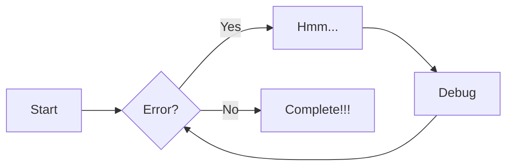
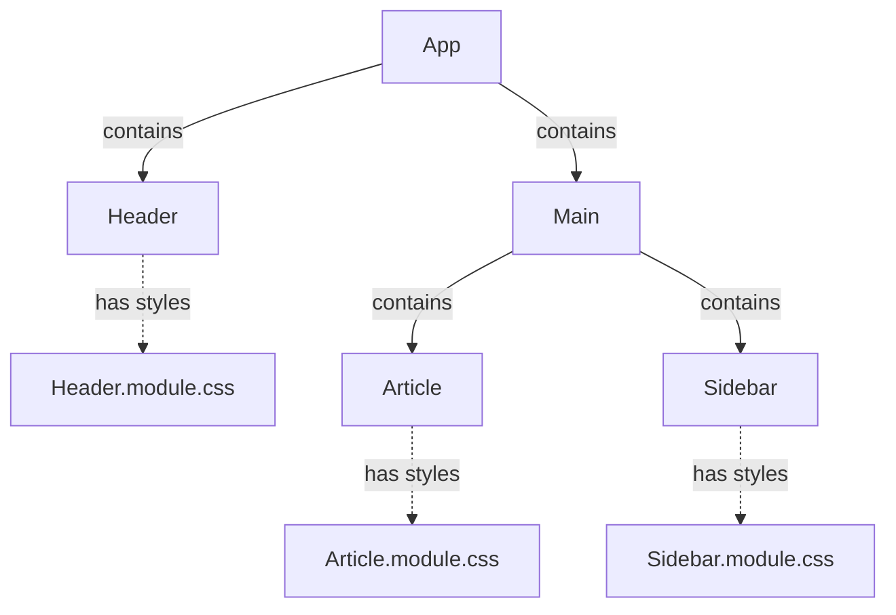
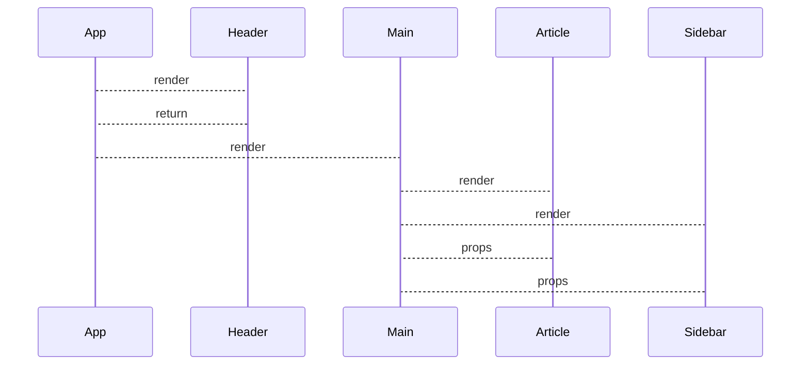

## 導入方法
```terminal
python -m venv .venv
.venv\scripts\activate
pip install mkdocs
pip install mkdocs-material
```
## サーバ立ち上げ
```
mkdocs serve
※デフォルトの場合、localhost:8000で閲覧可能
```

## html変換
```
mkdocs build
```

## プロジェクト立ち上げ
```
mkdocs new <your-project-name>
```

## ドキュメントの構成を変えたい場合
```
・mkdocs.ymlに記載する
・indentがそろっていないとうまくいかないので注意
```

## 詳細ブロック

!!! Note
    これはノートです。

!!! Tip
    ヒントです。

!!! Warning
    警告だよ

!!! Danger
    危険！

!!! Success
    成功例

!!! Failure
    失敗例

!!! Bug
    バグです

!!! Summary
    概要です

## 折り畳み詳細ブロック

??? Note
    詳細ブロックのノートです。
    折りたためます
    ```yml
    markdown_extensions:
        - pymdownx.superfences
    ```

## 注釈
Mkdocsは静的サイトジェネレータです。
コンテンツは基本的に markdown[^1] 形式で記述したソースファイルになります

[^1]: 文書を記述するための軽量マークアップ言語の1つ。拡張子は.md


## mermaid例


## tasklist
- [x] mermaidの例について調べる
- [ ] tasklistの例について書く
    * [x] custom_checkboxは見た目関連
    * [ ] clickable_checkboxはクリックでの切り替え
- [ ] 未定

## タブ

=== "Unordered list"

    * neko
    * inu
    * nezumi

=== "Ordered list"
    1. neko
    2. inu
    3. nezumi

!!! example

    === "Unordered List"

        ``` markdown
        * Sed sagittis eleifend rutrum
        * Donec vitae suscipit est
        * Nulla tempor lobortis orci
        ```

    === "Ordered List"

        ``` markdown
        1. Sed sagittis eleifend rutrum
        2. Donec vitae suscipit est
        3. Nulla tempor lobortis orci
        ```

## ボタン(要attr_list)
[登録 :smile:](#){ .md-button}

[送信 :fontawesome-solid-paper-plane:](#){ .md-button }

### 見出しのカスタマイズ
この下にコンテンツに関する文章を書きます。
拡張機能を使っているので、半角スペースなしで改行可能です。
通常は半角スペース${\times 2}$を行末につけない限り、改行されません。問題がある場合は、markdown_extentionsのnl2brを外してください

##　ハイライト

### コード中のハイライト

=== "Tab 1"

    Lorem ipsum dolor sit amet, (1) consectetur adipiscing elit.(2)
    { .annotate }

    1.  I'm an annotation!
    2.  annotation is god!

=== "Tab 2"

    Phasellus posuere in sem ut cursus (1)
    { .annotate }

    1.  I'm an annotation as well!

``` yaml
theme:
  features:
    - content.code.annotate #(1)
```

1.  a

```py
import numpy as np

def gcd(x,y): #(1)
    if y == 0:
        return x
    else:
        return gcd(y, x % y)

print(gcd(7,21))
```

1.  最大公約数`gcd`を求めるコード

### インラインハイライト
The `#!python range()` function is used to generate a sequence of numbers.

## 外部からのスニペット
```css
--8<--
docs/css/custom.css:test
--8<--
```

## テーブル
|   method |                          description |
| -------: | -----------------------------------: |
|    `GET` |      :material-check: Fetch resource |
|    `PUT` | :material-check-all: Update resource |
| `DELETE` |     :material-close: Delete resource |
|    `PUT` |                        unused method |
|   `PUSH` |                        unused method |

## Component図(mermaid)

## Sequence図(mermaid)


## 書式設定
Text can be {--deleted--} and replacement text {++added++}.
This can also combined into {~~one~> a single~~} operation. 
{==Highlighting==} is also possible {>>and comments can be added inline<<}
{==
block formatting highlight
==}

- This was {--deleted--}.
- This was {++added++}.
- This was ~~deleted~~.
- This was ^^inserted^^.
- This was ==highlighted==.
- tilde is H~2~O.
- caret is A^T^A.

- ++shift+ctrl+k++を押してください

## グリッド

### 簡単な例
<div class="grid cards" markdown>

- :fontawesome-brands-html5: __HTML__ for content and structure
- :fontawesome-brands-js: __JavaScript__ for interactivity
- :fontawesome-brands-css3: __CSS__ for text running out of boxes
 :fontawesome-brands-react: __React__ for development web-apps

</div>

### 複雑な例
<div class="grid cards" markdown>

-   :material-clock-fast:{ .lg .middle } __Set up in 5 minutes__

    ---

    Install [`mkdocs-material`](#) with [`pip`](#) and get up
    and running in minutes

    [:octicons-arrow-right-24: Getting started](#)

-   :fontawesome-brands-markdown:{ .lg .middle } __It's just Markdown__

    ---

    Focus on your content and generate a responsive and searchable static site

    [:octicons-arrow-right-24: Reference](#)

-   :material-format-font:{ .lg .middle } __Made to measure__

    ---

    Change the colors, fonts, language, icons, logo and more with a few lines

    [:octicons-arrow-right-24: Customization](#)

-   :material-scale-balance:{ .lg .middle } __Open Source, MIT__

    ---

    Material for MkDocs is licensed under MIT and available on [GitHub]

    [:octicons-arrow-right-24: License](#)

</div>

### cardとgridを混合した例
<div class="grid cards" markdown>

- :fontawesome-brands-html5: __HTML__ for content and structure
{.card}

- :fontawesome-brands-js: __JavaScript__ for interactivity
{.card}

- :fontawesome-brands-css3: __CSS__ for text running out of boxes
{.card}

> :fontawesome-brands-react: __React__ for development web-apps

</div>

### 汎用的なグリッド
<div class="grid" markdown>

=== "成功例"
    !!! Success
        成功例です
=== "失敗例"
    !!! Failure
        失敗例です

```c++
#include <bits/stdc++.h>

int main(){
    for(auto f: std::views::iota(16)){
        if(f % 15 == 0) std::cout << "fizzbuzz" << "\n";
        else if(f % 3 == 0) std::cout << "fizz" << "\n";
        else if(f % 5 == 0) std::cout << "buzz" << "\n";
        else std::cout << "-1" << "\n";
    }
    return 0;
}
```
</div>

## 画像
<!--alignを用いているのは古いブラウザに対応するため-->
=== "左表示"
    { align=left }
    This is React icon.
=== "右表示"
    { align=right }
    This is React icon.

## 数学

${\sum_{n=1}^{\infty}\frac{1}{n^2}=1+\frac{1}{2^2}+\frac{1}{3^2}+\dots}$