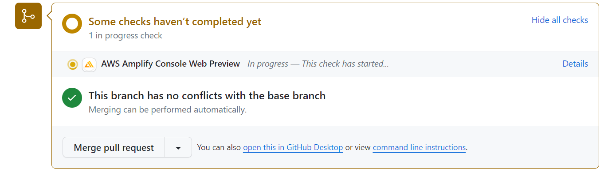
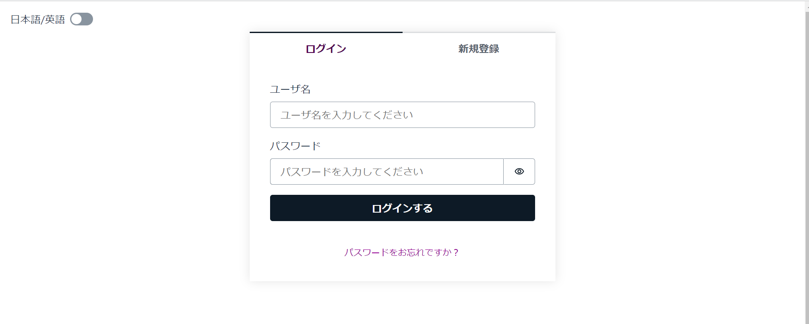

# Amplify + Reactアプリについて解説

## Q0 AWS Amplifyについて知っていますか?

??? success
    ### Amplifyについて

    ```text
    Amplify
      フロントエンド開発者や、モバイル開発者が
      AWS上で、フルスタックなアプリを簡単に接続、ホストできる
      ようにするための解決策

    対応しているアプリ
      iOS
      Android
      Flutter
      Web全般
      React Native
    
    以下の製品はすべて独立して動作する
      Amplify CLI
      Amplify Libraries
      Amplify Studio
      Amplify UI Component
      Amplify Hosting
    ```

## Q1 Amplify CLIについて知っていますか?

??? success

    ### Amplify CLIの概要
    ```text
    Amplify CLI
      ・Amplifyの開発者がプロジェクトを構築、デプロイ、管理
        するためのツール
      ・これを使うと、簡単にAWSリソース(APIや、DB、認証など)
        をセットアップして、アプリをデプロイ可能
    ```

    ### Amplify CLIの主な機能について知っていますか?
    
    ```text
    プロジェクトのセットアップ
      ・amplify initコマンド
      ・新しいAmplifyプロジェクトをセットアップする
      ・セットアップ時にコンソール上で、
      　プロジェクトの設定、使用言語
      　フレームワークなどを指定する。
    
    AWSリソースの追加
      ・amplify addコマンド
      ・プロジェクトに新しいAWSリソースを追加可能
      ・たとえばAPI, DB, 認証等のリソースを1つ1つ追加
      　していくとか
    
    ローカルでの開発とテスト
      ・amplify mockコマンド
      ・Amplifyアプリのローカルモックサーバを起動する
      ・AWSリソースにアクセスせずに、開発とデバッグ可能
    
    デプロイ
      ・amplify pushコマンド
      ・プロジェクトの変更をAWSクラウドにデプロイする
      ・このコマンドを実行すると、Amplifyによって
      　自動的にビルドされたリソース定義を使用し、
      　必要なAWSリソースがセットアップされる
    
    認証と認可
      ・amplify authコマンド
      ・ユーザ認証や認可のためのCognitoサービスをセットアップ
      ・簡単にユーザ認証の機能を追加可能
    
    バックエンドのリソースを確認
      ・amplify statusコマンド
      ・プロジェクトのバックエンドに設定された
      ・AWSリソースの状態を確認可能
      ・変更が必要なリソースの特定や、
      　修正や更新の際に使用する
    ```

    ### 注意点

    ```text
    amplify init等の実行位置
      ・Amplifyプロジェクトのルートディレクトリ
      ・Amplify CLIは特定のファイル構造や設定が前提
    ```

## Q2 Amplify Librariesについて知っていますか?

??? success
    ### Amplify Librariesの概要

    ```text
    Amplify Libraries
        ・AWSバックエンドと簡単に統合可能な
          クライアントアプリ（クライアントのブラウザから
          操作できるアプリ）用のライブラリ
    
    対応言語
      ・React,Vue,AngularなどのJSライブラリ
      ・IOS, Androidなどのモバイル
      ・React Native
      ・Flutter
    
    特徴
      使用場面に応じて直感的に実装可能
    ```

    ### Amplify Librariesの主な機能

    ```text
    Amplify Auth
      ユーザ認証や認可を実装するために使用
      SignIn, SignUp, PasswordReset等の機能を追加可能
      Cognitoをバックエンドとして、
      カスタム認証フローを設計可能
    
    Amplify API
      RESTやGraphQLなどのAPI通信を行うためのライブラリ
      バックエンドとのデータの受け渡しや操作に重宝する
    
    Amplify Storage
      ・ファイルのUpload, Download, ストレージの管理を行う
      ・Amazon S3との連携を提供し、ユーザのコンテンツを
      　Public/Privateなストレージで安全に管理する
    
    Amplify Analytics
      ・アプリケーションの使用状況をトラッキングする
      ・GA4と比べたとき、データがAWSのインフラ内に保存される
      　特徴がある。そのためデータの所有権は、
      　アカウント所有者に属する
      ・なお、データ解析面ではGA4に劣る。
      　従量課金制だし、通常はGA4の方がよさそう。
      ・ただしAuthと組み合わせて、認証されたユーザのみが
        トラッキングされるようにすることも可能
      ・ユーザーセッションや、より詳細なものを追跡したい場合
      　採用の余地はあるかも
    
    Amplify Authenticator
      ・最低限の実装でアプリに完全な認証フローを追加可能
      ・なお、この見た目を変えろという無理難題が来る模様
      ・おとなしく、Authを使うべきだと個人的には思う
    
    Amplify DataStore
      [オフライン]
      ・オフラインでアプリが動作しているときに、
      　ローカルデータベースに追加・更新・削除されたデータは
      　オンラインになったときにAppSyncと通信することで
      　クラウドに自動的に同期される
      ・ネットワーク接続が不安定な環境やオフライン状態で
        アプリを使用したいときに役立つ。
      
      [オンライン]
      ・AppSync GraphQL APIを使用し、
      　クラウド上のデータをリアルタイムに取得・更新する
      ・オンラインの状態でデータがAppSyncを介して更新されと、
      　DataStoreはアプリ内のローカルデータベースを
        自動で更新して同期する
      ・つまり、他のユーザが行った変更をリロード無しで反映可
      　チケットの残り枚数などをユーザに表示する際などに使用


    ```

## Q3 Amplify Studioについて知っていますか?

??? success
    ### Amplify Studioの概要

    ```text
    Amplify Studio
      ・AWS CLIの操作をビジュアルインターフェースで行う
      ・Amplify Studioで行われた変更は、amplify pullを
        を使うことで、CLIに反映可能
      ・CLIで行われた変更は、Studioで閲覧可能

      ・初心者に最適
      ・開発者であっても、特定のタスクをより容易に行うために
      　使用可能。リソースを直感的に管理可能
    ```

## Q4 Amplify UI Componentsについて知っていますか?

??? success
    ### Amplify UI Componentsの概要

    ```text
    Amplify UI Components
      ・見た目やユーザインターフェースの部分を担当
      ・一般的なUIパターンやコンポーネントを提供
      ・たとえば、認証フォームや、
      　ファイルアップロードコンポーネントなど
      ・UIレイヤーのみを担当しているので、実際の機能は
      　Amplify Librariesのモジュールが担当する

      ・Amplify Librariesを使用して
      　バックエンドの機能を実装し、
      　Amplify UI Componentsを使用して
        クライアント側で見やすく表示するという感じ
    ```

    ### Chakra UIと比べた際の利点

    ```text
    統合のしやすさ
      Amplifyと統合する際、機能を簡単にUIに組み込める
    事前構築済み
      Chakra UIと同じく、一般的なUIパターンやコンポーネントが
      事前に構築されているので、開発時間はあまり変わらない
    
    CLIとの統合
      Amplify CLIを使うことで、Amplify UI Componentsを
      プロジェクトに追加し、Amplify CLIを使用して
      簡単に設定やカスタマイズが可能
    ```

## Q5 Amplify Hostingについて知っていますか?

??? success
    ### Amplify Hostingの概要

    ```text
    Amplify Hosting
      ・CI/CDおよび手動デプロイによるホスティングに使われる
      　サービス
      ・CI/CDの場合、コードをCommitするたびに静的なウェブや
        SPA,およびSSR(サーバ側でレンダリングされたアプリ)、
        モバイルアプリを継続的にデプロイする
      ・フロントエンドが変更されても、
      　バックエンドが変更されても、デプロイは行われる。
      ・CodeCommit以外のリポジトリを使う場合なら、
        プルリクエストのプレビューが行える。
        これは、本番環境に影響を与えずに、プルリクエストの
        内容を反映した新しい環境を作成する優れものである
        なお、閉じるもしくはマージされると、この環境は
        自動的に消失する。
      ・SSL証明書付きのカスタムドメインを取得できる
    
    SPA
      ・MPA(Multi page application)は、
      　リンクやボタンのクリック時にサーバから新しいページを
        取得していた。
        ページ遷移の度に、HTMLがダウンロードされ、
        画面全体がリフレッシュされていたので、無駄があった
      
      ・SPA(Single page application)は、ページの読み込み時
      　に必要なデータ、リソースを一度に取得する
      　ページ内で変化させる必要のない部分は。再読み込みせず
      　変化させたい部分だけを更新する。
      　技術的にはReactなどの仮想DOMを使うのが一般的
        AjaxもSPAで動的なコンテンツを提供するために使用される
      
      ・一度読み込まれたコンテンツをキャッシュしているので、
      　一時的なネットワークの切断時にも、一部のコンテンツを
        使用できるという特徴もある
      
      ・デメリットとして、一度にすべての必要なリソースを
        DLするので、メモリ使用量が増加する
      ・CSR(クライアントサイドレンダリング)が行われ、
        JSがブラウザ側でレンダリングされるので、
        検索エンジンが正しくコンテンツを
        クロール（情報収集）できないという問題がある。


    ホスト
      ・ホストサーバ（ウェブサイトやアプリの
      　コンテンツを格納するサーバ）にファイルを配置する事
      ・通常の場合、ウェブサーバを実行しているコンピュータや
        クラウドに、ウェブページや画像、動画、スクリプト
        等のファイルを配置する
    ```

    ### Amplify Hostingの主な機能を知っていますか?

    ```text
    シンプルなデプロイ
      ・HTML/CSS/JS等を含んだソースコードを、ローカルから
        Amplify Hostingにデプロイすると、特定のURLにアクセス
        することで、全世界から閲覧可能になる
    
    スケーラブル
      ・AWSのグローバルなネットワークを利用しているので、
      　トラフィックの増加に対応可能
    
    HTTPとカスタムドメイン
      ・Amplify Hostingは自動的にSSL証明書を提供してくれる
      ・つまり、ウェブサイトはHTTPSで提供される
      ・カスタムドメインを設定して、ドメイン名を独自のものに
        することもできる
    
    CI/CDパイプライン
      ・CI/CDパイプラインは自動的に構築される
      ・コードの変更時、自動的にビルド、テスト、デプロイ可能
    
    ロールバック
      ・過去のバージョンにロールバックすることも容易
    ```

## Q6 バックエンドをReactアプリと統合する方法を知っていますか?

??? success
    ### Amplifyのチュートリアルドキュメントで学べること

    ```text
    ・バックエンドのセットアップ
    ・バックエンドをReactアプリと統合
    ・GraphQL APIを使用して、Todoアプリを作成
    ・クラウドデータベースにアイテムを保存、取得
    ・ユーザの認証
    ・APIとの通信
    ・継続的なデプロイとホスティングの設定方法
    ```

    ### GraphQLについて(RESTに比べた利点)

    ```text
    過剰なデータ取得を防止
      ・GraphQLはクエリによって、「必要なデータだけ」
      　を明示的に指定可能なので、データの帯域幅の節約や、
        パフォーマンス向上が期待できる
        また、複雑なクエリを処理できる
    
    複数のエンドポイントが不要
      ・単一のエンドポイントだけでいい
      ・そのため、情報を取得するために複数のリクエスト
        を送信する必要はない
      ・従ってクライアントとサーバ間の通信が単純化される
    
    柔軟なデータモデル
      ・サーバサイドの変更やデータベースのスキーマの変更時、
        フロントエンドの変更を最小限に抑えられる
    
    大規模開発
      ・上記の点から、Restよりも効果を発揮する

    ```

## Q7 Amplify CLIをインストールして、使い始めるまでの設定を理解していますか?

??? success
    ### AWSアカウントにサインアップ

    ```text
    アカウントを作れば問題ない
    ```

    ### NVMのインストール

    ```text
    node.jsのバージョンを分けてインストールできるようにする
    ```

    ```bash
    #今回は以下を使用
    $ nvm list

    * 20.11.0 (Currently using 64-bit executable)
      18.17.1
      17.3.1
    ```

    ### Amplify CLIのインストール

    ```text
    npm install -g @aws-amplify/cli
    ```

    ### Amplify CLIを設定する

    ```text
    1. ローカルマシンからAWSアカウントに接続する

    $ amplify configure
      Follow these steps to set up access to your AWS account:     

      Sign in to your AWS administrator account:
      https://console.aws.amazon.com/
      Press Enter to continue

      Specify the AWS Region
      ? region: ap-northeast-1
      Follow the instructions at
      https://docs.amplify.aws/cli/start/install/#configure-the-amplify-cli

      to complete the user creation in the AWS console
      https://console.aws.amazon.com/iamv2/home#/users/create      
      Press Enter to continue

      Enter the access key of the newly created user:
      ? accessKeyId:  ********************
      ? secretAccessKey:  **************************************** 
      This would update/create the AWS Profile in your local machine
      ? Profile Name:  tutorial

      Successfully set up the new user.

      ・このコマンドを実行すると、
      　既存のユーザの認証情報を持っていた場合でも
      　AWSのページが開き、IAMユーザを作成するよう求められる

      ・ユーザ名を入力し
      　「ポリシーを直接アタッチする」を選び
        「AdministratorAccess-Amplify」を選択
        問題がないことを確認したら「Create User」で作成する

      ・ユーザリストのページにリダイレクトされるので
        作成したユーザを選択する。
      
      ・「セキュリティ認証情報」タブに移動
      　「アクセスキー」セクション内の
        「アクセスキーの作成」を選択
      
      ・アクセスキーのような長い時間保持される認証情報は
        避けた方がいいよという警告を確認した上で
        使用目的として、「Command Line Interface」を選択
        代替手段についてみた上で、「Next」
      
      ・「アクセスキーの作成」を選択すると
        アクセスキーと、シークレットキーが表示されるので
        CSVとして保存するか、コピー。
        Amplify CLIに戻る

      ・コピーした値を、プロンプトに入力
      　Successfully set up the new user.
        となれば、ユーザは作成されている
        既存のユーザの認証情報を持っている場合、
        Profile Nameを違うものにする
    ```

    ### IAMロールを使う場合

    ```text
    AdministratorAccess-Amplify権限セットをロールに割り当て
    ~/.aws/configファイルにロールを設定する
    ```

    ```bash
    # ~/.aws/config

    [profile amplify-admin]
    role_arn = arn:aws:iam::123456789012:role/amplify-admin
    source_profile = amplify-user

    [profile amplify-user]
    region=ap-northeast-1
    output=json

    #outputは出力形式。jsonがデフォルト。
    #AWS CLIの出力に関係し、textやtableだとそうなる
    ```

## Q8 新しくReactアプリを作成するまでの流れが分かりますか?

??? success
    ### Viteでプロジェクトを作成する

    ```bash
    $ npm create vite@latest
    Need to install the following packages:
    create-vite@5.2.1
    Ok to proceed? (y) y
    √ Project name: ... react-amplified
    ? Select a framework: » - Use arrow-keys. Return to submit.
    >   Vanilla
    √ Select a framework: » React
    √ Select a variant: » JavaScript

    Scaffolding project in C:\amplify_test\react-amplified...

    Done. Now run:

      cd react-amplified
      npm install
      npm run dev
    
    $ cd react-amplified/
    $ npm install

    added 273 packages, and audited 274 packages in 14s

    98 packages are looking for funding
      run `npm fund` for details

    found 0 vulnerabilities

    $ npm run dev

    > react-amplified@0.0.0 dev
    > vite


      VITE v5.1.4  ready in 299 ms

      ➜  Local:   http://localhost:5173/
      ➜  Network: use --host to expose
      ➜  press h + enter to show help

    ```

    ### 補足（初期の依存関係）

    ```
    $ npm list
    ├── @types/react-dom@18.2.19
    ├── @types/react@18.2.60
    ├── @vitejs/plugin-react@4.2.1
    ├── eslint-plugin-react-hooks@4.6.0
    ├── eslint-plugin-react-refresh@0.4.5
    ├── eslint-plugin-react@7.33.2
    ├── eslint@8.57.0
    ├── react-dom@18.2.0
    ├── react@18.2.0
    └── vite@5.1.4

    ```

    ### Viteの特徴・利点

    ```text
    高速な開発サーバ
      ・開発時のリロードやホットリロード（サーバを立て直さ
        無くともコード内の変更が反映される）が高速。よって
        開発者の生産性が向上する
      ・これはESModuleをネイティブにサポートして、
      　モジュールをブラウザ側でなくサーバサイドで
        キャッシュすることで実現されている。

    効率的な本番ビルド
      ・ESModuleを使用してモジュールを解決する（静的な
      解決と非同期的な読み込みを行う）ので、
      CommonJS（動的な解決を行う）を用いる場合と比べて
      ビルドの起動時間が短縮され、開発プロセスが迅速に
    
      効率的なバンドル
        ESModuleを使用して、モジュールをまとめるので、
        不要なコードを含めない効率的なバンドルが行え
        生成されるバンドルサイズが小さくなるので
        ページの読み込み速度が向上する
      
      開発時にコードスプリットする
        ・コードを自動的にスプリットする
        　（小さなファイルに分ける）ので、不要なコードの
        　読み込み可能性が減る
      
      フレームワークに対する対応
        ・多くのフレームワークに対応済み

    Create-react-app(CRA)との比較
      ・CRAはreact-scriptsという古いパッケージを使っている
      　ので、非推奨
      ・CRAはコードベースが大きくなると、開発者サーバの
        立ち上げやホットリロードにかかる時間が多くなる
      ・REACT_APP_というプレフィックスで読み込んでいた
        環境変数は、`import.meta.env.VITE_`で参照可能。
        CRAがESModuleを使っていないことは、環境変数が
        `process.env.REACT_APP_`というプレフィックスである
        事からもわかる
    ```

## Q9. アプリで使用するバックエンド環境の初期設定を行う方法を知っていますか?

??? success
    ### amplify init概要

    ```text
    1. AWS Amplifyバックエンド環境を初期化する
    2. プロジェクトのルートにAmplifyの設定フォルダが生成
    3. ローカルでのAmplify CLIの設定が行われる
    ```

    ### 手順

    !!! warning
        - `Vite`を使う場合、配布フォルダは`dist`にすること(一敗)

    ```bash
    $ amplify init
    Note: It is recommended to run this command from the root of your app directory
    ? Enter a name for the project reactamplified
    The following configuration will be applied:

    # バックエンドの環境名や、ソース/配布フォルダ
    # ビルド時/サーバ立ち上げ時のコマンドを選択する。
    # ※win環境の場合、npm.cmd run-script build
    # dist!dist!dist!dist!dist!dist!dist!dist!dist!dist!
    ? Initialize the project with the above configuration? No
    ? Enter a name for the environment dev
    ? Choose your default editor: Visual Studio Code
    √ Choose the type of app that youre building · javascript    

    # Viteを使う場合、配布フォルダはdist
    Please tell us about your project
    ? What javascript framework are you using react
    ? Source Directory Path:  src
    ? Distribution Directory Path: dist
    ? Build Command:  npm run-script build
    ? Start Command: npm run-script start
    Using default provider  awscloudformation

    # 個別に入力するか、デフォルトでいいか
    ? Initialize the project with the above configuration? Yes
    Using default provider  awscloudformation

    # 認証方法。ここではAWS Profile(Q7で作った奴を
    # 使用した)
    ? Select the authentication method you want to use: AWS profile

    For more information on AWS Profiles, see:
    https://docs.aws.amazon.com/cli/latest/userguide/cli-configure-profiles.html

    ? Please choose the profile you want to use tutorial
    Adding backend environment dev to AWS Amplify app: <App_id>

    # デプロイに必要なAWSのリソース
    # 詳細は後述
    Deployment completed.
    Deployed root stack reactamplified [ ===================================
            amplify-reactamplified-dev-…   AWS::CloudFormation::Stack     CREATE_CO
            AuthRole                       AWS::IAM::Role                 CREATE_CO
            DeploymentBucket               AWS::S3::Bucket                CREATE_CO
            UnauthRole                     AWS::IAM::Role                 CREATE_CO

    # Amplify CLIの改善に貢献したいか
    √ Help improve Amplify CLI by sharing non-sensitive project configurations on failures (y/N) · no


        You can always opt-in by running "amplify configure --share-project-config-on"
    Deployment state saved successfully.
    ✔ Initialized provider successfully.
    ✅ Initialized your environment successfully.
    ✅ Your project has been successfully initialized and connected to the cloud!
    Some next steps:

    # 次にできることが書かれている
    "amplify status" will show you what you've added already and if it's locally configured or deployed
    "amplify add <category>" will allow you to add features like user login or a backend API
    "amplify push" will build all your local backend resources and provision it in the cloud
    "amplify console" to open the Amplify Console and view your project status
    "amplify publish" will build all your local backend and frontend resources (if you have hosting category added) and provision it in the cloud


    Pro tip:
    Try "amplify add api" to create a backend API and then "amplify push" to deploy everything

    ```

    ### デプロイに必要なリソースについて

    ```text
    Deployed root stack reactamplified [ ===================================
                amplify-reactamplified-dev-…   AWS::CloudFormation::Stack     CREATE_CO
                AuthRole                       AWS::IAM::Role                 CREATE_CO
                DeploymentBucket               AWS::S3::Bucket                CREATE_CO
                UnauthRole                     AWS::IAM::Role                 CREATE_CO

    ・amplify initを実行すると、自動的に設定される
    
    CloudFormationスタック
      ・CloudFormationは構築するAWSのリソースを
        YAML/JSON等の形で記述する。
      ・そして、それをもとに、リソースを自動的に構築する

      ・構築するAWSのリソースはコードとして記述されるので
        該当コードを利用すれば、どのアカウントでも
        同じリソースが構築できる。

      ・Amplifyはバックエンドのリソース（たとえばDB）を
        AWSクラウド上にデプロイするためにCloudFormationを
        利用する。
        
      ・リソースをAWSクラウド上にデプロイするわけ
          ・AWSクラウド上に展開されることで、
          ・フロント側やその他のアプリからバックエンドの機能
          　にアクセスできるようになる。
          ・実際にリソースにアクセスする場合は、
            REST APIやGraphQLなどのAPIが利用され、
            エンドポイントを通じてデータをフェッチする
        
      ・ブランチを分けた場合など、各開発環境は通常
        異なるバックエンドリソースを持っているので、
        それぞれに対してCloudFormationは作成される

      ・なお、このスタックはAmplify CLIを使用して
        管理、書き換えることができる。
        ⇒直接yamlを書き換えることもできなくはないはず
    
    AuthRole
      。認証に関連するリソースへのアクセス権を持つIAMロール
    
    DeploymentBucket
      ・デプロイされたリソースを保存するためのS3バケット
      ・Amplifyプロジェクトのデプロイに利用される
    
    UnauthRole
      ・認証されていないユーザへのアクセス権を持つIAMロール
    ```

    ### CloudFormation Stackの保存位置

    ```text
    amplify/backend/awscloudformation/build/root-cloudformation-stack.json
    ```

    ### amplifyconfiguration.jsonについて

    ```text
    ・Amplifyで作成したサービスの構成をすべて保持している
    ・src/の中に存在
    ・バックエンドのリソースに接続するために必要な情報を
      取得する際に使う
    ```

## Q10. プロジェクト内でAmplify Librariesの機能を使うための方法を知っていますか?

??? success
    ### aws-amplifyのinstall

    ```text
    npm install aws-amplify
      ・aws-maplifyパッケージをインストールする
      ・プロジェクト内でAmplify Librariesを使うために必要
      ・なお、Amplify Librariesの初期設定を行う際は、
        AWSサービス(たとえばCognitoやAppSync等)の
        エンドポイントや認証情報を、`Amplify.configure`に
        渡す必要がある。
    ```

    !!! warning
        ### 統合について
        - `AWS Amplify`のv6から`Amplify Libraries`の機能が`aws-amplify`パッケージに統合された
        - 以前はたとえば、`Amplify storage`の機能を使いたい場合、`aws-amplify/storage`から`import`を行っていた。以前に、`@aws-amplify`名前空間のパッケージを依存関係としてリストしていた場合は、依存関係の重複を避けるために、それらを削除する必要がある。
        - 統合により、開発者は一元的な方法で`Libraries`の機能を使えるようになり、またバンドルサイズの削減などにもこれは役立っている。

    ### 現在の依存関係

    ```text
    $ npm list
    react-amplified@0.0.0 C:\amplify_test\react-amplified
    ├── @types/react-dom@18.2.19
    ├── @types/react@18.2.60
    ├── @vitejs/plugin-react@4.2.1
    ├── aws-amplify@6.0.18
    ├── eslint-plugin-react-hooks@4.6.0
    ├── eslint-plugin-react-refresh@0.4.5
    ├── eslint-plugin-react@7.33.2
    ├── eslint@8.57.0
    ├── react-dom@18.2.0
    ├── react@18.2.0
    └── vite@5.1.4
    ```

## Q11. アプリとバックエンドリソースを対話させるために必要な、フロント側に記載する設定について知っていますか?

??? success

    ### importするだけ

    ```jsx
    import { Amplify } from 'aws-amplify';
    import amplifyconfig from "./amplifyconfiguration.json";
    Amplify.configure(amplifyconfig);
    ```

    ### 説明

    ```text
    ・amplifyconfiguration.jsonには
    　バックエンドのリソースに接続するために必要な情報が
    　記載されている。
    ・この情報を、Amplify.configureの引数として渡すことで、
    　バックエンドとの接続が可能となる
    ```

    ### ここまでの流れ

    ```text
    ・AWSアカウントにSignUp
    ・nvm(npm)のinstall
    ・Amplify CLIのインストール
    ・Amplify CLIに認証情報追加
    ・Viteで新しいReactプロジェクトを作成
    ・バックエンド環境の初期設定(amplify init)
    ・Amplify Librariesの機能を使えるように
    ・バックエンド環境への認証情報をMainのコードに追加
    ```

## Q12 APIとデータベースをアプリに接続する方法を知っていますか?(リソース変更・反映の方法についても)

??? success
    ### 行うこと

    ```text
    GraphQL APIをアプリに追加
    (Amazon DynamoDBをアプリに追加)
    ```

    ### GraphQL APIについて

    ```text
    GraphQL APIについて
      ・AWS AppSyncというサービスを利用して実装する
      ・AppSyncは、GraphQLをベースにしており、
        マネージドサービスとしてGraphQL APIを提供し、
        データの取得、操作、リアルタイムデータの反映等を行う
    
    AWS AppSyncについて
      ・AppSyncはGraphQLのスキーマを定義し、それに基づき
      　GraphQL APIを提供する
      ・GraphQLスキーマは、データのtype,query,mutation(更新)
        等の操作を定義する
      ・AppSyncはGraphQLのクエリを受け取って、データソース
        からデータを取得、要求に応じて処理を行う
    
    AppSyncと統合できるデータソース
      ・DynamoDB, RDS, Lambda, HTTPエンドポイント等
      ・GraphQLスキーマのリゾルバを使用して、上記の
        データソースとの間でデータの変換や結合を行う
    
    AppSyncのリアルタイム性
      ・DataStoreの時にも上げたが、AppSyncはリアルタイム
        データのサポートを提供する
      ・そのためリアルタイムでデータの変更を受信可能
    
    AppSyncの認証について
      ・AppSyncは認証機能を提供するので、ユーザごとに
      　GraphQL APIへの異なるアクセス権を設定できる
      ・たとえばこの人は、変更不可とか

    ```

    !!! warning

        ### APIとしてRESTを使いたい場合は?

        ```text
        ・`Amazon API Gateway`を使う
        ・`API Gateway`を使うことで、
        　`RESTful`スタイルのエンドポイントを構築可能
        ・また、エンドポイントに対するリクエストを処理する
          バックエンドサービスも統合できる
        ```
    
    ### GraphQL APIをアプリに追加する手順

    ```text
    [行うこと]
    ・使うサービスとしてgraphqlの方を選択
    ・templateのスキーマを受け入れる
    ```

    ```bash
    # デフォルトの選択肢に従う
    $ amplify add api
    ? Select from one of the below mentioned services:
      GraphQL
    ? Here is the GraphQL API that we will create.
      Select a setting to edit or continue :
      Continue
    ? Choose a schema template: 
      Single object with fields (e.g., “Todo” with ID
      , name, description)

    ⚠️  WARNING: your GraphQL API currently allows 
    public create, read, update,, and delete access 
    to all models via an API Key. 
    To configure PRODUCTION-READY authorization rules, 
    review: https://docs.amplify.aws/cli/graphql/authorization-rules

    ✅ GraphQL schema compiled successfully.

    Edit your schema at
     C:\amplify_test\react-amplified\amplify\backend\api\reactamplified\schema.graphql 
     or place .graphql files in a directory at 
     C:\amplify_test\react-amplified\amplify\backend\api\reactamplified\schema  
    "amplify push" will build all your local backend resources and provision it in the cloud
    "amplify publish" will build all your local backend and frontend resources (if you have hosting category added) and provision it in the cloud
    ```

    ### 現在の状態について調べる

    ```text
    $ amplify status

        Current Environment: dev

    ┌──────────┬────────────────┬───────────┬───────────────────┐
    │ Category │ Resource name  │ Operation │ Provider plugin   │
    ├──────────┼────────────────┼───────────┼───────────────────┤
    │ Api      │ reactamplified │ Create    │ awscloudformation │
    └──────────┴────────────────┴───────────┴───────────────────┘

    GraphQL transformer version: 2
    ```

    ### pushする

    ```text
    [行うこと]
    ・ローカルで変更した内容（今回はアプリの追加）を
      AWSクラウドにデプロイされているバックエンド環境へ反映
    ```

    ```bash
    $ amplify push
    - Fetching updates to backend environment: 
      dev from the cloud.- 
      Building resource api/reactamplified

      ###ここに警告が表示される###

    / Fetching updates to backend environment: 
      dev from the cloud.
      ✅ GraphQL schema compiled successfully.

    Edit your schema at 
    C:\amplify_test\react-amplified\amplify\backend\api\reactamplified\schema.graphql 
    or place .graphql files in a directory at 
    C:\amplify_test\react-amplified\amplify\backend\api\reactamplified\schema     

    ✔ Successfully pulled backend environment 
       dev from the cloud.
    - Building resource api/reactamplified


    \ Building resource api/reactamplified
    ✅ GraphQL schema compiled successfully.   

        Current Environment: dev

    ┌──────────┬────────────────┬───────────┬───────────────────┐
    │ Category │ Resource name  │ Operation │ Provider plugin   │
    ├──────────┼────────────────┼───────────┼───────────────────┤
    │ Api      │ reactamplified │ Create    │ awscloudformation │
    └──────────┴────────────────┴───────────┴───────────────────┘
    
    √ Are you sure you want to continue? (Y/n) · yes
    ✅ GraphQL schema compiled successfully.
      
    - Building resource api/reactamplified

    \ Building resource api/reactamplified
    ✅ GraphQL schema compiled successfully.
     
    ? Do you want to generate code for your 
      newly created GraphQL API:
      Yes      
    ? Choose the code generation language targe:
       javascript
    ? Enter the file name pattern of graphql queries,     
      mutations and subscriptions:
      src/graphql/**/*.js
    ? Do you want to generate/update 
      all possible GraphQL operations - queries,
      mutations and subscriptions:
        Yes
    ? Enter maximum statement depth 
      [increase from default if your schema 
      is deeply nested]:
        2

    Deployment completed.
    Deploying root stack reactamplified [ ====================-------
            amplify-reactamplified-dev-…   AWS::CloudFormation::Stack     UP   
            apireactamplified              AWS::CloudFormation::Stack     CR   
    Deployed api reactamplified [ ===================================
            GraphQLAPI                     AWS::AppSync::GraphQLApi       CR   
            GraphQLAPIDefaultApiKey******… AWS::AppSync::ApiKey           CR   
            GraphQLAPINONEDS*******…       AWS::AppSync::DataSource       CR   
            GraphQLAPITransformerSchema**… AWS::AppSync::GraphQLSchema    CR   
            Todo                           AWS::CloudFormation::Stack     CR   

    GraphQL endpoint:<ここにendpointが表示される>
    GraphQL API KEY: <ここにAPIキーが表示される>

    GraphQL transformer version: 2
    ```

    ### 改めて現在の状態

    ```text
    $ amplify status

        Current Environment: dev
        
    ┌──────────┬────────────────┬───────────┬───────────────────┐
    │ Category │ Resource name  │ Operation │ Provider plugin   │
    ├──────────┼────────────────┼───────────┼───────────────────┤
    │ Api      │ reactamplified │ No Change │ awscloudformation │
    └──────────┴────────────────┴───────────┴───────────────────┘

    GraphQL endpoint:<ここにendpointが表示される>
    GraphQL API KEY: <ここにAPIキーが表示される>

    GraphQL transformer version: 2
    ```

    ### 補足(リソースの変更とコマンドについて)

    ```text
    ・バックエンドの初期設定の項で、cloudFormation stack
    　の保存位置について述べた。
    ・今回は、root-cloudformation-stack.json
      に保存されているとする

    AWS CloudFormationスタックファイル
      ・AWS CLIが（ローカルの）バックエンド環境の構成情報を
      　管理するために使用する
      ・つまり、amplify add, amplify update, 
        amplify removeを実行する際に、生成更新される
    
    amplify add
      ・新しいリソースを（ローカルに）追加
      ・CloudFormationスタックに、新しいリソースの定義追加
      ・よって、root-cloudformation-stack.jsonが更新される
    
    amplify update
      ・既存のリソースを更新
      ・CloudFormationスタックに、変更内容が反映
      ・よって、root-cloudformation-stack.jsonが更新される

    amplify remove
      ・リソースの削除
      ・Cloudformationスタックから、リソース定義が削除
      ・よって、root-cloudformation-stack.jsonが書き換わる
    
    amplify push
      ・root-cloudformation-stack.jsonを参照する
      ・現在の、Amplifyバックエンド環境との差分を比較する
      ・必要に応じて、バックエンド環境に、変更内容を反映
      ・バックエンド環境の更新完了！

    amplify status
      ・ローカルのプロジェクトとAWSクラウド上の
      　Amplifyバックエンド環境との間の差分を表示する
      ・Operationカラムには各リソースの状態が表示される
      ・Create:ローカルで新しいリソース作成が行われた
      ・Update:ローカルでリソースが変更された
      ・Delete:ローカルでリソースが削除された
      ・No Change: 一致しているので、pushの必要性はない

      ※ローカルでの変更が自動的にAmplifyバックエンド環境
      　に反映されないのは、セキュリティと複数人での管理
      　という観点から重要
    ```

    ### Dynamodbについて

    ```text
    ・amplify add apiでAPIを追加し、
    　amplify pushでバックエンド環境に変更を反映すると、
    　DynamoDBテーブルが作成される

    ・Dynamodbテーブルは、
    　Amplify APIの設定に従い自動的に作成されるが
    　そのスキーマは、GraphQL APIの場合、
      schema.graphqlファイルに定義された
      モデルとフィールドである。
      ※定義がどのように反映されているかについては後記
    ```

    ### AWSコンソールでデプロイされたAPIを確認する

    ```text
    amplify console api

    ⇒AWS AppSyncのクエリタブが開く
    ⇒クエリタブでは、
    　GraphQLクエリを作成、検証、およびテスト可能。

    amplify console
    ⇒アプリの現在環境の詳細ページが開く
    ⇒このAppタブのテーブルから、
    　Dynamodbのテーブルを見ることも可能。
    ```


## Q13 フロントエンドをAPIに接続する方法を知っていますか?

??? success

    ### 行うこと

    ```text
    Reactアプリに
    Todoを作成するためのボタンと、
    Todoの一覧をレンダリングするフォームを追加する
    ```

    ### 書き換えられたApp.jsxのコードと解説

    ```jsx
    import { useEffect, useState } from "react";

    import { generateClient } from "aws-amplify/api";

    import { createTodo } from "./graphql/mutations";
    import { listTodos } from "./graphql/queries";

    const initialState = { name: "", description: "" };
    const client = generateClient();

    const App = () => {
      const [formState, setFormState] = useState(initialState);
      const [todos, setTodos] = useState([]);

      /*
      []なのでレンダリングに依存してフックが呼ばれる
      */
      useEffect(() => {
        fetchTodos();
      }, []);

      /*
      setInput
        フィールドの中身が変更されるたびに
        eventが発火し、formStateの
        対応したフィールドの状態を変更させる
      */
      function setInput(key, value) {
        setFormState({ ...formState, [key]: value });
      }

      /*
      fetchTodos
        generateClient()によって作成されたAmplify API
        クライアントを使用して、listTodosクエリで
        AppSync GraphQL APIを呼び出す
        データが返されると、items配列がsetTodos関数に渡され
        ローカルの状態が更新される

        ・なお、graphqlの実行結果は、dataプロパティの中に
          含まれている
        ・指定できるクエリについては、
          graphQLフォルダを見ると、
        　実行可能なクエリ一覧が書かれている
        ・今回の場合、queriesの中では
        　getTodoとlistTodosのクエリが行える
      */
      async function fetchTodos() {
        try {
          const todoData = await client.graphql({
            query: listTodos
          });
          const todos = todoData.data.listTodos.items;
          setTodos(todos);
        } catch (err) {
          console.log("error fetching todos");
        }
      }

      /*
      addTodo
      ・generateClient()によって作成されたAmplify API
        クライアントを使用して、createTodo mutationで
        Amplify APIクライアントを呼び出す
        listTodosとの違いは、createTodoがmutation.jsに
        書かれており、mutation(変更に使う)に
        必要な変数を含む引数を受け取ること
      ・今回の場合、nameとdescriptionフィールドしか指定
        していないが、他のフィールドはサーバ側で
        適切なデフォルト値が指定されている
      */
      async function addTodo() {
        try {
          if (!formState.name || !formState.description) return
          const todo = { ...formState };
          setTodos([...todos, todo]);
          setFormState(initialState); //formをまた空に

          await client.graphql({
            query: createTodo,
            variables: {
              input: todo
            }
          });
        } catch (err) {
          console.log("error creating todo:", err);
        }
      }

      return (
        <div style={styles.container}>
          <h2>Amplify Todos</h2>
          <input
            onChange={(event) => setInput("name", event.target.value)}
            style={styles.input}
            value={formState.name}
            placeholder="Name"
          />
          <input
            onChange={(event) => setInput("description", event.target.value)}
            style={styles.input}
            value={formState.description}
            placeholder="Description"
          />
          <button style={styles.button} onClick={addTodo}>
            Create Todo
          </button>
          {/*todoリストを表示。keyとしてidを使う*/}
          {todos.map((todo, index) => (
            <div key={todo.id ? todo.id : index} styles={styles.todo}>
              <p style={styles.todoName}>{todo.name}</p>
              <p style={styles.todoDescription}>{todo.description}</p>
            </div>
          ))}
        </div>
      );
    };

    /*
    style要素
    */
    const styles = {
      container: {
        width: 400,
        margin: '0 auto',
        display: 'flex',
        flexDirection: 'column',
        justifyContent: 'center',
        padding: 20
      },
      todo: { marginBottom: 15 },
      input: {
        border: 'none',
        backgroundColor: '#ddd',
        marginBottom: 10,
        padding: 8,
        fontSize: 18
      },
      todoName: { fontSize: 20, fontWeight: 'bold' },
      todoDescription: { marginBottom: 0 },
      button: {
        backgroundColor: 'black',
        color: 'white',
        outline: 'none',
        fontSize: 18,
        padding: '12px 0px'
      }
    };

    export default App;
    ```

    ### ローカルで実行する

    ```text
    npm run dev
      ⇒ローカルでアプリが実行される
    
    適当な名前と詳細を書き、Create Todoボタンを押す
      ⇒addTodo関数が呼ばれる
      ⇒Amplify APIクライアントが
      　createTodoミューテーションを実行
      ⇒DynamoDBのテーブルに、該当データが追加
      ⇒todosやformStateの状態が変わるので再レンダリング
      ⇒再レンダリング時にfetchTodos関数が呼ばれる
      ⇒Amoplify APIクライアントがlistTodoクエリを実行
      ⇒DynamoDBのテーブルからデータをフェッチ
      ⇒表示される
    ```

## Q14 認証機能をアプリに追加する方法を知っていますか?

??? success
    ### Amplifyが使う認証プロバイダ = Cognito

    ```text
    プロバイダ(Provider)
      ・何らかのサービスを提供する事業者
    
    Amazon Cognito
      ・ユーザ登録、認証、アカウント回復などの操作を処理する
      　堅牢なサービス
    ```

    ### アプリに認証機能を追加する

    ```bash
    $ amplify add auth

    Using service: Cognito, provided by: awscloudformation

    The current configured provider is Amazon Cognito.

    # プロンプトに答える
    Do you want to use the default authentication 
    and security configuration? :
      Default configuration
    Warning: you will not be able to edit these selections.

    How do you want users to be able to sign in?:
      Username
    Do you want to configure advanced settings?:
      No, I am done.
    ✅ Successfully added auth resource reactamplified******** locally

    # pushする
    $ amplify push
    / Fetching updates to backend environment: 
      dev from the cloud.- 
      Building resource api/reactamplified

        Current Environment: dev

    ┌──────────┬────────────────────────┬───────────┬───────────────────┐      
    │ Category │ Resource name          │ Operation │ Provider plugin   │      
    ├──────────┼────────────────────────┼───────────┼───────────────────┤      
    │ Auth     │ reactamplified******** │ Create    │ awscloudformation │      
    ├──────────┼────────────────────────┼───────────┼───────────────────┤      
    │ Api      │ reactamplified         │ No Change │ awscloudformation │      
    └──────────┴────────────────────────┴───────────┴───────────────────┘      
    √ Are you sure you want to continue? (Y/n) · yes

    Deployment completed.
    Deployed root stack reactamplified [ ============================
            amplify-reactamplified-dev-**… AWS::CloudFormation::Stack     UP   
            apireactamplified              AWS::CloudFormation::Stack     UP   
            authreactamplified********     AWS::CloudFormation::Stack     CR   
    Deployed auth reactamplified******** [ ==========================
            UserPoolClientRole             AWS::IAM::Role                 CR   
            UserPool                       AWS::Cognito::UserPool         CR   
            UserPoolClient                 AWS::Cognito::UserPoolClient   CR   
            UserPoolClientWeb              AWS::Cognito::UserPoolClient   CR   
            IdentityPool                   AWS::Cognito::IdentityPool     CR   
            IdentityPoolRoleMap            AWS::Cognito::IdentityPoolRol… CR   

    Deployment state saved successfully.

    GraphQL transformer version: 2
    ```

    ### 行ったこと

    ```text
    ・Cognitoをアプリに追加
    ・その際、認証情報としてusernameを選択した
    ```

## Q15 ログインUIを作成する方法を知っていますか?

??? success
    ### 概要

    ```text
    ・Amplify UIを使う
    ・Amplify UIの、Authenticatorコンポーネントを使うと
      amplifyconfiguration.json(バックエンドのリソースに
      接続するために必要な情報を保持している)で指定した
      設定を使って認証フロー全体を提供可能
    ```

    ### Amplify UI (Components)をインストールする

    ```text
    npm install @aws-amplify/ui-react
    ⇒Librariesの一部ではないので、個別にインストールが必要
    ```

    ### App.jsxにAmplify UI Authenticatorを追加する

    ```jsx
    //以下をimport
    import { withAuthenticator, Button, Heading } from '@aws-amplify/ui-react';
    import '@aws-amplify/ui-react/styles.css';
    ```

    ```jsx
    //AppをAmplify UIコンポーネントからimportした
    //withAuthenticatorでラップする
    //default importなので、main側を直す必要はない
    export default withAuthenticator(App);
    ```

    ```jsx
    //Appに引数を追加
    const App = ({ signOut, user }) => {
      // ...
    };
    ```

    ```jsx
    //レンダリングの先頭にSignOut用のボタン等を追加
    //Headingのlevelはh1 ~ h6に対応している
    return (
      <div style={styles.container}>
        <Heading level={1}>Hello {user.username}</Heading>
        <Button onClick={signOut}>Sign out</Button>
        <h2>Amplify Todos</h2>
        ...
      </div>
    );
    ```

    ### 結果

    ```text
    ・SignUp機能
      username + passwordに加え、パスワード再設定や
      検証に用いる、emailを指定する

    ・SignIn機能
      amplify add authの初期設定で認証にusernameを指定した
      ので、username + passwordが指定される
    
    ・passwordReset
      Usernameを入力すると、パスワード再設定可能
    
    ・SignOut
      ボタンに対応して、signOut
    
    ・保存される箇所
      amplify console authで
      ユーザの情報を見ることができる。
      また、認証済みのemailについても閲覧可能

    ```

    ### withAuthenticatorについて

    ```text
    withAuthenticator
      ・HOC(higher order component)つまり、高階Component
      　の一種。
      ・HOCは、コンポーネントを受け取って、
      　新規のコンポーネントを返す
      ・HOCは元のコンポーネントを単にラップするので、
      　内部のデータが渡される方法や理由には関心を持たない。
        また、内部のコンポーネントは、データがどこからやって
        来たかについて関心を持たない
      ・だから、const App = ({signOut, user})が成立する
    ```

    ### カスタム認証フローを構築するには?

    ```text
    ・コンポーネントをカスタマイズして、
      フィールドの追加、削除、スタイルの更新
      関数呼び出しのオーバーライドを行うことも可能

    ・また、AmplifyのAuthパッケージには、
      signUp, signIn, forgotPassword, signOutなどの
      メソッドがあるため、これを用いて、ユーザ認証フローの
      全ての側面を制御可能
    ```

    ### 補足（他のhtmlタグもAmplify UIコンポーネントに）

    ```text
    Buttonはbutton
    Viewはdiv
    Textはp
    TextFieldはinput
    にそれぞれ対応する

    ただし、TextFieldはvalueが
    defaultValueになっていることに注意

    ※使う利点
      ・Amplify UI Componentsは単なるHTML要素よりも
      　多くの機能を提供している。
      ・また、統一されたデザインが使用できるという利点もある
      ・Amplifyの他の機能と統合しやすいという利点もある
    ```

## Q16 アプリを手動でデプロイする方法を知っていますか?

??? success
    ### 手動デプロイについて(Amplify Hostingを利用)

    ```text
    amplify add hosting
      ・Hostingリソースをローカルに追加する

      ・継続的デプロイを行うか、
      　コードが変更されるたびに手動デプロイを行うか
      　選択可能
      ・デプロイタイプを変えたい場合、
        amplify remove hostingで一度削除してから
        amplify add hostingで加える必要がある
      ・今回は簡単のため、手動デプロイを選択した
      
      ? Choose a type
       　Continuous deployment (Git-based deployments)
      ❯  Manual deployment
    ```

    ### 実際のコード(Hosting追加まで)

    ```text
    $ amplify add hosting
    √ Select the plugin module to execute:
      Hosting with Amplify Console 
      (Managed hosting with custom domains, 
      Continuous deployment)

    ? Choose a type:
      Manual deployment

    You can now publish your app using the following command:

    Command: amplify publish
    ```

    ### publishまで

    ```text
    amplify publish
      ・ローカルにおける変更内容を
      　Amplifyホスティング環境にデプロイする
      ・CI/CDパイプラインを敷いている場合、
        使う機会は少ないかもしれない

    amplify publishが行う操作
      1 amplify pushでバックエンドリソースの更新
      ⇒これは今回、amplify addの後で、pushを個別で
        行う必要がなかった理由でもある。
      2 フロントエンドアプリのビルド(npm run buildなど)
      3 デプロイメントバケット(今回の場合s3)への
        コンテンツのアップロード
      4 cloudFrontを用いて、S3にアップロードしたコンテンツ
        をユーザのリクエストに従って配信している
        (キャッシュやレイテンシ、料金の関係でサーバを常に
        立てているよりパフォーマンス面で優れている)
    
    ・デプロイが完了すると、表示されたURLに
      全世界からアクセスできるようになる
    ```

    ```text
    $ amplify publish
    | Fetching updates to backend environment: 
      dev from the cloud.
      - Building re/ Fetching updates to backend environment: 
        dev from the cloud.

    \ Building resource api/reactamplified✅ GraphQL schema compiled successfully.    
    ✔ Successfully pulled backend environment dev from the cloud.

        Current Environment: dev

    ┌──────────┬────────────────────────┬───────────┬───────────────────┐      
    │ Category │ Resource name          │ Operation │ Provider plugin   │      
    ├──────────┼────────────────────────┼───────────┼───────────────────┤      
    │ Hosting  │ amplifyhosting         │ Create    │ awscloudformation │      
    ├──────────┼────────────────────────┼───────────┼───────────────────┤      
    │ Api      │ reactamplified         │ No Change │ awscloudformation │      
    ├──────────┼────────────────────────┼───────────┼───────────────────┤      
    │ Auth     │ reactamplified******** │ No Change │ awscloudformation │      
    └──────────┴────────────────────────┴───────────┴───────────────────┘      
    √ Are you sure you want to continue? (Y/n) · yes

    Deploying root stack reactamplified [ =========================== 
            amplify-reactamplified-dev-**… AWS::CloudFormation::Stack     UP 
            hostingamplifyhosting          AWS::CloudFormation::Stack     CR      
            apireactamplified              AWS::CloudFormation::Stack     UP
            authreactamplifiedbdd971cd     AWS::CloudFormation::Stack     UP      
    Deployed hosting amplifyhosting [ ===============================
            AmplifyBranch                  
    AWS::Amplify::Branch           CR         

    ⠹ Deployment state saved successfully.   

    GraphQL transformer version: 2

    Publish started for amplifyhosting

    > react-amplified@0.0.0 build
    > vite build

    vite v5.1.4 building for production...
    ✓ 1675 modules transformed.
    dist/index.html                   0.46 kB │ gzip:   0.29 kB
    dist/assets/index-********.css  277.03 kB │ gzip:  26.45 kB
    dist/assets/index-********.js   675.81 kB │ gzip: 193.88 kB

    (!) Some chunks are larger than 500 kB after minification. Consider:
    - Using dynamic import() to code-split the application
    - Use build.rollupOptions.output.manualChunks to improve chunking: https://rollupjs.org/configuration-options/#output-manualchunks
    - Adjust chunk size limit for this warning via build.chunkSizeWarningLimit.   
    ✓ built in 5.47s
    ✔ Zipping artifacts completed.
    - ✔ Deployment complete!
    https://dev.************.amplifyapp.com
    ```

## Q17 プロジェクトの構成を変更したり、環境を削除する方法を知っていますか?

??? success
    
    !!! warning
        - 消したい場合以外は、使用しないように!!!

    ### プロジェクトを削除する

    ```text
    amplify delete
      ・プロジェクトのすべての環境をクラウドから削除
      ・Amplify CLIによって作成された
      　すべてのローカルファイルも削除する
    ```

    ### 環境を削除する

    ```text
    amplify env remove <環境名>
    ```

    ### 構成を変更する

    ```text
    amplify configure project
      ・プロジェクトの設定を変更したり、
      　AWSの認証情報を再設定したりする際に有用
      ・主に、amplify initステップ中に設定された
        AWS認証情報を再設定する際に使う
        ⇒たとえば配布ディレクトリを
        　build -> distに変えたいとか
    ```

## Q18 アプリを継続的にデプロイする方法を知っていますか?

??? success
    ### Hostingを削除する

    ```text
    amplify remove hosting
      デプロイ方法を変えるには、一度appを削除する必要がある
    
    amplify push
      AWSクラウドの方にも変更内容を反映
    ```

    ### gitリポジトリと接続する

    ```text
    amplify console
      ⇒devの環境が開く
    
    Hosting environmentsのタブを見る
      ⇒※✖マークが出ていたら、しばらく放置してからリロード
    
    おそらく、リポジトリを選ぶ画面が表示される
      ⇒今回はgithubを選択(自身のリポジトリに置き換える)
      ⇒認証を要求されるので、検証コードを打ち込む
      ⇒この際、すべてのリポジトリor特定のリポジトリのみに
        権限を与えることができる。今回は後者を選択
      ⇒
    ```

    ### フロントエンドのデプロイ設定を確認する

    ```yaml
    # 基本的にはデフォルトでいい
    # baseDirectoryがdistになっているかだけ注意
    version: 1
    backend:
      phases:
        build:
          commands:
            - '# Execute Amplify CLI with the helper script'
            - amplifyPush --simple
    frontend:
      phases:
        preBuild:
          commands:
            - npm ci
        build:
          commands:
            - npm run build
      artifacts:
        baseDirectory: dist
        files:
          - '**/*'
      cache:
        paths:
          - node_modules/**/*
    ```

    ### バックエンドのデプロイ設定を確認する

    ```text
    ・今回はreactamplifiedアプリのdevに接続した。
    ・また、CI/CDを許可する設定に✓をつけた
      ⇒該当リポジトリにコミットするごとに、デプロイされる
    ```

    ### Roleを確認する

    ```text
    ・既存のロールを選択した(詳細については工事中)
    ```

    ### デプロイされる

    ```text
    プロビジョニング
      ・ビルド環境をセットアップする
      ・セットアップは、4vCPU, 7GBメモリを備えた
        ホスト上のDockerイメージを使用して行われる
    
    ビルド
      ・Dockerコンテナにリポジトリのクローンを作成(だから
      　リポジトリと接続する必要があったんですね)
      ・バックエンドリソースをAWSクラウド上に配置
      ・フロントエンドのリソースをビルド
      ・という3つのステージで構成される
      ・フロントエンドのサイズが大きい場合、時間がかかる
    
    デプロイ
      ・すべてのリソースが、ホスティング環境にデプロイされる
      ・よって、ドメイン上でアプリを表示可能
      ・なお、ローカルでも引き続きアプリは表示可能
    ```

    ### 補足

    ```text
    ・今回は
      main(将来的なブランチ)
      dev(開発ブランチ)
      feature/1(機能改善用のブランチ)
      を用意し、devにCI/CDを敷いた
      そのため、devにpushすると、自動的にデプロイされる
      普段は、devから派生したブランチを使い、都度プルリクを
      出していく感じで行う。
    ```

    ### 補足(gitのブランチと、amplifyのenv)

    ```text
    ・たとえば別のブランチでバックエンドの機能を追加
    　したとする。この後、元のブランチに戻ってもaddした
      情報は残っている。
    ・これは、Amplify CLIが現在の環境(env)に基づいて動作
      するためである。

    $ amplify env list

    | Environments |
    | ------------ |
    | *dev         |

    ・現在のバックエンド環境はdevである。
    　そのためmainブランチからpushしようが、
      feature/1ブランチからpushしようが、バックエンドのdev
      が変更される。
    ・補足として、ブランチごとにバックエンドの環境
    　を独立させたい場合は既存の環境をクローンするか、
    　env addで新しい環境を追加するとよい
    ```

    ### 補足(build image)

    ```text
    ・現在のデフォルト(Amazon Linux2023)を利用している
    ・バージョンアップする場合は、都度切り替えておくこと
    ```

    ### リポジトリと接続した場合

    ```text
    Amplifyに以下の設定が表示されるようになる
      ・ドメイン管理
      ・ビルドの設定
      ・プレビュー
      ・通知
      ・環境変数
      ・アクセスコントロール
      ・モニタリング
      ・リライトとリダイレクト
      ・カスタムヘッダー
    ----------------------    
    
    ドメイン管理
      ・無料のHTTPS
      ・独自のカスタムドメインを使用できる
    
    ビルドの設定
      ・amplify.ymlを編集することで、アプリケーションの構築
        方法を指定可能
      ・リポジトリのルートにカスタムしたファイルを配置すると
        そちらが優先されるようになる
      ・Build images settingsは、構築イメージを選択する。
      　パッケージのバージョンを指定したい場合は、
      　ここに記載する
    
    プレビュー
      ・プルリクエストをマージする前に変更をプレビューできる
      ・たとえばdevで有効化すると、devにプルリクを投げた時に
        プレビューが利用可能
      ・ただし、codecommitの場合は使えない。糞
    
    通知
      ・構築が成功/失敗した時に送信されるemailを追加する
      ・画面を見つめながら待っている手間がなくなる
    
    環境変数
      ・ビルド時にアプリが必要とする環境変数を指定可能
      ・たとえば、ブランチごとに異なる環境を指定するとか

    アクセスコントロール
      ・ブランチへのアクセスを制限可能
      ・デフォルトの場合、パブリックに表示可能
    
    モニタリング
      ・リクエストやデータ転送などの情報を確認可能
    
    リライトとリダイレクト
      ・特定のURLから別のURLにジャンプさせたいときに利用する
    
    カスタムヘッダ
      ・HTTPレスポンスのヘッダーを指定できる
      ・デバッグやセキュリティ目的で使用
    ```

    ### ビルドをスキップしたい場合

    ```text
    コミットメッセージの最後に、skip-cdを含める
    ```

    ### 差分ベースについて

    ```
    AMPLIFY_DIFF_BACKEND
      この環境変数の値をtrueに設定すると、
      バックエンドの相違点が見つからない場合、
      バックエンドのビルドステップはスキップされる
    
    AMPLIFY_DIFF_FRONTEND
      この環境変数の値をtrueに設定すると
      フロントエンドの相違点が見つからない場合
      フロントエンドのビルドステップはスキップされる
    ```

## Q19 ローカルモックを使用してAPIをテストする方法を知っていますか?

??? success
    ### amplify mock api

    ```text
    amplify mock api
      ・Amplify CLIの機能の1つ
      ・ローカルでAPIのモックサーバを起動するために使う
      ・このコマンドを使用すると、
      　モックサーバのURLが表示され、このURLを使用することで
        ローカルからAPIエンドポイントにリクエストを送信可能
      ・モックサーバで実行したクエリは
      　本番環境には反映されない。
    ```

    ### モックサーバを立ち上げてみる

    ```text
    amplify mock api
      Running GraphQL codegen
      ✔ Generated GraphQL operations successfully 
      and saved at src\graphql       
      AppSync Mock endpoint is running 
      at http://***.***.***.**:*****

    ・上記のリンクにアクセスするとGraphiQLが立ち上がる

    ```

    ### モックサーバの機能を使ってみる

    ```text
    GraphiQL
      Clear data
        モックサーバの状態を初期状態に戻す
      
      Explorer
        クエリに含むデータなどを選択可能
      
      History
        以前のクエリを閲覧可能
    ```

    ```graphql
    #todoリストに、nameカラムだけが入ったデータを追加
    #結果としては、idとnameカラムを取得
    mutation CreateTodo{
      createTodo(input: {name : "testだよ"}){
        id
        name
      }
    }
    ```

    ```json
    //id,name列を取得
    {
      "data": {
        "createTodo": {
          "id": "40345176-e53b-4705-a663-fd0fd1e34132",
          "name": "testだよ"
        }
      }
    }
    ```


    ```graphql
    # 特定のidに対応したデータを取得
    query GetTodo {
      getTodo(id: "40345176-e53b-4705-a663-fd0fd1e34132"){
        name
      }
    }
    ```

    ```json
    // 現在は取得可能！
    {
      "data": {
        "getTodo": {
          "name": "testだよ"
        }
      }
    }    
    ```

    ```json
    //Clear dataを行った場合
    {
      "data": {
        "getTodo": null
      }
    }
    ```

    ```json
    //補足（サーバが立っていない場合）
    {
      "errors": {
        "message": "Failed to fetch",
        "stack": "TypeError: Failed to fetch"
        }
    }
    ```

    ### 結論

    ```text
    ・モックサーバで行った変更は
    　確かに本番に反映されていなかった
    ・ただし、APIの状態は変更されているので
      この状態でamplify pushを行った場合、反映される
    ・反映しない場合は、amplify pullで元に戻す事が
      推奨される(このあたりは後々調べる)
    ```

## Q20 Authenticatorの利点と欠点について知っていますか?

??? success
    ### 現在の状態

    ```text
    以下の5つの機能がある
      SignUp, 
      SignIn, 
      verify-password, 
      PasswordReset, 
      SignOut
    ```

    ### 問題点

    ```text
    カスタマイズができないこと
    ・1点目：ログイン認証はすべて英語になっている
    ・2点目：フィールドを変えたい
    ・3点目：表示したくないフィールドがある
    ・4点目：独自で表示したいフィールドがある
    ```

    ### 認証について

    ```text
    認証
      ・ユーザが誰であるかを検証するプロセス(本人認証)
      ・別名：AutheNtication(AuthN)
      ・IdP(認証情報を保存、管理するサービス)
      　によって検証を行う。GoogleやFacebookなどの
        ソーシャルプロバイダの情報が使われることもある
    
    認可
      ・誰が何をすることを許可されているか(権限認証)
      ・別名：AuthoriZation(AuthZ)
    ```

    ### 認証方法とリスクについて

    ```text
    ユーザ名&パスワード
      ・設定が簡単だが侵害されやすい

    ソーシャルプロバイダ認証
      ・簡単にアクセスできるが、
      　データがサードパーティと共有される
    
    改善方法
      ・強力なパスワードを作成させるように、パスワードに
        ポリシーを追加する
      ・パスワードリセットの際に、追加の連絡先情報を
        要求する
      ・多要素認証を追加する。ただし、ユーザに負担がかかる
        ケースがある
    ```

    ### Cognitoについて

    ```text
    ・ユーザ名や電子メールは、後から名前を変更したり
      削除できない
    
    ・サインイン方法は、初期構成後に追加or変更はできない
    
    ・検証方法も、初期構成後に追加or変更はできない

    ・多要素認証が必須である場合は、ユーザがSignUp
      するときに、このセットアップが必要になる
    ```

    ### amplify update authでできること

    ```text
    ・SignIn/登録フローをカスタマイズする
    ・多要素認証用に、電子メールとSMSメッセージを設定
    ・名前やメールアドレスなどの登録に使う、ユーザ属性を
      カスタマイズ
    ・サードパーティのソーシャルプロバイダを有効にする
    ```

    ### Authenticatorの利点と欠点

    ```
    利点
      ・認証フローを簡単にアプリに追加可能
      ・テーマはカスタマイズ可能。色も設定可能
    
    欠点
      ・リソースの初期設定はAmplify CLIに依存する
      ・UIとロジックの実装を完全には制御できない
    ```

    ### AWSコンソールで作成したユーザを検証する

    ```text
    amplify console auth
      ⇒consoleが開き、作成したユーザの一覧が表示される
    ```

## Q21 Authenticatorをカスタマイズする方法(ヘッダー&フッターの追加)を知っていますか?

??? success

    ### ヘッダーとフッターを追加する

    ```jsx
    //slots.jsx
    import { 
      useTheme, 
      useAuthenticator, 
      View, 
      Image, 
      Heading, 
      Button, 
      Text 
    } from "@aws-amplify/ui-react";

    /*
    components
      Header() & Footer()で画面のヘッダー&フッター部分に
      要素を追加可能
      SignUp: {}の中でHeader&Footerを指定することで、
      それぞれの画面における情報を制御できる
    
    formFields
      ・表示をカスタマイズ可能。
      ・たとえば必須の属性を設定するとか
      ・signUp{}等の中身に属性を設定することで、
        placeholderや表示順等を制御可能

    */
    const components = {
      Header() {
        const { tokens } = useTheme();

        return (
          <View textAlign="center" padding={tokens.space.large}>
            <Image
              alt="Amplify logo"
              src="https://docs.amplify.aws/assets/logo-dark.svg"
            />
          </View>
        );
      },

      Footer() {
        const { tokens } = useTheme();

        return (
          <View textAlign="center" padding={tokens.space.large}>
            <Text color={tokens.colors.neutral[80]}>
              &copy; All Rights Reserved
            </Text>
          </View>
        );
      },

      SignIn: {
        Header() {
          const { tokens } = useTheme();

          return (
            <Heading
              padding={`${tokens.space.xl} 0 0 ${tokens.space.xl}`}
              level={3}
            >
              Sign in to your account
            </Heading>
          );
        },

        Footer() {
          const { toForgotPassword } = useAuthenticator();

          return (
            <View textAlign="center">
              <Button
                fontWeight="normal"
                onClick={toForgotPassword}
                size="small"
                variation="link"
              >
                Reset Password
              </Button>
            </View>
          );
        },
      },

      SignUp: {
        Header() {
          const { tokens } = useTheme();

          return (
            <Heading
              padding={`${tokens.space.xl} 0 0 ${tokens.space.xl}`}
              level={3}
            >
              Create a new account
            </Heading>
          );
        },

        Footer() {
          const { toSignIn } = useAuthenticator();

          return (
            <View textAlign="center">
              <Button
                fontWeight="normal"
                onClick={toSignIn}
                size="small"
                variation="link"
              >
                Back to Sign In
              </Button>
            </View>
          );
        },
      },

      ConfimSignUp: {
        Header() {
          const { tokens } = useTheme();
          return (
            <Heading
              padding={`${tokens.space.xl} 0 0 ${tokens.space.xl}`}
              level={3}
            >
              Enter Information:
            </Heading>
          );
        },

        Footer() {
          return <Text>Footer Information</Text>;
        },
      },

      ForgotPassword: {
        Header() {
          const { tokens } = useTheme();
          return (
            <Heading
              padding={`${tokens.space.xl} 0 0 ${tokens.space.xl}`}
              level={3}
            >
              Enter Information:
            </Heading>
          );
        },

        Footer() {
          return <Text>Footer Information</Text>;
        },
      },

      ConfirmResetPassword: {
        Header() {
          const { tokens } = useTheme();
          return (
            <Heading
              padding={`${tokens.space.xl} 0 0 ${tokens.space.xl}`}
              level={3}
            >
              Enter Information:
            </Heading>
          );
        },
        Footer() {
          return <Text>Footer Information</Text>;
        },
      },
    };

    const formFields = {
      signIn: {
        username: {
          placeholder: "Enter your username",
        },
      },

      signUp: {
        password: {
          label: "Password:",
          placeholder: "Enter your Password:",
          isRequired: true,
        },
        confirm_password: {
          label: "Confirm Password:",
        },
      },

      confirmResetPassword: {
        confirmation_code: {
          placeholder: "Enter your Confirmation Code",
          label: "New label",
          isRequired: false,
        },
        confirm_password: {
          placeholder: "Enter your Password Please:",
        },
      },

    };

    export { components, formFields };
    ```

    ```jsx
    //App.jsx
    import { Authenticator, Button } from "@aws-amplify/ui-react";
    import { formFields, components } from "./slots";
    import "@aws-amplify/ui-react/styles.css";
    export default function App() {
      return (
        <Authenticator formFields={formFields} components={components}>
          {({ signOut }) => <Button onClick={signOut}>SignOut</Button>}
        </Authenticator>
      )
    }
    ```

    ### 補足

    ```text
    カスタマイズを行いたい場合は、
    withAuthenticatorのようなHOCではなく、
    Authenticatorを用いる
    ```

    ### 補足

    ```text
    認証画面が左に寄っている場合
      ・main.jsxで適用されているindex.cssを消去する事
      ・rootが左詰めになっているので他をどれだけ直そうが
      修正できない（一敗）
    ```

    ### 補足(現状)

    ```text
    ・Header&Footerについては、現状では必要ないので
    　削除した
    ・現状のファイルは以下となる
    ```

    ```jsx
    import { useEffect, useState } from "react";

    import { generateClient } from "aws-amplify/api";
    import { createTodo } from "./graphql/mutations";
    import { listTodos } from "./graphql/queries";
    import "@aws-amplify/ui-react/styles.css";
    import "./App.css"

    import {
      Authenticator,
      Button,
      Heading,
      Text,
      TextField,
      View
    } from "@aws-amplify/ui-react";

    const initialState = { name: "", description: "" };
    const client = generateClient();

    const App = () => {
      const [formState, setFormState] = useState(initialState);
      const [todos, setTodos] = useState([]);

      useEffect(() => {
        fetchTodos();
      }, []);

      function setInput(key, value) {
        setFormState({ ...formState, [key]: value });
      }

      async function fetchTodos() {
        try {
          const todoData = await client.graphql({
            query: listTodos
          });
          const todos = todoData.data.listTodos.items;
          setTodos(todos);
        } catch (err) {
          console.log("error fetching todos");
        }
      }

      async function addTodo() {
        try {
          if (!formState.name || !formState.description) return
          const todo = { ...formState };
          setTodos([...todos, todo]);
          setFormState(initialState);

          await client.graphql({
            query: createTodo,
            variables: {
              input: todo
            }
          });
        } catch (err) {
          console.log("error creating todo:", err);
        }
      }

      return (
        <View>
          <Authenticator>
            {({ signOut, user }) => (
              <View style={styles.container}>
                <Heading level={1}>Hello {user.username}</Heading>
                <Button onClick={signOut}>Sign out</Button>
                <Heading level={2}>Amplify Todos</Heading>
                <TextField
                  placeholder="Name"
                  onChange={(event) => setInput("name", event.target.value)}
                  style={styles.input}
                  defaultValue={formState.name}
                />
                <TextField
                  placeholder="Description"
                  onChange={(event) => setInput("description", event.target.value)}
                  style={styles.input}
                  defaultValue={formState.description}
                />
                <Button style={styles.button} onClick={addTodo}>
                  Create Todo
                </Button>
                {todos.map((todo, index) => (
                  <View key={todo.id ? todo.id : index} styles={styles.todo}>
                    <Text style={styles.todoName}>{todo.name}</Text>
                    <Text style={styles.todoDescription}>{todo.description}</Text>
                  </View>
                ))}
              </View>
            )}
          </Authenticator>
        </View>
      );
    };

    const styles = {
      container: {
        width: "400px",
        margin: '0 auto',
        display: 'flex',
        flexDirection: 'column',
        justifyContent: 'center',
        padding: "20px",

      },
      todo: { marginBottom: 15 },
      input: {
        border: 'none',
        backgroundColor: '#ddd',
        marginBottom: 10,
        padding: 8,
        fontSize: 18
      },
      todoName: { fontSize: 20, fontWeight: 'bold' },
      todoDescription: { marginBottom: 0 },
      button: {
        backgroundColor: 'black',
        color: 'white',
        outline: 'none',
        fontSize: 18,
        padding: '12px 0px'
      }
    };

    export default App;
    ```

## Q22 国際化対応を行う方法を知っていますか?

??? success

    ### I18n

    ```jsx
    //国際化対応用のモジュールI18nを導入する
    //importパスがv5以前と変わっていることに注意
    import {I18n} from "aws-amplify/utils"

    //ログイン機能に使われる英単語と日本語を対応させる
    I18n.putVocabularies({
          ja: {
            "Sign In": "ログイン",
            "Sign in": "ログインする",
          }
    })

    //日本語の辞書を採用する
    //なお、putVocbulariesに言語を1つしか入れないと
    //それをデフォルトの辞書として活用するらしい
    //暗黙的な仕様はよくないので、今回は明示した
    I18n.setLanguage("ja");
    ```

    ### コード全体

    ```jsx
    //App.jsx
    import { useEffect, useState } from "react";

    import { generateClient } from "aws-amplify/api";
    import { createTodo } from "./graphql/mutations";
    import { listTodos } from "./graphql/queries";
    import "@aws-amplify/ui-react/styles.css";
    import "./App.css"
    import { languageDict } from "./LanguageDict"
    import { styles } from "./Styles"

    import {
      Authenticator,
      Button,
      Heading,
      Text,
      TextField,
      View,
      SwitchField
    } from "@aws-amplify/ui-react";

    import { I18n } from "aws-amplify/utils"
    I18n.putVocabularies(languageDict);
    I18n.setLanguage("ja");

    const initialState = { name: "", description: "" };
    const client = generateClient();

    const App = () => {
      const [formState, setFormState] = useState(initialState);
      const [todos, setTodos] = useState([]);
      const [isSwitched, setIsSwitched] = useState(false);

      function setLanguage() {

        if (isSwitched) I18n.setLanguage("ja");
        else I18n.setLanguage("en");
        console.log(isSwitched);
        setIsSwitched(!isSwitched)
      }

      useEffect(() => {
        fetchTodos();
      }, []);

      function setInput(key, value) {
        setFormState({ ...formState, [key]: value });
      }

      async function fetchTodos() {
        try {
          const todoData = await client.graphql({
            query: listTodos
          });
          const todos = todoData.data.listTodos.items;
          setTodos(todos);
        } catch (err) {
          console.log("error fetching todos");
        }
      }

      async function addTodo() {
        try {
          if (!formState.name || !formState.description) return
          const todo = { ...formState };
          setTodos([...todos, todo]);
          setFormState(initialState);

          await client.graphql({
            query: createTodo,
            variables: {
              input: todo
            }
          });
        } catch (err) {
          console.log("error creating todo:", err);
        }
      }

      return (
        <View>
          <SwitchField
            label="日本語/英語"
            onChange={() => setLanguage()}
          />
          <Authenticator>
            {({ signOut, user }) => (
              <View style={styles.container}>
                <Heading level={1}>Hello {user.username}</Heading>
                <Button onClick={signOut}>Sign out</Button>
                <Heading level={2}>Amplify Todos</Heading>
                <TextField
                  placeholder="Name"
                  onChange={(event) => setInput("name", event.target.value)}
                  style={styles.input}
                  defaultValue={formState.name}
                  value={formState.name}
                />
                <TextField
                  placeholder="Description"
                  onChange={(event) => setInput("description", event.target.value)}
                  style={styles.input}
                  defaultValue={formState.description}
                  value={formState.description}
                />
                <Button style={styles.button} onClick={addTodo}>
                  Create Todo
                </Button>
                {todos.map((todo, index) => (
                  <View key={todo.id ? todo.id : index} styles={styles.todo}>
                    <Text style={styles.todoName}>{todo.name}</Text>
                    <Text style={styles.todoDescription}>{todo.description}</Text>
                  </View>
                ))}
              </View>
            )}
          </Authenticator>
        </View>
      );
    };


    export default App;
    ```

    ```jsx
    //LanguageDict.jsx
    const languageDict = {
      ja: {
        "Sign In": "ログイン",
        "Sign in": "ログインする",
        "Create Account": "新規登録",
        "Creating Account": "登録を行っています",
        "Username": "ユーザ名",
        "Enter your Username": "ユーザ名を入力してください",
        "Enter your username": "ユーザ名",
        "Password": "パスワード",
        "Confirm Password": "パスワード再入力",
        "Enter your Password": "パスワードを入力してください",
        "Please confirm your Password": "パスワードを入力してください",
        "Email": "Eメール",
        "Enter your Email": "Eメールを入力してください",
        "Forgot your password?": "パスワードをお忘れですか？",
        "Reset Password": "パスワードリセット",
        "Send code": "コードを送信する",
        "Sending": "コードを送信しています",
        "Code": "6桁のコード",
        "New Password": "新しいパスワード",
        "Submit": "送信する",
        "Resend Code": "コードを再度送信する",
        "Back to Sign In": "サインインに戻る",
        "Incorrect username or password": "ユーザ名またはパスワードが違います",
        "Signing in": "ログインしています",
        "User already exists": "既に同名のユーザが存在します。ユーザ名を変更してください",
        "Password must have at least 8 characters": "8文字以上のパスワードを入力してください",
        "Your passwords must match": "パスワードが一致していません"
      }
    }

    export { languageDict };
    ```

    ```jsx
    //Styles.jsx
    const styles = {
      container: {
        width: "400px",
        margin: '0 auto',
        display: 'flex',
        flexDirection: 'column',
        justifyContent: 'center',
        padding: "20px",

      },
      todo: { marginBottom: 15 },
      input: {
        border: 'none',
        backgroundColor: '#ddd',
        marginBottom: 10,
        padding: 8,
        fontSize: 18
      },
      todoName: { fontSize: 20, fontWeight: 'bold' },
      todoDescription: { marginBottom: 0 },
      button: {
        backgroundColor: 'black',
        color: 'white',
        outline: 'none',
        fontSize: 18,
        padding: '12px 0px'
      }
    };

    export { styles };
    ```

    ### 上記の問題点

    ```
    ・タブやページ遷移を入れない場合、
    　言語が正しく切り替わらない

    ・部分的に切り替わっていないので、
      レンダリングのタイミングというより
      違うところに原因がありそう（調査中）
    
    ・TextFieldのvalue属性を追加した
      これでボタンを押したときに、入力内容が消えるはず
    ```

## Q23 プレビュー機能をONにする方法を知っていますか?

??? success
    ### プレビュー機能

    ```text
    1 amplify consoleの左側メニューでプレビューを選択
    
    2 codeCommitリポジトリを使っていないことを確認する

    3 githubのpublicリポジトリを使っていないことを確認する

    4 必要に応じてgithubアプリをインストール 

    5 ブランチにチェックを付け、管理を選択

    6 プルリクごとに新しいバックエンド環境を作成するか
      尋ねられる。今回は、既存のバックエンド環境を選択
    
    7 今回はfeatures/1からdevにプルリクを出す

    8 以下のような画面が表示される
    ```

    

    - 現在のデプロイページ

    

    - マージ完了後に表示されるページ

    

    ```text
    下の画面を操作し、問題がないか確認
    その上で、マージするorプルリクを却下すると
    プレビュー環境は消滅する
    ⇒開いたところ、「ページが見つからない」と表示された

    ※同じバックエンド環境を使用している場合、
      プレビュー環境でデータベースを操作すると、
      バックエンドにも反映されることに注意。
      この辺りはリソースなどとの兼ね合い
    ```

## Q24 Authenticatorコンポーネントの外観を変える方法を知っていますか?

??? success
    ### カスタムCSSを適用する

    ```text
    amplify-*のクラスをオーバーライドすることで、
    Authenticatorの各UIの見た目を変えることができる
    ```

    ```css
    /*
    varはcss変数
    */

    .amplify-button--primary {
      background: linear-gradient(to right,
          var(--amplify-colors-pink-60),
          var(--amplify-colors-orange-40));
    }
    ```

## Q25 ビルドの設定をカスタマイズできる、amplify.ymlについて知っていますか?

??? success
    ### ビルド設定の構成について

    ```text
    [amplify.ymlがない場合]
    ・Amplify Hostingを使用してアプリをデプロイした場合、
      リポジトリ内のpackage.jsonファイルを検査して、
      フロントエンドのフレームワークと関連するビルド設定を
      自動的に検出する。
    
    [ある場合]
    ・amplify.ymlを参照して、ビルドする

    ・amplify.ymlには、Amplifyがビルドを実行するために
      使用するビルドコマンドと関連設定が含まれる
    
    ・アプリ設定⇒ビルド設定に書かれているamplify.ymlよりも
      リポジトリのルートに配置される
      amplify.ymlの方が優先される。
    
    ・ブランチごとに異なったビルドを行いたい場合は、
      各ルートに配置する。
    ```

    ### amplify.ymlの記法について

    ```yaml
    version: 1
    backend:
      phases:
        build:
          commands:
            - '# Execute Amplify CLI with the helper script'
            - amplifyPush --simple
    frontend:
      phases:
        preBuild:
          commands:
            - npm ci
        build:
          commands:
            - npm run build #buildする
      artifacts:
        baseDirectory: dist
        files:
          - '**/*'
      cache:
        paths:
          - node_modules/**/*
    ```

    ```text
    version:
      amplify.ymlのバージョン番号
    appRoot:
      ・アプリケーションが存在するリポジトリ内のパス
      ・単一のアプリしかないなら無視される
      ・複数のアプリが同じリポジトリ内に存在する場合に指定
    env:
      環境変数の追加
    backend:
      ・Amplify CLIコマンドを実行して、CDの一環として
      　バックエンドをプロビジョニング
      ・Lambda関数やGraphQLスキーマを更新する
    frontend:
      ・フロントエンドのビルドコマンドを実行
    test:
      ・テストフェーズ中にコマンド実行
    
    フロント、バック、テスト中には3つのphasesがある
      ・preBuild: 依存関係をインストールする前に行われる
      ・build: ビルドコマンド
      ・postBuild: 必要なリソースを出力ディレクトリに
                   コピーした後で実行される

    buildpath
      ・ビルドの実行に使用するパス
      ・パスの指定がない場合、ルートが指定される
    
    artifacts/baseDirectory
      ビルドアーティファクトが存在するディレクトリ
      ビルドプロセスの出力ディレクトリを指定する
    
    artifacts/file
      ビルドアーティファクトから不要なファイルを除外する
      全てのファイルを含めたい場合は`**/*`
    
    cache
      ・node_moduleフォルダなどが含まれる
      ・可能な場合は、キャッシュされた依存関係を使うことで
        ビルド時間を短縮する狙いがある
    ```

    ### npm ci

    ```
    ・package.jsonやpackage-lock.jsonに基づいて
      依存関係をインストールする
    
    ・この際、node_modulesディレクトリをクリーンアップし
      依存関係を再インストールする

    ・npm installより厳格で、package-lock.jsonファイルの
    　versionと依存関係のバージョンが一致しない場合
    　エラーが返る
    ```

    ### amplifyPush --simple

    ```text
    amplify.ymlファイルのbackendフェーズで使用され、
    現在のブランチに対して適切なバックエンド環境を
    自動的に判別してデプロイを行う

    --simpleオプションは、デプロイプロセスをシンプルにし、
    重要な情報だけを表示するために使用する

    ・意図としては、CLIでamplify push -yを行うのと同じ
    ・AWSバックエンド設定への変更が、AWSクラウドにpushされる

    ```

## Q26 Authを用いて、ユーザセッションと資格情報を管理できますか?(JWT等についても解説する)

??? success
    ### 現在認証されているユーザを取得する方法

    ```js
    import {getCurrentUser} from "aws-amplify/auth"

    async function currentAuthenticatedUser(){
      try{
        const {username, userId, signInDetails} = await getCurrentUser();

        console.log(`The username: ${username}`);
        console.log(`The userId: ${userId}`);
        console.log(`The signInDetails: ${signInDetails}`);
        console.log(singInDetails?.loginId); //usernameが表示された
      }catch(err){
        console.log(err);
      }
    }

    <Authenticator>
    {({ signOut, user }) => (
      <View style={styles.container}>
        <Heading level={1}>Hello {user.username}</Heading>
        <Button onClick={signOut}>Sign out</Button>
        <Button onClick={currentAuthenticatedUser}>ユーザ認証情報の取得</Button>
      </View>

    )}
    </Authenticator>
    ```

    - 得られる出力
    ```text
    username: <現在ログインしているユーザ名>
    userId: <現在ログインしているユーザID>
    signInDetails: <サインイン情報の詳細>
    ```

    ### ユーザーセッションを取得する方法

    ```text
    ・サインイン自体は、資格情報(Username, password)
      を使用して行われる

    ・サインインすると、資格情報が、
    　アクセストークンと交換される

    ・ユーザがサインインすると、資格情報が一時的な
      アクセストークンと交換される

    [アクセストークンの有意性]
      ・資格情報が、アクセストークンに変換される場合
        アプリケーションは、アクセストークンを使用して
        ユーザがアクセスできるリソースや機能を制御する
        たとえば、ユーザ1は読み取り権限を持っている
        ユーザ2は、削除権限も持っているなど

      ・また、ユーザがリソースにアクセスするためにAPIを
      　呼び出す場合、アプリはそれに対して
      　アクセストークンを含むヘッダーを付けてリクエストを
      　送信する。APIサーバ側はアクセストークンを検証して
      　ユーザがリクエストされたアクションを実行する権限が
      　あるか確認する。

      ・アクセストークンは、ユーザのセッションを維持する目的
        で使用されることもある。ログイン時に、セッション
        ストレージやクッキーに保存されることで、再認証の
        手間を省く効果がある

    
    ・セッションの詳細を取得することで、これらのトークンの
      詳細を得ることができる。（有効期限など）
    ```

    ```jsx
    import {fetchAuthSession} from "aws-amplify/auth";

    async function currentSession(){
      try{
        const {accessToken, idToken} = (await fetchAuthSession()).tokens ?? {};
      }catch(err){
        console.log(err);
      }
    }

    <Authenticator>
    {({ signOut, user }) => (
      <View style={styles.container}>
        <Heading level={1}>Hello {user.username}</Heading>
        <Button onClick={signOut}>Sign out</Button>
        <Button onClick={currentAuthenticatedUser}>ユーザ認証情報の取得</Button>
        <Button onClick={currentSession}>現在のセッション情報を取得</Button>
    ```

    - 得られる出力

    ```text
    accessToken: <tokenが出力される>
      ・保護されたAWSリソースとAPIにアクセスするために
        使用されるJWT(JSON Web Token)
      ・Base64urlでエンコードされている

    idToken: <tokenが出力される>
      ・ユーザ名や電子メールなどのユーザID情報を含むJWT
      ・ユーザ認証に使用される
      ・こちらもBase64urlでエンコードされている
    
    JWT
      JSON形式で表現されたクレームの集合を
      JWSもしくはJWEに埋め込んだもの
    
    JWS(JSON Web Signature)
      JSON形式で表現されたデータの署名を提供する使用
      セキュアなデータの転送や人称を行うために使用される
      署名を持たない、Unsecured JWSも存在する
    
    JWE(JSON Web Encryption)
      ・Header.Key.初期Vector.暗号文.認証タグのフィールド
      ・IDトークンを暗号化したいときに利用される
      ・暗号化の対象（平文）は、暗号化された後、4番目の
      　フィールドに置かれる
    
    JWS形式のJWT
      ・JSON形式で表現されたクレーム(認証や認可などの
      　セキュリティ関連の文脈で使用される情報の集合)は
      　Base64urlエンコード後、JWSの二番目のフィールドに
      　埋め込まれる
    
    JWE形式のJWT
      ・クレームの集合は平文として用いられる
      ・暗号化とBase64urlエンコードを経て、JWEの4番目の
        フィールドに埋め込まれる
    
    署名もしたいし、暗号化もしたい場合
      ・JWE/JWSのうち、いずれかがネストする
      ・JWSがJWEに含まれている場合、クレームが
      　JWSのペイロードとなり、JWS全体が暗号文となる
      ・※IDトークンの場合は、署名(JWS)は必須で、暗号化
        を行いたい場合は、署名後に暗号化する
        そのため、JWSがJWEに含まれることになる

    ```

    ### idトークンの詳細について

    ```text
    idToken
      ・Header.Payload.Signatureという形式を持つ
      ・エンドユーザを認証するためのクレームと、
      その他のクレームを持つ

    Header(ヘッダー)
      ・JWSに関するメタデータや署名アルゴリズムに関する情報
        を含むJSONオブジェクト
      ・Base64URLエンコードされている
    
    Payload(ペイロード)
      ・署名するデータやメッセージを含むJSONオブジェクト
      ・これもBase64URLエンコードされている
    
    Signature(署名)
      ・ヘッダーとペイロードを組み合わせて作成された署名
      ・ヘッダーに含まれる署名アルゴリズムに依存する
    
    Headerのみを取り出して、base64url decodeにかけてみる
      ・kid,algという項目が取得できた
      ・kid: <キーID>
      ・alg: <署名で使用するアルゴリズム。例) RS256
    
    ・Payloadのみを取り出して、base64url decodeにかけてみる
    ・クレームが、JSONオブジェクトのkey,valueのペアとして
    　表現されているのが確認できる。
    {
      "sub" : <何かしらの値>,
      "email_verified" : true,
      "iss" : <URLらしき値>,
      "cognito:username": <ログインに使ったusername>,
      "origin_jti": <値>,
      "aud" : <値>,
      "event_id": <値>,
      "token_use": "id",
      "auth_time" : <値>,
      "exp": <値>,
      "iat" : 値,
      "jti": 値,
      "email": <登録したemail>
    }

    必須のクレーム
      iss, sub, aud, exp, iat

    issクレーム
      ・JWTの発行者を識別するための識別子
      ・サーバ側が発行する
      例) https://cognito...
    
    subクレーム
      ・ユーザの一意識別子
      ・どのユーザが認証されたのか判別するためにある
      ・cognitoの場合、ユーザID
      ・一般的にもデータベース内の
      　ユーザテーブルのプライマリキー等を用いたりする

    audクレーム
      ・JWTの受け取り手を記載
      ・IDトークンの場合、発行を依頼したクライアントのID
    
    expクレーム
      ・JWTの有効期限
      ・Unixからの経過秒数
      ・今回の場合は、1時間だった
    
    iatクレーム
      ・JWTが発行された日時
      ・Unixからの経過秒数
    
    auth_timeクレーム(任意)
      ・ユーザが認証された時刻
      ・Unixからの経過秒数
      ・ユーザが認証されるタイミングと、IDトークンが
      　発行されるタイミングにはずれが生じるため
    
    nonceクレーム(任意)
      ・反射攻撃を防ぐために設定されることがある

    jtiクレーム
      ・JWTの一意の識別子

    origin_jtiクレーム
      ・JWTが変更された場合に、
      　元のJWDのIDを追跡されるために使用
      ・JWTがリフレッシュされる場合や、トークンが一部変更
        される場合などに有用

    今回設定されていたその他のクレーム
      email: 
        認証されたユーザのemail情報

      email_verified: 
        emailが検証済みか

      cognito-username: 
        Cognitoユーザプール内のユーザを識別する
        ユーザ名を取得してロジックに組み込むとき便利

      event_id: 
        イベント(ユーザがCognitoで発生させたアクション。
        たとえば、SignIn, PasswordRest)の一意の識別子

      token_use:
        IDトークンがどのような目的で発行されたかを示す
        ID（IDトークンが認証目的で発行された）
        Access(IDトークンがアクセス目的で発行された)

    ```

    ### base64とbase64urlとの違い

    ```text
    base64urlの使い方
      base64url decode <文字列>nのように使える
    
    Base64
      A-Z, a-z, 0-9,と+/=が使える
    
    Base64url
      +を-に置換する
      /を_に置換する
      =やpaddingは省略する
      ⇒URLで安全でない、記号を変換している
      ⇒末尾の＝も削除される
    ```

    ### accessTokenの詳細について

    ```text
    [設定されていたクレーム]
      iss, sub, origin_jti, event_id, token_use,
      scope, auth_time, exp, iat, jti, username, 
      client_id
    
    [既出ではないものを解説していく]

    token_use: access
      ⇒tokenが使われる目的なので、こちらはaccess

    client_id
      アクセストークンを発行した、クライアント
    
    scope
      ・アクセストークンに付与されたアクセス許可
      ・このトークンがどのようなアクセス許可を持っているか
        を示す
      ・例として、aws.cognito.signin.user.adminは、
        アクセストークンを使って、ユーザプールのAPIに
        アクセス可能
      ・つまり、ユーザープールのユーザ属性を読み書きする
        権限を持つアクセストークンを生成することができる
    ```

    ### 明示的にセッションをリフレッシュする方法

    ```jsx
    // fetchAuthSessionを用いるのは同じ
    // そして、forceRefreshフラグをtrueにする

    import {fetchAuthSession} from "aws-amplify/auth";

    async function currentSession() {
      try {
        const { accessToken, idToken } = (await fetchAuthSession({forceRefresh: true})).tokens ?? {};
        console.log(`accessToken: ${accessToken}`);
        console.log(`idToken: ${idToken}`);
      } catch (err) {
        console.log(err);
      }
    }
    ```

    ```text
    [結果]
      forceRefresh: trueを設定した場合
      iatクレームが、
      1709535629
      1709535684と変化した

      設定しない場合、セッション生成時刻を示すこの値は
      変わらなかった
    ```

    ### 補足(refreshToken)

    ```text
    [デフォルトの場合の有効期限:Cognito]
      idToken: 1時間
      accessToken: 1時間
      refreshToken: 30日
    
    [操作し続けた場合]
      ・Tokenの有効期間は、発行時に決定され
        その後幾つのリソースにアクセスしようが変化しない
    
    refreshToken
      ・(id/access)tokenが切れた場合、再取得に利用する
      ・(id/access)tokenの有効期限が短時間である場合、
        攻撃者に漏れても使われない可能性が高まる
      ・しかし、有効期限が短いと、ユーザ体験に問題が生じる
        そのため、tokenの有効期限が切れても、refreshTokenの
        有効期限内なら再取得ができるようにしている
      ・その性質上(有効期限が長い)、refreshTokenは
        主にサーバ側で厳重に管理される
      
      ※refreshTokenが取り消されると、それに基づき発行された
        すべてのidToken/accessTokenが取り消される。
        この時ユーザはすべてのデバイスからサインアウトされる
        これは、セキュリティ上の都合である
    
    グローバルサインアウトについて
      ・特定のユーザに関連するすべてのセッションを無効にする
      ・そのため特定ユーザに紐づく
      　すべてのrefreshTokenは失効する
      ・refreshTokenの取り消しと比べて、該当のtokenの
        発行先にかかわらず、サインアウトされる効果がある
      ・ユーザのセキュリティが侵害された場合に使うことがある
      ・aws-amplify/auth + reactの場合は
        signOut({global : true})でいける
    
    ⇒そのためfetchAuthSessionでは取れなかったのかも
    ```

## Q27 Authを用いたトークン管理のオプションについて理解していますか?(例えば、タブを閉じるとトークン取り消し)

??? success
    ### トークンの保存場所

    ```text
    デフォルトの場合
      localStorage:
        ・ブラウザのセッションやタブ全体で保持される
        ・タブを閉じてもサインアウトされない
    オプション
      sessionStorage:
        ・タブを閉じるとトークンがクリアされる
        ・タブを閉じたときにサインアウトできるのがよい
      CookieStorage:
        ・Cookieはセッションとタブをまたいで保持される


    KeyValueStorageInterface
      独自のクラスに実装すると，
      独自のメカニズムを導入できる
    ```

    ```jsx
    //現在はlocalStorageなのでタブを閉じてもログイン状態が
    //保持される
    //sessionStorageに変えてみる

    //main.jsx
    import { Amplify } from 'aws-amplify';
    import amplifyconfig from "./amplifyconfiguration.json";
    import { sessionStorage } from 'aws-amplify/utils';
    import { cognitoUserPoolsTokenProvider } from "aws-amplify/auth/cognito";

    Amplify.configure(amplifyconfig);
    //tokenの保存場所をsessionStorageに変更
    //タブを閉じるとログイン状態が消失するようになった
    cognitoUserPoolsTokenProvider.setKeyValueStorage(sessionStorage);
    ```

## Q28 AuthとAuthenticatorを併用することができますか?

??? success
    ### 特定の条件でSignOutさせたい場合の例

    ```jsx
    //signOut等の関数が非同期であることに注意
    import {signOut} from "aws-amplify/auth";
    async function handleSignOut(){
      try{
        await signOut();
      }catch(error){
        console.log(error);
      }
    }
    ```

## Q29 Auth.currentSessionから、fetchAuthSessionへ乗り換える際(migrate@v6)の注意点を知っていますか?(疑問点あり)

??? success

    ### fetchAuthSessionについて

    ```text
    Auth.currentSession(v5以前)
      idToken, refreshToken, 
      accessToken, clockDriftを返していた

    fetchAuthSession
      ・たとえば、GraphQLAPIを使用して、ユーザごとの
        todoリストを管理する場合、各ユーザが自身のリストを
        CRUDできるようにするには、そのユーザにGraphQL API
        に対して適切な権限を持たせなければならない。
        これはIAMで設定され、特定のユーザグループが
        ○○のリソースにアクセスできるなどとする
      ・そのためfetchAuthSession.credentialsを用いて
        現在ログインしているユーザに特定のAWSリソースに
        アクセスする権限があるか確かめることが可能

      credentialsを用いて
    AuthSession {
      tokens?: {
        idToken?: JWT;
        accessToken: JWT;
      };
      credentials?: {
        accessKeyId: string;
        secretAccessKey: string;
        sessionToken?: string;
        expiration?: Date;
      };
      identityId?: string;
      userSub?: string;
    }
    ```

## Q30 useAuthenticatorについて知っていますか?(ユーザのログイン状態に応じた動作が可能)

??? success
    ### useAuthenticator概要

    ```text
    onAuthUIStateChange
      ・amplify/ui-react@v1以前において、
      　認証状態の変更を検知する目的で使用されていたハンドラ

    useAuthenticator
      ・現在、Authenticatorの認証情報へのアクセス、変更
        更新に使用する目的で使われるReactフック
      ・例として、現在のユーザ情報、サインアウト情報、
        ルーティングなどを取得可能。これを用いて、アプリ内で
        認証を行う
      ・useAuthenticatorフックは、ルーティング情報等を
        取得しているため、Authenticatorコンポーネントの内部
        でしか使用しない場合でもアプリ全体を
        Authenticator.Providerで囲む事が推奨される
    ```

    ### 主な使い方

    ```text
    useAuthenticatorは
      ・引数に監視したいフィールドを取る
      ・たとえば、userを監視したい場合は次のようにする
      ・この場合、userが変わったら再描画が行われる
    
    const {user} = useAuthenticator(context => [context.user]);

    返り値としてはdictが変わる
    再描画のトリガーにならないだけで、
    その他の情報についても更新は行われているので、
    たとえば以下の様にすることもできる

    const {route, user} = useAuthenticator(context => [context.route]);

    //デストラクチャリングしない場合の出力
    QRFields: null
    authStatus: "authenticated"
    challengeName: undefined
    codeDeliveryDetails: undefined
    error: undefined
    fields: []
    hasValidationErrors: false
    initializeMachine: (data) => send3({ type, data })
    isPending: false
    resendCode: (data) => send3({ type, data })
    route: "authenticated"
    signOut: (data) => send3({ type, data })
    skipVerification: (data) => send3({ type, data })
    socialProviders: []
    submitForm: (data) => send3({ type, data })
    toFederatedSignIn: (data) => send3({ type, data })
    toForgotPassword: (data) => send3({ type, data })
    toSignIn: (data) => send3({ type, data })
    toSignUp: (data) => send3({ type, data })
    totpSecretCode: null
    unverifiedUserAttributes: undefined
    updateBlur: (data) => send3({ type, data })
    updateForm: (data) => send3({ type, data })
    user: 
      signInDetails: {loginId: 'Nekoinu', authFlowType: 'USER_SRP_AUTH'}
      userId: "MYUSERID"
      username: "nekoneko"
    [[Prototype]]: Object
    username: "Nekoneko"
    validationErrors: {}
    [[Prototype]]: Object
    ```

    ### ユーザの認証状態に応じてロジックを変化させたい

    ```jsx
    import {useAuthenticator} from "@aws-amplify/ui-react";

    const App = () =>{
      const {route} = useAuthenticator(context => [context.route]);


      //認証されていたらHome画面を
      //認証されていない場合、ログイン画面を表示する
      return route === "authenticated" ? <Home/> : <Authenticator />;
    }
    ```

    ### 認証状態について

    ```text
    authenticated
      ユーザが正常に認証され、アプリ内で認証された
      セッションを持っている状態
    
    signIn
      ユーザが認証プロセスを開始しているが、
      完全に認証が完了しているわけではない
    
    signOut
      ユーザが明示的にログアウトを行った状態
    
    unauthenticated
      ユーザが認証されていない状態
      または、認証プロセスが失敗した状態
      ※signOut状態になったユーザが再びsignInを行う場合
      unauthenticated状態を経由することが多い

    なお、認証されているかどうかを確認するだけの場合は、
    context.authStateで十分。
      configuring: Authenticatorが最初にロードされる時
      authenticated: 認証済み
      unauthenticated: 認証されていない
    signOutとunauthenticatedを区別したい時等はrouteを使う

    ```

## Q31 fetchUserAttributesについて知っていますか?(ユーザの属性を取得するために使用)

??? success
    ### 主な用途

    ```jsx
    //usernameは、getCurrentUser等から得られる
    //cognitoユーザプールのその他の属性についてはこれを使う

    import { fetchUserAttributes } from "aws-amplify/auth";

    const getUserAttributes = async () => {
      const {
        email, //email
        email_verified //emailの検証ステータス
      } = await fetchUserAttributes();
      
      console.log(email);
    }

    ```

## Q32 無操作状態が続いた場合に、自動的にログアウトさせる方法を知っていますか？(react-idle-timer)

??? success
    ### 今回はuseIdleTimerを使用する

    ```text
    npm intall react-idle-timer
    ```

    ```jsx
    //3秒間idle状態ならログアウト
    const App = () =>{
      const onIdle = async() =>{
        await signOut();
      }
      const {start, getRemaingTime} = useIdleTimer({
        timeout: 3 * 1000, //ms
        onIdle,
      })
    }
    ```

    ### Idle状態をカスタマイズしたい場合

    ```jsx
    //keydownイベントが発火しない限り、idle状態とした
    //この場合、マウスを動かしていても3秒でログアウトする
    const App = () =>{
      const onIdle = async() =>{
        await signOut();
      }
      const {start, getRemaingTime} = useIdleTimer({
        timeout: 3 * 1000, //ms
        onIdle,
        events: [
          "keydown",
        ]
      })
    }
    ```

## Q33 Authenticatorのオプションについて知っていますか?

??? success
    ### initialState

    ```jsx
    // 最初に表示される画面を設定できる
    // デフォルトはsignInなのでその場合は設定の必要なし
    <Authenticator
      initialState="signUp"
    >
    </Authenticator>
    ```

    ### loginMechanisms

    ```jsx
    //ログインに必要な属性の変更
    // username or email or phone_numberのどれかが必須
    // signInとsignUpに効果を発揮する

    <Authenticator
      loginMechanisms = {["phone_number"]}
    >
    </Authenticator>
    ```
    ### hideSignUpオプション

    ```jsx
    // trueに設定することで、signUpタブをなくすことができる
    <Authenticator
      hideSignUp={true}
    >
    </Authenticator>
    ```

    ### variation 

    ```jsx
    // modalを設定すると画面全体に
    // ログイン画面(Authenticator)がオーバーレイする
    <Authenticator valiation="modal">
    </Authenticator>
    ```

    ### signUpAttributes

    ```jsx
    //通常は、自動的に推測される
    //明示的に設定することも可能
    //空に設定しても検証に必要な属性は要求されることに注意

    <Authenticator
      signUpAttributes = {[
        "address",
        "name",
        "phone_number",
      ]}
    >
    ```

## Q34 Viteで作成したアプリをNext.jsに移行する方法を知っていますか?

??? success
    ### 工事中