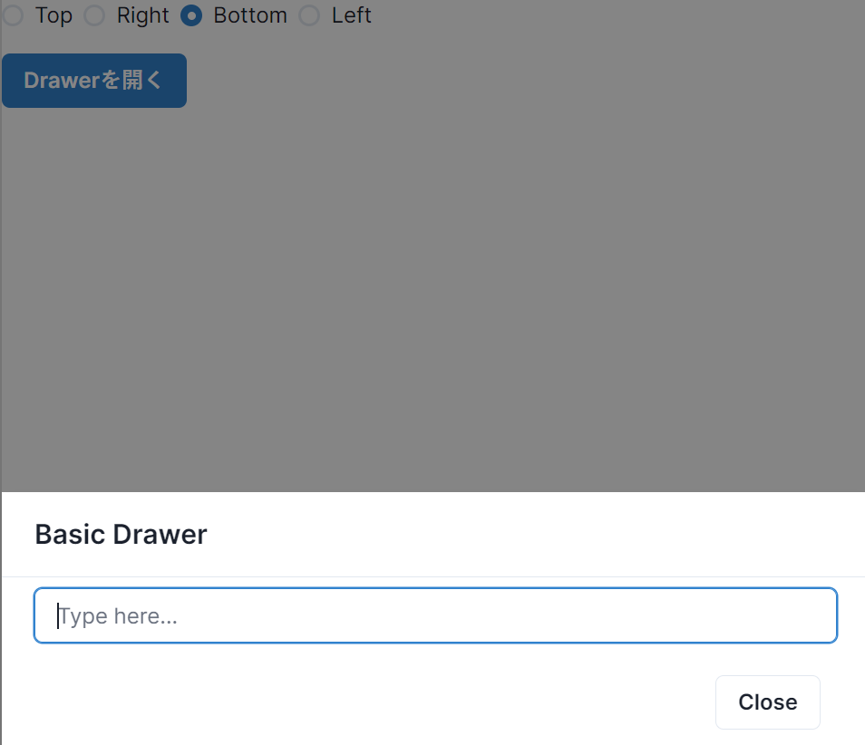

# ChakraUI-tutorial

## Q0 前提

??? info

    ### 開発環境

    ```text
    ・Next.jsを使うが、もちろん使わなくてもいける
    ・その場合は、公式のインストールガイドを参照すること

      (use client云々と言っている場合、app routerのための
      注意書きを意味している)
    ```

    ### 参考

    - [chakra UIの歩き方 & Tips集](https://zenn.dev/terrierscript/books/2021-05-chakra-ui)
    - [ChakraUI-Style Props](https://chakra-ui.com/docs/styled-system/style-props)
    - その他、ChakraUIの公式ページ


## Q1 ChakraUIの利点を知っていますか?

??? success
    ### Tailwindとの比較

    ```text
    ・デフォルトのUIコンポーネントが用意されていると嬉しい
    ・UIライブラリを頻繁に上書きする必要はない
    ・細かなカスタマイズをする予定がない
    ・モーダルウィンドウなどを自分で実装するのは骨が折れる
    ・ここだけの話、期日に追われている

    ⇒そんな時は、ChakraUIが優れている

    ・独自のコンポーネントを作成する時間がある
    ・完全に0の状態からデザインを実装したい
    ・CSSのファイル容量を減らしたい
    ・クラス名を考えたくない
    ・CSSの変更が怖い

    ⇒そんな時は、Tailwindが優れている
    ```


## Q2 ChakraUIのインストール手法を知っていますか?

??? success

    ### Next.js (App Router)

    ```tsx
    // app/provider.tsx
    // "use client" 

    import {ChakraProvider} from "@chakra-ui/react";

    export function Providers(
      {children}:
      {children: React.ReactNode}
    ){
      return (
        <ChakraProvider>{children}</ChakraProvider>
      )
    }
    ```

    ```tsx
    // app/layout.tsx
    import {Providers} from "@//providers";

    import "@/app/ui/global.css";
    import { inter } from "@/app/ui/fonts";

    import { Providers } from "@/app/providers";

    export default function RootLayout({
      children,
    }: {
      children: React.ReactNode;
    }) {
      return (
        <html lang="en">
          <body>
            <Providers>
              {children}
            </Providers>
          </body>
        </html>
      );
    }

    ```

    ### その他のファイル

    ```jsx
    //こんな感じで使う
    import {Button} from "@chakra-ui/react";
    ```

    ### ~~use clientについて(訂正前)~~

    ```text
    ・基本的に不要なら書かない方がいい
    ・現状、chakra-uiはuse***系のいわゆるフックを使う時だけ
      use-client;を必要とする
    
    ・単純に、import {Button} from "@chakra-ui/react";を
      使う場合は、clientコンポーネントにする必要はない
    
    ・そのためフックを使う場合のみ、該当ファイルに記載する
    ```

    ### use clientについて(修正)

    ```text
    ・調べていくうちに、ChakraUIはフック以外の機能においても
      内部で勝手にuse clientを付けているだけだとわかった

    ・つまりChakraUIはServer Componentに対応していない

    ・ただし、ページ全体にuse clientを行うよりも、
      ChakraUIの機能だけをバンドルした方がいいことには
      変わりない

    ・つまり、書かなくてもいいなら、やはりuse clientは
      書かない方がいい
    ```

## Q3 基本的なコンポーネントとprops

??? success

    ### Box

    ```text
    ・Boxは最も抽象的なコンポーネントで、
      HTMLタグでいう<div>に相当する
      レスポンシブなレイアウトが簡単に作れる利点がある
    ```

    ### Props

    ```text
    ・コンポーネントのpropsにstyle属性を書くことで、
      細かな調整が可能になる
    
    ・Tailwindのショートハンドに似ており、以下で参照可能
    https://chakra-ui.com/docs/styled-system/style-props
    ```

    ```jsx
    import { Box } from "@chakra-ui/react";

    /*
    props解説
      w,h : width, height
      p: padding
      m: margin
      bg: background
      color: color

      gray.50などとすることで、濃淡を調整する事や
      #ffffffなどとカラーコードを指定することももちろん可能
    */

    export default function Test() {

      return (
        <Box bg="tomato" w="100%" p={4} color="white">
          This is the Box
        </Box>
      )
    }
    ```

    

## Q4 設計原則について

??? success

    ### カスタム性

    ```text
    ・すべてのコンポーネントにpropsが割り振れるので、
      html + cssの利用を減らすことが可能
    ```

    ### アクセシビリティ

    ```text
    ・コンポーネントはfocus, voiceOver, area属性などに
      対応している
    ```

    ### ダークモード

    ```text
    ・考慮して設計されている
    ```

    ### 命名原則

    ```text
    ・has, is, shouldのような補助動詞が使われている
    ・カスタムコンポーネントを作る場合も、これに従う
    ```

## Q5 ColorThemeについて

??? success

    ### ColorTheme

    ```text
    ・gray.50のように、色と数値を組み合わせるのが分かりやすい
    ・色はgray, red, orange, yellow, green, teal, blue, 
      cyan, purple, pink, 
    ・数値は50,と100, 200, ..., 900
    ・大きい方が値が濃い
    ・カラーコードで設定してもいいが、あまりに多くの種類の
      色を含めすぎると統一性に難が出る
    
    ・数値と組み合わせることはできないが、black, whiteもある
    ```

    ```jsx
    //例
    import { Box } from "@chakra-ui/react";


    export default function Test() {

      return (
        <Box
          bg={"blue.100"}
          borderColor={"teal.300"}
          color={"cyan.800"}
          borderBottomWidth={4}
          p={2}
        >
          background={"blue.100"}
          borderColor={"teal.300"}
          color={"cyan.800"}
        </Box>
      )
    }

    ```
    

    ### colorScheme

    ```text
    ・ButtonやTabコンポーネントはcolorThemeというpropsを
      受け入れる。
    
    ・colorTheme = "gray"というふうに、
    　色名しか指定できないことが特徴だがこれは利点である  
    
      backgroundColor = `${color}.500`
      hoverBg = `${color}.600`などという風に、
      Hover時の色をユーザ側が指定することなく、
      統一感のあるデザインになるように内部で調整してくれる
    ```

    ```jsx
    import { Stack, Button } from "@chakra-ui/react";

    /*
    Stack
      spacing: 要素ごとの間隔
      direction: 要素を並べる方向
      align: 寄せる方向。今回は中央寄せ
    
    Button
      size: サイズ
      colorScheme: 
        ・テーマ色
        ・いつもの色に加えてLinkedin, Facebook, Messenger,
        　Whatsapp,Twitter,Telegram等の色も選べる 
      variant: 
        ・ボタンの種類。基本はsolid
    */
    export default function Test() {

      return (
        <Stack spacing={4} direction="row" align="center">
          <Button colorScheme="teal" size="xs" variant="solid">Button</Button>
          <Button colorScheme="teal" size="sm" variant="outline">Button</Button>
          <Button colorScheme="teal" size="md" variant="ghost">Button</Button>
          <Button colorScheme="teal" size="lg" variant="link">Button</Button>
        </Stack>
      )
    }
    ```

    

    ### extendThemeについて

    ```text
    ・デフォルトのテーマを拡張することができる
    ・ColorテーマのほかにSpaceテーマなども拡張可能
    ・手順は以下
    ```

    ```jsx
    // app/ui/theme.jsx

    /*
    おそらくextendThemeが内部でフックを使っているため
    use clientの記述が必要になる
    そのためthemeだけを別コンポーネントに分けた方がいい
    */

    "use client";
    import {extendTheme} from "@chakra-ui/react";

    export const theme = extendTheme({
      colors: {
        brand: {
          100: "#f7fafc",
          //...
          900: "#f8b500",
        },
        test1: {
          100: "#000000",
          // ...
          900 : "#ffffff",
        }
      },
    });

    //-----------------------
    import {theme} from "@app/ui/theme";

    //themeを渡すと使えるようになる
    <ChakraProvider theme={theme}>
      {children}
    </ChakraProvider>

    //-----------------------
    //以下の様に使う

    function Usage(){
      return (
        <>
          <Box bg="brand.900">Hogeeee!</Box>
          <Button colorScheme="brand">Click me</Button>
        </>
      )

    }
    ```

    

## Q6 SizeTheme & SpaceThemeについて

??? success

    ### SizeTheme

    ```text
    ・pxを指定する代わりに、キーワードを指定することで
      統一感を出せる
    
    ・xs, sm, md, lg, xl

    ・例はColorThemeのButtonを参照すること
    ```

    ### SpaceTheme

    ```text
    ・pでも、wでも基本的に値が4倍されることに注意
    ・ただし"4px"などという風に、明示的に指定することで
      pixel単位でも指定可能
    ```

    ```jsx
    import { Box } from "@chakra-ui/react";


    export default function Test() {

      /**
      * pxはx方向のpaddingであって、pixelを意味しない
      * pyはy方向のpadding, pなら全方向のpaddingを意味する
      * 指定する値は基本的に4の倍数にしておくのが安全
      * px={11}といった風にはしない⇒デフォルトの設定にないため
      * なお、64以降は72,80,96(16の倍数)しかない
      * 400px等を指定したい場合は、直接書くといい
      */
      return (
        <>
          <Box px={1} bg={"red.100"}>a</Box>
          <Box px={2} bg={"red.100"}>a</Box>
          <Box px={3} bg={"red.100"}>a</Box>
          <Box px={4} bg={"red.100"}>a</Box>
          <Box px={5} bg={"red.100"}>a</Box>
          <Box px={"20px"} bg={"red.100"}>a</Box>
          <Box px={"16px"} bg={"red.100"}>a</Box>
          <Box px={"12px"} bg={"red.100"}>a</Box>
          <Box px={"8px"} bg={"red.100"}>a</Box>
          <Box px={"4px"} bg={"red.100"}>a</Box>
        </>
      )
    }
    ```

    

## Q7 variantについて

??? success

    ### コンポーネントによって変わる

    ```text
    ・たとえばButtonなら、solid, ghost, outline, linkなど
      コンポーネントには幾つかのスタイルパターンがある
    
    ・コンポーネントごとに変わるので該当ページを確認する
    ```

## Q8 z-indexについて

??? success
    ### z-indexとは

    ```text
    ・要素を重ねる順序を指定するためのプロパティ
    ・値が大きいほど上に表示されやすい

    ・1や2など数値を指定することもできるが、
      auto(親と同じ階層), base(0を意味する),
      toast(1700を意味する)など文字列で指定するのが無難
    
    ・固定ヘッダを作りたいときに利用できたりする
    ```

## Q9 疑似要素スタイルを使う

??? success
    ### たとえばhover時にスタイルを適用したい場合

    ```text
    _hoverのような形にする
    ```

    ```jsx
    import { Box, Text, Input } from "@chakra-ui/react";


    export default function Test() {

      /**
      * hover時のCSSはまとめてObjectとして指定するので
      * JSX用の括弧とObject用の括弧が必要
      * 下の画像は、Hover時
      */
      return (
        <>
          <Box>
            <Text
              color="blue.500" fontSize="sm"
              {/*_hoverには変更点を書くだけでいい*/}
              _hover={{
                color: "red.500",
                fontSize: "lg",
                fontWeight: "bold"
              }}>
              Hover Me
            </Text>
          </Box>
          <Box>
            <Input
              placeholder="プレスホルダー"
              color="red.500"
              _placeholder={{ color: "purple.500" }}
            />
          </Box>
        </>
      )
    }
    ```

    

## Q10 レスポンシブ対応を行う

??? success
    ### レスポンシブ対応

    ```text
    ・特定の変数の値に、配列やObjectを渡すことで
      レスポンシブ対応ができる
    
    ・配列の場合、indexとサイズが対応し分かりにくいので、
      Objectを渡す方がよいと思われる
    
    ・使いどころとしては、デスクトップ版と、モバイル版の
      切り替えなど
    
    base: 値が設定されたもの以下(基準)
    sm: 480px(30em)未満
    md: 768px(48em)未満
    lg: 992px(62em)未満
    xl: 1280px(80em)未満
    2xl: 1536px(96em)未満
    ```

    ```jsx
    import { Box } from "@chakra-ui/react"


    export default function Test() {

      /**
      * xlの上は2xl,3xl,...という風に指定可能
      */
      return (
        <>
          <Box
            bg={{
              base: "red.200",
              sm: "yellow.200",
              md: "green.200",
              lg: "blue.200",
              xl: "purple.200"
            }}
          >
            Neko
          </Box>
        </>
      )
    }
    ```
    
    

## Q11 モバイル版とデスクトップ版でコンポーネントを区別したい場合

??? success
    ### useBreakPointValueが役に立つ

    ```text
    ・引数に配列やオブジェクトを指定することで、
      現在の画面サイズに適したコンポーネントを表示できる
    
    ・初回レンダリングで画面サイズ(undefined)が返される
      可能性を排除するため、必ずbaseを設定しておくこと
    
    ・ButtonのVariantは現在、配列やObjectを受け入れないため
      画面サイズによって見た目を変更したいならこれを使う
    
    ・base: true, md: falseなどとすると、
      返り値として真偽値が受け取れるため
      デスクトップ版とモバイル版で表示するコンポーネントを
      完全に区別することができる
    ```

    ```jsx
    // フックなので必要
    "use client";

    import { useBreakpointValue, Button } from "@chakra-ui/react";

    export default function Example() {
      const variant = useBreakpointValue(
        {
          base: "outline",
          md: "solid",
        },
        {
          //サーバサイドでレンダリングする際は、
          //画面サイズが分からないので、それ対策
          fallback: "md",
        },
      )

      return (
        <Button
          colorScheme="teal"
          variant={variant}
        >
          Button
        </Button>
      )
    }
    ```

    
    

## Q12 asプロパティの使い道を覚える

??? success

    ### asプロパティについて

    ```text
    ・Chakra-UIのBoxは内部ではdiv要素、
      Buttonならbutton要素に割り当てられる
    
    ・しかし、asプロパティを付けると、該当のコンポーネントの
      見た目や機能をプロパティで指定したコンポーネントの
      見た目や機能に置き換えることが可能
    
    ・たとえば<MenuButton as={Button}>なら、
      MenuButton独自の機能を引き継いだまま、
      基本的な見た目や機能はButtonコンポーネントに変わる
    
    ・この対応というのはNext.jsのコンポーネントにも言える
    　話で、Next.js(v12)以前は、Linkがaタグに
      対応していなかった。そのため<Link />を使うと
      SEOと相性が良くないリンクが出来上がっていた
      よって、子要素で<Button as="a">とし、passHrefで
      親要素のhrefプロパティを子供に渡すという
      涙ぐましい工夫をしていたらしい。

    ・Next.js(v13)以降は、<Link />がaタグに対応しているため
      このようなハックは考える必要がない

    ・ところでHTMLのルール上、入れ子のbuttonや
      入れ子のaタグは、誤っているものとされる

    ・以前のコードを変えないまま、Next.js(v13)に上げると
      aタグがネストしているとみなされてエラーを吐くので注意
    
    ・現状では、HTMLの記法に反する記述を行っている場合に、
      その修正手段として使えるかもしれない
    ```

## Q13 拡張したコンポーネントを使いまわしたい場合(Grid, shadow, roundedについても触れる)

??? success
    
    ### propsにコンポーネントを渡す

    ```text
    補足情報
      ・shadowはboxShadowのエイリアス
      ・roundedは数値で指定することもできるが、
        sizeThemeを使った方が無難
        fullfillを使うと100%と同じ意味になる
      ・SimpleGridは要素をグリッド式に並べることができる
        columnsで横の個数を制御。spacingは要素間のスペースを
        制御する。pは要素全体のpaddingであることに注意

    以下の例では基本のカスタムしたコンポーネントを作成し、
    必要であれば後から変更を加えている
    ```

    ```jsx
    import { Box, SimpleGrid } from "@chakra-ui/react";

    export default function Example() {
      const ShadowBox = (props) => (
        //...propsを後から渡すことで上書きができる
        <Box rounded="base" shadow="md" bg="white" {...props} />
      )

      return (

        <SimpleGrid
          bg="gray.800"
          columns={{ sm: 4, md: 8 }}
          spacing="8"
          p="10"
          textAlign="center"
          rounded="lg"
          color="gray.400"
        >
          <ShadowBox rounded="sm">Box</ShadowBox>
          <ShadowBox rounded="full">Box</ShadowBox>
          <ShadowBox shadow="outline">Box</ShadowBox>
          <ShadowBox rounded="3xl">Box</ShadowBox>
          <ShadowBox>Box</ShadowBox>
          <ShadowBox>Box</ShadowBox>
        </SimpleGrid>
      )
    }
    ```

    

## Q14 Chakra-uiでサポートしていないCSSプロパティを設定したい場合

??? success
    ### sxというpropが使える

    ```text
    ・たとえば、@media printという印刷時に適用されるCSSに
    　Chakra-uiは対応していない(2024年4月現在)

    ・style属性で指定する場合、インラインスタイルとして展開
      されるため、CSS化したい場合、これを利用する
    ```

    ```jsx
    import { Box } from "@chakra-ui/react";

    export default function Example() {
      return (
        <>
          <Box
            sx={{
              "@media print": {
                display: "none",
              }
            }}
          >
            このメッセージは印刷時に消失する
          </Box>
          <Box>このメッセージは消失しない</Box>
        </>
      )
    }
    ```

    

## Q15 Stackの簡単な使い道について知っていますか?

??? success
    ### Boxとの差異について考える

    ```text
    ・下記画像の通り、Stackは最低限のGap(要素間の余白)
      を用意してくれる
    ```

    ### Flexとの差異について考える

    ```text
    ・Stackはコンテナの幅いっぱいには広がらない
    ・Flexはコンテナの幅いっぱいまで広がる
    
    ※Flexの項目でも説明する
    ```

    ### 注意点

    ```text
    ・子要素はReactElementである必要がある。
    ・つまり、以下のような記述を行うと表示されない
      <Stack>
        a
      </Stack>
    ```

    ```jsx
    /*
     serverComponentにおいて
     defaultComponentでkeyプロパティがない子配列がある場合
     errorが生じる(Next.js v14.1)

     下記の例なら別のコンポーネントを用意して、
     export defaultを避ければいいだけだが、
     面倒だったので、keyプロパティを用意した。
    */
    import { Box, Stack, Grid, Flex } from "@chakra-ui/react";

    export default function Example() {
      const textList = ["neko", "inu", "nezumi", "tora"];
      return (
        <>
          <Box fontSize="xl" fontWeight="bold">Box</Box>
          <Box>
            {textList.map((item, index) => (
              <Box key={index} bg="red.50" p={2}>{item}</Box>
            ))}
          </Box>

          <Box fontSize="xl" fontWeight="bold">Stack</Box>
          <Stack>
            {textList.map((item, index) => (
              <Box key={index} bg="red.50" p={2}>{item}</Box>
            ))}
          </Stack>
          {/*GridやFlexでも同様の動作は可能*/}
          <Grid gap={2}>
            {textList.map((item, index) => (
              <Box key={index} bg="red.50" p={2}>{item}</Box>
            ))}
          </Grid>
          <Box fontSize="xl" fontWeight="bold">Flex</Box>
          <Flex direction="column" gridGap={2}>
            {textList.map((item, index) => (
              <Box key={index} bg="red.50" p={2}>{item}</Box>
            ))}
          </Flex>
        </>
      )
    }
    ```

    

    ### HStackを使ってみる

    ```text
    HStack
      ・横方向に並び、デフォルトで、中央寄せになる

    VStack
      ・縦方向に並び、デフォルトで、中央寄せになる
      (Stackでも、align="center"とすれば一緒)
    
    [補足]
    Avatar
      ・匿名のアイコンを表示する
    
    Heading
      ・h2タグでレンダリングする
    
    whiteSpace
      ・改行やスペース、タブの扱いを指定する
      ・pre-lineを指定すると連続するホワイトスペースは
        詰められて1つになる。改行文字や<br>要素のある時に使用
    ```

    ```jsx
    import { Avatar, HStack, Stack, Box, Heading } from "@chakra-ui/react"

    export default function Example() {
      return (
        <HStack p={2}>
          <Avatar />
          <Stack>
            <Heading size="sm">Your Name</Heading>
            <Box whiteSpace="pre-line">{"ここに説明文を記載。\n続きの説明文"}</Box>
          </Stack>
        </HStack>
      )
    }
    ```

    

## Q16 FlexとSpacerについて知っていますか?(Grid, Stackとの違いについても)

??? success

    ### Flex

    ```text
    ・中身は、display: flexがついたBox
    ```

    ### Spacer

    ```text
    ・Flex内の子要素の間隔を調整するために使う
    ・両端に要素を配置し、端以外に等間隔に要素を配置する時に
      助かる

    ・HStackの場合、コンテナの幅全体には広がらない
    ・Gridの場合、子要素の間隔が等間隔にならない
    ⇒これらの問題点を解決する
    ```

    ### Spacerの例

    ```jsx
    import { Flex, Spacer, Box } from "@chakra-ui/react";

    export default function Example() {
      return (
        <Flex>
          <Box bg="red.300" p={4}>Box 1</Box>
          <Box bg="blue.300" p={4}>Box 2</Box>
          <Spacer />
          <Box bg="green.300" p={4}>Box 3</Box>
        </Flex>
      )
    }
    ```

    

    ### HStack, Grid, Flex&Spacerの違いを理解する

    ```jsx
    /*
    Flex(空白が等間隔 & 親要素の幅いっぱいに表示)
    Grid(子要素の開始位置は一定。空白は不定)
    HStack(空白は一定。全体の幅は不定)
    */
    import { Flex, Spacer, Box, Text, Grid, HStack } from "@chakra-ui/react";

    export default function Example() {
      return (
        <Box>
          <Text>Flex(空白が等間隔&幅いっぱいに表示)</Text>
          <Flex>
            <Box w="70px" h="10" bg="red.500" />
            <Spacer />
            <Box w="170px" h="10" bg="red.500" />
            <Spacer />
            <Box w="180px" h="10" bg="red.500" />
          </Flex>
          <Text>Grid(開始位置は一定。空白は不定)</Text>
          {/*repeat(繰り返し, 幅)*/}
          {/*repeat(2, 10px, 1fr)とする場合、狭い要素と広い要素が交互に繰り返される*/}
          <Grid templateColumns="repeat(3, 1fr)" gap={6}>
            <Box w="70px" h="10" bg="blue.500" />
            <Box w="170px" h="10" bg="blue.500" />
            <Box w="180px" h="10" bg="blue.500" />
          </Grid>
          <Text>HStack(空白は一定。全体の幅は不定)</Text>
          <HStack spacing="24px">
            <Box w="70px" h="10" bg="green.500" />
            <Box w="170px" h="10" bg="green.500" />
            <Box w="180px" h="10" bg="green.500" />
          </HStack>
        </Box>
      )
    }
    ```

    

## Q17 DOM要素をChakra-UIのように扱う方法を知っていますか?

??? success
    ### カスタムコンポーネントでChakraのPropsを使う

    ```jsx
    // chakraを使う場合、use clientが必要
    "use client";
    import { chakra, SimpleGrid } from "@chakra-ui/react";


    export default function Example() {
      const Canvas = chakra("canvas");

      return (
        <>
          {/*囲む場合、再利用可能*/}
          {/*非Chakra-ComponentやJSXを
          　 Chakra-Compoentに変換する。
             対応するpropsは推測される*/}
          <SimpleGrid
            columns={{ sm: 4, md: 8 }}
            spacing={2}
          >
            <Canvas w={"100px"} h={"100px"} bg="red.100" />
            <Canvas w={"100px"} h={"100px"} bg="blue.100" />
            <Canvas w={"100px"} h={"100px"} bg="green.100" />
            <Canvas w={"100px"} h={"100px"} bg="purple.100" />
          </SimpleGrid>

          {/*html要素をChakra-UIの様に使いたい場合 */}
          {/*かつ、再利用が不要な時*/}
          <chakra.button
            px="3"
            py="5"
            mt="3"
            bg="green.200"
            rounded="md"
            _hover={{ bg: "green.300" }}
          >
            Click me
          </chakra.button>
        </>
      )
    }


    ```

    

    ### デフォルトのスタイルを設定する

    ```jsx
    "use client";
    import { chakra, SimpleGrid } from "@chakra-ui/react";


    export default function Example() {
      // 第2引数でdefaultのStyleを設定できる
      const CanvasWithStyle = chakra("canvas", {
        baseStyle: {
          w: "100px",
          h: "100px",
          bg: "red.100"
        }
      })

      return (
        <SimpleGrid
          columns={{ sm: 4, md: 8 }}
          spacing={2}
        >
          <CanvasWithStyle />
          <CanvasWithStyle bg="blue.100" />
          <CanvasWithStyle />
          <CanvasWithStyle />
        </SimpleGrid>
      )
    }
    ```

    

    ### その他の使い方

    ```text
    ・既存のChakra-Componentに対してStyleを適用すること
      もできる。（コンポーネント拡張の別解。
      ただし、現状だとuse clientが必要という差異あり）
    ```

    ```jsx
    "use client";
    import { chakra, HStack } from "@chakra-ui/react";

    /*
    ・本来はShadowBoxを別ファイルで定義して、exportしてくる
    ・Boxは今回文字列なのでimportしなくていいという
      利点なのかわからない点もある
    */
    export default function Example() {
      const ShadowBox = chakra("Box", {
        baseStyle: {
          rounded: "base",
          shadow: "md",
          bg: "white",
        }
      })

      return (
        <>
          <HStack>
            <ShadowBox p={10}>a</ShadowBox>
            <ShadowBox p={10}>a</ShadowBox>
            <ShadowBox p={10}>a</ShadowBox>
          </HStack>
        </>
      )
    }
    ```

    

## Q18 Drawerの作り方を知っていますか?

??? success
    ### useDisclosure

    ```text
    isOpen: trueなら制御されたコンポーネントを表示する

    onOpen: isOpenにtrueを設定するcallback
    onClose: isOpenにfalseを設定するcallback
    onToggle: isOpenのtrue/falseを切り替えるcallback
    ```

    ### Drawer

    ```text
    Drawer
      ・画面の端からスライドして現れるパネル
      ・isOpenとonClose属性は必須
      ・placementで開く方向を選択可能
      ・sizeで開く幅を調整できる。fullならすべて開く

    DrawerOverlay
      ・背後に表示されるオーバレイを制御する
    
    DrawerContent
      ・Drawerの全体を指す
    
    DrawerHeader
      ・DrawerのHeader

    DrawerBody
      ・DrawerのBody

    DrawerFooter
      ・DrawerのFooter

    [補足]
    Input
      ・inputタグをリッチな見た目にしたもの
    
    [アクセシビリティ関連]
      ・Tabで選択し、ButtonをクリックしてDrawerを開いた場合
        閉じると、focusはButtonに戻る

    ```

    ```jsx
    /*
    Closeを押すと閉じるようになっている
    */
    "use client";

    import {
      Drawer,
      DrawerOverlay,
      DrawerContent,
      DrawerHeader,
      DrawerBody,
      DrawerFooter,
      useDisclosure,
      Button,
      Input,
    } from "@chakra-ui/react";

    export default function Example() {
      const { isOpen, onOpen, onClose } = useDisclosure();

      return (
        <>
          <Button onClick={onOpen}>Drawerを開く</Button>
          <Drawer placement="right"
            onClose={onClose}
            isOpen={isOpen}
          >
            <DrawerOverlay />
            <DrawerContent>
              <DrawerHeader borderBottomWidth="1px">
                Basic Drawer
              </DrawerHeader>
              <DrawerBody>
                <Input placeholder="Type here..." />
              </DrawerBody>
              <DrawerFooter>
                <Button variant="outline" mr={3} onClick={onClose}>
                  Close
                </Button>
              </DrawerFooter>
            </DrawerContent>
          </Drawer>
        </>
      )
    }
    ```

    

    ### 開く方向を変更する

    ```text
    [補足]

    RadioGroup
      ・defaultValue等を設定するために使用する
    
    Radio
      ・ラジオボタン関連
    
    
    ```

    ```jsx
    "use client";

    import {
      Drawer,
      DrawerOverlay,
      DrawerContent,
      DrawerHeader,
      DrawerBody,
      DrawerFooter,
      useDisclosure,
      Button,
      Input,
      RadioGroup,
      Stack,
      Radio,
    } from "@chakra-ui/react";

    import { useState } from "react";

    export default function Example() {
      const { isOpen, onOpen, onClose } = useDisclosure();
      const [placement, setPlacement] = useState("right");

      return (
        <>
          <RadioGroup defaultValue={placement} onChange={setPlacement}>
            <Stack direction="row" mb="4">
              <Radio value="top">Top</Radio>
              <Radio value="right">Right</Radio>
              <Radio value="bottom">Bottom</Radio>
              <Radio value="left">Left</Radio>
            </Stack>
          </RadioGroup>
          <Button colorScheme="blue" onClick={onOpen}>Drawerを開く</Button>
          <Drawer placement={placement}
            onClose={onClose}
            isOpen={isOpen}
          >
            <DrawerOverlay />
            <DrawerContent>
              <DrawerHeader borderBottomWidth="1px">
                Basic Drawer
              </DrawerHeader>
              <DrawerBody>
                <Input placeholder="Type here..." />
              </DrawerBody>
              <DrawerFooter>
                <Button variant="outline" mr={3} onClick={onClose}>
                  Close
                </Button>
              </DrawerFooter>
            </DrawerContent>
          </Drawer>
        </>
      )
    }
    ```

    

    ### Drawerと初期Focus

    ```text
    ・Drawerが開いたときに、特定の要素にfocusしたいときは
      initialFocusRefを用いる。これがないと、最初の
      focus可能な要素にfocusする
    
    initialFocusRef
      ・自身に値として渡された値と
        同じref値を持つ要素にfocusを行う

    [補足]
      ・InputLeft/RightAddonを使うと、
        Inputコンポーネントの左右に要素を追加できる
      
      ・なお、使うにはInputGroupで全体を囲む必要がある
    ```

    ```jsx
    "use client";

    import {
      useDisclosure,
      Button,
      Drawer,
      DrawerOverlay,
      DrawerContent,
      DrawerHeader,
      DrawerBody,
      DrawerFooter,
      Stack,
      Box,
      FormLabel,
      InputGroup,
      Input,
      InputLeftAddon,
      InputRightAddon,
      Select,
      Textarea,


    } from "@chakra-ui/react";

    // npm install @mui/icons-material
    import AddIcon from '@mui/icons-material/Add';
    /**
    * useRef
    * 
    * コンポーネントの再レンダリングはしたくないが、
    * 内部に保持している値だけ更新したい場合に使用
    * 
    * 引数はdefault値。下の場合、firstField.currentのように使う
    */
    import { useRef } from "react";

    export default function Example() {
      const { isOpen, onOpen, onClose } = useDisclosure();
      const firstField = useRef();
      return (
        <>
          {/*
            variantを設定しないと、hover時しか
            要素が表示されない不具合に陥った。
            原因は探索中
          */}
          <Button
            leftIcon={<AddIcon />}
            colorScheme="teal"
            onClick={onOpen}
            variant="outline"
          >
            Create user
          </Button>
          <Drawer
            isOpen={isOpen}
            placement="right"
            initialFocusRef={firstField}
            onClose={onClose}
          >
            <DrawerOverlay />
            <DrawerContent>
              <DrawerHeader borderBottomWidth="1px">
                Create a new account
              </DrawerHeader>
              <DrawerBody>
                <Stack spacing="24px">
                  <Box>
                    <FormLabel htmlFor="username">Name</FormLabel>
                    <Input
                      id="username"
                      placeholder="please enter user name"
                    />
                  </Box>

                  <Box>
                    <FormLabel htmlFor="url">Url</FormLabel>
                    <InputGroup>
                      <InputLeftAddon>https://</InputLeftAddon>
                      <Input
                        type="url"
                        id="url"
                        placeholder="Please enter domain"
                        ref={firstField}
                      />
                      <InputRightAddon>.com</InputRightAddon>
                    </InputGroup>
                  </Box>

                  <Box>
                    <FormLabel htmlFor="owner">Select Owner</FormLabel>
                    <Select id="owner" defalutValue="neko">
                      <option value="neko">Neko</option>
                      <option value="inu">Inu</option>
                    </Select>
                  </Box>

                  <Box>
                    <FormLabel htmlFor="desc">詳細</FormLabel>
                    <Textarea id="desc" />
                  </Box>
                </Stack>
              </DrawerBody>
              <DrawerFooter borderTopWidth="1px">
                <Button variant="outline" mr={3} onClick={onClose}>
                  Close
                </Button>
                <Button colorScheme="blue" variant="outline">Submit</Button>
              </DrawerFooter>
            </DrawerContent>
          </Drawer>
        </>
      )
    }
    ```

    


## Q19 Menuとサブメニューの実装方法について知っていますか?

??? success
    
    ### デザインパターンについて

    ```text
    ・モバイル版の場合、「≡」で表される
      いわゆるハンバーガーメニューを採用し、
    
    ・デスクトップ版の場合、メニュー機能を採用するのは
      よくあるデザインパターンだと思われる
    ```

    ### 単純なMenuについて

    ```text
    Menu
      ・Context, 状態, Focusの管理を行う
    
    MenuList
      ・MenuItemのラッパー。Menuの直接の子要素
    
    MenuButton
      ・MenuListのトリガー。Menuの直接の子要素
      ・基本はClickで開き、Buttonを含むページのどこかを
        クリックすると閉じる
    
    MenuButton as={Button}とするわけ
      ・MenuButtonコンポーネントは素朴なスタイルを提供する
      ・asを付けることで、MenuButtonにChakraUIの
        Buttonコンポーネントのスタイルと機能を適用可能
      ・(asのありなしでの見た目の違いについては写真を参考に)
    
    MenuItem
      ・Menuの選択を処理する。MenuListの直接の子要素
    
    MenuGroup
      ・関連するメニュー項目をグループ化する
    
    そのほかにも、
    MenuDivider, MenuOptionGroup, MenuItemOptionがある

    ・focusがMenuButton or MenuListにある時に、
    　キーボード(alphabet)を押すと、
      該当のMenuItemを選択できるのもうれしい
      たとえば、以下の場合、Deと押すと、Deleteが選択される
    ```

    ```jsx
    "use client";
    import {
      Menu,
      MenuButton,
      MenuList,
      MenuItem,
      Button,
    } from "@chakra-ui/react";

    import { ChevronDownIcon } from "@chakra-ui/icons";

    // npm i @heroicons/react
    /**
    * Button系は、leftIconやrightIconを用いて本文の
    * 左右にIconを配置できる
    */
    export default function Example() {
      return (
        <Menu>
          <MenuButton as={Button} rightIcon={<ChevronDownIcon />}>
            Actions
          </MenuButton>

          <MenuList>
            <MenuItem>Download</MenuItem>
            <MenuItem>Create a Copy</MenuItem>
            <MenuItem>Create a Copy</MenuItem>
            <MenuItem>Mark as Draft</MenuItem>
            <MenuItem>Delete</MenuItem>
          </MenuList>
        </Menu>
      )
    }
    ```

    
    

    ### メニューの内部状態に子要素からアクセスする

    ```text
    ・レンダープロップとデストラクチャリングを用いて
    　親要素のisOpenにアクセスしている

    ・下記では開いているときは、Closeになっていることが
      確認できる
    ```

    ```jsx
    "use client";

    import {
      Menu,
      MenuButton,
      MenuList,
      MenuItem,
      Button,
    } from "@chakra-ui/react";

    import {
      ChevronDownIcon
    } from "@chakra-ui/icons";

    export default function Example() {

      return (
        <Menu>
          {({isOpen}) => (
            <>
              <MenuButton
                isActive={isOpen}
                as={Button}
                rightIcon={<ChevronDownIcon />}
              >
                {isOpen ? "Close" : "Open"}
              </MenuButton>
              <MenuList>
                <MenuItem>Download</MenuItem>
                <MenuItem onClick={() => alert("clicked!")}>Create a Copy</MenuItem>
              </MenuList>
            </>
          )}
        </Menu>
      )
    }
    ```

    

    ### レンダープロップをカスタムフックに置き換える

    ```text
    ・レンダープロップは再利用性に難があり、
      最近あまり使われていないようなので
    
    カスタムフック
      ・返された値をフックを使用しているコンポーネントで
        自由に参照できる
      
      ・つまり、propsを渡すことなく、親子で情報を共有可能

    ```

    ```jsx
    "use client";
    import {
      useDisclosure,
      Menu,
      MenuItem,
      MenuList,
      MenuButton,
      Button
    } from "@chakra-ui/react";

    import {
      ChevronDownIcon,
      AddIcon,
      ExternalLinkIcon,
      RepeatIcon,
      EditIcon,
    } from "@chakra-ui/icons"


    function useCustomMenu() {
      const { isOpen, onOpen, onClose } = useDisclosure();

      return {
        isOpen,
        onOpen,
        onClose,
        //childrenに渡しているのでButton側で書く必要はなし
        menuButtonProps: {
          isActive: isOpen,
          rightIcon: <ChevronDownIcon />,
          children: isOpen ? "Close" : "Open",
        },
        menuListProps: {
          // メニューリストに関連するプロパティやメソッドをここに追加
        },
      };
    }

    export default function Example() {
      const { isOpen, onOpen, onClose, menuButtonProps, menuListProps } = useCustomMenu();

      return (
        <Menu isOpen={isOpen} onOpen={onOpen} onClose={onClose}>
          {/*childrenでMenuのisOpenと同じ値にアクセス*/}
          <MenuButton as={Button} {...menuButtonProps} />
          <MenuList {...menuListProps}>
            {/*iconやcommandを使うことで装飾が可能*/}
            <MenuItem icon={<AddIcon />} command="Ctrl+T">New Tab</MenuItem>
            <MenuItem icon={<ExternalLinkIcon />} command="Ctrl+W">New Window</MenuItem>
            <MenuItem icon={<RepeatIcon />} command="Ctrl+C">Open Closed Tab</MenuItem>
            <MenuItem icon={<EditIcon />} command="Ctrl+F">Open File</MenuItem>
          </MenuList>
        </Menu>
      );
    }
    ```

    

    ### リンクとしてのMenuItem

    ```text
    属性asを用いて、aタグとしてレンダリングするだけ
    ```

    ```jsx
    "use client";
    import {
      Menu,
      MenuItem,
      MenuList,
      MenuButton,
      Button
    } from "@chakra-ui/react";

    export default function Example() {
      return (
        <Menu>
          <MenuButton as={Button}>メニューを開く</MenuButton>
          <MenuList>
            <MenuItem as="a" href="#">リンク1</MenuItem>
            <MenuItem as="a" href="#">リンク2</MenuItem>
          </MenuList>
        </Menu>
      )
    }
    ```

    

    ### Clickしても閉じないメニュー画面

    ```text
    ・closeOnSelect属性をfalseにする

    ・MenuOptionGroup(チェック可能なメニュー項目)
    ・MenuItemOptionが子要素
    ・MenuDividerは区切り線を引く
    ```

    ```jsx
    "use client";
    import {
      Menu,
      MenuList,
      MenuButton,
      MenuOptionGroup,
      MenuItemOption,
      MenuDivider,
      IconButton
    } from "@chakra-ui/react";

    import {
      HamburgerIcon,
    } from "@chakra-ui/icons"


    export default function Example() {
      return (
        <Menu closeOnSelect={false}>
          {/*IconButtonにされないと表示されないので注意 */}
          <MenuButton
            as={IconButton}
            colorScheme="blue"
            icon={<HamburgerIcon />}
            variant="outline"
          />
          <MenuList>
            <MenuOptionGroup defaultValue="asc" title="Order" type="radio">
              <MenuItemOption value="asc">昇順</MenuItemOption>
              <MenuItemOption value="desc">降順</MenuItemOption>
            </MenuOptionGroup>
            <MenuDivider />
            <MenuOptionGroup title="Country" type="checkbox">
              <MenuItemOption value="email">Email</MenuItemOption>
              <MenuItemOption value="phone">電話番号</MenuItemOption>
              <MenuItemOption value="country">国</MenuItemOption>
            </MenuOptionGroup>
          </MenuList>
        </Menu>
      )
    }
    ```

    

    ### サブメニューについて

    ```text
    [案1]
    ・offset={[0,0]}を用いて領域から出ないようにする
    ```

    