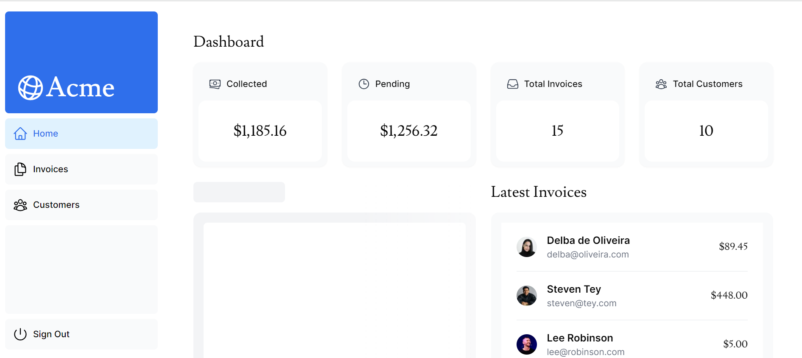

# Next.js(App Router)+Vercelを用いてWebアプリを作成する

## Q0 以下のクイズを通して作っていくもの

??? success
    ### 作るもの

    ```text
    財務ダッシュボード
      ・公開ホームページ
      ・ログインページ
      ・認証で保護されているダッシュボードのページ
      ・ユーザが請求書をInsert/Update/Deleteできる機能
    ```

    ### 学べる機能

    ```text
    スタイリング
      ・Next.jsを用いたアプリのスタイリング
    
    最適化  
      ・画像、リンク、フォントなどを最適化する方法
    
    ルーティング
      ・ファイルシステムルーティングを利用して、ネストされた
        レイアウトとページを作成する方法
    
    データの取得
      ・Vercelでデータベースをセットアップ/取得する方法
    
    検索とページネーション
      ・URL検索パラメータを使用し、検索とページネーションを
        実装する方法
    
    データの変更
      ・React Server Actionsを使用してデータを変更し、
        Next.jsキャッシュを再検証する方法
    
    エラー処理
      ・一般的なエラーと404errorを処理する方法
    
    フォーム検証とアクセシビリティ
      ・サーバ側でフォームを検証する方法と
        アクセシビリティを向上させる方法
    
    認証
      ・NextAuth.jsを使用して、アプリに認証を追加する方法
    
    メタデータ
      ・メタデータを追加して、アプリをソーシャル共有用
        に準備する方法
    ```

    ### 前提条件

    ```text
    ・Node.js 18.17.0以上
    ・OSはどれでもいい
    ・Githubアカウント
    ・Vercelアカウント
    ```

## Q1 Next.jsで新しいプロジェクトを作成する方法が分かりますか?

??? success

    ### 新しいプロジェクトを作成する

    ```bash
    npx \
    create-next-app@latest \
    nextjs-dashboard --use-npm --example \
    "https://github.com/vercel/next-learn/tree/main/dashboard/starter-example"
    ```

    ```text
    npx(Node Package eXecution)
      ・node.jsパッケージの実行を一時的に行うためのもの
    
    create-next-app@latest
      ・セットアップされた状態でNext.jsアプリの構築を開始
      ・依存関係はない
    
    --use-npm
      ・アプリのパッケージマネージャとして
      　npmを利用する

    --example
      ・Githubの公開URLやNext.jsの公式リポジトリを指定
      ・アプリを起動するための例

    ```

    ### 各ディレクトリ/ファイルの役割

    ```text
    /app
      ・アプリケーションのルート
      ・コンポーネント、ロジックが含まれる
    
    /app/lib
      ・再利用可能な関数や、データ取得用の関数など
      ・アプリで使用される関数が含まれる

    /app/ui
      ・card, table, formなど、UIコンポーネント
    
    /public
      ・画像を含む、静的アセット
    
    /scripts
      ・scriptが含まれる
    
    next.config.tsなど
      ・設定ファイル
      ・詳細は後記
    ```

    ### 階層図（一部省略済み）
    ```text
    .
    ├── README.md
    ├── next-env.d.ts
    ├── next.config.js
    ├── node_modules
    ├── package-lock.json
    ├── package.json
    ├── postcss.config.js
    ├── prettier.config.js
    ├── public
    ├── scripts
    ├── tailwind.config.ts
    ├── tsconfig.json
    └── app
        ├── layout.tsx
        ├── lib
        │   ├── data.ts
        │   ├── definitions.ts
        │   ├── placeholder-data.js
        │   └── utils.ts
        ├── page.tsx
        └── ui
            ├── acme-logo.tsx
            ├── button.tsx
            ├── customers
            │   └── table.tsx
            ├── dashboard
            │   ├── cards.tsx
            │   ├── latest-invoices.tsx
            │   ├── nav-links.tsx
            │   ├── revenue-chart.tsx
            │   └── sidenav.tsx
            ├── global.css
            ├── invoices
            │   ├── breadcrumbs.tsx
            │   ├── buttons.tsx
            │   ├── create-form.tsx
            │   ├── edit-form.tsx
            │   ├── pagination.tsx
            │   ├── status.tsx
            │   └── table.tsx
            ├── login-form.tsx
            ├── search.tsx
            └── skeletons.tsx

    ```

    ### (補足)placeholder-dataについて

    ```text
    ・APIやDBとの接続がまだ確立されていない状態で、
      本来DBにおけるテーブルのレコードの代わりとして使用
      されるデータを指す。
    
    ・今回の場合、JSON形式(またはJSオブジェクトとして使用)
    ```

    ### (補足)tsについて

    ```ts
    //型定義の書き方は2種類ある

    //1つ目

    const author: {
      name : string;
      age: number;
      isFamous: boolean;
    } = {
      name : "Neko",
      age: 125,
      isFamous: false
    }

    //2つ目
    //型定義の部分を切り出す

    const author: Author = {
      name : "Neko",
      age: 125,
      isFamous: false
    }

    interface Author {
      name : string;
      age: number;
      isFamous: boolean;
    }

    /*補足:型情報だけをexportする: 
      export interfaceともかける*/
    export type AuthorType = Author;

    /*直接型情報だけをexportすることも可能*/
    export type Author {
      name: string;
      age: number;
      isFamous: boolean;
    }
    ```
    
    ### 開発サーバを実行する

    ```bash
    #開発サーバのパッケージをinstall
    npm i

    #開発サーバを起動
    npm run dev

    ```

    ### 補足(用語)

    ```text
    ・Next.jsでいう「ルート」とは /を意味するのではなく、
      各ページを意味する
    ```
## Q2 Next.jsアプリに、スタイルを設定する方法を知っていますか?

??? success
    ### Globalスタイル

    ```text
    ・現在、/app/uiにglobal.cssというファイルがある

    ・global.cssは、アプリ内のすべてのルートに
      スタイルを追加するためのファイル

    ・任意のcomponentにimportもできるが、通常は
      最上位のcomponentに追加する
    ```

    ```ts
    /*
    app/layout.tsx
    */

    import "@/app/ui/global.css";

    export default function RootLayout({
      children,
    }: {
      children: React.ReactNode;
    }) {
      return (
        <html lang="en">
          <body>{children}</body>
        </html>
      );
    }
    ```

    ```css
    /*以降の章で解説*/
    @tailwind base;
    @tailwind components;
    @tailwind utilities;

    /*...*/
    ```

    ### tailwind

    ```text
    tailwind
      ・CSSフレームワーク
      ・クラス名を追加して、要素をスタイル設定する
    
    例
      <h1 className="text-blue-500">I'm blue</h1>
    
    ・各要素に直接スタイルを設定した場合、
      スタイルシートの衝突は起きない
    
    ・従来のCSSルールを記述したい or 
      スタイルをJSXから分離したい場合はCSSモジュールを使う
    
    ・※新しくプロジェクトを開始するタイミングで、
      Tailwindを使用するかどうかは選ぶことができる
    
    @tailwind base;
      ・Tailwind CSSが提供するベーススタイルを挿入する

      ・ブラウザごとのスタイルの差異を打ち消してくれる

      ・ブラウザデフォルトのスタイルの多くをリセット
        してくれるためプロジェクトのスタイルを一貫した
        状態に保つことができる
    
    @tailwind components;
      ・Tailwind CSSが提供するコンポーネントスタイルを挿入

      ・ボタン、カード、モーダルなどの複雑なUI要素を
        構築するために使う
      
      ・コンポーネントスタイルは
      　ベーススタイルの上に構築される
    
    @tailwind utilities;
      ・Tailwind CSSが提供するユーティリティクラスを挿入

      ・デザインの各部分を細かく制御するためのクラス

      ・これにより、レイアウト、色、テキストスタイル、
        余白のバランスなどのスタイリングを簡単に実行可能
    ```

    ### CSSモジュール

    ```text
    CSSモジュール
      ・一意のクラス名を自動的に作成し、
        CSSをローカルにスコープする
      
      ・そのため異なるファイルで同じクラス名を使用しても
        衝突の心配がない
    ```

    ```css
    /*
    app/ui/home.module.css
    */

    .shape {
      height: 0;
      width: 0;
      border-bottom: 30px solid black;
      border-left: 20px solid transparent;
      border-right: 20px solid transparent;
    }
    ```

    ```tsx
    /*
    app/page.tsx
    */
    import styles from "@/app/ui/home.module.css";
    <div className={styles.shape} />;
    ```

    ### clsx

    ```text
    clsx
      ・クラス名を簡単に切り替えるためのライブラリ
      ・条件付きでクラスを適用するために使用する
    ```

    ```tsx
    //簡単な例
    import clsx from "clsx";
    //import {clsx} from "clsx";
    
    //string
    clsx("foo", true && "bar", "baz")
    // -> foo bar baz

    //objectを渡す事も可能
    //keyがclass名で、値が条件になる
    clsx({
      foo: true,
      bar: false,
      baz: isTrue()
    });
    // -> foo baz

    clsx(
      {
        foo: true
      },
      {
        bar: false
      },
      null,
      {
        "-foobar": "hello"
      }
    );
    // -> foo --foobar


    ```

    ```tsx
    //実用例
    /*
    app/ui/invoices/status.tsx
    */

    import clsx from "clsx";

    export default function InvoiceStatus({status: {status: string}}){
      return(
        <span

          /*
            条件を作成するには条件演算子を利用するのがいい
            if, elseはjsx内では使えないので
            (&&, ||などの論理演算子ならいい)

            下記の場合、
            状態がpendingなら、背景色をgray、文字をgrayにし
            状態がpaidなら、背景色を緑, 文字をwhiteにする
          */
          className={clsx(
            "inline-flex items-center rounded-full px-2 py-1 text-sm",
            {
              "bg-gray-100 text-gray-500": status === "pending",
              "bg-green-500 text-white" : status === "paid",
            },
          )}
        >
        // ...
      )
    }
    ```

    ### 利点と欠点（何を使うか）

    ```text
    Global.css
      ・シンプルで簡単に導入可能
      ・グローバルスコープが衝突の可能性を引き起こす
      ・コンポーネントごとに
      　スタイルをカスタマイズするのが難しい
    
    TailwindCSS + clsx
      ・簡単にカスタマイズできる
      ・クラス名を動的に生成可能
      ・クラス名のオーバーヘッドによりファイルサイズが増大
        する可能性がある
      ・クラス名が長くて読みにくい（折り返せばいいのでは？）
    
    CSS Modules
      ・コンポーネントごとにスコープが分離され、スタイルの
        衝突を回避可能
      ・素のCSSを書く必要がある
      ・一つのコンポーネントに対して、一つのCSSファイルを作る
        ため、ファイル数が不要に増える
    ```

## Q3 Next.jsアプリにフォントを追加する方法を知っていますか?

??? success
    ### レイアウトシフトについて知っていますか?

    ```text
    ・プロジェクトでカスタムフォントを使用した場合を考える

    1 ブラウザは最初に、システムフォントもしくは
      フォールバックフォント(対応する字体がない場合、
      他のフォントから借りてくる)でテキストをレンダリングする
    
    2 読み込まれた後で、カスタムフォントが書かれている
      フォントファイルをfetchしてロードする
    
    3 この入れ替えのタイミングで、テキストのサイズ、間隔、
      レイアウトが変更され、周囲の要素が移動することがある

      ⇒レイアウトシフト
    ```

    ### レイアウトシフトの悲劇

    ```text
    ・「決定」と「キャンセル」
      画面にはこの2つのボタンが表示されており、
      ユーザはキャンセルをクリックしたとする。
    
    ・しかし、この瞬間レイアウトシフトが起き、テキストの配置
      が移動。その結果ユーザは決定をクリックすることになった
    ```

    ### CLS(Cumulative Layout Shift)

    ```text
    CLS
      ・予期しないレイアウトシフトが発生する頻度を定量化する

    レイアウトシフトの原因
      ・サイズが不明な画像/動画
      ・代替フォントよりも大きい/または小さいフォント
      ・動的にサイズ変更される第三者広告
      ・ウィジェット
      ・レンダリングにかかる時間がUI-componentごとに違う事
      ・開発環境では画像などが開発者のブラウザキャッシュに
        あるため、遅延がほとんど生じず問題に気付かないこと
    
    悪くないレイアウトシフトもある
      ・ユーザの操作に応じて発生するレイアウトシフトは
        大丈夫。たとえばリンクのクリックをトリガとして、
        レイアウトが変化する場合は、ユーザが予期している
    
    Skeleton Screen
      ・必要なリソースが読み込まれるまでの間、
        そのコンテンツの枠組みだけを表示する
      ・viewport(画面内)にあるコンポーネントが
        読み込まれた時にSkeletonを解除すれば
        レイアウトシフトは起こらないはず
    ```

    ### next/font

    ```text
    ・next.jsはnext/fontモジュールを使用すると、
      アプリ内のフォントを自動的に最適化する
    
    ・具体的にはビルド時にフォントファイルをDLし、
    　静的アセットとしてホストする

    ・既にDL済みなのでユーザがアプリにアクセスしても
    　フォントに関する追加のネットワーク要求は発生しない

    ・たとえばAmplifyでビルドして、S3+CloudFrontで配信
      しているケースを考える
    ・next/fontを使わない場合、fontは静的アセットと異なり
      フェッチ⇒後からロードという手順を踏むため、
      ロードのタイミングでフォントがデフォルトのものと
      入れ替わりレイアウトシフトが起きる

    ・next/fontを使うと、ビルド時にfontはすでに
      他の静的アセット同様S3に配置されているため、
      他の静的アセットと同じタイミングで読み込まれるため
      レンダリングシフトは起こらない
    ```

    ### フォントを追加する

    ```tsx
    /*
    app/ui/fonts.ts

    ・サブセットを指定することで、
    　フォントファイルの一部のみを指定してDLできる

    ・下記の場合、ラテン文字セットのみを含む
    　フォントファイルをDLしている

    ※複数の単語を含むフォントの場合は
      アンダースコアでつなぐ必要がある

    ※バリアブルフォントについて
      ・バリアブルフォントは1つのフォントファイル内で
        複数の太さを持つことができる
      
      ・バリアブルフォントでない場合は、下記の
        Lusitanaのようにweightを指定する必要がある

    */
    import { Inter, Lusitana } from "next/font/google";

    export const inter = Inter({ subsets: ["latin"] });

    export const lusitana = Lusitana({
      weight: ["400", "700"],
      subsets: ["latin"],
    })
    ```

    ```tsx
    /*
    app/layout.tsx

    ・bodyに対して適用することで、
    　フォントをアプリ全体に適用させる

    ・適用時には、import名.classNameを用いる

    ・antialiasedはフォントを滑らかにするクラスである

    ※lusitanaの場合も、同様に使用箇所で指定している
    */
    import "@/app/ui/global.css";
    import { inter } from "@/app/ui/fonts";

    export default function RootLayout({
      children,
    }: {
      children: React.ReactNode;
    }) {
      return (
        <html lang="en">
          <body className={`${inter.className} antialiased`}>{children}</body>
        </html>
      );
    }

    ```

    ```text
    ・この状態でbodyを見るとfont-familyは以下のようだった

    font-family: 
      '__Inter_aaf875', 
      '__Inter_Fallback_aaf875';
    
    ・*_Fallbackは代替フォントを指す
    ```

## Q4 Next.jsアプリに画像(等の静的アセット)を追加する方法を知っていますか?

??? success
    ### 静的アセットの配置場所

    ```text
    静的アセット
      ・画像等の静的アセットは、/publicフォルダの下に
        格納する
      ・publicフォルダ内のファイルはアプリ内で参照可能
    ```

    ### 通常のHTMLの場合

    ```html
    
    ```

    ```text
    ・画像が様々な画面サイズでうまく表示されることを
      確認する必要がある
    
    ・様々なデバイス用に画像サイズを指定する必要がある

    ・画像の読み込み時にレイアウトがずれるのを防ぐ必要がある

    ・ユーザのviewportの外にある画像は
      遅延読み込みするように設定する必要がある

    ⇒手動で設定するのはきつい
    ```

    ### next/image

    ```text
    Imageコンポーネント
      ・HTMLのタグの拡張
      
      ・画像読み込み時に自動的にレイアウトがずれるのを防ぐ

      ・小さなviewportを持つデバイスに大きな画像が送信
        されるのを防ぐべく、画像のサイズを変更する
      
      ・デフォルトで画像を遅延読み込みし、
        画像はviewportに入るときに読み込まれる
        （つまり、読み込み速度が高速化される）
      
      ・重要な画像の場合、priority={true}と設定することで、
      　遅延読み込みを無効化できる
      
      ※初期表示のviewport内にあるLCP(Largest Contentful
        Paint)つまり、最もサイズの大きな要素については、
        遅延読み込みではなく、事前読み込みの対象にした方が
        良いとされている
      
      ※preloadとは、別ページにいるときに裏で事前にDL
        してくれるNext.jsの機能で、これにより
        ユーザは初期表示時に待機する必要がなくなる

      ・placeholder="blur"などとすることで、
      　画像が読み込まれるまでの間、ユーザに
        画像が表示されるであろうことを予期させることも可能
        ※デフォルトはempty
      
      ・ブラウザがサポートしているなら、
        WebPやAVIFといった細心のフォーマットで画像を提供
      
      ・生成された各サイズの画像はブラウザのキャッシュに保存
        されるので次回以降はスムーズに読み込み可能

    
    WebP
      ・画像とanimation画像の両方に最適
      ・より高い色深度（1ピクセルで表示できる色数）、
        アニメーションフレーム、透明度をサポート
      ・PNGやJPEGよりも圧縮率で優れている
    
    AVIF
      ・WebPよりも優れた圧縮率を持つが、
        FireFoxにおいてアニメーション画像は
        サポートされていない
    ```

    ### 画像を追加する

    ```tsx
    /*
    ユーザのデバイスに応じて画像を表示する

    hidden : 基本は非表示
    md:block 画面サイズがmd以上ならblock(表示)

    block:基本は表示
    md:hidden 画面サイズがmd以上ならhidden(非表示)

    画像サイズ(width & height)について
      ・重要なのは値ではなくアスペクト比（縦横比）
      ・ソース画像と同じアスペクト比にする
      ・identify <file_name>で調べたところ
      ・hero-desktop.pngは2000*1520
      ・hero-mobile.pngは560*620だった
      ・そのため、以下でもアスペクト比通りに設定している

      ・widthとheightはレイアウトシフトを避けるために
        使われるが、この値＝レンダリングサイズではない
        あくまでもこの2つのパラメータは
        正しいアスペクト比を推測するために用いられる
      
      ・ブラウザ側はアスペクト比の情報をもとに、
        自身の画面領域やデバイスの解像度、
        ユーザの設定（ブラウザのズームレベル）などから
      　予めレンダリングサイズを設定し、その領域の予約を行う
      　そうして、読み込み時のレイアウトシフトを防いでいる

    */

    import Image from "next/image";

    export default function Page(){
      return(
        //...
        <Image
          src="/hero-desktop.png"
          width={1000}
          height={760}
          className="hidden md:block"
          alt="Screenshots of the dashboard project showing desktop version"
        />

        <Image
          src="/hero-mobile.png"
          width={560}
          height={620}
          className="block md:hidden"
          alt="Screenshots of the dashboard project showing mobile version"
        />
      )
    }
    ```

## Q5 Next.jsでファイルシステムルーティングを使用する方法が分かりますか?

??? success
    ### ファイルシステムルーティング

    ```text
    ・Next.jsはディレクトリを使用してルートを定義する
      ファイルシステムベースのルーティングを採用している
    
    ・具体的には、page.tsx/page.jsx/page.js内で
      default exportしているコンポーネントを表示する
    
    ・対応例は以下の通りである

      app/page.tsxファイルに定義されたcomponent
      ⇒ /に表示

      app/dashboard/page.tsxファイルに定義されたcomponent
      ⇒ /dashboardに表示

    ・階層構造は以下のようである

    .
    ├── app
         ├── page.tsx
         └── dashboard
              └── page.tsx
    ```

    ### page routerとの差異

    ```text
    ・page routerの場合、ファイル名がHogehoge.tsxなどでも
      ページとして扱われていた
    
    ・app routerでは予約された名前のファイルのみが
      ルーティングの対象となる

    ・そのため、特定のページでしか使われないcomponentを
      ページの近くに配置できるようになった
      (componentsとpagesでディレクトリを分けていた時と比べ
      ファイル同士の関連性が分かりやすい)
    ```

    ### 各ページを作成してみる

    ```tsx
    // app配下に app/dashboard/page.tsxを作成する

    export default function Page(){
      return <p>Dashboard Page</p>;
    }

    // localhost:3000/dashboardで閲覧可能

    //-----------------------------

    // app/dashboard/customers/page.tsx

    export default function Page(){
      return <p>Customer Page</p>;
    }

    //--------------------------

    // app/dashboard/invoices/page.tsx

    export default function Page(){
      return <p>Invoices Page</p>;
    }
    ```

## Q6 Next.jsで複数のページにわたって共有されるUIを作成する方法を知っていますか?

??? success
    ### layout.tsx

    ```text
    layout.tsx
      ・複数のページ間でレイアウトおよび内部状態を共有可能
      ・主にヘッダーやフッターなどの共通部分を定義する
      ・ここにimportするコンポーネントもレイアウトの一部
      ・layout.tsxに書かれたコンポーネントは、
        ページが切り替わっても再レンダリングされないので
        不要なレンダリングを避けることができる
      ・page.tsxと同階層にある場合、layout.tsxはpage.tsxを
        ラップする。

    ・ページが切り替わった場合、page.tsxの部分だけが更新され
      layout.tsxに書かれた部分は再レンダリングされない
    ⇒部分レンダリング

    ・/app/hoge/layout.tsxがあったとき、
    　この共通部分は/app/page.tsxには適用されない。
      同じフォルダ内の/app/hoge/fuga/page.tsxには適用される
    ```

    ### ルートレイアウト

    ```text
    /app/layout.tsx
      ・app直下に書かれるlayout.tsxは
      　ルートレイアウトと呼ばれる

      ・必須
      
      ・ルートレイアウトに追加したUIはアプリ内の
        全てのページで共有される

      ・サーバから返される最初のHTMLを変更できるようにする
        ためhtmlタグとbodyタグを含む必要がある
      
      ・たとえばルートレイアウトにはメタデータを追加する
    ```

    ### ネストレイアウト

    ```text
    ・defaultでは、フォルダ階層内のレイアウトはネストされる

    ・そのため親レイアウトでchildrenを使うと、その部分に
      子レイアウトが描画される

    [以下のフォルダ構成の場合]
    /app
      layout.tsx
      page.tsx
      /dashboard
        layout.tsx
        page.tsx

    /
    ⇒ /app/layout.tsx内の{children}に、
       /app/page.tsxが描画される
    
    /dashboard
    ⇒ /app/layout.tsx内の{children}に
       /app/dashboard/layout.tsxが描画され
       /app/dashboard/layout.tsx内の{children}に
       /app/dashboard/page.tsxが描画される
    ```

    ### next.js 12以前(page router)から移行するときの注意点

    ```text
    ・/app/layout.tsx、つまりルートレイアウトは
    　_app.jsと_document.jsを置き換える

    ・layout.tsxも、page.tsxもデフォルトでは
      サーバコンポーネントとなる（設定で変更可能）
    ```

    ### `dashboard/layout`を作成してみる

    ```tsx
    //dashboard配下のページは
    //常にこのlayoutを採用することになる
    import SideNav from "../ui/dashboard/sidenav";

    export default function Layout({ children }: { children: React.ReactNode }) {
      return (
        <div className="flex h-screen flex-col md:flex-row md:overflow-hidden">
          <div className="w-full flex-none md:w-64">
            <SideNav />
          </div>
          <div className="flex-grow p-6 md:overflow-y-auto md:p-12">{children}</div>
        </div>
    ```

## Q7 Next.jsでページ間の移動を行う方法を知っていますか?

??? success
    ### なぜ`<a>`ではいけないのか

    ```text
    ・<a>を使うとページ全体が更新される
    ・これはが最適化されていなかったのと似ている

    ⇒全体を更新しているので時間がかかる
    ⇒また、遷移にも時間がかかる（プリフェッチしていないので）
    ```

    ### `<Link />`

    ```text
    ・next/linkからimportする
    ・hrefにリンクを渡す

    ⇒ページ遷移がクライアントサイドで行われる
    ⇒リロードは発生しない
    ```

    ### 自動コード分割とプリフェッチについて

    ```text
    自動コード分割
      ・Next.jsはアプリをルートごとに自動的にコード分割する

      ・そのため特定のページでエラーが発生しても、
        残りのページは問題なく動作する
      
      ・また自動でコードを分割するという特徴は
        プリフェッチに役立っている

    プリフェッチ
      ・React SPAは初期ロード時に、すべてのアプリコードを
        ロードしていたため初期ロード時に時間がかかったが、
        Next.jsの手法はそれと異なる。

      ・Next.jsは運用環境において（開発環境ではダメ）、
        ブラウザのviewportに<Link/>が表示されるたびに
        リンク先のルートのコードをバックグラウンドで
        自動的にプリフェッチする
      
      ・プリフェッチとは、データをあらかじめ読み込んでおく
        事を意味する
      
      ・そのため、実際にリンクをクリックしたときは、
        既にコードがバックグラウンドで読み込まれているため
        ほぼ瞬時に遷移できる
      
      ⇒初期ロード時にすべてを読み込むわけではないので、
        初回アクセス時に負担がかからない
      

    ```

    ### 例

    ```tsx
    ```

## Q8 Next.jsでパスを比較する方法を知っていますか?

??? success
    ### usePathname()

    ```text
    ・ユーザに対して、
      現在どのページにいるのかという情報を提供したい場合、
      URLから現在のパスを取得する必要がある
    
    usePathname()
      ・このフックを使うと、パスをチェック可能
      ・これはフックなので、クライアントコンポーネントで
        使う必要がある

    "use client"
      ・ファイルの先頭にこれを追加すると、
      　クライアントコンポーネントになる
      ⇒デフォルトではサーバコンポーネントなので
    ```

    ### 例

    ```tsx
    /*
    app/ui/dashboard/nav-links.tsx
    */

    "use client";

    import {
      UserGroupIcon,
      HomeIcon,
      InboxIcon,
    } from "@heroicons/react/24/outline";
    import Link from "next/link";
    import {usePathname} from "next/navigation";
    import clsx from "clsx";

    // ...

    // link.href === pathnameの場合、
    // つまりリンク先が現在のページの場合
    // リンクを青くしている
    // linkはurlやlink名が格納されたdictを想定
    export default function NavLinks() {
      const pathname = usePathname();
      // ...
      return(
        <Link
          key={link.name}
          href={link.href}
          className={clsx(
            "flex h-[48px] grow items-center justify-center gap-2 rounded-md bg-gray-50 p-3 text-sm font-medium hover:bg-sky-100 hover:text-blue-600 md:flex-none md:justify-start md:p-2 md:px-3",
            {
              "bg-sky-100 text-blue-600" : pathname === link.href,
            }
          )}
        >
        </Link>
      );
      // ...

    ```

    !!! warning
        ### window.location.pathnameではいけないのか

        ```text
        A.　いけない

        ・クライアントコンポーネントもサーバ上で
          事前レンダリングされる
        
        ・そのためwindowオブジェクトを使っていると、
          その際に、window is not definedが発生する
          よって、windowオブジェクトはuseEffect内で
          書く必要がある。
        
        ・上記のようにuseEffect外で、pathを使いたいなら
          usePathname()を使うべき
        ```

## Q9 Vercel(の使い方)でアプリをデプロイする方法を知っていますか?

??? success
    ### vercel

    ```text
    ・Next.jsの作者が開発しているので、Next.jsの
      最適化に適している　
    ```

    ### vercel free

    ```text
    ・商用利用しない
    ・お試しで利用したい

    そんな場合は、hobbyプラン(free)を使える
    ```

    ### 簡単な流れ

    ```text
    ・Vercelのアカウントを作成
    ・Githubにリポジトリを作成
    ・特定のリポジトリをimport
    ・プロジェクトに名前を付けてdeploy

    ⇒以降、main(master)ブランチにpushすると
      自動的に再デプロイされる
    
    ⇒main(master)ブランチに対するpull-requestを開いた場合
      previewを行うこともできる！
    ```

    ### postgresデータベースを作成する(250MBまでならfree)

    ```text
    ・自身のアプリを開く
    ・ストレージタブを選択
    ・Create new -> Postgres -> Continue
    ・DBのリージョンを設定する
    　(※全ての新しいprojectのデフォルトのリージョンはiad1
    　なので、これに合わせると応答時間が減少する)
    ・Connect
    ・.env.localから接続情報を取得
    ・script/に.envを作成し、取得した接続情報を記載
    ・.envが.gitignoreに追加されていることを確認
    ・npm i @vercel/postgresを実行し、Vercel Postgres SDK
      をinstallする
    ```

    ### DBとseed

    ```text
    ・package.jsonのscriptsセクションにseedという項目を作る
      "seed": "node -r dotenv/config ./scripts/seed.js"
    
    ・npm run seedで初期テーブル作成とデータを挿入
    
    node: 
      ・Node.jsの実行環境
    
    -r dotenv/config
      ・スクリプトを実行する前にdotenvパッケージをロード
        (rオプションは、メインのモジュールを実行する前に
        実行するモジュール)
      ・dotenvを使うと、.envファイルに定義された値を
        環境変数として使うことができる
      ・dotenvは開発環境やテスト環境で環境変数を管理する
        目的でよく使用される
      
      ⇒開発時はローカルで.envを配置し、
        本番ではHostingサービスの機能で環境変数として設定
    
    ./scripts/seed.js
      ・実行するJSファイルのパス
      ・seed.jsはplaceholder-data.jsからmodule.export
        したデータを使って、DBの初期データを作成している
      ・詳細は今回関係ないので省略(primary keyがuuidなのが
        個人的に気になる。SQLの過ちは見つけやすくなりそう)
      ・https://www.bytebase.com/blog/choose-primary-key-uuid-or-auto-increment/
    ```

    !!! warning
        - winでinstallしたbcryptはlinuxでは動かない(bcryptはpasswordのハッシュ化に利用している)
        - 気分でwslとか動かしている場合はerrorのもとになるので注意

    ### vercelでDBを検索してみる

    ```text
    ・Dataを選ぶ
    ・BrowserとQueryがある
    ・クエリの実行で見る方が楽だと思う
    ```

## Q10 Next.jsからDBのデータをフェッチする方法を知っていますか?

??? success
    ### React Server Component

    ```text
    React Server Component
      ・サーバ上でレンダリング可能
      ・キャッシュするUIを作成可能
    
    サーバレンダリングの利点
      ・データフェッチをDBに近いサーバから行えるので、
        フェッチにかかる時間が減少する
      
      ・トークンやAPIキーなどの機密事項をクライアントに
        公開するリスクがなくなる
      
      ・サーバ上でレンダリングすることで、結果をキャッシュ
        でき、複数人のクライアントのリクエストで再利用できる
      
      ・ブラウザ側でDL,解析、実行するJSが少なくなるので、
        回線速度が遅いユーザにとってうれしい
      
      ・サーバ側で、HTMLを生成しておけば、クライアントが
        JSをDL、解析、実行する時間を必要としないため、
        ページの表示速度があがる
      
      ・サーバ側でレンダリング済みなので、検索クローラーの
        見落としが少なくなる
      
      ・レンダリング作業をチャンクに分割し、準備が出来たら
        その都度クライアント側に提供できるので、ページ全体が
        レンダリングされるのを待つ必要がない（先に一部を
        確認可能）
    
    )Server Componentを使わない場合(DB関連)
      ・クライアントから直接DBにクエリを実行すると
        DBの機密が漏洩する
      ・そのためサーバ上で実行されるAPIレイヤを介して
        クライアントに結果を送信する
      ・セキュリティの観点から、APIエンドポイントの認証
        認可の処理も必要になるだろう
    
    React Server Componentsを使う(デフォルトはこれ)
      ・サーバ上でクエリを実行し、結果をクライアントに送信
      ・APIレイヤを介さずに、DBに直接クエリを実行可能
      ・Server Componentsなので、useEffectやuseStateを
        使わない、より効率的な非同期タスク解決手段が使える
      ・必要なのは、DBと対話するロジックになるので直感的

    ```

    ### @vercel/postgres

    ```text
    ・DBに対して、クエリを実行するために必要
    ・SQL-injectionに対する保護を提供してくれている
    ・Server Componentsで使うこと！！！
    
    sql(importするやつ)
      ・templateを使用して、SQLクエリを構築可能
      ・process.env.POSTGRES_URLで指定したDBに接続する
      ・単一のクエリに対して使用する
      ・推奨されている

    使用例
      import {sql} from "@vercel/postgres";

      const likes = 100;
      const {rows, fields} =
        await sql<type>`
          select * 
          from users
          where likes > ${likes} 
          limit 5
        `;
    
    db
      ・Postgresデータベースに接続するクライアントを作成
      ・トランザクションを実行する場合
      ・複数のクエリを作成する必要がある場合に使用
    
    使用例
      import { db } from "@vercel/postgres";

      const client = await db.connect();
      await client.sql`select * from users`;

    参考
      ・https://vercel.com/docs/storage/vercel-postgres/sdk#sql
    ```

    ### 補足

    ```text
    ・今回のコースでは、/app/lib/data.tsに
      Select文が既に書かれていたので、
      関数を呼ぶだけでよさそう
    ```

    ### データを取得してみる

    ```text
    ・Dataをフェッチするために非同期コンポーネントにする
    ・件数を取得するときは、count(*)を使っている
      行数だけに関心があるなら、全行を送る必要はないので
    ```

    ```tsx
    import { Card } from "../ui/dashboard/cards";
    import RevenueChart from "../ui/dashboard/revenue-chart";
    import LatestInvoices from "../ui/dashboard/latest-invoices";
    import { lusitana } from "../ui/fonts";
    import {
      fetchRevenue,
      fetchLatestInvoices,
      fetchCardData,
    } from "@/app/lib/data";

    export default async function Page() {
      const revenue = await fetchRevenue();
      const latestInvoices = await fetchLatestInvoices();
      const {
        numberOfCustomers,
        numberOfInvoices,
        totalPaidInvoices,
        totalPendingInvoices,
      } = await fetchCardData();
      return (
        <main>
          <h1 className={`${lusitana.className} mb-4 text-xl md:text-2xl`}>
            Dashboard
          </h1>
          <div className="grid gap-6 sm:grid-cols-2 lg:grid-cols-4">
            <Card title="Collected" value={totalPaidInvoices} type="collected" />
            <Card title="Pending" value={totalPendingInvoices} type="pending" />
            <Card title="Total Invoices" value={numberOfInvoices} type="invoices" />
            <Card
              title="Total Customers"
              value={numberOfCustomers}
              type="customers"
            />
          </div>
          <div className="mt-6 grid grid-cols-1 gap-6 md:grid-cols-4 lg:grid-cols-8">
            <RevenueChart revenue={revenue} />
            <LatestInvoices latestInvoices={latestInvoices} />
          </div>
        </main>
      )
    }
    ```

    ### リクエストウォーターフォール

    ```text
    ・awaitは、前のリクエストがデータを返した後にのみ
      開始される
    ・したがってパフォーマンスに影響を与える可能性がある
    ・（もちろん前のリクエストから返されたデータに
      依存する場合は必須だが）
    ```

    ### 並列データフェッチ

    ```text
    ・Promise.all()や、Promise.allSettled()を使う
    ・パフォーマンスの向上につながる一方で、たとえばallの
      場合、1つrejectになると、結果がrejectedになる。
      allSettledの場合、すべてのpromiseが完了するまで
      待つ必要があるという懸念点がある    
    ```

## Q11 静的レンダリングと動的レンダリングについて知っていますか?

??? success
    ### 静的レンダリング

    ```text
    ・データのフェッチとレンダリングがビルド時/再検証時に
      サーバ上で行われる

    ・結果はCDN(Contents Delivery Network)に配信される。
      
    ・再検証には、時間ベースやイベントに基づくものがある
    ```

    ### 静的レンダリングの利点と使い道

    ```text
    高速化
      ・事前にサーバ上でレンダリングされたコンテンツを
        キャッシュしてCDNを通してグローバルに配信するので、
        ユーザは地理的に近い場所からアクセスできる
    
    サーバ負荷の軽減
      ・コンテンツはキャッシュされるので、ユーザのリクエスト
        ごとにコンテンツを動的に生成する必要がない
    
    SEO
      ・事前にレンダリングされているため、ページの読み込み時
        にすでに利用可能になっている
      ・よって、クローラーによるインデックス付け
      （検索エンジンのDBに登録する事）が容易

    使い道
      ・ユーザ間で共有されるデータのUI
    
    使えないところ
      ・定期的に更新されるユーザ単位で最適化されたデータ
    ```

    ### 動的レンダリング

    ```text
    ・リクエスト時（ユーザがページにアクセスした時）に、
      各ユーザのコンテンツがサーバ上でレンダリングされる
    ```

    ### 動的レンダリングの利点と使い道

    ```text
    リアルタイムなデータ
      ・アクセス時のデータを使えるので、頻繁に更新される
        データに便利
    
    ユーザ固有のデータ
      ・アクセスした人によってフェッチ内容が変わるデータに
        最適
    
    リクエスト時の情報
      ・CookieやURLの検索パラメータなどリクエスト時に
        知ることができる情報にアクセス可能
    
    ```

    ### レンダリングする際にどちらが使われるか

    ```text
    デフォルト
      ・静的レンダリング

    動的関数
      ・cookies(), headers(), searchParams()などの
        ユーザのCookie,現在のリクエストヘッダ、
        URLの検索パラメータをするための関数
    
    動的関数を使った場合
      ⇒ルート全体が動的レンダリングされる
    
    キャッシュされていないデータが要求された場合
      ⇒ルート全体が動的レンダリングされる

    キャッシュされていないときとは...?
      ・fetch requestにcache: "no-store"が追加されている
        (リクエストレベルでキャッシュを制御)
      ・fetch requestにrevalidate: 0が追加されている
        (pageレベルでキャッシュを制御
        これを指定すると、pageは常にserverから再生成される)
      ・fetch requestがPOSTメソッドを使うRouter handlerの
        中に来る
      ・fetch requestがheader(), cookies()の使用後に来る
      ・const dynamic = "force-dynamic"という
        ルートセグメントオプションが使われている
      ・etc...

    例
      ・fetch("https://...", {cache: "no-store"});
      ⇒二回目以降も動的レンダリングになる
    ```

    ### unstable_nostore

    ```text
    ・実験的なAPIだが、サーバコンポーネント内で呼び出すと、
      静的レンダリング⇒動的レンダリングに変更できる
    ```

    ```tsx
    /*
    unstable_noStoreはfetch(..., {cache: "no-store"})
    と同等。追加オプションを許容するならno-storeでもいい

    export const dynamic = "force-dynamic"を行うと
    同一ファイルが全て動的になるので、これより柔軟
    */
    import { 
      unstable_noStore as noStore 
    } from 'next/cache';

    export async function fetchRevenue() {
      noStore();
      await new Promise(
        (resolve) => setTimeout(resolve, 3000)
      );
      // ...
    }

    ```

    ### 上記(動的レンダリング)の問題点

    ```text
    ・データをフェッチするのに3秒かかっており、
      その間、ページ全体がブロックされている
    ```

## Q12 ストリーミングについて知っていますか?

??? success
    ### ストリーミング

    ```text
    ・ルートを小さなチャンクに分割し、準備が整ったものから
      サーバ⇒クライアントへと段階的にデータを転送する技術
    
    ・準備できたデータから読み込まれるので、一部が読み込まれ
      ていない間も、ページの一部を操作可能
    
    ・各コンポーネントをチャンクとみなすことが可能
    ```

    ### Next.jsでのストリーミングの実装

    ```text
    ページレベル
      ・loading.tsxファイルを使う
    
    特定のコンポーネントの場合
      ・<Suspense />を使う
    ```

    ### loading.tsxについて

    ```text
    ・loading.tsxはSuspense上に構築された特別なNext.js-file
    
    ・pageコンテンツの読み込み中に代替として表示する
      フォールバック(予備)UIを作成する
    
    ・静的なComponentはすぐに表示され、フォールバックの対象
      にはならない
    
    ・ユーザはページの読み込みが完了するまでの間、
      静的なコンテンツと、代替のUIを見ることが可能
    
    ※ファイルシステムでいう下位ページ全てに影響を与える
      事に注意
    ```

    ### loading.tsxの例

    ```tsx
    /*
    ページ全体をストリーミングする

    app/dashboard/loading.tsx
    */

    export default function Loading(){
      return <div>Loading...</div>;
    }
    ```

    ### 読み込み（ロード）スケルトンについて

    ```text
    ・多くのWebサイトでは、コンテンツが読み込まれている事を
    　ユーザに示すためにプレスホルダーを使う

    ・埋め込むUIは、loading.tsxファイルの一部に埋め込まれ
      静的ファイルの一部として最初に送信される

    ・その後、動的コンテンツがストリーミングで段階的に
      読み込まれる
    ```

    ### ロードスケルトンの例

    ```tsx
    /*
    app/dashboard/loading.tsx
    */

    import DashboardSkeleton from "@/app/ui/skeletons";

    export default function Loading(){
      return <DashboardSkeleton />;
    }
    ```

## Q13 ルートグループについて知っていますか?

??? success
    ### Q12までの問題点

    ```text
    ・app/dashboard/loading.tsxという位置に配置したため、
      app/dashboard/*/page.tsxといったページにも適用
      されてしまっている
    ```

    ### ルートグループ

    ```text
    作り方
      ・フォルダ名を括弧で囲むことによって作成できる
    
    使いどころ
      ・URLパス構造に影響は与えたくないが、論理グループを
        作りたい場合
      
      ・たとえば/dashboard/(overview)/loading.tsxとした
        場合、/dashboard/invoices/page.tsxに影響はなくなる
        ⇒同階層（または子ディレクトリ）でないため
      
      ・また、大規模なアプリの場合は機能ごとに分割することも
        できる
    
    注意点
      ・相対パスだとimportがずれる
      ・そのためにtsconfig.jsonのpathがある   
      "paths": {
        "@/*": ["./*"]
      }
      の場合、@/app/uiは、tsconfig.jsonから見た相対パス
      である、./app/uiに解決される。
      これにより、(overview)を作っても問題がなくなる
    ```

## Q14 Suspenseについて知っていますか?

??? success

    ### React18と`<Suspense />`

    ```text
    React17以前
      ・一度始まったレンダリングは必ず最後まで行われていた
      ・レンダリングを中断したり、完了するまでに別の
        レンダリングを始めることはできなかった
    
    React18概要
      ・レンダリングの実行中に別のレンダリングを始める
        ⇒可能
      
      ・レンダリングを途中で停止して破棄する
        ⇒可能
      
      ・なお、最終的なレンダリング結果がstateに対応している
        のは保証されている！
    ```

    ### 新機能1(レンダリングのバッチ化)

    ```text
    ・複数の状態が更新された時、
      レンダリングがまとめて行われるようになった
  
    ・React17までは、Promise,setTimeout,addEventLister
    　等のイベント内の更新はバッチ処理されないという特徴が
    　あったが、React18以降は、すべての更新が自動的にバッチ
    　されるようになった
    　この変更により、1つの状態変数が更新された中途半端な
    　状態がレンダリングされなくなる
    　以下の場合も、ボタンを押した時のレンダリング回数は1回
    ```

    ```tsx
    function App(){
      const [count, setCount] = useState(0);
      const [flag, setFlag] = useState(false);

      function handleClick(){
        fetchSomething().then(()=>{
          setCount(c => c+1);
          setFlag(f => !f);
        })
      }

      return(
        <div>
          <button onClick={handleClick}>Next</button>
          <h1 style={{color: flag ? "red" : "blue"}}>{count}</h1>
        </div>
      )
    }

    //React17以前は以下の場合、レンダリング回数は1回
    function handleClick(){
      setCount(c => c + 1);
      setFlag(f => !f);
    }

    //この場合は2回レンダリングしていた
    setTimeout(()=>{
      setCount(c => c+1);
      setFlag(f => !f);
    }, 1000);

    //※バッチ処理したくない場合
    import {flushSync} from "react-dom";

    function handleClick(){
      flushSync(()=>{
        setCounter(c => c+ 1);
      });

      flushSync(()=>{
        setFlag(f => !f);
      })
    }
    ```
    
    ### 新機能2(トランジションの導入)
    ```text
    ・再レンダリングが非同期で処理可能になった

    ・たとえば<input/>要素への入力などユーザ操作による
      状態変化は即時レンダリングするが、

    ・検索結果の再レンダリングは裏側で処理し、完了次第
      反映する等の区分けができる
      (setTransition()の引数に渡したコールバック内での
      状態の更新が急ぐ必要のないものとみなされ、
      バックグラウンドで処理される。なお、裏での処理中に
      追加で入力が為され、状態が変化した場合、
      この処理中のレンダリングは破棄され、新しい値を元に
      裏でレンダリングが開始される)

    ⇒ユーザの操作を阻害せずに、重いレンダリングを裏側で
      実行できるように
    ```

    ```tsx
      import {startTransition} from "react";
      setInputValue(input); //即時実行

      //裏側で処理(処理次第表示が切り替わる)
      startTransition(()=>{
        setSearchQuery(input);
      })

      //スケルトン処理もできる
      import {useTransition} from "react";
      const [isPending,startTransition] = useTransition();

      {isPending && <Spinner />}
    ```

    ### 新機能3(`<Suspense />`とSSR)

    ```text
    ・コンポーネントを<Suspense />で囲むと、
      その部分のレンダリングを非同期に描画可能
    ⇒描画される前にも操作可能
    ⇒これはページを操作するためのJS読み込み(hydration)
    　が非同期になったことと関係している。
      操作可能にするためのJSを非同期で読み込むことで、
      重い要素のレンダリングを待たずに、軽い部分が先に
      操作可能になる
    ⇒これはNext.jsでは<Suspense />で実現されている
    ``` 

    ```tsx
    //新機能を利用するには?
    // ・エントリーポイントを変える

    import {render} from "react-dom" //以前
    const container = document.getElementById("app");
    render(<App tab="home" />, container);

    import {createRoot} from "react-dom/client" //今
    const container = document.getElementById("app");
    const root = createRoot(container); 
    root.render(<App tab="name"/>); 
    // https://react.dev/blog/2022/03/08/react-18-upgrade-guide#updates-to-client-rendering-apis
    ```

    ### Next.jsでReact Suspenseを利用する

    ```text
    ・loading.tsxはページ全体をストリーミングにする
    ・<Suspense>を使えば、囲んだ部分だけのレンダリング部分を
      延期できる。
    
    ・Suspenseのpropsであるfallbackには、軽量な代替UIを指定
      childrenにはレンダーしようとしている実際のUIを指定する
      レンダーの準備が整うまで、代替UIが表示される
    ```

    ```tsx
    //遅い部分だけをSuspenseを用いてストリーミングする
    //残りの部分は常に同じ

    //従来；全体が3秒間スケルトンに陥っていた
    //結果:他のスケルトンがすぐに解消された

    // app/dashboard/(overview)/page.tsx
    import RevenueChart from "@/app/ui/dashboard/revenue-chart";
    import LatestInvoices from '@/app/ui/dashboard/latest-invoices';
    import { Suspense } from "react";
    import { 
      RevenueChartSkeleton,
      LatestInvoicesSkeleton,
     } from "@/app/ui/skeletons";

    export default async function Page() {
      // ここで、fetchしていたのをremoveした
      // ...
      // それぞれのcomponentの中でfetchすることで
      // Suspenseが生きてくる
      return (
        <Suspense fallback={<RevenueChartSkeleton />}>
          <RevenueChart />
        </Suspense>
        <Suspense fallback={<LatestInvoicesSkeleton />}>
          <LatestInvoices />
        </Suspense>
      )
    }
    // app/ui/dashboard/revenue-chart
    import { fetchRevenue } from '@/app/lib/data';
    export default async function RevenueChart() {
      const revenue = await fetchRevenue();
      // ...
    }
    ```

    

    ### Componentのグループ化

    ```text
    ・複数の似たようなコンポーネントをそれぞれ
      Suspenseでくくると、視覚的にうるさくなる

    ・したがって1つのグループとして読み込んだ方がいい
      こともある。（特に読み込み時間がほぼ同じなら）
    
    ・SuspenseでWrapperコンポーネントを囲うもよし、
      Suspenseの中に複数のChildrenを含めるもよし
      後者の場合、どれか1つでもデータ待ちなら、
      まとめてfallbackに置き換わる
    ```

    ### Suspense境界の選定

    ```text
    ・一般的にはpage.tsxでfetchを行うのではなく、
      データが必要なコンポーネントで行い、
      ブロッキングを防ぐ目的で該当コンポーネントだけを
      <Suspense />で囲むのがよいとされている
    
    ・しかし必要ならばloading.tsx等を用いて、
      ページ全体をストリーミングすることもできる
    ```

## Q15 部分プリレンダリングについて知っていますか?

??? success
    ### 注意点

    ```text
    ・Next.js v14で導入された機能であるため実験的
    ```

    ### 静的コンテンツ or 動的コンテンツ

    ```text
    現在の問題点
      ・特定のルートは、静的レンダリングか、動的レンダリング
        のいずれかになっている
      
      ・ほとんどのルートは、本来静的な部分と動的な部分が
      　混じっているが、たとえばNext.jsの場合、動的関数や
        cookies()等を使うと、そのルートは動的レンダリングに
        なってしまう
    ```

    ### Partial Prerendering(部分的なプリレンダリング)

    ```text
    PPR
      ・ルートを静的に保ちながら、部分的に動的にする

      ・大半が静的レンダリングなため初期ロードは高速で、
        （ユーザに最も近いエッジリージョンから
          キャッシュが提供される）
        後から動的コンテンツが非同期で読み込まれる。
      
      ・なお、Suspenseのfallbackは、他の静的な部分と
        ともに埋め込まれ、事前レンダリングされる
      
      ・Suspenseで動的と静的の境界を作ることで、
        Next.jsは動的の部分を認識し、その部分だけを非同期で
        埋め込む
    ```

    ### PPRの方法

    ```text
    1 next.config.jsに以下の様に書く

    experimental: {
      ppl : true
    }

    2 動的な部分に<Suspense />を埋め込む

    3 終わり

    ⇒普段からSuspenseを使っていれば、コードを書き換える
      必要がないのが魅力
    ```

## Q16 Next.jsのAPIを用いて検索機能を実装する方法について知っていますか?

??? success
    ### 検索機能

    ```text
    ・たとえば、クライアントとサーバにまたがる検索機能を
      考える
    
    ・ユーザがクライアント上で検索
    　⇒URLパラメータが更新
    　⇒更新されたパラメータをもとにサーバ上でデータが取得
    　⇒データをもとに、サーバ上でUIが再レンダリングされる
    ```

    ### なぜURL検索パラメータを使うのか

    ```text
    共有&ブックマーク可能なURL
      ・検索パラメータはURLにあるため、URLをコピーする事で、
        ユーザは以前の検索結果にアクセスできるようになる
    
    SSR(サーバサイドレンダリング)と初期ロード
      ・URLパラメータをサーバ上で直接使用して、
        初期状態をレンダリングするのでSSRの処理が容易になる
    
    分析と追跡
      ・URLに検索クエリとフィルタを含めることで、
        ユーザが何を検索したか容易に追跡できるようになる
    ```

    ### 検索機能実装に使えるNext.jsのフック

    ```text
    ・これらのフックはクライアントサイドで利用する
      (つまり、"use client"がないと使えない)

    useSearchParams
      ・現在のURLのパラメータにアクセスする
      ・例として、
        /dashboard/invoices?page=1&query=pendingなら、
        {page: "1", query: "pending"}と値を返す
    
    usePathname
      ・現在のURLのパス名を読み取る
      ・例として
      ・https://www.XXXXXX.com/dashboard/invoicesなら
        "/dashboard/invoices"を返す
    
    useRouter
      ・「クライアントコンポーネント」内の
        ルート間のナビゲーションを有効にする
    ```

    ### 実装手順

    ```text
    1 ユーザの入力をキャプチャする
    2 検索パラメータを使用してURLを更新
    3 URLを入力フィールドと同期させる
    4 検索クエリを反映するようにUIを更新
    ```

    ### 1 ユーザの入力をキャプチャ

    ```text
    ・inputタグにonChangeイベントを付け、 
      入力値が変化するたびに、関数を呼び出すようにする
    ```

    ```tsx
    function handleSearch(term: string){
    }

    <input
      className="peer block w-full rounded-md border border-gray-200 py-[9px] pl-10 text-sm outline-2 placeholder:text-gray-500"
      placeholder={placeholder}
      onChange={(e) => {
        handleSearch(e.target.value);
      }}
    />
    ```
    ### 2 検索パラメータを使用してURLを更新

    ```text
    ・useSearchParams()を用いて現在の検索パラメータを
      Objectにする
    
    ・URLSearchParamsを用いて、Objectを操作する。
      URLSearchParamsは、"query=hoge?page=1"のような
      文字列であっても、Objectであっても同じように変換可能
    （読み取り以外もできるuseSearchParams()）
    
    ・入力値を、URLSearchParamsのインスタンスにquery
      という名前でsetする
    
    ・入力値が無い場合は、queryをdeleteしておく
    
    ・new URLSearchParams({page: "1", query: "pending"}).toString();
      が、page=1&query=pendingという形になることを生かす

    ・useRouter()のreplaceは、指定したリンクにページ遷移
      可能。これと、usePathname()が現在のURL（検索パラメ
      ータ以外）を返すことを生かして、遷移を行う
    ⇒遷移時のコストについてはQ17を参照のこと
    ```

    ```tsx
    //こっちはComponent直下に書く
    const pathname = usePathname();
    const { replace } = useRouter();
    
    function handleSearch(term: string){
      const params = new URLSearchParams(searchParams);
      if(term){
        params.set("query", term);
      }else{
        params.delete("query");
      }
      replace(`${pathname}?${params.toString()}`);
    }
    ```

    ### 3 URLと入力の同期を維持する 

    ```tsx
    // useSearchParams()から現在の検索パラメータを入手する
    <input
      className="peer block w-full rounded-md border border-gray-200 py-[9px] pl-10 text-sm outline-2 placeholder:text-gray-500"
      placeholder={placeholder}
      onChange={(e) => {
        handleSearch(e.target.value);
      }}
      defaultValue={searchParams.get("query")?.toString()}
    />
    ```

    ```text
    defaultValue vs value
      ・状態を使用して入力の値を管理している場合は、
        value属性を使う必要がある
      ・今回の場合、管理しておらず、必要なのはでデフォルト値
      　だけなのでdefaultValueでいい
    ```

    ### 4 検索クエリをUIに反映する

    ```tsx
    /*
    フィールドがなくてもエラーにならないよう、型情報に
    ?をつけてoptionalにしている

    query, currentPageについては最終的にクエリを取得する
    際に使われる
    */
    export default function Page({
      searchParams,
    }: {
      searchParams?: {
        query?: string;
        page?: string;
      };
    }) {
      const query = searchParams?.query || "";
      const currentPage = Number(searchParams?.page) || 1;
      //...
      }
    ```

    !!! info
        ### フックとparams

        ```text
        ・サーバコンポーネントの場合は、propsを渡す。
          (フックが使えないので)
          (そもそもcacheしているサーバコンポーネントで
          使えたとしても取得値が古くなるので困るだけ)

        ・クライアントコンポーネントの場合は、フックを使用
          する。(useSearchParams())
        
        ・フックを使えばサーバに依存することがなくなるので
          パフォーマンスの観点からもよい
        ```

## Q17 ナビゲーションとキャッシュについて詳しく知っていますか?

??? success

    ### クライアント側のナビゲーションについて(LINK補足)

    ```text
    <Link />
      ・遷移先が静的ルートなら、viewportに入ったときに
        完全にprefetch
      
      ・遷移先が動的ルートなら、ページ階層内で最初に見つかる
        loading.jsファイルまでの部分ルートがprefetchされる
      
      ・つまり、/dashboard/[id].tsxがviewportに入ると、
        /dashboard/[id]/lodaing.tsxまでの部分ルートが
        prefetchされる
        ⇒共有UIと、ローディング状態がすぐに表示され、
          そのあとで必要なデータが非同期に読み込まれる

    動的ルート
      ・動的レンダリングとは異なる概念
      ・ファイル名に角括弧を使用して定義され、たとえば
        app/dashboard/[id].tsxのようになる
      ・動的ルートを使用することで、同一のコンポーネントを
        利用しながら異なるパラメータに基づいたページを生成
        可能
    
    <Link href="/dashboard prefetch={true}>
      ・動的ルートでも完全なルートがprefetchされるようになる
      ・逆にfalseの場合、行われることはない
    
    useRouter
      ・router.prefetch(url)とすることで、prefetchが可能
      ・設定がない場合はprefetchしない
    
    共通
      ・Router Cacheと呼ばれるクライアント側のキャッシュに
        prefetchされた部分と、過去に訪問したページが
        保存されている。そのため再訪問する際に、
        Serverにリクエストを送る必要はない

      ・prefetch機能は、具体的にはRouter Cacheにページの
        データを保存することを意味しており、ページ遷移時には
        このキャッシュからデータを引き出して使用する
      ⇒つまり実際には遷移しなかったとしても、既に
        router cacheに含まれている。
      
      ※Router cacheはインメモリであることに注意。
        つまり、reloadをしたり、セッションが消えると消失する
        よって、URLバーに直接URLを打ち込んだりすると、
        prefetchの恩恵は得られない。
      
      ※逆に言えば、<Link />やuseRouterによる遷移の場合、
        共通のUIが存在していればreloadは生じない。
        そして、/appに、layout.tsxを置く以上、共通のUIが
        存在していないことはない(ルートレイアウトを思い出す)
        よって、useRouter等のナビゲーション間における
        ページ全体のリロードは起きえない
        従って、Router cacheの恩恵を受けることができる

    ```

    ### router.push vs router.replace

    ```text
    router.push(href: string, {scroll: boolean})
      ・提供されたルートへ遷移
      ・ブラウザの履歴に新しいスタックを追加
      ・SEOと異なりプリフェッチされないというのが懸念点
        （敢えてされたくない場合には有用？）
      ・タグは作成されないので、リンクがクローラーによって
        検出されることもないだろう
      ・考えられる使いどころとしてはイベントハンドラの結果
        遷移する場合だろうか
    
    router.replace(href: string, {scroll, boolean})
      ・ブラウザの履歴を置き換える
      ・リダイレクトしたいときには便利（戻らせたくないので）
    
    router.refresh()
      ・router cacheを無効化する
      ・Data Requestも再フェッチ
      ・Server Componentも再レンダリング
      ・useStateの状態やブラウザの状態は失われない
    
    router.prefetch(href: string)
      ・提供されたルートをプリフェッチする
    
    router.back()
      履歴スタックの前のルートに戻る
    
    router.forward()
      履歴スタックの次のページに進む
    
    ```

    ### 4つのcache

    ```text
    ・デフォルトの場合、ルートは静的レンダリングされ、
      データ要求はcacheされる
    ```

    ### Request Memorization(Reactの機能)

    ```text
    ・fetch APIを拡張したもの
    ・同じURLとoptionを持つリクエストを自動的にメモ化

    ・ルートのレンダリング中に、特定のリクエストが初めて
      呼び出されると、その結果がメモリに保存される
    
    ・二回目以降はcacheの値がメモリから返される
    
    ・レンダリングパスが完了すると、メモリはリセットされる
      つまり、複数リクエスト間で、Request Memorizatonは
      共有できない
    
    ・メモ化はfetchリクエストのGETメソッドにのみ適用される
      fetchが使えない場合、React Cacheを直接使うといい

    ・これはルート全体で同じデータを使用したいとき、
      コンポーネント間でpropsを転送する必要がなくなる
      事を意味する。そこかしこにfetch()を書いたとしても、
      同一レンダリング中でURLとオプションが同じなら
      コストはかからない。
    ```

    ```tsx
    async function getItem(){
    //結果は自動でメモ化される
      const res = await fetch("https://.../item/1");
      return res.json();
    }

    const item = await getItem(); //cache MISS

    const item = await getItem(); //cache HIT!!!
    ```

    ### Data cache

    ```text
    ・Reqeust及び、deployment全体にわたってデータフェッチの
      結果を保持する
    
    ・異なるユーザ間、異なるデプロイ間であっても、
      同一リクエストであればData Cacheから返してくれる
    
    ・そのためDBのデータが変更されても、同一リクエストで
      あれば以前の結果が返ってくる恐れがある。
      そのために、「再検証」が用意されている
  
    ・Request Memorizationは、レンダリングごとに必ず
      メモリが空になるため、fetchを行う場合
      レンダリング毎に1回はData Cacheへのリクエストが
      為されることになる
    
    時間ベースの再検証
      ・一定の時間が経過した後で、新しいリクエストが
        行われた場合、「リクエストの後で」データを再検証する
      ・変更頻度が低く、鮮度がそれほど重要でないならOK

      例）
        ・時間ベースを60秒に設定する
        ・60秒以内に呼び出されたrequesetはcacheから返す
        ・60秒を過ぎても次のリクエストもcacheから返す
        ・そのあとで、データの再検証を行う
        ・再検証が成功すれば新しいデータにdata cacheを
          更新する。
        ・失敗した場合、以前のdata cacheを保持する

    オンデマンド再検証
      ・フォーム送信などのイベントに基づき、データを再検証
      ・最新のデータをできるだけ早く表示したいときに使用

      ・revalidateTag
        特定のキャッシュタグに関連するデータのcacheを無効化
      
      ・recaludatePath
        指定されたパスが次に訪れられた時にcacheを無効化
        cacheにはdata cacheとfull route cacheが含まれる
    ```

    ```tsx
    //時間ベース
    //値は秒単位

    fetch("https://...", {next: {revalidate: 3600}});

    //オンデマンド再検証
    import {
      revalidateTag, 
      revalidatePath
    } from "next/cache";

    //cache MISS
    fetch("https://...", {next: {tags: ["a"]}});
    revalidateTag("a");
    //cache MISS
    fetch("https://...", {next: {tags: ["a"]}});

    /*
     dashboard/を訪れたとき、
     data cacheが再検証され
     full route cacheも一時的に無効になる

     ⇒関数を呼び出した後で、再度訪れたときに、
      cacheを無効化する。
      data cacheもfull route cacheも
      新しいデータで構築される
    */
    revalidatePath("/dashboard");
    ```

    ### 個々のcacheの無効化

    ```tsx
    //cacheが保存されないので、fetchの度に
    //データがフェッチされる
    fetch("https://...", {cache: "no-store"});

    //此方の場合、ルートのすべてのデータリクエストに影響
    export const dynamic = "force-dynamic";
    ```

    ### full route cache

    ```text
    ・ビルド時（または再検証時）に「静的レンダリング」された
      ルートに対して、サーバ側でRSC PayloadとHTMLを生成し
      full route cacheとして保存する
    
    ・実際のレンダリング時にはRSC PayloadとHTMLが使われる
      ので、クライアント側から静的ルートにアクセスした時には
      既に、リクエストは必要ない
    
    ・なお、Data cacheと異なり、再デプロイ時に
      cacheは破棄される

    ・動的ルートに対しては、full route cacheへの保存はskip
      される(request時にレンダリングするため)
    
    ・opt-outしたい場合は動的関数を使うか、revalidate = 0
      もしくはdynamic = "force-dynamic"を使う
      fetch()キャッシュされていないrequestがある場合も同様
    
    ```

    ### そもそもRSC Payloadとは

    ```text
    ・レンダリング作業は、個々のルートセグメントと
      Suspenseによって分割され、チャンク単位で行われる
    
    ・Server Componentは、React Server Component payload
      というストリーミング用に最適化された特別なデータ形式
      に変えられる(Reactによって)
    
    ・React Server Component payloadは、レンダリング
      されたReactサーバコンポーネントツリーのバイナリ表現
    
    ・RSC payloadはブラウザのDOMを更新するために
      クライアント上のReactによって使用される。
      また以下のものが含まれる

      1 サーバコンポーネントのレンダリング結果
      2 クライアントコンポーネントをレンダリングする場所の
        プレスホルダーとそのJSファイルの参照
      3 サーバコンポーネントからクライアントコンポーネント
        に渡されるすべてのprops
    ```

    ### レンダリングの流れについて

    ```text
    ※SC(=Server Component)
    ※CC(=Client Component)

    -- サーバ側 --
    1 SCからRSC Payloadをレンダリングする

    2 RSC Payload + CCのJS命令から初期表示のためのHTMLを
      レンダリングする
      (CCのJS命令には[おそらく]クライアントコンポーネント
      自体とその返り値であるJSXが含まれるが、hydrateで
      付与されるようなイベントリスナは含まれない)

    3 RSC PayloadとHTMLについてはサーバ上にキャッシュされ、
      これがfull route cacheとなる

    -- クライアント側 --
    4 HTMLをもとに、非インタラクティブな画面を即時表示

    5 RSC Payloadをもとに、SCとCCをツリー上で紐づけて
      レンダリング(placeholderを使う)
      (HTMLをレンダリングしている時点でDOM構造は生成されて
      いるはず。とすると、2と4の結果が異なった場合、
      DOMが一致しないとみなされて、react17以前なら
      ページ全体が再レンダリング。react18なら、Errorが
      出ると考えるべきか。)

    6 JSをhydrateし、CCをインタラクティブにする
      (事前に読み込んだHTMLにJSでイベントリスナなどを
      付与していく = hydrate)
    
    -- その後 --

    7 以後、RSC Payloadは、ルートを訪れる度にクライアント
      側のrouter cacheに保存される
      (初回読み込み時にすでにDOMが作られているので、
      2回目以降はRSC Payloadを参照し、その差分を見るだけで
      済む。)
    
    ・よって、router cacheに保存されている場合、server 
      componentへのリクエストの送信は要らなくなる
    
    ・初回のリクエストの場合、動的レンダリングはfull route
      cacheに保存されないので、Data cacheもしくはData本体を
      見に行く必要がある。静的レンダリングの場合、
      full route cacheを見に行くだけで済む
    
    ・ 二回目以降のリクエストの場合、時間以内ならrouter 
       cacheを見に行くだけで済む(静的でも動的でも)

    ※Client Componentの場合は毎回読み込む必要がある。
      初回読み込み時にサーバでレンダリングされたHTMLは
      二回目以降は使われない。
      ただし、Next.jsでは初回アクセス時にクライアント
      コンポーネントのJSバンドルがサーバ側からdispatch
      されているはずなのでサーバ側へのアクセスは不要

    hydrate関連のエラーを防ぎたい場合
      ・useEffectがhydrate後に行われることを利用する
      ・ただし、レンダリングを遅延させただけなので、
        SSG/SSRの恩恵が受けられなくなる。

    SC -> CCにpropsを渡せる理由
      ・CCはpropsが何によって埋められるかについて感心を
        持たないため、SCの結果を渡すことが可能
    
    ```

    !!! warning
        - CCはクライアント側以外でもレンダリングされる
        - 紛らわしい名前だ。8時間返してくれ

    ### router cache

    ```text
    ・すでに上記で触れたけど.....
    ・Client-side CacheやPrefetch Cacheと呼ばれたりする
    ・Prefetch Cacheの場合、prefetchされたルートセグメント
      のみを指していたりする
    
    ・訪問済みのルートと、プリフェッチされたルートに適用
      されるインメモリのクライアント側キャッシュ

    ・クライアント側なので、revalidate = 0や、
      dynamic = "force-dynamic"の影響は受けない
      ※ただし、revalidatePath, revalidateTagの影響は受ける
      ※router.refreshを行うことでも無効になる
      ※cookiesで古い値が使われるのは好ましくないので
        cookies.setやcookies.deleteでも無効となる
    
    ・インメモリなのでreloadやタブ閉じで消える

    ・自動無効化期間が存在し、動的ルートなら30秒
      静的ルートなら5分で無効化される
      ※ただし、prefetch={true}を追加した場合、
        動的ルートの無効化期間は5分に変えられる

    ```

    ### 注意点

    ```text
    ・Data cacheを無効化 ⇒　full route cacheも無効化
    ・full route cacheを無効化 ⇒ Data cacheに効果はない
      (動的関数を使ったりとか)
    ・Data cacheとrouter cacheを無効化するには、
      server actionsでrevalidatePath / revalidateTagを使う
    ・Vercelでデプロイしている場合、オンデマンド再検証の
      結果は300ミリ秒以内にすべてのリージョンに伝播する
    ```

    ### 参考

    ```text
    ・https://nextjs.org/docs/app/building-your-application/caching#router-cache
    ```

## Q18 debounceについて知っていますか?

??? success
    ### debounce

    ```text
    ・JSのクイズ(中級9)にも書いた

    概要
      ・連続して大量に繰り返される処理が、
        指定時間以内に複数回発生する場合、
        最後の1回だけ実行する

    使いどころ
      ・inputに対してonChangeを付けた場合のことを考える
      ・1文字入力＝イベント1回とすると、無駄なリソースを食う
      ・そのためdebounceを使う
    
    実装方法
      ・JSのクイズではデコレータとsetTimeoutを用いて
        期間内に再度実行された場合、以前のものを
        clearTimeoutしていた
      
      ・今回はuse-debounceを用いる
        (npm i use-debounce)
    
    効果
      ・単純にDBに送信されるリクエストの数が減るので、
        リソースが節約される
    ```

    ```tsx
    import { useDebouncedCallback } from 'use-debounce';

    //300ミリ秒以内に再度発火すると実行されない
    //300ミリ秒経った時点で実行される
    const handleSearch = useDebouncedCallback((term)=>{
      console.log(`Searning ${term}`);
    }, 300);

    ```

## Q19 ページネーションを追加する方法を知っていますか?

??? success
    ### 方針

    ```text
    ・SQLでcount(*)を用いてHITする行数を取得する
    ・一ページに表示する個数を定数から取得し、行数から割る
    ・Math.ceil()で切り上げた値を返すことで総ページを取得
    ・現在のqueryパラメータは変えないまま、pageパラメータ
      を新しい値でsetする
    ・これをもとに新しいURLを作成し、LINKのhrefに渡す

    ・なお、ユーザが新しい検索クエリを入力した時は
      ページ番号が1になるようにする
    ```

    ### コード例

    ```tsx
    const searchParams = useSearchParams();
    const handleSearch = useDebouncedCallback((term) => {
      const params = new URLSearchParams(searchParams);
      params.set("page", "1");
      // ...
    }, 300);

    // -----------------------

    /*
    ILIKEはpostgresql独自の機能で大文字小文字区別なしのLIKE
    ::はcast
    */
    export async function fetchInvoicesPages(query: string) {
      noStore();
      try {
        const count = await sql`SELECT COUNT(*)
        FROM invoices
        JOIN customers ON invoices.customer_id = customers.id
        WHERE
          customers.name ILIKE ${`%${query}%`} OR
          customers.email ILIKE ${`%${query}%`} OR
          invoices.amount::text ILIKE ${`%${query}%`} OR
          invoices.date::text ILIKE ${`%${query}%`} OR
          invoices.status ILIKE ${`%${query}%`}
      `;

        const totalPages = Math.ceil(Number(count.rows[0].count) / ITEMS_PER_PAGE);
        return totalPages;
      } catch (error) {
        console.error('Database Error:', error);
        throw new Error('Failed to fetch total number of invoices.');
      }
    }

    // -----------------------
    import Pagination from "@/app/ui/invoices/pagination";
    import { fetchInvoicesPages } from "@/app/lib/data";
    export default async function Page({
      searchParams,
    }: {
      searchParams?: {
        query?: string;
        page?: string;
      };
    }) {
      const query = searchParams?.query || "";
      // ...
      const totalPages = await fetchInvoicesPages(query);
      // ...

      return(
        {/* ... */}
        <div className="mt-5 flex w-full justify-center">
          <Pagination totalPages={totalPages} />
        </div>
      )
    }
    // -----------------------

    export default function Pagination({ 
      totalPages 
    }: { totalPages: number }) {

      const pathname = usePathname();
      const searchParams = useSearchParams();
      const currentPage = Number(searchParams.get("page")) || 1;
      //配置場所などに使う
      //currentPageがあることで、現在位置を基準に表示可能
      //最小7つのカラムを表示しようと考えているため
      //totalPagesが7以下の場合は挙動を変える
      const allPages = generatePagination(currentPage, totalPages);

      //LINKのhrefの返り値として使用する
      const createPageURL = (pageNumber: number | string) => {
        const params = new URLSearchParams(searchParams);
        params.set("page", pageNumber.toString());
        return `${pathname}?${params.toString()}`;
      }
      return(
        // ...
      )
    }
    ```

## Q20 React Server Actionsについて知っていますか?

??? success
    ### React Server Actions

    ```text
    ・クライアント側等からサーバ上の非同期関数を
      実行できるようにする機能
      (実際にはuse serverの影響下にある関数は、
       SCからもCCからもimport可能)
    
    ・サーバ側に処理を移譲する過程で、APIが不要になる
    ```

    ### サーバアクションの魅力

    ```text    
    ・アプリの安全性が強化される

    ・クライアントでJSが無効になっている場合でも、フォームが
      機能する。
    ⇒つまり、hydrateが完了する前でも対話的な操作が可能！！！

    ・クライアント側にあるフォームのデータをサーバ上で
      取り扱える

    ・Next.jsキャッシュと統合されているので、フォーム送信時
      等にrevalidateTag等を利用してcacheの再検証ができる
    ```

    ### 使い方

    ```text
    ・関数またはページの冒頭に"use server"を記載する

    ・"use server"はサーバサイドのファイルにのみ記載可能

    ・Server actionsの結果はpropsを通じてCCに渡される

    ・Server actionsが、<form action>やformActionに
      渡される場合は自動的にtransitionの中で呼び出される

    ・上記に当てはまらない場合、useTransition等を使い、
      トランジションの中で呼び出し、裏側で処理する必要がある
    
    ・Server Actionsはサーバ側の状態を書き換えるために
      使用される。つまりcreate/insert/delete処理には最適
      だが、select処理には推奨されない
    
    ・Server Actionへの引数はクライアント側で制御されるため
      その入力は信頼できないものとしてエスケープする
    
    ・クライアント側からサーバアクションを呼び出す場合、
      ネットワークを経由するため、引数はシリアライズ
      可能である必要がある
    ```

    ### 使用例

    ```ts

    /*
    通常formのaction属性は、APIエンドポイントとなるが、
    Reactでは特別なpropsとみなされる

    以下の場合、サーバ関数であるcreateInvoiceへの
    ネットワークリクエストが発生

    更に、フォームのFormDataがサーバアクションの第1引数
    として渡される

    FormData
      ・フォームフィールドおよびそれらの値から表現される
        キーと値のペアを操作するためのもの
      ・対象になるのはフォームの各要素(input, textarea,
        select等)

      ・key : name属性
      ・value: 要素の値。
    */
    import { createInvoice } from "@/app/lib/actions";
    export default function Form({
      customers,  
    }: {
      customers: customerFiled[];
    }){
      return (
        <form action={createInvoice}>
        {/* ... */}
        </form>
      )
    }

    //----------------------

    "use server";
    export async function createInvoice(formData: FormData){
      const rawFormData = {
        customerId: formData.get("customerId"),
        amount: formData.get("amount"),
        status: formData.get("status"),
      };

      //要素がたくさんある場合は、
      //Object.fromEntries(formData.entries())が使える
      console.log(rawFormData);
    }
    ```

## Q21 データや型を検証する方法を知っていますか?

??? success
    ### 使いどころ

    ```text
    ・DBに値を保存するうえでは型や形式になってくる
    ・そんな時zodが使える
    ```
    
    ### 基本的な使い方

    ```tsx
    import { z } from "zod";

    //string型を作成
    const mySchema = z.string();

    //string型ならそのまま値を出力
    mySchema.parse("12"); // => "12"
    //string型でないならエラーを投げる
    mySchema.parse(12); //throws ZodError

    //safeParseは型が異なっていてもエラーを投げない
    mySchema.safeParse("12");
    // {success: true, data: "12"};
    mySchema.safeParse(12);
    // {success: false, error: ZodError}

    //強制的に文字列型に変換
    const schema = z.coerce.string();
    schema.parse(12); // "12"

    //以下の様にさらに場合分けも可能
    z.number().min(5); //5以下の数値

    //inみたいなもの
    z.enum(["a", "b"]);

    //object型のスキーマを作成
    const schema = z.object({
      str: z.string(),
      num: z.number()
    })

    //特定のプロパティを削除可能
    schema.omit({str: true});

    //特定のプロパティだけを持ってくる
    schema.pick({str: true});

    //型生成も可能
    const A = z.string();
    type A = z.infer<typeof A>;

    //エラーメッセージをカスタムする
    z.string({
    invalid_type_error: "Please select a customer.",
    })

    //参考
    //https://github.com/colinhacks/zod
    //https://zenn.dev/uttk/articles/bd264fa884e026
    ```

    ### 実用例(型を確かめてから挿入している)

    ```tsx
    "use server";

    import { z } from "zod";
    import { sql } from "@vercel/postgres";
    import {revalidatePath} from "next/cache";
    import {redirect} from "next/navigation";

    const FormSchema = z.object({
      id: z.string(),
      customerId: z.string(),
      amount: z.coerce.number(),
      status: z.enum(["pending", "paid"]),
      date: z.string(),
    })

    const CreateInvoice = FormSchema.omit({ id: true, date: true });

    export async function createInvoice(formData: FormData) {
      const { customerId, amount, status } = CreateInvoice.parse({
        customerId: formData.get("customerId"),
        amount: formData.get("amount"),
        status: formData.get("status"),
      });
      //centにしている。
      //ドルで保存すると浮動小数点エラーの可能性があるため
      const amountInCents = amount * 100;
      /*
      new Date()
        Mon Mar 25 2024 01:30:36 GMT+0900
      .toISOString()
        2024-03-24T16:30:41.593Z
      */
      const date = new Date().toISOString().split("T")[0];

      await sql`
        INSERT INTO invoices 
        (customer_id, amount, status, date)
        VALUES
        (${customerId}, ${amountInCents}, ${status}, ${date})
      `;

      /*
      Serverの値を更新したので、キャッシュをクリアしたい
      （古い値を使い続けないように）
      
      revalidatePathは次回、該当のURLを訪れたときに
      キャッシュをクリアする(現在のURLに対してクリアした
      場合は再レンダリングされる)
      このcacheは以下を含む
      Data cache/full request cache/router cache

      よって、dashboard/invoicesを再度訪れたとき、
      Data cache/full request cache/router cache
      は更新され、新しい値が使われている

      なお、強制的にredirectさせるので古い値を見ることはない
      */
      revalidatePath("/dashboard/invoices");
      redirect("/dashboard/invoices");
    }
    ```

## Q22 動的ルートについて知っていますか?

??? success
    ### 使いどころ

    ```text
    ・たとえば、DBから特定の請求書を表示したいとする
    ・しかし、請求書は多くあり、1つずつにpage.tsxを作るのは
      現実的ではない
    ⇒データに基づいてルートを作成したい場合に、
      動的ルートが使える
    ```

    ### 作成方法

    ```text
    ・フォルダ名を角括弧で囲む

    invoices
     └── [id]
          └── edit
                └── page.tsx
    
    ・以下のページについてpage.tsxでまとめて処理が可能
    invoices/1/edit/page.tsx
    invoices/2/edit/page.tsx

    ・updateでもdeleteでもidを用いて
      最終的にDBを操作していく
    
    ・idについては、DBのprimary key
    (UUID or auto increment)であることが多い
    一覧のLINKから飛ぶ際に値を渡すことで遷移可能
    
    ※現在のページの[id]については
      page.tsx内のexport defaultコンポーネントで
      paramsという引数を受け取ることで、
      params.idという形でアクセス可能
    （共通UIから値を送るような真似は要らない）
    （page routerの頃はuseRouterを用いていたので改善点）
    ```

    ```tsx
    import Form from "@/app/ui/invoices/edit-form";
    import Breadcrumbs from "@/app/ui/invoices/breadcrumbs";
    import { fetchInvoiceById, fetchCustomers } from "@/app/lib/data";

    //ここで受け取っている
    export default async function Page({
      params
    }: {
      params: {
        id: string
      }
    }) {
      const id = params.id;
      const [invoice, customers] = await Promise.all([
        fetchInvoiceById(id),
        fetchCustomers(),
      ]);
      return (
        <main>
          <Breadcrumbs
            breadcrumbs={[
              { label: "Invoices", href: "/dashboard/invoices" },
              {
                label: "Edit Invoices",
                href: `/dashboard/invoices/${id}/edit`,
                active: true,
              },
            ]}
          />
          {/*更新に必要なデータを渡す*/}
          <Form invoice={invoice} customers={customers} />
        </main>
      )
    }
    ```

    ### 注意点

    ```tsx
    /*
    form actionには関数を渡す必要があるため
    updateInvoice(id)とするのではなく、bindを使う

    ※idを別で送っているのは、formFieldにhiddenでidを
    混ぜたりすると、機密データ上、不適切であるため
    */
    const updateInvoiceWithId = updateInvoice.bind(null, id)
    return (
      <form action={updateInvoiceWithId}>
    )
    ```

## Q23 Next.jsにおけるエラーの処理について知っていますか?

??? success
    ### try/catchについて

    ```text
    ・これはいつも通り
    ・囲うだけ
    ```

    ```tsx
    try{
      await sql`
        UPDATE invoices
        SET
          customer_id = ${customerId},
          amount = ${amountInCents},
          status = ${status}
        WHERE
          id = ${id}
      `;
    }catch(error){
      return {
        message : "Database Error: Failed to Update Invoice.",
      };
    }

    revalidatePath("/dashboard/invoices");
    redirect("/dashboard/invoices");
    ```

    ### 注意点(redirectとtry/catch)

    ```text
    ・サーバコンポーネントにおけるredirect()は、
    　内部的にNEXT_REDIRECTエラーをthrowしている

    ・これにより、関数がスローされたルートの
      レンダリングが終了する。
      そのため、return を用いる必要がない
    
    ⇒throwを投げるので、try...catchの外に書く必要がある
    ```

    ### error.tsx

    ```text
    ・一般的にエラーメッセージは潜在的な問題を早期に発見
      できるという点で優れている
    
    ・しかし本番環境では突然の障害を避けることも
      必要になってくる
    
    error.tsx
      ・予期しないエラーに対するcatch-allとして機能する
      ・予期しないエラーが検出された場合、
        フォールバックUIを表示できるようにする役割がある
        (自動的にpage.tsxや子セグメントのpage.tsxを
        Error Boundaryでラップする)

      ・error.tsxはネストされたすべてのルートのエラーを
        処理する。ただし同階層のlayout.tsxは処理できない
        ⇒これは意図的であり、共通UIをフォールバックUIに
          置き換えないようにするためである

      ・error.tsxはclient componentである必要がある
      ・errorというエラー本体と、resetという再レンダリング
        を試みるための引数をpropsとして取る
      
      ・errorは一時的である可能性があるため
        reset()という回復手段は時に有用になる
    
    以下のフォルダ構成を考える
    app
     ├── layout.js
     ├── error.js
     └── dashboard
          ├── layout.js
          ├── error.js
          └── page.js
    
      ・この時、機能するerror.js配下のようになる
        dashboard/page.jsで発生したらdashboard/error.js
        dashboard/layout.jsは/error.js

      ・つまり、エラーは最も近いError boundaryで処理される
      　ルートレイアウトの場合、たとえばapp/layout.js等だが
      　これは、global-error.jsで処理される

      ・global-error.jsの場合、
        ルートレイアウトも置き換えられるので、
        <html>と<body>タグが必要であることに注意
      
      ・global-error.jsを作ったとしても、ほとんどの場合、
      　より子の段階のerror.jsで検出できるので、
      　トリガされる可能性はあまりない
    ```

    !!! warning
        ### 本番と開発の違い

        ```text
        ・global-error.jsは本番環境でのみ有効になり、
          開発中は代わりにエラーオーバレイが表示される
        ```

    ### Error boundaryについて

    ```text
    ・デフォルトの場合、アプリがレンダリング中にエラーを
      投げると、ReactはそのUIを画面から削除する
    
    ・error.tsxはそれを防ぐため、React Error Boundaryを
      自動的に作成する。
    
    ・ErrorがError Boundaryの中で投げられた場合、
      エラーは閉じ込められ、fallback-componentが
      レンダリングされる
    
    ・そのためError boundaryより上のレイアウトは状態を維持
      して、対話型を保つ事ができる
    ```

    ### error.tsxの使用例

    ```tsx
    /*
    解説
      server component内でエラーが投げられた場合、
      Next.jsはErrorオブジェクトをpropsとしてerror.tsxに
      転送する

      ※ただし実稼働環境では機密エラー情報は取り除かれる

      実稼働環境においてErrorクライアントに転送される
      Objectには一般的なmessageとdigestプロパティのみ
      が含まれる

      message:
        Errorに関する一般的なメッセージ
      digest:
        サーバ側ログの対応するエラーと照合するための
        errorのhash
      
      開発中の場合はデバッグを容易にするために、元の
      エラーメッセージがmessageに含まれている

      Error & { digest?: string }
        Error型のすべてのpropertyとmethodに加えて
        digestをoptionalに追加できるといっている
    */
    'use client'
    
    export default function Error({
      error,
      reset,
    }: {
      error: Error & { digest?: string }
      reset: () => void
    }) {
      return (
        <div>
          <h2>Something went wrong!</h2>
          <button onClick={() => reset()}>Try again</button>
        </div>
      )
    }
    ```

    ### notFound関数

    ```text
    ・error.tsxしかない状態では、
      存在しないURLにアクセスしようとした場合でも
      Error Boundaryにひっかかる
    
    ・アクセスしようとしているリソースが見つからなかった場合
      404エラーを表示したい。
      そんな時、not-found.tsxにUIを記述する
    
    ・notFound()が、ルートセグメント内でスローされると、
      not-found.tsxがfallbackされる
    
    ・notFound()はerror.tsxよりも優先されるため、両方の
      ファイルがある場合、前者の影響を受ける
      同階層のlayout.tsxは影響を受けないなどの特徴は一緒
      なお、notFound()を呼び出すことでエラーがthrowされる
      ので、現在のルートセグメントのレンダリングは終了する
    
    ・ルートにnot-foundファイルを置いた場合
      (つまり、app/not-found.tsx)
      アプリで処理されないURLにアクセスしたユーザに対する
      UIを処理できる。
    ```

    ### notFound関数の使い方

    ```tsx
    import { notFound } from "next/navigation";

    if(/*何らかの条件*/){
      notFound();
    }

    /*
    後は、not-found.tsxにUIを記載
    */
    ```

## Q24 Next.jsにおいてアクセシビリティを意識する場合の処理について知っていますか?

??? success
    ### アクセシビリティ概要

    ```text
    ・誰もが使用できるWebアプリを設計・実装する事
    ```

    ### Next.jsによるアクセシビリティ

    ```text
    eslint-plugin-jsx-a11y
      ・altのない画像
      ・aria-*属性やrole属性の使い方が誤っている場合に
        警告を発する
      ・next.jsにデフォルトで含まれている
    
    使い方
      ・package.jsonのscriptsに以下の様に書く
        "lint" : "next lint"
      ・npm run lintをターミナルに打ち込む
      ・deployする前にローカルで実行してアクセシビリティ
        関連の問題を解決する
    
    エラーがない場合
      ✔ No ESLint warnings or errors

    エラーがある場合(altをなくしてみた)

      ./app/ui/invoices/table.tsx
      29:23  Warning: 
      Image elements must have an alt prop, 
      either with meaningful text, 
      or an empty string for decorative images.  
      jsx-a11y/alt-text
    
    ```

    ### formにおけるアクセシビリティについて

    ```text
    セマンティックHTML
      ・<div>の代わりに<input>や<option>を使うこと
      ・セマンティクスとは意味や目的を持たせることを意味する
      ・無特徴なdivを使うのではなく、inputを使うことで
        入力要素であるとわかり、フォームの理解が容易になる
    
    ラベル付け
      ・label要素のfor(プログラムからforを設定する場合は
        htmlForを使用する。たとえばreactから使う場合も)
        と各フォームフィールドのidを結びつけることで、
        支援技術(AT)によるサポートが向上するほか、
        ユーザがラベルをクリックした時対応するフィールドに
        フォーカスできるようになる
    
    フォーカスアウトライン
      ・focusしたときに輪郭線を表示することで、
        今、どこのフィールドにいるのか理解できる
    ```

    ### フォームの検証

    ```text
    クライアント側で検証する
      ・フォーム内の要素にrequired等の属性を追加するだけ
    
    サーバ側で検証するメリット
      ・データをDBに送信する前に、データが予期された形式
        であることを確かめられる
      
      ・つまり、悪意あるユーザがクライアント側の検証を
        バイパスするリスクを軽減できる
      
      ・たとえばrequiredの場合、ネットワークリクエストを
      　改ざんすることで空の形で送れてしまう
    
    useFormState
      ・<form action={hoge}>が呼び出された時に
        stateが更新されるようにする
      
      ・Server Actionsと併用することで、hydrateが完了する
        前にフォームが送信された場合でも、サーバからの
        レスポンスを表示できるようになる
    ```

    ### useFormStateの使い方

    ```tsx
    /*
    useFormState
      (action, initialState)という引数を取る
      [state, dispatch]という返り値を返す
      dispatchはactionに渡される、新しいactionである
      (stateを使わないならあまり関係ないが)
      
      formが送信された後はstateはactionの返り値となる
      actionは第1引数として、stateの現在値を受け取る

      つまり、actionの第1引数の型は、関数側で設定する

      今回の返り値は、型が正しい場合は
        redirectしてしまうのでstateはもう関係なく
      正しくない場合、
        {
          errors: customerId: [ 'Please select a customer.' ]
          message: `Missing Fields. Failed to Create Invoice.`
        }
      となる予定

      これは、zod-object.safeParse().error.flatten()が
      {
        formErrors: [],
        fieldErrors: { customerId: [ 'Please select a customer.' ]}
      }
      のような形で値を返すためである

      fieldErrorsは以下のような形であり、
        errorになったプロパティ: error-message

      たとえば、object型を要求しているのにnullであった場合は
        formErrorsに値が入る
      
      そのためactionの第1引数の型は以下の様にする
      export type State = {
        errors?: {
          customerId?: string[];
          amount?: string[];
          status?: string[];
        };
        message?: string | null;
      }    

    zod
      invalid_type_error: 
        型が違う時に出るエラー 
        エラーメッセージをカスタマイズするために使う 
      safeParse
        型が異なっていてもエラーを出さない
        代わりに情報を表示する
        try/catch要らず
    
    aria-describedby
      要素を説明する要素を特定する
      ここでは要素とエラーメッセージコンテナを結びつける
      エラーメッセージコンテナのidと同じ値にする
    
    aria-live="polite"
      ・要素に変更があったときに、変更内容をスクリーンリーダ
      　などのATに伝える
      ・offなら、ユーザに伝達しない
      ・politeなら現在の読み上げの終了やユーザ入力時
      ・assertiveなら即座に伝達を行う
    
    aria-atomic
      ・false: 変更のある部分だけをATに読み上げさせる
      ・true:変更時、activeな領域全体をATに読み上げさせる

    */
    "use client";
    import { useFormState } from "react-dom";

    export default function Form({
      customers
    }: {
      customers: CustomerFiled[]
    }){
      const initialState = {message: null, errors: []};
      const [state, dispatch] = useFormState(createInvoice, initialState);

      return (
        <form action={dispatch}>
          {/*...*/}
          <select
            id="customer"
            name="customerId"
            className="peer block w-full rounded-md border border-gray-200 py-2 pl-10 text-sm outline-2 placeholder:text-gray-500"
            defaultValue=""
            aria-describedby="customer-error"
          >
          {/**/}
          </select>
          {/**/}
          <div 
            id="customer-error"
            aria-live="polite"
            aria-atomic="true"
          >
            {/*ここで更新したstateを用いてerrorメッセージ表示*/}
            {state.errors?.customerId &&
              state.erros.customerId.map((error: string)=>{
                <p className="mt-2 text-sm text-red-500" key={error}>
                  {error}
                </p>
              })
            }
          </div>
        </form>
      );

    }

    //------------------------

    export type State = {
      errors?: {
        customerId?: string[];
        amount?: string[];
        status?: string[];
      };
      message?: string | null;
    }

    const FormSchema = z.object({
      id: z.string(),
      customerId: z.string({
        invalid_type_error: "Please select a customer.",
      }),
      amount: z.coerce
        .number()
        .gt(0, { message: "Please enter an amount greater than $0." }),
      status: z.enum(["pending", "paid"], {
        invalid_type_error: "Please select an invoice status.",
      }),
      date: z.string(),
    })

    export async function createInvoice(
      prevState: State, //フックから渡された現在のstate
      formData: FormData
    ){
      const validatedFields = CreateInvoice.safeParse({
          customerId: formData.get("customerId"),
          amount: formData.get("amount"),
          status: formData.get("status"),
        });

        if (!validatedFields.success) {
          /*
          正常に取得できなかった場合はactionの返り値を用い
          stateを更新する
          */
          return {
            errors: validatedFields.error.flatten().fieldErrors,
            message: `Missing Fields. Failed to Create Invoice.`,
          }
        }

        const { customerId, amount, status } = validatedFields.data;
    }
    ```

## Q25 Next.jsにおいて認証を追加する方法を知っていますか?

??? success
    ### 認証と認可

    ```text
    認証
      ・ウーザが本人であることを確認する事
      ・ユーザ名やパスワードなどを使う
    
    認可
      ・アプリのどの部分（どの機能）を使用できるか決定する
    ```

    ### NextAuth.jsについて

    ```text
    ・アプリに認証を追加する
    ・session/signIn/signOut/等の複雑な認証機能を抽象化する
    ・v5から、Auth.jsに名前が変わった

    install方法
      npm install next-auth@beta
    
    Cookieの暗号化に伴う秘密キーの生成
      ・「ユーザセッションのセキュリティ」を確保する為に使う
      ・以下のコマンドで生成する
        openssl rand -base64 32

      ・生成されたキーは環境変数として使うので、
        .envファイルでAUTH_SECRET変数の値として使用する
    ```

    ### NextAuthの使い方

    ```text
    1 installする
    2 Cookieの暗号化に使う秘密キーの生成
    3 プロジェクトのルートにauth.config.tsを生成し、
      authConfigオブジェクトをexportする
      ※プロジェクトのルートとは/appの下ではなく、
        本当にプロジェクト直下を意味する

    4 ルートを保護するロジックを追加し、
      ログインしない限り、アクセスできないページを作る
    
    5 middleware.ts(ミドルウェアファイル)からauthConfig
      オブジェクトをimportする(これもプロジェクト直下に作成)
    
    6 middleware.tsにルートへのリクエスト完了前の
      挙動を記載
    
    7 hash化しておいたpasswordと入力パスワードを比較させる
      ようにする。(bcryptでhash化してからDBにpassを保存し
      ているのでそれを利用する)
      ※bcryptはNext.jsのmiddleware.tsでは利用できないので
        別ファイル(auth.ts)をプロジェクト直下に作成する
    
    8 一致すればuserを返し、しない場合はnullを返す。null
      が返った場合、ユーザはログインできず、再度ログイン画面
      にリダイレクトする
    
    auth.config.ts
      ・NextAuth.jsの設定オプションが含まれる
      ・pagesオプションを使用すると、signIn, signOut,
      　Errorページのルートを指定可能
      ・NextAuth.jsのデフォルトページではなく、
        カスタムされたログインページにリダイレクトさせたい
        場合は設定が必要(pagesオプション)
    
    middleware.ts
      ・リクエストが完了する前にコードを実行可能
      ・middlewareが認証を検証してから、ルートのレンダリング
        が開始されるので、アプリのセキュリティと
        パフォーマンスが向上する
      ・matcherを指定することで、ミドルウェアを適用する
        パスを選択可能
      ・authをexportすることで、ユーザのセッション状態や
        認証情報をルートセグメントから確認可能になる！！！
    ```

    ### auth.config.ts詳細

    ```ts

    /*
    dashboard/**にアクセスする場合、
      loginしている => true
      loginしていない => false
    
    loginしているがdashboard/*にいない
      dashboard/*にredirect
    
    callbacks
      認証関連のactionが実行された時の挙動を制御する
    
    authorized
      ・ユーザが認可を必要とするときにMiddleWareを介して
        呼び出される
      ・パラメータとして、auth, requestを持つ
      ・!!auth?.userの様に二重否定しているのは、
        ユーザが存在するか否かという情報をBoolean型に変換し
        ログインしているか否かという情報にしたいため
      ・request.nextUrlはアクセスを試みているURLを意味する
      ・return true
        リクエストしたページにアクセスOK
      ・return false
        リクエストしたページにアクセスNG
        ログインページにリダイレクト
    
    providers
      ・様々なログインオプションをリストする配列
    
    new URL(url, base)
      urlが相対URLの場合、baseにはベースとなるURLを記載する
      なお、baseに
      https://www.example.com/hogeという形で指定した
      としてもbase部分はhttps://www.example.comまでになる
      つまり、スキーマ部分を除く、最初のスラッシュまでとなる
      そのためResponse.redirect(...)はdashboard以外の
      ディレクトリが存在しても可能である
    
    satisfies NextAuthConfig
      式が型にマッチするかどうかチェックしている
      以下の場合、authConfigオブジェクトがNextAuthConfig型
      に準拠しているか確認している

    */
    import type { NextAuthConfig } from "next-auth";

    export const authConfig = {
      pages: {
        signIn: "/login",
      },
      callbacks: {
        authorized({ auth, request: { nextUrl } }) {
          const isLoggedIn = !!auth?.user;
          const isOnDashboard = nextUrl.pathname.startsWith("/dashboard");
          if (isOnDashboard) {
            if (isLoggedIn) return true;
            return false;
          }
          else if (isLoggedIn) {
            return Response.redirect(new URL("/dashboard", nextUrl));
          }
          return true;
        },
      },
      providers: [],
    } satisfies NextAuthConfig;
    ```

    ### middleware.ts詳細

    ```tsx
    import NextAuth from "next-auth";
    import { authConfig } from "@/auth.config";

    /*
    authConfigで定義した、NextAuthの設定情報を
    NextAuth()の引数として渡す

    .authをexportすることで、アプリ内で認証機能を使える
    ようになる

    /((?!api|_next/static|_next/image|.*\\.png$).*)
      ?!なので否定先読み
      apiが含まれるパス
      _next/staticが含まれるパス
      _next/imageが含まれるパス
      *.pngで終わるパス
      以上を含まずスラッシュから始まるすべてのパスが
      middleware.tsの影響下
    */

    export default NextAuth(authConfig).auth;

    export const config = {
      matcher: ['/((?!api|_next/static|_next/image|.*\\.png$).*)'],
    }
    ```

    ### auth.ts詳細

    ```tsx
    import NextAuth from 'next-auth';
    import Credentials from 'next-auth/providers/credentials';
    import { authConfig } from './auth.config';
    import { z } from 'zod';
    import { sql } from '@vercel/postgres';
    import type { User } from '@/app/lib/definitions';
    import bcrypt from 'bcrypt';

    //戻り値の型はUser or undefined
    //なお、非同期で実行される
    async function getUser(
      email: string
    ): Promise<User | undefined> {
      try{
        //戻り値の型はUser
        const user = await sql<User>`
          SELECT *
          FROM users
          WHERE email=${email}
        `
        return user.rows[0];
      }catch(error){
        console.error("Failed to fetch user:", error);
        throw new Error("Failed to fetch user.");
      }
    }

    /*
    bcrypt.compare(hash前, hash後)

    credentials
      Credentialsを使用している場合、
      NextAuth.jsはユーザからの入力データを自動的に処理し
      authorizeに渡すので、credentialsを明示的に定義する
      必要はない

    authorize関数の返り値
      null: リクエストは拒否。再度ログイン画面を表示
      null以外：
        ・該当オブジェクトをJWTに保存
        ・ユーザはサインインする
        ・保存したオブジェクトは、サインイン後のsession管理
          や、ユーザ情報の取得に使用される
          従って、ユーザID,名前,mail-address等を保存する
    
    NextAuthの返り値
      ・auth, signIn, signOut
      ・これは本来クライアント側に書く(クライアント側の
      動作・例えばボタンを押すなどで呼び出したいため)が、
      use serverを用いれば、サーバ上の該当関数にクライアント
      側からアクセスできるようになるため、特に制限はない

    */

    export const {auth, signIn, signOut } = NextAuth({
      ...authConfig,
      providers: [
        Credentials({
          async authorize(credentials){
            const parsedCredentials = z
              .object({
                email: z.string().email(),
                password: z.string()
              })
              .safeParse(credentials);
            
            if(parsedCredentials.success){
              const {email, password} = parsedCredentials.data;
              const user = await getUser(email);
              if (!user) return null;
              const passwordsMatch = await bcrypt.compare(password, user.password);

              if(passwordMatch) return user;
            }
            console.log('Invalid credentials');
            return null;
          }
        })
      ]
    })
    ```

    ### ログインフォームと認証ロジックの接続

    ```tsx
    "use server";
    import { signIn } from "@/auth"
    import { AuthError } from "next-auth";

    //...

    export async function authenticate(
      prevState: string | undefined,
      formDate : FormData,
    ){
      /*
      signIn(認証プロバイダ, 入力データ)
      たとえば、認証プロバイダとしてgoogleを使うなら
      signIn("google", formData)となる
      */
      try{
        await signIn("credentials", formData);
      }catch(error){
        if(error instanceof AuthError){
          switch (error.type){
            //mail or passが間違っている場合
            case "CredentialsSignin":
              return "Invalid credentials.";
            default:
              return "Something went wrong.";
          }
        }
        //AuthErrorでない場合は、更にthrow
        throw error;
      }
    }

    //----------------------
    // login-form.tsx
    "use client";

    //...
    import {useFormState, useFormStatus} from "react-dom";
    import {authenticate} from "@/app/lib/actions";

    /*
    以前と同じように、エラーであれば返り値でstateを更新し、
    エラーメッセージ(文字列)を表示する

    useFormStatus
      ・直近のフォーム送信に関するデータを読み取る
      ・返り値の1つであるpendingは、送信が進行中ならtrue
      
    aria-disabled
      ・trueなら編集やその他の操作が無効になる
      ・disabledとの違いは、
        tabによるfocusが可能であるという点
    */
    export default function LoginForm(){
      const [errorMessage, dispatch] = useFormState(authenticate, undefined);

      return (
        <form action={dispatch} className="space-y-3">
        {/**/}
        <LoginButton />
        <div
          className="flex h-8 items-end space-x-1"
          aria-live="polite"
          aria-atomic="true"
        >
          {errorMessage && (
            <>
              <ExclamationCircleIcon className="h-5 w-5 text-red-500" />
              <p className="text-sm text-red-500">{errorMessage}</p>
            </>
          )}
        </div>
        </form>
      )
    }

    /*
    aria-disabledにしただけでは、値を送信中に送れてしまう
    ため、条件付きレンダリングを行う
    */
    function LoginButton() {
      const { pending } = useFormStatus();

      return (
        <Button
          type={pending ? "button" : "submit"}
          className="mt-4 w-full"
          aria-disabled={pending}
        >
          Log in <ArrowRightIcon className="ml-auto h-5 w-5 text-gray-50" />
        </Button>
      );
    }

    // ---------
    // logout機能の実装
    // login, logoutには時間がかかるので当然await

    import { signOut } from '@/auth';
    export default function SideNav() {
      return (
        // ...
        <form
        action={async () => {
          "use server";
          await signOut();
        }}
        >
      )
    }
    ```

    ### 補足(認証の種類)

    ```text
    ・今回はEmail & passwordを用いて認証した
    ・これは今はあまり主流ではない（というか安全ではない）

    Credentials Authentication
      ・パスワードをDBに抱えるリスクと総当たり攻撃による
        危険性があるため推奨はされない
      ・Auth.jsも(乗り換えさせるために)拡張性を
      　敢えて下げているとのこと
    
    OAuth Authentication
      ・Google等を用いて代わりに認可・認証してもらう
      ・JWTを使うことでDBを持たずに安全な運用が可能
      ・パスワードを持つ必要もない
      ・Google側にBANされた場合、どうなるのだろうか
      ・安全性のためには複数のOAuthプロバイダと連携すべき?
    
    Email Authentication
      ・メールアドレスを用いて認可を行う
      ・DBはやはり必要
      ・SignInのために、SMSまたはアドレス宛てにリンクを送信
        ユーザはそのリンクを踏むとサインインできる。
        このリンクをMagic Linkと呼ぶ
      ・メールサーバもセキュリティのレベルが問われる
    
    今後主流となっていくであろう認証
      ・OAuth認証は、パスワードを共有する数を減らし、
        またパスワードを第三者サービスに共有することなく
        利用できるという点で便利
      
      ・ただし、OAuthプロバイダのアカウントが侵害されると
      　SSOであるためすべてのサービスに影響が出る
      　という欠点がある

      ・Password Managerについても、マスターパスワードを
        奪われたら同じことなのかもしれない
    ```

## Q26 Next.jsにメタデータを追加する方法を知っていますか?