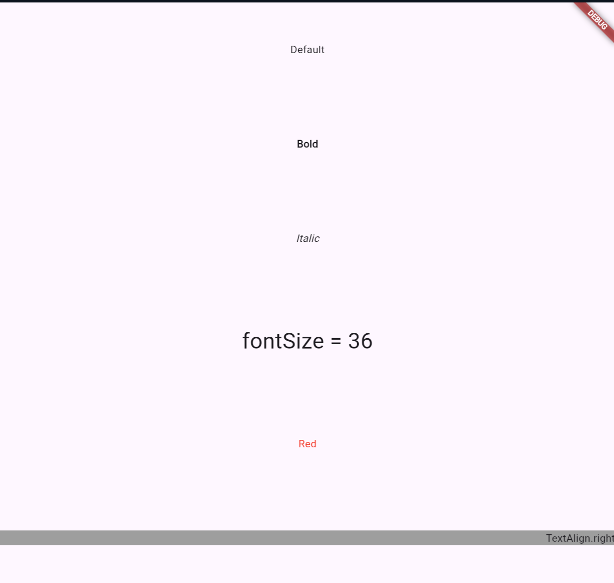
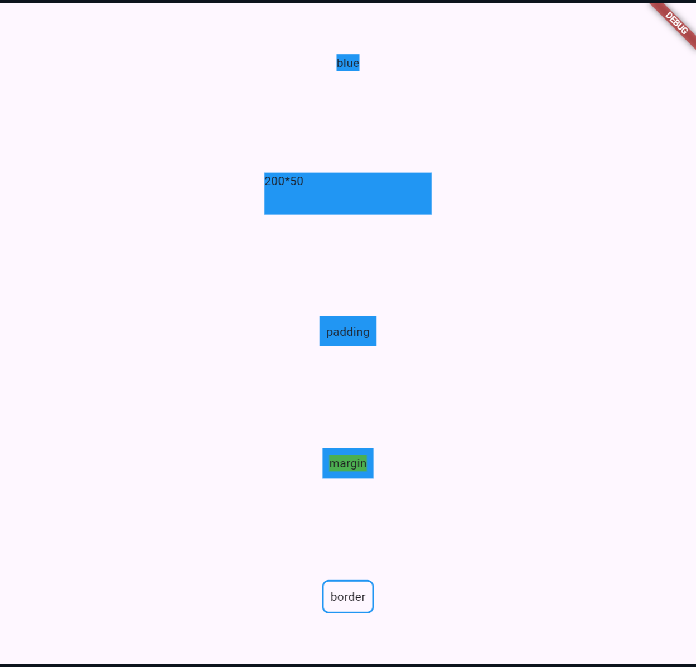
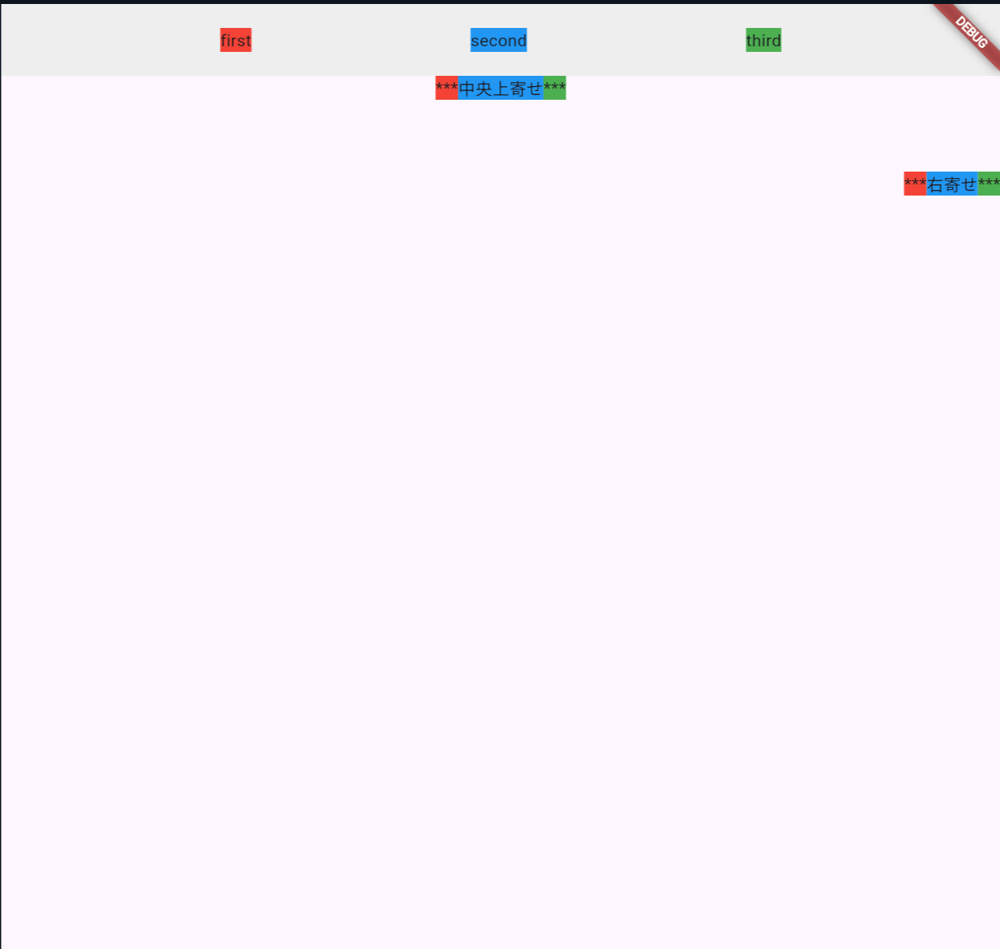
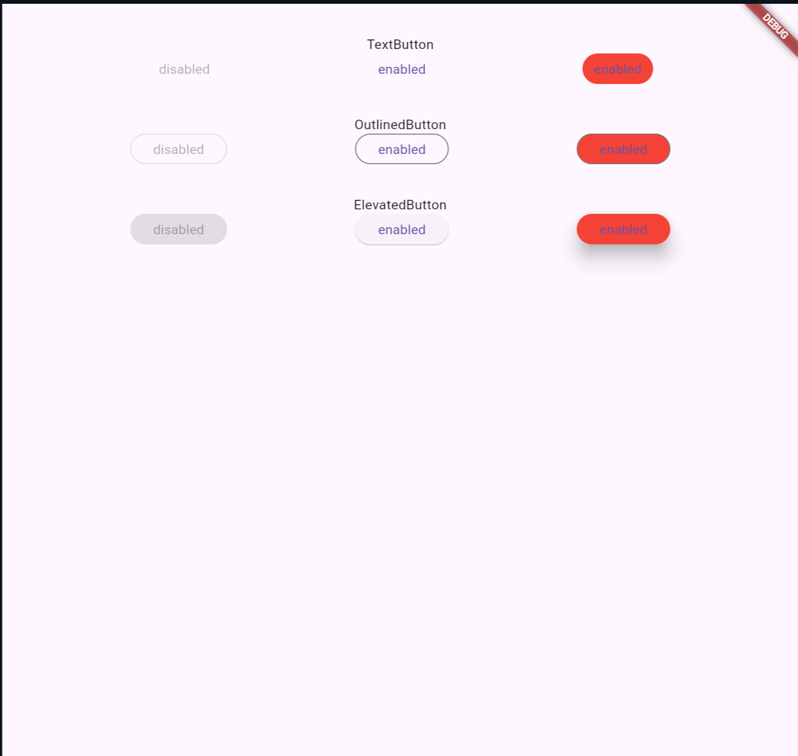
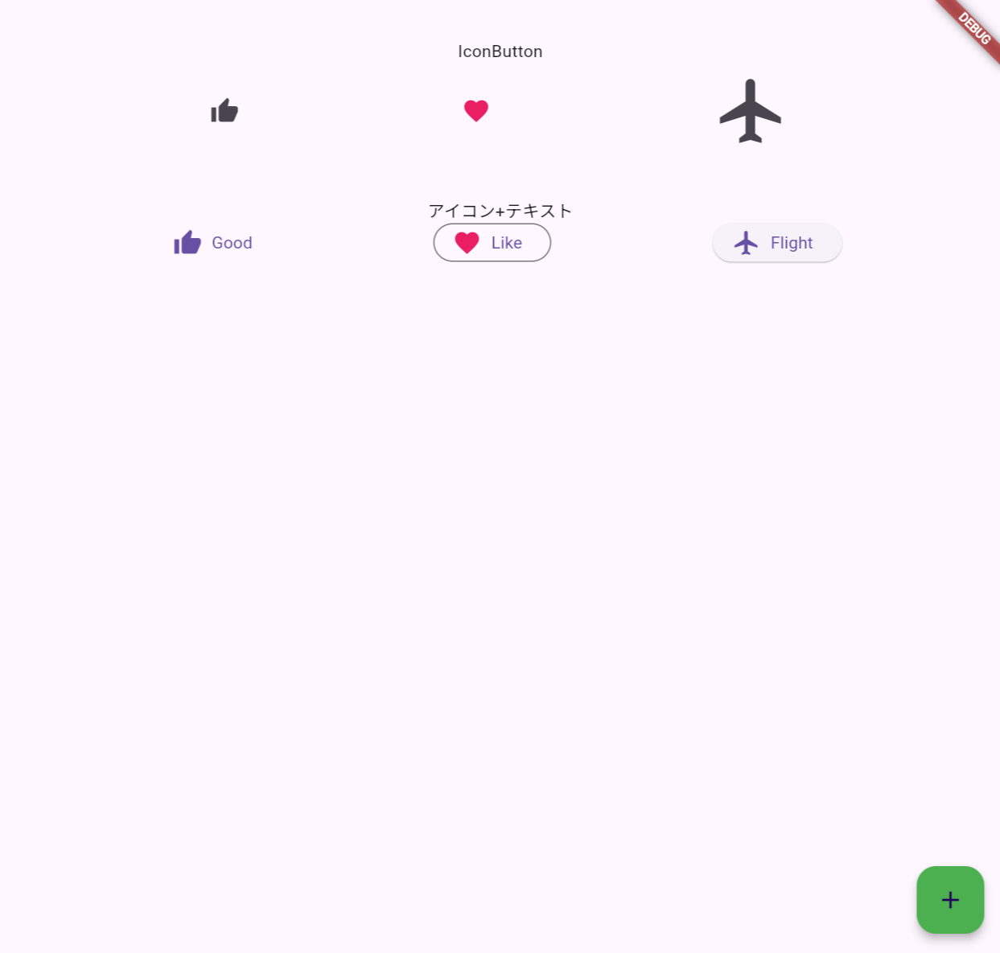
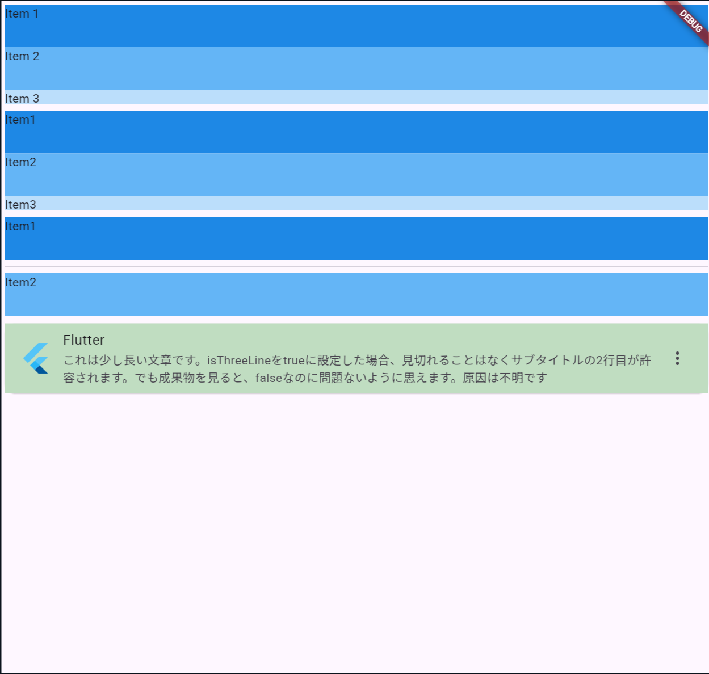
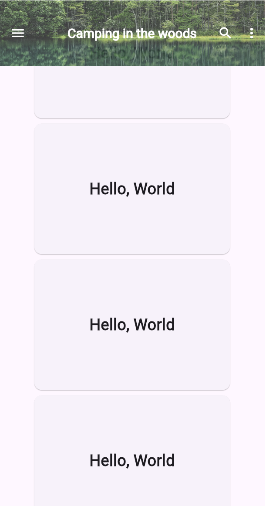

# クイズ(1:Dart言語)

## Q1. Dart言語の基本文法について知っていますか?

??? success

    ### 簡単に試したい場合

    ```text
    <online>
      https://dartpad.dev/
    
    <local>
      dart create <project-name>
    ```

    ### Hello World

    ```dart
    void main(){
      print("Hello, World");
    }
    ```

    ### var

    ```dart
    //ローカル変数にはvarを用いるのが公式の推奨事項らしい
    var name = "Hogehoge";
    var year = 1999;
    var syosuu = 3.14;
    var lists = ["Sun", "Mon", "Tues"];
    var dicts = {
      "hoge": ["hiyoko"],
      "url": "//piyopiyo/baby_chicken.jpg"
    };

    //Objectが単一の方に制限されていない場合
    Object name = "Hoge";

    //明示的な型定義
    String name = "Hoge";

    //NULL安全性 -> nullを許可するには、型宣言の末尾に?
    String? name;
    String name2;

    //final & const
    //constはコンパイル時に値決定、finalは単なる初期化後の再代入禁止
    // --> 定数コンストラクタにおけるfinalを思い浮かべるとわかるが
    // finalは必ずしも実行時に初期化されることを意味しない
    const bar = 100;
    final double hoge = 3.14 * bar; //実行時に値初期化可能

    //constがついていない場合、コンパイル時に値が決定するので、以下はエラー
    var x = 2;
    const y = 2*2;

    //以下ならOK
    const x = 2;
    const y = x*2;
    ```

    ### 型の例など

    ```dart
    var name = "Hoge";
    print(name.runtimeType); //String(型を調べる)
    print(name is String); //型が一致しているか調べる
    ```

    ### 制御文と繰り返し文

    ```dart
    if(year >= 2010){
      print("Generation Alpha");
    }
    else if(year >= 1995){
      print("Generation Z");
    }
    else{
      print("Uncategorized");
    }

    if(12 is int){
      print("12はint型です")
    }

    //for
    for(final item in lists){
      print(item);
    }

    for(int month = 1; month <= 12; month++){
      print(month);
    }

    //while
    while(year < 2016){
      year += 1;
    }

    //do-while
    int i = 0;
    do{
      print(i);
      i += 1;
    }while(i <= 1);

    ```

    ### switch式

    ```dart
    // switch文(旧来)

    switch(charCode){
      case slash || star || plus || minus:
        token = operator(charCode);
      case comma || semicolon:
        token = punctuation(charCode);
      case >= digit0 && <= digit9:
        token = number();
      default:
        throw FormatException("Invalid");
    }

    // switch式
    // caseキーワードがなく、defaultは_, =>のあとに処理を書く
    token = switch(charCode){
      slash || star || plus || minus => operator(charCode),
      comma || semicolon => punctuation(charCode),
      >= digit0 && <= digit9 => number(),
      _ => throw FormatException("Invalid")
    }
    ```

    ### 関数

    ```dart
    //基本。
    //引数や戻り値の型は指定することが推奨されている

    int fibonacci(int n){
      if(n == 0 || n == 1) return n;
      return fibonacci(n - 1) + fibonacci(n - 2);
    }

    var result = fibonacci(10);
    //-------------------------


    /* 
      <名前付きパラメータ>
      {}で囲むと、名前付きパラメータにできる
      requiredがないと、必須でなくなる
      defaultでもrequiredでもないなら、null許容である必要がある
    */
    void greet({required String name, int? level, String value = "default"}) {
      print("Hello, ${name}.");
      if (level == null) {
        print("Something's wrong.");
      }
      ;
    }

    //mainはエントリーポイントとして機能する
    //戻り値はvoid型で、引数はList<String>型のOptionパラメータ
    void main() {
      greet(name: "Nyanko");
      greet(level: 72, name: "Nukonuko");
    }
    //------------------------------


    /*位置引数で、オプションの引数を作りたい場合*/
    String say(String from, String msg, [String device = "tin can telephone"]){
      var result = "$from says $msg with a $device.";
      return result;
    }

    //assertは開発中に確認するためのメッセージ
    //assert(<condition>, <message>)で、第二引数はoption
    assert(say("Bob", "Henry") == "Bob says Henry with a tin can telephone.");
    assert(say("Bob", "Henry", "carrier pigeon") == "Bob says Henry with a carrier pigeon.");
    //------------------------------

    //コマンドラインアプリ
    void main(List<String> args){
      print(args);
      assert(args.length == 2);
      assert(int.parse(args[0]) == 1);
      assert(args[1] == "test");
    }
    // -----------------------------


    //関数を引数にする
    void printElem(int element){print(element);};
    var list = [1,2,3];
    list.forEach(printElem);
    //------------------------------


    /*
      無名関数 
      {}をつけた場合、=>は不要であることに注意
    */
    const list = ["Apples", "Bananas", "Calamansis"];

    var uppercaseList = list.map((item){
      return item.toUpperCase();
    }).toList();

    for(var item in uppercaseList){
      print("$item: ${item.length}");
    }

    var lowercaseList = list.map((item) => item.toLowerCase()).toList();
    lowercaseList.forEach((item)=> print("$item: ${item.length}"));

    //APPLES: 6
    //BANANAS: 7
    //CALAMANSIS: 10
    //apples: 6
    //bananas: 7
    //calamansis: 10
    
    //-------------------------------

    /*
      ClosureとScope
      関数はスコープ内で定義された変数を記憶する
    */
    Function makeAdder(int addBy){
      return (int i) => addBy + i;
    }

    void main(){
      var add2 = makeAdder(2);
      var add4 = makeAdder(4);

      print(add2(3)); //5
      print(add4(3)); //7
    }

    ```

    ### Record

    ```dart
    /*
      Record: 複数の戻り値を返す
        Recordは、固定サイズで、名前付きフィールドにも位置フィールドにもできる
        アクセスする場合は、$1から始まることに注意
    */

    (int, String) getMember(int number, String name){
      return (number, name);
    }

    void main(){
      final gm = getMember(1, "Nyanko");
      print(gm.$1); //1
    }

    // 名前付きフィールドの指定
    // 異なる名前の名前付きフィールドを持つ場合、それは異なる型を意味する
    ({int a, int b}) recordAB = (b: 24, a: 12);

    // 位置フィールドの指定
    // レコードの型には影響しないので代入可能
    (int c, int d) recordCD = (1,2);
    (int e, int f) recordEF = (3,4);
    recordCD = recordEF;

    //レコードは不変なので、Getterのみが存在する。
    print(recordAB.a); //12
    print(recordCD.$1); //3

    ```

    ### List

    ```dart
    List<String> list = ["Hoge", "Fuga", "Bar"];
    //末尾挿入
    list.add("Foo");
    //挿入
    list.insert(1, "Nyanko");
    //削除
    list.remove("Bar");
    print(list); //[Hoge, Nyanko, Fuga, Foo]
    //該当要素の位置
    print(list.indexOf("Fuga")); //2
    
    //昇順
    list.sort((a,b) => a.compareTo(b));
    print(list); //[Foo, Fuga, Hoge, Nyanko]

    //二次元Listのsort
    var values = [
      [1,2],
      [2,3],
      [3,1],
    ];

    values.sort((a,b)=> a[1].compareTo(b[1]));
    print(values); //[[3, 1], [1, 2], [2, 3]]

    //抽出(List化していないと以下のような出力に)
    var ages = [20,30,40,50,60];
    var filteredAges = ages.where((age) => age > 30);
    print(filteredAges); //(40, 50, 60)

    //ランダム
    var ages2 = [1,2,3,4,5];
    ages2.shuffle();
    print(ages2); //[2, 4, 1, 3, 5]

    //要素を順々に処理
    List<String> list = ["hoge", "fuga", "nyanko"];
    list.forEach((elem) => print(elem)); //

    //すべての要素がTrueなら
    list.every((elem) => elem.length > 5); //false

    //各要素に任意の操作を行い、returnで返す
    List<int> list = [1,2,3,4,5];
    print(list.map((e) => e * e).toList()); //[1, 4, 9, 16, 25]

    //畳み込み(他の言語のreduce = fold)
    List<int> list = [1,2,3,4,5];
    int sum = list.fold(1, (first, second) => first * second);
    print(sum); //120
    ```

    ### import 
    
    ```dart
    import 'dart:math';
    
    import 'package:test/test.dart';

    import 'path/to/my_file.dart';
    ```

    ### Map

    ```dart
    Map<String, String> language = {
      "Python" : "battery pack",
      "Java": "I exists only for the JVM",
      "C++" : "Goot at high-spped processing", 
    };

    //値の追加(put, getでも可能)
    language["JS"] = "Can be both the front and backend";

    //値の削除
    language.remove("C++");

    //順次処理
    language.forEach((key, val){
      print("$key: $val");
    });
    //Python: battery pack
    //Java: I exists only for the JVM
    //JS: Can be both the front and backend

    //keyの存在
    language.containsKey("Java"); //true

    //取り出し
    print(language["Python"]);
    //battery pack

    // constをつければ値を固定可能
    Map<String, String> info = const {
      "name" : "Nyanko",
      "place": "Tokyo",
    };

    info["name"] = "Nekonuko";
    // Unsupported operation: Cannot modify unmodifiable map


    //Map連結
    final map1 = {
      "name" : "Nekonuko"
    };

    final map2 = {
      "place": "Tokyo"
    };

    map1.addAll(map2);
    print(map1); //{name: Nekonuko, place: Tokyo}

    //List, Map相互変換

    List<String> names = ["Nyanko", "Nukonuko", "Inuneko"];
    Map<int, String> namesMap = names.asMap();
    print(namesMap); //{0: Nyanko, 1: Nukonuko, 2: Inuneko}

    print(namesMap.keys.toList()); //[0, 1, 2]
    print(namesMap.values.toList()); //[Nyanko, Nukonuko, Inuneko]

    var keyList = [];
    var valList = [];
    namesMap.forEach((key, val){
      keyList.add(key);
      valList.add(val);
    } )

    print(keyList); //[0, 1, 2]
    print(valList); //[Nyanko, Nukonuko, Inuneko]

    ```

    ### クラス

    ```dart

    class Psi{
      String name;
      int level;

      /*
      以下と同様の意味
      Psi(name, level){
        this.name = name;
        this.level = level
      }
      */
      Psi(this.name, this.level);

      // Method(${}は文字列補間)
      void describe(){
        print("Psi: ${name}( ${level} )");
      }
    }

    

    void main(){
      var telepathy = Psi(
          "テレパシー", 
          5, 
        );

      telepathy.describe();
    }
    
    ```

    ### 継承

    ```dart

    //先頭に_がついていると、privateになる
    // --> ここでいうprivateとは同一ライブラリからのみアクセス可能という意味
    // --> 普通クラスはファイルごとに分けるので問題ないとは思うが
    
    class Car{
      String brand;
      int year;

      Car(this.brand, this.year);

      void displayInfo(){
        print("Brand: $brand, Year: $year!");
      }
    }

    class SuperCar extends Car{
      double topSpeed;

      //先に基底クラスのコンストラクタにアクセスする
      SuperCar(String brand, int year, this.topSpeed)
       : super(brand, year);
      
      void displaySuperCarInfo(){
        print("Brand: $brand, Year: $year, Top Speed: $topSpeed");
      }
      void boost(){
        print("Boost activated! Top Speed is now ${topSpeed + 50}");
      }
    }

    void main(){
      var myCar = Car("Toyota", 2021);
      myCar.displayInfo();

      var mySuperCar = SuperCar("Ferrari", 2042, 650.0);
      mySuperCar.displayInfo();
      mySuperCar.displaySuperCarInfo();
      mySuperCar.boost();

      //Brand: Toyota, Year: 2021!
      //Brand: Ferrari, Year: 2042!
      //Brand: Ferrari, Year: 2042, Top Speed: 650
      //Boost activated! Top Speed is now 700

    }
    ```

    ### アクセス修飾子

    ```dart
    // _がつくと、private。正確には他ファイルからアクセス不可。
    class Car{
      String _brand;
      int _year;

      Car(this._brand, this._year);

      //getter
      String get brand => _brand;
      int get year => _year;

      //Setter
      set brand(String brand) => _brand = brand;
      set year(int year) => _year = year;

      void displayInfo(){
        print("Brand: $brand, Year: $year!");
        //print($_brand); //The getter '$_brand' isn't defined for the class 'SuperCar'
      }
    }

    class SuperCar extends Car{
      double topSpeed;

      //先に基底クラスのコンストラクタにアクセスする
      SuperCar(String brand, int year, this.topSpeed)
       : super(brand, year);
      
      void displaySuperCarInfo(){
        //基底クラスのprivateフィールドにはgetterを通じてアクセス
        print("Brand: $brand, Year: $year, Top Speed: $topSpeed");
      }
      void boost(){
        print("Boost activated! Top Speed is now ${topSpeed + 50}");
      }
    }

    void main(){
      var myCar = Car("Toyota", 2021);
      myCar.displayInfo();

      var mySuperCar = SuperCar("Ferrari", 2042, 650.0);
      mySuperCar.displayInfo();
      mySuperCar.displaySuperCarInfo();
      mySuperCar.boost();

      //Brand: Toyota, Year: 2021!
      //Brand: Ferrari, Year: 2042!
      //Brand: Ferrari, Year: 2042, Top Speed: 650
      //Boost activated! Top Speed is now 700

    }
    ```

    ### 抽象クラス

    ```dart
    //インスタンスを作れない
    abstract class Car{
      void info();
    }

    class SuperCar implements Car {
      String? brand;
      int? year;

      @override
      void info(){
        print("Brand: $brand, Year: $year!");
      }
      
    }

    void main(){
      var superCar = SuperCar();
      superCar.brand = "Toyota";
      superCar.year = 2011;

      superCar.info();
    }
    ```

    ### Mixins

    ```dart
    //複数のクラスから機能を取り込む

    mixin SuperCar {
      String? brand;
      int? year;

      void info(){
        print("Brand: $brand, Year: $year!");
        print("Super");
      }
    }

    class HyperCar {
      String? brand;
      int? year;

      void fly(){
        print("$brand社の車は、$year年に作られ、飛行能力を備えている");
        print("Hyper");
      }
    }

    /*
      SuperHyperCarは、HyperCarを継承する
      HyperCarは、SuperCarをmixinする
      結果、SuperHyperCarは、SuperCarと、HyperCarクラスの機能を使える
    */
    class SuperHyperCar extends HyperCar with SuperCar{

    }

    void main(){
      var superHyperCar = SuperHyperCar();
      superHyperCar.brand = "Toyota";
      superHyperCar.year = 2055;

      superHyperCar.info();
      superHyperCar.fly();

      //Brand: Toyota, Year: 2055!
      //Super
      //Toyota社の車は、2055年に作られ、飛行能力を備えている
      //Hyper
    }
    ```

    ### Cascade

    ```dart
    //直前のオブジェクトに対する処理を、簡略化

    class Color {
      String name = "";
      List<int> code = [0, 0, 0];

      Color(this.name, this.code);

      void info(){
        print("color: $name, code: $code");
      }

      void inversion(){
        code = [
          255 - code[0],  
          255 - code[1],  
          255 - code[2],  
        ];
      }
    }

    void main(){
       Color("red", [255,0,0])
        ..info()
        ..inversion()
        ..name = "Cyan"
        ..info();
    
    //color: red, code: [255, 0, 0]
    //color: Cyan, code: [0, 255, 255]
    }
    ```

    ### static

    ```dart
    //instance不要。いつもの
    class Monster{
      int? atk;
      static int total_num = 0;

      Monster(this.atk){
        total_num++;
      }

      static void info(){
        print("モンスターは現在$total_num匹存在する");
      }
    }

    void main(){
      var goblin1 = Monster(12);
      var oak1 = Monster(23);
      print(Monster.total_num); //2
      Monster.info(); //モンスターは現在2匹存在する
    }
    ```

    ### 名前付きコンストラクタ

    ```dart

    //名前付きコンストラクタ(オーバーロードがない代わり)
    class Mushroom {
      String name;
      String habitat;
      int risk_level = 0;
      String symptoms = "";

      Mushroom(this.name, this.habitat);

      Mushroom.danger(
        this.name, 
        this.habitat, 
        this.risk_level, 
        this.symptoms
      );
      
      void info(){
        print("name: $name, habitat: $habitat");
        if(symptoms != ""){
          print("symptoms: $symptoms");
        }
      }
    }

    void main(){
      var mushrooms = [
        Mushroom.danger("ツキヨタケ", "ブナ林", 1, "下痢、嘔吐"),
        Mushroom("なめこ", "枯れ木や切り株"),
      ];

      mushrooms[0].info();
      mushrooms[1].info();

      //name: ツキヨタケ, habitat: ブナ林
      //symptoms: 下痢、嘔吐
      //name: なめこ, habitat: 枯れ木や切り株
    }

    ```

    ### コンストラクタの実行順

    ```dart

    /*
    1. 初期化子リスト
    2. 基底クラスの引数なしコンストラクタ(または、1により手動呼び出し)
    3. サブクラスのコンストラクタ

    下記の例で行くと
    4. 初期化子リスト super(brand, year)で基底クラスのコンストラクタを呼び出し
    5. 基底クラスのコンストラクタが実行
    6. サブクラスのコンストラクタが実行

    --> 初期化子リストを使わない場合、デフォルトコンストラクタが暗黙呼び出しされ
        デフォルトコンストラクタがない場合、コンパイルエラーが発生する

    */

    class Car{
      String brand;
      int year;

      Car(this.brand, this.year){
        print("Car constructor");
      }
    }

    class SuperCar extends Car{
      double topSpeed;
      //初期化子リストを複数指定したい場合、カンマで区切る
      SuperCar(String brand, int year, this.topSpeed)
        : super(brand, year){
          print("SuperCar Constructor");
        }
    }

    void main(){
      var mySuperCar = SuperCar("Ferrari", 2044, 750.9);

      //Car constructor
      //SuperCar Constructor
    }

    //-------※(補足: 引数なしのコンストラクタあり)-------
    class Car{
      String? brand;
      int? year;

      Car(){
        print("Car constructor");
      }
    }

    class SuperCar extends Car{
      double topSpeed;

      SuperCar(this.topSpeed)
        {
          print("SuperCar Constructor");
        }
    }

    void main(){
      var mySuperCar = SuperCar(700.0);
      //Car constructor
      //SuperCar Constructor
    }
    ```

    ### スーパーパラメータ

    ```dart
    class Car{
      String brand;
      int year;

      Car({required this.brand, required this.year}){
        print("Car constructor: brand = $brand, year = $year");
      }
    }

    //初期化子リストを使う必要がないので、コードが簡潔、可読性も上がるはず
    class SuperCar extends Car{
      double topSpeed;

      SuperCar({
        required super.brand, 
        required super.year, 
        required this.topSpeed}
      ){
        print("SuperCar constructor: topSpeed = $topSpeed");
        }
    }

    void main(){
      var mySuperCar = SuperCar(
        brand: "Ferrari", 
        year: 2044, 
        topSpeed: 709.0,
      );
      //Car constructor: brand = Ferrari, year = 2044
      //SuperCar constructor: topSpeed = 709
    }
    ```

    ### リダイレクトコンストラクタ

    ```dart
    //コンストラクタ内で別のコンストラクタにアクセス
    // this() == Car()

    class Car{
      String brand;
      int year;
      Car(this.brand, this.year);

      Car.old(String brand) : this(brand, 1900);

      void info(){
        print("brand = $brand, year = $year");
      }
    }

    void main(){
        Car.old("Ford").info();
        //brand = Ford, year = 1900
    }
    ```

    ### 定数コンストラクタ

    ```dart
    /*
      条件
        すべてのインスタンス変数がfinalである必要がある
        --> finalフィールドはコンストラクタが呼び出された際に初期化される
        --> 今回はコンパイル時
      利点
        1 同じ値を持つ定数オブジェクトはメモリ内で共有 --> 使用量減少
        2 普遍性の保証
        3 コンパイル時に既に定数オブジェクトが作成されるため、ランタイム時の
          オーバーヘッド減少
      使用状況
        色や幾何学的な点等の、変更されないことが予測されるデータクラス
    */

    class Color{
      //finalとついてはいるものの、constコンストラクタで初期化されるため
      //実行時における代入は発生しない。
      final int red, green, blue;

      //定数コンストラクタ(constをつける)
      const Color(this.red, this.green, this.blue);
    }

    void main(){
      // ※constをつけないと別のインスタンスになるので注意
      // constキーワードを変数につけた場合、右辺の値もコンパイル時定数
      // であることが要求されるので、省略可能になる
      // つまり、以下はconst red = const Color(255,0,0);と同義
      const red = Color(255,0,0);
      const green = Color(0, 255, 0);
      const anotherRed = Color(255, 0, 0);

      //同じオブジェクトか調べる
      print(identical(red, anotherRed)); //true
      print(identical(red, green)); //false

    }
    ```

    ### ファクトリーコンストラクタ

    ```dart
    /*
    使い道
      ・cacheを利用して、同じインスタンスを返す
      ・条件に基づき、異なるクラスのインスタンスを返す
    
    利点
      ・cacheで、パフォーマンスの向上
      ・既存のインスタンスの再利用可能
      ・条件に基づき、異なるインスタンスを生成できる
      --> 明示的にreturnしない限り、インスタンスは返されない
    */

    //cache編

    class Logger{
      final String name;
      static final Map<String, Logger> _cache = {};

      //factory constructor
      //既存のinstanceがcacheにあればそれを返す
      //なければ新しいinstanceを作成し、cacheに保存しつつ、それを返す
      factory Logger(String name){
        //nullの可能性はないので、!(null非check演算子をつけている)
        if(_cache.containsKey(name)){
          return _cache[name]!;
        }
        else{
          final logger = Logger._internal(name);
          _cache[name] = logger;
          return logger;
        }
      }

      Logger._internal(this.name);

      void log(String message){
        print("$name: $message");
      }
    }

    void main(){
      //factoryコンストラクタへの呼び出し
      var logger1 = Logger("UI");
      var logger2 = Logger("UI");
      var logger3 = Logger("Network");

      print(identical(logger1, logger2)); //true
      print(identical(logger1, logger3)); //false

      logger1.log("Button clicked"); //UI: Button clicked
      logger3.log("Data fetched"); //Network: Data fetched
    }

    //条件編

    class Shape{
      
      //基底クラスのコンストラクタにアクセスするのでそれ用
      const Shape();

      factory Shape.create(String type){
        if(type == "circle"){ return Circle();}
        else if(type == "square"){ return Square();}
        else{ throw "Unknown shape type: $type";}
      }
    }

    //toStringでprint時の出力調整
    class Circle extends Shape{
      @override
      String toString() => "Circle";
    }

    class Square extends Shape{
      @override
      String toString() => "Square";
    }

    void main(){
      var shape1 = Shape.create("circle");
      var shape2 = Shape.create("square");
      print(shape1); //Circle
      print(shape2); //Square
    }
    ```

    ### シングルトンパターンについて

    ```dart
    /*
    特徴
      ・インスタンスが1つしかないことが保証される
    
    作り方
      1 privateな静的フィールドを用意し、該当クラスのインスタンスを保持させる
      2 factoryコンストラクタを通じてアクセスさせる
      --> 新しいインスタンスを作成しない可能性がある場合はこちらを使うので
    */

    class MySingleton{
      //String? name;

      static final MySingleton _instance = MySingleton._internal();

      factory MySingleton(){
        return _instance;
      }

      MySingleton._internal(){
        //name = "Nyanko";
      }
    }

    void main(){
      var singleTon1 = MySingleton();
      var singleTon2 = MySingleton();
      
      print(identical(singleTon1 , singleTon2)); //true
    }
    ```

    ### 初期化子リストの活用

    ```dart
    /*
      インスタンス変数をfinalで宣言した際の代入に使える
    */

    class Point {
      final double x, y;

      Point(double inX, double inY)
        : x = inX,
          y = inY {
            print("$x, $y");
          }
    }

    //なお、普通はこう書く
    class Point {
      final double x,y;
      Point(this.x, this.y){print("$x, $y");}
    }
    ```

    ### Enum

    ```dart
    //定数をまとめたもの = 列挙型

    /*
      version 2.17以降、大幅に強化されている
      field, method, constuructorの追加が可能になった
      --> constructorについては定数コンストラクタ
      --> つまり同じ値を持つなら、メモリ内で共有される
    */

    enum Rarity{
      unique("緋色武器", "Rare:5"),
      epic("紫武器", "Rare:4"),
      legendary("金武器", "Rare:3"),
      rare("青武器", "Rare:2"),
      uncommon("緑武器", "Rare:1"),
      common("白武器", "Rare:0");

      final String commonly_name;
      final String category;

      const Rarity(this.commonly_name, this.category);

      void describe(){
        print("$commonly_name, $category");
      }
    }

    void main(){
      var weapon1 = Rarity.unique;
      var weapon2 = Rarity.common;
      var weapon3 = Rarity.unique;

      weapon1.describe(); //緋色武器, Rare:5
      weapon2.describe(); //白武器, Rare:0

      print(weapon1.name); //unique 列挙値の名前を取得可能
      print(weapon2.index); //1 indexを取得可能
      print(identical(weapon1, weapon3)); //true
    }
    ```

    ### typedefとinline function

    ```dart
    //------typedef: 型に別の名前を付ける(2.13までは関数型のみの使用)

    typedef IntBinaryOperation = int Function(int a, int b);

    int add(IntBinaryOperation operation, int a, int b){
      return operation(a,b);
    }

    void main(){
      int result = add((a, b) => a + b, 2, 3);
      print(result);
    }

    //----------inline func

    int add(int Function(int a, int b) operation, int a, int b){
      return operation(a,b);
    }

    void main(){
      int result = add((a,b)=> a + b, 2, 3);
      print(result);
    }

    /*
      どちらを使うべきか

      シンプルな関数型
        inline-func
        --> 別途typedefを定義する手間がないため
        --> コードを読む際にすぐに肩の詳細を把握できるため
      
      複雑な関数型で、再利用が多い
        --> typedefを用いることで可読性が登場する
        --> typedefを使うことで、コードの重複が避けられる
    */

    //sortの例, ジェネリクスを用いて汎用的にしている

    typedef Compare<T> = int Function(T a, T b);

    int sortList<T>(List<T> list, Compare<T> compare){
      list.sort(compare);
      return list.length;
    }

    void main(){
      var list = [3,1,4,1,5,9];
      var list2 = ["Nyanko", "Nekoinu", "Nukonuko"];
      sortList<int>(list, (a,b) => a - b);
      sortList<String>(list, (a,b) => b.compareTo(a));
      print(list); //[1, 1, 3, 4, 5, 9]
      print(list2); //[Nyanko, Nukonuko, Nekoinu]
    }
    ```

    ### DateTime

    ```dart

    void main(){
      var now = DateTime.now(); 
      print(now); //2024-07-16 00:26:41.027
      print(
        "${now.year}-${now.month}-${now.day} ${now.hour}:${now.minute}:${now.second}:${now.millisecond}:${now.microsecond}"
      );
      //2024-7-16 0:26:41:27:0

      //ISO8601
      print(now.toIso8601String()); //2024-07-16T00:27:39.985
    }
    ```

    ### ジェネリクス

    ```dart
    //データの型を指定し、誤った方のデータが入れられるのを防ぐ
    //同様の処理を行うクラスやメソッドをまとめられる

    class User<T>{
      final T id;
      User(this.id);
    }

    void main(){
      //Genericsを使用していることを明記するために、User<>()とする
      //書かなくても動く
      final user = User<int>(1);
      print(user.id); //1

      final user2 = User<String>("first");
      print(user2.id); //first
    }

    //継承する場合

    abstract class User<T>{
      final T id;
      User(this.id);

      void info();
    }

    //Superクラスのジェネリクスまで指定すること
    class SingleUser<T> extends User<T>{
      SingleUser(super.id);

      void info(){
        print("info SingleUser");
        print(id);
      }
    }

    class MultiUser<T, K> extends User<T>{
      final K secondId;
      MultiUser(super.id, this.secondId);

      void info(){
        print("info MultiUser");
        print(id);
        print(secondId);
      }
    }

    void main(){
      final user1 = SingleUser<String>("Nyanko");
      user1.info(); 
      //info SingleUser
      //Nyanko

      final user2 = MultiUser<String, int>("00001", 1);
      user2.info(); 
      //info MultiUser
      //00001
      //1
    }

    //Genericsの型制限
    //ちなみに、dartは、3 + "Nyanko"という風にしても暗黙型変換しない
    num add<T extends num>(T a, T b){return a + b;}
    print(add(3,4));
    print(add(4, 5.12));
    print(add(3, "Nyanko")); 
    //Error: Inferred type argument 'Object' doesn't conform 
    // to the bound 'num' of the type variable 'T' on 'add'.

    ```

    ### range(i,j)の代替

    ```dart
    //もちろん、サードパーティのものをimportする選択肢もあるよ

    //1 rangeは内部的には、generatorを使っているはずなのでそうする
    // sync*を使用してgeneratorであることを示し、yieldで値を返す
    // yield*なら、委譲可能だが今回は使わない

    Iterable<int> range(int start, int end, [int step = 1]) sync* {
      if(step == 0){
        throw ArgumentError("Step cannot be zero");
      }

      if(start < end && step > 0){
        for(int i = start; i < end; i += step){
          yield i;
        }
      }
      else if(start > end && step < 0){
        for(int i = start; i > end; i += step){
          yield i;
        }
      }
      else {
        throw ArgumentError("The argument specification is incorrect.");
      }
    }

    void main(){
      var list1 = [];
      var list2 = [];
      for(var i in range(1,10)){
        list1.add(i);
      }

      for(var i in range(10, 1, -2)){
        list2.add(i);
      }

      for(var i in range(1, 10, -1)){
        print(i);　//Invalid argument(s): The argument specification is incorrect
      }

      print(list1); //[1, 2, 3, 4, 5, 6, 7, 8, 9]
      print(list2); //[10, 8, 6, 4, 2]
    }

    //--------個数が決まっているなら: indexを基準とする--------------
    var range = List.generate(9, (i) => i + 2);
    print(range); //[2, 3, 4, 5, 6, 7, 8, 9, 10]
    ```

    ### コレクション内包

    ```dart
    //Pythonでいうリスト内包表記の代替(2.3以上)
    //filteringも可能

    void main(){
      var list = [for (var i = 1; i <= 10; i++) i]; 
      print(list); //[1, 2, 3, 4, 5, 6, 7, 8, 9, 10]

      //filter
      var evenlist = [for (var i = 1; i <= 10; i++) if (i % 2 == 0) i];
      print(evenlist); //[2, 4, 6, 8, 10]

      //nest
      var list = [
        for(var i = 1; i<=3; i++)
        for(var j = 1; j<=3; j++)
        [i,j]
      ];
      print(list);
      //[[1, 1], [1, 2], [1, 3], [2, 1], [2, 2], [2, 3], [3, 1], [3, 2], [3, 3]]

      //map
      var mapTest = {for (var i=1; i<=3; i++) i: "value is $i"};
      print(mapTest); //{1: value is 1, 2: value is 2, 3: value is 3}

      //set
      var setTest = {for (var i=1; i<=3; i++) i};
      print(setTest); //{1, 2, 3}
    }
    ```

    ### Dynamic vs Object

    ```text
    dynamic
      ・動的型（実行時に型が決まる）で、どのような型の値でも受け入れ可能
      ・コンパイル時の型チェックが行われないので、型安全性が犠牲になる
      ・動的型の変数に対して無効な操作を行った場合、ランタイムエラーとなる
    
    Object
      ・すべてのDartオブジェクトの基本型で、
      　すべての型がObjectを継承する(null以外)
      ・コンパイル時に型チェックが行われる
      ・Object型の変数には、Objectに定義されているメソッドのみが適用可能なため
        特定の型のメソッドやプロパティにアクセスしたい場合キャストが必要
        --> 冗長
    
    dynamicの使い道
      --> JSONでは構造が動的であることが多いので、
          柔軟に取り扱えるdynamicが適していることが多い
      --> Objectだと、複雑な構造や、構造が頻繁に変更される場合に
          エラーが発生しやすくなる
    ```

    ### JSON

    ```dart
    //encode&decode用のlibrary
    //jsonEncode --> encode
    //jsonDecode --> decode
    import "dart:convert";

    void main(){
      String jsonString = '{"name": "Alice", "age": 30}';
      Map<String, dynamic> user = jsonDecode(jsonString);

      //dynamicを使用しているので、直接プロパティにアクセス可能
      //dynamicはnullを含むすべての値を受け入れられるので、?は不要
      print(user["name"]);
      print(user["age"]);

      //Objectを利用した場合(nullになる可能性があるので、)
      Map<String, Object?> user2 = jsonDecode(jsonString);

      //型キャスト(as)を行う手間が発生する
      print((user2["name"] as String));
      print((user2["age"] as int));
    }

    ```

    ### 非同期処理

    ```dart
    //Future.delayedで、データ取得までに2秒待っている
    //非同期関数は常にFutureを返す
    //awaitの結果として得られる値はFutureが解決されると、型に応じて変換される

    import "dart:async";

    Future<String> fetchData() async {
      await Future.delayed(Duration(seconds: 2));
      return "Fetched Complete";
    }

    void main() async {
      print("Fetching Data...");

      String data = await fetchData();
      print(data);
    }

    //複数の非同期操作(並列ではない)

    import "dart:async";

    Future <String> fetchData1() async{
      await Future.delayed(Duration(seconds: 2));
      return "Data 1";
    }

    Future <String> fetchData2() async{
      await Future.delayed(Duration(seconds: 3));
      return "Data 2";
    }

    void main() async{
      print("Fetching data1...");
      String data1 = await fetchData1();
      print("Fetching data2...");
      String data2 = await fetchData2();

      print(data1);
      print(data2);

      //同期操作が先に実行される
      //Fetching data1...
      //Fetching data2...
      //Data 1
      //Data 2
    }

    //エラーハンドリング
    import "dart:async";
    Future<String> fetchData() async{
      await Future.delayed(Duration(seconds: 2));
      throw "An error occurred";
    }

    void main() async{
      print("Fetching data");

      try{
        String data = await fetchData();
        print(data);
      }catch(e){
        print("Error $e");
      }
    }

    //並列処理(Future.wait)
    import "dart:async";

    Future<String> fetchData1() async{
      await Future.delayed(Duration(seconds: 2));
      return "Nyanko";
    }

    Future<String> fetchData2() async{
      await Future.delayed(Duration(seconds: 2));
      return "Nyanko2";
    }

    void main() async{
      print("Fetching data...");

      List<String> results = await Future.wait(
        [fetchData1(), fetchData2()]
      );

      for(String result in results){print(result);}

    }


    ```

    ### 演算子等

    ```text
    ?
      null許容演算子
    
    !
      nullにならないことが確実にわかっている場合に使用
      実際にnullである場合は、アプリがクラッシュする
    
    ??
      nullであった場合に、デフォルト値を渡す処理で用いる

    ?. ?[]
      nullをとる可能性のあるオブジェクトに対し、アクセス可能

    as
      キャスト
    
    is, is!
      変数の型が一致しているかの検証(継承元でもtrue, is dynamicは常にtrue)

    [...hoge]
      スプレッド演算子
    ```

    ```dart
    //mathライブラリのRandomクラスで乱数生成
    import "dart:math" as math;

    void main(){
      var random = math.Random();
      String? name;
      if(random.nextBool()){
        name = "Nyanko";
      }

      var ans = name ?? "Nanashi";
      print(ans); //Nyanko or Nanashi

    Set<int> set1 = {1,2,3,4,5};
    List<int> list1 = [...set1];
    print(list1); //[1, 2, 3, 4, 5]
    }


    ```

    ### 所感

    ```text
    ・pythonのような簡潔な記法とその他の言語のいいとこどりをしたかのようだ
    ・型推論や、NULL安全性を備えているのもGood
    ・さすが後発言語
    ```

## Q2. Flutterの環境構築ができますか?

??? success

    ### 環境構築

    ```text
    Step0
      ・[公式の手順](https://docs.flutter.dev/get-started/install)に則って環境構築を進める
    
    Step1
      ・flutter doctorを実行
      --> WindowsならVisual Studioが必要
      --> Androidなら、Android toolchainが必要
      --> 足りない箇所は表示してくれる
      --> 今回はAndroidで実行してみる(せっかくクロスプラットフォームなので)
    
    Step2
      ・Shift + Ctrl + Pでflutterと打ち込み、新しいプロジェクトを作成
      ・またコマンドパレットを開き、Flutter:Select Deviceで端末選択
      ・lib/main.dartでF5(実行>デバッグの開始)を押して、アプリを起動
      --> 起動には少し時間がかかるが、起動後はホットリロード可能
    
    cmdの場合
      ・flutter create <app-name> --> プロジェクト作成
      ・flutter devices --> 起動しているデバイス一覧の確認
      ・flutter run --device-id <deviceのidを指定　Chromeならchrome>
        --> 今回の場合は、emulator-5554だった
    ※遅いと感じた場合は、VMアクセラレータをONにする 
    ```

## Q3. Flutterの基礎について知っていますか?

??? success
    ### 基本的な用語を理解する

    ```text
    Flutter
      ・クロスプラットフォームのアプリを作成するためのツール
      ・Googleが提供している
      ・プログラミング言語はDart
      ・Dartが、1つのソースコード --> 
        iOS/Android/Webで動作する形式に変換している
      
    各種ファイル
      ・lib: メインのソースコード用ディレクトリ
      ・web: Webアプリに依存したファイルを配置
      ・ios: iOSアプリに依存したファイルを配置
      ・android: Androidアプリに依存したファイルを配置
      ・pubspec.yaml: 依存ライブラリ定義ファイル
      ・test: testコード用のディレクトリ
      
    Widget
      ・UserInterfaceを構築するための部品
      ・Widgetを組み合わせて、目的のUIを表現する
      ・親Widget-子Widgetのようにツリー構造になっているので、
        Widget-treeと呼ばれる

    runApp()
      Widgetを受け取り、これをルートにする
    ```

    ```dart
    /*
      Materialデザインに則った、Flutterアプリ開発に必要なファイルを含む
    */
    import "package:flutter/material.dart";

    /*
      Center: 中央寄せ用Widget
      Text: テキスト用Widget
      Treeで考えると
        runApp --> Center --> Text

      TextDirection: テキストの方向を指定
    */
    void main(){
      // void runApp(Widget app)
      runApp(
        const Center(
          child: Text(
            "Hello, World!",
            textDirection: TextDirection.ltr,
          ),
        ),
      );
    }
    ```

    ### 基本的なWidget

    ```dart
    //Text
    Text("Hogehoge");

    //Text(Style)
    Text("Hogehoge", style: TextStyle(
      fontWeight: FontWeight.bold,
      fontStyle: FontStyle.italic,
      fontSize: 30,
      color: Colors.green,
      textAlign: TextAlign.right,
    ))

    //Row, Column
    //水平、垂直方向に柔軟なレイアウトを設定できる

    //Stack
    //直線上に配置するのではなく、ウィジェットを重ねて配置可能

    //Container
    //長方形の資格要素を作成可能
    ```

    ### 基本的な用語2
    ```text
    Text
      ・テキスト用のレイアウトを設定する
    
    Row,Column
      ・水平、垂直方向に柔軟なレイアウトを設定できる

    Stack
      ・直線上に配置するのではなく、ウィジェットを重ねて配置可能

    Container
      ・長方形の視覚要素を作成可能
      
    StatelessWidget
      ・状態が変化しないWidget
      ・継承元

    Widget build(BuildContext context)
      ・buildメソッドは、FlutterのWidget-Treeを構築するためのメソッド
      ・StatelessWidgetやStatefullWidgetに必ず実装される
      ・buildメソッド内で、Widgetを返すことで、画面に表示される内容
      　が定義される
    
    theme: ThemeData(primarySwatch: Colors.blue)
      ・ThemeData: Flutterアプリ全体のテーマを定義するためのクラス
                    色、font, icon等のスタイルが含まれる
      ・primarySwatch: アプリのプライマリーカラーを定義する
    
    mainAxisAlignment: MainAxisAlignment.spaceAround
      ・Flutterのレイアウトアルゴリズムの一部
      ・Widgetを主軸(垂直or水平)に沿ってどのように配置するかを指定
      ・spaceAroundは子Widget間に等間隔のスペースを挿入し
      　最初と最後の子Widgetの外側にも同じSpaceを入れる
    
    child, children
      ・child: 一つのWidgetを持つことができる
      ・children: 複数のWidgetを持つことができる

    MaterialApp
      ・Material-Designの原則に従ったFlutterアプリを構築するための
        Widget.
      ・アプリ全体の設定や、テーマ、ナビゲーションなどを管理
      ・例）
        title: アプリのタイトル
        theme: アプリケーションのテーマを設定(ThemeData)
        home: アプリ起動時に表示されるWidget
        routes: アプリケーションのルートと対応するWidget
                navigationを簡単に管理可能
        initialRoute: アプリ起動時に初期表示されるルート
        navigatorKey: ナビゲータの状態を管理するためのキー
        locale: 言語と地域
        debugShowCheckedModeBanner: DEBUGバナーを表示するか
    Scaffold
      ・典型的なMaterial-Designアプリのレイアウトを構築するための
        Widget
      ・アプリの主要なUI要素を簡単に配置可能
      ・例)
        ・appBar: アプリバーを表示
        ・body: メインのコンテンツを表示
        ・floatingActionButton: 英語名の通り
        ・drawer: 左からスライドするdrawerを表示
        ・bottomNavigationBar: 画面下部にナビゲーションバーを表示
        ・backgroundColor: 背景色     
    ```

    ### 例1

    ```dart
    import "package:flutter/material.dart";

    void main() => runApp(MyApp());
    
    class MyApp extends StatelessWidget {

      @override
      Widget build(BuildContext context){
        return MaterialApp(
          title: "Flutter Demo",
          theme: ThemeData(primarySwatch: Colors.blue),
          home: Scaffold(
            body: Column(
              mainAxisAlignment: MainAxisAlignment.spaceAround,
              children: <Widget>[
                Text("Default"),
                Text("Bold", style: TextStyle(fontWeight: FontWeight.bold)),
                Text("Italic", style: TextStyle(fontStyle: FontStyle.italic)),
                Text("fontSize = 36", style: TextStyle(fontSize: 30)),
                Text("Red", style: TextStyle(color: Colors.red)),
                Container(
                  width: double.infinity,
                  color: Colors.grey,
                  child: Text("TextAlign.right", textAlign: TextAlign.right),
                ),
              ],
            ),
          ),
        );
      }
    }
    ```

    

    ### 基本的な用語3

    ```text
    Container
      ・Size, 背景, 余白, 枠線などを指定可能
    
    EdgeInsets.all(10)
      ・長方形の各辺四方向に10の余白を与える
      ・marginなら外側に、paddingなら内側に
    
    BorderDecoration
      ・Widgetの修飾を行う
    
    BorderRadius.circular(10)
      ・角を10だけ丸くする
    ```

    ```dart
        import "package:flutter/material.dart";

    void main() => runApp(MyApp());

    class MyApp extends StatelessWidget{
      @override
      Widget build(BuildContext context){
        return MaterialApp(
        title: "Flutter Demo",
        theme: ThemeData(primarySwatch: Colors.blue),
        home:  Scaffold(
          body: Center(
            child : Column(
              mainAxisAlignment: MainAxisAlignment.spaceAround,
              children: <Widget>[
                Container(
                  color: Colors.blue,
                  child: Text("blue"),
                ),
                //textは指定がない場合、左上から始まる
                Container(
                  width: 200,
                  height: 50,
                  color: Colors.blue,
                  child: Text("200*50"),
                ),
                //内側スペース
                Container(
                  padding: EdgeInsets.all(8),
                  color: Colors.blue,
                  child: Text("padding"),
                ),
                //外側スペース
                Container(
                  color: Colors.blue,
                  child: Container(
                    margin: EdgeInsets.all(8),
                    color: Colors.green,
                    child: Text("margin"),
                  ),
                ),
                Container(
                  decoration: BoxDecoration(
                    border: Border.all(
                      color: Colors.blue,
                      width: 2),
                    borderRadius: BorderRadius.circular(8),
                  ),
                  padding: EdgeInsets.all(8),
                  child: Text("border"),
                ),
              ],
            ),
          ),
        ),
      );
      }
    }
    ```

    


    ### 基本的な用語その4

    ```text
    --> crossと名があるように
        本来縦に並べるColumnで、左右の幅を変えたければCross
        本来横に並べるRowで、上下の幅を変えたければCross
       
    縦に並べたWidgetの左寄せ
      crossAxisAlignment: CrossAxisAlignment.start;
      --> 横の場合は、mainAxisAlignmentだったね

    縦に並べたWidgetの右寄せ
      crossAxisAlignment: CrossAxisAlignment.end;
    
    縦方向の中央寄せ
      mainAxisAlignment: MainAxisAlignment.center;
    
    縦方向の下寄せ
      mainAxisAlignment: MainAxisAlignment.end;
    
    縦方向の均等配置
      mainAxisAlignment: MainAxisAlignment.spaceEvenly;
    ```

    ```dart
    import "package:flutter/material.dart";

    void main() => runApp(MyApp());

    class MyApp extends StatelessWidget {
      @override
      Widget build(BuildContext context){
        return MaterialApp(
          title : "Flutter Demo",
          theme: ThemeData(primarySwatch: Colors.blue),
          home: Scaffold(
            body: Column(
              children: <Widget>[
                Container(
                  width: double.infinity,
                  height: 60,
                  color: Colors.grey[200],
                  child: Row(
                    //均等配置
                    mainAxisAlignment: MainAxisAlignment.spaceEvenly,
                    children: <Widget>[
                      Container(color: Colors.red, child: Text("first")),
                      Container(color: Colors.blue, child: Text("second")),
                      Container(color: Colors.green, child: Text("third")),
                    ],
                  ),
                ),
                Container(
                  width: double.infinity,
                  height: 60,
                  child : Row(
                    //中央上寄せ
                    mainAxisAlignment: MainAxisAlignment.center,
                    crossAxisAlignment: CrossAxisAlignment.start,
                    children: <Widget>[
                      Container(color: Colors.red, child: Text("***")),
                      Container(color: Colors.blue, child: Text("中央上寄せ")),
                      Container(color: Colors.green, child: Text("***")),
                    ],
                  ),
                ),

                Container(
                  width: double.infinity,
                  height: 60,
                  child: Row(
                    //右寄せ
                    mainAxisAlignment: MainAxisAlignment.end,
                    children: <Widget>[
                      Container(color: Colors.red, child: Text("***")),
                      Container(color: Colors.blue, child: Text("右寄せ")),
                      Container(color: Colors.green, child: Text("***")),
                    ],
                  ),
                ),
              ],
            ),
          ),
        );
      }
    }
    ```

    

    ### 基本的な用語その5

    ```text
    TextButton
      ・影のないボタン
    
    OutlinedButton
      ・枠線のあるボタン
    
    ElevatedButton
      ・影のあるボタン
    
    onPressed
      ・押下された時の処理を記載する
      --> ボタンから手を離したとき
    
    onTab
      ・押下された時の処理を記載する
      --> ボタンに触れた瞬間
    
    style: ***Button.styleFron()
      ・各ボタンのテーマ色変更
    
    elevation
      ・影の深さを変える
    
    backgroundColor
      ・ボタンの背景色
    
    foregroundColor
      ・ボタンの文字色
    
    EdgeInsert.only()
      ・長方形の一方向のみ空白を作る
    ```

    ### 例4

    ```dart
    import "package:flutter/material.dart";

    void main() => runApp(MyApp());

    class MyApp extends StatelessWidget{
      @override
      Widget build(BuildContext context){
        return MaterialApp(
          title: "Flutter Demo",
          theme: ThemeData(primarySwatch: Colors.blue),
          home: Scaffold(
            body: Column(
              children: <Widget>[
                Container(
                  padding: EdgeInsets.only(top: 32),
                  child: Text("TextButton"),
                ),
                Row(
                  mainAxisAlignment: MainAxisAlignment.spaceEvenly,
                  children: <Widget>[
                    TextButton(
                      onPressed: null,
                      child: Text("disabled"),
                    ),
                    TextButton(
                      onPressed: (){},
                      child: Text("enabled"),
                    ),
                    TextButton(
                      style: TextButton.styleFrom(
                        backgroundColor: Colors.red
                      ),
                      onPressed: (){},
                      child: Text("enabled"),
                    ),
                  ],
                ),
                Container(
                  padding: EdgeInsets.only(top: 32),
                  child: Text("OutlinedButton"),
                ),

                Row(
                  mainAxisAlignment: MainAxisAlignment.spaceEvenly,
                  children: <Widget>[
                    OutlinedButton(
                      onPressed: null,
                      child: Text("disabled"),
                    ),
                    OutlinedButton(
                      onPressed: (){},
                      child: Text("enabled"),
                    ),
                    OutlinedButton(
                      style: TextButton.styleFrom(
                        backgroundColor: Colors.red
                      ),
                      onPressed: (){},
                      child: Text("enabled"),
                    ),
                  ],
                ),

                Container(
                  padding: EdgeInsets.only(top: 32),
                  child: Text("ElevatedButton"),
                ),

                Row(
                  mainAxisAlignment: MainAxisAlignment.spaceEvenly,
                  children: <Widget>[
                    ElevatedButton(
                      onPressed: null,
                      child: Text("disabled"),
                    ),
                    ElevatedButton(
                      onPressed: (){},
                      child: Text("enabled"),
                    ),
                    ElevatedButton(
                      style: TextButton.styleFrom(
                        backgroundColor: Colors.red,
                        elevation: 16,
                      ),
                      onPressed: (){},
                      child: Text("enabled"),
                    ),
                  ],
                ),
              ],
            ),
          ),
        );
      }
    }
    ```

    

    ### 基本的な用語その6

    ```text
    IconButton
      ・アイコンを表示したい場合
    
    TextButton.icon
    OutlinedButton.icon
    ElecatedButton.icon
      ・テキストとアイコンを含めたボタンを表示した場合

    FloationActionButton
      ・Materialデザインを採用した青売りで表示されるボタン
      ・お手軽に表示可能
    ```

    ### 例5

    ```dart
    import "package:flutter/material.dart";

    void main() => runApp(MyApp());

    class MyApp extends StatelessWidget {
      @override
      Widget build(BuildContext context){
        return MaterialApp(
          title: "Flutter Demo",
          theme: ThemeData(primarySwatch: Colors.blue),
          home: Scaffold(
            body: Column(
              children: <Widget>[
                Container(
                  padding: EdgeInsets.only(top: 32),
                  child: Text("IconButton"),
                ),
                Row(
                  mainAxisAlignment: MainAxisAlignment.spaceEvenly,
                  children: <Widget>[
                    IconButton(
                      onPressed: (){},
                      icon: Icon(Icons.thumb_up),
                    ),
                    //hoverすると色が変わる
                    IconButton(
                      color: Colors.pink,
                      onPressed: (){},
                      icon: Icon(Icons.favorite),
                    ),
                    IconButton(
                      iconSize: 64,
                      onPressed: (){},
                      icon: Icon(Icons.flight),
                    ),
                  ],
                ),
                Container(
                  padding: EdgeInsets.only(top: 32),
                  child: Text("アイコン+テキスト"),
                ),
                Row(
                  mainAxisAlignment: MainAxisAlignment.spaceEvenly,
                  children: <Widget>[
                    TextButton.icon(
                      onPressed:(){},
                      icon: Icon(Icons.thumb_up),
                      label: Text("Good")
                    ),
                    OutlinedButton.icon(
                      onPressed:(){},
                      icon: Icon(Icons.favorite, color: Colors.pink),
                      label: Text("Like")
                    ),
                    ElevatedButton.icon(
                      onPressed:(){},
                      icon: Icon(Icons.flight),
                      label: Text("Flight")
                    ),
                  ],
                ),
              ],
            ),
            floatingActionButton: FloatingActionButton(
              backgroundColor: Colors.green,
              onPressed: (){},
              child: Icon(Icons.add),
            ),
          ),
        );
      }
    }
    ```

    

    ### 基本的な用語その7

    ```text
    ListView
      ・スクロールに対応しているリスト
      ・Columnと異なり見切れない
    
    ListView.builder(
      itemCount: list.length,
      itemBuilder: (context, index){return list[index];},
    )
      ・データからリストを作成する
    
    Image.network
      ・URLから画像を操作する

    ListTile
      ・Title, SubTitle, Image, Icon等を含めたアイコンを作成可能
    
    Card
      ・影の付いたカードUIを作成可能
    
    ListView.separated
      ・項目間に区切り線(separatorBUilder)を追加可能
    ```

    ### 例6 

    ```dart
    import "package:flutter/material.dart";

    void main() => runApp(MyApp());

    class MyApp extends StatelessWidget{
      final List<Map<String, dynamic>> listItems = [
        {"text":"Item1", "color": Colors.blue[600],},
        {"text":"Item2", "color": Colors.blue[300],},
        {"text":"Item3", "color": Colors.blue[100],},
      ];

      @override
      Widget build(BuildContext context){
        return MaterialApp(
          title: "Flutter Demo",
          theme: ThemeData(primarySwatch: Colors.blue),
          home: Scaffold(
            body: Column(
              children: <Widget>[
                //スクロールできることを確認可能
                Container(
                  height: 125,
                  padding: EdgeInsets.all(4),

                  //直接指定した場合
                  child: ListView(
                    children: <Widget>[
                      Container(
                        height: 50,
                        color: Colors.blue[600],
                        child: Text("Item 1"),
                      ),
                      Container(
                        height: 50,
                        color: Colors.blue[300],
                        child: Text("Item 2"),
                      ),
                      Container(
                        height: 50,
                        color: Colors.blue[100],
                        child: Text("Item 3"),
                      ),
                    ],
                  ),
                ),

                //データをもとに表示
                Container(
                  height: 125,
                  padding: EdgeInsets.all(4),
                  child: ListView.builder(
                    itemCount: listItems.length,
                    itemBuilder: (context, index){
                      return Container(
                        height: 50,
                        color: listItems[index]["color"],
                        child: Text(listItems[index]["text"]),
                      );
                    },
                  ),
                ),

                //各アイテムの間にスペースを挟む
                Container(
                  height: 125,
                  padding: EdgeInsets.all(4),
                  child: ListView.separated(
                    itemCount: listItems.length,
                    itemBuilder: (context, index){
                      return Container(
                        height: 50,
                        color: listItems[index]["color"],
                        child: Text(listItems[index]["text"]),
                      );
                    },
                    separatorBuilder: (context, index){
                      return Divider();
                    }
                  ),
                ),

                //ListTile
                Card(
                  child: ListTile(
                    leading: FlutterLogo(size: 40.0),
                    title: Text("Flutter"),
                    subtitle: Text("これは少し長い文章です。isThreeLineをtrueに設定した場合、見切れることはなくサブタイトルの2行目が許容されます。でも成果物を見ると、falseなのに問題ないように思えます。原因は不明です"),
                    trailing: Icon(Icons.more_vert),
                    isThreeLine: false,
                    tileColor: Colors.green[100],
                    onTap: (){},
                  ),
                ),
              ],
            ),
          ),
        );
      }
    }
    ```

    

    ### 基本的な用語その8

    ```text
    AppBar
      ・基本的には画面上部に位置する
      ・メインの内容を端的に伝えるため or ユーザ操作用に配置する

      actionは、右側のアイコン一覧
    
    SingleChildScrollView
      ・スクロール不要な長さの時はしない
      ・縦の長いコンテンツを表示したいとき、Columnをラップするように使う
    ```

    ```dart
    
    //以下の写真は、Takashi Miyazaki氏が、撮影した写真です。
    //写真はunsplashから拝借しました

    import "package:flutter/material.dart";

    void main() => runApp(MyApp());

    class MyApp extends StatelessWidget {
      @override
      Widget build(BuildContext context) {
        return MaterialApp(
          title: "Flutter Demo",
          theme: ThemeData(primarySwatch: Colors.grey),
          debugShowCheckedModeBanner: false,
          home: Scaffold(
            appBar: AppBar(
              leading: Icon(Icons.menu, color: Colors.white),
              title: Text(
                "Camping in the woods",
                style: TextStyle(fontWeight: FontWeight.bold, fontSize: 20, color: Colors.white)
              ),
              centerTitle: true,
              actions: <Widget>[
                IconButton(
                  onPressed: () {},
                  icon: Icon(Icons.search, color: Colors.white),
                ),
                IconButton(
                  onPressed: () {},
                  icon: Icon(Icons.more_vert, color: Colors.white),
                ),
              ],
              elevation: 0,
              toolbarHeight: 100,
              flexibleSpace: Opacity(
                 opacity: 0.8,
                child: Image.network(
                "https://images.unsplash.com/photo-1721175789798-c1c8b6664480?q=80&w=2456&auto=format&fit=crop&ixlib=rb-4.0.3&ixid=M3wxMjA3fDB8MHxwaG90by1wYWdlfHx8fGVufDB8fHx8fA%3D%3D",
                fit: BoxFit.cover,
              ),
              ),
              
              backgroundColor: Colors.white.withOpacity(0.5),
              
            ),
            extendBodyBehindAppBar: true,
            body: MyWidget(),
          ),
        );
      }
    }

    class MyWidget extends StatelessWidget{
      @override
      Widget build(BuildContext context){
        return SingleChildScrollView(
          child: Column(
            children: [
              SizedBox(height: 20),
              SimpleCard(),
              SimpleCard(),
              SimpleCard(),
              SimpleCard(),
              SimpleCard(),
              SimpleCard(),
            ],
          ),
        );
      }
    }

    class SimpleCard extends StatelessWidget{
      @override
      Widget build(BuildContext context){
        return Center(
          child: Card(
            child: Container(
              alignment: Alignment.center,
              height: 200,
              width: 300,
              child: Text(
                "Hello, World",
                style: TextStyle(fontSize: 24, fontWeight: FontWeight.bold),
              ),
            ),
          ),
        );
      }
    }

    ```

    