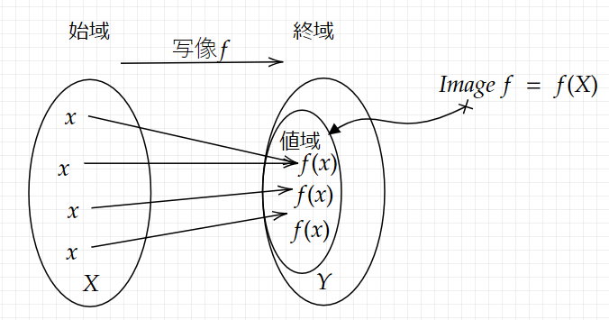
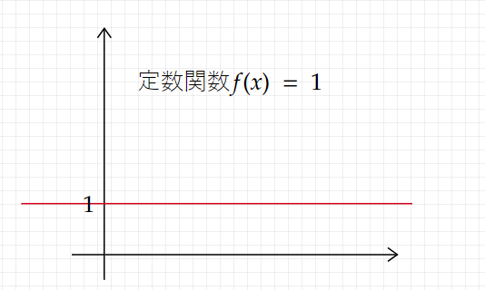
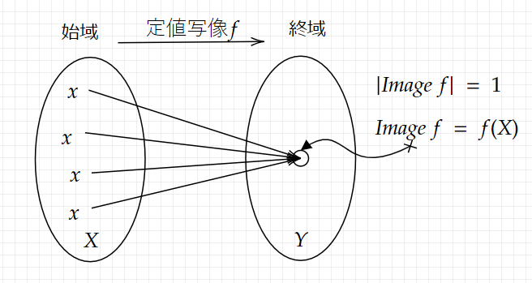
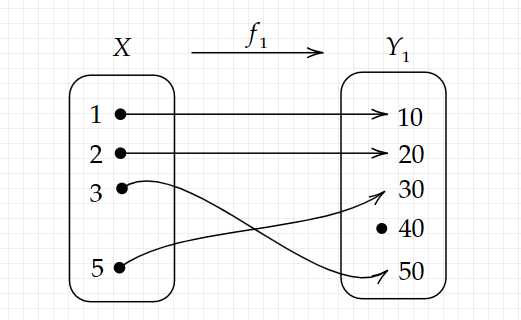
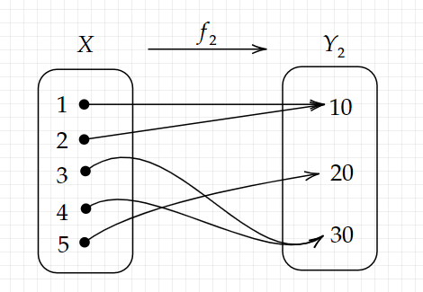
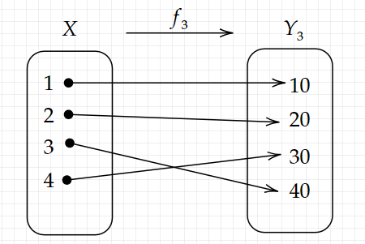
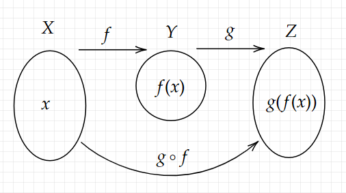
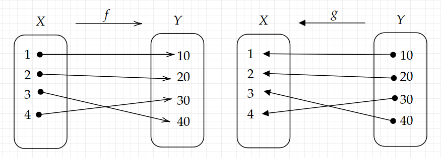

# クイズ(2: 写像)

## Q15 写像の定義について知っていますか?

??? success

    ### 具体例から二つの集合について考える

    ```text
    ・商品と値段の関係について考える

    ・1,2,3,4と商品番号がついている4つの商品があるとする

    ・この時、商品番号全体の集合Xは、
      X = {1,2,3,4}

    ・商品の値段が0以上の整数だとすると、
      値段として取りうる値全体の集合Yは以下の様になる
      (ただし、太字Zは、整数全体の集合を意味する)
    ```

    $$
      \begin{align}
       Y = \{y \in \mathbb{Z} | y >= 0 \}
      \end{align}
    $$

    ```text
    ・この時、4個の商品すべてに対して値段を定めることは、
      集合Xのどの元に対しても、
      集合Yの元をそれぞれ1つずつ定めることに相当する

      たとえば、以下のような商品の値段表fを考える。
      (商品と値段の対応表)
    ```

    | 商品番号 | 1   | 2   | 3   | 4   |
    | -------- | --- | --- | --- | --- |
    | 値段     | 100 | 500 | 200 | 500 |

    ```text
    ・上記の値段表fは、写像の例となる
    ```

    ### 定義(写像)

    ```text
    ・2つの集合X,Yがあり、
      Xに属しているどの元に対しても、
      Yに属している元がそれぞれ「1つずつ」対応するとき、
      その対応のことを、XからYへの写像という

      fが、XからYへの写像であることを、
      以下の様に表す
    ```

    $$
      \begin{align}
       f: X \rightarrow Y
      \end{align}
    $$

    ```text
    また、写像fによって、Xの元xが、Yの元yに対応することを
    以下の様に表記する
    ```

    $$
      \begin{align}
       f: x \mapsto y
      \end{align}
    $$

    ```text
    ・この時のyを、写像fによるxの像という
      (xにおける写像fの値ともいう)

    ・そして、xにおける写像fの値(=つまりy)を、
      f(x)と表記する
    ```

    ### 商品という集合と、値段という集合の関係性

    ```text
    ・商品の値段表fは、
      商品番号全体の集合X = {1,2,3,4}から
      値段として取りうる値全体の集合 Y = {y∊Z | y >= 0}
      への写像 f: X --> Yである

      なぜなら、以下の様に
      Xに属しているどの元に対しても、
      Yの元がそれぞれ1つずつ対応しているからである。
    ```

    $$
      \begin{align}
        & f: 1 \mapsto 100 \\
        & f: 2 \mapsto 500 \\
        & f: 3 \mapsto 200 \\
        & f: 4 \mapsto 500
      \end{align}
    $$

    ```text
    この対応は、以下のような見慣れた形でも表記できる

    f(1) = 100
    f(2) = 500
    f(3) = 200
    f(4) = 500
    ```

    ### 矢印の形に注意

    $$ 
      \begin{align}
        & f: X \rightarrow Y \quad fは集合Xから集合Yへの写像 \\
        & f: x \mapsto y \quad 写像fによるxの像はyである
      \end{align}
    $$

    ```text
    写像fによるxの像はyである
    = 写像fはxの値をyへ移す(写す)
    = 写像fによって、xはyに行く

    根元
      ・写像fは、集合Xの元を、集合Yの元に
        マッピングさせる（対応させる）
    
    逆方向の関係性
      ・yは写像fによるxの像である
    ```

    ### 関数と写像

    ```text
    ・実数xに対して、実数x²を対応させる二次関数fについて、
    fは集合Rから、集合Rへの写像となる
    (1つの実数全体の集合から、1つの実数全体の集合への写像)
    ```

    $$
      \begin{align}
        f: \mathbb{R} \rightarrow \mathbb{R}
      \end{align}
    $$

    ```text
    この時、x ∊ R とすると、
    以下の様になる。

    つまり、関数は写像の一種とみなせる
    ```

    $$
      \begin{align}
        & f:x \mapsto x^2 \\
        & f:4 \mapsto 16 \\
        & f(4) = 16 \\
        & f:-4 \mapsto 16 \\
        & f(-4) = 16 
      \end{align}
    $$

    

    

    ### プログラミングで考える

    ```py
    """
      実数xを引数に持ち、実数x²を返り値として返す
      関数squareは、集合Rから、集合Rへの写像となる
      (1つの実数全体の集合から、1つの実数全体の集合への写像)
    """
    def square(x):
      return x** 2
    ```

    ### 数列と写像

    $$
     \begin{align}
      & \mathbb{Z}^{+}を1以上の整数全体の集合とする \\
      & つまり、\mathbb{Z}^{+} = 
      \{n \in \mathbb{Z} | n >= 1 \} = \{1,2,3,...\} \\
      \\
      & この時、\mathbb{Z}^{+}の元nから、元n^2を得る対応をgとする。 \\
      & すなわち、gが\mathbb{Z}^{+}から\mathbb{Z}^{+}への写像となる \\
      & \quad\quad g: \mathbb{Z}^{+} \rightarrow \mathbb{Z}^{+} \\
      \\
      & ここで、n \in \mathbb{Z}^{+}とすると、\\
      & \quad\quad g: n \mapsto n^2
     \end{align}
    $$

    ```text
    ※上記の＋は、非負であることを表している


    gは、集合Z+から、集合Z+への写像
    写像gによる、nの像はg(n)である
    ```

    | n    | 1   | 2   | 3   | 4   | 5   | ... | n   | ... |
    | ---- | --- | --- | --- | --- | --- | --- | --- | --- |
    | g(n) | 1   | 4   | 9   | 16  | 25  | ... | n^2 | ... |

    ### 写像の違い

    ```text
    ・上記で見てきた、f, gはいずれも、2乗した結果を得るもの
      であったが、f: R --> R,  g: Z+ --> Z+であった

      この違いについては次で見ていく
    ```

## Q16 始域と、終域について知っていますか?

??? success
    ### 定義(始域と終域)

    ```text
    ・集合Xから集合Yへの写像f: X --> Yに対して、
      集合Xを、写像fの始域という
      集合Yを、写像fの終域という
    ```

## Q17 定義域と値域について知っていますか?

??? success
    ### 定義(定義域と値域)

    ```text
    ・集合Xから集合Yへの写像f: X --> Yに対して、
      集合Xを、写像fの定義域という
      集合{f(x) | x ∊ X}を、写像fの値域という

    ・また写像fの値域を、写像fの像ともいい、
      Imagefと表記する

      つまり、Imagef = {f(x) | x ∊ X}

      ※Image(f)や、Im(f)と表記することもある
    ```

    ### 値域について考える

    ```text
    ・定義域 = 始域であることは自明

    値域である{f(x) | x ∊ X}を言い換えると、
    {y ∊ Y | y = f(x)を満たす x ∊ X が存在する}

    つまり、
    集合Yの元yのうち、y = f(x)を満たしており、
    更に、Xの元xが存在する物全体の集合

    
    yが写像f: X --> Yの値域に属している、を言い換えると
    f : x |--> yとなるx ∊ X が存在する

    例）
      X = {1,2,3,4,5}
      Y = {n | n ∊ Z, n >= 1}
      実数xに対して、実数x+1を対応させる関数をf

      この時、定義域(=始域)は{1,2,3,4,5}
      終域は、1以上の整数
      値域は、{2,3,4,5,6} = {f(1), f(2), f(3), f(4), f(5)}
    ```

    ```text
    [とどのつまり]
    ・始域Xに属している元は、写像fにより、
    　値域Im(f)に属している元に必ず移される

    ・値域Im(f)に属している元には、
    　写像fによって、移ってくる始域の元が1つ以上存在する
    ```

    ### 値域と終域の違いの図

    

    ### 像という単語について

    ```text
    f:X --> Yに関連する像という単語には、3種類の意味がある
    ```

    ```text
    1 写像fによって、集合Xの元xに対応する集合Yの元のことを、
      fによるxの像といい、f(x)で表す。
      この時、f(x)は集合Yの元であり、以下の様に表す
    ```

    $$
      \begin{align}
        f: x \mapsto f(x)
      \end{align}
    $$

    ```text
    2 写像fの値域のことを、fの像といい、Image fで表す。
      この時、Image fは集合Yの部分集合である

    写像の定義が、始域に属しているそれぞれの元を、
    終域に属している元に1つずつ対応させることなので、
    写像fの値域であるImage fの範囲が、
    終域から逸脱することはない
    ```

    $$
      \begin{align}
        Image f = \{y \in Y | x \in X, y = f(x)\}
      \end{align}
    $$

    ```text
    3 Aを集合Xの部分集合とする。
      写像fによって、Aの元aに対応するf(a)全体の集合を
      fによるAの像といい、f(A)で表す。
      この時、f(A)は集合Yの部分集合
    ```

    $$
      \begin{align}
        f(A) = \{y\in Y | a \in A, y=f(a) \}
      \end{align}
    $$

    ```text
    2,3より、写像fの値域は、
    写像fによる定義域Xの像であり、
    Image f = f(X)

    つまり、値域は、始域内の各元を、写像で写した結果の集合
    ```

## Q18 写像の相等関係の定義について知っていますか?

??? success
    ### 定義(写像の相等関係)

    ```text
    fとgをどちらも集合Xから集合Yへの写像とする
    この時、集合Xの任意の元xに対して、
          f(x) = g(x)
    であるとき、二つの写像fとgは等しいといい、
          f = g
    と表記する。
    ```

    ```text
    ・言い換えると、
      定義域Xの任意の元xに対して、
      f(x) = g(x)が成り立つとき、f = g

    ・ポイントは、f,gがどんな数式で定義されていることは
    　考慮されていないということ。

    ・そもそも写像は数式で定義されているとは限らない
      (対応が表であることもある)
    
    ・写像で大切なのは、定義域の元が、終域のどの元に
      対応しているか(入力と出力の対応)
    ```

    ### プログラミングの例で確認する

    ```py
    """
    つまり、以下の三つの関数は等しい写像

    内部の実装は異なるが、
    入力値(引数)と出力値(返り値)の対応関係は一致している

     ⇒これはアルゴリズムやコードの変更を変えても
       その振る舞いが変わらないことを確認する際に役立ちそうだ
       リファクタリング
    """

    # 入力値はXの元であるとする
    # X = {x | xは自然数, 1 <= x <= 3}
    # Y = {f(x) | x ∊ X}

    def plus_10_minus_5(x):
      return x + 10 - 5
    
    def minus_5_plus_5(x):
      return x - 5 + 10
    
    def conditions(x):
      if(x == 1):
        return 6
      elif(x == 2):
        return 7
      else
        return 8
    
    ```

    ### まとめ

    ```text
    ・始域、終域同士が、集合としてそれぞれ等しくても
      f = gとは限らない。
    
    ・f(x) ≠ g(x)となる x ∊ Xが存在する可能性はある

    ・また、f(x) = x²で、g(x) = x²という写像があっても
      f = gとは限らない。
      「任意の」という言葉が抜けているため、
      f(x+1) ≠ g(x+1)かもしれない

    ・いずれにしても、二つの写像の相当関係を確かめるには
      定義域の任意の元を入力値としたとき、
      同じ出力値を返すかを確かめる必要がある。
    ```

## Q19 恒等写像の定義について知っていますか?

??? success
    ### 定義(恒等写像)

    ```text
    ・fを集合Xから集合Xへの写像とする
      集合Xの任意の元に対して、f(x) = xであるとき、
      写像fをXからXへの恒等写像といい、以下の様に表記する

    ※id_xと表記するのは、identity mappingから来ているらしい
    ```

    $$
      \begin{align}
        id_x
      \end{align}
    $$

    ### 例で考える

    ```text
    1
      X = {1,2,3}から、Xへの恒等写像idxは、
      恒等写像の定義より

      idx(1) = 1, idx(2) = 2, idx(3) = 3
    ```

    $$
      \begin{align}
        & \mathbb{Z}から\mathbb{Z}への恒等写像id_{\mathbb{Z}}は、恒等写像の定義より \\
        & 任意の整数nに対し、
          id_{\mathbb{Z}}:n \mapsto n \\
        & すなわち、id_{\mathbb{Z}}(n) = n
      \end{align}
    $$

    ### 恒等写像を用いて、写像の定義を確かめてみる

    ```text
    自然数全体の集合をZとし、Zの元をz
    その恒等写像をid_Zとするとき、

    id_Z(z) = z
    値域は、Im(id_Z) = Zとなる。
    また、Im(id_Z) = id_Z(Z) 

    確かに値域は、終域であるZの部分集合になっている

    ```

## Q20 定値写像の定義について知っていますか?

??? success
    ### 定値関数

    ```text
    ・どんな実数xに対しても、特定の実数aが値となる関数
      f(x) = aを考える。
    
    ・どの値を引数においても、一定の値をとる関数を
      定数関数という
    ```

    ### 定値関数(図)

    

    ### 定義(定値写像)

    ```text
    ・集合XとYがどちらも空集合ではないとし、y_1をYの元とする
      写像f: X --> Yが次の性質を満たすとき、
      写像fを、値がy_1の定値写像という

    ・集合Xの任意の元xに対して、以下が成り立つ
                f(x) = y_1
    ```

    ```text
    ・定値写像の値域は元を1つしか持たない
      つまり、値域が一点集合である写像と言い換えられる
      
    
    ・また写像fを、定値写像とすると、以下の様に表現可能
      |Image f | = 1
    ```

    ### 例

    ```text
    ※Rを、全ての実数の集合とする

    ・写像f: R --> Rが任意のx∊Rに対して、
      f(x) = 0を満たすとき、写像fは定値写像

    ・定値写像には、一点につぶす写像というイメージがある
    ```

    ### 定値写像(図)

    

## Q21 単射の定義について知っていますか?

??? success

    ### 以下のような写像について考える

    ```text
    ・下の図におけるf1(1), f1(2), f1(3), f1(4)という
    　4個の値はすべて異なる

    ・Xの異なる二つの元が、Y1の等しい元に移されることはない
      ⇒単射

      (Xの元にiという番号を付けたとき、
      iが異なるならf(x_i)がダブることはない)
    ```

    

    ### 定義(単射)

    ```text
    写像f: X --> Yが次の性質を満たすとき、写像fを単射という

    ・Xの任意の元x, x'に対して、x≠x'ならば、f(x)≠f(x')
    ```

    ### 例

    ```text
    1 恒等写像
      ・集合X上の恒等写像id_x: X --> Xは単射
      ・xとx'をXの元とすると、id_x(x) = x, id_x(x') = x'
        なので、x≠x'ならば、id_x(x)≠id_x(x')
    
    2 単射ではない写像
      ・f: R --> Rが、f: x |--> x²で定義されているとき、
      　写像fは単射ではない。
      ・例えば、f(2) = f(-2)になるため
    
    3 名前から名字を得る写像
      ・とあるクラスの生徒の名前全体の集合をX
        とあるクラスの生徒の名字全体の集合をYとする
        この時、名前から名字を得る写像f: X --> Yを考える
      
      ・同じ名字を持つ生徒が1人でもいるなら、
        fは単射ではない。全員異なる名字を持つなら、単射
    ```

## Q22 全射の定義について知っていますか?

??? success

    ### 以下のような写像について考える

    ```text
    ・f2(1) = f2(2), f2(3) = f2(4)なので、単射でないと分かる

    ・終域のどの元に対しても、写像によって移されてくる
      始域の元がある
    ⇒全射

    ・全射はもれがない写像といえる
    ```

    

    ### 定義(全射)

    ```text
    ・写像f:X --> Yが次の性質を満たすとき、写像fを全射という

    ・任意のy∊Yのそれぞれに対して
      y = f(x)が成り立つ x∊Xが存在する

    ・言い換えると、Im(f) = Y
      つまり、値域と終域が等しくなる
    ```

    ### 全射の例

    ```text
    1　恒等写像
      ・Z上の恒等写像id_zは前者になる。
        終域としてのZの任意の元nそれぞれに対し、
        始域としてのZの元mが存在して、n = idz(m)を満たすため
        n = mとなるように選べばいい
    
    2 名前から名字を得る写像
      ・とあるクラスの生徒の名前全体の集合をX
        とあるクラスの生徒の名字全体の集合をYとする
        この時、名前から名字を得る写像f: X --> Yを考える
      
      ・この時、写像fは全射になる
    ```

## Q23 全単射の定義について知っていますか?

??? success
    ### 以下のような写像について考える

    ```text
    ・終域Y3の任意の元に対して、f3で移されてくる始域Xの
      元が存在するので、f3は全射

    ・Xの異なる元は、必ずY3の異なる元に移されているので、
      xとx'がXの元で、x≠x'であるとき、f3(x)≠f3(x')になる
      よって、f3は単射
    
    ・全射でも単射でもあるので、全単射という

    ・1対1にもれなく対応しているといえる
    ```

    

    ### 定義(全単射)

    ```text
    ・写像f: X --> Yが全射かつ単射の時、
      写像fを全単射という
    ```

    ### 例

    ```text
    1 恒等写像
      ・Z上の恒等写像は、Q21, Q22より、全射かつ単射なので
        全単射といえる
    ```

    ###　有限集合と全単射

    ```text
    X,Yをどちらも有限集合とするとき、

    |X| = |Y|であるならば、
    「XからYへの全単射が存在する」と言い換えられる

    逆に言うと、
    |X| ≠ |Y|なら、XからYへの全単射が存在する可能性はない
    (個数が違うので)
    ```

## Q24 合成写像の定義について知っていますか?

??? success
    ### 前置き

    ```text
    写像f: X --> YはXの元をYの元に移す
    写像g: Y --> ZはYの元をZの元に移す

    二つの写像をつなげると、Xの元をZの元に移すことができる
    これは、XからZへの写像を作っているのと同じ

    二つ以上の写像から作られた写像を、合成写像という
    (ある写像を施した結果に、再び別の写像を施す = 写像の合成)
    ```

    ### 定義

    ```text
    二つの写像 f: X --> Yと g: Y --> Zに対して、
    写像 h: X --> Zを、h(x) = g(f(x))で定義する。
    この写像hを、fとgの合成写像といい、以下の様に表す
    ```

    $$
    \begin{align}
      g \circ f
    \end{align}
    $$

    ```text
    つまり、任意の x∊Xに対して、以下の様になる

    写像fとgから合成写像g〇fを作ることを、写像の合成という
    ```

    $$
      \begin{align}
        (g \circ f)(x) = g(f(x))
      \end{align}
    $$

    ### 合成写像のイメージ図

    ```text
    ・写像fは、x∊Xを、f(x)に移す
    ・f(x)∊Yであり、写像gはf(x)∊Yをg(f(x))に移す
    ・g(f(x))∊Z

    ・ここで、xと、g(f(x))だけに着目すると、
      任意のx∊Xに対して、g(f(x))∊Z
      つまり、XからZへの写像となる
    ```

    

    ```text
    ・始域と終域の関係性
      元と、値の関係性は
      それぞれ以下の様になる
    ```

    $$
      \begin{align}
        & g \circ f : X \rightarrow Z \\
        & g \circ f : x \mapsto g(f(x)) 
      \end{align}
    $$

    ### 合成写像の調べ方

    ```text
    ・fとgの矢印を辿り、Xについてそれぞれの元が、
      Y,Zのどの元に移るかを調べる
    ```

    ### ${g \circ f \neq f \circ g}$の例

    ```text
    ・合成が可能なのは、写像fの終域が写像gの始域に等しいから
    
    ・写像gの終域が、写像fの始域と等しくない限り、
      順序を逆にすることはできない
    ```

    ```text
    fとgを、どちらも実数全体の集合RからRへの写像とする
    f(x) = x + 10, g(x) = x²とする。
    この時、fとgの合成写像g〇fを考えると、
    ```

    $$
      \begin{align}
        g \circ f: x \mapsto (x+10)^2
      \end{align}
    $$

    ```text
    合成の順序を逆にすると、以下のようになる
    ```

    $$
      \begin{align}
        & f \circ g: x \mapsto x^2 + 10 \\
        & ここで、たとえば、集合\mathbb{R}の元である0を考えたとき、 \\
        & (0+10)^2 \neq 0^2+10 \\
        & 従って、g \circ f \neq f \circ g
      \end{align}
    $$

    ### ${g \circ f = f \circ g}$の例

    ```text
    fとgはどちらも正の実数全体の集合R+から、R+への写像とする
    f(x) = x²で、g(x) = 1/xとする

    この時、fとgの合成写像は、
    ```

    $$
      \begin{align}
        & g \circ f: x \mapsto = \frac{1}{x^2} \\
        & f \circ g: x \mapsto = (\frac{1}{x})^2 \\
        & 任意のx \in \mathbb{R}^{+}に対して、\frac{1}{x^2} = (\frac{1}{x})^2であるため、 \\
        & g \circ f = f \circ g \\
      \end{align}
    $$

## Q25 逆写像の定義について知っていますか?

??? success

    ### 以下のような矢印の逆向きにした二つの写像を考える

    

    ```text
    ・以上の2つの写像f,gを合成すると、矢印を辿り
      二つの集合を往復することになる

    ・つまり、下記の様に表現可能
    ```

    $$
      \begin{align}
        & 合成写像 g \circ f は
        XからXへの恒等写像 id_X: X \rightarrow X \\
        & 合成写像 f \circ g は
        YからYへの恒等写像 id_Y: Y \rightarrow Y
      \end{align}
    $$

    ```text
    ・このような写像gのことを、写像fの逆写像という
    ```

    ### 定義(逆写像)

    $$
      \begin{align}
        & 写像f: X \rightarrow Yに対して、 \\
        & g \circ f = id_X\,かつ\,f \circ g = id_Y を満たす \\
        & 写像g: Y \rightarrow Xを \\
        & 写像fの逆写像といい、 
        f^{-1}と表記する \\
      \end{align}
    $$

    ### 逆写像が存在する条件

    $$
      \begin{align}
        fは全単射である \iff fには逆写像が存在する
      \end{align}
    $$

    ```text
    X --> Yが単射であって、全射でない場合
      ・単に矢印を逆にすると、始域に属している元の中で、
        終域が対応しないものがでる
    
    X --> Yが全射であって、単射でない場合
      ・単に矢印を逆にすると、定義域の特定の元から
        二股以上に分かれた矢印が出ることになる
      ・これはいずれも前述の写像の定義を満たさない
    
    ・逆写像をfを用いて表記できるのは、
      写像の逆写像はたった1つしか存在しないから

    ・ところで、逆写像や、元などの単語は、
      たとえば写像や、集合等の大本の存在があって意味を持つ
    ```

    ### 逆写像の例

    ```text
    実数全体の集合をRとし、正の実数全体の集合をR+とすると
    指数関数expと、対数関数logはどちらも写像であり、
    以下の様に表現できる

    exp(x) = e^x
    log(x) = log[e]x 
    log(exp(x)) = log[e]e^x = x
    exp(log(y)) = e^{log[e]y}
    e^{log[e]y} = Aとおく
    eを底とする対数を取ると、
    log[e]e^{log[e]y} = log[e]A
    log[e]y * log[e]e = log[e]A
    log[e]y = log[e]A
    y = A
    e^{log[e]y} = y
 
    聞いていることは、底(e)を何乗すると、真数(e^x)になるか
    x乗に決まっている
    ```

    $$
      \begin{align}
        & \exp: \mathbb{R} \rightarrow \mathbb{R^{+}} \\
        & \log: \mathbb{R^{+}} \rightarrow \mathbb{R}
      \end{align}
    $$

    ```text
    この時、写像exp: R -> R+に対して、以下より
    x∊R の時、log(exp(x)) = x なので、 log〇exp = idR
    y∊R+の時、exp(log(y)) = y なので、 exp〇log = idR+

    写像log: R+ --> Rは、写像expの逆写像。
    逆もしかり
    ```

    ### 補足

    ```text
    恒等写像は、何もしない写像というイメージ
    逆写像は、元に戻す写像というイメージ

    群とどのように関係しているのだろうか
    ```

## Q26 集合の直積の定義について知っていますか?