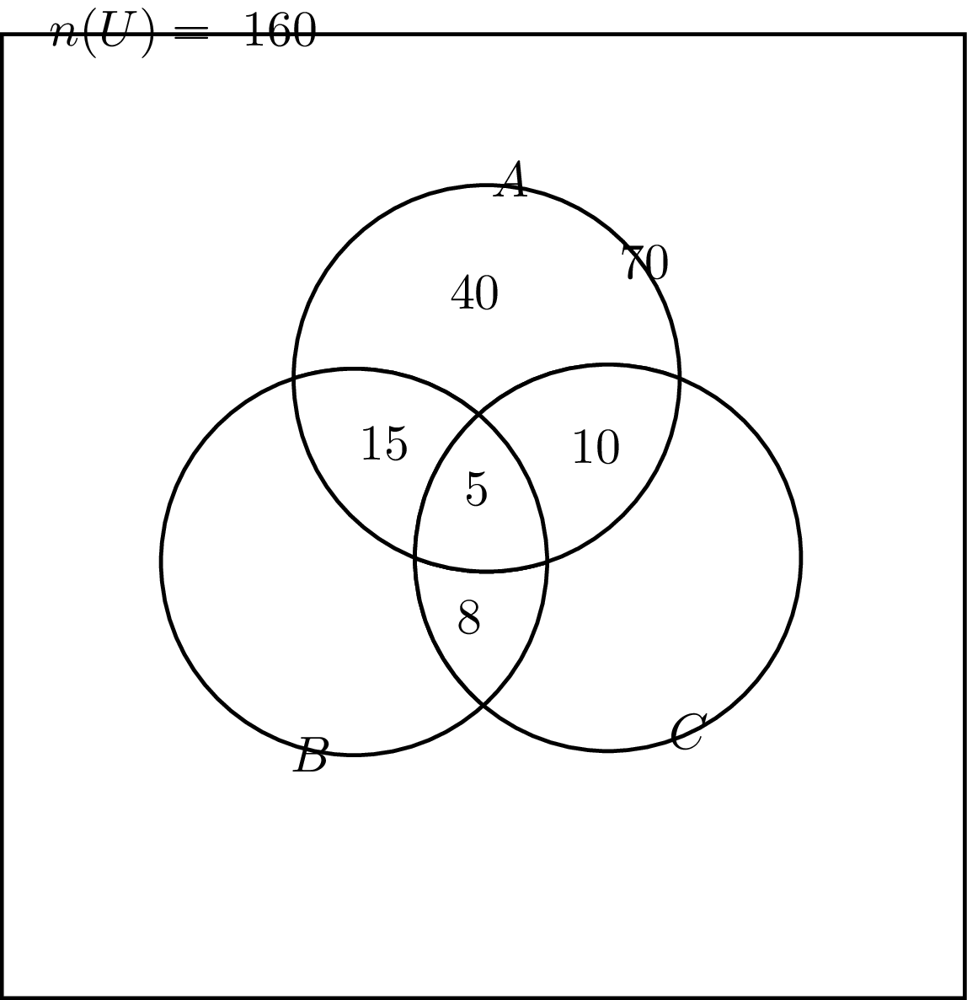
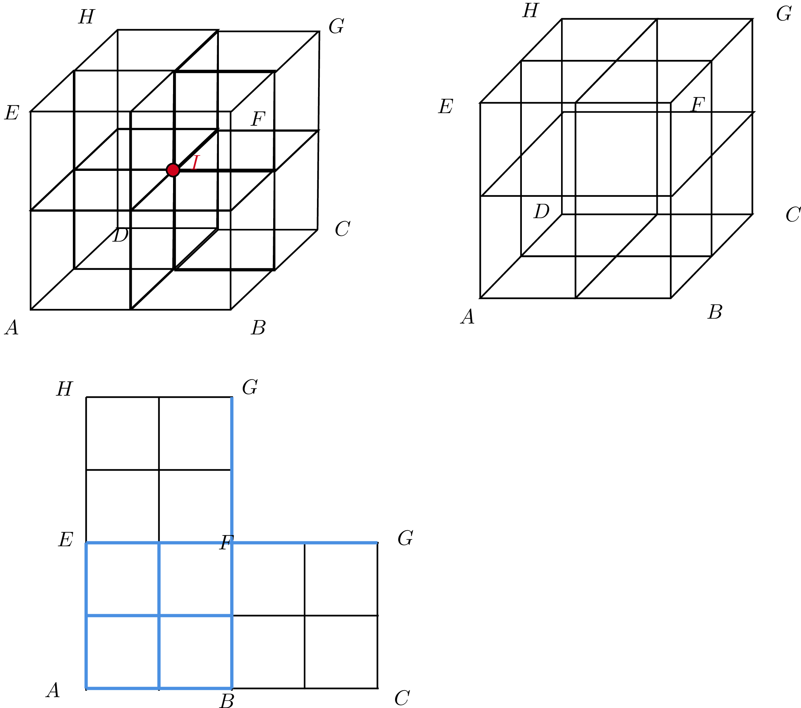
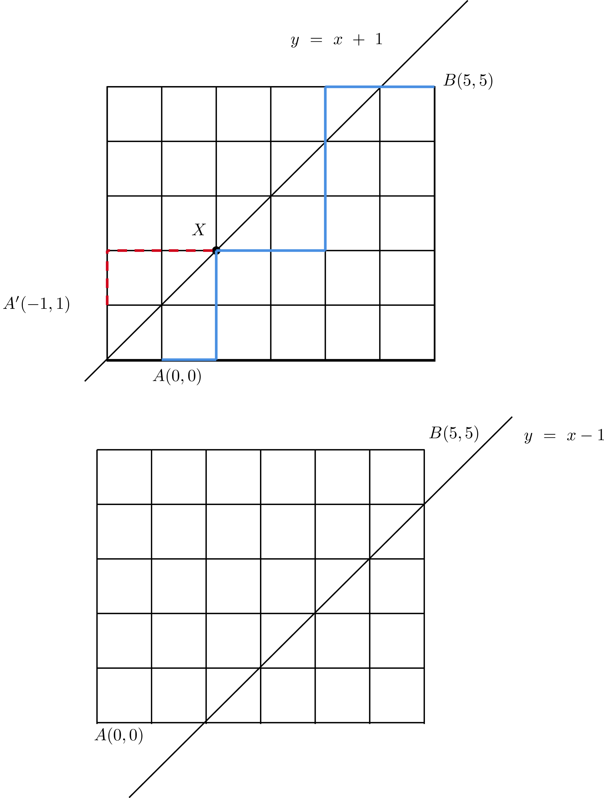
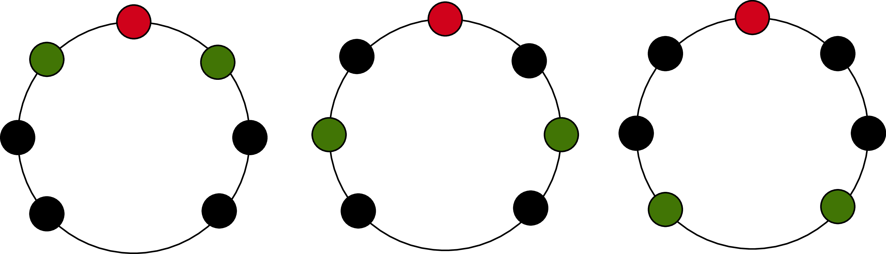
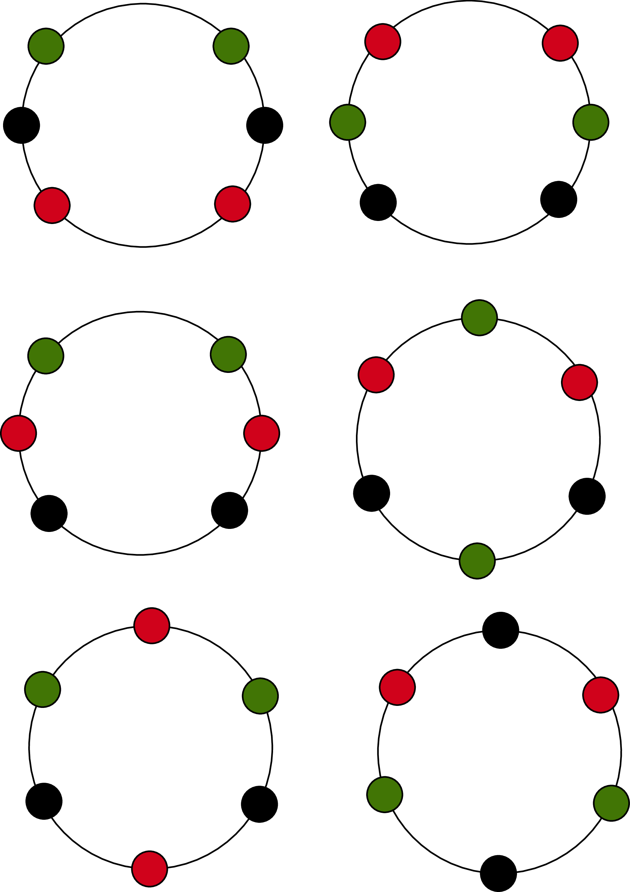
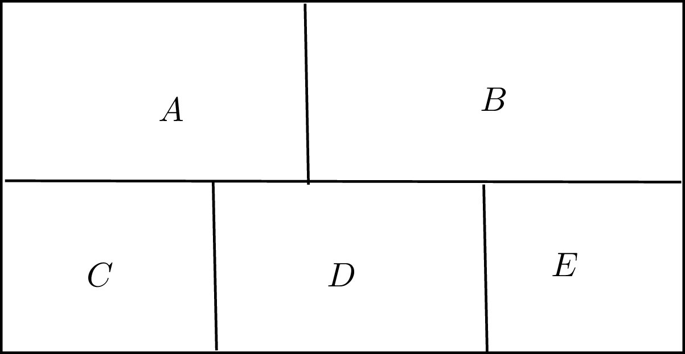
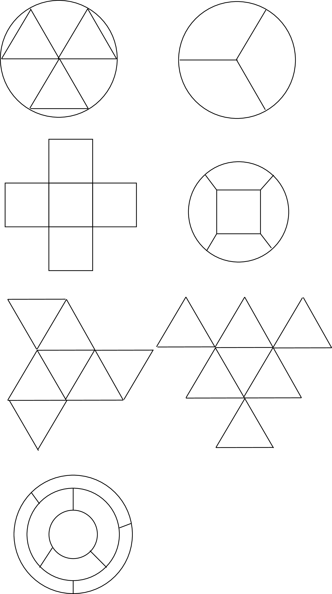
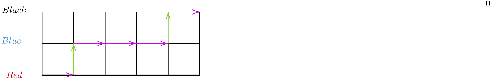

# 場合の数

## Q1 個数定理

??? success

    ### 場合の数分野について

    ```text
    導出の仮定は、式変形のみでなく、日本語で残すようにする
    ```

    ### 2つの集合の和集合の要素の個数

    ```text
    ※集合Aの要素の個数をn(A)と表す

    n(A∪B) = n(A) + n(B) - n(A∩B)
    特にA∩B = ∅の時、n(A∪B) = n(A) + n(B)

    ※n(A)の要素の個数, n(B)の要素の個数をそれぞれa,b
      n(A∩B)の要素の個数をcとする

      a + bを考えると、c部分を重複して数えているため
      a + b - cとすることで、n(A∪B)の領域の要素の個数となる

      A∩B = ∅の場合、重複部分は存在しないため、単にa+bで問題ない
    ```

    ### 補集合の要素の個数

    ```text
    n(A^C) = n(U) - n(A)

    全体集合の要素の個数から、その部分集合Aの要素の個数を引くと
    集合Aの補集合の要素の個数になる

    ※補集合の定義が、ある集合Aが全体集合の部分集合であり
      集合Aを全体集合から引いたときの集合であるため、定義より分かる
    ```

    ### 3つの集合の和集合の要素の個数

    ```text
    n(A∪B∪C) = n(A) + n(B) + n(C) - n(A∩B) - n(B∩C) - n(C∩A) + n(A∩B∩C)

    同様に、重複分を引く。3つの集合の共通部分が消失するため、最後に付け加える
    ```

    ### 例

    ```text
    100~200までの整数のうち、次の整数の個数を求めよ
    全体集合をU, 3の倍数全体の集合をA, 5の倍数全体の集合をBとすると

    n(U) = 200 - 100 + 1 = 101
    A = {3*34, ..., 3*66} n(A) = 66 - 34 + 1 = 33
    B = {5*20, ..., 5*40} n(B) = 40 - 20 + 1 = 21
    A∩B = {15*7, ..., 15*13} n(A∩B) = 13 - 7 + 1 = 7
    --> 倍数の個数を表現する際は、積の形で要素を抜き出すといい

    99 / 3 = 33, 200 / 3 = 66より、66 - 33 = 33としてもいいけれど 


    [1] 3の倍数 ∧ 5の倍数
    n(A∩B) = 7

    [2] 3の倍数 ∨ 5の倍数

    n(A∪B) = n(A) + n(B) - n(A∩B) = 33 + 21 - 7 = 47

    [3] (3の倍数 ∧ ￢5の倍数) ⇔ ￢(3の倍数 ⇒ 5の倍数)
    3の倍数 5の倍数
    ×       〇　--> False
    ×       ×  --> False
    〇      ×   --> True
    〇       〇  --> False
    全体集合U - n(A^C) - n(A∩B) ⇔ n(A) - n(A∩B)
    --> 3の倍数から、3の倍数と5の倍数の共通部を引いた数に等しい

    n(A ∩ ^B) = n(A) - n(A ∩ B)
    = 33 - 7 = 26

    [4] ￢3の倍数 ∧ ￢5の倍数 ⇔ ￢(3の倍数 ∨ 5の倍数)
    
    n({A∪B}^C) = n(U) - n(A∪B) = 101 - 47 = 54 
    ```

    ### 例2

    ```text
    全体集合をU, A,B,CをUの部分集合とする

    n(U) = 160
    n(A) = 70
    n(B) = 50
    n(C) = 60
    n(A∩B) = 20
    n(B∩C) = 13
    n(C∩A) = 15
    n(A^c ∩ B^c ∩ C^c) = 23の時、

    n(A ∩ B^c ∩ C^c)を求めよ

    A^c ∩ B^c ∩ C^c ⇔ (A∪B∪C)^c 
    n(A∪B∪C) = 160 - 23 = 137

    個数定理より
    n(A∪B∪C) = n(A) + n(B) + n(C) - n(A∩B) - n(B∩C) - n(C∩A) + n(A∩B∩C)
    137 = 70 + 50 + 60 - 20 - 13 - 15 + n(A∩B∩C)
    137 = 132 + n(A∩B∩C)
    n(A∩B∩C) = 5

    ※ベン図に埋めれば
    n(A ∩ B^c ∩ C^c) = 70 - (15 + 5 + 10) = 40とわかる

    --------------------------------
    [別解]
    集合Aのうち、B,Cとの共通部分がない分であるとわかるので
    n(A ∩ B^c ∩ C^c) = n(A∪B∪C) - n(B∪C)

    n(A∪B∪C)＝137
    n(B∪C) = n(B) + n(C) - n(B∩C) = 50 + 60 - 13 = 97
    137 - 97 = 40

    ※各部分を文字でおき、連立方程式を解いてもいける
    ```

    

## Q2 集合の要素の個数の最大、最小

??? success

    ### 例

    ```text
    集合Uと、その部分集合A,Bに対し、n(U) = 100, n(A) = 70, n(B) = 40とする

    [1] n(A∩B) の最大値と最小値を求めよ

    n(A∪B) = n(A) + n(B) - n(A∩B)より
    n(A∩B) = n(A) + n(B) -  n(A∪B)

    つまり、
    n(A∪B)が最小値 ⇒ n(A∩B)は最大値
    n(A∪B)が最大値 ⇒ n(A∩B)は最小値

    n(A) > n(B)であるため
    n(A∪B)が最小値をとる時とは、BがAの部分集合であるときになる
    この時、n(A∪B) = 70
    ∴　n(A∩B)の最大値は、70 + 40 - 70 = 40

    n(A∪B)の最大値は, 全体集合の個数と同一の100である。
    ∴ n(A∩B)の最小値は、110 -100  = 10

    ※n(A∪B)が最大をとるとき、n({A∪B}^c)は最小をとる
    n(A) + n(B) > n(U)より、n({A∪B}^c)の最小値は0
    n(A∪B)の最大値は、n(U) - 0 = 100 

    [2] n(A∩B^c)の最大値と最小値を求めよ

    n(A∩B^c) = n(A) - n(A∩B)より、
    n(A∩B)が最小値をとる時、n(A∩B^c)は最大値をとる
    ∴ n(A∩B^c)の最大値は、70 - 10 = 60

    同様に考えて
    ∴ n(A∩B^c)の最小値は、70 - 40 = 30
    ```

## Q3 和の法則と積の法則

??? success

    ### 数え方

    ```text
    漏れなく重複なく数え上げるやり方を採用する
    ```

    ### 和の法則

    ```text
    2つの事柄A,Bがあり、Aがm通り, Bがn通りとする
    この時、A,Bが同時には起こらないとすると
    |A∨B| = m + n通り

    n(A∧B) = 0の時を表しているに過ぎない
    ```

    ### 排反

    ```text
    A∧Bが空集合であるとき、AとBは互いに排反であるという

    排反であるように場合分けを行えば、
    最後に足すだけで済むが、共通部分が存在すると足し引きする必要が生じる
    ⇒排反になるように場合分けを行う
    ```

    ### 例

    ```text
    AとBの2人が対戦し、先に3回勝った方を優勝とする
    最終的にAが優勝する時、優勝が決まるまでの決め方は何通り存在するか

    1回目にAが勝つ∧ 1回目にBが勝つは同時には起こらない。よって
    この事象は互いに排反

    2回目以降も同様

    Bが3回勝った場合、Bが優勝してしまうため
    Bは2回までしか勝てないことに注意する。

    辞書式配列の形で書きだすと
    AAA
    AABA
    AABBA
    ABAA
    ABABA
    ABBAA

    BAAA
    BAABA
    BABAA
    BBAAA

    よって、10通り

    ------------------

    [別解]

    [i] Aが3回勝ち、Bが0回勝つ
    [ii] Aが2回勝ち、Bが1回勝つ. その後Aが勝つ
    [iii] Aが2回勝ち、Bが2回勝つ. その後Aが勝つ　
    という事象に分解できる。またそれぞれの事象は互いに排反である

    [i]
    nCk(n:Aが勝った回数, k:試行回数)とすると
    3C3 = 1通り

    [ii]
    3C2 = 3通り

    [iii]
    4C2 = 6通り

    [i]~[iii]より、1 + 3 + 6 = 10通り
    ```

    ### 積の法則

    ```text
    Aがm通り生じ、そのいずれの場合に対しても、Bがn通り生じる
    この時、AとBがともに生じる場合の数はm*n通り

    --> 樹形図で考えた場合、均等に枝分かれするため
        書き出す必要なく判断可能
    ```

    ### 例

    ```text
    [1] 硬貨を3回投げるとき、表裏の出方は何通りあるか

    A,B,Cを硬貨を投げる事象であると考える
    A,B,Cがともに生じる場合の数は2^3 = 8通り

    ---------------------------

    [2] 大小2個のサイコロを投げるとき出た目の和が偶数になる場合の数は何通りあるか

    ※二つのサイコロは区別される。
    大きいサイコロの目の集合をA, 小さいサイコロの目の集合をBとする。
    A = {1,2,3,4,5,6}, B = {1,2,3,4,5,6}

    和が偶数となるのは、
    Aの出目(奇数) + Bの出目(奇数) = (偶数)
    Aの出目(偶数) + Bの出目(偶数) = (偶数)の場合であり、この事象は互いに排反である

    [i] Aの出目が奇数で、Bの出目が奇数になる場合の数は
    {(a,b) | a∊{1,3,5}, b∊{1,3,5}}の要素数に等しい
    よって、積の法則より3*3 = 9通り

    [ii] Aの出目が偶数で、Bの出目が偶数になる場合の数は
    {(a,b) | a∊{2,4,6}, b∊{2,4,6}}の要素数に等しい
    よって、積の法則より3*3 = 9通り

    [i],[ii]より、18通り

    ```

## Q4 補集合を利用するケース

??? success

    ### 考え方

    ```text
    (Aである) = (全体) - (Aでない)
    (Aでない) = (全体) - (Aである)
    (少なくとも1つはA) = (全体) - (すべてAでない)
    ```

    ### 例

    ```text
    [1] 大小2個のサイコロを投げる. 目の和が10以下になる場合は何通りあるか

    サイコロは区別される。
    (目の和が10以下になる場合) = (全体) - (目の和が11以上になる場合)なので
    目の和が11≧になる場合を考えると
    (5,6),(6,5),(6,6)の3通りであるとわかる
    サイコロが区別された時の出目の総組み合わせは6*6 = 36通りなので、
    ∴ 36 - 3 = 33通り

    [2] 大中小3個のサイコロを投げるとき、目の積が偶数になる場合は何通りあるか

    サイコロは区別される
    (目の積が偶数になる場合) = (全体) - (目の積が奇数になる場合)であるため
    目の積が奇数になる場合を考えると
    Aの出目(奇数) * Bの出目(奇数) * Cの出目(奇数)の場合とわかる

    つまり、目の積が偶数になる場合とは、少なくとも1つの目が偶数になる場合と考えられる
    (目の積が偶数になる場合) = (全体) - (Aの目が奇数 ∧ Bの目が奇数 ∧ Cの目が奇数)

    この組み合わせの数を考えると
    n({1,3,5})*n({1,3,5})*n({1,3,5}) = 3^3 = 27通り
    3つのサイコロが区別された時の出目の総組み合わせは 6^3 = 216通りなので
    ∴ 216 - 27 = 189通り

    [3] 大中小3個のサイコロを投げるとき、目の積が4の倍数になる場合は何通りあるか

    サイコロは区別される。
    目の積が4の倍数になる場合を考えると

    [i] 3つのサイコロの出目がすべて偶数
    [ii] 2つのサイコロの出目が偶数で、1つのサイコロの出目が奇数
    [iii] 1つのサイコロの出目が4の倍数で、2つのサイコロの出目が奇数

    上記の3ケースに場合分けできる。また[i],[ii],[iii]は互いに排反である
    ため和の法則を用いることが可能

    [i] n({2,4,6}) = 3より、3*3*3 = 27通り
    [ii] 
      奇数となるサイコロを選ぶ事象を考えると3通り。よって
      3*( n({1,3,5}) * n({2,4,6}) * (n{2,4,6}) ) = 81通り

    [iii]
      出目が4であるサイコロを選ぶ場合の数は3通り。よって

      3*(n({1,3,5}) * n({1,3,5})) = 27通り

    [i],[ii],[iii]より
    27 + 81 + 27 = 135通り 
    ```

## Q5 硬貨で支払える金額の場合の数(両替)

??? success

    ### 例

    ```text
    以下の硬貨の全部、または一部を用いて支払える金額は何通り存在するか

    [1] 100円硬貨が4枚, 50円硬貨が1枚, 10円硬貨が3枚

    100円硬貨の使い方は 0~4枚で、5通り
    50円硬貨の使い方は 0~1枚で、2通り
    10円硬貨の使い方は 0~3枚で、4通り

    0円の場合は、一部を用いてという条件に反するため

    積の法則を用いて
    5*2*4 - 1 = 39通り

    [2] 100円硬貨が1枚, 50円硬貨が3枚, 10円硬貨が2枚

    100円硬貨の使い方は 0~1枚で、2通り
    50円硬貨の使い方は 0~3枚で、4通り
    10円硬貨の使い方は 0~2枚で、3通り

    大きい硬貨を小さい硬貨に両替して考えると
    50円硬貨の使い方は 0~5枚で、6通り
    10円硬貨の使い方は 0~2枚で、3通り

    積の法則を用いて
    6 * 3 - 1 = 17通り

    [3] 100円硬貨が2枚, 50円硬貨が1枚, 10円硬貨が7枚

    100円硬貨の使い方は 0~2枚で、3通り
    50円硬貨の使い方は 0~1枚で、2通り
    10円硬貨の使い方は 0~7枚で、8通り

    大きい硬貨を小さい硬貨に両替して考えると

    10円硬貨の使い方は 0~32枚で、33通り
    よって、33 - 1 = 32通り
    ```

    ### 異なる硬貨で同一の金額を作れるときに、小さい硬貨に両替してよいわけ

    ```text
    支払い方の総組み合わせではなく、
    金額の場合の数が求められているので

    同一の金額となる場合
    例えば、50円硬貨1枚と、10円硬貨5枚の支払い方法があったとして、これは1通りである

    ここで、
    100円硬貨なら、100円刻みで
    50円硬貨なら、50円刻みで
    10円硬貨なら、10円刻みで支払えることに着目する。

    例えば50円硬貨1枚,10円硬貨7枚である時
    10円~120円までを10円刻みで支払うことができる
    これは、10円硬貨12枚に両替しても同様である
    
    一方、50円硬貨2枚,10円硬貨2枚とすると
    30円,40円, 80円, 90円を支払えなくなる

    ------------------------

    異なる貨幣で同一の金額を表せないときは両替してはいけない

    1円硬貨を3枚, 5円硬貨を2枚, 10円硬貨を2枚使って
    表すことのできる金額の場合の数を示せ

    1円硬貨を3枚, 5円硬貨を6枚と考えられる
    この時、例えば4円はどうしても示せないので、5円硬貨を1円硬貨5枚と考えてはいけない
    (3+1) * (6+1) - 1 = 27通り
    ```

## Q6 硬貨で支払う方法の場合の数

??? success

    ### 例

    ```text
    [1] 
    500円硬貨、100円硬貨,50円硬貨を用いて800円支払う方法の場合の数を求めよ
    支払わない硬貨があってもよい

    500,100,50円硬貨の使用枚数をそれぞれx,y,zとおく
    この時、(x,y,z≧ 0)

    500x + 100y + 50z = 800の両辺を1/50して
    10x + 2y + z = 16

    x = 1の時、
    2y + z = 6
    (y,z) = (3,0),(2,2),(1,4),(0,6)

    x = 0の時
    2y + z = 16
    (y,z) = (8,0),(7,2),(6,4),(5,6),(4,8),(3,10),(2,12),(1,14),(0,16)

    よって、13通り
    ※係数が大きい方の文字から値を絞り込むことで解ける

    --------------------------

    [2] 500,100,50円硬貨をそれぞれ1枚以上用いて、1000円支払う方法

    500x + 100y + 50z = 1000 (x,y,z ≧ 1)より
    両辺を1/50して

    10x + 2y + z = 20

    x = 2の時、(y,z) = (0,0)より不適
    x = 1の時、
    2y + z = 10
    (y,z) = (4,2), (3,4),(2,6),(1,8)より4通り

    ∴4通り

    ------------------

    [3] 500,100,50円硬貨を用いて、10000円支払う方法の場合の数
        使わない硬貨があってもよい

    同様に500x + 100y + 50z = 10000 (x,y,z ≧ 0)
    1/50倍して10x + 2y + z = 200とできるが、数が大きくなることに注意する

    係数が大きい順から絞り込むと
    xは0 ~ 20の値をとりうる
    x = kと置いたとき、(y,z)の組数を考えると

    x = k = 0の時、(y,z) = (100,0), (99, 2), ..., (0, 200)より、101組
    x = k = 1の時、(y,z) = (95, 0), ..., (0, 190)より、96組
    同様に考えて
    x = k = 19の時、(y,z) = (5, 0),...(0,10)より、6組
    x = k = 20の時、(y,z) = (0,0)より1組

    よって、x = kの時、(y,z)は101 - 5k組存在するとわかる
    等差数列の公式を用いると、(知らないなら足し合わせればいい　Σ_{k=0}^{20} 101 - 5k)

    初項101, 項数21, 末項1なので
    (1/2)21*(101 + 1) = 51 * 21 = 1071通り
    ```

    ### [2]の別解

    ```text
    [2] 500,100,50円硬貨をそれぞれ1枚以上用いて、1000円支払う方法

    各硬貨を1枚以上使うことを考えるとこの時点で
    500 + 100 + 50 = 650円

    つまり、残り350円の支払い方法(使わない硬貨が存在してもOK)という問いに帰着する
    また500円を用いて、350円を支払うことはできないため500円は1枚で確定
    50円は100円硬貨では支払えないので、50円硬貨2枚以上は確定する。

    よって、700円の支払い方は
    500円:1枚, 100円:1枚, 50円2枚で共通

    100円硬貨, 50円硬貨を用いた
    残り300円の支払い方法(使わない硬貨が存在してもOK)について場合の数を考えると
    (100円硬貨の枚数, 50円硬貨の枚数) = (3,0),(2,2),(1,4),(0,6)より4通り

    ∴ 4通り
    ```

## Q7 順列の基本(積の法則, nPr, 階乗)

??? success

    ### 順列

    ```text
    異なるn個のものからr個を取り出して1列に並べる順列の場合の数を
    nPrと表現すると、
    nPr = n(n-1)(n-2)...(n-r+1) = n! / (n-r)! (r≦n)である

    ただし、nPn = n(n-1)(n-2)...3*2*1 = n!と定める
    また、nP0 = 1, 0! = 1と定める。
    --------------------------

    [導出]
    1つ目の選び方がm通り
    それぞれについて,2つ目の選び方がm-1通り
    ...
    それぞれについて,r個目の選び方がm-r+1通りであることを考えると
    積の法則より総数は、
    n(n-1)(n-2)...(n-r+1)と表せる

    ここで、n! = n(n-1)...(n-r+1)(n-r)...3*2*1と表せる
    また、(n-r)! = (n-r)(n-r-1)...3*2*1である
    ∴ n! / (n-r)! = n(n-1)(n-2)...(n-r+1)

    異なるn個の中からn個を上回る数を取り出すことはできないため
    r ≦ nという制約も必要になる
    ```

    ### 例

    ```text    
    [1] 7人から3人選んで1列に並べるときの並び方の総数を求めよ

    7! / (7-3)! =  7*6*5 = 210通り

    [2] 7人全員を1列に並べるときの並び方の総数を求めよ

    7!/(7-7)! = 7! = 210*24 = 5040通り

    [3] 10人から校長、教頭、担任を1人ずつ決める場合の数(兼任不可)

    (1つ目の役職)は10通り
    それぞれについて、(2つ目の役職)が9通りで決まる
    それぞれについて、(3つ目の役職)が8通りで決まる

    ∴ 10*9*8 = 720通り

    [4] 3人の生徒がA,B,C,D,E,F席のいずれかに座る時の場合の数

    6席から3つの席を選び、3人の生徒に対応させると考えられる
    (1人目に対応する席) : 6通り
    (2人目に対応する席) : 5通り
    (3人目に対応する席) : 4通り
    よって、6P3 = 6*5*4 = 120通り

    [5] A,B,C,Dと書かれた玉を8人に配る(1人1個)時の場合の数
    
    8人から4人を選び、4つの玉に対応させる
    (1つ目の玉に対応する人物): 8通り
    (2つ目の玉に対応する人物) : 7通り
    (3つ目の玉に対応する人物) : 6通り
    (4つ目の玉に対応する人物) : 5通り
    --> 実際に樹形図で考えると均等であることがわかる
    4つの玉は区別できるため、順序が関係する

    よって、8P4 = 8*7*6*5 = 1680通り

    ```

    ### nPrの意味合い

    ```text
    異なるn個のものからr個を選び、他の異なるr個のものと1対1で対応させる場合
    {1,2,...,n}からr個選び、[1][2]...[r]に1対1で対応させる (r≦n)

    [1]への入れ方はn通り
    [2]への入れ方はn-1通り
    [r]への入れ方はn-r+1通り

    ---------------

    上記の問題を言い換えてみる

    [1] 10人から3人選んで、異なる3つの役職と1対1対応させるときの場合の数
    [2] 6席から3席選んで、3人と1対1対応させるときの場合の数
    [3] 8人から4人選んで、異なる4個の玉と1対1対応させるときの場合の数

    4人から3人選んで、A,B,Cに対応させる場合
    1つ目の選び方は4通り
    それぞれについて、2つ目の選び方は3通り
    それぞれについて、3つ目の選び方は2通り

    積の法則とは、独立した選択肢の数を掛け合わせることで
    全体の組み合わせの数を求める法則であるため

    ----------------------

    仮に、A --> B --> Cという順番で決めたとしても、
    B --> C --> Aという順番で決めたとしても問題はない。
    --> 選ぶ順番ごとに別々に数えると、(実際の場合の数)*(選択順)になってしまう

    実際、Bで1を選び、Cで2を選ぶとする。    
    この事象は、Aで{3,4}のうちいずれかを選んだ場合に含まれるため、
    例えば、A --> B --> Cという順で決めた場合と、
    B --> C --> Aという順で決めた場合の数を足す必要性はない
    ```

    ### 例2

    ```text
    男子5人と、女子2人を1列に並べる。次の並び方は何通りあるか

    [1] 少なくとも一方の端に女子が並ぶ

    (全体) - (両方の端に男子が並ぶ) = (少なくとも一方の端に女子が並ぶ)となる

    全体の並び方の総数を求める場合、これは7人を、7箇所に1対1対応させる総数に等しいので
    7! = 5040通り

    両方の端に男子が並ぶ場合
    男子5人の中から2人を選び、2か所に1対1対応させるので、5P2 = 20
    両端の並び20通りについてそれぞれ、
    残り5人の中から5人を選び、5か所に1対1対応させるので、
    
    5! = 120より
    (両方の端に男子が並ぶ) = 20*120 = 2400

    ∴ 5040 - 2400 = 2640通り

    [2] 左から奇数番目に男子が並ぶ

    (1:男子)(2)(3:男子)(4)(5:男子)(6)(7:男子)

    1の選び方は5P1
    3の選び方は4P1
    5の選び方は3P1
    7の選び方は2P1　--> 5P4
    残り3箇所の選び方は3P3

    ∴ 5*4*3*2*6 = 720通り
    ```

    ### 例3

    ```text
    7個の数字1,1,2,2,3,3,4がある
    左右どちらから読んでも同じ順番になるように並べるときの
    場合の数は何通りあるか

    条件より、4は列の真ん中(4)番目に来る
    また、4の左側に、1,2,3と並べた場合、右側には3,2,1と並ぶことになるように
    右側の並び順は、左側の並び順によって自動的に定まるため
    この問題は左側の並び順の総数に帰着する

    よって、3P3 = 6通り
    ```

## Q8 異なる数字の順列とその和

??? success

    ### 数字の順列の総数

    ```text
    ・条件の強い位から順に処理するといい
    ・最高位に0が来ると桁数が減ることに注意すること
    ```

    ### 倍数条件

    ```text
    2の倍数: 下1桁が2の倍数
    3の倍数：各位の数の和が3の倍数
    4の倍数: 下2桁が4の倍数
    6の倍数: 2の倍数 ∧ 3の倍数
    9の倍数: 各位の数の和が9の倍数
    ```

    ### 証明(5桁の場合)

    ```text
    10進数でabcdeと表せる数字Aは

    A = 10000a + 1000b + 100c + 10d + eと表せる
    
    [2の倍数]
    A = 2(5000a + 500b + 50c + 5d) + eより、
    eが偶数であれば、2の倍数。

    [3の倍数]
    A = 3(3333a + 333b + 33c + 3d) + a + b + c + d + e
    より、各位の数の和が3の倍数 ⇒ 3の倍数

    [4の倍数]

    A = 4(2500a + 250b + 25d) +10d + eより、
    下2桁が4の倍数 ⇒ 4の倍数

    [5の倍数]
    A = 5(2000a + 200b + 20c + 2d) + e
    下1桁が5の倍数 ⇒ 5の倍数

    [6の倍数]
    6は素数の積で表せる。よって、合成数
    つまり、6の倍数である ⇔ 2∧3で割り切れるので、これが倍数条件

    [8の倍数]
    A = 8(1250a + 125b) + 100c + 10d + e
    下三桁が8の倍数か判定すればいい

    [9の倍数]
    A = 9(1111a + 111b + 11c + d) + a + b + c + d + e
    各位の数の和が9の倍数 ⇒ 9の倍数

    [10の倍数]
    A = 10(1000a + 100b + 10c + d) + e
    下1桁が10の倍数 ⇒ 0 ⇒ 10の倍数

    [11の倍数]
    A = 11(909a + 91b + 9c + d) + a - b + c - d + e
    各位をそれぞれa,b,c,d,eとしたとき
    a - b + c - d + eが11の倍数となればよい

    ※7の倍数の場合、綺麗な形にならないので面倒
    ```

    ### 例

    ```text
    0,1,2,3,4,5から異なる4個を選んで4桁の整数を作る。
    この時、次の条件を満たす整数は何個できるか

    [1] 整数
    4個を選んで、4桁の整数を作る必要があることに注意する
    つまり4桁目は{1,2,3,4,5}の中から選ぶ必要がある

    4桁目は5P1
    それぞれについて、3,2,1桁目は 5P3
    よって、4P1 * 4P3 = 5*5*4*3 = 300個

    ※制限が強いので4桁目から処理した
      弱い方から処理すると、場合分けが生じて面倒になる
      たとえば、2桁目に0が出た場合....等

    [2] 奇数

    奇数であるとき、下1桁は{1,3,5}である。よって3通り
    4桁目は0以外の数である. よって、4通り
    残りの位は4個の数から2個を選んで1対1対応させる順列

    よって、3*4*4P2 = 12*12 = 144個

    [3] 偶数

    偶数であるとき、下1桁は{0,2,4}
    下1桁が{2,4}であるとき、
    4桁目は0以外の数である。つまり、4通り
    残りの位は4P2で求められる。よって、2*4*12 = 96通り

    下1桁が{0}であるとき
    残りの位は5P3で求められる。よって、60個
    ∴ 72 + 60 = 156個

    ※条件を同時に考慮できないときは、排反な事象に場合分けして考える。

    [4] 3の倍数

    各位の数の和が3の倍数である必要がある
    6個の中から4個の数を選ぶ組み合わせは6C4 = 15通りで求められるので
    (a,b,c,d | a<b<c<d) 
    = (0,1,2,3), (0,1,2,4), (0,1,2,5)
    (0,1,3,4), (0,1,3,5), (0,1,4,5)
    (0,2,3,4), (0,2,3,5), (0,2,4,5),
    (0,3,4,5),(1,2,3,4), (1,2,3,5),
    (1,2,4,5),(1,3,4,5), (2,3,4,5)

    の中から和が3の倍数になる組を探すと
    (0,1,2,3), (0,1,3,5), (0,2,3,4), (0,3,4,5), (1,2,4,5)となる

    (0,1,2,3), (0,1,3,5), (0,2,3,4), (0,3,4,5)の時、
    4桁目の選び方は3通り, 残りの位の選び方は3P3より、
    3*3P3 = 18通り. これが4組なので72個

    (1,2,4,5)の時、位の選び方は4P4 = 24個
    ∴ 72 + 24 = 96個

    [5] 6の倍数
    3の倍数 ∧ 2の倍数である必要がある

    和が3の倍数になる組は
    (0,1,2,3), (0,1,3,5), (0,2,3,4), (0,3,4,5), (1,2,4,5)であった

    (0,1,2,3)の時、
    下1桁が偶数になる数の選び方は(0,2)の2通り
    下1桁が0の時、残りの位の選び方は3P3 = 6通り
    下1桁が2の時、残りの位の選び方は2*2P2 = 4通り
    よって、合わせて10通り

    (0,1,3,5)の時、下1桁が0
    残りの桁の選び方は3P3 = 6通り

    (0,2,3,4)の時、
    下1桁が偶数になる数の選び方は(0,2,4)の3通り
    下1桁が0の時、3P3 = 6通り
    下1桁が0以外の時、2*2*2P2 = 8通り
    合わせて14通り

    (0,3,4,5)の時、(0,1,2,3)と同様に考えて10通り
    (1,2,4,5)の時、
    下1桁が偶数になる数の選び方は(2,4)の2通り
    残りの位の選び方は3P3
    よって、選び方は2*3P3 = 12

    ∴　10 + 6 + 14 + 10 + 12 = 52個

    [6] 4の倍数
    下2桁が4の倍数になる組み合わせを考えると

    (04, 12, 20, 24, 32, 40, 52)となる

    (04, 20, 40)の時残りの位の選び方は4P2
    よって、3*4P2 = 36個

    (12, 24, 32, 52)の時4桁目の選び方は3通り
    それぞれについて3桁目の選び方は3通り
    よって、4*3*3 = 36個

    ∴ 36 + 36 = 72個

    [7] 4の倍数 ∨ 5の倍数
    4の倍数でなく、5の倍数である下2桁の組み合わせを考えると
    (05, 10, 15, 25, 30, 35, 45, 50)

    (05, 10, 30, 50)の時残りの位の選び方は 4P2
    よって、4*4P2 = 48個

    (15, 25, 35, 45)の時4桁目の選び方は3通り
    それぞれについて3桁目の選び方は3通り
    よって、4*3*3 = 36個
    
    ∴ 48 + 36 + 72 = 156個

    --> 普通に4の倍数の個数と、5の倍数の個数を考えて、20の倍数の個数を引いてもいい

    [8] 3200より大きい整数

    4桁目が(4 or 5)の場合、残りの位の選び方は5P3
    よって、2*5P3 = 2*5*4*3 = 120個

    4桁目が3の場合 ∧　3桁目が(2,4,5)の場合
    残りの位の選び方は4P2
    よって、3*4P2 = 36個
    
    ∴ 120 + 36 = 156個
    ```

    ### [4]別解

    ```text
    0,1,2,3,4,5から異なる4個を選んで4桁の整数を作る。
    この時、次の条件を満たす整数は何個できるか

    [4] 3の倍数

    順序に関係のない条件がある時、組み合わせを書きだしてから、順列の総数を
    関の法則で求めるという方針は同一

    和が3の倍数 ⇔ 3で割ったときの余りの和が3の倍数
    余りは0,1,2しか存在しないので、
    これらの和が3の倍数となる組み合わせを考えると

    和が0は(0,0,0,0), 
    和が3は(0,0,1,2), (0,1,1,1), 
    和が6は(0,2,2,2),(1,1,2,2)  

    ここで、{0,1,2,3,4,5}の中から選ぶことから、
    3で割ったときの余りが同数になる数は2数ずつしか存在しない。
    よって、組み合わせは(0,0,1,2), (1,1,2,2)となる

    余りが(0,0,1,2)となる組は
    (0,3,1,2),(0,3,1,5), (0,3,4,2), (0,3,4,5)
    余りが(1,1,2,2)となる組は
    (1,4,2,5)

    よって、
    (0,3,1,2),(0,3,1,5), (0,3,4,2), (0,3,4,5)の時
    それぞれの組み合わせに対し、
    4桁目の選び方は3通りで、その他の桁の選び方は3P3なので
    4*3*3P3 = 72個

    (1,4,2,5)の時、4P4 = 24個
    ∴ 72 + 24 = 96個
    ```

    ### 例2

    ```text
    6個の数字0,1,2,3,4,5から異なる4個を選んでできるすべての4桁の整数の和を求めよ

    4桁の整数は全部で5*5P3 = 300個

    このうち、4桁目が1,2,3,4,5である整数はそれぞれ
    5P3 = 60個存在する。

    つまり、千の位の数の和は(1 + 2 + 3 + 4 + 5)*60 = 900

    4桁目が1であるとき、3桁目が0,2,3,4,5である整数はそれぞれ4P2 = 12個存在する
    2,3,4,5であるときも、同様に考えると
    百の位の数の和は、(1 + 2 + 3 + 4 + 5)*(5-1)*12 = 720

    十の位、一の位も同様に重複が不可能であることから
    (1,2,3,4,5)はそれぞれ48回ずつ登場するため
    数の和はそれぞれ720

    ∴ 900 * 1000 + 720 * 100 + 720 * 10 + 720  = 979920

    ----------------------------

    百の位について、それぞれの数の出現回数が
    4*4P2 = 48回になるわけを考える

    千の位で、0,該当の数以外を選び
    百の位で、該当の数を選び
    残りの位で、4つの数と、2つの位を1対1対応させる事象の総数を考えると
    4 * 1 * 4P2 = 48となる

    千の位で、0,該当の数以外を選び、百の位で該当の数を選ばず、
    十の位で選び、一の位では残った3つの数の中から1つを選ぶ事象の総数と考えると
    その組み合わせは4P1 * 4P1 * 1 * 3P1 = 48通り

    一の位も同様に考える。
    千の位では0,該当の数を除く数の中から選ぶので、4通り
    百,十の位の選び方は 4P2 = 12通り
    よって、一の位が該当の数になる組み合わせはそれぞれ48通り
    ```

## Q9 辞書式順列

??? success

    ### 例

    ```text
    a,b,c,d,eの5文字を1個ずつ使ってできる
    すべての文字列をアルファベット順に並べる

    [1] dbeacは何番目にあるか

    axxxxとなる数は全部で、4! = 24通り
    b,cも同様に24通りずつ存在する

    daxxxとなる数は全部で、3! = 6通り
    dbaxx, dbcxxとなる数は2! = 2通りずつ存在する
    dbeacは辞書順で言うとその次であるため

    24 + 48 + 6 + 2*2 + 1 = 83番目

    [2] 88番目は何か
    
    a,b,cが一文字目に来る数の総数は 3 * 4! = 72
    dが一文字目にきて、a,bが二文字目に来る下図の総数は 3! * 2 = 12
    ここまでで84番目

    dcabe: 85番目
    dcaeb: 86番目
    dcbae: 87番目
    ∴ dcbea: 88番目
    
    ----------------

    アルファベットをa = 1, b = 2, c = 3, d = 4, e = 5
    に置き変えて、{1,2,3,4,5}を並び替えたとき、42513が何番目に来るかという
    問題に帰着させることができる

    1xxxx, 2xxxx, 3xxxxはそれぞれ4!通り
    41xxxは3!通り
    421xx, 423xxはそれぞれ 2通り
    42513は次に来る

    よって、4!*3 + 3! + 2*2 + 1 = 83番目
    ```

## Q10 隣接する順列と隣接しない順列

??? success

    ### 考え方

    ```text
    隣接するもの：1組にまとめて全体を並べる. 次に組の内部を並べる

    隣接しないもの：それら以外のものを並べる. 次に両端、または間に入れる。
    ```

    ### 例

    ```text
    男子4人と女子3人を1列に並べる。次の並べ方は何通り存在するか


    [1] 女子3人が隣り合う

    女子3人をひと固まりで考え、5個の順列であると考える
    また、女子の並べ方は3!存在するので

    5! * 3! = 720通り

    ※5!の並べ方のいずれにおいても、3!の女子の並べ方が存在するので、積の法則が使える

    [2] 女子が隣り合わない

    男子4人の並べ方を考えると4!
    〇男〇男〇男〇男〇
    上記の〇の位置のいずれかに女子は並べられる

    
    5個の席のうち3つについて3人の女子を1対1対応させることができ、
    男子の並べ方のいずれにおいても、女子の並べ方が存在するため

    4! * 5P3 = 24 * 60 = 1440通り

    [3]　少なくとも2人の女子が隣り合う

    (少なくとも2人の女子が隣り合う) = (全体) - (女子が隣り合わない)であるため

    全体の場合の数を考えると
    7! =5040

    ∴ 5040 - 1440 = 3600通り

    [4] 女子3人のうち、2人だけが隣り合う

    (少なくとも2人の女子が隣り合う) - (女子3人が隣り合う) - 
    = (2人だけが隣り合う)であるため

    3600 - 720 = 2880通り

    ------------------------

    [4:別解]

    男子4人の並べ方は4! = 24通り

    〇男〇男〇男〇男〇
    男子の並べ方それぞれについて、
    両端と間を含めた5か所から1か所選んで、
    女子3人の名から2人を選び、女子2人をまとめて入れ
    4か所から1か所選んで、残った女子1人を入れると総数になる

    5*3P2 * 4 = 120

    ∴ 24*120 = 2880通り
    
    [5] 男子と女子が交互に並ぶ

    男子4人の並べ方は24通り

    〇男〇男〇男〇男〇

    交互に並ぶようにするには、男子の間にある3か所に対し、
    女子3人を1対1対応させる必要がある。
    ∴ 4! * 3! = 24*6 = 144通り

    [6] 少なくとも2人の男子が隣り合う
    (全体) - (男子が隣り合わない) = (少なくとも2人の男子が隣り合う)であるため

    (男子が隣り合わない)ケースの総数を考える
    女子の並び順の総数を考えると、3! = 6
    〇女〇女〇女〇
    女子の間と両端の4か所に対し、男子4人を1対1対応させる必要があるので
    3! * 4! = 144通り
    --> 交互に並ぶと同じ事象

    ∴5040 - 144 = 4896通り

    [7] 男子Xが女子2人と隣り合う
  
    男子Xと隣り合う女子の並び順は、3P2 = 6通りである
    それぞれについて、他の3人の男子と、選ばれなかった女子1人、
    女男女の組の並び方を考えると

    ∴ 5! * 6 = 720通り

    [8] 女子A,B,Cのうち、AがB,Cの少なくとも1人と隣り合う

    (全体) - (AがB,Cのいずれとも隣り合わない) = (AがB,Cの少なくとも1人と隣り合う)

    (AがB,Cのいずれとも隣り合わない) 
    = 女子3人が隣り合わない + (女子B,Cが隣り合い,Aとは隣り合わない)

    男子4人, 女子B,Cの組の並び順について考えると
    5! * 2 = 240
    〇(男)〇(男)〇(男)〇(男)〇(女子チーム)〇
    この時、女子チームと隣り合わないような女子Aの並べ方は
    それぞれの並べ方について4通り

    よって、240 * 4 = 960通り

    (AがB,Cのいずれとも隣り合わない)  = 1440 + 960 = 2400通り

    ∴(AがB,Cの少なくとも1人と隣り合う) = 5040 - 2400 = 2640通り

    ----------------------

    [8:別解]
    (AがB,Cの少なくとも1人と隣り合う)
    = AがBと隣り合う + AがCと隣り合う - xAxの形で3人の女子が並びあう
    = 6!*2 + 6!*2 - (720 / 3)
    = 2880 - 240
    = 2640通り
    --> 重複部分を考える。Aが真ん中に来ることに注意する

    [9] 女子A,B,Cのうち、AとBが隣り合い、BとCが隣り合わない

    男子4人, AとBの組の並び方を考えると5!
    また、ABの並び順を考慮に入れると、5! * 2
    
    〇男〇男〇男〇男〇AB〇
    
    それぞれについて、BとCが隣り合わないようにするには
    5箇所の中から1か所選ぶことになる
    
    ∴ 5! * 2 * 5 = 1200通り

    --------------------

    [9:別解]

    AとBが隣り合う並び方は 6! * 2 = 1440通り
    AとB, BとCが隣り合う並び方は、xBxの形になるため
    5!*2 = 240通り

    よって、AとBが隣り合い、BとCが隣り合わない並び方は
    1440 - 240 = 1200通り


    ```


## Q11 重複順列、部分集合の個数、部屋割り

??? success

    ### 重複順列

    ```text
    異なるn個のものから重複を許してr個とって並べる順列の総数は

    n^r

    積の法則を考えれば
    n通り*それぞれについてn通り*それぞれについて...なので当然

    同じものを何度でも取り出せるためn ≧ rの制約はない
    ```

    ### 例

    ```text
    4個の数字0,1,2,3から重複を許して選んでできる5桁以下の整数の個数を求めよ

    5桁の整数について
    3*4^4 = 3 * 256 = 768通り

    4桁の整数について
    3*4^3 = 192通り

    3桁の整数について
    3*4^2 = 48通り

    2桁の整数について
    3*4 = 12通り

    1桁の整数は0,1,2,3の4通り

    ∴ 768 + 192 + 48 + 12 + 4 = 256 + 768 = 1024個  

    ------------------

    [別解]
    最高位も含めてすべての桁に0,1,2,3を並べた場合
    数字の並べ方は4^5通り

    ここで、00001, 00012, 00134, 01234はそれぞれ1,2,3,4桁の整数に対応するため
    すべての桁数の整数について、4^5通りで表現できる

    4^5 = 2^10 = 1024通り
    ```

    ### 部分集合の個数

    ```text
    集合A = {1,2,3,4,5}の部分集合の個数を求めよ

    1が部分集合に属すかは2通り
    それぞれについて、他の元についても同様に考えられる

    ∴ 2^5 = 32個
    
    --------------

    1対1対応で考えるなら、1,2,3,4,5の位置に
    属す場合に〇、属さない場合に×が属すと考える
    すると、Aの部分集合と〇,×の並びが1対1対応する

    --> 内容まで答える必要はないのでこれで行ける
    ```

    ### 例

    ```text
    異なる4冊の本を3人に配る時、何通りの配り方があるか
    1冊ももらえない人がいてもよい

    各本の配り方は3通り

    よって、3^4 = 81通り
    ```

    ### 部屋割り

    ```text
    5人の生徒を次のように部屋割りする方法の場合の数を考えたい
    ただし空き部屋が出てはならない

    ※空き部屋のケースを後から引くのが肝

    -----------------

    [1] 2つの部屋A,Bに入れる

    1人目の人物の部屋の割り振りは2通り
    それぞれの場合について、2人目の割り振りが2通りと考えると
    空き部屋を意識しない部屋の割り振りは、2^5 = 32通り

    ここで、Aに5人, Bに5人割り振られるケースを考えると

    ∴ 32 - 2 = 30通り

    [2] 3つの部屋A,B,Cに入れる

    同様にして空き部屋を意識しない部屋の割り振りは3^5通り

    Aのみ, Bのみ, Cのみ, AとBのみ, AとCのみ, BとCのみに割り振られるケースを考える
    必要がある。これらのケースは互いに排反である。

    Aのみ, Bのみ, Cのみは合わせて3通り

    [1]より、2つの部屋に割り振られる総数は、30通りであるため
    AとBのみ, AとCのみ, BとCのみは合わせて90通り

    ∴ 3^5 - 3 - 90 = 243 - 93 = 150通り

    ※以下の問題文と同様
      3文字A,B,Cから重複を許して5個選んで並べるとき、A,B,Cをすべて含む並べ方
      1つ目がA,B,Cのいずれかに対応して
      ...であるため。
    ```

## Q12 連続条件のある重複順列

??? success

    ### 方針

    ```text
    連続のスタートがどこから始まるのか明確にすると
    排反な場合分けが可能となる
    ```

    ### 例

    ```text
    〇と●を重複を許して合計7個並べるとき、次の条件を満たす順列は何通りあるか

    [1] 〇が3個以上連続して並ぶ部分がある

    〇でも●でも構わない箇所を＊で表す

    左から見て最初の3個以上の連続がどこから始まるか考えると
    以下のように場合分けできる。ただし、(5)の場合、***は〇〇〇以外である必要がある

    (1) ○○○****
    (2) ●○○○***
    (3) *●○○○**
    (4) **●○○○*
    (5) ***●○○○ [例外在り]

    (1)のケースは、1*2^4 = 16通り
    (2)のケースは、2^3 = 8通り
    (3)のケースは、2^3 = 8通り
    (4)のケースは、2^3 = 8通り
    (5)のケースは、2^3 - 1 = 7通り

    ∴ 16 + 8 + 8 + 8 + 7 = 47通り

    [2] 〇が3個連続して並ぶ部分があるが、4個連続して並ぶ部分はない

    同様に3個以上の連続が始まる箇所で場合分けすると
    以下のようにできる

    (1) ○○○●***
    (2) ●○○○●**
    (3) *●○○○●*
    (4) **●○○○●
    (5) ***●○○○ [例外在り]

    (1)のケースは、2^3 = 8通り
    (2)のケースは、2^2 = 4通り
    (3)のケースは、2^2 = 4通り
    (4)のケースは、2^2 = 4通り
    (5)のケースは、2^3 - 1 = 7通り

    ∴ 8 + 4*3 + 7 = 27通り

    [3] 〇が2個連続して並ぶ部分があるが、3個連続して並ぶ部分はない

    2個以上の連続が始まる箇所で場合分けする

    (1) ○○●**** [例外在り]
    (2) ●○○●*** [例外在り]
    (3) *●○○●**
    (4) **●○○●* [例外在り]
    (5) ***●○○● [例外在り]
    (6) ****●○○ [例外在り]

    (1)のケースを考える。
    ****の箇所で、〇が3個以上連続して並ぶケースは除外する必要がある
    よって、そのようなケースを考えると、○○○●, ●○○○, ○○○○
    つまり、場合の数は2^4 - 3 = 13通り

    (2)のケースを考える。
    ***の箇所で、〇〇〇は除外する必要がある。
    場合の数は2^3 - 1 = 7通り

    (3)のケースを考える
    2^3 = 8通り

    (4)のケースを考える
    **の箇所で、〇〇は除外する必要がある。
    場合の数は3*2 = 6通り

    (5)のケースを考える
    ***の箇所で、〇〇●, ●〇〇, 〇〇〇は除外する必要がある
    場合の数は、(2^3 - 3)  = 5通り

    (6)のケースを考える
    ****の箇所で、〇が2連続以上するケースは除外する必要がある
    ○*○○
    ○○**
    ○○*○
    ○○○*
    ○○○○
    *○○*
    *○○○
    **○○が存在するため
    場合の数は(2^4 - 8) = 8通り

    ∴ 13 + 7 + 8 + 6 + 5 + 8 = 47通り

    [4] ○が2個以上連続して並ぶ箇所がない

    ○が5つ, ●が2つであるとき, 題意のように並べるのは不可能である
    ○が4つであるとき、

    ●3つの並べ方を●●●であるとすると
    ○●○●○●○のように並べられる。並べ方は固定であるため1通り

    ○が3つであるとき、○が入る可能性がある箇所は5つ。
    *●*●*●*●*

    ただし、○は区別できないため    
    5箇所の区別できない入れ物に、3つの○を対応させる場合の数に等しい

    5C3 = 5*4*3 / 3*2*1 = 10通り

    ○が2つであるとき、同様に考えて
    6C2 = 6*5/2 = 15通り

    ○が1つであるとき、7C1 = 7通り

    ○が0個であるとき、1通り

    ∴ 1 + 10 + 15 + 7 + 1 = 34通り
    ```
    

## Q13 組み合わせと二項係数

??? success

    ### 組み合わせの考え方

    ```text
    1 順列を利用して、並び順を考えた場合の数を求める
    2 並び順を無視すると、何通りになるか考える

    積の法則を考えれば、並び順を無視したいとき
    階乗を使うべきであることが導ける。

    例 (a,b,c,d)の中から4個選ぶ組み合わせは1通り
    並び順を考えた場合の数は、4*3*2*1 = 4P4
    つまり、1つの組み合わせに対して、(要素数)!だけの順列が対応している

    ------------------

    異なるn個のものの中から異なるr個をとる組み合わせの総数は

    nCr = nPr / r! = n(n-1)...(n-r+1) / r(r-1)...3*2*1 = n! / r!(n-r)!
    (0 < r ≦ n)

    Cは、Combinationに由来する

    r!で割ることが、r個分の並び順を無視することを意味している
    ```

    ### 二項係数の等式について

    ```text
    以下の二項係数nCrの等式が成り立つことを示せ

    [1] nCr = nCn-r (0≦r≦n)

    n個からr個取り出す組み合わせを選ぶことは、n個から残すものn-r個を選ぶことに等しい

    実際に
    nCr = n! / r!(n-r)!
    nCn-r = n! / (n-r)!{n-(n-r)}! = n! / r!(n-r)!


    [2] nCr = n-1Cr-1 + n-1Cr (1≦r≦n-1)

    異なるn個からr個選ぶ組み合わせの総数はnCrである

    n個の要素のうち、特定の要素(a)に着目して考えると
    異なるn個からr個選ぶ組み合わせの総数は
    (1) aを選ばない場合: 残りのn-1個の要素からr個を選ぶ
    (2) aを選ぶ場合: 残りのn-1個の要素からr-1個を選ぶ
    ケースに分割して考えられる。この時、(1), (2)は互いに排反である

    よって、nCr = n-1Cr + n-1Cr-1 (1≦r≦n-1)


    実際に
    n-1Cr-1 = (n-1)! / (r-1)!{(n-1) - (r-1)}!
    = (n-1)! / (r-1)!(n-r)!
    n-1Cr = (n-1)! / r!{(n-1) - r}! = (n-1)! / r!(n-1-r)!

    r! = r*(r-1)!
    (n-r)! = n-r(n-r-1)!より

    = (n-1)! / (r-1)!(n-1-r)!{1 / (n-r) + 1 / r}

    1 / (n-r) + 1 / r =  r + n- r / r(n-r) = n / r(n-r)より

    = (n! / (r-1)!(n-1-r)!) * 1 / r(n-r)
    = n! / r!(n-r)!
    = nCr

    [3] r*nCr = n(n-1Cr-1) (1≦r≦n-1)

    まずn人の中からr人を選ぶ方法を考える
    その選ばれたr人の中から特定の1人(例えばリーダー)を選ぶ方法の数
    --> r*nCr

    リーダーを決めてから、残りのn-1人の中からリーダー以外のr-1人を選ぶ方法
    --> n*n-1Cr-1

    結局、リーダー1人と、残りのメンバーr-1の組み合わせをn人から選ぶ方法に等しい

    実際に
    r*nCr = r * n! / r!(n-r)! = r*n! / r(r-1)!(n-r)! = n! / (r-1)!(n-r)!
    n(n-1Cr-1) = n * {(n-1)! / (r-1)!(n-r)!} = n! / (r-1)!(n-r)!
    ∴ r*nCr = n(n-1Cr-1) (1≦r≦n-1)

    ```

    ### 例

    ```text
    男子7人,女子5人から5名を選出する時、次の場合の数を求めよ

    [1] 12人から5人を選ぶ

    12C5 = 12*11*10*9*8 / 5*4*3*2 = 11*9*8 = 11*72 = 792通り

    [2] 男子3人、女子2人を選ぶ

    男子の選び方それぞれについて、女子の選び方が存在するため

    7C3 * 5C2 = 35 * 10 = 350通り

    [3] 5人の中に女子が少なくとも1人含まれる

    (全体) - (5人の選び方が∀男子) = 求めたい事象

    男子7人から5人を選ぶとき
    7C5 = 7C2 = 21
    792 - 21 = 771通り

    [4] 特定の男子A,Bと女子Cが含まれる
    
    残りの男子5人, 女子4人から2名を選出する場合に帰着できるので
    9C2 = 36通り

    [5] 特定の男子Aを含み、特定の女子Cを含まない

    残りの男子6人、女子4人から4名を選出する場合に帰着できるので
    10C4 = 10*9*8*7 / 4*3*2 = 10*3*7 = 210通り

    [6] 男子2人,女子3人を選んで1列に並べる
    順列の問題に変わったらしい

    男子7人から2人を選ぶとき、7C2 = 21
    女子5人から3人を選ぶとき、5C2 = 10
    よって、順列を考えないと、場合の数は210通り

    各組合せについて、並べ方を意識したとき
    並べ方は5! = 120通りであるため

    210 * 120 = 25200通り

    --> 条件を満たすように組み合わせを選んでから、後で並び順を考える

    ```

## Q14 同じものがp,q,r個ずつ、合わせてn個存在する場合

??? success

    ### 方針

    ```text
    同じものがそれぞれp,q,r個ずつ、全部でn個ある
    このn個のものを全て並べる順列の総数は、

    n! / p!q!r! (p + q + r = n)
    ```

    ### 導出

    ```text
    r!で割る時、r個分の並び順を無視できる

    1 初めにn個を全て並べる順列を考える
    2 p個同じものが存在して、その並び順を無視したい場合
      p個の並び順はp!なので、n! / p!
    
    3 この時点では、q個の同一要素と、r個の同一要素は異なるものとして扱われている
    4 同様にする
    ```

    ### 例


    ```text
    白玉4個, 赤玉3個, 黒玉2個, 青玉1個の並べ方を考えよ
    ただし、同じ色の玉は区別しない

    10! / 4!*3!*2!*1! = 10*9*8*7*6*5 / 3*2*2
    = 10*3*2*7*6*5
    = 2520 * 5
    = 12600通り

    --------------

    [別解]

    組み合わせで考えると
    青玉の入れ方は10通り
    黒玉の入れ方は9P2 / 2!　(1対1対応するが、区別はしない)
    赤玉の入れ方は7P3 / 3!
    ここまで考えると、残りの白玉の配置箇所も決まるので

    10 * 9C2 * 7C3 = 10*9*4*7*5 = 12600通り
    ```

    ### 例2

    ```text
    7文字のアルファベットAAABCDEから5文字を取り出して並べる方法は何通り存在するか

    ・一部を取り出して並べるケース
    ・Aの個数で場合分けすると、事象は互いに排反になる
    ・選び方に条件がある場合、選んでから並べるのがよい

    -------------------

    Aを3つ使用する場合
    他の文字からは2つ選ばれる。選び方の組み合わせは4C2
    5つの文字の並べ方は5!, ただし、A3つは区別できないので
    4C2(5! / 3!) = 6 * 5 * 4 = 120通り

    Aを2つ使用する場合
    他の文字からは3つ選ばれる。選び方の組み合わせは4C3
    5つの文字の並べ方は5!, ただし、A2つは区別できないので

    4C1(5! / 2!) = 4 * 5 * 4 * 3 = 240通り

    Aを1つ使用する場合
    他の文字からは4つ選ばれて1通り
    5つの文字の並べ方は5!. よって、120通り

    ∴ 480通り

    ```
    
    ### 例3

    ```text
    9文字のアルファベットA,A,A,A,B,B,B,C,Cがある

    [1] 4文字を取り出して並べる方法は何通りあるか

    選び方(並べ方は考えない)を考えると
    ※同じ文字を何個ずつ含むかで場合分けをすると、漏れる可能性が少なくなる

    (1) 4個が同じ文字の時、(A,A,A,A)の1通り
    この時、並び方を考えると1通り

    (2) 3個が同じ文字の時、(A,A,A,B), (A,A,A,C), (B,B,B,A), (B,B,B,C)の4通り
    この時、並び方を考えるとそれぞれについて
    4! / 3! = 4通り。よって、合わせて16通り
    
    (3) 2個が同じ文字が2ペアあるとき
    (A,A,B,B), (A,A,C,C), (B,B,C,C)の3通り
    この時、並び方を考えると、4! / 2!*2! = 6通り. よって合わせて18通り

    (4) 2個が同じ文字で、他2文字が別文字であるとき
    (A,A,B,C) , (B,B,A,C), (C,C,A,B)の3通り
    この時、並び方を考えると、4! / 2! = 12通り. よって合わせて36通り

    ∴ 1 + 16 + 18 + 36 = 71通り


    [2] AABCCとCCBAAのように、反転させると一致するものを同じ文字列とみなす
    この時9文字全て並べる方法は何通り存在するか

    左右対称の文字列には、ペアが存在しないことに着目する

    左右対称の文字列について考えると、
    数が奇数であることから、左から数えて5文字目はBとなる。
    この時、1~4文字目に{A,A,B,C}を配置して、6~9文字目は1~4文字目に対応して
    自動で決まるようにすると、文字列は5文字目を対象に鏡写しになる。

    よって、ペアが存在しない文字列の数は
    4! / 2! = 12通り

    9文字を全て並べる方法は、
    9! / 4!*3!*2! = 9*8*7*6*5 / 3*2*2 = 9*4*7*5 = 1260通りであるため

    反転させると一致するものを同じ文字列とみなした場合
    (1260 - 12) / 2  + 12 = 624 + 12 = 636通り
    ```

    ### 2種類の数字からなる自然数の個数

    ```text
    [1] 4桁の自然数のうち、同じ数字をちょうど3個含むものの個数を求めよ
    
    最高桁数について0が登場すると場合分けが必要なので分けて考える

    -----------------------

    (1) 0を含まないとき、3個含まれる数字をA, その他の桁の数字をBとすると
    選び方は(A,A,A,B)

    1~9の各数字がAであるとき、Bには1~9の中からAを除いた中から1つ選ばれるので、
    選び方の組み合わせは9*8 = 72通り

    並べ方はそれぞれについて、4! / 3! = 4通りであるため
    72 * 4 = 288個

    (2) 0を含むときを考える
        0が3個含まれる数字、すなわちAであるとき、Bは4桁目で固定される
        Bの選び方が9通りなので、このケースは9通り

        0が1個含まれる数字であるとき、すなわちBであるとき、Bは1~3桁目に配置される
        1~9の各数字がAであるそれぞれについて、
        4桁目の選び方は1通り
        1~3桁目の選び方は3! / 2! よって、9*3 = 27通り

        合わせて 36通り
        
    ∴ 288 + 36 = 324個

    [2] 4桁の自然数のうち、ちょうど2種類の数字からなるものの個数を求めよ

    同じ数字をちょうど3個含むときについては、[1]で示した
    よって、同じ数字を2個ずつ含むときについて示せばよい

    (1) 0を含まないときを考える
    この時1~9の中から、(A,A,B,B)の組となるように選ぶと
    9C2 = 9*8 / 2 = 36通りである

    それぞれについて、並び方が
    4! / 2!*2! = 6通り存在するので、
    36 * 6 = 216通り

    (2) 0を含むときを考える
    この時、1~9の中から(0, 0, A, A)の組となるように選ぶと、
    Aの選び方は、9通り

    4桁目はAの数字が配置され、
    1~3桁目は、0,0,Aの数字が配置される。
    選び方それぞれについてこの並び順を考えると

    9(3! / 2!) = 27通り

    よって、同じ数字を2個ずつ含む場合は、216 + 27 = 243個
    [1]の答えと合わせると

    ∴ 324 + 243 = 567個
    ```

    ### [2]:別解

    ```text
    [2:別解] 4桁の自然数のうち、ちょうど2種類の数字からなるものの個数を求めよ

    (1) 0を含まない場合
    2種類の数字A,Bの選び方(A,Bは区別しない)は 9C2 = 36通り

    この時、A,Bから重複を許して4個とって並べる整数の個数を考えると
    2^4 = 16通り
    ただし、AAAA, BBBBは2種類の数字とならないため除外すると
    2種類の数字を含む並べ方は14通り

    選び方それぞれについて、14通りの並べ方が存在するので36 * 14 = 504個

    (2) 0を含む場合
    残り1種類の数字Aの選び方は9通り

    4桁目は確定でAとなるため
    0,Aから重複を許して3個とって並べる整数の個数を考える
    2^3 = 8通り
    ただし、AAAAは2種類の数字とならないため除外すると
    2種類の数字を含む並べ方は7通り

    選び方それぞれについて、7通りの並べ方が存在するので9*7 = 63個

    よって、504 + 63 = 567個
    ```

## Q15 同じものを含み、隣接しないものが複数個ある場合

??? success

    ### 例

    ```text
    [1] GOUKAKUの7文字を1列に並べるとき、同じ文字が隣り合わない並べ方は何通りあるか

    7文字の並べ方は
    7! / 2! * 2! = 5040 / 4 = 1260通り

    Kが隣り合う並べ方は
    Kをひと固まりで考えると、6! / 2! = 360通り　(Uは区別できないため)

    同じくUが隣り合う並べ方は 6! / 2! = 360通り

    Kが隣り合い、Uも隣り合う並べ方は
    K,Uをそれぞれひと固まりで考えると、5! = 120通り

    ∴ K,Uともに隣り合わない並べ方は、1260 - (720 - 120) = 660通り

    ----------------------------

    [別解]

     (Kが隣接しない) - (Kが隣接せずUが隣接する) = (Kが隣接せずUも隣接しない)
    
    (1) Kが隣接しない場合について考える
    残り5文字の並べ方を考えると 5!. ただし、Uは区別されないので5! / 2! = 60
    ×○×○×○×○×○×
    1つ目のKの並べ方は6通り、2つ目は5通り
    ただし、実際には2つのKは区別されないので
    6P2 / 2! = 15 

    よって、Kが隣接しない場合は900通り

    (2) Kが隣接せず, Uが隣接する場合について考える
    〇[O]〇[G]〇[A]〇[UU]〇

    Uを2つ一組で考えたとき、O,G,A,UUの並べ方は 4!
    それぞれについて、5箇所の中からKが入る2か所を選ぶので

    4! * 5C2 = 24*10 = 240通り

    ∴ 900 - 240 = 660通り
    ```

    ### 別解の考え方が優位な理由


    ```text
    本解は、Kの個数が3以上であるとき、
    (隣接しない) = (全体) - (Kが2個のみ隣接) - (Kが3個のみ隣接)を考えることになり
    個数が増えるたびに複雑になっていく

    --> 逆に言うと、2つの場合には有効ということでもある

    別解の場合、K = 3でも5C3を行うことで、計算量はあまり変わらないまま
    問題を解くことができる
    ```

    ### 例2

    ```text
    AABBCCの6文字を1列に並べる. 同じ文字が隣り合わない並べ方は何通りあるか?

    6文字の並べ方の総数は

    6! / 2!*2!*2! = 720 / 8 = 90通り

    このうちCを無視した(AABB)の並べ方は全部で6通りである 4! / 2!*2! = 6

    それぞれについて、Cが隣り合わない並べ方を考える
    [i] AABBの時
    ACABCB: 2カ所にC2個を1個ずつ入れる方法に相当する。
    よって1通り
    [ii] ABAB
    *A*B*A*B*: 5箇所にC2個を1個ずつ入れる方法に相当する
    5C2 = 10. よって10通り

    [iii] ABBA
    *A*BCB*A* : 4箇所にC1個を入れる方法に対応する
    よって、4通り

    [iv] BAAB
    iiiと同様。よって4通り

    [v] BBAA
    iと同様。よって1通り

    [vi] BABA
    iiと同様。よって、10通り

    ∴ 2(1+10+4) = 30通り

    ------------------------------

    [別解] AABBCCの6文字を1列に並べる. 同じ文字が隣り合わない並べ方は何通りあるか?

    対称性より
    AB,AC,BA,BC,CA,CBから始まり条件を満たす文字列の個数はすべて同一になる
    よって、AB****から始まり、条件を満たすものの個数を調べればよい

    ABから始まる時残りは、ABCC
    同じ文字が隣り合わないようにするためには次にA,Cが来る必要性がある

    ABC***の時、***の箇所は ABC, ACB,, BAC, BCAの4通り
    ABA***の時、***の箇所は、CBCの1通り

    よって、5通り

    対称性より、6倍すればいいので30通り

    ---------------------

    [別解2]
    6文字の並べ方の総数は
    6! / 2!*2!*2! = 720 / 8 = 90通り

    総数から隣り合う場合の数を除くと答えが出ると考えられる

    2個のA,2個のB,2個のCが隣り合う文字列の集合をそれぞれA,B,Cとする
    この時、以下のようになる。
    n(A∪B∪C) = n(A) + n(B) + n(C) - n(A∩B) -n(B∩C) -n(C∩A) + n(A∩B∩C)
    ただし、対称性より
    n(A∪B∪C) = 3n(A) -3n(A∩B) + n(A∩B∩C)

    2個のAが隣り合う並べ方は 5! / 2!*2! = 30通り
    同様に,2個のB,Cが隣り合う並べ方もそれぞれ30通り

    2個のAが隣り合い、2個のBが隣り合う並べ方は
    [AA][BB]CCという数を並べる場合に等しいので
    4! / 2! = 12通り

    B同士,C同士それぞれ隣り合うケース
    C,A同士それぞれ隣り合うケースもそれぞれ12通り

    最後に、A,B,Cがすべて2個ずつ隣り合うケースを考える
    これは3! = 6通り
    よって、個数定理より、少なくとも1つ文字が隣り合う場合の総数は
    (30*3) - (12*3) + 6 = 60通り

    ∴ 同じ文字が隣り合わない並べ方は、90 - 60 = 30通り
    ```

## Q16 一部の順序が指定された順列

??? success

    ### 例

    ```text
    calculusの8文字を全て並べてできる文字列について、次の問いに答えよ

    [1] 3つの母音a,u,uがこの順に並ぶものは何通りあるか

    aが2つのuより左側に存在する必要性があることに注意する

    8文字の並べ方は8! (この時点では並び順まで考えている)
    しかし、実際には(a,u,u)の並び順については確定しており
    (u,a,u), (u,u,a)等の並び順は存在せず
    uの2文字も区別できないため、3文字分の並べ方3!で割る必要がある

    また、c,lについても区別できないので
    8! / 3!2!2! = 5040 / 3 = 1680通り

    [2] どのcもどのlより左側にあるものは何通りあるか
    8文字の並べ方は8!
    ただし、実際には(c,c,l,l)という並び順については確定している
    またuについても区別できないので

    ∴ 8! / 4!2! = 8*7*6*5/2 = 840通り
    ```

    ### 意味合い

    ```text
    順序が指定されている ⇒ その部分の並べ方を考慮してはならない
    ⇒ 同じものを含む順列と同等と考えられる
    
    ※r個分の並び順を無視したいなら,r!で割る。
      すると、順列計算で数回カウントされているものを1つにまとめることができる
      今回の場合、順序が指定された箇所を含めて並び順を考えている
      本来この並び順は無視できるので、同様
    
    上記の場合、3!をしたことで例えば
    (a**u*u**),(a**u*u**),(u**a*u**),(u**a*u**),(u**u*a**),(u**u*a**)
    とカウントしていたものを、(a**u*u**)1個に統一できた。
    
    8! / 6個の組それぞれに対し、この統一は行われる

    事前に並べ方を考慮して掛け合わせてしまった場合、
    同数で割らなければならない
    ```

## Q17 最短経路の総数(平面)

??? success

    ### 最短経路の総数

    ```text
    横4区間, 縦3区間の道路がある
    左下をA,右上をBとしたときAからBまで最短距離で行く
    道順の総数を求めよ

    A-->Bに移動するには
    上に3回, 横に4回行く必要がある。

    つまり、同じものを含む順列の問題に帰着できる

    7! / 3!*4! = 35通り

    ------------------

    [一般化]

    縦m区画、横n区画の最短経路の総数は
    (m + n)! / m!n!

    各最短経路と矢印の並び方は、1対1対応している 
    ただし、同じものは区別できない
    ```

    ### 例

    

    ```text
    上図のような碁盤目の道路について、AからBまで最短距離で行く場合
    次の道順は何通り存在するか


    [1] AからBまで行く
    横方向に、6回, 縦方向に4回移動する必要がある
    ゆえに、同じものを含む順列で考えて

    10! / 6!*4! = 10*9*8*7 / 24 = 10*3*7 = 210通り

    [2] Pを通る

    横方向に、2回, 縦方向に1回移動する
    その移動方法いずれにおいても、横方向に4回,縦方向に3回移動するため

    (3!/2!) * (7! / 4!*3!) = 3*35 = 105通り

    [3] Pを通らない
    Pを通る事象の余事象なので、210 - 105 = 105通り

    ※通らない点がある場合、総数から通る場合の数を引く

    [4] PもQも通る

    横方向に、2回, 縦方向に1回移動する
    移動方法それぞれについて横方向に2回,縦方向に1回移動する
    すべての場合でQを通る
    横方向に1回, 縦方向に2回移動する

    ∴ (3! / 2!) * (3! / 2!) * (3! / 2!) = 27通り

    [5] PもQも通らない

    (総数) - (Pを通る) - (Qを通る) + (PもQも通る)を考えればいい

    Qを通る場合, Qの左隣の交差点をQ', Qの右隣の交差点をQ''とすると
    A -> Q'までの道順の総数は
    横4回, 縦2回で 6! / 4!2! = 15通り
    Q' -> Qまでの道順の総数は1通り
    Q'' -> Bまでの道順の総数は
    横1回, 縦2回で 3!/2! = 3通り

    A -> Q'までの道順のそれぞれについて
    Q'' -> Bまでの行き方があるため45通り

    (総数) - (Pを通る) - (Qを通る) + (PもQも通る)
    = 210 - 105 - 45 + 27 =87通り

    [6] Pで右折禁止
    Pの下の交差点をP', 右隣の交差点をP''とすると、
    P' -> P -> P''の順で通過したとき、右折したといえる

    A -> P'までの行き方は1通り
    P' -> P -> P''までの行き方も1通り
    P'' --> Bまでの行き方は 6! / 3!*3! = 6*5*4 / 6 = 20通り
    総数は210通りであるため

    ∴ 210 - 20 = 190通り

    [7] 3回以上連続して右に進む

    右に進む場合を○, 上に進む場合を×とする
    交差点から交差点へ移動した回数単位で考え
    はじめて3回以上連続して右に進んだ時で場合分けすると

    (1) ○○○******* : ******には、○○○××××を入れ替えたものが入る
    7! / 3!4! = 35通り
    (2) ×○○○****** : ******には、○○○×××を入れ替えたものが入る
    = 6! / 3!3! = 20通り
    (3) *×○○○***** : ******には、○○○×××を入れ替えたものが入る
    20通り
    (4) **×○○○**** : ******には、○○○×××を入れ替えたものが入る
    20通り
    (5) ***x○○○*** : ******には、○○○×××を入れ替えたものが入る
    ただし、最初の***は○○○ではない
    20 - 1 = 19通り

    (6) ****×○○○** : ******には、○○○×××を入れ替えたものが入る
    ただし、最初の****は○○○×, ×○○○ではない
    18通り

    (7) *****x○○○* : ******には、○○○×××を入れ替えたものが入る
    ただし、最初の*****は○○○××, ×○○○×, ××○○○ではない
    17通り

    (7) ******x○○○ : ******には、○○○×××を入れ替えたものが入る
    ただし、最初の******は○○○×××, ×○○○××, ××○○○×, ×××○○○ではない
    16通り

    (1)~(7)より
    35 + 20*3 + 19 + 18 + 17 + 16
    = 95 + (20*4) - 10
    = 165通り

    [8] 交差点で4回曲がる

    上から始めた場合
    上右上右上
    という切り替わり方が存在する

    この時、この順序を崩してはいけないことから
    (上*2, 右*3, 上, 右*3, 上)について、上の並べ方は3通り
    (上*2, 右*2, 上, 右*4, 上)について、上の並べ方は3通り、右の並べ方は2通り
    (上*2, 右*1, 上, 右*5, 上)について、上の並べ方は3通り、右の並べ方は2通り
    
    よって、合わせて3+6+6 = 15通り存在する

    右から始めた場合
    右上右上右

    この時、上記の順序を崩してはいけないことから
    (右*2, 上*2, 右*2, 上*2, 右*2)について、並べ方は1通り
    (右*3, 上*2, 右*2, 上*2, 右*1)について、右の並べ方は6通り
    (右*2, 上*3, 右*2, 上*1, 右*2)について、上の並べ方は2通り
    (右*3, 上*3, 右*2, 上*1, 右*1)について、上の並べ方は2通り、右の並べ方は6通り
    (右*4, 上*2, 右*1, 上*2, 右*1)について、上の並べ方は1通り、右の並べ方は3通り
    (右*4, 上*3, 右*1, 上*1, 右*1)について、上の並べ方は2通り、右の並べ方は3通り

    よって合わせて 1 + 6 + 2 + 12 + 3 + 6= 30通り存在する

    二つの始め方は互いに排反なので
    ∴ 15 + 30 = 45通り


    ------------------------

    [別解] 縦4マス, 横6マスの碁盤目上の交差点で4回曲がる
    
    同じものを含む順列で変化の回数を考える問題は、組み分け問題に帰着する
    同じものをいくつかの組に分ける場合、間に仕切りを入れる

    上4個と、右6個を5つの区画に分けて入れる方法について考える

    右 | 上 | 右 | 上 | 右の場合
    右は、1,3,5番目の区画に入る。上は2,4番目の区画に入る。

    6個の右矢印を、1,3,5に分けて入れる方法が何通りあるか考える
    ただし、それぞれの区画には少なくとも1本の矢印が入っている必要がある
    ので、3個の右矢印を、3つの区別できる区画に入れる方法に帰着する

    重複組み合わせの公式が使える(1,3,5の区画の中から3回区画を選ぶ方法に帰着)
    3+3-1C3 = 5C3 = 10通り

    4個の上矢印を、2,4に分けて入れる方法を考える
    1本ずつ入れると、(2,4の区画の中から2回区画を選ぶ方法に帰着)
    2+2-1C2 = 3C2 = 3通り

    よって、10*3 = 30通り

    上 | 右 | 上 | 右 | 上の場合
    上は、1,3,5番目の区画、右は2,4番目の区画に入る

    4個の上矢印を1,3,5に入れるとき、
    条件より1本ずつ入れると、(1,3,5の区画の中から1回区画を選ぶ方法に帰着)
    3+1-1C1 = 3C1 = 3通り

    6個の右矢印を2,4に入れるとき
    条件より1本ずつ入れると(2,4の区画の中から4回区画を選ぶ方法に帰着)
    2+4-1C4 = 5C4 = 5通り

    よって、3*5 = 15通り

    右 | 上 | 右 | 上 | 右の場合
    上 | 右 | 上 | 右 | 上の場合は、互いに排反なので

    ∴ 30 + 15 = 45通り
    ```

    ### 重複組み合わせについて


    ```text
    3種類の区画から3回選ぶ方法と、
    〇3つと、仕切り2つを一列に並べる方法は1対1対応する。

    よって、5! / 3!2! = 5C3で上記の問題は求められる。
    これを一般化すると
    n = 種類数, r = 選ぶ回数であるとき
    n+r-1Crとなる

    ```


    ### 図形の形を考えた場合

    ```text
    4回だけ曲がるので、

    右から始めた場合は横線3本, 縦線2本
    上から始めた場合は横線2本, 縦線3本となる

    横線を下からW_1,W_2,W_3,W_4,W_5
    縦線を左からH_1,H_2,H_3,H_4,H_5,H_6,H_7とする

    [右から始めた場合を考える]
      この時、横線W_1,W_5は必ず選ばれる
      また、H_1,H_7は選ばれない。

      よって、この問題は3つの横線から1本の横線
      5本の縦線から2本の縦線を選ぶ方法に帰着する

      3C1*5C2 = 30通り

    [上から始めた場合を考える]

      この時、縦線H_1,H_7は必ず選ばれる
      また、W_1,W_5は選ばれない

      よって、この問題は5本の縦線から1本の縦線
      3本の横線から2本の横線を選ぶ方法に帰着する

      5C1*3C2 = 15通り

    右から始めた場合と、上から始めた場合は互いに排反なので
    ∴ 30 + 15 = 45通り
    ```

## Q18 最短経路の総数(空間)

??? success
    
    ### 考え方

    ```text
    基本は平面と同じ。矢印の組み合わせ
    ```

    ### 例

    

    ```text
    [1]
    以下のように、立方体ABCD-EFGHの表面と内部に等間隔の道を作る。
    この時、頂点Aから頂点Gまでの最短経路は何通り存在するか

    上に2回, 右に2回, 右奥に2回行くことでたどり着けるので

    6! / 2!2!2! = 720 / 8 = 90通り

    [2]
    以下のように立方体ABCD-EFGHの表面に等間隔の道を作る。
    この時、頂点Aから頂点Gまでの最短経路は何通り存在するか

    内部の点Iを通る経路は、
    A --> Iまでの道順の総数が
    3! / 1!1!1! = 6
    I --> Gまでの道順の総数が
    3! / 1!1!1! = 6であることから
    36通り

    題意は、内部の点Iを通らない最短経路の総数を求めることに等しいため
    90 - 36 = 54通り
    
    ```

    ### [2]の別解と展開図による考え方

    ```text
    立体内部の2つ以上の点を通る必要がある場合、
    共通部分を引くことになり、点が多い場合現実的ではなくなる

    そこで、最短経路を通る場合、2つの面上の道を通ることに着目する

    出発点Aを含む面は、
    ABFE, ADHE, ABCD

    終点Gを含む面は
    GCBF, GHDC, GHEFである

    つまり、どの面を通るかでパターンわけができる。
    不可能な選び方もあることから、この分け方は6通りである

    (1) ABFE, GCBF
    (2) ABFE, GHEF
    (3) ADHE, GHDC
    (4) ADHE, GHEF
    (5) ABCD, GCBF
    (6) ABCD, GHDC

    展開図を考えると、二つ目の面の道順の総数は組ごとに
    横4回,縦2回であるため6!/4!2! = 15通り

    ただし、重複が発生することを考える

    重複が発生するケースは、1つの面が同一で、かつ残りの面が1辺を共有する時になる

    つまり、
    (1),(2)のFを通る経路
    (3),(4)のHを通る経路
    (5),(6)のCを通る経路
    (1),(5)のBを通る経路
    (2),(4)のEを通る経路
    (3),(6)のDを通る経路がこれに当たる

    (1),(2)について考えると、F以降の経路は同一で
    F以前の経路が重複するので
    A --> Fまでの経路を考えると 4! / 2!2! = 6通り
    よって、その他のケースについても6通りが重複している

    ∴ 15*6 - 6*6 = 54通り
    ```

## Q19 カタラン数

??? success

    ### 常にy≦xを満たす最短経路の総数

    ```text
    5*5の碁盤目の道路を左下の点Aから右上のBまで最短距離で移動する
    対角線ABより上側の点を通らない道順は何通りあるか
    (ただし、AB上の点は通ってもよい)

    -------------------

    点Aを(0,0), 点Bを(5,5)と置いたとき、
    AからBまでのすべての道順は、
    必ずP(3,2), Q(4,1), R(5, 0)のいずれかを通る

    ここで、
    A-> Pまでの道順は5通り
    A-> Qまでの道順は4通り
    A-> Rまでの道順は1通り

    対称性より、
    P->B, Q->B, R->Bまでの道順もまた5,4,1通りであるため

    ∴ 5*5 + 4*4 + 1*1 = 42通り
    
    ```

    ### カタラン数

    

    ```text
    上記の方法はマス目が多くなると困難になる

    1 原点(0,0)からB(5,5)までの最短経路の総数を考えると10C5

    2 常にy≦xを満たすものの総数を考える場合、これを満たさない経路は
      常にy = x + 1上の点を少なくとも1つは通過する

    3 ここで、はじめてy = x + 1上を通る点をXとし
      経路A -> Xをy = x + 1に関して対称移動すると

      y = x + 1上の点を通る最短経路A -> Bと
      最短経路A'(-1,1) -> Bは1対1で対応する

      A' -> Bまでは横に6マス,　縦に4マスであるため
      y = x + 1上の点を通る最短経路A -> Bの総数は 10C4通り

      ∴ 10C5 - 10C4 = 252 - 210 = 42通り
    
    ------------------------------

    [一般化]

    原点A(0,0)から点B(n,n)までの最短経路の数は2nCn通り
    点A'(-1,1)から点B(n,n)までの最短経路の数は2nCn-1通り

    原点Aから点B(n,n)までの最短経路(y≦x)の総数は

    2nCn - 2nCn-1 
    = {(2n)! / n!n!} - {(2n)! / (n-1)!(n+1)!}
    = (1/n){(2n)! / n!(n-1)!} - (1/(n+1)){(2n)! / n!(n-1)!}
    = {1 / n(n+1)}{(2n)! / n!(n-1)!}
    = {1 / (n+1)}(2n)! / n!n!
    = {1 / (n+1)}2nCn


    つまり、条件y≦xが加わると、総数が無条件の場合の1 / (n+1)倍になる
    c_n = {1 / (n+1)}2nCnをカタラン数という

    ※カタラン: ベルギーの数学者

    -----------------

    逆に1回でもx < yを満たす(n,n)までの経路について
    はじめてy = x + 1以降を通る点X以降を y = x + 1に関して折り返すとすると
    (0,0)から(n-1, n+1)への最短経路と1対1対応していることがわかる
    ```

    ### 例2

    ```text
    5個の白玉と、5個の黒玉を1個ずつ取って袋に入れる

    [1] すべての玉が袋に入るまでに常に袋の中は白玉の個数≧黒玉の個数となっている
        必要がある。この時入れ方は何通りあるか?

    白玉をx, 黒玉をyとする。この時、常にx≧yとなっている必要があるため
    これはカタラン数を用いて解くことができる

    c_n = (1/n+1)2nCn より
    (1/6)10C5 = 10*9*8*7*6 / 6*5*4*3*2 = 2*3*7 = 42通り

    [2] 最初と最後を除いて、白玉 > 黒玉となるのは何通りあるか
    (1)からy = xを通る数を引いた道順の総数となると考え、図に表すと
    c_4のカタラン数と等しくなる
    --> (1,0), (5,4)を結んだ線より上側の点を通らないと考える
    --> つまり、この線分より下側の点だけを使う
    --> 平行移動して、(0,0), (4,4)と考える

    ※(0,0) -> (1,0), (5,4) -> (5,5)の移動方法は1通りなので考慮の必要がない

    (1/4+1)8C4 = 8*7*6*5 / 4*3*2*1*5 = 7*2 = 14通り
    ```

## Q20 異なるものの円順列と数珠順列

??? success

    ### 円順列

    ```text
    通常の順列では、左端と右端が定まっているため、
    ABCDE, BCDEAは異なる並びになる

    円順列の場合、回転して一致するものがすべて同じとみなされる。
    要素の数分だけ先頭は存在するため、
    異なるn個の円順列を考える場合、通常の順列 / n個となる

    よって、異なるn個のものの円順列の総数は
    n! / n = (n-1)!

    ----------------------

    [別の考え方]

    最初に1つを固定して考える。
    たとえば、n個の要素の中でAを固定すると
    Aを始点に反時計回りで並べることと、Aを始点に横に並べることは同様

    よって、(n-1)個の順列になるため、(n-1)!が導ける
    ```

    ### 数珠順列

    ```text
    回して一致するものに加え、裏返して一致するものも同じものとみなした場合

    異なるn個のものの数珠順列の総数は(n-1)!/2となる
    ```

    ### 例

    ```text
    [1] 7人を円形に並べる方法は何通りか

    (7-1)! = 720通り

    [2] 異なる色の7個の玉で首飾りを作る方法は何通りあるか
    裏返し可能なので、数珠順列

    (7-1)! / 2 = 360通り

    [3] 7人から4人選んで円形に並べる方法は何通りあるか
    ※選んでから、並べる

    7人から4人の組を選ぶと、7C4
    それぞれの組について、4人を円形に並べると3!

    よって、7C4 * 3 ! = 7*6*5 = 210通り

    ※最初に横に並べて、4:1対応することを使ってもいい
    ```

    ### 例2

    ```text
    両親、息子3人、娘3人が次のように着席する時の座り方

    [1] 両親が隣り合うように8人全員が円形のテーブルに着席する

    一塊の両親を固定すると、6個の塊の並び順と等価になる
    よって、6!
    それぞれについて両親の並び順が存在するので
    6! * 2 = 1440通り

    [2] 男性と女性が交互になるように8人全員が円形のテーブルに着席する

    円形であるため、女性から始まったか、男性から始まったかは区別できない
    
    1人の男性を固定する。すると反時計回りに並び順は、
    女男女男女男女となる

    女性の並び順は4!
    それぞれについて男性の並び順も3!

    よって、4!*3! = 24 * 6 = 144通り

    [3] 両親が互いに証明に向き合うように8人全員が円形のテーブルに着席する
    父親を固定すると、父親をindex = 0としたときの配列は以下のようになる
    [父, 〇, 〇, 〇, 母, 〇, 〇, 〇]
    よって、子供6人の並び順を考えると、 6! = 720通り

    [4] 8人のうち5人が8人分の席がある円形のテーブルに着席する
    5人の選び方は、8C5 = 8*7 = 56通り

    1人目を固定すると、1人目の選び方は1通り
    2~5人目の座席の選び方は 7P4 = 840通り

    ∴ 56 * 840 = 47040通り

    [4:別解]

    残り3つは、空席となることから、これを同じものを含む順列の扱いで求める
    よって、8C5 * (8-1)! / 3! = 47040通り

    [5] 正方形のテーブルに各辺2人ずつ選んで着席する
    8人掛けの正方形のテーブルなので、通常の順列と4:1対応する

    よって
    8! / 4 = 10080通り
    ```

## Q21 同じものを含む円順列と数珠順列

??? success

    ### 解法一覧

    ```text
    単独の要素がない場合、固定できないので
    線順列と円順列の比を考える。

    高校レベルではないが、Burnsideの補題を用いて検算も可能
    ```

    ### 例

    ```text
    次の玉を使って、円周上に並べる方法と首飾りを作る方法が
    それぞれ何通りあるか求めよ

    [1] 黒玉4個, 緑玉2個,赤玉1個

    赤玉を固定して考えると、黒玉4個, 緑玉2個の順列に帰着するため
    ∴　円順列は、6! / 4!2! = 15通り

    15通りの中に線対称のものは3つ存在する
    よってこれらは裏返しても、円順列換算で1通りにしかならない
    線対称でないものは2組を1つとして数えるので

    ∴ 数珠順列は、(15-3)/2 + 3 = 9通り
    ```

    

    ```text
    [2] 黒玉6個, 赤玉3個

    1 同じものを含む場合、1個を固定しても順列と円順列は1対1対応しない
      固定したもの = *, *と同じ記号を持つもの=○, 異なる記号 = ×とする
      [*○×××]と[*×××○]

    2 ここで、上記の関係は円順列としては1通りになるため、
      単純に1つを固定して、4! / 3!とはできない

    3 ここで、異なる9個のものの円順列について考える
      ここで、(9-1)!とするのは、順列と円順列が9:1で対応するからであった
    
    4 9:1で対応することは、9個分回したときに、初めて回す前と並びが一致する
      事に等しい。以下、このことを最短周期内9個と呼ぶ。
    
    5 同じものを含んでいる場合、最短周期内は9個未満になる可能性がある
      たとえば、[BAA|BAA|BAA]の順で反時計回りに並んでいる ⇒ 最短周期内3個となる
      この時、全体の周期数は3である。(玉が1周する間に同形が3回現れる)
      つまり、線順列(通常の順列の場合)で考えたときに既に重複が発生している
    
    6 ここで、全体の周期数がmであるとき、黒玉が6個,　赤玉が3個ならば、
      黒玉の最短周期内の個数は6/m, 赤玉は3/mになる
    
    7 当然6/m, 3/mは自然数になる必要があるため、mは3,6の公約数になる
      よって、m = 1,3

    8 最短周期内3個であるとき、黒玉は2個,赤玉は1個であるため
      この順列の総数は3!/ 2! = 3通り
      順列と円順列が3:1で対応するとわかったため、3で割ると1が出る
    
    9 最低周期内9個であるとき、黒玉は6個,赤玉は3個であるため
      この順列の総数は 9! / 6!3! = 84通り
      ただし、此処には最低周期内3個の順列が3つ含まれているため 84 - 3 = 81通り
      順列と円順列が9:1で対応するため9で割ると9となる

    
    ∴　円順列は、1 + 9 = 10通り
    
    赤玉のうち、1個を固定すると、
    残りは黒玉6個, 赤玉2個となる。
    よって、線対称なケースは4通りであるとわかるので
    ∴ 数珠順列は、(10-4)/2 + 4 = 7通り

    [3] 黒玉2個, 緑玉2個,赤玉2個

    全体の周期数について考えると 1 or 2である
    よって、最短周期内個数は3個 or 6個

    最短周期内3個であるとき、黒, 緑, 赤玉は1個ずつであるため
    順列の総数は 3! / 1!1!1! = 6個
    順列と円順列が3:1で対応するため(3個分回すので)
    6 / 3 = 2通り

    最短周期内6個であるとき、
    順列の総数は 6! / 2!2!2! = 720 / 8 = 90個
    ただし、最短周期内3個のケースが含まれるため 90 - 6 = 84
    順列と円順列が6:1で対応するため
    84 / 6 = 14通り

    ∴ 円順列は2 + 14 = 16通り

    単に緑、黒、赤玉を左右に1つずつ分けるだけでは基準がないためダメ
    線対称の対称軸が2つ存在するので以下のように数え上げると、
    線対称なものは6通りあるとわかる。
    ∴　数珠順列は(16-6)/2 + 6 = 11通り

    ```

    

    ### 裏技(Burnsideの補題)

    $$
     円順列の個数 = \displaystyle \frac{1}{|G|}\sum_{g \in G} \phi (g)
    $$

    ```text
    1/|G| Σ_{g ∊ G } φ(g)についての解説

    [意味合い]
      単なる見た目を持つ配置を数えることで、
      操作によって変わらない配置（不動点）を数え、
      操作の数で平均をとることで、重複を除去する方法

      操作には「回転」や「反転」が含まれるが、不動点の数を数えることで
      各配置が操作の影響を受けずに区別できるかどうか確かめられる


    [Gについて]
    ・Gは同一のものか判定するための「操作」の集合を指す
    ・恒等置換（何もしないという操作）も含まれる

    ・円順列の場合で考えると、例えば
      黒石と白石を合わせて6個、円形に並べる方法について考える

    ・この時、操作は
      [何もしない, 60°回転, 120°回転, ..., 300°回転]となるため6通り
      よって、|G| = 6

    [φ(g)について]

    ・各操作gに対して、操作を施しても変わらない並べ方の個数　= 不動点の数を表す
    ・通常の順列で重なりを無視したとき、全ての数え方は 2^6 = 64通り
    
    ・何もしない操作で、不動点となるのは64通りすべて
    
    ・60°, 300°回転で不動なのは、全部黒、全部白石のそれぞれ2通り
    
    ・120°, 240°回転で不動なのは、
      反時計回りに、白黒白黒白黒,黒白黒白黒白と並んでいるケース。もちろん全部白、黒も
      よって、4通り

    ・180°回転で不動なのは全部黒、白に加えて
      反時計回りに考えて最初の三個が、
      黒黒黒, 黒黒白, 黒白白, 黒白黒
      白白白, 白白黒, 白黒黒, 白黒白となっており、残りの4個もこれに対応している場合
      よって、8通り

      Burnsideの公式を用いると
      1 / 6 (64 + 2 + 4 + 8 + 4 + 2)
      = 14通り
    ```

## Q22 平面の色の塗分けと順列

??? success

    ### 例

    

    ```text
    下図のA,B,C,D,Eの各領域を塗り分ける
    隣り合った領域には異なる色を用いたい
    次の塗分け方は何通りになるか

    [1] 5色すべて用いる

    単なる1対1対応の順列になるので、5! = 120通り

    [2] 4色すべて用いる

    AとE, BとC, CとEのうちいずれか1組の領域を同じ色で塗る必要がある
    ※二つ以上塗る場合、4色すべてを使えなくなるため、1組のみ。
    よって、
    AとEを同一色で塗った場合
    BとCを同一色で塗った場合
    CとEを同一色で塗った場合は互いに排反なので

    AとEを同一色で塗った場合が
    Aの塗り方は4通り
    Bの塗方は3通り
    Cの塗方は2通り
    Bの塗方は1通り
    Eの塗方も1通り
    上記より、24通りであることから

    ∴ 24 * 3 = 72通り

    [3] 3色すべて用いる
    [2]より、3つの領域を同じ色で塗れないことがわかっている。
    よって、2つの領域を塗る色を2つ, 1つの領域を塗る色に分ける

    CとEを同じ色で塗った場合、
    A,B,Dは隣接していることから、異なる色で塗るしかなくなる
    よって、4色になってしまうため不適。

    AとEを同じ色で塗る。
    BとCを別の色で塗る。
    Dを他の色で塗った場合、これは3色になり適している
    ∴ 塗り方は3! = 6通り
    ```

    ### 例2

    ```text
    上図の各領域を次のように塗る方法は何通りあるか
    ただし、回転して同じ塗方になるものは区別されず
    隣り合う領域には異なる色を塗る必要がある

    ※特殊な領域を優先的に塗るべき

    ---------------------

    [1] 5色すべて用いる

    真ん中の領域の選び方は5C1
    この時、他の4色の色は外の円周部分と1対1対応するが、
    円順列より、(4-1)!

    よって、5*3! = 30通り

    [2] 4色すべて用いる

    隣接していない領域は、
    (円上,円下), (円右, 円左)である
    よって、いずれかの領域を同一の色で塗ることになるが
    回転させることで、これらの区別はできなくなる。

    真ん中の領域の選び方は4通り
    残りの領域の塗方は同じものを含む円順列に帰着する。
    異なる色の領域で固定すると
    3!/ 2!*1! = 3通り

    よって、4*3 = 12通り

    [3] 3色すべて用いる

    真ん中の領域の塗方は3通り
    外周領域の塗方は回転させると, それぞれについて1通りになる
    ∴ 3通り
    ```

    ### 例3

    ```text
    3*3の碁盤目上に区切られた9つの正方形を3色で塗る時、次の塗方は何通りあるか
    ただし、断りがない限り、隣り合う領域を同じ色で塗ってもよい

    [1] すべての塗方
    3色すべて使うとは言われていないため
    3^9 = 3^8*3 =9^4*3 = 81^2*3 = 81*81*3 = 19683

    [2] どの色も3つの正方形を塗る
     9! / 3!3!3! = 9*8*7*6*5*4 / 3*2*3*2
     = 3*4*7*5*4 = 1680通り

     1つの色につき正方形3つを選ぶので、9C3 * 6C3でもいい

    [3] どの横の列も3色で塗る
    1列目について、
    左の正方形の塗方は3通り, 真ん中は2通り, 右は1通り
    1列目の塗方*2列目の塗方*3列目の塗方が答えとなるので

    6^3 = 216通り

    [4] どの縦の列もどの横の列も3色で塗る
    1列目については塗り方は6通りで同一
    2列目について左の正方形の塗方は2通り
    真ん中と右については一意に決まるため1通り
    3列目についても一意に決まる

    ∴ 6*2 = 12通り

    [5] 回転して同じ塗方になるものを区別しない

    回転操作を考えると
    [何もしない, 90°回転, 180°回転, 270°回転]が存在する
    
    何もしない(恒等置換)の場合、3^9 = 19683通りの塗方が同一

    色をそれぞれA,B,Cとすると、
    90°回転, 或いは270°回転させて塗方が同一であるためには
    左上の外周を基準として
    [上,右,下,左] = [ABA | ABA | ABA | ABA], [AAA|AAA|AAA|AAA]
    のように並んでいる必要がある
    つまり、外周は二色以下である。
    二色であるとき、外周の組み合わせは3*2 = 6通り
    一色であるとき、外周の組み合わせは3通り
    それぞれについて、中心の色が3通り存在するため
    (6+3)*3 = 27通り


    180度回転させた操作の場合
    左上の色をAとすると、xの箇所のうち、2個目, 3個目, 4個目は
    自由に定められる。
    [Axx | xxA | Axx | xxA]
    
    よって、
    左上の決め方は3通り, 
    一つ目のxの決め方も3通り,
    二つ目のxの決め方も3通り,
    四つ目のxの決め方も3通り,
    それぞれについて、中心の色は3通りなので

    3^5 = 243通り

    よって、Burnsideの公式を用いると

    (1/4)(19683 + 27 + 243 + 27) = 4995通り

    ----------------

    公式を用いなくても、
    90度回転させたものが、1:1対応し
    180度回転させたものが、2:1対応していることに
    気づけば全体を4で割る前に、これらのものを引いてから、
    後々足し合わせることで答えが出る.
    ミスりやすそうなのは180度回転させたものの算出
    ```

## Q23 正四角錘, 正三角柱, 正四面体の色の塗分け

??? success

    ### 立体の塗分け

    ```text
    次のように立体を塗り分ける方法は何通り存在するか
    ただし、回転させて一致する塗方は同じ塗方とみなす

    [1] 正四角錘の各面を異なる5色をすべて使って塗分ける

    底面の塗方は5通り
    その他の4つの面の塗り方は、順列と4:1対応するので、3!

    ∴ 5*3! = 30通り

    [2]　正三角柱の各面を異なる5色をすべて使って塗分ける

    底面と上面の色を5C2で選ぶ。底面、上面は区別できないので組み合わせでいい
    残りの3面については、順列と3:1対応するので2!

    よって、5C2 * 2! = 20通り

    [3] 正四面体の各面を異なる4色をすべて使って塗分ける方法

    正四面体は4面すべてが対等であり、異なる面を底面としても同形となる
    異なる4色をA,B,C,Dとしたとき
    回転されると面倒なので、底面をAに固定する　
    底面を固定したので、もう横向きの回転しかできない
    残りの3面の塗方は円順列であるので、(3-1)! = 2通り

    <固定しないとこんなものを重複で数えかねない>
    底面がA ⇒ 側面はB,C,D
    底面がB ⇒ 側面はA,C,D (これをぱたんと倒すと、1つ目と同様であるとすぐにわかる)

    [4] 正四面体の各面を異なる4色を使って塗分ける。ただし使わない色があってもよい

    4色すべて使うとき、[3]より2通り
    1色しか使わないとき、4通り
    2色使うとき、使われる色をA,Bとすると
    その選び方は4C2

    塗分け方は[A,A,B,B], [A,A,A,B], [A,B,B,B]となる。
    この時、とある面を底面で固定すると
    側面の塗分け方はいずれも3:1対応するので、4C2*3 = 18通り

    3色使うとき、使われる色をA,B,Cとすると, その選び方は4C3
    塗分け方は[A,A,B,C], [A,B,B,C],[A,B,C,C]である

    180度回転させると、塗り方はいずれも1通りとわかる。
    よって、4C3 * 3 = 12通り

    ∴ 2 + 4 + 18 + 12 = 36通り


    ```

## Q24 立方体の色の塗分け

??? success

    ### 例

    ```text
    サイコロの6面を異なる3色を用いて以下のように塗り分ける方法は何通りあるか
    ただし、サイコロの向かい合う目の和は7である

    サイコロはそれぞれの目が区別可能

    --------------------

    [1] 使わない色があってもよい
    すべての面の塗り方はそれぞれ3通りなので、
    3^6 = 729通り

    [2] 各色2面ずつ塗る
    
    1色目の面の選び方は6C2
    2色目の面の選び方は6C4

    6C2 * 4C2 = 15 * 6 = 90通り

    [3] 各色2面ずつ塗る。(特定の1色の面が向かい合う)

    A,B,C色が存在するとして、A色の面が向かい合うケースについて考える
    向かい合うような面の組み合わせは
    (1,6), (2,5), (3,4)である

    (1,6)をA色で塗る時
    2色目の面の選び方は4C2


    (2,5), (3,4)についても同様なので
    3*4C2 = 18通り

    [4] 各色2面ずつ塗る(特定の1色の面が隣り合う)

    特定の1色の面が隣り合わないケースについて考える
    すると特定の1色の面を向かい合うように塗った場合であるとわかる。

    特定の1色といっているので、たとえばA色が隣り合うケースについて考えると
    90 - 18 = 72通り

    [5] 各色2面ずつ塗る(同じ色の面がすべて向かい合う)

    (1,6), (2,5), (3,4)

    (1,6)の色の選び方は3通り
    (2,5)は2通り
    よって、3*2 = 6通り

    [6] 各色2面ずつ塗る(同じ色の面がすべて隣り合う)
    
    3色A,B,Cで塗るとする。[5]のような塗方をすると隣り合わないため
    一つ目の色の塗方は(1,6),(2,5),(3,4)以外
    よって、6C2 - 3通り

    ここで色の選び方については考慮の必要がないため固定する
    以下のような塩梅で重複するため
    1色目,   2色目,   3色目
    A色(1,2),B色(3,4),C色(5,6)
    B色(3,4),A色(1,2),C色(5,6)

    二つの目の色の塗方は
    残り4面のうち、向かい合う面が1組のみである事を考える
    残りの色は2種類なので、そのいずれもで色が向かい合う可能性がある
    (2色目の選び方で向かい合うケースと、3色目の選び方で向かい合うケース)

    よって、色が隣り合うような選び方は、4C2 - 2

    ∴ (6C2 - 3)*(4C2 - 2) = 12*4 = 48通り
    ```

    ### 例2

    ```text
    次のように立方体を塗り分ける方法は何通りあるか
    回転させて一致する塗方は同じ塗方扱い

    [1] 異なる6色をすべて使って塗分ける

    底面を固定すると、上面の塗方は5通り
    側面の塗方は円順列となるため(4-1)!

    ∴ 5*3! = 30通り
    ```

    ### 塗分けを直感的に理解する

    ```text
    立方体で考える。
    1 赤,青,黄,橙,紫,黒がある時、底面を赤で固定する
    2 底面を固定したので、縦方向の回転が排除できた
    3 側面を青で固定する
    4 側面を固定したので、横方向の回転を排除できた

    --> 面を固定するとその向きを基準として他の面の配置が決定される
    --> 回転を考慮する必要がなくなると重複を避けられる
    --> 予めて固定することでダブりを避ける

    ※固定の仕方を選ぶことはない。
      実際、赤で固定するといったのに、選び方は6通りあるので～としてしまった場合
      回転の重複を考慮できなくなってしまう
    
    ※赤,赤,青,黄,橙,黒のような塗分けで、赤を固定に使ってしまった場合
      2つの赤い面が互いにどの位置にあるかを考える日通用があるため、
      扱いが難しくなる。そのため別の色を固定することが推奨される


    [なぜ固定するのか]

    1 立方体が地面にいくつも転がっているとする
    2 どの面が下に向いているのかはわからない
    3 すべての面は異なる色で塗られている

    この3つの条件下で、立方体の同定を行いたい
    色をA,B,C,D,E,Fであるとする。
    
    1 A色を下面に向けると、上面が現れる。
    2 また、決まった1つの面の向きを北向きにそろえる
    3 すると、全ての立方体は分類が可能となる

    上面は5通りあるので、5通り
    1つの色で固定しているので、側面も反時計回りの並び順で固定できる。
    この考え方は円順列なので、(4-1)!

    ※回転して同じになる場合は、ある1つの色の面を固定することで回転を抑える
      固定とは、それぞれの塗方について、A色を必ず下面に持ってくることに等しい
    ```

    ```text
    [2] 異なる5色をすべて使って塗分ける

    [i] 同じ色が隣接している場合

    後,右という隣接した特定の側面2つを同じ色で固定する
    固定したので横方向への回転は行われない。
    よって、左の選び方は4通り, 前の選び方は3通り
    上面を固定すると、下の選び方は1通り
    
    2色使う色の選び方は5通りなので
    5*4*3 = 60 通り


    [ii] 同じ色が向かい合っている場合(隣り合わない場合)

    底面と上面を同一の色で固定する。2面を塗る色の選び方は5通り
    側面を特定の色で固定すると、その他の色の選び方は3!通り
    ただし、縦方向の回転の重複については考慮されておらず、
    事実ひっくり返すと同一になるため、2で割る必要がある

    よって、5*3! /2 = 15通り
    ∴ 60 + 15通り

    [3] 異なる4色をすべて使って塗分ける(同じ色の面が隣り合わない)

    隣り合わないように塗る時、同じ色で3面以上塗ることはできない。
    よって、(2面,2面,1面,1面)

    2色を塗ることになる2組を側面に塗ると、2色の選び方は4C2
    横回転させると、塗方は1通り
    (側面と底面などは隣り合うので不可)
    残り2色の塗方は2通りに思われるが、上下の回転を考慮すると1通り

    よって、4C2 = 6通り

    [4] 異なる3色をすべて使って塗分ける(同じ色の面が隣り合わない)
    向かい合うように塗ることしかできない

    とある色のペアの片割れで底面を固定すると、上面も自動で決まる
    側面を考えると最低周期内2個であり、
    順列は2通りであるため2:1で対応し、側面は1通りになる

    ∴ 1通り

    [5] 異なる2色をすべて使って塗分ける
    2色を何面ずつ塗るかで場合分けする
    塗られる2色を(A,B)とするとき

    (A,B) = (5面, 1面), (1面, 5面)の時、1通りずつあるため2通り
    (A,B) = (4,2)の時、Bの2面は向かい合うか隣り合わせになる、よって2通り
    (A,B) = (3,3)の時、3つの面が1つの頂点を共有するかしないかで2通り
    (A,B) = (2,4)の時、Aの2面が向かい合うか、隣り合うかの2通り

    ∴ 2 + 2 + 2 + 2 = 8通り
    ```

    ### 検算

    ```text
    [1] 6色使用する場合

    回転を考慮しないとき、6! = 720通りである
    
    一つの塗方に対して、回転を考えると
    どの面を下にするかで6通り
    さらに、そこからどの面を前にするかで4通りの塗方が同一視されるので

    720 / 24 = 30通り

    [2] 5色使用する場合

    1,2,3,4,5,6と塗った場合、30通りであった
    6を1に書き換えた場合、2組ずつ同じものができるので
    1,1,2,3,4,5の立方体は15通り

    実際には、1,2,2,3,4,5等の立方体もあるので
    15*5 = 75通り
    ```

## Q25 正八面体の色の塗分けと立方体との双対性

??? success

    ### 解き方

    ```text
    立方体に埋め込む
    正八面体に立方体を埋め込むこともできる
    ```

    ### 例

    ```text
    正八面体を塗り分ける方法は何通りあるか
    ただし、回転させて一致する塗方は同じ塗方とみなす

    [1] 6つの頂点を異なる6色をすべて使って塗分ける
    下の頂点の色を固定すると、上下の回転はなくなる。
    よって、上の頂点の塗方は5通り

    側面の頂点の色の塗方は(4-1)!に相当するので

    5*3! = 30通り

    [2] 6つの頂点を異なる2色をすべて使って塗分ける
    立方体の6つの面を2色を用いて塗ることに等しいため
    立方体に埋め込むことを考える。
    立方体の面の色と、頂点の色が対応するように考えれば
    2つの色をA,Bとするとき

    (A,B) = (5面,1面), (1面,5面)の時、回転を考慮するとそれぞれ1通り
    (A,B) = (2,4)の時、Bは向かい合うか、隣接するかで2パターンあるので2通り
    (A,B) = (3,3)の時、Aは3つの面が1つの頂点を共有するかしないかで2パターン
    (A,B) = (4,2)の時、(2,4)と同等で2通り

    よって、8通り

    [3] 8つの面を異なる8色をすべて使って塗分ける
    
    1 正八面体の各面は正三角形である
    2 各正三角形の重心を結ぶと、立方体ができる
    --> 正八面体の各面を塗ることと、立方体の8つの頂点を塗ることは等しい

    ここで、立方体の頂点は、ある頂点から辺をいくつ介してたどり着けるかによって
    3つに分類できる。
    立方体ABCD-EFGHの場合、
    B,D,Eまで辺1本で行けるとすると、C,F,Hまでは2本,Gまでは3本となる

    ここで、対角線の両端に当たる、AGを軸として考えると
    B,D,EはAGを軸に回転する。よって円順列として扱われる。
    6色から3色選び、それを円順列として配置するので 6C3*(3-1)!

    B,D,Eを円順列で考えているため、AGの軸に対する回転は既に考慮され
    C,F,Hの向きは固定されている。よって、これらの塗方は単なる順列で3!
    
    まとめると、対面の塗方が7通り
    辺を共有する3面の塗方が 6C3 * (3-1)!
    点を共有する3面の塗方が 3!であるため

    7 * 6C3 * 2 * 6
    = 7 * 20 * 12
    = 1680通り

    [4] 8つの面を異なる2色をすべて使って塗分ける手法

    立方体の8つの頂点を2つの色で塗り分けるものに等しい
    2色A,Bを使って塗分けるとすると
    (A,B) = (1,7), (2,6), (3,5), (4,4), (5,3), (6,2), (7,1)

    (1) (A,B) = (1,7), (7,1)の時、それぞれ1つの面を固定すると、1通りずつ
    (2) (A,B) = (6,2), (2,6)の時、頂点を結ぶ長さについて考えると
    1つの辺, 2つの辺, 3つの辺を経由する距離がそれぞれ考えられるため3通り

    (3) (A,B) = (5,3), (3,5)
    3つの頂点でできる三角形を考えると、
    3辺の長さが立方体の1辺に等しいもの
    3辺の長さが立方体の1辺と、正方形の対角線, 立方体の対角線に等しいもの
    2辺の長さが正方形の対角線に等しいものに分けられる。よって3通り

    (4) (A,B) = (4,4)の時、
    4つの頂点でできる図形(回転させても区別がつく)について考えると

    一つの面に同色の頂点が最大何個存在するか考える
    
    1つの面に同色の頂点が4個になる塗方は1通り
    --> 4辺の長さが正方形の1辺に等しいもの
    
    同色の頂点が3個になる塗方は対面の頂点数より、4通り
    --> 三角錐, 回転させても重ならない

    同色の頂点が2個になる塗方は
    2頂点を結ぶ線分が対角線か、辺かで区別できるので2通り
    よって、合わせて7通り

    ∴ 2 + 6 + 6 + 7 = 21通り
    ```

## Q26 固定面を潰す

??? success

    ### 展開図で理解する

    

    ```text
    固定する面を潰し、中央には対面を配置する。
    (面が固定されることで対面が固定される, 
    対面から他の面の配置を眺めることで、展開図の回転性を理解可能)
    隙間は、埋めて、円順列を想起しやすいようにする。

    [正四面体の場合]
      固定する面を潰すと、対面は存在しない。
      周辺は4つの要素の円順列となるので、1つを固定して
      回転の影響を排除すると(4-1)!
    
    [正六面体の場合]
      固定する面を潰すと、対面は5通り
      周囲に4つの要素の円順列ができるので
      5*(4-1)! = 30通り

    [正八面体の場合]
      固定する面を潰すと、対面は7通り
      展開図を見ると、対面の周囲に3つの要素の円順列が存在する。
      6色の要素を3つの要素に対応させるので、6C3 * (3-1)!

      内側の円で相対的な位置は固定したため、外側の3種類の領域の塗方は
      3*2*1 = 3!通り

      よって、7*6C3*(3-1)!*3! = 7*20*2*6 = 1680通り

      ※中央の三角形との対応関係を見る
        3つの三角形は辺を共有し、3つの三角形は点を共有する
        この6つの三角形を同配列にできないことをは理解できる。
      --> 切り離して配列することを展開することとみなす

    [正十二面体の場合]
      固定する面を潰すと、対面は11通り
      展開図を見ると、対面と辺を共有する5つの要素が存在する。
      この塗方は10C5
      この5つの要素と一辺を共有する5つの要素が存在する

      よって、11*10C5*(5-1)!*5! = 7983360通り
    ```

    ### 頂点で見る

    ```text
    正四面体を1つの頂点と、その対面である
    ```


    ### 便利な公式

    ```text
    正m角形からなる正n面体のすべての面を異なる色で塗る塗方は
    (n-1)! / m (通り)

    [例]

    正四面体 : 面は正三角形
    (4-1)! / 3 = 2通り

    正六面体: 面は正方形
    (6-1)! / 4 = 30通り

    正八面体: 面は正三角形
    (8-1)! / 3 = 5040 / 3 = 1680通り

    正十二面体: 面は正五角形
    (12-1)! / 5 = 7983360

    正二十面体：面は正三角形
    (20-1)! / 3 = 4.0548366802944e+16

    def fun(n):
      if n == 0: return 1
      return n * fun(n-1)
    ```

    ### 空間図形の塗分け問題とグラフ理論

    ```text
    ・グラフの頂点に色を割り当て、隣り合うどの2点も異なる色になるように
      色分けすることを点彩色（頂点彩色）という

    ・立方体の面を「頂点」、隣接する面同士を「辺」としてグラフを構築すると
      これは立派な点彩色の問題となる

    ・あるグラフをn色で彩色することを、n-頂点彩色という

    ・つまり、立方体の面を5色すべてを用いて塗分ける問題は5-頂点彩色である
    ```

## Q27 重複組み合わせと展開式の項の種類

??? success

    ### 重複組み合わせ

    ```text
    仕切りを入れることで、同じものを含む順列に帰着可能
    幾つずつ取り出すか定まっていないのがポイント

    異なるn種類のものから重複を許して、r個とる組み合わせの総数の公式は
    n+r-1Cr = nHrと表記される。

    通常の組み合わせと異なり、nHrは、r≦nの制約がない
    ```

    ### 例

    ```text
    赤, 青, 黒玉から重複を許して5個の玉を取り出す組み合わせは何通りあるか
    ただし、玉切れになることはない。1個も取り出されない色があっても許される

    5個の玉と2本の敷居の並びは、各玉の個数の組み合わせと1対1で対応するので
    代わりに単純化した符号を用いて総数を求める
    ※2つの敷居を用いて、一番左なら赤, 真ん中なら青, 右端なら黒と考える
    
    この時、5個の玉と、2つの敷居の順列は

    7! / 5!2! = 21通り
    ```

    ### 1対1の対応関係

    

    ```text
    ・仕切り線を導入することで、重複組み合わせと同じものを含む順列が1対1対応する
      事が示された。
    
    ・縦方向の移動を仕切り線, 横方向の移動を〇と考えることもできる
      この時、各玉の個数は横線の長さに相当する

    以下の意味合いは本質的に同じとなる
    -----------------------------

    ・異なる7個の中から5つを選ぶ
    
    ・異なる3種類のものから重複を許して5個を選ぶ
      3H5 = 3+5-1C5 = 7C5
    
    ・5個の○と2本の|を並べる
      7! / 5!2! = 7C5

    ・横5区画, 縦2区画の最短経路
      7! / 5!2! = 7C5
    ```


    ### 展開式の項等

    ```text
    [1] 0から9の10種類の数字から重複を許して4個を選ぶ組み合わせは何通りか

    10H4 = 13C4 = 13*12*11*10/24 = 13*11*5 = 715通り

    [2] (x+y+z)^7の展開式の項は何種類か

    x,y,zの次数を考えるとすべての項の次数は7になる。
    よって、x,y,zの3種類の数字から重複を許して7個を選ぶ組み合わせに等しい

    3H7 = 9C7 = 9C2 = 9*8/2 = 36通り


    ※x³y²z² = 〇〇〇|〇〇|〇〇
    ```

## Q28 方程式 x + y + z = nの整数解の個数

??? success

    ### 方程式 x + y + z = nの整数解の個数

    ```text
    次の式を満たす整数解の組は何通りあるか

    [1] x + y + z = 8 (x≧0, y≧0, z≧0)

    3種類の文字から重複を許して8個を選ぶ組み合わせに等しい
    
    3H8 = 10C8 = 10C2 = 45通り

    [2] x + y + z = 8 (x≧1, y≧1, z≧1)
    x-1 = X, y-1 = Y, z-1 = Zとすると
    X + Y + Z = 5(X≧0, Y≧0, Z≧0)と置きなおせる

    よって、3種類の文字から重複を許して5個を選ぶ組み合わせに等しいので
    3H5 = 7C5 = 7C2 = 21通り

    普通に、〇7個の両端以外の場所に仕切り線を入れると考えると7C2


    [3] x+y+z≦8 (x≧0, y≧0, z≧0)

    一見、8以下のケースについてそれぞれ考えればできそうである

    3H8 + 3H7 + 3H6 + 3H5 + 3H4 + 3H3 + 3H2 + 3H1 + 3H0 
    = 10C2 + 9C2 + 8C2 + 7C2 + 6C2 + 5C2 + 4C2 + 3C2 + 1と考えられる

    = (10*9 + 9*8 + 8*7 + 7*6 + 6*5 + 5*4 + 4*3 + 3*2 + 2*1) / 2
    = 165通り

    [別解]

    w = 8 - (x + y + z)でおくと
    x + y + z = 0 ⇔ x + y + z + w = 8 (w = 8)
      --> w = 8の時の(x,y,z)の実数解の組数
    x + y + z = 1 ⇔ x + y + z + w = 8 (w = 7)
    ...
    x + y + z = 8 ⇔ x + y + z + w = 8 (w = 0)

    全て足し合わせると、w = 任意の整数 ∧ w ≧ 0の時の、
    (x,y,z)の実数解の組数。よって、x + y + z + w = 8の整数解の組数

    ここで、 x + y + z + w = 8(x≧0,y≧0,z≧0,w≧0)の整数解の個数について考えると
    w = 0,...,8の時のすべての組み合わせを 0 ≦ x + y + z ≦ 8で表現できている
    ことから、x + y + z ≦ 8の整数解の組数は、
    x + y + z + w = 8の整数解の組数と一致する
    これは4種類の文字から重複を許して8個を選ぶ組み合わせに等しいので
    4+8-1C8 = 11C8 = 11C3 = 11*10*9 / 3*2 = 11*5*3 = 165通り
    ```

    ### 例2

    ```text
    次の式を満たす整数解の組は何通りあるか
    
    [1] 3x + y + z = 8 (x≧0, y≧0, z≧0)

    ※係数が異なる場合、しらみつぶしできる

    -----------------

    y + z = 8 - 3x

    x = 0の時、y + z = 8
    x = 1の時、y + z = 5
    x = 2の時、y + z = 2
    上記の3つの事象は互いに排反なので和の法則が使える

    y + z = 8の時、整数解の組は
    2種類の文字から重複を許して8個を選ぶ組み合わせに等しいので
    2+8-1C8 = 9C8 = 9C1 = 9通り

    y + z = 5の時、
    2+5-1C5 = 6C5 = 6通り

    y + z = 2の時、
    2+2-1C2 = 3C2 = 3通り

    よって、18通り

    [2] x + y + z = 8 (0≦x≦4, 0≦y≦4, 0≦z≦4)

    しらみつぶししてみる

    x = 0の時、
    (y,z) = (4,4)で1通り

    x = 1の時、y + z = 7より
    (4,3), (3,4)で2通り

    x = 2の時、y + z = 6より
    (4,2),(2,4),(3,3)で3通り

    x = 3の時、y + z = 5より
    (1,4),(2,3),(3,2),(4,1)より4通り

    x = 4の時、y + z = 4より
    5C4 = 5通り

    よって、1 + 2 + 3 + 4 + 5 = 15通り

    -------------

    [2:別解]
    ※上限を超える値を含む整数解の組数を、総数から引く
    x + y + z = 8 (0≦x≦4, 0≦y≦4, 0≦z≦4)

    整数解の組に5以上の値が含まれるとき、x,y,zの1つだけである
    
    x≧5, y≧0, z≧0の時のx + y + z = 8の実数解の組数を求める
    x - 5 = Xとおくと、X + y + z = 3(0≦X, 0≦y, 0≦z)
    よって、3+3-1C3 = 5C3 = 10通り

    同様に、x≧0, y≧5, z≧0であるとき、x≧0,y≧0,z≧5であるときを考えると
    それぞれ10通り

    よって、30通り
    ∴ 全体 - 余事象を考えると、答えは15通り

    [3] x + y + z = 8 (x≧0, y≧0, z≧0, x,y,zに奇数が含まれる)
    
    x + y + z = 8 (x≧0, y≧0, z≧0)から
    x + y + z = 8 (x≧0, y≧0, z≧0, 2|x, 2|y, 2|z)を除けばいい

    x = 2X, y = 2Y, z = 2Zとおくと(X,Y,Z≧0)

    2X + 2Y + 2Z = 8
    ⇔ X + Y + Z = 4

    よって、重複可能な3つの要素から重複を許して4回選ぶ組み合わせに等しくなるため
    3+4-1C4 = 6C4 = 6C2 = 15通り

    x + y + z = 8 (x≧0, y≧0, z≧0)は45通りであったため
    ∴ 45 - 15 = 30通り

    [4] xyz = 400 (x≧1, y≧1, z≧1)

    400はx,y,zの公倍数になる
    400 = 2*2*2*2*5*5
    
    2^4がどの因数の約数となるか考えると
    その選び方は3+4-1C4 = 6C4 = 6C2 = 15通り
    一つも選ばれなかった場合は、1のままになるだけなので問題ない

    5^2がどの因数の約数となるか考えると
    その選び方は3+2-1C2 = 4C2 = 6通り

    ∴ 15*6 = 90通り
    ```

## Q29 大小関係が決められた数字の順列

??? success

    ### 解き方

    ```text
    先に整数を選んでから、並べることにする
    ```

    ### 例

    ```text
    4桁の整数の千の位, 百の位, 十の位, 一の位をそれぞれa,b,c,dとする

    次の条件を満たす４桁の整数の個数について求めよ

    [1] a > b > c > d

    a,b,c,dは異なっている必要があるので
    10個の数字の中から、4個取り出す組み合わせを考えると10C4
    各組合せにおいて、a > b > c > dとなる並び方は1通りであるため
    なお、4桁目が0になる可能性はないため考慮の必要がない

    ∴ 10C4 = 10*9*8*7 / 4*3*2*1 = 10*3*7 = 210個

    [2] a < b < c < d

    同様に10個の数字の中から4個取り出す組み合わせを考えると
    10C4 = 210個であるが、4桁目が0となる可能性を排除する必要性がある

    組み合わせの中に0が含まれれば自然, 4桁目は0となるため
    1~9の中から4個取り出す組み合わせを考えると
    
    ∴ 9*8*7*6 / 1 * 2 * 3 * 4 = 3*7*6 = 126個

    210からa=0を取り出したと考えて、9個の数字の中から3個取り出すと考え
    210 - 9C3をしてもいい

    [3] a ≧ b ≧ c ≧ d

    4個の数字を取り出したとき、並び方について1通りなので
    10個の数字の中から重複を許して4回取り出す組み合わせについて考えると
    10+4-1C4 = 13C4 = 13*12*11*10 / 24 = 13*11*5 = 143 * 5 = 715

    ここで、一つでも0以外の数字があれば条件より、4桁の整数となるため
    すべて0となる場合の組み合わせを引くと

    ∴ 715 - 1 = 714通り

    [3:別解]
    a,b,c,dが整数であるとき
    a ≧ b ⇔ a + 1 > bであるとわかることから
    9 ≧ a ≧ b ≧ c ≧ d ≧ 0は
    12 ≧ a + 3 > b + 2 > c + 1 > d ≧ 0と書き換えられる

    a + 3 = a', b + 2 = b', c + 1 = c'とおくと
    12 ≧ a' > b' > c' > d ≧ 0と表せる

    (a,b,c,d)と(a',b',c',d')の組は1対1で対応するため
    (a',b',c',d')の組数を求めればいい

    a',b',c',d'は異なっている必要があるため
    13個の数字の中から4個取り出す組み合わせを考えると13C4
    各組合せについてa' > b' > c' > d'となる組み合わせは1通りなので
    13C4 = 715

    ただし、(a',b',c',d) = (3,2,1,0)であるとき
    (a,b,c,d) = (0,0,0,0)となり、4桁の整数になりえないため除外する

    ∴ 714個


    [4] a ≧ b > c > d

    a,b,c,dが整数であるとき
    a ≧ b ⇔ a + 1 > bであるとわかる
    よって、問題は 10 ≧ a + 1 > b > c > d ≧ 0と置き換えられる
    a + 1 = a'とすると

    (a',b,c,d)と(a,b,c,d)の組は1対1対応するため
    (a',b,c,d)の組数を求めればいい

    a',b,c,dは異なっている必要があるため
    11個の数字の中から4個取り出す組み合わせを考えると
    11C4 = 11*10*9*8 / 24 = 11*10*3 = 330

    4桁の数字がすべて0になる可能性はないため
    ∴ 330通り

    [5] a ≧ b > c ≧ d
    a,bが整数であるとき、a≧b　⇔ a + 1 > bであることから
    問題を書き換えると
    
    11 ≧ a + 2 > b + 1 > c + 1 > d ≧ 0 
    a + 2 = a', b + 1 = b', c + 1 = c'とおくと

    11 ≧ a' > b' > c ' > d ≧ 0

    (a,b,c,d)と(a',b',c',d')の組は1対1対応するため
    (a',b',c',d)の組数を考えればよい

    a',b',c',d'は異なっている必要があるため
    12個の数字の中から4個取り出す組み合わせを考えると

    12C4 = 12*11*10*9 / 24 = 11*5*9 = 55*9 = 495

    各桁の最低の組み合わせは以下であるため、a,b,c,dがすべて0となることはない
    (a',b',c',d') = (3,2,1,0)

    ∴ 495個

    [6] a < b < c > d
    
    a < b < c, dは任意となる(a,b,c,d)の組数から
    a < b < c ≦ dとなる(a,b,c,d)の組数を引くと
    答えが求められる

    a < b < cは 0 ≦ a < b < c ≦ 9と書き直せる。
    4桁の整数であることから 1≦ a < b < c ≦ 9であるため、
    9個の数字の中から3個取り出す組み合わせを考えて 9C3
    9C3 = 9*8*7 / 3*2 = 3*4*7 = 84通り

    dは任意の数字なので、84*10 = 840通り

    a < b < c ≦ dは、
    1 ≦ a < b < c ≦ d ≦ 9
    1 ≦ a < b < c < d + 1 ≦ 10と書き直せる
    d + 1 = d'とおくと
    1≦ a < b < c < d' ≦ 10

    (a,b,c,d')の組数は、(a,b,c,d)の組数に1対1対応するので
    10個の数字の中から4個取り出す組み合わせを考えると

    10C4 = 10*9*8*7/24 = 10*3*7 = 210通り

    ∴ 840 - 210 = 630個

    [7] a >> b >> c >> d (ただしa >> bは a - b ≧ 2を意味するものとする)

    a >> bは a - b ≧ 2であることから a ≧ b + 2と書き直せる

    a ≧ b + 2
    b ≧ c + 2
    c ≧ d + 2であることから
    0 ≦ a,b,c,d ≦ 9なので
    9 ≧ a ≧ b + 2 ≧ c + 4 ≧ d + 6 ≧ 6

    a > b + 3, b > c + 3, c > d + 3と書き直せるので
    12 ≧ a + 3 > b + 4 > c + 5 > d + 6 ≧ 6

    a + 3 = a', b + 4 = b', c + 5 = c', d + 6 = d'とおくと

    (a',b',c',d')の組数は (a,b,c,d)の組数に1対1対応するので
    7個の数字の中から4個取り出す組み合わせを考えると
    7C3 = 7*6*5 / 6 = 35通り

    ∴ 35個

    ※普通に a - b≧ 2 ⇔2 a-2 ≧ bとした方がよかったかもしれない
      a - 1 > bと同値変形できる
    ```

    ```text
    [6:別解] a < b < c > d
    逆向きの不等号が2個以上ある場合は、以下のような考え方も必要になる
    
    4桁の整数であることを考えると
    1≦a < b < c ≦ 9より、3 ≦ c ≦ 9

    c = kの時、a,b,dの選び方は
    1 ≦ a < b ≦ k-1, 0 ≦ d ≦ k -1 となる
    ※ b,kが整数の時、b < k ⇔ b ≦ k - 1

    c = 3の時、
    1≦ a < b ≦2, 0 ≦ d ≦ 2より、
    2C2*3C1
    
    c = 4以上の時も同様に考えると
    2C2*3C1 + 3C2*4C1 + 4C2*5C1 + 5C2*6C1 + 6C2*7C1 + 7C2*8C1 + 8C2*9C1
    = 1*3 + 3*4 + 6*5 + 10*6 + 15*7 + 21*8 + 28*9
    = 3 + 12 + 30 + 60 + 105 + 168 + 252
    = 378 + 252
    = 630個 
    ```

## Q30 自然数を、自然数の和に分割する方法の総数

??? success

    ### 解き方

    ```text
    小さい自然数の場合を書きだすことで、本質に気づく
    ```

    ### 例

    ```text
    [1] 2以上の自然数nを1,2のみの和として表す方法は何通りあるか
        ただし、和の順序が異なる表し方も同じ表し方とする
        例) 1 + 2 と 2 + 1は同一

    2 = 1 + 1
    3 = 1 + 1 + 1, 1 + 2
    4 = (
      1 + 1 + 1 + 1,
      1 + 1 + 2,
      2 + 2,
    )
    5 = (
      1 + 1 + 1 + 1 + 1,
      1 + 1 + 1 + 2,
      1 + 2 + 2,
    )
    6 = (
      1 + 1 + 1 + 1 + 1 + 1,
      1 + 1 + 1 + 1 + 2,
      1 + 1 + 2 + 2,
      2 + 2 + 2,
    )

    1と2の和として表す方法の総数 ⇔ 何個の2を使って表せるか
    例えば9は、{0,1,2,3,4}個の2を使って表せるので、5通り

    ∴
    偶数であるとき、n / 2 + 1
    奇数であるとき、(n-1) / 2 + 1
    ただし、n = 2である場合は、1

    [2] 2以上の自然数nをそれより小さい自然数の和として表す方法は何通りあるか
    ただし、和の順序が異なるものは「別」の表し方とする
    例) 1 + 2 と 2 + 1は「別」の表し方

    2 = 1 + 1
    3 = 1 + 1 + 1, 1 + 2, 2 + 1 = 3個
    4 = (
      (1,1,1,1): 1通り
      (1,1,2): 3通り
      (2,2): 1通り
      (3,1): 2通り
    ) = 7

    5 = (
      (1,1,1,1,1) : 1通り
      (1,1,1,2): 4通り
      (1,2,2): 3通り
      (3,1,1): 3通り
      (3,2) : 2通り
      (4,1) : 2通り
    ) = 15

    6 = (
      (1,1,1,1,1,1) : 1
      (1,1,1,1,2) : 5
      (1,1,2,2): 6
      (2,2,2): 1
      (1,1,1,3): 4
      (1,2,3): 6
      (3,3): 1
      (4,1,1): 3
      (4,2): 2
      (5,1) : 2
    )　= 31

    1,3,7,15,31の数列について考えたい。
    2^{n-1} - 1と考えるのが確からしい

    ∴ 2^{n-1} - 1

    --------------------

    [別解]
    2個の自然数の和でnを表すことは、
    x + y = n(x≧1, y≧1)に等しい

    X = x-1, Y = y-1とおくと
    X + Y = n-2(X≧0, Y≧0)
    これは、2個の異なる文字を重複を許してn-2回取り出す試行に等しいので

    2Hn-2 = (2+n-2-1)C(n-2) = (n-1)C(n-2) 
    n-1 - (n-2) = 1なので、
    = (n-1)C1

    同様に、3個の自然数の和でnを表す方法について考えると
    X + Y + Z = n-3(X,Y,Z≧0)より
    3+(n-3)-1C(n-3) = n-1Cn-3 = n-1C2

    よって、すべての表し方を考えると

    (n-1)C1 + (n-1)C2 + ... + (n-1)C(n-1)

    ここで、二項係数nCrの和を考えると

    (1+x)^{n-1} = n-1C0 + n-1C2 * x + ... + n-1Cn-1 * (x)^{n-1}
    より、x = 1を代入すると

    2^{n-1} = 1 + n-1C1 + n-1C2 + ... + n-1Cn-1となる

    ∴ (n-1)C1 + (n-1)C2 + ... + (n-1)C(n-1) = 2^{n-1} - 1

    --------------------

    [別解2]
    nの表し方は、n = 1 + 1 + ... + 1の n-1個の+を計算するか残すかで1つ定まる
    すべての＋を計算した場合は、和とみなされないので
    自然数nの表し方は

    ∴ 2通り^{n-1} - 1 = 2^{n-1} - 1
    ```

    ### 分割数

    ```text
    ・自然数nを自然数の和として表す方法の総数のこと(ただしn自体も1通りと表す)
    ・p(n)と表す
    ・和の順序が異なるものは同じ表し方とみなす

    例)

    p(5) = 7

    5
    4 + 1
    3 + 2
    3 + 1 + 1
    2 + 2 + 1
    2 + 1 + 1 + 1
    1 + 1 + 1 + 1 + 1
    ```

    ### 分割数の性質

    ```text
    k個の正の整数に分割する方法の数
    = 最大の数がkであるようないくつかの正の整数に分割する方法の数

    例)

    p(5)の分割について、k = 3で確認する

    3個の正の整数に分割する方法の数
    3 + 1 + 1
    2 + 2 + 1なので2つ

    最大の数が3であるようないくつかの正の整数に分割する方法の数
    3 + 2
    3 + 1 + 1なので2つ
    ```

    ### ヤング図形

    ```text
    自然数の分割を函を用いて可視化したもの
    5 = 2 + 2 + 1と分割する場合、以下のようにあらわせる
    □□
    □□
    □

    この時、λ = (2,2,1)と表す

    図形で表すメリットとして、
    転置と呼ばれる操作がしやすいことがある

    ヤング図形を左上から右下への対角線(主対角線)に沿って折り返すと
    □□□
    □□

    この時、得られた新たなヤング図形λ'を、λの共役という
    今回の場合、λ = (2,2,1)の共役は、λ' = (3,2)
    ```

    ### 証明

    ```text
    k個の分割に対応するヤング図形をそれぞれ描画する
    この時、λの要素数はkであるため、
    ヤング図形を主対角線に沿って折り返す、つまり共役を考えると
    ラムダの要素の中で最大の値はkとなる
    また、もう一度折り返すと、k個の分割になる

    共役の共役が元の図形であることから、逆写像が存在するので
    k個の正の整数に分割したものは
    最大の数がkであるようないくつかの正の整数に分割する方法と1対1対応する
    ```

## Q31 点,直線,三角形,四角形,対角線の個数

??? success

    ### 図形の個数

    ```text
    [1] 点：平行でない2直線で1個定まる
    [2] 直線：異なる2点で1本定まる
    [3]三角形：同じ直線上にない3点で1個定まる
              平行でなく共点を持たない3直線で1個定まる
    [4] 平行四辺形：平行な2直線が2組で1個定まる

    ---------------

    [1]
    平行でない2直線が存在する　⇒ 交点が高々1個定まる
    3直線が共点を持たないとすると、
    交点の個数 = 平行でない2直線の選び方に等しい
    --> 平行でないn本の直線があるとき、交点の個数はnC2


    [2]
      異なるn個の点のうち2点を結んでできる直線の本数について考える
      3個以上の点が同一直線上にないとすると、直線の本数はnC2

    [3]
      どの3点も同一直線上にないn個の点を結んでできる三角形の個数はnC3
      どの3本も平行でなく共点を持たない3直線でできる三角形の個数はnC3
    
    [4]
      m本の平行線と交わる, n本の平行線でできる平行四辺形の数は
      mC2 * nC2
    ```

    ### 例

    ```text
    6本の平行線とそれに直交する6本の平行線が両方とも等間隔で並んでいる
    このうちの4本の直線で囲まれてできる四角形の中で正方形でないものの個数を求めよ

    4本の直線で四角形を作る時、その数は(6C2)^2 = 225通り

    縦の平行線の選び方は 6C2 = 15通りであり、
    間隔が1であるものが5通り
    間隔が2であるものが4通り
    間隔が3であるものが3通り
    間隔が4であるものが2通り
    間隔が5であるものが1通り存在する。

    この時、同間隔となるような横の平行線の選び方を考えると
    同様に考えて、間隔が1であるものに対してはそれぞれ5通り...とできる

    ∴ 225 - (5² + 4² + 3² + 2²　+ 1²) = 170通り

    ```

    ### 例2

    ```text
    正9角形について以下の問いに答えよ

    [1] 対角線の本数を求めよ

    頂点は全部で9個。頂点なので、3つ以上の点が同一直線上に来ることはない
    異なるn個の点のうち2点を結んでできる直線の本数について考えると9C2
    ただし、辺数を引く必要があるため

    9C2 - 9 = 36 - 9 = 27

    [2] 頂点を共有する2本の対角線の組数を求めよ
    1つの頂点から発される対角線は6本。つまり、2本の対角線の組数は6C2
    
    片方の端が同一の頂点から出ていることを考えると重複するリスクはない
    ∴ 6C2 * 9 = 15*9 = 135

    [3] 内部で交わる2本の対角線の組み合わせ個数を求めよ

    四角形が異なるなら、対角線も異なる。
    よって、内部で交わる2本の対角線の数は、四角形の組み合わせに帰着する。
    9個の頂点から4つの点を選ぶ組み合わせを考える。

    ∴ 9C4 = 9*8*7*6 / 24 = 3*7*6 = 126個

    [4] 共有点を持たない2本の対角線の組数を求めよ
    
    すべての対角線の組み合わせは 27C2
    頂点を共有する2本の対角線の組と、内部で交わる2本の対角線の組数をここから引くと

    ∴ 27*13 - 135 - 126 = 351 - 261 = 90個

    [5] 内部にある対角線の交点の個数を求めよ
    ※　正奇数角形では、3本の対角線が共点を持つことはない

    点は、平行でない2直線で1つ定まる。
    よって、交点の個数は、内部で交わる2本の対角線の組み合わせの個数に等しくなる
    ∴ 126個
    ```

    ### 正偶数角形の対角線の交点について

    ```text
    ・正多角形の対角線の個数をまとめたものは以下
    ・正偶数角形の場合、一般化が難しいので、図を書いて数えるのがベター

    0, 0, 0, 1, 5, 
    13, 35, 49, 126, 161, 
    330, 301, 715, 757, 1365, 
    1377, 2380, 1837, 3876, 3841, 
    985, 5941, 8855, 7297, 12650, 
    12481, 17550, 17249, 23751, 16801, 
    31465, 30913, 40920, 40257, 52360, 
    46981, 66045, 64981, 82251, 80881, 
    101270, 84841, 123410, 121441
    ```

## Q32 正多角形内の三角形の個数

??? success

    ### 例

    ```text
    正12角形A1,A2,...,A12の異なる3個の頂点を結んでできる以下の三角形の個数を求めよ

    [1] 正12角形と辺を共有しない三角形

    辺を共有しないという縛りがない場合、三角形の個数は
    一直線上にない3点の組み合わせ数に帰着する
    よって、12C3

    正12角形と二辺を共有する三角形は12通り

    正12角形と一辺を共有する三角形は
    例えばA1,A2という辺を共有する場合、
    A12, A3を残りの1点としてしまうと、二辺を共有してしまうため、
    残りの1点はA4~A11となる。

    他の辺についても同様に考えて12 * 8 = 96通り

    ∴ 12C3 - 12 - 96 = 12*11*10/6 - 108 = 220 - 108 = 112個

    [2] 二等辺三角形

    A1を基準として考えると、残りの2点にはA1から距離が等しい2点を選ぶ必要がある
    その組み合わせは
    (A2, A12), (A3, A11), (A4, A10), (A5, A9), (A6, A8)
    他の点を基準にした時も同様に考えられるので5*12 = 60

    ただし、現段階では正三角形を重複して数えているため、これを引いていく
    各頂点を基準に、二等辺三角形を考えたとき、正三角形は1通り存在し、
    正三角形は全部で3頂点であることから、組み合わせは12 / 3 = 4個
    12個の正三角形が、実際には4個であるため、

    ∴ 60 - 8 = 52通り

    [3] 直角三角形

    タロスの定理より、外接円の直径を1辺に持つ三角形は直角三角形である
    よって、A1を基準に考えると、A1-A7を一辺に持つ三角形は直角三角形。
    この時、もう1点の選び方は10通り

    直径の選び方は、6通りであるため
    ∴ 6*10 = 60通り

    [4] 鈍角三角形

    頂点A1が鈍角となるような、三角形の個数を考える。

    ここで、もう1点をA12に固定すると、A1A7, A12A6を頂点に持つ三角形は
    直角三角形になることから3点目を、A2,A3,A4,A5とした場合とわかる。
    同様に2点目をA11に固定すると、A5の時点でA1が直角となるため3通り
    A10なら、2通り,A9なら、1通りとわかる。
    また、2点目を、A5より前とした場合、A9より後ろの場合と重複する。
    従って、A1が鈍角となるような三角形の個数は、4 + 3 + 2 + 1 = 10通り

    ∴ 他の頂点についても同様に考えられるので、12* 10 = 120通り

    --------------------

    [別解]

    2頂点が外接円の直径であると、もう1点の角が直角三角形になることから、
    鈍角の頂点を固定したとき、残りの2点は、(12/2)よりも離れている必要がある

    鈍角をA1とすると、残りの2点が満たすべき条件は
    2 ≦ x ≦ 6, 8≦y≦12, y - x　> 6である

    y-x > 6を移行して、x < y - 6
    2≦ y-6 ≦ 6より、2 ≦ x < y-6 ≦ 6である。

    y' = y-6とおくと
    2 ≦ x < y' ≦ 6
    つまり、2,3,4,5,6の中から2点を選ぶ組み合わせに相当するので、5C2 = 10
    これが12頂点分存在するため、10*12 = 120個

    [5] 鋭角三角形
    三角形の個数は全部で12C3
    直角三角形が60, 鈍角三角形が120であるため

    220 - 120 - 60 = 40通り

    [6] 互いに合同でない三角形(回転や裏返して一致するものは同一)

    3辺の長さが等しければ合同な三角形であるといえる
    そのため、3頂点を結んだ時の、辺の長さが同一であるか調べればよい
    今回は、正12角形であることから、頂点の間隔を考えればよいとわかる


    たとえばA1-A4を結んだ時、頂点の間隔が4-1 = 3であるとすると、
    正12角形の内部にできる三角形の
    三辺の頂点の間隔の総和は必ず12となる

    よって、問題は x + y + z = 12(1≦x≦y≦z, x,y,z∊自然数の集合)に帰着する
    x + y + z = 9(0≦x≦y≦z)で考えると
    (x,y,z) = (0,0,9), (0,1,8), (0,2,7), (0,3,6), (0,4,5)
    (1,1,7), (1,2,6), (1,3,5), (1,4,4), (2,2,5), (2,3,4),(3,3,3)

    ∴ 12通り
    ```

    ### 正n角形に対して一般化

    ```text

    [1] 正n角形と辺を共有しない三角形の個数を求めよ

    総数 - 1辺を共有する三角形 - 2辺を共有する三角形が答えになる

    総数は、nC3で求められる
    1辺を共有する三角形は、辺数*(辺-4)で求められる。
    2辺を共有する三角形は、辺数である。

    よって、nC3 - n - n(n-4) 
    = (1/6)n(n-1)(n-2) - n - n(n-4)
    = (1/6)n{(n-1)(n-2) - 6 - 6(n-4)}
    = (1/6)n(n² - 9n + 20)
    = (1/6)n(n-4)(n-5) (n≧6)

    例) 
    正6角形と辺を共有しない三角形の個数は
    (1/6)6*2*1 = 2個

    ----------------------

    [2] 正n角形の内部に存在する二等辺三角形の個数

    1 nが奇数 or 偶数で対称性が変化する
    2 nが3の倍数かどうかで、正三角形が生じるかどうかが決まる
    --> 4通りに場合分け可能

    nが偶数の時、A_nの対角は A_{n/2}となる
    よって、A_1の対角は、A_{n/2 + 1}
    つまり、A_1が頂角の二等辺三角形は、(n/2) - 1個存在する

    nが奇数の時、A_1の向かい側は、A_{n+1 / 2}と、A_{n+3 / 2}の真ん中となる
    つまり、A_1が頂角の二等辺三角形は、(n-1)/2個存在する

    [i] nが偶数 ∧ nが3の倍数でない
    n{(n/2) - 1} = (1/2)n(n-2)個

    [ii] nが奇数 ∧ nが3の倍数でない
    (1/2)n(n-1)個

    [iii] nが偶数　∧ nが3の倍数
    正三角形はn/3個存在し、(n/3)*2分が重複となる
    (1/2)n(n-2) - 2(n/3)
    = (1/6)3n(n-2) - (1/6)4n
    = (1/6)n(3n-6-4)
    = (1/6)n(3n-10)個

    [iv] nが奇数 ∧ nが3の倍数
    (1/2)n(n-1) - 2(n/3)
    = (1/6)3n(n-1) - (1/6)4n
    = (1/6)n(3n-7)個


    [3] 正n角形の内部に存在する直角三角形の個数

      [i] nが偶数の時、直径の数はn/2, 残りの頂点はn-2なので
      直角三角形の個数は (1/2)n(n-2)

      [ii] nが奇数の時、頂点は直径とならない。よって、0本

    [4] 正n角形の内部に存在する鈍角三角形の個数

    鋭角の頂点の一方をA1に固定する。
    
    [i] 
      nが偶数であるとき、A1を固定し、
      A2~A(n/2)のn/2-1個。あるいはA(n/2)+2~Anの(n/2)-1個から
      2個ずつ選ぶと、鈍角三角形が出来上がる。
      よって、(n/2)-1 C 2 * 2 = (n/2-1)(n/2-2)/2
      これがn頂点分存在する。ただし、鋭角が2つあることから重複するため

      (n/2-1)(n/2-2)/2 * n / 2 = (1/8)n(n-2)(n-4)個
    
    [ii]
      nが奇数の時、A1を固定すると
      A2~A{(n+1)/2}の(n-1)/2個. あるいはA(n+3)/2 ~ Anの(n-1)/2個から2個ずつ
      選ぶと、鈍角三角形が出来上がる。

      よって、2*{(n-1)/2 * (n-3)/2}*n / 2
      = (1/8)n(n-1)(n-3)個

    [5] 正n角形の内部に存在する鋭角三角形

      [i] nが偶数の時、
      nC3 - (1/2)n(n-2) - (1/8)n(n-2)(n-4)
      = (1/6)n(n-1)(n-2) - (1/2)n(n-2) - (1/8)n(n-2)(n-4)
      = (1/24){4n(n-1)(n-2) - 12n(n-2) -3n(n-2)(n-4)}
      = (1/24)n{4(n-1)(n-2) - 12(n-2) -3(n-2)(n-4)}
      = (1/24)n(n-2){4(n-1) - 12 -3(n-4)}
      = (1/24)n(n-2)(n-4)個

      [ii] nが奇数の時、
      nC3 - 0 - (1/8)n(n-1)(n-3)
      = (1/6)n(n-1)(n-2) - (1/8)n(n-1)(n-3)
      = (1/24)n(n-1){4(n-2) - 3(n-3)}
      = (1/24)n(n-1)(n+1)個
    ```

## Q33 場合の数の漸化式

??? success

    ### a

    ```text
    ```