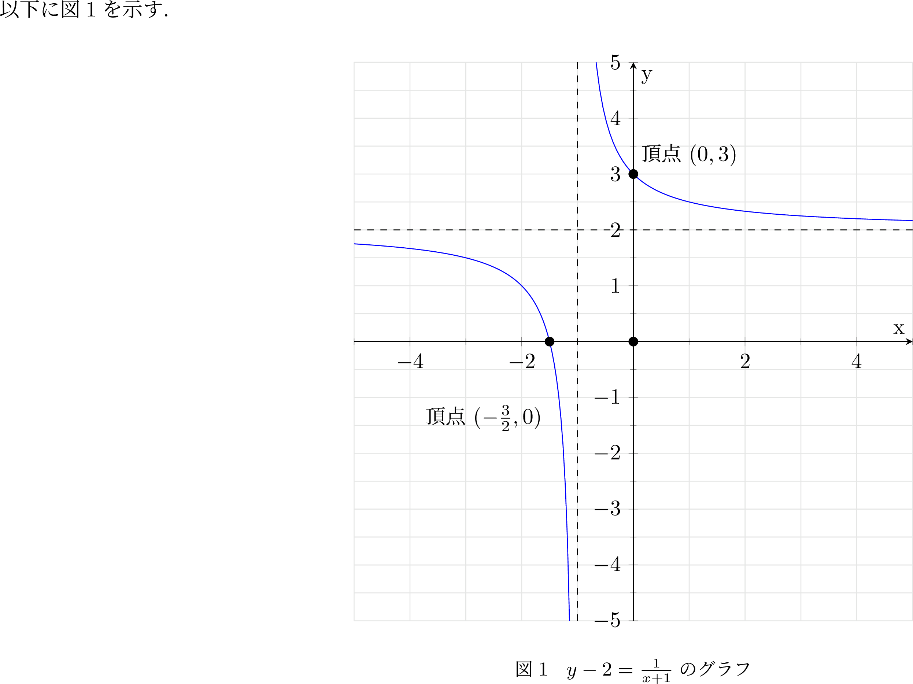
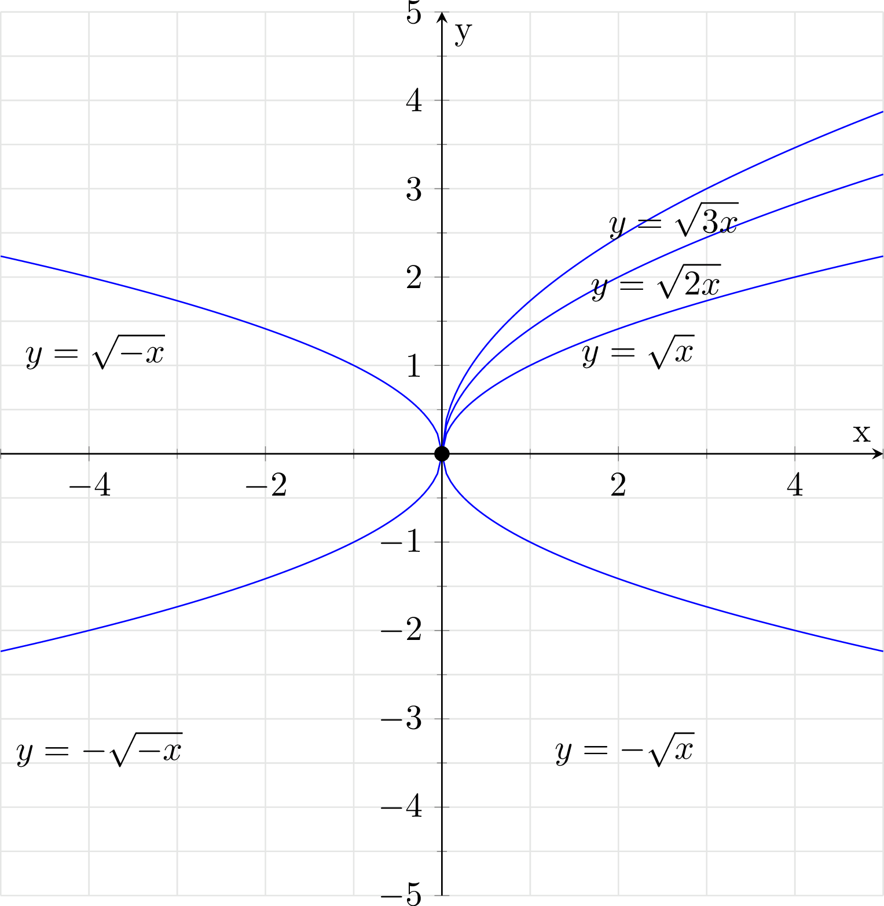
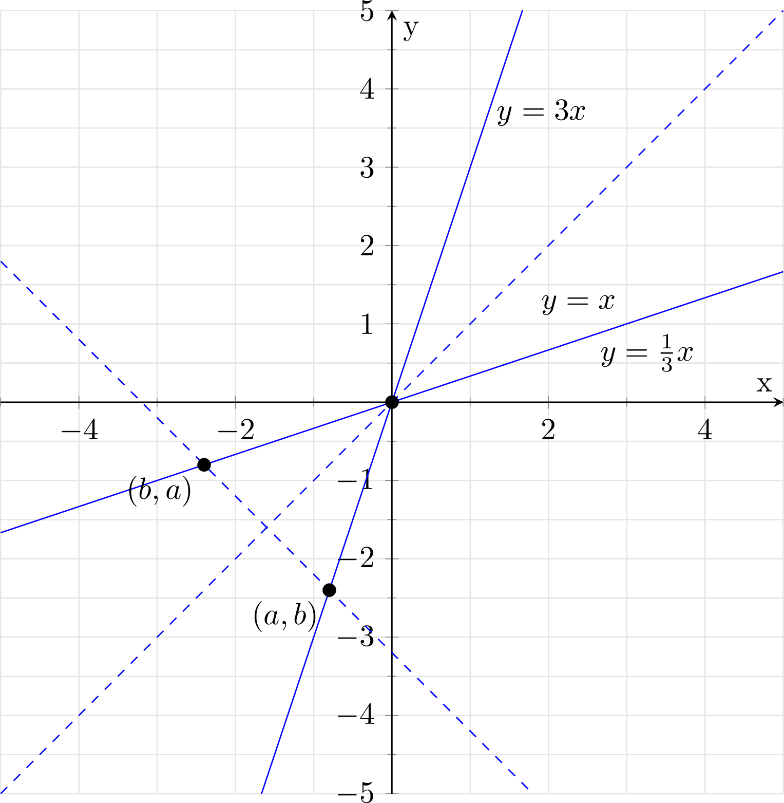
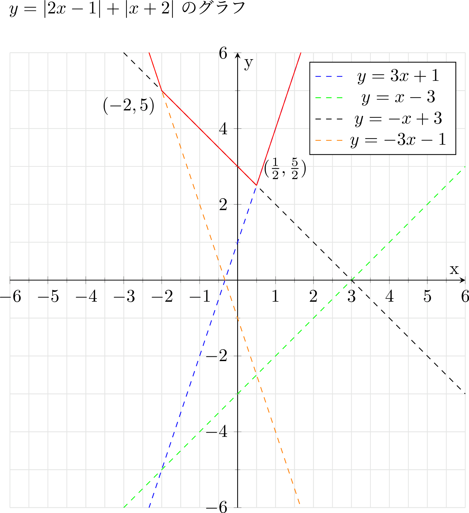
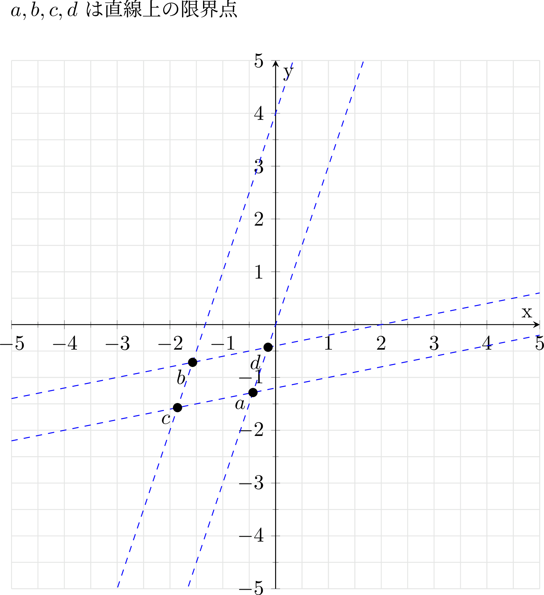
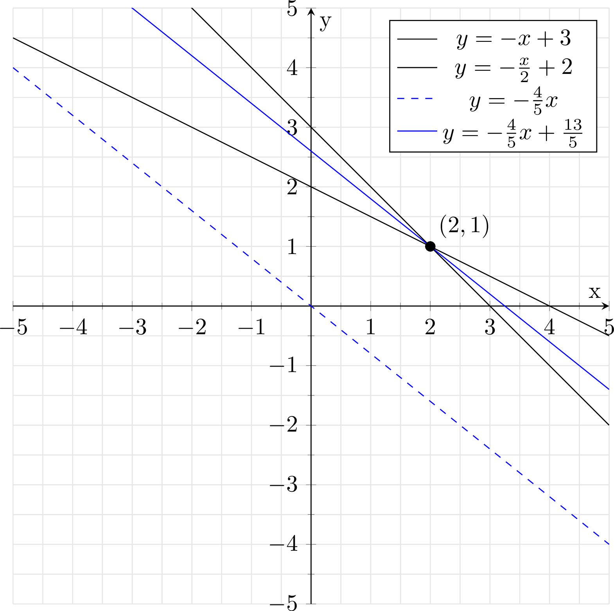
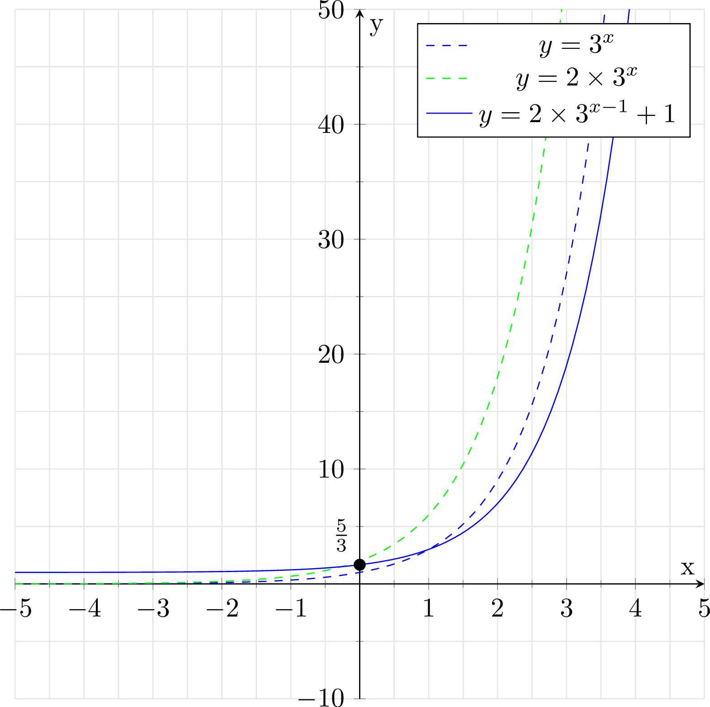
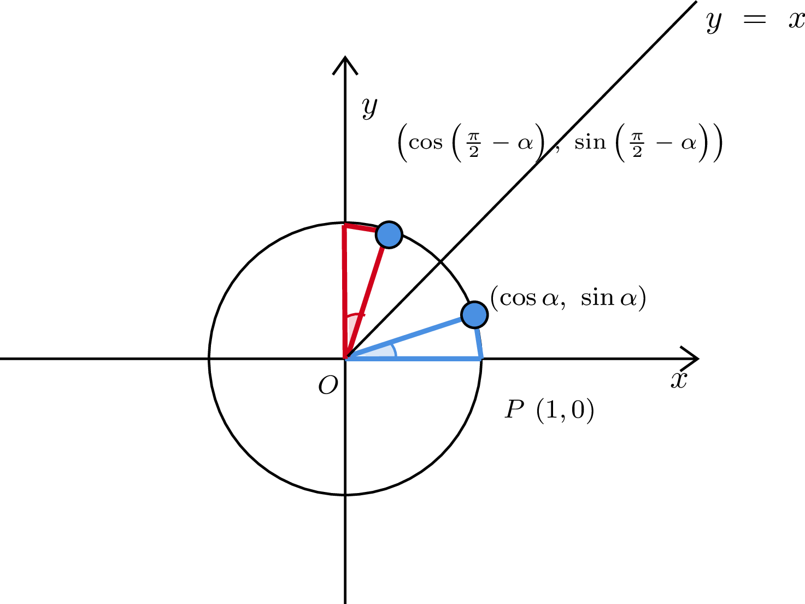
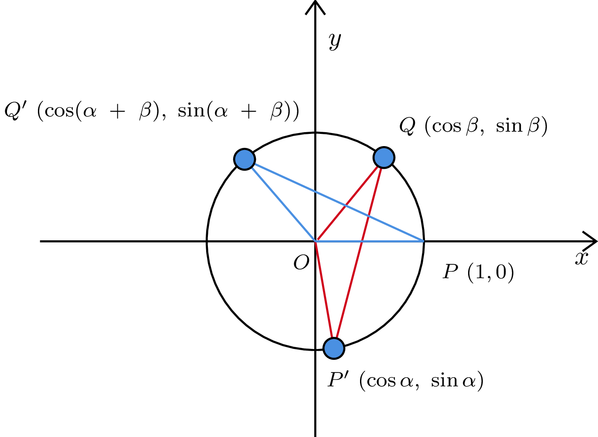

# クイズ1:高校数学(基本語句)

## Q0 学習元

```text
https://informatics.sist.ac.jp/suganuma/kougi/other_lecture/SE/math/basic/basic.htm#number_complexC

https://manabitimes.jp/
```

## Q0 注意

```text
・基本語句に対する説明なので、形式的な定義等は
　行わない（もしくは別途触れる）こととする
```

## Q1 数関連の語句について知っていますか?

??? success
    ### 数関連

    ```text
    主要な数の分類
      ・複素数は実数と虚数に
        実数は有理数と無理数に
        有理数は整数とその他の有理数に
        整数は、正の整数と0と負の整数に分けられる
    
      ・複素数(C)⊃実数(R)⊃有理数(Q)⊃整数(Z)⊃自然数(N)
        --> 太文字のCは複素数全体からなる集合で任意の複素数を元に持つ。

    自然数
      ・0を含むかどうかがあいまいなので
        正の整数(0を含まない)をZ^+
        非負整数(0を含む)をZ_0^+としたりする
    
    整数
      ・小さい数から大きい数を引きたいとき、自然数だけでは不便なので導入された
    
    有理数
      ・除算の結果（つまり整数の比として表現できる数）を表現可能
      ・分母(除数)分子(被除数)ともに整数の分数として表せる数
        有限小数 --> 有限桁の数字で表せる小数
        循環小数 --> 無限小数の一種で、小数部に有限の長さの数列が繰り返し現れるもの
                     有限小数は循環小数の特殊なケースとみなせる(後述)
    
    無理数
      ・有理数ではない実数。
      ・無限小数（非循環小数）は無理数
    
    実数
      ・有理数と無理数からなる数
    
    座標
      ・点の位置を指定するために与えられる数の組

    原点
      ・座標を定める際に、基準となる点
    
    P(x)
      ・点Pの座標がxであることを示した表記法

    複素数
      ・2つの実数a,bと虚数単位i = √-1を用いて、z = a+biのように表現できる数
      ・z = a+bi(a,b∊R)に対して、aが実部で、bを虚部という
      ・実部はRe(z), 虚部はIm(z)とそれぞれ表せる
      ・実数は虚部が存在しない複素数で、a+0iと表せる。
      ・実部が存在しない複素数は純虚数と呼ばれる
    
    虚数単位
      ・2乗すると-1になる数(-->負の数に対しても、平方根を定義可能に)
      ・iは-1の平方根
      ・i^2 = -1
      ・複素数平面では、直交座標表示すると(0,1)にあたる(後述)
    
    aの平方根,立方根
      ・数に対して平方(自乗)するとaになる数 = aの平方根
      ・数に対して3乗するとaになる数  = aの立方根
    
    平方(Square)
      ・指数2のべき乗。
      ・由来は、数を辺としてとらえたとき、その自乗が、
      　自乗される数を一辺の長さとしたときの正方形の面積になることから
    
    平方根の計算
      ・√(a^2) = |a| 例) √(-14^2) = 14
      ・√(ab) = √a√b
      ・√(a/b) = √a/√b
      ・√(a^{2n+1}) = a^n√a
      ・加減算は根号の中が同一の時のみ行える
    
    有理化
      ・分母に根号を含まない形に変形すること

      例) (√c + √d)/ (√a + √b)
        = (√c + √d)(√a-√b)/ (√a + √b)(√a-√b)
        = (√(ca) - √(cb) + √(da) - √(db)) / (a - b) 
    
    二重根号
      ・(√a + √b)^2 = a + b + 2√(ab)
      ・(√a - √b)^2 = a + b - 2√(ab)
      --> 上記が成立することから、両辺に根号をつけた以下の公式が成り立つ※2

      ・ただしa>=b>=0の時
        √(a+b+2√(ab)) = √a + √b
        √(a+b-2√(ab)) = √a - √b
      
      例) √(4 + 2√3) = √3 + 1
      
    移項
      ・等号の公理より、両辺に対して同様の操作をしているだけだが
        一部の項を、符号を変えて他方の辺にうつしているように見えるためこう呼ばれる

    
    べき乗
      ・b^nのとき、bを底、nを冪指数という
      ・底とべき指数に対して定まる演算をべき乗といい
        冪指数に従って、底を掛け合わせるようにして計算を行う
      ・冪指数には、任意の複素数を当てはめることができる

    a^0 = 1
      ・冪指数に負の数を当てはめられることを考え、例えばa^-1 = 1/aを意味することを
        思い出せば、a^0 = 1は自然
      ・a×a = a^2
      ・a   = a^1
      ・1   = a^0
      ・1/a = a^-1
      ・1/(a×a) = a ^ -2

    素数
      ・1より大きい整数のうち、1と自分自身以外の整数では割り切れないような整数
      ・数Nに対する素数判定法として、√Nまでの整数で割るのが有名
        --> (√Nより大きい整数)^2 > Nなので
    
    エラトステネスのふるい
      ・1~nまでの数が素数かどうか一気に求めたいときに使用する
      1: 1~nの全ての整数をTrueとする
      2: 1は素数ではないのでFalse
      3: +1する。その数がTrueなら、その数で割り切れる数をFalseに変える
      4: 以下繰り返し、√nより大きな数になったら終了

    繁分数
      ・分数の分母や分子に分数が存在するもの
    ```

    ### n進法

    ```text
    10 --> n
      ・122の7進法は
        121 / 7 = 17...3
        17  / 7 = 2 ...3
        2   / 7 = 0 ...2
        --> 233
    
    n --> 10
      ・7進法でいう233の10進法は
        233 = 2 * 7^2 + 3 * 7^1 + 3 * 7^0 = 122
    ```

    ### 整数部分、小数部分

    ```text
    ・実数rに対し、r以下の整数で最大のもの --> 整数部分　[r]
      --> ガウス記号(n <= x <= n+1を満たす整数n = 整数部分)　※補足3を参照
    ・r - rの整数部分 --> 小数点部分 {r}

    例) 
      [√5]と{√5}を計算せよ
      2 < √5 < 3なので、
      [√5] = 2
      {√5} = √5 - 2

      [-2.3]と{-2.3}を計算せよ
      -3 < -2.3 < -2なので
      [-2.3] = -3
      {-2.3} = -2.3 - (-3) = 0.7

      [-π]と{-π}を計算せよ
      -4 < -π < -3なので
      [-π] = -4
      {-π} = -π - (-4) = 4 - π

      [(3+√5)/2]と{(3+√5)/2}を計算せよ
      4 < 5 < 9より、各辺のルートをとると、x>=0において √xは単調増加するので
      2 < √5 < 3
      よって、(3 + 2)/2 < (3 + √5)/2 < (3 + 3)/2
      5/2 < (3 + √5)/2 < 3
      従って、[(3+√5)/2] = 2, {(3+√5)/2} = (3+√5)/2 - 2 = (√5 - 1)/2

      4+√3の整数部分をa, 小数部分をbとするとき、a^2 + 2ab + b^2 + 2bの値を計算せよ
      ※整数部分と小数部分を足すと、4 + √3 になるので、 a+b = 4+√3
      a^2 + 2ab + b^2 + 2b
      = (a+b)^2 + 2b

      1 < √3 < 2より、
      a = [4+√3] = 5
      b = {4+√3} = 4 + √3 - 5 = √3 - 1

      よって、(4+√3)^2 + 2(√3-1) = 16 + 8√3 + 3 + 2√3 - 2
      = 17 + 10√3
    ```

    ### 循環小数

    ```text
    ・小数部に有限の長さの数列が繰り返し現れる小数
    ・繰り返す最初と最後のけたの上に点をつけて表現する
    
    [循環節]
      ・循環の一周期のこと
    
    [分数表記]
      ・循環節の桁数をkとおき、10^k倍する
      ・二式について差をとる

      例) 5.21432143... (循環節4桁)
      k = 5.21432143....
      10000k = 52143.2143...

      9999k = 52138
      k = 52138/9999
    
    [有理数と循環小数]
      ・循環小数は分数で表現できるため、有理数
      ・任意の実数rについて
        rが循環小数 ⇔ rは有理数
        ※有限小数は、末尾の後ろに無限個の0があると考えれば、循環小数とみなせる
          0.999... = 1を用いれば、例えば 8/5 = 1.5999...で循環小数とみなせる
      
      例) 2/9を循環小数で表記せよ
          2/9 = 0.22222.... --> 0.2として2の上にdotを書けばいい
    
    [無限等比級数の公式を用いる場合]
      N = 0.222222... = 0.2 + 0.02 + 0.002 + ...
      は、初項a:0.2, 公比r:1/10の無限等比級数とみなせる

      -1 < r < 1の時、 a + ar + ar^2 + ... = a/(1-r)という
      無限等比級数の公式を用いると

      0.2222... = 0.2/(1-1/10) = 2/9
    ```

    ### 絶対値

    ```text
    :=
      定義を意味する
      A := Xなら、AをXと定義する
    ```

    $$
      \begin{align}
        & 実数xの絶対値は、実数から符号を取り除いたものといいたい場合 \\
        & |x| := max\{x, -x\} = 
        \begin{cases}
          x &  (x \ge 0) \\
          -x & (x < 0) \\
        \end{cases} \\
        & 或いは、0からの距離を言いたい場合 \\
        & |x| := \sqrt{x^2} \\
        & 上記のように定義される \\
      \end{align} 
    $$

    ```text
    [場合分けについて]
      |a-b| = {
        a - b (a≧b);  
        b - a (a<b)
      }

      例)  
        |x+2| = 3の解を求めよ
        x + 2 >= 0 つまり、 x >= -2の時、
        x + 2 = 3
        x = 1

        x + 2 < 0 つまり、 x < -2の時、
        -x-2 = 3
        -x = 5
        x = -5

        よって、x = 1, -5

      例)
        ※絶対値が一つで、変数が絶対値の外にない場合
        
        |x+7| = 3の解を求めよ
        絶対値が3になる実数は±3なので
        x + 7 = ±3
        x = -7±3
        x = -4, -10

    [図形的な解釈]
      |a-b| = aとbの距離
      |a+b| = aと(-b)の距離 = -aとbの距離

    [絶対値と不等式:場合分け]
      |x+2|≦3を解け
      x+2 >= 0, つまり、 x>=-2の時、
      |x+2|≦3
        x+2≦3
          x≦1 
      よって、-2≦x≦1 ...(1)

      x+2 < 0, つまり、 x < -2の時、
      |x+2|≦3
     -(x+2)≦3
       -x-2≦3
         -5≦x
      よって、-5≦x< -2 ...(2)

      (1),(2)より、-5≦x≦1

    [絶対値と不等式:別解]
      ・絶対値は0からの距離であるため
        |x+2|≦3はつまり、0とx+2との距離が3以下であることを意味する。よって
        条件を満たす範囲は -3 ≦ x+2 ≦ 3
        よって、-5≦x≦1

      例)
        |x+2|≧5を解け
        |x+2|≧5は、0とx+2との距離が5以上であることを意味する。
        よって条件を満たす範囲は、x+2≦-5, x+2≧5
        よって、x≦-7, x≧3

    [絶対値の性質(実数)]
      任意の実数a,bについて以下が成り立つ
      非負性： |a| ≧ 0
      非退化性: a = 0 ⇔ |a| = 0
      偶性： |-a| = |a|
      劣加法性(三角不等式): |a+b| ≦ |a| + |b|
      冪等性: ||a|| = |a|
      乗法性: |ab| = |a|・|b|
      絶対値の比: |a/b| = |a|/|b|
    
    [偶性]
      絶対値函数f(x) = |x|は以下の条件を満たす
      f(-x) = f(x) --> 偶函数(引数に正負の符号の違いがあっても、同じ結果を返す函数)

    [非退化について]
      ・退化とは対象が特定の条件下で単純化して、
        元の構造や性質が失われてしまう状況を指す
        --> 退化した形状や構造は、特別なケースとみなされ、通常の性質を持たない
      
      ・絶対値(実数)は非退化
        --> 全ての実数xに対して、絶対値はその定義(0からの距離)という意味合いを保つ

    [退化形式について]
      ・退化は、広義には期待される性質が失われている状態を指す
        --> 三角形の頂点が1直線に並ぶと、三角形は面積が0になり、
          　三角形としての性質を失うので、退化した三角形とみなせる
        --> 行列において、行列式が0である場合、行列のランクが落ち
            逆行列を持たないなど、特定の性質が失われているので、退化した行列とみなせる
        --> 幾何学的な形状が面積を失う、行列が逆行列を持たなくなるなどが退化
      
      ・退化形式は、二次形式や双線形形式などに関連して使われるが
        おそらく高校範囲でないため、後でやる
    
    [ベクトルの大きさ = ノルム ≠ 絶対値]
      ・絶対値は、主に実数や複素数に対して用いられる
      ・定義は数の大きさや原点からの距離を意味する

      ・ノルムは、特定の空間における距離や長さを一般化した概念(厳密な定義については後述)
      ・単に「絶対値」というだけでは、多様な測定方法を十分に表現不可能
    ```

    $$
      \begin{align}
      & 成分が実数or複素数であるベクトル\mathbf{v} = (v_1,v_2,...,v_n)を考える \\
      & ユークリッド空間における2-ノルム \\
      & \|\mathbf{v}\|_2 := \sqrt{v_1^2 + v_2^2 + \cdots + v_n^2} \\
      & 1-ノルム(マンハッタン距離) \\
      & \|\mathbf{v}\|_1 = |v_1| + |v_2| + \cdots + |v_n| \\
      & 無限大ノルム(チェビシェフ距離) \\
      & \|\mathbf{v}\|_{\infty} = \max(|v_1| + |v_2| + \cdots + |v_n) \\
      & \\
      & 高校数学におけるベクトルの大きさ \\
      & ベクトル\vec{a} = (x,y)に対し、その大きさは以下 \\
      & |\vec{a}| = \sqrt{x^2 + y^2} \\
      \end{align}
    $$

    ### 補足1(繁分数)

    $$
      \displaystyle\frac{\frac{1}{2}}{\frac{3}{4}}
    $$

    ### 補足2(等式の性質)

    ```text
    ・等号は以下の2つの公理によって定義される
    1 反射律：任意の対象aに対して、a=a
    2 代入原理：対象a,bに対して、a=bならば、
               命題関数P(x)について、P(a) ⇔ P(b)
               --> 対象領域内の具体的な数値や固定された要素が対象であるため
                   変数を含むようなもの(x + 3)を代入原理に直接適用することはできない
                   つまり、a = x + 3等とすることは対象外
               
            --> 対象a_i, b_jが、a_1 = b_1,..., a_l = b_lであるならば
                P(a_1,...,a_l) = P(b_1,...,b_l)
    
    ・1,2の公理から以下の性質が導かれる
     対称律：任意の対象a,bについてa = b ⇒ b = a
     推移律：任意の対象a,b,cについて、a=b∧b=c ⇒ a=c

     --> 反射律、対称律、推移律が成り立つので、特定の集合上の同値関係
    
    ・斉一性について
      ・四則演算について、任意の定数a,b,cを考えるとき、a=bならば
        a + c = b + c
        a - c = b - c
        ac    = bc
        a/c   = b/c
        が成り立つことをいう
      
      ・代入原理とは、もしa=bが成り立つならば、任意の論理式においてaをbに置き換えても
        その真偽が変わらないことを指すため、
      
      ・<前提>　a = bである
        P^I(x): 任意の項(x)にcを加えた数が a + cになれば真
        P(a) = a + c (真),   P(b) = b + c(真) 
        --> 真ということは置き換えても結果はa+c
        --> 斉一性の加法性は成り立つ
        --> 同様にして、減法性も、乗法性も、除法性も成り立つ

        --> 根号に関しても、乗法性を鑑みれば, c = 1/√aと置いたとき
            a = b ⇒ a * 1/√a = b * 1/√a ⇒ √a = √bとなるので
            a,bが定数で等しい限り、両辺に根号をつけても等式が保たれることがわかる
    ```

    ### ガウス記号の性質

    

    ```text
    [黒丸と白丸]
      ・白丸は含まない、黒丸は含む
      ・上記のグラフで言うと、0≦x<1の時、y = 0, 1≦x<2の時、y = 1
    
    [ガウス記号の性質の一例]
      x,yは任意の実数、Nは任意の整数とする
      [1]: ⌊ x + N ⌋ = ⌊ x ⌋ + N
      [2]: ⌊ x + y ⌋ ≧  ⌊ x ⌋ +  ⌊ y ⌋
      [3]: ⌊ 2x ⌋ =  ⌊ x ⌋ +  ⌊ x + 1/2 ⌋

    [1]について
      ・x + Nの整数部分は、xの整数部分 + N 
        --> ⌊ N ⌋ = Nなので、足したところで小数部が繰り上がることはない
    
    [2]について
      ・二つの数を足した状態での整数部分 ≧ それぞれの整数部分の和
        小数部分について考慮すると、0 <= {x} + {y} < 2 より、明らか
        ⌊ x + y ⌋ = ⌊ ⌊ x ⌋ + ⌊ y ⌋ + {x} + {y} ⌋ ≧ ⌊ x ⌋ + ⌊ y ⌋
    
    [3]に関する証明
      証明する対象：⌊ 2x ⌋ =  ⌊ x ⌋ +  ⌊ x + 1/2 ⌋
      0 ≦ x < 1/2の場合
        左辺 = 右辺 = 0となるため等式は成り立つ
      1/2≦ x < 1の場合
        左辺 = 右辺 = 1となるため等式は成り立つ
      よって、 0≦x < 1の時、等式⌊ 2x ⌋ =  ⌊ x ⌋ +  ⌊ x + 1/2 ⌋は成り立つ ...(1)

      任意の実数xについて、xの整数部分をN, 小数部分をαとおくと
      x = N + αと表せる
      [1]より、
      ⌊ 2(α + N) ⌋ = ⌊ 2α + 2N ⌋ = ⌊ 2α ⌋ + 2N ...(2)
      ⌊ (α + N) ⌋ + ⌊ (α+N) + 1/2 ⌋ = ⌊ α ⌋ + N + ⌊ α + 1/2 ⌋ + N
      = ⌊ α ⌋ + ⌊ α + 1/2 ⌋ + 2N ...(3)

      ここでαは小数部分であるため(1)より
      ⌊ 2α ⌋ =  ⌊ α ⌋ +  ⌊ α + 1/2 ⌋
      従って、(2),(3)より
      ⌊ 2(α + N) ⌋ = ⌊ (α + N) ⌋ + ⌊ (α+N) + 1/2 ⌋ 
      α + Nをxに直すと、⌊ 2x ⌋ = ⌊ x ⌋ + ⌊ x + 1/2 ⌋になるため
      任意の実数xについて、⌊ 2x ⌋ = ⌊ x ⌋ + ⌊ x + 1/2 ⌋は成立する
    ```

    $$
      \begin{align}
        & [エルミートの恒等式] \\
        & xが任意の実数, nが正の整数ならば、\\
        & \displaystyle \lfloor nx \rfloor = \sum_{k=0}^{n-1} \lfloor x + \frac{k}{n} \rfloor = \lfloor x + \frac{0}{n} \rfloor + \lfloor x + \frac{1}{n} \rfloor + \cdots + \lfloor x + \frac{n-1}{n} \rfloor \\ 
        & [証明] \\
        & xを任意の実数,nを任意の正の整数とする \\
        & xについては、整数部分mと小数部分αを用いて、以下のように置き換えられる \\
        & x = m + α(m \in \mathbb{Z}; 0 \le \alpha < 1)。つまり、\lfloor x \rfloor = m \\
        & ここで、m,\alphaを用いて、右辺と左辺をそれぞれ書き換えると\\
        & (右辺) = 
        \lfloor m + α + \frac{0}{n} \rfloor + 
        \lfloor m + α + \frac{1}{n} \rfloor + 
        \lfloor m + α + \frac{2}{n} \rfloor +
        \cdots
        \lfloor m + α + \frac{n-1}{n} \rfloor \\
        & = nm + 
        \lfloor α + \frac{1}{n} \rfloor + 
        \lfloor α + \frac{2}{n} \rfloor +
        \cdots 
        \lfloor α + \frac{n-1}{n} \rfloor \\ 
        & (左辺) = \lfloor n(m + α) \rfloor = \lfloor nm + nα \rfloor = nm + \lfloor nα \rfloor \\
        & この時、任意の場合において等式が成立することを示せれば証明は為される\\
        & [1] 0 \le \alpha < \frac{1}{n}のとき \\
        & (右辺) = nm + \underbrace{0 + \cdots + 0}_{n-1個} = nm\\
        & (左辺) = nm + 0 = nm \\
        & [2] \frac{1}{n} \le \alpha < \frac{2}{n}のとき \\
        & (右辺) = nm + \underbrace{0 + \cdots + 0}_{n-2個} + \underbrace{1}_{1個}  = nm + 1\\
        & (左辺) = nm + 1\\
        & [3] \frac{k-1}{n} \le \alpha < \frac{k}{n}のとき(ただしk = 1,2,\cdots,n) \\
        & (右辺) = nm + \underbrace{0 + \cdots + 0}_{n-k個} + \underbrace{1 + \cdots + 1}_{k-1個}  = nm + k - 1\\
        & (左辺) = nm + k - 1 (k-1 \le n\alpha < kより)\\
        & この時、n,mについて任意の解釈を行っても等式は成り立ち続ける \\
        & よって、0 \le \alpha < 1, m \in \mathbb{Z}, n \in Z^{+}の場合について、\lfloor n(m+\alpha) \rfloor = \sum_{k=0}^{n-1} \lfloor m + \alpha + \frac{k}{n} \rfloorは成り立つ \\
        & m+\alphaを元に戻すと、\lfloor nx \rfloor = \sum_{k=0}^{n-1} \lfloor x + \frac{k}{n} \rfloor \\
      \end{align}
    $$

    ```text
    例)
      エルミートの恒等式より、以下の等式が成り立つ
      ⌊ x ⌋ + ⌊ x + 1/4 ⌋ + ⌊ x + 2/4 ⌋ + ⌊ x + 3/4 ⌋ = ⌊ 4x ⌋     

    ```

## Q2 式変形関連の語句について知っていますか?

??? success
    ### 整式

    ```text
    単項式
      ・数単体や文字単体の積だけの形で表された式　例) 3ax^2y
    
    多項式
      ・単項式の和や差として表された式　例) 3ax^2y + 4x
    
    項
      ・多項式を構成する、各単項式を指す

    整式
      ・単項式の1つ以上の和として表された式
    
    係数
      ・項における（着目していない文字や）数の部分
    
    次数
      ・項における着目している文字の個数
    
    n次式
      ・式に含まれる最も高い次数をnとしたもの
    
    n次多項式
      ・n次の多項式
    
    同類項
      ・係数を除き、文字の部分が同じである項
      ・整式の加法や減法の場合、同類項の間だけで演算可能
    
    べき乗
      ・同じ項を複数回かける操作
      ・べき指数のことを単に指数と呼んだりする
    
    指数が0, 負になる場合の定義
      ・x^0 = 1
      ・x^{-n} = 1/(x^n)
      ・x^n / x^m = x^{n-m}
    
    整式の乗法
      ・任意の項同士の演算が可能
      ・各項のすべての組み合わせに対して演算が行われる
      ・演算後は同類項をまとめる
    
    因数分解
      ・多項式をいくつかの因数の積の形で表現したもの
    
    因数
      ・1つの多項式が複数の整式の積で表現できるとき
        各整式を元の多項式の因数と呼ぶ
    
    展開
      ・複数の整式の積を、1つの多項式の形（項の和の形）に変換すること
      ・因数分解の逆の操作にあたる
    
    因数分解&展開の公式
      ・2x^2 + 8xy = 2x(x + 4y) : [共通因数でくくる]
      ・(x±y)^2 = x ±2xy + y^2
      ・(x+y)(x-y) = x^2 - y^2
      ・(x+a)(x+b) = x^2 + (a + b)x + ab
      ・(ax+b)(cx + d) = acx^2 + (ad + bc)x + bd
        --> たすき掛けに使うやつ
      
      ・(x+y)(x^2 - xy + y^2) = x^3 + y^3
      ・(x-y)(x^2 + xy + y^2) = x^3 - y^3
      ・(x+y)^3 = x^3 + 3x^2y + 3xy + y^3
      ・(x-y)^3 = x^3 - 3x^2y + 3xy^2 -y^3
        --> 二項定理でも出る奴
      ・(x+y+z)(x^2 + y^2 + z^2 -xy - yz - zx) = x^3 + y^3 + z^3 -3xyz
      ・(x+y+z)^2 = x^2 + y^2 + z^ + 2xy + 2yz + 2zx
      ・(x+a)(x+b)(x+c) = x^3 + (a + b + c)x^2 + (ab + bc + ca)x + abc
    
    置き換え
      ・(x+a)^2 + 2b(x+a) + b^2
        y = x+aと置くと
        y^2 + 2by + b^2
        = (y+b)^2
        = (x+a+b)^2
    
    多項式 / 単項式
      ・(4x^2y^3 - 3y^2 + xy) /xy = 4xy^2 - 3x^{-1}y + 1
    
    降べき/昇べき
      ・項の次数が大きいものから順に並べる場合、降べき
        逆の並べ方が昇べき
      ・重要なものを先頭に持ってくるという考え方
      ・次数が高いものが重要なら降べきに、定数項が重要なら昇べきに
      ・循環しているような式なら、整理しない方がいいこともある
    
    整式でないもの
      ・√(5x)
      --> 単項式の定義を思い出す(数や文字の式だけで....)
      --> 根号をかぶせる操作については「数単体や文字単体の...」に反するので単項式でない
      --> 根号をとることができるなら単項式
      --> √13 * xのような式ならば、数単体や文字単体を掛け合わせているのでOK
      --> 3√yは整式ではない(√yは文字単体ではないので)

      ・3/x
        --> 割り算は逆数の掛け算で表現できるが
            1/xは数や文字単体で表現できない
            つまり、数単体や文字単体を掛け合わせてできる式にはならない
            ※分母の数字を約分で消せるならOK
      
      ・2^x
        --> 指数二文字を含んでいる
      
      ・函数の引数に文字があるような形
        --> 整式の定義に反する

      ・冪級数(項が無限個あるようなもの)
    
    ```

    ### 整式/整式の計算

    ```text
    [定義]
      ・与えられた多項式A(x), B(x)に対して以下を満たす
        多項式Q(x), R(x)が一意に定まる
      ・この時、Q(x)を商、R(x)を余りという

      ・A(x) = B(x)Q(x) + R(x)
      ・この時、Rの次数 < Bの次数(Bで割っているため) ※除法の原理より

    例)
      A(x) = x^3 + 2x^2 + 5
      B(x) = x^2 - x + 4

      A = BQ + Rより、Aの次数はBの次数 + Qの次数となる
      ここで、B(x)は2次式なので、Q(x)は1次式となる
      よって、Q(x) = ax + b

      また、Rの次数 < Bの次数より、Rも1次以下の式となる
      よって、以下が恒等式となる、a,b,c,dを求めればよい
      x^3 + 2x^2 + 5 = (x^2 - x + 4)(ax + b) + cx + d
      
      右辺を展開して
      ax^3 + (b-a)x^2 + (4a -b + c)x + 4b + d
      係数比較を行うと(※2係数比較法)
      1 = a,  2 = b-a, 0 = 4a-b+c, 5 = 4b + d
      よって、
      (a,b,c,d) = (1,3,-1,-7)と定まる。
      従って
      商：Q(x) = ax + b = x + 3
      余り：R(x) = cx + d = -x -7
      --> 高次の項から見ていくと順々に定まる

    [筆算する場合]
      ・割る式と割られる式の係数を並べる
      ・上が商で、下が余りとなる

      A(x) = x^3 + 2x^2 + 5
      B(x) = x^2 - x + 4
               1 3
          ---------
      1-14)1 2 0 5
           1-1 4
             3-4 5
             3-312
              -1-7
      商が x + 3, 余りが -x-7
    ```

    ### 二重根号外し

    ```text
    ・Q1で述べた通り、二重根号については以下の公式が成り立つ
      証明についてはa >= b >= 0より、両辺が非負であり、2乗した形の両辺が一致する事から
      a >= b >= 0の時
      √(a + b + 2√(ab)) = √a + √b
      √(a + b - 2√(ab)) = √a - √b
    
    例)
      √(5 + 2√6) = √3 + √2
      a + b = 5,  ab = 6になるようなabを探せばいい

      √(4 + √15) = √2(√(4 + √15)) / √2
      = √(8 + 2√15) / √2
      = √2(√5 + √3) / 2
      = (√6 + √10) / 2

      √(11 - 6√2) = √(11 - 2√18) = √9 - √2 = 3 - √2

      √(44 + 2√420)
      a + b = 44, ab = 420
      --> 足して44, かけて420になる数を探したい
      ※足してA, かけてBになる時、a,bは、x^2 - Ax + B = 0の解になる

      ※2次方程式ax^2 + bx + c = 0の解をα, βとすると
        α + β = -b/a,  αβ = c/aとなることを使う

        特にa = 1とすると、
        α + β = -b,  αβ = c
        つまり、x^2 - (α+β)x + αβ = 0を解くと、
        足してα + β, かけてαβとなる二つの数が導かれる
        
        よって、x^2 - 44x + 420 = 0を解くと
        x = -(-22) ± √((-22)^2 - 1*420) / 1
        = 22 ± √64
        = 30, 14
        
      √(44 + 2√420) = √30 + √14

    [二重根号を外せない場合]
      ・解の公式を使った場合、根号が登場する --> √(b^2 - 4ac)
      ・つまり、足し合わせたものをA, 掛け合わせたものをBとした場合
        √(A^2 -  4B) -->　これが平方数でなければルートが残ってしまう

      ・逆を言えば、A^2 - 4Bが平方数の場合、二重根号は外すことが可能 

      例) √(5 + 2√6) --> (A,B) = (5,6)なので
          5^2 - 24 = 1で平方数。よって、二重根号は外せる
    ```

    ### 平方完成

    ```text
    ・ax^2 + bx + c = a(x-p)^2 + qの形に変形すること
    ・二次式の一次の項が消える

    例)
      2x^2 - 12x + 3
      = 2(x^2 - 6x) + 3
      = 2(x^2 - 6x + 9 - 9) + 3
      = 2(x-3)^2 + 3 - 15
      = 2(x-3)^2 - 12

      --> xの係数の半分を2乗したものを加え、加えた分だけ引いてやる

      2x^2 + 3x + 1
      = 2(x^2 + 3/2x) + 1
      = 2(x^2 + 3/2x + 9/16 - 9/16) + 1
      = 2(x + 3/4)^2 + 1 - 18/16
      = 2(x + 3/4)^2 - 1/8

      [係数比較しても楽]
        2x^2 + 3x + 1 = 2(x-p)^2 + q
        右辺の1次の係数が3になるようにpを定めると
        = 2(x+3/4)^2 + q
        定数項を比較して
        1 = 9/8 + q
        q = -1/8
        よって、2(x+3/4)^2 - 1/8

    [使い道]
      ・二次関数の軸の方程式や頂点の座標が分かりやすい

      ・y = ax^2 + bx + c = a(x-p)^2 + q
        軸の方程式： x = p
        頂点の座標(x,y) = (p, q)

      例) y = 2x^2 + 5x + 1
          = 2(x^2 + 5/2x) + 1
          = 2(x^2 + 5/2x + 25/16 - 25/16)  + 1
          = 2(x + 5/4)^2 - 17/8

          軸の方程式: x = -5/4
          頂点座標(x,y) = (-5/4, -17/8)
    
    [立法完成]
      ・ax^3 + bx^2 + cx + d = a(x-p)^3 + qx + rとすること
      ・三次式の二次の項が消える
      
      例)
      x^3 + 3x^2の立法完成
      --> 二次の係数と、3次式の展開公式に着目してpを決める
      (x+1)^3 + qx + r 
      一次の項と定数項を調整(x+1)^3 = x^3 + 3x^2 + 3x + 1
      0 = qx + 3x ,  0 = r + 1
      (q,r) = -3, -1
      --> (x+1)^3 -3x -1
    
    [四次式の平方完成]
      a > 0の場合
      ax^4 + bx^3 + cx^2 + dx + e
      = (√ax^2 + px + q)^2 + rx + s

      例) x^4 - 2x^3 + 1の平方完成
      (x^2 + px + q)^2 + rx + sの形に変形することを目指すと(三次の項が消えている)
      係数比較を行って
      2p = -2, p^2 + 2q = 0, 2pq + r = 0, q^2 + s = 1
      (p,q,r,s) = (-1, -1/2, -1, 3/4)
      x^4 - 2x^3 + 1= (x^2 - x -1/2)^2 -x + 3/4
    ```

    ### 剰余の定理

    ```text
    [剰余の定理]
      多項式P(x)を(x-a)で割った余りはP(a)

    [剰余の定理の証明]
      除法の原理より
      多項式P(x)を(x-a)で割ったときの商をQ(x), 余りをRと置くと
      ※1次式で割っているので、余りは定数項になる
      P(x) = (x-a)Q(x) + R

      x = aを代入すると
      P(a) = R。よって、P(x)をx-aで割った余りRはP(a)
    
    [ax + bで割った場合の余り]
      P(x)をax + bで割った余りはP(-b/a)

      P(x) = (ax + b)Q(x) + R
      x = -b/aを代入すると P(-b/a) = Rになるので

    [例]
      P(x) = x^5を2x-1で割ったときの余り

      x^5 = Q(x)(2x-1) + R
      x = 1/2を代入すると

      R = (1/2)^5 = 1/32

      --> 除法の原理が分かっていれば容易い
    
    [二次式で割る場合:剰余の定理は使わない]
      P(x) = x^4 + xを x^2 - 3x + 2で割ったときのあまり
      ※2次式の余りなので、ax+b

      x^4 + x = Q(x)(x^2 - 3x + 2) + ax+b
      x^4 + x = Q(x)(x-2)(x-1) + ax+b

      x = 1の時、2 = a + b
      x = 2の時、18 = 2a + b
      連立方程式を解くと、
      a = 16, b = -14
      よって余りは、16x - 14
    
    [重解の場合:剰余の定理は使わない]
      f(x) = x^10を(x-1)^2で割った余り

      x^10 = Q(x)(x-1)^2 + ax + b
      x = 1の時、 a + b = 1となる
      --> 解が一つしか出ないので情報が足りない
      --> よって、両辺を微分してから代入してみる
      (A = Bが恒等式なら、A' = B'は成り立つのでOK)
      (除法の原理の定義を思い出すと、上記は恒等式, ただの式変形だしね)

      ※積の微分公式
      (fg)' = f'g + fg'
      10x^9 = Q(x)'(x-1)^2 + Q(x)2(x-1) + a
      x = 1を代入すると
      10 = a
      よって、(a,b) = (10, -9)なので
      余りは10x-9

      x^10 = Q(x)(x-1)^2 + 10x - 9


    ```

    ### 組立除法

    ```text
    ・多項式の割り算において、多項式 / (x-p)の商と余りを手早く求める手段
    ・x-pの場合、pを右上に置き、1つ上の値をp倍していく。
    ・最終桁の値は余り、それ以外の桁が、商の係数となる

    　例) f(x) = x^3 + 4x^2 -3x + 5を x-2で割った商と余りを求めよ

          1 4 -3  5  |2
            2 12 18
          1 6  9 23

          商は x^2 + 6x + 9, 余りは 23

      例)  x^4 + 1/2を x+2で割った商と余りを求めよ

          1  0  0  0 1/2  |-2
            -2  4 -8  16
          1 -2  4 -8 33/2

          商は x^3 -2x^2 + 4x-8 余りは33/2
      
      例) x^2を2x-1で割り算せよ
          ※ 除数が x-pである必要があるので、x-1/2で割ったものに適用してから
             商を調整する。

          1   0   0 |1/2
            1/2 1/4
          1 1/2 1/4

          商は x + 1/2, 余りは1/4

          よって、x^2 = (x-1/2)(x+1/2) + 1/4
          A(x) = B(x)Q(x) + Rの等式を成り立たせながら、
          除数を二倍した場合、商は1/2倍されるので
          x^2 = (2x-1)(1/2x + 1/4) + 1/4
          よって、商は1/2x + 1/4, 余りは1/4

    [証明:3次式の場合]
      被除数(多項式)を、a_1x^3 + bx^2 + cx + d
      
      組立除法で得られる商を ex^2 + fx + g
      余りをhx + iとする

    ```

    $$
      \begin{align}
        & [証明:3次式の場合] \\
        & 被除数(多項式)を a_3x^3 + a_2x^2 + a_1x + a_0 \\
        & 除数を、x - p \\
        & 組立除法の結果得られる商を、b_2x^2 + b_1x + b_0 \\
        & 余りをrとおく \\
        & ここで組立除法のやり方より、以下が成立する \\
        & a_3 = b_2 \\
        & a_2 + b_2p = b_1 \\
        & a_1 + b_1p = b_0 \\
        & a_0 + b_0p = r \\
        & 移行すると \\
        & a_3 = b_2 \\
        & a_2 = b_1 - b_2p \\
        & a_1 = b_0 - b_1p \\
        & a_0 = r - b_0p \\
        & この時、除法の原理(A(x) = B(x)Q(x) + R(x))より \\
        & a_3x^3 + a_2x^2 + a_1x + a_0 = (x-p)(b_2x^2 + b_1^x + b_0) + r \\
        & 右辺を展開すると \\
        & b_2x^3 + (b_1 - b_2p)x^2 + (b_0 - b_1p)x + r - b_0p \\
        & 移行した結果を見比べると、各係数が両辺で等しいため、等式は成立している \\
        & よって、3次式に関して組立除法の手順に従うと、\\
        & 恒等式A(x) = (x-p)Q(x) + rが成り立つようなQ(x), rが一意に定まる \\
        & \\
        & [証明:n次式の場合] \\
        & 被除数をA(x) = a_nx^n + a_{n-1}x^{n-1} + ... + a_1x + a_0 \\
        & 除数をB(x) = x - pとする\\
        & 組立除法の結果得られる商はQ(x) = b_{n-1}x^{n-1} + b_{n-2}x^{n-2} + ... + b_0 \\
        & 余りはrとおく \\
        & 組立除法の手順に従うと、以下のような再帰的な等式が得られる \\
        & a_n = b_{n-1} \\
        & a_{n-1} + b_{n-1}p = b_{n-2} \\
        & a_{n-2} + b_{n-2}p = b_{n-3} \\
        & ... \\
        & a_1 + b_1p = b_0 \\
        & a_0 + b_0p = r \\
        & これを移行すると、以下のようにかける※ \\
        & a_n = b_{n-1} \\
        & a_{n-1} = b_{n-2} - b_{n-1}p \\
        & a_{n-2} = b_{n-3} - b_{n-2}p \\
        & ... \\
        & a_1 = b_0 - b_1p \\
        & a_0 = r - b_0p \\
        & 多項式の除法の原理A(x) = B(x)Q(x) + R(x)に従い、以下の等式が成り立つことを確認する \\
        & a_nx^n + a_{n-1}x^{n-1} + ... + a_1x + a_0 = (x-p)(b_{n-1}x^{n-1} + b_{n-2}x^{n-2} + ... + b_0) + r \\
        & 右辺を展開すると \\
        & b_{n-1}x^{n} + (b_{n-2} - b_{n-1}p)x^{n-1} + ... + (b_0 - b_1p)x + r - b_0p \\
        & 展開した結果を両辺で比較すると、※より各項の係数が対応して等しいため、上式は恒等式 \\
        & よって、n次式に対しても組立除法の手順に従うと、\\
        & 恒等式A(x) = (x-p)Q(x) + rが成り立つようなQ(x), rが一意に定まる。
      \end{align}
    $$

    ### たすき掛け

    ```text
    ・二次式を因数分解するための方法

    ・因数分解&展開の公式を思い出す
    (ax + b)(cx + d) = acx^2 + (ad + bc)x + bd
      --> この恒等式に着目したのが

    例) 3x^2 - 10x + 8
    ac = 3, ad + bc = -10, bd = 8

    1 かけて二次の係数になる2つの数を決める
    2 かけて定数項になる2つの数を決める
    3 斜めに掛け算して、出てきた結果の和が、1次の係数になればOK

    a:1  -2:b --> -6: bc
    c:3  -4:d --> -4: ad

    (a,b,c,d) = (1,-2,3,-4)

    3x^2 - 10x + 8 = (x-2)(3x-4)

    [解の公式の方が確実性はある]
      ax^2 + 2b'x + c = 0の解は、x = -b'±√(b'^2- ac) / aであり
      ax-2 + bx + c = 0の解がα,βである時、a(x-α)(x-β)と因数分解できる
        --> 因数定理(後述)
      3x^2 -10x + 8

      x = 5±√(25 - 24) / 3
      = (5±1) / 3

      x = 2, 4/3

      よって、3(x-2)(x-4/3) = (x-2)(3x-4)
    
    [2変数の場合]
      3x^2 + 2xy -8y^2 -8x + 14y - 3の因数分解
      3x^2 + (2y - 8)x - (8y^2 - 14y + 3)
      = 3x^2 + (2y - 8)x - (4y-1)(2y-3)
      [2次] [定数項] [1次]
      3     -4y+1   -4y+1
      1     2y-3    6y-9
                    2y-8

      =(3x -4y + 1)(x + 2y - 3)

    [2変数の場合：解の公式]
      3x^2 + (2y - 8)x + (-8y^2 + 14y - 3)
      解の公式を用いると、ルートの中身は以下のようになる
      (y-4)^2 - 3(-8y^2 + 14y - 3) = y^2 - 8y + 16 + 24y^2 -42y + 9
      = 25y^2 -50y + 25
      = 25(y-1)^2
      よって、{5(y-1)}^2となり、完全平方式になる

      従って、改めて解の公式を用いると
      x = (-y + 4) ± 5(y-1) / 3
      = (4y-1)/3, -2y+3
      
      よって、因数分解した結果は、
      3(x - ((4y-1)/3))(x - (-2y+3))
      = (3x - (4y-1))(x - (-2y + 3))
      = (3x - 4y + 1)(x + 2y - 3)
    
    [補足:完全平方式]
      ・ある式の2乗で表記された多項式
      ・平方完成した際に、括弧外に係数や項が出ることがない
    ```

    ### 補足1(因数定理)

    ```text
    多項式f(x)に対して、f(α) = 0(解αを持つ) ⇔ f(x)は(x-α)を因数に持つ
    すなわち、f(x) = (x-α)q(x)という形で表せる ⇔ f(α) = 0
    --> 剰余の定理の余りがない場合の特殊ケースにあたる

    例) 二次方程式がα,βを解に持つ
        --> (x-α),(x-β)が因数となる。

        (x-α),(x-β)が整式P(x)の因数となる
        --> f(α) = f(β) = 0 --> α,βが 整式P(x) = 0 の解になる
    
    [因数に持つ]
      ・多項式Aについて、A = BCとあらわせるとき、AはB,Cを因数に持つという
        A = BC + B等の場合、B,Cを因数に持つとは言わない
      
    [証明]
    ```

    ### 分数式の計算

    ```text
    [約分と因数分解]
      (x^2 + x) / (x^2 + 3x + 2)
      = x(x+2) / (x+2)(x+1)
      = x / x+1
    
    [通分]
      x/(x+2) + 3/(x+3)
      = x(x+3)/(x+2)(x+3)  + 3(x+2) /(x+2)(x+3)
      = {x(x+3)+ 3(x+2)} / (x+2)(x+3)
      = (x^2 + 6x + 6) / (x+2)(x+3)
    
     [仮分数--> 帯分数]
      ・仮分数：a/bにおいて、a>=bとなる分数
      ・真分数：a/bにおいて、a<bとなる文数
      ・帯分数：整数と分数の部分がある分数

      (x^2 + 3x + 5) / (x+1)
      = {(x+2)(x+1) + 3} / (x+1)
      = x + 2 + 3/(x+1)
     ```


    ### 補足1(除法の原理)

    ```text
    ・任意のa,b∊Z, b >0に対して、次の条件を満たす整数q,r∊Zが一意に定まる
      a = qb + r , 0 ≦ r < b
      --> つまり、余りは除数より小さくなる
    
    [多項式に拡張したもの]
      多項式A(x),B(x),Q(x),R(x)間で、以下の恒等式が一意に定まる
      A(x) = B(x)Q(x) + R(x)
      deg(R) < deg(B) ※degは次数

      1 商Q(x)の次数は、A(x)とB(x)の次数の差によって決まる
        もしdeg(A) = mで、deg(B) =nならば、deg(Q)はm - nになる
        これは、A(x)の最高次の項を打ち消すために、同じ次数の項を持つ
        B(x)×Q(x)の項が必要であるため(多項式の減算は同類項同士しか不可)
      
      2 除法が終了するには、deg(R(x)) < deg(B(x))である必要がある
        もし、deg(R(x))>= deg(B(x))であれば、さらに除算をつつけることが可能

      3 Q(x)とR(x)が一意に定まるのは、多項式の構造上
        割り算の各段階で高次の項を消していく過程が決定的であるため
    ```

    ### 補足2(係数比較法&(方程式と恒等式))

    ```text
    [恒等式]
      ・特定の対象領域において、両辺の変数に対して任意の解釈を与えても
      　常に成り立つ等式(任意の数を代入可能)

    [恒等式と恒真性]
        A(x) = B(x)が恒等式であるとすると、この等式は任意のxに対して成立する
        これは論理式として∀x(A(x)=B(x))が常に真であること、すなわち恒真であること
        に相当する

        --> 等式の形の恒真式が、恒等式と呼ばれる
    
    [対象領域]
      ・特定の対象領域において、という但し書きがある通り、
        恒等式は、議論されている文脈に依存する。

        対象領域Dがあらかじめ実数であると定められている場合
        その領域で常に成り立つ等式は恒等式として扱われる

        例)
        √(a^2) = |a|(ただし対象領域D = 実数)
         --> 実数aに対しては恒等式
         --> 複素数領域では平方根の定義が異なるので、複素数aに対しては成立しないが
             対象領域は実数なので、問題ない
      
    [条件付き等式]
      ・条件Aのもとで成立する等式は、条件A下で恒真であると表現可能
      ・方程式は未知数を含み、未知数に対する解を探すことが主目的
      ・条件付き等式の目的は、前提条件が成り立つときに等式が成立することを示すこと
      --> つまり含意

      例)
        [条件付き等式の例]
        a+b+c = 1 ⇒ a^3 + b^3 + c^3 - 3abc = a^2 + b2+^2 + c^2

        [恒等式の例]
          ∀a,b,c∊R, a^2 + b^2 + c^2 ≧ 0
          --> 対象領域があるだけで、前件はない

    [恒等式の性質]
      1:P(x) = 0がxについての恒等式 ⇔ P(x)の各項の係数がすべて0
      2:P(x),Q(x)がxについての恒等式 ⇔ P(x), Q(x)の同じ次数の項の係数がそれぞれ一致

      例) 次の等式がxについて恒等式となるようにa,bの値を定めよ
          ただし、a,bは実数。
          ax - b = 2x + 1

          性質2より、係数を比較して (a,b) = (2, -1)
    
    [方程式]
      ・変数に対し、特定の解釈を行った場合にのみ成り立つ等式

    [論理式で方程式と恒等式の違いを見る]
      ※D = 対象領域

      ∃x ∊ D (f(x) = g(x)) : 方程式
      ∀x ∊ D (f(x) = g(x)) : 恒等式

    [恒等式に関する証明]
      n >=0, a_i, b_i(i>=0)を実数とする。この時、
      a_nx^n + a_{n-1}x^{n-1} + ... + a_0x^0 
      = b_nx^n + b_{n-1}x^{n-1} + ... + b_0x^0 
      ⇔ a_n = b_n, a_{n-1} = b_{n-1},..., a_0 = b_0であることを証明せよ
      
      つまり、任意の実数を代入して両辺が等しくなる ⇔　係数が∀等しい
      
    [i]　各項の係数がすべて等しいと仮定する。
         この時、右式に対して代入していくと、両辺が等しくなる。
    
    [ii] 任意の実数を代入して両辺が等しくなる式について、
         等しくならない係数(a_i ≠ b_i)が存在すると仮定する。
         この時、等しくならない係数のうち、最大の次数のものをkとする。

      [1] k = 0の時、a_0≠ b_0だが、
          この時、左辺と右辺で係数が等しい項について互いに打ち消しあうと、
          a_0 = b_0であり、これは矛盾する。
      
      [2] k >= 1の時、
          左辺と右辺で係数が等しい項について互いに打ち消しあうと、
          a_kx^k + a_{k-1}x^{k-1} + ... + a_0 = b_kx^{k} + b_{k-1}x^{k-1} + ... + b_0
          移行すると、
          (a_k - b_k)x^k + (a_{k-1} - b_{k-1})x^{k-1} + ... a_0 - b_0 = 0
          これはk次方程式であるため、解は高々k個しか存在しない。
          これは、任意の実数を代入して両辺が等しくなる式
          (仮に、解としてとらえると無限個存在するはず)という前提と矛盾する。
      
      よって、[1],[2]より、
      任意の実数を代入して両辺が等しくなる式について、
      等しくならない係数(a_i ≠ b_i)が存在するという仮定は誤り。
      従って、(￢A ⇒⊥) ⇒ Aより、
      任意の実数を代入して両辺が等しくなる式について、
      係数はそれぞれ全て等しくなる。
          
    ```

    ### 補足3(恒等式に対する微分)

    ```text
    ・等式の性質から導けるのは、定数1 = 定数2が成り立つ場合、
      代入原理より、任意の命題P(x)に対して、P(定数1)⇔P(定数2)
      であるため、等式に対する操作であっても、
      微分のような変数を含んだ式については導けない
    
    ・具体的な対象でない場合、つまり変数を含む演算については
      線型性を考慮するのがいい
    
    [自明に思えるが]
      ・両辺の各項の係数が全く同じ式(恒等式)であれば、
        (両辺を)自乗しても、ルートをとっても、四則演算しても、微分しても恒等式なのは、
        つまり両辺に同じ操作をしても恒等式なのは自明であるように思えるが、
        これに対する証明は可能なのだろうか?
    
    [アイデア]
    ・(恒等式)' = 恒等式である理由については、
      恒等式に関する性質というよりもむしろ、微分演算子が線型作用素であるという
      事に由来する

    [線型性]
      写像fが線形 ⇔ 
        任意のx,yに対して f(x+y) = f(x) + f(y): 加法性
        任意のx,aに対して、f(ax) = af(x): 斉次性が満たされる
      
      ・この時、fを線型性を満たす演算子という意味で、線型作用素と言ったりする

      例) 
      [線形: f(x) = 3x]
        f(x+y) = 3(x+y)
        = 3x + 3y
        = f(x) + f(y)より、加法性を満たす

        f(ax) = 3ax
        = a(3x)
        = a(f(x))
        = af(x)より、斉次性を満たす

      [非線形: f(x) = 3x + 1]
       f(x+y) = 3(x+y) + 1
       = 3x + 3y + 1

       f(x) + f(y) = 3x + 1 + 3y + 1
       = 3x + 3y + 2 ≠ f(x+y)
    
    [微分の線型性]
      ・微分演算は加法に対して線型であるため、任意の関数f(x), g(x)について次が成立
      　d/dx[f(x)+g(x)] = d/dx[f(x)] + d/dx[g(x)]

      ・また斉次性より、次が成立
        d/dx[cf(x)] = c・d/dx[f(x)]

      ここで例として
        3x + 2x = 5xという恒等式について考える。
        微分の線型性より
        f(x+y) = f(x) + f(y), f(ax) = af(x)であるため
        f(5x) = f(3x) + f(2x) = 3f(x) + 2f(x)

        --> 同類項をまとめたり、因数分解や展開などの式変形を施しても
            微分の線型性により、微分後の値が変わることはない。
        
        --> うーん。自明って言ってもいいような気がする
    ```

## Q3 方程式関連の語句について知っていますか?

??? success
    ### 方程式

    ```text
    [方程式]
      ・変数に対し、特定の解釈を行った場合にのみ成り立つ等式
    
    [方程式を解く]
      ・方程式について、等式が成り立つ解釈を求めること
    
    [n次方程式]
      ・方程式を構成する各項の最大の次数がnである方程式

      例) 
        ax + b = 0
        ax = -b
        x = -b/a (a≠0)

        |ax+b| = c
        ax+b = ±c
        ax = -b±c
        x = (-b±c) / a (a≠0)
    
    [二次方程式の解の公式]
      ax^2 + bx + c = 0 (a≠0)の解は
      x = -b±√(b^2-4ac) / 2aとなる

      =0になる解を探すので、P(x) = 0を探すことになる

      例) x^2 + x + 1 = 0の解を求めよ
        x = -1±√(1^2 - 4) / 2
        = (-1±√(-3)) / 2
        = (-1±√3i) / 2
    
    [解の公式の証明(平方完成)]
    ax^2 + bx + c = 0 
    a(x^2 + (b/a)x) + c = 0
    a(x + (b/a)x + b^2/4a^2 - b^2/4a^2 ) + c = 0
    a(x+ b/2a)^2 -b^2/4a + c = 0
    a(x+ b/2a)^2 = b^2/4a - 4ac/4a
    (x+ b/2a)^2 = (b^2 - 4ac) / 4a^2
    両辺のルートをとって
    (x + b/2a) = ±√(b^2 - 4ac) / 2a
    x = -b±√(b^2 - 4ac) / 2a

    [解の公式の証明(恒等式)]
      二次方程式ax^2+bx+c=0(a≠0)におけるxの解, 
      α,βが以下のようにあらわせることを証明する
      α = -b+√(b^2-4ac) / 2a
      β = -b-√(b^2-4ac) / 2aとおく
      この時α + β = -b/a ,  αβ = b^2 - (b^2 - 4ac) / 4a^2 = c/a
      
      因数定理※より、
      P(x) = ax^2 + bx + c = a(x-α)(x-β) ...(1)が恒等式であれば
      (右辺は左辺をただ式変形した結果になるため)
      整式P(x)はx-α, x-βを因数に持ち※、P(α) = P(β) = 0であり
      P(x) = 0は、x = α, βを解に持つといえる
      従って(1)が恒等式であることを示していく

      右辺を展開すると
      a(x-α)(x-β) = a(x^2 -(α + β)x + αβ) = ax^2 -a(α + β)x + aαβ
      両辺の係数が各々等しければ恒等式といえるので, 係数比較法より
      a = a, b = -a(α + β), c = aαβ
      ここで、α + β = -b/a , αβ = c/aより、
      -a(α + β) = -b*-a/a = b, aαβ = a*c/a = c
      両辺の係数が各々等しいので、ax^2 + bx + c = a(x-α)(x-β)は恒等式
      従って、α = -b+√(b^2-4ac) / 2a,β = -b-√(b^2-4ac) / 2aの時、
      P(α) = P(β) = 0
      よって、-b±√(b^2-4ac) / 2aは 「ax^2 + bx + c = 0」の解である

      [補足]
      ※二次方程式は高々2つの解を持つため、証明前から
        ∃α,β∊複素数全体(ax^2 + bx + c = A(x-α)(x-β))であることは分かっている
      ※今回の場合α,βについては、具体的な値で固定されており
        (α,β)= -b±√(b^2-4ac) / 2a　⇒ ∀x(ax^2 + bx + c = a(x-α)(x-β))を解く格好
      ※証明によって、二次方程式の二つの解は常に(α,β)= -b±√(b^2-4ac)として示される
        とわかるので、ax^2 + bx + c = a(x-α)(x-β)は恒等式となる
    ```

    ### 一次の項の係数が偶数の時

    ```text
    ax^2 + 2b'x + c = 0(a≠0)の解は、

    x = -b'±√(b'^2 - ac) / a

    解の公式に対して、b = 2b'とするとこの公式が得られる

    x = (-b±√b^2 - 4ac) / 2a
    = -2b'±√((2b')^2 - 4ac) / 2a
    = -2b'± 2√(b'^2 - ac) / 2a
    = -b'± √(b'^2 - ac) / a

    --> 簡易になるので、一次の項が偶数の時は使うといい
    ```

    ### 二次方程式の解と係数の関係

    ```text
    ・P(x)= ax^2 + bx + c(a≠0)について、
      P(α) = 0 ∧ P(β) = 0 ⇔ α + β = -b/a ∧ αβ = c/a
      --> 解と係数の関係

    例)  5x^2 + 6x - 2 = 0の解をα、βと置いた時の
        α + β,  αβ, α^2 + β^2の値を求めよ

        α + β = -6/5
        αβ = -2/5
        α^2 + β^2 = (α+β)^2 - 2αβ
        = (-6/5)^2 -2(-2/5) = 36/25 + 20/25 = 56/25
    
    例) 連立方程式 u + v = 3, u^2 + v^2 = 7を解け

    u^2 + v^2 = (u+v)^2 - 2uv = 7
    9 - 2uv = 7より、uv = 1

    解と係数の関係より、u,vは以下の二次方程式の解となる
    u + v = -b/a = 3
    uv = c/a = 1

    b = -3a,  c = aを満たすような二次方程式を考えると
    x^2 -3x + 1 = 0
    これを解くと、 x = 3±√(9-4) /2
    より、(u,v) = ((3+√5)/2, (3-√5)/2),((3-√5)/2, (3+√5)/2)


    [証明について:1(解の公式)]
      P(x)= ax^2 + bx + c(a≠0)について、
      [i] P(α) = 0 ∧ P(β) = 0
          ⇒ α + β = -b/a ∧ αβ = c/a
    
          二次方程式の解の公式より、P(x)の解α,βはそれぞれ
          -b±√(b^2 - 4ac) /2aとおけるので
          α + β, αβとすると、-b/a, c/aが算出される。

      [ii]α + β = -b/a ∧ αβ = c/a ⇒
          P(α) = 0 ∧ P(β) = 0

          P(x) = ax^2 + bx + cに代入すると
          b = -a(α + β)
          c = a(αβ)より
          ax^2 -a(α + β)x + a(αβ)

          ここで、x = αとすると
          aα^2 - aα^2 - aαβ + aαβ = 0
          x = βとすると
          aβ^2 -aαβ -aβ^2 + aαβ = 0より、確かに、P(α) = P(β) = 0となる

          よって、
          ax^2 + bx + c = 0について、
          α,βが解なら、α + β = -b/a,  αβ = c/aが成立し、
          任意の数α,βについて、α + β = -b/a,  αβ = c/aが成立するなら
          α,βは ax^2 + bx + c = 0の解である

    [証明について:2(因数定理)]
      二次方程式ax^2 + bx + c = 0(a≠0)がx = α,βを解に持つとき、
      因数定理より、定数Aを用いて
      ax^2 + bx + c = A(x-α)(x-β)とかける
      --> 解となる以上 x = αの時、0以外にならないので、
          A(x-α)(x-β) + B等の形はとらない

      これを展開して係数を比較すると
      A(x-α)(x-β) = A(x^2 -(α + β)x + αβ)
      = Ax-^2 - A(α + β)x + αβAより
      a = A,  b= -A(α + β), Aαβ = c
      これを直すと
      α + β = -b/a,   αβ = c/aとなり、解と係数の関係が得られる
    ```

    ### 判別式D(解の公式のルート)

    ```text
    [判別式]
      ・ax^2 + bx + cに対して、b^2 - 4acのこと
        判別式はD(discriminant:判別式の頭文字)と表記される

      例) 2x^2 + 3x - 1の判別式Dは
          (3)^2 - 4*2*(-1)
          = 9 + 8 = 17

      ・判別式は、解の公式におけるルートの中身に相当する
        従って、D = b^2-4acと置くと
        ax^2 + bx + c = 0の解xは、
        x = (-b±√D) / 2aと書き直せる

      [実数係数の二次方程式の実数解の個数]
        ・2次方程式ax^2 + bx + c = 0について判別式D = b^2 - 4acとするとき
          (ただし、a,b,cは実数)
          D > 0 ⇔ 2次方程式は異なる実数解を2つもつ
          D = 0 ⇔ 2次方程式は実数解を1つ(重解)を持つ
          D < 0 ⇔ 2次方程式は互いに共役な2つの複素数解を持つ
                   複素数zが解ならば、その共役も解
                   実数解が0個なので、自然と複素数解2つになる
          ※複素数係数の場合、実数係数多項式 = 0の証明より
          　必ずしもその共役が解とはならないことがわかる
        
        例) 3x^2 + 6x + 2 = 0の実数解の個数
            D = 36 - 4(2)(3) = 12
            D > 0なので、実数解は2つ

            ※符号が分かればいいだけなので、D/4でもいい
            D/4 = 3^2 - 6 = 3
          
        例) 15x^2 + 24x + 10 = 0の実数解の個数
            D/4 = (12)^2 - 15*10 = -6
            D < 0なので、実数解は0

      [実数係数の二次関数のグラフと判別式]
        ・2次関数 y = ax^2 + bx + c(ただし、a,b,cは実数)について
          判別式をD = b^2 - 4acとするとき
          D > 0 ⇔ 2次関数はx軸と二点で交わる
          D = 0 ⇔ 2次関数はx軸と一点で交わる(接する)
          D < 0 ⇔ 2次関数はx軸と交わらない

        例) y = -x^2 + 3x - 2のグラフとx軸の共有点(x軸との交点)の個数は?
           -x^2 + 3x - 2の判別式Dは
           3^2 -4(-1)(-2) = 9 -8
    
    [判別式で実数解の個数がわかる理由]
      D = b^2 - 4acの部分が0の場合、±0となり、差は生まれない => 重解となる
      D < 0の場合、ルートの中身はマイナスになる
      たとえば、b^2 - 4ac = -5の場合、√(-5)
      これは、二乗すると-5になる数を意味する。
      虚数単位iを用いると、i^2 = -1
      よって、√(-5) = √(5*-1) = √(5*i^2) = (√5)i
      ルートの部分が虚数となるため、実数解は存在しない。
      D > 0の場合、ルートの中身は正になるため、差が生まれ実数解が2つ存在する
    
    [判別式でx軸との交点の数がわかる理由]
      ・R^2の座標平面で考えると、実数係数の二次関数f(x)が実数解αを持つ
        --> f(α) = 0。つまり、x = αの時に値が0となることを意味する。

        実数解を2つ持つ ⇔ f(x) = 0となるxの値が2つ存在する ⇔ x軸と2点で交わる
        実数解を1つもつ ⇔ f(x) = 0となるxの値が1つ存在する ⇔ x軸と1点で接する
        実数解を持たない　⇔ f(x) = 0となるxの値が「実数の座標平面上には」存在しない
        ⇔ x軸と接しない
    ```

    ### 一般化した判別式と三次方程式

    ```text
    [一般化した判別式]
      ax^2 + bx + c = 0の解をα,βとおくと
      D = a^2(α - β)^2

    [2次多項式における、一般化した判別式の証明]
      a^2(α - β)^2が、b^2 - 4acと一致することを示せばいい

      解と係数の関係より
      α + β = -b/a,  αβ = c/a
      a^2(α - β)^2
      = a^2((α+β)^2 - 4αβ)
      = a^2((-b/a)^2 -4c/a)
      = a^2((b^2 - 4ac)/a^2 )
      = b^2 - 4ac
    
    [n次方程式の判別式]
      ・n次方程式の判別式は、以下に相当する
        解の差の二乗を掛け合わせたもの * a^{2n-2}

      ・二次方程式の場合
        [i]
          解の差の二乗は(α-β)^2
          これにa^2を掛け合わせてa^2(α-β)^2

        [ii]
          解の差は、(α,β) = -b±√(b^2  - 4ac) / 2aより、
          2√(b^2  - 4ac) / 2a
          = √(b^2  - 4ac) / a
          よって、二乗は (b^2-4ac)/a^2
          これに、a^{2*2 -2}を掛け合わせると
          --> b^2 - 4acが示された


    [三次方程式の判別式]
      三次方程式ax^3 + bx^2 + cx + d =0の解をα,β,γとおく(ただしα,β,γ,a≠0)
      判別式D = a^4(α-β)^2(β-r)^2(γ-α)^2

      解の差の二乗を掛け合わせたもの
      (α-β)^2(β-r)^2(γ-α)^2
      a^{2*3 - 2} = a^4
      --> a^4(α-β)^2(β-r)^2(γ-α)^2
    
    [実数係数の三次方程式の実数解の個数と重解]
      1 判別式 D = 0 : ⇔ 重解を持つ
      2 判別式 D > 0 : ⇔ 相異なる実数解を3つもつ
      3 判別式 D < 0 : ⇔ 実数解は1つ
    
    [D = 0 ⇔ 重解を持つ]
      [1]
        判別式がD = a^4(α-β)^2(β-r)^2(γ-α)^2であることを考えると
        複素数では積が0になる場合、掛け合わせた対象のうち
        少なくとも1つは0になるためD = 0になる場合、a≠0より
        α = β ∨ β = γ ∨ γ = αと考えられる
        よって、重解を持つ

        重解を持つとき、解の差の二乗を掛け合わせたもののうち1つの差は0になるため
        判別式は0。よって、D = 0 : ⇔ 重解を持つは成り立つ
    
    [相異なる実数解3つ⇒ D > 0 , 実数解は1つ ⇒ D < 0]
      [2]
        実数係数の三次方程式の解については以下の3パターンに場合分け可能
        1 重解あり。残る1つも実数解
        2 相異なる実数解が3つ
        3 実数解が1つと互いに共役な複素数解が2つ
        (実数係数多項式=0の時、複素数zが解ならば, その共役も解より)

        [1]より、1の時、D = 0である
        2の時、a^4は正, (α-β)^2(β-r)^2(γ-α)^2も(実数-実数)^2は明らかに正
        よって、D>0
        3の時、解はα, A+Bi, A-Bi(ただしα,A,Bは実数で、B≠0)とおける
        この時、判別式を計算すると(指数法則なども活用して)
        D = a^4((α-A)-Bi)^2((α-A)+Bi)^2(2Bi)^2
        = a^4{((a-A)-Bi)((a-A)+Bi)}^2(4B^2i^2)
        = a^4{(a-A)^2 - (Bi)^2}^2(-4B^2)
        = -4a^4B^2{(a-A)^2 + B^2}^2
        a,A,Bは実数なので、a^4B^2{(a-A)^2 + B^2}^2 >=0よって、
        D = -4a^4B^2{(a-A)^2 + B^2}^2 < 0 ...(2)
    
    [D > 0 ⇒相違なる実数解3つ, D < 0⇒実数解は1つ]
      [3]
        D > 0の時、実数係数の3次方程式が互いに共役な複素数解を2つもつと仮定する
        (2)より、互いに共役な複素数解を2つもつ場合、判別式はD < 0となるので矛盾
        よって、仮定は否定される。また、重解を持つ場合D = 0となるので、これも否定
        よって、D > 0の時、実数係数の3次方程式は相異なる3つの実数解を持つ

        D < 0の時、実数係数の3次方程式が相異なる3つの実数解を持つと仮定する
        ここで、解をα + 0i, β + 0i, γ + 0iと置くと、
        判別式は (実数)^4(実数-実数)^2(実数-実数)^2(実数-実数)^2 > 0
        よって、仮定は否定される。重解を持つ可能性は否定されているので
        D < 0の時、実数係数の3次方程式は1つの実数解と互いに共役な複素数解を2つもつ

    [3次方程式と解と係数の関係]

      --> 実際に三次方程式ax^3 + bx^2 + cx + d = 0から、実数解の個数を導く際は
          具体的な係数の値から判定する必要がある
          そこで、α,βを用いてではなく、a,b,c,dを用いてDを表現したい

      三次方程式: ax^3 + bx^2 + cx + d = 0の解をα,β,γとおくと
      α + β + γ = -b/a
      αβ + βγ + γα = c/a
      αβγ = -d/a
    
    [証明]
      ax^3 + bx^2 + cx + d = 0の解をα,β,γとすると
      因数定理よりｘ
      ax^3 + bx^2 + cx + d = a(x-α)(x-β)(x-γ)と因数分解できる
      --> (x-α),(x-β),(x-γ)は確かに因数だがこの積で表現されるのは、
      　  最高次の係数が1の三次式になるので左辺の最高次の係数と合わせるためa倍しておく
      --> (x-α)(x-β)(x-γ)だけで三次式であるため、さらにxが掛け合わされることはない

      a(x-α)(x-β)(x-γ)
      = a(x^2 -(α+β)x + αβ)(x-γ)
      = a{x^3 -(α+β+γ)x^2 + γ(α+β)x + αβx - αβγ}
      = ax^3 -a(α+β+γ)x^2+ a(αβ + βγ + γα)x - aαβγ

      恒等式の係数を比較すると
      b = -a(α+β+γ)
      α+β+γ = -b/a

      c =  a(αβ + βγ + γα)
      αβ + βγ + γα = c/a

      d = - aαβγ
      αβγ = -d/a
    
    [もう予測がつく(四次方程式の解と係数の関係)]
      ax^4 + bx^3 + cx^2 + dx + e = 0の解をα,β,γ,δとおくと
      α + β + γ + δ = -b/a
      αβ + αγ + αδ + βγ + βδ + γδ = c/a
      αβγ + αβδ + αγδ + βγδ = -d/a
      αβγδ = e/a
    ```

    ### (補足)対称式について
    
    ```text
    [対称式について]
      ・n変数の多項式について考えるとき、変数x_1,...,x_nをどのように置換しても
        元の多項式と変わらない場合、このような多項式を対称式という
    
    [基本対称式について]
      ・全ての変数からd個選んで掛け合わせたものを足し合わせたものを
        基本対称式σ_dという
      ・基本対称式は対称式である
    
    [対称式の基本定理]
      ・対称式は基本対称式の多項式として表せ、その表し方は1通りである
    ```

    $$
      \begin{align}
        & \displaystyle n変数(x_1,x_2,...,x_n)の多項式について考える。この時 \\
        & \sigma_1(x_1,x_2,...,x_n) = x_1 + x_2 + \cdots + x_n \\
        & \sigma_2(x_1,x_2,...,x_n) = \sum_{1 \le i < j \le n} x_ix_j \\
        & ... \\
        & \sigma_d(x_1,x_2,...,x_n) = \sum_{1 \le i_1 < i_2 < ... < i_d \le n} x_{i_1}x_{i_2}...x_{i_d} \\
      \end{align}
    $$

    ### n次方程式の解と係数の関係

    ```text
    [定理]
    n次方程式:a_nx^n + a_{n-1}x^{n-1} + ... + a_1x^1 + a_0 = 0の解を
    x_1,x_2,...,x_nとおく。また、x_1,x_2,...,x_nのd次の基本対称式をσ_dとおく
    このとき、d = 1,...,nに対して、
    σ_d = (-1)^d・(a_{n-d})/{a_n}

    例)
      4次方程式(ax^4 + bx^3 + cx^2 + dx + e)のσ_3
      (方程式をP(x)とし、P(x)=0を満たす解をα,β,γ,δとおく)
      ※a_1 = d, a_4 = a
      σ_3 = αβγ + αβδ + βγδ + αγδ = (-1)^3・(a_1)/(a_4) = -d/a


    [証明(n次方程式の解と係数の関係)]
    与えられたn次方程式P(x)は、因数定理より、P(x)=0の解をx_1,...,x_nとすると
    a_nx^n + a_{n-1}x^{n-1} + ... + a_1x + a_0
    = a_n(x-x_1)(x-x_2)...(x-x_n) ...(1)と因数分解可能

    ここでx^{n-d}次の係数を比較すると、左辺は、a_{n-d}
    右辺については、一般にx^{n-d}の項の係数は、
    解x_1,...,x_nに対するd次の基本対称式に関連してくる

    [0次と係数]
      解をn-1個掛け合わせたものになる
    
    [1次と係数]
      xを1つ、-1*解をn-1個選んで掛け合わせたものの総和となる
    
    [k次と係数]
      xをk個、-1*解をn-k個選んで掛け合わせたものの総和となる
    
    [n-d次と係数]
      xを{n-d}個、-1*解をd個選んで掛け合わせたものの総和

    ここで、解をd個選んで掛け合わせたものの総和は、
    基本対称式の定義から、基本対称式σ_dになる
    よって、(x-x_1)(x-x_2)...(x-x_d)...(x-x_n)の各次の係数は

    n-d次の係数 = (-1)^d*(σ_d)

    特に、a_n(x-x_1)(x-x_2)...(x-x_d)...(x-x_n)の各次の係数は
    a_n(-1)^d*(σ_d)となる

    (1)は恒等式であるため係数比較法を用いると
    a_{n-d} = a_n(-1)^d・σ_dなので
    σ_d = a_{n-d} / a_n(-1)^d

    1/(-1)^d = (-1)^dなので、
    σ_d = (-1)^d{a_{n-d} / a_n}

    よって、n次方程式における基本対称式

    従って、n次方程式の解と係数について、上記のような関係性が定まる
    ```

    ### 三次方程式の係数から実数解の個数を判定する

    ```text
    n次方程式の解と係数の関係より、
    とある三次方程式、x^3  + cx + d = 0の解と係数について考えると、

    σ^d = (-1)^d・(a_{n-d}/ a_n)より
    ax^3 + bx^2 + cx + d = 0の解を、α,β,γと置いたとき基本対称式は以下のように定まる
    1次の基本対称式：α + β + γ = -b/a
    2次の基本対称式：αβ + βγ + αγ = c/a
    3次の基本対称式：αβγ = -d/a

    よって、今回の場合
    α + β + γ = 0
    αβ + βγ + αγ = c
    αβγ = -d

    ここで、ax

    また、n次の判別式は
    解をx_1,...,x_nとすると
    a^{2n-2}・Σ_{1 <= x_i < x_j <=n} (x_i - x_j)^2で表されるので
    3次の判別式は
    a^{4}(α-β)^2(β-γ)^2(γ-α)^2となる。

    よって、今回の場合a = 1なので、判別式D = (α-β)^2(β-γ)^2(γ-α)^2
    
    これをc,dを用いて表しなおすと、

    (α-β)(β-γ) = (αβ -αγ -β^2 + βγ)
    = -(β^2 - αβ - βγ + αγ)
    = -(β^2 + c -2β(α+γ))
    β = -α-γより
    = -(3β^2 + c)

    同様にして
    (β-γ)(γ-α) = -(3γ^2 + c)
    (γ-α)(α-β) = -(3α^2 + c)
    ※α^2 + β^2 + γ^2 = (α+β+γ) - 2(αβ + βγ + γα)
    ※(α^2β^2 + β^2γ^2 + γ^2α^2) = (α+β+γ) - 2(αβ + βγ + γα)
    従って、
    D = -(3β^2 + c)-(3γ^2 + c)-(3α^2 + c)
    = -(3β^2 + c)(3γ^2 + c)(3α^2 + c)
    = -{9β^2γ^2 + 3β^2c + 3γ^2c + c^2}(3α^2 + c)
    = -{9β^2γ^2 + 3c(β^2 + γ^2) + c^2}(3α^2 + c)
    = -{27(αβγ)^2 + 9c(α^2β^2 + β^2γ^2 + γ^2α^2) 
    + 3c^2(α^2 + β^2 + γ^2) + c^3}
    = -{27(αβγ)^2 + 9c{(αβ + βγ + γα)^2 - 2αβγ(α + β + γ)}
    + 3c^2(α^2 + β^2 + γ^2) + c^3}
    = -{27(-d)^2 + 9c{c^2} + 3c^2{(α+β+γ) - 2(αβ + βγ + γα)} + c^3}
    = -{27(-d)^2 + 9c{c^2} + 3c^2{-2c} + c^3}
    = -{27d^2 + 4d^3}
    = -4c^3 - 27d^2

    [使用例]
      x^3 - x + t = 0が相異なる3つの実数解を持つための条件を示せ

      判別式D = -4(-1)^3 -27t^2
      = 4 - 27t^2
      相異なる3つの実数解を持つとき、判別式D > 0となるので、
      4-27t^2 > 0
      4 > 27t^2
      相異なる3つの実数解を持つための条件は、t^2 < 4/27
    
    [ax^3 + bx^2 + cx + d = 0の場合]
      D = -4ac^3 -27a^2d^2 + b^2c^2 + 18abcd - 4b^3d
      --> 複雑になってくるので、他のやり方で判定した方がよさそう
    ```

    ### 方程式から有理数解を見つける方法

    ```text
    [定理]
      整数係数多項式 = 0の形の方程式について、有理数解q/pを持つならば
      分母pは最高次の係数の約数であり、分子qは定数項の約数である
    
    [例]
      高次の方程式を解くには、f(α) = 0となる解αを見つけ、因数分解していく必要がある
      (カルダノの奴を使わないなら、そうして次数を二次方程式まで下げていく)
      --> つまり、てっとりぱやく解αを見つける必要がある

      x^3 - x^2 - x - 2 = 0を解け
      有理数解をもつと仮定する。この時、分母pの候補は±1, 分子qの候補は±1,±2
      つまり、有理数解の候補は、(2,-2,1,-1)

      α = 2の時、8-4-2-2 = 0より成り立つ
      よって、α = 2
      x^3 - x^2 - x -2 = 1(x-2)Q(x)

      1 -1 -1 -2   |2
         2  2  2
      1  1  1  0

      = (x-2)(x^2 + x + 1)
      解の公式を用いて

      x = -1±√(1-4) /2
      = -1±√(3)i / 2

      よって、x = (2, -1±√(3)i / 2)
    
    [証明：有理数解の見つけ方]
      整数係数多項式 = 0の形の方程式について、有理数解q/pを持つ
      ⇒　分母pは最高次の約数∧分子qは定数項の約数を証明する

      方程式 a_nx^n + a_{n-1}x^{n-1} + ... + a_1x^1 + a_0 = 0
      (a_n≠0, a_i = 整数)について考える

      この方程式が有理数解q/p(pとqは互いに素)を持つとき、
      元の方程式に代入を行うと、
      ※有理数解なので、p≠0, 互いに素なので既約分数

      a_n(q/p)^n + a_{n-1}(q/p)^{n-1} + ... + a_1(q/p)^1 + a_0 = 0
      両辺にp^nをかけると
      a_n(q)^n + a_{n-1}q^{n-1}p + a_1(q)p^{n-1} + a_0p^n = 0
      この時、n次の項以外を移行すると
      a_n(q)^n = pの倍数となる
      qはpと互いに素であるため、a_nはpの倍数(補足)
      また、定数項以外を移行すると
      a_0p^n = qの倍数となる
      qはpと互いに素であるためa_0はqの倍数

      よって、前件が成り立つならば、最高次の係数は有理数解の分母であり、
      定数項は、有理数解の分子であることが示された。

    [補足:二つの整数a,bが互いに素]
      1以外に正の公約数を持たないa,b
      ※公約数：2つ以上の整数に共通な約数

      意味:a,bが互いに素で、akがbの倍数ならば、kはbの倍数(a,b,k∊Z; Zは整数)
    
    [補足の証明]
      gcd(a,b) = 1 ∧ ak = b*m(mは整数) ⇒ k = b*n(nは整数)であることを証明する
      a,bが互いに素 ⇔ ax + by = 1を満たす整数x,yが存在する(a,bは0でない整数)
      という定理を使うと
      --> ベズーの等式におけるd = 1の場合

      x * a = bm

      k = 1*k
      k = k(ax * by)
      = akx + bky
      = bmx + bky
      = b(mx + ky)

      よって、bはkの因数となるため、
      a,bが互いに素で、akがbの倍数ならば、kはbの倍数

      ※有理数解の見つけ方における証明において、互いに素の性質を使うと
        gcd(p,q) = 1　∧　a_n(q)^n = pの倍数

      [a,bに0が含まれる場合]
        gcd(a,0)について考えるとき、0を割り切る約数は無限に存在するので
        最大公約数は|a|になる。したがってgcd(a,0) = 1となるaは(1,-1)
        この時、gcd(a,b=0)∧ak = bmとすると、kは0の倍数
        よって、例外は存在しない
    
    [さらに補足]
      ・整数係数方程式 = 0について、最高次の係数が1で、有理数解αを持つとき、
        有理数解α = q/p = q/1となるため、αは整数となる
    ```

    ### 補足2(ベズーの等式)

    ```text
    [証明1：ax + by = 1を満たす整数解が存在する ⇔ a,bは互いに素]
      ※ただし、a,bは0でない整数。またdを最大公約数とする
      
      [i] ax + by  = 1を満たす整数解が存在する ⇒ a,bは互いに素

      対偶：a,bが互いに素でないとき、ax + by = 1を満たす整数解は存在しない
      
      a,bが互いに素でないならば、d≧2
      ここでa = dm, b = dn (m,nは整数と置くと)
      ax + by = dmx + dny = d(mx + ny)
      よって、ax + byは最大公約数の倍数となり
      x,yを整数解としたとき、mx + nyは小数にはなりえないので
      d≧2である以上、ax + by = 1を満たす整数解は存在しない。
      対偶が満たされるため、ax + by = 1 ⇒ a,bは互いに素もまた真

      [ii] a,bは互いに素 ⇒ ax + by = 1を満たす整数解が存在する

        a,bが互いに素であるとき、1 <= i　< j < b(ただしi,jは整数)について
        iaとjaをbで割った余りが同じであると仮定する
        ※ ia ≡ ja (mod b) (ただし j > i) ⇒ (j - i)aはbの倍数
        
        ここで前件は、ja - ia = kb(kは整数)と書き直せる※補足
        左辺を整理して、(j-i)a = kb
        よって、(j-i)aはbの整数倍といえるはずだが、ここで、a,bは互いに素であり、
        1 <= i　< j < bであるため、(j-i)もbの整数倍にはなりえずこれは矛盾する。
        よって、仮定は誤りであり、
        a,bが互いに素であるとき、1 <= i　< j < b(ただしi,jは整数)について
        iaとjaをbで割った余りはすべて異なる。
        つまり余りが1となるようなケースも存在する

        このケースについてmaとおき、bで割った商をnとおくと、
        ma = bn + 1
        am - bn = 1
        となり、ax + by = 1を満たす整数解(m, -n)が存在していることがわかる
        よって、a,bは互いに素 ⇒ ax + by = 1を満たす整数解が存在する

      [i],[ii]より、ax + by = 1を満たす整数解が存在する ⇔ a,bは互いに素

      [補足]
        aをmで割った余り = bをmで割った余り ⇒ a-bがmの倍数について
        aとbをmで割ったときの商をそれぞれq1,q2, 余りをr1,r2とする。
        つまり、a,bは以下で表される
        a = mq1 + r1
        b = mq2 + r2
        この時、(a-b) = m(q1 - q2) +(r1- r2)
        ここで、余りが等しいということはr1 = r2なので
        a-b = m(q1 - q2)
        よって、a-bはmの倍数
    
    [証明2: ax + by = cが整数解を持つ　⇔ cはgcd(a,b)の倍数]
      ただし、a,b ≠ 0
      倍数 = ある整数の整数倍となっている数

    [i] ax + by = cが整数解を持つ ⇒ cはgcd(a,b)の倍数
      a,bはそれぞれgcd(a,b)の倍数であるため
      任意の整数解をm,nとおくと、am + bnもgcd(a,b)の倍数となる
      従って、ax + by = cが整数解を持つ ⇒ cはgcd(a,b)の倍数
    
    [ii] cはgcd(a,b)の倍数 ⇒ ax + by = cは整数解を持つ
      最大公約数について考えると、a = p*gcd(a,b), b=q*gcd(a,b)とおける。
      ※この時、p,qは互いに素になる

      ここで[証明1]より、p,qが互いに素ならば、px + qy = 1は整数解を持つため、
      ∃m,n ∊ 整数 (p,qが互いに素 ⇒ pm + qn = 1)は真
      後件について両辺をgcd(a,b)倍すると
      gcd(a,b)(pm + qn) = gcd(a,b)
      a,bで置き換えて
      am + bn = gcd(a,b)
      よって、a = p*gcd(a,b), b=q*gcd(a,b)とおき
      c = gcd(a,b)の時、ax + by = cは整数解を持つ

      また、両辺に任意の整数kをかけると
      k*(am + bn) = k*gcd(a,b)
      a(km) + b(kn) = k*gcd(a,b)
      ここで、km, knは整数であり、k*gcd(a,b)はgcd(a,b)の倍数であるため
      cをgcd(a,b)の倍数としたとき、
      ax + by = cは整数解をもっている

      よって、cはgcd(a,b)の倍数 ⇒ ax + by = cは整数解を持つ

    よって、[i],[ii]より、ax + by = cが整数解を持つ　⇔ cはgcd(a,b)の倍数
    ```

    ### 三次方程式の解き方

    ```text
    [1. 因数分解]
      x^3 - 8 = 0
      (x-2)(x^2 + 2x + 4) = 0

      x = 2, -1±√3i

      x^3 - 6x^2 + 12x - 8 = 0
      (x-2)^3 = x^3 -6x^2 +12x -8 = 0より
      x = 2
    
    [2. 因数定理]
      x^3 - 2x^2 -x + 2 = 0
      有理数解±2, ±1のうち、いずれかを持つと仮定して代入する

      x = 2の時、8-8-2+2=0より、P(2) = 0
      よって、x^3 - 2x^2 -x + 2 = (x-2)Q(x)
      組立除法より
      1 -2 -1 2 |2
         2  0-2
      1  0 -1 0
      (x-2)(x^2-1) = 0
      (x-2)(x+1)(x-1) = 0
      x = 2, ±1

      4x^3 -2x^2 -6x + 3 = 0
      有理数解 ±3/4, ±3/2 ±3, ±1/4, ±1/2, ±1のうちいずれかを持つと仮定して代入する
      x = 1の時、4 - 2 - 6 + 3
      x = 1/2の時、1/2 - 1/2 -3 + 3 = 0より
      4x^3 -2x^2 -6x + 3  = (x-1/2)Q(x) = 0
      よって、(2x-1)Q(x) = 0
              2    3
          -----------
      2-1) 4 -2 -6 3

      (2x-1)(2x^2 - 3) = 0
      従って、x = 1/2, ±√6/2
    ```

    ### 一次不等式

    ```text
    1 移行可能(両辺に対し、加減算しても符号の向きは変わらない)
    2 両辺に対し、正の数を乗除算しても符号の向きは変わらない
    3 負の数を乗除算すると、符号の向きが変わる

    例)
      2x + 1/3 > 5x + 5/3
      -3x > 4/3
      -9x > 4
      x < -4/9

      |2x + 3| ≦ 1
      -1 ≦ 2x + 3 ≦ 1
      -4 ≦ 2x ≦ -2
      -2 ≦ x ≦ -1
    ```

    ### 二次不等式

    ```text
    1 視覚的に判断する方法 --> グラフを書く
    2 普通に計算して解く --> 因数分解
    3 平方完成で解く

    [例1]
      x^2 -4x + 3 > 0
      (x-3)(x-1) > 0
      因数(x-3)と、(x-1)の符号によって最終的な符号が決まる

      (x-3) > 0 & (x-1) > 0
        -->  x > 3 & x > 1
        -->  x > 3
      (x-3) < 0 & (x-1) < 0
        --> x < 3 & x < 1
        --> x < 1
        よって、 x < 1 or  x > 3
      
    [例2]
      x^2 - 6x + 7 ≦ 0
      x = 3±√9-7 = 3±√2
      {x - (3-√2)}{x - (3+√2)} ≦ 0
      α = 3-√2, β = 3+√2とおく

      x < αの時、マイナス*マイナスで左辺はプラス
      α < x < βの時、マイナス*プラスで左辺はマイナス
      x > βの時、プラス*プラスで左辺はプラス
      x = α,　βの時、左辺は0
      よって、α ≦ x ≦ βの時、≦0になる
      3-√2 ≦ x ≦ 3+√2
    
    [例3]
      二次方程式の解が存在しない場合について考える

      x^2 + 2x + 4 ≧ 0
      左辺を式変形すると(x+1)^2 + 3となり、
      左辺は、任意の実数xについて≧3となる

      A. 任意の実数xに対して不等式は成立する

      2x^2 - 8x + 9 ≦ 0
      2(x^2 - 4x) + 9 ≦ 0
      2(x^2 -4x + 4 - 4) + 9 ≦ 0
      2(x-2)^2 + 1 ≦ 0

      左辺は、任意の実数xに対して≧1となる。よって、解なし 
    ```

    ### 等号成立条件(不等式)

    ```text
    [不要な場合]
      x > 0の範囲で x + 1/x ≧ 2　が成立することを証明せよ

      x > 0の時、x + 1/x ≧ 2の両辺は正であるため、以下の論理式が成り立つ
      ∀x ∊ 正の実数. ((x+ 1/x)^2 ≧ (2)^2 ⇔ (x+1/x) ≧ 2) ...(1)
      
      (x + 1/x)^2 ≧ 4
      x^2 + 2 + 1/x^2 ≧ 4
      x^2 - 2 + 1/x^2 ≧ 0
      (x - 1/x)^2 ≧ 0
      左辺は、常に≧0であるため、これは成り立つ
      よって、(1)より、(x+1/x) ≧ 2は成立する


      [補足: 大小関係]
        [1] a > b ⇔ a^2 > b^2 (a,b ≧ 0)
        [2] a ≧ b ⇔ a^2 ≧ b^2 (a,b ≧0)
      
      [1]
        [i]  a > b　⇒ a^2 > b^2 (ただし、a,b ≧ 0)

          a, b > 0とする。この時、
          両辺に対し、正である不等式を書けても不等号の向きは変わらないため
          a >　bに対し、
          aをかけるとa^2 > ab
          bをかけると、ab > b^2
          よって、 a^2 > ab > b^2より、a^2 > b^2

          また、いずれかが0の場合、不等式a > bが成立するのは
          a > 0, b = 0の場合のみ
          この時、二乗すると、 a^2 > 0, b = 0となるため、同様に不等式は成立する

        [ii] a^2 > b^2 ⇒ a > b (ただし、a,b ≧ 0)
          不等式に対して、減算を行っても、不等号の向きは変わらないため
          a^2 > b^2 ⇒ (a^2 - b^2) > (b^2 - b^2)
          (a^2 - b^2) > 0
          (a+b)(a-b) > 0
          a + b > 0 ∧ a - b > 0　または　a + b < 0 ∧ a - b < 0
          の時、不等式は成り立つ。
          ここで、制約よりa,b≧0であるため、a + b < 0にはなりえない。
          よって、不等式が成り立つのは、
          a + b > 0 ∧ a - b > 0のケース。
          よって、 a > -b ∧ a > b
          つまり、 a > bとなる
        
      [2]
        [1]より、a > b ⇔ a^2 > b^2 (a,b ≧ 0)が成り立つ
        また、a,b ≧ 0の時、以下も成り立つので、
        a = b ⇒ a^2 = b^2
          ※両辺にaをかけて a^2 = ba,  a = bなので、代入して a^2 = b^2
        a^2 = b^2 ⇒ a = b
          ※ (a+b)(a-b) = 0
            -->  a + b = 0 ∨  a - b = 0
            a,b ≧ 0より、a + b = 0となるのは、a = 0, b = 0の時だけに限られる
            この時、 a = b
            a = 0, b = 0でないとき、 a - b = 0、つまり、a = b
        
        a > b ∨ a = b ⇔ a^2 > b^2 ∨ a^2 = b^2
        よって、a ≧ b ⇔ a^2 ≧ b^2 (a,b ≧0)

    [必要な場合]
      x > 0の範囲で、 x + 1/xの最小値を求めよ
      
      不要な場合の例でみたように
      x + 1/x ≧ 2が成立する。
      x = 1の時に、等号が成立するため、x + 1/x の最小値は2

      ※2 ≧ 1なども不等式としては誤っていないため
       最大、最小値を示すには、等号が成立する場合があることを示す必要がある

    ```

    ### 分数不等式

    ```text
    ・分母を払う
    ・通分する
    ・グラフを書く

    例)  2 - (x-4)/(x-2) ≧ 6/(x-1)
      --> (x-2)(x-1)を両辺にかけると因数の符号によって
      　　不等号の向きが変わるため、場合分けが増えて面倒

      移項
        2 - (x-4)/(x-2) - 6/(x-1) ≧ 0
      通分
        {2(x-1)(x-2) - (x-4)(x-1) - 6(x-2)} / (x-1)(x-2) ≧ 0
        (2x^2-6x+4 - x^2 + 5x - 4 -6x + 12) / (x-1)(x-2) ≧ 0
        x^2-7x+12/ (x-1)(x-2) ≧ 0
        (x-3)(x-4) / (x-1)(x-2) ≧ 0
        
        x < 1の時、マイナス*マイナス / マイナス*マイナス ≧ 0
        2 < x < 3の時、マイナス*マイナス / プラス*プラス ≧ 0
        x > 4の時、plus*plus / plus*plus ≧ 0
        x = 1, 2の時、分母0より、分数式は定義されない
        x = 3, 4の時、左辺は0なので、等号成立
        よって、 x < 1,  2 < x ≦ 3, 4 ≦ x

      [グラフの場合]
        f(x) = 2 - (x-4)/(x-2)
        g(x) = 6/(x-1)
        二つのグラフを書き、f(x)≧g(x)の上側部分について考える
        ただし、x座標の交点について結局考えなければいけないので、通分する羽目になる
    ```

    ### 絶対不等式

    ```text
    ・議論領域に対して、常に成立する不等式のこと

    ・三角不等式や、コーシーシュワルツの不等式がこれに当たる
      --> 複素数の項で触れている
    ・相加平均と相乗平均の大小関係などもそう
    ```

    ### 相加相乗平均の不等式

    ```text
    [定理: 2変数の相加平均・相乗平均]
      a,b ∊ 0以上の実数について、(a+b) / 2 ≧ √(ab)

      a = bの時、等号が成立する
        a = b ⇒ (a+b)/2 = √ab
        後件のbにaを代入すると,aは0以上の実数なので
        a = √(a^2) = a

        (a+b)/2 = √ab ⇒ a = b
        (a+b) = 2√ab
        a - 2√ab + b = 0
        a, b ≧ 0なので、
        |a| - 2√ab + |b| = 0
        (√a - √b)^2 = 0
        √a = √b 
        つまり、a = b
    
    [例]
      4 と 16 の相加平均は 10
      4 と 16 の相乗平均は 8

    [証明:2変数]
      a,b ≧ 0の時、
      (√a - √b)^2 ≧ 0は、左辺が平方の形であるため、明らかに成立する
      左辺を展開すると以下の通りになるが
      |a| - 2√a√b + |b| ≧ 0
      a,b ≧ 0なので、(※|0| = 0)
      a + b - 2√(ab) ≧ 0
      移項すると
      a + b ≧ 2√(ab)
      (a+b)/2 ≧ √(ab)となるため、
      ∀a,b ∊ 非負の実数((√a - √b)^2 ≧ 0　⇒　(a+b)/2 ≧ √(ab))は真
      前件が成り立つため、 (a+b)/2 ≧ √(ab)は成立する
    
    [使用例1]
      x > 0のとき、 x + 9/x ≧ 6を証明せよ

      相加相乗平均の不等式：a,b ≧ 0の時、(a+b)/2 ≧ √(ab)を用いると
      (a + b) ≧ 2√(ab) (ただし、a,b≧0)
      ここで、a = x, b = 9/xとおくと、x, 9/x ≧　0なので、
      (x + 9/x) ≧ 2√x*9/x
      式変形すると、(x + 9/x) ≧ 6
    ```

    $$
      \begin{align}
        & 相加相乗平均の不等式(n変数)\\
        & a_1,a_2,...,a_n \ge 0の時 \\
        & \displaystyle 
          \frac{1}{n} \sum_{i=1}^{n} a_i \ge \sqrt[n]{\prod_{i=1}^{n} a_i} \\
        & 等号成立条件は a_1 = a_2 = ... = a_n
        & \\
        & \\
        & [証明] \\
        & [0] n = 1のとき、a_1 \ge a_1は成り立つ \\
        & [1]2変数時の証明より、n = 2の時、\frac{a_1 + a_2}{2} \ge \sqrt{a_1a_2} \\
        & [2] n = k(k \in \mathbb{N})の時、\frac{a_1 + a_2 + ... + a_k}{k} \ge \sqrt[n]{a_1a_2...a_k}が成り立つと仮定する。\\
        & また等号成立条件についても、a_1 = a_2 = ... = a_kであると仮定する \\
        & n = 2kの時、\\
        & \frac{a_1 + a_2 + ... + a_{2k}}{2k} \\
        & = \frac{1}{2}(\frac{a_1 + a_2 + ... + a_k}{k} + \frac{a_{k + 1} + a_{k+2} + ... + a_{2k}}{k}) \\
        & \ge \frac{1}{2}(\sqrt[k]{a_1a_2...a_k} + \sqrt[k]{a_{k+1}a_{k+2}...a_{2k}}) \\
        & = \frac{\sqrt[k]{a_1a_2...a_k} + \sqrt[k]{a_{k+1}a_{k+2}...a_{2k}}}{2} \\
        & 2変数の相加相乗平均の関係性を使うと \\
        & \ge \sqrt{\sqrt[k]{a_1a_2...a_k}*\sqrt[k]{a_{k+1}a_{k+2}...a_{k_2k}}} \\
        & = \sqrt[2k]{a_1a_2...a_{2k}} \\
        & よって、n = kが成り立つとき、n = 2kが成り立つ。 \\
        & [1],[2]より、n = 2k(k \in \mathbb{N})について \\
        & n変数の相加相乗平均の不等式は成り立つ \\
        & また等号成立条件について考えると、一回目の\geにおける条件は \\
        & a_1 = a_2 = ... = a_k ∧ a_{k_1} = ... = a_{2k}の時 \\
        & 二回目の条件は、\\
        & (a_1 = a_2 = ... = a_k) = (a_{k_1} = ... = a_{2k})の時 \\
        & よって、a_1 = a_2 = ... = a_k = a_{k+1} = ... = a_{2k}の時となる \\
        & \\
        & [3] n = k + 1(k \ge 1)のとき、 \\
        & \frac{a_1 + a_2 + ... + a_{k+1}}{k + 1} \ge \sqrt[k+1]{a_1a_2...a_{k+1}}が成り立つと仮定する \\
        & また等号成立条件についても、a_1 = a_2 = ... = a_k = a_{k+1}の時と仮定する \\
        & この時、a_iには任意の非負数が入るので、a_1,..,a_kを任意の非負数 \\
        & a_{k+1} = \frac{a_1 + a_2 + ... + a_k}{k}と置いても上記の不等式は成り立つ \\
        & a_1 + a_2 + ... + a_{k+1} = a_1 + a_2 + ... + a_k + \frac{a_1 + a_2 + ... + a_k}{k} \\
        & = \frac{k+1}{k}(a_1 + a_2 ... + a_k) \\
        & 両辺を\frac{1}{k+1}倍すると \\
        & \frac{a_1 + a_2 + ... + a_{k+1}}{k+1} = \frac{a_1 + a_2 + ... + a_k}{k} \\
        & よって仮定より以下の不等式が成立する(※等号成立条件に関連) \\
        & \frac{a_1 + a_2 + ... + a_k}{k} \ge \sqrt[k+1]{a_1a_2...a_k\frac{a_1 + a_2 + ... + a_k}{k}} \\
        & また両辺が非負であるため, 両辺をk+1乗しても不等号の向きは変わらない。よって \\
        & (\frac{a_1 + a_2 + ... + a_k}{k})^{k+1} \ge a_1a_2...a_k\frac{a_1 + a_2 + ... + a_k}{k} \\
        &　ゆえに、(\frac{a_1 + a_2 + ... + a_k}{k})^{k} \ge a_1a_2...a_k \\
        & 両辺のk乗根をとって \\
        & \frac{a_1 + a_2 + ... + a_k}{k} \ge \sqrt[k]{a_1a_2...a_k} \\
        & [2]より、仮定は真であるため n = k(k \ge 1)のとき、n変数の相加相乗平均の不等式は成り立つ \\
        & ※の部分より、a_1 = a_2 = ... = a_k = \frac{a_1 + a_2 + ... = a_k}{k} = a_{k+1}の時、等号成立 \\
        & 最後の辺は、単なる平均であるため他の辺が等しければ当然等しくなる。よって \\
        & 等号成立条件は、a_1 = a_2 = ... = a_k \\
        & \\
        & [a_{k+1} = \frac{a_1 + ... + a_k}{k}と置いた部分について] \\
        & 1: k+1変数時に任意の非負数a_1, a_2, ..., a_{k+1}について成り立つ(仮定) \\
        & 2: a_{k+1}が前項までの平均である時に上記の仮定が成り立つなら、\\
        & \quad k変数の時、任意の非負数a_1, a_2, ..., a_{k}について成り立つという論理式は真になる \\
        & 3: 1を仮定すると、2の前件は真 \\
        & 4: よって、2の後件は真 \\
      \end{align}
    $$

    ```text
    [使用例2: 関数の最小値]
      f(x) = x + 1/(x^2)の x > 0の範囲での最小値とそのときのx

      --> 掛け算時に変数が消えて定数になるような組み合わせに持っていく

      x + 1/(x^2) = x/2 + x/2 + 1/x^2
      a = x/2,  b = x/2, c = 1/x^2とすると
      x > 0なので、a,b,c > 0より、相加相乗平均の不等式(3変数が使える)

      (a + b + c) / 3 ≧ (abc)^{1/3}
      (x + 1/x^2) / 3 ≧ (x/2 * x/2 * 1/x^2)^{1/3}
      (x + 1/x^2) / 3 ≧ (1/4)^{1/3}
      (x + 1/x^2) ≧ 3*(1/4)^{1/3}

      この時、等号成立条件は a = b = cの時であるため
      x / 2 = 1/x^2
      x^3/2 = 1
      x^3 = 2
      x > 0より、3乗根をとって
      x = 2^{1/3}

      つまり、x = 2^{1/3}の時、最小値3*(1/4)^{1/3}
    
    [使用例の一般形]
      f(x) = ax^m + bx^-n (x > 0)
        m,nが正の有理数で、a,b > 0という関数の最小値は
        相加相乗平均の不等式を使って求められる
      
      整数で考える
        --> n個の (a/n)x^mと、m個の(b/m)x^{-n}に分解可能
        --> 相加相乗平均の不等式(n + m)変数を適用する
        --> x^nmとx^{-nm}で打ち消しあって、定数項になる
      
      [使用例3]
        f(x) = -x^2 - 1/√xの最大値とそのときのx (ただし関数は実数)

        1/√xという項が含まれているため、x > 0で定義される
        この時、x^2 + 1/√xについて相加相乗平均の不等式で考えると
        1つ目の項の次数が2, 2つ目の項の次数が-0.5より、
        それぞれ1,4個に分解すると打ち消しあって定数になる。よって

        x^2 + (1/4√x) + (1/4√x) + (1/4√x) + (1/4√x)
        ≧ 5 (x^2 * 1/4√x * 1/4√x * 1/4√x * 1/4√x)^{1/5}
        =　5(1/4^4)^{1/5}
        = 5(4/4^5)^{1/5}
        = 5/4(4)^{1/5}

        この時等号成立条件は、
        x^2 = (1/4√x)
        x^{5/2} = 1/4
        両辺を 2/5乗して
        (x^{5/2})^{2/5} = (1/4)^{2/5}
        x = 1^{2/5} / 4^{2/5}
        = 1/4^{2/5}
        よって、x^2 + 1/√xはx = 4^{-2/5}の時に最小値5/4(4)^{1/5}をとる

        ここで今回の場合、-(x^2 + 1/√x)の時の最大値を求めることが本懐であったため
        値の符号を変えて
        -(x^2 + 1/√x)は、x= 4^{-2/5}の時、最大値-5/4(4)^{1/5}をとるとわかる

        ※ f(x)の値域が[a,b]の時、-f(x)の値域は[-b, -a]
           --> f(x)の最小値は、-f(x)の最大値
               f(x)の最大値は、-f(x)の最小値
               f(x) = 4の時、-f(x) = -4。当然といえば当然だけど
        
        --> つまり、a,b　< 0である場合は、マイナスを前に出すことで
            最大値について相加相乗平均の不等式で求められる

    [注意点1]
      項が2つでない場合は、微分した方がいい
    ```


## Q4 複素数関連の語句について知っていますか?

??? success
    ### 複素数

    ```text
    複素平面（ガウス平面）
      ・複素数z = x + yiを直交座標(x,y)に対応させた直交座標平面
      ・複素数の実部がx成分、虚部がy成分に対応する
    
    極座標
      ・原点からの距離rと、角度Θを用いて
        平面上の点の座標を表す方法
      
      ※直交座標が(x,y)で点の位置を表すのに対し
        極座標は(r,Θ)で点の位置を表す
      
      ・r: 原点からの距離を指し、「動径」と呼ばれる
      ・Θ: 始線(原点を通る半直線。通常x軸の正の向きに一致)から
           反時計回りに測った角度。「偏角」と呼ばれる
      
      ・距離と角度を用いて表現するため、物理現象の記述に便利
      ・回転や拡大を複素数の掛け算で容易に表現可能
    
    直交座標と極座標の変換
      ・直交座標で(x,y), 極座標で(r,Θ)で表される点Aを考える
        この時、図を書けば自ずとx = rcosΘ, y = sinΘとわかる
      
      例)  (r,Θ) = (2,π/6)の場合、直交座標(x,y)は
          x = 2cosπ/6 = √3,  y = 2sinπ/6 = 1 
          (x,y) = (√3, 1)
    
    複素数の極座標表現
      ・z = x + yi = rcosΘ + risinΘ = r(cosΘ + isinΘ)

      ・r = |a + bi| = √(a^2 + b^2) ※rは原点からの距離なので

      例) z = √3 + iを極形式で表す
          r = |z| = √(√3^2 + 1^2) = 2
          直交座標における座標は(√3, 1)であるため偏角はπ/6
            --> cosΘ = √3/2, sinΘ = 1/2
          よって、z = 2(cosπ/6 + isinπ/6)

    複素数の演算
      ・加算減算では実部同士、虚部同士で演算を行う
      ・乗算ではi^2になったら-1に変換する
      ・除算では有理化を行うことで、分母に複素数を含まない形に変換することが多い
      ・(a+bi)±(c+di) = (a±c) + (b±d)i
      ・(a+bi)(c+di) = ac + (ad + bc)i - bd
    
    共役な複素数
      ・a + biにたいして、a - biのような複素数
      ・共役な複素数は、複素数をzとすると、\bar{z}のように表記されることが多い
      ・複素平面でいうと、実軸に対して対称移動したものに相当する

      ・zが実数 ⇔ z = \bar{z}
      ・zが純虚数 ⇔ z = -\bar{z}かつ、z≠0となる(z=0なら、0で実数になるので)
    
    ド・モアブルの定理
      ・整数nと、任意の実数Θに対して(cosΘ + isinΘ)^n = cosnΘ + isinnΘ
      ・rを両辺に乗算すれば、絶対値が1でない一般の複素数に対しても用いることができる
        {r(cosΘ + isinΘ)}^n = r(cosnΘ + isinnΘ)
      
      ・「絶対値が1の複素数のn乗は、偏角のn倍」であることを意味する
      
      使用例)
        x^3 = 1の根について考える。xを複素数r(cosΘ + isinΘ)で表すと
        (複素数は、乗算について閉じているので、3乗した結果もまた複素数)
        x^3 = r(cosΘ + isinΘ)^3 = r(cos3Θ + isin3Θ) = 1
        x^3の絶対値について、左辺より|1+0i| = √(1^2 + 0) = 1なので、r = 1
        右辺の実部が1, 虚部が0であることから、以下の通りになるΘを求める問題に帰結する
        cos3Θ = 1, sin3Θ = 0
        この時、Θの範囲を0≦Θ≦2πとすると
        Θ = 0, 2π/3, 4π/3となる。したがって、x^3=1の根は

        x = cos0 + isin0 = 1
        x = cos2π/3 + isin2π/3 = -1/2 + (√3/2)i
        x = cos4π/3 + isin4π/3 = -1/2 - (√3/2)i
    ```

    ### 複素数の四則演算の意味合い

    ```text
    足し算
      ・直交座標で考えると、複素平面上でのベクトルの足し算(合成)を意味する
    
    引き算
      ・180度回転させた、ベクトルの足し算と考えればいい
    
    掛け算
      ・極形式で考えると、動径(r >=0)同士はかける。偏角同士は足す
      --> r1r2{cos(Θ_1 + Θ_2) + isin(Θ_1 + Θ_2)}

      ※導出
      z1 = r1(cosΘ_1 + isinΘ_1)
      z2 = r2(cosΘ_2 + isinΘ_2)
      z1z2 = r1r2(cosΘ_1 + isinΘ_1)(cosΘ_2 + isinΘ_2)
      = r1r2(cosΘ_1cosΘ_2 - sinΘ_1sinΘ_2) + r1r2i(sinΘ_1cosΘ_2+ cosΘ_1sinΘ_2)
      = r1r2cos(Θ_1 + Θ_2) + r1r2isin(Θ_1 + sinΘ_2)
      = r1r2{cos(Θ_1 + Θ_2) + isin(Θ_1 + Θ_2)}
    
    割り算
      ・極形式で考えると、動径同士は割る、偏角同士は引く
    
    ※ある複素平面上の点Zをr_1倍してΘ_1だけ回転させたければ
      r_1(cosΘ_1 + isinΘ_1)をかければいい
    ```

    ### 複素平面での垂直・平行

    ```text
    複素平面上の相異なる4点 A(α), B(β), C(γ),D(δ)について考えるとき
    ABとCDが平行 ⇔ (α-β)/(γ-δ)が実数
    ABとCDが垂直 ⇔ (α-β)/(γ-δ)が純虚数

    ※ベクトルと対応させて考えるとわかりやすい

    [垂直について]
    複素数z = r(cosΘ + isinΘ)は、re^{iΘ}とも表せる
    ※オイラーの公式：e^{iz} = cosz + isinz
    複素数同士の除算について考えると、
    (α-β = z1, γ-δ=z2とおく)
    複素数の大きさ(絶対値:r)は割られ、偏角はその差となるため
    z1/z2 = (|z1|/|z2|)e^{i(Θ_1 - Θ_2)}
    
    ここで、複素平面上で「垂直であるとき、Θ_1 - Θ_2 = π/2, 3/2π」と考えられるため
    z1/z2 = (|z1|/|z2|)e^{iπ/2}
    e^{i(π/2)}についてはオイラーの公式より
    e^{i(π/2)} = cosπ/2 + isinπ/2 = iとわかるので、

    z1/z2 = i(|z1|/|z2|)となる。
    ※3/2πと考えても、-i(|z1|/|z2|)で純虚数倍になる
    よって、(α-β)/(γ-δ)は純虚数

    [平行について]
    z1/z2 = (|z1|/|z2|)e^{i(Θ_1 - Θ_2)}
    平行であるとき、Θ_1 - Θ_2 = 0 or π
    いずれにしても、オイラーの公式を用いれば
    e^{i0} = 1 , e^{iπ} = -1になるため、
    z1/z2 = (|z1|/|z2|) または
    z1/z2 = -(|z1|/|z2|)
    よって、複素数の比は絶対値の除算あるいは、除算後に符号反転をしたものとなる
    そのため、実数倍になる

    逆に辿れば、実数倍、純虚数倍であるとき、Θがそれぞれ平行、垂直を意味する
    値になることもわかり、⇔だといえる
    
    ```

    ### 共役な複素数の性質

    ```text
    共役な四則演算
      ・任意の複素数z,wについて考えると以下が成り立つ
      ・つまり、共役と四則演算の順番は交換可能
    ```

    $$
      \begin{align}
        \overline{z+w} = \overline{z} + \overline{w} \\
        \overline{z-w} = \overline{z} - \overline{w} \\
        \overline{z\times w} = \overline{z} \times \overline{w} \\
        \overline{z\div w} = \overline{z} \div \overline{w}(ただし、w \neq 0) \\
      \end{align}
    $$

    ```text
    共役な複素数と絶対値
      ・有理化を考えればわかるが
        任意の複素数z = a + bi に対して、z\bar{z}は0以上の実数

      例 (2+2i)(2-2i) = 2^2 + 4 = 8

      ・任意の実数a,bに対して、a+biとa-biの積は(a+bi)(a-bi)=a^2 + b^2 >=0
        複素平面を考えると√(a^2 + b^2)が、z = a + biの絶対値|z|であるため、
        以下のように書き直せる
    ```

    $$
      z\bar{z} = |z|^2
    $$

    ### 実数係数多項式と複素数

    ```text
    ・実数係数多項式 = 0という方程式に対して、zが解ならば、
    　\bar{z}(zの共役な複素数)も解である

    例) ax^2 + bx + c = 0において、複素数A + Biが解ならば、A - Biも解
        (a,b,c,A,Bは実数)
    
    例) 実数係数の3次方程式について考える
        この時、p + qiが解ならば、p - qiは解
        つまり、実数係数の3次方程式は3つの解がすべて実数解か
        p + qi, p - qi, r(ただし、p,q,rは実数)と表せる
    ```

    $$
      \begin{align}
        & [証明] \\
        & 実数係数のn次方程式\displaystyle\sum_{k=0}^{n}a_kx^{k} = 0に対して、
          zが解の時 \\
        & \displaystyle\sum_{k=0}^{n}a_kz^{k} = 0 \\
        & 両辺に対して共役をとると(補足3) \\
        & \displaystyle\overline{\sum_{k=0}^{n}a_kz^{k}} = 0 \\
        & 共役と四則演算の順番は交換可能なので \\
        & \displaystyle\sum_{k=0}^{n}\overline{a_kz^{k}} = 0 \\
        & \displaystyle\sum_{k=0}^{n}\overline{a_k}\,\,\overline{z}^{k} = 0 \\
        & 実数係数の方程式なのでa_kは実数。\\
        & よって\quad\overline{a_k} = a_k とすると\\
        & \displaystyle\sum_{k=0}^{n}a_k\overline{z}^{k} = 0 \\
        & よってzが解なら、\overline{z}は方程式の解 \\
      \end{align}
    $$

    ### 複素数と√

    ```text
    ・二乗して複素数になる複素数について考える

    [iのルートを求める:連立方程式]
      z^2 = (a+bi)^2 = i
      a^2 - b^2 +2abi = i
      実部と虚部を比較すると
      a^2 - b^2 = 0,  2abi = i
      ab = 1/2 (a+b)(a-b) = 0
      (a,b) = (1/√2, 1/√2), (-1/√2, -1/√2)
      よって、iのルートは、
      ±(1/√2)(1+i)
    
    [iのルートを求める: 複素平面]
    ・複素平面上で動径がr, 偏角がΘである点zを(r,Θ)と表す
      ここで、z = r(cosΘ + isinΘ) = re^{iΘ}
    
    ・複素数同士の掛け算は、絶対値は乗算し、偏角は加算する
      そのため自乗を行って(r,Θ)になるような数は(0<=Θ<=2πの範囲で)
      (√r, Θ/2), (√r, π + Θ/2)となる (2πで一周するため)
    
      実際に、z_1 = {√r(cosΘ/2 + isinΘ/2)}^2 = r(cosΘ + isinΘ)
      z_2 = {√r(cos(π + Θ/2) + isin(π + Θ/2))}^2= r(cosΘ + isinΘ)

      -------

      複素平面上で考えるとiは動径1, 偏角がπ/2である
      よって二乗してiになる数は
      z_1 = 1*(cosπ/4 + isinπ/4)
          = (1/√2)(1 + i)
      
      z_2 = 1*(cos(5π/4) + isin(5π/4))
      = -(1/√2)(1 + i)

      この時、z_1を、複素数の平方根の主値という
    ```

    ### 複素数と絶対値

    ```text
    ・複素数z = a + biの絶対値|z|を
    　|z| = √(a^2 + b^2)で定義する

    ・この定義は実数の場合(b = 0の場合)、|z| = |a|となることを意味し
      実数の絶対値の定義と合致する。
    
    ・複素平面で言うと、原点からの距離を意味する

    ※以下、z,wは任意の複素数とする
    ※a,b,c,dは任意の実数とする

    [絶対値の非負性]
      ・|z| >= 0　(√(a^2 + b^2) >=0より)
      ・|z| = 0 ⇔ z = 0  (√(a^2 + b^2) = 0 ⇔ a = 0, b = 0より)

    [絶対値の積※証明1]
      |zw| = |z||w|
    [絶対値の商※証明2]
      |z/w| = |z|/|w| (ただし、w≠0)
    [三角不等式※証明3]
      |z+w| <= |z| + |w|　
      |z-w| >= |z| - |w|　
      |z+w| >= |z| - |w|
    [共役と絶対値]
      ・|z| = |zの共役| (√(a^2 + b^2) = √(a^2 + (-b)^2)より)
      ・z * zの共役 = |z|^2  ((a+bi)(a-bi) = a^2 + b^2 = √(a^2 + b^2)^2より)
    ```

    $$
      \begin{align}
        & [証明1: 絶対値の積] \\
        & |zw|\\
        & = |(a+bi)(c+di)|\\
        & = |(ac - bd) + (ad + bc)i|\\
        & = \sqrt{(ac - bd)^2 + (ad + bc)^2}\\
        & \\
        & |z||w|\\
        & = |(a+bi)||c + di|\\
        & = \sqrt{a^2 + b^2}\sqrt{c^2 + d^2}\\
        & = \sqrt{(a^2 + b^2)(c^2 + d^2)}\\
        & より、|zw| = |z||w|というためには、両辺を2乗して\\
        & (ac-bd)^2 + (ad + bc)^2 = (a^2 + b^2)(c^2 + d^2)が示せればいい \\
        & ここで、上記はブラーマグプタの二平方恒等式の形である。\\
        & もしくは右辺を展開すれば、上記の等式が真であることは確かめられる \\
        & \\
        & [証明2: 絶対値の商] \\
        & 証明1より、|zw| = |z||w| \\
        & ここで、w = \frac{1}{v}とおくと(vは複素数) \\
        & |z||w| =  |z|\left|\frac{1}{v}\right| = |z|\frac{1}{|v|} = \frac{|z|*1}{|v|} = \frac{|z|}{|v|}(ただしv \neq 0) \\
        & |zw| = \left|z*\frac{1}{v}\right| = \left|\frac{z}{v}\right|(ただしv \neq 0) \\
        & \\
        & [補足]\left|\frac{1}{v}\right| = \frac{1}{|v|}について \\
        & vを任意の複素数とすると v = a + biで、|v| = \sqrt{a^2 + b^2} \\
        & よって、逆数\frac{1}{v} = \frac{1}{a + bi} = \frac{a - bi}{a^2 + b^2} = \frac{a}{a^2 + b^2} + \frac{-b}{a^2 + b^2}i \\
        & ここで、複素数\frac{1}{v}の絶対値を求めると \\
        & \left|\frac{1}{v}\right| = \sqrt{(\frac{a}{a^2 + b^2})^2 + (\frac{-b}{a^2 + b^2})^2} \\
        & = \sqrt{\frac{a^2 + b^2}{(a^2 + b^2)^2}} = \frac{\sqrt{a^2 + b^2}}{a^2 + b^2} \\
        & ここで、\sqrt{a^2 + b^2} = |v|なので、 \\
        & = \frac{|v|}{|v|^2} \\
        & 分母と分子をそれぞれ、|v|で割ると(斉一性：除法性, v \neq 0)、 \\
        & = \frac{1}{|v|} \\
        & よって、\left|\frac{1}{v}\right| = \frac{1}{|v|} \\
        & \\
        & [証明3: 三角不等式] \\
        & 任意の複素数z_1,z_2に対して、|z_1 + z_2| \le |z_1| + |z_2|であることを証明する \\
        & z_1 = a_1 + b_1i, \quad z_2 = a_2 + b_2iとおく \\
        & この時、左辺は \\
        & |z_1 + z_2 | = \sqrt{(a_1 + a_2)^2 + (b_1 + b_2)^2} \\
        & 右辺は \\
        & |z_1| + |z_2| = \sqrt{a_1^2 + b_1^2} + \sqrt{a_2^2 + b_2^2} \\
        & \\
        & ここで、|z_1 + z_2|,|z_1|+|z_2|は絶対値の定義より非負なので \\
        & |z_1 + z_2|^2 \le (|z_1| + |z_2|)^2 \Rightarrow |z_1 + z_2| \le |z_1| + |z_2|...(1)といえる \\
        & 左辺を二乗すると \\
        & (左辺) = (a_1 + a_2)^2 + (b_1 + b_2)^2 = a_1^2 + b_1^2 + a_2^2 + b_2^2 + 2(a_1a_2 + b_1b_2)\\
        & 右辺を二乗すると \\
        & (右辺) = a_1^2 + b_1^2 + a_2^2 + b_2^2 + 2\sqrt{(a_1^2 + b_1^2)(a_2^2 + b_2^2)} \\
        & 左辺と右辺をそれぞれ2で割ると以下のようになり、以下を証明する問題へと帰着する \\
        & a_1a_2 + b_1b_2 \le \sqrt{(a_1^2 + b_1^2)(a_2^2 + b_2^2)} ...(2)\\
        & ここで(2)はコーシーシュワルツの不等式より成立する \\
        & よって、|z_1 + z_2|^2 \le (|z_1| + |z_2|)^2 \\
        & (1),(2)より、|z_1 + z_2| \le |z_1| + |z_2| ...(3)\\
        & \\
        & (3)より、z_1 = z-w, z_2 = wとおくと、|z| = |(z-w) + w| \le |z-w| + |w| \\
        & 式変形して、|z| - |w| \le |z-w| ...(4)\\
        & \\
        & |z| < |w|の時、|z| - |w|は負になるため、 |z| - |w| \le |z+w| \\
        & |z| \ge |w|の時、|z-w|,|z| - |w|は非負なので \\
        & (|z| - |w|)^2 \le |z+w|^2 \Rightarrow |z|-|w| \le |z+w|...(5)といえる \\
        & z = a_1 + b_1i, w = a_2 + b_2iとおいて、両辺を2乗すると \\
        & (左辺) = a_1^2 + b_1^2 + a_2^2 + b_2^2 - 2\sqrt{(a_1^2 + b_1^2)(a_2^2 + b_2^2)} \\
        & (右辺) = (a_1 + a_2)^2 + (b_1 + b_2)^2 = a_1^2 + b_1^2 + a_2^2 + b_2^2 + 2(a_1a_2 + b_1b_2) \\
        & ここで、左辺 - 右辺 \le 0となればいいため、以下を証明する問題へと帰着する \\
        & - (\sqrt{(a_1^2 + b_1^2)(a_2^2 + b_2^2)} + (a_1a_2 + b_1b_2))\le 0 \\
        & ここで\sqrt{(a_1^2 + b_1^2)(a_2^2 + b_2^2)}は非負であるため \\
        & a_1a_2 + b_1b_2 \le \sqrt{(a_1^2 + b_1^2)(a_2^2 + b_2^2)} であればよい \\
        & (2)はコーシーシュワルツの不等式より成立するため、|z|-|w| \le |z+w| \\
        & \\
      \end{align}
    $$

    ### 補足1(根と解)

    ```text
    ・根は重複した解を区別する
    ・つまり、(x-1)^2の根は、1と1
    ```

    ### 補足2(ド・モアブルの定理の証明)

    ```text
    1 まず、n>=0について成り立つことを数学的機能を用いて証明する

    [i] n = 0の時、
    (左辺) (cosΘ + isinΘ)^0 = 1 (0乗なので)
    (右辺) (cos0Θ + isin0Θ) = 1
    よって、n = 0の時、本定理は成立する

    [ii] n - 1の時、すなわち
    (cosΘ + isinΘ)^{n-1} = cos(n-1)Θ + isin(n-1)Θが成り立つと仮定すると

    (cosΘ + isinΘ)^n = (cosΘ + isinΘ)^{n-1}(cosΘ + isinΘ)
    = {cos(n-1)Θ + isin(n-1)Θ}(cosΘ + isinΘ)
    = cos(n-1)ΘcosΘ + icos(n-1)ΘsinΘ + isin(n-1)ΘcosΘ - sin(n-1)ΘsinΘ

    加法定理を用いると
    cos(n-1)ΘcosΘ - sin(n-1)ΘsinΘ = cos(n-1 + 1)Θ = cosnΘ
    icos(n-1)ΘsinΘ + isin(n-1)ΘcosΘ
    = i{sin(n-1)ΘcosΘ + cos(n-1)ΘsinΘ}
    = isinnΘ

    よって、cosnΘ + isinnΘ
    ゆえに、nの時も本定理は成立する。

    従って[i],[ii]より、数学的帰納法によってn >=0に対して本定理が成立する。

    2 
    次にn < 0の場合について、1を利用して証明する
    n < 0の時、n = -mと置くと、mは自然数である
    1の結果より、m(自然数)については本定理が成立するため
    (cosΘ + isinΘ)^n = (cosΘ + isinΘ)^{-m}
    = 1/(cosΘ + isinΘ)^m
    = 1/ (cosmΘ + isinmΘ)
    = (cosmΘ - isinmΘ)/(cosmΘ + isinmΘ)(cosmΘ - isinmΘ)
    = (cosmΘ - isinmΘ)/ cos^2mΘ + sin^2mΘ
    = cosmΘ - isinmΘ
    三角函数の負角の公式を利用すると
    = cos(-m)Θ + isin(-m)Θ
    = cosnΘ + isinnΘ

    ゆえに、n < 0の時も、本定理が成立する
    従って、1,2より任意の整数nに対して、本定理が成立する□
    ```

    ### 補足3(複素数の両辺の共役をとるという操作について)

    $$
      \begin{align}
        & 任意の複素数z_1について、反射律によりz_1 = z_1 \\
        & 共役\overline{z_1}についても、反射律より、\overline{z_1} = \overline{z_1} \\
        & ここで、任意の複素数z_1,z_2についてz_1 = z_2が成り立つ場合、\\
        & 代入原理により任意の命題P(x)に対して P(z_1) \Leftrightarrow P(z_2) \\
        & ここで、命題P(x)をP(x) = (\overline{x} = \overline{z_2})と定義する \\
        & すなわちz_1 = z_2 ⇒ (\overline{z_1} = \overline{z_2}) \Leftrightarrow (\overline{z_2} = \overline{z_2}) \\
        & (\overline{z_2} = \overline{z_2})は、反射律より恒真なので、前提z_1 = z_2ならば、(\overline{z_1} = \overline{z_2}) \\
        & z_1, z_2ともに定数であるため、代入原理が使える \\
      \end{align}
    $$

    ### 補足4(複素数の両辺を自乗するという操作について)

    $$
      \begin{align}
      & 任意の複素数z_1, z_2について、反射律によりz_1 = z_1, z_2 = z_2 \\
      & また、a = (z_2)^2とすると、同様に反射律(a=a)により、(z_2)^2 = (z_2)^2 \\
      & z_1 = z_2が成り立つ場合、代入原理により任意の命題P(x)に対し、P(z_1) \Leftrightarrow P(z_2) \\
      & ここで、命題P(x)をP(x) = (x^2 = (z_2)^2)と定義する \\
      & すなわち、z_1 = z_2 \Rightarrow ((z_1)^2 = (z_2)^2) \Leftrightarrow ((z_2)^2 = (z_2)^2) \\
      & (z_2)^2 = (z_2)^2は反射律より恒真なので、前提z_1 = z_2ならば、(z_1)^2 = (z_2)^2 \\
      & [さらに補足]：平方根に対しても、P(x) = (\sqrt{x} = \sqrt{z_2})のようにすることでいける \\
      \end{align}
    $$

    ### 補足5(ブラーマグプタの二平方恒等式)

    ```text
    ・二つの平方数の和で表される二つの数の積(a^2 + b^2)(c^2 + d^2)が
      二つの平方数の和(ac - bd)^2 + (ad + bc)^2 or (ac+bd)^2 + (ad - bc)^2
      で表せることを示す恒等式
    
    (a^2 + b^2)(c^2 + d^2)
    = (ac - bd)^2 + (ad + bc)^2 
    = (ac+bd)^2 + (ad - bc)^2

    例) a = 38, b = 12, c = 21, d = 23
    (a^2 + b^2)(c^2 + d^2) = (1444 + 144)(441 + 529) = 1588*970 = 1540360
    (ac - bd)^2 + (ad + bc)^2 = (798 - 276)^2 + (874 + 252)^2
    = 272484 + 1267876 = 1540360
    
    [平方数]
      ・整数の自乗で表される数
    ```

    ### 補足6(和の形のコーシーシュワルツの不等式:内積空間のじゃないよ)

    $$
      \begin{align}
      & 任意の実数a_i, b_iに対し、以下の不等式が成立する \\
      & (a_1^2 + a_2^2)(b_1^2 + b_2^2) \ge (a_1b_1 + a_2b_2)^2 \\
      & (a_1^2 + a_2^2 + a_3^2)(b_1^2 + b_2^2 + b_3^2) \ge (a_1b_1 + a_2b_2 + a_3b_3)^2 \\
      & \\
      & 一般に、a_1,...,a_n,b_1,...,b_n \in \mathbb{R}に対して、以下の不等式が成立する \\
      & \displaystyle\left(\sum_{i=1}^n a_i^2\right)\left(\sum_{i=1}^n b_i^2\right) \ge \left(\sum_{i=1}^n a_ib_i \right)^2 \\
      & \\
      & [証明] \\
      & 2次方程式\sum_{i=1}^{n}(a_ix - bi)^2 = 0について考える \\
      & この時、式の左辺は0以上であることから、座標平面で考えると、2点以上で交わることはなく \\
      & 方程式の実数解は多くとも1つになる \\
      & つまり、この式の判別式\frac{D}{4}は \frac{D}{4}\le 0 \\
      & ここで実際に左辺を計算すると \\
      & \sum_{i=1}^{n}(a_ix - bi)^2 = \left(\sum_{i=1}^{n}a_i^2\right)x^2 -2\left(\sum_{i=1}^{n} a_ib_i\right)x + \left(\sum_{i=1}^{n}b_i^2\right) \\
      & この時、判別式\frac{D}{4}は、\\
      & \frac{D}{4} = \left(\sum_{i=1}^{n} a_ib_i\right)^2 - \left(\sum_{i=1}^{n}a_i^2\right)\left(\sum_{i=1}^{n}b_i^2\right) \\
      & 判別式\frac{D}{4}は0以下であることから、\\
      & \left(\sum_{i=1}^{n} a_ib_i\right)^2 - \left(\sum_{i=1}^{n}a_i^2\right)\left(\sum_{i=1}^{n}b_i^2\right) \le 0 \\
      & 移行すると、\\
      &  \left(\sum_{i=1}^{n} a_ib_i\right)^2 \le \left(\sum_{i=1}^{n}a_i^2\right)\left(\sum_{i=1}^{n}b_i^2\right) \\
      & [補足：等号成立条件] \\
      & 判別式\frac{D}{4}が0になる時、等号は成立する \\
      & つまり、i = 1,...,nに対して、a_ix = b_iとなる解xが存在する必要があるが \\
      & 特に各a_i \neq 0の場合については、\frac{b_1}{a_1}=...=\frac{b_n}{a_n}と表せる \\
      & [補足1] \\
      & ※今回の場合(三角不等式で用いたのは)、n=2の不等式の両辺に根号をつけたものになる \\
      & 平方根函数f(x) = \sqrt{x}は、定義域x \ge 0 において単調増加であるため以下が成り立つ \\
      &  |a_1a_2 + b_1b_2| \le \sqrt{(a_1^2 + b_1^2)(a_2^2 + b_2^2)} \\
      & ※a_1a_2 + b_1b_2については、左辺が\ge 0であることから、\\
      & \quad a_1a_2 + b_1b_2が\ge 0の時も、< 0の時も上式は成り立つ　\\
      & よって、a_1a_2 + b_1b_2 \le \sqrt{(a_1^2 + b_1^2)(a_2^2 + b_2^2)}は恒真 \\
      & [補足2] \\
      & 単調増加(引数の値が大きくなるにつれ、常にf(x)が大きくなるような函数:ただし引数の値は実数) \\
      \end{align}
    $$

    ```text
    ```

## Q5 関数関連の語句について知っていますか?

??? success 
    ### 関数と方程式

    ```text
    方程式
      ・特定の解釈を行った場合のみ、成り立つ等式
    
    関数
      ・集合Aの各元に対して、集合Bの元をただ一つ指定するような対応規則のこと
      ・つまるところ、定義域から入力となる元を選ぶと、
        終域から出力となる元が選ばれて返される
    
      ・Aの各元 x∊Aに対して、それに対応するBの要素がy∊Bであるとき、
        これをf(x) = yと書いたり、f: x|---> yと書いたりする
    ```

    ### 一次分数関数

    ```text
    y = (ax + b) / (cx + d)という形の関数
    --> y - A = C / (x - B)という形に変形でき、これが基本形となる
    --> 分子を分母で割って基本形にする

    例)
      y = (2x + 3) / (x+1)のグラフをかけ

      y = (2x + 3) / (x+1)
      = {2(x+1) + 1} / (x+1)
      = 2 + 1/(x+1)
      基本形は y - 2 = 1/(x+1)

      ※ y - A = C/(x-B)のグラフは
         y = C/xのグラフを、x軸方向にB, y軸方向にAだけ平行移動させたものになるため
         (B,A)を原点とみて、y = C/xを描くことで問題ない

         よって、y = 1/xのグラフを(-1, 2)を中心として書けばいい
        
         y = C/xは反比例のグラフとなるため、
         0 - 2 = 1(x+1)
         -2(x+1) = 1
         -2x = 3
         x = -3/2
         より、x軸との交点(-3/2, 0), y軸との交点(0,3)を通ることと
         漸近線がx = -1, y = 2であることを考えれば問題はなさそうだ
    
    ※latexで漸近線の画像を書く際はdomainに注意する必要がありそう
    ```

    

    ### 一次分数関数の漸近線

    ```text
    [漸近線]
      十分遠くで曲線との距離が0に近づき、かつ曲線と接しない直線

      例) f(x) = 1/xの漸近線は x = 0, y = 0で
        x --> 0±　の時、y軸に近づく
        x --> ±∞  の時、x軸に近づく
        --> 多分、極限の単元で出てくるだろう
    
    [一次分数関数と漸近線]
      一次分数関数 y-A = C/(x-B)の漸近線は、x = B および y = Aである
    ```

    ### グラフと平行移動

    ```text
    y = f(x)のグラフをx軸方向にp, y軸方向にq平行移動させたグラフを表す式は
    y - q = f(x-p)となる
    
    ※つまり、 x を x - pに変え、yをy-qに変えることで、
      f(x)のグラフをx軸方向にp, y軸方向にq平行移動させたことが示される
      --> 双方向の証明を以下に記す
    
    例)
      y = 2xのグラフをx軸方向に3平行移動した関数

      y = 2(x-3)
      = 2x - 6

      y = x^2 - 1のグラフをx軸方向に-2, y軸方向に1平行移動した関数
      y - 1 = (x+2)^2 - 1
      y = x^2 + 4x + 4

    [証明]
      xy座標平面上の関数fのグラフは、{(x,f(x)) | x∊R}と表せる
      つまり、(x,y)∊{(x,f(x)) | x∊R}、言い換えると y = f(x)ならば、
      (x,y)は関数fのグラフ上の元(点)であり
      (x,y)が関数fのグラフ上の点ならば、 y = f(x)が成り立つ 

      よって、y = f(x) ⇔ (x,y)が関数fのグラフ上の点 ...(1)

      ここで、
      ・とある関数 y = f(x)のグラフC
      ・C上の点(x,y)をx-軸方向にp, y軸方向にq平行移動した点を
        元に持つ集合(グラフ)Dについて考える

      この時、グラフD上のとある元が(x,y)であるとすると
      (x-p, y-q)はグラフC上の元となる

      また、グラフC上のとある元が(x-p, y-q)であるとき、
      (x,y)はグラフD上の元となる

      よって、
      (x,y) ∊ D　⇔ (x-p, y-q) ∊ C

      ここで、(1)より、 
      点(x-p, y-q)が関数fのグラフC上にあることと、
      y-q = f(x-p)であることは同値。したがって

      (x,y) ∊ D　⇔ (x-p, y-q) ∊ C ⇔ y - q = f(x-p)

      よって、以下の論理式が成り立つ
      (x,y)が y = f(x)のグラフから(p,q)だけ平行移動した後のグラフ上の点 
        ⇒ y-q = f(x-p)
      y - q = f(x-p) ⇒ 
        (x,y)はy = f(x)のグラフから(p,q)だけ平行移動した後のグラフ上の点 
      
      ※座標平面上のグラフは、直積集合R×Rの部分集合
      {(x, f(x))| x ∊ R}となる (ただしRは実数集合)
        --> (定義域の元と, 写像によって対応関係にある値域の元)
    
    [平行移動の例]
      傾きがpで(a,b)を通る直線の方程式
      --> 原点(0,0)を通り傾きpの直線を平行移動させたもの
      --> y = pxを平行移動させたもの
      --> y - b = p(x-a)

      y = ax^2を平行移動させたグラフで、頂点が(p,q)となるもの
      --> 頂点(0,0)であるy = ax^2のグラフを(p,q)だけ平行移動してある
      --> y - q = a(x-p)^2
      
      中心(a,b), 半径rの円の方程式は
      --> 中心(0,0), 半径rの円の方程式を(a,b)だけ平行移動したもの
      --> x^2 + y^2 = r^2の座標を平行移動
      --> (x-a)^2 + (y-b)^2 = r^2 
    ```

    ### 二次関数の軸と頂点の求め方

    ```text
    [軸と頂点について]
    ・二次関数y = ax^2 + bx + cは、平方完成すると
      y = a(x^2 + b/ax) + c
        = a(x + b/2a)^2 - b^2/4a + cとなる。

      ここで、a(x-p)^2 + qは、y = ax^2を(p,q)だけ平行移動したものであるので
      y = ax^2 + bx + cは、y = ax^2を、(-b/2a, {-b^2 + 4ac}/4a)だけ
      平行移動した関数であるといえる

      また、f(x) = ax^2はy軸対称の関数なので、x方向に-b/2a平行移動している以上
      y = ax^2 + bx + cは、 x = -b/2aに関して対称な関数となる
      この時、この直線を二次関数の軸という

      ※f(x) = ax^2とすると、f(x) = f(-x)であり偶関数であることからこれはy軸対称
        --> y軸対称のグラフを(p,q)平行移動させれば、x = pに対して対称になるのは自然

      また、x = -b/2aの時、y = (-b^2 + 4ac)/4aとなることから
      グラフと軸との交点は(-b/2a, (-b^2 + 4ac)/4a)となる
    
    [平方完成]
      ・平方完成すれば、どれだけax^2からずれているかわかるが、
        x = -b/2aと覚えてしまえば楽になる

        また、その時の頂点のy座標は、判別式をDとすると
        -D / 4aとなっている

        よって、ax^2 + bx + cの頂点座標は(-b/2a, -D/4a)ともいえる
    
    [微分について]
      二次関数について、頂点は接線の傾きが0となる点なので、
      x座標は、 y' = 0の解となる
      よって、 y' = 2ax + b = 0より
      x = -b/2a
    ```

    ### 二次関数の最大最小

    ```text
    ・平方完成する
    ・微分する

    [例1]
      y = x^2 - 4x + 5の 1≦x≦4における最大最小
      y = (x-2)^2 + 1

      よって、軸は x = 2, 頂点は(2,1)
      また二次の係数は正なので、下に凸。よって
      最小値は、1(x = 2の時)
      二次関数は軸対称なので、最大値は、軸からより離れた点になる。よって
      区間の端同士を比較すると
      最大値は、5(x = 4の時)

    [例1:微分の場合]
      y = x^2 - 4x + 5を微分すると
      頂点は、接線の傾きが0になる点になるので
      y' = 2x - 4より、
      2x - 4 = 0の解が、頂点のx座標となる。
      よって、軸は x = 2
      区間の端同士を考えると、例1と同様になる
    
    [定義域が開区間]
      y = -3x^2 - 4x + 1の -2< x ≦ 0における最大最小

      y = -3(x^2 + 4/3x) + 1
      = -3(x + 4/3 + 4/9 - 4/9) + 1
      = -3(x + 2/3)^2 + 7/3

      軸 x = -2/3, 頂点(-2/3, 7/3)
      二次の係数が負なので、上に凸。よって
      最大値は 7/3(x = -2/3の時)

      ここで区間の端同士を比較すると、遠い方は開区間であるため
      最小値は存在しない

    [最大値・最小値の定義]
      ※実数空間R上には、大小関係≦と呼ばれる二項関係が定義される
      
      実数空間Rの空でない部分集合Aが与えられたとき、
      集合Aに属するある実数aについて、aが集合Aに属する任意の元以上ならば
      元aを、集合Aの最大値といい、max(A) = aと表記する

      ∃a ∊ A, ∀x ∊ A: x ≦ a

      同様に、集合Aに属するある実数aについて、aが集合Aに属する任意の元以下ならば
      元aを、集合Aの最小値といい、 min(A) = aと表記する

      ∃a ∊ A, ∀x ∊ A: a ≦ x
    
    [開区間と最大最小]
      a < bを満たす実数a,b ∊ Rを任意に選んだ時、以下の集合について考える
      A = {x　∊　R | a < x < b }
      ここで、max Aが存在すると仮定する
      すると、集合Aの定義より a < max(A) < b ...(1)
      max(A)とbはともに実数であるため、実数の稠密性より
      max(A) < c < bを満たす、実数cが存在する ...(2)

      (1),(2)より、 a < c < bとなるため
      集合Aの定義より、cはAの元
      よって、max(A)よりも、大きい元cが存在していることになり、
      これはmax(A)がAの最大値であることと矛盾する。

      よって、仮定は否定され、A = {x　∊　R | a < x < b }について、
      max(A)が存在しないことが示された。

      ※実数の稠密性
        --> 2つの異なる実数を任意に選んだ時、それらの間には必ず実数が存在する
    ```

    ### グラフの拡大縮小

    ```text
    y = f(x)のグラフを、原点中心にx軸方向にA倍。y軸方向にB倍すると
    xをx/Aに変え、yをy/Bに変えた以下の関数となる

    y/B = f(x/A)

    [証明]
      y = f(x) ⇔ (x,y)が関数fのグラフ上の点 ...(1)
    
      ここで、
      ・とある関数 y = f(x)のグラフC
      ・C上の点(x,y)をx-軸方向にA倍。y-軸方向にB倍した点を
        元に持つ集合(グラフ)Dについて考える

      この時、グラフD上のとある元が(x,y)であるとすると
      (x/A, y/B)はグラフC上の元となる

      また、グラフC上のとある元が(x/A, y/B)であるとき、
      (x,y)はグラフD上の元となる

      よって、(x,y) ∊ D　⇔ (x/A, y/B) ∊ C
      ここで(1)より、y/B = f(x/A) ⇔ (x/A, y/B) ∊ Cであるため
      (x,y) ∊ D　⇔ y/B = f(x/A)

      これはつまり、以下を意味する
        (x,y)がy = f(x)のグラフからx-軸方向にA倍、y-軸方向にB倍した点
          ⇔ y/B = f(x/A)
      
      ※Dにおける任意の座標は、拡大縮小する前のCのグラフを用いて表せる
        3倍した結果Dにおける(x,y)になっているならば、Cで表すと((1/3)x, (1/3)y)
    [例]
      y = xのグラフをx軸方向に2倍した関数
      (x,y) --> (2x,y)に写すような変換になるので
      --> y = x/2
    
    [拡大の倍率A]
      A > 1ならば拡大
      0 < A < 1ならば縮小
      A = -1ならばy軸対称移動

    [平行移動 + 拡大縮小]
      一次関数はすべて y = xに対する[平行移動 + 拡大縮小]で表現可能
      二次関数はすべて y = x^2に対する[平行移動 + 拡大縮小]で表現可能

      三次関数 y = x^3と y = x^3-xについて
        --> 拡大縮小 & 平行移動の操作で表現できないので、不可
      
      円について、
        x^2 + y^2 = 1をr倍に拡大し、(a,b)だけ平行移動することで全て表現可能
        楕円については、x,yに関して、拡大率を変えることで表現可能
      
      一次分数関数について
        y = 1/xを x軸方向にβ/c倍して
        y = β/cx
        x軸方向に-d/c, y軸方向にαだけ平行移動して
        y = β/ c(x + d/c)
        y = β / (cx + d) + α
        = (β + α(cx + d)) / cx + d
        ここで、α = a/c ,β = (bc - ad)/c
        とすると分子は、

        (β + α(cx + d))
        = (bc - ad)/c + (a/c)(cx + d)
        = b - ad/c + ax + ad/c
        = ax + b

        よって、y = (ax+b) / (cx + d)に変形できた
    ```

    ### 無理関数

    ```text
    ・根号を含む関数のこと

    [例]
      y = √x
      y = ±√(ax + b)

    [無理関数±√(ax + b) (a≠0)の定義域]
      実数の範囲では根号の中身は非負なので、ax + b ≧ 0
      ax ≧ -b
      aが正の時、x ≧ -b/a
      aが負の時、x ≦ -b/a
    
    [無理関数±√(ax + b) (a≠0)の値域]
      √(ax + b)は非負の実数全体をとるので
      y = √(ax + b)の値域はy≧0
      y = -√(ax + b)の値域はy≦0
    
    [y = ±√axのグラフについての、定義域、値域]
    
    1 y = √(ax) (a > 0)
      根号の中身は非負なので ax ≧ 0
      (a≠0)なので、x ≧ 0
      √(ax)は非負なので、y≧0
    
    2 y = √(ax) (a < 0)
      根号の中身は非負なので ax ≧ 0
      両辺に1/aをかけると、1/aは負の数なので
      x ≦ 0
      √(ax)は非負なので、y≧0
    
    3,4
      同様にして、
      y = -√ax (a > 0)の定義域は x≧0, √(ax)は非負なので、y≦0
      y = -√ax (a < 0)の定義域は x≦0, √(ax)は非負なので、y≦0
    
    [形について]
      --> 二次関数を90度回転させたようなグラフになる理由

      y = √xについて、x,yを入れ替えると
      x = √y
      ここで、x = √y ⇒ x^2 = yなので
      無理関数のグラフは y = x^2のグラフについて
      x,yを入れ替えたときの形になる。

      また、y = √axについては、
      y = √xを x-軸方向に1/a倍拡大したものであることがわかる
      x,yを入れ替えると以下のようになるので、
      x = √(ay)  ⇒ x^2 = ay
      x^2 / a = y

      y = √(ax)は、y = x^2/aを90度傾けたような形になる
      --> つまり、y = √(2x), √(3x)となるたびに、曲線はx軸から離れていく
    
    [補足]
      (ax ≧ 0) ⇒ (y = √(ax) ⇔ y^2 = ax)
      ※ a,b≧ 0なら、 a=b⇔a^2 = b^2と関係

      (ax ≧ 0) ⇒ (y = -√ax ⇔ y^2 = ax)
      ※ a,b < 0なら、 a = b ⇔ a^2 = b^2と関係

      --> ∀x∀y((x≧0 ∧ y ≧ 0) ⇒ (y = x ⇔ y^2 = x^2))

      よって、y = √(ax), y=-√(ax)のグラフについて書きたいなら、
      axが非負の時の、y^2 = axのグラフを書けばいい

      --> 二つの関数が同値 
      = グラフ上では重なり合う1つの曲線
      = 定義域と値域も一致する
      = 単調増加、単調減少、極値などの性質も一致する

      y = √-3x ⇔ y^2 = -3x

    これを踏まえたうえで、y=±√(ax)のグラフは以下のようになる

    ※たとえば、 y = √(3x) ⇒ y^2 = 3x (x≧0)であり
      これは、y = (x^2)/3を90度回転させたグラフになっていることが確認できる
    ```

    

    ```text
    [y = ±√(ax + b)のグラフについて]
      --> a(x + b/a)なので、x軸方向に-b/aだけ平行移動させればいいだけ
      --> グラフを書く際も、-b/aから始められて適切な位置に進めばいい
    
    y = -√(x+3)のグラフを書く時の思考過程
      1 -√xのグラフを、x-軸方向に-3だけ平行移動したグラフになる
    
    y = √(-2x + 4) + 1のグラフを書く際の思考過程
      1 y = √(-2(x-2)) + 1より y = √(-x)のグラフを1/2倍し、
      　y = √(-2x)のグラフを
        x-軸方向に2, y-軸方向に1だけ平行移動したグラフになる
        よって、第2象限方向になだらかに進む。

      2 定義域は、x≦2, 値域はy≧1になることが分かっている。
    ```

    ### 合成関数

    ```text
    ・２つの関数を順番に適用したもの

    ・f(x), g(x)に対して、f〇gのこと, f(g(x))ともかく

    例)
      f(x) = x^2,  g(x) = x+1の時
      f〇g = f(g(x)) = f(x+1) = (x+1)^2

      g〇f = g(f(x)) = g(x^2) = x^2 + 1

      --> f〇g ≠ g〇f

    [結合律]
      f〇(g〇h) = (f〇g)〇h
    
    [n個の関数の合成]
      f〇f〇...〇f(x)のことをf^n(x)と書くことがある
    ```

    ### 逆関数

    ```text
    ・関数fの逆関数は、fの演算を元に戻す関数を意味する
      --> fが全単射である場合のみ存在する

      --> 全射〇, 単射×であるとき、同じ出力に複数の入力が対応しているため
          逆関数が一意に定まらない。つまり、a≠bならば、f(a)≠f(b)である必要あり
      --> 全射×, 単射〇なら、とある終域内の元に対する入力が存在していないため
          すべての終域内の要素に対して逆関数が定義できない
      
      元に戻るので、関数fと合成したとき、
      恒等関数id_x(定義域Xの任意の要素をxとしたとき)になればいい
      --> f〇f^{-1} = id_x

      --> 以上の性質から、fと、f^{-1}の定義域と値域は一致することがわかる
      --> また逆関数の更に逆関数は元の関数となる。f^{-1}〇f^{-1}^{-1} = id_x
    
    [例]
      f(x) = 3xの逆関数
      f^{-1}(x) = (1/3)x

    [逆関数の性質1]
      y = f(x)の逆関数について考える場合
      y = f(x)をxについて解いて、x = g(y)となったときのgはfの逆関数
      --> xとyを交換すればいい

      例)
        y = 3xをxについて解くと、x = 1/3y
        x,yを交換して、y = (1/3)xが逆関数になる

    [逆関数の性質2]
      ある関数のグラフと、その逆関数のグラフは、y = xに関して対称となる
    
    [例]
      a≠0の時、y=axの逆関数は(1/a)x
      x≧0の時、 y = x^2の逆関数は、y = √x
    
    [対称になる理由]
      fがある関数入力xに対して出力y = f(x)を与える関数とする
      逆関数f^{-1}は、出力yから元の入力xを求める関数であり、f^{-1}(y) = xを満たす

      ここで、関数fのグラフF上の任意の点は、(x, f(x))となる
      また、関数f^{-1}のグラフG上の任意の点は、その定義から(f(x), x)である

      これはつまり、G上の点が、グラフFのx座標とy座標を入れ替えたものである
      事を意味する。座標軸を入れ替える操作は、幾何学的には直線y = xに対して対称
      であることを意味するので、関数fのグラフ上の点と, 
      これに対応する関数f^{-1}のグラフ上の点は、
      各々直線y = xに対して対象となる
    
    [y = xに対して対称移動すると、 x座標とy座標が入れ替わる]
      1 点(a,b)を通り、直線y = xと垂直に交わる直線y = ax + bについて考える
        この時、y = xと垂直に交わることから求める直線の傾きは-1とわかる
        
        ※傾きがmの直線は、y = mx + αで表される。
        (a,b)を通るので、 b = ma + αより、
        α = b - ma
        よって、 y = mx + b - ma
        = m(x-a) + bで表せる。
        つまり、点(a,b)を通り、傾きがmの直線は、 y - b = m(x-a)で表せる

        よって、y = -x + a + b

      2 y = x, y = -x + a + bの交点を求めると
        (x,y) = ((a+b)/2, (a+b)/2)

        対称移動した後のx座標をxとすると, 交点はその中点になるため
        (a+b)/2 = (a + x)/2 より、x = b
        同様にして、(a+b) / 2 = (b+y) / 2より、y = a
        よって、(x,y) = (a,b)をy = xに対して対称移動させた後の座標は(b,a)となり
        x座標とy座標が入れ替わることが示された
        
    ```

    

    ### 対称移動

    ```text
    [対称移動後の座標について考える]

      元の点        (p,q)
      x-軸対称移動  (-p, q)
      y-軸対称移動  (p, -q)
      原点対称移動  (-p, -q)

     元のグラフ     y = f(x)
     x-軸対称移動   -y = f(x)
     y-軸対称移動   y = f(-x)
     原点対称移動   -y = f(-x)
    
    [考え方]
      グラフが集合であることを思い出す
      関数f: y = f(x)
      基準となる関数fのグラフC: {x, f(x) | x ∊ R}

      関数g: y = g(x)
      対称移動後の関数gのグラフD: {x, g(x) | x ∊ R}

      x-軸対称移動後の関数y = g(x)上に点(x,y)が存在する
      ⇔ 対称移動前の関数y = f(x)上に点(x, -y)が存在する
      ⇔ -y = f(x)が成立する

      y-軸対称移動後の関数y = g(x)上に点(x,y)が存在する
      ⇔ 対称移動前の関数y = f(x)上に点(-x,y)が存在する
      ⇔ y = f(-x)が成立する

      原点対称移動後の関数y = g(x)上に点(x,y)が存在する
      ⇔ 対称移動前の関数y = f(x)上に点(-x,-y)が存在する
      ⇔ -y = f(-x)が成立する

      結局、f(x)でg(x)を表現するには、
      f(x)上にどんな点があれば、g(x)上に(x,y)が存在するのか考えればいい
    
    [例]
      放物線 y = 3x^2 + 5x - 1をx軸, y軸,　原点の各々に対して対称移動せよ

      x-軸対称
        -y = 3x^2 + 5x - 1
        y = -3x^2 - 5x + 1
      
      y-軸対称
        y = 3(-x)^2 + 5(-x) + 1
          = 3x^2 -5x + 1
      
      原点対称
        y = -3x^2 + 5x - 1
      
    [例2]
      とある放物線をx-軸方向に-2, y-軸方向に3平行移動
      そのあと原点に対して対称移動すると、y = -2x^2 + 4x + 1となった
      元の放物線の方程式を示せ

      y = ax^2 + bx + cを平行移動して
      y - 3 = a(x+2)^2 + b(x+2) + c
      y = a(x+2)^2 + b(x+2) + c + 3
      原点対称移動して
      -y = a(-x+2)^2 + b(-x+2) + c + 3
      = a(x^2 -4x + 4) + 2b - bx + c + 3
      = ax^2 + (-4a -b)x + 4a + 2b + c + 3
      y = -ax^2 + (4a+b)x - 4a -2b -c -3

      ここで係数を比較すると
      -a = -2
      4 = 4a + b
      1 = -4a -2b -c -3 より

      a = 2, b = -4, c = -4
      よって、y = 2x^2 -4x - 4

    [例3]
      y = 2x^2 -4x + 3を直線x = -1, 点(3,-1)のそれぞれに関して
      対称移動した放物線の方程式を求めよ

      [直線 x = -1に関して対称移動 ]
      平方完成すると
      y = 2(x^2 -2x) + 3
      = 2(x-1)^2 + 1
      よって、頂点の座標は(1,1)

      y軸と平行な直線についての平行移動になるので、y座標は変わらない
      よって対称移動後の頂点座標は(a, 1)

      中点が二つの座標の平均であることを生かして
      -1 = (1 + a)/2
      a = -3
      よって、対称移動後の頂点座標は(-3, 1)

      ここで、y = a(x-p)^2 + qの式に当てはめると
      y = 2(x + 3)^2 + 1

      [点(3,-1)に関して対称移動]
      
      前問より、頂点座標は(1,1)なので、
      対称移動後の頂点座標を(a,b)とすると

      3 = (1 + a) / 2 
      -1 = (1 + b) / 2

      (a,b) = (5, -3)

      点対称は、180度の回転移動と同じ操作になるため
      二次の係数の正負は反転する。よって

      y = -2(x - 5)^2 - 3
    ```

    ### 単調増加_単調減少

    ```text
    [定義]
      関数y = f(x)と区間Iについて

      任意のx_1,x_2 ∊ Iについて
      x_1 < x_2 ⇒ f(x_1) ≦ f(x_2)であるとき、
      y = f(x)は区間Iで広義単調増加

      任意のx_1,x_2 ∊ Iについて
      x_1 < x_2 ⇒ f(x_1) < f(x_2)であるとき
      y = f(x)は区間Iで狭義単調増加

      ※単調減少についても同様である
    
    [性質1]
      区間Iで微分可能な関数y = f(x)について
      区間I内の任意のxについて、f'(x) > 0なら、f(x)は区間Iで狭義単調増加
      区間I内の任意のxについて、f'(x) < 0なら、f(x)は区間Iで狭義単調減少

      ※導関数は接線の傾きを意味するので、どの地点でも傾きが正,負なら当然ではある
      --> 厳密な証明は平均値の定理の習得後に
    
    [性質2]
      定義域において、y = f(x)が狭義単調増加なら、y = f(x)には逆関数が存在する
      定義域において、y = f(x)が狭義単調減少なら、y = f(x)には逆関数が存在する

      ※狭義単調増加/減少なら 任意の2つの元が、x_1 ≠ x_2のとき、
        f(x_1) ≠ f(x_2)となるため
      
    [性質3]
      上に有界で広義単調増加な数列は収束する
      下に有界で広義単調減少な数列は収束する

      --> 実数内の部分集合内で、広義単調増加する場合は、
          上限に限りなく近づいていき、1点に集まるから収束するだろう

    [数列について]
      nが増えればa_nが増えるとき、単調増加
      考えている区間i~jで、n_1 < n_2 ⇒ a_{n_1} ≦ a_{n_2}を満たすとき
      a_nは該当区間で、広義単調増加。狭義に関しても<になるだけで同様

    ※上に有界
      実数の部分集合A⊆Rについて、実数Mを
      任意のx∊Aに対して、x≦Mとなるように取れるとき、Aは上に有界である

      ・この時、Mを上界という
      ・上界の中で最小のものは上限と呼ばれ、sup Aと書かれる
      ・またAの中で最大のものはmax A
      ・A上の関数fの上界, 上限, 最大値はそれぞれf(A)の上界, 上限, 最大値

      --> 閉集合の場合、maxA = supAになる
    
    ※下に有界
      実数の部分集合A⊆Rについて、実数mを
      任意のx∊Aに対して、m≦xとなるように取れるとき、Aは下に有界である

      ・このとき、mを下界という
      ・下界の中で最大のものは下限といい、inf Aと書かれる
      ・Aの元の中で最小のものはmin A
      ・A上の関数fの下界, 下限, 最小値はそれぞれf(A)の下界, 下限, 最小値
    
    [例]
      開集合I_1 = {x∊R | 1 < x < 2}について考える
      この時、上限は2, 下限は1(任意のx∊Aに対して、x≦Mとしたばあい、Mの最小値は2)
      最大値, 最小値は存在しない

      閉集合I_2 = {x∊R | 1 ≦ x ≦ 2}について考える
      この時、上限は2, 下限は1
      最大値は2, 最小値は1
    ```

    ### 二次関数の特定

    ```text
    [特定の3点を通る場合]
      (1,0), (2,3), (3,8)を通る二次関数を求めよ

      y = ax^2 + bx + cより
      0 = a + b + c
      3 = 4a + 2b + c
      8 = 9a + 3b + c

      連立方程式を解いて
      c = -a -b
      -6 = -6a - 2b
      8 = 8a + 2b
      2 = 2a 

      (a,b,c) = (1, 0, -1)
      よって、 求めたい二次関数はy = x^2 - 1
    
    [頂点の座標がわかっている場合]
      頂点の座標が(1,1)で(2,2)を通る二次関数

      y = a(x-p)^2 + q
      頂点座標より, 二次の係数以外は判明する。よって
      y = a(x-1)^2 + 1
      2 = a*1 + 1
      a = 1

      求める二次関数はy = (x-1)^2 + 1

    [x軸との交点がわかっている場合]
      x軸との交点が(1,0), (2,0)で (0,2)を通る二次関数

      因数定理より、
      y = a(x-1)(x-2)
      (0,2)を通るので
      2 = a(-1)(-2)
      a = 1
      よって、 y = (x-1)(x-2)
    
    [なぜ、3点を通ると、二次関数が一意に定まるのか(定理)]
      n + 1点 (x_i, y_i)(i = 1, ..., n+1 | ただし、x_iは互いに異なる)
      を通るn次以下の関数がただ1つ存在する

    [証明]
      与えられたn + 1点を通るn次以下の関数が多くても1つであることを証明する

      y = f(x), y = g(x)が与えられた点をすべて通るn次以下の関数であると
      仮定する。その場合
      f(x_i) = g(x_i) (i = 1,2,...,n+1)

      ここで、h(x) = f(x) - g(x)とすると
      各k(I ≦ k ≦ n + 1)について、h(x_k) =  0となる
      よって、
      f(x) - g(x) = a(x - x_1)(x - x_2)...(x - x_{n+1})
      ここで、a = 0でなければ右辺は n + 1次式になり、
      これは、f(x), g(x)がn次以下の関数であるとした仮定と衝突する。
      よって、a = 0, すなわち、f(x) = g(x)となる
      よって、与えらえた n + 1点を通るn次以下の関数は多くとも1つしか存在しない

      与えられたn + 1点を通るn次以下の関数は存在する
        --> ラグランジュの補間公式を証明すればいい(後ほど証明)

        ※x座標が相異なるn + 1点を通るn次≦の関数y = P(x)は一意に定まり
        P(x) = Σ_{i=1}^{n + 1} y_i(f_i(x) / f_i(x_i))と表せる

        ただし、f_i(x) = Π_{k≠i} (x - x_k)

        n = 2の時、以下のようになる

        P(x)
        = y_1*((x - x_2)(x - x_3) / (x_1 - x_2)(x_1 - x_3))
        + y_2*((x - x_1)(x - x_3) / (x_2 - x_1)(x_2 - x_3))
        + y_3*((x - x_1)(x - x_2) / (x_3 - x_1)(x_3 - x_2))

        --> 二次の係数が0の場合は、一次以下の関数になる。
      
      [例]
        (1,0), (2,3), (3,8)を通る二次関数を求めよ

        ラグランジュの補間公式を使うと

        P(x) = 0 + 3((x - 1)(x - 3) / (2 - 1)(2 - 3))
        + 8((x - 1)(x - 2) / (3 - 1)(3 - 2))

        = - 3(x-1)(x-3) + 4(x-1)(x-2)
        = (x-1){-3(x-3) + 4(x-2)}
        = (x-1)(x + 1)
        = x^2 - 1

        よって、求めたい二次関数は y = x^2 - 1
    ```


    ### 二変数の二次関数

    ```text
    f(x,y) = ax^2 + bxy + cy^2 + dx + ey + fに関する問題について考える

    [最小化問題:平方完成]
      f(x,y) = x^2 + 2xy + 2y^2 -6x + 4y -1の最小値
      --> 最小次数の変数の1変数関数としてみる
      --> 今回はいずれの文字に着目しても2次なので、xについての二次関数とみる
      --> なお、二次の係数の絶対値が1である変数について整理した方が一般的に楽

      = (x + (y - 3))^2 + y^2 + 10y - 10
      yの部分も平方完成して
      = (x + (y - 3))^2 + (y + 5)^2 - 35

      y = -5, x = 8の時、最小値 - 35

    [最小化問題:偏微分]
      ・最小値での傾きは0になることを生かす
        --> 二変数の二次関数では傾き0の点が多くの場合1点となるため
            最小値が存在することを仮定すると答えが求まる

      ・yを固定して、f(x,y)をxについての関数として微分すると
      f(x,y) = x^2 + 2xy + 2y^2 -6x + 4y -1
      ∂f/∂x = 2x + 2y -6 = 0

      ・同様にf(x,y)をyについての関数として微分すると
      ∂f/∂y = 2x + 4y + 4 = 0

      よって、
      2x + 2y - 6 = 0
      2x + 4y + 4 = 0

      -2y = 10
      y = -5, x = 8

      これをもとの関数に代入すると、最小値は-35
    
    [判別式]
      f(x,y) = x^2 + 2xy + 2y^2 -6x + 4y -1
      xについての二次関数としてみると、これは下に凸
      
      --------------------------------

      ※考え方: f(x,y)の最小値は、x,yの取りうる値によって定まる
        複素数は、一般に通常の大小関係が定義できないため、
        x,y,f(x,y)は実数に制約されていると解釈できる。


      f(x,y) = kとなる(x,y)が存在する
      ⇔ f(x,y) - k = 0が実数解(x,y)を持つ
      ⇔ f(x,y) - k = 0の判別式Dが0以上

        --> xについての判別式を考えると、k = yに関する式となる
            yの値に関連して、最小値が決まるので、最小値をとるようなyの値を選ぶ
            あとは最小値とyからxを特定すればいい
      
      例)
       f(x, y) = 2となる(x,y)が存在する
       ⇔ f(x,y) - 2 = 0が実数解を持つ
       --> -2だけy軸方向に平行移動しているわけだから、実数解を持つのは当然

       f(x, y) = 1となる(x,y)が存在する
       ⇔ f(x,y) - 1 = 0が実数解を持たない
       ⇔ f(x,y)の二次の項が正なら、f(x,y)の下限は1より上

    [判別式に関するほかの問題]
      実数x,yが、y^2 - xy + x ^2 = 3を満たす

      [1] xの最大最小
      xについての2次方程式とすると
      
    ```

    ### 絶対値を含む関数のグラフ描画

    ```text
    [中身で場合分け:基本]
      y = |x-3|のグラフ

      x≧3 の時、 y = x - 3
      x <3 のとき、y = -x + 3

    [負の部分の折り返し]
      y = |x^2 -2x -1|
      = |(x-1)^2-2|

      よって、絶対値の中身の二次関数の頂点は(1,-2)
      ここで、f(x) = (x-1)^2-2とおくと
      y  = |f(x)|と表せる

      |f(x)| =
        f(x) : f(x)≧0
        -f(x) : f(x) < 0
      
      よって、f(x)を描画し、x軸より下にある部分を折り返せばよい
    
    [最大値について考える]
      絶対値の定義について考えると、
      |a| = max{a, -a}
      |f(x)| = max{f(x), -f(x)}

      よって、y = |f(x)|のグラフは、
      y = f(x), y = -f(x)のグラフについて、大きい方をつなげることで描画可能

      y = |f(x)| + |g(x)|
      ならば、max{f(x) + g(x), f(x) - g(x), -f(x) + g(x), -f(x)-g(x)}となる
      --> max{max(f(x), -f(x)), max(g(x), -g(x))}
      --> 4つの組み合わせの中から選ぶ場合の方が、グラフとしては分かりやすい
    
    [連続関数とその絶対値のグラフ]
      連続関数: イメージとしては、ちぎれている部分がない関数
        --> その絶対値も連続関数になる。
        --> 厳密に定義したい場合は、ε-δ論法が必要になる

      例) y = |2x - 1 | + |x +2|
      max{
        (2x-1) + (x+2) = 3x + 1, 
        (2x-1) - (x+2) = x - 3,
        -(2x-1) + (x+2) = -x + 3,
        -(2x-1) - (x+2) = -3x - 1
        }
    ```

    

    ### 絶対値を含む不等式の領域

    ```text
    [例1]
      |x + y|≦1があらわす領域を図示せよ

      絶対値の中身で場合分けして
      x + y ≧ 0, つまり、x ≧ -yのとき、y ≦ -x + 1 ...(1)
      x + y < 0, つまり、x < -yのとき、y ≧ -x - 1　...(2)
      (2)より上の部分と、(1)より下の部分を塗ればいい。ただし、境界を含む

      -1 ≦ x+y ≦　1とすればいい
      --> 原点からの距離なので

    [例2]
      |x| + |y| ≦ 1

      絶対値符号より(x,y)が不等式を満たす ⇔ (±x, ±y)が不等式を満たす
      であるため、第一象限について図示したものは、x軸に関しても、y軸に関しても対称

      よって、第一象限について、
      x + y ≦ 1
      y ≦ -x + 1より、
      y = -x + 1の下部。塗った部分をx軸,y軸,原点に対して対称にすればいい
    
    [定理1]
      |ax + by + c| ≦ dがあらわす領域は帯になる

    [説明]
      |ax + by + c| ≦ dの両辺に 1/ √(a^2 + b^2)をかけると

      |ax + by + c| / √(a^2 + b^2) ≦ d / √(a^2 + b^2)
      --> 点と直線の距離公式よりこれは
      直線ax + by + c = 0からの距離がd / √(a^2 + b^2)以下
      の(x,y)の集合と言い換えられる

      |x + y | ≦ 1の場合

      |x + y| / √2 ≦ 1/√2
      より、y = -xからの距離が、1/√2以下の領域を図示すればよい
      --> 直線x + y = 0との距離が1/√2以下である(x,y)の集合が答えになる
      --> 直線からの距離を考えると、帯になる

      ※点(x_0, y_0)と直線ax + by + c = 0の距離は|ax_0 + by_0 + c| / √(a^2 + b^2)

    [定理2]
      |a_1x + b_1y + c_1| + |a_2x + b_2y + c_2| ≦ d
      があらわす領域は平行四辺形になる

      --> |a_1x + b_1y + c_1| ≦ α　...(1)
          |a_2x + b_2y + c_2| ≦ d - α ...(2)
          と分割して考えると、(1)は直線a_1x + b_1y + c_1 = 0からの
          正規化されていない距離が、α以下であることを意味し、

          (2)は、a_2x + b_2y + c_2 = 0からの正規化されていない距離が、
          d - α以下であることを意味する。

          つまり、二つの帯が交わる領域を考えると
          --> これは平行四辺形になる
          
          ※正確な距離が、|a_1x + b_1y + c_1| / √(a^2 + b^2) ≦ α/√(a^2 + b^2)
          　となることは分かっているが、帯であることは変わらないため、今回は
            正規化する前の距離を用いている

    [定理3]
      f(x_i)を1次式とする

      |f(x_1)| + |f(x_2)| + ... + |f(x_n)| ≦ n
      について、f(x_i)が1点で交わるならば
      
      1 絶対値の中身である各直線を図示する
      2 直線上での限界点を求め、限界点同士を線分で結ぶ
      3 領域が図示される

      --> 3つ以上になっても、帯が重なる領域が答えであることは変わらない。

      --> 各直線の上にいるということは、その直線からの距離は0
          この時、他の直線からの距離の和がn以下になる条件について考えれば
          各直線上で、(x,y)が取りうる範囲か決まる
      
      [限界点同士を結んだ時、その線分上の点が境界値になる理由について]
        たとえば、直線f(x_2) = 0, f(x_3) = 0上にある限界点
        P_2, P_3を結んだ線分について考える。
        この線分上の任意の点Pは、あるパラメータtに対して以下のようにあらわされる

        P = (1-t)P_2 + t(P_3)
        tの範囲は 0≦t≦1であり、t = 0でP_2, t = 1でP_3を表す。
        ここで線分上の点は、P_2とP_3の間の中間的な位置にあるため
        これらの点から他の直線に対する距離の和も中間的な値となる

        ここで、P_2, P_3と他の直線に対する距離の和は限界点なのでnである
        よって、線分上の点と他の直線に対する距離の和もnとなり、
        線分上の点もまた限界点となる

        --> 各直線とP,P_2, P_3との距離について考える
            この時、P_2, P_3と各直線の距離をα,βとし、
            また、P_2, P_3とPとの距離の比が t: 1-t (0≦t≦1)であるとすると
            Pと各直線との距離は (1-t)α + tβのように理解できる

            ここで直線が全部でk個で、距離の和がnとすると
            αk, βkは、限界値から考えると、αk = βk = n

            ここで、Pと各直線との距離の和は
            k((1-t)α + tβ)となる。
            すなわち、kα - ktα + ktβ
            ここで、kα = kβより、
            kα - kβt + kβt = kαより、
            Pと各直線との距離の和も、nとなる。
      
      [直線が1点で交わらない場合について]
        ・3本の直線f_1, f_2, f_3に対して、各点Pと直線との距離を次のように
          表現する

          D(P) = df_1(P) + df_2(P) + df_3(P)
          
          この時、各距離df_1(P)が限界点同士を結んだ線分上の点Pに対して
          線型な関数になれば、全体の距離の和も線型に変化する

          これは各距離が非線形な関数であれば、全体の距離の和も非線形に変化することを
          意味している。つまり、局所的な最適性を持つ点が存在する可能性がある
        
        --> つまり交点が一意でない場合、全ての距離が独立に変化する可能性がある
            たとえば、とある交点から離れて行っているにもかかわらず
            df_1(P)が減少する可能性がある（別箇所にもう一つの交点があったため）
            こうなってくると、たとえ限界点同士を結んでも
            線型補間によって一貫した距離の和を保つことができない
        
        --> よって、線分同士を結んで～という考え方が使えなくなるので
            場合分けなどのアプローチが必要になる
    
    [例]
      |x + 2y + 3| + |-2x + 3y +1| ≦ 2
      各直線 = 0を図示すると、
      y = -(1/2)x - 3/2, y = (2/3)x - 1/3となる
      二つの直線は、(x,y) = (-1, -1)で交わる

      この時、二つの直線上の限界点は　
      
      y = -(1/2)x - 3/2上では、　
      -2x + 3{-(1/2)x - 3/2} + 1 = -2x -(3/2)x -9/2 + 1 = -7/2x -7/2より
      |-7/2x -7/2| ≦ 2
      両辺に2をかけて
      |-7(x+1)| ≦ 4
      -4 ≦ -7(x+1) ≦ 4
      -4/7 ≦ x + 1 ≦ 4/7
      -11/7 ≦ x ≦ -3/7
      y = -(1/2)x - 3/2の点なので、限界点は

      x = -3/7のとき、 y = (1/2)(3/7) - 3/2 = (3/14) - (21/14) = -9/7
      x = -11/7のとき、 y = (1/2)(11/7) - 3/2 = (11/14) - (21/14) = -5/7

      よって、(x,y) = (-3/7, -9/7), (-11/7, -5/7)


      y = (2/3)x - 1/3上では
      x + 2{(2/3)x - 1/3} + 3
      = x + (4/3)x -(2/3) + (9/3)
      = (7/3)x + 7/3より

      |(7/3)x + 7/3| ≦ 2
      |7x + 7| ≦ 6
      |7(x+1)| ≦ 6
      -6 ≦ 7(x+1) ≦ 6
      -(6/7) ≦ x + 1 ≦ 6/7
      -(13/7) ≦ x ≦ -(1/7)

      x = -(13/7)の時、 y = (2/3)(-13/7) - 1/3 = -26/21 - 7/21 = -11/7
      x = -(1/7)の時、 y = (2/3)(-1/7) -1/3 = -2/21 - 7/21 = -3/7

      よって、(x,y) = (-13/7, -11/7), (-1/7, -3/7)

    
    [普通に解く]
    |x + 2y + 3| + |-2x + 3y +1| ≦ 2
    x + 2y + 3 ≧ 0 ∧ -2x + 3y + 1 ≧ 0のとき、
    -x + 5y + 4 ≦ 2
    5y ≦ x - 2
    y ≦ (1/5)x - 2/5 

    x + 2y + 3 < 0 ∧ -2x + 3y + 1 ≧ 0のとき、
    -x -2y -3 -2x + 3y + 1 ≦ 2
    -3x + y -2 ≦ 2
    y ≦ 3x + 4

    x + 2y + 3 ≧ 0 ∧ -2x + 3y + 1 < 0のとき、
    x + 2y + 3 + 2x - 3y - 1 ≦ 2
    3x - y + 2 ≦ 2
    -y ≦ -3x 
    y ≧ 3x

    x + 2y + 3 < 0 ∧ -2x + 3y + 1 < 0のとき、
    -x -2y -3 + 2x -3y - 1 ≦ 2
    x -5y -4 ≦ 2
    -5y ≦ -x + 6
    -y ≦ -(1/5)x + (6/5)
    y ≧ (1/5)x -(6/5)
    ```

    

    ### 陰関数と陽関数

    ```text
    陽関数
      ・y = f(x)という見慣れた形で表された関数
    
    陰関数
      ・F(x,y) = 0という形で表された関数
        ※f(x,y) = ○○という形ではない
    [例]
      y = x^2という陽関数は、
      y - x^2 = 0という陰関数表示を持つ

    [陰関数のメリット]
      [例1]
        原点中心, 半径1の円を関数で表す

        陰関数の場合
        x^2 + y^2 = 1という形から
        x^2 + y^2 - 1 = 0とすればいいだけ

        陽関数の場合
        y^2 = (1-x^2)
        y = ±√(1 - x^2)という二つの関数が必要になる
      
      [例2]
        y^3 + y^2 + xy + x^2 + x^3 - 3 = 0という陰関数表示について
        --> 陽関数に直すのは困難
      
      --> つまり、陰関数の方が、表現力が高いといえる
    
    [F(x,y)=0について]
      ・関数以外を示すこともある

      [例1]
        x^2 + y^2 = 0という陰関数表記は、つまり円が退化した点になる
      
      [例2]
        u(x) - u(y) = 0という陰関数について、
        u(x)がx≧0⇒1, x<0⇒0を返すステップ関数だとすると、
        これは第一象限と第三象限を表す、二次元の領域になる
      
    [陽関数のメリット?：積分]
      円周：x^2 + y^2 - 1 = 0で囲まれた部分の面積を求めたい
      --> 陽関数表示に直すと
      --> y = ±√(1-x^2)
      --> 面積を求めるなら、y = 2∫1_-1 √(1-x^2)
      --> 偶関数の性質や、三角関数を用いた置換を行うと、πに辿り着く
      
      --> しかし、上記はただの円であるため、πであることは陰関数なら容易にわかる
    ```

    ### 領域の最大最小

    ```text
    線形計画法
      ・一次不等式で表現される領域内で、一次関数の値を最大、最小化する問題
    
    [例]
      x≧0, y≧0, x+y≦3, x+2y≦4で表される領域内で
      関数f(x,y) = 4x+5yを最大にする点とその最大値を求めよ

      --> 4x + 5y = kとすると、kを最大にするような(4x, 5y)の組を探すことになる
      ただし、(x, y)は領域内に存在する必要がある
    
      1 不等式内の領域を図示すると
        y = -x + 3の下側であり、y = -(x/2) + 2の下側であることがわかる
        ここで、二直線の交点は、-2x + 6 = -x + 4より、(2, 1)となる
      
      2 ここでf(x,y) = kとなるような点は以下のようにあらわせる
        4x + 5y = k
        5y = -4x + k
        y = -(4/5)x + (1/5)k

        つまり、傾きが-4/5で、切片がk/5であるような直線上の点は
        f(x,y)の値がkとなる。
      
      3 従って領域と交わるような
        y = -(4/5)x + (1/5)kについて考え、
        この時、切片(1/5)kを可能な限り大きくしたい
      
        -1 < -4/5 < -1/2であるため※、切片が最大となるような
        y = -(4/5)x + (1/5)kは、下図より点(2,1)を通過する

        よって、
        1 = -8/5 + (1/5)kより
        k = 13
        関数f(x,y) = 4x + 5yは(2,1)で最大値13をとる

    [最大点の可能性]
        ※仮に、f(x,y) = x + 9yなら
          x + 9y = k
          y = -(1/9)x + (1/9)k
          -1/9 > -1/2であるため、

            (2,1)の時、11
            (3,0)のとき、3
            (0,2)のとき、18となる

          f(x,y) = 3x + yなら
          y = -3x + k
          -3 < -1なので
            (2,1)の時、7
            (3,0)のとき、10
            (0,2)のとき、2となる
        
        --> つまり、三本の直線の傾きによって、最大となる点が変化する
        f(x,y)の傾きをγ, 他二直線の傾きをα < βとしたとき、(ただし、α,β,γ < 0)
        
        γ < α < βなら、最大となる点のy座標は0
        α < β < γなら、最大となる点のx座標は0
        α < γ < βなら、最大となる点は、二直線の交点

        --> いずれにしても、領域の端点で最大値をとっていることがわかる
        --> これは、一次不等式だけで領域を定める場合
            凸領域になることと関係している
        
        凸領域
          ・物体に含まれる任意の2点に対し、それら2点を結ぶ線分上の
            任意の点がその物体に含まれるような図形
        
        --> 凸多面体の性質として、その内部にある点で線型関数を
            最大化, 最小化することはできないというものがある
        --> これは一次関数の等高線について考えるとき、
            内部の領域よりも早く、頂点に触れるからと考えられる
        
        等高線
          ・方程式f(x,y) = kを満たす平面内の点(x,y)を集めたもの

        --> 今回の場合、(2,1),(3,0),(0,2),(0,0)が頂点になる
            よって、それ以外の点が最大値をとることはない

        --> つまり、4点を代入すればいい話ではある
    
    ※領域を構成している不等式に開区間が含まれている場合は
      最大、最小値をとる点が領域の中に含まれない可能性についても考慮する

    [最小化したい場合]
      f(x,y)を最大化するものと、-f(x,y)を最小化する問題は同じ
      --> 領域内の最小点についても同様に考えられる
    
    [領域が一次不等式以外で囲まれている場合]
      最大、最小化したい関数f(x,y)が一次関数であれば同様に議論可能

      円,楕円の場合
        --> 凸領域であることは変わらないため、一次関数の等高線は
            内部よりも先に境界に到達する。
        --> つまり、円や楕円の場合、円周上のある点で最大値、最小値
            が取られると考えられる
    
    [n変数の線形計画問題について]
      単体法
        --> 二変数の場合と同様、最大、最小値をとるのは領域の端になる
      
      --> 数理最適化の分野に進めば、このアルゴリズムについて学ぶことになりそう
    ```

    

## Q6 指数・対数関連の語句について知っていますか?

??? success
    ### 正の整数乗以外

    ```text
    正の実数aと実数xに対し、a^xを以下のように定義する

    1 xが正の整数の時、a^x = a*a*...*a (aはx個)
    2 xが0の時、a^x = 1
    3 xが負の整数の時、a^x = 1/a^x
    4 xが有理数q/pの時、a^x = aはp乗根のq乗
    5 xが無理数の時、f(x) = a^xが連続関数になるようにつなげる

    [2の定義の理由]
      指数法則 a^{m+n} = a^ma^nがn,m = 0の時も成り立つようにするため

      n = 0, m≠0の時、a^m = a^0a^mより、a^0 = 1

    [3の定義の理由]
      そのように定義すると、指数法則a^{m+n} = a^ma^nが
      n,m < 0の時も成り立つ

      a^{4+(-3)} = a^4 * a^{-3} = a^4 * 1/a^3 = a
    
    [4の定義の理由]
      x,yが有理数の時にも、a^{x+y} = a^xa^yが成り立つようにするため
      a^q = a^{q/4} * a^{q/4} * a^{q/4} * a^{q/4} = a^{q/4 + q/4 + q/4 + q/4}
    
      8^{4/3} = 8 * 8^{1/3} = 16
    
    [無理数乗について]
      ・無理数の近くには、有理数が必ず存在する
        --> 有理数乗の極限で定義しようとする考え

      各項が有理数で、xに収束する数列x_k(k = 1,2,...)を考え
      a^x = lim_{k->∞} a^{x_k}と定義する

      例)
        a^1, a^{1.4}, a^{1.41}, a^{1.414}, a^{1.4142},...という数列x_kについて
        この数列の極限をa_^{√2}とする
      
    [無理数の無理数乗で表される有理数が存在することの証明]
      1 √2^{√2}が有理数であると仮定する。この場合、
        無理数の無理数乗で表される有理数が存在している
      
      2 √2^{√2}が無理数であると仮定する。
      この場合、(√2^{√2})^√2は無理数の無理数乗になる
      ここで、
      (√2^{√2})^√2 = √2^{√2*√2} = (√2)^2 = 2
      よって、√2^{√2}が無理数である時、(√2^{√2})^√2は無理数の無理数乗で
      表される有理数となる

      1,2より、無理数の無理数乗で表される有理数は少なくとも1つは存在する
    ```

    ### 指数法則について

    ```text
    a^m * a^n = a^{m+n}
    a^m / a^n = a^{m-n}
    (a^m)^n = a^{mn}
    (ab)^n = a^n * b^n
    (a/b)^n = a^n / b^n
      --> 等式が成立する理由については一度
      (a^3)^3 = (aaa)^3 = (aaa)*(aaa)*(aaa) = a^9のようにしてみるとわかりやすい
    
    例)
      (4^6 / 8^2) * (1 / 20^2) * 10^4
      = (2^2^6 / 2^3^2) * (1 / (2^2^2)*(5^2)) * (2^4)*(5^4)
      = (2^12 * 2^4 * 5^4) / (2^6 * 2^4 * 5^2)
      = (2^16 * 5^4) / (2^10 * 5^2)
      = 2^6 * 5^2
      = 64 * 25
      = 1600
      --> 素因数分解をして指数の底をそろえると簡単になる
    
      ((32)^{1/4} * 2) / (2^{1/6} * (8192)^{1/12})
      = (2^5^1/4)*2 / (2^1/6 * 2^13^1/12)
      = (2^9/4) / 2^(1/6 + 13/12)
      = 2^{27/12 - 2/12 - 13/12}
      = 2^{12/12}
      = 2
    ```

    ### 指数方程式

    ```text
    [例1]
      3^x = 27
      --> 底を共通にして解く

      3^x = 3^3 
      x = 3

    [例2]
      2^{2x} - 6*2^x + 8 = 0
      --> 置換を利用して解く

      (2^{x})^2 - 6*2^x + 8 = 0
      2^x = tと置くと
      t^2 -6t + 8 = 0
      (t-4)(t-2) = 0
      t = 2,4
      つまり 2^x = 2,4
      従って、x = 1,2

    [例3:連立方程式]
      2*5^x - 3^y = 1 ...(1)
      5^x + 3^y = 14  ...(2)

      5^x = s,  3^y = tとおく

      2s - t = 1
      s + t = 14

      これを解くと
      s = 5, t = 9
      従って、5^x = 5,  3^y = 9
      よって、(x,y) = (1,2)
    
    [例4:底が異なる場合]
      3^x = 7^{x+1}
      --> どちらか一方の指数の底と同じ底を持つ、対数をとる

      両辺について底が3の対数をとると、
      log₃3^x = log₃7^{x+1}
      xlog₃3 = (x+1)log₃7
      x = (x+1)log₃7
      (1- log₃7)x = log₃7
      x = (log₃7) / (1- log₃7)

    ```

    ### 指数関数のグラフ

    ```text
    [定義]
      y = a^xで表される関数。ただしa > 0, a≠1
      --> 写像である以上、どんな入力に対しても、出力が存在する必要がある

      [底がマイナスの場合]
      y = (-2)^xについて考える
      --> x = q/pとすると(つまり有理数乗)
      y = (-2)^{q/p}
      であり、仮に、q = 1, p = 2とすると√(-2)となり、√(2)i
      --> つまり、R^2の座標平面上では表現できなくなる

      もちろん、(-2)^3 = -8のように表現できる部分もあるが、
      x = 整数の時だけ存在する非連続なグラフなどを扱うことになるので、考えない

      --> 複素数まで拡張すればもちろんできるが、高校数学では扱わないってことだろう

      [底が0の場合]
      y = (0)^xについて考える
      x = -1とすると、1/0となり、定義できない。よってa≠0

      [底が1の場合]
      y = (1)^xについて考える。
      --> これはy = 1の直線になるが、典型的な指数関数のグラフの特徴
          (単調増加または単調減少で、値が急激に増加または減少する曲線)に反する
      --> そのためこの特殊ケースについては扱わない

    [例1: y = a^x (a > 1)]
      1 x = 0の時、 y = 1
      2 xがマイナスの時、y = 0に近づく
      3 xがプラスの時、yは爆発的に大きくなる

    [例2: y = a^x (a < 1)]
      1 x = 0の時、y = 1
      2 xがマイナスの時、yは爆発的に大きくなる
      3 xがプラスの時、y = 0に近づく

    [具体例]
      y = (1/3)^xのグラフを書く
      --> y = 3^{-x}
      --> これはy = 3^xをy軸対称移動させたものである


      y = 1 + 2*3^{x-1}のグラフを書く
      --> y = 3^xのグラフを考える
      --> y軸方向に2倍拡大して、y = 2*3^x
      --> x軸方向に1, y軸方向に1平行移動して
          y = 1 + 2*3^{x-1}
      
      --> x = 0の時、5/3を通る
      
      ※以下の画像は実際に記述したもの
    ```

    

    ### 指数不等式

    ```text
    (1/2)^x < (1/2)^3
    --> グラフの外形を思い浮かべると、
        a < 1なので、単調減少であることがわかる。

      よって x < 3

    [指数の不等式]
      a > 1 ⇒  a^p < a ^q ⇔ p < q (y = a^xは単調増加)
      a < 1 ⇒  a^p < a ^q ⇔ p > q (y = a^xは単調減少)

    [例]
      2^{x-4} < 8^{1-2x}を満たすxの範囲

      2^{x-4} < 2^{3-6x}
      log₂2^{x-4} < log₂2^{3-6x}
      x - 4 < 3 - 6x
      7x < 7
      x < 1
      --> 単純に底をそろえればいいだけではある
      --> 対数をとる時は、底が0~1の場合向きが逆転するので注意
    
    [例2]
      2^x - 2^{5-x} - 4 > 0
      両辺に2^x > 0をかけて(指数なので)
      2^{2x} - 2^5 > 2^{2+x}
      2^x = tとおくと

      t^2 - 4t -32 > 0
      (t-8)(t+4) > 0
      (2^x - 8)(2^x + 4) > 0
      
      2^x < -4,   2^x > 8
      2^x > 0なので、底2 > 1より、x > 3
    ```

    ### 対数の定義

    ```text
    a^x = yとなるようなxをlog_a yと表記する
      --> a^{log_a y} = y
      --> a^x = y ⇔ x = log_a y

    [例]
      log_4 64
      --> log_4 4^3より、log₄64 = 3
    
    [底と真数]
      対数log_a bについて、aのことを底, bのことを真数という
      ただし、log_a bについて考えられるのは
      底: a > 0 ∧ a ≠ 1
      真数: b > 0の時のみである
    
    [底の条件と真数条件の意味]

      指数関数における a^b = cについて、a > 0, a ≠ 1であったことを思い出す
      よって、対数の形 log_ac = bとした場合でも、a ≠ 1, a > 0

      また、a ≠ 1, a > 0の時、b>0となる
    ```

    ### 対数の性質

    $$
      \begin{align}
        & a,b,c > 0, a,b \neq 1 , M > 0, N > 0の時、 \\
        & 1\quad \log_aa = 1, \log_a1 = 0 \\
        & 2\quad \log_aMN = \log_aM + \log_aN \\
        & 3\quad \log_aM^r = r\log_aM \\
        & 4\quad \log_a\frac{M}{N} = \log_aM - \log_aN \\
        & 5\quad \log_ab = \frac{\log_cb}{\log_ca} \\
      \end{align}
    $$

    ```text
    [証明]
      対数の定義より、a^b = c ⇔ b = log_a c
      また底a > 0 ∧ a ≠ 1, 真数c > 0である

      1 a^1 = aを対数の形に直すと、log_a a = 1を得る
        a^0 = 1を対数の形に直すと、log_a 1 = 0を得る
      
      2 log_aM + log_aN = log_aMNを証明する

        log_aM = x, log_aN = yとおくと、
        対数の定義より
        a^x = M,  a^y = N
        ここで指数法則を使うと、
        a^{x + y} = a^xa^y = MNになるため

        a^{x+y} = MNを対数の形に直すと
        log_a MN = x + y = log_aM + log_aNを得る

      3 log_aM^p = plog_aMを証明する
        log_aM = xとおくと
        a^x = M
        ここで、仮定より a > 0, M > 0なので、両辺は正
        よって、両辺をp乗しても同値性は保たれる。
        つまり、
        a^x = M 
        ⇔ (a^x)^p = M^p
        ⇔ a^xp = M^p

        対数の形に直すと、
        loga M^p = px
        xを元に戻すと、loga M^p = plog_aMが得られた

        ※証明内で累乗を行う際は、等式の同値性が保たれていることを確認すること
          同値性が保たれていない場合、累乗後の等式は、仮定から導出できないものになる

      4 logaM - logaN = loga(M/N)を証明する

        3を用いると、loga M^p = plog_aM
        ここで、p = -1とすると、M^-1 = 1/Mより
        log_a(1/M) = -log_aMを得る ...(1)

        (1)より、-logaN = loga(1/N)
        よって、logaM - logaN = logaM + loga(1/N)

        2を用いると、log_aM + log_aN = log_aMNであるため
        log_aM + log_a(1/N) = log_a M*(1/N) = log_a(M/N)

      5 log_ab = log_cb / log_caを証明する

        対数の定義より a^d = b ⇔ d = log_ab
        よって、
        a^{log_ab} = b
        両辺に対して、底がcの対数をとって
        log_ca^{log_ab} = log_cb

        loga M^p = plog_aMより
        log_ab*log_ca = log_cb

        両辺をlog_caで割ると
        log_ab = log_cb / log_ca

      [例]
        log_4 8を計算せよ

        log_4 8 = log_2 8 / log_2 4
        = 3/2

      [例]
        log_{3}5 log_{5}7 log_{7}9を計算せよ

        log_{7}9 = log_5{9} / log_5{7}
        log_{5}7 log_{7}9 = log_{5}9

        log_{5}9 = log_{3}9 / log_{3}5
        log_{3}5 log_{5}9 = log_{3}9 = 2
    
    [両辺に対し、対数をとる場合の注意点]
      log_aをとるとして、a≠1, a > 0, 両辺の値が > 0
      --> つまり、対数の定義を満たせば問題がない

      x > 0 ∧ x^2 = 1のような等式の場合
      --> logxx^2 = 1等という風にしてしまうと、底1のケースが出てくる
      --> x≠1という制約が与えられていないため、安易に対数は取れない
      --> 方程式に対して、両辺に対数をとる際は
          底や真数に対して、対数の定義を満たしていることを確認する
    ```

    ### 便利な対数の公式

    $$
     \begin{align}
      1 \quad a^{\log_bc} = c^{\log_ba} \\
      2 \quad (\log_ab)(\log_bc) = \log_ac \\
      3 \quad \log_{a^n}b = \frac{1}{n}\log_ab \\
      4 \log_ab = \frac{1}{\log_ba}
     \end{align}
    $$

    ```text
    [証明1]
      (log_bc)(log_ba) = (log_ba)(log_bc)について
      αlog_xy = log_xy^αを用いると

      log_ba^{log_bc} = log_bc^{log_ba}という等式が成り立つ。
      底が同一で、等号で結ばれているため
      a^{log_bc} = c^{log_ba}
        --> 指数の肩にlogが乗っているとき、底と指数の対数のうち真数が交換可能

    [証明2]
      (log_ab)(log_bc) = log_acについて

      log_bc = log_ac / log_ab
      よって、log_abと乗算すると、log_ac
    
    [証明3]
      log_{a^n}b = (1/n)log_abについて

      log_{a^n}b = log_ab / log_aa^n
      = log_ab / n
      = (1/n)log_ab

    [証明4]
      log_ab = (1 / log_ba)

      log_ab = (log_bb) / log_ba
      = 1/ log_ba
    
    [使用例]
      4^{log_2 3}を解け

      4^{log_2 3}
      = 3^{log_2 4}
      = 3^2
      = 9

      e^{log_e f(x)}を解け

      e^{log_e f(x)}
      = f(x)^{log_e e}
      = f(x)

      (log_2 3)(log3 5)を解け
      = log_2 5

      (log_x y)(log_y z)(log_z x)を解け
      = log_x x
      = 1

      3log_83を解け
      = 3log_{2^3}3
      = 3*(1/3)log_23
      =  log_23
    ```

    ### 常用対数

    ```text
    ・10を底とする対数 log_{10}Nのこと
      つまり、10^x = Nを満たすxを指す

      [例]
        log_{10}10000 = 4
      
    [よく出る常用対数]
      log_{10}2 ≒ 0.3010
      log_{10}3 ≒ 0.4771
      log_{10}7 ≒ 0.8451
      log_{e}x ≒ 2.3log_{10}x

      ※e ≒ 2.718... (自然対数)
    
    [自然対数への変換]
      log_{e}x = log_{10}x / log_{10}e
      = log_{10}x / 0.4329...
      ≒ 2.3log_{10}x

      --> 常用対数を2.3倍すると、自然対数の近似値になる

    [log_{10}nについて]
      log_{10}4 = 2* log_{10}2 ≒ 0.6020
      log_{10}5 = log_{10}10 - log_{10}2 ≒ 0.6990
      log_{10}6 = log_{10}2 + log_{10}3 ≒ 0.7781
      log_{10}8 = 3 * log_{10}2 ≒ 0.9030
      log_{10}9 = 2 * log_{10}3 ≒ 0.9542
    
    [常用対数と桁数]
      正の整数Nがn桁
      ⇔ 10^{n-1} ≦ N < 10^n
      ⇔ n-1 ≦ log_{10}N < n
    
      [例]
        N = 2^{30}の桁数について
        ※ ただし、log_{10}2 = 0.3010

        Nの桁数をnとすると

        10^{n-1} ≦ 2^{30} < 10^n
        各辺正なので常用対数をとって
        n-1 ≦ 30*log_{10}2 < n

        30*log_{10}2
        = 30 * 0.3010 = 9.03

        n - 1 ≦ 9.03 < n
        よって、n = 10

      ※3桁の正の整数なら、100 ~ 999なので、10^{3} ≦ N < 10^4になる
    
    [常用対数と最高位の数]
      Nがn桁の数で最高位の数がa
      ⇔ a*10^{n-1} ≦ N < (a+1)*10^{n-1}
      ⇔ log_{10}(a * 10^{n-1}) ≦ log_{10}N < log_{10}((a+1)*10^{n-1})
      ⇔ (n-1) + log_{10}a ≦ log_{10}N < (n-1) + log_{10}(a+1)

      [例]
        Nが4桁の数で最高位の数が6
        6*10^3 ≦ N < 7*10^3
        3 + log_{10}6 ≦ log_{10}N < 3 + log_{10}7
      
      [例2]
        N = 2^30の最高位の数を求めよ
        ただし、log_{10}2 = 0.3010

        30 * log_{10}2 = 9.030より、10桁とわかっている。
        よって、桁数をn, 最高位の数をaとすると

        9 + log_{10}a ≦ 9.030 < 9 + log_{10}(a+1)
        各辺から9を引くと
        log_{10}a ≦ 0.030 < log_{10}(a+1)

        ここで、log_{10}2 = 0.3010なので、
        log_{10}1 ≦ 0.030 < log_{10}2

        よって、2^30の最高位の数は1

      [例3]
        6^200の桁数と、最高位の数を求めよ
        ただし、log_{10}2 = 0.3010, log_{10}3 = 0.4771

        N = 6^200とおく。この時、Nの桁数をn, 最高位の数をaとすると

        10^{n-1} ≦ 6^200 < 10^n
        各辺正なので、対数をとって
        n-1 ≦ 200* log_{10}6 < n
        n-1 ≦ 200* (0.3010 + 0.4771) < n
        n-1 ≦ 200* 0.7781 < n
        n-1 ≦ 155.62 < n
        n = 156なので、Nは156桁

        また、
        a*10^{n-1} ≦ N < (a+1)*10^{n-1}について、対数をとると
        (n-1) + log_{10}a ≦ log_{10}N < (n-1) + log_{10}(a+1)より
        
        155 + log_{10}a ≦ 155.62 < 155 + log_{10}(a+1)
        log_{10}a ≦ 0.62 < log_{10}(a+1)

        log_{10}4 = 0.6020
        log_{10}5 = 1 - 0.3010 = 0.6990なので
        a = 4
        よって、Nの最高位の数は4
    ``

    ### 対数方程式

    ```text
    [対数が外せる条件]
      底, 真数が対数の条件を満たす時、「log_{a}x = log_{a}yならば、x = y」
      --> 約分したわけではない

      M = log_{a}x
      N = log_{a}yとおく。この時、
      a^M = x, a^N = y
      
      前件log_{a}x = log_{a}yが真であるとすると、
      M = N。よって、a^M = a^N
      つまり、x = yとなる

      --> つまり log_ab = log_ac + log_adの時にlogをとれるわけではなく
          log_ab = log_acのようなときにしか取れない
      --> (1/2)log_ab = log_acのときも、外せない。
          左辺の数字を、真数の指数にもっていってから外す

    [例1]
      log_{2}(x+1) = 2 + log_{2}x


      対数の真数は > 0であるため
      x + 1, x > 0。よって x > 0

      2 = log_{2}4なので

      log_{2}(x+1) = log_{2}4 + log_{2}x
      log_{2}(x+1) = log_{2}4x

      対数を外すと
      x + 1 = 4x
      3x = 1
      x = 1/3 ...(1)

      (1)は真数条件x > 0を満たすため、x = 1/3

    [例2]
      log_{9}x = log_{3}(x-2)
      真数条件は x > 0 ∧  x - 2 ∧ 0
      よって、 x > 2

      ⇔ log_{3^2}x = log_{3}(x-2)
      ⇔ (1/2)log_{3}x = log_{3}(x-2)
      ⇔ (log_{3}x)^{1/2} = log_{3}(x-2)

      対数を外して
      x^{1/2} = x - 2
      真数条件より、両辺正なので、2乗しても解の吟味は必要ない
      x = (x-2)^2
      x = x^2 - 4x + 4
      x^2 - 5x + 4 = 0
      (x-4)(x-1) = 0
      よって、x = 1,4
      このうち真数条件を満たすのはx = 4

    [例3]
      (log_{2}x)^2 = log_{2}x^2
      真数条件は x > 0, x^2 > 0より、x > 0
      t = log_{2}xとおくと
      t^2 - 2t = 0
      t(t-2) = 0
      t = 0, 2

      log_2x = 0の時、x = 1
      log_2x = 2の時、x = 4
      より、x = 1,4。これらは真数条件x > 0を満たす 

    [例4]
      log_{x}2 = log_2{x}^2 + 1
      真数条件より、x^2 > 0
      底の条件より、x > 0, x≠1


      log_{x}2 = log_2{x}^2 + 1
      1/(log_{2}x) = log_2{x}^2 + 1

      log_{2}x = tとおくと
      1/t = 2t + 1

      両辺にtをかけて
      1 = 2t^2 + t
      2t^2 + t - 1 = 0
      (2t - 1)(t + 1) = 0
      t = 1/2, -1

      xについての式を解くと、
      log_{2}x = -1
      x = 2^{-1} = 1/2
      
      log_{2}x = 1/2
      x = 2^{1/2} = √2

      x = √2, 1/2 . これらは真数条件を満たす
    ```

    ### 対数不等式

    ```text
    [意識すること]
      y = log_2xについて考える。
      --> 単調増加。対数なので、xが増加しても、次第に傾きは緩くなる
      --> x = 1のとき0, x < 1のとき、たとえばlog_2(1/2)なら-1になる

      y = log_{1/2}xについて考える
      --> log_{2^-1}x = -log_{2}xに書き換えられる
      --> x < 1のとき、正, x = 1のとき0, x > 1のとき負になる

    [性質]
      log_{a}x ≧ log_{a}yという不等式の解は
      a > 1のとき x ≧ y
      a < 1のとき x ≦ y
      等号を含まない場合も、この性質は同様
      
    [例]
      log_{2}(x+3) < 2log_{2}(x+1)
      真数条件より、x + 3 > 0 ∧ x + 1 > 0
      よって、x > -1
      ⇔ log_{2}(x+3) < log_{2}(x+1)^2
      底2 > 1なので
      (x + 3) < (x+1)^2
      x +  3 < x^2 + 2x + 1
      x^2 + x -2 > 0
      (x+2)(x-1) > 0
      (x > -2 ∧ x > 1) ∨ (x < -2 ∧ x < 1)
      よって、x > 1, x < -2
      真数条件より x > -1なので
      x > 1
    
    [例2]
      ※log_ax = log_ayの形に持っていくこと

      log_{0.5}(x) + 1 ≧ log_{2}(x+1)
      真数条件より x > 0, x > -1

      ⇔ -log_{2}(x) + log_{2}2 ≧ log_{2}(x+1)
      ⇔ log_{2}(x)^{-1} + log_{2}2 ≧ log_{2}(x+1)
      ⇔ log_{2}2*(x)^{-1} ≧ log_{2}(x+1)
      底 2 > 1なので
      2*(x)^{-1} ≧ x + 1
      両辺にxをかけて
      2 ≧ x(x+1)
      x^2 + x -2 ≦ 0
      (x+2)(x-1) ≦ 0
      -2≦x≦1の時、左辺は0,ないしはマイナス
      真数条件より x > 0なので
      0 < x ≦ 1

    [例3]
      (log_{2}x)^2 ≦ log_{2}x + 2
      真数条件より x > 0
      log_{2}x = tとおくと

      t^2 ≦ t + 2
      t^2 - t -2 ≦ 0
      (t-2)(t+1) ≦ 0
      -1≦t≦2
      xについてとくと
      -1≦log_2{x}≦2
      -log_{2}2≦log_2{x}≦log_2{4}
      ⇔ log_{2}(1/2)≦log_2{x}≦log_2{4}

      底2 > 1なので
      (1/2)≦x≦4
      これは真数条件を満たす
    
    [注意点]
      底が未知数の場合は、さらなる場合分けが必要
    ```

    ### 0の0乗

    ```text
    極限を用いて考える

    x^0乗について考える

    lim_{x-->0}(x^0) = 1 (0以外の数の0乗なので)

    0^x乗について考える
    lim_{x--> +0}(0^x) = 0 (0の累乗なので)

    --> 2通りの解釈ができるためえ、定義しないことが多いとのこと?

    [ところで]
      pythonにおける0**0 = 1である
      C++でも cout << pow(0.0, 0,0)は1になる
    
    [なぜ?]
      仮説1
        ・一貫性の維持。a^0 = 1がどの非負数aに対しても成り立つ
          (つまりa = 0の時も成り立つ)とした方が一般性が増して、いいのではないか
      
      仮説2
        ・空集合の冪集合について考える。
          --> この時、冪集合は、空集合を唯一の元として持つ一元集合になる
          --> つまり、要素数は1
          --> 0^0 = 1と考えた方が自然なのでは?
        
      仮説3
        組み合わせ論などでは0^0 = 1と考えた方がいいのだろう
        たとえば、二項定理について考える

        0^0 = 1の時、
        (1+0)^1 = 1C0(1^1 * 0^0) + 1C1(1^0 * 0^1)
        = 1*1 = 1

        0^0 = 0の時、
        (1+0)^1 = 1C0(1^1 * 0^0) + 1C1(1^0 * 0^1)
        = 0 + 0 = 0

        つまり、二項定理(a+b)^nにおいて、a,b = 0でも成り立つようにするためには
        0^0 = 1と定義した方がよいことがわかる

    ```

    ### 累乗根(複素数含む)

    ```text
    [定理]
      正の実数aと1以上の整数nに対し、n乗してaになるような正の実数は
      ちょうど1つ存在する
    ```

## Q7　三角関数関連の語句について知っていますか?

??? success

    ### 弧度法

    ```text
    度数法
      ・30度, 60度という角度の表し方
      ・180度で半回転。360度で一回転
    
    弧度法
      ・半径が1で弧の長さがLである扇形の中心角をLラジアンとするような角度の表し方
      --> 半径が1, 弧の長さが1なら、1ラジアン
      --> 半径が1の真円の円周は2π, 半円の円周はπなので、
          180度はπラジアンと表現できる
    
    弧度法と度数法の変換
      180度 = πラジアンなので

      60度 = π/3
      π/4 = 45度
    
    [弧の長さをラジアンで表現する]
      半径がrで、中心角Θラジアンの扇形の弧の長さはrΘ

      [証明]
        度数法の場合の弧の長さは、
        半径*2π * 中心角 / 360度で求められる

        この時、半径をr倍すると、弧の長さもr倍となる

        弧度法の定義では、半径1, 弧の長さがΘの中心角がΘラジアンと表現される
        よって、半径1, 中心角Θラジアンの場合の弧の長さはΘ
        半径をr倍すると、当然弧の長さはr倍になるため、rΘ 

      [証明2]
        度数法の場合、半径r, 中心角A度の扇形の弧の長さは
        2πr * A/360となる。
        度数法と弧度法の変換より、180度 = πラジアン
        よって、1ラジアン = 180/π度であり
        Θラジアンは(180/π)Θ度と表せる

        よって、半径がr, 中心角Θラジアンの場合、
        A = (180/π)Θとすると
        2πr * (180Θ / 360π) = rΘ
      
    [弧度法による扇形の面積公式]
      度数法では、半径r, 中心角A度の扇形の面積は
      r*r*π* A/360であった

      ここで、半径r, 中心角Θラジアンとすると
      Θラジアン = (180Θ / π)度より
      r * r * π * (180Θ / 360π)
      = (1/2)r^2Θとなる

      よって、半径が2で、中心角がπ/4ラジアンである扇形の面積は
      (1/2)*2^2*(π/4)= π/2

    ```
    ### 三角関数の定義

    ```text
    任意の実数Θに対して、x軸の正の部分を原点中心に反時計回りにΘだけ
    回転させた半直線と単位円の交点の座標を(cosΘ,　sinΘ)と定義する

    Θだけ回転
      --> 原点を中心にして、x軸の正の部分を反時計回りにΘラジアン回転させたとき、
          単位円である以上半径は1なので軌跡の長さはΘとなる

    また、cosΘ≠0のとき、tanΘ = sinΘ/cosΘと定義する

    sinΘ
      ・単位円上の角度Θに対応する点のy座標
    
    cosΘ
      ・単位円上の角度Θに対応する点のx座標
    
    tanΘ
      ・sinΘ / cosΘ
    
    [直角三角形による定義を用いない理由]
      ・直角三角形の場合、0度 ~ 90度の範囲でしか定義できない
      ・単位円の場合、負の角度についても同様に定義可能
        --> 各象限における三角関数の符号もわかりやすい
      ・三角関数が周期関数である(2πで元の位置に戻る)ということがりかいしやすい

      --> 正弦定理や余弦定理などの理解なら直角三角形の定義でも可
    ```

    

    ### 三角形の相互関係

    ```text
    1. sin²Θ + cos²Θ = 1
    2. tanΘ = sinΘ / cosΘ
    3. 1 + tan²Θ = 1/cos²Θ
    4. 1 + (1 / tan²Θ) = 1/sin²Θ
    
    ※sin²Θ = sinΘ * sinΘ = (sinΘ)^2

    [証明1]
      円の方程式より、原点中心で、半径1の円、つまり単位円上の点は、
      x^2 + y^2 = 1を満たす

      ここで、三角関数の定義より、
      (cosΘ, sinΘ)は単位円上の点であるため、(cosΘ)^2 + (sinΘ)^2 = 1
      つまり、cos²Θ + sin²Θ = 1

      ※(cosΘ, sinΘ)は、原点を中心にして、x軸の正の部分を反時計回りにΘラジアン回転
        させた半直線と、単位円との交点。つまり、単位円上に存在する
    
    [証明?2]
      tanΘ = sinΘ/cosΘはtanΘの定義そのものなので証明というほどのものはない

    [証明3]
      1 + tan²Θ = 1/cos²Θ

      証明1,2より、
      1 + tan²Θ 
      = 1 + tanΘ * tanΘ
      = 1 + (sinΘ / cosΘ) * (sinΘ / cosΘ)
      = 1 + (sin²Θ / cos²Θ)
      = (cos²Θ / cos²Θ)+ (sin²Θ / cos²Θ)
      = + (cos²Θ + sin²Θ / cos²Θ)
      = 1 / cos²Θ
    
    [証明4]
      1 + (1 / tan²Θ) = 1/sin²Θ

      1,2より
      1 + 1 / tan²Θ 
      = 1 + (cos²Θ / sin²Θ)
      = (cos²Θ + sin²Θ)/ sin²Θ
      = 1 / sin²Θ
    
    [例]
      sinΘ = 3/5のとき、cosΘ, tanΘを求めよ
      ただし、0°≦Θ≦90°
      弧度法で表すと、0≦Θ≦π/2

      cos²Θ + sin²Θ = 1
      より、cos²Θ = 1 - (sinΘ)^2
      cos²Θ = (16/25)
      cosΘ = ±(4/5)
      ただし、0≦Θ≦π/2より
      cosΘ = 4/5

      tanΘ = sinΘ / cosΘ = 3/4
    ```

    ### 負角の公式と余角の公式

    ```text
    加法定理の導出中に使うので、加法定理から導く風にはしたくない
      --> 加法定理から導くならおそらく簡単だが
      --> cos(-Θ) = cos0cosΘ + sin0sinΘ = cosΘ
      --> cos(π/2 - Θ) = cosπ/2cosΘ + sinπ/2sinΘ = sinΘ

      --> 基本的な三角関数の定義や対称性を用いて証明可能だと考えられる
    
    負角の公式
      cos(-Θ) = cosΘ
      sin(-Θ) = -sinΘ
      tan(-Θ) = -tanΘ

      [証明?]
        単位円上で、角度Θと-Θについて考える
        角度Θはx-軸の正の向きをはじめとし、原点を中心に反時計回りにΘ回転した結果を表す
        角度-Θはx-軸の正の向きをはじめとし、原点を中心に時計回りにΘ回転した結果を表す

        つまり、Θと-Θの場合の座標はx-軸対称になる
        よって、x座標については変わらないと考えられる。
        従って、cos(-Θ) = cosΘ

        また、x-軸対称であるため、y座標の符号は逆になる。
        よって、 sin(-Θ) = -sinΘ

        tan(-Θ) = sin(-Θ) / cos(-Θ) = -tanΘ
    
    余角の公式 
      cos(π/2 - Θ) = sinΘ
      sin(π/2 - Θ) = cosΘ
      tan(π/2 - Θ) = sin(π/2 - Θ) / cos(π/2 - Θ) = cosΘ / sinΘ = 1/tanΘ

      [証明]
        (cos(π/2 - Θ), sin(π/2 - Θ))について、
        π/4を基準に、単位円周上で
        (π/2 - Θ) - π/4 = π/4 - Θだけ反時計回りに回転した点と考えられる。

        また、(cosΘ, sinΘ)についても
        π/4を基準に単位円周上で
        π/4 - Θだけ時計回りに回転した点と考えられる

        よって、この2つの点はx-軸の正の向きをπ/4だけ反時計回りに回転させた直線
        ひいては 直線y = xについて対称である

        y = xに対して対称移動を行うと、x座標とy座標が逆転するため、
        cos(π/2 - Θ) = sinΘ
        sin(π/2 - Θ) = cosΘ

        よって、tan(π/2 - Θ) = tanΘ
    ```

    

    ### 加法定理

    ```text
    sin(α ± β) = sinαcosβ ± cosαsinβ
    cos(α ± β) = cosαcosβ ∓ sinαsinβ

    tan(α ± β) = (tanα ± tanβ) / (1 ∓ tanαtanβ)
    --> ただし、tanα, tanβ, tanαtanβは定義できるものとする

    [cos(α+β)の証明]
      単位円に内接し、
      単位円周上にP(1,0), Q(cos(α+β), sin(α+β))、
      それから原点O(0,0)をとる、三角形OPQについて考える。

      この三角形を原点中心に-α,　時計回りに回転したとすると、
      三角関数の定義より、
      P'(cos(-α), sin(-α)), 
      Q'(cos(α + β - α), sin(α + β - α)) = Q'(cosβ + sinβ)

      ※負角の公式より
      P'(cos(-α), sin(-α)) = (cosα, -sinα)となる

      ここで、三角形OPQと、OP'Q'は回転移動しただけなので合同
      よって、PQ = P'Q'。つまり、PQ² = P'Q'²
      
      三平方の定理より
      PQ² = (1 - (cos(α + β)))² + (sin(α + β))²
      = {1 - cos(α + β)}² + sin²(α + β)

      P'Q'² = {cos(-α) - cosβ}² + {-sinα - sinβ}²

      よって、
      {1 - cos(α + β)}² + sin²(α + β) = {cosα - cosβ}² + {-sinα - sinβ}²
      ⇔ 1 - 2cos(α + β) + cos²(α + β) + sin²(α + β)
          = cos²α - 2cosαcosβ + cos²β + sin²α + 2sinαsinβ + sin²β
      ⇔ 2 - 2cos(α + β) = 2 - 2cosαcosβ + 2sinαsinβ
      ⇔ -2cos(α+β) = -2(cosαcosβ - sinαsinβ)
      ⇔ cos(α+β) = cosαcosβ - sinαsinβ

    [その他の公式の証明]
      cos(α+β) = cosαcosβ - sinαsinβ...(i)を用いて証明する

      (i)のβ --> -βに変えると

      cos(α + (-β)) = cosαcos(-β) - sinαsin(-β)
      cos(-β) = cosβ,  sin(-β) = -sinβより、
      cos(α - β) = cosαcosβ + sinαsinβ ...(ii)

      (ii)のα --> π/2 - αに変えると
      cos(π/2 - α - β) = cos(π/2 - α)cosβ + sin(π/2 - α)sinβ
      ⇔ cos(π/2 - (α + β)) = cos(π/2 - α)cosβ + sin(π/2 - α)sinβ
     ※余角の公式より
      ⇔ cos(π/2 - (α + β)) = cos(π/2 - α)cosβ + sin(π/2 - α)sinβ
      ⇔ sin(α + β) = sinαcosβ + cosαsinβ ...(iii)

      (iii)のβ --> -βに変えると
      sin(α - β) = sinαcos(-β) + cosαsin(-β)
      ⇔ sin(α - β) = sinαcosβ -cosαsinβ ...(iv)

      [tan]

      tan(α + β) = sin(α + β) / cos(α + β)
      = (sinαcosβ + cosαsinβ) / (cosαcosβ - sinαsinβ)

      分母分子ともに cosαcosβで割ると
      分子は (sinαcosβ + cosαsinβ) / cosαcosβ
      = sinαcosβ / cosαcosβ + cosαsinβ / cosαcosβ
      = (sinα / cosα) + (sinβ / cosβ)
      = tanα + tanβ
      分母は(cosαcosβ - sinαsinβ) / cosαcosβ
      = 1 - (sinαsinβ) / cosαcosβ
      = 1 - (sinα) * (sinβ) / cosα * cosβ
      = 1 - tanαtanβ

      よって、
      = (tanα + tanβ) / (1 - tanαtanβ) ...(v)

      (v)のβを-βに変えると、
      tan(α - β) = sin(α - β) / cos(α - β)
      = sinαcosβ - cosαsinβ / cosαcosβ + sinαsinβ
      分母分子ともに、cosαcosβで割ると
      = tanα - tanβ / 1 + tanαtanβ
    ```

    

    ### 余角、補角、負角の公式

    ```text
    [加法定理から簡単に導く]
      sin(π/2 - Θ) = sinπ/2cosΘ - cosπ/2sinΘ = cosΘ
      cos(π/2 - Θ) = cosπ/2cosΘ + sinπ/2sinΘ = sinΘ
      tan(π/2 - Θ) = 1/tanΘ

      sin(-Θ) = sin0cosΘ - cos0sinΘ = -sinΘ
      cos(-Θ) = cos0cosΘ + sin0sinΘ = cosΘ
      tan(-Θ) = -tanΘ

      [補角の公式]
      sin(π - Θ)　= sinπcosΘ - cosπsinΘ = sinΘ
      cos(π - Θ) = cosπcosΘ + sinπsinΘ = -cosΘ
      tan(π - Θ) = -tanΘ

      [π　+ Θ]
      sin(π + Θ) = sinπcosΘ + cosπsinΘ = -sinΘ
      cos(π + Θ) = cosπcosΘ - sinπsinΘ = -cosΘ
      tan(π + Θ) = tanΘ

      [π/2 + Θ]
      sin(π/2 + Θ) = sinπ/2cosΘ + cosπ/2sinΘ = cosΘ
      cos(π/2 + Θ) = cosπ/2cosΘ - sinπ/2sinΘ = -sinΘ
      tan(π/2 + Θ) = -(1/tanΘ)

      [2π + Θ]
        --> 周期性を考えればいいけど、一応
      sin(2π + Θ) = sin2πcosΘ + cos2πsinΘ = sinΘ
      cos(2π + Θ) = cos2πcosΘ - sin2πsinΘ = cosΘ
      tan(2π + Θ) = tanΘ
    ```

    ### 倍角、三倍角、半角

    ```text
    [倍角の公式]
    sin2x = 2sinxcosx
    cos2x = 2cos²x - 1 = 1 - 2sin²x
    tan2x = (2tanx) / (1 - tan²x)

    [導出]
      sin(2Θ) = sin(Θ + Θ) = sinΘcosΘ + cosΘsinΘ = 2sinΘcosΘ
      cos(2Θ) = cos(Θ + Θ) = cosΘcosΘ - sinΘsinΘ 
      = cos²Θ - sin²Θ 
      = cos²Θ + sin²Θ - 2sin²Θ
      = 1 - 2sin²Θ
      = -cos²Θ - sin²Θ + 2cos²Θ
      = 2cos²Θ - 1

      tan(2Θ) = tan(Θ + Θ)
      = (tanΘ + tanΘ) / (1 - tanΘtanΘ)
      = 2tanΘ / (1 - tan²Θ)
    
    [半角の公式]
      sin²x = (1 - cos2x) / 2
      cos²x = (1 + cos2x) / 2
      tan²x = (1 - cos2x) / (1 + cos2x)

    [導出]
      cos(2Θ) = 2cos²Θ - 1 = 1 - 2sin²Θより

      1 - 2sin²Θ = cos(2Θ)
      -2sin²Θ = cos(2Θ) - 1
      sin²Θ = (1 - cos2Θ) / 2

      2cos²Θ - 1 = cos(2Θ)
      cos²Θ = (cos2Θ + 1) / 2

      tan²Θ = (1 - cos2Θ) / (cos2Θ + 1)
    
    [三倍角の公式]
      sin3x = -4sin³x + 3sinx
      cos3x = 4cos³x - 3cosx

    [導出]
      sin(3Θ) = sin(Θ + 2Θ)
      = sinΘcos2Θ + cosΘsin2Θ
      = sinΘ(cosΘcosΘ - sinΘsinΘ) + cosΘ(sinΘcosΘ + cosΘsinΘ)
      = sinΘ(cos²Θ - sin²Θ) + sinΘcos²Θ + cos²ΘsinΘ
      = sinΘcos²Θ - sin³Θ +sinΘcos²Θ + cos²ΘsinΘ
      = 3sinΘcos²Θ - sin³Θ
      cos²Θ = 1 - sin²Θより
      = 3sinΘ(1 - sin²Θ) - sin³Θ
      = 3sinΘ - 4sin³Θ

      cos(3Θ) = cos(Θ + 2Θ)
      = cosΘcos2Θ - sinΘsin2Θ
      = cosΘ(cosΘcosΘ - sinΘsinΘ) - sinΘ(sinΘcosΘ + cosΘsinΘ)
      = cos³Θ - sin²ΘcosΘ - 2sin²ΘcosΘ
      = -3sin²ΘcosΘ + cos³Θ
      sin²Θ = 1 - cos²Θより
      = -3(1 - cos²Θ)cosΘ + cos³Θ
      = -3cosΘ + 4cos³Θ

    [例]
      sin3Θ = sinΘを満たすΘを0 ≦ Θ < πの範囲で求めよ

      sin3Θ = -4sin³Θ + 3sinΘより
      sin3Θ = sinΘ
      ⇔ -4sin³Θ + 3sinΘ = sinΘ 
      ⇔ -4sin³Θ = -2sinΘ
      ⇔ -4sin³Θ + 2sinΘ = 0
      
      sinΘ = tとおくと
      -4t³ + 2t = 0
      4t³ - 2t = 0
      t³ - (1/2)t = 0
      t(t² - 1/2) = 0
      t(t + √(1/2))(t - √(1/2)) = 0
      t(t + 1/√2)(t - 1/√2) = 0
      t = 0, ±1/√2

      つまり、sinΘ = 0, ±1/√2
      問題文の条件(0 ≦ Θ < πの範囲で求めよ)より

      Θ = 0,π/4, 3π/4 
      
    [tanの3倍角]
      tan3Θ = (3tanΘ - 3tan³Θ) / (1 - 3tan²Θ)

    [導出]
      tan3Θ = tan(Θ + 2Θ)
      = tanΘ + tan2Θ / 1 - tanΘtan2Θ

      tan2Θ = 2tanΘ / 1 - tan²Θより

      分子は、(tanΘ) + (2tanΘ / 1 - tan²Θ)
      = {tanΘ*(1 - tan²Θ) + 2tanΘ} / (1 - tan²Θ)
      = (3tanΘ - tan³Θ) / (1 - tan²Θ)

      分母は、1 - tanΘ * (2tanΘ / 1 - tan²Θ)
      = 1 - (2tan²Θ) / (1 - tan²Θ)
      = (1 - tan²Θ - 2tan²Θ) / (1 - tan²Θ)
      = (1 - 3tan²Θ) / (1 - tan²Θ)

      よって、
      = (3tanΘ - tan³Θ) / (1 - 3tan²Θ)


    [3倍角と因数分解]
    ```