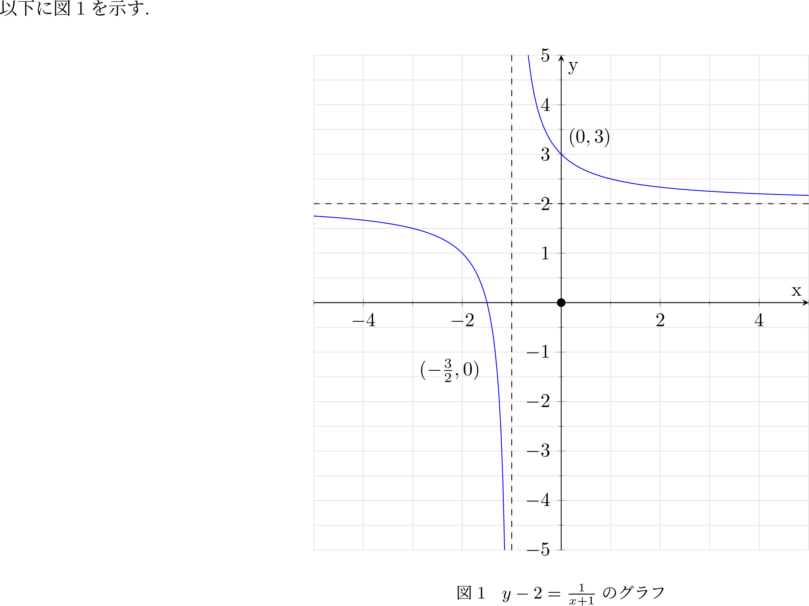
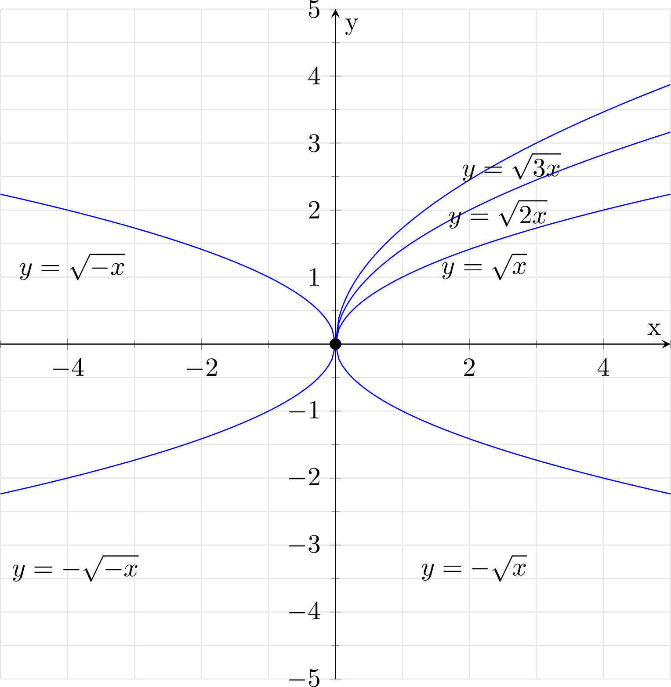
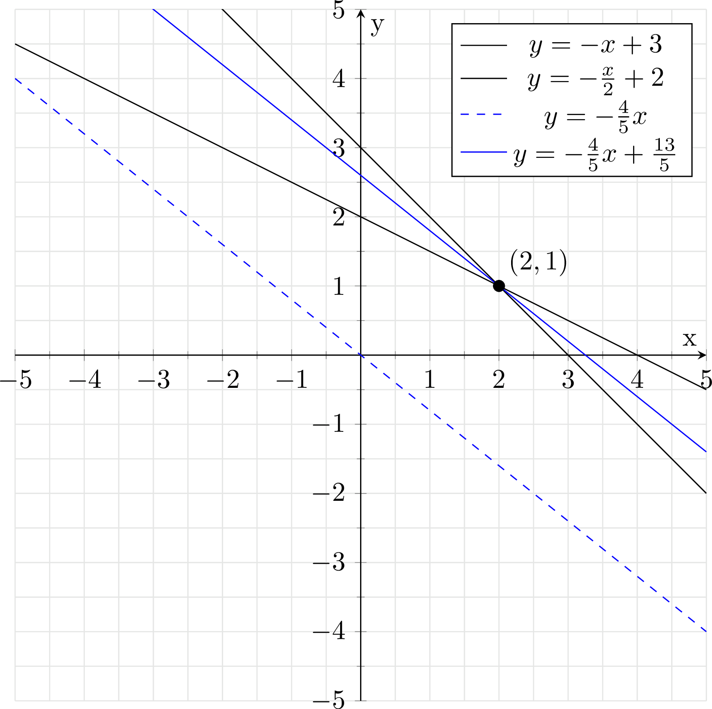

# 方程式、不等式、関数

## Q3 方程式関連の語句について知っていますか?

??? success
    ### 方程式

    ```text
    [方程式]
      ・変数に対し、特定の解釈を行った場合にのみ成り立つ等式
    
    [方程式を解く]
      ・方程式について、等式が成り立つ解釈を求めること
    
    [n次方程式]
      ・方程式を構成する各項の最大の次数がnである方程式

      例) 
        ax + b = 0
        ax = -b
        x = -b/a (a≠0)

        |ax+b| = c
        ax+b = ±c
        ax = -b±c
        x = (-b±c) / a (a≠0)
    
    [二次方程式の解の公式]
      ax^2 + bx + c = 0 (a≠0)の解は
      x = -b±√(b^2-4ac) / 2aとなる

      =0になる解を探すので、P(x) = 0を探すことになる

      例) x^2 + x + 1 = 0の解を求めよ
        x = -1±√(1^2 - 4) / 2
        = (-1±√(-3)) / 2
        = (-1±√3i) / 2
    
    [解の公式の証明(平方完成)]
    ax^2 + bx + c = 0 
    a(x^2 + (b/a)x) + c = 0
    a(x + (b/a)x + b^2/4a^2 - b^2/4a^2 ) + c = 0
    a(x+ b/2a)^2 -b^2/4a + c = 0
    a(x+ b/2a)^2 = b^2/4a - 4ac/4a
    (x+ b/2a)^2 = (b^2 - 4ac) / 4a^2
    両辺のルートをとって
    (x + b/2a) = ±√(b^2 - 4ac) / 2a
    x = -b±√(b^2 - 4ac) / 2a

    [解の公式の証明(恒等式)]
      二次方程式ax^2+bx+c=0(a≠0)におけるxの解, 
      α,βが以下のようにあらわせることを証明する
      α = -b+√(b^2-4ac) / 2a
      β = -b-√(b^2-4ac) / 2aとおく
      この時α + β = -b/a ,  αβ = b^2 - (b^2 - 4ac) / 4a^2 = c/a
      
      因数定理※より、
      P(x) = ax^2 + bx + c = a(x-α)(x-β) ...(1)が恒等式であれば
      (右辺は左辺をただ式変形した結果になるため)
      整式P(x)はx-α, x-βを因数に持ち※、P(α) = P(β) = 0であり
      P(x) = 0は、x = α, βを解に持つといえる
      従って(1)が恒等式であることを示していく

      右辺を展開すると
      a(x-α)(x-β) = a(x^2 -(α + β)x + αβ) = ax^2 -a(α + β)x + aαβ
      両辺の係数が各々等しければ恒等式といえるので, 係数比較法より
      a = a, b = -a(α + β), c = aαβ
      ここで、α + β = -b/a , αβ = c/aより、
      -a(α + β) = -b*-a/a = b, aαβ = a*c/a = c
      両辺の係数が各々等しいので、ax^2 + bx + c = a(x-α)(x-β)は恒等式
      従って、α = -b+√(b^2-4ac) / 2a,β = -b-√(b^2-4ac) / 2aの時、
      P(α) = P(β) = 0
      よって、-b±√(b^2-4ac) / 2aは 「ax^2 + bx + c = 0」の解である

      [補足]
      ※二次方程式は高々2つの解を持つため、証明前から
        ∃α,β∊複素数全体(ax^2 + bx + c = A(x-α)(x-β))であることは分かっている
      ※今回の場合α,βについては、具体的な値で固定されており
        (α,β)= -b±√(b^2-4ac) / 2a　⇒ ∀x(ax^2 + bx + c = a(x-α)(x-β))を解く格好
      ※証明によって、二次方程式の二つの解は常に(α,β)= -b±√(b^2-4ac)として示される
        とわかるので、ax^2 + bx + c = a(x-α)(x-β)は恒等式となる
    ```

    ### 一次の項の係数が偶数の時

    ```text
    ax^2 + 2b'x + c = 0(a≠0)の解は、

    x = -b'±√(b'^2 - ac) / a

    解の公式に対して、b = 2b'とするとこの公式が得られる

    x = (-b±√b^2 - 4ac) / 2a
    = -2b'±√((2b')^2 - 4ac) / 2a
    = -2b'± 2√(b'^2 - ac) / 2a
    = -b'± √(b'^2 - ac) / a

    --> 簡易になるので、一次の項が偶数の時は使うといい
    ```

    ### 二次方程式の解と係数の関係

    ```text
    ・P(x)= ax^2 + bx + c(a≠0)について、
      P(α) = 0 ∧ P(β) = 0 ⇔ α + β = -b/a ∧ αβ = c/a
      --> 解と係数の関係

    例)  5x^2 + 6x - 2 = 0の解をα、βと置いた時の
        α + β,  αβ, α^2 + β^2の値を求めよ

        α + β = -6/5
        αβ = -2/5
        α^2 + β^2 = (α+β)^2 - 2αβ
        = (-6/5)^2 -2(-2/5) = 36/25 + 20/25 = 56/25
    
    例) 連立方程式 u + v = 3, u^2 + v^2 = 7を解け

    u^2 + v^2 = (u+v)^2 - 2uv = 7
    9 - 2uv = 7より、uv = 1

    解と係数の関係より、u,vは以下の二次方程式の解となる
    u + v = -b/a = 3
    uv = c/a = 1

    b = -3a,  c = aを満たすような二次方程式を考えると
    x^2 -3x + 1 = 0
    これを解くと、 x = 3±√(9-4) /2
    より、(u,v) = ((3+√5)/2, (3-√5)/2),((3-√5)/2, (3+√5)/2)


    [証明について:1(解の公式)]
      P(x)= ax^2 + bx + c(a≠0)について、
      [i] P(α) = 0 ∧ P(β) = 0
          ⇒ α + β = -b/a ∧ αβ = c/a
    
          二次方程式の解の公式より、P(x)の解α,βはそれぞれ
          -b±√(b^2 - 4ac) /2aとおけるので
          α + β, αβとすると、-b/a, c/aが算出される。

      [ii]α + β = -b/a ∧ αβ = c/a ⇒
          P(α) = 0 ∧ P(β) = 0

          P(x) = ax^2 + bx + cに代入すると
          b = -a(α + β)
          c = a(αβ)より
          ax^2 -a(α + β)x + a(αβ)

          ここで、x = αとすると
          aα^2 - aα^2 - aαβ + aαβ = 0
          x = βとすると
          aβ^2 -aαβ -aβ^2 + aαβ = 0より、確かに、P(α) = P(β) = 0となる

          よって、
          ax^2 + bx + c = 0について、
          α,βが解なら、α + β = -b/a,  αβ = c/aが成立し、
          任意の数α,βについて、α + β = -b/a,  αβ = c/aが成立するなら
          α,βは ax^2 + bx + c = 0の解である

    [証明について:2(因数定理)]
      二次方程式ax^2 + bx + c = 0(a≠0)がx = α,βを解に持つとき、
      因数定理より、定数Aを用いて
      ax^2 + bx + c = A(x-α)(x-β)とかける
      --> 解となる以上 x = αの時、0以外にならないので、
          A(x-α)(x-β) + B等の形はとらない

      これを展開して係数を比較すると
      A(x-α)(x-β) = A(x^2 -(α + β)x + αβ)
      = Ax-^2 - A(α + β)x + αβAより
      a = A,  b= -A(α + β), Aαβ = c
      これを直すと
      α + β = -b/a,   αβ = c/aとなり、解と係数の関係が得られる
    ```

    ### 判別式D(解の公式のルート)

    ```text
    [判別式]
      ・ax^2 + bx + cに対して、b^2 - 4acのこと
        判別式はD(discriminant:判別式の頭文字)と表記される

      例) 2x^2 + 3x - 1の判別式Dは
          (3)^2 - 4*2*(-1)
          = 9 + 8 = 17

      ・判別式は、解の公式におけるルートの中身に相当する
        従って、D = b^2-4acと置くと
        ax^2 + bx + c = 0の解xは、
        x = (-b±√D) / 2aと書き直せる

      [実数係数の二次方程式の実数解の個数]
        ・2次方程式ax^2 + bx + c = 0について判別式D = b^2 - 4acとするとき
          (ただし、a,b,cは実数)
          D > 0 ⇔ 2次方程式は異なる実数解を2つもつ
          D = 0 ⇔ 2次方程式は実数解を1つ(重解)を持つ
          D < 0 ⇔ 2次方程式は互いに共役な2つの複素数解を持つ
                   複素数zが解ならば、その共役も解
                   実数解が0個なので、自然と複素数解2つになる
          ※複素数係数の場合、実数係数多項式 = 0の証明より
          　必ずしもその共役が解とはならないことがわかる
        
        例) 3x^2 + 6x + 2 = 0の実数解の個数
            D = 36 - 4(2)(3) = 12
            D > 0なので、実数解は2つ

            ※符号が分かればいいだけなので、D/4でもいい
            D/4 = 3^2 - 6 = 3
          
        例) 15x^2 + 24x + 10 = 0の実数解の個数
            D/4 = (12)^2 - 15*10 = -6
            D < 0なので、実数解は0

      [実数係数の二次関数のグラフと判別式]
        ・2次関数 y = ax^2 + bx + c(ただし、a,b,cは実数)について
          判別式をD = b^2 - 4acとするとき
          D > 0 ⇔ 2次関数はx軸と二点で交わる
          D = 0 ⇔ 2次関数はx軸と一点で交わる(接する)
          D < 0 ⇔ 2次関数はx軸と交わらない

        例) y = -x^2 + 3x - 2のグラフとx軸の共有点(x軸との交点)の個数は?
           -x^2 + 3x - 2の判別式Dは
           3^2 -4(-1)(-2) = 9 -8
    
    [判別式で実数解の個数がわかる理由]
      D = b^2 - 4acの部分が0の場合、±0となり、差は生まれない => 重解となる
      D < 0の場合、ルートの中身はマイナスになる
      たとえば、b^2 - 4ac = -5の場合、√(-5)
      これは、二乗すると-5になる数を意味する。
      虚数単位iを用いると、i^2 = -1
      よって、√(-5) = √(5*-1) = √(5*i^2) = (√5)i
      ルートの部分が虚数となるため、実数解は存在しない。
      D > 0の場合、ルートの中身は正になるため、差が生まれ実数解が2つ存在する
    
    [判別式でx軸との交点の数がわかる理由]
      ・R^2の座標平面で考えると、実数係数の二次関数f(x)が実数解αを持つ
        --> f(α) = 0。つまり、x = αの時に値が0となることを意味する。

        実数解を2つ持つ ⇔ f(x) = 0となるxの値が2つ存在する ⇔ x軸と2点で交わる
        実数解を1つもつ ⇔ f(x) = 0となるxの値が1つ存在する ⇔ x軸と1点で接する
        実数解を持たない　⇔ f(x) = 0となるxの値が「実数の座標平面上には」存在しない
        ⇔ x軸と接しない
    ```

    ### 一般化した判別式と三次方程式

    ```text
    [一般化した判別式]
      ax^2 + bx + c = 0の解をα,βとおくと
      D = a^2(α - β)^2

    [2次多項式における、一般化した判別式の証明]
      a^2(α - β)^2が、b^2 - 4acと一致することを示せばいい

      解と係数の関係より
      α + β = -b/a,  αβ = c/a
      a^2(α - β)^2
      = a^2((α+β)^2 - 4αβ)
      = a^2((-b/a)^2 -4c/a)
      = a^2((b^2 - 4ac)/a^2 )
      = b^2 - 4ac
    
    [n次方程式の判別式]
      ・n次方程式の判別式は、以下に相当する
        解の差の二乗を掛け合わせたもの * a^{2n-2}

      ・二次方程式の場合
        [i]
          解の差の二乗は(α-β)^2
          これにa^2を掛け合わせてa^2(α-β)^2

        [ii]
          解の差は、(α,β) = -b±√(b^2  - 4ac) / 2aより、
          2√(b^2  - 4ac) / 2a
          = √(b^2  - 4ac) / a
          よって、二乗は (b^2-4ac)/a^2
          これに、a^{2*2 -2}を掛け合わせると
          --> b^2 - 4acが示された


    [三次方程式の判別式]
      三次方程式ax^3 + bx^2 + cx + d =0の解をα,β,γとおく(ただしα,β,γ,a≠0)
      判別式D = a^4(α-β)^2(β-r)^2(γ-α)^2

      解の差の二乗を掛け合わせたもの
      (α-β)^2(β-r)^2(γ-α)^2
      a^{2*3 - 2} = a^4
      --> a^4(α-β)^2(β-r)^2(γ-α)^2
    
    [実数係数の三次方程式の実数解の個数と重解]
      1 判別式 D = 0 : ⇔ 重解を持つ
      2 判別式 D > 0 : ⇔ 相異なる実数解を3つもつ
      3 判別式 D < 0 : ⇔ 実数解は1つ
    
    [D = 0 ⇔ 重解を持つ]
      [1]
        判別式がD = a^4(α-β)^2(β-r)^2(γ-α)^2であることを考えると
        複素数では積が0になる場合、掛け合わせた対象のうち
        少なくとも1つは0になるためD = 0になる場合、a≠0より
        α = β ∨ β = γ ∨ γ = αと考えられる
        よって、重解を持つ

        重解を持つとき、解の差の二乗を掛け合わせたもののうち1つの差は0になるため
        判別式は0。よって、D = 0 : ⇔ 重解を持つは成り立つ
    
    [相異なる実数解3つ⇒ D > 0 , 実数解は1つ ⇒ D < 0]
      [2]
        実数係数の三次方程式の解については以下の3パターンに場合分け可能
        1 重解あり。残る1つも実数解
        2 相異なる実数解が3つ
        3 実数解が1つと互いに共役な複素数解が2つ
        (実数係数多項式=0の時、複素数zが解ならば, その共役も解より)

        [1]より、1の時、D = 0である
        2の時、a^4は正, (α-β)^2(β-r)^2(γ-α)^2も(実数-実数)^2は明らかに正
        よって、D>0
        3の時、解はα, A+Bi, A-Bi(ただしα,A,Bは実数で、B≠0)とおける
        この時、判別式を計算すると(指数法則なども活用して)
        D = a^4((α-A)-Bi)^2((α-A)+Bi)^2(2Bi)^2
        = a^4{((a-A)-Bi)((a-A)+Bi)}^2(4B^2i^2)
        = a^4{(a-A)^2 - (Bi)^2}^2(-4B^2)
        = -4a^4B^2{(a-A)^2 + B^2}^2
        a,A,Bは実数なので、a^4B^2{(a-A)^2 + B^2}^2 >=0よって、
        D = -4a^4B^2{(a-A)^2 + B^2}^2 < 0 ...(2)
    
    [D > 0 ⇒相違なる実数解3つ, D < 0⇒実数解は1つ]
      [3]
        D > 0の時、実数係数の3次方程式が互いに共役な複素数解を2つもつと仮定する
        (2)より、互いに共役な複素数解を2つもつ場合、判別式はD < 0となるので矛盾
        よって、仮定は否定される。また、重解を持つ場合D = 0となるので、これも否定
        よって、D > 0の時、実数係数の3次方程式は相異なる3つの実数解を持つ

        D < 0の時、実数係数の3次方程式が相異なる3つの実数解を持つと仮定する
        ここで、解をα + 0i, β + 0i, γ + 0iと置くと、
        判別式は (実数)^4(実数-実数)^2(実数-実数)^2(実数-実数)^2 > 0
        よって、仮定は否定される。重解を持つ可能性は否定されているので
        D < 0の時、実数係数の3次方程式は1つの実数解と互いに共役な複素数解を2つもつ

    [3次方程式と解と係数の関係]

      --> 実際に三次方程式ax^3 + bx^2 + cx + d = 0から、実数解の個数を導く際は
          具体的な係数の値から判定する必要がある
          そこで、α,βを用いてではなく、a,b,c,dを用いてDを表現したい

      三次方程式: ax^3 + bx^2 + cx + d = 0の解をα,β,γとおくと
      α + β + γ = -b/a
      αβ + βγ + γα = c/a
      αβγ = -d/a
    
    [証明]
      ax^3 + bx^2 + cx + d = 0の解をα,β,γとすると
      因数定理よりｘ
      ax^3 + bx^2 + cx + d = a(x-α)(x-β)(x-γ)と因数分解できる
      --> (x-α),(x-β),(x-γ)は確かに因数だがこの積で表現されるのは、
      　  最高次の係数が1の三次式になるので左辺の最高次の係数と合わせるためa倍しておく
      --> (x-α)(x-β)(x-γ)だけで三次式であるため、さらにxが掛け合わされることはない

      a(x-α)(x-β)(x-γ)
      = a(x^2 -(α+β)x + αβ)(x-γ)
      = a{x^3 -(α+β+γ)x^2 + γ(α+β)x + αβx - αβγ}
      = ax^3 -a(α+β+γ)x^2+ a(αβ + βγ + γα)x - aαβγ

      恒等式の係数を比較すると
      b = -a(α+β+γ)
      α+β+γ = -b/a

      c =  a(αβ + βγ + γα)
      αβ + βγ + γα = c/a

      d = - aαβγ
      αβγ = -d/a
    
    [もう予測がつく(四次方程式の解と係数の関係)]
      ax^4 + bx^3 + cx^2 + dx + e = 0の解をα,β,γ,δとおくと
      α + β + γ + δ = -b/a
      αβ + αγ + αδ + βγ + βδ + γδ = c/a
      αβγ + αβδ + αγδ + βγδ = -d/a
      αβγδ = e/a
    ```

    ### (補足)対称式について
    
    ```text
    [対称式について]
      ・n変数の多項式について考えるとき、変数x_1,...,x_nをどのように置換しても
        元の多項式と変わらない場合、このような多項式を対称式という
    
    [基本対称式について]
      ・全ての変数からd個選んで掛け合わせたものを足し合わせたものを
        基本対称式σ_dという
      ・基本対称式は対称式である
    
    [対称式の基本定理]
      ・対称式は基本対称式の多項式として表せ、その表し方は1通りである
    ```

    $$
      \begin{align}
        & \displaystyle n変数(x_1,x_2,...,x_n)の多項式について考える。この時 \\
        & \sigma_1(x_1,x_2,...,x_n) = x_1 + x_2 + \cdots + x_n \\
        & \sigma_2(x_1,x_2,...,x_n) = \sum_{1 \le i < j \le n} x_ix_j \\
        & ... \\
        & \sigma_d(x_1,x_2,...,x_n) = \sum_{1 \le i_1 < i_2 < ... < i_d \le n} x_{i_1}x_{i_2}...x_{i_d} \\
      \end{align}
    $$

    ### n次方程式の解と係数の関係

    ```text
    [定理]
    n次方程式:a_nx^n + a_{n-1}x^{n-1} + ... + a_1x^1 + a_0 = 0の解を
    x_1,x_2,...,x_nとおく。また、x_1,x_2,...,x_nのd次の基本対称式をσ_dとおく
    このとき、d = 1,...,nに対して、
    σ_d = (-1)^d・(a_{n-d})/{a_n}

    例)
      4次方程式(ax^4 + bx^3 + cx^2 + dx + e)のσ_3
      (方程式をP(x)とし、P(x)=0を満たす解をα,β,γ,δとおく)
      ※a_1 = d, a_4 = a
      σ_3 = αβγ + αβδ + βγδ + αγδ = (-1)^3・(a_1)/(a_4) = -d/a


    [証明(n次方程式の解と係数の関係)]
    与えられたn次方程式P(x)は、因数定理より、P(x)=0の解をx_1,...,x_nとすると
    a_nx^n + a_{n-1}x^{n-1} + ... + a_1x + a_0
    = a_n(x-x_1)(x-x_2)...(x-x_n) ...(1)と因数分解可能

    ここでx^{n-d}次の係数を比較すると、左辺は、a_{n-d}
    右辺については、一般にx^{n-d}の項の係数は、
    解x_1,...,x_nに対するd次の基本対称式に関連してくる

    [0次と係数]
      解をn-1個掛け合わせたものになる
    
    [1次と係数]
      xを1つ、-1*解をn-1個選んで掛け合わせたものの総和となる
    
    [k次と係数]
      xをk個、-1*解をn-k個選んで掛け合わせたものの総和となる
    
    [n-d次と係数]
      xを{n-d}個、-1*解をd個選んで掛け合わせたものの総和

    ここで、解をd個選んで掛け合わせたものの総和は、
    基本対称式の定義から、基本対称式σ_dになる
    よって、(x-x_1)(x-x_2)...(x-x_d)...(x-x_n)の各次の係数は

    n-d次の係数 = (-1)^d*(σ_d)

    特に、a_n(x-x_1)(x-x_2)...(x-x_d)...(x-x_n)の各次の係数は
    a_n(-1)^d*(σ_d)となる

    (1)は恒等式であるため係数比較法を用いると
    a_{n-d} = a_n(-1)^d・σ_dなので
    σ_d = a_{n-d} / a_n(-1)^d

    1/(-1)^d = (-1)^dなので、
    σ_d = (-1)^d{a_{n-d} / a_n}

    よって、n次方程式における基本対称式

    従って、n次方程式の解と係数について、上記のような関係性が定まる
    ```

    ### 三次方程式の係数から実数解の個数を判定する

    ```text
    n次方程式の解と係数の関係より、
    とある三次方程式、x^3  + cx + d = 0の解と係数について考えると、

    σ^d = (-1)^d・(a_{n-d}/ a_n)より
    ax^3 + bx^2 + cx + d = 0の解を、α,β,γと置いたとき基本対称式は以下のように定まる
    1次の基本対称式：α + β + γ = -b/a
    2次の基本対称式：αβ + βγ + αγ = c/a
    3次の基本対称式：αβγ = -d/a

    よって、今回の場合
    α + β + γ = 0
    αβ + βγ + αγ = c
    αβγ = -d

    ここで、ax

    また、n次の判別式は
    解をx_1,...,x_nとすると
    a^{2n-2}・Σ_{1 <= x_i < x_j <=n} (x_i - x_j)^2で表されるので
    3次の判別式は
    a^{4}(α-β)^2(β-γ)^2(γ-α)^2となる。

    よって、今回の場合a = 1なので、判別式D = (α-β)^2(β-γ)^2(γ-α)^2
    
    これをc,dを用いて表しなおすと、

    (α-β)(β-γ) = (αβ -αγ -β^2 + βγ)
    = -(β^2 - αβ - βγ + αγ)
    = -(β^2 + c -2β(α+γ))
    β = -α-γより
    = -(3β^2 + c)

    同様にして
    (β-γ)(γ-α) = -(3γ^2 + c)
    (γ-α)(α-β) = -(3α^2 + c)
    ※α^2 + β^2 + γ^2 = (α+β+γ) - 2(αβ + βγ + γα)
    ※(α^2β^2 + β^2γ^2 + γ^2α^2) = (α+β+γ) - 2(αβ + βγ + γα)
    従って、
    D = -(3β^2 + c)-(3γ^2 + c)-(3α^2 + c)
    = -(3β^2 + c)(3γ^2 + c)(3α^2 + c)
    = -{9β^2γ^2 + 3β^2c + 3γ^2c + c^2}(3α^2 + c)
    = -{9β^2γ^2 + 3c(β^2 + γ^2) + c^2}(3α^2 + c)
    = -{27(αβγ)^2 + 9c(α^2β^2 + β^2γ^2 + γ^2α^2) 
    + 3c^2(α^2 + β^2 + γ^2) + c^3}
    = -{27(αβγ)^2 + 9c{(αβ + βγ + γα)^2 - 2αβγ(α + β + γ)}
    + 3c^2(α^2 + β^2 + γ^2) + c^3}
    = -{27(-d)^2 + 9c{c^2} + 3c^2{(α+β+γ) - 2(αβ + βγ + γα)} + c^3}
    = -{27(-d)^2 + 9c{c^2} + 3c^2{-2c} + c^3}
    = -{27d^2 + 4d^3}
    = -4c^3 - 27d^2

    [使用例]
      x^3 - x + t = 0が相異なる3つの実数解を持つための条件を示せ

      判別式D = -4(-1)^3 -27t^2
      = 4 - 27t^2
      相異なる3つの実数解を持つとき、判別式D > 0となるので、
      4-27t^2 > 0
      4 > 27t^2
      相異なる3つの実数解を持つための条件は、t^2 < 4/27
    
    [ax^3 + bx^2 + cx + d = 0の場合]
      D = -4ac^3 -27a^2d^2 + b^2c^2 + 18abcd - 4b^3d
      --> 複雑になってくるので、他のやり方で判定した方がよさそう
    ```

    ### 方程式から有理数解を見つける方法

    ```text
    [定理]
      整数係数多項式 = 0の形の方程式について、有理数解q/pを持つならば
      分母pは最高次の係数の約数であり、分子qは定数項の約数である
    
    [例]
      高次の方程式を解くには、f(α) = 0となる解αを見つけ、因数分解していく必要がある
      (カルダノの奴を使わないなら、そうして次数を二次方程式まで下げていく)
      --> つまり、てっとりぱやく解αを見つける必要がある

      x^3 - x^2 - x - 2 = 0を解け
      有理数解をもつと仮定する。この時、分母pの候補は±1, 分子qの候補は±1,±2
      つまり、有理数解の候補は、(2,-2,1,-1)

      α = 2の時、8-4-2-2 = 0より成り立つ
      よって、α = 2
      x^3 - x^2 - x -2 = 1(x-2)Q(x)

      1 -1 -1 -2   |2
         2  2  2
      1  1  1  0

      = (x-2)(x^2 + x + 1)
      解の公式を用いて

      x = -1±√(1-4) /2
      = -1±√(3)i / 2

      よって、x = (2, -1±√(3)i / 2)
    
    [証明：有理数解の見つけ方]
      整数係数多項式 = 0の形の方程式について、有理数解q/pを持つ
      ⇒　分母pは最高次の約数∧分子qは定数項の約数を証明する

      方程式 a_nx^n + a_{n-1}x^{n-1} + ... + a_1x^1 + a_0 = 0
      (a_n≠0, a_i = 整数)について考える

      この方程式が有理数解q/p(pとqは互いに素)を持つとき、
      元の方程式に代入を行うと、
      ※有理数解なので、p≠0, 互いに素なので既約分数

      a_n(q/p)^n + a_{n-1}(q/p)^{n-1} + ... + a_1(q/p)^1 + a_0 = 0
      両辺にp^nをかけると
      a_n(q)^n + a_{n-1}q^{n-1}p + a_1(q)p^{n-1} + a_0p^n = 0
      この時、n次の項以外を移行すると
      a_n(q)^n = pの倍数となる
      qはpと互いに素であるため、a_nはpの倍数(補足)
      また、定数項以外を移行すると
      a_0p^n = qの倍数となる
      qはpと互いに素であるためa_0はqの倍数

      よって、前件が成り立つならば、最高次の係数は有理数解の分母であり、
      定数項は、有理数解の分子であることが示された。

    [補足:二つの整数a,bが互いに素]
      1以外に正の公約数を持たないa,b
      ※公約数：2つ以上の整数に共通な約数

      意味:a,bが互いに素で、akがbの倍数ならば、kはbの倍数(a,b,k∊Z; Zは整数)
    
    [補足の証明]
      gcd(a,b) = 1 ∧ ak = b*m(mは整数) ⇒ k = b*n(nは整数)であることを証明する
      a,bが互いに素 ⇔ ax + by = 1を満たす整数x,yが存在する(a,bは0でない整数)
      という定理を使うと
      --> ベズーの等式におけるd = 1の場合

      x * a = bm

      k = 1*k
      k = k(ax * by)
      = akx + bky
      = bmx + bky
      = b(mx + ky)

      ※kはbとax+by=1を満たすような変数x,yを用いた式mx + kyの積で表される

      よって、bはkの因数となるため、
      a,bが互いに素で、akがbの倍数ならば、kはbの倍数

      ※有理数解の見つけ方における証明において、互いに素の性質を使うと
        gcd(p,q) = 1　∧　a_n(q)^n = pの倍数

      [a,bに0が含まれる場合]
        gcd(a,0)について考えるとき、0を割り切る約数は無限に存在するので
        最大公約数は|a|になる。したがってgcd(a,0) = 1となるaは(1,-1)
        この時、gcd(a,b=0)∧ak = bmとすると、kは0の倍数
        よって、例外は存在しない
    
    [さらに補足]
      ・整数係数方程式 = 0について、最高次の係数が1で、有理数解αを持つとき、
        有理数解α = q/p = q/1となるため、αは整数となる
    ```

    ### 補足2(ベズーの等式)

    ```text
    [証明1：ax + by = 1を満たす整数解が存在する ⇔ a,bは互いに素]
      ※ただし、a,bは0でない整数。またdを最大公約数とする
      
      [i] ax + by  = 1を満たす整数解が存在する ⇒ a,bは互いに素

      対偶：a,bが互いに素でないとき、ax + by = 1を満たす整数解は存在しない
      
      a,bが互いに素でないならば、d≧2
      ここでa = dm, b = dn (m,nは整数と置くと)
      ax + by = dmx + dny = d(mx + ny)
      よって、ax + byは最大公約数の倍数となり
      x,yを整数解としたとき、mx + nyは小数にはなりえないので
      d≧2である以上、ax + by = 1を満たす整数解は存在しない。
      対偶が満たされるため、ax + by = 1 ⇒ a,bは互いに素もまた真

      [ii] a,bは互いに素 ⇒ ax + by = 1を満たす整数解が存在する

        a,bが互いに素であるとき、1 <= i　< j < b(ただしi,jは整数)について
        iaとjaをbで割った余りが同じであると仮定する
        ※ ia ≡ ja (mod b) (ただし j > i) ⇒ (j - i)aはbの倍数
        
        ここで前件は、ja - ia = kb(kは整数)と書き直せる※補足
        左辺を整理して、(j-i)a = kb
        よって、(j-i)aはbの整数倍といえるはずだが、ここで、a,bは互いに素であり、
        1 <= i　< j < bであるため、(j-i)もbの整数倍にはなりえずこれは矛盾する。
        よって、仮定は誤りであり、
        a,bが互いに素であるとき、1 <= i　< j < b(ただしi,jは整数)について
        iaとjaをbで割った余りはすべて異なる。
        つまり余りが1となるようなケースも存在する

        このケースについてmaとおき、bで割った商をnとおくと、
        ma = bn + 1
        am - bn = 1
        となり、ax + by = 1を満たす整数解(m, -n)が存在していることがわかる
        よって、a,bは互いに素 ⇒ ax + by = 1を満たす整数解が存在する

      [i],[ii]より、ax + by = 1を満たす整数解が存在する ⇔ a,bは互いに素

      [補足]
        aをmで割った余り = bをmで割った余り ⇒ a-bがmの倍数について
        aとbをmで割ったときの商をそれぞれq1,q2, 余りをr1,r2とする。
        つまり、a,bは以下で表される
        a = mq1 + r1
        b = mq2 + r2
        この時、(a-b) = m(q1 - q2) +(r1- r2)
        ここで、余りが等しいということはr1 = r2なので
        a-b = m(q1 - q2)
        よって、a-bはmの倍数
    
    [証明2: ax + by = cが整数解を持つ　⇔ cはgcd(a,b)の倍数]
      ただし、a,b ≠ 0
      倍数 = ある整数の整数倍となっている数

    [i] ax + by = cが整数解を持つ ⇒ cはgcd(a,b)の倍数
      a,bはそれぞれgcd(a,b)の倍数であるため
      任意の整数解をm,nとおくと、am + bnもgcd(a,b)の倍数となる
      従って、ax + by = cが整数解を持つ ⇒ cはgcd(a,b)の倍数
    
    [ii] cはgcd(a,b)の倍数 ⇒ ax + by = cは整数解を持つ
      最大公約数について考えると、a = p*gcd(a,b), b=q*gcd(a,b)とおける。
      ※この時、p,qは互いに素になる

      ここで[証明1]より、p,qが互いに素ならば、px + qy = 1は整数解を持つため、
      ∃m,n ∊ 整数 (p,qが互いに素 ⇒ pm + qn = 1)は真
      後件について両辺をgcd(a,b)倍すると
      gcd(a,b)(pm + qn) = gcd(a,b)
      a,bで置き換えて
      am + bn = gcd(a,b)
      よって、a = p*gcd(a,b), b=q*gcd(a,b)とおき
      c = gcd(a,b)の時、ax + by = cは整数解を持つ

      また、両辺に任意の整数kをかけると
      k*(am + bn) = k*gcd(a,b)
      a(km) + b(kn) = k*gcd(a,b)
      ここで、km, knは整数であり、k*gcd(a,b)はgcd(a,b)の倍数であるため
      cをgcd(a,b)の倍数としたとき、
      ax + by = cは整数解をもっている

      よって、cはgcd(a,b)の倍数 ⇒ ax + by = cは整数解を持つ

    よって、[i],[ii]より、ax + by = cが整数解を持つ　⇔ cはgcd(a,b)の倍数
    ```

    ### 三次方程式の解き方

    ```text
    [1. 因数分解]
      x^3 - 8 = 0
      (x-2)(x^2 + 2x + 4) = 0

      x = 2, -1±√3i

      x^3 - 6x^2 + 12x - 8 = 0
      (x-2)^3 = x^3 -6x^2 +12x -8 = 0より
      x = 2
    
    [2. 因数定理]
      x^3 - 2x^2 -x + 2 = 0
      有理数解±2, ±1のうち、いずれかを持つと仮定して代入する

      x = 2の時、8-8-2+2=0より、P(2) = 0
      よって、x^3 - 2x^2 -x + 2 = (x-2)Q(x)
      組立除法より
      1 -2 -1 2 |2
         2  0-2
      1  0 -1 0
      (x-2)(x^2-1) = 0
      (x-2)(x+1)(x-1) = 0
      x = 2, ±1

      4x^3 -2x^2 -6x + 3 = 0
      有理数解 ±3/4, ±3/2 ±3, ±1/4, ±1/2, ±1のうちいずれかを持つと仮定して代入する
      x = 1の時、4 - 2 - 6 + 3
      x = 1/2の時、1/2 - 1/2 -3 + 3 = 0より
      4x^3 -2x^2 -6x + 3  = (x-1/2)Q(x) = 0
      よって、(2x-1)Q(x) = 0
              2    3
          -----------
      2-1) 4 -2 -6 3

      (2x-1)(2x^2 - 3) = 0
      従って、x = 1/2, ±√6/2
    ```

    ### 一次不等式

    ```text
    1 移行可能(両辺に対し、加減算しても符号の向きは変わらない)
    2 両辺に対し、正の数を乗除算しても符号の向きは変わらない
    3 負の数を乗除算すると、符号の向きが変わる

    例)
      2x + 1/3 > 5x + 5/3
      -3x > 4/3
      -9x > 4
      x < -4/9

      |2x + 3| ≦ 1
      -1 ≦ 2x + 3 ≦ 1
      -4 ≦ 2x ≦ -2
      -2 ≦ x ≦ -1
    ```

    ### 二次不等式

    ```text
    1 視覚的に判断する方法 --> グラフを書く
    2 普通に計算して解く --> 因数分解
    3 平方完成で解く

    [例1]
      x^2 -4x + 3 > 0
      (x-3)(x-1) > 0
      因数(x-3)と、(x-1)の符号によって最終的な符号が決まる

      (x-3) > 0 & (x-1) > 0
        -->  x > 3 & x > 1
        -->  x > 3
      (x-3) < 0 & (x-1) < 0
        --> x < 3 & x < 1
        --> x < 1
        よって、 x < 1 or  x > 3
      
    [例2]
      x^2 - 6x + 7 ≦ 0
      x = 3±√9-7 = 3±√2
      {x - (3-√2)}{x - (3+√2)} ≦ 0
      α = 3-√2, β = 3+√2とおく

      x < αの時、マイナス*マイナスで左辺はプラス
      α < x < βの時、マイナス*プラスで左辺はマイナス
      x > βの時、プラス*プラスで左辺はプラス
      x = α,　βの時、左辺は0
      よって、α ≦ x ≦ βの時、≦0になる
      3-√2 ≦ x ≦ 3+√2
    
    [例3]
      二次方程式の解が存在しない場合について考える

      x^2 + 2x + 4 ≧ 0
      左辺を式変形すると(x+1)^2 + 3となり、
      左辺は、任意の実数xについて≧3となる

      A. 任意の実数xに対して不等式は成立する

      2x^2 - 8x + 9 ≦ 0
      2(x^2 - 4x) + 9 ≦ 0
      2(x^2 -4x + 4 - 4) + 9 ≦ 0
      2(x-2)^2 + 1 ≦ 0

      左辺は、任意の実数xに対して≧1となる。よって、解なし 
    ```

    ### 等号成立条件(不等式)

    ```text
    [不要な場合]
      x > 0の範囲で x + 1/x ≧ 2　が成立することを証明せよ

      x > 0の時、x + 1/x ≧ 2の両辺は正であるため、以下の論理式が成り立つ
      ∀x ∊ 正の実数. ((x+ 1/x)^2 ≧ (2)^2 ⇔ (x+1/x) ≧ 2) ...(1)
      
      (x + 1/x)^2 ≧ 4
      x^2 + 2 + 1/x^2 ≧ 4
      x^2 - 2 + 1/x^2 ≧ 0
      (x - 1/x)^2 ≧ 0
      左辺は、常に≧0であるため、これは成り立つ
      よって、(1)より、(x+1/x) ≧ 2は成立する


      [補足: 大小関係]
        [1] a > b ⇔ a^2 > b^2 (a,b ≧ 0)
        [2] a ≧ b ⇔ a^2 ≧ b^2 (a,b ≧0)
      
      [1]
        [i]  a > b　⇒ a^2 > b^2 (ただし、a,b ≧ 0)

          a, b > 0とする。この時、
          両辺に対し、正である不等式を書けても不等号の向きは変わらないため
          a >　bに対し、
          aをかけるとa^2 > ab
          bをかけると、ab > b^2
          よって、 a^2 > ab > b^2より、a^2 > b^2

          また、いずれかが0の場合、不等式a > bが成立するのは
          a > 0, b = 0の場合のみ
          この時、二乗すると、 a^2 > 0, b = 0となるため、同様に不等式は成立する

        [ii] a^2 > b^2 ⇒ a > b (ただし、a,b ≧ 0)
          不等式に対して、減算を行っても、不等号の向きは変わらないため
          a^2 > b^2 ⇒ (a^2 - b^2) > (b^2 - b^2)
          (a^2 - b^2) > 0
          (a+b)(a-b) > 0
          a + b > 0 ∧ a - b > 0　または　a + b < 0 ∧ a - b < 0
          の時、不等式は成り立つ。
          ここで、制約よりa,b≧0であるため、a + b < 0にはなりえない。
          よって、不等式が成り立つのは、
          a + b > 0 ∧ a - b > 0のケース。
          よって、 a > -b ∧ a > b
          つまり、 a > bとなる
        
      [2]
        [1]より、a > b ⇔ a^2 > b^2 (a,b ≧ 0)が成り立つ
        また、a,b ≧ 0の時、以下も成り立つので、
        a = b ⇒ a^2 = b^2
          ※両辺にaをかけて a^2 = ba,  a = bなので、代入して a^2 = b^2
        a^2 = b^2 ⇒ a = b
          ※ (a+b)(a-b) = 0
            -->  a + b = 0 ∨  a - b = 0
            a,b ≧ 0より、a + b = 0となるのは、a = 0, b = 0の時だけに限られる
            この時、 a = b
            a = 0, b = 0でないとき、 a - b = 0、つまり、a = b
        
        a > b ∨ a = b ⇔ a^2 > b^2 ∨ a^2 = b^2
        よって、a ≧ b ⇔ a^2 ≧ b^2 (a,b ≧0)

    [必要な場合]
      x > 0の範囲で、 x + 1/xの最小値を求めよ
      
      不要な場合の例でみたように
      x + 1/x ≧ 2が成立する。
      x = 1の時に、等号が成立するため、x + 1/x の最小値は2

      ※2 ≧ 1なども不等式としては誤っていないため
       最大、最小値を示すには、等号が成立する場合があることを示す必要がある

    ```

    ### 分数不等式

    ```text
    ・分母を払う
    ・通分する
    ・グラフを書く

    例)  2 - (x-4)/(x-2) ≧ 6/(x-1)
      --> (x-2)(x-1)を両辺にかけると因数の符号によって
      　　不等号の向きが変わるため、場合分けが増えて面倒

      移項
        2 - (x-4)/(x-2) - 6/(x-1) ≧ 0
      通分
        {2(x-1)(x-2) - (x-4)(x-1) - 6(x-2)} / (x-1)(x-2) ≧ 0
        (2x^2-6x+4 - x^2 + 5x - 4 -6x + 12) / (x-1)(x-2) ≧ 0
        x^2-7x+12/ (x-1)(x-2) ≧ 0
        (x-3)(x-4) / (x-1)(x-2) ≧ 0
        
        x < 1の時、マイナス*マイナス / マイナス*マイナス ≧ 0
        2 < x < 3の時、マイナス*マイナス / プラス*プラス ≧ 0
        x > 4の時、plus*plus / plus*plus ≧ 0
        x = 1, 2の時、分母0より、分数式は定義されない
        x = 3, 4の時、左辺は0なので、等号成立
        よって、 x < 1,  2 < x ≦ 3, 4 ≦ x

      [グラフの場合]
        f(x) = 2 - (x-4)/(x-2)
        g(x) = 6/(x-1)
        二つのグラフを書き、f(x)≧g(x)の上側部分について考える
        ただし、x座標の交点について結局考えなければいけないので、通分する羽目になる
    ```

    ### 絶対不等式

    ```text
    ・議論領域に対して、常に成立する不等式のこと

    ・三角不等式や、コーシーシュワルツの不等式がこれに当たる
      --> 複素数の項で触れている
    ・相加平均と相乗平均の大小関係などもそう
    ```

    ### 相加相乗平均の不等式

    ```text
    [定理: 2変数の相加平均・相乗平均]
      a,b ∊ 0以上の実数について、(a+b) / 2 ≧ √(ab)

      a = bの時、等号が成立する
        a = b ⇒ (a+b)/2 = √ab
        後件のbにaを代入すると,aは0以上の実数なので
        a = √(a^2) = a

        (a+b)/2 = √ab ⇒ a = b
        (a+b) = 2√ab
        a - 2√ab + b = 0
        a, b ≧ 0なので、
        |a| - 2√ab + |b| = 0
        (√a - √b)^2 = 0
        √a = √b 
        つまり、a = b
    
    [例]
      4 と 16 の相加平均は 10
      4 と 16 の相乗平均は 8

    [証明:2変数]
      a,b ≧ 0の時、
      (√a - √b)^2 ≧ 0は、左辺が平方の形であるため、明らかに成立する
      左辺を展開すると以下の通りになるが
      |a| - 2√a√b + |b| ≧ 0
      a,b ≧ 0なので、(※|0| = 0)
      a + b - 2√(ab) ≧ 0
      移項すると
      a + b ≧ 2√(ab)
      (a+b)/2 ≧ √(ab)となるため、
      ∀a,b ∊ 非負の実数((√a - √b)^2 ≧ 0　⇒　(a+b)/2 ≧ √(ab))は真
      前件が成り立つため、 (a+b)/2 ≧ √(ab)は成立する
    
    [使用例1]
      x > 0のとき、 x + 9/x ≧ 6を証明せよ

      相加相乗平均の不等式：a,b ≧ 0の時、(a+b)/2 ≧ √(ab)を用いると
      (a + b) ≧ 2√(ab) (ただし、a,b≧0)
      ここで、a = x, b = 9/xとおくと、x, 9/x ≧　0なので、
      (x + 9/x) ≧ 2√x*9/x
      式変形すると、(x + 9/x) ≧ 6
    ```

    $$
      \begin{align}
        & 相加相乗平均の不等式(n変数)\\
        & a_1,a_2,...,a_n \ge 0の時 \\
        & \displaystyle 
          \frac{1}{n} \sum_{i=1}^{n} a_i \ge \sqrt[n]{\prod_{i=1}^{n} a_i} \\
        & 等号成立条件は a_1 = a_2 = ... = a_n
        & \\
        & \\
        & [証明] \\
        & [0] n = 1のとき、a_1 \ge a_1は成り立つ \\
        & [1]2変数時の証明より、n = 2の時、\frac{a_1 + a_2}{2} \ge \sqrt{a_1a_2} \\
        & [2] n = k(k \in \mathbb{N})の時、\frac{a_1 + a_2 + ... + a_k}{k} \ge \sqrt[n]{a_1a_2...a_k}が成り立つと仮定する。\\
        & また等号成立条件についても、a_1 = a_2 = ... = a_kであると仮定する \\
        & n = 2kの時、\\
        & \frac{a_1 + a_2 + ... + a_{2k}}{2k} \\
        & = \frac{1}{2}(\frac{a_1 + a_2 + ... + a_k}{k} + \frac{a_{k + 1} + a_{k+2} + ... + a_{2k}}{k}) \\
        & \ge \frac{1}{2}(\sqrt[k]{a_1a_2...a_k} + \sqrt[k]{a_{k+1}a_{k+2}...a_{2k}}) \\
        & = \frac{\sqrt[k]{a_1a_2...a_k} + \sqrt[k]{a_{k+1}a_{k+2}...a_{2k}}}{2} \\
        & 2変数の相加相乗平均の関係性を使うと \\
        & \ge \sqrt{\sqrt[k]{a_1a_2...a_k}*\sqrt[k]{a_{k+1}a_{k+2}...a_{k_2k}}} \\
        & = \sqrt[2k]{a_1a_2...a_{2k}} \\
        & よって、n = kが成り立つとき、n = 2kが成り立つ。 \\
        & [1],[2]より、n = 2k(k \in \mathbb{N})について \\
        & n変数の相加相乗平均の不等式は成り立つ \\
        & また等号成立条件について考えると、一回目の\geにおける条件は \\
        & a_1 = a_2 = ... = a_k ∧ a_{k_1} = ... = a_{2k}の時 \\
        & 二回目の条件は、\\
        & (a_1 = a_2 = ... = a_k) = (a_{k_1} = ... = a_{2k})の時 \\
        & よって、a_1 = a_2 = ... = a_k = a_{k+1} = ... = a_{2k}の時となる \\
        & \\
        & [3] n = k + 1(k \ge 1)のとき、 \\
        & \frac{a_1 + a_2 + ... + a_{k+1}}{k + 1} \ge \sqrt[k+1]{a_1a_2...a_{k+1}}が成り立つと仮定する \\
        & また等号成立条件についても、a_1 = a_2 = ... = a_k = a_{k+1}の時と仮定する \\
        & この時、a_iには任意の非負数が入るので、a_1,..,a_kを任意の非負数 \\
        & a_{k+1} = \frac{a_1 + a_2 + ... + a_k}{k}と置いても上記の不等式は成り立つ \\
        & a_1 + a_2 + ... + a_{k+1} = a_1 + a_2 + ... + a_k + \frac{a_1 + a_2 + ... + a_k}{k} \\
        & = \frac{k+1}{k}(a_1 + a_2 ... + a_k) \\
        & 両辺を\frac{1}{k+1}倍すると \\
        & \frac{a_1 + a_2 + ... + a_{k+1}}{k+1} = \frac{a_1 + a_2 + ... + a_k}{k} \\
        & よって仮定より以下の不等式が成立する(※等号成立条件に関連) \\
        & \frac{a_1 + a_2 + ... + a_k}{k} \ge \sqrt[k+1]{a_1a_2...a_k\frac{a_1 + a_2 + ... + a_k}{k}} \\
        & また両辺が非負であるため, 両辺をk+1乗しても不等号の向きは変わらない。よって \\
        & (\frac{a_1 + a_2 + ... + a_k}{k})^{k+1} \ge a_1a_2...a_k\frac{a_1 + a_2 + ... + a_k}{k} \\
        &　ゆえに、(\frac{a_1 + a_2 + ... + a_k}{k})^{k} \ge a_1a_2...a_k \\
        & 両辺のk乗根をとって \\
        & \frac{a_1 + a_2 + ... + a_k}{k} \ge \sqrt[k]{a_1a_2...a_k} \\
        & [2]より、仮定は真であるため n = k(k \ge 1)のとき、n変数の相加相乗平均の不等式は成り立つ \\
        & ※の部分より、a_1 = a_2 = ... = a_k = \frac{a_1 + a_2 + ... = a_k}{k} = a_{k+1}の時、等号成立 \\
        & 最後の辺は、単なる平均であるため他の辺が等しければ当然等しくなる。よって \\
        & 等号成立条件は、a_1 = a_2 = ... = a_k \\
        & \\
        & [a_{k+1} = \frac{a_1 + ... + a_k}{k}と置いた部分について] \\
        & 1: k+1変数時に任意の非負数a_1, a_2, ..., a_{k+1}について成り立つ(仮定) \\
        & 2: a_{k+1}が前項までの平均である時に上記の仮定が成り立つなら、\\
        & \quad k変数の時、任意の非負数a_1, a_2, ..., a_{k}について成り立つという論理式は真になる \\
        & 3: 1を仮定すると、2の前件は真 \\
        & 4: よって、2の後件は真 \\
      \end{align}
    $$

    ```text
    [使用例2: 関数の最小値]
      f(x) = x + 1/(x^2)の x > 0の範囲での最小値とそのときのx

      --> 掛け算時に変数が消えて定数になるような組み合わせに持っていく

      x + 1/(x^2) = x/2 + x/2 + 1/x^2
      a = x/2,  b = x/2, c = 1/x^2とすると
      x > 0なので、a,b,c > 0より、相加相乗平均の不等式(3変数が使える)

      (a + b + c) / 3 ≧ (abc)^{1/3}
      (x + 1/x^2) / 3 ≧ (x/2 * x/2 * 1/x^2)^{1/3}
      (x + 1/x^2) / 3 ≧ (1/4)^{1/3}
      (x + 1/x^2) ≧ 3*(1/4)^{1/3}

      この時、等号成立条件は a = b = cの時であるため
      x / 2 = 1/x^2
      x^3/2 = 1
      x^3 = 2
      x > 0より、3乗根をとって
      x = 2^{1/3}

      つまり、x = 2^{1/3}の時、最小値3*(1/4)^{1/3}
    
    [使用例の一般形]
      f(x) = ax^m + bx^-n (x > 0)
        m,nが正の有理数で、a,b > 0という関数の最小値は
        相加相乗平均の不等式を使って求められる
      
      整数で考える
        --> n個の (a/n)x^mと、m個の(b/m)x^{-n}に分解可能
        --> 相加相乗平均の不等式(n + m)変数を適用する
        --> x^nmとx^{-nm}で打ち消しあって、定数項になる
      
      [使用例3]
        f(x) = -x^2 - 1/√xの最大値とそのときのx (ただし関数は実数)

        1/√xという項が含まれているため、x > 0で定義される
        この時、x^2 + 1/√xについて相加相乗平均の不等式で考えると
        1つ目の項の次数が2, 2つ目の項の次数が-0.5より、
        それぞれ1,4個に分解すると打ち消しあって定数になる。よって

        x^2 + (1/4√x) + (1/4√x) + (1/4√x) + (1/4√x)
        ≧ 5 (x^2 * 1/4√x * 1/4√x * 1/4√x * 1/4√x)^{1/5}
        =　5(1/4^4)^{1/5}
        = 5(4/4^5)^{1/5}
        = 5/4(4)^{1/5}

        この時等号成立条件は、
        x^2 = (1/4√x)
        x^{5/2} = 1/4
        両辺を 2/5乗して
        (x^{5/2})^{2/5} = (1/4)^{2/5}
        x = 1^{2/5} / 4^{2/5}
        = 1/4^{2/5}
        よって、x^2 + 1/√xはx = 4^{-2/5}の時に最小値5/4(4)^{1/5}をとる

        ここで今回の場合、-(x^2 + 1/√x)の時の最大値を求めることが本懐であったため
        値の符号を変えて
        -(x^2 + 1/√x)は、x= 4^{-2/5}の時、最大値-5/4(4)^{1/5}をとるとわかる

        ※ f(x)の値域が[a,b]の時、-f(x)の値域は[-b, -a]
           --> f(x)の最小値は、-f(x)の最大値
               f(x)の最大値は、-f(x)の最小値
               f(x) = 4の時、-f(x) = -4。当然といえば当然だけど
        
        --> つまり、a,b　< 0である場合は、マイナスを前に出すことで
            最大値について相加相乗平均の不等式で求められる

    [注意点1]
      項が2つでない場合は、微分した方がいい
    ```

## Q5 関数関連の語句について知っていますか?

??? success 
    ### 関数と方程式

    ```text
    方程式
      ・特定の解釈を行った場合のみ、成り立つ等式
    
    関数
      ・集合Aの各元に対して、集合Bの元をただ一つ指定するような対応規則のこと
      ・つまるところ、定義域から入力となる元を選ぶと、
        終域から出力となる元が選ばれて返される
    
      ・Aの各元 x∊Aに対して、それに対応するBの要素がy∊Bであるとき、
        これをf(x) = yと書いたり、f: x|---> yと書いたりする
    ```

    ### 一次分数関数

    ```text
    y = (ax + b) / (cx + d)という形の関数
    --> y - A = C / (x - B)という形に変形でき、これが基本形となる
    --> 分子を分母で割って基本形にする

    例)
      y = (2x + 3) / (x+1)のグラフをかけ

      y = (2x + 3) / (x+1)
      = {2(x+1) + 1} / (x+1)
      = 2 + 1/(x+1)
      基本形は y - 2 = 1/(x+1)

      ※ y - A = C/(x-B)のグラフは
         y = C/xのグラフを、x軸方向にB, y軸方向にAだけ平行移動させたものになるため
         (B,A)を原点とみて、y = C/xを描くことで問題ない

         よって、y = 1/xのグラフを(-1, 2)を中心として書けばいい
        
         y = C/xは反比例のグラフとなるため、
         0 - 2 = 1(x+1)
         -2(x+1) = 1
         -2x = 3
         x = -3/2
         より、x軸との交点(-3/2, 0), y軸との交点(0,3)を通ることと
         漸近線がx = -1, y = 2であることを考えれば問題はなさそうだ
    
    ※latexで漸近線の画像を書く際はdomainに注意する必要がありそう
    ```

    

    ### 一次分数関数の漸近線

    ```text
    [漸近線]
      十分遠くで曲線との距離が0に近づき、かつ曲線と接しない直線

      例) f(x) = 1/xの漸近線は x = 0, y = 0で
        x --> 0±　の時、y軸に近づく
        x --> ±∞  の時、x軸に近づく
        --> 多分、極限の単元で出てくるだろう
    
    [一次分数関数と漸近線]
      一次分数関数 y-A = C/(x-B)の漸近線は、x = B および y = Aである
    ```

    ### グラフと平行移動

    ```text
    y = f(x)のグラフをx軸方向にp, y軸方向にq平行移動させたグラフを表す式は
    y - q = f(x-p)となる
    
    ※つまり、 x を x - pに変え、yをy-qに変えることで、
      f(x)のグラフをx軸方向にp, y軸方向にq平行移動させたことが示される
      --> 双方向の証明を以下に記す
    
    例)
      y = 2xのグラフをx軸方向に3平行移動した関数

      y = 2(x-3)
      = 2x - 6

      y = x^2 - 1のグラフをx軸方向に-2, y軸方向に1平行移動した関数
      y - 1 = (x+2)^2 - 1
      y = x^2 + 4x + 4

    [証明]
      xy座標平面上の関数fのグラフは、{(x,f(x)) | x∊R}と表せる
      つまり、(x,y)∊{(x,f(x)) | x∊R}、言い換えると y = f(x)ならば、
      (x,y)は関数fのグラフ上の元(点)であり
      (x,y)が関数fのグラフ上の点ならば、 y = f(x)が成り立つ 

      よって、y = f(x) ⇔ (x,y)が関数fのグラフ上の点 ...(1)

      ここで、
      ・とある関数 y = f(x)のグラフC
      ・C上の点(x,y)をx-軸方向にp, y軸方向にq平行移動した点を
        元に持つ集合(グラフ)Dについて考える

      この時、グラフD上のとある元が(x,y)であるとすると
      (x-p, y-q)はグラフC上の元となる

      また、グラフC上のとある元が(x-p, y-q)であるとき、
      (x,y)はグラフD上の元となる

      よって、
      (x,y) ∊ D　⇔ (x-p, y-q) ∊ C

      ここで、(1)より、 
      点(x-p, y-q)が関数fのグラフC上にあることと、
      y-q = f(x-p)であることは同値。したがって

      (x,y) ∊ D　⇔ (x-p, y-q) ∊ C ⇔ y - q = f(x-p)

      よって、以下の論理式が成り立つ
      (x,y)が y = f(x)のグラフから(p,q)だけ平行移動した後のグラフ上の点 
        ⇒ y-q = f(x-p)
      y - q = f(x-p) ⇒ 
        (x,y)はy = f(x)のグラフから(p,q)だけ平行移動した後のグラフ上の点 
      
      ※座標平面上のグラフは、直積集合R×Rの部分集合
      {(x, f(x))| x ∊ R}となる (ただしRは実数集合)
        --> (定義域の元と, 写像によって対応関係にある値域の元)
    
    [平行移動の例]
      傾きがpで(a,b)を通る直線の方程式
      --> 原点(0,0)を通り傾きpの直線を平行移動させたもの
      --> y = pxを平行移動させたもの
      --> y - b = p(x-a)

      y = ax^2を平行移動させたグラフで、頂点が(p,q)となるもの
      --> 頂点(0,0)であるy = ax^2のグラフを(p,q)だけ平行移動してある
      --> y - q = a(x-p)^2
      
      中心(a,b), 半径rの円の方程式は
      --> 中心(0,0), 半径rの円の方程式を(a,b)だけ平行移動したもの
      --> x^2 + y^2 = r^2の座標を平行移動
      --> (x-a)^2 + (y-b)^2 = r^2 
    ```

    ### 二次関数の軸と頂点の求め方

    ```text
    [軸と頂点について]
    ・二次関数y = ax^2 + bx + cは、平方完成すると
      y = a(x^2 + b/ax) + c
        = a(x + b/2a)^2 - b^2/4a + cとなる。

      ここで、a(x-p)^2 + qは、y = ax^2を(p,q)だけ平行移動したものであるので
      y = ax^2 + bx + cは、y = ax^2を、(-b/2a, {-b^2 + 4ac}/4a)だけ
      平行移動した関数であるといえる

      また、f(x) = ax^2はy軸対称の関数なので、x方向に-b/2a平行移動している以上
      y = ax^2 + bx + cは、 x = -b/2aに関して対称な関数となる
      この時、この直線を二次関数の軸という

      ※f(x) = ax^2とすると、f(x) = f(-x)であり偶関数であることからこれはy軸対称
        --> y軸対称のグラフを(p,q)平行移動させれば、x = pに対して対称になるのは自然

      また、x = -b/2aの時、y = (-b^2 + 4ac)/4aとなることから
      グラフと軸との交点は(-b/2a, (-b^2 + 4ac)/4a)となる
    
    [平方完成]
      ・平方完成すれば、どれだけax^2からずれているかわかるが、
        x = -b/2aと覚えてしまえば楽になる

        また、その時の頂点のy座標は、判別式をDとすると
        -D / 4aとなっている

        よって、ax^2 + bx + cの頂点座標は(-b/2a, -D/4a)ともいえる
    
    [微分について]
      二次関数について、頂点は接線の傾きが0となる点なので、
      x座標は、 y' = 0の解となる
      よって、 y' = 2ax + b = 0より
      x = -b/2a
    ```

    ### 二次関数の最大最小

    ```text
    ・平方完成する
    ・微分する

    [例1]
      y = x^2 - 4x + 5の 1≦x≦4における最大最小
      y = (x-2)^2 + 1

      よって、軸は x = 2, 頂点は(2,1)
      また二次の係数は正なので、下に凸。よって
      最小値は、1(x = 2の時)
      二次関数は軸対称なので、最大値は、軸からより離れた点になる。よって
      区間の端同士を比較すると
      最大値は、5(x = 4の時)

    [例1:微分の場合]
      y = x^2 - 4x + 5を微分すると
      頂点は、接線の傾きが0になる点になるので
      y' = 2x - 4より、
      2x - 4 = 0の解が、頂点のx座標となる。
      よって、軸は x = 2
      区間の端同士を考えると、例1と同様になる
    
    [定義域が開区間]
      y = -3x^2 - 4x + 1の -2< x ≦ 0における最大最小

      y = -3(x^2 + 4/3x) + 1
      = -3(x + 4/3 + 4/9 - 4/9) + 1
      = -3(x + 2/3)^2 + 7/3

      軸 x = -2/3, 頂点(-2/3, 7/3)
      二次の係数が負なので、上に凸。よって
      最大値は 7/3(x = -2/3の時)

      ここで区間の端同士を比較すると、遠い方は開区間であるため
      最小値は存在しない

    [最大値・最小値の定義]
      ※実数空間R上には、大小関係≦と呼ばれる二項関係が定義される
      
      実数空間Rの空でない部分集合Aが与えられたとき、
      集合Aに属するある実数aについて、aが集合Aに属する任意の元以上ならば
      元aを、集合Aの最大値といい、max(A) = aと表記する

      ∃a ∊ A, ∀x ∊ A: x ≦ a

      同様に、集合Aに属するある実数aについて、aが集合Aに属する任意の元以下ならば
      元aを、集合Aの最小値といい、 min(A) = aと表記する

      ∃a ∊ A, ∀x ∊ A: a ≦ x
    
    [開区間と最大最小]
      a < bを満たす実数a,b ∊ Rを任意に選んだ時、以下の集合について考える
      A = {x　∊　R | a < x < b }
      ここで、max Aが存在すると仮定する
      すると、集合Aの定義より a < max(A) < b ...(1)
      max(A)とbはともに実数であるため、実数の稠密性より
      max(A) < c < bを満たす、実数cが存在する ...(2)

      (1),(2)より、 a < c < bとなるため
      集合Aの定義より、cはAの元
      よって、max(A)よりも、大きい元cが存在していることになり、
      これはmax(A)がAの最大値であることと矛盾する。

      よって、仮定は否定され、A = {x　∊　R | a < x < b }について、
      max(A)が存在しないことが示された。

      ※実数の稠密性
        --> 2つの異なる実数を任意に選んだ時、それらの間には必ず実数が存在する
    ```

    ### グラフの拡大縮小

    ```text
    y = f(x)のグラフを、原点中心にx軸方向にA倍。y軸方向にB倍すると
    xをx/Aに変え、yをy/Bに変えた以下の関数となる

    y/B = f(x/A)

    [証明]
      y = f(x) ⇔ (x,y)が関数fのグラフ上の点 ...(1)
    
      ここで、
      ・とある関数 y = f(x)のグラフC
      ・C上の点(x,y)をx-軸方向にA倍。y-軸方向にB倍した点を
        元に持つ集合(グラフ)Dについて考える

      この時、グラフD上のとある元が(x,y)であるとすると
      (x/A, y/B)はグラフC上の元となる

      また、グラフC上のとある元が(x/A, y/B)であるとき、
      (x,y)はグラフD上の元となる

      よって、(x,y) ∊ D　⇔ (x/A, y/B) ∊ C
      ここで(1)より、y/B = f(x/A) ⇔ (x/A, y/B) ∊ Cであるため
      (x,y) ∊ D　⇔ y/B = f(x/A)

      これはつまり、以下を意味する
        (x,y)がy = f(x)のグラフからx-軸方向にA倍、y-軸方向にB倍した点
          ⇔ y/B = f(x/A)
      
      ※Dにおける任意の座標は、拡大縮小する前のCのグラフを用いて表せる
        3倍した結果Dにおける(x,y)になっているならば、Cで表すと((1/3)x, (1/3)y)
    [例]
      y = xのグラフをx軸方向に2倍した関数
      (x,y) --> (2x,y)に写すような変換になるので
      --> y = x/2
    
    [拡大の倍率A]
      A > 1ならば拡大
      0 < A < 1ならば縮小
      A = -1ならばy軸対称移動

    [平行移動 + 拡大縮小]
      一次関数はすべて y = xに対する[平行移動 + 拡大縮小]で表現可能
      二次関数はすべて y = x^2に対する[平行移動 + 拡大縮小]で表現可能

      三次関数 y = x^3と y = x^3-xについて
        --> 拡大縮小 & 平行移動の操作で表現できないので、不可
      
      円について、
        x^2 + y^2 = 1をr倍に拡大し、(a,b)だけ平行移動することで全て表現可能
        楕円については、x,yに関して、拡大率を変えることで表現可能
      
      一次分数関数について
        y = 1/xを x軸方向にβ/c倍して
        y = β/cx
        x軸方向に-d/c, y軸方向にαだけ平行移動して
        y = β/ c(x + d/c)
        y = β / (cx + d) + α
        = (β + α(cx + d)) / cx + d
        ここで、α = a/c ,β = (bc - ad)/c
        とすると分子は、

        (β + α(cx + d))
        = (bc - ad)/c + (a/c)(cx + d)
        = b - ad/c + ax + ad/c
        = ax + b

        よって、y = (ax+b) / (cx + d)に変形できた
    ```

    ### 無理関数

    ```text
    ・根号を含む関数のこと

    [例]
      y = √x
      y = ±√(ax + b)

    [無理関数±√(ax + b) (a≠0)の定義域]
      実数の範囲では根号の中身は非負なので、ax + b ≧ 0
      ax ≧ -b
      aが正の時、x ≧ -b/a
      aが負の時、x ≦ -b/a
    
    [無理関数±√(ax + b) (a≠0)の値域]
      √(ax + b)は非負の実数全体をとるので
      y = √(ax + b)の値域はy≧0
      y = -√(ax + b)の値域はy≦0
    
    [y = ±√axのグラフについての、定義域、値域]
    
    1 y = √(ax) (a > 0)
      根号の中身は非負なので ax ≧ 0
      (a≠0)なので、x ≧ 0
      √(ax)は非負なので、y≧0
    
    2 y = √(ax) (a < 0)
      根号の中身は非負なので ax ≧ 0
      両辺に1/aをかけると、1/aは負の数なので
      x ≦ 0
      √(ax)は非負なので、y≧0
    
    3,4
      同様にして、
      y = -√ax (a > 0)の定義域は x≧0, √(ax)は非負なので、y≦0
      y = -√ax (a < 0)の定義域は x≦0, √(ax)は非負なので、y≦0
    
    [形について]
      --> 二次関数を90度回転させたようなグラフになる理由

      y = √xについて、x,yを入れ替えると
      x = √y
      ここで、x = √y ⇒ x^2 = yなので
      無理関数のグラフは y = x^2のグラフについて
      x,yを入れ替えたときの形になる。

      また、y = √axについては、
      y = √xを x-軸方向に1/a倍拡大したものであることがわかる
      x,yを入れ替えると以下のようになるので、
      x = √(ay)  ⇒ x^2 = ay
      x^2 / a = y

      y = √(ax)は、y = x^2/aを90度傾けたような形になる
      --> つまり、y = √(2x), √(3x)となるたびに、曲線はx軸から離れていく
    
    [補足]
      (ax ≧ 0) ⇒ (y = √(ax) ⇔ y^2 = ax)
      ※ a,b≧ 0なら、 a=b⇔a^2 = b^2と関係

      (ax ≧ 0) ⇒ (y = -√ax ⇔ y^2 = ax)
      ※ a,b < 0なら、 a = b ⇔ a^2 = b^2と関係

      --> ∀x∀y((x≧0 ∧ y ≧ 0) ⇒ (y = x ⇔ y^2 = x^2))

      よって、y = √(ax), y=-√(ax)のグラフについて書きたいなら、
      axが非負の時の、y^2 = axのグラフを書けばいい

      --> 二つの関数が同値 
      = グラフ上では重なり合う1つの曲線
      = 定義域と値域も一致する
      = 単調増加、単調減少、極値などの性質も一致する

      y = √-3x ⇔ y^2 = -3x

    これを踏まえたうえで、y=±√(ax)のグラフは以下のようになる

    ※たとえば、 y = √(3x) ⇒ y^2 = 3x (x≧0)であり
      これは、y = (x^2)/3を90度回転させたグラフになっていることが確認できる
    ```

    

    ```text
    [y = ±√(ax + b)のグラフについて]
      --> a(x + b/a)なので、x軸方向に-b/aだけ平行移動させればいいだけ
      --> グラフを書く際も、-b/aから始められて適切な位置に進めばいい
    
    y = -√(x+3)のグラフを書く時の思考過程
      1 -√xのグラフを、x-軸方向に-3だけ平行移動したグラフになる
    
    y = √(-2x + 4) + 1のグラフを書く際の思考過程
      1 y = √(-2(x-2)) + 1より y = √(-x)のグラフを1/2倍し、
      　y = √(-2x)のグラフを
        x-軸方向に2, y-軸方向に1だけ平行移動したグラフになる
        よって、第2象限方向になだらかに進む。

      2 定義域は、x≦2, 値域はy≧1になることが分かっている。
    ```

    ### 合成関数

    ```text
    ・２つの関数を順番に適用したもの

    ・f(x), g(x)に対して、f〇gのこと, f(g(x))ともかく

    例)
      f(x) = x^2,  g(x) = x+1の時
      f〇g = f(g(x)) = f(x+1) = (x+1)^2

      g〇f = g(f(x)) = g(x^2) = x^2 + 1

      --> f〇g ≠ g〇f

    [結合律]
      f〇(g〇h) = (f〇g)〇h
    
    [n個の関数の合成]
      f〇f〇...〇f(x)のことをf^n(x)と書くことがある
    ```

    ### 逆関数

    ```text
    ・関数fの逆関数は、fの演算を元に戻す関数を意味する
      --> fが全単射である場合のみ存在する

      --> 全射〇, 単射×であるとき、同じ出力に複数の入力が対応しているため
          逆関数が一意に定まらない。つまり、a≠bならば、f(a)≠f(b)である必要あり
      --> 全射×, 単射〇なら、とある終域内の元に対する入力が存在していないため
          すべての終域内の要素に対して逆関数が定義できない
      
      元に戻るので、関数fと合成したとき、
      恒等関数id_x(定義域Xの任意の要素をxとしたとき)になればいい
      --> f〇f^{-1} = id_x

      --> 以上の性質から、fと、f^{-1}の定義域と値域は一致することがわかる
      --> また逆関数の更に逆関数は元の関数となる。f^{-1}〇f^{-1}^{-1} = id_x
    
    [例]
      f(x) = 3xの逆関数
      f^{-1}(x) = (1/3)x

    [逆関数の性質1]
      y = f(x)の逆関数について考える場合
      y = f(x)をxについて解いて、x = g(y)となったときのgはfの逆関数
      --> xとyを交換すればいい

      例)
        y = 3xをxについて解くと、x = 1/3y
        x,yを交換して、y = (1/3)xが逆関数になる

    [逆関数の性質2]
      ある関数のグラフと、その逆関数のグラフは、y = xに関して対称となる
    
    [例]
      a≠0の時、y=axの逆関数は(1/a)x
      x≧0の時、 y = x^2の逆関数は、y = √x
    
    [対称になる理由]
      fがある関数入力xに対して出力y = f(x)を与える関数とする
      逆関数f^{-1}は、出力yから元の入力xを求める関数であり、f^{-1}(y) = xを満たす

      ここで、関数fのグラフF上の任意の点は、(x, f(x))となる
      また、関数f^{-1}のグラフG上の任意の点は、その定義から(f(x), x)である

      これはつまり、G上の点が、グラフFのx座標とy座標を入れ替えたものである
      事を意味する。座標軸を入れ替える操作は、幾何学的には直線y = xに対して対称
      であることを意味するので、関数fのグラフ上の点と, 
      これに対応する関数f^{-1}のグラフ上の点は、
      各々直線y = xに対して対象となる
    
    [y = xに対して対称移動すると、 x座標とy座標が入れ替わる]
      1 点(a,b)を通り、直線y = xと垂直に交わる直線y = ax + bについて考える
        この時、y = xと垂直に交わることから求める直線の傾きは-1とわかる
        
        ※傾きがmの直線は、y = mx + αで表される。
        (a,b)を通るので、 b = ma + αより、
        α = b - ma
        よって、 y = mx + b - ma
        = m(x-a) + bで表せる。
        つまり、点(a,b)を通り、傾きがmの直線は、 y - b = m(x-a)で表せる

        よって、y = -x + a + b

      2 y = x, y = -x + a + bの交点を求めると
        (x,y) = ((a+b)/2, (a+b)/2)

        対称移動した後のx座標をxとすると, 交点はその中点になるため
        (a+b)/2 = (a + x)/2 より、x = b
        同様にして、(a+b) / 2 = (b+y) / 2より、y = a
        よって、(x,y) = (a,b)をy = xに対して対称移動させた後の座標は(b,a)となり
        x座標とy座標が入れ替わることが示された
        
    ```

    

    ### 対称移動

    ```text
    [対称移動後の座標について考える]

      元の点        (p,q)
      x-軸対称移動  (-p, q)
      y-軸対称移動  (p, -q)
      原点対称移動  (-p, -q)

     元のグラフ     y = f(x)
     x-軸対称移動   -y = f(x)
     y-軸対称移動   y = f(-x)
     原点対称移動   -y = f(-x)
    
    [考え方]
      グラフが集合であることを思い出す
      関数f: y = f(x)
      基準となる関数fのグラフC: {x, f(x) | x ∊ R}

      関数g: y = g(x)
      対称移動後の関数gのグラフD: {x, g(x) | x ∊ R}

      x-軸対称移動後の関数y = g(x)上に点(x,y)が存在する
      ⇔ 対称移動前の関数y = f(x)上に点(x, -y)が存在する
      ⇔ -y = f(x)が成立する

      y-軸対称移動後の関数y = g(x)上に点(x,y)が存在する
      ⇔ 対称移動前の関数y = f(x)上に点(-x,y)が存在する
      ⇔ y = f(-x)が成立する

      原点対称移動後の関数y = g(x)上に点(x,y)が存在する
      ⇔ 対称移動前の関数y = f(x)上に点(-x,-y)が存在する
      ⇔ -y = f(-x)が成立する

      結局、f(x)でg(x)を表現するには、
      f(x)上にどんな点があれば、g(x)上に(x,y)が存在するのか考えればいい
    
    [例]
      放物線 y = 3x^2 + 5x - 1をx軸, y軸,　原点の各々に対して対称移動せよ

      x-軸対称
        -y = 3x^2 + 5x - 1
        y = -3x^2 - 5x + 1
      
      y-軸対称
        y = 3(-x)^2 + 5(-x) + 1
          = 3x^2 -5x + 1
      
      原点対称
        y = -3x^2 + 5x - 1
      
    [例2]
      とある放物線をx-軸方向に-2, y-軸方向に3平行移動
      そのあと原点に対して対称移動すると、y = -2x^2 + 4x + 1となった
      元の放物線の方程式を示せ

      y = ax^2 + bx + cを平行移動して
      y - 3 = a(x+2)^2 + b(x+2) + c
      y = a(x+2)^2 + b(x+2) + c + 3
      原点対称移動して
      -y = a(-x+2)^2 + b(-x+2) + c + 3
      = a(x^2 -4x + 4) + 2b - bx + c + 3
      = ax^2 + (-4a -b)x + 4a + 2b + c + 3
      y = -ax^2 + (4a+b)x - 4a -2b -c -3

      ここで係数を比較すると
      -a = -2
      4 = 4a + b
      1 = -4a -2b -c -3 より

      a = 2, b = -4, c = -4
      よって、y = 2x^2 -4x - 4

    [例3]
      y = 2x^2 -4x + 3を直線x = -1, 点(3,-1)のそれぞれに関して
      対称移動した放物線の方程式を求めよ

      [直線 x = -1に関して対称移動 ]
      平方完成すると
      y = 2(x^2 -2x) + 3
      = 2(x-1)^2 + 1
      よって、頂点の座標は(1,1)

      y軸と平行な直線についての平行移動になるので、y座標は変わらない
      よって対称移動後の頂点座標は(a, 1)

      中点が二つの座標の平均であることを生かして
      -1 = (1 + a)/2
      a = -3
      よって、対称移動後の頂点座標は(-3, 1)

      ここで、y = a(x-p)^2 + qの式に当てはめると
      y = 2(x + 3)^2 + 1

      [点(3,-1)に関して対称移動]
      
      前問より、頂点座標は(1,1)なので、
      対称移動後の頂点座標を(a,b)とすると

      3 = (1 + a) / 2 
      -1 = (1 + b) / 2

      (a,b) = (5, -3)

      点対称は、180度の回転移動と同じ操作になるため
      二次の係数の正負は反転する。よって

      y = -2(x - 5)^2 - 3
    ```

    ### 単調増加_単調減少

    ```text
    [定義]
      関数y = f(x)と区間Iについて

      任意のx_1,x_2 ∊ Iについて
      x_1 < x_2 ⇒ f(x_1) ≦ f(x_2)であるとき、
      y = f(x)は区間Iで広義単調増加

      任意のx_1,x_2 ∊ Iについて
      x_1 < x_2 ⇒ f(x_1) < f(x_2)であるとき
      y = f(x)は区間Iで狭義単調増加

      ※単調減少についても同様である
    
    [性質1]
      区間Iで微分可能な関数y = f(x)について
      区間I内の任意のxについて、f'(x) > 0なら、f(x)は区間Iで狭義単調増加
      区間I内の任意のxについて、f'(x) < 0なら、f(x)は区間Iで狭義単調減少

      ※導関数は接線の傾きを意味するので、どの地点でも傾きが正,負なら当然ではある
      --> 厳密な証明は平均値の定理の習得後に
    
    [性質2]
      定義域において、y = f(x)が狭義単調増加なら、y = f(x)には逆関数が存在する
      定義域において、y = f(x)が狭義単調減少なら、y = f(x)には逆関数が存在する

      ※狭義単調増加/減少なら 任意の2つの元が、x_1 ≠ x_2のとき、
        f(x_1) ≠ f(x_2)となるため
      
    [性質3]
      上に有界で広義単調増加な数列は収束する
      下に有界で広義単調減少な数列は収束する

      --> 実数内の部分集合内で、広義単調増加する場合は、
          上限に限りなく近づいていき、1点に集まるから収束するだろう

    [数列について]
      nが増えればa_nが増えるとき、単調増加
      考えている区間i~jで、n_1 < n_2 ⇒ a_{n_1} ≦ a_{n_2}を満たすとき
      a_nは該当区間で、広義単調増加。狭義に関しても<になるだけで同様

    ※上に有界
      実数の部分集合A⊆Rについて、実数Mを
      任意のx∊Aに対して、x≦Mとなるように取れるとき、Aは上に有界である

      ・この時、Mを上界という
      ・上界の中で最小のものは上限と呼ばれ、sup Aと書かれる
      ・またAの中で最大のものはmax A
      ・A上の関数fの上界, 上限, 最大値はそれぞれf(A)の上界, 上限, 最大値

      --> 閉集合の場合、maxA = supAになる
    
    ※下に有界
      実数の部分集合A⊆Rについて、実数mを
      任意のx∊Aに対して、m≦xとなるように取れるとき、Aは下に有界である

      ・このとき、mを下界という
      ・下界の中で最大のものは下限といい、inf Aと書かれる
      ・Aの元の中で最小のものはmin A
      ・A上の関数fの下界, 下限, 最小値はそれぞれf(A)の下界, 下限, 最小値
    
    [例]
      開集合I_1 = {x∊R | 1 < x < 2}について考える
      この時、上限は2, 下限は1(任意のx∊Aに対して、x≦Mとしたばあい、Mの最小値は2)
      最大値, 最小値は存在しない

      閉集合I_2 = {x∊R | 1 ≦ x ≦ 2}について考える
      この時、上限は2, 下限は1
      最大値は2, 最小値は1
    ```

    ### 二次関数の特定

    ```text
    [特定の3点を通る場合]
      (1,0), (2,3), (3,8)を通る二次関数を求めよ

      y = ax^2 + bx + cより
      0 = a + b + c
      3 = 4a + 2b + c
      8 = 9a + 3b + c

      連立方程式を解いて
      c = -a -b
      -6 = -6a - 2b
      8 = 8a + 2b
      2 = 2a 

      (a,b,c) = (1, 0, -1)
      よって、 求めたい二次関数はy = x^2 - 1
    
    [頂点の座標がわかっている場合]
      頂点の座標が(1,1)で(2,2)を通る二次関数

      y = a(x-p)^2 + q
      頂点座標より, 二次の係数以外は判明する。よって
      y = a(x-1)^2 + 1
      2 = a*1 + 1
      a = 1

      求める二次関数はy = (x-1)^2 + 1

    [x軸との交点がわかっている場合]
      x軸との交点が(1,0), (2,0)で (0,2)を通る二次関数

      因数定理より、
      y = a(x-1)(x-2)
      (0,2)を通るので
      2 = a(-1)(-2)
      a = 1
      よって、 y = (x-1)(x-2)
    
    [なぜ、3点を通ると、二次関数が一意に定まるのか(定理)]
      n + 1点 (x_i, y_i)(i = 1, ..., n+1 | ただし、x_iは互いに異なる)
      を通るn次以下の関数がただ1つ存在する

    [証明]
      与えられたn + 1点を通るn次以下の関数が多くても1つであることを証明する

      y = f(x), y = g(x)が与えられた点をすべて通るn次以下の関数であると
      仮定する。その場合
      f(x_i) = g(x_i) (i = 1,2,...,n+1)

      ここで、h(x) = f(x) - g(x)とすると
      各k(I ≦ k ≦ n + 1)について、h(x_k) =  0となる
      よって、
      f(x) - g(x) = a(x - x_1)(x - x_2)...(x - x_{n+1})
      ここで、a = 0でなければ右辺は n + 1次式になり、
      これは、f(x), g(x)がn次以下の関数であるとした仮定と衝突する。
      よって、a = 0, すなわち、f(x) = g(x)となる
      よって、与えらえた n + 1点を通るn次以下の関数は多くとも1つしか存在しない

      与えられたn + 1点を通るn次以下の関数は存在する
        --> ラグランジュの補間公式を証明すればいい(後ほど証明)

        ※x座標が相異なるn + 1点を通るn次≦の関数y = P(x)は一意に定まり
        P(x) = Σ_{i=1}^{n + 1} y_i(f_i(x) / f_i(x_i))と表せる

        ただし、f_i(x) = Π_{k≠i} (x - x_k)

        n = 2の時、以下のようになる

        P(x)
        = y_1*((x - x_2)(x - x_3) / (x_1 - x_2)(x_1 - x_3))
        + y_2*((x - x_1)(x - x_3) / (x_2 - x_1)(x_2 - x_3))
        + y_3*((x - x_1)(x - x_2) / (x_3 - x_1)(x_3 - x_2))

        --> 二次の係数が0の場合は、一次以下の関数になる。
      
      [例]
        (1,0), (2,3), (3,8)を通る二次関数を求めよ

        ラグランジュの補間公式を使うと

        P(x) = 0 + 3((x - 1)(x - 3) / (2 - 1)(2 - 3))
        + 8((x - 1)(x - 2) / (3 - 1)(3 - 2))

        = - 3(x-1)(x-3) + 4(x-1)(x-2)
        = (x-1){-3(x-3) + 4(x-2)}
        = (x-1)(x + 1)
        = x^2 - 1

        よって、求めたい二次関数は y = x^2 - 1
    ```


    ### 二変数の二次関数

    ```text
    f(x,y) = ax^2 + bxy + cy^2 + dx + ey + fに関する問題について考える

    [最小化問題:平方完成]
      f(x,y) = x^2 + 2xy + 2y^2 -6x + 4y -1の最小値
      --> 最小次数の変数の1変数関数としてみる
      --> 今回はいずれの文字に着目しても2次なので、xについての二次関数とみる
      --> なお、二次の係数の絶対値が1である変数について整理した方が一般的に楽

      = (x + (y - 3))^2 + y^2 + 10y - 10
      yの部分も平方完成して
      = (x + (y - 3))^2 + (y + 5)^2 - 35

      y = -5, x = 8の時、最小値 - 35

    [最小化問題:偏微分]
      ・最小値での傾きは0になることを生かす
        --> 二変数の二次関数では傾き0の点が多くの場合1点となるため
            最小値が存在することを仮定すると答えが求まる

      ・yを固定して、f(x,y)をxについての関数として微分すると
      f(x,y) = x^2 + 2xy + 2y^2 -6x + 4y -1
      ∂f/∂x = 2x + 2y -6 = 0

      ・同様にf(x,y)をyについての関数として微分すると
      ∂f/∂y = 2x + 4y + 4 = 0

      よって、
      2x + 2y - 6 = 0
      2x + 4y + 4 = 0

      -2y = 10
      y = -5, x = 8

      これをもとの関数に代入すると、最小値は-35
    
    [判別式]
      f(x,y) = x^2 + 2xy + 2y^2 -6x + 4y -1
      xについての二次関数としてみると、これは下に凸
      
      --------------------------------

      ※考え方: f(x,y)の最小値は、x,yの取りうる値によって定まる
        複素数は、一般に通常の大小関係が定義できないため、
        x,y,f(x,y)は実数に制約されていると解釈できる。


      f(x,y) = kとなる(x,y)が存在する
      ⇔ f(x,y) - k = 0が実数解(x,y)を持つ
      ⇔ f(x,y) - k = 0の判別式Dが0以上

        --> xについての判別式を考えると、k = yに関する式となる
            yの値に関連して、最小値が決まるので、最小値をとるようなyの値を選ぶ
            あとは最小値とyからxを特定すればいい
      
      例)
       f(x, y) = 2となる(x,y)が存在する
       ⇔ f(x,y) - 2 = 0が実数解を持つ
       --> -2だけy軸方向に平行移動しているわけだから、実数解を持つのは当然

       f(x, y) = 1となる(x,y)が存在する
       ⇔ f(x,y) - 1 = 0が実数解を持たない
       ⇔ f(x,y)の二次の項が正なら、f(x,y)の下限は1より上

    [判別式に関するほかの問題]
      実数x,yが、y^2 - xy + x ^2 = 3を満たす

      [1] xの最大最小
      xについての2次方程式とすると
      
    ```

    ### 絶対値を含む関数のグラフ描画

    ```text
    [中身で場合分け:基本]
      y = |x-3|のグラフ

      x≧3 の時、 y = x - 3
      x <3 のとき、y = -x + 3

    [負の部分の折り返し]
      y = |x^2 -2x -1|
      = |(x-1)^2-2|

      よって、絶対値の中身の二次関数の頂点は(1,-2)
      ここで、f(x) = (x-1)^2-2とおくと
      y  = |f(x)|と表せる

      |f(x)| =
        f(x) : f(x)≧0
        -f(x) : f(x) < 0
      
      よって、f(x)を描画し、x軸より下にある部分を折り返せばよい
    
    [最大値について考える]
      絶対値の定義について考えると、
      |a| = max{a, -a}
      |f(x)| = max{f(x), -f(x)}

      よって、y = |f(x)|のグラフは、
      y = f(x), y = -f(x)のグラフについて、大きい方をつなげることで描画可能

      y = |f(x)| + |g(x)|
      ならば、max{f(x) + g(x), f(x) - g(x), -f(x) + g(x), -f(x)-g(x)}となる
      --> max{max(f(x), -f(x)), max(g(x), -g(x))}
      --> 4つの組み合わせの中から選ぶ場合の方が、グラフとしては分かりやすい
    
    [連続関数とその絶対値のグラフ]
      連続関数: イメージとしては、ちぎれている部分がない関数
        --> その絶対値も連続関数になる。
        --> 厳密に定義したい場合は、ε-δ論法が必要になる

      例) y = |2x - 1 | + |x +2|
      max{
        (2x-1) + (x+2) = 3x + 1, 
        (2x-1) - (x+2) = x - 3,
        -(2x-1) + (x+2) = -x + 3,
        -(2x-1) - (x+2) = -3x - 1
        }
    ```

    

    ### 絶対値を含む不等式の領域

    ```text
    [例1]
      |x + y|≦1があらわす領域を図示せよ

      絶対値の中身で場合分けして
      x + y ≧ 0, つまり、x ≧ -yのとき、y ≦ -x + 1 ...(1)
      x + y < 0, つまり、x < -yのとき、y ≧ -x - 1　...(2)
      (2)より上の部分と、(1)より下の部分を塗ればいい。ただし、境界を含む

      -1 ≦ x+y ≦　1とすればいい
      --> 原点からの距離なので

    [例2]
      |x| + |y| ≦ 1

      絶対値符号より(x,y)が不等式を満たす ⇔ (±x, ±y)が不等式を満たす
      であるため、第一象限について図示したものは、x軸に関しても、y軸に関しても対称

      よって、第一象限について、
      x + y ≦ 1
      y ≦ -x + 1より、
      y = -x + 1の下部。塗った部分をx軸,y軸,原点に対して対称にすればいい
    
    [定理1]
      |ax + by + c| ≦ dがあらわす領域は帯になる

    [説明]
      |ax + by + c| ≦ dの両辺に 1/ √(a^2 + b^2)をかけると

      |ax + by + c| / √(a^2 + b^2) ≦ d / √(a^2 + b^2)
      --> 点と直線の距離公式よりこれは
      直線ax + by + c = 0からの距離がd / √(a^2 + b^2)以下
      の(x,y)の集合と言い換えられる

      |x + y | ≦ 1の場合

      |x + y| / √2 ≦ 1/√2
      より、y = -xからの距離が、1/√2以下の領域を図示すればよい
      --> 直線x + y = 0との距離が1/√2以下である(x,y)の集合が答えになる
      --> 直線からの距離を考えると、帯になる

      ※点(x_0, y_0)と直線ax + by + c = 0の距離は|ax_0 + by_0 + c| / √(a^2 + b^2)

    [定理2]
      |a_1x + b_1y + c_1| + |a_2x + b_2y + c_2| ≦ d
      があらわす領域は平行四辺形になる

      --> |a_1x + b_1y + c_1| ≦ α　...(1)
          |a_2x + b_2y + c_2| ≦ d - α ...(2)
          と分割して考えると、(1)は直線a_1x + b_1y + c_1 = 0からの
          正規化されていない距離が、α以下であることを意味し、

          (2)は、a_2x + b_2y + c_2 = 0からの正規化されていない距離が、
          d - α以下であることを意味する。

          つまり、二つの帯が交わる領域を考えると
          --> これは平行四辺形になる
          
          ※正確な距離が、|a_1x + b_1y + c_1| / √(a^2 + b^2) ≦ α/√(a^2 + b^2)
          　となることは分かっているが、帯であることは変わらないため、今回は
            正規化する前の距離を用いている

    [定理3]
      f(x_i)を1次式とする

      |f(x_1)| + |f(x_2)| + ... + |f(x_n)| ≦ n
      について、f(x_i)が1点で交わるならば
      
      1 絶対値の中身である各直線を図示する
      2 直線上での限界点を求め、限界点同士を線分で結ぶ
      3 領域が図示される

      --> 3つ以上になっても、帯が重なる領域が答えであることは変わらない。

      --> 各直線の上にいるということは、その直線からの距離は0
          この時、他の直線からの距離の和がn以下になる条件について考えれば
          各直線上で、(x,y)が取りうる範囲か決まる
      
      [限界点同士を結んだ時、その線分上の点が境界値になる理由について]
        たとえば、直線f(x_2) = 0, f(x_3) = 0上にある限界点
        P_2, P_3を結んだ線分について考える。
        この線分上の任意の点Pは、あるパラメータtに対して以下のようにあらわされる

        P = (1-t)P_2 + t(P_3)
        tの範囲は 0≦t≦1であり、t = 0でP_2, t = 1でP_3を表す。
        ここで線分上の点は、P_2とP_3の間の中間的な位置にあるため
        これらの点から他の直線に対する距離の和も中間的な値となる

        ここで、P_2, P_3と他の直線に対する距離の和は限界点なのでnである
        よって、線分上の点と他の直線に対する距離の和もnとなり、
        線分上の点もまた限界点となる

        --> 各直線とP,P_2, P_3との距離について考える
            この時、P_2, P_3と各直線の距離をα,βとし、
            また、P_2, P_3とPとの距離の比が t: 1-t (0≦t≦1)であるとすると
            Pと各直線との距離は (1-t)α + tβのように理解できる

            ここで直線が全部でk個で、距離の和がnとすると
            αk, βkは、限界値から考えると、αk = βk = n

            ここで、Pと各直線との距離の和は
            k((1-t)α + tβ)となる。
            すなわち、kα - ktα + ktβ
            ここで、kα = kβより、
            kα - kβt + kβt = kαより、
            Pと各直線との距離の和も、nとなる。
      
      [直線が1点で交わらない場合について]
        ・3本の直線f_1, f_2, f_3に対して、各点Pと直線との距離を次のように
          表現する

          D(P) = df_1(P) + df_2(P) + df_3(P)
          
          この時、各距離df_1(P)が限界点同士を結んだ線分上の点Pに対して
          線型な関数になれば、全体の距離の和も線型に変化する

          これは各距離が非線形な関数であれば、全体の距離の和も非線形に変化することを
          意味している。つまり、局所的な最適性を持つ点が存在する可能性がある
        
        --> つまり交点が一意でない場合、全ての距離が独立に変化する可能性がある
            たとえば、とある交点から離れて行っているにもかかわらず
            df_1(P)が減少する可能性がある（別箇所にもう一つの交点があったため）
            こうなってくると、たとえ限界点同士を結んでも
            線型補間によって一貫した距離の和を保つことができない
        
        --> よって、線分同士を結んで～という考え方が使えなくなるので
            場合分けなどのアプローチが必要になる
    
    [例]
      |x + 2y + 3| + |-2x + 3y +1| ≦ 2
      各直線 = 0を図示すると、
      y = -(1/2)x - 3/2, y = (2/3)x - 1/3となる
      二つの直線は、(x,y) = (-1, -1)で交わる

      この時、二つの直線上の限界点は　
      
      y = -(1/2)x - 3/2上では、　
      -2x + 3{-(1/2)x - 3/2} + 1 = -2x -(3/2)x -9/2 + 1 = -7/2x -7/2より
      |-7/2x -7/2| ≦ 2
      両辺に2をかけて
      |-7(x+1)| ≦ 4
      -4 ≦ -7(x+1) ≦ 4
      -4/7 ≦ x + 1 ≦ 4/7
      -11/7 ≦ x ≦ -3/7
      y = -(1/2)x - 3/2の点なので、限界点は

      x = -3/7のとき、 y = (1/2)(3/7) - 3/2 = (3/14) - (21/14) = -9/7
      x = -11/7のとき、 y = (1/2)(11/7) - 3/2 = (11/14) - (21/14) = -5/7

      よって、(x,y) = (-3/7, -9/7), (-11/7, -5/7)


      y = (2/3)x - 1/3上では
      x + 2{(2/3)x - 1/3} + 3
      = x + (4/3)x -(2/3) + (9/3)
      = (7/3)x + 7/3より

      |(7/3)x + 7/3| ≦ 2
      |7x + 7| ≦ 6
      |7(x+1)| ≦ 6
      -6 ≦ 7(x+1) ≦ 6
      -(6/7) ≦ x + 1 ≦ 6/7
      -(13/7) ≦ x ≦ -(1/7)

      x = -(13/7)の時、 y = (2/3)(-13/7) - 1/3 = -26/21 - 7/21 = -11/7
      x = -(1/7)の時、 y = (2/3)(-1/7) -1/3 = -2/21 - 7/21 = -3/7

      よって、(x,y) = (-13/7, -11/7), (-1/7, -3/7)

    
    [普通に解く]
    |x + 2y + 3| + |-2x + 3y +1| ≦ 2
    x + 2y + 3 ≧ 0 ∧ -2x + 3y + 1 ≧ 0のとき、
    -x + 5y + 4 ≦ 2
    5y ≦ x - 2
    y ≦ (1/5)x - 2/5 

    x + 2y + 3 < 0 ∧ -2x + 3y + 1 ≧ 0のとき、
    -x -2y -3 -2x + 3y + 1 ≦ 2
    -3x + y -2 ≦ 2
    y ≦ 3x + 4

    x + 2y + 3 ≧ 0 ∧ -2x + 3y + 1 < 0のとき、
    x + 2y + 3 + 2x - 3y - 1 ≦ 2
    3x - y + 2 ≦ 2
    -y ≦ -3x 
    y ≧ 3x

    x + 2y + 3 < 0 ∧ -2x + 3y + 1 < 0のとき、
    -x -2y -3 + 2x -3y - 1 ≦ 2
    x -5y -4 ≦ 2
    -5y ≦ -x + 6
    -y ≦ -(1/5)x + (6/5)
    y ≧ (1/5)x -(6/5)
    ```

    

    ### 陰関数と陽関数

    ```text
    陽関数
      ・y = f(x)という見慣れた形で表された関数
    
    陰関数
      ・F(x,y) = 0という形で表された関数
        ※f(x,y) = ○○という形ではない
    [例]
      y = x^2という陽関数は、
      y - x^2 = 0という陰関数表示を持つ

    [陰関数のメリット]
      [例1]
        原点中心, 半径1の円を関数で表す

        陰関数の場合
        x^2 + y^2 = 1という形から
        x^2 + y^2 - 1 = 0とすればいいだけ

        陽関数の場合
        y^2 = (1-x^2)
        y = ±√(1 - x^2)という二つの関数が必要になる
      
      [例2]
        y^3 + y^2 + xy + x^2 + x^3 - 3 = 0という陰関数表示について
        --> 陽関数に直すのは困難
      
      --> つまり、陰関数の方が、表現力が高いといえる
    
    [F(x,y)=0について]
      ・関数以外を示すこともある

      [例1]
        x^2 + y^2 = 0という陰関数表記は、つまり円が退化した点になる
      
      [例2]
        u(x) - u(y) = 0という陰関数について、
        u(x)がx≧0⇒1, x<0⇒0を返すステップ関数だとすると、
        これは第一象限と第三象限を表す、二次元の領域になる
      
    [陽関数のメリット?：積分]
      円周：x^2 + y^2 - 1 = 0で囲まれた部分の面積を求めたい
      --> 陽関数表示に直すと
      --> y = ±√(1-x^2)
      --> 面積を求めるなら、y = 2∫1_-1 √(1-x^2)
      --> 偶関数の性質や、三角関数を用いた置換を行うと、πに辿り着く
      
      --> しかし、上記はただの円であるため、πであることは陰関数なら容易にわかる
    ```

    ### 領域の最大最小

    ```text
    線形計画法
      ・一次不等式で表現される領域内で、一次関数の値を最大、最小化する問題
    
    [例]
      x≧0, y≧0, x+y≦3, x+2y≦4で表される領域内で
      関数f(x,y) = 4x+5yを最大にする点とその最大値を求めよ

      --> 4x + 5y = kとすると、kを最大にするような(4x, 5y)の組を探すことになる
      ただし、(x, y)は領域内に存在する必要がある
    
      1 不等式内の領域を図示すると
        y = -x + 3の下側であり、y = -(x/2) + 2の下側であることがわかる
        ここで、二直線の交点は、-2x + 6 = -x + 4より、(2, 1)となる
      
      2 ここでf(x,y) = kとなるような点は以下のようにあらわせる
        4x + 5y = k
        5y = -4x + k
        y = -(4/5)x + (1/5)k

        つまり、傾きが-4/5で、切片がk/5であるような直線上の点は
        f(x,y)の値がkとなる。
      
      3 従って領域と交わるような
        y = -(4/5)x + (1/5)kについて考え、
        この時、切片(1/5)kを可能な限り大きくしたい
      
        -1 < -4/5 < -1/2であるため※、切片が最大となるような
        y = -(4/5)x + (1/5)kは、下図より点(2,1)を通過する

        よって、
        1 = -8/5 + (1/5)kより
        k = 13
        関数f(x,y) = 4x + 5yは(2,1)で最大値13をとる

    [最大点の可能性]
        ※仮に、f(x,y) = x + 9yなら
          x + 9y = k
          y = -(1/9)x + (1/9)k
          -1/9 > -1/2であるため、

            (2,1)の時、11
            (3,0)のとき、3
            (0,2)のとき、18となる

          f(x,y) = 3x + yなら
          y = -3x + k
          -3 < -1なので
            (2,1)の時、7
            (3,0)のとき、10
            (0,2)のとき、2となる
        
        --> つまり、三本の直線の傾きによって、最大となる点が変化する
        f(x,y)の傾きをγ, 他二直線の傾きをα < βとしたとき、(ただし、α,β,γ < 0)
        
        γ < α < βなら、最大となる点のy座標は0
        α < β < γなら、最大となる点のx座標は0
        α < γ < βなら、最大となる点は、二直線の交点

        --> いずれにしても、領域の端点で最大値をとっていることがわかる
        --> これは、一次不等式だけで領域を定める場合
            凸領域になることと関係している
        
        凸領域
          ・物体に含まれる任意の2点に対し、それら2点を結ぶ線分上の
            任意の点がその物体に含まれるような図形
        
        --> 凸多面体の性質として、その内部にある点で線型関数を
            最大化, 最小化することはできないというものがある
        --> これは一次関数の等高線について考えるとき、
            内部の領域よりも早く、頂点に触れるからと考えられる
        
        等高線
          ・方程式f(x,y) = kを満たす平面内の点(x,y)を集めたもの

        --> 今回の場合、(2,1),(3,0),(0,2),(0,0)が頂点になる
            よって、それ以外の点が最大値をとることはない

        --> つまり、4点を代入すればいい話ではある
    
    ※領域を構成している不等式に開区間が含まれている場合は
      最大、最小値をとる点が領域の中に含まれない可能性についても考慮する

    [最小化したい場合]
      f(x,y)を最大化するものと、-f(x,y)を最小化する問題は同じ
      --> 領域内の最小点についても同様に考えられる
    
    [領域が一次不等式以外で囲まれている場合]
      最大、最小化したい関数f(x,y)が一次関数であれば同様に議論可能

      円,楕円の場合
        --> 凸領域であることは変わらないため、一次関数の等高線は
            内部よりも先に境界に到達する。
        --> つまり、円や楕円の場合、円周上のある点で最大値、最小値
            が取られると考えられる
    
    [n変数の線形計画問題について]
      単体法
        --> 二変数の場合と同様、最大、最小値をとるのは領域の端になる
      
      --> 数理最適化の分野に進めば、このアルゴリズムについて学ぶことになりそう
    ```

    