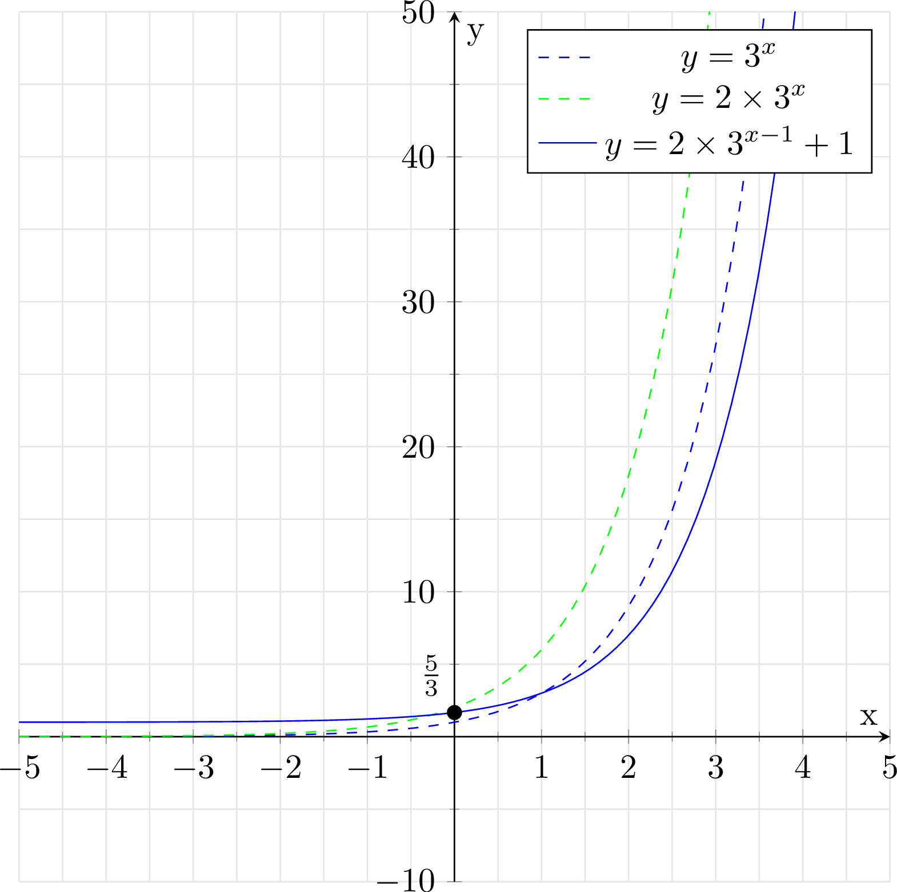

# 05_指数、対数

## Q6 指数・対数関連の語句について知っていますか?

??? success
    ### 正の整数乗以外

    ```text
    正の実数aと実数xに対し、a^xを以下のように定義する

    1 xが正の整数の時、a^x = a*a*...*a (aはx個)
    2 xが0の時、a^x = 1
    3 xが負の整数の時、a^x = 1/a^x
    4 xが有理数q/pの時、a^x = aはp乗根のq乗
    5 xが無理数の時、f(x) = a^xが連続関数になるようにつなげる

    [2の定義の理由]
      指数法則 a^{m+n} = a^ma^nがn,m = 0の時も成り立つようにするため

      n = 0, m≠0の時、a^m = a^0a^mより、a^0 = 1

    [3の定義の理由]
      そのように定義すると、指数法則a^{m+n} = a^ma^nが
      n,m < 0の時も成り立つ

      a^{4+(-3)} = a^4 * a^{-3} = a^4 * 1/a^3 = a
    
    [4の定義の理由]
      x,yが有理数の時にも、a^{x+y} = a^xa^yが成り立つようにするため
      a^q = a^{q/4} * a^{q/4} * a^{q/4} * a^{q/4} = a^{q/4 + q/4 + q/4 + q/4}
    
      8^{4/3} = 8 * 8^{1/3} = 16
    
    [無理数乗について]
      ・無理数の近くには、有理数が必ず存在する
        --> 有理数乗の極限で定義しようとする考え

      各項が有理数で、xに収束する数列x_k(k = 1,2,...)を考え
      a^x = lim_{k->∞} a^{x_k}と定義する

      例)
        a^1, a^{1.4}, a^{1.41}, a^{1.414}, a^{1.4142},...という数列x_kについて
        この数列の極限をa_^{√2}とする
      
    [無理数の無理数乗で表される有理数が存在することの証明]
      1 √2^{√2}が有理数であると仮定する。この場合、
        無理数の無理数乗で表される有理数が存在している
      
      2 √2^{√2}が無理数であると仮定する。
      この場合、(√2^{√2})^√2は無理数の無理数乗になる
      ここで、
      (√2^{√2})^√2 = √2^{√2*√2} = (√2)^2 = 2
      よって、√2^{√2}が無理数である時、(√2^{√2})^√2は無理数の無理数乗で
      表される有理数となる

      1,2より、無理数の無理数乗で表される有理数は少なくとも1つは存在する
    ```

    ### 指数法則について

    ```text
    a^m * a^n = a^{m+n}
    a^m / a^n = a^{m-n}
    (a^m)^n = a^{mn}
    (ab)^n = a^n * b^n
    (a/b)^n = a^n / b^n
      --> 等式が成立する理由については一度
      (a^3)^3 = (aaa)^3 = (aaa)*(aaa)*(aaa) = a^9のようにしてみるとわかりやすい
    
    例)
      (4^6 / 8^2) * (1 / 20^2) * 10^4
      = (2^2^6 / 2^3^2) * (1 / (2^2^2)*(5^2)) * (2^4)*(5^4)
      = (2^12 * 2^4 * 5^4) / (2^6 * 2^4 * 5^2)
      = (2^16 * 5^4) / (2^10 * 5^2)
      = 2^6 * 5^2
      = 64 * 25
      = 1600
      --> 素因数分解をして指数の底をそろえると簡単になる
    
      ((32)^{1/4} * 2) / (2^{1/6} * (8192)^{1/12})
      = (2^5^1/4)*2 / (2^1/6 * 2^13^1/12)
      = (2^9/4) / 2^(1/6 + 13/12)
      = 2^{27/12 - 2/12 - 13/12}
      = 2^{12/12}
      = 2
    ```

    ### 指数方程式

    ```text
    [例1]
      3^x = 27
      --> 底を共通にして解く

      3^x = 3^3 
      x = 3

    [例2]
      2^{2x} - 6*2^x + 8 = 0
      --> 置換を利用して解く

      (2^{x})^2 - 6*2^x + 8 = 0
      2^x = tと置くと
      t^2 -6t + 8 = 0
      (t-4)(t-2) = 0
      t = 2,4
      つまり 2^x = 2,4
      従って、x = 1,2

    [例3:連立方程式]
      2*5^x - 3^y = 1 ...(1)
      5^x + 3^y = 14  ...(2)

      5^x = s,  3^y = tとおく

      2s - t = 1
      s + t = 14

      これを解くと
      s = 5, t = 9
      従って、5^x = 5,  3^y = 9
      よって、(x,y) = (1,2)
    
    [例4:底が異なる場合]
      3^x = 7^{x+1}
      --> どちらか一方の指数の底と同じ底を持つ、対数をとる

      両辺について底が3の対数をとると、
      log₃3^x = log₃7^{x+1}
      xlog₃3 = (x+1)log₃7
      x = (x+1)log₃7
      (1- log₃7)x = log₃7
      x = (log₃7) / (1- log₃7)

    ```

    ### 指数関数のグラフ

    ```text
    [定義]
      y = a^xで表される関数。ただしa > 0, a≠1
      --> 写像である以上、どんな入力に対しても、出力が存在する必要がある

      [底がマイナスの場合]
      y = (-2)^xについて考える
      --> x = q/pとすると(つまり有理数乗)
      y = (-2)^{q/p}
      であり、仮に、q = 1, p = 2とすると√(-2)となり、√(2)i
      --> つまり、R^2の座標平面上では表現できなくなる

      もちろん、(-2)^3 = -8のように表現できる部分もあるが、
      x = 整数の時だけ存在する非連続なグラフなどを扱うことになるので、考えない

      --> 複素数まで拡張すればもちろんできるが、高校数学では扱わないってことだろう

      [底が0の場合]
      y = (0)^xについて考える
      x = -1とすると、1/0となり、定義できない。よってa≠0

      [底が1の場合]
      y = (1)^xについて考える。
      --> これはy = 1の直線になるが、典型的な指数関数のグラフの特徴
          (単調増加または単調減少で、値が急激に増加または減少する曲線)に反する
      --> そのためこの特殊ケースについては扱わない

    [例1: y = a^x (a > 1)]
      1 x = 0の時、 y = 1
      2 xがマイナスの時、y = 0に近づく
      3 xがプラスの時、yは爆発的に大きくなる

    [例2: y = a^x (a < 1)]
      1 x = 0の時、y = 1
      2 xがマイナスの時、yは爆発的に大きくなる
      3 xがプラスの時、y = 0に近づく

    [具体例]
      y = (1/3)^xのグラフを書く
      --> y = 3^{-x}
      --> これはy = 3^xをy軸対称移動させたものである


      y = 1 + 2*3^{x-1}のグラフを書く
      --> y = 3^xのグラフを考える
      --> y軸方向に2倍拡大して、y = 2*3^x
      --> x軸方向に1, y軸方向に1平行移動して
          y = 1 + 2*3^{x-1}
      
      --> x = 0の時、5/3を通る
      
      ※以下の画像は実際に記述したもの
    ```

    

    ### 指数不等式

    ```text
    (1/2)^x < (1/2)^3
    --> グラフの外形を思い浮かべると、
        a < 1なので、単調減少であることがわかる。

      よって x < 3

    [指数の不等式]
      a > 1 ⇒  a^p < a ^q ⇔ p < q (y = a^xは単調増加)
      a < 1 ⇒  a^p < a ^q ⇔ p > q (y = a^xは単調減少)

    [例]
      2^{x-4} < 8^{1-2x}を満たすxの範囲

      2^{x-4} < 2^{3-6x}
      log₂2^{x-4} < log₂2^{3-6x}
      x - 4 < 3 - 6x
      7x < 7
      x < 1
      --> 単純に底をそろえればいいだけではある
      --> 対数をとる時は、底が0~1の場合向きが逆転するので注意
    
    [例2]
      2^x - 2^{5-x} - 4 > 0
      両辺に2^x > 0をかけて(指数なので)
      2^{2x} - 2^5 > 2^{2+x}
      2^x = tとおくと

      t^2 - 4t -32 > 0
      (t-8)(t+4) > 0
      (2^x - 8)(2^x + 4) > 0
      
      2^x < -4,   2^x > 8
      2^x > 0なので、底2 > 1より、x > 3
    ```

    ### 対数の定義

    ```text
    a^x = yとなるようなxをlog_a yと表記する
      --> a^{log_a y} = y
      --> a^x = y ⇔ x = log_a y

    [例]
      log_4 64
      --> log_4 4^3より、log₄64 = 3
    
    [底と真数]
      対数log_a bについて、aのことを底, bのことを真数という
      ただし、log_a bについて考えられるのは
      底: a > 0 ∧ a ≠ 1
      真数: b > 0の時のみである
    
    [底の条件と真数条件の意味]

      指数関数における a^b = cについて、a > 0, a ≠ 1であったことを思い出す
      よって、対数の形 log_ac = bとした場合でも、a ≠ 1, a > 0

      また、a ≠ 1, a > 0の時、b>0となる
    ```

    ### 対数の性質

    $$
      \begin{align}
        & a,b,c > 0, a,b \neq 1 , M > 0, N > 0の時、 \\
        & 1\quad \log_aa = 1, \log_a1 = 0 \\
        & 2\quad \log_aMN = \log_aM + \log_aN \\
        & 3\quad \log_aM^r = r\log_aM \\
        & 4\quad \log_a\frac{M}{N} = \log_aM - \log_aN \\
        & 5\quad \log_ab = \frac{\log_cb}{\log_ca} \\
      \end{align}
    $$

    ```text
    [証明]
      対数の定義より、a^b = c ⇔ b = log_a c
      また底a > 0 ∧ a ≠ 1, 真数c > 0である

      1 a^1 = aを対数の形に直すと、log_a a = 1を得る
        a^0 = 1を対数の形に直すと、log_a 1 = 0を得る
      
      2 log_aM + log_aN = log_aMNを証明する

        log_aM = x, log_aN = yとおくと、
        対数の定義より
        a^x = M,  a^y = N
        ここで指数法則を使うと、
        a^{x + y} = a^xa^y = MNになるため

        a^{x+y} = MNを対数の形に直すと
        log_a MN = x + y = log_aM + log_aNを得る

      3 log_aM^p = plog_aMを証明する
        log_aM = xとおくと
        a^x = M
        ここで、仮定より a > 0, M > 0なので、両辺は正
        よって、両辺をp乗しても同値性は保たれる。
        つまり、
        a^x = M 
        ⇔ (a^x)^p = M^p
        ⇔ a^xp = M^p

        対数の形に直すと、
        loga M^p = px
        xを元に戻すと、loga M^p = plog_aMが得られた

        ※証明内で累乗を行う際は、等式の同値性が保たれていることを確認すること
          同値性が保たれていない場合、累乗後の等式は、仮定から導出できないものになる

      4 logaM - logaN = loga(M/N)を証明する

        3を用いると、loga M^p = plog_aM
        ここで、p = -1とすると、M^-1 = 1/Mより
        log_a(1/M) = -log_aMを得る ...(1)

        (1)より、-logaN = loga(1/N)
        よって、logaM - logaN = logaM + loga(1/N)

        2を用いると、log_aM + log_aN = log_aMNであるため
        log_aM + log_a(1/N) = log_a M*(1/N) = log_a(M/N)

      5 log_ab = log_cb / log_caを証明する

        対数の定義より a^d = b ⇔ d = log_ab
        よって、
        a^{log_ab} = b
        両辺に対して、底がcの対数をとって
        log_ca^{log_ab} = log_cb

        loga M^p = plog_aMより
        log_ab*log_ca = log_cb

        両辺をlog_caで割ると
        log_ab = log_cb / log_ca

      [例]
        log_4 8を計算せよ

        log_4 8 = log_2 8 / log_2 4
        = 3/2

      [例]
        log_{3}5 log_{5}7 log_{7}9を計算せよ

        log_{7}9 = log_5{9} / log_5{7}
        log_{5}7 log_{7}9 = log_{5}9

        log_{5}9 = log_{3}9 / log_{3}5
        log_{3}5 log_{5}9 = log_{3}9 = 2
    
    [両辺に対し、対数をとる場合の注意点]
      log_aをとるとして、a≠1, a > 0, 両辺の値が > 0
      --> つまり、対数の定義を満たせば問題がない

      x > 0 ∧ x^2 = 1のような等式の場合
      --> logxx^2 = 1等という風にしてしまうと、底1のケースが出てくる
      --> x≠1という制約が与えられていないため、安易に対数は取れない
      --> 方程式に対して、両辺に対数をとる際は
          底や真数に対して、対数の定義を満たしていることを確認する
    ```

    ### 便利な対数の公式

    $$
     \begin{align}
      1 \quad a^{\log_bc} = c^{\log_ba} \\
      2 \quad (\log_ab)(\log_bc) = \log_ac \\
      3 \quad \log_{a^n}b = \frac{1}{n}\log_ab \\
      4 \log_ab = \frac{1}{\log_ba}
     \end{align}
    $$

    ```text
    [証明1]
      (log_bc)(log_ba) = (log_ba)(log_bc)について
      αlog_xy = log_xy^αを用いると

      log_ba^{log_bc} = log_bc^{log_ba}という等式が成り立つ。
      底が同一で、等号で結ばれているため
      a^{log_bc} = c^{log_ba}
        --> 指数の肩にlogが乗っているとき、底と指数の対数のうち真数が交換可能

    [証明2]
      (log_ab)(log_bc) = log_acについて

      log_bc = log_ac / log_ab
      よって、log_abと乗算すると、log_ac
    
    [証明3]
      log_{a^n}b = (1/n)log_abについて

      log_{a^n}b = log_ab / log_aa^n
      = log_ab / n
      = (1/n)log_ab

    [証明4]
      log_ab = (1 / log_ba)

      log_ab = (log_bb) / log_ba
      = 1/ log_ba
    
    [使用例]
      4^{log_2 3}を解け

      4^{log_2 3}
      = 3^{log_2 4}
      = 3^2
      = 9

      e^{log_e f(x)}を解け

      e^{log_e f(x)}
      = f(x)^{log_e e}
      = f(x)

      (log_2 3)(log3 5)を解け
      = log_2 5

      (log_x y)(log_y z)(log_z x)を解け
      = log_x x
      = 1

      3log_83を解け
      = 3log_{2^3}3
      = 3*(1/3)log_23
      =  log_23
    ```

    ### 常用対数

    ```text
    ・10を底とする対数 log_{10}Nのこと
      つまり、10^x = Nを満たすxを指す

      [例]
        log_{10}10000 = 4
      
    [よく出る常用対数]
      log_{10}2 ≒ 0.3010
      log_{10}3 ≒ 0.4771
      log_{10}7 ≒ 0.8451
      log_{e}x ≒ 2.3log_{10}x

      ※e ≒ 2.718... (自然対数)
    
    [自然対数への変換]
      log_{e}x = log_{10}x / log_{10}e
      = log_{10}x / 0.4329...
      ≒ 2.3log_{10}x

      --> 常用対数を2.3倍すると、自然対数の近似値になる

    [log_{10}nについて]
      log_{10}4 = 2* log_{10}2 ≒ 0.6020
      log_{10}5 = log_{10}10 - log_{10}2 ≒ 0.6990
      log_{10}6 = log_{10}2 + log_{10}3 ≒ 0.7781
      log_{10}8 = 3 * log_{10}2 ≒ 0.9030
      log_{10}9 = 2 * log_{10}3 ≒ 0.9542
    
    [常用対数と桁数]
      正の整数Nがn桁
      ⇔ 10^{n-1} ≦ N < 10^n
      ⇔ n-1 ≦ log_{10}N < n
    
      [例]
        N = 2^{30}の桁数について
        ※ ただし、log_{10}2 = 0.3010

        Nの桁数をnとすると

        10^{n-1} ≦ 2^{30} < 10^n
        各辺正なので常用対数をとって
        n-1 ≦ 30*log_{10}2 < n

        30*log_{10}2
        = 30 * 0.3010 = 9.03

        n - 1 ≦ 9.03 < n
        よって、n = 10

      ※3桁の正の整数なら、100 ~ 999なので、10^{3} ≦ N < 10^4になる
    
    [常用対数と最高位の数]
      Nがn桁の数で最高位の数がa
      ⇔ a*10^{n-1} ≦ N < (a+1)*10^{n-1}
      ⇔ log_{10}(a * 10^{n-1}) ≦ log_{10}N < log_{10}((a+1)*10^{n-1})
      ⇔ (n-1) + log_{10}a ≦ log_{10}N < (n-1) + log_{10}(a+1)

      [例]
        Nが4桁の数で最高位の数が6
        6*10^3 ≦ N < 7*10^3
        3 + log_{10}6 ≦ log_{10}N < 3 + log_{10}7
      
      [例2]
        N = 2^30の最高位の数を求めよ
        ただし、log_{10}2 = 0.3010

        30 * log_{10}2 = 9.030より、10桁とわかっている。
        よって、桁数をn, 最高位の数をaとすると

        9 + log_{10}a ≦ 9.030 < 9 + log_{10}(a+1)
        各辺から9を引くと
        log_{10}a ≦ 0.030 < log_{10}(a+1)

        ここで、log_{10}2 = 0.3010なので、
        log_{10}1 ≦ 0.030 < log_{10}2

        よって、2^30の最高位の数は1

      [例3]
        6^200の桁数と、最高位の数を求めよ
        ただし、log_{10}2 = 0.3010, log_{10}3 = 0.4771

        N = 6^200とおく。この時、Nの桁数をn, 最高位の数をaとすると

        10^{n-1} ≦ 6^200 < 10^n
        各辺正なので、対数をとって
        n-1 ≦ 200* log_{10}6 < n
        n-1 ≦ 200* (0.3010 + 0.4771) < n
        n-1 ≦ 200* 0.7781 < n
        n-1 ≦ 155.62 < n
        n = 156なので、Nは156桁

        また、
        a*10^{n-1} ≦ N < (a+1)*10^{n-1}について、対数をとると
        (n-1) + log_{10}a ≦ log_{10}N < (n-1) + log_{10}(a+1)より
        
        155 + log_{10}a ≦ 155.62 < 155 + log_{10}(a+1)
        log_{10}a ≦ 0.62 < log_{10}(a+1)

        log_{10}4 = 0.6020
        log_{10}5 = 1 - 0.3010 = 0.6990なので
        a = 4
        よって、Nの最高位の数は4
    ``

    ### 対数方程式

    ```text
    [対数が外せる条件]
      底, 真数が対数の条件を満たす時、「log_{a}x = log_{a}yならば、x = y」
      --> 約分したわけではない

      M = log_{a}x
      N = log_{a}yとおく。この時、
      a^M = x, a^N = y
      
      前件log_{a}x = log_{a}yが真であるとすると、
      M = N。よって、a^M = a^N
      つまり、x = yとなる

      --> つまり log_ab = log_ac + log_adの時にlogをとれるわけではなく
          log_ab = log_acのようなときにしか取れない
      --> (1/2)log_ab = log_acのときも、外せない。
          左辺の数字を、真数の指数にもっていってから外す

    [例1]
      log_{2}(x+1) = 2 + log_{2}x


      対数の真数は > 0であるため
      x + 1, x > 0。よって x > 0

      2 = log_{2}4なので

      log_{2}(x+1) = log_{2}4 + log_{2}x
      log_{2}(x+1) = log_{2}4x

      対数を外すと
      x + 1 = 4x
      3x = 1
      x = 1/3 ...(1)

      (1)は真数条件x > 0を満たすため、x = 1/3

    [例2]
      log_{9}x = log_{3}(x-2)
      真数条件は x > 0 ∧  x - 2 ∧ 0
      よって、 x > 2

      ⇔ log_{3^2}x = log_{3}(x-2)
      ⇔ (1/2)log_{3}x = log_{3}(x-2)
      ⇔ (log_{3}x)^{1/2} = log_{3}(x-2)

      対数を外して
      x^{1/2} = x - 2
      真数条件より、両辺正なので、2乗しても解の吟味は必要ない
      x = (x-2)^2
      x = x^2 - 4x + 4
      x^2 - 5x + 4 = 0
      (x-4)(x-1) = 0
      よって、x = 1,4
      このうち真数条件を満たすのはx = 4

    [例3]
      (log_{2}x)^2 = log_{2}x^2
      真数条件は x > 0, x^2 > 0より、x > 0
      t = log_{2}xとおくと
      t^2 - 2t = 0
      t(t-2) = 0
      t = 0, 2

      log_2x = 0の時、x = 1
      log_2x = 2の時、x = 4
      より、x = 1,4。これらは真数条件x > 0を満たす 

    [例4]
      log_{x}2 = log_2{x}^2 + 1
      真数条件より、x^2 > 0
      底の条件より、x > 0, x≠1


      log_{x}2 = log_2{x}^2 + 1
      1/(log_{2}x) = log_2{x}^2 + 1

      log_{2}x = tとおくと
      1/t = 2t + 1

      両辺にtをかけて
      1 = 2t^2 + t
      2t^2 + t - 1 = 0
      (2t - 1)(t + 1) = 0
      t = 1/2, -1

      xについての式を解くと、
      log_{2}x = -1
      x = 2^{-1} = 1/2
      
      log_{2}x = 1/2
      x = 2^{1/2} = √2

      x = √2, 1/2 . これらは真数条件を満たす
    ```

    ### 対数不等式

    ```text
    [意識すること]
      y = log_2xについて考える。
      --> 単調増加。対数なので、xが増加しても、次第に傾きは緩くなる
      --> x = 1のとき0, x < 1のとき、たとえばlog_2(1/2)なら-1になる

      y = log_{1/2}xについて考える
      --> log_{2^-1}x = -log_{2}xに書き換えられる
      --> x < 1のとき、正, x = 1のとき0, x > 1のとき負になる

    [性質]
      log_{a}x ≧ log_{a}yという不等式の解は
      a > 1のとき x ≧ y
      a < 1のとき x ≦ y
      等号を含まない場合も、この性質は同様
      
    [例]
      log_{2}(x+3) < 2log_{2}(x+1)
      真数条件より、x + 3 > 0 ∧ x + 1 > 0
      よって、x > -1
      ⇔ log_{2}(x+3) < log_{2}(x+1)^2
      底2 > 1なので
      (x + 3) < (x+1)^2
      x +  3 < x^2 + 2x + 1
      x^2 + x -2 > 0
      (x+2)(x-1) > 0
      (x > -2 ∧ x > 1) ∨ (x < -2 ∧ x < 1)
      よって、x > 1, x < -2
      真数条件より x > -1なので
      x > 1
    
    [例2]
      ※log_ax = log_ayの形に持っていくこと

      log_{0.5}(x) + 1 ≧ log_{2}(x+1)
      真数条件より x > 0, x > -1

      ⇔ -log_{2}(x) + log_{2}2 ≧ log_{2}(x+1)
      ⇔ log_{2}(x)^{-1} + log_{2}2 ≧ log_{2}(x+1)
      ⇔ log_{2}2*(x)^{-1} ≧ log_{2}(x+1)
      底 2 > 1なので
      2*(x)^{-1} ≧ x + 1
      両辺にxをかけて
      2 ≧ x(x+1)
      x^2 + x -2 ≦ 0
      (x+2)(x-1) ≦ 0
      -2≦x≦1の時、左辺は0,ないしはマイナス
      真数条件より x > 0なので
      0 < x ≦ 1

    [例3]
      (log_{2}x)^2 ≦ log_{2}x + 2
      真数条件より x > 0
      log_{2}x = tとおくと

      t^2 ≦ t + 2
      t^2 - t -2 ≦ 0
      (t-2)(t+1) ≦ 0
      -1≦t≦2
      xについてとくと
      -1≦log_2{x}≦2
      -log_{2}2≦log_2{x}≦log_2{4}
      ⇔ log_{2}(1/2)≦log_2{x}≦log_2{4}

      底2 > 1なので
      (1/2)≦x≦4
      これは真数条件を満たす
    
    [注意点]
      底が未知数の場合は、さらなる場合分けが必要
    ```

    ### 0の0乗

    ```text
    極限を用いて考える

    x^0乗について考える

    lim_{x-->0}(x^0) = 1 (0以外の数の0乗なので)

    0^x乗について考える
    lim_{x--> +0}(0^x) = 0 (0の累乗なので)

    --> 2通りの解釈ができるためえ、定義しないことが多いとのこと?

    [ところで]
      pythonにおける0**0 = 1である
      C++でも cout << pow(0.0, 0,0)は1になる
    
    [なぜ?]
      仮説1
        ・一貫性の維持。a^0 = 1がどの非負数aに対しても成り立つ
          (つまりa = 0の時も成り立つ)とした方が一般性が増して、いいのではないか
      
      仮説2
        ・空集合の冪集合について考える。
          --> この時、冪集合は、空集合を唯一の元として持つ一元集合になる
          --> つまり、要素数は1
          --> 0^0 = 1と考えた方が自然なのでは?
        
      仮説3
        組み合わせ論などでは0^0 = 1と考えた方がいいのだろう
        たとえば、二項定理について考える

        0^0 = 1の時、
        (1+0)^1 = 1C0(1^1 * 0^0) + 1C1(1^0 * 0^1)
        = 1*1 = 1

        0^0 = 0の時、
        (1+0)^1 = 1C0(1^1 * 0^0) + 1C1(1^0 * 0^1)
        = 0 + 0 = 0

        つまり、二項定理(a+b)^nにおいて、a,b = 0でも成り立つようにするためには
        0^0 = 1と定義した方がよいことがわかる

    ```

    ### 累乗根(複素数含む)

    ```text
    [定理]
      正の実数aと1以上の整数nに対し、n乗してaになるような正の実数は
      ちょうど1つ存在する
    ```