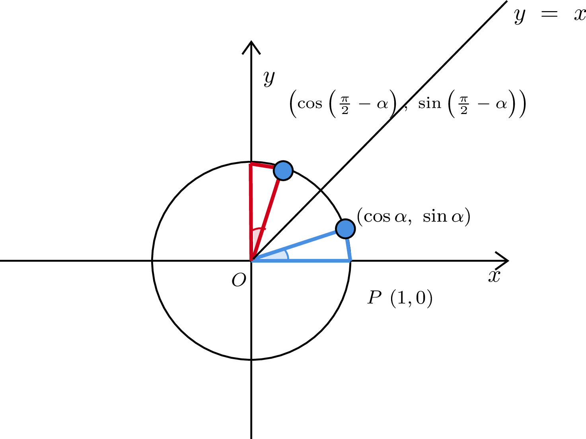
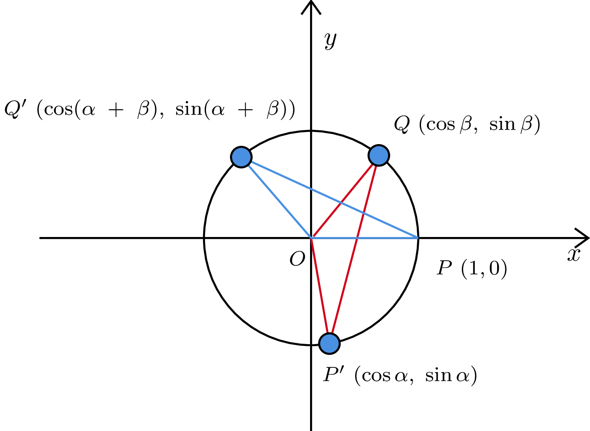

# 三角関数

## Q7　三角関数関連の語句について知っていますか?

??? success

    ### 弧度法

    ```text
    度数法
      ・30度, 60度という角度の表し方
      ・180度で半回転。360度で一回転
    
    弧度法
      ・半径が1で弧の長さがLである扇形の中心角をLラジアンとするような角度の表し方
      --> 半径が1, 弧の長さが1なら、1ラジアン
      --> 半径が1の真円の円周は2π, 半円の円周はπなので、
          180度はπラジアンと表現できる
    
    弧度法と度数法の変換
      180度 = πラジアンなので

      60度 = π/3
      π/4 = 45度
    
    [弧の長さをラジアンで表現する]
      半径がrで、中心角Θラジアンの扇形の弧の長さはrΘ

      [証明]
        度数法の場合の弧の長さは、
        半径*2π * 中心角 / 360度で求められる

        この時、半径をr倍すると、弧の長さもr倍となる

        弧度法の定義では、半径1, 弧の長さがΘの中心角がΘラジアンと表現される
        よって、半径1, 中心角Θラジアンの場合の弧の長さはΘ
        半径をr倍すると、当然弧の長さはr倍になるため、rΘ 

      [証明2]
        度数法の場合、半径r, 中心角A度の扇形の弧の長さは
        2πr * A/360となる。
        度数法と弧度法の変換より、180度 = πラジアン
        よって、1ラジアン = 180/π度であり
        Θラジアンは(180/π)Θ度と表せる

        よって、半径がr, 中心角Θラジアンの場合、
        A = (180/π)Θとすると
        2πr * (180Θ / 360π) = rΘ
      
    [弧度法による扇形の面積公式]
      度数法では、半径r, 中心角A度の扇形の面積は
      r*r*π* A/360であった

      ここで、半径r, 中心角Θラジアンとすると
      Θラジアン = (180Θ / π)度より
      r * r * π * (180Θ / 360π)
      = (1/2)r^2Θとなる

      よって、半径が2で、中心角がπ/4ラジアンである扇形の面積は
      (1/2)*2^2*(π/4)= π/2

    ```
    ### 三角関数の定義

    ```text
    任意の実数Θに対して、x軸の正の部分を原点中心に反時計回りにΘだけ
    回転させた半直線と単位円の交点の座標を(cosΘ,　sinΘ)と定義する

    Θだけ回転
      --> 原点を中心にして、x軸の正の部分を反時計回りにΘラジアン回転させたとき、
          単位円である以上半径は1なので軌跡の長さはΘとなる

    また、cosΘ≠0のとき、tanΘ = sinΘ/cosΘと定義する

    sinΘ
      ・単位円上の角度Θに対応する点のy座標
    
    cosΘ
      ・単位円上の角度Θに対応する点のx座標
    
    tanΘ
      ・sinΘ / cosΘ
    
    [直角三角形による定義を用いない理由]
      ・直角三角形の場合、0度 ~ 90度の範囲でしか定義できない
      ・単位円の場合、負の角度についても同様に定義可能
        --> 各象限における三角関数の符号もわかりやすい
      ・三角関数が周期関数である(2πで元の位置に戻る)ということがりかいしやすい

      --> 正弦定理や余弦定理などの理解なら直角三角形の定義でも可
    ```

    

    ### 三角形の相互関係

    ```text
    1. sin²Θ + cos²Θ = 1
    2. tanΘ = sinΘ / cosΘ
    3. 1 + tan²Θ = 1/cos²Θ
    4. 1 + (1 / tan²Θ) = 1/sin²Θ
    
    ※sin²Θ = sinΘ * sinΘ = (sinΘ)^2

    [証明1]
      円の方程式より、原点中心で、半径1の円、つまり単位円上の点は、
      x^2 + y^2 = 1を満たす

      ここで、三角関数の定義より、
      (cosΘ, sinΘ)は単位円上の点であるため、(cosΘ)^2 + (sinΘ)^2 = 1
      つまり、cos²Θ + sin²Θ = 1

      ※(cosΘ, sinΘ)は、原点を中心にして、x軸の正の部分を反時計回りにΘラジアン回転
        させた半直線と、単位円との交点。つまり、単位円上に存在する
    
    [証明?2]
      tanΘ = sinΘ/cosΘはtanΘの定義そのものなので証明というほどのものはない

    [証明3]
      1 + tan²Θ = 1/cos²Θ

      証明1,2より、
      1 + tan²Θ 
      = 1 + tanΘ * tanΘ
      = 1 + (sinΘ / cosΘ) * (sinΘ / cosΘ)
      = 1 + (sin²Θ / cos²Θ)
      = (cos²Θ / cos²Θ)+ (sin²Θ / cos²Θ)
      = + (cos²Θ + sin²Θ / cos²Θ)
      = 1 / cos²Θ
    
    [証明4]
      1 + (1 / tan²Θ) = 1/sin²Θ

      1,2より
      1 + 1 / tan²Θ 
      = 1 + (cos²Θ / sin²Θ)
      = (cos²Θ + sin²Θ)/ sin²Θ
      = 1 / sin²Θ
    
    [例]
      sinΘ = 3/5のとき、cosΘ, tanΘを求めよ
      ただし、0°≦Θ≦90°
      弧度法で表すと、0≦Θ≦π/2

      cos²Θ + sin²Θ = 1
      より、cos²Θ = 1 - (sinΘ)^2
      cos²Θ = (16/25)
      cosΘ = ±(4/5)
      ただし、0≦Θ≦π/2より
      cosΘ = 4/5

      tanΘ = sinΘ / cosΘ = 3/4
    ```

    ### 負角の公式と余角の公式

    ```text
    加法定理の導出中に使うので、加法定理から導く風にはしたくない
      --> 加法定理から導くならおそらく簡単だが
      --> cos(-Θ) = cos0cosΘ + sin0sinΘ = cosΘ
      --> cos(π/2 - Θ) = cosπ/2cosΘ + sinπ/2sinΘ = sinΘ

      --> 基本的な三角関数の定義や対称性を用いて証明可能だと考えられる
    
    負角の公式
      cos(-Θ) = cosΘ
      sin(-Θ) = -sinΘ
      tan(-Θ) = -tanΘ

      [証明?]
        単位円上で、角度Θと-Θについて考える
        角度Θはx-軸の正の向きをはじめとし、原点を中心に反時計回りにΘ回転した結果を表す
        角度-Θはx-軸の正の向きをはじめとし、原点を中心に時計回りにΘ回転した結果を表す

        つまり、Θと-Θの場合の座標はx-軸対称になる
        よって、x座標については変わらないと考えられる。
        従って、cos(-Θ) = cosΘ

        また、x-軸対称であるため、y座標の符号は逆になる。
        よって、 sin(-Θ) = -sinΘ

        tan(-Θ) = sin(-Θ) / cos(-Θ) = -tanΘ
    
    余角の公式 
      cos(π/2 - Θ) = sinΘ
      sin(π/2 - Θ) = cosΘ
      tan(π/2 - Θ) = sin(π/2 - Θ) / cos(π/2 - Θ) = cosΘ / sinΘ = 1/tanΘ

      [証明]
        (cos(π/2 - Θ), sin(π/2 - Θ))について、
        π/4を基準に、単位円周上で
        (π/2 - Θ) - π/4 = π/4 - Θだけ反時計回りに回転した点と考えられる。

        また、(cosΘ, sinΘ)についても
        π/4を基準に単位円周上で
        π/4 - Θだけ時計回りに回転した点と考えられる

        よって、この2つの点はx-軸の正の向きをπ/4だけ反時計回りに回転させた直線
        ひいては 直線y = xについて対称である

        y = xに対して対称移動を行うと、x座標とy座標が逆転するため、
        cos(π/2 - Θ) = sinΘ
        sin(π/2 - Θ) = cosΘ

        よって、tan(π/2 - Θ) = tanΘ
    ```

    

    ### 加法定理

    ```text
    sin(α ± β) = sinαcosβ ± cosαsinβ
    cos(α ± β) = cosαcosβ ∓ sinαsinβ

    tan(α ± β) = (tanα ± tanβ) / (1 ∓ tanαtanβ)
    --> ただし、tanα, tanβ, tanαtanβは定義できるものとする

    [cos(α+β)の証明]
      単位円に内接し、
      単位円周上にP(1,0), Q(cos(α+β), sin(α+β))、
      それから原点O(0,0)をとる、三角形OPQについて考える。

      この三角形を原点中心に-α,　時計回りに回転したとすると、
      三角関数の定義より、
      P'(cos(-α), sin(-α)), 
      Q'(cos(α + β - α), sin(α + β - α)) = Q'(cosβ + sinβ)

      ※負角の公式より
      P'(cos(-α), sin(-α)) = (cosα, -sinα)となる

      ここで、三角形OPQと、OP'Q'は回転移動しただけなので合同
      よって、PQ = P'Q'。つまり、PQ² = P'Q'²
      
      三平方の定理より
      PQ² = (1 - (cos(α + β)))² + (sin(α + β))²
      = {1 - cos(α + β)}² + sin²(α + β)

      P'Q'² = {cos(-α) - cosβ}² + {-sinα - sinβ}²

      よって、
      {1 - cos(α + β)}² + sin²(α + β) = {cosα - cosβ}² + {-sinα - sinβ}²
      ⇔ 1 - 2cos(α + β) + cos²(α + β) + sin²(α + β)
          = cos²α - 2cosαcosβ + cos²β + sin²α + 2sinαsinβ + sin²β
      ⇔ 2 - 2cos(α + β) = 2 - 2cosαcosβ + 2sinαsinβ
      ⇔ -2cos(α+β) = -2(cosαcosβ - sinαsinβ)
      ⇔ cos(α+β) = cosαcosβ - sinαsinβ

    [その他の公式の証明]
      cos(α+β) = cosαcosβ - sinαsinβ...(i)を用いて証明する

      (i)のβ --> -βに変えると

      cos(α + (-β)) = cosαcos(-β) - sinαsin(-β)
      cos(-β) = cosβ,  sin(-β) = -sinβより、
      cos(α - β) = cosαcosβ + sinαsinβ ...(ii)

      (ii)のα --> π/2 - αに変えると
      cos(π/2 - α - β) = cos(π/2 - α)cosβ + sin(π/2 - α)sinβ
      ⇔ cos(π/2 - (α + β)) = cos(π/2 - α)cosβ + sin(π/2 - α)sinβ
     ※余角の公式より
      ⇔ cos(π/2 - (α + β)) = cos(π/2 - α)cosβ + sin(π/2 - α)sinβ
      ⇔ sin(α + β) = sinαcosβ + cosαsinβ ...(iii)

      (iii)のβ --> -βに変えると
      sin(α - β) = sinαcos(-β) + cosαsin(-β)
      ⇔ sin(α - β) = sinαcosβ -cosαsinβ ...(iv)

      [tan]

      tan(α + β) = sin(α + β) / cos(α + β)
      = (sinαcosβ + cosαsinβ) / (cosαcosβ - sinαsinβ)

      分母分子ともに cosαcosβで割ると
      分子は (sinαcosβ + cosαsinβ) / cosαcosβ
      = sinαcosβ / cosαcosβ + cosαsinβ / cosαcosβ
      = (sinα / cosα) + (sinβ / cosβ)
      = tanα + tanβ
      分母は(cosαcosβ - sinαsinβ) / cosαcosβ
      = 1 - (sinαsinβ) / cosαcosβ
      = 1 - (sinα) * (sinβ) / cosα * cosβ
      = 1 - tanαtanβ

      よって、
      = (tanα + tanβ) / (1 - tanαtanβ) ...(v)

      (v)のβを-βに変えると、
      tan(α - β) = sin(α - β) / cos(α - β)
      = sinαcosβ - cosαsinβ / cosαcosβ + sinαsinβ
      分母分子ともに、cosαcosβで割ると
      = tanα - tanβ / 1 + tanαtanβ
    ```

    

    ### 余角、補角、負角の公式

    ```text
    [加法定理から簡単に導く]
      sin(π/2 - Θ) = sinπ/2cosΘ - cosπ/2sinΘ = cosΘ
      cos(π/2 - Θ) = cosπ/2cosΘ + sinπ/2sinΘ = sinΘ
      tan(π/2 - Θ) = 1/tanΘ

      sin(-Θ) = sin0cosΘ - cos0sinΘ = -sinΘ
      cos(-Θ) = cos0cosΘ + sin0sinΘ = cosΘ
      tan(-Θ) = -tanΘ

      [補角の公式]
      sin(π - Θ)　= sinπcosΘ - cosπsinΘ = sinΘ
      cos(π - Θ) = cosπcosΘ + sinπsinΘ = -cosΘ
      tan(π - Θ) = -tanΘ

      [π　+ Θ]
      sin(π + Θ) = sinπcosΘ + cosπsinΘ = -sinΘ
      cos(π + Θ) = cosπcosΘ - sinπsinΘ = -cosΘ
      tan(π + Θ) = tanΘ

      [π/2 + Θ]
      sin(π/2 + Θ) = sinπ/2cosΘ + cosπ/2sinΘ = cosΘ
      cos(π/2 + Θ) = cosπ/2cosΘ - sinπ/2sinΘ = -sinΘ
      tan(π/2 + Θ) = -(1/tanΘ)

      [2π + Θ]
        --> 周期性を考えればいいけど、一応
      sin(2π + Θ) = sin2πcosΘ + cos2πsinΘ = sinΘ
      cos(2π + Θ) = cos2πcosΘ - sin2πsinΘ = cosΘ
      tan(2π + Θ) = tanΘ
    ```

    ### 倍角、三倍角、半角

    ```text
    [倍角の公式]
    sin2x = 2sinxcosx
    cos2x = 2cos²x - 1 = 1 - 2sin²x
    tan2x = (2tanx) / (1 - tan²x)

    [導出]
      sin(2Θ) = sin(Θ + Θ) = sinΘcosΘ + cosΘsinΘ = 2sinΘcosΘ
      cos(2Θ) = cos(Θ + Θ) = cosΘcosΘ - sinΘsinΘ 
      = cos²Θ - sin²Θ 
      = cos²Θ + sin²Θ - 2sin²Θ
      = 1 - 2sin²Θ
      = -cos²Θ - sin²Θ + 2cos²Θ
      = 2cos²Θ - 1

      tan(2Θ) = tan(Θ + Θ)
      = (tanΘ + tanΘ) / (1 - tanΘtanΘ)
      = 2tanΘ / (1 - tan²Θ)
    
    [半角の公式]
      sin²x = (1 - cos2x) / 2
      cos²x = (1 + cos2x) / 2
      tan²x = (1 - cos2x) / (1 + cos2x)

    [導出]
      cos(2Θ) = 2cos²Θ - 1 = 1 - 2sin²Θより

      1 - 2sin²Θ = cos(2Θ)
      -2sin²Θ = cos(2Θ) - 1
      sin²Θ = (1 - cos2Θ) / 2

      2cos²Θ - 1 = cos(2Θ)
      cos²Θ = (cos2Θ + 1) / 2

      tan²Θ = (1 - cos2Θ) / (cos2Θ + 1)
    
    [三倍角の公式]
      sin3x = -4sin³x + 3sinx
      cos3x = 4cos³x - 3cosx

    [導出]
      sin(3Θ) = sin(Θ + 2Θ)
      = sinΘcos2Θ + cosΘsin2Θ
      = sinΘ(cosΘcosΘ - sinΘsinΘ) + cosΘ(sinΘcosΘ + cosΘsinΘ)
      = sinΘ(cos²Θ - sin²Θ) + sinΘcos²Θ + cos²ΘsinΘ
      = sinΘcos²Θ - sin³Θ +sinΘcos²Θ + cos²ΘsinΘ
      = 3sinΘcos²Θ - sin³Θ
      cos²Θ = 1 - sin²Θより
      = 3sinΘ(1 - sin²Θ) - sin³Θ
      = 3sinΘ - 4sin³Θ

      cos(3Θ) = cos(Θ + 2Θ)
      = cosΘcos2Θ - sinΘsin2Θ
      = cosΘ(cosΘcosΘ - sinΘsinΘ) - sinΘ(sinΘcosΘ + cosΘsinΘ)
      = cos³Θ - sin²ΘcosΘ - 2sin²ΘcosΘ
      = -3sin²ΘcosΘ + cos³Θ
      sin²Θ = 1 - cos²Θより
      = -3(1 - cos²Θ)cosΘ + cos³Θ
      = -3cosΘ + 4cos³Θ

    [例]
      sin3Θ = sinΘを満たすΘを0 ≦ Θ < πの範囲で求めよ

      sin3Θ = -4sin³Θ + 3sinΘより
      sin3Θ = sinΘ
      ⇔ -4sin³Θ + 3sinΘ = sinΘ 
      ⇔ -4sin³Θ = -2sinΘ
      ⇔ -4sin³Θ + 2sinΘ = 0
      
      sinΘ = tとおくと
      -4t³ + 2t = 0
      4t³ - 2t = 0
      t³ - (1/2)t = 0
      t(t² - 1/2) = 0
      t(t + √(1/2))(t - √(1/2)) = 0
      t(t + 1/√2)(t - 1/√2) = 0
      t = 0, ±1/√2

      つまり、sinΘ = 0, ±1/√2
      問題文の条件(0 ≦ Θ < πの範囲で求めよ)より

      Θ = 0,π/4, 3π/4 
      
    [tanの3倍角]
      tan3Θ = (3tanΘ - 3tan³Θ) / (1 - 3tan²Θ)

    [導出]
      tan3Θ = tan(Θ + 2Θ)
      = tanΘ + tan2Θ / 1 - tanΘtan2Θ

      tan2Θ = 2tanΘ / 1 - tan²Θより

      分子は、(tanΘ) + (2tanΘ / 1 - tan²Θ)
      = {tanΘ*(1 - tan²Θ) + 2tanΘ} / (1 - tan²Θ)
      = (3tanΘ - tan³Θ) / (1 - tan²Θ)

      分母は、1 - tanΘ * (2tanΘ / 1 - tan²Θ)
      = 1 - (2tan²Θ) / (1 - tan²Θ)
      = (1 - tan²Θ - 2tan²Θ) / (1 - tan²Θ)
      = (1 - 3tan²Θ) / (1 - tan²Θ)

      よって、
      = (3tanΘ - tan³Θ) / (1 - 3tan²Θ)


    [3倍角と因数分解]
      sin3Θ = -4sinΘsin(Θ + π/3)sin(Θ - π/3)
      cos3Θ = 4cosΘcos(Θ + π/3)cos(Θ - π/3)

      sin3Θ = -4sin³Θ + 3sinΘより
      = sinΘ(-4sin²Θ + 3)
      = sinΘ(3sin²Θ + 3cos²Θ - 4sin²Θ)
      = sinΘ(-sin²Θ + 3cos²Θ)
      = sinΘ(√3cosΘ + sinΘ)(√3cosΘ - sinΘ)

      ここで、以下より
      sin(Θ + π/3) = sinΘcosπ/3 + cosΘsinπ/3
      = 1/2*sinΘ + √3/2cosΘ

      sin(Θ - π/3) = sinΘcosπ/3 - cosΘsinπ/3
      = 1/2*sinΘ - √3/2cosΘ

      -2sin(Θ - π/3) = √3cosΘ - sinΘ
      2sin(Θ + π/3) = √3cosΘ + sinΘ
      = -sinΘ(2sin(Θ + π/3))(2sin(Θ - π/3))
      = -4sinΘ(sin(Θ + π/3))(sin(Θ - π/3))

      cos3Θ = 4cos³Θ - 3cosΘ
      = cosΘ(4cos²Θ - 3)
      = cosΘ(4cos²Θ -3cos²Θ -3sin²Θ)
      = cosΘ(cos²Θ -3sin²Θ)
      = cosΘ(cosΘ - √3sinΘ)(cosΘ + √3sinΘ)

      以下より
      cos(Θ + π/3) = cosΘcosπ/3 - sinΘsinπ/3
      = 1/2cosΘ - √3/2sinΘ
      cos(Θ - π/3) = cosΘcosπ/3 + sinΘsinπ/3
      = 1/2cosΘ + √3/2sinΘ

      = cosΘ(2cos(Θ + π/3))(2cos(Θ - π/3))
      = 4cosΘ(cos(Θ + π/3))(cos(Θ - π/3))

      tan3Θ 
      = -4sinΘ(sin(Θ + π/3))(sin(Θ - π/3)) / 4cosΘ(cos(Θ + π/3))(cos(Θ - π/3))
      = -tanΘtan(Θ + π/3)tan(Θ - π/3)

    [使用例]
      tan10° = tan20°tan30°tan40°を証明せよ

      Θ = 10°とする
      この時、

      tan3Θ = -tanΘtan(Θ + π/3)tan(Θ - π/3)
      = -tanΘtan(Θ + 60°)tan(Θ - 60°)より

      tan30° = -tan10°tan70°tan(-50°)
      tan(-Θ) = sin(-Θ) / cos(-Θ) = -tanΘなので、
      = tan10°tan70°tan50°

      tan(90° - Θ) = tan(π/2 - Θ) =  1 / tanΘより
      tan20° = tan(90° - 70°) = 1 / tan70°

      tan40° = tan(90° - 50°) = 1 / tan50°

      よって、tan30°tan20°tan40° = tan10°
    
    [使用例2]
      tan50°tan70° / tan60°tan80°

      Θ = 10°とすると
      tan3Θ = -tanΘtan(Θ + 60°)tan(Θ - 60°)より

      tan30° = tan10°tan70°tan50°
      よって、tan70°tan50° = tan30° / tan10°

      tan80° = tan(90° - 10°) = 1 / tan10°
      tan60° = tan(90° - 30°) = 1 / tan30°

      よって、 1 / tan80°tan60° = tan10°tan30°

      tan50°tan70° / tan60°tan80° = tan30°tan30°
      tan30° = sinπ/6 / cosπ/6 = (1/2) / (√3/2)
      = 1/√3

      (tan30°)^2 = (1/√3)^2 = 1/3
    ```

    ### 三角関数の合成公式

    ```text
    a≠0, b≠0のとき、
    asinΘ + bcosΘ = √(a^2 + b^2)sin(Θ + α)
    ただし、αは sinα = b / √(a^2 + b^2), cosα = a /  √(a^2 + b^2)を満たす角度

    --> sin, cosが混ざった式をsinだけで表す公式

    [証明1]
      加法定理よりsin(Θ + α) = sinΘcosα + cosΘsinα

      よって、√(a^2 + b^2)sin(Θ + α)
      = √(a^2 + b^2)(cosαsinΘ + sinαcosΘ)

      ここで、αは、sinα = b / √(a^2 + b^2), cosα = a /  √(a^2 + b^2)を
      満たす角度であるため、

      cosαsinΘ = asinΘ / √(a^2 + b^2)
      sinαcosΘ = bcosΘ / √(a^2 + b^2)

      よって、
      √(a^2 + b^2)(cosαsinΘ + sinαcosΘ)
      = √(a^2 + b^2) * (asinΘ + bcosΘ) / √(a^2 + b^2)
      = asinΘ + bcosΘ
    
    --> 加法定理の逆の操作と考えられる

    [証明2]
      XY座標平面上に点A(a,b)をとる
      この時、OA = rとおくと三平方の定理より
      r = √(a^2 + b^2)

      動径OAの角をαとすると(仮定)
      三角関数の定義より、
      OA = 1の時、(a,b)は(cosα, sinα)
      OA = rなので、(a,b)は(rcosα, rsinα)と表せる

      よって、asinΘ + bcosΘ
      = rcosαsinΘ + rsinαcosΘ
      
      ここで、sin(Θ + α) = sinΘcosα + cosαsinΘより
      = rsin(Θ + α)
      = √(a^2 + b^2)sin(Θ + α)

      ※(a,b)は(rcosα, rsinα)と表せる
      --> a = √(a^2 + b^2)cosα
          ⇔ cosα = a / √(a^2 +b^2)
      
      --> b = √(a^2 + b^2)sinα
          ⇔ sinα = b / √(a^2 + b^2)

    [利点]
      平方完成のように、変数を1か所に封じ込められるのがいい
      asinx + bcosx = rsin(x + α)

    [以下は、イメージ図]
    ```

    

    ```text
    [使用例]
      sinΘ + √3cosΘをsinに合成せよ

      三角関数の合成の公式より

      sinΘ + √3cosΘ
      = √(1^2 + √3^2)sin(Θ + α)
      = 2sin(Θ + α)

      ここで、αは
      cosα = 1 / 2,
      sinα = √3 / 2を満たす角度である
      よって、α = 60° = π/3

      = 2sin(Θ + π/3)

    [cosの合成公式について]
      x座標平面上に点A(b,a)をとり
      動径OAをrとおくと、r = √(b^2 + a^2)

      動径OAの角をβとすると
      (b, a) = (rcosβ , rsinβ)と表せる


      よって、
      asinΘ + bcosΘ
      = rsinβsinΘ + rcosβcosΘ
      = √(a^2 + b^2)cos(Θ - β)

      この時、 b = √(a^2 + b^2)cosβより、
      cosβ = b / √(a^2 + b^2)

      a = √(a^2 + b^2)sinβより
      sinβ = a / √(a^2 + b^2)

      --> 逆になっているので注意

    [使用例]
      sinΘ + √3cosΘをcosに合成せよ
      = 2cos(Θ - β)
      ただし、βは 
      sinβ = 1 / 2, cosβ = √3/2を満たす
      これを満たす、β = 30°
      よって、2cos(Θ - 30°)


    
    [三角関数の合成とグラフ]
      y = sinΘ + cosΘのグラフの外形を考えろ

      y = √2sin(Θ + α)
      αは、cosα = 1/√2, sinα = 1 / √2を満たす。
      よって、α = 45°なので、

      y = √2sin(Θ + π/4)
      これはy = √sinΘのグラフを、Θ-軸方向に、-π/4平行移動し, y軸方向に√2倍
      拡大したものになる
    
    [使用例]
      Θが実数全体を動くとき、
      f(Θ) = 2sinΘ + 3cosΘの最大、最小値を求めよ

      2sinΘ + 3cosΘ
      = √13sin(Θ + α)

      ここでαは、
      cosα = 2 / √13,  
      sinα = 3 / √13を満たす角だが、答えとは関係ない。

      グラフで考えると、
      √13sin(Θ + α)は、y = sinΘを、Θ-軸方向にαだけ平行移動し、
      y軸方向に√13倍拡大したものになる。

      sinΘは、実数全体を動くとき、-1 ≦ sinΘ ≦ 1であるため、
      最小値は-√13, 最大値は√13
    
    [使用例2]
      0 ≦ Θ ≦ πのとき、
      f(Θ) = 3sinΘ - √3cosΘの最大最小を求めよ

      3sinΘ + (-√3cosΘ)
      = 2√3sin(Θ + α)

      ただしαは、
      cosα = 3 / 2√3 = 3√3 / 6 = √3 / 2 
      sinα = -√3 / 2√3 = - 1 / 2を満たす

      よって、α = 330°, 周期性を考えると、α =  -30°
      = 2√3sin(Θ - π/6)

      0 ≦ Θ ≦ πより
      -π/6 ≦ Θ - π/6 ≦ 5π/6
      つまり、-1/2 ≦ sin(Θ - π/6) ≦ 1

      よって、f(Θ)は
      Θ = 0のとき、最小値 -√3をとり
      Θ = 2/3πの時、最大値2√3をとる
    
    [再掲]
      acosΘ + bsinΘ = rsin(Θ + α)
      ただし、r = √(a^2 + b^2)
      αは、cosα = a / r, sinα = b / rを満たす角

      acosΘ + bsinΘ = rsin(Θ - β)
      αは、sinβ = a / r, cosβ = b / rを満たす角
    ```

    ### 三角関数の和積, 積和公式

    ```text
    [和積公式]
    sinx + siny = 2sin{(x+y) / 2}cos{(x-y) / 2}
    sinx - siny = 2cos{(x+y) / 2}sin{(x-y) / 2}
    cosx + cosy = 2cos{(x+y) / 2}cos{(x-y) / 2}
    cosx - cosy = -2sin{(x+y) / 2}sin{(x-y) / 2}
    
    --> 加法定理を2つ使えば導ける
    --> sin同士, cos同士の和を積にする公式なので、和積公式

    [sinx + sinyの導出]
    sin(α + β) = sinαcosβ + cosαsinβ ...(1)
    sin(α - β) = sinαcosβ - cosαsinβ ...(2)

    (1) + (2)は
    sin(α + β) + sin(α - β) = 2sinαcosβ
    ここで、α + β = x, α - β = yとおくと
    
    2α = x + y
    ⇔ α = (x+y) / 2
    β = (x-y) / 2

    よって、
    sinx + siny = 2sin{(x+y) / 2}cos{(x-y) / 2}

    [sinx - siny]

    (1) - (2)は
    sin(α + β) - sin(α - β) = 2cosαsinβ
    ここで、α + β = x, α - β = yとおくと
    α = (x+y) / 2
    β = (x-y) / 2

    よって、
    sinx - siny = 2cos{(x+y) / 2}sin{(x-y)/2}

    [cosx ± cosy]
      cos(α + β) = cosαcosβ - sinαsinβ
      cos(α - β) = cosαcosβ + sinαsinβ

      cos(α + β) + cos(α - β) = 2cosαcosβ
      cos(α + β) - cos(α - β) = -2sinαsinβ

      ここで、α + β = x, α - β = yとおくと
      α = (x+y) / 2
      β = (x-y) / 2

      よって、
      cosx + cosy = 2cos{(x+y) / 2}cos{(x - y) / 2}
      cosx - cosy = -2sin{(x+y) / 2}sin{(x-y) / 2}
    
    [積和公式]
      sinxcosy = 1/2{sin(x+y) + sin(x-y)}
      sinxsiny = 1/2{-cos(x+y) + cos(x -y)}
      cosxcosy = 1/2{cos(x+y) + cos(x - y)}
    
    [導出]
      加法定理より
      sin(x + y) = sinxcosy + cosxsiny ...(1)
      sin(x - y) = sinxcosy - cosxsiny ...(2)
      cos(x + y) = cosxcosy - sinxsiny ...(3)
      cos(x - y) = cosxcosy + sinxsiny ...(4)

      よって、2sinxcosy = sin(x+y) + sin(x-y)
      sinxcosy = 1/2{sin(x+y) + sin(x-y)}

      2cosxcosy = cos(x + y) + cos(x - y)
      cosxcosy = 1/2{cos(x + y) + cos(x - y)}

      (4) - (3)をすると
      2sinxsiny = -cos(x + y) + cos(x - y)
      sinxsiny = 1/2{-cos(x + y) + cos(x - y)}

      --> 加法定理を使うときは、(1) ~ (4)のどこに求めたい積が現れるか考える
    
    [使用例]
      cos20°cos40°cos80°

      = 1/2{cos(40° + 20°) + cos(40° - 20°)}cos80°
      = 1/2cos60°cos80°　+ 1/2cos20°cos80°
      = 1/4cos80° + 1/2cos20°cos80°
      = 1/4cos80° + 1/4{cos(80° + 20°) + cos(80° - 20°)}
      = 1/4cos80° + 1/4{cos100° + cos60°}
      = 1/4cos80° +  1/4(cos100°) + 1/8
      cos(π - Θ) = -cosΘより
      = 1/4cos80° -  1/4(cos80°) + 1/8
      = 1/8
    ```

    ### 三角方程式

    ```text
    [置換するパターン]
      ※置換した文字に範囲がつくことに注意しながら解く
      cos²Θ + 2cosΘ + 1 = 0 (0≦Θ<2π)

      cosΘ = tと置くと -1≦t≦1で
      
      t^2 + 2t + 1 = 0
      (t + 1)^2 = 0
      t = -1

      よって、cosΘ = -1より
      Θ = π
    
    [相互関係を利用するパターン]
      --> 1変数にしたい。これは以降のパターンも同様
      cos²Θ - sinΘ + 1 = 0 (0≦Θ<2π)
      cos²Θ = 1 - sin²Θなので

      ⇔ 1 - sin²Θ - sinΘ + 1 = 0
      ⇔ -sin²Θ - sinΘ + 2 = 0
      ⇔ sin²Θ + sinΘ - 2 = 0
      
      sinΘ = tとおくと, -1≦t≦1
      t² + t - 2 = 0
      (t+2)(t-1) = 0
      t = 1, -2

      -1≦t≦1なので、t = 1
      よって、sinΘ = 1より
      Θ = π/2

    [倍角の公式を利用して、置き換えるパターン]
      cos2Θ - 3sinΘ - 2 = 0 (0 ≦ Θ < 2π)

      cos2Θ = cos(Θ + Θ) = cos²Θ - sin²Θ = 1 - 2sin²Θより
      1 - 2sin²Θ - 3sinΘ - 2 = 0
      sinΘ = tとおくと、-1≦t≦1で
      -2t²-3t - 1 = 0
      2t² + 3t + 1 = 0
      (2t + 1)(t + 1) = 0
      t = -1/2, -1
      よって、sinΘ = -1/2, -1なので、

      Θ = 7/6π, 3/2π, 11/6π
    
    [三角関数の合成公式を利用するパターン]

      sin2Θ - cos2Θ = 1 (0≦Θ < 2π)
      ⇔ sin2Θ + (-cos2Θ) = 1 (0≦Θ < 2π)

      三角関数の合成公式を用いると
      sin2Θ - cos2Θ = √2sin(2Θ + α)
      ただし、αは、
      cosα = 1/√2, sinα = -1/√2を満たす
      よって、α = -π/4より

      √2sin(2Θ - π/4) = 1となり
      sin(2Θ - π/4) = 1/√2

      ここで条件より0≦Θ < 2πなので
      -π/4 ≦ 2Θ - π/4 < 15π/4

      2Θ - π/4 = π/4, 3π/4, 9π/4, 11π/4
      2Θ = π/2, π, 5π/2, 3π
      Θ = π/4, π/2, 5π/4, 3π/2
    ```

    ### 特定の角度の求め方

    ```text
    cos15° = cos(45° - 30°) = cos45°cos30° + sin45°sin30°
    = (1/√2)*(√3/2) + (1/√2)*(1/2)
    = √3 / 2√2 + 1 /2√2
    = (1 + √3) / 2√2
    = (√6 + √2) / 4

    sin18°
    18° = Θとおくと, sinΘは明らかに、0 < sinΘ < 1であり
    sinΘの値は一意に定まる
    sin(90° - α) = sin90°cosΘ - cos90°cosΘ = cosαより

    sin(90° - 54°) = cos36°
    よって、Θ = 18°のとき、sin3Θ = cos2Θ
    三倍角と、倍角の公式を用いて、

    -4sin³Θ + 3sinΘ = 1 - 2sin²Θ
    sinΘ = tとおくと、

    -4t³ + 2t² + 3t - 1 = 0
    4t³ - 2t² - 3t + 1 = 0
    
    有理数解q/pを持つと仮定すると
    有理数解の候補は、±(4,2,1)
    上式は t = 1を解に持つので

    4t³ - 2t² - 3t + 1 = (t - 1)(at^2 + bt + c)

    右辺を展開して、
    at³ + bt² + ct - at² - bt - c
    = at³ + (b-a)t² + (c-b)t - c
    係数比較して、 a = 4, b = 2, c = -1
    よって、(t-1)(4t² + 2t - 1)

    解の公式より

    t = -1±√(1+4) / 4
    = (-1±√5) / 4

    よって、sinΘ = 1, (-1±√5) / 4
    ここで、0 < sinΘ < 1より、
    sinΘ = (√5 - 1) / 4
    よって、sin18° =  (√5 - 1) / 4

    cos²Θ + sin²Θ = 1より
    cos²Θ = 1 - {(√5 - 1) / 4}²
    = 1 - (6 - 2√5) / 16
    = (10 + 2√5) / 16

    cosΘ = √(10 + 2√5) / 4
    ```

    ### 三角関数のグラフ

    ```text
    三角関数の定義をもとにグラフを考えると、
    sinΘのグラフは、単位円のy座標に対応している。
    また、sin(Θ + 2π) = sinΘより、2πで一周する

    cosΘのグラフについて考えるとき
    sin(Θ + π/2) = sinΘcosπ/2 + cosΘsinπ/2 = cosΘ
    より、sinΘのグラフを、Θ-軸方向に-π/2だけ平行移動したものがcosΘのグラフとなる
    
    [周期関数]
      f(x + a) = f(x)となる関数のこと
      a = 周期
      y = sinx, y = cosxの周期は2π
    ```

    

    ```text
    tanxのグラフについて考える

    0 < x < π/2について考えるときtanx = sinx / cosxであるため、
    xをπ/2に近づけると、tanxの値は限りなく大きくなる

    π/2 < x < πについて考える場合、
    xをπ/2に近づけると、tanxの値は限りなく小さくなる

    また、tan(x + π) = (tanx + tanπ) / 1 - tanxtanπ = tanxより
    tanの周期はπ , π/2, -π/2等は、tanの漸近線になる
    ```

    

    ```text
    [拡大縮小と周期]
      ・平行移動や、y軸方向の拡大縮小に関しては周期は影響しない

      ・x-軸方向に拡大縮小した場合
      つまり、 y = sinxについてx-軸方向に1/k倍した場合、
      y = sin(kx)となる

      --> この時、周期は2π/kとなる

      ・y = cos2xは、y = cosxを、x-軸方向に 1/2に縮小したものと考えられる
      --> つまり周期もcosxの1/2でπとなる
    
    [例]
      y = cos(2x + π/3)のグラフの外形について考えよ
      = cos{2(x + π/6)}より
      cos2xを x-軸方向に-π/6だけ平行移動したもの
      cosxを、x-軸方向に1/2倍し、x-軸方向に-π/6だけ平行移動したもの

      つまり、(-π/6, 1)で、周期がπの波を書けばいい

      ※平行移動の時は x ± 定数の形にする

    ```

    ### 四倍角の公式

    ```text
    sin4x
    sin(2x + 2x)
    = sin2xcos2x + cos2xsin2x
    = 2sin2xcos2x
    = 2sin(x + x)cos(x + x)
    = 2{2sinxcosx}{cos²x - sin²x}
    = 4sinxcosx(1 - 2sin²x)
    = cosx(4sinx - 8sin³x)
    --> cosが混ざっているので使い道あまりなさそう

    cos4x
    = cos(2x + 2x)
    = cos2xcos2x - sin2xsin2x
    = cos²2x - sin²2x
    = 2cos²2x - 1
    = 2*(cos2x)(cos2x) - 1
    = 2*(cos²x - sin²x)(cos² - sin²x) - 1
    = 2*(2cos²x - 1)² - 1
    = 2(4cos⁴x -4cos²x + 1) - 1
    = 8cos⁴x - 8cos²x + 1

    --> cosnΘは、cosΘのn次多項式で表せるというチェビシェフ多項式と関連している
    ```


    ### sec, cosec, cot

    ### 三角関数と微分と位相


    ### y = tanxの性質