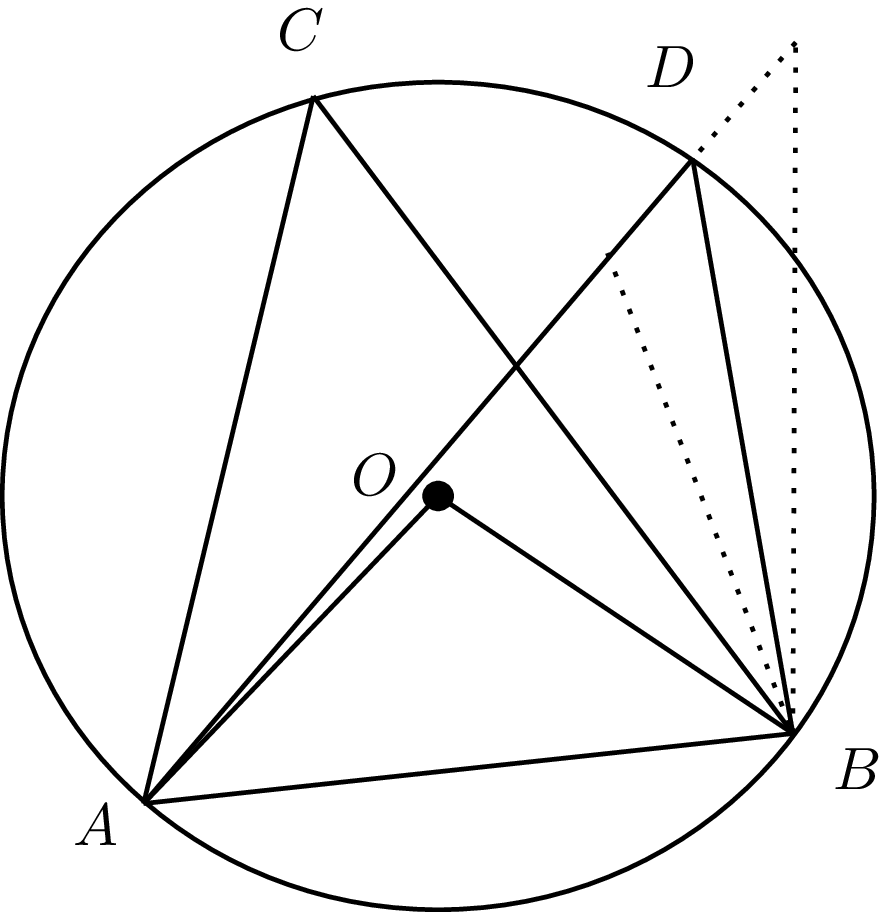

# 平面図形

## Q8 平面図形関連の語句について知っていますか?

??? success

    ### ユークリッド平面上の公理

    ```text
    ユークリッド幾何学
      ・平面やゆがみが存在しない空間の図形の性質を探求する学問
    
    非ユークリッド幾何学
      ・曲面やゆがみの存在する空間の図形の性質を探求する学問

    [非ユークリッド幾何学について]
      双曲幾何学
        --> 局面が鞍型(反り返っているような形:凹)である空間に相当
        --> 三角形の内角の和は常に180度未満となる
      
      楕円幾何学
        --> 球面のように凸な空間に相当する
        --> 三角形の内角の和は180度を越える
        --> 地球で考えて、北極と南極の2点を結ぶ経線を思い浮かべると
            与えられた2点を結ぶ線分は何本も引けてしまう
    
    [平面図形なので]
      ・ユークリッド幾何学の範疇では、以下の5つの公理が成立する
      ・平面図形の項で証明した事柄は、ユークリッド幾何学の範疇に限り、成り立つ
    
    [ユークリッドの5つの公準]
      --> 現代では公準と公理は同様なものとして扱われる
      1 任意の2点を結ぶ直線を引くことができる
      2 任意の直線は無限に延長することができる
      3 任意の点を中心に、任意の半径を持つ円を描くことができる
      4 すべての直角は等しい
      5 平行線の公理(プレイフェアの公理)
        --> 直線とその外側に1点が与えられたとき、
            その点を通る元の直線と平行な直線はただ1本存在する
        
        --> この公理と矛盾しないように「平行な直線」という言葉を定義すると
            それはどれだけ延長しても交わらない直線となる
        --> 平行な直線を、無限遠に延長すれば交わる直線とすれば、それは
            1本以上存在するので、公理と矛盾する
      
      [1について]
        2点P,Qがあったとき、P,Qを通る直線が引ける
    
    [定義]
      線分
        ・2つの点を通る直線の一部分。
          2点の間に挟まるすべての点からなり、2点自身も含む
      
      半直線
        ・直線の一部分
          1点を端として一方にだけ無限に伸びている直線
      
      直線
        ・ユークリッド幾何学では直線とはなにかは定義されない
        --> 直線とは以下の公理に矛盾しないようなものになる
      
      平行
        ・無定義述語
        ・平行な直線は、平行線公準の特徴を満たす
          平面上の二直線、或いは直線と平面、或いは平面と平面とが
        　どこまで延長しても交わらないこと
      
      有向線分
        ・線分のうち、始点と終点が区別され、線分に向きが与えられたもの
        ※有向線分AB ≠ BA

    [ユークリッド幾何学の9つの公理]
      1 等しいものに等しいものはまた互いに等しい
        --> 反射律と代入原理から、対象律や推移律を導く
        A = B ∧ B = C ⇒ A = C
      2 等しいものに等しいものが加えられれば全体は等しい
        A = B ⇒　A + C = B + C
      3 等しいものから等しいものが引かれれば、残りは等しい
        A = B ⇒ A - C = B - C
      4 不等なものに等しいものが加えられれば、全体は不等
        A > B ⇒ A + C > B + C
        >は、<, ≦, ≧に置き換えられる
      5 等しいものの2倍は互いに等しい
        A = B ⇒ 2A = 2B
      6 等しいものの半分は互いに等しい
        A = B ⇒ (1/2)A = (1/2)B
      7 互いにぴったり重なり合うものは互いに等しい
        --> 合同が等しいよりも狭い概念であることがわかる
        --> 面積が等しい(面積が同じ量である)
      8 全体は部分より大きい
        --> 大小関係は、同種の量に対して定義される
            (例　面積と辺の長さは比較できない, これは四則演算も同様)
      9 2直線は面積を囲まない
        --> 2点を結ぶ直線が2本あれば、直線の間に面積が生まれる
    
    ※9について
      2直線が面積を囲むとき、以下のようになる
      --> 以下のようにならないというのが公理
      --> つまり、与えられた2点を通る直線は1本だけ引くことができると言い換えられる
    
    [定理の導出: 平行でない二直線は、高々1点で交わる]

      とある直線と、直線外の点を通り、1つ目の直線に平行でない直線が交わらないとすると、
      どれだけ延長しても交わらない直線が2本以上(平行が1ケース目)存在してしまうことから
      これは平行線公準に矛盾する

      平行でない2直線が複数の点で交わると仮定すると、
      それらの点を結ぶ直線が、2本存在することになるので、
      公理9より1点しか存在しないことに矛盾する

      よって、平行でない2直線は高々1点で交わる
    
    [方針]
      さすがに、点とか面の定義までは必要に駆られない限り、本ページではやらない
    ```

    ### 対称角の定理

    ```text
    [定義:直角]
      直線が直線の上にたてられて接角を互いに等しくするとき
      等しい角の双方は直角。この時、上に立つ直線は、下の直線に対して
      垂線とよばれる

      直線角：直線によってできる角
      接角：異なる二つの直線角で、それぞれの角を挟む直線の1つを共有するもの

    [命題1]
      直線上にたてられた半直線が2つの角を作るなら
      それらは2つの直角か、あるいはその和は2直角になる

      半直線CDの端Dが直線ABに接するようにたてる
      この時、∠CDA = ∠CDBならば
      接角が互いに等しいため、二角は直角である


      一方の角が他方より小さい場合
      小さい角を∠CDBとし、点DにABの垂線EDをたてると
      ∠ADC + ∠CDB 
      = (∠ADE + ∠EDC) + ∠CDB
      = ∠ADE + (∠EDC + ∠CDB)
      = 2直角

    [対頂角の定理]
      2つの直線AB, CDが点Oで交わっているとする
      この時、互いに向き合った角を対頂角と呼称する

      対象角は等しいことを以下で示す

      直線CDに対して、直線ABが2つの角を作っているため
      ∠AOC + ∠ AOD = 2直角

      また直線ABに対して、直線DCが2つの角を作っているため
      ∠AOD + ∠DOB = 2直角

      よって、
      ∠AOC + ∠AOD = ∠AOD + ∠DOB
      公理3より、等しいものを引くことができるので
      ∠AOC = ∠DOB

      同様にして、∠AOD + ∠BOD = ∠BOD + ∠COBなどのようにすれば
      向き合った角が、等しいことが示された。

      ※面倒なので、これより先は直角(=90°)として議論する

    ```

    ### 平行線と同位角、錯角

    ```text
    [同位角]
      ・二つの直線に一つの直線が交わってできる角のうち、
        二つの直線の同じ側に位置する角

    [平行線公準の表現方法]
      第5公準について思い出す

      5 平行線の公理
      
      [i 平行線の公理]
      直線とその外側に1点が与えられたとき、
      その点を通る元の直線と平行な直線はただ1本存在する


      [ii 第5公準(本来はこちらの表現の方が原論に近い)]
      1直線が2直線に交わり、同じ側の内角の和を2直角より小さくするならば
      この2直線は限りなく延長された時、2直角より小さい角のある側において交わる

      [ii]を認めれば、同じ側の内角をそれぞれx, yとしたとき
      x + y < 180°ならば、二直線はx,yの側で交わるとできる

      [平行線の同位角に関する証明]
        平行な2直線AB, CDについて、直線EFと点P,Qでそれぞれ交わっているとする
        この時、∠EQD = x, ∠EPB = yと置くと
        対頂角の定理より　∠APQ = y
        また直線上にたてられた半直線が2つの角を作る時、その和は2直角になるため
        ∠BOQ = 180° - y
        ∠CQP = 180° - x

        この時、x > yと仮定すると
        直線EFの左側において
        内角の和は180° - x + yで180度より小さくなる
        よって、ABとCDは左側で交わることになるが、これは平行な2直線という
        仮定に矛盾する

        また、x < yと仮定すると
        直線EFの右側において
        内角の和は180° - y + xで180度より小さくなる
        よって、ABとCDは右側で交わることになるが、これも平行な2直線という
        仮定に矛盾する

        よって、x = yであり、平行線の同位角は等しくなる

        ※平行な二直線の同位角の証明をする過程で、x = yを示した。
          平行な二直線の錯角は、下図において
          xとy, 180°-yと180°- xとして示されるので、
          平行な二直線における錯角もまた等しい
    ```

    

    ```text
    [i]の正当性を確かめるべく、[i]⇔[ii]を導出する

      [事前準備]
      直線lが、二直線m,nに交わる時、次が成り立つ
      錯角が等しい⇒m,nは平行(交わらない)
        ※ただし、錯角とは平面上にある2直線についてほかの1本の直線が交わってできる
          角のうち斜め向かいに位置する角を言う

      錯角が等しいとき、m,nは点Pで交わると仮定する。
      この時、PBの延長線上にQを、BQ = APを満たすようにとると
      2辺とその間の角が等しいので、
      △PAB　≡　△QBA
      よって、∠QAB = ∠PBA
      直線が直線の上に建てられているので、∠QBA + ∠PBA = 180°
      錯角が等しいという条件より∠QAB = ∠PBA, ∠PAB = ∠QBAであることは分かっている
      よって、180° = ∠QBA + ∠PBA = ∠PAB + ∠QAB 
      従って、3点QAPは一直線上にあるため、2直線m,nは点Qでも交わる
      2直線が2点で交わるため、公理9に矛盾する
      よって、錯角が等しいならば、m,nは平行

      ※平行線の公理も、第5公準(ii)も使っていないことに注意
        第5公準を認めるなら、これでm,nが平行⇔錯角が等しいが示せる
        また、同値角が等しい⇒錯角が等しい（対頂角より）となるため
        m,nが平行⇔同値角が等しいも示せる
      
      [第5公準⇒平行線の公理]


      直線ABとAB上にない点Qについて考える
      Qを通る直線と直線ABとの交点をPとし、直線PQ上にX,Y
      (ただしXはABより上, YはABより下)をとる

      Qを通る直線CDを引く
      この時、事前準備より錯角が等しいならば、直線ABとCDは平行、
      つまり交わらないことになる
      よって、錯角が等しくなるように直線を引き
      平行線が1本以上存在することを示す

      示したいことはQを通りABと交わらない直線が高々１本であることなので
      AB // CDであるとき
      Qを通るCDと異なる任意の直線をEFとすると、
      ∠PQF ≠ ∠PQD ...(1)

      また、第5公準より、二直線の内側の角の和が180度未満であるとき、
      二本の直線は平行線ではなく、内側で交わるので

      対偶をとって、内側で交わらない(平行線)ならば、∠PQD + ∠BPQ ≧ πであり
      また、XYの逆側についても、∠CQP + ∠APQ ≧ πであると考えられる

      更に
      ∠PQD + ∠CQP = π, 
      ∠BPQ + ∠APQ = π
      AB // CDより錯角, 同位角が等しいため
      ∠BPQ = ∠CQP
      ∠APQ = ∠BPQ
      ∠BPQ = 180° - ∠PQD
      ∠APQ = 180° - ∠CQP

      よって、∠PQD + ∠BPQ = ∠PQD + ∠CQP = πとなる

      ここで、(1)より
      ∠PQF < ∠PQDと仮定すると
      ∠BPQ + ∠PQF < ∠BPQ + ∠PQD = πなので
      第5公準より、EFとABは交わる

      また、∠PQF > ∠PQDと仮定しても
      ∠EPQ + ∠QPA < ∠CQP + ∠QPA = πより
      第5公準より、EFとABは交わる

      従って、Qを通り、ABと平行な直線はCD以外にないことが示された

    [平行線の公理⇒第5公準]
      直線AB, CDについて、直線XYとの交点をP,Qとしたとき
      ∠BPQ + ∠PQD < πとなるように図示する

      この時、AB と CDが交わることを示したい

      Qを通る直線EFを∠EQP = ∠QPBを満たすようにとる(※)
      この時、錯角が等しいため、事前準備よりEFとABは平行になり交わらない

      平行線公理よりQを通り、ABと交わらない直線は高々1本であるため、
      ABとCDは交わり、この時交点は直線XYに関してB側になる
    
    ※任意の2点を通る直線を引くことができるということは第1公準によって保障されている
      --> 錯角が等しくなるような直線をひけるかという部分については
          図示すれば問題ないだろう
    ```

    

    ### 三角形の内角の和が二直角(180°)であることと、内対角の和 = 外角

    ```text
    直線BD上に存在する△ABCについて、ABに平行な直線CEを引く
    この時、∠BCE + ∠DCE = 180度になる

    平行な直線上の同位角と錯角は等しくなるため
    ∠ABC = ∠DCE
    ∠BAC = ∠ACE
    ∠BCE = ∠ACE + ∠ACBなので、
    ∠BAC + ∠ABC + ∠ACB = 180°
    また、上記より
    内対角(三角形の1つの外角と隣り合っていない二つの内角)の和は
    ∠BAC + ∠ABC = ∠DCE + ∠ACEであるため、
    外角と等しいことも導ける
    ```

    

    ### 三平方の定理

    ```text
    ∠C = 90°で, その対辺がcである直角三角形ABCにおいて
    a^2 + b^2 = c^2

    [証明]
      △ABCと合同な4つの三角形を下図のように並べると
      外側の図形は一辺がa+bの正方形となり, 
      内側の図形は、四辺が等しいので、正方形となる。
      内側の正方形の一辺をcとし、

      大きい方の正方形の面積をSとすると
      S = (a+b)² ...(1)
      S = (1/2)ab * 4 + c²
        = 2ab + c² ...(2)

      (1), (2)より
      (a+b)² = 2ab + c²
      ⇔ a² + b² = c²    
    ```

    

    ### 三角関数の定義(単位円ではない方)

    ```text
    0° < Θ < 90°の時、
    ∠A = Θ, ∠B = 90°となるような直角三角形に対して

    sinΘ = BC / AC
    cosΘ = AB / AC
    tanΘ = BC / AB

    [証明]
      単位円と三角関数の定義より、
      半径1の円(単位円)上の点は、動径Θであるとき、(cosΘ, sinΘ)という座標で表される。

      ここで、以下の２つの直角三角形について考える

      △AB'C'
      動径Θと、半径1の円に対応する
      頂点A(0,0), 頂点B'=(1,0), 頂点C'(cosΘ, sinΘ)
      ∠B' = 90°

      △ABC
      動径Θと、半径rの円に対応する
      頂点A(0,0), ∠B = 90°, C'は半径rの円周上に存在する

      ここで、動径が等しい以上、∠A' = ∠A = Θであり
      よって、二角が等しいので、△AB'C'∽△ABC
        --> 三角形の相似条件の証明については後述

      AC' : AC = 1 : rより、
      AB' : AB = cosΘ : rcosΘ
      B'C' : BC = sinΘ : rsinΘ

      よって、AB = rcosΘ, BC = rsinΘ
      cosΘ = AB / r = AB / AC = (底辺) / (斜辺)
      sinΘ = BC / r = BC / AC = (対辺) / (斜辺)と表せる

      ※座標から考えれば、∠B ≠ 90°の場合は
        当然AB = rcosΘになりえない
    ```

    

    ### 余弦定理(第二)

    ```text
    △ABCについて、頂点A,B,Cに対応する内角の大きさをそれぞれA,B,Cとし
    その対辺をa,b,cとしたとき

    a² = b² + c² - 2bccosA
    b² = c² + a² - 2cacosB
    c² = a² + b² - 2abcosC

    [証明]
      △ABCについて頂点Aから下ろした垂線と線分BCの交点をHとする
      B≦90°のとき、

      △AHBと、△AHCに対して三平方の定理を用いると
      cosB = BH / AB ⇔ BH = ccosB
      cosC = CH / AC ⇔ CH = bcosCより

      AH² = AB² - BH² = c² - (ccosB)² ...(1)
      AH² = AC² - CH² = AC² - (a - BH)² = b² - (a - ccosB)²

      (1), (2)より
      c² - (ccosB)² = b² - (a - ccosB)²
      ⇔ c² - c²cos²B = b² - (a² - 2accosB + c²cos²B)
      ⇔ c² - c²cos²B = b² - a² + 2accosB - c²cos²B
      ⇔ a² + c² = b²　+ 2accosB
      ⇔ b² = a² + c² - 2accosB

      90° < B < 180°のとき

      △AHBと△AHCに対して三平方の定理を用いると
      (※cosBのBは∠ABC --> △ABCの内角であることに注意)
      cos(π - B) = -cosB
      cos(π - B) = BH / AB, BH = -ccosB
      cosC = CH / AC, CH = bcosC

      よって、
      AH² = AB² - BH² = c² - (-ccosB)²
      AH² = AC² - CH²　= b² - (BC + BH)² = b² - (a - ccosB)²
      = b² - (a² - 2accosB + c²cos²B) 

      c² - c²cos²B = b² - a² + 2accosB - ²cos²B
      b² = a² + c² - 2accosB 

      よって、b² = a² + c² - 2accosB

      同様にして、頂点B, 頂点Cから垂線を下ろすと
      他二つの式も導ける
    ```

    

    ```text
    [第一余弦定理から解く]
      上図を使う。

      B ≦ 90°のとき、
      cosB = BH / c,  cosC = CH / bより(直角三角形と三角関数の関係性参照)

      a = BH + CH = ccosB + bcocC

      B > 90°のとき
      cos(π - B) = BH / c, BH = ccos(π-B) = -ccosB
      cosC = CH /b
      a = CH - BH = bcosC + ccosB

      よって、a = bcosC + ccosB
      同様にして
      b = acosC + ccosA
      c = acosB + bcosAも導ける

    a = bcosC + ccosBより

    a² = a*a
    = a(bcosC + ccosB)
    = b * acosC + c * acosB

    第一余弦定理の右辺を代入すると
    b = acosC + ccosA
    c = acosB + bcosAより
    acosC = b - ccosA
    acosB = c - bcosAなので

    = b * (b - ccosA) + c * (c - bcosA)
    = b² - bccosA + c² - bccosA
    = b² + c² - 2bccosA

    よって、a² = b² + c² - 2bccosA

    [使用例]
      三角形ABCについて、b =  3, c = 4, A = 60°のときのa

      ※△ABCについて、頂点A,B,Cに対応する内角の大きさをそれぞれA,B,Cとし
        その対辺をa,b,cとしている

      余弦定理より
      a² = b² + c² - 2bccosA
      = 9 + 16 - 24cos60°
      = 25 - 12 
      = 13

      a > 0より、a = √(13)
    
    [使用例2]
      三角形ABCにおいて、a = 4, b = 3, c = √13の時、角Cの大きさを求めよ

      余弦定理より
      c² = a² + b² - 2abcosC
      13 = 16 + 9 - 24cosC
      -12 = -24cosC
      cosC = 1/2
      三角形の内角より、0° < C < 180°
      よって、C = 60°
    ```

    ### sinを用いた三角形の面積公式

    ```text
    △ABCについて、頂点A,B,Cに対応する内角の大きさをそれぞれA,B,Cとし
    その対辺をa,b,cとしたとき

    △ABCの面積Sは
    S = (1/2)absinC = (1/2)bcsinA = (1/2)casinB

    [使用例]
      BC(a) = 3, CA(b) = 4, C = 30°である三角形の面積S

      S = (1/2)*3*4*sin30° = 3

      BC(a) = 5, CA(b) = 6, AB = 7(c)である三角形の面積S
      --> 余弦定理より

      a² = b² + c² - 2bccosAより
      25 = 36 + 49 - 84cosA
      25 = 85 - 84cosA
      84cosA = 60
      cosA = 60 / 84
      = 5 / 7

      sin²A = 1 - 25 / 49
      = 24 / 49

      sinA = ±2√6 / 7
      0° < A < 180°より
      sinA = 2√6 / 7

      S = (1/2)*b*c*sinA
      = (1/2)*6*7*(2√6 / 7)
      = 6√6
      --> ヘロン使った方がいいかもだけど。

    [証明: 対称性を使う]
      △ABCについて、頂点A,B,Cに対応する内角の大きさをそれぞれA,B,Cとし
      その対辺をa,b,cとする
      この時、任意の二辺と、その間の角について考える

      辺BC(a)を底辺とみると、 sinC = 高さ / bより、
      三角形の面積Sは、BC(a) * bsinC * (1/2) = (1/2)absinC

      二辺とその間の角であれば(つまり他の辺を底辺としても)
      この議論は成立するため文字を入れ替えて（対称性）
      S = (1/2)absinC = (1/2)bcsinA = (1/2)casinB
    ```

    ### 円周角の定理

    ```text
    円周角
      ・円周上のある一点から、この点を含まない円周上の異なる2点へ
        それぞれ線分を引いた時の、その二つの線分のなす角
      --> つまり、三点は全て円周上に存在する
    
    中心角
      ・円周上の2点と、円の中心を結んだ二つの線分のなす角

    [定理]
      ある弧に対する中心角は同一の弧の円周角の2倍
      同じ弧に対する円周角は全て等しい
    
    [証明: 円周角*2 = 中心角(中心角が180°未満)]
      1 円と、円周上の任意の箇所に頂点を持つ△ABCを図示する
      2 一辺を共有し(つまり同一の弧を持つように)、
        円の中心Oに頂点を持つ三角形になるように補助線を記載する
      
      今回はAC, BCの二つの線分がなす角を円周角とする
      よって、円周角∠ACB, 中心角∠AOBについて
      2∠ACB = ∠AOBであることを証明したい

      三角形ABCの内側に円の中心Oがある場合
      三角形ABCの辺上にOがある場合
      三角形ABCの外側に円の中心Oがある場合に分けて考えていく
    
      [i] 三角形ABCの内側にOがある場合
        図1のようにCOを通るような直線をひき、ABとの交点をDとする
        OC,OAは円の半径に当たるので、OC = OAで△AOCは二等辺三角形
        同様に、OB,OCも円の半径であり、OB = OCで△BOCも二等辺三角形

        よって、三角形の外角より
        ∠AOD = ∠ACO + ∠OAC = 2∠ACO
        ∠BOD = ∠OCB + ∠OBC = 2∠OCB
        ∠ACO + ∠OCB = ∠ACBより
        2∠ACB = ∠AOD + ∠BOD = ∠AOB

      [ii] 三角形ABCの辺上にOがある場合
        AO = BO = COより、
        △AOB, △COBはそれぞれOA = OB, OB = OCの二等辺三角形とわかる
        よって、∠OAB = ∠OBA, ∠OBC = ∠OCB
        三角形の外角より、
        ∠AOB = ∠OCB + ∠CBO = 2∠OCB
        Oは辺AC上に存在するので、∠OCB = ∠ACBより、
        ∠AOB = 2∠OCB
      
      [iii] 三角形ABCの外側にOがある場合
        図3のようにCOを通る直線をひき、円との交点をDとする
        この時、OD, OA, OC, OBは円の半径に当たるので
        △AOCはOA = OCの二等辺三角形
        △BOCもOB = OCの二等辺三角形
        △AODもOA = ODの二等辺三角形

        三角形の外角より
        ∠BOD = ∠OCB + ∠OBC = 2∠OCB
        ∠AOD = ∠OCA + ∠OAC = 2∠OCA

        よって、
        ∠AOB
        = ∠BOD - ∠AOD
        = 2∠OCB - 2∠OCA
        = 2(∠OCB - ∠OCA)
        = 2∠ACB

      よって、いずれの場合でも中心角は円周角の二倍となるため、
      ある弧に対する中心角は、同一の弧をもつ円周角の二倍となる

    [証明:同じ弧に対する円周角は等しい]
      辺ABを共有し、円周上のどこかに点をとる∠ACB, ∠ADB,
      加えて、中心角∠AOBについて考えると、
      円周角 = 中心角の半分より
      ∠ACB = 2∠AOB
      ∠ADB = 2∠AOB
      ∠ACB = ∠ADB 
    ```

    
    

    ```text
    [証明:中心角180度]
      円(中心O)と、円周上の任意の箇所に頂点を持つ△ABCを図示する
      頂点Cと反対側の弧ABを持つ、中心角、円周角について考え
      OCの延長線と、円周が交わる箇所をDとする

      OC,OA,OBは半径なので
      △AOCはOC＝OAの二等辺三角形
      △BOCはOC=OBの二等辺三角形
      よって、三角形の外角より、
      ∠AOD = 2∠ACO
      ∠BOD = 2∠BCO
      よって、∠AOB = 2∠ACBであり、
      中心角180度の場合でも、同一の弧を持つ場合中心角は円周角の2倍となる

      --> 中心Oである円と、直径ABを1辺に持ち、円に内接する二つの三角形
          △ABCと、△ABEについて考える
          円周角と中心角の関係性より
          ∠ACB = (1/2)∠AOB
          ∠AEB = (1/2)∠AOB
          よって、同じ弧に対する円周角は中心角180度の時も等しくなる

    [証明:180° < 中心角 ≦ 360°]

      中心Oである円と、円に内接する四角形ABCDについて考える
      ただし、求めたい円周角∠DBAは、∠DBA > 90°を満たす

      また、直線BOと、円周との交点をEとする
      既に、中心角が180°以下の場合については、証明が為されているため
      中心角AOEについて考えると
      ∠AOE = 2∠EBA
      中心角DOEについて考えると、
      ∠DOE = 2∠DBE
      ∠EBA + ∠DBE = ∠DBAであり
      ∠AOE + ∠DOEは∠DBAと同一の弧を持つ中心角であるため、
      180° < 中心角 ≦ 360°の時も、中心角は円周角の2倍となる

      --> 180度以下の時と同じように、既存の円周角と同じ側に点Fを取ると
          ∠DFA = (1/2) * 中心角
          ∠DBA = (1/2) * 中心角より、
          中心角が180度より大きい場合であっても、同じ弧を共有するならば
          円周角は等しくなる
    ```

    


    ### 円周角の定理の逆

    ```text
    4点A,B,C,Dについて、2点C,Dが直線ABについて同じ側に存在し、
    ∠ACB = ∠ADBならば、4点は同一円周上に存在する

    △ABCの外接円について考える
    
    Dが円の内部に存在し、∠ACB = ∠ADBであると仮定する
    ここで、円周角の定理より、直線ADと円の交点をEとすると
    ∠ACB = ∠AEB
    三角形の外角の性質より
    ∠ADB = ∠AEB + ∠EBDなので
    ∠AEB < ∠ADB。これは仮定と矛盾する

    Dが円の外部に存在し、∠ACB = ∠ADBであると仮定する
    同じく円周角の定理より、直線ADと円の交点をEとすると
    ∠ACB = ∠AEB
    三角形の外角の性質より
    ∠AEB = ∠ADB + ∠DBEなので
    ∠AEB > ∠ADB。これは仮定と矛盾する。

    よって、4点A,B,C,Dについて、2点C,Dが直線ABについて同じ側に存在し、
    ∠ACB = ∠ADBであるとき、Dも△ABCの外接円上に存在する。
    つまり、同一円周上に4点が存在している

    ※同時に、同一の弧ABと点Pを持つ場合
      円の内部に点Pを持つ場合の∠APB 
      > 円周上に点Pを持つ場合の∠APB
      > 円の外部に点Pを持つ場合の∠APBであることも示された
    ```

    

    ### 円に内接する四角形の向かい合う角の和

    ```text

    円と、その円に内接する対角線AD,BCが四角形の内部で交わるような
    四角形について考えるとき、(凸四角形であることも述べている)
    ∠A = ∠D, ∠B = ∠C
    つまり、向かい合う内角の和が180度になる

    [証明]

      線分OD, OAとなるような補助線を引く
      すると、∠Bの中心角と、∠Cの中心角の和が360度になることがわかる
      円周角は中心角の1/2なので、∠B + ∠C = 180°

      同様に、線分OB, OCとなるような補助線をひくと
      ∠A + ∠D = 180°が導ける

      また、∠C = 180° - ∠Bと変形できるため
      ∠Cは∠Bの外角と表現することもできる
    
    [逆: 向かい合う内角の和が180度である四角形は円に内接する]
      頂点AD, BCがそれぞれ対角となる四角形ABCDについて
      凸四角形であるとき(凹四角形である場合、特定の角の内角が180度を越えるので
      条件に当てはまる可能性はない)
      対角線AD,BCは四角形の内部で交わる
      ∠D = 180° - ∠Aであると仮定する
      ここで、円に内接するような四角形ABCD'について考えると
      (ただし、∠D'は対角線BCを挟んでAと反対側の円周上に取る)
      円に内接する四角形の向かい合う角の和は180度であるため、
      ∠D' = 180° -　∠A
      円周角の定理の逆より、2点が直線に対して同じ側に存在しており、
      角度が同一のため、∠Dと∠D'は同一円周上に存在する
      よって、∠Dは△ABCの外接円上に存在する。
      
      
    ```
    

    ### 正弦定理

    ```text
    △ABCについて、頂点A,B,Cに対応する内角の大きさをそれぞれA,B,Cとし
    その対辺をa,b,cとしたとき

    a / sinA = b / sinB = c / sinC

    また、三角形の外接円の半径をRとしたとき、
    a / sinA = b / sinB = c / sinC = 2R

    [使用例]
      △ABCについて、A = 45°, B = 60°, a = 4であるとき、bを求めよ
      ただし、△ABCについて、頂点A,B,Cに対応する内角の大きさをそれぞれA,B,Cとし
      その対辺をa,b,cとした

      正弦定理より
      4 / sin45° = b / sin60°
      4 / (1/√2) = b / (√3 / 2)
      4√2 = 2b / √3
      b = 2√6
    
    [証明1:円周角の定理より]
      a / sinA = b / sinB = c / sinC = 2R

      [i] A < 90°のとき
      BA'が外接円の直径(2R)となるようなA'をとると
      円周角の定理より、∠BAC = ∠BA'C

      三角関数の定義より
      sinA' = a / 2Rであるため、∠BAC = ∠BA'Cより
      sinA' = sinAなので、sinA = a / 2R

      [ii] A = 90°のとき
      sinA = 1であり、このときa = 2Rであるため、
      sinA = a / 2Rは成り立つ

      [iii] A > 90°のとき
      BA'が外接円の直径(2R)となるようなA'をとる
      円に内接する四角形の性質を考えれば
      向かい合う角の和は180°であるため、
      ∠BAC = 180° - ∠BA'C
      sin(π - Θ) = sinπcosΘ - cosπsinΘ = sinΘより
      sinA = sinA'
      sinA' = BC / BA' = a / 2Rより、
      sinA = a / 2R

      [i],[ii],[iii]より、
      sinA = a / 2R
      2R = a / sinA

      同様に、sinB, sinCについても場合分けを行うと  
        --> 三角形の面積の公式を認めた方が楽だと思う
      2R = b / sinB, 2R = c / sinC
      よって、
      a / sinA = b / sinB = c / sinC = 2R
    ```

    

    ```text
    [場合分けを行う代わりに: 三角形の面積の公式を使う(こっちの方が楽)]
      三角形ABCの面積Sは
      (1/2)bcsinA = (1/2)casinB = (1/2)absinCで表せる

      なお、退化していない三角形であるため、0° < A,B,C < 180°

      (左辺) = (中辺)について考えると
      (1/2)bcsinA = (1/2)casinB
      bsinA = asinB
      b / sinB = a / sinA ...(1)

      (中辺) = (右辺)より
      (1/2)casinB = (1/2)absinC
      csinB = bsinC
      c / sinC = b / sinB ...(2)

      (右辺) = (左辺)より
      (1/2)absinC = (1/2)bcsinA
      asinC = csinA
      a / sinA = c / sinC ...(3)

      (1),(2),(3)よりa / sinA = b / sinB = c / sinC
      円周角を用いている方法と合わせれば
      a / sinA = b / sinB = c / sinC = 2Rが得られる。


    ```

    ### 正接定理

    ```text
    ```

    ### 余弦定理、正弦定理から、合同条件を導く

    ```text
    [合同について]
      図形Aと図形Bは合同
      ⇔ 平行移動、対称移動、回転移動のみで、図形Aと図形Bがぴったり重なる

      ・合同という言葉には、
        辺や角、対角線や面積などが同じであるという意味が含意されると思われる
      
      [以下では、平面図形について考える]
      ・平行移動
        --> 図形上のすべての点を、一定の向きに一定の距離だけ移動する操作
      
      ・対称移動
        --> 平面上のある点を中心とし、点からの距離を保ったまま、
            図形上のすべての点を同じ角度だけ移動させる操作
      
      ・対称移動
        --> 平面上のとある直線に関して、
            線対称の位置にある点に、図形上のすべての点をそれぞれ移動させる操作
    ```

    ### 三角形の合同

    ```text
    [三角形の特徴]
      3辺(a,b,c), 3角(A,B,C)

    [三角形の合同条件]
      ・3組の辺が各々等しい(SSS条件)
      ・2組の辺とその間の角が各々等しい(SAS条件)
      ・1組の辺とその両端の角が各々等しい(ASA条件)
      ・2組の角とその間にない1組の辺が各々等しい(AAS条件)

    [合同条件の証明に関して]
      
      [i] 3組の辺が各々等しい三角形は一意(SSS条件)

        ※対辺：三角形においては頂点と向かい合っている辺をさす
        ※S = side(辺), A = Angle(角)

        頂点A,B,Cの対辺がそれぞれa,b,cである△ABCと
        頂点A',B',C'の対辺がそれぞれa',b',c'である△A'B'C'について考える
        この時、a = a', b = b', c = c'ならば

        余弦定理より、余弦は3つの辺で表せられる
        a² = b² + c² - 2bccosA
        b² = a² + c² - 2accosB
        c² = a² + b² - 2abcosC

        cosA = (b² + c² - a²) / 2bc
        cosB = (a² + c² - b²) / 2ac
        cosC = (a² + b² - c²) / 2ab

        △A'B'C'についても同様にすると、
        cosA = cosA', cosB = cosB', cosC = cosC'

        なお、三角形について考えているため、 0 < cosα < πであり
        このとき、角度αは一意に定まる
        よって、SSS条件が成立する ⇒ 3組の辺と、3つの角がそれぞれ等しい

        辺の長さと、角度の大きさ以外に、三角形を特徴づける情報はないため、
        3組の辺の長さが等しいならば、三角形は合同であるといえる
      
      [ii] 2組の辺とその間の角が各々等しい(SAS条件)

        a = a', b = b' C = C'ならば、
        c² = a² + b² - 2abcosC
        c'² = a'² + b'² - 2a'b'cosC'
        辺よりc,c' > 0なので、c = c'
        a = a', b = b', c = c'ならば、合同であることは、(i)で証明したため
        SAS条件が成立するならば、合同

      [iii] 1組の辺とその両端の角が各々等しい(ASA条件)
        a = a', B = B', C = C'ならば、三角形の内角の和は180°なので
        A = A'

        正弦定理より、
        a / sinA = b / sinB = c / sinCであるため
        b = b', c = c'とわかる。
        よって、ASA条件が成立するならば、合同
      
      [iv] 2組の角とその間にない1組の辺が各々等しい(AAS条件)
        A = A', B = B' b = b'または
        A = A', B = B' a = a'
        であれば、こちらも三角形の内角の和と、正弦定理より
        他2辺についてそれぞれ等しいことが導けるので、AAS条件ならば合同

        つまり、[iii], [iv]は
        2組の角と、1組の辺がそれぞれ等しいなら、合同と言い換えられる
    ```
    
    ### 直角三角形の合同条件

    ```text
    (i) 斜辺と1組の鋭角がそれぞれ等しい(RHA条件)
    (ii) 斜辺と他の1辺がそれぞれ等しい(RHS条件)

    [証明]
      (i)
        直角三角形より、2つの角と、1つの辺が判明していることになるため
        ASAないしはAAS条件に相当する。よって、合同

      (ii)
        斜辺ともう1辺がそれぞれ等しい
        直角三角形より、2つの辺と、1つの角が等しい場合に相当する
        三角形の内角の和を考えれば残る二つの角は鋭角であることが確定しているため

        二つの直角三角形△ABC, △A'B'C'について、
        a = a', b = b', ∠A = ∠A' = 90° とすると,
      （ただし小文字アルファベットは、大文字頂点の対辺）
        0 < B < 90°, 0° < C < 90°
        0 < B' < 90°, 0° < C' < 90°...(1)

        正弦定理より
        a / sinA = b / sinB = c/sinC ...(2)
        a' / sinA' = b' / sinB' = c'/sinC' ...(3)

        よって、 sinB = sinB'
        (1)より、角度は一意に定まるので、B = B'
        この時、C, cも一意に定まり、C = C', c = cとなるため合同
    ```

    ### 三角形の自由度

    ```text
    三角形の自由度は3
      ⇔ 三角形の特徴のうち、独立に選べるものの数は3つ
      
      ・ほとんどのケースで三角形に関して独立な3つの情報が与えられた場合、
        残りの情報も判明するが、SSA条件を考えると、
        三角形に対して独立な3つの情報が与えられている⇒三角形は一意に定まる
        という論理式は偽であることがわかる
    
    合同条件を思い出す
      ・3つの独立した情報が与えられたとき、三角形が一意に決定されていた
        (ただし、合同な図形は同様な図形とみなす)
    
    [外接円の半径Rと、2つの角A,Bが与えられた場合]
      --> 独立した3つの情報が与えられているため、三角形が決定されると考えられる

      内角の和より、C = C'とわかる。
      また、正弦定理より、
      a / sinA = b / sinB = c / sinB = 2R (Rは外接円の半径)
      
      よって、a = a', b = b', c = c'となるため、
      三角形ABCとA'B'C'の外接円が同一で、
      2つの角A,Bが等しいならば、二つの三角形は合同
    
    [その他]
      ・三角形の中線(頂点と対辺の中点を結んだ直線)や高さ
        角の二等分線なども独立した条件に含まれる
    
    [三角形の候補が2つになるケース(SSA; 2辺と1角)]
      合同条件を思い出すと、0 < cosα < πの範囲で、αが一意となるため
      三角形が一意に定まっていたことがわかる。

      二辺 a = a', b = b'と、∠A = ∠A' (Aは二辺の間ではない角)
      である場合は、

      正弦定理より
      a / sinA = b / sinB = c / sinCであるため
      sinBが一意に求まる。
      ただし、0 < sinB < πについて、Bの候補は2通りになる
      Bが定まればCが定まり、余弦定理でcも定まるので、
      三角形の候補は2通りになる

      ただし、辺の長さの条件から1通りに絞られるケースも存在する
        --> 三角形の成立条件より
    
    [SSAで1通りになるケース]
      鈍角三角形という情報が与えられているとき、sinBが一意に定まれば
      Bの候補は1通りになる
      (B以外が鈍角なら、sinBは第一象限, Bが鈍角なら第二象限に位置している)
      --> Bが定まると、Cが定まり、余弦定理でcも定まる
      --> 三角形の候補は1通り

      鋭角三角形という情報が与えられているとき、sinBが一意に定まると
      Bの候補は1通りになる(条件よりBは鋭角で、sinBは第一象限。)

    [独立した3つの情報ではないケース]
      3つの角が与えられた場合
        --> 残り1つの角は2つの角から決まるため、独立な情報は2つだけ

      外接円の半径Rとa,Aが与えられた場合
        --> 2R = a / sinAなので、独立な情報は2つだけ
    ```


    ### タレスの定理

    ```text
    円周上の2つの点を結ぶ線分が円の中心を含むなら、
    その2点と円周上の別の点とを結ぶ、2つの線分のなす角(円周角)は必ず直角

    --> 直角三角形の斜辺の中点は、その外接円の中心

    [証明]
    △ABCの外接円として、ABを直径に持つ円を描く。
    この時、∠AOB = 180°になるため、円周角の定理より
    ∠ACB = 90°　よって、△ABCは直角三角形
    ```

    

    ### 相似について

    ```text
    [相似について]
      図形Aと図形Bは相似
      ⇔ 平行移動、対称移動、回転移動、拡大縮小を行うと、図形Aと図形Bがぴったり重なる

      --> 合同条件と比べて、拡大縮小が増えている

    [三角形の相似条件]
      ・3組の辺の比が各々等しい
      ・2組の辺の比とその間の角の大きさが等しい
      ・2組の角が各々等しい
    
    [証明]
      三角形を特徴づけるのは、三辺の長さと、三角の大きさである

      合同条件より、以下の時、二つの三角形について
      三辺の長さと三角の大きさが等しくなる
      ・3組の辺が各々等しい(SSS条件)
      ・2組の辺とその間の角が各々等しい(SAS条件)
      ・1組の辺とその両端の角が各々等しい(ASA条件)
      ・2組の角とその間にない1組の辺が各々等しい(AAS条件)

      ここで、拡大縮小操作を行った場合、合同になるような
      二つの三角形について考える

      [i] 3組の辺が各々等しい
        頂点A,B,Cの対辺がそれぞれa,b,cである△ABCと
        頂点A',B',C'の対辺がそれぞれa',b',c'である△A'B'C'について考える
        この時、a = ka', b = kb', c = kc'ならば

        △ABCは1/k倍に拡大することで、SSS条件を満たす
        よって、3組の辺の比が各々等しいならば、
        拡大縮小操作を施すことで合同な図形になるので
        上記は相似条件として正しい
      
      [ii] 2組の辺の比と、その間の角がそれぞれ等しい
          a = ka', b = kb', C = C'ならば
          余弦定理より、
          (c')² = a'² + b'² - 2a'b'cosC

          c² = (ka')² + (kb')² - 2(ka')(kb')cosC
          = k²a'² + k²b'² - 2k²a'b'cosC
          = k²(a'² + b'² - 2a'b'cosC)
          = k²(c')²
          c > 0より、
          c = kc'

          よって、2組の辺の比と、その間の角がそれぞれ等しいならば
          3組の辺の比が各々等しくなるとわかるので、これもまた拡大縮小操作を
          施すと合同な図形になるとわかる。よって、上記も相似条件として正しい
      
      [iii] 2組の角がそれぞれ等しい
        A = A', B = B'ならば、三角形の内角の和は180°よりC = C'
        この時、拡大縮小操作を施せば、どこかのタイミングで
        1組の辺の大きさは等しくなる。よって、拡大縮小操作を施すと、
        ASA条件(1組の辺とその両端の角が各々等しい)を満たすので、
        上記は相似条件として正しい

    ```

    ### 三角形の面積比について

    ```text
    [定理]
      角を1つ共有する2つの三角形の面積比は、
      その角を作る２辺の長さの積の比に等しい

      --> S = (1/2)absinC = (1/2)bcsinA = (1/2)casinB
          を思い出せば、二辺とその間の角が面積に関係してくることがわかる
          角の大きさが同一なら、面積の差異に関係してくるのは辺*辺
    
    [相似比と面積比(三角形)]
      相似である以上、角の大きさは全て等しくなる。
      つまり、△ABC∽△A'B'C'について
      a : a' = M : N(つまり相似比M:N)の場合、 ...(1)

      三角形の面積公式を用いると、(△ABCの面積をS, △A'B'C'の面積をS'とする)
      S : S' = (1/2)absinC : (1/2)a'b'sinC = ab : a'b'
      相似である以上、三辺の比はそれぞれ等しくなるため、
      (1)より、S : S' = M*M : N*N = M² : N²
      面積について考えると、当然角の大きさは同一
      よって、二つの相似な図形において、面積比は相似比の二乗に相当する
    
    [三角形以外の図形に関する証明]
      1 多角形は三角形に分割可能
      2 図形をk倍に拡大すると、拡大、縮小移動を施した図形は相似であるため、
        各三角形の面積はk²倍になる。
      3 一般の図形は、無限に小さい長方形に分割でき、長方形もまた三角形に分割できるため
        図形をk倍に拡大すると、各長方形の面積はk²倍になり、全体の面積もまたk²倍となる

    [相似比と体積比]
      直方体の場合について考えると、直方体をk倍に拡大すると
      V = 縦*横*高さより、体積はk³倍になる
      一般の空間図形は無限に小さい直方体の集まりとみなせるので
      k倍に拡大すると、それぞれの直方体もk³倍される。
      よって相似比がa:bなら体積比はa³:b³
    ``` 

    ### 外接円の半径と三角形の面積の関係

    ```text
    3辺の長さa,b,cである三角形の外接円の半径をR, 面積をSとしたとき
    S = (abc) / 4R

    [証明]
     正弦定理より a / sinA = 2R
     sinA = a / 2R ...(1)

     三角形の面積公式より
     S = (1/2)bcsinA 
     sinAに(1)を代入して
     = (abc) / 4R
    ```

    #### ヘロンの公式

    ```text
    3辺の長さがa,b,cである三角形の面積Sは、
    s = (a + b + c) / 2と置くと
    S = √s(s-a)(s-b)(s-c)で計算できる

    [証明]
      三角形の面積公式を用いると
      S = (1/2)absinCで表せる

      sin²C + cos²C = 1より
      sin²C = (1 - cos²C)
      sinC = ±√(1 - cos²C)

      0° < C < 180°より、
      sinC = √(1 - cos²C)
      
      S = (1/2)ab √(1 - cos²C)

      余弦定理より
      c² = a² + b² - 2abcosC
      2abcosC = a² + b² - c²
      cosC = (a² + b² - c²) / 2abなので

      S = (1/2)ab√(1 - {(a² + b² - c²) / 2ab}²)
      = (1/2)ab√({4a²b² / 4a²b²} - (a²+b²-c²)² / 4a²b²)
      = 1/4√{ (2ab)² - (a²+b²-c²)²} ※2
      = 1/4√{ (2ab - {a²+b²-c²})(2ab + {a²+b²-c²}) }
      = 1/4√{-(a - b)² + c²}{(a+b)² - c²}
      = 1/4√{c² - (a - b)²}{(a+b)² - c²}
      = 1/4√(c-a+b)(c+a-b)(a+b+c)(a+b-c)
      = 1/4√(a+b+c)(a+b-c)(-a+b+c)(a-b+c)
      = √(1/16)(a+b+c)(a+b-c)(-a+b+c)(a-b+c)
      = √{(a+b+c)/2}{(a+b-c)/2}{(-a+b+c)/2}{(a-b+c)/2}
      s = (a + b + c) / 2より ※1
      = √s(s-c)(s-a)(s-b)
      = √s(s-a)(s-b)(s-c)

      ※1(a+b+c) / 2 - a = (-a + b + c) / 2
    
    [各辺の長さが無理数(√n)の場合]
    ※2より、
    S = 1/4√{ (2ab)² - (a²+b²-c²)²}
    = 1/4√{ 4a²b² - (a⁴ + b⁴ + c⁴ + 2a²b² - 2b²c² - 2a²c²)}
    = 1/4√{ 4a²b² - 2a²b² + 2b²c² +  2c²a² - (a⁴ + b⁴ + c⁴)}
    = 1/4√{ 2(a²b² + b²c² + c²a²) - (a⁴ + b⁴ + c⁴)}

    --> 2の倍数乗なので、うまく整理可能

    [例題]
      三辺の長さが5,6,7である三角形の面積

      s = (5+6+7)/2 = 9とおくと
      S = √9(9-5)(9-6)(9-7)
      = √9*4*3*2
      = √216
      = √6^3
      = 6√6

      三辺の長さが√5, √7, 3である三角形の面積

      S = 1/4√{2(5*7 + 7*9 + 9*5) - (25 + 49 + 81)}
      = 1/4√(286 - 155)
      = √(131) / 4
    ```

    ### 円に内接する四角形と2つの三角形の面積比

    ```text
    [定理]
      対角線ACと対角線BDが四角形の内部で交わるような
      円に内接する四角形について考えたとき
      二つの対角線の交点をEとすると

      AD*DC : AB*BC = |ADC| : |ABC| = DE : EB
      (※ただし|ADC|は△ADCの面積)

    [証明]
      sin(π-Θ) = sinΘと、円に内接する四角形の性質より
      sin∠ADC = sin∠ABC
      
      三角形の面積の公式を考えれば
      |ADC| = (1/2)*AD*DC*sin∠ADC
      |ABC| = (1/2)*AB*BC*sin∠ABCなので、

      |ADC| : |ABC| = AD*DC : AB*BC
      また、二つの三角形の底辺をACとすると、底辺が共通の三角形の面積の比は
      その高さの比に等しくなる

      この時、DEを斜辺に持ち、∠DFE = 90°となる△DFE
      同じく、BEを斜辺に持ち、∠BGE = 90°となる△BGEについて考えると
      ∠BEG = 180° - ∠DEA = ∠DEFより、
      二つの角が等しいため、△DFE∽△BGE
      高さの比 DF : BGと、DE : BEの比は等しくなるため、

      |ADC| : |ABC| = DF : BG = DE : BE

    ```

    


    ### ブラーマグプタの公式

    ```text
    円に内接する四角形ABCDにおいて、
    AB = a, BC = b, CD = c, DA = dとおくと四角形ABCDの面積は
    s = (a + b + c + d) / 2とおくと
    S = √(s-a)(s-b)(s-c)(s-d)

    [考え方]
      ヘロンの公式を思い出す
      dが限りなく0に近づくとき、ヘロンの公式と同様な形になる
    
    [証明1]
      求めたい面積は、△ABDと△CBD(対角線で分割された二つの三角形)の面積の和になる
      最終的に面積を辺の長さだけで表したいので
      三角形の面積の公式で用いたsinをcosにし、cosを余弦で辺の長さだけにしていく
      
      S = (1/2)adsinA + (1/2)bcsinC
      S² = {(1/2)adsinA + (1/2)bcsinC}²
      向かい合う内角なのでsinC = sin(π - A) = sinA
      = {(1/2)adsinA + (1/2)bcsinA}²
      = {(1/2)sinA(ad + bc)}²
      = (1/4)(sin²A)(ad + bc)²
      = (1/4)(1 - cos²A)(ad + bc)²

      cosを辺の長さに変換したいが、対角線BDは公式に存在しないため、
      BD²を2通りの方法で表現して
      a² + d² - 2adcosA = b² + c² - 2bccosC
      cosC = cos(π - A) = -cosAより
      a² + d² - 2adcosA = b² + c² + 2bccosA
      2(ad + bc)cosA = a² + d² - b² - c²
      cosA = (a² + d² - b² - c²) /  2(ad + bc)

      よって、
      (1/4)(1 - cos²A)(ad + bc)²
      = (1/4){(ad + bc)² - (1/4)(a² + d² - b² - c²)²}
      = (1/16){4(ad + bc)² - (a² + d² - b² - c²)²}
      = (1/16){2(ad + bc) - (a² + d² - b² - c²)}
      {2(ad + bc) + (a² + d² - b² - c²)}
      = (1/16)(2ad + 2bc + a² + d² - b² - c²)(2ad + 2bc - a² - d² + b² + c²)
      平方の差は因数分解できるので
      2ad + 2bc + a² + d² - b² - c²
      = (a+d)² - (b-c)²
      = {(a+d) + (b-c)}{(a+d) - (b-c)}

      2ad + 2bc - a² - d² + b² + c²
      = -(a-d)² + (b+c)²
      = {-(a-d) + (b+c)}{(a-d) + (b+c)}
      = (1/16){(a+d) + (b-c)}{(a+d) - (b-c)}{-(a-d) + (b+c)}{(a-d) + (b+c)}
      = (1/16)(a+b-c+d)(a-b+c+d)(-a+b+c+d)(a+b+c-d)
      s = (a + b + c + d) / 2より
      = (s-a)(s-b)(s-c)(s-d)

      S > 0なので
      S = √(s-a)(s-b)(s-c)(s-d)

    ```

    

    ```text
    [証明2]
      [i] 四角形ABCDがAD // BCの長方形であるとする
      この時、面積は ab
      s = (a + b + c + d) / 2と置くと
      s = a + b
      S = √(s-a)(s-b)(s-c)(s-d)
      = √(s-a)(s-b)(s-a)(s-d)
      = √(a²b²)
      = ab
      より、ブラーマグプタの公式の右辺は長方形の面積と一致する

      [ii] 円に内接する四角形ABCDについてAD,BCが平行でないとする
      この時、交点をEとし、EA = p, EB = qとおくと

      円に内接する四角形の性質より
      ∠BCD = 180° - ∠BAD = ∠EAB
      ∠ADC = 180° - ∠ABC = ∠EBA
      より、△EAB∽∠ECD

      よって、a : c = p : (q + b) = q : (p + d)なので
      pc = a(q + b) ...(1)
      qc = a(p + d) ...(2)

      (1) + (2)より
      (p + q)c = a(q + b + p + d) 
      c(p + q) - a(p + q) = a(b + d)
      (c-a)(p + q) = a(b + d)
      ADとBCは平行でないため c≠a
      p + q = a(b + d) / (c-a)

      (1) - (2)より
      c(p-q) = a(q + b) - a(p + d)
      c(p-q) + a(p - q) = a(b-d)
      p - q = a(b-d) / (c+a)

      相似な三角形の面積比は、相似比、ひいては辺の比の2乗であるため
      △EABの面積をT, △ECDの面積をT + Sとすると
      T : T + S = a² : c²

      よって、a²(T + S) = Tc²
      S = T(c² - a²) / a²

      ヘロンの公式を用いると、
      t = (p + q + a) / 2と置いたとき
      T = √t(t-p)(t-q)(t-a)なので

      T = √(1/16)(a+p+q)(-a+p+q)(a-p+q)(a+p-q)
      = (1/4)√{(a+p+q)(-a+p+q)(a-p+q)(a+p-q)}より、

       S = T(c² - a²) / a²
       = {(c² - a²) / 4a²}√{(a+p+q)(-a+p+q)(a-p+q)(a+p-q)}

       a + p + q
       = a + a(b + d) / (c-a)
       = {a(c-a) + a(b+d)} / (c-a)
       = a{(c-a) + (b + d)} / (c-a)

       -a + p + q
       = {-a(c-a) + a(b + d)} / (c-a)
       = a{(a-c) + (b+d)} / (c-a)

       a - p + q
       = a - (p - q)
       = a - (a(b-d) / (c+a))
       = {a(c+a) - a(b-d)} / (c+a)
       = a{(c+a) - (b-d)} / (c+a)

       a+p-q
       = a + (p-q)
       = a + (a(b-d) / (c+a))
       = a{(c+a) + (b-d)} / (c+a)

    よって、a²/(c-a)²が√の外にくくりだされるので
    {(c² - a²) / 4a²}√{(a+p+q)(-a+p+q)(a-p+q)(a+p-q)}
    = (1/4)√{(c-a+b+d)(a-c+b+d)(c+a-b+d)(c+a+b-d)}
    = (1/4)√{(-a+b+c+d)(a-b+c+d)(a+b-c+d)(a+b+c-d)}
    s = (a + b + c + d) / 2より
    = (1/4)√(1/16)(s-a)(s-b)(s-c)(s-d)
    = √{(s-a)(s-b)(s-c)(s-d)}
    ```

    

    ### 2つの円の位置関係

    ```text
    2つの円の半径をr_1, r_2とし、
    中心間の距離をdとすると

    d < |r_1 - r_2|の時、含まれる
    d = |r_1 - r_2|の時、内接する
    |r_1 - r_2| < d < r_1 + r_2の時、2点で交わる
    d = r_1 + r_2の時、外接する
    d > r_1 + r_2の時、離れている

    内接時と、外接時の図に着目すると
    確かに内接時には、大きな円の半径 - 小さな円の半径が中心間の距離になっている
    外接時には、二つの円の半径の和となっている。

    中心間の距離が
    含まれる < 内接する < 2点で交わる < 外接する < 離れているであることを考えると
    上記の不等式は下図からも自然

    [共通接線]
      2つの円の両方ともに接する円のこと
      5つのパターンについて、共通接線の本数は1本ずつ増加する
      円の交点の数は0 --> 1 --> 2 --> 1 --> 0と変化する

      ※一応、円と円の間を通らない接線を共通外接線
        円と円の間を通る接線を共通内接線と呼んで区別したりする
      
    --> 2つの円の半径が同じ場合、4パターンになる

    [例]
      x² + y² = 16, (x-3)² + (y-4)² = 1の位置関係

      r_1 = 4, r_2 = 1とおくと
      d = √(3² + 4²) = 5より
      d = |r_1 + r_2|なので、
      二つの円は、外接する
    ```

    

    ### 三角形の成立条件

    ```text
    三辺の長さが、a,b,cである三角形が存在する
    ⇔ a + b > c ∧ b + c > a ∧ c + a > b

    ※  
      a + b > c ⇔ b > c - a ⇔ a > c - b
      b + c > a ⇔ c > a - b ⇔ b > a - c
      c + a > b ⇔ a > b - c ⇔ c > b - a
      よって、
      a > |b-c|
      b > |a-b|
      c > |c-a|なので
      |b-c| < a < b+cと表現する場合もある

    [証明:三角形が成立する ⇒　三角不等式が成立する]
      頂点A,B,Cについて対辺a(BC),b(AC),c(AB)を持つ△ABCについて考える

      [i] △ABCが直角三角形の場合
        斜辺をaとすると
        a² = b² + c²
        = (b+c)² - 2bc
        2bc > 0より、
        a² < (b+c)²
        a > 0, b + c > 0より
        a < b + c

        斜辺でない辺b,cについても以下より
        a² - b² = (a+b)(a-b) < (a+b)²
        a² - c² = (a+c)(a-c) < (a+c)²
        
        c² < (a+b)²
        b² < (a+c)²
        a+b, a+c, c, bは正なので、平方根をとって
        c < a + b
        b < a + c

      [ii] それ以外の場合(∠Bは鋭角 or 鈍角になる)
        AからBCに下した垂線の足をHとおくと、三平方の定理より
        c² = AH² + BH² > BH²
        b² = AH² + CH² > CH²

        よって、c,b,BH,CHは非負なので
        c > BH, b > CH

        Hが辺BC内にある場合
        a = BH + CHより
        b + c > a
        
        Hが辺BC上にない場合
        a < BH + CHより
        a < b + c

        記号a,b,cを入れ替えても上記の証明は成立するため、
        対称性より、残り2本の三角不等式も導ける
        よって、三辺の長さが、a,b,cである三角形が存在する
        ⇒ a + b > c ∧ b + c > a ∧ c + a > b
    
    [証明: 三角不等式が成立⇒三角形が成立]
      |b-c| < a < |b+c|であるとき(三角不等式の別の表現方法)、
      B(0,0)を円の中心とした半径cの円O_1と
      C(a,0)を円の中心とした半径bの円O_2について考える

      この時、2つの円の位置関係より
      |b-c| < a < b + cならば、二つの円は2点で交わる

        ※或いは円の方程式で考えると以下になるので
        O_1: x² + y² = c²
        O_2: (x-a)² + y² = b²
        交わる座標を算出するため、二つの式を連立して解いて

        (x-a)² + (c²-x²) = b²
        x² - 2ax + a² + c² -x² = b²
        2ax = a² - b² + c²
        x =(a² - b² + c²) / 2a

        y² = c² - {(a² - b² + c²) / 2a}²
        = (2ac/2a + {(a² - b² + c²) / 2a})(2ac/2a - {(a² - b² + c²) / 2a})
        = (1/4a²)(a² + 2ac + c² - b²)(-a²+2ac-c²+b²)
        = (1/4a²)((a+c)²-b²)(-(a-c)²+b²)
        = (1/4a²)(a+c+b)(a-b+c)(-a+b+c)(a+b-c)

        三角不等式が成立するなら
        a+b > c, b + c > a, c + a>bより
        因数(a+c+b)(a-b+c)(-a+b+c)(a+b-c)はいずれも正
        よって、y² > 0より、交点のy座標は実数として2つ存在するので
        O_1, O_2は2点で交わる
        

      その交点の1つをAとおくと
      y座標の式を見るとわかる通り、交点座標(x,y)は直線BC上(つまりy = 0)上には
      存在しない。よって、Aは直線BC上にない点であるから
      AB = c, AC = b, BC = aを満たす三角形ABCが構成できる
    ```

    

    ### 角と辺の大小関係

    ```text
    [定理]
      三角形の頂点をA,B,Cとし、その対辺をそれぞれa,b,cとしたとき
      a < b ⇔ A < B
      a = b ⇔ A = B
      a > b ⇔ A > B
    
    [証明]
      cosについて、0° ~ 180°の範囲では、角度が大きくなるにつれ
      小さくなるため、
      A > B ⇔ cosA < cosB
      A = B ⇔ cosA = cosB
      A < B ⇔ cosA > cosB

      a² = b² + c² - 2bccosA
      b² = a² + c² - 2accosB

    [i] 
      a < bの時
      cosA = (b² + c² - a²) / 2bc
      cosB = (a² + c² - b²) / 2ac

      cosA - cosB
      = {a(b² + c² - a²) - b(a² + c² - b²)} / 2abc
      = (ab² + ac² - a³ - a²b - bc² + b³) / 2abc
      = {ab(b - a) + c²(a - b) + (b-a)(b²+ab+a²)}/ 2abc
      = (b-a){ab -c² + b² + ab + a²} / 2abc
      = (b-a){(a+b)² - c²} / 2abc
      = (b-a)(a+b+c)(a+b-c) / 2abc

      a,b,c > 0なので
      abc > 0, 
      a < bなので、b-a > 0
      a+b+c > 0,
      三角形の成立条件より、a+b-c > 0となるため
      cosA - cosB > 0
      よって、cosA > cosBなのでA < B

      a < b ⇒ cosA > cosB ⇒ A < Bが示された

      また、
      cosA - cosB > 0の時、
      b - a > 0であり b > aより、
      A < B　⇒ cosA > cosB ⇒ a < bも示される

    [ii]
      a = bの時
      cosA - cosB 
      = (b-a)(a+b+c)(a+b-c) / 2abc
      = 0 / 2abc
      = 0
      よって、cosA = cosB

      また、cosA = cosBの時、
      a + b + c, a + b - c, 2abcはいずれも正になるため
      b - a = 0となり、a = bと導ける

    [iii]
      a > bの時
      cosA - cosB
      = (b-a)(a+b+c)(a+b-c) / 2abc
      a + b + c, a + b - c, 2abcはいずれも正
      b - aが負となるため
      cosA - cosB < 0
      よって、cosA < cosBなので、A > B

      また、cosA < cosBの時、
      a + b + c, a + b - c, 2abcはいずれも正になるため
      b - a < 0より、b < aが導ける

    [i] ~[iii]より
      三角形の頂点をA,B,Cとし、その対辺をそれぞれa,b,cとしたとき
      a < b ⇔ A < B
      a = b ⇔ A = B
      a > b ⇔ A > B
    
    --> コツはcosA - cosBを辺の長さだけで表現し
        角度と辺の関係性を導くことにある
    ```

    ### 辺と角の大小関係2

    ```text
    A < 90° ⇔ a² < b² + c²
    A = 90° ⇔ a² = b² + c²
    A > 90° ⇔ a² = b² + c²

    [証明?]
      cosA = (b² + c² - a²) / 2bcより

      A < 90°ならばcosA > 0
      bc > 0なので、b² + c² > a²。逆もしかり
      
      A = 90°ならばcosA = 0
      bc > 0なので、b² + c² = a²。逆もしかり

      A > 90°ならばcosA < 0
      bc > 0なので、b² + c² < a²。逆もしかり


    ```

    ### 円の接線は接点を通る半径に⊥

    ```text
    [定義]
      円: ある１点からの距離が等しい点の集まり
      円の中心：その１点のこと
      円の接線：円と１点のみで交わる直線
      接点：円と接線の交わる点
      ２つの直線が互いに垂直：直線の一方を平行移動させたとき、直角となる
    
    [定理]
      円の接線 ⇒ 接点を通る半径に垂直である

    [証明]
      点Oを中心とする円に、点Aのみで直線lが接しているとする。
      この時、lと直線OA(接点を通る円の半径)が為す角が∠A≠90°であると仮定する

      直線lに点Oから垂線を下ろし、接線との交点をBとすると
      直線lと直線OBが為す角は、∠B = 90°


      ( ユークリッド平面上の公理より
        平行でない直線はただ１点で交わるので
        二つの直線がOを通ることから AとBは異なる点である
        よって、OBは接点を通る直線ではなく、)
      △OABを考えると∠B = 90°より、∠A < 90°

      ※三角形の大小関係よりa(辺OB),b(辺OA),o(辺AB)をA,B,Oの対辺であるとすると
      a(OB) < b(OA) ⇔ ∠A < ∠ B であるため
      OB < OA
      
      しかし、仮定より、円と接線はAのみで接しているため、
      OA < OBであり、よってこれは矛盾する。

      従って、前述の仮定は誤りであり、∠A = 90°
      つまり、円の接線と接点を通る円の半径は垂直であることが示された。
  
    ```

    ### 接弦定理

    ```text
    接線と弦の作る角は、その弦に対する円周角と等しい

    [証明]
      接線と弦の作る角が、鋭角、直角、鈍角の場合についてそれぞれ証明する
      --> 幾何学的に証明するので、この3つの境界で図形の性質が変わるため

      接点をA, 弦をAB, 円周角を∠ACBとし、
      接線上に、直線ABについて点Cの反対側に点Dを取る
      つまり、現在円の接線はADで、接線と弦の作る角は∠BADになる

      [i] ∠BADが鋭角の場合
        AEが直径となるように点Eを円周上にとると
        接点を通る円の半径と、接線は直角であるため
        ∠EAB = 90° - ∠BAD ...(1)
        またタレスの定理より、∠EBAは直角
        よって
        ∠EAB = 90° - ∠AEB ...(2)
        (1),(2)より
        ∠BAD = ∠AEB
        円周角の定理より
        ∠AEB = ∠ACBなので
        ∠BAD = ∠ACBとなり、接弦定理が示された
      
      [ii] ∠BADが直角の場合
        ABが直径になるように点Bを円周上に取った時、
        接点を通る円の半径と、接線は直角になるため、∠BAD = 90°となる
        この時、タレスの定理より∠ACB = 90°
        よって、∠BAD= ∠ACBより、接弦定理が示された
      
      [iii] ∠BADが鈍角の場合
        直線ADについて、直線BAと反対側に、点Eを取る
        鋭角の場合の接弦定理より、∠CAE = ∠CBA
        ∠ACB = 180° - ∠CBA - ∠BAC
        = 180° - ∠CAE - ∠BAC
        = ∠BAD
        よって、∠ACB = ∠BADより、接弦定理が示された

      [i] ~ [iii]より、接線と弦の作る角が0° < N° < 180°
      の場合について、接線と弦の作る角と、その弦の円周角は一致する

      ※感覚的には、円周角を限りなく、接線と弦の作る角に近づけていくと
        重なることからわかる
    
    [接弦定理の逆]
      C,Dが直線ABに対して、異なる側に存在し、
      ∠ACB = ∠DABであれば
      直線ADは三角形ABCの外接円と接する

      三角形ABCの外接円の接線上に、点Eを適当にとる
      接弦定理より∠ACB = ∠EAB
      仮定より∠DAB = ∠ACBなので
      ∠EAB = ∠DAB
      D,EはABに関して同じ側に存在するので、A,D,Eは一直線上に存在する
      よって、直線ADは円の接線である
      --> 違う側ならABから見たときの回転の向きが違うので一直線上に存在することは
          保証されない
    ```

    

    
    ### 平行四辺形関連

    ```text
    [平行四辺形]
      2組の向かい合う辺がそれぞれ平行な四角形
    
    [平行四辺形の性質]
      2組の向かい合う辺がそれぞれ等しい⇒平行四辺形
      2組の向かい合う角がそれぞれ等しい⇒平行四辺形
      対角線がそれぞれの中点で交わる⇒平行四辺形
      1組の向かい合う辺が等しくて平行⇒平行四辺形

    [証明:2組の向かい合う辺がそれぞれ等しい⇒平行四辺形]
      四角形ABCDについてACに対角線をひくと
      底辺ACを共有する二つの三角形△ABCと△CDAについて考えることができる

      この時、2組の向かい合う辺がそれぞれ等しいならば
      BC = AD
      AB = CD
      底辺ACを共有しているので、AC = AC
      よって、三辺の長さが等しいためSSS条件より
      △ABC ≡ △CDA
      この時、∠BAC = ∠DCAであり、錯角が等しいため、AD // BC
      同様に、AB // CD
      よって、四角形ABCDは2組の向かい合う辺がそれぞれ平行な四角形になるので平行四辺形
    
    [証明:2組の向かい合う角がそれぞれ等しい⇒平行四辺形]
      四角形ABCDについて考える。この時、
      ∠Aと∠C, ∠Bと∠Dが向かい合う角であるとする

      よって、前件より∠A = ∠C, ∠B = ∠D
      四角形の内角の和は360°であるため、
      2∠A + 2∠B = 360°より
      ∠A + ∠B = 180°
      ∠C + ∠D = 180°
      この時、線分BCをC側に延長し、点Eを通る直線BEを考えると
      ∠C + ∠DCE = 180°(一直線上より)

      よって、∠DCE = ∠Dより、錯角が等しいのでAD // BC

      また、同様に線分CDをD側に延長し、点Fを通る直線CDを考えると
      一直線上より、∠D + ∠ADF = 180°
      よって∠C = ∠ADF = ∠Aより
      錯角が等しいので、AB // CD
      四角形ABCDは2組の向かい合う辺がそれぞれ平行な四角形になるので平行四辺形

    [証明:対角線がそれぞれの中点で交わる⇒平行四辺形]
      四角形ABCDの対角線AC, BDが
      AO = CO, BO = DOである、点Oで交わるならば

      対頂角より、∠DOA = ∠BOCであり
      2辺とその間の角がそれぞれ等しいので、△DOA ≡ △BOC
      また同じく∠AOB = ∠CODであり
      2辺とその間の角がそれぞれ等しいので△AOB ≡　△COD

      よって、∠DAO = ∠BCOよりAD // BC
      ∠OAB = ∠OCDよりAB // CD
      四角形ABCDは2組の向かい合う辺がそれぞれ平行な四角形になるので平行四辺形
    
    [証明: 1組の向かい合う辺が、等しくて平行⇒平行四辺形]
      △ABCと△CDAにおいて、BC = ADならば
      平行線上の錯角は等しいので∠DAC = ∠ACB
      よって、2辺とその間の角がそれぞれ等しいので
      △CDA ≡ △ABC
      従って、∠BAC = ∠DCAであり
      錯角が等しいので、BA // CD
      四角形ABCDは2組の向かい合う辺がそれぞれ平行な四角形になるので平行四辺形
    
    [平行四辺形⇒の方]
      2組の向かい合う辺がそれぞれ平行な四角形⇒
      四角形ABCDについて、AD // BC, AB // CDならば
      平行な二直線の錯角は等しいので、
      ∠DAC = ∠ ACB, ∠DCA = ∠BAC, またACに対角線を引くと
      2辺とその間の角がそれぞれ等しいので、△ABC ≡ △CDA

      合同な図形の各辺の長さは等しいため
      BC = AD, AB = CD, よって、
      平行四辺形ならば2組の向かい合う辺がそれぞれ等しくなる ...(i)

      ⇒2組の向かい合う角がそれぞれ等しくなる
      合同な図形の各角の大きさは等しいため
      ∠ADC = ∠ABC
      BDに対角線を引けば同様に、
      △ABD ≡ △CDBとなり
      ∠DAB =∠BCDも示せる
      よって、平行四辺形なら、2組の向かい合う角がそれぞれ等しくなる...(ii)

      ⇒対角線がそれぞれの中点で交わる
      △AODと△COBについてAD // BCより
      錯角が等しいため∠ADO = ∠CBO
      錯角が等しいため∠DAO = ∠BCO
      (i)より、AD = BC
      よって、1辺とその両端の角が等しいので
      △AOD≡△COB
      よって、AO = CO, OD = OBであり、
      対角線がそれぞれの中点で交わっていることがわかる ...(3)

      ⇒1組の向かい合う辺が等しくて平行
      2組の向かい合う辺が平行⇒2組の向かい合う辺がそれぞれ等しいため、
      1組の向かい合う辺が等しくて平行をこれは満たす
    ```

    

    ### 方べきの定理

    ```text
    [定理: タイプ1]
      円周上に点A,B,C,Dがある時、AB, CDが円の内部の点Pで交わるなら
      PA*PB = PC*PD

    [定理: タイプ2]
      円周上に点A,B,C,Dが存在し、AB, CDが円の外部の点Pで交わるなら
      PA*PB = PC*PD
    
    [定理:タイプ3]
      円周上に点A,B,Cが存在し、直線ABとCにおける接線がPで交わるなら
      PA*PB = PC²
    
    [タイプ1: 証明]
      円周角の定理より、
      ∠PAC = ∠PDB
      ∠PCA = ∠PBD
      であり、二角が等しいため
      △PAC ∽ △PDB

      よって、PA : PD = PC : PBより
      PA * PB = PC * PD
    
    [タイプ2: 証明]
      円に内接する四角形の性質より
      ∠CDB = 180° - ∠CAB
      ∠ABD = 180° - ∠ACD

      よって、∠PAC = 180° - ∠CAB = ∠CDB
      ∠PCA = 180° - ∠ACD = ∠ABD
      よって、二角が等しいため
      △PAC ∽ △PDB
      (PはAB,CDの延長線上に存在しているため∠CDB = ∠PDB, ∠ABD = ∠PBD)

      相似である図形の各辺の比は等しいので
      PA : PD = PC : PB
      PA * PB = PC * PD
    
    [タイプ3: 証明]
      接弦定理より、接線と弦の作る角とその弦の円周角は等しいため
      ∠PCA = ∠PBC
      P,A,Bは一直線上に存在するため、∠CPA = ∠CPB
      よって、二角が等しいため
      △PCA ∽ △ PBC

      相似である図形の各辺の比は等しいため
      PC : PB = PA : PC
      PB * PA = (PC)²
    ```

    

    ```text
    [座標で統一的に導く]
      PA×PBが傾きによらず定まることを言えれば、
      パターンわけせずとも任意の場合について証明できる
      
      円C: x² + y² = r²,
      点P(p,0)とし、
      点Pを通る直線lと円Cとの交点をそれぞれA,Bとおく
      なお、1点で交わる場合は、A = Bと考える
      この時、lの傾きをkとすると、y = k(x-p)

      上記の条件を仮定しても、一般性を失わない
      ・傾きは固定されていないので、直線と円の位置関係は一般的なものとして扱える
      ・上図全体に対して平行移動操作、回転操作を施しても、円と直線の相互関係
        (交点の位置、距離の関係等)には影響が出ない
      ・円の拡大縮小に関しては、半径が未知数なので問題がない

      lとCの方程式からyを除去すると

      x² + {k(x-p)}² = r²
      x² + k²(x² -2px + p²) = r²
      (1 + k²)x² -2k²px + p²k² - r² = 0

      Aのx座標をα, Bのx座標をβとおくと
      2次方程式の解と係数の関係より

      α + β = 2k²p / (1 + k²)
      αβ = (p²k² - r²) / (1 + k²)

      ここで、lとx軸が為す角をΘとおくと
      cosΘ = |p-α| / PA
      cosΘ = |p-β| / PB

      よって、
      PA = |p-α| / cosΘ
      PB = |p-β| / cosΘ

      PA*PB
      = (|p-α|*|p-β|) / cos²Θ

      1/cos²Θ = 1 + tan²Θ
      tanΘ = 傾きkより

      = (1+k²)(|p-α|*|p-β|)
      = (1+k²)(|p²-(α+β) + αβ|)
      = (1+k²)(|p²-2k²p / (1 + k²) + (p²k² - r²) / (1 + k²)|)
      = (|(1+k²)p² - 2k²p  + (p²k² - r²)|)
      = |p² - r²|
      = |(p-r)(p+r)|

      -r < p < rであるとき、pは円の内部に存在し
      = -(p-r)(p+r) = (r-p)(p+r)
      p < -r,  r < pであるとき、pは円の外部に存在し
      = (p-r)(p+r)

      従ってPA*PBは傾きによらずに決まる
      幾何における証明に当てはめると
      |p| < rの時、タイプ1
      |p| > rで交点が2つ存在する時、タイプ2となり
      |p| > rで交点が1つしか存在しない場合は、タイプ3となる
        (PA, PBの方をタイプ3でいうPCとする)
      ※|p| = rの時は、PA or PBが0になる
    ```

    

    ### 多角形の内角の和

    ```text
    [定理]
      n角形の内角の和は180° * (n-2)
    
    [証明]
      n角形の1つの頂点から対角線を引くと、隣り合った点に対しては
      対角線は引けないため、n-3本の対角線が引ける

      よって、多角形はn-3 + 1個の三角形に分割される
      三角形の内角の和は180度なので、
      n角形の内角の和は、180°{(n-3) + 1} = 180°*(n-2)
    ```

    ### 多角形の外角の和

    ```text
    [外角]
      辺を延長した直線と、別の辺のなす角
    
    [三角形の外角の和]
      三角形の1つの外角は内対角の和に等しいため
      三角形の外角の和は、内角の和*2に等しい
      よって、180° * 2 = 360°
    
    [n角形の外角]
      辺を延長した直線に、別の辺（直線）がたてられていると見立てると

      内角と外角の和は、180度(2直角)になる
      頂点がn個あるので、内角と外角の総和は、180*n°
      内角の総和は、180(n-2)なので、

      外角の総和は、180°*n - 180°(n-2) = 360°
    ```

    ### 正五角形の対角線

    ```text
    [正多角形の定義]
      すべての辺が等しく、全ての角が等しい

    [正n角形 --> 円に内接する]
      すべての三角形には外接円が存在する※1

      よって、正n≧4角形について考えると、
      正n角形はすべての角が等しいため、円周角の定理の逆より
      直線と同じ側に存在する2点についてそれぞれ考えれば、
      それらの点が同一円周上に存在していることがわかる

      頂点A_1, A_2, ..., A_n 正n角形(n≧4)について、
      直線A_1A_2について、A_3~A_nまでの中から2個選ぶ各組合せについて
      それぞれ4点が同一円周上に存在していることがわかる

      この時、2つの円の位置関係より異なる円が
      3つ以上の円周上の点を共有する可能性はないため
      (2つの円の方程式を連立方程式で解いてもいい)
      (例: ABCDとABCEがそれぞれ円の同一円周上にある時、2つの円は同一)

      同様に、A_1A_2以外の直線についても議論すると、
      正n角形について任意の4点のなす四角形の外接円は同一となる

      よって、全ての頂点が同一の外接円の円周上にあるため
      正n角形は円に内接している

    [正五角形の対角線の長さが等しい]
      正五角形の内角の和は、180°*(5-2) = 540°
      すべての角が等しいため、一角あたりの角度は108°と考えられる

      ここで、正五角形の各頂点を時計回りにA,B,C,D,Eとすると
      AB = AEは正n角形の性質より等しい。
      よって、△EABはAE = ABの二等辺三角形であるため
      ∠AEB = ∠ABE = (180° - 108°) / 2 = 36°
      他の角も同様に考えると、各頂点から伸びた2つの対角線が
      頂点の角度を3等分し、そのそれぞれが36°であることがわかる

      三角形の角と辺の大小関係より
      向かい合った角が等しいならば、互いの辺も等しいので
      2つの底角が72°の三角形は二等辺三角形になる
      よって、AD = AC = BE = BD = CEより
      正五角形の対角線の長さはどれも等しい

    ```
    
    

    ### トレミーの定理

    ```text
    [定理]
      円に内接する四角形ABCDにおいて
      AB*CD + AD*BC = AC*BD
      (対辺同士の積の和は、対角線の積の和)
    
    [例]
      円に内接する四角形の性質より、長方形は向かい合う内角の和が180°なので
      円に内接する。

      よって、縦a, 横bとすると
      a*a + b*b = (対角線)²
      (対角線)² = a² + b²

      --> トレミーの定理を使うことで、三平方の定理が証明可能
    
    [例2]
      1辺の長さが1の正五角形の対角線の長さx
      正五角形の対角線の長さはどれも等しいため、

      1*1 + 1*x = x²
      x² - x - 1 = 0
      x = (1±√1+4) / 2
      x > 0より
      x = (1+√5) / 2
    

    [例3]
      正三角形ABCとその外接円上の点Dについて
      AD + CD = BDであることを証明せよ

      トレミーの定理より、
      AD*BC + CD*AB = AC*DB
      正三角形より、AC = BC = AB
      よって、
      AD*AB + CD*AB = AB*DB
      AB(AD + CD) = AB(BD)
      AD + CD = BD
    
    [例4]
      正七角形について、異なる2頂点を結ぶ線分の長さは3通り存在する
      これを長い順にa,b,cとすると
      1/c = 1/a + 1/b(正七角形調和と呼ばれる)であることを証明せよ

      [証明]
      正七角形の頂点を12時の位置を基準として
      反時計回りにA,B,C,D,E,F,Gとし
      四角形ABDGについて考える

      正七角形は円に内接するので、
      この4点も同一円周上に存在する。
      よって、トレミーの定理が使えるので

      AB*GD + AG*BD = AD * BG
      この時、
      a = AD = GD
      b = BG = BD
      c = AG = ABであるため
      ※1つ隣の頂点を結んだ線分がc,
        2つ隣がb, 3つ隣がaとなる。七角形なので、3つ隣への対角線は1つだけ

      ac + bc = ab
      両辺をabcで割ると
      1/c = 1/b + 1/aとなる
    ```
    


    ```text
    [トレミーの定理の証明]
    対角線AC, BDが四角形の内部で交わるような円に内接する四角形ABCDについて
    対角線BD上に、∠DAM = ∠BACとなるような点Mをとる

    円周角の定理より
    ∠ADB = ∠ACB
    二角が等しいことから
    △ADM∽△ACB

    よって、相似比より
    AD : AC = DM : CB = AM : AB
    AD*BC = AC*DM ...(1)

    また同じく円周角の定理より∠ABD = ∠ACDであるため
    ∠CAD = ∠CAM + ∠DAM
    ∠BAM = ∠BAC + ∠CAM
    より、∠CAD = ∠BAM

    同じく二角が等しいことから
    △ABM∽△ACD

    よって、相似比より
    AB : AC = BM : CD = AM : AD
    AB * CD = AC*BM ...(2)

    (1),(2)より
    AD*BC + AB*CD = AC*DM + AC*BM = AC(DM + BM)
    DM + BM = DBより
    AD*BC + AB*CD = AC*DB
    となり、トレミーの定理が得られた。

    [方針]
      補助線を一本ひくことで、相似な三角形が2つ現れる
      不要な交点を消すように、相似比を使ってトレミーの定理を導く    
    ```
    

    ### 内接円の半径と三角形の面積

    ```text
    内接円の半径は、三角形の面積Sを用いて
    S = (r/2)(a + b + c)

    [証明]
    頂点A,B,Cについて、対辺a,b,cをもつ任意の三角形ABCについて考える

    円の中心をOとし、半径をrとおく
    接点を通る円の半径と接線は垂直なので
    辺に対して垂線を下ろすと
    △OAB,△OAC,△OBCの面積についてそれぞれ考えたとき、
    rは三角形の高さに相当することがわかる

    よって三角形ABCの面積をSとすると
    S = |ABC| = |OAB| + |OAC| + |OBC|
    = (rc) / 2 + (rb) / 2 + (ra) / 2
    = r(a + b + c) / 2
    = (r/2)(a + b + c)

    ※ただし|ABC|をABCの面積とする

    [例]
      三辺の長さが3,4,5である三角形ABCの内接円の半径を求めよ

      この三角形の面積は直角三角形であるため3*4/2 = 6
      6 = (r/2)(3 + 4 + 5)
      6 = 6r
      r = 1 
      半径は1

    [例]
      三辺の長さが5,6,7の三角形ABCの内接円の半径
      ヘロンの公式より s = (5+6+7) / 2 = 9の時
      S = √s(s-a)(s-b)(s-c)
      = √9*4*3*2
      = 3√3 * 2√2
      = 6√6
    
      6√6 = (r/2)(5+6+7)
      6√6 = 9r
      r = (2√6) / 3
    
    [直角三角形ならば、面積を使う必要はない]
      --> 三辺の長さが3,4,5である三角形ABCの内接円の半径を求める

      円Oの接線BCの接点をP
      円Oの接線ACの接点をQ
      円Oの接線ABの接点をRとおく

      この時、接点を通る円の半径と接線は垂直であることから
      四角形OPCQは1辺rの正方形になる

      よって、
      AQ = 3 - r

      また、同じ点から引いた2本の接線の長さは等しくなるので※2

      AR = 3 - r
      RB = 5 - (3-r) = 2 + r
      BP = 2 + r
      PC = 4 - (2+r) = 2-r
      PCはrでもあるため
      r = 2 - r
      2r = 2
      r = 1
      よって、三角形ABCの内接円の半径は1

      --> 三角形の外接円
    ```

    


    ### すべての三角形には外接円が存在する(外心の定義より※1)

    ```text
    [外心(定義)]
      ・三角形の外接円の中心
      ・円はとある点(中心)から、等しい距離にある点の集まりなので
        外心と円に内接する多角形の各頂点の距離は等しくなる
    
    [定理]
      三角形の外心 = 3つの辺の垂直二等分線が交わる点
    ```

    ### 同じ点から引いた2本の接線について、接点までの長さは等しい※2

    ```text
    とある点をPとし、二つの接線の接点をそれぞれS,T
    Pと円の内部を通る直線について、円との交点をA,Bとすると
    方べきの定理のパターン3より

    (PS)² = PA * PB = (PT)²
    よって、(PS)² = (PT)²
    PS > 0, PT > 0より
    円の外部の適当な点から引いた２本の接線について、接点までの長さは等しくなる

    ```

    ### 連比の性質(比についても含む)

    ```text
    [比例]
      変数x,yが0でない定数aを用いて
      y = axと書かれるとき、yはxに比例する。または正比例するという
    
    [比]
      ・2つ以上の0ではない数の比例関係を示したもの
        例) 2つの数a,bの比は a:bと表され、a対bという風に読む。

      ・この時、aを前項、bを後項といい
        前項と後項を入れ替えたもの、つまりb:aを元の比の逆比、または反比という

      ・3数以上の場合は、a:b:cのようにあらわし、連比という
    
    [比の値]
      ・比a:bに対して、分数a/bを比の値という
      ・比の値とはbを単位量としたときのaの大きさ(割合)である
    
    [関係性]
      ・a:bとc:dの2つの比の値が等しいとき、a : b = c : d
        つまり、この時、a/b = c/dと書き直せる。
        よって、ad = bc
        また、a : b = c : dのような式を比例式という
      
      ・上述の通り、比例式の内側の項(内項)と外側の項(外項)を掛け合わせたものが
        等しくなるという性質が成立する

      ・比例y = kxが成り立つとき、y:xの比の値y / xと比例定数kは等しい
        ともいえる
    
    [例]
      a/d = b/e = c/f = k
      a = dk, b = ek, c = fk
      a,b,cはd,e,fをそれぞれk倍したものなので、以下のようにあらわせる
      a : b : c = d : e : f

      上記の性質を正弦定理に当てはめると
      a / sinA = b / sinB = c / sinC = 2Rより
      a : b : c = sinA : sinB : sinC


    ```

    ### 三角形(もしくは平行線)と辺の比の定理

    ```text
    [三角形と辺の比]
      △ADEと△ABCについて考える
      ただし、DE // BCで、ADB, AECは一直線上に存在する

      この時
      AB : AD = AC : AE = BC : DE ...(1)
      AD : DB = AE : AC ...(2)
      AB : DB = AC : CE ...(3)
    
    [証明]
      △ABCと△ADEについて
      共通な角より∠BAC = ∠DAE
      同位角より∠ABC = ∠ADE
      二角が等しいので、△ABC∽△ADE ...(i)

      (i)より相似な図形の辺の比は等しいので
      AB : AD = AC : AE = BC : DE

      点Eを通り、直線ABに平行な直線と、BCとの交点をFと置く。この時、
      △ADEと△EFCについて
      AB // EFより
      ∠DAE = ∠FEC
      DE // BCより
      ∠AED = ∠ECF
      二角が等しいので△ADE∽△EFC ...(ii)

      よって、AD : EF = AE : EC
      また、AB // EF, DE // BFより
      四角形DEBFは平行四辺形。よって
      DB = EF, DE = BF ...(iii)

      よって、AD : DB = AE : EC

      (i),(ii)より△ABC∽△EFC
      よって相似な図形の辺の比は等しいので
      AB : EF = AC : EC ...(iv)

      (iii),(iv)より
      AB : DB = AC : CE

    [平行線と線分の比]

      3本の直線l,m,nと
      2つの直線o,pが交わる場合において
      loの交点をA
      moの交点をB
      noの交点をC
      lpの交点をD
      mpの交点をE
      npの交点をFとすると

      AB : DE = BC : EF = BE : CF
      AB : AC = DE : DF
      BC : EF = AC : DF
    
    [導出]
      直線pと平行で、点Aを通る直線と、直線l,m,nで囲われた図形について考えると
      平行線の同位角より相似な図形と平行四辺形が登場することから
      三角形と辺の比に落とし込むことができる。
      よって、
      AB : DE = BC : EF
      AB : AC = DE : DF
      BC : EF = AC : DF
    ```

    

    ### 三角形と辺の比の逆

    ```text
    △ADEと△ABCについて考える
    ただし、DE // BCで、ADB, AECは一直線上に存在する

    この時、AD : AB = AE : AC = DE : BC
    ⇒ DE // BC

    2組の辺の比とその間の角が等しいので
    △ADE ∽　△ ABC
    よって∠ADE = ∠ABC
    同位角が等しいのでDE // BC
    ※同位角が等しい⇒平行は上の方で証明している

    ------------------

    AD : DB = AE : EC
    ⇒ DE // BC

    直線DEと点Cを通り、ABに平行な直線との交点をFとする
    △ADEと△CFEについて
    平行線の錯角より∠DAE = ∠ FCE
    対頂角より∠AED = ∠ CEF
    よって、二角が等しいので△ADE ∽ △CFE

    相似な図形の辺の比はそれぞれ等しいので
    AD : CF = AE : CE
    仮定よりAD : DB = AE : ECなので
    DB = CF
    よって、一組の辺が等しく平行であるため
    四角形DBCFは平行四辺形
    よって、DE // BC

    ------------------

    ※AD : AB = DE : BCの場合
      相似条件を満たさない
      実際DEと同じ長さの線分をひけば反例になる 


    [平行線と線分の比の逆]
      AB : AC = DE : DF
      ⇒平行移動した直線で相似の図形を見つける

      AB : BC = DE : EF
      ⇒　また平行移動した直線を書く
          三角形の辺の比と同様に考える(平行四辺形を作る)
    ```
    

    ### 内角の二等分線に関する公式

    ```text
    [定理]
      頂点A,B,Cと、その対辺a,b,cを持つ任意の三角形に対して
      ∠Aの二等分線をfとし、二等分線とBCとの交点をDとすると
      以下が成り立つ。※ただし、BD = d, CD = eとする

      c : b = d : e ...(1)
      (c+b)f = 2cbcos(A / 2) ...(2)
      f² = cb - de ...(3)
    
    [(1)の証明: 二等分線と辺の比の証明]
      頂点Cを通り直線ABに平行な直線と、直線ADとの交点をEとおく
      この時、平行線の錯角より
      ∠BAD = ∠DEC
      ∠ABD = ∠DCE
      二角が等しいので△ABD ∽ △ECD

      相似な図形の辺の比は等しくなるので
      AB : CE = BD : DC
      ここで、二等辺三角形よりAC = CEなので
      AB : AC = BD : DC
      つまり、c : b = d : eが示された

    [2の証明 : 面積に着目した二等分線の公式]
      (c+b)f = 2cbcos(A/2)
      
      ※とある三角形の面積を|ABC|のように表記する
      三角形の面積公式より、
      |ABC| = (1/2)cbsinA

      |ABD| = (1/2)cfsin(A/2)
      |ADC| = (1/2)bfsin(A/2)

      よって、
      (1/2)cbsinA = (1/2)cfsin(A/2) + (1/2)bfsin(A/2)
      cbsinA = (b+c)fsin(A/2)

      二倍角の公式より
      sinA = 2sin(A/2)cos(A/2)なので

      2cbsin(A/2)cos(A/2) = (b+c)fsin(A/2)
      2bccos(A/2) = (b+c)fとなったため、証明完了

      --> 倍角の公式を用いて、両辺が綺麗にまとまっている
    
    [証明3: 角の二等分線の長さについて]
      三角形ABDについての余弦定理を用いると
      cos(A/2) = (c² + f² - d²) / 2cf
      公式2より: 2bccos(A/2) = (b+c)f　なので
      cos(A/2) = (b+c)f / 2bc

      よって、
      (c² + f² - d²) / 2cf = (b+c)f / 2bc

      2cf(b+c)f = 2bc(c² + f² - d²)
      f²(b+c) = b(c² + f² - d²)
      cf² = bc² - bd²
      
      公式1より
      c : b = d : eなので
      bd = ce
      よって、
      cf² = bc² -cde
      f² = bc - deであり、公式は示された

    [証明3: 別解(公式1,2が要らないのでこっちの方が自然)]
      △ABCの外接円とADとの交点をEと置くと
      円周角の定理より∠ABD = ∠AEC
      二等分線より∠BAD = ∠EAC
      よって二角が等しいので
      △ABD ∽ △AEC

      相似比より
      c : AE = f : b
      f*AE = bc
      f*(f + DE) = bc
      f² + f*DE = bc

      ここで方べきの定理より
      d*e = f*DEなので
      f² + de = bc
      f² = bc - de
    ```

    

    ### 外角の二等分線

    ```text

    ※外角と図について考えるとき、辺の大小関係に注意する

    頂点A,B,Cと、その対辺a,b,cを持つ任意の三角形に対して
    ∠Aの外角の二等分線fと、直線BCとの交点をDとする
    この時、

    c:b = BD : DC ...(1)
    |c-b|f = 2cbcos(A/2) ...(2)
    f² = BD*DC - cb ...(3)

    ※内角と同様、二等分線に平行な線を引くのが肝
      後は求めたい結論から考えていくのもいい

    [(1)の証明]
      点Cを通り、直線ADと平行な直線とBAとの交点をEとおく
      (BAをA方向に延長した直線上にFをとる)
      平行線間の錯角、同位角より
      ∠FAD = ∠AEC
      ∠DAC = ∠ACE
      ADは二等分線より
      ∠FAD = ∠DACなので、∠AEC = ∠ACEであり
      △EACはAE = ACの二等辺三角形

      この時、三角形と辺の比の定理により
      AD // ECなので
      BE : EA = BC : CD ...(i)
      BA : BE = BD : BC ...(ii)
      (i),(ii)より連比の性質を使うと

      BE / EA = BC / CD
      BE = (BC*EA) / CD 
      BA / BE = BD / BC
      BA / (BC*EA / CD) = BD / BC
      (BA*CD) / EA = BD 
      BA / EA = BD / CD

      AE = ACなので
      BA : AC = BD : CD

      つまり、c : b = BD : CDとなり、定理は示された
    
    [(2)の証明]
    ```

    

    ### 角の二等分線の定理の逆

    ```text
    [定理]
    △ABCについてBC上に点Dを取り、
    AB : AC = BD : CDの時∠BAD = ∠CAD

    [証明]
      ABに平行で点Cを通る直線とADとの交点をEとする
      この時△ABDと△ECDについて
      平行線の錯角より∠BAD = ∠CED ...(1)
      対頂角より∠BDA = ∠CDE
      二角が等しいので△ABD∽△ECD
      
      よって
      AB : EC = BD : CD

      仮定より
      AB : AC = BD : CD

      なので、EC = AC
      二等辺三角形より∠CAD = ∠CED ...(2)
      (1),(2)より
      ∠BAD = ∠CADと導かれた

    [定理:外角の二等分線の逆]
      △ABCについてBC上に点Dをとり
      AB:AC = BD : CDならば
      ADは、∠Aの外角の二等分線
      (※ABについて、Bと反対側にA'をとる)

      点Cを通り、直線ABと平行な直線と、ADとの交点をEとする
      この時、△ABDと△ECDについて
      共通な角より∠ADB = ∠EDC
      AB // CEより平行線の同位角で、∠BAD = ∠CED
      よって△ABD ∽ △ECD

      相似な図形の辺の比は等しいので(仮定と合うように導く)
      AB : CE = BD : CD
      仮定より、AB : AC = BD : CD
      よって、AC = CEより
      △ACEは二等辺三角形であり、∠CAE = ∠CEA
      また平行線の錯角より
      ∠BAC = ∠ACE
      よって
      ∠A'AE = 180° - ∠CAE - ∠BAC
      = 180° - ∠CEA - ∠ACE
      = ∠CAE
      よって、∠AA'E = ∠CAEより
      ADによって外角が二等分されているので、
      ADは∠Aの外角の二等分線
    ```

    


    ### スチュワートの定理

    ```text
    任意の△ABCについて、それぞれの頂点の対辺をa,b,cとしたとき
    辺BC上にPをとると、
    b²*BP + c²*CP = a(BP*CP + AP²)

    [証明]
      ∠APB = Θとおくと、∠APC = 180°-Θ

      この時、
      cos∠APB = (AP² + BP² - c²) / 2AP*BP
      cos∠APC = (AP² + CP² - b²) / 2AP*CP

      cos(180° - Θ) = -cosΘより
      (AP² + BP² - c²) / 2AP*BP = -{(AP² + CP² - b²) / 2AP*CP}
      CP(AP² + BP² - c²) = -BP(AP² + CP² - b²) 
      BP + CP = aより
      (CP + BP)AP²　+ CPBP² + BPCP² = c²CP + b²BP
      (CP + BP)AP²　+ (CP + BP)CPBP = c²CP + b²BP
      a(AP² + BP*CP) = c²*CP + b²*BPとなるため、定理は示された
    
    [意味]
      ・三辺が判明している△ABCと∠Aの二等分線APに対して、
        AP, BP, CPのいずれか一つが判明すれば、残りも求まる
      ・スチュワートの定理はその都度、余弦から導けばいい


    [一般化であると考えられる]
      [中線定理]
      PがBCの中点Mであるとき
      b²*BM + c²*BM = a(BM*BM + AM²)
      (b² + c²)BM = 2BM(BM² + AM²)
      b² + c² = 2(BM² + AM²)
      --> 中線定理が導かれた

      [角の二等分線の定理3]

      ∠BAP = ∠CAPの時、APは∠Aの二等分線になる
      この時、角の二等分線の定理よりAP² = bc - BP*CPであった
      これはスチュワートの定理から導ける

      [スチュワートの定理]
      b²*BP + c²*CP = a(BP*CP + AP²)
      b²*BP + c²*CP = (BP+CP)(BP*CP + AP²)
      (BP+CP)AP² =  b²*BP + c²*CP - (BP+CP)(BP*CP)
      AP² = (b²*BP + c²*CP) / (BP+CP) -(BP*CP)
      ここで、APが∠Aの二等分線であることから、c : b = BP : CPより
      b*BP = c*CP
      BP = (c*CP) / b
      CP = (b*BP) / c

      (b²*BP + c²*CP) / (BP+CP)
      = (bc*CP + bc*BP) / (BP + CP)
      = bc

      よって、AP² = bc - BP*CP
    ```

    


    ### 中線定理

    ```text
    ・スチュワートの定理の特殊ケースといえる
    ・余弦定理からも導ける

    [定理]
      任意の△ABCについて、A,B,Cの対辺をそれぞれa,b,c
      BCの中点をMとすると

      AB² + AC² = 2(AM² + BM²)が成立する
    
    [意味合い]
      AB,AC,BC,AMのうち、3つがわかれば残り1つも決まる

    [使用例]
      MをBCの中点としたとき、AB = 4, BC = 6, CA=5
      この時、AMは?

      AB² + CA² = 2{(BC/2)² + AM²}より
      41 = 2{9 + AM²}
      23 = 2AM²
      AM = √(23/2)
      = √(46) / 2
    
    [証明]
      スチュワートの定理の特殊ケースなので、∠AMB = Θとすることで
      同様に解くことができる

      ∠AMB = Θとおくと
      △ABMについて余弦定理より
      cos∠AMB = (AM² + BM² - AB²) / 2AM*BM
      cos∠AMC = (AM² + CM² - AC²) / 2AM*MC
      -cos∠AMC = cos∠AMB, BM = CMより

      (AM² + BM² - AB²) / 2AM*BM = -(AM² + BM² - AC²) / 2AM*BM
      (AM² + BM² - AB²) = -(AM² + BM² - AC²)
      2AM² + 2BM² = AB² + AC²
      AB² + AC² = 2(AM² + BM²)
    
    [逆は成立しない]
      A(a,b), B(-c,0), C(c,0)の時
      AB² = (a+c)² + b²
      AC² = (a-c)² + b²
      AB² + AC² = 2(a² + b² + c²)
      ここで、P(x,0)とすると
      AP² = (a-x)² + b²
      BP² = (x+c)² 

      この時、x = 0, a-cならば
      AB² + AC² = 2(AP² + BP²)
      P(0,0)の時、確かにPはBC上の中点となるが、
      P(a-c,0)の場合も満たしてしまう。よって、反例が存在するため、逆は成立しない
    
    [座標平面で証明する]
      A(a,b), B(-c,0), C(c,0), M(0,0)としても
      三角形の形状を決定しないので一般性を失わない

      この時、
      AB² + AC² = (a+c)² + b² + (a-c)² + b²
      = 2(a² + b² + c²)
      2(AM² + BM²) = 2(a² + b² + c²)
      よって、AB² + AC² = 2(AM² + BM²)


    
    [図形と一般性]
      一般性を損なう場合
        ・特定の条件や状況にのみ当てはまるような座標の設定を行う場合
        ・たとえば、三角形に対して特定の角が30°であると限定してしまったり
        ・円に内接する四角形と限定してしまったり
      
      一般性を損なわない場合
        ・座標の設定は証明の簡便さを助けるためのもので
          証明の根幹となる部分には影響しない

      今回の場合
        ・三角形を決定づけるのは、辺の長さと角度である
        ・今回の場合、A(a,b), B(-c,0), C(c,0)としても
          三角形の性質は決定されない※a,b,cは未知数
        
        ・頂点B,Cをx軸上に置くことで計算は簡単になっている
          ⇒しかし、三角形が任意の形状をとることを妨げてはいない
        
        ・実際、A(a,b)であるため、
          どのような形状の三角形も作成することができる
        
        ・回転や平行移動を行っても、三角形の形状には影響がないことを思い出せば
          (-c,0), (c,0)とx座標を等しくすることが、
          任意の三角形という前提を壊さないことがわかる
          ⇒例えば1°回転させれば、x座標は異なる
        
        ・M(0,0)というのは、幾何でいうMをBCの中点とするという表現と同一
        
    [座標平面の使いわけ]
      ・角度に関する情報を扱いたい場合
        座標平面では形状を決定してしまうため困難
      ・初頭幾何の方がよさげ
    ```

    ### 一辺を共有する三角形の面積

    ```text
    △ABCについて、頂点AからBC上に線分を引き、その交点をDとする
    線分AD上に内分点Pをとったとき、
    △ABP:△ACP = △ABD:△ACD = BD:CD

    [証明:内分のみ]
      △ABDと△ACDについて
      |ABD| = (1/2)AD*BD*sin∠ADB
      |ACD| = (1/2)AD*CD*sin(180°-∠ADC) = (1/2)AD*CD*sin∠ADB

      よって|ABD| : |ACD| = BD : CDであるため
      実際の面積はそれぞれ比例定数kを用いてBD*k, CD*kとおける

      △BDPと△CDPも同様にして
      |BDP| : |CDP| = BD : CDであり
      実際の面積はそれぞれ比例定数lを用いてBD*l, CD*lとおける
      ※ただし、Pが内分点であるため、k,lは正の実数で、k > l

      |ABP| = |ABD| - |BDP|より
      = BD(k - l)

      |ACP| = |ACD| - |CDP|より
      = CD(k-l)
      
      よって
      |ABD| : |ACP| = BD(k-l) : CD(k-l) = BD : CD
    
    [証明：内分でも外分でも可能]

      [外分]
      △ABCについて、線分BC上に点Dを取り、
      直線BCについて、Aと反対側、かつ直線AD上に点Pをとる
      この時△ABPと△ACPの面積比は
      底辺APを共有していることから、高さの比と等しくなる

      ここで、それぞれDB,CDを斜辺とする直角三角形について考えると
      直角のほかに、対頂角が等しくなるので、2つの三角形は合同
      よって、高さの比と、BD : CDは等しくなるので
      面積比もBD : CD

      [内分]
        外分の場合と同様。
        BD,CDを斜辺とする直角三角形について考えて
        直角のほかに、対頂角が等しくなるので、合同
        よって、相似な図形が出来上がるので高さの比と、BD:CDが等しくなって
        面積比もBD:CD
    ```

    

    ### チェバの定理

    ```text
    [定理]
      任意の三角形△ABCについて、任意の点O(Oは三角形の外部にあってもよい)をとり
      直線AOとBC, BOとCA, COとABとの交点をそれぞれD,E,Fとする
      この時、(AF/FB)*(BD/DC)*(CE/EA) = 1

      (三角形を一周しながら辺の比をとり、掛けていくと1になる)
    
    [使用例]
      任意の三角形△ABC内に点Pをとり
      APとBCの交点をD, BPとACの交点をE, CPとABの交点をFとする
      さらに、以下の比が成り立つとする。この時、CE:EAを求めよ
      AF:FB = 1:2
      BD:DC = 3:2

      比の値に直すと
      AF/FB = 1/2
      BD/DC = 3/2
      よって、チェバの定理より

      (AF/FB)*(BD/DC)*(CE/EA) = 1なので
      (1/2)*(3/2)*(CE/EA) = 1
      CE/EA = 4/3

      比の形に直して
      CE:EA = 4:3
    
    [証明:点Pが△ABC内にある場合]

      任意の三角形△ABC内に点Pをとり
      APとBCの交点をD, BPとACの交点をE, CPとABの交点をFとする

      この時、
      |ABC| = |APC| + |BPC| + |APB|

      一辺を共有する三角形の面積公式より
      |APC| : |BPC| = AF : FB
      |APB| : |APC| = BD : DC
      |BPC| : |APB| = CE : EA

      よって
      (AF/FB)*(BD/DC)*(CE*EA)
      = (|APC|/|BPC|)*(|APB|/|APC|)*(|BPC|/|APB|)
      = 1
    
    [証明:点Pが△ABC外にある場合]
      任意の三角形△ABC外に点Pをとり
      APとBCの交点をD, BPとACの交点をE, CPとABの交点をFとする

      この時も、一辺を共有する三角形の面積公式より
      AF : FB = |APC| : |BPC|
      BD : DC = |APB| : |APC|
      CE : EA = |BPC| : |APB|

      よって、(AF/FB)*(BD/DC)*(CE*EA) = 1

      ※点Pが△ABC外にある場合について、相似な図形内に
        高さと求めたい辺の比が現れていることがわかりやすいように下図を設けた
    ```

    

    ### メネラウスの定理

    ```text
    [定理]
      任意の三角形ABCと直線lに対して
      直線lとBC,CA,ABの交点をそれぞれD,E,Fとしたとき

      (AF/FB)*(BD/DC)*(CE/EA) = 1
      ※直線lが三角形と共有点を持つ必要はない

    [証明]
      任意の三角形ABCと直線lに対して
      直線lとBC,CA,ABの交点をそれぞれD,E,Fとする。
      ※この時、(AF/FB)*(BD/DC)*(CE/EA)が1であることを証明したい

      直線AB上に、点Cを通り、直線EFと平行になるような点Gをとる
      平行線と三角形の辺の比の関係性より
      BD : DC = BF : FG
      EA : CE = AF : FG

      よって
      BD/DC = BF/FG
      CE/EA = FG/AF

      (AF/FB)*(BD/DC)*(CE/EA)
      = (AF/FB)*(BF/FG)*(FG/AF) = 1
    ```

    

    ### チェバとメネラウスの関係性

    ```text
    [メネラウスの定理を用いてチェバの定理を導く]
      △ABCについて、AD,BE,CFが交わる箇所をPとする

      この時、BEを直線に見立てるとメネラウスの定理より
      (AF/FB)*(BC/CD)*(DP/PA) = 1 ...(1)

      またCFを直線に見立てるとメネラウスの定理より
      (CE/EA)*(AP/PD)*(DB/BC) = 1 ...(2)

      
      (1) / (2) = 1なので
      (AF/FB)*(DB/CD)*(CE/EA) = 1
      よって、チェバの定理が示された
    
    ```

    ### チェバの定理の逆

    ```text
    [チェバとメネラウスの違い]
      チェバ --> 内分点は1 or 3個(外分点の数は2 or 0)
      メネラウス --> 内分点は2 or 0個
    
    [定義]
      共点：n直線が1点で交わること
      共点条件：共点となるための条件
    
    [定理]
      △ABCの辺BC,CA,ABとその延長線上にそれぞれ頂点でない点D,E,Fがあるとする
      これらが以下の条件3つをすべて満たすとき、3直線は1点で交わる

      1 D,E,Fのうち、△ABCの辺上に存在するのは1 or 3点
      2 AD,BE,CFのうち2本が交わる
      3 (AF/FB)*(BD/DC)*(CE/EA) = 1
      
      ※1 ⇒チェバの形
      ※2について ⇒ 2本が交わっていないと二直線が平行になる⇒共点が生まれない

    [逆の証明]
      E,Fがどちらも三角形の辺上にある、またはどちらも辺の延長線上にあると
      仮定する。この時、条件1より点DはBC上に存在する ...(1)
      (符号を入れ替えればいいので、一般性は失われない)

    　この時、チェバの定理より、(AF/FB)*(BD/DC)*(CE/EA) = 1 ...(2)

      --> 以上の条件3つを満たすとき、
          BE, CFが平行にならないことをまず述べる
      
      BE,CFが平行であると仮定する(※下図参照)
      この時、平行線の錯角より
      ∠BEA = ∠ACF
      ∠EBA = ∠CFA
      よって△BEA∽△FCA

      相似な図形の辺の比より
      AB : AF = AE : AC
      AB / AF = AE / AC
      AB / AF + 1 = AE / AC + 1
      (AB + AF) / AF = (AE + AC) / AC
      BF / AF = EC / AC
      EC = BF*AC / AF ...(i)

      (i)を(2)に代入して
      (AF/FB)*(BD/DC)*(CE/EA) = 1
      ⇔ (AF/FB)*(BD/DC)*(BF*AC/AF*EA) = 1
      ⇔ (BD/DC)*(AC/EA) = 1
      ⇔ BD/DC = EA/AC
      ⇔ BD : DC = EA : AC

      平行線と線分の比より、AD // BE
      よって、三直線が平行になるので、条件2に反する

      つまるところ、上記の3条件を満たすとき、BE,CFは必ず1点で交わるので
      その交点を点Oとする。この時、ADも点Oで交わることを示したい

      いま、直線AOと直線BCとの交点をD'とする
      すると、チェバの定理より(AF/FB)*(BD'/D'C)*(CE/EA) = 1 ...(3)

      (2),(3)より BD : DC = BD' : D'C
      ここで、(1)より点DはBC上に存在する
      また、E,Fがどちらも三角形の辺上にある、またはどちらも辺の延長線上にある
      場合のいずれにおいても、D'は辺BC上に存在する

      よって、D, D'のいずれも辺BCの内分点であり、
      BD : DC = BD' : D'CなのでDとD'は一致する。

      従って、AD'とADは一致する
      よって前件を満たすならばBE,CF,ADは点Oで共点を持つことが示された


    [方針]
      3本目の直線が2直線の交点を通ることを示すため
      一度，仮の直線を設定し、実際の直線がこれと一致することを示す

    ※
    ```
    

    ### メネラウスの定理の逆

    ```text
    [定理]
      △ABCの辺BC,CA,ABとその延長線上にそれぞれ頂点でない点D,E,Fが
      あるとする。これらが以下の条件2つを満たすとき、D,E,Fは
      共線である(同一直線上に存在する)

      1 D,E,Fのうち△ABCの辺上にあるのは0 or 2点
      2 (AF/FB)*(BD/DC)*(CE/EA) = 1
    
    [定義]
      共線：点がすべて同一直線上にあるという性質
    
    [証明]
      条件1より、少なくとも1点は辺の延長線上に存在する
      ここで、点Eが辺ACの延長線上に存在すると仮定しても一般性は失われない
      (D,E,Fについて文字を交換すれば示せるので)

      この時、DFとACが平行であると仮定すると
      平行線と三角形の比より
      D,Fが辺上にある場合も、D,Fが辺の延長線上にある場合もADを平行移動させれば
      BF : FA = BD : DC
      ⇔ BF / FA = BD / DC

      よって、(AF/FB)*(BD/DC)*(CE/EA) = 1
      ⇔ CE / EA = 1となり

      CE : EA = 1 : 1
      これはEを辺ACの延長線上に存在するとした仮定と矛盾する。
      よって、DFとACは平行でなく、1点で交わる

      そこで、DFとACの交点をE'とすると
      メネラウスの定理より
      (AF/FB)*(BD/DC)*(CE'/E'A) = 1である

      この時、E'がACの内分点か、外分点かについて考えると
      点Eが辺ACの延長線上に存在するという仮定と条件1より、
      直線DFとACの位置関係は以下の通りなので

      ※D,Fがそれぞれ辺AC上の点である場合、直線DFは
        三角形と2回交わり、Fを通過した時点で三角形の外部にある

        またD,Fが辺ACの延長線上の点である場合、直線DFは
        三角形と0回交わり、Fを通過した時点では、三角形の外部にある
      
      E'は辺CAの延長線上に存在することがわかる。
      条件2より、(AF/FB)*(BD/DC)*(CE/EA) = 1なので
      CE' : E'A = CE : EA

      よって、E, E'はいずれも辺CAの延長線上に存在し
      外分する比が同じであるため、同一な点である

      つまり、EはDFとACの交点であるため
      D,E,Fは共線である
    ```

    


    ### ヒポクラテスの定理

    ```text
    [定理1]
    ∠B = 90°である△ABCについてAB,BC,CAを直径とする半円をそれぞれ
    r_1, r_2, r_3とする
    この時、r_1 + r_2 - r_3 + △ABCの面積は、△ABCの面積と同一

    [証明]
      面積比は、相似比の2乗になることから
      半円は相似であるため、比例定数をkとすると
      r_1 + r_2 - r_3 = k(BA² + BC² - AC²)
      三平方の定理より、BA² + BC² = AC²なので
      r_1 + r_2 - r_3 + △ABCの面積は、△ABCの面積と同一

    [例]
      BA = 2, AC = 4の時、r_1 + r_2 - r_3 + △ABCの面積は
      三平方の定理よりBC = 2√3なので、2√3
    
    [定理2]
      ∠B = 90°であり、AB = ACである直角二等辺三角形ABCについて、
      ACを直径とする半円をr_1とする
      この時、r_1 - 扇形ABC + △ABC = △ABC
    
    [証明]
      面積比は相似比の2乗であるため、
      対応する長さであるACと2BCについて考えると
      BC = (1/√2)ACなので
      2BC = (2/√2)AC
      (2BC)² = 2AC²

      ただし、扇形ABCの中心角は90°なので
      比例定数をkとすると
      r_1 - 扇形ABCの面積 = k(AC² - AC²)

      よって、r_1 - 扇形ABCの面積 + △ABC = △ABCが示された

      ※図を描いた方が関係性がわかりやすい
        下図で言う黄色の部分が青の部分に相当する
    ```
    
    


    ### 三角形の五心

    ```text
    [重心]
      3本の中線(頂点と対辺の中点を結んだ線)の共点
    
    [外心]
      各辺の垂直二等分線の共点
    
    [内心]
      各角の二等分線の共点
    
    [垂心]
      各頂点から対辺に下した垂線の共点
    
    [傍心]
      1つの角の二等分線と残り2つの角の外角の二等分線の交点は1点で交わる
      この点を傍心という
    ```

    ### 重心の性質
    ```text
    [定理]
      三角形の重心は、3つの中線それぞれを2:1に内分する

    [証明]
      △ABCについて、ABの中点をF, BCの中点をD, CAの中点をEとおく
      また、AD, BF, CFの共点をPとおく

      この時、△AFEと△ABCについて
      AF : AB = AE : AC = 1 : 2より
      2組の辺の比と間の角が等しいので、△AFE∽△ABC
      同位角∠AFEと∠ABCが等しいのでFE//BC

      よって△FPEと△CPBについて
      平行線の錯角より
      ∠EFP = ∠BCP
      ∠FEP = ∠CBPなので
      △FPE ∽ △CPB

      AF : AB = 1 : 2なので
      相似な図形の辺の比よりFE : BC = 1 : 2
      よって、△FPE∽△CPBより
      FE : BC = FP : CP = PE : PB = 1 : 2

      同様に、△CEDと△CABについて考えれば
      DP : PA = 1 : 2であることも導ける

      よって、3つの中線を結んだ点Pは、各頂点から見て各中線を2:1で内分している
    ```

    


    ### 外心の定義について

    ```text
    [定理]
      三角形の各辺の垂直二等分線は1点で交わり、
      その点は各頂点から等距離に存在する。

      (点から見て頂点が等距離に存在 ⇒ 頂点は同一円の集合の要素)
      (各頂点から等距離に存在するような点がある⇔多角形の外接円が存在する)

      垂直二等分線の交点を書くと、なぜ頂点から等距離の点を求めることになるのか
      を以下で示す

    [証明]
      A,Bの垂直二等分線は、その辺に対して垂直で中点を通る直線であるため
      ABから等しい距離にある点の集合を意味する
      (※ABの中点をMとし、垂直二等分線上の任意の点をHとすると
        △AMH≡△BMHであることから、AH = BHで、確かにHはABから等距離に存在する)

      つまり、垂直二等分線上の点とABの3点で構成される三角形は二等辺三角形になる

      △ABCについて、辺AB,CAの垂直二等分線の交点をOとしたとき
      (※AB, CAが平行でない以上、その垂直二等分線同士の交点も存在する)
      二等辺三角形より
      OA = OB ...(1)
      OA = OC ...(2)
      よって、OB = OC
      よって、AB,CAの垂直二等分線の交点Oは、
      BCの垂直二等分線上に存在する。

      よって、AB,CA,BCの垂直二等分線は1点で交わる
      また(1),(2)よりOA = OB = OCなので、
      その点は各頂点から等距離に存在することが示された

      また、任意の三角形の各辺に垂直二等分線を引くことは可能なので
      任意の三角形には外心が存在する、
      ひいては任意の三角形における外接円の存在も示された
    
    [考え方]
      ABから等距離に存在する線
      BCから等距離に存在する線
      の交点を結べば、ABCから等距離に存在する点になる
    ```

    

    ### 角の二等分線の性質

    ```text
    [定理]
      点Pが角をなす二直線から等距離にある ⇔ 点Pは角をなす二直線の二等分線上にある
    
    [⇒証明]
      AOとBOのなす角の任意の箇所に、存在する点Pについて
      点PからAに下した垂線の足をA', Bに下した垂線の足をB'としたとき
      PA' = PB'とすると
      斜辺と、もう一辺が等しいので△PA'O ≡ △PB'O
      よって、∠A'OP = ∠B'OPなので
      OPはAOとBOのなす角の二等分線であり、点PはAOとBOのなす角の二等分線上に存在する

    [←証明]
      AOとBOのなす角について
      二等分線上の任意の位置に点Pをとる

      この時、点PからAに下した垂線の足をA', Bに下した垂線の足をB'とすると
      斜辺と鋭角が等しくなるので△PA'O ≡ △PB'O
      よって、PA' = PB'で距離は等しくなる

      よって
      点Pが角をなす二直線の二等分線上にある⇒点Pは角をなす二直線から等距離にある
    ```


    ### 内心の性質

    ```text
    [定理]
      三角形の3つの内角の二等分線は1点でまじわり、
      その点は3つの辺から等距離に存在する

    [証明]
      (3本の二等分線がそれぞれ平行でないことは、三角形の二等分線より自明)
      △ABCについて、∠Bと∠Cの二等分線との交点をIとする
      そしてIから辺BC,CA,ABに下した垂線と各辺との交点をそれぞれD,E,Fとする

      △BFIと△BDIについて
      BIは二等分線より、∠FBI = ∠DBI, 共通な辺よりBI = BI
      斜辺と鋭角が等しいので△BFI≡△BDI
      よってIF = ID

      同様にして
      △CDI ≡ △CEIが導けるので
      ID = IE
      よって、IF = IE ※

      この時、△AFIと△AEIについて
      斜辺と他の1辺が等しくなるので△AFI≡△AEI
      よって、∠FAI = ∠EAIであり
      Iは∠Aの二等分線上に存在するといえる

      また、ID = IE = IFより
      点Iは、3つの辺から等距離に存在する

      ※1 角の二等分線の性質
        点Iが角をなす二直線から等距離にある ⇔ 点Iは角をなす二直線の二等分線上にある
        を思い出せば、IF = IEの時点で、AB,ACから等距離にあるため
        合同であることを示すことなく、Iは∠Aの二等分線上にあるといえる
    ```

    

    ### 垂心の性質

    ```text
    [定理]
      任意の三角形において、各頂点から対辺に下した垂線は共点を持つ
    
    [証明]
      △ABCについて、
      頂点AからBCに下した垂線の足をD
      頂点BからCAに下した垂線の足をE
      頂点CからABに下した垂線の足をFとする

      この時、内分点は3つ
      3直線のうち2直線は明らかに交わる

      また、
      (AF/FB)*(BD/DC)*(CE/EA)は
      以下より
      cosA = AF/AC ⇔ AF = AC*cosA
      cosB = BF/BC ⇔ BF = BC*cosB
      cosB = BD/BA ⇔ BD = BA*cosB
      cosC = CD/AC ⇔ CD = AC*cosC
      cosC = CE/BC ⇔ CE = BC*cosC
      cosA = EA/AB ⇔ EA = AB*cosA

      (AC*cosA / BC*cosB) * (BA*cosB / AC*cosC) * (BC*cosC / AB*cosA)
      = (AC*BA*BC) / (BC*AC*AB)
      = 1

      よって、3つの条件が満たされたので
      チェバの定理の逆より、直線AD, BE, CFは一点でまじわる
      AF,BE,CFはいずれも垂線なので、定理は示された
    ```

    ### 垂線の性質2

    ```text
    [定理]
      △ABCについて、
      頂点AからBCに下した垂線の足をD
      頂点BからCAに下した垂線の足をE
      頂点CからABに下した垂線の足をF
      垂心をHとしたとき

      四角形AFHE,BDHF,CEHDは円に内接する四角形である

    [証明]
      四角形AFHEを例にあげると
      ∠AEH = ∠AFH = 90°
      四角形の内角の和は360°なので
      ∠FAE + ∠FHE = 180°
      向かい合った内角の和が180°なので、円に内接する四角形の定理の逆より
      四角形AFHEは円に内接する四角形

      他の3つの四角形も同様
    
    [定理]
      △ABCについて、
      頂点AからBCに下した垂線の足をD
      頂点BからCAに下した垂線の足をE
      頂点CからABに下した垂線の足をF
      垂心をHとしたとき

      AH = 2RcosA
    
    [証明]
      cos∠CAD = AE / AH
      cos∠A = AE / AB
      
      sin∠C = AD / AC

      △AEHと△ADCについて
      ∠AEH = ∠ADC, ∠HAE = ∠CADより
      二角が等しいので△AEH∽△ADC

      よって、AE : AH = AE : ABより
      AE / AH = AE / ABなので、
      cos∠CAD = sin∠C

      ※∠CAD + ∠C = 90°より
      ∠C = 90° - ∠CAD
        sin(90° - ∠CAD)
        = sin90°cos∠CAD - cos90°sin∠CAD
        = cos∠CADよりsin∠C = cos∠CADを求めてもいい


      よって、
      AH = AE / cos∠CAD
      = AB*cos∠A / sin∠C

      ABは∠Cの対辺なので
      = 2RcosA
    ```

    

    ### 傍心の性質

    ```text
    ・どの角の内角について考えるかで、傍心は3通り存在する

    [定理]
      １つの内角の二等分線と、残り２つの外角の二等分線は1点で交わる
    
    [証明]
      △ABCについて、B,Cの外角の二等分線の交点をI_Aとおく
      (外角の二等分線は三角形が退化していない限り、平行になりえないので
      交点の存在性については言及しなかった。これは内心などの証明でも同様)
      I_Aから、BC, CA, ABに下した垂線の足をD,E,Fとする

      この時、
      △BFI_Aと、△BDI_Aについて
      BI_Aは∠Bの外角の二等分線より
      斜辺と鋭角が等しいので、△BFI_A ≡ △BDI_A ...(1)

      △CDI_Aと、△CEI_Aについて
      CI_Aは∠Cの外角の二等分線より
      斜辺と鋭角が等しいので、△CDI_A ≡ △CEI_A ...(2)

      (1)よりI_AF = I_AD
      (2)よりI_AD = I_AE
      よって、I_AF = I_AE ...(3)

      △AFI_A と △AEI_Aについて
      斜辺と一辺が等しいので、△AFI_A ≡ △AEI_A
      よって、∠FAI_A = ∠EAI_Aなので
      AI_Aは∠FAEの二等分線であり、I_Aは∠Aの二等分線上に存在する
    
    [考え方]
      共点について考えるときは、2直線が平行でないことを言った後で
      2直線の交点を、残りの直線が通ることを示すとよい
    ```

    

    ### 傍心の性質2(面積)

    ```text
    I_Aは、直線AB,BC,CAまでの距離が等しいので傍心を中心として
    3つの直線に接するような円を描くことができる
    ⇒傍接円

    [定理]
      三角形ABCの面積をS, BC = a, CA = b, AB = cと置いたとき
      傍接円の半径をr_Aとすると

      S = (1/2)r_A(-a + b + c) = r_A(s - a)
      ただし、s = (a + b + c)/2

      ※内接円の場合、S = (r/2)(a + b + c)であった
        (a + b + c)/2 = sとおくと rsであるため、似ているとわかる
    
    [証明]
      △ABCの内角Aの二等分線に関する傍心について考えると
      |ABC| = |ABI_A| + |ACI_A| - |BCI_A|
      = (r_A / 2)b + (r_A /2)c -(r_A / 2)a
      = (r_A/2)(-a + b + c)
      s = (a+b+c)/2とすると
      = (r_A/2)(s-a)
    ```

    ### 傍心の性質(接点までの距離)

    ```text
    [内接円の場合]
      1点から円に引いた2本の接線の長さは等しくなるため
      △ABCについて、AD, BE, CFの交点を内心Iとすると
      (ただしBC = a, CA = b, AB = c)

      AE = AF
      BD = BF
      CD = CE

      AF = c - FB
      = c - BD
      = c - (a - CD)
      = c - (a - CE)
      = c - (a - (b - AE))
      = c - (a - b + AE)
      = c - a + b - AE
      AF = AEより
      2AF = c - a + b 
      AF = AE = (-a + b + c)/2 

      同様にして、
      BD = BF = (a-b+c) /2
      CD = CE = (a+b-c)/ 2

      s = (a+b+c)/2とするとそれぞれs-a,s-b,s-c
      角をなさない辺を引いている格好

    [傍接円の場合]
      △ABCについて∠Aの内角と∠B,∠Cの二等分線の共点をI_Aとし
      傍心からBC, AC, ABに下した垂線の足をそれぞれD,E,Fとすると
      (ただしBC=a,CA=b,AB=c)

      AF = AE
      BD = BF
      CD = CE

      AF = c + BF
      = c + BD
      = c + (a - DC)
      = c + (a - CE)
      = c + (a - (AE - b))
      = c + a + b - AE
      2AF = a + b + c
      AF = AE = (a+b+c)/2
      = s

      BD = a - CD
      = a - CE
      = a - (AE - b)
      = a - (AF - b)
      = a - (c + BF - b)
      = a + b - c - BF
      2BD = a + b - c
      BD = (a+b-c)/2
      = s - c

      CD, CEについても同様で
      CD = CE = (a - b + c)/2 = s - b

    ```

    ### 内接円と傍接円に関する性質

    ```text
    内接円の半径r, 3つの傍接円の半径rA, rB, rCに対して
    △ABCの面積Sは
    S = √(r*rA*rB*rC)

    [証明]
      s = (a+b+c)/2とすると
      内接円を用いてS = rs
      傍接円を用いてS =  rA(s-a), rB(s-b), rC(s-c)で求められる

      またヘロンの公式よりS = √{s(s-a)(s-b)(s-c)} ...(1)

      (1)より
      S² = s(s-a)(s-b)(s-c)

      rs * rA(s-a) = s(s-a)(s-b)(s-c)
      r*rA = (s-b)(s-c)

      rB(s-b)*rC(s-c)= s(s-a)(s-b)(s-c)
      rB*rC = s(s-a)

      よって、
      S = √(r*rA*rB*rC)

    ```