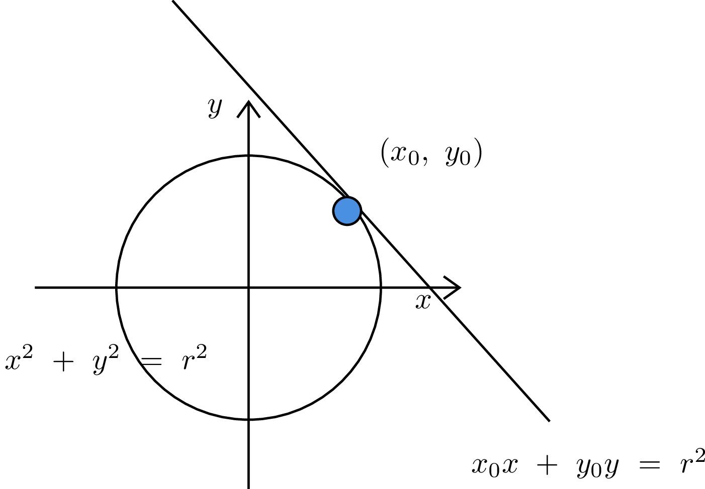
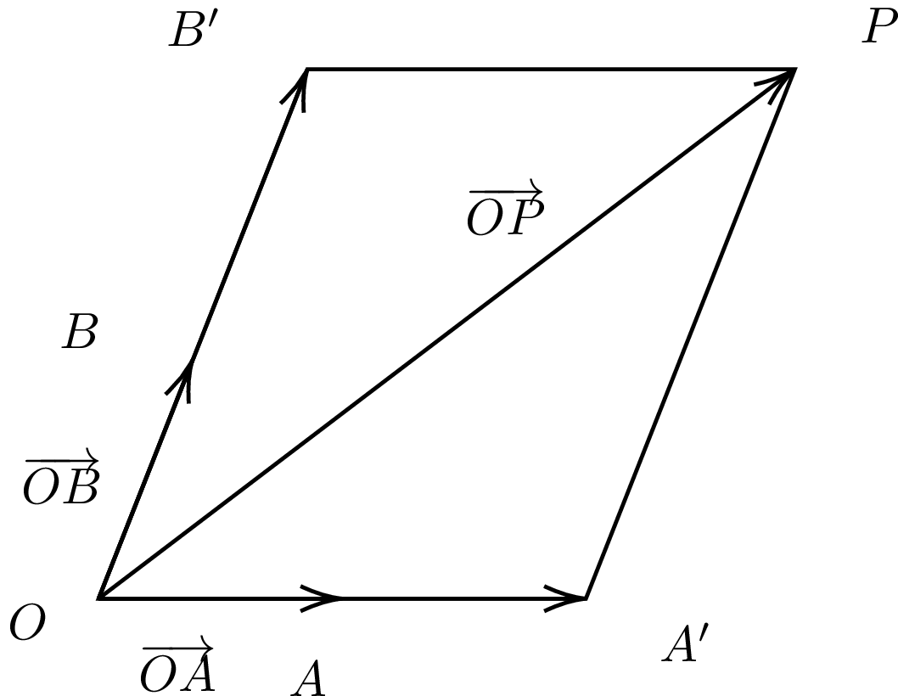
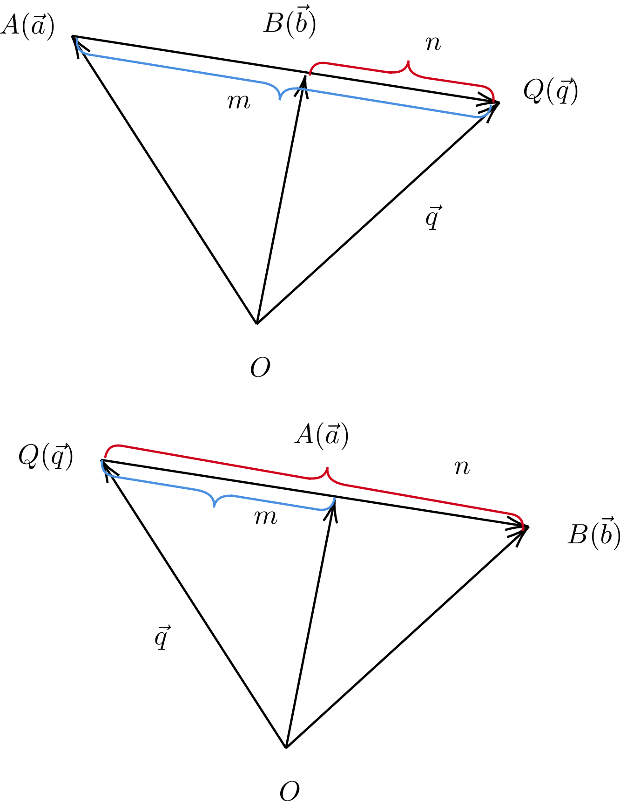

# 座標、ベクトル

## Q1 内分、外分
??? success

    ### 直線上の内分、外分

    ```text
    [内分点]
      ABをm:nに内分する点P
        --> AP : PB = m : nを満たす点で、線分ABの内側にあるもの
    
    [外分点]
      ABをm:nに外分する点Q
        --> AQ : PB = m : nを満たす点で、線分ABの外側にあるもの
    
    [例]
      AB=40 ∧ PがABを3:1に内分する点
      --> AP = 30, BP = 10

      AB =20 ∧ QがABを3:1に外分する点
      --> AQ : QB = 3 : 1
          AQ = 30
          QB = 10
    ```

    ### 座標上の内分点と外分点

    ```text
    [定理]
      A(xA, yA), B(xB, yB)の時

      線分ABをm:nに内分する点Pの座標は

      (x,y) = {(nxA + mxB) / (m + n), (nyA + myB) / (m + n)}

      線分ABをm:nに外分する点Pの座標は

      (x,y) = {(-nxA + mxB) / (m - n), (-nyA + myB) / (m - n)}

      --> これはn次元に拡張できる。つまり数直線上の座標も同様に求められる
    
    [使用例]
      AB =20 ∧ QがABを3:1に外分する点
      A = 0, B = 20とすると
      Qの座標は
      3*0 + 20*3 / (3-1) = 30
      よって、Q = 30
      よってAQ = 30, BQ = 30-20 = 10

    [証明：内分]
      xy座標平面上で2点A,Bと、線分ABをm:nに内分する点P(x,y)が存在する時
      A(xA, yA), B(xB, yB)とおくと

      前件より
      (x - xA) : (xB - x) = m : n
      n(x - xA) = m(xB - x)
      nx - nxA = mxB - mx
      (m+n)x = nxA + mxB
      x = (nxA + mxB) / (m+n)
      yも同様にして証明可能
    
    [証明:外分]
      xy座標平面上で2点A,Bと、線分ABをm:nに外分するQ(x,y)が存在する時
      A(xA, yA), B(xB, yB)とおくと
      m > nの時
      AQ : QB = m : nより

      (x - xA) : (x-xB) = m : n
      m(x - xB) = n(x - xA)
      (m-n)x = (-nxA + mxB)
      x = (-nxA + mxB) / (m-n)

      --> m : -nに内分と考えることもできる

      m < nの時も同様にできるが
      マイナスを消すため、分子分母に-1をかけて
      x = (nxA - mxB) / (n -m)とするかもしれない

      m = nの時は分母が0になるため、外分の公式は成り立たない
    ```

## Q2 重心と座標平面

??? success
    ### 重心と座標平面

    ```text
    [定理]
    △ABCについて、A(xA, yA), B(xB, yB), C(xC, yC)とすると
    重心の座標は{(xA + xB + xC) / 3 ,  (yA + yB + yC) / 3}と表せる
    つまり、各頂点の平均の座標となる

    [証明]
      BCの中点Dは{(xB+xC)/2, (yB+yC)/2}と表せる
      ここで、重心Pは
      ADを2:1に内分する点であるため、内分点の公式を用いて

      x = {xA + 2(xB+xC)/2} / 3 = (xA + xB + xC) / 3 
      y = {yA + 2(yB+yC)/2} / 3 = (yA + yB + yC) / 3 

    ```

## Q3 平面上、空間上の2点間の距離

??? success
    ### 平面、空間上の2点間の距離

    ```text
    [定義：ユークリッド距離]
      直交座標系において、n次元ユークリッド空間内の
      2点A(a_1,a_2,...,a_n), B(b_1,b_2,...,b_n)の距離を
      d = √{(a_1 - b_1)² + (a_2 - b_2)² + ... + (a_n - b_n)²}と定義する

    [つまり]
      A(a_x,a_y), B(b_x, b_y)の距離は
      d = √{(a_x - b_x)² + (a_y - b_y)²}

      A(a_x,a_y,a_z), B(b_x, b_y, b_z)の距離は
      d = √{(a_x - b_x)² + (a_y - b_y)² + (a_z - b_z)²}
    
    [例]
      (3,3), (6,7)の距離dは
      d = √(3)² + (4)² = 5


    ```

## Q4 円の方程式

??? success

    ### 円の方程式

    ```text
    [定理]
      中心が(a,b)で半径がrの円の方程式は
      (x-a)² + (y-b)² = r²で表せる
    
    [証明]
      ※円：ある点(円の中心)から等距離にある点の集合

      円の定義より、円周上から任意の座標を2つ選んだ時、円の中心
      と2つの座標の距離は等しい

      中心が(a,b)で半径がrの円について
      円周上のとある座標を(x,y)とおくと、ユークリッド距離の定義より
      (a,b)と(x,y)の距離は
      r = √{(x-a)² + (y-b)²}

      よって、中心(a,b), 半径rの円周上の座標ならば
      (x-a)² + (y-b)² = r²を満たす

      逆に(x-a)² + (y-b)² = r²を満たすならば
      距離の定義より、(x,y)と(a,b)の距離はrであるため
      (x,y)は中心(a,b)から等距離rだけ離れた点の集合の要素である
      これは言い換えれば(x,y)が中心(a,b),半径rの円周上の座標であることに等しい


      よって、
      (x,y)が中心が(a,b)で半径がrの円周上の座標 ⇔ (x-a)² + (y-b)² = r²

    [円の方程式の一般形]
      x² + y² + lx + my + n = 0は
      l² + m² - 4n > 0のとき円を表す
      円の中心と半径については平方完成で求まる

    
    [例]
      x²+y² + 2x + 4y - 11 = 0
      (x+1)² - 1 + (y+2)² - 4 - 11 = 0
      (x+1)² + (y+2)² = 4²
      中心が(-1,-2)で半径が4の円になった

    [つまり]
      x² + y² + lx + my + n = 0
      ⇔ (x+l/2)² + (y+m/2)² = l²/4 + m²/4 - 4n/4
      円であるためには半径 > 0である必要があるので

      (l² + m² - 4n) > 0
      である必要があるというだけの話
    ```

    ### 直径の両端が判明している場合の円の方程式

    ```text
    (2,3),(4,1)が直径の両端である場合の円の方程式を求めよ
    円の中心は両端の中点にあるため(3,2)

    円周上の点(2,3)までの距離は
    d = √{(1)² + (1)²} = √2

    よって
    (x-3)² + (y-2)² = 2

    [復習]
      円の位置関係
      x² + y² - 4x -6y + 9 = 0 ...(1)
      x² + y² + 4x - 5 = 0 ...(2)

      (x-2)² + (y-3)² = 4
      (x+2)² + y² = 9
      よって、(1)は(2,3)中心で半径2
      (2)は(-2,0)中心で半径3

      中心間の距離はd = √4²+3² = 5
      半径の合計は5なので r_1 + r_2 = dであるため
      二つの円は外接する
    ```

## Q5 円の接線の方程式

??? success

    ### 円の接線の方程式

    ```text
    [定理]
      座標平面において円: x² + y² = r²上の点(x_0, y_0)を接点とする
      接線の方程式は
      x_0x + y_0y = r²
    
    [証明]
      [i] x_0, y_0 ≠ 0の場合
      円の中心(0,0)と、(x_0,y_0)を通るような直線の傾きは y_0 / x_0
      接点を通る円の半径と接線は垂直に交わるので
      接線の傾きは -x_0 / y_0となる

      接線の方程式は(x_0, y_0)を通るので
      y - y_0 = (-x_0 / y_0)(x - x_0)
      y = (-x_0 / y_0)(x - x_0) + y_0
      y_0y = -x_0x + (x_0)² + (y_0)²
      x_0x + y_0y = (x_0)² + (y_0)²

      接点(x_0, y_0)は円x² + y² = r²上の点なので
      x_0x + y_0y = r² ...(1)

      [ii]
      x_0 = 0の場合
      y_0 = ±rであり
      接線の傾きは y = ±r。これは(1)を満たす

      [iii]
      y_0 = 0の場合
      x_0 = ±rであり
      接線の傾きは x = ±r。これは(1)を満たす

      [i]~[iii]より原点を通る円の接線の方程式はx_0x + y_0y = r²


    [中心が(a,b)の時の円の場合:定理]
      座標平面において円(x-a)² + (y-b)² = r²上の点
      (x_0, y_0)における接線の方程式は

      (x_0 - a)(x - a) + (y_0 - b)(y- b) = r²

    [証明]
      中心(a,b)で半径r上の点(x_1, y_1)における円の接線の方程式について求めたい

      原点中心の円の接線の方程式については得られているため
      図形全体をx-軸方向に-a,y-軸方向に-bだけ平行移動すると

      中心(0,0)で半径r上の点(x_1 - a, y_1 - b)における円の接線の方程式は
      (x_1 - a)x + (y_1 - b)y = r²

      元に戻すように図形全体をx-軸方向にa, y-軸方向にbだけ平行移動すると
      中心(a,b)で半径r上の点(x_1, y_1)における円の接線の方程式は
      (x_1 - a)(x - a) + (y_1 -b)(y - b) = r²

      ※平行移動の概念に基づき、x,yについて変更を加えるのみ
        x_1,x_0等に-a,+aとしないよう注意すること
    
    [例]
      x² + y² = 25上の点(3,4)における接線の方程式

      x_0 = 3, y_0 = 4なので
      3x + 4y = 25
    
    [例2]
      中心(3,1), 半径5の円の(6,5)における接線の方程式

      (x-3)² + (y-1)² = 5

      x_1 = 6, y_1 = 5なので
      (x_1 - a)(x - a) + (y_1 - b)(y - b) = r²に当てはめて
      (6-3)(x-3) + (5-1)(y-1) = 25
      3(x-3) + 4(y-1) = 25
      3x + 4y = 38
    ```

    

    ### 複素数平面上の円の方程式

    ```text
    複素数z = a + biの絶対値|z|は
    |z| = √(a² + b²)のようにあらわせた

    また、極座標で考えると、これは原点からの複素数平面上の距離であった


    ここで、中心が3 - 2iで、半径が3の円の方程式について考える
    円は定義より、中心からの距離が等距離である点の集合なので

    未知数をz, 中心をα, 半径をrとすると
    |z - α| = rが円の方程式になる

    [変形version]
      |z-α| = r ...(1)
      |z-α|² = r² ...(2)
      zとその共役複素数\bar{z}の積は|z|²なので
      (z-α)*\bar{z-α} = r² ...(3)
      共役と引き算は順序を交換できるので
      |z|² - z\bar{α} - \bar{z}α + |α|² = r² ...(4)

      (1)~(4)の式変形した形もすべて円の方程式になる
    ```

## Q6 媒介変数表示

??? success

    ### 媒介変数表示

    ```text
    [意味合い]
      ・関連する変数同士の関係をほかの変数を用いて表すこと
      ・Θ,t等が主に表示として使われる
      ⇒パラメータ表示と呼ばれることもあり

    [例]
      x = pt²
      y = 2pt

      --> tを用いて間接的にxとyの関係性を表している
      --> tが決まれば、x,yの双方が決まるためxy座標平面上の1点が定まる

    [円の方程式と媒介変数表示]
      原点を中心とする半径aの円は
      x² + y² = aで表せる

      円周上の点をP(x,y)とし、
      点Pを、A(a,0)をΘだけ原点中心で回転させた点だと考えると

      x = acosΘ
      y = asinΘと表せる

      Θを用いて円周上の点の座標を表せているので、これは円の媒介変数表示といえる

    [使用例]
      原点中心の半径aの円周上の点(x,y)に対して、x + yが最大になる時を考えよ
      x = acosΘ, y = asinΘより
      x + y = asinΘ + acosΘ
      三角関数の合成を用いると
      x + y = √(a² + a²)sin(Θ + α)
      = (√2)asin(Θ + α)

      ただしαはcosα = a / √2a, sinα = a / √2aを満たすので
      α = π/4
      よって、
      x + y =  (√2)asin(Θ + π/4)
      
      ここからx + yの最大値が√2aであることがわかる
      またその時のΘ = π/4なので、x = y = (1/√2)aとなる

    [円と直線の媒介変数表示]
      単位円x²+y² = 1について、点A(-1,0)を通る傾きtの直線について
      単位円との点A以外の交点が存在するものとする。この時その交点を求めよ

      点A(-1,0)を通り、傾きtなので
      この直線の方程式はy = t(x+1)となる。
      ただし(x = -1の時、交点は1になるのでx ≠ -1)
      また交点はx²+y² = 1上に存在するので

      x² + {t(x+1)}² = 1
      x² + t²(x+1)² = 1
      (x+1)(x-1) + t²(x+1)² = 0
      (x+1){(x-1) + t²(x+1)} = 0
      (x+1){(t²+1)x + (t²-1)} = 0

      x≠-1なので
      (t²+1)x + (t²-1) = 0
      x = (1-t²) / (1+t²)

      よって、y = t(x+1)は
      y = t{(1-t² + 1 + t²) / (1+t²)}
      = t(2 / 1+t²)と表せる

      よって、
      y = 2t / (1+t²)

      つまり、単位円の円周上の点のうち(-1,0)を除いた点は
      x = (1-t²) / (1+t²)
      y = 2t / (1+t²)
      を用いて表現可能

      また、半径rの円周上の点なら
      x =  r(1-t²) / (1+t²)
      y = 2rt / (1+t²)となる

      2sin(Θ/2)cos(Θ/2) = 2(sin(Θ/2) / cos(Θ/2)) 
      ※Θを用いた媒介変数表示にすると
        ∠PAOは円周角の定理より、中心角をΘとすると、(1/2)Θと表せるので
        tが傾きであることから
        t = tan(1/2)Θと表せる

        単位円上の座標(x,y)は動径とx-軸の正の向きのなす角をΘとすると(cosΘ,sinΘ)
        で表せるので、これは(cosΘ,sinΘ)をtan(1/2)Θを用いて表していた
        と考えることができる

      ※確かにΘを用いると以下のように変形可能
      y = sinΘ = 2sin(Θ/2)cos(Θ/2)

      y = 2t / (1+t²)
      = 2(tan(1/2)Θ) / (1 + (tan(1/2)Θ)²)
      = 2sin(Θ/2) / 2cos(Θ/2)({cos²(Θ/2) + sin²(Θ/2)} )/ cos²(Θ/2)
      = 2sin(Θ/2) / 2(cos²(Θ/2) + sin²(Θ/2)) / cos(Θ/2)
      = 2sin(Θ/2)cos(Θ/2) / 2
      = sinΘ

    ```

    ### 半角のtanを用いて三角関数の媒介変数表示

    ```text
    [考え方]
      始線と動径のなす角をΘと置いた場合
      単位円周上の座標(x,y)は(cosΘ, sinΘ)と表せる

      この時、A(-1, 0)とP(x,y)を通る直線の傾きをtと置くと
      ∠PAOは円周角となり、中心角がΘであることから
      t = tan(Θ/2)となる

      この時、tを用いてcosΘ, sinΘを表現できるということは
      tan(Θ/2)を用いて、cos, sin, tanのいずれをも表現できるということである
    
    [半角のtan]
      t = tan(Θ/2)としたとき。ただしt ≠ ± 1 (tan90°, -90°は未定義なので)
      sinΘ = 2sin(Θ/2)cos(Θ/2)
      = 2tan(Θ/2) * cos²(Θ/2)
      
      1/cos²Θ = 1 + tan²Θより
      = 2tan(Θ/2) / (1 + tan²(Θ/2))
      = 2t/ (1 + t²)

      cos(2Θ) = 2cos²Θ - 1より
      cosΘ = 2cos²(Θ/2) - 1
      = 2 / (1 + tan²(Θ/2)) - 1
      = 2/(1+t²) - 1
      = (1-t²) / (1+t²)

      tanΘ = sinΘ / cosΘより
      = 2t / (1-t²)
    ```

## Q7 垂直二等分線

??? success
    ### 垂直二等分線の式

    ```text
    [定理]
      座標平面上の2点(x1,y1), B(x2,y2)を結んだ直線の垂直二等分線は

      (x2-x1)x + (y2-y1)y = {(x2² - x1²) / 2} + {(y2² - y1²) / 2}
    
    [証明]
      直線ABの傾きは(y2-y1) / (x2 -x1)
      よって垂直二等分線の傾きは
      -(x2 - x1) / (y2 - y1)となる ...(1)

      垂直二等分線はABの中点を通過するので
      {(x1+x2)/2, (y1+y2)/2}を通る。つまり

      y =  {-(x2 - x1) / (y2 - y1)}(x - (x1+x2)/2) + (y1+y2)/2
      y =  {1/(y2 - y1)}{-x(x2-x1) +(x1+x2)(x2-x1)/2} + (y1+y2)/2
      (y2 - y1)y =  {-x(x2-x1) +(x1+x2)(x2-x1)/2} + (y1+y2)(y2 - y1)/2
      (x2 -x1)x + (y2 -y1)y = (x1+x2)(x2-x1)/2 + (y1+y2)(y2 - y1)/2
      (x2 -x1)x + (y2 -y1)y = (x2²-x1²)/2 + (y2² - y1²)/2

      ※垂直であれば、傾きの積は-1
        1つの直線の傾きをtanΘとしたとき、
        垂直であれば、他方の直線の傾きはtan(Θ + 90°)となる
        (tan(Θ - 90°)としても結果は同じ)
        垂直である二直線の傾きの積は tanΘ * tan(Θ + 90°)に等しい
        tan(Θ + 90°) 
        = sin(Θ + 90°) / cos(Θ + 90°)
        = {sinΘcos90° + cosΘsin90°} / {cosΘcos90° - sinΘsin90°}
        = cosΘ / -sinΘ
        = -(cosΘ / sinΘ)

        tanΘ * tan(Θ + 90°)
        = (sinΘ / cosΘ)*-(cosΘ / sinΘ)
        = -1
    ```

## Q8 ベクトルの意味

??? success
    ### ベクトルについて

    ```text
    [高校数学では]
      ・向きと大きさを持った量
    
    [大学数学では]
      ・ベクトル空間の元
      ・線型性を持つ
      ・和とスカラー倍をとることができる量

      --> 足し算とスカラー倍ができるような代数系 = ベクトル空間(線型空間)

      --> 代数系：集合と集合上で定義された演算の組み合わせ
                　※A上の二項演算 --> A*A --> A (閉性を持っている)
      
      ※(ベクトル; 加法, スカラー倍, ...)
        つまり、ベクトル同士の足し算や、ベクトル同士のスカラー倍は可能
    ```

## Q9 位置ベクトル

??? success

    ### 位置ベクトル

    ```text
    [有向線分]
      ・長さと方向を持つ線分
    
    [スカラー]
      大きさという1種類の情報によって表現される量
    
    [ベクトルと有向線分]
      ・長さと方向を持つという点で一致するため
        ベクトルは有向線分を用いて幾何的に表現される
      
      ・ただし、有向線分は始点と終点をもち
        ベクトルは位置を問題としない
    
    [有向線分と座標]
      ・空間上にあるそれぞれの点の位置を座標と呼ばれる実数の組として表現すると
        有向線分の「始点」と「終点」も座標で表現できることがわかる
      
      ・実数上n次元空間ℝ^nにおける点の座標は、n個の実数からなるため
        以下のようにあらわせる

        (x_1, ..., x_n) ∊ ℝ^n

      ・よって、有向線分の始点と終点の座標は以下のようにあらわせる
        始点Xの座標 : {(x_1, ..., x_n) ∊ ℝ^n | x_i ∊ R}
        終点Yの座標 : {(y_1, ..., y_n) ∊ ℝ^n | y_i ∊ R}
      
      ・上記より、有向線分の長さは、始点と終点を結んだものであるため
        始点と終点が定まれば有向線分が、
        有向線分が定まれば始点と終点が定まる
      
    
    [ベクトルと位置]
      ・ベクトルは、「大きさ」と「向き」という2つの情報から構成される
      ・位置を変えても、ベクトルとしては変化しない
        --> すべての有向線分の始点を原点に統一するよう平行移動しても、
            2つの情報は変化しない
        --> 有向線分の始点を統一すれば、大きさと向きの差が明確になるという
            メリットもある
    
    [位置ベクトル]
      ・任意の座標に存在するすべての有向線分の始点が
        空間ℝ^nの原点Oとなるよう平行移動する

      ・この時、始点と終点を結んだ線分の傾きと
        平行移動前の有向線分の「向き」

      ・線分の長さと、平行移動前の(任意の場所に存在した)有向線分の「大きさ」は
        平行移動しただけなので一致する
      
      ・よって任意のベクトルの情報(大きさ, 向き)は、始点を原点に統一した有向線分、
        ひいては、終点の座標を用いて表現可能

        𝕒 = (a_1, a_2, ..., a_n)

        この時、𝕒を構成するa_iを、𝕒の成分と呼び
        上記のような表記法を、ベクトルの成分表示という

        また、始点を原点に統一したようなベクトルを位置ベクトルといい
        原点Oから点Aまでのベクトル𝕆𝔸を
        点Oに対する点Aの位置ベクトル𝕒等と呼称し、
        点Aを表す位置ベクトルが𝕒であることを、A(𝕒)と表記する

        これは言い換えれば、任意のベクトルは位置ベクトルで表現可能である
        ということを意味してもいる
    ```

## Q10 列ベクトルと行ベクトル

??? success

    ### 列ベクトルと行ベクトル

    ```text
    [列ベクトルと行ベクトル]
      列ベクトル : n×1行列
        --> 𝕒 = {
              a_1,
              a_2,
              ...,
              a_n
            }
      行ベクトル : 1×n行列
        --> 𝕒 = (a_1, a_2, ..., a_n)

      m×n行列
        --> (
          a_11, a_12, ..., a_1n
          a_21, a_22, ..., a_2n,
          ...,  ...,  ..., ...,
          a_m1, a_m2, ..., a_mn,
        )
      
      行列同士の演算の場合、列ベクトル、行ベクトルには違いがある
      ただし、幾何的に向きと大きさの実を表したい場合、違いは出ない
    ```

    ### 数ベクトル

    ```text
    ・数を並べたものを、ベクトルという一つの塊として扱ったもの
    ・行ベクトルも、列ベクトルも数ベクトル
    
    ```

    ### 数ベクトルの定義(実数)

    ```text
    ℝ^n = {(x_1, x_2, ..., x_n) | x_k ∊ ℝ}とする。

    𝕒 = (a_1, a_2, ..., a_n) ∊ ℝ^n
    𝕓 = (b_1, b_2, ..., b_n) ∊ ℝ^n
    に対して、和、実数倍を
    𝕒 + 𝕓 = (a_1 + b_1, ..., a_n + b_n)
    k𝕒 = (ka_1, ..., ka_n)
    のように定義したとき、ℝ^nをℝ上n次元数ベクトル空間といい
    その元を数ベクトルという

    [例]
    n = 2の時、ℝ² = {(x_1, x_2) | x_1, x_2 ∊　ℝ}は
    平面ベクトル(ℝ上2次元数ベクトル空間)
    n = 3の時、ℝ³ = {(x_1, x_2, x_3) | x_1, x_2, x_3 ∊　ℝ}は
    空間ベクトル(ℝ上3次元数ベクトル空間)

    --> 実数体ℝからn個の実数をとって順序をつけた順序対と考えられる
        和、積は成分同士で行われる
    
    --> 実数空間ℝは、加法+について閉性を持つので
        + : ℝ^n × ℝ^n --> ℝ^n
        よって、𝕒 + 𝕓は、ℝ^n上の1つの点として定まることが保証される
    
    ※　ℝ^n, ℝ^(n-1)のような異なる空間に属するベクトルについて考えたとき
      　加法、或いはベクトル加法は定義されない
    ```

## Q11 ベクトル和とスカラー倍

??? success

    ### ベクトル和(数ベクトルの定義より)

    ```text
    原点Oを設定したうえで、
    ℝ上2次元空間上に存在する2点X,Yを選び、これらの点の位置ベクトルを
    (x_1, x_2) ∊ ℝ²
    (y_1, y_2) ∊ ℝ²で表現する

    この時、
    𝕆𝕏の終点座標は、(x_1, x_2)
    𝕆𝕐の終点座標は、(y_1, y_2)となる

    数ベクトルの定義より,2つのベクトルのベクトル和は、
    𝕩 + 𝕪 = (x_1 + y_1, x_2 + y_2) ∊ ℝ²
    ```

    ### スカラー倍

    ```text
    実数a∊ℝと、ベクトル𝕩∊ℝ^nをそれぞれ任意に選んだ時、
    𝕩のそれぞれの成分をa倍することにより得られる新たなベクトルを

    a𝕩 = (ax_1, ..., ax_n)で表記する
    また、これをaによる𝕩のスカラー倍と呼ぶ

    --> 実数空間ℝは乗法について閉じているので、
        成分ax_iは、1つの実数として定まる
    --> 数ベクトルの定義とも一致している

        よって、a𝕩 ∊ ℝ^n
    ```

## Q12 ベクトルの単位元、逆元

??? success

    ### ベクトルと単位元

    ```text
    [スカラー倍の単位元]
      ℝにおける乗法の単位元である1は、スカラー乗法単位元である
      1𝕩 = 𝕩

    [零ベクトル]
      すべての成分が0であるようなベクトルを零ベクトルという
      𝟘 = (0, 0, ..., 0)
    
    [ベクトル和の単位元]
      𝟘は、ベクトル加法単位元である
      𝕩 + 𝟘 = 𝕩
    ```

    ### ベクトルと逆元

    ```text
    ・ベクトル𝕩 = (x_1, ..., x_n)に対し、
      -𝕩 = (-x_1, ..., -x_n)を𝕩の逆ベクトルという
    
    ・この時
      𝕩 + (-𝕩) = 𝟘

    ・ベクトルの各成分x_iに対して、その加法逆元-x_iは一意的に定まるので
      任意のベクトル𝕩に対して、その逆ベクトル-𝕩も一意に定まる
    
    ・逆ベクトルは、各成分同士を元のベクトルと足すと和がいずれも0になることから
      向きが逆で、大きさが等しいベクトルと考えられる

      始点と終点が逆になったベクトルは
      向きが逆で、大きさが等しいため
      𝕆𝔸の逆ベクトルは、-𝕆𝔸であり、𝔸𝕆

      ※ベクトル𝕆𝔸 : 始点O, 終点A
        ベクトル𝔸𝕆 : 始点A, 終点O

      また逆ベクトルの逆ベクトルについて考えると、
      向きが2度逆になるため、これは元のベクトルと同一になる

      つまり、𝕆𝔸 = -𝔸𝕆 = -(-𝕆𝔸)である
    ```


## Q13 同一方向、反対方向

??? success

    ### 同一方向、反対方向

    ```text
    [同一方向]
      2つのベクトル𝕩,𝕪 ∊ ℝ^nについて、a > 0のもとで
      𝕪 = a𝕩であるとき、
      𝕩,𝕪は同一方向にあるという

    [反対方向]
      2つのベクトル𝕩,𝕪 ∊ ℝ^nについて、a < 0のもとで
      𝕪 = a𝕩であるとき、
      𝕩,𝕪は反対方向にあるという
    ```

## Q14 ベクトルの法則

??? success

    ### 交換律、結合律, 互換性

    ```text
    [交換律]
      𝕩 + 𝕪 = 𝕪 + 𝕩
    
    [結合律]
      (𝕩 + 𝕪) + 𝕫 = 𝕩 + (𝕪 + 𝕫)

    
    [互換性]
      a(b𝕩) + (ab)𝕩
    
    [分配律]
      a(𝕩 + 𝕪) = a𝕩 + a𝕪
      (a + b)𝕩 = a𝕩 + b𝕩
    ```

    ### 相当性

    ```text
    二つのベクトル𝕩,𝕪が同一次元空間に存在し、
    対応する成分がすべて等しい場合𝕩,𝕪は等しいといい

    𝕩 = 𝕪と表す
    ```

## Q15 一般のベクトルの位置ベクトル表記

??? success


    ### 一般のベクトルと位置ベクトル

    ```text
    [定理]
    原点をOとして、2点A(𝕒), B(𝕓)を結ぶベクトル𝔸𝔹は、
    𝔸𝔹 = 𝕆𝔹 - 𝕆𝔸 = 𝕓 - 𝕒と表せる

    [考え方]
      始点Aから終点Bまでのベクトルの長さと向きは、
      Bの各成分から、Aの各成分を引けば求まる

    [導出]
      𝕆𝔸 = (a_1, ..., a_n) ∊ ℝ^n
      𝕆𝔹 = (b_1, ..., b_n) ∊ ℝ^n
      とする。この時、
      始点がAであり終点がBであるような有向線分を位置ベクトルとして表現するには
      始点Aを原点Oと一致するように平行移動する必要がある

      大きさと向きを変えないように, 始点をAからOに平行移動した場合
      当然、終点の座標も現在の座標から、移動した分だけ変動する

      現在の終点座標は、
      𝕆𝔹 = (b_1, ..., b_n) ∊ ℝ^n

      変動量は𝔸𝕆
      よって、平行移動後の終点座標は、
      𝕆𝔹 + 𝔸𝕆と考えられる

      𝔸𝕆は𝕆𝔸の逆ベクトルであるため
      𝔸𝕆 = -𝕆𝔸

      -𝕆𝔸は𝕆𝔸の逆ベクトルなので
      𝕆𝔸 = (-a_1, ..., -a_n) ∊ ℝ^nと表せる

      よって、
      𝕆𝔹+ (-𝕆𝔸)
      = (b_1 - a_1, ..., b_n - a_n)

      つまり、
      𝔸𝔹 = 𝕆𝔹+ (-𝕆𝔸)

      [ベクトル差の定義]
        𝕆𝔹 - 𝕆𝔸 = 𝕆𝔹 + (-𝕆𝔸)と定義する
        よって、𝔸𝔹 = 𝕆𝔹+ (-𝕆𝔸) = 𝕆𝔹 - 𝕆𝔸
  
        任意のベクトルの成分座標は
        各成分の終点から各成分の始点の数を引くことで求まるとわかる

      [※交換律から考える場合]
      𝕆𝔹 - 𝕆𝔸 = 𝕆𝔹 + 𝔸𝕆 = 𝔸𝕆 + 𝕆𝔹 = 𝔸𝔹
    ```

## Q16 ベクトルの合成、分解

??? success

    ### 一般のベクトル同士の足し算

    ```text
    原点Oについて、以下であるとき
    A(𝕒) = (a_1, ..., a_n)
    B(𝕓) = (b_1, ..., b_n)
    C(𝕔) = (c_1, ..., c_n)
    𝔸𝔹 = (b_1 - a_1, ..., b_n - a_n)
    𝔹ℂ = (c_1 - b_1, ..., c_n - b_n)
    ```

    ### ベクトルの合成

    ```text
    𝔸𝔹 + 𝔹ℂ
    = 𝕆𝔹 - 𝕆𝔸 + 𝕆ℂ - 𝕆𝔹
    = 𝕆ℂ - 𝕆𝔸
    = 𝔸ℂ
    と表せる
    --> 2つのベクトルについて一方の終点と、他方の始点が同じであるとき
        ベクトルは合成可能
    --> 1つのベクトルを、2つのベクトルに分解することが可能であるともいえる

    𝔸𝔹 + 𝔹ℂ ⇔ 𝔸ℂ

    ```

    ### 合成と平行四辺形

    ```text    
    ベクトルの加法は交換律が成り立つので
    𝔸𝔹 + 𝔹ℂ = 𝔹ℂ + 𝔸𝔹 = 𝔸ℂ

    いま、𝔸𝔹の始点と終点をそれぞれ、点A, 点Bとし、
    𝔹ℂの始点と終点をそれぞれ点B,点Cとしても、
    上記は成り立つ

    また、𝔹ℂの始点を点Aまで平行移動し、
    その終点が𝔸𝔹の始点となるよう平行移動しても
    2つのベクトルを合成した結果は同様となる

    ここで、𝔸𝔹はベクトルなので、
    平行移動する前と後で向きは等しく、長さも等しい
    よって、点A,B,C,平行移動後の𝔹ℂの始点は、平行四辺形の頂点となる

    また、点A,Cは対角の頂点となるため
    合成した後のベクトルは、合成前の2ベクトルの始点を合わせたものを
    辺に持つ平行四辺形の対角線といえる
    ```

    ### 終点と始点が一致しない場合の和

    ```text
    𝔹𝔸 + 𝔹ℂの場合
    𝔹𝔸 = (a_1 - b_1, ..., a_n - b_n)
    𝔹ℂ = (c_1 - b_1, ..., c_n - b_n)

    𝔹𝔸 + 𝔹ℂ
    = (a_1 + c_1 - 2*b_1, ..., a_n + c_n - 2*b_n)
      --> ベクトル和のやり方に従って、普通に成分同士を足せばいい
    ```

## Q17 ノルム

??? success

    ### ノルム

    ```text
    ベクトル𝕩 ∊ ℝ^nが与えられたとき、
    ||𝕩|| = √(x_1² + ... + x_n²)を𝕩のL2-ノルム(ユークリッド距離)という

    (※本来は、||𝕩||₂)
    (※高校数学では、|𝕩| = √(x_1² + ... x_n²)と定義し
      これをベクトルの大きさと表現している)
    
    --> 普段我々が、平面座標で点Oと点Xとの距離を求めるとき
        上記のような計算を行う。
    --> つまり高校数学で出てくる距離は、特に定めがない限り
        ユークリッド距離を意味している
    
    [ノルムは以下の性質を満たす必要がある]
      ||𝕩|| ≧ 0
      ||𝕩|| = 0 ⇔ 𝕩 = 𝟘
      ||k𝕩|| = |k|||𝕩||
      ||𝕩+𝕪|| ≦ ||𝕩|| + ||𝕪||

      --> 実際、ユークリッドノルムはこの性質を満たしている
    
    [2点間の距離(ベクトル)]
      ||𝕩 - 𝕪|| = √{(x_1 - y_1)² + ... (x_n - y_n)²}
    ```

## Q18 単位ベクトル

??? success

    ### 単位ベクトル

    ```text
    ||𝕩|| = 1が成り立つ場合、𝕩を単位ベクトルという

    例)
    𝕩 = (1, 0)
    𝕩 = (0, 1)
    𝕩 = (1/2, √3/2)

    [平行な単位ベクトルの求め方]
      𝕩 = (2,1)と平行な単位ベクトル

      |𝕩| = √5なので
      それぞれの成分を√5で割れば、|𝕩| = 1となる
      よって、

      ±(2/√5, 1√5)
      --> 「平行な」なので反対方向のものも求めた

    [正規化]
      同じ向きで長さを1にする操作
    ```

    ### 単位ベクトルの公式

    ```text
    ベクトル𝕩と同じ向きの単位ベクトルは𝕩 / |𝕩|で求まる
    ```

    ### 零ベクトルでない一般のベクトルを単位ベクトルとの積で表す

    ```text
    任意の零ベクトルではない𝕩は、
    𝕩 = |𝕩| * (𝕩 / |𝕩|)で表せる
      --> つまり大きさと向きの積ともとれる
    ```

    ### 𝕩 / |𝕩|が単位ベクトルであることを示す

    ```text
    ベクトル𝕩 = (x_1,...,x_n)のノルムは|𝕩|で表せる
    |𝕩| = √{(x_1)² + ... (x_n)²}

    単位ベクトルは、ノルムが1であるベクトルなので
    𝕩 / |𝕩|のノルムが1であることを示せばいい

    𝕩 / |𝕩|
    = (x_1 / |𝕩|, ..., x_n / |𝕩|)
    であることから、ノルムを求めると

    |𝕩 / |𝕩||
    = √{(x_1 / |𝕩|)² + ... (x_n / |𝕩|)²}
    --> ベクトルの各成分をノルムで割った結果のノルム
    = (1 /|𝕩|)√{x_1² + x_2² + ... + x_n²}
    = (1 /|𝕩|)|𝕩|
    = 1
    ```


## Q19 内積

??? success

    ### 内積の定義
    ```text
    [ドット積の定義]
      2つのベクトル𝕒 = (a_1, ..., a_n)と 𝕓 = (b_1, ..., b_n)
      のドット積は以下のように定義される

      a・b = Σ_{i=1}^n a_ib_i = a_1*b_1 + a_2*b_2 + ... + a_n*b_n
      --> ドット積を考えるうえでは、次元数が一致している必要がある
    ```

    ### 内積のcos表記

    ```text
    [定理]
      <𝕒,𝕓> = |𝕒||𝕓|cosΘ
      ※<・,・>は内積を意味する
    
    [証明]
      点Oを原点とし、𝟘でない2つのベクトルを以下のように定める
      𝕒(a_1, a_2), 𝕓(b_1, b_2)
      
      ただし、A(𝕒), B(𝕓)
      
      [i]
      2つのベクトルが同一直線上に存在しない場合
      ∠AOBの大きさΘ(0<Θ<180°)は、𝕒, 𝕓のなす角となる

      △OABについて余弦定理を用いると
      BA² = OA² + OB² - 2OA*OB*cosΘ ...(1)

      ※BAの長さは、始点Bから終点Aまでの有向線分の大きさと一致する
        よって、𝔹𝔸 = √{(a_1 - b_1)² + (a_2 - b_2)²} = |𝕒 - 𝕓|

      (1)をベクトルで表記すると
      |𝕒 - 𝕓|² = |𝕒|² + |𝕓|² - 2|𝕒||𝕓|cosΘとなる

      また、2-ノルムより以下のようにあらわせるので
      |𝕒|² = (√{(a_1)² + (a_2)²})² = (a_1)² + (a_2)²
      |𝕓|² = (b_1)² + (b_2)²
      |𝕒 - 𝕓|² = (a_1 - b_1)² + (a_2 - b_2)²

      (a_1 - b_1)² + (a_2 - b_2)²
      = (a_1)² + (a_2)² + (b_1)² + (b_2)² -2|𝕒||𝕓|cosΘ

      両辺を整理すると
      -2(a_1*b_1 + a_2*b_2) = -2|𝕒||𝕓|cosΘ
      𝕒・𝕓 = |𝕒||𝕓|cosΘ

      --> 逆をたどれば、𝕒・𝕓 = |𝕒||𝕓|cosΘから 𝕒・𝕓 = a_1*b_1 + a_2*b_2
          も導ける
      
      --> |𝕒 - 𝕓|² = |𝕒|² + |𝕓|² - 2<𝕒,𝕓> も言うことができる

      [ii] 𝟘でない2つのベクトルが同一方向に存在する時
      
      2つのベクトルのなす角をΘとすると、Θ = 0°で、cosΘ = 1
      同一方向に存在するので、𝕓 = k𝕒と表せる(kは正の実数)

      この時、𝕒・𝕓 = |𝕒||𝕓|cosΘの左辺について
      𝕒・𝕓 = a_1*ka_1 + a_2*ka_2 
      = k{(a_1)² + (a_2)²}...(1)

      右辺について
      |𝕒| = √{(a_1)² + (a_2)²}
      |𝕓| = √(b_1)² + (b_2)² = √{(ka_1)² + (ka_2)²} = √{k²(a_1² + a_2²)}
      = k√{(a_1)² + (a_2)²}

      |𝕒||𝕓| = √{(a_1)² + (a_2)²}*k√{(a_1)² + (a_2)²}
      = k(a_1)² + (a_2)² ...(2)

      (1) = (2)であるため
      同一方向の時も、𝕒・𝕓 = |𝕒||𝕓|cosΘは成り立つ

      [iii] 𝟘でない2つのベクトルが反対方向に存在する時
      2つのベクトルのなす角をΘとすると、Θ = 180°で、cosΘ = -1
      反対方向に存在するので、𝕓 = -k𝕒と表せる(kは正の実数)

      同様に(右辺)=(左辺)となる

      [i]~[iii]より
      𝟘でない2つのベクトル𝕒・𝕓の内積は、|𝕒||𝕓|cosΘで表せる

      ※𝟘なら、(右辺)=(左辺)= 0になるだけ
    
    [使いどころ]
      ・2つのベクトルを有向線分とみなした場合の、それらの成す角Θを表現可能
    ```

    ### 内積の応用例(コサイン類似度)

    ```text
    0≦Θ≦180°の範囲では、Θの値が小さくなるほど、cosΘの値が大きくなる
    これを利用し、cosΘの値によって2つのベクトルがどれくらい似ている
    (方向性が近しい)か判別できる


    𝕒・𝕓 = |𝕒||𝕓|cosΘなので
    cosΘ = 𝕒・𝕓 / |𝕒||𝕓|

    cosΘ = 1ならば、同一方向なので完全に似ている
    cosΘ = -1ならば、反対方向なので、完全に似ていない
    cosΘ = 0ならば、なす角は90°。無関係であるという考え方になる

    --> たとえば2つの文章の類似性を考えるとき
        一般に類似性を決定づける成分(特徴量)が2つであることは考えにくいため、
        類似性を考えるうえではn次元ベクトルを考えていくことになる
    
    --> 類似度を-1~1の間に正規化できるのがよい点
    ```

    ### 内積とcosΘ(n次元)

    ```text
    [内積とcosΘ(n次元)]
      --> n次元なので、代数的な視点が必要になる
    ```

    ### 内積と直交、平行など

    ```text
    𝕒・𝕓 = |𝕒||𝕓|cosΘを用いる
    ※ 

    𝕒・𝕓 = |𝕒||𝕓|
    ⇔ cosΘ = 1(Θ = 0°)、つまり同一方向

    𝕒・𝕓 = |𝕒||𝕓|cosΘ
    ⇔ 0 < cosΘ < 1 ( 0° < Θ < 90°)

    𝕒・𝕓 = 0
    ⇔ cosΘ = 0(Θ = 90°)、つまり直交
    (𝕒 = 0, 𝕓 = 0である場合、直交-> 2つの直線が垂直に交わるという
    言葉の定義から反するので注意すること)

    𝕒・𝕓 = |𝕒||𝕓|cosΘ
    ⇔ -1 < cosΘ < 0 ( 90° < Θ < 180°)

    𝕒・𝕓 = -|𝕒||𝕓|
    ⇔ cosΘ = -1(Θ = 180°)、つまり反対方向

    ※直交の定義が𝕒・𝕓 = 0と考えることもできる
      --> 内積が0ならば、2つのベクトルは直交する
    ```

    ### 自分自身との内積

    ```text
    𝕒・𝕒 = |𝕒||𝕒|cosΘ
    二つの成す角は当然0°なので
    = |𝕒||𝕒|cos0
    = |𝕒|²

    --> 自分自身との内積は、自身の大きさの2乗に等しくなる
    ```
    
    ### 単位ベクトルとの内積

    ```text
    単位ベクトルを、𝕖としたとき、
    𝕒・𝕖 = |𝕒||𝕖|cosΘ

    ただし、|𝕖| = 1なので
    𝕒・𝕖 = |𝕒|cosΘ

    --> 意味合い
        𝕒を、単位ベクトルの方向に正射影したときの成分を表している
    ```

    ### 内積と法則

    ```text
    [交換法則の導出]
      <𝕒, 𝕓> = |𝕒||𝕓|cosΘ = |𝕓||𝕒|cosΘ = <𝕓, 𝕒>

    [定数倍の結合]
      |k𝕒| = Σ_{i=1}^{n}√(ka_i)²
      = k|𝕒|より

      <(k𝕒),𝕓> 
      = |k𝕒||𝕓|cosΘ
      = k|𝕒||𝕓|cosΘ = k<𝕒,𝕓>

      = |𝕒||k𝕓|cosΘ
      = <𝕒,k𝕓>
    
    [分配法則の導出]
      𝕒 + 𝕓 
      = (a_1 + b_1, ..., a_n + b_n)

      <(𝕒 + 𝕓), 𝕔>
      = c_1(a_1 + b_1) + ... + c_n(a_n + b_n)
      = (a_1c_1 + ... + a_nc_n) + (b_1c_1 + ... + b_nc_n)
      = <𝕒,𝕔> + <𝕓,𝕔>
    ```


## Q20 一次独立とベクトルの分解

??? success

    ### 一次独立とベクトルの分解

    ```text
    ※線型結合：n個のベクトルを定数倍して足し合わせたもの⇒一次結合ともいう

    [一次独立]
      ・n本のベクトル𝕧_1,...,𝕧_nについて、
        とあるベクトル𝕧_i(i=1,...,n)が他のベクトルの
        線型結合で表されるとき、𝕧_1,...,𝕧_nは線型従属であるという
        ※ベクトルの本数 > 次元数 ⇒ 線型従属

        逆に、𝕧_1,...,𝕧_nは線型従属でないとき
        𝕧_1,...,𝕧_nは線型独立(一次独立)であるという

      ・一次従属であるとき、𝕧_1,...,𝕧_nが張る空間はn-1次元以下になる

      ・一次独立であるベクトルは、いずれも零ベクトルではない
        --> 零ベクトルが紛れ込んでいるとa_i ≠ 0の場合でも、𝟘に
            なりえるため、一次独立の定義を満たさない
    
    [一次独立を数式で表すと]
      スカラーa_1,...,a_nに対して
      a_1𝕧_1 + ... + a_n𝕧_n = 𝟘 ⇒ a_1 = ... = a_n = 0

      この時、𝕧_1,...,𝕧_nは線型独立
      --> a_iが0でない場合に、零ベクトルになるならば
          a_i𝕧_iは、残りn-1本のベクトルの線型結合で表せる
    ```

    ### 一次独立の証明

    ```text
    [一次独立と分解(2次元)]
      2つのベクトル𝕒,𝕓が一次独立であるとする
      この時、任意のベクトル𝕡は、
      𝕡 = s𝕒 + t𝕓 (s,tは実数)と一意に表せる

    [証明(2次元)]
      原点Oであるとき、P(𝕡), A(𝕒), B(𝕓)とする
      (※つまり、𝕡 = 𝕆ℙ,  𝕒 = 𝕆𝔸, 𝕓 = 𝕆𝔹)

      ここで、点Pを通り直線OBに平行な直線と直線OAとの交点をA'
      点Pを通り直線OAに平行な直線と直線OBとの交点をB'とする

      この時、
      OB // A'P
      OA // B'P

      A'は直線OA上に存在するため, OA // OA'であり、s𝕆𝔸 = 𝕆𝔸'
      B'は直線OB上に存在するため, OB // OB'であり、t𝕆𝔹 = 𝕆𝔹'

      よって、
      OB' // A'P
      OA' // B'P

      向かい合う二組の辺が平行であるため
      四角形OA'B'Pは頂点O,Pを対角に持つ、平行四辺形になる

      よって、
      OB' = PA'
      OA' = PB'

      ベクトルで表記するため向きを意識すると
      𝕆𝔹' = 𝔸'ℙ
      𝕆𝔸' = 𝔹'ℙとなる

      𝕆ℙは、ベクトルの分解より
      𝕆ℙ = 𝕆𝔸' + 𝔸'ℙ
      𝕆ℙ = 𝕆𝔹' + 𝔹'ℙ
      と表せるので、

      𝕆ℙ = 𝕆𝔸' + 𝕆𝔹'
      = s𝕆𝔸 + t𝕆𝔹

      よって、任意のベクトル𝕡は
      1次独立である任意の2ベクトルを用いて
      𝕡 = s𝕒 + t𝕓 (s,tは実数)と一意に表せる

      --> 平行でない2ベクトルなら何でもいい
    
    [3次元]
      3つのベクトル𝕒,𝕓,𝕔が1次独立であるとする
      この時任意のベクトル𝕡 = s𝕒 + t𝕓 = u𝕔(s,t,uは実数)
    
    [証明]
      原点Oであるとき、P(𝕡), A(𝕒), B(𝕓), C(𝕔)とする
      (※つまり、𝕡 = 𝕆ℙ,  𝕒 = 𝕆𝔸, 𝕓 = 𝕆𝔹, 𝕔 = 𝕆ℂ)

      ここで、点Pを通り𝕔に平行な直線と
      𝕒, 𝕓によって張られた平面との交点をQとする

      この時、ℚℙ = u𝕆ℂと表せる

      2次元の場合の証明より
      𝕆ℚ = s𝕆𝔸 + t𝕆𝔹

      𝕆ℙ = 𝕆ℚ + ℚℙ
      = s𝕆𝔸 + t𝕆𝔹 + u𝕆ℂ
      = s𝕒 + t𝕓 = u𝕔

      --> n次元の場合は、数学的帰納法でいけそう
    
    [n次元の場合]
      n-1次元空間において、1次独立なn-1個のベクトル
      𝕒_1, ..., 𝕒_{n-1}が存在し、任意のベクトル𝕡がそれらを用いて
      以下のように一意に表せると仮定する
      𝕡 = s_1𝕒_1, + ... +  s_{n-1}𝕒_{n-1}

      一次独立なn個のベクトル𝕒_1, ..., 𝕒_{n-1}が与えられているとする
      この時、任意のベクトル𝕡はn次元空間に属している  

      [i]
      𝕡がn-1次元の部分空間内にある場合について考える
      帰納仮定より、𝕡 = s_1𝕒_1, + ... +  s_{n-1}𝕒_{n-1}なので
      𝕡 = s_1𝕒_1, + ... +  s_{n-1}𝕒_{n-1} + 0𝕒_n

      [ii]
      𝕡がn-1次元の部分空間外にある場合について考える
      𝕡の終点をPとしたとき、Pを通り𝕒_nに平行な直線と
      𝕒_1,...,𝕒_{n-1}によって張られた空間との交点をQとすると
      ℚℙ = s_n𝕒_n

      帰納仮定より
      𝕆ℚ = s_1𝕒_1, + ... +  s_{n-1}𝕒_{n-1}

      よって、
      𝕆ℙ = s_1𝕒_1, + ... +  s_n𝕒_n

      2次元の場合の証明と、n次元の場合の証明より、
      n次元空間でも一次独立なベクトルによって
      任意のベクトルが一意に分解できることが示された
    ```

    

## Q21 基本ベクトル表示と成分表示

??? success

    ### 成分表示の意味合い

    ```text
    1次独立とベクトルの分解
      --> n次元ベクトルは、平行でも零ベクトルでもないn個の1次独立であるベクトルの
          線型結合の形で表現可能
    
    [成分表示の意味合い]
      ・有向線分の始点を原点に統一することで、有向線分の各成分の大きさと
        終点座標が1対1対応することから、
        ベクトルが成分表示可能であることは前述のとおり
        𝕒 = (a_1, a_2, ..., a_n)
      
      ・ここで任意のn次元ベクトルが、
        n個の一次独立なベクトルの線型結合で表されることを思い出す
    ```

    ### 基底
    
    ```text
    ・n次元ベクトル空間の任意のベクトルは、n本の線型独立であるベクトルの線型和
      で表現可能
    
    ・空間の任意のベクトルを線型和で表現できるようなベクトル集合を基底という

    --> n次元ベクトル空間に対して、n-1本以下の線型独立なベクトルの集合を考える
        事も可能。基底であれば、n-1本以下で、n次元空間全体を張ることはできないので
        n本ある必要がある
    ```

    ### 直交系

    ```text
    [直交系]
      内積<・,・>を有するベクトル空間Vにおいて、ベクトル𝕩 ∊ Vの集合{𝕩_n}が
      互いに直交するなら、すなわち<𝕩_m, 𝕩_n> = 0 (m ≠ n)が成り立つなら
      {𝕩_n}は直交系である

    [正規直交系]
      直交系であり、かつ各ベクトルのノルムが1に正規化されたベクトルの集合

    [正規直交基底]
      正規直交系をなすようなベクトル空間の基底
    ```

    ### 基本ベクトル

    ```text
    [基本ベクトル]
      正規直交基底の一例(互いに直交して、正規化済み)
      直交座標系(デカルト座標系)の標準的な座標軸に沿ったベクトル
      𝕖_1 = (1,0,0,..., 0)
      ...
      𝕖_n = (0,0,0,...,1)
    ```

    ### 基本ベクトルと成分表示

    ```text
    基本ベクトル
    𝕖_1,...,𝕖_nについて考える

    この時、正規直交系は一次独立であるため
    一次独立とベクトルの分解より
    任意のn次元ベクトル𝕒は、以下のようにあらわせる

    𝕒 = a_1𝕖_1 + a_2𝕖_2 + ... + a_n𝕖_n
    ここで、a_1𝕖_1 = (a_1,0,0,..., 0)であるため
    各項の係数は、各成分の値となる

    つまり、ベクトルの成分表示の各成分は
    任意のベクトルを、n個の基本ベクトルの
    線型結合で表した際の、各項の係数であるといえる

    よって、以下のようにも表せる
    
    [基本ベクトル表示]
      --> ベクトルを正規直交基底の線型和で表すこと
      --> 𝕒 = a_1𝕖_1 + a_2𝕖_2 + ... + a_n𝕖_n

      例)  xy座標平面上に点Pがあり、その座標を(p_x, p_y)とする
           この時、𝕆ℙ = 𝕡とすると
           𝕡 = p_x𝕖_1 + p_y𝕖_2
    ```

    ### 成分表示(三角関数)

    ```text
    ベクトルの成分表示の各成分は、基本ベクトル表示の各項の係数となるため
    基本ベクトルを用いて、
    𝕡 = p_x𝕖_1 + p_y𝕖_2と表せるならば
    𝕡 = (p_x, p_y)

    x-軸とベクトル𝕡の成す角をΘとすると
    cosΘ = p_x / |𝕡|
    sinΘ = p_y / |𝕡|より

    𝕡 = (|𝕡|cosΘ, |𝕡|sinΘ)
    ```

    ### 直交系と一次独立(証明)

    ```text
    [証明したいこと]
      ベクトル空間Vにおいて、ベクトル𝕧_1,...,𝕧_n ∊ Vが直交系
      ⇒ 𝕧_1,...,𝕧_nは一次独立である

    [証明]
      a_1𝕧_1 + ... + a_i𝕧_i + ... + a_n𝕧_n = 𝟘の両辺について
      𝕧_iとの内積をとると

      <a_1𝕧_1 + ... + a_i𝕧_i + ... + a_n𝕧_n, 𝕧_i> = <𝟘, 𝕧_i>
      分配法則より
      a_1<𝕧_1, 𝕧_i> + ... + a_i<𝕧_i, 𝕧_i> + ... + a_n<𝕧_n, 𝕧_i> = 0

      2ベクトルが直交する時 |𝕧_i||𝕧_j|cos90° = 0より
      <𝕧_i, 𝕧_j> (i ≠ j) = 0になるため

      a_i<𝕧_i, 𝕧_i> = 0
      自分自身との内積は|𝕧_i|²となるため
      a_i = 0

      i = 1,...,nに対して内積をとると同様に
      a_1 = ... = a_n = 0であるとわかるため、

      a_1𝕧_1 + ... + a_n𝕧_n = 𝟘 ⇒ a_1 = ... = a_n = 0が成り立つ
      よって𝕧_1,...,𝕧_nは一次独立
    ```

## Q22 正射影ベクトル

??? success
    ### 内積を視覚的に理解する

    ```text
    𝕒・𝕓 = |𝕒||𝕓|cosΘ

    △OABについて、|𝕒| = OAの長さ,  |𝕓| = OBの長さ
    ∠AOB = Θとすると

    点Aから辺OBに下した垂線の足をDとしたとき
    AD = |𝕒|cosΘ

    よって、内積は
    角をなす位置ベクトル𝕒, 𝕓について、
    𝕓の大きさ(|𝕓|)と、|𝕒|を|𝕓|が定める直線に正射影したベクトルの大きさの積となる
    ```

    

    ### 正射影とは

    ```text
    [射影]
      物に光を当てたときにできる像
    
    [正射影]
      スクリーンに垂直な光線による射影
      高校数学ではベクトルを直線に射影したものを考える
    
    [説明用]
      下図において、点Bの真上に垂直に降り注ぐ光源を置いたとき、
      辺OA上にできる辺OBの影はOHになる
      そのため、𝕆ℍは𝕆𝔹の𝕆𝔸への正射影ベクトル、または直交射影ベクトルといわれる
    ```

    ###　正射影ベクトル(定義)

    ```text
    ベクトル𝕓を𝕒が定める直線に正射影したベクトルは
    (<𝕒, 𝕓> / |𝕒|²)*𝕒である
    ```

    ### 正射影ベクトル(証明)

    ```text
    ベクトル𝕓を𝕒が定める直線に正射影したベクトルは
    二つのベクトルのなす角をΘとすると|𝕓|cosΘの大きさで表せる

    また、求める正射影ベクトルを𝕧とすると
    𝕧は、𝕒と平行なので、𝕧 = k𝕒と表せる
    更に、<𝕒,𝕓> = |𝕒||𝕓|cosΘであることから

    |𝕧| = <𝕒,𝕓>/|𝕒|
    
    ここで、𝕧を|𝕧|で割った値が単位ベクトルであるため
    |𝕧|*単位ベクトルを行えば、𝕧が導ける
    (※ 単位ベクトルを𝕖とすると、𝕧 = |𝕧|𝕖)

    ここで、𝕒 / |𝕒|は単位ベクトル
    よって
    𝕧 = |𝕧|*(𝕒 / |𝕒|)
    = (<𝕒,𝕓>/|𝕒|)*(𝕒 / |𝕒|)
    = (<𝕒,𝕓>/|𝕒|²)*𝕒
    ```


## Q23 ベクトルの外積

??? success

    ### ベクトルの外積

    ```text
    [考え方]
      3次元空間において2つのベクトルが与えられたとき、
      双方と垂直なベクトルの1つを外積と呼ぶ

    [定義1]
      空間ベクトル𝕩,𝕪に対して
      大きさが|𝕩||𝕪|sinΘで、𝕩,𝕪の双方に垂直なベクトルを外積という
    
    [定義2]
      成分表示された2本の空間ベクトル𝕩(x_1,x_2,x_3), 𝕪(y_1,y_2,y_3)に
      対して、(x_2y_3 - x_3y_2, x_3y_1 - x_1y_3, x_1y_2 - y_2x_1)
      は、𝕩,𝕪の双方と垂直である

      --> 3次元空間における2つのベクトル𝕩,𝕪を任意に選んだ時
          𝕩×𝕪 = (x_2y_3 - x_3y_2, x_3y_1 - x_1y_3, x_1y_2 - y_2x_1)
          と定義されるベクトル𝕩×𝕪を𝕩と𝕪の外積やクロス積と呼ぶ
      
      --> 定理より外積は2つのベクトルの双方と垂直になる
    
    [内積で定理を確認する]
      <𝕩, 𝕩×𝕪>
      = x_1(x_2y_3 - x_3y_2) + x_2(x_3y_1 - x_1y_3) + x_3(x_1y_2 - y_2x_1)
      = x_1x_2y_3 -x_1x_3y_2 + x_2x_3y_1 - x_2x_1y_3 + x_3x_1y_2 - x_3y_2x_1
      = 0

      <𝕪, 𝕩×𝕪>
      = 0 (同様にする)
    

    [定義2 --> 定義1]
      √{(x_1y_2 - x_2y_1)² + (x_3y_1 - x_1y_3)² + (x_2y_3 - x_3y_2)} ...(1)
      =  √{(x_1y_2)² + (x_1y_3)²
      + (x_2y_1)²  + (x_2y_3)²
      + (x_3y_1)² + (x_3y_2)² 
      - 2(x_1y_1x_2y_2) -2(x_1y_1x_3y_3) -2(x_2y_2x_3y_3)}
      = √{{x_1² + x_2² + x_3²}{y_1² + y_2² + y_3²}-(x_1y_1 + x_2y_2 + x_3y_3)²}
      = √(|𝕩|²|𝕪|²- <𝕩,𝕪>²)
      = √(|𝕩|²|𝕪|²- (|𝕩||𝕪|cosΘ)²) (※𝕩,𝕪の成す角をΘとしている)
      = √{|𝕩|²|𝕪|²(1 - cos²Θ)}
      = |𝕩||𝕪|√(1 - cos²Θ)
      = |𝕩||𝕪|sinΘ
    ```

    ### 外積の意味合い

    ```text
    二つのベクトル𝕩,𝕪の成す角をΘとしたとき、外積は|𝕩||𝕪|sinΘと表せる
    これは、三角形の面積公式(1/2)absinΘと対応する

    (1/2)がないため、𝕩,𝕪が成す平行四辺形の面積に等しくなる
    ```


## Q24 法線ベクトル

??? success
    ### 法線ベクトル

    ```text
    [直線の法線ベクトル]
      座標平面のある直線と直交するベクトル
    
    [平面の法線ベクトル]
      座標平面のある平面と直交するベクトル
    
    [曲線の接線の法線ベクトル]
      曲線上の接点における法線ベクトル = 曲線の接線と直交するベクトル
    
    [曲面の接線の法線ベクトル]
      曲面上の接点における法線ベクトル = 接平面と直交するベクトル
    
    ※接平面：曲面上の1点においてその曲面に接触する平面
    ```

    ### 傾きと二直線の直交

    ```text
    [定理]
      垂直な二直線の傾きm, m'の積は m*m' = -1となる
    
      y = m_1x + b, y = m_2x + cが直交する ⇔
      m_1*m_2 = -1

    [証明]
      y = m_1x + b, y = m_2x + cが直交する
      ⇔ y = m_1x , y = m_2xが直交する
        (平行移動しても傾きの情報は失われないため)
      ⇔ O(0,0), A(1, m_1), B(1, m_2)が∠O = 90°の直角三角形をなす
        (y = m_1x, y = m_2xは,それぞれ点O,A, 点O,Bを通るため、直線AO, BOであり
        これが交点Oで直交するため)
      ⇔ (1² + m_1²) + (1² + m_2²) = (m_2 - m_1)²
          (OA² + OB² = AB²より)
      ⇔ 2 = -2m_1*m_2
      ⇔ m_1*m_2 = -1
    ```

    ### 一般系の直線の直交条件(定理)

    ```text
    [一般系の直線の垂直条件]
      二直線a_1x + b_1y + c_1 = 0, a_2x + b_2x + c_2 = 0が直交する
      ⇔ a_1a_2 + b_1b_2 = 0

    [一般系のメリット]
      傾きと切片による表現にとらわれないので、y軸に平行な直線
      たとえば、x = 2等を表現可能
    ```

    ### 一般系の直線の直交条件(証明)

    ```text
    ax + by + c = 0に垂直な方向ベクトルは
    上記の傾きが、-a/bであることから、(1,b/a)の定数倍
    よって、(a,b)もax + by + c = 0に垂直であり、法線ベクトルとみなせる

    --> (a,b)はax + by + c = 0の法線ベクトル

    a_1x + b_1y + c_1 = 0 ...(1)
    a_2x + b_2x + c_2 = 0 ...(2)について考える

    (1)の法線ベクトルは(a_1, b_1)
    (2)の法線ベクトルは(a_2, b_2)

    直線の法線ベクトルは、直線に直交しているため
    法線ベクトル同士が直交する⇔元の二直線が直交

    よって、内積より
    a_1a_2 + b_1b_2 = 0 ⇔　元の二直線が直交しているとわかる
    ```


    ### 一般形の直線に垂直で、1点を通る直線の方程式

    ```text
    (x_0, y_0)を通り、(a,b)と垂直な直線の方程式を求めたい
    2点を通る直線は一意なので、
    任意の点の座標を(x,y)とすると直線の方向ベクトルは(x - x_0, y - y_0)
    
    x,yが以下の等式を満たすとき
    ベクトル(a,b)と直線は垂直になる

    a(x - x_0) + b(y - y_0) = 0 (内積より)
    ```


    ### 平面の法線ベクトルと外積

    ```text
    面ABCD(反時計回りにA,B,C,Dと頂点をとった場合)上のベクトル
    𝔸𝔹,𝔸𝔻について、
    外積は、𝔸𝔹×𝔸𝔻で表せる

    𝔸𝔹,𝔸𝔻は平行でなく、
    外積の定義より、双方のベクトルに対し,直交するため
    外積は𝔸𝔹,𝔸𝔻で定まる平面について垂直になる。(※)
    𝔸𝔹,𝔸𝔻で定まる平面とは、面ABCDのことであるため
    外積は、面ABCDの法線ベクトルに等しい

    ※直線lが面α内にある2直線に対して⊥ ⇒　直線lと面αは垂直
      --> 以下で証明
    ```

    ### 方向ベクトル

    ```text
    ・直線が与えられたとき、それと同じ方向を向いたベクトルのこと

    例) y = 2x + 3の方向ベクトルの例
        傾き2なので、方向ベクトル𝕧(1, 2)
      
        ax + by + c = 0の方向ベクトルの例
        y = (-a/b)x -c/bより
        傾き-a/bなので、方向ベクトル𝕧(1, -a/b)
        定数倍しても方向ベクトルなので見やすく整形して𝕧(b, -a)
    ```

    ### 直線と方向ベクトル

    ```text
    [平面ver]
    A(x_1, y_1)を通り、𝕕 = (l,m)に平行な直線は
    直線上に点P(x,y)をとると

    𝕆ℙ = 𝕆𝔸 + 𝔸ℙになることから
    (x,y) = (x_1, y_1) + t(l, m)
    媒介変数表記で
    (x,y) = (x_1 + lt, y_1 + mt)

    x = x_1 + lt
    lt = x - x_1
    t = (x - x_1)/l
    
    y = y_1 + mt
    t = (y - y_1)/m
    よって、tを消去して
    (x - x_1)/ l = (y - y_1)/m

    [空間version]
      空間中の点Aの座標を(x_1, y_1, z_1)
      𝕕 = (l,m,n)とし、P(x,y,z)をとれば同様に

      Aを通り、𝕕に平行な直線は
      (x - x_1)/ l = (y - y_1)/m = (z - z_1)/nとわかる

    ```

    ### 直線と平面の垂直条件(任意の平行でない2直線で十分)

    ```text
    [定義]
      直線lが、面α上の任意の直線に垂直であるとき、
      l⊥αと表記する
    
    [定理]
      直線lが、面α上の、平行でない2直線にいずれも垂直
      ⇒直線lが、面α上の任意の直線に垂直(l⊥α)
    
    [証明]
      平面α上に存在する直線m,nの方向ベクトルを
      𝕧_m = (a_1, a_2, a_3)
      𝕧_n = (b_1, b_2, b_3)とする
      (ただし、𝕧_m ≠ 𝕧_n)

      この時、直線m,nは平行でないため、これらのベクトルは線型独立になる

      直線lの方向ベクトルを
      𝕧_l = (c_1, c_2, c_3)とする

      この時、直線l⊥m, l⊥nと仮定すると
      c_1a_1 + c_2a_2 + c_3a_3 = 0
      c_1b_1 + c_2b_2 + c_3b_3 = 0

      ここで、平面α上の任意の直線の方向ベクトルを𝕧 = (x_1, x_2, x_3)とする

      任意の直線は2次元の部分空間内に存在しているため
      線型独立な2本のベクトルの線型和を用いて表現可能である
      従って

      𝕧 = k_1𝕧_m + k_2𝕧_n
      = k_1(a_1, a_2, a_3) + k_2(b_1, b_2, b_3)
      = (k_1a_1 + k_2b_1, k_1a_2 + k_2b_2, k_1a_3 + k_2b_3) 

      ここで、<𝕧_l, 𝕧> = 0であれば、直線lの方向ベクトルと、
      平面α上の任意の直線の方向ベクトルは垂直であるといえる

      <𝕧_l, 𝕧> 
      = c_1(k_1a_1 + k_2b_1) + c_2(k_1a_2 + k_2b_2) + c_3(k_1a_3 + k_2b_3)
      = k_1(c_1a_1 + c_2a_2 + c_3a_3) + k_2(b_1c_1 + b_2c_2 + b_3c_3)

      c_1a_1 + c_2a_2 + c_3a_3 = 0
      c_1b_1 + c_2b_2 + c_3b_3 = 0より
      k_1*0 + k_2*0 = 0

      よって、直線lの方向ベクトルと、平面α上の2本の平行でない直線m,nが垂直
      ⇒直線lの方向ベクトルと、任意の直線の方向ベクトルは垂直
    ```

## Q25 直線の方程式

??? success

    ### 直線の方程式(1点と傾き)

    ```text
    傾きm, (x_0, y_0)を通ることが判明しているとする

    y = mxの直線を (x_0, y_0)平行移動したものと考えて

    y - y_0 = m(x - x_0)
    ```

    ### 直線の方程式(2点)

    ```text
    (x_0, y_0), (x_1, y_1)を通過するとする
    2点がわかれば傾きがわかるので

    傾き = (y_1 - y_0) / (x_1 - x_0)
    傾きがわかれば後は、y = mxの直線を平行移動させるだけなので

    y - y_0 = {(y_1 - y_0) / (x_1 - x_0)}(x - x_0)

    分母を払って
    (y_1 - y_0)(x - x_0) - (x_1 - x_0)(y - y_0) = 0

    ※分母を払うことで x_1 = x_0の場合分けをなくしている 
    ```

    ### 直線の方程式(一般形)

    ```text
    座標平面上のすべての直線は
    y = mx + n ∨  x = x_1の形で表現可能

    ax + by + c = 0の形はこのいずれのパターンをも満たす

    例) (a,b,c) = (1, 0, -x_1)のとき、x = x_1

    [利点]
      法線ベクトルが一撃でわかる
      すべての直線をこの式で表せる
    ```

    ### 直線の方程式(切片形)

    ```text
    x/a + y/b = 1

    [利点]
      (a,0), (0,b) (a≠0, b≠0)を通る直線を示したいとき
      x切片, y切片が一撃でわかる

    [導出]
      傾き-b/a, 切片bの直線は
      y = (-b/a)x + bと表せる

      y + (b/a)x = b
      両辺をbで割って
      (x/a) + (y/b) = 1
    ```

    ### 使用例

    ```text
    (2,3)を通り傾き4
    y - 3 = 4(x-2)

    (1,2), (5,7)を通る直線
    y - 2 = 5/4(x - 1)
    ⇔ y = 5/4x + 3/4

    (2,3), (2,6)を通る直線
    x = 2

    (3,0), (0,2)を通る直線
    x/a + y/b = 1の切片形を使って

    x/3 + y/2 = 1
    ⇔ 2x + 3y - 6 = 0
    ```

## Q26 平面の方程式

??? success
    ### 平面の方程式(定理)

    ```text
    [定理]
      xyz座標空間上の平面の方程式はax + by + cz + d = 0という形で表現可能

      ※法線ベクトルと平面上の特定の点を利用し
        空間上の任意の点が、その平面上に存在するかどうかを判定するもの
        --> 平面の方程式を満たせば、空間上の点は、特定の点と同一平面に存在する
    ```

    ### 証明

    ```text
    法線ベクトルを𝕟(a, b, c)とする
    この時、平面上の任意の1点をA(x_0, y_0, z_0),
    空間上の任意の点Pを(x,y,z)とすると

    𝕟は法線ベクトルなので、
    <ℙ𝔸, 𝕟> = 0ならば、点Pは平面上に存在する


    よって、
    a(x - x_0) + b(y - y_0) + c(z - z_0) = 0が
    P, Aが同一平面上に存在するための平面の方程式となる


    実際に式変形すると
    ax + by + cz - ax_0 - by_0 - cz_0 = 0
    -ax_0 - by_0 - cz_0は定数なので、= dとおけば
    定理が導かれる
    
    -------------

      平面上に点A(x_0,y_0,z_0)があり、
      その法線ベクトルが𝕟(a,b,c)、P(x,y,z)が求める平面上にある
    ⇔ <ℙ𝔸, 𝕟> = 0
    ⇔ a(x - x_0) + b(y - y_0) + c(z - z_0)

    つまり、法線ベクトル(a,b,c) ⇔ 平面の方程式はax + by + cz + d = 0
    ```

    ### 補足と例

    ```text
    [補足]
      平面の方程式は具体的な点(x_0, y_0, z_0)を扱う代わりに
      定数dを導入して簡潔に表現している
      --> これにより一般的な形で示すことが可能となる
    
    [例]
      A(1,1,2), B(0,-2,1), C(3,-1,0)を通る平面の方程式を計算せよ

      𝔸𝔹 = (-1, -3, -1)
      𝔸ℂ = (2, -2, -2)

      𝔸𝔹×𝔸ℂ = (
        -3*-2 - (-1*-2),
        -1*2 - (-1*-2),
        -1*-2 - (-3*2), 
      )

      = (4, -4, 8)

      よって平面の方程式は
      l(x - x_0) + m(y - y_0) + n(z - z_0)より
      4(x - 1) - 4(y - 1) + 8(z - 2) = 0
      4x - 4y + 8z - 16 = 0
      
      x - y + 2z - 4 = 0

      ※ax + by + cz + d = 0に3点の値を入力して
        連立方程式で解いてもいける。
    ```

    ### ベクトルの外積(numpy)

    ```text
    import numpy as np
    v = np.array([-1,-3,-1])
    w = np.array([2,-2,-2])
    np.cross(v,w) # 𝕧×𝕨
    ```


    ### 平面の方程式(切片形)

    ```text
    3点 (a, 0, 0), (0, b, 0), (0, 0, c)を通る切片の方程式は

    x / a + y / b + z / c = 1
    ```

    ### (証明)平面の方程式(切片形)

    ```text
    平面α: x / a + y / b + z / c = 1 (a≠0,b≠0,c≠0)は、 
    A(a, 0, 0), B(0, b, 0), C(0, 0, c)を通る

    ここで、※3点が同一直線上に存在しない場合,与えられた3点を通る平面は1つしかない
    ので、同一直線上に3点が存在すると仮定すると
    𝔸𝔹 = k𝔸ℂ

    (-a, b, 0) = k(-a, 0, c) ...(1)
    b≠0より、𝔸ℂは、𝔸𝔹の実数倍になりえない。
    よって、3点は同一直線上に存在しない
    
    従って、αこそが(a, 0, 0), (0, b, 0), (0, 0, c)を通る平面になる


    --> ※直線の場合
        ユークリッドの公理9: 2直線は面積を囲まない
        ⇒ 与えられた2点を通る直線は高々1本
        ⇒ 直線lが、(a, 0), (0, b)を通ることを示せば、1本しか存在しないのでそれが答え

    --> ※平面の場合
          ・3点が同一直線上にない場合、𝔸𝔹, 𝔸ℂは線型独立
          ・平面上の任意のベクトルは、線型独立な2つのベクトルの線型和で表現可能
          ・つまり、原点Oとしたとき、任意の位置ベクトルは𝔸𝔹, 𝔸ℂを用いて表現可能
          ・原点から平面上の任意の点までのベクトルを、𝔸𝔹, 𝔸ℂを用いて表せる

            --> 𝔸𝔹, 𝔸ℂが線型独立ならば、その線型和で表現できる点が
                平面上の点になるイメージ
            --> 逆に、 𝔸𝔹, 𝔸ℂの線型和で表現できない点なら
                平面外に存在するともいえる
        
    ------------------

    条件を満たすものをn個探す
    --> 条件を満たすものがn個以下であることを示す
    --> 探したものが答えとなる
    ```

## Q27 超平面

??? success

    ### 導入

    ```text
    いままで、
    直線の方程式ax + by + c = 0の法線ベクトルは(a,b)
    平面の方程式ax + by + cz + d = 0の法線ベクトルは(a,b,c)

    という性質について触れてきた。
    4次元空間, n次元空間ではどうなるだろうか?

    a_1x_1 + a_2x_2 + ... + a_nx_n + d = 0となることが期待できる
    ```

    ### 超平面

    ```text
    n次元空間における超平面は、次元がn-1次元の部分空間を指す

    つまり、
    2次元空間における超平面は、1次元(点)
    3次元空間における超平面は、2次元(平面)
    4次元空間における超平面は、3次元(空間)
    n次元空間における超平面は、n-1次元

    [定義]
      法線ベクトル𝕒 = (a_1, ..., a_n) 𝕒≠𝟘
      任意の点𝕩 = (x_1, ..., x_n)について
      <𝕒, 𝕩> = dになれば、
      𝕩は超平面上に存在する

      --> 空間における平面の方程式と一致する
      超平面： a_1x_1 + a_2x_2 + a_3x_3 = d
      空間  : ax + by + cz = d
    ```

    ### n-1次元超平面の方程式

    ```text
      a_1x_1 + ... + a_kx_k = d
    ```

    $$
      \sum_{k=1}^{n} a_kx_k = d
    $$

    ### n-1次元超平面の方程式(証明)

    ```text
    法線ベクトル𝕒と、任意の点𝕩との内積を考えると
    超平面の定義より、<𝕒, 𝕩> = dならば、𝕩は超平面上に存在する

    これを展開すると
    a_1x_1 + ... + a_nx_n = dとなり、
    n次元空間における超平面の方程式が導かれる
    ```
    

## Q28 点と直線の距離公式

??? success
    ### 点と直線の距離公式(定理)

    ```text
    点A(x_0, y_0)と直線l: ax + by + c = 0の距離dは
    d = |ax_0 + by_0 + c| / √(a² + b²)で表せる
    ```

    ### 例

    ```text
    (-1,2)と y = -3x + 4の距離dを求めよ

    一般系に直すと、-3x - y + 4 = 0
    よって(a,b,c) = (-3,-1,4)
    |-3*-1 + -1*2 + 4| / √{(-3)² + (-1)²}
    = |-5| / √10
    = 5√10 / 10 
    = √10 / 2
    ```

    ### 証明(法線ベクトル)

    ```text
    点A(x_0, y_0)と直線l: ax + by + c = 0の距離dについて
    ax + by + c = 0と法線ベクトル(a,b)は⊥になる

    点Aから直線に下した垂線の足をH(X,Y)としたとき
    𝔸ℍ(X - x_0, Y - y_0)と、法線ベクトル(a,b)は平行になる

    よって、以下の方程式が成り立つ
    (X - x_0, Y - y_0) = t(a,b) (tは実数)

    ここで、(a,b)との内積をとると
    (※𝔸 = 𝔹 ⇒ <𝔸,ℂ> = <𝔹,ℂ>)

    a(X - x_0) + b(Y - y_0) = t(a² + b²) ...(1)

    更にHが直線l上に存在することから、次の条件を得ることができる
    aX + bY + c = 0
    ⇒ aX + bY = -c

    この条件を用いて、(1)を変形すると
    -c - ax_0 - by_0 =  t(a² + b²)

    法線ベクトルは、平面の方向を示すために必要なものであるため
    平面が存在する以上、大きさが0になることはありえない
    よって、a² + b² ≠ 0
    
    従って, tは次のように求められる
    t = - (ax_0 + by_0 + c) / a² + b²

    最後に、点Aと直線lまでの距離dは ベクトル𝔸ℍ = t(a,b)の長さであるため
    d
    = 𝔸ℍ 
    = |t(a,b)|
    = | t * √(a² + b²)|
    = |t|√(a² + b²)
    = |ax_0 + by_0 + c| / √(a² + b²)
    となり、点Aと直線lの距離の公式は示された
    ```

## Q29 点と平面の距離公式

??? success
    ### 点と平面の距離公式(定理)

    ```text
    xyz座標平面上で、
    平面ax + by + cz + d = 0と、任意の点(x_0, y_0, z_0)の距離は

    |ax_0 + by_0 + cz_0 + d| / √(a² + b² + c²)
    ```

    ### 例

    ```text
    点(2,0,3)と平面5x - y + 2z + 1 = 0の距離を求めよ

    公式に代入すると
    (a,b,c,d) = (5,-1,2,1)なので
    |5*2 + (-1)*0 + 2*3 + 1| / √(5² + (-1)² + 2²)
    = 17 / √30
    ```

    ### 証明

    ```text
    点A(x_0, y_0, z_0)から平面p_0: ax + by + cz + d = 0に下した垂線の足をHとし
    H(X,Y,Z)とすると、平面の法線ベクトルは𝕟(a, b, c)と表せる
    この時、AHの長さを求めたい

    𝔸ℍ  = (x_0 - X, y_0 - Y, z_0 - Z) = t(a, b, c) ...(1)
    (1)の両辺に対して、(a,b,c)との内積をとると

    a(x_0 - X) + b(y_0 - Y) + c(z_0 - Z) = t(a² + b² + c²) ...(2)

    ここで、H(X,Y,Z)は平面 ax + by + cz + d = 0上に存在するので
    aX + bY + cZ = -d

    (2)に代入して、
    ax_0 + by_0 + cz_0 + d = t(a² + b² + c²)
    t = (ax_0 + by_0 + cz_0 + d) / (a² + b² + c²)

    求めたいのは
    |𝔸ℍ|であるため

    |𝔸ℍ|
    = |t(a,b,c)|
    = |(ax_0 + by_0 + cz_0 + d) / (a² + b² + c²)|√{a² + b² + c²}
    = |ax_0 + by_0 + cz_0 + d| / √{a² + b² + c²}

    よって、定理は示された
    ```

## Q30 外分・内分の位置ベクトル

??? success

    ### 内分/外分(定義)

    ```text
    Aの位置ベクトルを𝕒, Bの位置ベクトルを𝕓とするとき
    線分ABをm:nに内分する点Pの位置ベクトルは、
    (n𝕒 + m𝕓) / (m + n)

    線分ABをm:nに外分する点Qの位置ベクトルは
    (-n𝕒 + m𝕓) / (m - n)
    ```

    ### 証明(内分)

    ```text
    点Pを線分ABをm:nに内分する点であるとすると
    原点から内分点までの位置ベクトル𝕡は、
    位置ベクトル𝕒,𝕓を用いて以下のようにあらわせる

    𝕆ℙ = 𝕆𝔸 + 𝔸ℙ
    𝕡 = 𝕒 + (m / m+n)𝔸𝔹
    = 𝕒 + {m(𝕓-𝕒) / (m+n)}
    = {𝕒(m+n) + m(𝕓-𝕒)} / (m+n)
    = (n𝕒 + m𝕓) / (m+n)

    ※中点をM(𝕞)とすると
      m = n = 1より
      𝕞 = (𝕒 + 𝕓) / 2
    
    --> 線分の始点までと、終点までの位置ベクトルを用いて表現可能
    ```

    

    ### 証明(外分)

    ```text

    点Qを線分ABをm:nに外分する点であるとすると

    m > nの時
    𝕆ℚ = 𝕆𝔸 + 𝔸ℚ = 𝕆𝔸 + {m / (m -n)}𝔸𝔹
    = 𝕒 + {m / (m -n)}(𝕓-𝕒)
    = 𝕒(m -n) + (𝕓-𝕒)m / (m-n)
    = -n𝕒 + m𝕓 / (m-n)

    m < nの時
    𝕆ℚ = 𝕆𝔹 + 𝔹𝔸 + 𝔸ℚ
    = 𝕓 + (𝕒 - 𝕓) + (m / n-m)𝔹𝔸
    = 𝕓 + (𝕒 - 𝕓) + (m / n-m)(𝕒 - 𝕓)
    = {𝕒(n-m) + m(𝕒 - 𝕓)} / {n - m}
    = {n𝕒 - m𝕓} / {n - m}
    = (-n𝕒 + m𝕓) / (m - n)
    ```

    

## Q31 重心の位置ベクトル

??? success

    ### 重心(定理)

    ```text
    3点A(𝕒), B(𝕓), C(𝕔)を頂点とする△ABCの重心を
    G(𝕘)とすると

    𝕘 = (𝕒 + 𝕓 + 𝕔) / 3
    --> 𝕆𝔾を𝕆𝔸 ,𝕆𝔹 ,𝕆ℂを用いて表記できている
    ```

    ### 重心(証明)

    ```text
    辺BCの中点をMとする
    この時、重心は中線AMを2:1で内分するので

    Aの位置ベクトルを𝕒, Bの位置ベクトルを𝕓とするとき
    線分をm:nに内分する位置ベクトルが
    (n𝕒 + m𝕓) / (m+n)で表せることを思い出すと
    
    𝕘 = (𝕆𝔸 + 2𝕆𝕄) / 3
    𝕆𝕄 = (𝕆𝔹 + 𝕆ℂ) / 2なので

    𝕘 = (𝕆𝔸 + 𝕆𝔹 + 𝕆ℂ) / 3
    ```

    ### 例

    ```text
    A(𝕒), B(𝕓), C(𝕔)を頂点とする△ABCについて
    辺ABを2:5に外分する点をP,
    辺BCを3:1に外分する点をQ,
    辺CAを4:3を内分する点をRとする
    この時、△PQRの重心Gの位置ベクトルを𝕒 ,𝕓 ,𝕔を用いて示せ


    𝕡 = (-5𝕒 + 2𝕓) / (2 - 5)
    = (5/3)𝕒 -(2/3)𝕓
    𝕢 = (-𝕓 + 3𝕔) / (3 - 1)
    = (-1/2)𝕓 + (3/2)𝕔
    𝕣 = (3𝕔 + 4𝕒) / (4 + 3)
    = (3/7)𝕔 + (4/7)𝕒

    △PQRの重心Gの位置ベクトルを𝕘とすると、

    𝕘 = (𝕡 + 𝕢 + 𝕣 ) / 3
    = {(5/3)𝕒 -(2/3)𝕓} + {(-1/2)𝕓 + (3/2)𝕔}
    + {(3/7)𝕔 + (4/7)𝕒}
    = {{(35/21)𝕒 -(4/6)𝕓} + {(-3/6)𝕓 + (21/14)𝕔}
    + {(6/14)𝕔 + (12/21)𝕒}} / 3
    =  {(47/21)𝕒 -(7/6)𝕓 + (27/14)𝕔} / 3
    =  (47/63)𝕒 -(7/18)𝕓 + (9/14)𝕔

    --> 線分の長さ
    --> 直線の方程式の一般化(切片方程式)
    --> 二点を通る直線までやる
    ```

## Q32 ノルムの2乗

??? success

    ### ノルムの2乗

    ```text
    自身との内積が
    <𝕩,𝕩> = |𝕩||𝕩|cosΘ = |𝕩|²の形で示せたことを思い出す
    また、以下の性質より
    <𝕒 + 𝕓, 𝕔> = <𝕒,𝕔> + <𝕓, 𝕔> (線型性: f(x+y) = f(x) + f(y))
    <𝕒,𝕓> = <𝕓,𝕒> (対称性)

    ノルムの2乗は以下のように展開できる

    |𝕒 + 𝕓|² = <𝕒 + 𝕓, 𝕒 + 𝕓>
    =  <𝕒, 𝕒 + 𝕓> +  <𝕓, 𝕒 + 𝕓>
    = <𝕒, 𝕒> + <𝕒, 𝕓> +  <𝕓, 𝕒> + <𝕓, 𝕓>
    = |𝕒|² + 2<𝕒, 𝕓> + |𝕓|²

    --> (a+b)²とは異なるため、(a+b)(a+b)のように分配しているわけでは
        ないことに注意すること
    ```

    ### 例

    ```text
    △OABについて、OA = 5, OB = 6, AB = 7とする
    𝕆𝔸 = 𝕒, 𝕆𝔹 = 𝕓とするとき、<𝕒, 𝕓>を求めよ

    |𝕒 - 𝕓|² = <𝕒 - 𝕓, 𝕒 - 𝕓>
    = <𝕒, 𝕒 - 𝕓> - <𝕓, 𝕒 - 𝕓>
    = <𝕒, 𝕒> - <𝕒, 𝕓> -  <𝕓, 𝕒> + <𝕓, 𝕓>
    = |𝕒|² - 2<𝕒, 𝕓> + |𝕓|²
    --> <𝕒, 𝕓> = |𝕒||𝕓|cosΘなので、この式が余弦定理そのものであることがわかる
    
    よって
    |7|² = |5|² + |6|² -2<𝕒, 𝕓>
    49 = 61 - 2<𝕒, 𝕓>
    <𝕒, 𝕓> = 6
    ```

## Q33 直線のベクトル方程式
??? success

    ### 意味合い

    ```text
    1 直線が点の集合であることを思い出す
    2 有向線分の始点を原点に合わせることで、ベクトルと終点座標が
      1対1対応していたことを思い出す(つまり点を扱うには位置ベクトルが有効である)

    3 原点Oを定めて、直線上の任意の点pまでの位置ベクトルを𝕡とする
    4 𝕡を満たす式が直線のベクトル方程式となる
    
    ※つまり、𝕡は直線上の任意の点を満たす ⇒　直線を表現している

    ※位置ベクトルで、特定の点ではなく、特定の点の集合を表現したい
      --> pは直線上を動くので、スカラー倍することで可能となる

    ```

    ### 1点と傾きが与えられる⇒１本の直線が定まる

    ```text
    直線上に存在する点Aの位置ベクトルを𝕒とする
    直線の傾きは方向ベクトル𝕕で表現する

    点Pは直線上を動くため、実数tでスカラー倍する

    原点Oとし、点Pまでの位置ベクトルを表現すると
    𝕆ℙ = 𝕆𝔸 + 𝔸ℙなので
    直線上の任意の点pは、以下で表せる
    𝕡 = 𝕒 + t𝕕
    ------------------
    点A(𝕒)を通り、𝕕に平行な直線のベクトル方程式は
    𝕡 = 𝕒 + t𝕕
    ```
    
    ### ベクトル方程式 ⇒ 直線の媒介変数表示

    ```text
    (1,2)を通る傾き3の直線の媒介変数表示を求めたい

    𝕕 = (1, 3)
    𝕒 = (1, 2)
    𝕡 = (x, y)

    求めたい直線上の任意の点pの集合は𝕡で表現できるので
    𝕡 = 𝕒 + t𝕕より
    x = 1 + t
    y = 2 + 3t
    ------------------------
    t = x - 1より
    y = 2 + 3(x-1)
    = 3x - 1
    とすると、直線の方程式も得られる
    ```

    ### 2点が与えられる⇒１本の直線が定まる

    ```text
    直線上に存在する２点A,Bの位置ベクトルを𝕒,𝕓とする
    この時、方向ベクトル𝕕 = 𝕓 - 𝕒で表現できる

    よって、
    𝕡 = 𝕒 + t𝕕 
    = 𝕒 + t(𝕓 - 𝕒)
    = (1-t)𝕒 + t𝕓

    ここで、1 - t = sとおくと
    s𝕒 + t𝕓 ∧ s + t = 1と表現できる
    ```

    ### 内分点の位置ベクトルと、(1-t)𝕒 + t𝕓

    ```text
    内分点の定理を思い出す
    𝕡 = (n𝕒 + m𝕓) / (m + n)
    = {n / (m + n)}𝕒 + {m / (m + n)}𝕓

    これを変形すると
    1 - (n / (m + n)) = (m / (m + n))より
    内分点の定理の各項の係数の和は、1になる

    つまり、内分点の定理は
    (1 - t)𝕒 + t𝕓 ⇔ s𝕒 + t𝕓 ∧ s + t = 1と書き換えられる
    ```

    ### 1点と法線ベクトル⇒１本の直線が定まる

    ```text
    直線上に点A(𝕒)が存在し、直線の法線ベクトルが𝕟であるとき
    点Aと同一直線上に存在する任意の点P(𝕡)は

    <(𝕡 - 𝕒), 𝕟> = 0と表せる
    ```


## Q34 二直線のなす角(cos, tan)

??? success

    ### 断り

    ```text
    二直線のなす角について考えるとき、鈍角と鋭角ができるが
    特に断りがない場合、鋭角の方を答える

    ベクトルには向きが存在する
    --> 成す角は 0°≦Θ≦180°

    直線には向きが存在しない
    --> 成す角は 0°≦Θ≦90°

    --> そのためベクトルで成す角を表現する場合
        直線のなす角と合わせるには, 鈍角に対して180°-Θをする必要あり
    
    --> 2つの方向ベクトルが与えられている場合、cosでもよさげ
    --> 通常はtanを用いた方がよさそう
    ```

    ### ベクトルを用いた考え方(cos)

    ```text
    cosΘ = <𝕒, 𝕓> / |𝕒||𝕓|
    より平面、空間ともに二直線のなす角が示せる
    ```

    ### 例

    ```text
    𝕒 = (2,1)
    𝕓 = (1,3)の成す角Θを求めよ

    cosΘ = (2 + 3) / √5 * √10
    = 5 / 5√2
    = 1 / √2

    よって、Θ = 45°
    ```

    ### ベクトルを用いた考え方(cos + 法線ベクトル)

    ```text
    二直線√3x - y = 0と、(2 - √3)x - y = 0の成す角Θを求めよ

    二直線のなす角Θは、それぞれの法線方向の成す角Θ'
    或いは、180° -　Θ'と等しくなるので
    --> ベクトルなので、< 90°の値をとることになる
    --> 180° - 鈍角 = 鋭角より、もう一つの角を求めればいい
    

    √3x - y = 0の法線ベクトルは(√3, -1)
    このベクトルのノルムは、√{(√3)² + (-1)²} = 2 
    (2 - √3)x - y = 0の法線ベクトルは、(2 - √3, -1)
    このベクトルのノルムは、√{(2 - √3)² + (-1)²} 
    = √{4 - 4√3 + 3 + 1} = √{8 - 4√3} = √2√{4 - 2√3} = √2(√3 - 1)
  

    cosΘ' = √3(2-√3) + (-1 * -1) /  2√2(√3 - 1)
    = 2(√3 - 1) / 2√2(√3 - 1)
    = 1 / √2

    よって、Θ = 45°
    ```

    ### 二直線のなす角(tan)

    ```text
    √3x - y = 0と、(2 - √3)x - y = 0の成す角Θを求めよ
    直線の傾きはtanで表現できる

    傾きを表現するために変形すると上式は以下になる
    y = √3x
    y = (2 - √3)

    始線と動径の成す角で考えると
    tanα = √3
    tanβ = (2 - √3)と表せる

    ここでtanの加法定理より
    二直線のなす角Θ(α - β)は
    
    tan(α - β) = (tanα - tanβ) / (1 + tanαtanβ)
    = {√3 - (2 - √3)} / (1 + √3(2 - √3))
    = 2(√3 - 1) / 2(√3 - 1)
    = 1

    上記より、tanΘ = 1であり
    0° ≦ Θ ≦ 90°の範囲で求めると、Θ = 45°
    ```

## Q35 三角形の面積のベクトル表示

??? success

    ### 定理

    ```text
     𝕆𝔸 = 𝕒 = (a_1, a_2), 
     𝕆𝔹 = 𝕓 = (b_1, b_2)
     としたとき、三角形OABの面積Sは

     S = (1/2)√{|𝕒|²|𝕓|² - <𝕒,𝕓>²} = (1/2)|a_1b_2 - a_2b_1|で表せる

    ```

    ### 証明

    ```text
    三角形のsinを用いて面積公式より

    二つのベクトルのなす角∠AOBをΘとすると、
    S = (1/2)|𝕒||𝕓|sinΘと表せる

    なお、三角形の角より0° < Θ < 180°なので、sinΘ > 0

    (1/2)|𝕒||𝕓|sinΘ
    = (1/2)|𝕒||𝕓|√(1 - cos²Θ)

    cosΘ = <𝕒,𝕓> /|𝕒||𝕓|より

    = (1/2)|𝕒||𝕓|√{1 - <𝕒,𝕓>² /|𝕒|²|𝕓|²}
    = (1/2) √{|𝕒|²|𝕓|² - <𝕒,𝕓>²}
    = (1/2)√{(a_1² + a_2²)(b_1² + b_2²) - (a_1b_1 + a_2b_2)²}

    (a_1² + a_2²)(b_1² + b_2²) - (a_1b_1 + a_2b_2)²
    = a_1²b_2² + a_2²b_1²  -2(a_1b_1a_2b_2)
    = (a_1b_2 - a_2b_1)²より

    = (1/2)√{(a_1b_2 - a_2b_1)²}
    = (1/2)|a_1b_2 - a_2b_1|

      ※√A² = |A|
    ```

    ### 使用例

    ```text
    A(2,0), B(5,1), C(4,4)の時、△ABCの面積S
    
    3点をx-軸方向に-2だけ平行移動しても、面積は変わらない
    また、A'(0,0), B'(3, 1), C(2,4)となり
    位置ベクトルを用いた定理が使える
    よって、


    S = (1/2)|3*4 - 2*1| = 5


    |𝔸𝔹| = 4, |𝔸ℂ| = 3,
    <𝔸𝔹, 𝔸ℂ> = 8の時、△OABの面積Sを求めよ

    Aを原点として考えると
    S = (1/2)√{4²*3² - 8²}
    = (1/2)√(144 - 64)
    = 2√5
    ```

## Q36 ベクトルの平行(成分表示)

??? success
    ### 定理

    ```text
    𝕒 // 𝕓 ⇔ 𝕓 = k𝕒となるような実数kが存在する ⇔ a_1b_2 - a_2b_1 = 0
    (ただし、𝕒≠0, 𝕓≠0)
    ```


    ### 証明

    ```text
    𝕒 = (a_1, a_2) 𝕓 = (b_1, b_2)であるとき
    𝕒 // 𝕓
    ⇒ a_1 : a_2 = b_1 : b_2
    ⇒ a_1b_2 - a_2b_1 = 0

    ※平行
    ⇒座標平面上で考えると、傾きが等しい
    ⇒yとxの変化量が等しい
    ⇒位置ベクトルのx成分とy成分は、原点を始点としたときの終点座標なので
      原点からの変化量。よって、x成分とy成分の比が等しくなる
    ```

## Q37 零ベクトルと垂直平行

??? success

    ### 定義するか、除外するか

    ```text
    直交の定義に従うと
      --> 零ベクトルと任意のベクトルとの内積は常にゼロになる
      --> 零ベクトルは任意のベクトルと直交する

    
    平行
      --> 零ベクトルは方向を持たない
      --> 同じ平面上の「二直線」とはみなせないと考えると
          平行とはみなせないのではないかと考えられる
    
    ※零ベクトルが任意のベクトルと直交と考えてどうなるのか
      ⇒たとえば ax + by + cz + d = 0の法線ベクトルは
        (a,b,c)で表せるが、任意のベクトルと直交すると考えると
        (0,0,0)も議題に上がってくる。
      ⇒結局これは、向きを持たないので除外するという話になると思うし
        面倒なので定義で除外しておいた方がよさそう
    ```