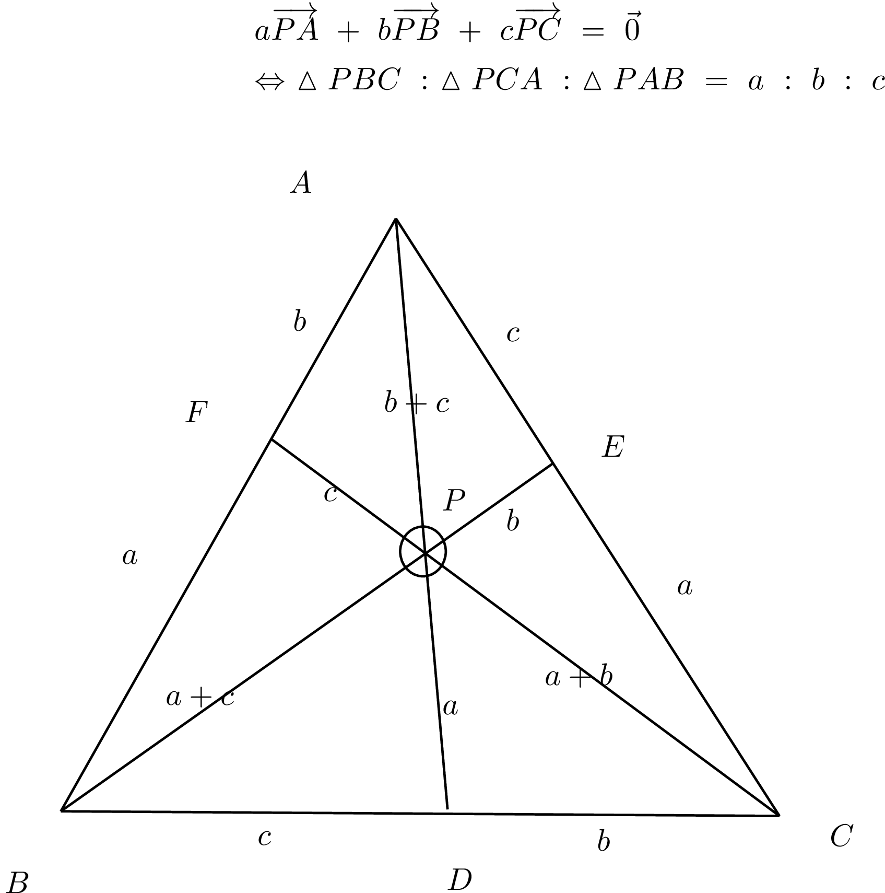
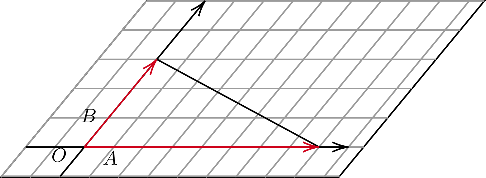
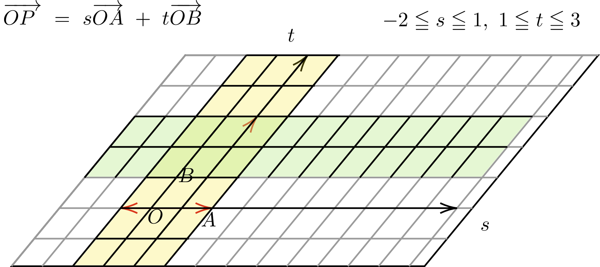

# 座標、ベクトル

## Q0 記法について

??? success

    ### メモ

    ```text
    通常、ベクトル表記には太字を用いる。latexでいうと、\mathbf{}等
    高校生までなら、矢線表記。latexでいうと\vec{}等を用いた
    本項では、黒板文字、つまり\mathbb{}を用いる

    --> 実数集合や複素数集合等と誤認するリスクがあるので通常
        ベクトルに対し黒板文字は用いられない
        ただし、latexではなくコードブロックで記載する際の労力
        (太字は通常文字と区別がつかない)を鑑み、以下では黒板文字になっている
    
    --> あくまで学習スピードとの兼ね合いを考えたうえでの判断なので
        実際にどこかに提出するような文書については、ベクトルは太字表記すること
    ```

## Q1 内分、外分
??? success

    ### 直線上の内分、外分

    ```text
    [内分点]
      ABをm:nに内分する点P
        --> AP : PB = m : nを満たす点で、線分ABの内側にあるもの
    
    [外分点]
      ABをm:nに外分する点Q
        --> AQ : PB = m : nを満たす点で、線分ABの外側にあるもの
    
    [例]
      AB=40 ∧ PがABを3:1に内分する点
      --> AP = 30, BP = 10

      AB =20 ∧ QがABを3:1に外分する点
      --> AQ : QB = 3 : 1
          AQ = 30
          QB = 10
    ```

    ### 座標上の内分点と外分点

    ```text
    [定理]
      A(xA, yA), B(xB, yB)の時

      線分ABをm:nに内分する点Pの座標は

      (x,y) = {(nxA + mxB) / (m + n), (nyA + myB) / (m + n)}

      線分ABをm:nに外分する点Pの座標は

      (x,y) = {(-nxA + mxB) / (m - n), (-nyA + myB) / (m - n)}

      --> これはn次元に拡張できる。つまり数直線上の座標も同様に求められる
    
    [使用例]
      AB =20 ∧ QがABを3:1に外分する点
      A = 0, B = 20とすると
      Qの座標は
      3*0 + 20*3 / (3-1) = 30
      よって、Q = 30
      よってAQ = 30, BQ = 30-20 = 10

    [証明：内分]
      xy座標平面上で2点A,Bと、線分ABをm:nに内分する点P(x,y)が存在する時
      A(xA, yA), B(xB, yB)とおくと

      前件より
      (x - xA) : (xB - x) = m : n
      n(x - xA) = m(xB - x)
      nx - nxA = mxB - mx
      (m+n)x = nxA + mxB
      x = (nxA + mxB) / (m+n)
      yも同様にして証明可能
    
    [証明:外分]
      xy座標平面上で2点A,Bと、線分ABをm:nに外分するQ(x,y)が存在する時
      A(xA, yA), B(xB, yB)とおくと
      m > nの時
      AQ : QB = m : nより

      (x - xA) : (x-xB) = m : n
      m(x - xB) = n(x - xA)
      (m-n)x = (-nxA + mxB)
      x = (-nxA + mxB) / (m-n)

      --> m : -nに内分と考えることもできる

      m < nの時も同様にできるが
      マイナスを消すため、分子分母に-1をかけて
      x = (nxA - mxB) / (n -m)とするかもしれない

      m = nの時は分母が0になるため、外分の公式は成り立たない
    ```

## Q2 重心と座標平面

??? success
    ### 重心と座標平面

    ```text
    [定理]
    △ABCについて、A(xA, yA), B(xB, yB), C(xC, yC)とすると
    重心の座標は{(xA + xB + xC) / 3 ,  (yA + yB + yC) / 3}と表せる
    つまり、各頂点の平均の座標となる

    [証明]
      BCの中点Dは{(xB+xC)/2, (yB+yC)/2}と表せる
      ここで、重心Pは
      ADを2:1に内分する点であるため、内分点の公式を用いて

      x = {xA + 2(xB+xC)/2} / 3 = (xA + xB + xC) / 3 
      y = {yA + 2(yB+yC)/2} / 3 = (yA + yB + yC) / 3 

    ```

## Q3 平面上、空間上の2点間の距離

??? success
    ### 平面、空間上の2点間の距離

    ```text
    [定義：ユークリッド距離]
      直交座標系において、n次元ユークリッド空間内の
      2点A(a_1,a_2,...,a_n), B(b_1,b_2,...,b_n)の距離を
      d = √{(a_1 - b_1)² + (a_2 - b_2)² + ... + (a_n - b_n)²}と定義する

    [つまり]
      A(a_x,a_y), B(b_x, b_y)の距離は
      d = √{(a_x - b_x)² + (a_y - b_y)²}

      A(a_x,a_y,a_z), B(b_x, b_y, b_z)の距離は
      d = √{(a_x - b_x)² + (a_y - b_y)² + (a_z - b_z)²}
    
    [例]
      (3,3), (6,7)の距離dは
      d = √(3)² + (4)² = 5


    ```

## Q4 円の方程式

??? success

    ### 円の方程式

    ```text
    [定理]
      中心が(a,b)で半径がrの円の方程式は
      (x-a)² + (y-b)² = r²で表せる
    
    [証明]
      ※円：ある点(円の中心)から等距離にある点の集合

      円の定義より、円周上から任意の座標を2つ選んだ時、円の中心
      と2つの座標の距離は等しい

      中心が(a,b)で半径がrの円について
      円周上のとある座標を(x,y)とおくと、ユークリッド距離の定義より
      (a,b)と(x,y)の距離は
      r = √{(x-a)² + (y-b)²}

      よって、中心(a,b), 半径rの円周上の座標ならば
      (x-a)² + (y-b)² = r²を満たす

      逆に(x-a)² + (y-b)² = r²を満たすならば
      距離の定義より、(x,y)と(a,b)の距離はrであるため
      (x,y)は中心(a,b)から等距離rだけ離れた点の集合の要素である
      これは言い換えれば(x,y)が中心(a,b),半径rの円周上の座標であることに等しい


      よって、
      (x,y)が中心が(a,b)で半径がrの円周上の座標 ⇔ (x-a)² + (y-b)² = r²

    [円の方程式の一般形]
      x² + y² + lx + my + n = 0は
      l² + m² - 4n > 0のとき円を表す
      円の中心と半径については平方完成で求まる

    
    [例]
      x²+y² + 2x + 4y - 11 = 0
      (x+1)² - 1 + (y+2)² - 4 - 11 = 0
      (x+1)² + (y+2)² = 4²
      中心が(-1,-2)で半径が4の円になった

    [つまり]
      x² + y² + lx + my + n = 0
      ⇔ (x+l/2)² + (y+m/2)² = l²/4 + m²/4 - 4n/4
      円であるためには半径 > 0である必要があるので

      (l² + m² - 4n) > 0
      である必要があるというだけの話
    ```

    ### 直径の両端が判明している場合の円の方程式

    ```text
    (2,3),(4,1)が直径の両端である場合の円の方程式を求めよ
    円の中心は両端の中点にあるため(3,2)

    円周上の点(2,3)までの距離は
    d = √{(1)² + (1)²} = √2

    よって
    (x-3)² + (y-2)² = 2

    [復習]
      円の位置関係
      x² + y² - 4x -6y + 9 = 0 ...(1)
      x² + y² + 4x - 5 = 0 ...(2)

      (x-2)² + (y-3)² = 4
      (x+2)² + y² = 9
      よって、(1)は(2,3)中心で半径2
      (2)は(-2,0)中心で半径3

      中心間の距離はd = √4²+3² = 5
      半径の合計は5なので r_1 + r_2 = dであるため
      二つの円は外接する
    ```

## Q5 円の接線の方程式

??? success

    ### 円の接線の方程式

    ```text
    [定理]
      座標平面において円: x² + y² = r²上の点(x_0, y_0)を接点とする
      接線の方程式は
      x_0x + y_0y = r²
    
    [証明]
      [i] x_0, y_0 ≠ 0の場合
      円の中心(0,0)と、(x_0,y_0)を通るような直線の傾きは y_0 / x_0
      接点を通る円の半径と接線は垂直に交わるので
      接線の傾きは -x_0 / y_0となる

      接線の方程式は(x_0, y_0)を通るので
      y - y_0 = (-x_0 / y_0)(x - x_0)
      y = (-x_0 / y_0)(x - x_0) + y_0
      y_0y = -x_0x + (x_0)² + (y_0)²
      x_0x + y_0y = (x_0)² + (y_0)²

      接点(x_0, y_0)は円x² + y² = r²上の点なので
      x_0x + y_0y = r² ...(1)

      [ii]
      x_0 = 0の場合
      y_0 = ±rであり
      接線の傾きは y = ±r。これは(1)を満たす

      [iii]
      y_0 = 0の場合
      x_0 = ±rであり
      接線の傾きは x = ±r。これは(1)を満たす

      [i]~[iii]より原点を通る円の接線の方程式はx_0x + y_0y = r²


    [中心が(a,b)の時の円の場合:定理]
      座標平面において円(x-a)² + (y-b)² = r²上の点
      (x_0, y_0)における接線の方程式は

      (x_0 - a)(x - a) + (y_0 - b)(y- b) = r²

    [証明]
      中心(a,b)で半径r上の点(x_1, y_1)における円の接線の方程式について求めたい

      原点中心の円の接線の方程式については得られているため
      図形全体をx-軸方向に-a,y-軸方向に-bだけ平行移動すると

      中心(0,0)で半径r上の点(x_1 - a, y_1 - b)における円の接線の方程式は
      (x_1 - a)x + (y_1 - b)y = r²

      元に戻すように図形全体をx-軸方向にa, y-軸方向にbだけ平行移動すると
      中心(a,b)で半径r上の点(x_1, y_1)における円の接線の方程式は
      (x_1 - a)(x - a) + (y_1 -b)(y - b) = r²

      ※平行移動の概念に基づき、x,yについて変更を加えるのみ
        x_1,x_0等に-a,+aとしないよう注意すること
    
    [例]
      x² + y² = 25上の点(3,4)における接線の方程式

      x_0 = 3, y_0 = 4なので
      3x + 4y = 25
    
    [例2]
      中心(3,1), 半径5の円の(6,5)における接線の方程式

      (x-3)² + (y-1)² = 5

      x_1 = 6, y_1 = 5なので
      (x_1 - a)(x - a) + (y_1 - b)(y - b) = r²に当てはめて
      (6-3)(x-3) + (5-1)(y-1) = 25
      3(x-3) + 4(y-1) = 25
      3x + 4y = 38
    ```

    

    ### 複素数平面上の円の方程式

    ```text
    複素数z = a + biの絶対値|z|は
    |z| = √(a² + b²)のようにあらわせた

    また、極座標で考えると、これは原点からの複素数平面上の距離であった


    ここで、中心が3 - 2iで、半径が3の円の方程式について考える
    円は定義より、中心からの距離が等距離である点の集合なので

    未知数をz, 中心をα, 半径をrとすると
    |z - α| = rが円の方程式になる

    [変形version]
      |z-α| = r ...(1)
      |z-α|² = r² ...(2)
      zとその共役複素数\bar{z}の積は|z|²なので
      (z-α)*\bar{z-α} = r² ...(3)
      共役と引き算は順序を交換できるので
      |z|² - z\bar{α} - \bar{z}α + |α|² = r² ...(4)

      (1)~(4)の式変形した形もすべて円の方程式になる
    ```

## Q6 媒介変数表示

??? success

    ### 媒介変数表示

    ```text
    [意味合い]
      ・関連する変数同士の関係をほかの変数を用いて表すこと
      ・Θ,t等が主に表示として使われる
      ⇒パラメータ表示と呼ばれることもあり

    [例]
      x = pt²
      y = 2pt

      --> tを用いて間接的にxとyの関係性を表している
      --> tが決まれば、x,yの双方が決まるためxy座標平面上の1点が定まる

    [円の方程式と媒介変数表示]
      原点を中心とする半径aの円は
      x² + y² = aで表せる

      円周上の点をP(x,y)とし、
      点Pを、A(a,0)をΘだけ原点中心で回転させた点だと考えると

      x = acosΘ
      y = asinΘと表せる

      Θを用いて円周上の点の座標を表せているので、これは円の媒介変数表示といえる

    [使用例]
      原点中心の半径aの円周上の点(x,y)に対して、x + yが最大になる時を考えよ
      x = acosΘ, y = asinΘより
      x + y = asinΘ + acosΘ
      三角関数の合成を用いると
      x + y = √(a² + a²)sin(Θ + α)
      = (√2)asin(Θ + α)

      ただしαはcosα = a / √2a, sinα = a / √2aを満たすので
      α = π/4
      よって、
      x + y =  (√2)asin(Θ + π/4)
      
      ここからx + yの最大値が√2aであることがわかる
      またその時のΘ = π/4なので、x = y = (1/√2)aとなる

    [円と直線の媒介変数表示]
      単位円x²+y² = 1について、点A(-1,0)を通る傾きtの直線について
      単位円との点A以外の交点が存在するものとする。この時その交点を求めよ

      点A(-1,0)を通り、傾きtなので
      この直線の方程式はy = t(x+1)となる。
      ただし(x = -1の時、交点は1になるのでx ≠ -1)
      また交点はx²+y² = 1上に存在するので

      x² + {t(x+1)}² = 1
      x² + t²(x+1)² = 1
      (x+1)(x-1) + t²(x+1)² = 0
      (x+1){(x-1) + t²(x+1)} = 0
      (x+1){(t²+1)x + (t²-1)} = 0

      x≠-1なので
      (t²+1)x + (t²-1) = 0
      x = (1-t²) / (1+t²)

      よって、y = t(x+1)は
      y = t{(1-t² + 1 + t²) / (1+t²)}
      = t(2 / 1+t²)と表せる

      よって、
      y = 2t / (1+t²)

      つまり、単位円の円周上の点のうち(-1,0)を除いた点は
      x = (1-t²) / (1+t²)
      y = 2t / (1+t²)
      を用いて表現可能

      また、半径rの円周上の点なら
      x =  r(1-t²) / (1+t²)
      y = 2rt / (1+t²)となる

      2sin(Θ/2)cos(Θ/2) = 2(sin(Θ/2) / cos(Θ/2)) 
      ※Θを用いた媒介変数表示にすると
        ∠PAOは円周角の定理より、中心角をΘとすると、(1/2)Θと表せるので
        tが傾きであることから
        t = tan(1/2)Θと表せる

        単位円上の座標(x,y)は動径とx-軸の正の向きのなす角をΘとすると(cosΘ,sinΘ)
        で表せるので、これは(cosΘ,sinΘ)をtan(1/2)Θを用いて表していた
        と考えることができる

      ※確かにΘを用いると以下のように変形可能
      y = sinΘ = 2sin(Θ/2)cos(Θ/2)

      y = 2t / (1+t²)
      = 2(tan(1/2)Θ) / (1 + (tan(1/2)Θ)²)
      = 2sin(Θ/2) / 2cos(Θ/2)({cos²(Θ/2) + sin²(Θ/2)} )/ cos²(Θ/2)
      = 2sin(Θ/2) / 2(cos²(Θ/2) + sin²(Θ/2)) / cos(Θ/2)
      = 2sin(Θ/2)cos(Θ/2) / 2
      = sinΘ

    ```

    ### 半角のtanを用いて三角関数の媒介変数表示

    ```text
    [考え方]
      始線と動径のなす角をΘと置いた場合
      単位円周上の座標(x,y)は(cosΘ, sinΘ)と表せる

      この時、A(-1, 0)とP(x,y)を通る直線の傾きをtと置くと
      ∠PAOは円周角となり、中心角がΘであることから
      t = tan(Θ/2)となる

      この時、tを用いてcosΘ, sinΘを表現できるということは
      tan(Θ/2)を用いて、cos, sin, tanのいずれをも表現できるということである
    
    [半角のtan]
      t = tan(Θ/2)としたとき。ただしt ≠ ± 1 (tan90°, -90°は未定義なので)
      sinΘ = 2sin(Θ/2)cos(Θ/2)
      = 2tan(Θ/2) * cos²(Θ/2)
      
      1/cos²Θ = 1 + tan²Θより
      = 2tan(Θ/2) / (1 + tan²(Θ/2))
      = 2t/ (1 + t²)

      cos(2Θ) = 2cos²Θ - 1より
      cosΘ = 2cos²(Θ/2) - 1
      = 2 / (1 + tan²(Θ/2)) - 1
      = 2/(1+t²) - 1
      = (1-t²) / (1+t²)

      tanΘ = sinΘ / cosΘより
      = 2t / (1-t²)
    ```

## Q7 垂直二等分線

??? success
    ### 垂直二等分線の式

    ```text
    [定理]
      座標平面上の2点(x1,y1), B(x2,y2)を結んだ直線の垂直二等分線は

      (x2-x1)x + (y2-y1)y = {(x2² - x1²) / 2} + {(y2² - y1²) / 2}
    
    [証明]
      直線ABの傾きは(y2-y1) / (x2 -x1)
      よって垂直二等分線の傾きは
      -(x2 - x1) / (y2 - y1)となる ...(1)

      垂直二等分線はABの中点を通過するので
      {(x1+x2)/2, (y1+y2)/2}を通る。つまり

      y =  {-(x2 - x1) / (y2 - y1)}(x - (x1+x2)/2) + (y1+y2)/2
      y =  {1/(y2 - y1)}{-x(x2-x1) +(x1+x2)(x2-x1)/2} + (y1+y2)/2
      (y2 - y1)y =  {-x(x2-x1) +(x1+x2)(x2-x1)/2} + (y1+y2)(y2 - y1)/2
      (x2 -x1)x + (y2 -y1)y = (x1+x2)(x2-x1)/2 + (y1+y2)(y2 - y1)/2
      (x2 -x1)x + (y2 -y1)y = (x2²-x1²)/2 + (y2² - y1²)/2

      ※垂直であれば、傾きの積は-1
        1つの直線の傾きをtanΘとしたとき、
        垂直であれば、他方の直線の傾きはtan(Θ + 90°)となる
        (tan(Θ - 90°)としても結果は同じ)
        垂直である二直線の傾きの積は tanΘ * tan(Θ + 90°)に等しい
        tan(Θ + 90°) 
        = sin(Θ + 90°) / cos(Θ + 90°)
        = {sinΘcos90° + cosΘsin90°} / {cosΘcos90° - sinΘsin90°}
        = cosΘ / -sinΘ
        = -(cosΘ / sinΘ)

        tanΘ * tan(Θ + 90°)
        = (sinΘ / cosΘ)*-(cosΘ / sinΘ)
        = -1
    ```

## Q8 ベクトルの意味

??? success
    ### ベクトルについて

    ```text
    [高校数学では]
      ・向きと大きさを持った量
    
    [大学数学では]
      ・ベクトル空間の元
      ・線型性を持つ
      ・和とスカラー倍をとることができる量

      --> 足し算とスカラー倍ができるような代数系 = ベクトル空間(線型空間)

      --> 代数系：集合と集合上で定義された演算の組み合わせ
                　※A上の二項演算 --> A*A --> A (閉性を持っている)
      
      ※(ベクトル; 加法, スカラー倍, ...)
        つまり、ベクトル同士の足し算や、ベクトル同士のスカラー倍は可能
    ```

## Q9 位置ベクトル

??? success

    ### 位置ベクトル

    ```text
    [有向線分]
      ・長さと方向を持つ線分
    
    [スカラー]
      大きさという1種類の情報によって表現される量
    
    [ベクトルと有向線分]
      ・長さと方向を持つという点で一致するため
        ベクトルは有向線分を用いて幾何的に表現される
      
      ・ただし、有向線分は始点と終点をもち
        ベクトルは位置を問題としない
    
    [有向線分と座標]
      ・空間上にあるそれぞれの点の位置を座標と呼ばれる実数の組として表現すると
        有向線分の「始点」と「終点」も座標で表現できることがわかる
      
      ・実数上n次元空間ℝ^nにおける点の座標は、n個の実数からなるため
        以下のようにあらわせる

        (x_1, ..., x_n) ∊ ℝ^n

      ・よって、有向線分の始点と終点の座標は以下のようにあらわせる
        始点Xの座標 : {(x_1, ..., x_n) ∊ ℝ^n | x_i ∊ R}
        終点Yの座標 : {(y_1, ..., y_n) ∊ ℝ^n | y_i ∊ R}
      
      ・上記より、有向線分の長さは、始点と終点を結んだものであるため
        始点と終点が定まれば有向線分が、
        有向線分が定まれば始点と終点が定まる
      
    
    [ベクトルと位置]
      ・ベクトルは、「大きさ」と「向き」という2つの情報から構成される
      ・位置を変えても、ベクトルとしては変化しない
        --> すべての有向線分の始点を原点に統一するよう平行移動しても、
            2つの情報は変化しない
        --> 有向線分の始点を統一すれば、大きさと向きの差が明確になるという
            メリットもある
    
    [位置ベクトル]
      ・任意の座標に存在するすべての有向線分の始点が
        空間ℝ^nの原点Oとなるよう平行移動する

      ・この時、始点と終点を結んだ線分の傾きと
        平行移動前の有向線分の「向き」

      ・線分の長さと、平行移動前の(任意の場所に存在した)有向線分の「大きさ」は
        平行移動しただけなので一致する
      
      ・よって任意のベクトルの情報(大きさ, 向き)は、始点を原点に統一した有向線分、
        ひいては、終点の座標を用いて表現可能

        𝕒 = (a_1, a_2, ..., a_n)

        この時、𝕒を構成するa_iを、𝕒の成分と呼び
        上記のような表記法を、ベクトルの成分表示という

        また、始点を原点に統一したようなベクトルを位置ベクトルといい
        原点Oから点Aまでのベクトル𝕆𝔸を
        点Oに対する点Aの位置ベクトル𝕒等と呼称し、
        点Aを表す位置ベクトルが𝕒であることを、A(𝕒)と表記する

        これは言い換えれば、任意のベクトルは位置ベクトルで表現可能である
        ということを意味してもいる
    ```

## Q10 列ベクトルと行ベクトル

??? success

    ### 列ベクトルと行ベクトル

    ```text
    [列ベクトルと行ベクトル]
      列ベクトル : n×1行列
        --> 𝕒 = {
              a_1,
              a_2,
              ...,
              a_n
            }
      行ベクトル : 1×n行列
        --> 𝕒 = (a_1, a_2, ..., a_n)

      m×n行列
        --> (
          a_11, a_12, ..., a_1n
          a_21, a_22, ..., a_2n,
          ...,  ...,  ..., ...,
          a_m1, a_m2, ..., a_mn,
        )
      
      行列同士の演算の場合、列ベクトル、行ベクトルには違いがある
      ただし、幾何的に向きと大きさの実を表したい場合、違いは出ない
    ```

    ### 数ベクトル

    ```text
    ・数を並べたものを、ベクトルという一つの塊として扱ったもの
    ・行ベクトルも、列ベクトルも数ベクトル
    
    ```

    ### 数ベクトルの定義(実数)

    ```text
    ℝ^n = {(x_1, x_2, ..., x_n) | x_k ∊ ℝ}とする。

    𝕒 = (a_1, a_2, ..., a_n) ∊ ℝ^n
    𝕓 = (b_1, b_2, ..., b_n) ∊ ℝ^n
    に対して、和、実数倍を
    𝕒 + 𝕓 = (a_1 + b_1, ..., a_n + b_n)
    k𝕒 = (ka_1, ..., ka_n)
    のように定義したとき、ℝ^nをℝ上n次元数ベクトル空間といい
    その元を数ベクトルという

    [例]
    n = 2の時、ℝ² = {(x_1, x_2) | x_1, x_2 ∊　ℝ}は
    平面ベクトル(ℝ上2次元数ベクトル空間)
    n = 3の時、ℝ³ = {(x_1, x_2, x_3) | x_1, x_2, x_3 ∊　ℝ}は
    空間ベクトル(ℝ上3次元数ベクトル空間)

    --> 実数体ℝからn個の実数をとって順序をつけた順序対と考えられる
        和、積は成分同士で行われる
    
    --> 実数空間ℝは、加法+について閉性を持つので
        + : ℝ^n × ℝ^n --> ℝ^n
        よって、𝕒 + 𝕓は、ℝ^n上の1つの点として定まることが保証される
    
    ※　ℝ^n, ℝ^(n-1)のような異なる空間に属するベクトルについて考えたとき
      　加法、或いはベクトル加法は定義されない
    ```

## Q11 ベクトル和とスカラー倍

??? success

    ### ベクトル和(数ベクトルの定義より)

    ```text
    原点Oを設定したうえで、
    ℝ上2次元空間上に存在する2点X,Yを選び、これらの点の位置ベクトルを
    (x_1, x_2) ∊ ℝ²
    (y_1, y_2) ∊ ℝ²で表現する

    この時、
    𝕆𝕏の終点座標は、(x_1, x_2)
    𝕆𝕐の終点座標は、(y_1, y_2)となる

    数ベクトルの定義より,2つのベクトルのベクトル和は、
    𝕩 + 𝕪 = (x_1 + y_1, x_2 + y_2) ∊ ℝ²
    ```

    ### スカラー倍

    ```text
    実数a∊ℝと、ベクトル𝕩∊ℝ^nをそれぞれ任意に選んだ時、
    𝕩のそれぞれの成分をa倍することにより得られる新たなベクトルを

    a𝕩 = (ax_1, ..., ax_n)で表記する
    また、これをaによる𝕩のスカラー倍と呼ぶ

    --> 実数空間ℝは乗法について閉じているので、
        成分ax_iは、1つの実数として定まる
    --> 数ベクトルの定義とも一致している

        よって、a𝕩 ∊ ℝ^n
    ```

## Q12 ベクトルの単位元、逆元

??? success

    ### ベクトルと単位元

    ```text
    [スカラー倍の単位元]
      ℝにおける乗法の単位元である1は、スカラー乗法単位元である
      1𝕩 = 𝕩

    [零ベクトル]
      すべての成分が0であるようなベクトルを零ベクトルという
      𝟘 = (0, 0, ..., 0)
    
    [ベクトル和の単位元]
      𝟘は、ベクトル加法単位元である
      𝕩 + 𝟘 = 𝕩
    ```

    ### ベクトルと逆元

    ```text
    ・ベクトル𝕩 = (x_1, ..., x_n)に対し、
      -𝕩 = (-x_1, ..., -x_n)を𝕩の逆ベクトルという
    
    ・この時
      𝕩 + (-𝕩) = 𝟘

    ・ベクトルの各成分x_iに対して、その加法逆元-x_iは一意的に定まるので
      任意のベクトル𝕩に対して、その逆ベクトル-𝕩も一意に定まる
    
    ・逆ベクトルは、各成分同士を元のベクトルと足すと和がいずれも0になることから
      向きが逆で、大きさが等しいベクトルと考えられる

      始点と終点が逆になったベクトルは
      向きが逆で、大きさが等しいため
      𝕆𝔸の逆ベクトルは、-𝕆𝔸であり、𝔸𝕆

      ※ベクトル𝕆𝔸 : 始点O, 終点A
        ベクトル𝔸𝕆 : 始点A, 終点O

      また逆ベクトルの逆ベクトルについて考えると、
      向きが2度逆になるため、これは元のベクトルと同一になる

      つまり、𝕆𝔸 = -𝔸𝕆 = -(-𝕆𝔸)である
    ```


## Q13 同一方向、反対方向

??? success

    ### 同一方向、反対方向

    ```text
    [同一方向]
      2つのベクトル𝕩,𝕪 ∊ ℝ^nについて、a > 0のもとで
      𝕪 = a𝕩であるとき、
      𝕩,𝕪は同一方向にあるという

    [反対方向]
      2つのベクトル𝕩,𝕪 ∊ ℝ^nについて、a < 0のもとで
      𝕪 = a𝕩であるとき、
      𝕩,𝕪は反対方向にあるという
    ```

## Q14 ベクトルの法則

??? success

    ### 交換律、結合律, 互換性

    ```text
    [交換律]
      𝕩 + 𝕪 = 𝕪 + 𝕩
    
    [結合律]
      (𝕩 + 𝕪) + 𝕫 = 𝕩 + (𝕪 + 𝕫)

    
    [互換性]
      a(b𝕩) + (ab)𝕩
    
    [分配律]
      a(𝕩 + 𝕪) = a𝕩 + a𝕪
      (a + b)𝕩 = a𝕩 + b𝕩
    ```

    ### 相当性

    ```text
    二つのベクトル𝕩,𝕪が同一次元空間に存在し、
    対応する成分がすべて等しい場合𝕩,𝕪は等しいといい

    𝕩 = 𝕪と表す
    ```

## Q15 一般のベクトルの位置ベクトル表記

??? success


    ### 一般のベクトルと位置ベクトル

    ```text
    [定理]
    原点をOとして、2点A(𝕒), B(𝕓)を結ぶベクトル𝔸𝔹は、
    𝔸𝔹 = 𝕆𝔹 - 𝕆𝔸 = 𝕓 - 𝕒と表せる

    [考え方]
      始点Aから終点Bまでのベクトルの長さと向きは、
      Bの各成分から、Aの各成分を引けば求まる

    [導出]
      𝕆𝔸 = (a_1, ..., a_n) ∊ ℝ^n
      𝕆𝔹 = (b_1, ..., b_n) ∊ ℝ^n
      とする。この時、
      始点がAであり終点がBであるような有向線分を位置ベクトルとして表現するには
      始点Aを原点Oと一致するように平行移動する必要がある

      大きさと向きを変えないように, 始点をAからOに平行移動した場合
      当然、終点の座標も現在の座標から、移動した分だけ変動する

      現在の終点座標は、
      𝕆𝔹 = (b_1, ..., b_n) ∊ ℝ^n

      変動量は𝔸𝕆
      よって、平行移動後の終点座標は、
      𝕆𝔹 + 𝔸𝕆と考えられる

      𝔸𝕆は𝕆𝔸の逆ベクトルであるため
      𝔸𝕆 = -𝕆𝔸

      -𝕆𝔸は𝕆𝔸の逆ベクトルなので
      𝕆𝔸 = (-a_1, ..., -a_n) ∊ ℝ^nと表せる

      よって、
      𝕆𝔹+ (-𝕆𝔸)
      = (b_1 - a_1, ..., b_n - a_n)

      つまり、
      𝔸𝔹 = 𝕆𝔹+ (-𝕆𝔸)

      [ベクトル差の定義]
        𝕆𝔹 - 𝕆𝔸 = 𝕆𝔹 + (-𝕆𝔸)と定義する
        よって、𝔸𝔹 = 𝕆𝔹+ (-𝕆𝔸) = 𝕆𝔹 - 𝕆𝔸
  
        任意のベクトルの成分座標は
        各成分の終点から各成分の始点の数を引くことで求まるとわかる

      [※交換律から考える場合]
      𝕆𝔹 - 𝕆𝔸 = 𝕆𝔹 + 𝔸𝕆 = 𝔸𝕆 + 𝕆𝔹 = 𝔸𝔹
    ```

## Q16 ベクトルの合成、分解

??? success

    ### 一般のベクトル同士の足し算

    ```text
    原点Oについて、以下であるとき
    A(𝕒) = (a_1, ..., a_n)
    B(𝕓) = (b_1, ..., b_n)
    C(𝕔) = (c_1, ..., c_n)
    𝔸𝔹 = (b_1 - a_1, ..., b_n - a_n)
    𝔹ℂ = (c_1 - b_1, ..., c_n - b_n)
    ```

    ### ベクトルの合成

    ```text
    𝔸𝔹 + 𝔹ℂ
    = 𝕆𝔹 - 𝕆𝔸 + 𝕆ℂ - 𝕆𝔹
    = 𝕆ℂ - 𝕆𝔸
    = 𝔸ℂ
    と表せる
    --> 2つのベクトルについて一方の終点と、他方の始点が同じであるとき
        ベクトルは合成可能
    --> 1つのベクトルを、2つのベクトルに分解することが可能であるともいえる

    𝔸𝔹 + 𝔹ℂ ⇔ 𝔸ℂ

    ```

    ### 合成と平行四辺形

    ```text    
    ベクトルの加法は交換律が成り立つので
    𝔸𝔹 + 𝔹ℂ = 𝔹ℂ + 𝔸𝔹 = 𝔸ℂ

    いま、𝔸𝔹の始点と終点をそれぞれ、点A, 点Bとし、
    𝔹ℂの始点と終点をそれぞれ点B,点Cとしても、
    上記は成り立つ

    また、𝔹ℂの始点を点Aまで平行移動し、
    その終点が𝔸𝔹の始点となるよう平行移動しても
    2つのベクトルを合成した結果は同様となる

    ここで、𝔸𝔹はベクトルなので、
    平行移動する前と後で向きは等しく、長さも等しい
    よって、点A,B,C,平行移動後の𝔹ℂの始点は、平行四辺形の頂点となる

    また、点A,Cは対角の頂点となるため
    合成した後のベクトルは、合成前の2ベクトルの始点を合わせたものを
    辺に持つ平行四辺形の対角線といえる
    ```

    ### 終点と始点が一致しない場合の和

    ```text
    𝔹𝔸 + 𝔹ℂの場合
    𝔹𝔸 = (a_1 - b_1, ..., a_n - b_n)
    𝔹ℂ = (c_1 - b_1, ..., c_n - b_n)

    𝔹𝔸 + 𝔹ℂ
    = (a_1 + c_1 - 2*b_1, ..., a_n + c_n - 2*b_n)
      --> ベクトル和のやり方に従って、普通に成分同士を足せばいい
    ```

## Q17 ノルム

??? success

    ### ノルム

    ```text
    ベクトル𝕩 ∊ ℝ^nが与えられたとき、
    ||𝕩|| = √(x_1² + ... + x_n²)を𝕩のL2-ノルム(ユークリッド距離)という

    (※本来は、||𝕩||₂)
    (※高校数学では、|𝕩| = √(x_1² + ... x_n²)と定義し
      これをベクトルの大きさと表現している)
    
    --> 普段我々が、平面座標で点Oと点Xとの距離を求めるとき
        上記のような計算を行う。
    --> つまり高校数学で出てくる距離は、特に定めがない限り
        ユークリッド距離を意味している
    
    [ノルムは以下の性質を満たす必要がある]
      ||𝕩|| ≧ 0
      ||𝕩|| = 0 ⇔ 𝕩 = 𝟘
      ||k𝕩|| = |k|||𝕩||
      ||𝕩+𝕪|| ≦ ||𝕩|| + ||𝕪||

      --> 実際、ユークリッドノルムはこの性質を満たしている
    
    [2点間の距離(ベクトル)]
      ||𝕩 - 𝕪|| = √{(x_1 - y_1)² + ... (x_n - y_n)²}
    ```

## Q18 単位ベクトル

??? success

    ### 単位ベクトル

    ```text
    ||𝕩|| = 1が成り立つ場合、𝕩を単位ベクトルという

    例)
    𝕩 = (1, 0)
    𝕩 = (0, 1)
    𝕩 = (1/2, √3/2)

    [平行な単位ベクトルの求め方]
      𝕩 = (2,1)と平行な単位ベクトル

      |𝕩| = √5なので
      それぞれの成分を√5で割れば、|𝕩| = 1となる
      よって、

      ±(2/√5, 1√5)
      --> 「平行な」なので反対方向のものも求めた

    [正規化]
      同じ向きで長さを1にする操作
    ```

    ### 単位ベクトルの公式

    ```text
    ベクトル𝕩と同じ向きの単位ベクトルは𝕩 / |𝕩|で求まる
    ```

    ### 零ベクトルでない一般のベクトルを単位ベクトルとの積で表す

    ```text
    任意の零ベクトルではない𝕩は、
    𝕩 = |𝕩| * (𝕩 / |𝕩|)で表せる
      --> つまり大きさと向きの積ともとれる
    ```

    ### 𝕩 / |𝕩|が単位ベクトルであることを示す

    ```text
    ベクトル𝕩 = (x_1,...,x_n)のノルムは|𝕩|で表せる
    |𝕩| = √{(x_1)² + ... (x_n)²}

    単位ベクトルは、ノルムが1であるベクトルなので
    𝕩 / |𝕩|のノルムが1であることを示せばいい

    𝕩 / |𝕩|
    = (x_1 / |𝕩|, ..., x_n / |𝕩|)
    であることから、ノルムを求めると

    |𝕩 / |𝕩||
    = √{(x_1 / |𝕩|)² + ... (x_n / |𝕩|)²}
    --> ベクトルの各成分をノルムで割った結果のノルム
    = (1 /|𝕩|)√{x_1² + x_2² + ... + x_n²}
    = (1 /|𝕩|)|𝕩|
    = 1
    ```


## Q19 内積

??? success

    ### 内積の定義
    ```text
    [ドット積の定義]
      2つのベクトル𝕒 = (a_1, ..., a_n)と 𝕓 = (b_1, ..., b_n)
      のドット積は以下のように定義される

      a・b = Σ_{i=1}^n a_ib_i = a_1*b_1 + a_2*b_2 + ... + a_n*b_n
      --> ドット積を考えるうえでは、次元数が一致している必要がある
    ```

    ### 内積のcos表記

    ```text
    [定理]
      <𝕒,𝕓> = |𝕒||𝕓|cosΘ
      ※<・,・>は内積を意味する
    
    [証明]
      点Oを原点とし、𝟘でない2つのベクトルを以下のように定める
      𝕒(a_1, a_2), 𝕓(b_1, b_2)
      
      ただし、A(𝕒), B(𝕓)
      
      [i]
      2つのベクトルが同一直線上に存在しない場合
      ∠AOBの大きさΘ(0<Θ<180°)は、𝕒, 𝕓のなす角となる

      △OABについて余弦定理を用いると
      BA² = OA² + OB² - 2OA*OB*cosΘ ...(1)

      ※BAの長さは、始点Bから終点Aまでの有向線分の大きさと一致する
        よって、𝔹𝔸 = √{(a_1 - b_1)² + (a_2 - b_2)²} = |𝕒 - 𝕓|

      (1)をベクトルで表記すると
      |𝕒 - 𝕓|² = |𝕒|² + |𝕓|² - 2|𝕒||𝕓|cosΘとなる

      また、2-ノルムより以下のようにあらわせるので
      |𝕒|² = (√{(a_1)² + (a_2)²})² = (a_1)² + (a_2)²
      |𝕓|² = (b_1)² + (b_2)²
      |𝕒 - 𝕓|² = (a_1 - b_1)² + (a_2 - b_2)²

      (a_1 - b_1)² + (a_2 - b_2)²
      = (a_1)² + (a_2)² + (b_1)² + (b_2)² -2|𝕒||𝕓|cosΘ

      両辺を整理すると
      -2(a_1*b_1 + a_2*b_2) = -2|𝕒||𝕓|cosΘ
      𝕒・𝕓 = |𝕒||𝕓|cosΘ

      --> 逆をたどれば、𝕒・𝕓 = |𝕒||𝕓|cosΘから 𝕒・𝕓 = a_1*b_1 + a_2*b_2
          も導ける
      
      --> |𝕒 - 𝕓|² = |𝕒|² + |𝕓|² - 2<𝕒,𝕓> も言うことができる

      [ii] 𝟘でない2つのベクトルが同一方向に存在する時
      
      2つのベクトルのなす角をΘとすると、Θ = 0°で、cosΘ = 1
      同一方向に存在するので、𝕓 = k𝕒と表せる(kは正の実数)

      この時、𝕒・𝕓 = |𝕒||𝕓|cosΘの左辺について
      𝕒・𝕓 = a_1*ka_1 + a_2*ka_2 
      = k{(a_1)² + (a_2)²}...(1)

      右辺について
      |𝕒| = √{(a_1)² + (a_2)²}
      |𝕓| = √(b_1)² + (b_2)² = √{(ka_1)² + (ka_2)²} = √{k²(a_1² + a_2²)}
      = k√{(a_1)² + (a_2)²}

      |𝕒||𝕓| = √{(a_1)² + (a_2)²}*k√{(a_1)² + (a_2)²}
      = k(a_1)² + (a_2)² ...(2)

      (1) = (2)であるため
      同一方向の時も、𝕒・𝕓 = |𝕒||𝕓|cosΘは成り立つ

      [iii] 𝟘でない2つのベクトルが反対方向に存在する時
      2つのベクトルのなす角をΘとすると、Θ = 180°で、cosΘ = -1
      反対方向に存在するので、𝕓 = -k𝕒と表せる(kは正の実数)

      同様に(右辺)=(左辺)となる

      [i]~[iii]より
      𝟘でない2つのベクトル𝕒・𝕓の内積は、|𝕒||𝕓|cosΘで表せる

      ※𝟘なら、(右辺)=(左辺)= 0になるだけ
    
    [使いどころ]
      ・2つのベクトルを有向線分とみなした場合の、それらの成す角Θを表現可能
    ```

    ### 内積の応用例(コサイン類似度)

    ```text
    0≦Θ≦180°の範囲では、Θの値が小さくなるほど、cosΘの値が大きくなる
    これを利用し、cosΘの値によって2つのベクトルがどれくらい似ている
    (方向性が近しい)か判別できる


    𝕒・𝕓 = |𝕒||𝕓|cosΘなので
    cosΘ = 𝕒・𝕓 / |𝕒||𝕓|

    cosΘ = 1ならば、同一方向なので完全に似ている
    cosΘ = -1ならば、反対方向なので、完全に似ていない
    cosΘ = 0ならば、なす角は90°。無関係であるという考え方になる

    --> たとえば2つの文章の類似性を考えるとき
        一般に類似性を決定づける成分(特徴量)が2つであることは考えにくいため、
        類似性を考えるうえではn次元ベクトルを考えていくことになる
    
    --> 類似度を-1~1の間に正規化できるのがよい点
    ```

    ### 内積とcosΘ(n次元)

    ```text
    [内積とcosΘ(n次元)]
      --> n次元なので、代数的な視点が必要になる
    ```

    ### 内積と直交、平行など

    ```text
    𝕒・𝕓 = |𝕒||𝕓|cosΘを用いる
    ※ 

    𝕒・𝕓 = |𝕒||𝕓|
    ⇔ cosΘ = 1(Θ = 0°)、つまり同一方向

    𝕒・𝕓 = |𝕒||𝕓|cosΘ
    ⇔ 0 < cosΘ < 1 ( 0° < Θ < 90°)

    𝕒・𝕓 = 0
    ⇔ cosΘ = 0(Θ = 90°)、つまり直交
    (𝕒 = 0, 𝕓 = 0である場合、直交-> 2つの直線が垂直に交わるという
    言葉の定義から反するので注意すること)

    𝕒・𝕓 = |𝕒||𝕓|cosΘ
    ⇔ -1 < cosΘ < 0 ( 90° < Θ < 180°)

    𝕒・𝕓 = -|𝕒||𝕓|
    ⇔ cosΘ = -1(Θ = 180°)、つまり反対方向

    ※直交の定義が𝕒・𝕓 = 0と考えることもできる
      --> 内積が0ならば、2つのベクトルは直交する
    ```

    ### 自分自身との内積

    ```text
    𝕒・𝕒 = |𝕒||𝕒|cosΘ
    二つの成す角は当然0°なので
    = |𝕒||𝕒|cos0
    = |𝕒|²

    --> 自分自身との内積は、自身の大きさの2乗に等しくなる
    ```
    
    ### 単位ベクトルとの内積

    ```text
    単位ベクトルを、𝕖としたとき、
    𝕒・𝕖 = |𝕒||𝕖|cosΘ

    ただし、|𝕖| = 1なので
    𝕒・𝕖 = |𝕒|cosΘ

    --> 意味合い
        𝕒を、単位ベクトルの方向に正射影したときの成分を表している
    ```

    ### 内積と法則

    ```text
    [交換法則の導出]
      <𝕒, 𝕓> = |𝕒||𝕓|cosΘ = |𝕓||𝕒|cosΘ = <𝕓, 𝕒>

    [定数倍の結合]
      |k𝕒| = Σ_{i=1}^{n}√(ka_i)²
      = k|𝕒|より

      <(k𝕒),𝕓> 
      = |k𝕒||𝕓|cosΘ
      = k|𝕒||𝕓|cosΘ = k<𝕒,𝕓>

      = |𝕒||k𝕓|cosΘ
      = <𝕒,k𝕓>
    
    [分配法則の導出]
      𝕒 + 𝕓 
      = (a_1 + b_1, ..., a_n + b_n)

      <(𝕒 + 𝕓), 𝕔>
      = c_1(a_1 + b_1) + ... + c_n(a_n + b_n)
      = (a_1c_1 + ... + a_nc_n) + (b_1c_1 + ... + b_nc_n)
      = <𝕒,𝕔> + <𝕓,𝕔>
    ```


## Q20 一次独立とベクトルの分解

??? success

    ### 一次独立とベクトルの分解

    ```text
    ※線型結合：n個のベクトルを定数倍して足し合わせたもの⇒一次結合ともいう

    [一次独立]
      ・n本のベクトル𝕧_1,...,𝕧_nについて、
        とあるベクトル𝕧_i(i=1,...,n)が他のベクトルの
        線型結合で表されるとき、𝕧_1,...,𝕧_nは線型従属であるという
        ※ベクトルの本数 > 次元数 ⇒ 線型従属

        逆に、𝕧_1,...,𝕧_nは線型従属でないとき
        𝕧_1,...,𝕧_nは線型独立(一次独立)であるという

      ・一次従属であるとき、𝕧_1,...,𝕧_nが張る空間はn-1次元以下になる

      ・一次独立であるベクトルは、いずれも零ベクトルではない
        --> 零ベクトルが紛れ込んでいるとa_i ≠ 0の場合でも、𝟘に
            なりえるため、一次独立の定義を満たさない
    
    [一次独立を数式で表すと]
      スカラーa_1,...,a_nに対して
      a_1𝕧_1 + ... + a_n𝕧_n = 𝟘 ⇒ a_1 = ... = a_n = 0

      この時、𝕧_1,...,𝕧_nは線型独立
      --> a_iが0でない場合に、零ベクトルになるならば
          a_i𝕧_iは、残りn-1本のベクトルの線型結合で表せる
    ```

    ### 一次独立の証明

    ```text
    [一次独立と分解(2次元)]
      2つのベクトル𝕒,𝕓が一次独立であるとする
      この時、任意のベクトル𝕡は、
      𝕡 = s𝕒 + t𝕓 (s,tは実数)と一意に表せる

    [証明(2次元)]
      原点Oであるとき、P(𝕡), A(𝕒), B(𝕓)とする
      (※つまり、𝕡 = 𝕆ℙ,  𝕒 = 𝕆𝔸, 𝕓 = 𝕆𝔹)

      ここで、点Pを通り直線OBに平行な直線と直線OAとの交点をA'
      点Pを通り直線OAに平行な直線と直線OBとの交点をB'とする

      この時、
      OB // A'P
      OA // B'P

      A'は直線OA上に存在するため, OA // OA'であり、s𝕆𝔸 = 𝕆𝔸'
      B'は直線OB上に存在するため, OB // OB'であり、t𝕆𝔹 = 𝕆𝔹'

      よって、
      OB' // A'P
      OA' // B'P

      向かい合う二組の辺が平行であるため
      四角形OA'B'Pは頂点O,Pを対角に持つ、平行四辺形になる

      よって、
      OB' = PA'
      OA' = PB'

      ベクトルで表記するため向きを意識すると
      𝕆𝔹' = 𝔸'ℙ
      𝕆𝔸' = 𝔹'ℙとなる

      𝕆ℙは、ベクトルの分解より
      𝕆ℙ = 𝕆𝔸' + 𝔸'ℙ
      𝕆ℙ = 𝕆𝔹' + 𝔹'ℙ
      と表せるので、

      𝕆ℙ = 𝕆𝔸' + 𝕆𝔹'
      = s𝕆𝔸 + t𝕆𝔹

      よって、任意のベクトル𝕡は
      1次独立である任意の2ベクトルを用いて
      𝕡 = s𝕒 + t𝕓 (s,tは実数)と一意に表せる

      --> 平行でない2ベクトルなら何でもいい
    
    [3次元]
      3つのベクトル𝕒,𝕓,𝕔が1次独立であるとする
      この時任意のベクトル𝕡 = s𝕒 + t𝕓 = u𝕔(s,t,uは実数)
    
    [証明]
      原点Oであるとき、P(𝕡), A(𝕒), B(𝕓), C(𝕔)とする
      (※つまり、𝕡 = 𝕆ℙ,  𝕒 = 𝕆𝔸, 𝕓 = 𝕆𝔹, 𝕔 = 𝕆ℂ)

      ここで、点Pを通り𝕔に平行な直線と
      𝕒, 𝕓によって張られた平面との交点をQとする

      この時、ℚℙ = u𝕆ℂと表せる

      2次元の場合の証明より
      𝕆ℚ = s𝕆𝔸 + t𝕆𝔹

      𝕆ℙ = 𝕆ℚ + ℚℙ
      = s𝕆𝔸 + t𝕆𝔹 + u𝕆ℂ
      = s𝕒 + t𝕓 = u𝕔

      --> n次元の場合は、数学的帰納法でいけそう
    
    [n次元の場合]
      n-1次元空間において、1次独立なn-1個のベクトル
      𝕒_1, ..., 𝕒_{n-1}が存在し、任意のベクトル𝕡がそれらを用いて
      以下のように一意に表せると仮定する
      𝕡 = s_1𝕒_1, + ... +  s_{n-1}𝕒_{n-1}

      一次独立なn個のベクトル𝕒_1, ..., 𝕒_{n-1}が与えられているとする
      この時、任意のベクトル𝕡はn次元空間に属している  

      [i]
      𝕡がn-1次元の部分空間内にある場合について考える
      帰納仮定より、𝕡 = s_1𝕒_1, + ... +  s_{n-1}𝕒_{n-1}なので
      𝕡 = s_1𝕒_1, + ... +  s_{n-1}𝕒_{n-1} + 0𝕒_n

      [ii]
      𝕡がn-1次元の部分空間外にある場合について考える
      𝕡の終点をPとしたとき、Pを通り𝕒_nに平行な直線と
      𝕒_1,...,𝕒_{n-1}によって張られた空間との交点をQとすると
      ℚℙ = s_n𝕒_n

      帰納仮定より
      𝕆ℚ = s_1𝕒_1, + ... +  s_{n-1}𝕒_{n-1}

      よって、
      𝕆ℙ = s_1𝕒_1, + ... +  s_n𝕒_n

      2次元の場合の証明と、n次元の場合の証明より、
      n次元空間でも一次独立なベクトルによって
      任意のベクトルが一意に分解できることが示された
    ```

    ### (※ 補足)一意性の証明

    ```text
    𝕧_1, ..., 𝕧_nが一次独立であるとき、
    a_1𝕧_1 + ... a_n𝕧_n = 𝟘 ⇒ a_1 = ... = a_n = 0 ...(1)

    𝕡 = a_1𝕧_1 + ... a_n𝕧_n = b_1𝕧_1 + ... b_n𝕧_n
    (a_i≠b_i [i = 1, ..., n], 𝕧_1, ..., 𝕧_nは一次独立)で表せると仮定すると
    (a_1 - b_1)𝕧_1 + ... + (a_n - b_n)𝕧_n = 𝟘


    (1)の後件より a_1 = b_1 , ..., a_n = b_nになるのでこれは仮定と矛盾する
    よって、𝕡は一次独立であるベクトルを用いて一意に表せる
    ```

    

## Q21 基本ベクトル表示と成分表示

??? success

    ### 成分表示の意味合い

    ```text
    1次独立とベクトルの分解
      --> n次元ベクトルは、平行でも零ベクトルでもないn個の1次独立であるベクトルの
          線型結合の形で表現可能
    
    [成分表示の意味合い]
      ・有向線分の始点を原点に統一することで、有向線分の各成分の大きさと
        終点座標が1対1対応することから、
        ベクトルが成分表示可能であることは前述のとおり
        𝕒 = (a_1, a_2, ..., a_n)
      
      ・ここで任意のn次元ベクトルが、
        n個の一次独立なベクトルの線型結合で表されることを思い出す
    ```

    ### 基底
    
    ```text
    ・n次元ベクトル空間の任意のベクトルは、n本の線型独立であるベクトルの線型和
      で表現可能
    
    ・空間の任意のベクトルを線型和で表現できるようなベクトル集合を基底という

    --> n次元ベクトル空間に対して、n-1本以下の線型独立なベクトルの集合を考える
        事も可能。基底であれば、n-1本以下で、n次元空間全体を張ることはできないので
        n本ある必要がある
    ```

    ### 直交系

    ```text
    [直交系]
      内積<・,・>を有するベクトル空間Vにおいて、ベクトル𝕩 ∊ Vの集合{𝕩_n}が
      互いに直交するなら、すなわち<𝕩_m, 𝕩_n> = 0 (m ≠ n)が成り立つなら
      {𝕩_n}は直交系である

    [正規直交系]
      直交系であり、かつ各ベクトルのノルムが1に正規化されたベクトルの集合

    [正規直交基底]
      正規直交系をなすようなベクトル空間の基底
    ```

    ### 基本ベクトル

    ```text
    [基本ベクトル]
      正規直交基底の一例(互いに直交して、正規化済み)
      直交座標系(デカルト座標系)の標準的な座標軸に沿ったベクトル
      𝕖_1 = (1,0,0,..., 0)
      ...
      𝕖_n = (0,0,0,...,1)
    ```

    ### 基本ベクトルと成分表示

    ```text
    基本ベクトル
    𝕖_1,...,𝕖_nについて考える

    この時、正規直交系は一次独立であるため
    一次独立とベクトルの分解より
    任意のn次元ベクトル𝕒は、以下のようにあらわせる

    𝕒 = a_1𝕖_1 + a_2𝕖_2 + ... + a_n𝕖_n
    ここで、a_1𝕖_1 = (a_1,0,0,..., 0)であるため
    各項の係数は、各成分の値となる

    つまり、ベクトルの成分表示の各成分は
    任意のベクトルを、n個の基本ベクトルの
    線型結合で表した際の、各項の係数であるといえる

    よって、以下のようにも表せる
    
    [基本ベクトル表示]
      --> ベクトルを正規直交基底の線型和で表すこと
      --> 𝕒 = a_1𝕖_1 + a_2𝕖_2 + ... + a_n𝕖_n

      例)  xy座標平面上に点Pがあり、その座標を(p_x, p_y)とする
           この時、𝕆ℙ = 𝕡とすると
           𝕡 = p_x𝕖_1 + p_y𝕖_2
    ```

    ### 成分表示(三角関数)

    ```text
    ベクトルの成分表示の各成分は、基本ベクトル表示の各項の係数となるため
    基本ベクトルを用いて、
    𝕡 = p_x𝕖_1 + p_y𝕖_2と表せるならば
    𝕡 = (p_x, p_y)

    x-軸とベクトル𝕡の成す角をΘとすると
    cosΘ = p_x / |𝕡|
    sinΘ = p_y / |𝕡|より

    𝕡 = (|𝕡|cosΘ, |𝕡|sinΘ)
    ```

    ### 直交系と一次独立(証明)

    ```text
    [証明したいこと]
      ベクトル空間Vにおいて、ベクトル𝕧_1,...,𝕧_n ∊ Vが直交系
      ⇒ 𝕧_1,...,𝕧_nは一次独立である

    [証明]
      a_1𝕧_1 + ... + a_i𝕧_i + ... + a_n𝕧_n = 𝟘の両辺について
      𝕧_iとの内積をとると

      <a_1𝕧_1 + ... + a_i𝕧_i + ... + a_n𝕧_n, 𝕧_i> = <𝟘, 𝕧_i>
      分配法則より
      a_1<𝕧_1, 𝕧_i> + ... + a_i<𝕧_i, 𝕧_i> + ... + a_n<𝕧_n, 𝕧_i> = 0

      2ベクトルが直交する時 |𝕧_i||𝕧_j|cos90° = 0より
      <𝕧_i, 𝕧_j> (i ≠ j) = 0になるため

      a_i<𝕧_i, 𝕧_i> = 0
      自分自身との内積は|𝕧_i|²となるため
      a_i = 0

      i = 1,...,nに対して内積をとると同様に
      a_1 = ... = a_n = 0であるとわかるため、

      a_1𝕧_1 + ... + a_n𝕧_n = 𝟘 ⇒ a_1 = ... = a_n = 0が成り立つ
      よって𝕧_1,...,𝕧_nは一次独立
    ```

## Q22 正射影ベクトル

??? success
    ### 内積を視覚的に理解する

    ```text
    𝕒・𝕓 = |𝕒||𝕓|cosΘ

    △OABについて、|𝕒| = OAの長さ,  |𝕓| = OBの長さ
    ∠AOB = Θとすると

    点Aから辺OBに下した垂線の足をDとしたとき
    AD = |𝕒|cosΘ

    よって、内積は
    角をなす位置ベクトル𝕒, 𝕓について、
    𝕓の大きさ(|𝕓|)と、|𝕒|を|𝕓|が定める直線に正射影したベクトルの大きさの積となる
    ```

    

    ### 正射影とは

    ```text
    [射影]
      物に光を当てたときにできる像
    
    [正射影]
      スクリーンに垂直な光線による射影
      高校数学ではベクトルを直線に射影したものを考える
    
    [説明用]
      下図において、点Bの真上に垂直に降り注ぐ光源を置いたとき、
      辺OA上にできる辺OBの影はOHになる
      そのため、𝕆ℍは𝕆𝔹の𝕆𝔸への正射影ベクトル、または直交射影ベクトルといわれる
    ```

    ###　正射影ベクトル(定義)

    ```text
    ベクトル𝕓を𝕒が定める直線に正射影したベクトルは
    (<𝕒, 𝕓> / |𝕒|²)*𝕒である
    ```

    ### 正射影ベクトル(証明)

    ```text
    ベクトル𝕓を𝕒が定める直線に正射影したベクトルは
    二つのベクトルのなす角をΘとすると|𝕓|cosΘの大きさで表せる

    また、求める正射影ベクトルを𝕧とすると
    𝕧は、𝕒と平行なので、𝕧 = k𝕒と表せる
    更に、<𝕒,𝕓> = |𝕒||𝕓|cosΘであることから

    |𝕧| = <𝕒,𝕓>/|𝕒|
    
    ここで、𝕧を|𝕧|で割った値が単位ベクトルであるため
    |𝕧|*単位ベクトルを行えば、𝕧が導ける
    (※ 単位ベクトルを𝕖とすると、𝕧 = |𝕧|𝕖)

    ここで、𝕒 / |𝕒|は単位ベクトル
    よって
    𝕧 = |𝕧|*(𝕒 / |𝕒|)
    = (<𝕒,𝕓>/|𝕒|)*(𝕒 / |𝕒|)
    = (<𝕒,𝕓>/|𝕒|²)*𝕒
    ```


## Q23 ベクトルの外積

??? success

    ### ベクトルの外積

    ```text
    [考え方]
      3次元空間において2つのベクトルが与えられたとき、
      双方と垂直なベクトルの1つを外積と呼ぶ

    [定義1]
      空間ベクトル𝕩,𝕪に対して
      大きさが|𝕩||𝕪|sinΘで、𝕩,𝕪の双方に垂直なベクトルを外積という
    
    [定義2]
      成分表示された2本の空間ベクトル𝕩(x_1,x_2,x_3), 𝕪(y_1,y_2,y_3)に
      対して、(x_2y_3 - x_3y_2, x_3y_1 - x_1y_3, x_1y_2 - y_2x_1)
      は、𝕩,𝕪の双方と垂直である

      --> 3次元空間における2つのベクトル𝕩,𝕪を任意に選んだ時
          𝕩×𝕪 = (x_2y_3 - x_3y_2, x_3y_1 - x_1y_3, x_1y_2 - y_2x_1)
          と定義されるベクトル𝕩×𝕪を𝕩と𝕪の外積やクロス積と呼ぶ
      
      --> 定理より外積は2つのベクトルの双方と垂直になる
    
    [内積で定理を確認する]
      <𝕩, 𝕩×𝕪>
      = x_1(x_2y_3 - x_3y_2) + x_2(x_3y_1 - x_1y_3) + x_3(x_1y_2 - y_2x_1)
      = x_1x_2y_3 -x_1x_3y_2 + x_2x_3y_1 - x_2x_1y_3 + x_3x_1y_2 - x_3y_2x_1
      = 0

      <𝕪, 𝕩×𝕪>
      = 0 (同様にする)
    

    [定義2 --> 定義1]
      |𝕩×𝕪|
      = √{(x_1y_2 - x_2y_1)² + (x_3y_1 - x_1y_3)² + (x_2y_3 - x_3y_2)} ...(1)
      =  √{(x_1y_2)² + (x_1y_3)²
      + (x_2y_1)²  + (x_2y_3)²
      + (x_3y_1)² + (x_3y_2)² 
      - 2(x_1y_1x_2y_2) -2(x_1y_1x_3y_3) -2(x_2y_2x_3y_3)}
      = √{{x_1² + x_2² + x_3²}{y_1² + y_2² + y_3²}-(x_1y_1 + x_2y_2 + x_3y_3)²}
      = √(|𝕩|²|𝕪|²- <𝕩,𝕪>²)
      = √(|𝕩|²|𝕪|²- (|𝕩||𝕪|cosΘ)²) (※𝕩,𝕪の成す角をΘとしている)
      = √{|𝕩|²|𝕪|²(1 - cos²Θ)}
      = |𝕩||𝕪|√(1 - cos²Θ)
      = |𝕩||𝕪|sinΘ
    ```

    ### 外積の意味合い

    ```text
    二つのベクトル𝕩,𝕪の成す角をΘとしたとき、外積は|𝕩||𝕪|sinΘと表せる
    これは、三角形の面積公式(1/2)absinΘと対応する

    (1/2)がないため、𝕩,𝕪が成す平行四辺形の面積に等しくなる
    ```

    ### 使用例(面積)

    ```text
    △ABCについて、AB, ACのなす角をΘとすると、
    面積Sは以下のように求められる

    S = (1/2)*AB*AC*sinΘ

    ここで、外積の定義より、|𝔸𝔹×𝔸ℂ| = |𝔸𝔹||𝔸ℂ|sinΘ

    よって、S = |𝔸𝔹×𝔸ℂ| / 2

    -------------

    𝔸𝔹と𝔸ℂを2辺とする平行四辺形ABCDについて
    S = |𝔸𝔹×𝔸ℂ|
    ```

    ### 例2 (2つのベクトルに垂直な単位ベクトル)

    ```text
    𝕒 = (1, -1, 2)と、𝕓 = (2, -1, 1)の両方に垂直な単位ベクトル𝕖を求めよ

    外積𝕒×𝕓は、𝕒,𝕓の双方に垂直なベクトルであるため

    𝕒×𝕓 = (a_2b_3 - a_3b_2, a_3b_1 - a_1b_3, a_1b_2 - a_2b_1)
    = (
      (-1)*1 - 2*(-1),
      2*2 - 1*1,
      1*(-1) - (-1)*2,
    )
    = (1, 3, 1)

    単位ベクトルは
    𝕒×𝕓 / |𝕒×𝕓|で求められる。
    ただし、反対方向の単位ベクトルについても考えなければいけないので
    考えるべき、単位ベクトルは±(𝕒×𝕓 / |𝕒×𝕓|)


    ±{(1,3,1) / √11}
    = ±1/√11(1, 3, 1)
    ```

    ### 例2(外積を用いない場合)

    ```text
    外積が簡潔であることがよくわかる

    𝕒 = (1, -1, 2)と、𝕓 = (2, -1, 1)の両方に垂直な単位ベクトル𝕖は
    𝕖 = (x,y,z)とすると

    垂直である場合、内積が0になることから

    <𝕒, 𝕖> = 0より
    x - y + 2z = 0 ...(1)

    <𝕓, 𝕖> = 0より
    2x -y + z = 0 ...(2)

    |𝕖|² = 1より
    x² + y² + z² = 1 ...(3)

    (2) - (1)より
    x = z

    (1)に代入して
    3z = y　⇔ z = (1/3)y

    (3)に代入して
    x² + y² + z² = 1
    2{(1/3)y}² + y² = 1
    2/9y² + y² = 1
    y² = 9/11
    y = ±3/√11

    (2)に代入して
    3x = ±3/√11
    x = z = ±1/√11

    よって、𝕖 = ±1/√11(1, 3, 1)
    ```

    ### 右ねじの法則と外積の向き

    ```text
    ※二つの線型従属なベクトルの外積の大きさを考えると
      |𝕒||𝕓|sinΘ = 0となる。つまり、平行な2ベクトルの外積は零ベクトル

    二つの線型独立なベクトルの外積について考える
    この時、ベクトル𝕒を𝕓の方向に「右ねじ」を回すようにひねったとき
    親指の向きが外積𝕒×𝕓の向きとなる

    逆に、𝕓を𝕒の方向にひねったとき、それが外積𝕓×𝕒の向きとなる

    ---------------

    𝕒 = (a_1, a_2, a_3), 𝕓 = (b_1, b_2, b_3)

    𝕒×𝕓 = (a_2b_3 - a_3b_2, a_3b_1 - a_1b_3, a_1b_2 - a_2b_1)
    𝕓×𝕒 = (a_3b_2 - a_2b_3, a_1b_3 - a_3b_1 , a_2b_1 -a_1b_2)

    つまり、3次元ベクトルの外積について𝕒×𝕓 = -(𝕓×𝕒)が成り立つことがわかる
    ```

    ### 右ねじの法則と右手系座標

    ```text
    ・高校数学では、Z軸の正の方向は鉛直上向きとなる
    
    ・X(親指), Y(人差し指), Z(中指)と割り当てる
      右手の場合、Xを右方向、Yを奥方向に向けると、Zは鉛直上向き
      左手の場合、Xを右方向、Yを奥方向に向けると、Zは鉛直下向き
    
    ・右手系なので、右ねじの法則を使っている
      もし左手系を採用した場合、𝕒×𝕓の方向は逆になる
    
    ----------------------

    [左手系座標について]
      ・例えばゲームエンジンであるUnityは左手系座標を採用している

    [左手系の由来]
      ブラウン管の走査線は、左上を基準とし、左上から右に向かってビームを照射し、
      1段下がって、あててを繰り返していた

      X軸を右向き、y軸を下向きとしたとき、Zを鉛直上向きにするには
      左手の方が自然。

      左手系でy軸を上向きにすると、もうご存じのようにZ軸は鉛直下向きになる
    ```

    ### スカラー量とベクトル量

    ```text
    内積の結果は、スカラーになるので、内積はスカラー積
    外積の結果は、ベクトルになるので、外積はベクトル積ともいう
    ```


## Q24 法線ベクトル

??? success
    ### 法線ベクトル

    ```text
    [直線の法線ベクトル]
      座標平面のある直線と直交するベクトル
    
    [平面の法線ベクトル]
      座標平面のある平面と直交するベクトル
    
    [曲線の接線の法線ベクトル]
      曲線上の接点における法線ベクトル = 曲線の接線と直交するベクトル
    
    [曲面の接線の法線ベクトル]
      曲面上の接点における法線ベクトル = 接平面と直交するベクトル
    
    ※接平面：曲面上の1点においてその曲面に接触する平面

    ※ただし、零ベクトルは除く
    ```

    ### 傾きと二直線の直交

    ```text
    [定理]
      垂直な二直線の傾きm, m'の積は m*m' = -1となる
    
      y = m_1x + b, y = m_2x + cが直交する ⇔
      m_1*m_2 = -1

    [証明]
      y = m_1x + b, y = m_2x + cが直交する
      ⇔ y = m_1x , y = m_2xが直交する
        (平行移動しても傾きの情報は失われないため)
      ⇔ O(0,0), A(1, m_1), B(1, m_2)が∠O = 90°の直角三角形をなす
        (y = m_1x, y = m_2xは,それぞれ点O,A, 点O,Bを通るため、直線AO, BOであり
        これが交点Oで直交するため)
      ⇔ (1² + m_1²) + (1² + m_2²) = (m_2 - m_1)²
          (OA² + OB² = AB²より)
      ⇔ 2 = -2m_1*m_2
      ⇔ m_1*m_2 = -1
    ```

    ### 一般系の直線の直交条件(定理)

    ```text
    [一般系の直線の垂直条件]
      二直線a_1x + b_1y + c_1 = 0, a_2x + b_2x + c_2 = 0が直交する
      ⇔ a_1a_2 + b_1b_2 = 0

    [一般系のメリット]
      傾きと切片による表現にとらわれないので、y軸に平行な直線
      たとえば、x = 2等を表現可能
    ```

    ### 一般系の直線の直交条件(証明)

    ```text
    ax + by + c = 0に垂直な方向ベクトルは
    上記の傾きが、-a/bであることから、(1,b/a)の定数倍
    よって、方向ベクトル(a,b)もax + by + c = 0に垂直であり、法線ベクトルとみなせる

    --> (a,b)はax + by + c = 0の法線ベクトル

    a_1x + b_1y + c_1 = 0 ...(1)
    a_2x + b_2x + c_2 = 0 ...(2)について考える

    (1)の法線ベクトルは(a_1, b_1)
    (2)の法線ベクトルは(a_2, b_2)

    直線の法線ベクトルは、直線に直交しているため
    法線ベクトル同士が直交する⇔元の二直線が直交

    よって、内積より
    a_1a_2 + b_1b_2 = 0 ⇔　元の二直線が直交しているとわかる
    ```


    ### 一般形の直線に垂直で、1点を通る直線の方程式

    ```text
    (x_0, y_0)を通り、(a,b)と垂直な直線の方程式を求めたい
    2点を通る直線は一意なので、
    任意の点の座標を(x,y)とすると直線の方向ベクトルは(x - x_0, y - y_0)
    
    x,yが以下の等式を満たすとき
    ベクトル(a,b)と直線は垂直になる

    a(x - x_0) + b(y - y_0) = 0 (内積より)
    ```


    ### 平面の法線ベクトルと外積

    ```text
    面ABCD(反時計回りにA,B,C,Dと頂点をとった場合)上のベクトル
    𝔸𝔹,𝔸𝔻について、
    外積は、𝔸𝔹×𝔸𝔻で表せる

    𝔸𝔹,𝔸𝔻は平行でなく、
    外積の定義より、双方のベクトルに対し,直交するため
    外積は𝔸𝔹,𝔸𝔻で定まる平面について垂直になる。(※)
    𝔸𝔹,𝔸𝔻で定まる平面とは、面ABCDのことであるため
    外積は、面ABCDの法線ベクトルに等しい

    ※直線lが面α内にある2直線に対して⊥ ⇒　直線lと面αは垂直
      --> 以下で証明
    ```

    ### 方向ベクトル

    ```text
    ・直線が与えられたとき、それと同じ方向を向いたベクトルのこと
      --> 2変数なら傾き, 3変数以上なら、媒介変数を用いた変化量から導ける

    例) y = 2x + 3の方向ベクトルの例
        傾き2なので、方向ベクトル𝕧(1, 2)
      
        ax + by + c = 0の方向ベクトルの例
        y = (-a/b)x -c/bより
        傾き-a/bなので、方向ベクトル𝕧(1, -a/b)
        定数倍しても方向ベクトルなので見やすく整形して𝕧(b, -a)
    ```

    ### 直線と方向ベクトル

    ```text
    [平面ver]
    A(x_1, y_1)を通り、𝕕 = (l,m)に平行な直線は
    直線上に点P(x,y)をとると

    𝕆ℙ = 𝕆𝔸 + 𝔸ℙになることから
    (x,y) = (x_1, y_1) + t(l, m)
    媒介変数表記で
    (x,y) = (x_1 + lt, y_1 + mt)

    x = x_1 + lt
    lt = x - x_1
    t = (x - x_1)/l
    
    y = y_1 + mt
    t = (y - y_1)/m
    よって、tを消去して
    (x - x_1)/ l = (y - y_1)/m

    [空間version]
      空間中の点Aの座標を(x_1, y_1, z_1)
      𝕕 = (l,m,n)とし、P(x,y,z)をとれば同様に

      Aを通り、𝕕に平行な直線は
      (x - x_1)/ l = (y - y_1)/m = (z - z_1)/nとわかる

    ```

    ### 直線と平面の垂直条件(任意の平行でない2直線で十分)

    ```text
    [定義]
      直線lが、面α上の任意の直線に垂直であるとき、
      l⊥αと表記する
    
    [定理]
      直線lが、面α上の、平行でない2直線にいずれも垂直
      ⇒直線lが、面α上の任意の直線に垂直(l⊥α)
    
    [証明]
      平面α上に存在する直線m,nの方向ベクトルを
      𝕧_m = (a_1, a_2, a_3)
      𝕧_n = (b_1, b_2, b_3)とする
      (ただし、𝕧_m ≠ 𝕧_n)

      この時、直線m,nは平行でないため、これらのベクトルは線型独立になる

      直線lの方向ベクトルを
      𝕧_l = (c_1, c_2, c_3)とする

      この時、直線l⊥m, l⊥nと仮定すると
      c_1a_1 + c_2a_2 + c_3a_3 = 0
      c_1b_1 + c_2b_2 + c_3b_3 = 0

      ここで、平面α上の任意の直線の方向ベクトルを𝕧 = (x_1, x_2, x_3)とする

      任意の直線は2次元の部分空間内に存在しているため
      線型独立な2本のベクトルの線型和を用いて表現可能である
      従って

      𝕧 = k_1𝕧_m + k_2𝕧_n
      = k_1(a_1, a_2, a_3) + k_2(b_1, b_2, b_3)
      = (k_1a_1 + k_2b_1, k_1a_2 + k_2b_2, k_1a_3 + k_2b_3) 

      ここで、<𝕧_l, 𝕧> = 0であれば、直線lの方向ベクトルと、
      平面α上の任意の直線の方向ベクトルは垂直であるといえる

      <𝕧_l, 𝕧> 
      = c_1(k_1a_1 + k_2b_1) + c_2(k_1a_2 + k_2b_2) + c_3(k_1a_3 + k_2b_3)
      = k_1(c_1a_1 + c_2a_2 + c_3a_3) + k_2(b_1c_1 + b_2c_2 + b_3c_3)

      c_1a_1 + c_2a_2 + c_3a_3 = 0
      c_1b_1 + c_2b_2 + c_3b_3 = 0より
      k_1*0 + k_2*0 = 0

      よって、直線lの方向ベクトルと、平面α上の2本の平行でない直線m,nが垂直
      ⇒直線lの方向ベクトルと、任意の直線の方向ベクトルは垂直
    ```

## Q25 直線の方程式

??? success

    ### 直線の方程式(1点と傾き)

    ```text
    傾きm, (x_0, y_0)を通ることが判明しているとする

    y = mxの直線を (x_0, y_0)平行移動したものと考えて

    y - y_0 = m(x - x_0)
    ```

    ### 直線の方程式(2点)

    ```text
    (x_0, y_0), (x_1, y_1)を通過するとする
    2点がわかれば傾きがわかるので

    傾き = (y_1 - y_0) / (x_1 - x_0)
    傾きがわかれば後は、y = mxの直線を平行移動させるだけなので

    y - y_0 = {(y_1 - y_0) / (x_1 - x_0)}(x - x_0)

    分母を払って
    (y_1 - y_0)(x - x_0) - (x_1 - x_0)(y - y_0) = 0

    ※分母を払うことで x_1 = x_0の場合分けをなくしている 
    ```

    ### 直線の方程式(一般形)

    ```text
    座標平面上のすべての直線は
    y = mx + n ∨  x = x_1の形で表現可能

    ax + by + c = 0の形はこのいずれのパターンをも満たす

    例) (a,b,c) = (1, 0, -x_1)のとき、x = x_1

    [利点]
      法線ベクトルが一撃でわかる
      すべての直線をこの式で表せる
    ```

    ### 直線の方程式(切片形)

    ```text
    x/a + y/b = 1

    [利点]
      (a,0), (0,b) (a≠0, b≠0)を通る直線を示したいとき
      x切片, y切片が一撃でわかる

    [導出]
      傾き-b/a, 切片bの直線は
      y = (-b/a)x + bと表せる

      y + (b/a)x = b
      両辺をbで割って
      (x/a) + (y/b) = 1
    ```

    ### 使用例

    ```text
    (2,3)を通り傾き4
    y - 3 = 4(x-2)

    (1,2), (5,7)を通る直線
    y - 2 = 5/4(x - 1)
    ⇔ y = 5/4x + 3/4

    (2,3), (2,6)を通る直線
    x = 2

    (3,0), (0,2)を通る直線
    x/a + y/b = 1の切片形を使って

    x/3 + y/2 = 1
    ⇔ 2x + 3y - 6 = 0
    ```

## Q26 平面の方程式

??? success
    ### 平面の方程式(定理)

    ```text
    [定理]
      xyz座標空間上の平面の方程式はax + by + cz + d = 0という形で表現可能

      ※法線ベクトルと平面上の特定の点を利用し
        空間上の任意の点が、その平面上に存在するかどうかを判定するもの
        --> 平面の方程式を満たせば、空間上の点は、特定の点と同一平面に存在する
    ```

    ### 証明

    ```text
    法線ベクトルを𝕟(a, b, c)とする
    この時、平面上の任意の1点をA(x_0, y_0, z_0),
    空間上の任意の点Pを(x,y,z)とすると

    𝕟は法線ベクトルなので、
    <ℙ𝔸, 𝕟> = 0ならば、点Pは平面上に存在する


    よって、
    a(x - x_0) + b(y - y_0) + c(z - z_0) = 0が
    P, Aが同一平面上に存在するための平面の方程式となる


    実際に式変形すると
    ax + by + cz - ax_0 - by_0 - cz_0 = 0
    -ax_0 - by_0 - cz_0は定数なので、= dとおけば
    定理が導かれる
    
    -------------

      平面上に点A(x_0,y_0,z_0)があり、
      その法線ベクトルが𝕟(a,b,c)、P(x,y,z)が求める平面上にある
    ⇔ <ℙ𝔸, 𝕟> = 0
    ⇔ a(x - x_0) + b(y - y_0) + c(z - z_0)

    つまり、法線ベクトル(a,b,c) ⇔ 平面の方程式はax + by + cz + d = 0
    ```

    ### ベクトル方程式から解く

    ```text
    1点をA(𝕒), 法線ベクトルを𝕟, 平面上の任意の点をP(𝕡)とすると
    𝔸ℙ⊥𝕟より、
    <𝔸ℙ, 𝕟> = 0
    ⇔ <𝕆ℙ - 𝕆𝔸, 𝕟> = 0
    ⇔ <𝕡 - 𝕒, 𝕟> = 0

    ここで、成分表示を行い
    𝕡 = (x,y,z), 𝕒=(x_0,y_0,z_0), 𝕟(a,b,c)とすると
    <(x - x_0, y - y_0, z - z_0) , (a,b,c)> = 0
    = a(x - x_0) + b(y - y_0) + c(z - z_0) = 0となる
    ここで、-ax_0 - by_0 - cz_0は定数なので、まとめてdとおくと
    ax + by + cz + d  = 0となる
    ```

    ### 例

    ```text
    [補足]
      平面の方程式は具体的な点(x_0, y_0, z_0)を扱う代わりに
      定数dを導入して簡潔に表現している
      --> これにより一般的な形で示すことが可能となる
    ```

    ### 例

    ```text
    A(1,1,2), B(0,-2,1), C(3,-1,0)を通る平面の方程式を計算せよ
    ※外積から法線ベクトルを求めた

    𝔸𝔹 = (-1, -3, -1)
    𝔸ℂ = (2, -2, -2)

    𝔸𝔹×𝔸ℂ = (
      -3*-2 - (-1*-2),
      -1*2 - (-1*-2),
      -1*-2 - (-3*2), 
    )

    = (4, -4, 8)

    よって平面の方程式は
    l(x - x_0) + m(y - y_0) + n(z - z_0)より
    4(x - 1) - 4(y - 1) + 8(z - 2) = 0
    4x - 4y + 8z - 16 = 0
    
    x - y + 2z - 4 = 0

    ※ax + by + cz + d = 0に3点の値を入力して
      連立方程式で解いてもいける。
    ```

    ### 例2

    ```text
    [1] 点A(2,3,-1)を通り、法線ベクトル(4,-1,3)に垂直

      4(x - 2) -(y - 3) + 3(z + 1) = 0
      ⇔　4x - y + 3z -2 = 0
    
    [2] 点A(-1,4,2)を通り、法線ベクトル(0,1,0)に垂直
      4(y-1) = 0 ⇔ y = 4

    [3] 点A(2,-4,-1)を通り、
        直線l: (x-4)/2 = (y+3) / -1 = z -1を含む

      直線の方程式より、B(4, -3, 1)を通ることもわかる
      また、方向ベクトルは(2, -1, 1)なので
      C(6, -4, 2)も通る
    
      平面の方程式をax + by + cz + d = 0とすると

      2a -4b  -c + d = 0 ...(1)
      4a -3b + c + d = 0 ...(2)
      6a -4b + 2c + d = 0 ...(3)

      (1), (3)より
      -4a -3c = 0
      c =(-4/3)a

      (2), (3)より
      -2a + b - c = 0
      -2a + b + (4/3)a = 0
      b = (2/3)a

      (1),(2)より
      6a - 7b + 2d = 0
      6a -(14/3)a + 2d = 0
      (4/3)a  + 2d = 0
      d = (-2/3)a

      よって、
      ax + by + cz + d = 0
      ax + (2/3)ay + (-4/3)az + (-2/3)a = 0
      両辺に3/aをかけると
      3x + 2y -4z -2 = 0
    
    [4] A(2,0,0), B(0,3,0), C(0,0,-1)を通る
      同一直線上に存在しない3点を通る平面は高々1つしか存在しないので
        --> ※交線となるのは直線だけ
      x/2 + y/3 -z = 1 
      両辺に6をかけて
      3x + 2y - 6z - 6 = 0

    [5] 点A(-4,0,1)を通り、
        直線m: (x+3)/5 = (y-2)/-1 = (z-3)/2に垂直である

        直線mの方向ベクトルは(5,-1,2)
        これに垂直な平面の方程式を考えるので、
        平面の方程式の法線ベクトルは(5,-1,2)となる
        
        よって、5(x+4) -y + 2(z-1) = 0
        5x -y + 2z -18 = 0
    ```

    ### ベクトルの外積(numpy)

    ```text
    import numpy as np
    v = np.array([-1,-3,-1])
    w = np.array([2,-2,-2])
    np.cross(v,w) # 𝕧×𝕨
    ```


    ### 平面の方程式(切片形)

    ```text
    3点 (a, 0, 0), (0, b, 0), (0, 0, c)を通る切片の方程式は

    x / a + y / b + z / c = 1
    ```

    ### (証明)平面の方程式(切片形)

    ```text
    平面α: x / a + y / b + z / c = 1 (a≠0,b≠0,c≠0)は、 
    A(a, 0, 0), B(0, b, 0), C(0, 0, c)を通る

    ここで、※3点が同一直線上に存在しない場合,与えられた3点を通る平面は1つしかない
    ので、同一直線上に3点が存在すると仮定すると
    𝔸𝔹 = k𝔸ℂ

    (-a, b, 0) = k(-a, 0, c) ...(1)
    b≠0より、𝔸ℂは、𝔸𝔹の実数倍になりえない。
    よって、3点は同一直線上に存在しない
    
    従って、αこそが(a, 0, 0), (0, b, 0), (0, 0, c)を通る平面になる


    --> ※直線の場合
        ユークリッドの公理9: 2直線は面積を囲まない
        ⇒ 与えられた2点を通る直線は高々1本
        ⇒ 直線lが、(a, 0), (0, b)を通ることを示せば、1本しか存在しないのでそれが答え

    --> ※平面の場合
          ・3点が同一直線上にない場合、𝔸𝔹, 𝔸ℂは線型独立
          ・平面上の任意のベクトルは、線型独立な2つのベクトルの線型和で表現可能
          ・つまり、原点Oとしたとき、任意の位置ベクトルは𝔸𝔹, 𝔸ℂを用いて表現可能
          ・原点から平面上の任意の点までのベクトルを、𝔸𝔹, 𝔸ℂを用いて表せる

            --> 𝔸𝔹, 𝔸ℂが線型独立ならば、その線型和で表現できる点が
                平面上の点になるイメージ
            --> 逆に、 𝔸𝔹, 𝔸ℂの線型和で表現できない点なら
                平面外に存在するともいえる
        
    ------------------

    条件を満たすものをn個探す
    --> 条件を満たすものがn個以下であることを示す
    --> 探したものが答えとなる
    ```

## Q27 超平面

??? success

    ### 導入

    ```text
    いままで、
    直線の方程式ax + by + c = 0の法線ベクトルは(a,b)
    平面の方程式ax + by + cz + d = 0の法線ベクトルは(a,b,c)

    という性質について触れてきた。
    4次元空間, n次元空間ではどうなるだろうか?

    a_1x_1 + a_2x_2 + ... + a_nx_n + d = 0となることが期待できる
    ```

    ### 超平面

    ```text
    n次元空間における超平面は、次元がn-1次元の部分空間を指す

    つまり、
    2次元空間における超平面は、1次元(点)
    3次元空間における超平面は、2次元(平面)
    4次元空間における超平面は、3次元(空間)
    n次元空間における超平面は、n-1次元

    [定義]
      法線ベクトル𝕒 = (a_1, ..., a_n) 𝕒≠𝟘
      任意の点𝕩 = (x_1, ..., x_n)について
      <𝕒, 𝕩> = dになれば、
      𝕩は超平面上に存在する

      --> 空間における平面の方程式と一致する
      超平面： a_1x_1 + a_2x_2 + a_3x_3 = d
      空間  : ax + by + cz = d
    ```

    ### n-1次元超平面の方程式

    ```text
      a_1x_1 + ... + a_kx_k = d
    ```

    $$
      \sum_{k=1}^{n} a_kx_k = d
    $$

    ### n-1次元超平面の方程式(証明)

    ```text
    法線ベクトル𝕒と、任意の点𝕩との内積を考えると
    超平面の定義より、<𝕒, 𝕩> = dならば、𝕩は超平面上に存在する

    これを展開すると
    a_1x_1 + ... + a_nx_n = dとなり、
    n次元空間における超平面の方程式が導かれる
    ```
    

## Q28 点と直線の距離公式

??? success
    ### 点と直線の距離公式(定理)

    ```text
    点A(x_0, y_0)と直線l: ax + by + c = 0の距離dは
    d = |ax_0 + by_0 + c| / √(a² + b²)で表せる
    ```

    ### 例

    ```text
    (-1,2)と y = -3x + 4の距離dを求めよ

    一般系に直すと、-3x - y + 4 = 0
    よって(a,b,c) = (-3,-1,4)
    |-3*-1 + -1*2 + 4| / √{(-3)² + (-1)²}
    = |-5| / √10
    = 5√10 / 10 
    = √10 / 2
    ```

    ### 証明(法線ベクトル)

    ```text
    点A(x_0, y_0)と直線l: ax + by + c = 0の距離dについて
    ax + by + c = 0と法線ベクトル(a,b)は⊥になる

    点Aから直線に下した垂線の足をH(X,Y)としたとき
    𝔸ℍ(X - x_0, Y - y_0)と、法線ベクトル(a,b)は平行になる

    よって、以下の方程式が成り立つ
    (X - x_0, Y - y_0) = t(a,b) (tは実数)

    ここで、(a,b)との内積をとると
    (※𝔸 = 𝔹 ⇒ <𝔸,ℂ> = <𝔹,ℂ>)

    a(X - x_0) + b(Y - y_0) = t(a² + b²) ...(1)

    更にHが直線l上に存在することから、次の条件を得ることができる
    aX + bY + c = 0
    ⇒ aX + bY = -c

    この条件を用いて、(1)を変形すると
    -c - ax_0 - by_0 =  t(a² + b²)

    法線ベクトルは、平面の方向を示すために必要なものであるため
    平面が存在する以上、大きさが0になることはありえない
    よって、a² + b² ≠ 0
    
    従って, tは次のように求められる
    t = - (ax_0 + by_0 + c) / a² + b²

    最後に、点Aと直線lまでの距離dは ベクトル𝔸ℍ = t(a,b)の長さであるため
    d
    = 𝔸ℍ 
    = |t(a,b)|
    = | t * √(a² + b²)|
    = |t|√(a² + b²)
    = |ax_0 + by_0 + c| / √(a² + b²)
    となり、点Aと直線lの距離の公式は示された
    ```

## Q29 点と平面の距離公式

??? success
    ### 点と平面の距離公式(定理)

    ```text
    xyz座標平面上で、
    平面ax + by + cz + d = 0と、任意の点(x_0, y_0, z_0)の距離は

    |ax_0 + by_0 + cz_0 + d| / √(a² + b² + c²)
    ```

    ### 例

    ```text
    点(2,0,3)と平面5x - y + 2z + 1 = 0の距離を求めよ

    公式に代入すると
    (a,b,c,d) = (5,-1,2,1)なので
    |5*2 + (-1)*0 + 2*3 + 1| / √(5² + (-1)² + 2²)
    = 17 / √30
    ```

    ### 証明

    ```text
    点A(x_0, y_0, z_0)から平面p_0: ax + by + cz + d = 0に下した垂線の足をHとし
    H(X,Y,Z)とすると、平面の法線ベクトルは𝕟(a, b, c)と表せる
    この時、AHの長さを求めたい

    𝔸ℍ  = (x_0 - X, y_0 - Y, z_0 - Z) = t(a, b, c) ...(1)
    (1)の両辺に対して、(a,b,c)との内積をとると

    a(x_0 - X) + b(y_0 - Y) + c(z_0 - Z) = t(a² + b² + c²) ...(2)

    ここで、H(X,Y,Z)は平面 ax + by + cz + d = 0上に存在するので
    aX + bY + cZ = -d

    (2)に代入して、
    ax_0 + by_0 + cz_0 + d = t(a² + b² + c²)
    t = (ax_0 + by_0 + cz_0 + d) / (a² + b² + c²)

    求めたいのは
    |𝔸ℍ|であるため

    |𝔸ℍ|
    = |t(a,b,c)|
    = |(ax_0 + by_0 + cz_0 + d) / (a² + b² + c²)|√{a² + b² + c²}
    = |ax_0 + by_0 + cz_0 + d| / √{a² + b² + c²}

    よって、定理は示された
    ```

## Q30 外分・内分の位置ベクトル

??? success

    ### 考え方

    ```text
    線分の内分点、外分点までの位置ベクトルを
    線分の始点までの位置ベクトル、線分の終点までの位置ベクトルを用いて表す

    原点を自由にとれるのが、ベクトルの利点であることを覚えておく
    ```

    ### 内分/外分(定義)

    ```text
    Aの位置ベクトルを𝕒, Bの位置ベクトルを𝕓とするとき
    線分ABをm:nに内分する点Pの位置ベクトルは、
    (n𝕒 + m𝕓) / (m + n)

    線分ABをm:nに外分する点Qの位置ベクトルは
    (-n𝕒 + m𝕓) / (m - n)
    ```

    ### 証明(内分)

    ```text
    点Pを線分ABをm:nに内分する点であるとすると
    原点から内分点までの位置ベクトル𝕡は、
    位置ベクトル𝕒,𝕓を用いて以下のようにあらわせる

    𝕆ℙ = 𝕆𝔸 + 𝔸ℙ
    𝕡 = 𝕒 + (m / m+n)𝔸𝔹
    = 𝕒 + {m(𝕓-𝕒) / (m+n)}
    = {𝕒(m+n) + m(𝕓-𝕒)} / (m+n)
    = (n𝕒 + m𝕓) / (m+n)

    ※中点をM(𝕞)とすると
      m = n = 1より
      𝕞 = (𝕒 + 𝕓) / 2
    
    --> 線分の始点までと、終点までの位置ベクトルを用いて表現可能
    ```

    

    ### 証明(外分)

    ```text

    点Qを線分ABをm:nに外分する点であるとすると

    m > nの時
    𝕆ℚ = 𝕆𝔸 + 𝔸ℚ = 𝕆𝔸 + {m / (m -n)}𝔸𝔹
    = 𝕒 + {m / (m -n)}(𝕓-𝕒)
    = 𝕒(m -n) + (𝕓-𝕒)m / (m-n)
    = -n𝕒 + m𝕓 / (m-n)

    m < nの時
    𝕆ℚ = 𝕆𝔹 + 𝔹𝔸 + 𝔸ℚ
    = 𝕓 + (𝕒 - 𝕓) + (m / n-m)𝔹𝔸
    = 𝕓 + (𝕒 - 𝕓) + (m / n-m)(𝕒 - 𝕓)
    = {𝕒(n-m) + m(𝕒 - 𝕓)} / {n - m}
    = {n𝕒 - m𝕓} / {n - m}
    = (-n𝕒 + m𝕓) / (m - n)
    ```

    

## Q31 重心の位置ベクトル

??? success

    ### 重心(定理)

    ```text
    3点A(𝕒), B(𝕓), C(𝕔)を頂点とする△ABCの重心を
    G(𝕘)とすると

    𝕘 = (𝕒 + 𝕓 + 𝕔) / 3
    --> 𝕆𝔾を𝕆𝔸 ,𝕆𝔹 ,𝕆ℂを用いて表記できている
    ```

    ### 重心(証明)

    ```text
    辺BCの中点をMとする
    この時、重心は中線AMを2:1で内分するので

    Aの位置ベクトルを𝕒, Bの位置ベクトルを𝕓とするとき
    線分をm:nに内分する位置ベクトルが
    (n𝕒 + m𝕓) / (m+n)で表せることを思い出すと
    
    𝕘 = (𝕆𝔸 + 2𝕆𝕄) / 3
    𝕆𝕄 = (𝕆𝔹 + 𝕆ℂ) / 2なので

    𝕘 = (𝕆𝔸 + 𝕆𝔹 + 𝕆ℂ) / 3
    ```

    ### 例

    ```text
    A(𝕒), B(𝕓), C(𝕔)を頂点とする△ABCについて
    辺ABを2:5に外分する点をP,
    辺BCを3:1に外分する点をQ,
    辺CAを4:3を内分する点をRとする
    この時、△PQRの重心Gの位置ベクトルを𝕒 ,𝕓 ,𝕔を用いて示せ


    𝕡 = (-5𝕒 + 2𝕓) / (2 - 5)
    = (5/3)𝕒 -(2/3)𝕓
    𝕢 = (-𝕓 + 3𝕔) / (3 - 1)
    = (-1/2)𝕓 + (3/2)𝕔
    𝕣 = (3𝕔 + 4𝕒) / (4 + 3)
    = (3/7)𝕔 + (4/7)𝕒

    △PQRの重心Gの位置ベクトルを𝕘とすると、

    𝕘 = (𝕡 + 𝕢 + 𝕣 ) / 3
    = {(5/3)𝕒 -(2/3)𝕓} + {(-1/2)𝕓 + (3/2)𝕔}
    + {(3/7)𝕔 + (4/7)𝕒}
    = {{(35/21)𝕒 -(4/6)𝕓} + {(-3/6)𝕓 + (21/14)𝕔}
    + {(6/14)𝕔 + (12/21)𝕒}} / 3
    =  {(47/21)𝕒 -(7/6)𝕓 + (27/14)𝕔} / 3
    =  (47/63)𝕒 -(7/18)𝕓 + (9/14)𝕔
    ```

## Q32 ノルムの2乗

??? success

    ### ノルムの2乗

    ```text
    自身との内積が
    <𝕩,𝕩> = |𝕩||𝕩|cosΘ = |𝕩|²の形で示せたことを思い出す
    また、以下の性質より
    <𝕒 + 𝕓, 𝕔> = <𝕒,𝕔> + <𝕓, 𝕔> (線型性: f(x+y) = f(x) + f(y))
    <𝕒,𝕓> = <𝕓,𝕒> (対称性)

    ノルムの2乗は以下のように展開できる

    |𝕒 + 𝕓|² = <𝕒 + 𝕓, 𝕒 + 𝕓>
    =  <𝕒, 𝕒 + 𝕓> +  <𝕓, 𝕒 + 𝕓>
    = <𝕒, 𝕒> + <𝕒, 𝕓> +  <𝕓, 𝕒> + <𝕓, 𝕓>
    = |𝕒|² + 2<𝕒, 𝕓> + |𝕓|²

    --> (a+b)²とは異なるため、(a+b)(a+b)のように分配しているわけでは
        ないことに注意すること
    ```

    ### 例

    ```text
    △OABについて、OA = 5, OB = 6, AB = 7とする
    𝕆𝔸 = 𝕒, 𝕆𝔹 = 𝕓とするとき、<𝕒, 𝕓>を求めよ

    |𝕒 - 𝕓|² = <𝕒 - 𝕓, 𝕒 - 𝕓>
    = <𝕒, 𝕒 - 𝕓> - <𝕓, 𝕒 - 𝕓>
    = <𝕒, 𝕒> - <𝕒, 𝕓> -  <𝕓, 𝕒> + <𝕓, 𝕓>
    = |𝕒|² - 2<𝕒, 𝕓> + |𝕓|²
    --> <𝕒, 𝕓> = |𝕒||𝕓|cosΘなので、この式が余弦定理そのものであることがわかる
    
    よって
    |7|² = |5|² + |6|² -2<𝕒, 𝕓>
    49 = 61 - 2<𝕒, 𝕓>
    <𝕒, 𝕓> = 6
    ```

## Q33 直線のベクトル方程式
??? success

    ### 意味合い

    ```text
    1 直線が点の集合であることを思い出す
    2 有向線分の始点を原点に合わせることで、ベクトルと終点座標が
      1対1対応していたことを思い出す(つまり点を扱うには位置ベクトルが有効である)

    3 原点Oを定めて、直線上の任意の点pまでの位置ベクトルを𝕡とする
    4 𝕡を満たす式が直線のベクトル方程式となる
    
    ※つまり、𝕡は直線上の任意の点を満たす ⇒　直線を表現している

    ※位置ベクトルで、特定の点ではなく、特定の点の集合を表現したい
      --> pは直線上を動くので、スカラー倍することで可能となる

    ```

    ### 1点と傾きが与えられる⇒１本の直線が定まる

    ```text
    直線上に存在する点Aの位置ベクトルを𝕒とする
    直線の傾きは方向ベクトル𝕕で表現する

    点Pは直線上を動くため、実数tでスカラー倍する

    原点Oとし、点Pまでの位置ベクトルを表現すると
    𝕆ℙ = 𝕆𝔸 + 𝔸ℙなので
    直線上の任意の点pは、以下で表せる
    𝕡 = 𝕒 + t𝕕
    ------------------
    点A(𝕒)を通り、𝕕に平行な直線のベクトル方程式は
    𝕡 = 𝕒 + t𝕕
    ```
    
    ### ベクトル方程式 ⇒ 直線の媒介変数表示

    ```text
    (1,2)を通る傾き3の直線の媒介変数表示を求めたい

    𝕕 = (1, 3)
    𝕒 = (1, 2)
    𝕡 = (x, y)

    求めたい直線上の任意の点pの集合は𝕡で表現できるので
    𝕡 = 𝕒 + t𝕕より
    x = 1 + t
    y = 2 + 3t
    ------------------------
    t = x - 1より
    y = 2 + 3(x-1)
    = 3x - 1
    とすると、直線の方程式も得られる
    ```

    ### 2点が与えられる⇒１本の直線が定まる

    ```text
    直線上に存在する２点A,Bの位置ベクトルを𝕒,𝕓とする
    この時、方向ベクトル𝕕 = 𝕓 - 𝕒で表現できる

    よって、
    𝕡 = 𝕒 + t𝕕 
    = 𝕒 + t(𝕓 - 𝕒)
    = (1-t)𝕒 + t𝕓

    ここで、1 - t = sとおくと
    s𝕒 + t𝕓 ∧ s + t = 1と表現できる
    ```

    ### 内分点の位置ベクトルと、(1-t)𝕒 + t𝕓

    ```text
    内分点の定理を思い出す
    𝕡 = (n𝕒 + m𝕓) / (m + n)
    = {n / (m + n)}𝕒 + {m / (m + n)}𝕓

    これを変形すると
    1 - (n / (m + n)) = (m / (m + n))より
    内分点の定理の各項の係数の和は、1になる

    つまり、内分点の定理は
    (1 - t)𝕒 + t𝕓 ⇔ s𝕒 + t𝕓 ∧ s + t = 1と書き換えられる
    ```

    ### 1点と法線ベクトル⇒１本の直線が定まる

    ```text
    直線上に点A(𝕒)が存在し、直線の法線ベクトルが𝕟であるとき
    点Aと同一直線上に存在する任意の点P(𝕡)は

    <(𝕡 - 𝕒), 𝕟> = 0と表せる
    ```

    ### 例

    ```text
    [1](1,2)を通り、𝕕 = (1, -3)に平行な直線の方程式を
      媒介変数tを用いた形と、tを消去した形で示せ

      直線上の任意の点Pまでの位置ベクトルは
      𝕡 = (x,y)とすると

      (x,y) = (1,2) + t(1, -3)
      x = t + 1, y = 2 - 3t

      t = x - 1より
      y = 2 - 3(x - 1)
      y = -3x + 5

    [2] 2点(-2,1), (2,9)を通る直線の方程式を
        媒介変数tを用いた形と、tを消去した形で示せ
      
      同様に、直線上の任意の点Pまでの位置ベクトルは
      𝕡 = (x,y)とすると

      (x,y) = (-2, 1) + t(2 + 2, 9 - 1)
      (x,y) = (-2, 1) + t(4, 8)
      x = -2 + 4t, y = 8t + 1
      t = (x + 2) / 4
      y = 8(x + 2) / 4 + 1
      y = 2x + 5
    
    [3] 点(5,2)を通り、法線ベクトル(-3,1)に垂直な直線の方程式を求めよ

      直線上の任意の点Pまでの位置ベクトルは
      𝕡 = (x,y)とすると

      <(x - 5, y - 2), (-3, 1)> = 0
      -3(x - 5) + (y -2) = 0
      -3x + y + 13 = 0
    ```


## Q34 二直線のなす角(cos, tan)

??? success

    ### 成す角

    ```text
    二直線のなす角
      ・二直線が形成する最小の角度
        --> 鈍角でない
    
    ベクトルのなす角
      ・二つのベクトルが形成する最小の角度
        180°を超える場合、さらに小さい角度があるはずなので、最小の定義に反する
    
    --> 2つの方向ベクトルが与えられている場合、cosでもよさげ
    --> 通常はtanを用いた方がよさそう
    ```

    ### ベクトルを用いた考え方(cos)

    ```text
    cosΘ = <𝕒, 𝕓> / |𝕒||𝕓|
    より平面、空間ともに二直線のなす角が示せる
    ```

    ### 例

    ```text
    𝕒 = (2,1)
    𝕓 = (1,3)の成す角Θを求めよ

    cosΘ = (2 + 3) / √5 * √10
    = 5 / 5√2
    = 1 / √2

    よって、Θ = 45°
    ```

    ### 例2

    ```text
    点A(1, -2 , 0)を通り、方向ベクトル𝕕 = (1,2,3)に平行な直線lと
    点B(4,3,1)を通り、方向ベクトル𝕖 = (2,-3,-1)に平行な直線mの成す角を求めよ

    l, mの成す角Θは、2つの方向ベクトルのなす角Θ'と一致するので

    cosΘ = (2-6-3) / √14*√14 = -7 / 14
    = - 1 / 2

    cosΘ = -1/2の時、Θ = 120°
    直線のなす角について考えたいので、もう一つの接角は60°
    ```

    ### ベクトルを用いた考え方(cos + 法線ベクトル)

    ```text
    二直線√3x - y = 0と、(2 - √3)x - y = 0の成す角Θを求めよ

    ※二直線のなす角Θは、それぞれの法線方向の成す角Θ'
    或いは、180° -　Θ'と等しくなる(※ Θ' + 180°-Θ = 2直角)
    

    √3x - y = 0の法線ベクトルは(√3, -1)
    このベクトルのノルムは、√{(√3)² + (-1)²} = 2 
    (2 - √3)x - y = 0の法線ベクトルは、(2 - √3, -1)
    このベクトルのノルムは、√{(2 - √3)² + (-1)²} 
    = √{4 - 4√3 + 3 + 1} = √{8 - 4√3} = √2√{4 - 2√3} = √2(√3 - 1)
  

    cosΘ' = √3(2-√3) + (-1 * -1) /  2√2(√3 - 1)
    = 2(√3 - 1) / 2√2(√3 - 1)
    = 1 / √2

    よって、Θ = 45°
    ```

    ### 法線ベクトルから導けるわけ

    ```text
    始線から、各々の直線について、反時計回りに角度を考え、
    始線に近い順から各々の角度をα, β(β ≦ α)としたとき、
    0 ≦ α - β ≦ 180°
    α - β > 90°の時は、
    180° - α - βが成す角となる
    --------------------------
    前提として、一般に二つのベクトルの内積とノルムで表現されるΘの範囲は
    0≦Θ≦180°である
    そのため二つの法線ベクトルのなす角も180°以下になる

    [i]
    二直線を同じ方向に90°回転させれば、
    各々の法線ベクトルの1つに重なる

    [ii]
    二直線を反対方向に90°回転させた場合
    α - β ± 180°は劣角になりえないため、
    内積/ノルムで表現される角度は、
    一周分(360°)加えるか、360°から優角を引いた角度になる
    -(α-β - 180°)  = 180° - (α - β)
    360° - (α-β| + 180°) = 180° - (α-β)
    この場合も、鈍角になるなら、補角が答えとなる

    --> 下図も参考に、法線ベクトルで表現される角は
        接角の鈍角or ,鈍角以外になるため
        鈍角なら180°から引くことで成す角を算出する
    ---------------------

    例)
    α - β = 20°の時
    法線ベクトルが同一方向に90°回転したものなら
    法線ベクトルのなす角も20°

    反対方向に90°回転したものなら
    法線ベクトルのなす角は
    360° - (20° + 180°) = 160°
    補角をこたえて、二直線のなす角は20°
    ```

    


    ### 二直線のなす角(tan)

    ```text
    √3x - y = 0と、(2 - √3)x - y = 0の成す角Θを求めよ
    直線の傾きはtanで表現できる

    傾きを表現するために変形すると上式は以下になる
    y = √3x
    y = (2 - √3)

    始線と動径の成す角で考えると
    tanα = √3
    tanβ = (2 - √3)と表せる

    ここでtanの加法定理より
    二直線のなす角Θ(α - β)は
    
    tan(α - β) = (tanα - tanβ) / (1 + tanαtanβ)
    = {√3 - (2 - √3)} / (1 + √3(2 - √3))
    = 2(√3 - 1) / 2(√3 - 1)
    = 1

    上記より、tanΘ = 1であり
    0° ≦ Θ ≦ 90°の範囲で求めると、Θ = 45°
    ```

## Q35 二平面の成す角

??? success

    ### 二平面の成す角(定義)

    ```text
    二平面
    a_1x + b_1y + c_1z + d_1 = 0
    a_2x + b_2y + c_2z + d_2 = 0
    の法線ベクトルはそれぞれ
    𝕧_1(a_1, b_1, c_1), 𝕧_2(a_2, b_2, c_2)で表せる
    
    法線ベクトルのなす角がΘ⇒
    二平面の成す角(二平面のなす最小の角度)もΘで表せるので

    cosΘ = <𝕧_1, 𝕧_2> / |𝕧_1||𝕧_2|
    ※二平面のなす角が0≦Θ≦90°(二平面のなす最小の角)であることを考えると
    cosΘ = |<𝕧_1, 𝕧_2>| / |𝕧_1||𝕧_2|
    ```

    ### 例

    ```text
    平面α: 2x+y-2z+3 = 0
    平面β: x+y-4= 0のなす角を求めよ

    αの法線ベクトルを
    𝕒 = (2, 1, -2)
    βの法線ベクトルを
    𝕓 = (1,1,0)とする

    平面のなす角は
    cosΘ = (2*1 + 1*1 + 0) / √9*√2
    = 3 / 3√2
    = 1/√2
    より、Θ = 45°
    ```

    ### (補足)媒介変数表示と方向ベクトル

    ```text
    [方向ベクトルの定義(上記より厳密)]
      直線をベクトル方程式
      𝕡 = 𝕒 + t𝕕で表現したとき、𝕕を直線の方向ベクトルという
    
      この時、媒介変数tの変化に対する、𝕡の各成分の変化量の比は
      方向ベクトルの各成分に等しくなる


    [例]
      直線l: (x-1) / 4 = y - 3 = (z+1)/ (-1)は
      媒介変数tを用いて

      (x-1) / 4 = y - 3 = (z+1)/ (-1) = t
      つまり、以下のようにあらわせる
      x = 4t + 1
      y = t + 3
      z = -t - 1

      上記からtの変化に対して、(x,y,z)の変化の割合は(4,1,-1)
      という情報が得られる

    [一般化]
      直線が(x - α) / a = (y - β) / b = (z - γ) / c であるとき
      媒介変数tを用いると以下のようにあらわせるため
      x = at + α
      y = bt + β
      z = ct + γ
      分母がそれぞれa,b,cであるとき
      直線の方向ベクトルは(a, b, c)となる
    ```

    ### 直線と平面のなす角(定義)

    ```text
    直線と平面のなす角Θは、
    直線の方向ベクトルと平面の法線ベクトルのなす角Θ'を考えたとき
    0≦Θ'≦90°⇒90° - Θ'
    90°<Θ≦180°⇒Θ' - 90°と等しくなる

    以下に図を記載
    ```

    

    ### 例

    ```text
    直線l: (x-1) / 4 = y - 3 = (z+1)/ (-1)

    平面α: x + y - 4z + 4 = 0のなす角

    平面αの法線ベクトル𝕒 = (1,1,-4)
    直線lの方向ベクトルは(4,1,-1)
 
    よって、直線の方向ベクトルと平面の法線ベクトルのなす角Θ'は
    
    cosΘ' = (4*1 + 1*1 + (-1)*(-4)) / √18*√18
    = 1/2

    より、Θ' = 60°
    0≦Θ'≦90°なので、
    平面と直線のなす角Θは
    90° - 60° = 30°
    ```

## Q35 三角形の面積のベクトル表示

??? success

    ### 定理

    ```text
     𝕆𝔸 = 𝕒 = (a_1, a_2), 
     𝕆𝔹 = 𝕓 = (b_1, b_2)
     としたとき、三角形OABの面積Sは

     S = (1/2)√{|𝕒|²|𝕓|² - <𝕒,𝕓>²} = (1/2)|a_1b_2 - a_2b_1|で表せる

    ```

    ### 証明

    ```text
    三角形のsinを用いて面積公式より

    二つのベクトルのなす角∠AOBをΘとすると、
    S = (1/2)|𝕒||𝕓|sinΘと表せる

    なお、三角形の角より0° < Θ < 180°なので、sinΘ > 0

    (1/2)|𝕒||𝕓|sinΘ
    = (1/2)|𝕒||𝕓|√(1 - cos²Θ)

    cosΘ = <𝕒,𝕓> /|𝕒||𝕓|より

    = (1/2)|𝕒||𝕓|√{1 - <𝕒,𝕓>² /|𝕒|²|𝕓|²}
    = (1/2) √{|𝕒|²|𝕓|² - <𝕒,𝕓>²}
    = (1/2)√{(a_1² + a_2²)(b_1² + b_2²) - (a_1b_1 + a_2b_2)²}

    (a_1² + a_2²)(b_1² + b_2²) - (a_1b_1 + a_2b_2)²
    = a_1²b_2² + a_2²b_1²  -2(a_1b_1a_2b_2)
    = (a_1b_2 - a_2b_1)²より

    = (1/2)√{(a_1b_2 - a_2b_1)²}
    = (1/2)|a_1b_2 - a_2b_1|

      ※√A² = |A|
    ```

    ### 使用例

    ```text
    A(2,0), B(5,1), C(4,4)の時、△ABCの面積S
    
    3点をx-軸方向に-2だけ平行移動しても、面積は変わらない
    また、A'(0,0), B'(3, 1), C(2,4)となり
    位置ベクトルを用いた定理が使える
    よって、


    S = (1/2)|3*4 - 2*1| = 5


    |𝔸𝔹| = 4, |𝔸ℂ| = 3,
    <𝔸𝔹, 𝔸ℂ> = 8の時、△OABの面積Sを求めよ

    Aを原点として考えると
    S = (1/2)√{4²*3² - 8²}
    = (1/2)√(144 - 64)
    = 2√5
    ```

## Q36 ベクトルの平行(成分表示)

??? success
    ### 定理

    ```text
    𝕒 // 𝕓 ⇔ 𝕓 = k𝕒となるような実数kが存在する 
    ⇔ |<𝕒,𝕓>| = |𝕒||𝕓|
    ⇔ a_1b_2 - a_2b_1 = 0
    (ただし、𝕒≠𝟘, 𝕓≠𝟘)
    ```


    ### 証明1(|<𝕒,𝕓>| = |𝕒||𝕓|)

    ```text
    𝕒 // 𝕓
    ⇔ 成す角をΘとしたとき、cosΘ = ±1
    ⇔ ||𝕒||𝕓|cosΘ| = |𝕒||𝕓|
    ⇔ |<𝕒,𝕓>| = |𝕒||𝕓|
    ```

    ### 証明2(a_1b_2 - a_2b_1 = 0)

    ```text
    𝕒 = (a_1, a_2) 𝕓 = (b_1, b_2)であるとき
    𝕒 // 𝕓
    ⇒ a_1 : a_2 = b_1 : b_2
    ⇒ a_1b_2 - a_2b_1 = 0

    ※平行
    ⇒座標平面上で考えると、傾きが等しい
    ⇒yとxの変化量が等しい
    ⇒位置ベクトルのx成分とy成分は、原点を始点としたときの終点座標なので
      原点からの変化量。よって、x成分とy成分の比が等しくなる

    -----------------------

    [別解]
    |<𝕒,𝕓>| = |𝕒||𝕓|
    ⇔ |<𝕒,𝕓>|² = |𝕒|²|𝕓|²
    ⇔ (a_1b_1 + a_2b_2)² = (a_1² + a_2²)(b_1² + b_2²)
    ⇔ (a_1b_2 - a_2b_1)² = 0
    ⇔ (a_1b_2 - a_2b_1) = 0
    ```


## Q37 零ベクトルと垂直平行

??? success

    ### 定義するか、除外するか

    ```text
    直交の定義に従うと
      --> 零ベクトルと任意のベクトルとの内積は常にゼロになる
      --> 零ベクトルは任意のベクトルと直交する

    
    平行
      --> 零ベクトルは方向を持たない
      --> 同じ平面上の「二直線」とはみなせないと考えると
          平行とはみなせないのではないかと考えられる
    
    ※零ベクトルが任意のベクトルと直交と考えてどうなるのか
      ⇒たとえば ax + by + cz + d = 0の法線ベクトルは
        (a,b,c)で表せるが、任意のベクトルと直交すると考えると
        (0,0,0)も議題に上がってくる。
      ⇒結局これは、向きを持たないので除外するという話になると思うし
        面倒なので定義で除外しておいた方がよさそう
    ```

## Q38 ベクトル方程式の最小値

??? success
    ### 𝕒 + t𝕓の最小値を求める(例)

    ```text
    𝕒 = (-1,4), 𝕓 = (2, -1)の時、
    |𝕒 + t𝕓| = |(-1 + 2t , 4 - t)|
    = √(1² - 4t + 4t² + 16 - 8t + t²)
    = √(5t² - 12t + 17)
    = √{5(t² - 12/5t) + 17}
    = √{5(t - 6/5)² + 17 - 36/5}
    = √{5(t - 6/5)² + 49/5}

    よって、𝕒 + t𝕓は
    t = 6/5の時、最小値7/√5 をとる

    つまり、原点Oとし、直線上の点をA
    t = 6/5の時の位置ベクトルの終点座標をPとしたとき
    POと、APは直交し、POの長さは7/√5となる

    --------------

    実際、t = 6/5の時, 𝕒 , 𝕓はともに零ベクトルでなく
    以下のように内積が零になるので、直交している

    <𝕒 + (6/5)𝕓, 𝕓>
    = <(-1,4) + (6/5)(2, -1) , (2, -1)>
    = <(7/5, 14/5) , (2, -1)>
    = (14/5) - (14/5)
    = 0
    ```

## Q39 ベクトルの不等式(コーシーシュワルツの不等式)

??? success


    ### -|𝕒||𝕓| ≦ <𝕒,𝕓> ≦ |𝕒||𝕓|

    ```text
    (𝕒 = 𝟘 ∨𝕓 = 𝟘)の時、
    -|𝕒||𝕓| = <𝕒,𝕓> = |𝕒||𝕓|

    (𝕒,𝕓 ≠ 𝟘)の時
    <𝕒,𝕓> = |𝕒||𝕓|cosΘ (-1≦cosΘ≦1)より
    -|𝕒||𝕓| ≦ <𝕒,𝕓> ≦ |𝕒||𝕓|なので、

    -|𝕒||𝕓| ≦ <𝕒,𝕓> ≦ |𝕒||𝕓|が導ける ...(1)
    ```

    ### 内積とシュワルツの不等式

    ```text
    <𝕒,𝕓> = |𝕒||𝕓|cosΘという内積の定義より

    <𝕒,𝕓>² = (|𝕒||𝕓|cosΘ)²
    = |𝕒|²|𝕓|²cos²Θ

    -1 ≦ cosΘ ≦ 1なので
    max(<𝕒,𝕓>²) = |𝕒|²|𝕓|²

    <𝕒,𝕓>²　≦ |𝕒|²|𝕓|²という関係性が成り立つ


    ここでコーシーシュワルツの不等式
    (a_1² +  ... + a_n²)(b_1² + ... +  b_n²) ≧ (a_1b_1 + ... + a_nb_n)²であった
    ⇒成分表記を考えれば、ベクトルの内積が導ける性質と一致していることがわかる
    ```

    ### 三角不等式(|𝕒|-|𝕓|≦ |𝕒+𝕓| ≦ |𝕒|+|𝕓|)

    ```text
    [i] |𝕒+𝕓| ≦ |𝕒|+|𝕓|

    |𝕒+𝕓| ≧ 0 , |𝕒|+|𝕓|≧ 0 より
    (|𝕒|+|𝕓|)² ≧ (|𝕒+𝕓|)² ⇒  |𝕒|+|𝕓| ≧ |𝕒+𝕓|と表せる

    (|𝕒|+|𝕓|)² - (|𝕒+𝕓|)²
    = |𝕒|²+ 2|𝕒||𝕓| + |𝕓|² -(|𝕒|²+ |𝕓|² + 2<𝕒,𝕓>)
    = 2(|𝕒||𝕓| - <𝕒,𝕓>)

    (1)より
    -|𝕒||𝕓| ≦ <𝕒,𝕓> ≦ |𝕒||𝕓|なので

    2(|𝕒||𝕓| - <𝕒,𝕓>)≧ 0
    よって、(|𝕒|+|𝕓|)² ≧ (|𝕒+𝕓|)²であり
    |𝕒|+|𝕓| ≧ |𝕒+𝕓|が導けた ...(2)

    [ii] |𝕒|-|𝕓|≦ |𝕒+𝕓|
    
    |𝕒|+|𝕓| ≧ |𝕒+𝕓|は任意のベクトル𝕒,𝕓について成り立つので
    (2)について𝕒を𝕒+𝕓, 𝕓を-𝕓に置き換えると
    |𝕒+𝕓| + |-𝕓| ≧ |𝕒+𝕓-𝕓|
    |𝕒+𝕓| + |𝕓| ≧ |𝕒|
    |𝕒+𝕓| ≧ |𝕒| - |𝕓|...(3)

    (2),(3)より|𝕒|-|𝕓|≦ |𝕒+𝕓| ≦ |𝕒|+|𝕓|

    ```

    ### 三角不等式の拡張1

    ```text
    [定理]
    |𝕒 + 𝕓 + 𝕔| ≦ |𝕒| + |𝕓| + |𝕔|

    [証明]
    |𝕒|-|𝕓|≦ |𝕒+𝕓| ≦ |𝕒|+|𝕓|が任意のベクトルについて
    成り立つことは既に示したので

    𝕒 --> 𝕒 + 𝕓
    𝕓 --> 𝕔で置き換えると

    |𝕒 + 𝕓 + 𝕔| ≦|𝕒 + 𝕓| + |𝕔|

    |𝕒+𝕓| ≦ |𝕒|+|𝕓|より

    |𝕒 + 𝕓 + 𝕔| ≦|𝕒 + 𝕓| + |𝕔|≦|𝕒| + |𝕓| + |𝕔|

    よって、定理は示された
    ```

    ### 三角不等式の拡張2

    ```text
    |𝕒|² + |𝕓|² + |𝕔|² ≧ <𝕒,𝕓> + <𝕓,𝕔> + <𝕔,𝕒>

    |𝕒|² + |𝕓|² + |𝕔|² - (<𝕒,𝕓> + <𝕓,𝕔> + <𝕔,𝕒>)
    = (1/2){2|𝕒|² + |𝕓|² + |𝕔|² - 2(<𝕒,𝕓> + <𝕓,𝕔> + <𝕔,𝕒>)}
    = (1/2){|𝕒-𝕓|² + |𝕓-𝕔|² + |𝕔-𝕒|²}
    |𝕒-𝕓|² + |𝕓-𝕔|² + |𝕔-𝕒|²≧ 0 より

    |𝕒|² + |𝕓|² + |𝕔|² - (<𝕒,𝕓> + <𝕓,𝕔> + <𝕔,𝕒>)≧ 0
    よって、|𝕒|² + |𝕓|² + |𝕔|² ≧ <𝕒,𝕓> + <𝕓,𝕔> + <𝕔,𝕒>は示された

    また、𝕒 = 𝕓 = 𝕔の時等号が成立することもわかる

    ```

    ### 三角不等式の拡張3

    ```text
    |𝕒 + 𝕓 + 𝕔|² ≧ 3(<𝕒,𝕓> + <𝕓,𝕔> + <𝕔,𝕒>)


    |𝕒 + 𝕓 + 𝕔|²
    = |𝕒 + 𝕓|² + 2<𝕒 + 𝕓, 𝕔> + |𝕔|²
    =  |𝕒|²+ |𝕓|² + 2<𝕒,𝕓> + 2<𝕒 + 𝕓, 𝕔> + |𝕔|²
    =  |𝕒|²+ |𝕓|² + 2<𝕒,𝕓> + 2(<𝕒,𝕔> + <𝕓, 𝕔>) + |𝕔|²
    =  |𝕒|²+ |𝕓|² + |𝕔|²+ 2(<𝕒,𝕓> + <𝕒,𝕔> + <𝕓, 𝕔>)

    ここで|𝕒|² + |𝕓|² + |𝕔|² ≧ <𝕒,𝕓> + <𝕓,𝕔> + <𝕔,𝕒>
    なので、
    ≧ 3(<𝕒,𝕓> + <𝕒,𝕔> + <𝕓, 𝕔>)と表せる

    2(...)の部分は等号なので、等号成立条件は拡張2と同一
    ```

    ### 考え方

    ```text
    内積の定義から、内積とノルムの大小関係がわかる
    --> そこからコーシーシュワルツの不等式が導ける
    --> 二乗して引き算することで、三角不等式が示せる
    --> 三角不等式を用いてその拡張例も示せる
    --> 上手く二乗の形や以前の不等式を併用することでその他の拡張例を示せる
    ```

## Q40 ベクトルの和の最大最小

??? success
    ### ベクトルの和の最大最小

    ```text
    条件式から、ベクトルの和の最大最小を求める手法

    1 媒介変数を用いて、条件式同士をつなぎ、ベクトルを整理する
    2 内積を用いたベクトルの不等式を適用して、最大最小を導き出す
    ```

    ### 例

    ```text
    𝕒,𝕓が |2𝕒 + 𝕓| = 1, |𝕒 - 2𝕓| = 1を満たすとき
    |𝕒 + 𝕓|の最小、最大を求めよ

    現状では、𝕒,𝕓がそれぞれの条件式に影響しているため、関係性を示しにくい
    そのため, 以下のように置いて𝕒,𝕓を別文字𝕦, 𝕧を用いて表せるようにする。
    2𝕒 + 𝕓 = 𝕦
    𝕒 - 2𝕓 = 𝕧
    

    ここで|𝕦| = |𝕧| = 1と書き直せる　...(1) ことと
    <𝕒,𝕓> = |𝕒||𝕓|cosΘより
    -|𝕒||𝕓| ≦ <𝕒,𝕓> ≦ |𝕒||𝕓|がいえるので
    -|𝕦||𝕧| ≦ <𝕦, 𝕧> ≦ |𝕦||𝕧|
    (1)より、-1 ≦ <𝕦, 𝕧> ≦ 1 ...(2)となることを念頭に入れておく

     本懐は、|𝕒 + 𝕓|の最小、最大を示すことなので
     𝕒,𝕓を𝕦, 𝕧を用いて片方の文字を消去するようにして表すと

     𝕓 =  𝕦 - 2𝕒
     𝕒 - 2(𝕦 - 2𝕒) = 𝕧
     𝕒 = (2𝕦 + 𝕧) / 5
     𝕓 = 𝕦 - 2(2𝕦 + 𝕧) / 5
     = (𝕦 - 2𝕧) / 5 と表せる

     よって
    |𝕒 + 𝕓| = |(3𝕦 - 𝕧) / 5|

    最大、最小を求める以上(2)の式が使いたいので上式を2乗すると

    |𝕒 + 𝕓|²
    = |(3𝕦 - 3𝕦 - 𝕧) / 5|²
    = (1/25)(9|𝕦|² -2<3𝕦,𝕧> + |𝕧|²)
    = (1/25)(9|𝕦|² -6<𝕦,𝕧> + |𝕧|²)
    = (1/25)(10 - 6<𝕦,𝕧>)

    -1 ≦ <𝕦, 𝕧> ≦ 1 より

    4/25 ≦ (1/25)(10 - 6<𝕦,𝕧>) ≦ 16/25
    つまり、
    4/25 ≦ |𝕒 + 𝕓|² ≦ 16/25
    (左辺) = (中辺) = (右辺)　≧ 0なので
    2/5 ≦ |𝕒 + 𝕓| ≦ 4/5

    よって、
    <𝕦, 𝕧> = 1の時、最小値2/5
    <𝕦, 𝕧> = -1の時、最大値4/5をとる

    この時の𝕒,𝕓について考えると

    <𝕦, 𝕧> = 1の時、cosΘ = 1であることから、𝕦, 𝕧は同一方向である
    また、大きさが等しいことから𝕦 = 𝕧
    すなわち、
    𝕒 = (2𝕦 + 𝕧) / 5 = 3𝕦 / 5
    𝕓= (𝕦 - 2𝕧) / 5 = -𝕦 / 5
    であり、𝕒 = -3𝕓の時と表現できる

    <𝕦, 𝕧> = -1の時、cosΘ = -1であることから、𝕦, 𝕧は反対方向である
    また、大きさが等しいことから𝕦 = -𝕧
    すなわち、
    𝕒 = (2𝕦 + 𝕧) / 5 = 𝕦 / 5
    𝕓= (𝕦 - 2𝕧) / 5 = 3𝕦 / 5であり
    𝕓 = 3𝕒の時と表現できる

    従って、𝕒,𝕓を用いて最大最小をとらえなおすと
    𝕒 = -3𝕓の時, 最小値2/5
    3𝕒 = 𝕓の時、最大値4/5をとる
    ```

## Q41 共線条件

??? success
    ### 共線条件

    ```text
    ・3点が一直線上にある条件
    ・平行条件(𝕒 = k𝕓)とは異なることに注意
    ・二つのベクトルで考えるとき、線型従属になると考えられる
    ```

    ### 共線条件(定理)

    ```text
    点Pが直線𝔸𝔹上にある
    ⇔ 𝔸ℙ = t𝔸𝔹
    ```

    ### 証明

    ```text
    ※ベクトル方程式で𝔸𝔹上の任意の点pまでの位置ベクトルを考えると
    𝕡 = 𝕒 + t(𝕓 - 𝕒) = (1-t)𝕒 + t𝕓 = s𝕒 + t𝕓 ∧ s + t = 1
    --> これは点Pが直線AB上にあることと同値である

    よって
    𝕡 = (1-t)𝕒 + t𝕓
    ⇔ 𝕆ℙ = (1-t)𝕆𝔸 + t𝕆𝔹
    ⇔ 𝕆ℙ - 𝕆𝔸 = t(𝕆𝔹 - 𝕆𝔸)
    ⇔ 𝔸ℙ = t𝔸𝔹
    ```

    ### 例

    ```text
    △ABCについて、辺ABを2:3に内分する点をP, 辺ACを4:3に内分する点をQ
    BCを2:1に外分する点をRとする

    この時、3点P,Q,Rが一直線上にあることを示せ

    ℙℝ = tℙℚであることを示したい

    𝕡 = (3𝕒 + 2𝕓) / 5
    𝕢 = (3𝕒 + 4𝕔) / 7
    𝕣 = (-𝕓 + 2𝕔)

    ℙℝ = (-𝕓 + 2𝕔) - {(3𝕒 + 2𝕓) / 5}
    = (-3𝕒 - 7𝕓 + 10𝕔) / 5

    ℙℚ = (3𝕒 + 4𝕔) / 7 - (3𝕒 + 2𝕓) / 5
    = (15𝕒 + 20𝕔 - 21𝕒 - 14𝕓) / 35
    = (-6𝕒 - 14𝕓 + 20𝕔) / 35

    よって、ℙℝ = (7/2)ℙℚと表せるので、3点は一直線上に存在する
    ```

    ### 例の別解

    ```text
    ※以下の外分は原点をAとしている　

    𝔸ℙ = (2/5)𝔸𝔹
    𝔸ℚ = (4/7)𝔸ℂ
    ℙℚ = (4/7)𝔸ℂ - (2/5)𝔸𝔹
    𝔸ℝ = (-𝔸𝔹 + 2𝔸ℂ)
    ℙℝ = (-𝔸𝔹 + 2𝔸ℂ) - (2/5)𝔸𝔹 = -(7/5)𝔸𝔹 + 2𝔸ℂ
    よって、ℙℝ = (7/2)ℙℚで表せるため、3点は一直線上に存在する

    --> 位置ベクトルの始点が必ずしもOである必要がないことを
        思い出せばこちらの方が簡単そう
    ```

    ### なお、メネラウス

    ```text
    三角形の辺上に2点が存在するのでメネラウスの定理の逆が使える
    よって、
    (AQ/QC)*(CR/RB)*(BP/PA)
    = (4/3)*(1/2)*(3/2) = 1より3点は共線条件を満たす

    --> ベクトルの手法は図が要らないのがいい
    ```

## Q42 ベクトルの共点条件

??? success

    ### 共点条件

    ```text
    ・n直線が1点でまじわること
    ・位置ベクトルのが一致する　⇔　終点座標が一致すると考えられる  
    ```

    ### 共点条件(定理)

    ```text
    2点G,Hが一致する ⇔  𝕆𝔾 = 𝕆ℍ
    ```

    ### 例

    ```text
    辺ABCの辺AB,BC,CAをそれぞれm:nに内分する点をP,Q,Rとする
    この時、△ABCと△PQRの重心が一致することを示せ

    △ABCの重心をG
    △PQRの重心をHとする

    この時、原点Oから各点までの位置ベクトルを用いて頂点を以下のように表記すると
    A(𝕒), B(𝕓), C(𝕔)
    G(𝕘), H(𝕙)
    P(𝕡), Q(𝕢), R(𝕣)

    𝕘 = (𝕒 + 𝕓 + 𝕔) / 3

    𝕡 = (n𝕒 + m𝕓) / m + n
    𝕢 = (n𝕓 + m𝕔) / m + n
    𝕣 = (n𝕔 + m𝕒) / m + n

    𝕙 = (𝕡 + 𝕢 + 𝕣) / 3より
    = {(m + n)(𝕒 + 𝕓 + 𝕔) / m + n} / 3
    = (𝕒 + 𝕓 + 𝕔) / 3

    よって、𝕘 = 𝕙となるため、△ABCと△PQRの重心が一致する

    --> 任意の三角形について、辺AB, BC, CAをそれぞれm:nに内分する点を
        頂点とした三角形を考えたとき、2つの三角形の重心は一致する


    --> Aを始点としなかったのは、重心は対称性を保つ方がわかりやすいため
    ```

## Q43 aℙ𝔸 + bℙ𝔹 + cℙℂ = 𝟘を満たす点Pの位置と三角形

??? success

    ### 固定する点を考える

    ```text
    aℙ𝔸 + bℙ𝔹 + cℙℂ = 𝟘について点Pがどの位置にあるかわからない
    --> 始点はPに統一されているが、始点の位置を知りたいので
        異なる点(たとえば点A1)を原点にして考える。
    ```

    ### 例

    ```text
    6ℙ𝔸 + 4ℙ𝔹 + 5ℙℂ = 𝟘を満たす△ABCと点Pがある

    [1] 点Pの位置を示せ

    6ℙ𝔸 = -6𝔸ℙ
    4ℙ𝔹 = 4(𝔸𝔹 - 𝔸ℙ)
    5ℙℂ = 5(𝔸ℂ - 𝔸ℙ)

    よって、
    -6𝔸ℙ + 4(𝔸𝔹 - 𝔸ℙ) + 5(𝔸ℂ - 𝔸ℙ) = 𝟘
    ⇔ -15𝔸ℙ + 4𝔸𝔹 + 5𝔸ℂ = 𝟘
    ⇔ 𝔸ℙ = (4𝔸𝔹 + 5𝔸ℂ) / 15
    ⇔ 𝔸ℙ = (9/15)*(4𝔸𝔹 + 5𝔸ℂ) / 9
    --> 無理やり内分点の位置ベクトルの形に変形する

    点Pは、線分BCを5:4に内分する点をDとしたとき
    線分ADを9:(15-9) = 3:2に内分する位置に存在する

    [2] △PBC, △PCA, △PABの面積比を求めよ

    △ABCの面積をSとすると
    △PBC = (2/5)S = (18/45)S
    △PCA = (3/5)△ACD = (3/5)(4/9)S = (12/45)S
    △PAB = (3/5)△ABD = (3/5)(5/9)S = (15/45)S

    よって  
    △PBC : △PCA : △PAB = 6 : 4 : 5
    ```

    ### 和が零ベクトルの線型和と三角形の性質

    ```text
    △ABC内に点Pがあり
    aℙ𝔸 + bℙ𝔹 + cℙℂ = 𝟘
    ⇒ △PBC : △PCA : △PAB = a : b : c

    条件式の係数は、対辺側の三角形の面積比と一致する
    --> 係数がいずれも正ならば、点Pは△ABC内に存在するともいえる
    --> 係数が負の場合、
    ```

    ### 和が零ベクトルの線型和と三角形の性質(証明)

    ```text
    ・具体例の流れを踏むだけ
    
    aℙ𝔸 + bℙ𝔹 + cℙℂ = 𝟘 ...(1)
    (1)の始点をAに変換すると
    ⇔ -a(𝔸ℙ) + b(𝔸𝔹 - 𝔸ℙ) + c(𝔸ℂ - 𝔸ℙ) = 𝟘
    ⇔ -(a + b + c)𝔸ℙ + b𝔸𝔹 + c𝔸ℂ = 𝟘
    ⇔ 𝔸ℙ = (b𝔸𝔹 + c𝔸ℂ) / (a + b + c)
    ⇔ 𝔸ℙ = {(b + c) / (a + b + c)}{(b𝔸𝔹 + c𝔸ℂ) / (b+c)}
    
    (b𝔸𝔹 + c𝔸ℂ) / (b+c)は線分BCをc:bに内分する点なので
    高さとBD:CDの比が等しくなることから(※相似な三角形を考える)
    △PAB : △PCA = c : b

    同様に始点をB, Cに変換すると
    △PAB : △PBC = c : aであることも導けるので
    △PBC : △PCA : △PAB = a : b : c

    ※(b + c) / (a + b + c)
    をもとにDP : AD = a : (a + b + c)となることから面積比を導くこともできる

    ```

    

    ### 点Pの位置

    ```text
    式変形の一般化された形
    aℙ𝔸 + bℙ𝔹 + cℙℂ = 𝟘
    ⇔ 𝔸ℙ = {(b + c) / (a + b + c)}{(b𝔸𝔹 + c𝔸ℂ) / (b+c)}

    の部分に着目する。
    この時、点Pは、線分BCをc:bに内分する点をDとしたとき
    線分ADを(b + c) : (a + b + c) - (b + c)
    つまり、(b + c) : aに内分する点であるといえる

    B,Cを始点にすると同様に、
    点Pは線分CAをa:cに内分する点をEとしたとき
    線分AEを(a + c) : bに内分する点

    点Pは線分ABをb:aに内分する点をFとしたとき
    線分AFを(b + a) : cに内分する点といえる

    よって、下図のような比が成り立つ
    ```

    

    ### 例

    ```text
    6ℙ𝔸 + 4ℙ𝔹 + 5ℙℂ = 𝟘を満たす△ABCと点P
    
    点Pは、線分BCを5:4に内分する点をDとしたとき
    線分ADを(4+5) : 6 = 3:2に内分する点になる
    ```


## Q44 2直線の交点の位置ベクトル

??? success

    ### 交点の位置ベクトル

    ```text
    ・線型独立 + ベクトル方程式から導く手法
    
    ・位置ベクトルを2通りで表し、ベクトルpを
    ベクトルa, bの線型和で一意に表せることから係数を比較する手法
    ```

    ### 例(ベクトル方程式の手法)

    ```text
    △OABについて、
    辺OAを3:2に内分する点をC
    辺OBを3:4に内分する点をD
    線分ADとBCとの交点をP, 直線OPと辺ABとの交点をQとする

    [1] 𝕆ℙを 𝕆𝔸 =𝕒, 𝕆𝔹 = 𝕓を用いて表せ

    任意の平面ベクトルは、線型独立な2つのベクトルの線型和で表現できる
    ここでOA, OBが三角形の異なる辺である以上、線型従属にはなりえない
    よって、𝕆𝔸 ∦ 𝕆𝔹　⇒ 𝕆ℙ = x𝕆𝔸 + y𝕆𝔹

    また、𝕆𝔻 = (3/7)𝕆𝔹, 𝕆ℂ = (3/5)𝕆𝔸なので
    𝕆𝔸 = (5/3)𝕆ℂ, 𝕆𝔹= (7/3)𝕆𝔻　

    よって、
    𝕆ℙ = x𝕆𝔸 + y𝕆𝔹
    = x𝕒 + y(7/3)𝕆𝔻

    ここで、異なる2点 A(𝕒), B(𝕓)を通る直線のベクトル方程式は
    𝕡 = s𝕒 + t𝕓 ∧ s + t = 1で定められる事を用いれば

    点PはAD上の任意の点なので
    x + (7/3)y = 1 ...(2)

    また
    𝕆ℙ = x𝕆𝔸 + y𝕆𝔹
    = x(5/3)𝕆ℂ + y𝕆𝔹

    点PはBC上の点なので
    (5/3)x + y = 1 ...(3)


    (2),(3)より
    x + (7/3)(1 - (5/3)x) = 1
    x + (7/3) - (35/9)x - 1 = 0
    -26/9x = -12/9
    x = 6/13
    y = 1 - (5/3)(6/13) = 3 /13

    よって、
    𝕆ℙ = (6/13)𝕆𝔸 + (3/13)𝕆𝔹が導かれた

    [2] 𝕆ℚを𝕆𝔸 =𝕒, 𝕆𝔹 = 𝕓を用いて表せ
    直線OPと辺ABとの交点をQとすることから
    Qは直線OP上に存在する。よって

    𝕆ℚ = k{(6/13)𝕆𝔸 + (3/13)𝕆𝔹}

    ここで、QはAB上の点なので 
    (6/13)k + (3/13)k = 1
    k = 13/9より

    𝕆ℚ = (2/3)𝕆𝔸 + (1/3)𝕆𝔹
    --> QはBCの内分点であるのでチェバでもいい
    ```

    ### 例(係数比較の手法)

    ```text
    △OABについて、
    辺OAを3:2に内分する点をC
    辺OBを3:4に内分する点をD
    線分ADとBCとの交点をP, 直線OPと辺ABとの交点をQとする

    [1] 𝕆ℙを 𝕆𝔸 =𝕒, 𝕆𝔹 = 𝕓を用いて表せ

    2点を通るベクトル方程式を用いると
    直線AD, BC上の任意の点pまでの位置ベクトルはそれぞれ
    以下のように表現できる
    𝕡 = (1-s)𝕆𝔸 + s𝕆𝔻
    𝕡 = (1-t)𝕆𝔹 + t𝕆ℂ

    𝕆𝔻 = (3/7)𝕆𝔹, 𝕆ℂ = (3/5)𝕆𝔸なので
    𝕆𝔸 = (5/3)𝕆ℂ, 𝕆𝔹= (7/3)𝕆𝔻　

    よって
    𝕡 = (1-s)𝕆𝔸 + (3/7)s𝕆𝔹
    𝕡 = (1-t)𝕆𝔹 + (3/5)t𝕆𝔸 ...(1)

    𝕆𝔸, 𝕆𝔹は三角形の異なる辺であるため一次独立
    よって
    (1-s) = (3/5)t
    (3/7)s = (1-t)

    s = 1 - (3/5)t
    (3/7){1 - (3/5)t} = 1 - t
    (26/35)t = 20/35
    t = 10/13 

    これを(1)に代入すると
    𝕡 = (3/13)𝕆𝔹 + (6/13)𝕆𝔸が導けた
    ```

## Q45 加重重心と、交点、和が零ベクトルの線型和

??? success
    ### 加重重心(説明)

    ```text
    イメージとして、頂点A,B,Cに同質量の重りを置くと
    重心𝕘 = (𝕒 + 𝕓 + 𝕔) / 3
    --> つまり数学でいう3点の重心とは、3点A,B,Cに同質量が分布する際の
        力学的な重心を意味する。幾何学的な点は通常、質量を持たないので
        単に重心といえば、こちらが採用されることになる

    加重重心は、頂点に「異なる」質量の重りを置いた場合の
    重心の位置を意味する
    ```

    ### aℙ𝔸 + bℙ𝔹 + cℙℂ = 𝟘 と加重重心

    ```text
    以下の同値変形が成り立つことを思い出す

    aℙ𝔸 + bℙ𝔹 + cℙℂ = 𝟘 ...(1)
    (1)の始点をAに変換すると
    ⇔ -a(𝔸ℙ) + b(𝔸𝔹 - 𝔸ℙ) + c(𝔸ℂ - 𝔸ℙ) = 𝟘
    ⇔ -(a + b + c)𝔸ℙ + b𝔸𝔹 + c𝔸ℂ = 𝟘
    ⇔ 𝔸ℙ = (b𝔸𝔹 + c𝔸ℂ) / (a + b + c)
    ⇔ 𝔸ℙ = {(b + c) / (a + b + c)}{(b𝔸𝔹 + c𝔸ℂ) / (b+c)}

    ここで、Pの位置は既に示すことができたが
    点Pの位置ベクトルについて更に以下のように示すことができる

    𝕆ℙ = 𝕆𝔸 + 𝔸ℙ
    = 𝕒 + (b𝔸𝔹 + c𝔸ℂ) / (a + b + c)
    = 𝕒 + (b(𝕓 - 𝕒) + c(𝕔 - 𝕒)) / (a + b + c)
    = (a𝕒 + b𝕓 + c𝕔) / (a + b + c)

    [定理]
      aℙ𝔸 + bℙ𝔹 + cℙℂ = 𝟘
      ⇔ 𝕡 = (a𝕒 + b𝕓 + c𝕔) / (a + b + c)
    ```

    ### 力学的に考えた場合

    ```text
    頂点A,B,Cにそれぞれa[g],b[g],c[g]の重りを置くとする
    
    Bにあるb[g]のおもりと、Cにあるc[g]のおもりの重心を考える
    位置は線分を c : bに内分する点D
    --> Dの位置に(b + c)[g]のおもりがあるとみなせる

    次にAにあるa[g]のおもりと、Dにある(b + c)[g]のおもりの重心を考える
    位置は、(b+c) : aに内分する点 --> 
    これは3点A,B,Cについてaℙ𝔸 + bℙ𝔹 + cℙℂ = 𝟘が成り立つときの重心
    つまり点Pの位置であった。この位置に、(a+b+c)[g]のおもりがあるとみなせるのだ

    よって、
    𝕡 = (a𝕒 + b𝕓 + c𝕔) / (a + b + c)とはつまり

    点A,B,Cにそれぞれ質量a,b,cの質量がかかっているときの
    重心の位置ベクトルに等しい。つまり、加重重心の位置ベクトルである
    ```

    ### 通常の重心を加重重心の位置ベクトルから表す

    ```text
    A,B,Cに同質量、たとえばkがかかっているとすると
    𝕡 
    = (a𝕒 + b𝕓 + c𝕔) / (a + b + c)
    = (k𝕒 + k𝕓 + k𝕔) / (3k)
    = (𝕒 + 𝕓 + 𝕔) / 3
    ```

    ### 面積比から加重重心の定理を導く

    ```text
    点Pが△ABC内に存在し
    △PBC : △PCA : △PAB = a : b : cであるとき
    一辺を共有する三角形の面積比や、
    高さが等しい三角形の面積比(高さが両方に伸びていてもいい)より
    たとえば、AP : PD = b + c : a = △PAB + △PCA : △PBCとわかる

    つまり、△PBC : △PCA : △PABから始めても、
    点Pは、点Dを線分BCをc : bに内分する点であるとしたとき
    線分ADを(b + c) : aに内分する点であるといえる

    よって、以下の定理が成り立つ
    aℙ𝔸 + bℙ𝔹 + cℙℂ = 𝟘(係数は正)
    ⇔ △PBC : △PCA : △PAB = a : b : c (点Pは△ABCの内部)
    ⇔ 𝕡 = (a𝕒 + b𝕓 + c𝕔) / (a + b + c)

    --> つまり、面積比で表現されるPの座標を加重重心ということもできる

    ```

    

    ### いずれかの係数が負である場合
    ```text
    -aℙ𝔸 + bℙ𝔹 + cℙℂ = 𝟘についてPの座標を考える
    ただし、a,b,c > 0

    この時、同様に同値変形すると
      𝔸ℙ = (b + c)(-a + b + c){(b𝔸𝔹 + c𝔸ℂ) / (b+c)}となる
      --> これは外分点とみなせる

      次に面積比について考える
      それぞれBD, CDを斜辺とした
      二つの相似な図形について考えると、高さが導けるので
      △ABC : △BPC = -a + b + c : a
      |ABCP| : △BPC = b + c : a
      △PCA + △PAB : △BPC = b + c : a
      △PBC : △PCA : △PAB = a : b : c 
    
    ※2つ以上の係数がマイナスなら、両辺を-1で実数倍すればいい
    
    ※a = 0の場合
    𝔸ℙ = (b𝔸𝔹 + c𝔸ℂ) / (b+c)
    --> ただの内分の公式になる
    --> つまり、pは線分BCをc:bに内分する点になる

    ----------------------
    よって、係数が負の場合も含めて,以下は成り立つ
    aℙ𝔸 + bℙ𝔹 + cℙℂ = 𝟘
    ⇔ △PBC : △PCA : △PAB = a : b : c 
    ⇔ 𝕡 = (a𝕒 + b𝕓 + c𝕔) / (a + b + c)
    ```

    


    ### 例

    ```text
    6ℙ𝔸 + 4ℙ𝔹 + 5ℙℂ = 𝟘を満たす△ABCと点Pがある

    [1] 点Pの位置を示せ

      加重重心の位置ベクトルの定理を使用すると
      𝕆ℙ = (6𝕒 + 4𝕓 + 5𝕔) / 15

      BC上の重心は、BCを5:4に内分する点Dになり、重み9が置かれる
      DA上の重心Pは、DAを6:9に内分する点になり、重み15が置かれる
      よって、線分BCを5:4に内分する点をDとしたとき、ADを2:3に内分する点

    [2] △PBC, △PCA, △PABの面積比を求めよ
      = 6 : 4 : 5


    △OABについて、
    辺OAを3:2に内分する点をC
    辺OBを3:4に内分する点をD
    AD, BCの交点をP
    OP, ABの交点をQとする

    [1] 𝕆ℙを 𝕆𝔸 =𝕒, 𝕆𝔹 = 𝕓を用いて表せ
    条件より、点PはOQ, AD, BCの共点となる

    △APB : △APOは底辺APを共通する三角形より
    = 4 : 3 
    △APB : △BPOは底辺BPを共有する三角形より
    = 2 : 3 = 4 : 6

    よって、△APB : △APO : △BPO = 4 : 3 : 6
    つまり、
    𝕆ℙ = (4𝕠 + 3𝕓 + 6𝕒) / 13
    ここで、始点Oとして考えると
    𝕆ℙ = (3/13)𝕓 + (6/13)𝕒

    △APO : △BPO = 3 : 6より
    AQ : QB = 1 : 2なので、
    𝕆ℚ = (2𝕒 + 𝕓) / 3
    ```

## Q46 加重重心の定理と、五心の位置ベクトル

??? success

    ### 重心と面積比

    ```text
    △ABCの重心をPとしたとき、重心までの位置ベクトル𝕡は
    𝕡 = (𝕒 + 𝕓 + 𝕔) / 3と表現できる

    これは、△PBC : △PCA : △PAB = 1 : 1 : 1であることに等しい
    つまり、重心と各頂点を結んだ時にできる3つの三角形の面積は等しくなる
    ```

    ### 内心と面積比

    ```text
    △ABCについて、対辺の長さがそれぞれa,b,cであるとすると
    内心Iを用いて
    △BIC : △CIA : △AIB = a : b : cとみなせる　(高さはrで共通なので)

    つまり、内心Iまでの位置ベクトルは
    𝕆𝕀 =(a𝕒 + b𝕓 + c𝕔) / (a + b + c)で表現できる

    三角形については、あまねく外接円が考えられるので
    a / sinA = b / sinB = c / sinC = 2R
    a = 2RsinA
    b = 2RsinB
    c = 2RsinCであることから

    式変形すると
    𝕆𝕀 =2R(sinA𝕒 + sinB𝕓 + sinC𝕔) / 2R(sinA + sinB + sinC)
    = sinA𝕒 + sinB𝕓 + sinC𝕔 / sinA + sinB + sinCとも表現できる
    ```

    ### 外心と面積比

    ```text
    △ABCについて
    外心をJ, 半径をrとすると

    △JBC = (1/2)r²sin∠BJC
    sin∠BJCは円周角の定理より ∠2A
    よって
    △JBC = (1/2)r²sin2A

    同様にして
    △JBC : △JAC : △JAB = (1/2)r²∠sin2A : (1/2)r²∠sin2B : (1/2)r²∠sin2C
    = ∠sin2A : ∠sin2B : ∠sin2C

    よって, 外心Jまでの位置ベクトルは
    𝕆𝕁 = (sin2A𝕒 + sin2B𝕓 + sin2C𝕔) / (sin2A + sin2B + sin2C)
    ```

    ### 垂心と面積比

    ```text
    △ABCについて、重心をHとする
    点AからBCに下した垂線の足をD, △ABCの角をそれぞれ∠A,∠B,∠Cと表記すると

    tanB = AD / BD
    tanC = AD / CDより

    AD = BDtanB = CDtanCとみなせる
    よって、
    BD : DC = tanC : tanBと表記できる

    AB,CAについても同様にして
    点BからCAに下した垂線の足をEとすると
    CE : EA = tanA : tanC

    点CからABに下した垂線の足をFとすると
    AF: FB = tanB : tanA

    よって面積比を考えると, 一辺共通の三角形の面積比より
    △HBC : △HCA : △HAB = tanA : tanB : tanC

    つまり垂心Hまでの位置ベクトルは
    𝕆ℍ = (tanA𝕒 + tanB𝕓 + tanC𝕔) / (tanA + tanB + tanC)
    
    ```

    ### 傍心(∠A)と面積比

    ```text
    係数が負の場合を扱ったことがここで生きてくる
    △ABCについて、対辺をそれぞれa,b,cとする
    ∠Aの傍心について考えるとき、傍心をK,傍心円の半径をrAとすると

    △KBC : △KCA : △KAB
    = (1/2)arA : (1/2)brA : (1/2)crA
    = a : b : c

    ただし、Kは点Aの外部にあるので、係数aはマイナス

    よって、
    𝕆𝕂 = (-a𝕒 + b𝕓 + c𝕔) / (-a + b + c)

    --> ∠B, ∠Cの傍心の場合は同様に、-b, -cとすればよい
    ```

    

    ### 補足

    ```text
    2つの位置ベクトルの和で表せと言われた場合は、
    ABCのいずれかに始点を合わせればいい。𝔸𝔸 = 𝟘
    ```

## Q47 角の二等分線とベクトル

??? success
    
    ### 辺の比の関係を利用

    ```text
    △OABについて、A(𝕒),B(𝕓),∠AOBの二等分線と、辺ABとの交点をCとしたとき
    ∠AOBの二等分線(直線OP)を位置ベクトルで表現したい

    辺と比との関係より
    OA : OB = AC : CB = |𝕒| : |𝕓|

    よって、点Cは線分ABを、|𝕒| : |𝕓|に内分する点であるため
    𝕔 = (|𝕓|𝕒 + |𝕒|𝕓) / (|𝕒| + |𝕓|)とみなせる

    ∠AOBの二等分線は、始点O, 終点Cの有向線分上の延長線上に存在する
    任意の点の集合であるため

    𝕡 = t{(|𝕓|𝕒 + |𝕒|𝕓) / (|𝕒| + |𝕓|)} (tは実数)

    ※これを変形すると
    = t{(|𝕓|𝕒 + |𝕒|𝕓) / (|𝕒| + |𝕓|)} 
    = (1 / |𝕒| + |𝕓|)*t(|𝕓|𝕒 + |𝕒|𝕓)
    = (|𝕒||𝕓| / |𝕒| + |𝕓|)*t(𝕒/|𝕒| + 𝕓/|𝕓|)

    (|𝕒||𝕓| / |𝕒| + |𝕓|)*tはスカラーなので、まとめて実数kで表記すると
    k(𝕒/|𝕒| + 𝕓/|𝕓|)

    つまり、角∠AOBの二等分線は
    𝕒,𝕓についての2つの単位ベクトル𝕒/|𝕒|,𝕓/|𝕓|
    の和の実数倍となる
    (この時𝕒,𝕓は、三角形の各辺なので、同一方向、反対方向には存在しない⇒線型独立)
    ```

    ### 単位ベクトルの和の実数倍と、ひし形

    ```text
    [ひし形]
      辺の長さがすべて等しい平行四辺形
      --> 2つの長さが等しい線型独立なベクトルがあれば、ひし形が構成できる

      --> ひし形の対角線は直交する
      --> 対角線の交点と、2つの頂点で構成された三角形は
          直角三角形の合同条件より合同になる
      --> ひし形の対角線は角の二等分線になる

      --> 単位ベクトルの長さは等しい
      --> 2つの線型独立な単位ベクトルで、ひし形は構成できる

      𝕆𝔸 = 𝕒/|𝕒|
      𝕆𝔹 = 𝕓/|𝕓|
      𝕆𝔻 = 𝕒/|𝕒| + 𝕓/|𝕓|とする

      この時、𝕆𝔻 = 𝕆𝔹 + 𝔹𝔻 = 𝕆𝔸 + 𝔸𝔻より、四辺が等しくなるので
      OABDはひし形。よって、対角線ODは∠AOBの二等分線となる

    よって、∠AOBの二等分線は、対角線ODの延長線上に存在するので
    t(𝕒/|𝕒| + 𝕓/|𝕓|)
    ```

## Q48 加重重心を使わない三角形の内心、垂心、外心の位置ベクトル

??? success
    ### 内心

    ```text
    3つの内角の二等分線の交点であることを生かす
    二等分線のベクトルは、二辺を利用して表現できるので、これを2回使う
    ```
    

    ### 例

    ```text
    △ABCについて、AB=5,BC=7,CA=6とする
    内心をIとしたとき、𝔸𝕀 を 𝔸𝔹 = 𝕓, 𝔸ℂ = 𝕔を用いて表せ

    つまり、Aを原点としている

    ∠Aの二等分線AIとBCの交点をDとすると
    𝔸𝔻 = (|𝕓|𝕔 + |𝕔|𝕓) / (|𝕔| + |𝕓|)
    =  (6𝕓 + 5𝕔) / 11

    BD : DC = 5 : 6より
    BD = 7*(5/11) = 35/11

    AB : BD = 5 : (35/11) = 55 : 35 = 11 : 7より
    AI : AD = 11 : 18
    𝔸𝕀 = (11/18)(6𝕓 + 5𝕔) / 11
    = (1/3)𝕓 + (5/18)𝕔

    ※加重重心の定理を使うと
      △ABI : △BCI : △CAI = 5 : 7 : 6より
      𝔸𝕀 = (5𝔸ℂ + 7𝔸𝔸 + 6𝔸𝔹) / 18
      = (5/18)𝔸ℂ + (1/3)𝔸𝔹となるので、同様に導かれる
    ```

    ### 垂心

    ```text
    垂心は、2本の垂線で特定できる
    垂線を表すには内積が0になることを使う
    内積は余弦定理のベクトル表示より求められる

    --> 線型和で表現できることを生かし、s,tに関する式を2つ作って、連立で解く
    ```

    ### 例

    ```text
    △ABCについて、AB=5,BC=7,CA=6とする
    垂心をHとしたとき、𝔸ℍを 𝔸𝔹 = 𝕓, 𝔸ℂ = 𝕔を用いて表せ

    任意の平面ベクトルは、線型独立な2つのベクトルによって表記できるので
    𝔸ℍ = s𝕓 + t𝕔

    AH⊥BCより、
    <𝔸ℍ,𝔹ℂ> = 0
    ⇔ <s𝕓 + t𝕔, 𝕔-𝕓> = 0
    ⇔ <s𝕓, 𝕔-𝕓> + <t𝕔, 𝕔-𝕓> = 0
    ⇔ s<𝕓, 𝕔-𝕓> + t<𝕔, 𝕔-𝕓> = 0
    ⇔ s<𝕓, 𝕔> - s<𝕓, 𝕓> + t<𝕔, 𝕔> -t<𝕔, 𝕓>  = 0
    ⇔ - s|𝕓|² + t|𝕔|² + (s-t)<𝕓, 𝕔> = 0
    AB=5, CA=6より
    ⇔ - 25s + 36t -(s-t)<𝕓, 𝕔> = 0

    ここで<𝕓, 𝕔>は
    BC = 7より、|𝕓 - 𝕔| = 7なので
    |𝕓 - 𝕔|² = |𝕓|² + |𝕔|² - 2<𝕓, 𝕔>
    49 = 25 + 36 - 2<𝕓, 𝕔>
    <𝕓, 𝕔> = 6

    よって、
    - 25s + 36t + 6(s-t) = 0
    - 19s + 30t = 0

    ここで、
    BH⊥ACより
    <𝔹ℍ,𝔸ℂ> = 0

    𝔹ℍ = 𝔸ℍ - 𝔸𝔹
    = s𝕓 + t𝕔 - 𝕓
    = (s-1)𝕓 + t𝕔なので

    <(s-1)𝕓 + t𝕔, 𝕔> = 0
    ⇔ <(s-1)𝕓 , 𝕔> + <t𝕔, 𝕔> = 0
    ⇔ 6(s-1) + t<𝕔, 𝕔> = 0
    ⇔ 6(s-1) +  t|𝕔|² = 0
    ⇔ 6s -6 + 36t = 0
    ⇔ s - 1 + 6t = 0
    ⇔ s + 6t = 1

    これを連立して
    - 19s + 30t = 0
      s + 6t = 1

    - 19s + 30t = 0
       5s + 30t = 5
    
    s = 5/24

    30t = 120/24 - 25/24
    = 95/24

    t = 95/(24*30)
    = 19 / 144

    より、
    𝔸ℍ = (5/24)𝕓 + (19/144)𝕔
    ```

    ### 外心

    ```text
    外心は3辺の垂直二等分線の交点で求められる
    今回は、外心から3つの頂点までの距離が等しいことを利用する

    --> 求めたいベクトルを、線型独立なベクトルの線型和で表現するとよい
    ```

    ### 例

    ```text
    △ABCについて、AB=5,BC=7,CA=6とする
    △ABCの外心をOとしたとき、𝔸𝕆を 𝔸𝔹 = 𝕓, 𝔸ℂ = 𝕔を用いて表せ
    ```

    ```text
    |𝕆𝔸| = |𝕆𝔹| = |𝕆ℂ|
    始点をAに統一して考えると
    |𝔸𝕆| = |𝔸𝔹 - 𝔸𝕆| = |𝔸ℂ - 𝔸𝕆|

    任意の平面ベクトルは、線型独立な2つのベクトルによって表記できるので
    𝔸𝕆 = s𝕓 + t𝕔とすると

    |𝔸𝕆|² = |𝔸𝔹 - 𝔸𝕆|²より
    |s𝕓 + t𝕔|² = |𝕓 - (s𝕓 + t𝕔)|²
    |𝕓 - (s𝕓 + t𝕔)|² -|s𝕓 + t𝕔|² = 0
    |𝕓|² -2<𝕓, s𝕓 + t𝕔> + |(s𝕓 + t𝕔)|²-|s𝕓 + t𝕔|² = 0
    |𝕓|² -2<𝕓, s𝕓 + t𝕔>  = 0
    |𝕓|² -2<𝕓, s𝕓> -2<𝕓, t𝕔>  = 0
    |𝕓|² -2s|𝕓|² -2t<𝕓, 𝕔>  = 0
    (1-2s)|𝕓|² -2t<𝕓, 𝕔>  = 0
    25(1-2s) -2t<𝕓, 𝕔>  = 0

    <𝕓, 𝕔> = 6なので　※垂心の時と同じなので略
    25(1-2s) -12t = 0
    -50s - 12t = -25
    50s +  12t = 25

    |𝔸𝕆|² = |𝔸ℂ - 𝔸𝕆|²より
    |𝕔 - (s𝕓 + t𝕔)|² -|s𝕓 + t𝕔|² = 0
    |𝕔|²  - 2<𝕔,(s𝕓 + t𝕔)> = 0
    |𝕔|²  - 2s<𝕔,𝕓>  -2<𝕔, t𝕔> = 0
    (1-2t)|𝕔|²  - 2s<𝕔,𝕓> = 0
    36(1-2t) - 12s = 0
    -12s - 72t + 36 = 0
    s + 6t = 3

    よって、
    50s +  12t = 25
    2s + 12t = 6
    --------

    48s = 19
    s = 19/48

    38/48 + 12t = 6
    12t = 250/48
    t = 250/(48*12)
    t = 125/288

    よって、𝔸𝕆 = s𝕓 + t𝕔より
    𝔸𝕆 = (19/48)𝕓 + (125/288)𝕔


    ```

## Q49 オイラー線

??? success
    ### オイラー線(定理)

    ```text
    任意の三角形において、外心をO, 重心をG,垂心をHとおくと
    O,G,Hは一直線上にあり、OG:GH = 1:2

    --> つまり、ベクトルで表すと𝕆ℍ = 3𝕆𝔾
    ```

    ### 外心と垂心の関係性

    ```text
    △ABCにおいて、外心をOとしたとき
    𝕆ℍ = 𝕆𝔸+𝕆𝔹+𝕆ℂを満たす点Hは垂心である

    [証明]
      AH⊥BC, BH⊥CAであることが示せれば、Hは垂心といえる

      Oは外心なので|𝕆𝔸|=|𝕆𝔹|=|𝕆ℂ|　...(i)

      <𝔸ℍ, 𝔹ℂ>
      = <𝕆ℍ - 𝕆𝔸, 𝕆ℂ - 𝕆𝔹>
      = <𝕆𝔸+ 𝕆𝔹 + 𝕆ℂ - 𝕆𝔸, 𝕆ℂ - 𝕆𝔹>
      = <𝕆𝔹 + 𝕆ℂ, 𝕆ℂ - 𝕆𝔹>
      = <𝕆𝔹, 𝕆ℂ - 𝕆𝔹> + <𝕆ℂ, 𝕆ℂ - 𝕆𝔹>
      = |𝕆ℂ|² - |𝕆𝔹|²
      = 0 (iより)

      <𝔹ℍ, ℂ𝔸>
      = <𝕆ℍ - 𝕆𝔹, 𝕆ℂ - 𝕆𝔸>
      = <𝕆𝔸+ 𝕆𝔹 + 𝕆ℂ - 𝕆𝔹, 𝕆ℂ - 𝕆𝔸>
      = <𝕆𝔸+ 𝕆ℂ, 𝕆ℂ - 𝕆𝔸>
      = |𝕆ℂ|² - |𝕆𝔸|²
      = 0 (iより)

      よって、内積 = 0より、AH⊥BC, BH⊥CAが示せたので
      外心をOとしたとき、ℍ = 𝕆𝔸+𝕆𝔹+𝕆ℂを満たす点Hは垂心
    ```

    ### 証明(オイラー線)

    ```text
    原点を外心Oとしても、

    重心Gまでの位置ベクトルは
    𝕆𝔾 = (𝕆𝔸+ 𝕆𝔹 + 𝕆ℂ) / 3と表現できる

    また、外心Oとしたとき、垂線Hまでの位置ベクトルは
    𝕆ℍ = 𝕆𝔸+𝕆𝔹+𝕆ℂと表現できる

    よって、𝕆𝔾 = 3𝕆ℍ。共線条件より、GはOH上に存在する
    また、OG : GH = 1 : 2となる

    ```

## Q50 外心Oと、a𝕆𝔸 + b𝕆𝔹 + c𝕆ℂ = 𝟘による形状の決定

??? success

    ### 三角形の形状の決定

    ```text
    外心がOで、外接円の半径と、a𝕆𝔸 + b𝕆𝔹 + c𝕆ℂ = 𝟘が判明している
    ⇒ 項のうち1つを移行し、両辺の大きさを2乗すると、内積が定まる
    ⇒ OA = OB = OCより、cosや3辺の長さが定まる

    --> [1] 形状が完全に定まる
    --> [2] 3辺の長さをすべて求めずとも面積もわかる
    ```

    ### 例

    ```text
    △ABCにおいて外接円の半径を1, 外心をOとする
    また、5𝕆𝔸 + 7𝕆𝔹 + 8𝕆ℂ = 𝟘とする

    [1]∠COAの大きさと辺ACの長さを求めよ。ただし、0° < ∠COA < 180°

    5𝕆𝔸 + 7𝕆𝔹 + 8𝕆ℂ = 𝟘を移行して
    5𝕆𝔸 + 8𝕆ℂ = -7𝕆𝔹

    よって
    |5𝕆𝔸 + 8𝕆ℂ|² = |-7𝕆𝔹|²
    25|𝕆𝔸|² + 64|𝕆ℂ|² + 80<𝕆𝔸,𝕆ℂ> = 49|𝕆𝔹|²
    ここで、|𝕆𝔸| = |𝕆𝔹| = |𝕆ℂ|は外接円の半径より1なので
    25 + 64 - 49 = -80<𝕆𝔸,𝕆ℂ>
    -1/2 = 
    
    <𝕆𝔸,𝕆ℂ> = |𝕆𝔸||𝕆ℂ|cos∠COAより
    (-1/2) = cos∠COA
    よって、∠COA = 120°
    --> 同様に、∠AOB, ∠BOCも決まる


    |𝔸ℂ| = |𝕆ℂ - 𝕆𝔸|より

    |𝔸ℂ|² = |𝕆ℂ - 𝕆𝔸|²
    = |𝕆ℂ| + |𝕆𝔸| - 2<𝕆𝔸,𝕆ℂ>
    = |𝕆ℂ| + |𝕆𝔸| - 2|𝕆𝔸||𝕆ℂ|cos∠COA
    = 1 + 1 -2*1*1*(-1/2)
    = 2 + 1
    = 3
    |𝔸ℂ| ≧ 0なので

    |𝔸ℂ| = √3
    よって、ACの長さは√3である

    [2]　△ABCの面積Sを求めよ
    5𝕆𝔸 + 7𝕆𝔹 + 8𝕆ℂ = 𝟘より
    △OBC : △OAC : △OBA = 5 : 7 : 8
    --> 係数はいずれも正なので、外心は三角形内にあるとわかる

    OA = OC = 1
    ∠COA = 120°より

    △AOC = (1/2)1*1*sin120° = √3/4
    よって
    △OAC : △OBA = 7 : 8 = √3/4 : x
    8√3/4 = 7x
    x = 2√3/7

    △OBC: △OAC = 5 : 7 = y : √3/4
    7y = 5√3 / 4
    y = 5√3 / 28

    よって、
    △ABC
    = △OBC + △OAC + △OBA 
    = √3/4 + 2√3/7 + 5√3 / 28
    = (7√3 + 8√3 + 5√3) / 28
    = 20√3 / 28
    = 5√3 / 7
    ```

## Q51 直角三角形と正三角形の内積表記

??? success

    ### 直角三角形

    ```text
    <𝔸𝔹,𝔸𝔹> = <𝔸𝔹,𝔸ℂ> + <𝔹𝔸,𝔹ℂ> + <ℂ𝔸,ℂ𝔹>を満たす△ABCの形状が
    ∠C = 90°の直角三角形になることを示せ
    --> 左辺にないものが直角となる

    [証明]
    直角三角形なので、AC⊥CBとなることを導きたい
    よって、2つのベクトルの内積が0になるように導出していく

    <𝔸𝔹,𝔸𝔹> = <𝔸𝔹,𝔸ℂ> + <𝔹𝔸,𝔹ℂ> + <ℂ𝔸,ℂ𝔹>
    始点を統一すると(始点を統一すれば大きさ、向きが比較しやすくなる)
    <𝔸𝔹,𝔸𝔹> = <𝔸𝔹,𝔸ℂ> + <-𝔸𝔹, 𝔸ℂ - 𝔸𝔹> + <-𝔸ℂ,𝔸𝔹 - 𝔸ℂ>
    <𝔸𝔹,𝔸𝔹> = <𝔸𝔹,𝔸ℂ> + <-𝔸𝔹, 𝔸ℂ> + <-𝔸𝔹, -𝔸𝔹> + <-𝔸ℂ,𝔸𝔹 - 𝔸ℂ>
    <-𝔸ℂ,𝔸𝔹 - 𝔸ℂ> = 0
    <𝔸ℂ,𝔸𝔹 - 𝔸ℂ> = 0
    <𝔸ℂ,ℂ𝔹> = 0
    ここで、AC, CBは三角形の一辺なので、零ベクトルではない
    よって、AC⊥CB

    つまり△ABCは∠C = 90°の直角三角形となる
    ```

    ### 正三角形

    ```text
    <𝔸𝔹,𝔹ℂ> = <𝔹ℂ,ℂ𝔸> = <ℂ𝔸,𝔸𝔹>を満たす△ABCの形状が
    正三角形になることを示せ
    --> サイクルとなるようなベクトル

    [証明]
    正三角形なので、3辺のノルムが等しくなることを示せればよい
    よって、2乗の形を使うことが予期される

    <𝔸𝔹,𝔹ℂ> = <𝔹ℂ,ℂ𝔸> = <ℂ𝔸,𝔸𝔹>
    対称性があるので、始点を一概にAとはしない

    <𝔸𝔹,𝔹ℂ> = <𝔹ℂ,ℂ𝔸>について、始点をAに統一して
    <𝔸𝔹,𝔸ℂ - 𝔸𝔹> = <𝔸ℂ - 𝔸𝔹,-𝔸ℂ>
    <𝔸𝔹,𝔸ℂ - 𝔸𝔹> = <𝔸ℂ - 𝔸𝔹,-𝔸ℂ>より
    <𝔸𝔹,𝔸ℂ> - <𝔸𝔹, 𝔸𝔹> = <𝔸𝔹,𝔸ℂ> -<𝔸ℂ, 𝔸ℂ>
    よって、|𝔸𝔹|² = |𝔸ℂ|²
    |𝔸𝔹| , |𝔸ℂ| > 0より|𝔸𝔹|= |𝔸ℂ|

    始点をBに統一して
    <𝔹ℂ,𝔹𝔸 - 𝔹ℂ> = <𝔹𝔸 - 𝔹ℂ, -𝔹𝔸>
    <𝔹ℂ,𝔹𝔸> - <𝔹ℂ,𝔹ℂ> = <𝔹ℂ, 𝔹𝔸> -<𝔹𝔸,𝔹𝔸>
    よって|𝔹ℂ|² = |𝔹𝔸|²
    |𝔹ℂ|,|𝔹𝔸| > 0より、|𝔹ℂ| = |𝔹𝔸|

    つまり、
    |𝔸𝔹|= |𝔹ℂ| = |𝔸ℂ|より
    3辺の大きさが等しいので、△ABCは正三角形
    ```

    ### 意味合い

    ```text
    ・対称性がある場合、始点を最初から
      決め打ちしない方がいいこともある。ということが学べる
    ```

## Q52 ベクトルと正五角形

??? success

    ### 正五角形とベクトル(方針)

    ```text
    1 相似な図形を見つける
    2 対角線をベクトルで表す
    3 対角線と辺の比、対角線同士の交点の比を用いて問題を解く
    ```

    ### 例

    ```text
    1辺の長さが1の、正五角形ABCDE(頂点は反時計回り)について、
    𝔸𝔹=𝕒, 𝔸𝔼=𝕓とする
    また線分BDと線分CEの交点をFとする

    ---------------
    <平面図形の証明に移動予定>

    正五角形の対角線は全て等しい
    また、5つの対角線を実際に引くと、線分で区切られた三角形は
    108°, 36°, 36° あるいは
    72°, 72°, 36°の二種類となる

    ここで、二等辺三角形の性質を使うと、1辺と対角線の長さの比は1 : (x+1)とわかる
    (対角線同士の交点のうち、短い方をxとおいた)
    △BEF∽△CDFが、二角が等しいことから言えるため
    (x+1) : 1 = 1 : xより
    x(x+1) = 1
    x² + x - 1 = 0
    x = (-1±√1 + 4) / 2
    x > 0より
    x = (-1+√5)/2
    よって、対角線の長さは、(1+√5) / 2

    つまり、1辺と対角線の長さの比は、1 : (1+√5) / 2 ...(1)
    また、BF : FD = BE : CDより、
    対角線の交点は、他方の対角線を、1 : (1+√5) / 2に分割することがわかる ...(2)
    ------------------

    今回、1辺の長さは1なので、対角線は (1+√5) / 2


    [1] ℂ𝔻を𝕒,𝕓で表せ

      錯角が等しいため、BE // CD
      よって、ℂ𝔻 = k𝔹𝔼
      また、BE = {(1+√5) / 2} / CDより
      𝔹𝔼 = 𝔸𝔼 - 𝔸𝔹 = 𝕓 - 𝕒より

      ℂ𝔻 = {1 / {(1+√5) / 2}}(𝕓 - 𝕒)
      = {2 / (1+√5)}(𝕓 - 𝕒)
      = {2(1 - √5) / -4}(𝕓 - 𝕒)
      = {(√5-1) / 2}(𝕓 - 𝕒)
    
    [2] 𝔸ℂを𝕒,𝕓で表せ

      𝔸ℂ = 𝔸𝔼 + 𝔼ℂ
      BEとACの交点を考えると、相似な図形が見いだせ、
      錯角が等しいことからAB // CEとわかる。よって
      = 𝕓 +  {(1+√5) / 2}𝕒

    [3] 𝔹ℂを𝕒,𝕓で表せ
      四角形ABFEは四辺が等しいので、ひし形。
      よって、AE // BF, AE = BF

      𝔹ℂ = 𝔹𝔽 + 𝔽ℂ
      = 𝕓 + {(√5 - 1) / 2}𝕒
    
    [4] 𝔸𝔽を𝕒,𝕓で表せ
      𝔸𝔽 = 𝔸𝔹 + 𝔹𝔽
      = 𝕒 + 𝕓

    [5] <𝕒,𝕓>の値とcos108°を求めよ

      <𝕒,𝕓> = |𝕒||𝕓|cos108°, |𝕒|=|𝕓|=1より、<𝕒,𝕓>が
      求まれば、cos108°も導ける。

      BEの長さは、(√5 + 1) / 2であると判明しているので
      BE = 
      |𝕓-𝕒|²
      = |𝕒|² + |𝕓|² -2<𝕒,𝕓>
      = 2 - 2<𝕒,𝕓>

      2 - 2<𝕒,𝕓> = {(√5 + 1) / 2}²
      2 - 2<𝕒,𝕓> = (6 + 2√5) / 4
      8 - 8<𝕒,𝕓> = (6 + 2√5)
      8<𝕒,𝕓> = (2 - 2√5)
      <𝕒,𝕓> = (1 - √5) / 4 = cos108°
    
    [6] cos36°を求めよ
      ひし形ABFEについて、対角線は⊥に交わるので
      その交点をGとすると、直角三角形△ABGについて、∠ABG = 36°

      また、cos∠ABG = BG / AB 
      BG = (√5 + 1) / 4, AB = 1より
      cos36° = (√5 + 1) / 4
    ``` 

## Q53 円のベクトル方程式

??? success

    ### 円のベクトル方程式(考え方)

    ```text
    円周上の任意の座標を点Pとしたときの位置ベクトルが
    円のベクトル方程式に当たる
    ```

    ### 円のベクトル方程式(定義1)

    ```text
    中心C(𝕔), 半径rの円について考える
    
    点P(𝕡)が円周上に存在する
    ⇔ 点P(𝕡)と、中心C(𝕔)の距離はr
    ⇔ |ℂℙ| = r
    ⇔ |𝕆ℙ - 𝕆ℂ| = r 
    ⇔ |𝕡 - 𝕔| = r

    ----------------

    [使用例]
      ・任意の点Pが与えられたとき、ベクトル方程式の条件を満たすかどうかで
      　円周上にあるかどうか判別できる 

    [使用例2] 
      |𝕡 - 𝕔| = r ⇒ 点P(𝕡)が中心C(𝕔), 半径rの円周上に存在する
      この条件を満たす ⇒ 点P(𝕡)が中心C(𝕔), 半径rの円周上に存在する
      
      ・条件を満たす点を集めることで、円が表現できるならば
        それは円を示していることと同義
        つまり、上記のベクトル方程式は半径rの円を表現している


    ※𝕡 = (x,y) , 𝕔 = (a,b)とすると、 
      𝕡 - 𝕔 = (x - a, y - b)
      |(x - a, y - b)| = √{(x-a)² + (y-b)²}なので
      よって、|𝕡 - 𝕔|² = (x-a)² + (y-b)² = r²となり、
      円の方程式が導ける

      (x-a)² + (y-b)² = r²を満たす(x,y) ⇒ 半径r, 中心(a,b)の円周上に存在
    ```
    
    ### 円のベクトル方程式(定義2)

    ```text
    円の直径をA(𝕒), B(𝕓)とする

    点P(𝕡)が円周上に存在する
    ⇔ <(𝕡 -𝕒),(𝕡 -𝕓)> = 0

    ---------------------------

    [点P(𝕡)が円周上に存在する　⇒ <(𝕡 -𝕒),(𝕡 -𝕓)> = 0]

    円の直径をABとし、その円周角を∠APBとすると
    円周角の定理より、∠APB = 90°
    よって、<𝔸ℙ, 𝔹ℙ> = 0
    これを変形して、<(𝕡 -𝕒),(𝕡 -𝕓)> = 0

    [<(𝕡 -𝕒),(𝕡 -𝕓)> = 0 ⇒ 点P(𝕡)が円周上に存在する]
    <(𝕡 -𝕒),(𝕡 -𝕓)> = 0 
    ⇒ 𝕡 - 𝕒 = 𝟘 ∨ 𝕡 -𝕓 = 𝟘 ∨ AP⊥BP

    [i]
    AP⊥BPであるとき∠APB = 90°
    ここで同一の弧ABと、任意の点Pを直線ABについて同じ側に持つ
    ∠APBについて考えた場合、円周角の定理の逆より
    円の内部に点Pを持つ場合の∠APB 
    < 円周上に点Pを持つ場合の∠APB 
    < 円の外部に点Pを持つ場合の∠APB となる ...(1)

    円の外部や内部で∠APB = 90°となる場合
    (1)に矛盾する。

    ABが円の直径で、∠APB = 90°であるとき、点Pは円周上に存在する

    [ii]
    𝕡 - 𝕒 = 𝟘であるとき、点P = 点A
    𝕡 - 𝕓 = 𝟘であるとき、点P = 点B
    点A,Bは円周上の点なので、点Pも円周上の点である

    よって、点P(𝕡)が円周上に存在する
    ⇔ <(𝕡 -𝕒),(𝕡 -𝕓)> = 0が示せた
    ```

    ### 定義2 --> 定義1への変形

    ```text
    <(𝕡 -𝕒),(𝕡 -𝕓)> = 0
    <𝕡, 𝕡 -𝕓> - <𝕒 , 𝕡 -𝕓> = 0
    |𝕡|² -<𝕡,𝕓> - <𝕒,𝕡> + <𝕒,𝕓> = 0
    |𝕡|² - <𝕒 + 𝕓,𝕡> + <𝕒,𝕓> = 0

    |𝕡 - (𝕒 + 𝕓)/2|² = |𝕡|² - <𝕒 + 𝕓,𝕡> + |𝕒 + 𝕓|²/4より

    |𝕡|² - <𝕒 + 𝕓,𝕡> + <𝕒,𝕓> = 0
    |𝕡 - (𝕒 + 𝕓)/2|² -|𝕒 + 𝕓|²/4 + <𝕒,𝕓> = 0

    ここで|𝕒 + 𝕓|²/4 - <𝕒,𝕓> = 0
    = (|𝕒|² + 2<𝕒,𝕓> +|𝕓|²) / 4 - <𝕒,𝕓>
    = (|𝕒|² - 2<𝕒,𝕓> +|𝕓|²) / 4　
    = (|𝕒-𝕓|)² / 4より

    |𝕡 - (𝕒 + 𝕓)/2|² -|𝕒 + 𝕓|²/4 + <𝕒,𝕓> = 0
    |𝕡 - (𝕒 + 𝕓)/2|²　=  (|𝕒-𝕓|)² / 4

    |𝕡 - (𝕒 + 𝕓)/2| ≧ 0, |𝕒-𝕓|/2 ≧ 0より

    |𝕡 - (𝕒 + 𝕓)/2|　=  (|𝕒-𝕓|) / 2
    よって、
    (𝕒 + 𝕓)/2 , つまり、ABの中点(つまり中心)を中心とする
    半径(|𝕒-𝕓|) / 2 = (1/2)ABの円の式が導けた
    ```

    ### 例

    ```text
    [1] 中心がA(𝕒)で、原点O(𝟘)を通る円のベクトル方程式
      中心Aで、原点Oならば、半径は|𝕒|と表現できる
      よって、円周上の座標を点Pとすると

      |𝕡 - 𝕒| = |𝕒|が成り立つ


    [2] 2点O(𝟘), A(𝕒)を直径の両端とする円のベクトル方程式

      点Pが円周上の点であるとすると、
      <(𝕡 - 𝟘), (𝕡 - 𝕒)> = 𝟘
      ⇔　<𝕡, (𝕡 - 𝕒)> = 𝟘　が成り立つ

      定義2 --> 定義1への変形を用いると
      |𝕡 - 𝕒/2| = |𝕒|/2となる
    ```

## Q54 円の接線のベクトル方程式

??? success

    ### 意味合い

    ```text
    円の接線上の任意の点までの位置ベクトルを表現した方程式
    --> 円の接線のベクトル方程式
    ```

    ### 円の接線のベクトル方程式(定義1)

    ```text

    中心C(𝕔), 接点P_0(𝕡_0)とする(ただし、P_0≠C ※円は退化していない)

    点Pが接線上に存在する
    ⇔ <(𝕡 - 𝕡_0), (𝕡_0 - 𝕔)> = 0

    ---------------

    [点Pが接線上に存在する ⇒ <(𝕡 - 𝕡_0), (𝕡_0 - 𝕔)> = 0]

      接点を通る円の半径と接線は垂直なので
      点Pが接線上に存在するならば
      PP_0 ⊥ P_0C
      内積表示すると、
      <(𝕡 - 𝕡_0), (𝕡_0 - 𝕔)> = 0

    [<(𝕡 - 𝕡_0), (𝕡_0 - 𝕔)> = 0 ⇒　点Pが接線上に存在する]

      <(𝕡 - 𝕡_0), (𝕡_0, 𝕔)> = 0ならば、
      PP_0 ⊥ P_0C ∨ (𝕡 - 𝕡_0) = 𝟘 ∨ (𝕡_0 - 𝕔) = 𝟘

      [i]
      (𝕡_0 - 𝕔) = 𝟘の時、円は退化しているので、除く
      
      [ii]
      (𝕡 - 𝕡_0) = 𝟘の時、点Pと点P_0は一致するので、点Pは接線上に存在する
      
      [iii]
      PP_0 ⊥ P_0Cの時、
      接点を通る円の半径と接線は垂直
      ∧ 同一の接点を通り、円の半径と直交する直線は一意(※)であることから、
      点Pは円の接線上に存在する

      (※) 接点を通り、円の半径と直交する直線が2つ以上あると仮定する
      つまり、円の半径と接点を通る直線の傾きをmとすると
      mm_1 = mm_2 = -1 (m_1 ≠ m_2)
      両辺をmで割ると、m_1 = m_2 = -1より、これは仮定と矛盾する
      よって、円の半径と直交する直線は一意

    従って、
    点Pが接線上に存在する
    ⇔ <(𝕡 - 𝕡_0), (𝕡_0 - 𝕔)> = 0
    ```

    ### 円の接線のベクトル方程式(定義2)

    ```text
    中心C(𝕔), 接点P_0(𝕡_0)とする(ただし、P_0≠C ※円は退化していない)
    また半径rとする

    点Pが接線上に存在する
    ⇔ <𝕡_0 - 𝕔, 𝕡 - 𝕔> = r²
    
    ---------------------

    [点Pが接線上に存在する ⇒ <𝕡_0 - 𝕔, 𝕡 - 𝕔> = r²]

      中心Cから点Pと接点P_0までのベクトルの内積を考えたとき
      <ℂℙ_0, ℂℙ> = |ℂℙ_0||ℂℙ|cos∠P_0CP ...(1)


      接点を通る円の半径と接線は垂直なので、
      点Pが接線上に存在するならば
      PP_0 ⊥ CP_0

      よって、∠PP_0C = 90° ...(2)
      (2)より直角三角形を用いて三角比を表現できるので、
      cos∠P_0CP = r / |ℂℙ|

      (2)に代入して
      <ℂℙ_0, ℂℙ> = |ℂℙ_0|*r = r²
      ⇔ <𝕡_0 - 𝕔, 𝕡 - 𝕔> = r²

    [<𝕡_0 - 𝕔, 𝕡 - 𝕔> = r²　⇒ 点Pが接線上に存在する]

      PP_0⊥ PCを導きたい

      <𝕡_0 - 𝕔, 𝕡 - 𝕔> = r²ならば
      半径rは、|𝕡_0 - 𝕔|で表現できるので

      <𝕡_0 - 𝕔, 𝕡 - 𝕔> = |𝕡_0 - 𝕔|²
      ⇔ <𝕡_0, 𝕡 - 𝕔> - <𝕔, 𝕡 - 𝕔> = |𝕡_0|² - 2<𝕡_0, 𝕔> + |𝕔|²
      ⇔ <𝕡_0, 𝕡> -<𝕡_0, 𝕔> - <𝕔, 𝕡> + |𝕔|² = |𝕡_0|² - 2<𝕡_0, 𝕔> + |𝕔|²
      ⇔ <𝕡_0, 𝕡>  - <𝕔, 𝕡>  = |𝕡_0|² - <𝕡_0, 𝕔> 
      ⇔ <𝕡_0, 𝕡> - <𝕡_0, 𝕡_0>  =  <𝕔, 𝕡> - <𝕡_0, 𝕔>
      ⇔ <𝕡_0, 𝕡 - 𝕡_0>   =  <𝕔, 𝕡 - 𝕡_0>
      ⇔ <𝕡_0, 𝕡 - 𝕡_0> - <𝕔, 𝕡 - 𝕡_0> =  0
      ⇔ <𝕡_0 - 𝕔, 𝕡 - 𝕡_0> = 0

      <𝕡_0 - 𝕔, 𝕡 - 𝕡_0> = 0ならば
      PP_0 ⊥ P_0C ∨ 𝕡_0 - 𝕔 = 𝟘 ∨ 𝕡 - 𝕡_0 = 𝟘 

      (定義1)と同様にすれば点Pが接線上に存在する事を示せる
    
    従って、点Pが接線上に存在する
    ⇔ <𝕡_0 - 𝕔, 𝕡 - 𝕔> = r²
    ```

    ### 円の接線のベクトル方程式 ⇒ 円の接線の方程式

    ```text
    中心C(𝕔), 接点P_0(𝕡_0)とする(ただし、P_0≠C ※円は退化していない)
    また半径rとする

    点Pが接線上に存在する
    ⇔ <𝕡_0 - 𝕔, 𝕡 - 𝕔> = r²

    ---------------------

    𝕡_0 = (x_0, y_0), 𝕡 = (x,y), 𝕔 = (a,b)とすると
    <(x_0, y_0) - (a,b) , (x, y) - (a, b)> = r²
    ⇔ <(x_0 - a, y_0 - b) , (x - a), (y - b)> = r²
    ⇔(x_0 - a)(x - a) + (y_0 - b)(y - b) = r²

    中心が 𝕔 = 𝟘 = (0,0)の時、
    <(x_0, y_0) - (0,0) , (x, y) - (0,0)> = r²
    ⇔ <(x_0, y_0) , (x, y)> = r²
    ⇔ x_0x + y_0y = r²
    ```

    ### 定義1 ⇔ 定義2

    ```text
    <(𝕡 - 𝕡_0), (𝕡_0 - 𝕔)> = 0
    ⇔ <𝕡_0 - 𝕔, 𝕡 - 𝕔> = r²

    --------------

    𝕡 - 𝕡_0
    =ℙ_0ℙ 
    = ℂℙ - ℂℙ_0 
    = (𝕡 - 𝕔) - (𝕡_0 - 𝕔)より

    <(𝕡 - 𝕡_0), (𝕡_0 - 𝕔)> = 0
    ⇔ <(𝕡 - 𝕔) - (𝕡_0 - 𝕔), (𝕡_0 - 𝕔)> = 0
    ⇔ <(𝕡 - 𝕔) , (𝕡_0 - 𝕔)> - <(𝕡_0 - 𝕔), (𝕡_0 - 𝕔)> = 0
    ⇔ <(𝕡 - 𝕔) , (𝕡_0 - 𝕔)> = |𝕡_0 - 𝕔|²

    |𝕡_0 - 𝕔| = rより
    ⇔ <(𝕡_0 - 𝕔), (𝕡 - 𝕔)> = r²
    ```

## Q55 ベクトル方程式を満たす点Pの軌跡

??? success
    ### 点Pの軌跡(例1)

    ```text
    平面上の△ABCに対し
    動点Pがベクトル方程式|𝔸ℙ + 𝔹ℙ| = |𝔸𝔹 + 𝔸ℂ|を満たすとき
    点Pが描く軌跡を求めよ

    Aを原点として考えると
    |𝔸ℙ + 𝔹ℙ| = |𝔸𝔹 + 𝔸ℂ|
    ⇔ |𝕡 + (𝔸ℙ- 𝔸𝔹)| = |𝕓 + 𝕔|
    ⇔ |𝕡 + 𝕡 - 𝕓| = |𝕓 + 𝕔|
    ⇔ |2𝕡 - 𝕓| = |𝕓 + 𝕔|
    円のベクトル方程式の形にするために、両辺を2で割って
    ⇔ |𝕡 - (𝕓/2)| = |(𝕓 + 𝕔)/2|

    ここで、(𝕓 + 𝕔)/2は
    始点Aから、線分BCの中点Mまでの位置ベクトルとなる。
    (※Bが始点じゃないんだからBMじゃないよ。
    　原点から内分点までの位置ベクトルだから、大きさもそれに相当する)
    よって、|(𝕓 + 𝕔)/2| = |AM|
    また、中心は始点Aから、Bの中点までの位置ベクトルとみなせる
    
    中心C(𝕔), 半径rであるとき、
    |𝕡 - 𝕔| = r　⇒　点Pは中心C、半径rの円周上の点であるため

    線分BCの中点をMとしたとき
    |𝕡 - (𝕓/2)| = |(𝕓 + 𝕔)/2|
    ⇒点Pは、ABの中点を中心とし、半径AMの円周上の点である
    ⇒点Pは、ABの中点を中心とし、半径AMの円を描く
    
    ※Oを始点にしなかったのは、文字を増やしたくなかったため

    ```

    ### 点Pの軌跡(例2)

    ```text
    平面上の△ABCに対し、動点Pが、
    <ℙ𝔸, ℙ𝔹> = 2<ℙ𝔸, ℙℂ>を満たすとき、
    点Pが描く軌跡を求めよ

    ※両辺にPがあるので、<(𝕡 - 𝕓), (𝕡 - 𝕔)> = 0の形を目指した
      --> 軌跡の問題の時、大体は円なので

    点Pの位置を求めたいので、点P以外を原点にしたい
    よって、点Aを原点として
    𝔸ℙ = 𝕡, 𝔸𝔹 = 𝕓, 𝔸ℂ = 𝕔とおくと

    <ℙ𝔸, ℙ𝔹> = 2<ℙ𝔸, ℙℂ>
    ⇔ <-𝔸ℙ, 𝔸𝔹 - 𝔸ℙ> = 2<-𝔸ℙ, 𝔸ℂ - 𝔸ℙ>
    ⇔ <𝔸ℙ, 𝔸𝔹 - 𝔸ℙ> = 2<𝔸ℙ, 𝔸ℂ - 𝔸ℙ>
    ⇔ <𝕡, 𝕓 - 𝕡> = 2<𝕡, 𝕔 - 𝕡>
    ⇔ <𝕡, 𝕓 - 𝕡> = <𝕡, 2(𝕔 - 𝕡)>
    ⇔ <𝕡, (𝕓 - 𝕡) - 2(𝕔 - 𝕡)> = 0
    ⇔ <𝕡 - 𝟘, (𝕓 - 2𝕔 + 𝕡)> = 0
    ⇔ <𝕡 - 𝟘, 𝕡 - (𝕓 - 2𝕔)> = 0

    Aを始点にした場合、𝔸𝔸 = 𝟘。
    また、(𝕓 - 2𝕔) = (-𝕓 + 2𝕔) / (2 - 1)より
    (𝕓 - 2𝕔)は、始点Aから、線分BCを2:1に外分する点までの位置ベクトルとみなせる

    <𝕡 - 𝟘, 𝕡 - (𝕓 - 2𝕔)> = 0
    ⇒ 点Pは頂点Aと、辺BCを2:1に外分する点を直径としたときの、円


    右辺を移項して
    <ℙ𝔸, ℙ𝔹>　- 2<ℙ𝔸, ℙℂ> = 0
    ⇔ <ℙ𝔸, ℙ𝔹>　- <ℙ𝔸, 2ℙℂ> = 0
    ⇔ <ℙ𝔸, ℙ𝔹 - 2ℙℂ> = 0

    -na + mb / m - n
    ```

    ### 例3

    ```text
    平面上の異なる2点A,Bに対し
    動点Pが、|𝔸ℙ| = 2|𝔹ℙ|を満たすとき、点Pが描く軌跡

    -----------------------
    ベクトルの大きさを扱うので、2乗して考えてみる

    原点をAとし、𝔸ℙ = 𝕡, 𝔸𝔹 = 𝕓とすると
    |𝔸ℙ| = 2|𝔹ℙ|
    ⇔ |𝕡| = 2|𝔸ℙ - 𝔸𝔹|
    ⇔ |𝕡| = 2|𝕡 - 𝕓|
    ⇔ |𝕡|² = (2|𝕡 - 𝕓|)²
    ⇔ |𝕡|² = 4(|𝕡|² -2<𝕡,𝕓> + |𝕓|)²

    因数分解を行えば
    <(𝕡 - 𝕓), (𝕡 - 𝕔)> = 0の形に帰着できそうだと考える

    ⇔ 3(|𝕡|²)  -8<𝕡,𝕓> + 4|𝕓|² = 0
    ⇔ <3𝕡, 𝕡> -4<𝕡,2𝕓> + <2𝕓, 2𝕓> = 0
    ⇔ <3𝕡, 𝕡> -3<𝕡,2𝕓> -<𝕡,2𝕓> +  <2𝕓, 2𝕓> = 0
    ⇔ <3𝕡, 𝕡> + <3𝕡,-2𝕓> -<𝕡,2𝕓> +  <2𝕓, 2𝕓> = 0
    ⇔ <3𝕡, 𝕡 - 2𝕓> +  <2𝕓, 2𝕓 - 𝕡> = 0
    ⇔ <3𝕡, 𝕡 - 2𝕓> -  <2𝕓, 𝕡 - 2𝕓> = 0
    ⇔ <3𝕡 - 2𝕓, 𝕡 - 2𝕓> = 0　
    ⇔ 3<𝕡 - (2/3)𝕓, 𝕡 - 2𝕓> = 0
    ⇔ <𝕡 - (2/3)𝕓, 𝕡 - 2𝕓> = 0
    
    (2/3)𝕓 = (𝔸𝔸 + 2𝕓) / (2 + 1)
    2𝕓 = (-𝔸𝔸 + 2𝕓) / (2 - 1)とみなせるので、

    (2/3)𝕓は、Aから、ABを2:1に内分する点までの位置ベクトル
    2𝕓は、Aから、ABを2:1に外分する点までの位置ベクトルと考えられる

    よって、点Pは、線分ABを2:1に内分する点と、
    線分ABを2:1に外分する点を直径とした円を描く

    --> アポロニウスの円
    ```

    ### 例4

    ```text
    平面上に、定点A(𝕒), B(𝕓)があるとき
    |𝕒| = 5, |𝕓| = 6, |𝕒 -𝕓| = 7とする
    
    点P(𝕡)について、|𝕡 - 𝕒 - 𝕓| = |2𝕒 -𝕓|であるとき
    ベクトル方程式があらわす円の中心の位置ベクトルと半径を求めよ

    -------------

    |𝕡 - 𝕒 - 𝕓| = |2𝕒 -𝕓|
    ⇔ |𝕡 - (𝕒+𝕓)| = |2𝕒 -𝕓|

    |𝕒 -𝕓|² = |𝕒|² -2<𝕒, 𝕓> + |𝕓|² = 49
    ⇔ 25 -2<𝕒, 𝕓> + 36 = 49
    ⇔ <𝕒, 𝕓> = 6 なので

    |2𝕒 -𝕓|² = 4|𝕒|² -4<𝕒, 𝕓> + |𝕓|²
    = 4*25 -4*6 + 36
    = 112

    |2𝕒 -𝕓| > 0なので
    |2𝕒 -𝕓| = √112 = 4√7

    従って、円の中心の位置ベクトルは𝕒+𝕓で、半径は4√7
    ```

## Q56 アポロニウスの円とベクトル

??? success

    ### アポロニウスの円とベクトル

    ```text
    2点からの距離の比が、m : n(m > 0, n > 0, m≠n)で一定である点の軌跡は円であり
    これを、アポロニウスの円と呼んだ

    [定理]
    2つの定点、A, Bをとった時
    PA : PBが一定となるような点Pの軌跡は
    線分ABをm:nに内分する点と、m:nに外分する点を直径とした円となる (ただし、AP≠BP)
    ```

    ### (証明)アポロニウスの円

    ```text

    線分ABをm:n (m≠n)に内分する点をQ, m:nに外分する点を点Rとすると
    点Pから内分点、外分点までの位置ベクトルはそれぞれ
    ℙℚ = (nℙ𝔸 + mℙ𝔹) / n + m
    ℙℝ = (nℙ𝔸 - mℙ𝔹) / (n - m)と表せる

    点Pが、PA : PBが一定となるような軌跡上に存在し、AP≠BP
    ⇔ PA : PB = m : n 
    ⇔ nPA = mPB
    ⇔ n|ℙ𝔸| = m|ℙ𝔹|
    ⇔ n²|ℙ𝔸|² = m²|ℙ𝔹|²
    ⇔ n²|ℙ𝔸|² - m²|ℙ𝔹|² = 0
    ⇔ <nℙ𝔸 + mℙ𝔹, nℙ𝔸 - mℙ𝔹> = 0
    ⇔ (1/(n+m))*(1/(n-m))<nℙ𝔸 + mℙ𝔹, nℙ𝔸 - mℙ𝔹> = 0
    ⇔ <(nℙ𝔸 + mℙ𝔹) / n + m, (nℙ𝔸 - mℙ𝔹) / (n - m)> = 0
    ⇔ <ℙℚ, ℙℝ> = 0
    ⇔ PQ ⊥ PR ∨ ℙℚ = 𝟘 ∨ ℙℝ = 𝟘
    ⇔ ∠QPR = 90° ∨ P = Q ∨ P = R
    ⇔ 点Pは、QRを直径とする円の円周上の点である (円周角の定理より)

    従って、線分ABをm:n (m≠n)に内分する点をQ, m:nに外分する点を点Rとしたとき
    Pが、PA : PBが一定となるような軌跡上に存在し、AP≠BPである
    ⇔ 点Pは、QRを直径とする円の円周上の点
    ```

    ### (補足)アポロニウスの円の中心と、m : n = 1 : 1であるとき

    ```text
    [アポロニウスの円の中心までの位置ベクトル]


    円の中心は、直径を1:1に内分する点であるため
    ℙ𝕆 = (ℙℚ + ℙℝ) / 2
    = (1/2)({(nℙ𝔸 + mℙ𝔹) / (n + m)} + {(nℙ𝔸 - mℙ𝔹) / (n - m)})
    = (1/2){(n - m)(nℙ𝔸 + mℙ𝔹) + (n+m)(nℙ𝔸 - mℙ𝔹)} / (n² - m²)
    = (1/2){2n²ℙ𝔸 -2mℙ𝔹} / (n² - m²)
    = (n²ℙ𝔸 - mℙ𝔹) / (n² - m²)
    = (-n²ℙ𝔸 + mℙ𝔹) / (m² - n²)
    よって、円の中心は、直径ABを、m² : n²に外分する点である


    [垂直二等分線]
      2点から距離が等しい点の集合は、垂直二等分線になるのであった
    ```

## Q57 斜交座標系

??? success

    ### 直交座標系は特殊ケース

    ```text
    平面の直交座標系における、原点Oから点Pまでの位置ベクトルは
    𝕆𝕏 = (1, 0), 𝕆𝕐 = (0, 1)を用いると
    𝕆𝕏と𝕆𝕐が線型独立であることから
    𝕆ℙ = x𝕆𝕏 + y𝕆𝕐と一意に表せる

    ----------------

    例:
      点P(3,2)の位置ベクトルは、3𝕆𝕏 + 2𝕆𝕐 = 3(1, 0) + 2(0, 1)
    ```

    ### 直交座標系のメリット、デメリット

    ```text
    [メリット]
      直角のある図形、対称性の高い図形を扱いやすい
    
    [デメリット]
      それ以外の形について、扱いにくいものもある
    ```

    ### 斜交座標

    ```text
    ・2本の数直線x,yが共通の原点を持ち、なす角Θが、
      0°< Θ< 180°であるとき、その座標系はx軸,y軸からなる
      斜交座標となる

    --> 直交座標系は、Θ = 90°の時であったとわかる
    
    [斜交座標のメリット]
      ・1単位の長さが1である必要はない
      ・2軸のなす角について、図形に合わせて設定可能

    ```

    ### 直交座標系と斜交座標系の変換

    ```text
    𝕆𝔸,𝕆𝔹を基底とする座標系について考える
    𝕆𝔸方向の軸をs軸, 𝕆𝔹方向の軸をt軸とすると

    点Pまでの位置ベクトル
    𝕆ℙ = s𝕆𝔸 + t𝕆𝔹は、
    s-t斜交座標上で、(s, t)である

    ---------------

    つまり直交座標系の座標P(x,y)は、
    𝕆𝕏 = (1, 0),  𝕆𝕐 = (0, 1)を基底とする座標系の
    点Pまでの位置ベクトル𝕆ℙ = x𝕆𝕏 + y𝕆𝕐の係数と等しい

    ---------------

    直交座標系は、斜交座標系の特殊ケースなので、
    不等式によって囲まれるケースも対応したものとして考えられる
    ```

    ### 例

    ```text
    𝕆ℙ = s𝕆𝔸 + t𝕆𝔹  ∧ s + t = 1 があらわす図形を
    斜交座標で考える
    
    t = -s + 1より、これは直交座標系における y = -x + 1と対応する
    つまり、直線ABである

    ------------

    𝕆ℙ = s𝕆𝔸 + t𝕆𝔹  (s ≧ 0, t ≧ 0, 3s + 8t ≦ 24)があらわす図形を考える

    8t ≦ -3s + 24
    t ≦ (-3/8)s + 3より、
    直交座標系における y ≦ (-3/8)x + 3 ∧ x,y≧ 0 で囲まれた図形と対応する
    つまり、△OABの周と内部になる
    ```

    

    ### 例1

    ```text
    平面上の3点O,A,Bについて、OA = 2, OB = 3, OA⊥OBとする
    この時、𝕆ℙ = s𝕆𝔸 + t𝕆𝔹, 2s + 3t ≦ 5, s≧0, t≧0
    で定められる点Pが動く領域の面積を求めよ

    成す角が90°の、斜交座標系と考える
    2s + 3t ≦ 5
    3t ≦ -2s + 5
    t ≦ -(2/3)s + (5/3)であり、

    成す角が90°であることから、s, tがそれぞれ𝕆𝔸, 𝕆𝔹の係数であることに気を付ければ
    そのまま面積を求められる。よって

    t = (-2/3)s + (5/3)は
    (s, t) = (0, 5/3)
    (s, t) = (5/2, 0)を通ることから

    S = (1/2)*(5/2)|OA|*(5/3)|OB| 
    = (1/2)*(5/2)*2*(5/3)*3
    = 25/2  
    ```

    ### 例2

    ```text
    平面上の3点O,A,Bについて、OA = 5, OB = 6, AB = 7
    𝕆ℙ = s𝕆𝔸 + t𝕆𝔹で定められる点Pが次の条件を満たすとき、
    点Pが動く領域の面積を求めよ

    [1] 1≦s+t≦2, s,t≧0

      t = -s + 1, t = -s + 2, s,t≧0に囲まれた面積を求めたい

      ここで、t = -s + 2, s,t≧0で囲まれた面積から
      t = -s + 1,  s,t≧0で囲まれた面積を引けばいいとわかる
      よって、三角形の面積を求めるためsin∠AOBが欲しい

      OAとOBのなす角を考えれば、これは分かるため余弦を用いて
      AB² = OA² + OB² -2*OA*OB*cos∠AOB
      49 = 61 -60cos∠AOB
      cos∠AOB = 1/5
      sin∠AOB = √1 - (1/5)² = 2√6/5より

      求めたい面積Sは

      t = -s + 2が、(0, 2), (2, 0)を通り
      t = -s + tが、(0, 1), (1, 0)を通ることから

      S = (1/2)*2*|OA|*2*|OB|*sin∠AOB - ...と求めてもいいが

      t = -s + 2, s,t≧0で囲まれる図形と、
      t = -s + 1,  s,t≧0で囲まれる図形は、相似であるとわかる
      従って、面積比は相似比^2であるため、

      t = -s + 1,  s,t≧0で囲まれる図形の面積が
      (1/2)*1*|OA|*1*|OB|*sin∠AOB
      = (1/2)*5*6*2√6/5
      = 6√6なので、

      S = 4*6√6 - 6√6 = 18√6

    [2] 1≦2s + t≦2, s + 3t≦3, s,t≧ 0

      第1象限における
      1 = 2s + t, 
      2 = 2s + t,
      s + 3t = 3で囲まれた図形の面積を考える

      t = -2s + 1
      t = -2s + 2
      t = -(1/3)s + 1　より

      [i]
      まず、t = -2s + 1と、s,t≧0で囲まれた図形の面積は
      t = -2s + 1が(0, 1), (1/2, 0)を通ることから

      (面積) = (1/2)*(1/2)*5*1*6*2√6/5
      = 3√6

      [ii]
      次に、t = -2s + 1と、2 = 2s + tについて、
      二つの直線は傾きが等しいので、平行線である

      よって、
      直線s + 3t = 3と、s軸との交点をA', 
      直線1 = 2s + tと、s軸との交点をA'',
      2 = 2s + t,s + 3t = 3との交点をCとしたとき

      平行線の同位角と共有する角より、二角が等しいことから
      △A'CA ∽ △A'BA''である

      [iii]
      s + 3t = 3と、s,t≧0で囲まれた図形の面積は
      t = -(1/3)s + 1が(0, 1), (3, 0)を通ることから
      (面積) = (1/2)*3*5*1*6*2√6/5 = 18√6

      [i], [ii], [iii]より
      (△A'BA''の面積) = 18√6 - 3√6 = 15√6

      △A'CA ∽ △A'BA''である事と、以下より
      A'A: A'A'' = 2|OA| : (1/2)|OA| + 2|OA| = 4 : 5

      △A'CA と △A'BA''の相似比は4 : 5
      よって面積比は16: 25とわかる

      よって、求める面積は15√6 * (9/25) = 27√6 / 5
    ```

    ### 例3

    ```text
    平面上に△ABCと点Oがある。
    𝕆ℙ = a𝕆𝔸 + b𝕆𝔹 + c𝕆ℂ, a + b + c = 1, a,b,c≧0で
    定められる点Pの描く図形を求めよ

    [重心座標]
    𝕆ℙ = a𝕆𝔸 + b𝕆𝔹 + c𝕆ℂ / (a + b + c)
    ※今回は分母が1であると判明している

    ⇔ △PBC : △PCA : △PAB = a : b : c
    ⇔ aℙ𝔸 + bℙ𝔹 + cℙℂ = 𝟘

    ここで、係数が非負なので、Pは△ABCの内部または辺上に存在する
    --> 加重重心でいけるのか、これ

    [普通に考える]
    𝕆ℙ = a𝕆𝔸 + b𝕆𝔹 + c𝕆ℂ, a + b + c = 1, a,b,c≧0より
    c = 1 - a - b

    よって、
    𝕆ℙ = a𝕆𝔸 + b𝕆𝔹 + c𝕆ℂ, a + b + c = 1
    ⇔ 𝕆ℙ = a𝕆𝔸 + b𝕆𝔹 + (1 - a - b)𝕆ℂ
    ⇔ 𝕆ℙ - 𝕆ℂ = a(𝕆𝔸 - 𝕆ℂ) + b(𝕆𝔹 - 𝕆ℂ)
    ⇔ ℂℙ = a(𝕆𝔸 - 𝕆ℂ) + b(𝕆𝔹 - 𝕆ℂ)
    ⇔ ℂℙ = aℂ𝔸 + bℂ𝔹

    また、ℂ𝔸, ℂ𝔹からなる斜交座標系について考えると
    ℂℙ = aℂ𝔸 + bℂ𝔹, a + b + c = 1, a,b,c≧0の時、
    
    a + b + c = 1, a,b,c≧0
    ⇔ c = 1 - a - b, a,b,c≧0
    ⇔ a + b = 1 - c≦1, a,b,c≧0
    ⇔ a + b ≦ 1, a,b≧0　となることから

    直線と、軸に囲まれた領域を求める問題に帰着できるので
    Pは△ABCの周または内部にあるとわかる ...(1)    
    ```

## Q58 ベクトルの終点の存在範囲

??? success
    ### 著名な存在範囲について考える

    ```text
    𝕆ℙ = s𝕆𝔸 + t𝕆𝔹
    ただし、𝕆𝔸, 𝕆𝔹は一次独立とする

    この時、
    [1] s + t = 1 ⇔ 直線AB
    [2] s + t = 1, s≧0, t≧0 ⇔ 線分AB
    [3] s + t ≦ 1. s≧0, t≧0 ⇔ 三角形OABの周と内部
    [4] 0≦s≦1, 0≦t≦1 ⇔ 平行四辺形OACBの周と内部

    [1]
      s + t = 1 ⇔ t = -s + 1
      直交座標におけるy = -x + 1と対応し
      (s,t) = (0, 1), (1, 0)を通るので 
      直線はB, Aを通る。(位置ベクトル𝕆ℙは𝕆𝔸, 𝕆𝔹になりうる)
      よって、直線AB
    
    [2] 
      𝕆𝔸, 𝕆𝔹を基底とした座標系における直線の
      終端の点が(1, 0), (0, 1)となる。

      𝕆𝔸 = (1, 0), 𝕆𝔹 = (0, 1)なので線分AB
    
    [3]
      直線ABと、s≧0, t≧0に囲まれた面積になり、
      また閉区間より、三角形OABの周と内部
    
    [4] 
      直交座標と異なり、二つのベクトルのなす角は0 < Θ < 180°
      であるため、斜交座標系の二つの座標軸が成す図形は平行四辺形となる

      閉区間なので、平行四辺形OACBの周と内部
    ```

    ### 例1

    ```text
    下図(𝕆ℙ = s𝕆𝔸 + t𝕆𝔹, -2≦s≦1, 1≦t≦3, 𝕆𝔸, 𝕆𝔹は一次独立)
    の場合、点Pの存在範囲は

    𝕆ℂ = 𝕆𝔸 + 𝕆𝔹
    𝕆𝔻 = -2𝕆𝔸 + 𝕆𝔹
    𝕆𝔼 = 𝕆𝔸 + 3𝕆𝔹
    𝕆𝔽 = -2𝕆𝔸 + 3𝕆𝔹
    としたとき、平行四辺形CDEFの辺上とその内部となる
    ```

    

    ### 例2

    ```text
    △OABに対し、𝕆ℙ = s𝕆𝔸 + t𝕆𝔹
    実数s,tが次の条件を満たすとき、点Pの存在範囲を求めよ

    [1] 2s + t = 3
      
      s + t = 1の形に落とし込みたいので
      (2/3)s + (1/3)t = 1

      𝕆ℂ = (3/2)𝕆𝔸, 𝕆𝔻 = 3𝕆𝔹とし
      (2/3)s = u, (1/3)t = vとおくと

      𝕆ℙ = s𝕆𝔸 + t𝕆𝔹
      ⇔ (2/3)s𝕆ℂ + (1/3)t𝕆𝔻 ∧ u + v = 1
      点Pの存在範囲は、直線CD上

      ----------------

    [別解]
      2s + t = 3
      t = -2s + 3
      (s,t) = (0, 3), (3/2, 0)を通る

      つまり、点Pの位置ベクトルは、𝕆ℙ = 3𝕆𝔹, (3/2)𝕆𝔸を通る直線である
      よって、点Pの存在範囲は、𝕆ℂ = (3/2)𝕆𝔸, 𝕆𝔻 = 3𝕆𝔹としたときの
      直線CD上
    
    [2] 1≦s+t≦2, s≧0, t≧0
      𝕆𝔸, 𝕆𝔹を基底とした斜交座標系で考えると
      領域は s + t = 1, s + t = 2, s = 0, t = 0で囲まれた図形となる
      つまり、s+t≦2, s≧0, t≧0から、s+t<1, s≧0, t≧0を引いた領域となる

      s+t≦2, s≧0, t≧0で囲まれた領域は辺上を含む三角形となり
      s+t<1, s≧0, t≧0で囲まれた領域は辺上を含まない三角形となるので

      s + t = 2
      t = -s + 2より
      (s, t) = (0, 2), (2, 0)を通る

      よって、𝕆ℂ = 2𝕆𝔸,  𝕆𝔻 = 2𝕆𝔹としたときの
      △OCDがs+t≦2, s≧0, t≧0で囲まれた領域となる ...(i)

      また、
      s + t = 1
      t = -s + tより
      (s, t) = (0, 1), (1, 0)を通る
      よって、△OABがs+t<1, s≧0, t≧0で囲まれた領域となる。
      ただし、辺BAは含まない ...(2)

      (1), (2)より、
      領域は台形ACDBの周上および内部になる  
      ただし、𝕆ℂ = 2𝕆𝔸,  𝕆𝔻 = 2𝕆𝔹
    ```

    ### 例3

    ```text
    △OABに対し、𝕆ℙ = s𝕆𝔸 + (s+t)𝕆𝔹, (s,tは実数)とする
    0≦s≦1, 0≦t≦1を満たすとき、点Pの存在範囲を求めよ

    𝕆ℙ = s𝕆𝔸 + (s+t)𝕆𝔹
    ⇔ 𝕆ℙ = s(𝕆𝔸 + 𝕆𝔹) + t𝕆𝔹

    𝕆𝔸 + 𝕆𝔹 = 𝕆ℂとすると
    これは𝕆ℂ, 𝕆𝔹が成す平行四辺形となる

    よって、𝕆𝔹 + 𝕆ℂ = 𝕆𝔻とすると
    領域は、平行四辺形OCDBの周上および内部となる
    ただし、 𝕆𝔸 + 𝕆𝔹 = 𝕆ℂ, 𝕆𝔹 + 𝕆ℂ = 𝕆𝔻
    ```

## Q59 斜交座標で図形問題を解く

??? success

    ### 例1

    ```text
    ```

## Q60 空間と対称

??? success

    ### 平面に対して対称な点を考える

    ```text
    点(x,y,z)と対称な点の座標

    x軸対称：(x, -y, -z)
    y軸対称：(-x, y, z)
    z軸対称：(-x, -y, z)
    原点対称：(-x, -y, -z)
    xy平面: (x, y, -z)
    yz平面: (-x,y,z)
    zx平面:(x,-y,z)
    ```

    ### 例

    ```text
    点A (4,3,5)について、以下の点の座標を求めよ

    [1] yz平面について対称な点B
    B(-4, 3, 5)

    [2] z軸について対称な点C
    C(-4,-3,5)

    [3]原点について対称な点D
    D(-4,-3,-5)

    [4]点Aからx軸に下した垂線の足H
    H(4,0,0)
    
    ※n次元空間において、ある軸上の点は、ある1つの基底の定数倍で表現できる
      そのため、座標表示では他の成分が全てゼロ、特定の1成分だけがゼロでないという形
    ```

    ### 空間上の等距離

    ```text
    [1] 3点 A(1,2,0), B(5,6,2), C(-1,6,-4)に対し、△ABCの形状を求めよ

    AB² = 4² + 4² + 2² = 36
    BC² = 6² + 0² + 6² = 72
    CA² = 2² + 4² + 4² = 36

    BC² = AB² + CA²

    AB,BC,CA ≧ 0なので
    △ABCは、AB = CA, ∠A = 90°の直角二等辺三角形

    --------------------

    [2] 2点A(2,1,1), B(4,2,-2)から等距離にあるz軸上の点Pの座標
    
    点P(0,0,z)とすると
    AP² = (2-0)² + (1-0)² + (1-z)² = 5 + (1-z)²
    = 5 + 1 - 2z + z²
    = z² -2z + 6
    BP² = (4-0)² + (2-0)² + (-2-z)²
    = 16 + 4 + 4 + 4z + z²
    = z² + 4z + 24

    AP = BP ⇔　AP² = BP², ∧ AP,BP ≧ 0より、
    z² -2z + 6 = z² + 4z + 24
    6z = -18
    z = -3
    よって、P(0,0,-3)

    [3] 4点 O(0,0,0), A(4,0,0), B(2,-4,-2), C(6,-2,8)から等距離にある
        点Pの座標

    OP = AP = BP = CP ⇔ OP² = AP² = BP² = CP² ∧ OP, AP, BP, CP ≧ 0なので
    点P(x,y,z)とするとOP² = AP² = BP² = CP²より

    x² + y² + z² = (x-4)² + y² + z²
    x² = x² -8x + 16
    x = 2

    x² + y² + z² = (x-2)² + (y+4)² + (z+2)²
    4 + y² + z² = y² + 8y + 16 + z² + 4z + 4
    0 =  8y + 16 +  4z 
    0 =  2y + 4 +  z 

    x² + y² + z² = (x-6)² + (y+2)² + (z-8)²
    4 + y² + z² = 16 + y² + 4y + 4 + z² -16z + 64
    0 = 80 + 4y  -16z 
    0 = 20 + y -4z 

    よって
    2y + z = -4
    y -4z = -20

    9z = 36
    z = 4
    y = -4より

    P(2,-4,4)
    ```

## Q61 平面ベクトルと空間ベクトルの違い

??? success

    ### 異なり(一次独立)

    ```text
    𝕆𝔸,𝕆𝔹,𝕆ℂが一次独立であるとき、任意の位置ベクトル𝕆ℙは
    𝕆ℙ = s𝕆𝔸 + t𝕆𝔹 + u𝕆ℂ

    3次元空間上の任意の点は、3つの線型独立なベクトルの線型和で表現できる
    事を考えれば当然

    n次元の場合の、一意性については上記で証明済み
    2次元と同じように、背理法で示せばいい
    ```

    ### 異なり(共面条件)

    ```text
    3次元上の4点 A,B,C,Pが同一平面上にある条件について考える

    [1] 𝔸ℙ = s𝔸𝔹 + t𝔸ℂとなる実数s,tが存在する
    
    ※𝔸𝔹 = k𝔸ℂでも4点が平面上の同一直線上に存在するのでOK
      よって、線型独立な~という条件はない

      𝔸ℙは𝔸𝔹,𝔸ℂが線型従属なら、ベクトル1つで、
      線型独立ならベクトル2つの線型和で表現できるので、上記のような条件になる
    
    [2] 𝕆ℙ = s𝕆𝔸 + t𝕆𝔹 + u𝕆ℂ (s + t + u = 1)

    𝕆ℙ = s𝕆𝔸 + t𝕆𝔹 + u𝕆ℂ, s + t + u = 1
    ⇔ 𝕆ℙ = (1 - t - u)𝕆𝔸 + t𝕆𝔹 + u𝕆ℂ
    ⇔ 𝕆ℙ - 𝕆𝔸 = t(𝕆𝔹 - 𝕆𝔸) + u(𝕆ℂ - 𝕆𝔸)
    ⇔ 𝔸ℙ = t𝔸𝔹 + u𝔸ℂ

    という形に式変形できる。
    文字を入れ替えれば𝔸ℙ = s𝔸𝔹 + t𝔸ℂという形になるため
    同値変形により証明できた
    ```

## Q62 平行六面体と空間ベクトル(外積補足あり)

??? success

    ### 平行六面体

    ```text
    ・向かい合う3組の面が平行である六面体
    ・3次の一次独立なベクトルが成す空間は、平行六面体になる
    ```

    ### 平行六面体の体積

    ```text
    3つのベクトル𝕒,𝕓,𝕔について𝕒,𝕓が底面を構成し、
    𝕒×𝕓が鉛直上向きであるとする
    また𝕒×𝕓,𝕔のなす角が鋭角であるとすると、

    底面の面積は、ベクトルの外積を用いて|𝕒×𝕓|と表せる

    ここで、𝕒×𝕓と𝕔のなす角をΘとすると、平行六面体の高さhは
    
    cosΘ = h / |𝕔|
    ⇔ h = |𝕔|cosΘ

    よって、平行六面体の体積は
    |𝕒×𝕓||𝕔|cosΘ

    ここで、内積の定義より
    <𝕒, 𝕓> = |𝕒||𝕓|cosΘなので

    平行六面体の体積は以下のようにも表せる
    |𝕒×𝕓||𝕔|cosΘ = <𝕒×𝕓, 𝕔>

    ※位置関係によって、体積の式は変わってくることに注意。
      右ねじの法則を意識する。
    
    ```

    ### 一般の場合

    ```text
    𝕒, 𝕓, 𝕔がなす平行六面体の体積Vは
    V = <𝕒×𝕓, 𝕔>の絶対値で求められる

    ---------------

    底面積はS = |𝕒×𝕓|で与えられる

    ここで、底面に対する単位法線ベクトルを考えると
    𝕟 = 𝕒×𝕓 / |𝕒×𝕓|となる

    単位ベクトル𝕟と、任意のベクトル𝕔との内積
    <𝕟, 𝕔>は、𝕔の𝕟方向の成分を表し、
    この絶対値は、𝕔を𝕟方向へ正射影したときの大きさと同等なので

    h = |<𝕟, 𝕔>| = |<𝕒×𝕓 / |𝕒×𝕓|, 𝕔>
    = |<𝕒×𝕓 , 𝕔>||𝕒×𝕓|

    よって
    V = Sh = |<𝕒×𝕓 , 𝕔>|
    ```

    


    ### 空間ベクトルの演算

    ```text

    平行六面体ABCD-EFGHにおいて
    𝔸𝔹 = 𝕓, 𝔸𝔻 = 𝕕, 𝔸𝔼 = 𝕖とする
    また、辺GHを2:1に内分する点をMとする

    この時、𝔸𝔾, ℂ𝔼, 𝕄𝔹を、𝕓,  𝕕,  𝕖を使って表せ

    𝔸𝔾 = 𝔸𝔹 + 𝔹ℂ + ℂ𝔾
    平行六面体の各面が平行四辺形であることを考えると、
    𝔸𝔾 = 𝔸𝔹 + 𝔸𝔻 + 𝔸𝔼 = 𝕓 + 𝕕 + 𝕖

    始点をAに統一して考えると
    ℂ𝔼 = 𝔸𝔼 - 𝔸ℂ
    = 𝔸𝔼 - (𝔸𝔹 + 𝔹ℂ)
    = 𝔸𝔼 - (𝔸𝔹 + 𝔸𝔻)
    = 𝕖 - 𝕓 - 𝕕

    𝕄𝔹 = 𝔸𝔹 - 𝔸𝕄
    内分点の位置ベクトルの公式より
    𝔸𝕄 = (1*𝔸𝔾 + 2*𝔸ℍ) / (2 + 1)

    また、𝔸ℍ = 𝔸𝔻 + 𝔻ℍ = 𝔸𝔻 + 𝔸𝔼 = 𝕕 + 𝕖より

    (1*𝔸𝔾 + 2*𝔸ℍ) / (2 + 1)
    = (𝕓 + 𝕕 + 𝕖 + 2𝕕 + 2𝕖) / 3
    =  𝕕 + 𝕖 + (1/3)𝕓

    よって、
    𝕄𝔹 = 𝕓 - (𝕕 + 𝕖 + (1/3)𝕓)
    = (2/3)𝕓 - 𝕕 - 𝕖
    ```

## Q63 aℙ𝔸 + bℙ𝔹 + cℙℂ + dℙ𝔻 = 𝟘 を満たす点Pと四面体の体積比

??? success

    ### aℙ𝔸 + bℙ𝔹 + cℙℂ + dℙ𝔻 = 𝟘を満たす点P

    ```text
    平面ベクトルと同様に以下の式変形が成り立つ

    aℙ𝔸 + bℙ𝔹 + cℙℂ + dℙ𝔻 = 𝟘
      ⇔ a(𝕒 - 𝕡) + b(𝕓 - 𝕡) +c(𝕔-𝕡) + d(𝕕-𝕡) = 𝟘
      ⇔ a𝕒 + b𝕓 + c𝕔 + d𝕕 - (a + b + c + d)𝕡 = 𝟘
      ⇔ a𝕒 + b𝕓 + c𝕔 + d𝕕 = (a + b + c + d)𝕡
    ⇔ 𝕡 = a𝕒 + b𝕓 + c𝕔 + d𝕕 / (a + b + c + d)
    ⇔ 四面体PBCD : 四面体PCDA : 四面体PDAB : 四面体PABC = a : b : c : d

    ```

    ### 例

    ```text
    6ℙ𝔸 + 3ℙ𝔹 + 4ℙℂ + 5ℙ𝔻 = 𝟘を満たす四面体ABCDと点Pがある
    
    [1]　点Pの位置について示せ

    𝕡 = 6𝕒 + 3𝕓 + 4𝕔 + 5𝕕 / 18
    加重重心を考えると、線分BCを 4:3に内分する点をEとし (ここに重り7がかかる)
    線分DEを7 : 5に内分する点をFとしたとき、(ここに重り12がかかる)
    点Pは線分AEを2:1に内分する点である

    [2] 4つの四面体PBCD, PCDA, PDAB, PABCの体積比を求めよ
    6ℙ𝔸 + 3ℙ𝔹 + 4ℙℂ + 5ℙ𝔻 = 𝟘
    ⇔ 四面体PBCD : 四面体PCDA : 四面体PDAB : 四面体PABC = 6 : 3: 4: 5

    ```

    ### 普通の解法

    ```text
    6ℙ𝔸 + 3ℙ𝔹 + 4ℙℂ + 5ℙ𝔻 = 𝟘を満たす四面体ABCDと点Pがある
    
    [1]　点Pの位置について示せ

    ベクトルの原点をAに統一するとAを始点としたベクトルは位置ベクトルとなる
    よって

    -6𝔸ℙ + 3(𝔸𝔹-𝔸ℙ) + 4(𝔸ℂ-𝔸ℙ) + 5(𝔸𝔻-𝔸ℙ) = 𝟘
    ⇔ 3𝔸𝔹 + 4𝔸ℂ + 5𝔸𝔻 = 18𝔸ℙ
    ⇔ 𝔸ℙ = (1/18)(3𝔸𝔹 + 4𝔸ℂ + 5𝔸𝔻)
    ⇔ 𝔸ℙ = (1/18){7(3𝔸𝔹 + 4𝔸ℂ / 4 + 3) + 5𝔸𝔻}

    𝔸𝔼 = 3𝔸𝔹 + 4𝔸ℂ / 4 + 3とすると
    ⇔ 𝔸ℙ = (1/18){7𝔸𝔼 + 5𝔸𝔻}
    ⇔ 𝔸ℙ = (1/18){12*(7𝔸𝔼 + 5𝔸𝔻 / 5 + 7)}
    𝔸𝔽 = 7𝔸𝔼 + 5𝔸𝔻 / 5 + 7とすると

    ⇔ 𝔸ℙ = (1/18){12*𝔸𝔽}
    ⇔ 𝔸ℙ = (2/3)𝔸𝔽

    よって、線分BCを 4:3に内分する点をEとし 
    線分DEを7 : 5に内分する点をFとしたとき、
    点Pは線分AEを2:1に内分する点である

    --> 加重重心の考え方が答案で使えずとも、指針は示せる

    [2] 4つの四面体PBCD, PCDA, PDAB, PABCの体積比を求めよ
    
    四面体ABCDの体積をVとすると
    四面体ABCDと、四面体PBCDは底面を共有するため
    高さの比がAF : PF = 3 : 1であることから
    四面体ABCD : 四面体PBCD = 3 : 1

    BE : EC = 4 : 3
    DF : FE = 7 : 5
    AP : PF = 2 : 1より

    四面体PCDA : 四面体FCDA = 2 : 3
    四面体FCDA : 四面体ECDA = 7 : 12
    四面体ECDA : 四面体BCDA = 3 : 7
    よって、
    四面体PCDA = V*(3/7)*(7/12)*(2/3) = (1/6)V

    四面体PDAB : 四面体FDAB = 2 : 3
    四面体FDAB : 四面体EDAB = 7 : 12
    四面体EDAB : 四面体CDAB = 4 : 7
    よって、
    四面体PDAB = V*(4/7)*(7/12)*(2/3)= (2/9)V

    四面体PABC : 四面体FABC = 2 : 3
    四面体FABC : 四面体DABC = 5 : 12
    よって、四面体PABC = V*(5/12)*(2/3) = (5/18)V

    つまり、
    四面体PBCD : 四面体PCDA : 四面体PDAB : 四面体PABC
    = (1/3)V : (1/6)V : (2/9)V : (5/18)V
    = 6V : 3V : 4V : 5V
    = 6 : 3 : 4 : 5
    ```

## Q64 共面条件

??? success

    ### 共面条件と同値変形

    ```text
    点Pが平面ABC上にある条件

    𝔸ℙ = s𝔸𝔹 + t𝔸ℂとなる実数s,tが存在する
    𝕆ℙ = s𝕆𝔹 + t𝕆ℂ + u𝕆𝔸 ∧　s + t + u = 1となる実数s,t,uが存在する
    𝕆ℙ = 𝕆𝔸 + s𝔸𝔹 + t𝔸ℂ となる実数s,tが存在する

    ただし、A,B,Cは一直線上になく、𝔸𝔹,𝔸ℂ, 𝕆𝔹,𝕆ℂ,𝕆𝔸 は線型独立。
    ※一直線上にあると、平面にならず、二つのベクトルの線型和で、直線外の点を表せない
    ----------------

    [平面上の点を始点とした場合]
      2つの線型独立なベクトル𝕒, 𝕓の線型和で表現できるとき、
      該当のベクトルは、2つのベクトルが成す2次元空間内に存在する
      --> 一直線上にない3点は平面を定める

      ※線型従属の場合、3点ABCを結んだ点は平面にならない

      よって、任意の実数s,tを用いて
      𝔸ℙ = s𝔸𝔹 + t𝔸ℂと表せるとき、𝔸ℙは𝔸𝔹,𝔸ℂが成す平面ABC上に存在する

    [同値変形: 平面外の点を始点とした場合]
      𝔸ℙ = s𝔸𝔹 + t𝔸ℂ
      ⇔ 𝕆ℙ - 𝕆𝔸 = s(𝕆𝔹 - 𝕆𝔸) + t(𝕆ℂ-𝕆𝔸)
      ⇔ 𝕆ℙ = s𝕆𝔹 + t𝕆ℂ (1-s-t)𝕆𝔸
      ⇔ 𝕆ℙ = s𝕆𝔹 + t𝕆ℂ + u𝕆𝔸 ∧　s + t + u = 1　(ただしs,t,uは任意の実数)

    [組み合わせた場合]
      𝔸ℙ = s𝔸𝔹 + t𝔸ℂ ...(1)
      𝕆ℙ = s𝕆𝔹 + t𝕆ℂ + u𝕆𝔸 ∧　s + t + u = 1 ...(2)

      𝕆ℙ = 𝕆𝔸 + 𝔸ℙ
      = 𝕆𝔸 + s𝔸𝔹 + t𝔸ℂ となる実数s,tが存在する

    ※任意の実数
      --> 現在は、実数のベクトルについて考えているため
      --> 実ベクトル空間についてどこかで触れる
    ```

    ### 例

    ```text
    4点 A(1, 0, -1), B(3, 1, 0), C(2,4,1), P(x, 8, 1)が同一平面上にある
    この時、定数xの値を求めよ

    ---------------

    𝔸𝔹≠k𝔸ℂ, 𝔸𝔹≠𝟘, 𝔸ℂ≠𝟘であるため,A,B,Cは一直線上に存在しない

    𝔸ℙ = s𝔸𝔹 + t𝔸ℂとなるようなPについて考えると
    
    (x - 1, 8, 2) = s(2, 1, 1) + t(1, 4, 2)

    x - 1 = 2s + t
    8 = s + 4t
    2 = s + 2t とわかる

    8 - 4t = 2 - 2t
    2t = 6
    t = 3
    8 = s + 12
    s = -4

    よって
    x - 1 = -8 + 3
    x = -4
    ```

## Q65 四面体の性質とベクトル

??? success

    ### 四面体の重心

    ```text
    四面体において、頂点と対面の重心を結ぶ四本の線分は一点で交わる
    これを四面体の重心という

    [証明]
      四面体ABCDについて、各頂点の位置ベクトルを小文字アルファベットで表す
      この時、𝕘 = (𝕒+𝕓+𝕔+𝕕) / 4で表される点Gが重心、つまり
      頂点と対面の重心を結ぶ四本の線分の共点であることを示したい

      頂点Aについて、対面△BCDの重心をEとすると
      𝕖 = (𝕓 + 𝕔 + 𝕕) / 3

      AE上に、Gが存在する場合
      𝔸𝔼 = k𝔸𝔾になる

      𝔸𝔼 = (𝕓 + 𝕔 + 𝕕) / 3 - 𝕒
      = (-3𝕒 + 𝕓 + 𝕔 + 𝕕) / 3 

      𝔸𝔾 = (𝕒 + 𝕓 + 𝕔 + 𝕕) / 4- 𝕒
      = (-3𝕒 + 𝕓 + 𝕔 + 𝕕) / 4

      𝔸𝔼 = (3/4)𝔸𝔾より、AE上に、Gが存在する

      対称性より各頂点に対しても同じことがいえる
      よって、Gは
      Aとその対面の重心を結んだ線分上,
      Bとその対面の重心を結んだ線分上,
      Cとその対面の重心を結んだ線分上,
      Dとその対面の重心を結んだ線分上に存在するため

      Gはこれらの4つの線分の共点である。
    ```

    ### 例1

    ```text
    四面体ABCDについて、辺AB,BC,CD,DAの中点をE,F,G,Hとする
    また線分EGと、線分FHとの交点をP, △BCDの重心をQとする

    ※四面体の各辺の中点をとったとき、4つの中点のなす角が平行四辺形になり
      その対角線が重心となるという性質の証明とも考えられる

    ----------------
    [1] 四角形EFGHが平行四辺形となることを示せ

        𝔼𝔽 = ℍ𝔾 ⇒ 一組の対辺が平行かつ長さが等しい(ベクトルが等しいため)
        よって、𝔼𝔽 = ℍ𝔾 であることを証明していく
        
        A(𝕒), B(𝕓), C(𝕔), D(𝕕), E(𝕖), F(𝕗), G(𝕘), H(𝕙)とすると
        原点から各点までの位置ベクトルは以下のようにあらわせる
        E(𝕖) = (𝕒 + 𝕓) / 2
        F(𝕗) = (𝕓 + 𝕔) / 2
        G(𝕘) = (𝕔 + 𝕕) / 2
        H(𝕙) = (𝕕 + 𝕒) / 2
        
        𝔼𝔽 = 𝕗 - 𝕖 = (𝕓 + 𝕔) / 2 - (𝕒 + 𝕓) / 2 = (𝕔 - 𝕒) / 2 
        ℍ𝔾 = 𝕘 - 𝕙 =  (𝕔 + 𝕕) / 2 - (𝕕 + 𝕒) / 2 = (𝕔 - 𝕒) / 2
        よって、𝔼𝔽 = ℍ𝔾
    
    [2] 3点,A,P(𝕡),Q(𝕢)が一直線上にあることを示せ

      PがAQ上にある時、𝔸ℙ = t𝔸ℚと表せる

      [1]より、四角形EFGHは平行四辺形である
      従って、二つの対角線は中点で交わる

      よって、𝕡 = (𝕖 + 𝕘) / 2 = (𝕒 + 𝕓 + 𝕔 + 𝕕) / 4
      ※𝕡は四面体の重心

      一方、𝕢は△BCDの重心なので
      𝕢 = (𝕓 + 𝕔 + 𝕕) / 3

      𝔸ℙ = 𝕡 - 𝕒 = (-3𝕒 + 𝕓 + 𝕔 + 𝕕) / 4
      𝔸ℚ = 𝕢 - 𝕒 = (-3𝕒 + 𝕓 + 𝕔 + 𝕕) / 3
      
      𝔸ℚ = (4/3)𝔸ℙより、3点,A,P,Qは一直線上にある
      よって、四面体の重心が頂点と底面の重心を結ぶ線分を3:1に内分することがわかった
    
    [3] 辺AC,BD上に任意の点S,Tをとるとき
        線分STの中点Uが平面EFGH上にあることを示せ
      
      始点をAに合わせて考えると
      𝔸𝕊 = s𝔸ℂ, 
      𝔸𝕋 = 𝔸𝔹 + t(𝔸𝔻 - 𝔸𝔹) = (1-t)𝔸𝔹 + t𝔸𝔻
      ※ただし、0≦s,t≦1

      𝔸𝕌 = (𝔸𝕊 + 𝔸𝕋) / 2
      = (s𝔸ℂ + (1-t)𝔸𝔹 + t𝔸𝔻) / 2

      共面条件より(※𝔼𝔽,𝔼ℍは線型独立)
      𝔼𝕌 = s𝔼𝔽 + t𝔼ℍであれば、Uは平面EFGH上にあるといえる

      𝔼𝔽 = (𝕔 - 𝕒) / 2 = (1/2)𝔸ℂ
      𝔼ℍ = (𝕙 - 𝕖) = (𝕕 + 𝕒) / 2 -  (𝕒 + 𝕓) / 2
      = (𝕕 - 𝕒) / 2 +  (𝕒 - 𝕓) / 2
      = (1/2)𝔸𝔻 - (1/2)𝔸𝔹

      よって、s𝔼𝔽 + t𝔼ℍ
      = (1/2)s𝔸ℂ + (1/2)t𝔸𝔻 - (1/2)t𝔸𝔹

      𝔸𝔼 = (𝕖 - 𝕒) = (𝕓 - 𝕒) / 2 = (1/2)𝔸𝔹

      𝔼𝕌 
      = 𝔸𝕌 - 𝔸𝔼
      = (s𝔸ℂ + (1-t)𝔸𝔹 + t𝔸𝔻) / 2 - (1/2)𝔸𝔹
      = (1/2)s𝔸ℂ + (1/2)t𝔸𝔻 -(1/2)t𝔸𝔹

      よって、𝔼𝕌 = s𝔼𝔽 + t𝔼ℍより、Uは平面EFGH上にある
    ```

    ### 例2

    ```text
    四面体ABCDについて、AB⊥CDであるとき
    AC² + BD² = AD² + BC²が成り立つことを示せ

    ----------------------

    ユークリッドノルムと距離は一致するので
    |𝔸ℂ|² + |𝔹𝔻|² = |𝔸𝔻|² + |𝔹ℂ|² 
    ⇒ AC² + BD² = AD² + BC²が成り立つといえる

    <𝔸𝔹, ℂ𝔻> = 0
    始点を0にそろえて
    ⇔ <𝔸𝔹, 𝔸𝔻 - 𝔸ℂ> = 0
    ⇔ <𝔸𝔹, 𝔸𝔻> - <𝔸𝔹, 𝔸ℂ> = 0

    こちらも始点を0にそろえて
    |𝔸ℂ|² + |𝔹𝔻|² = |𝔸ℂ|² + |𝔸𝔻 - 𝔸𝔹|²
    = |𝔸ℂ|² + |𝔸𝔻|² + |𝔸𝔹|² - 2<𝔸𝔻,𝔸𝔹>

    |𝔸𝔻|² + |𝔹ℂ|² = |𝔸𝔻|² + |𝔸ℂ - 𝔸𝔹|²
    = |𝔸𝔻|² + |𝔸ℂ|² + |𝔸𝔹|² -2<𝔸ℂ,𝔸𝔹>

    よって、
    |𝔸ℂ|² + |𝔹𝔻|²　- (|𝔸𝔻|² + |𝔹ℂ|²)
    = - 2<𝔸𝔻,𝔸𝔹> + 2<𝔸ℂ,𝔸𝔹>
    = 2(<𝔸ℂ,𝔸𝔹> - <𝔸𝔻,𝔸𝔹>)
    = 2(<𝔸𝔹,𝔸ℂ> - <𝔸𝔹, 𝔸𝔻>)
    <𝔸𝔹, 𝔸𝔻> - <𝔸𝔹, 𝔸ℂ> = 0なので
    |𝔸ℂ|² + |𝔹𝔻|² = |𝔸𝔻|² + |𝔹ℂ|² 

    よって、AC² + BD² = AD² + BC²が示された
    ```

## Q66 平面と直線の交点の位置ベクトル

??? success

    ### 平面と同様に、係数比較か、ベクトル方程式か

    ```text

    1 線型独立なベクトルの線型和で表現して
    2 方向ベクトルを用いた直線のベクトル方程式を用い
    3 一意性を用いて、係数比較を試みる

    -----------------------

    四面体OABCについて、𝕆𝔸 = 𝕒, 𝕆𝔹 = 𝕓, 𝕆ℂ = 𝕔とする
    
    [1] 辺ABの中点をL, 辺BCを3:2に内分する点をM,
        線分AMと線分CLの交点をPとするとき、
        𝕆ℙを、𝕒,𝕓,𝕔を用いて表せ

      𝕒,𝕓,𝕔は、四面体OABCの各辺なので、線型独立である
      よって、𝕆ℙ = x𝕆𝔸 + y𝕆𝔹 + z𝕆ℂと表せる

      内分点の位置ベクトルの定理より
      𝕆𝕄 = (2𝕆𝔹 + 3𝕆ℂ) / 5
      𝔸𝕄 = (-5𝕆𝔸 + 2𝕆𝔹 + 3𝕆ℂ) / 5
      𝕆𝕃 = (𝕆𝔸 + 𝕆𝔹) / 2
      ℂ𝕃 = (𝕆𝔸 + 𝕆𝔹 - 2𝕆ℂ) / 2

      ここで、PはAMとCLの直線上に存在するので
      𝕆ℙ = 𝕆𝔸 + s{(-5𝕆𝔸 + 2𝕆𝔹 + 3𝕆ℂ) / 5} ...(1)
      𝕆ℙ = 𝕆ℂ + t{(𝕆𝔸 + 𝕆𝔹 - 2𝕆ℂ) / 2} ...(2)

      (1)を変形して
      𝕆𝔸 + s{(-5𝕆𝔸 + 2𝕆𝔹 + 3𝕆ℂ) / 5}
      = (1-s)𝕒 + (2/5)s𝕓 + (3/5)s𝕔

      (2)を変形して
      𝕆ℂ + t{(𝕆𝔸 + 𝕆𝔹 - 2𝕆ℂ) / 2} 
      = (1-t)𝕔 + (1/2)t𝕒 + (1/2)t𝕓 

      ここで、𝕡は線型独立である𝕒,𝕓,𝕔を用いて一意に表せるはずなので
      係数を比較して

      1 - s = (1/2)t
      (2/5)s = (1/2)t
      (3/5)s = (1-t)

      よって、
      s = (5/4)t
      1 - (5/4)t = (2/4)t
      t = (4/7)
      s = (5/7)

      よって、
      𝕆ℙ = (1-s)𝕒 + (2/5)s𝕓 + (3/5)s𝕔
      = (2/7)𝕒 + (2/7)𝕓 + (3/7)𝕔


    [2] 辺OCの中点をN, 平面ABNと線分OPとの交点をQとする
    この時、𝕆ℚを、𝕒,𝕓,𝕔を用いて表せ

      点Qは、線分OP上の点であるため
      𝕆ℚ = kOP= k{(2/7)𝕒 + (2/7)𝕓 + (3/7)𝕔}
      また、𝕆ℕ = (1/2)𝕔であるため
      =  k{(2/7)𝕒 + (2/7)𝕓 + (6/7)𝕆ℕ}

      平面ABN上に点Qが存在する時
      𝕆ℚ = s𝕒 + t𝕓 + u𝕆ℕ ∧ s + t + u = 1と表せるため

      (2/7)k + (2/7)k + (6/7)k = 1
      k = 7/10

      よって、
      𝕆ℚ = (7/10){(2/7)𝕒 + (2/7)𝕓 + (6/7)𝕆ℕ}
      = (1/5)𝕒+ (1/5)𝕓 + (3/5)𝕆ℕ
      = (1/5)𝕒+ (1/5)𝕓 + (3/10)𝕔

      ※線型独立で係数比較する手法でもたどり着ける
    
    [3] 直線CQと平面OABの交点をRとするとき
        𝕆ℝを、𝕒,𝕓,𝕔を用いて表せ

      [2]と同様に、 ℂℝ = kℂℚ

      平面OAB上に点Rが存在する時
      𝕆ℝ = s𝕒 + t𝕓 + 0𝕔と表せる
      𝕆ℝ 
      = 𝕆ℂ + ℂℝ
      = 𝕔 + kℂℚ
      = 𝕔 + k(𝕆ℚ - 𝕔)
      = 𝕔 + k((1/5)𝕒+ (1/5)𝕓 + (3/10)𝕔 - 𝕔)
      
      𝕆ℝのC方向の成分は0になるはずなので
      𝕔 + k(-7/10𝕔) = 0
      (1 - 7/10k)𝕔 = 0
      k = 10/7

      よって、
      𝕆ℝ = (10/7){(1/5)𝕒+ (1/5)𝕓}
      = (2/7)𝕒+ (2/7)𝕓
    ```

## Q67 垂線の足から四面体の体積を求める

??? success

    ### Q24も参考に

    ```text
    とあるベクトルが任意の線型独立な2つのベクトルと垂直であるとき、
    2つのベクトルがなす平面と、とあるベクトルは垂直である
    ```

    ### 例

    ```text
    1辺の長さが2の正四面体OABCについて、
    頂点Oから平面ABCに下した垂線の足をHとし、
    𝕆𝔸 = 𝕒, 𝕆𝔹 = 𝕓, 𝕆ℂ = 𝕔とする

    --------------------

    方針
    1 共面条件を使って、𝕆ℍを線型和で表現する
    2 OH⊥AB, OH⊥ACであることを用いて、内積の性質を使う
    3 条件を当てはめ、正四面体であることを用いる
    4 連立方程式を解いて、線型和の係数を求める

    -----------------

    [1] 𝕆ℍを, 𝕒,  𝕓, 𝕔 で表せ

    Hが、平面ABCに存在する時
    𝕆ℍ = s𝕒 + t𝕓 + u𝕔 ∧　s + t + u = 1

    また内積を考えると
    <𝕆ℍ, 𝔸𝔹> = 0 
    <𝕆ℍ, 𝔸ℂ> = 0

    <𝕆ℍ, 𝔸𝔹>
    ⇔ <s𝕒 + t𝕓 + u𝕔, 𝕓 - 𝕒>
    ⇔ <s𝕒 + t𝕓 + u𝕔, 𝕓> - <s𝕒 + t𝕓 + u𝕔, 𝕒>
    ⇔ s<𝕒, 𝕓> + t|𝕓|² + u<𝕔, 𝕓> -s|𝕒|² -t<𝕓,𝕒> -u<𝕔, 𝕒> ...(1)

    <𝕆ℍ, 𝔸ℂ>
    ⇔ <s𝕒 + t𝕓 + u𝕔, 𝕔 - 𝕒>
    ⇔ s<𝕒, 𝕔> -s|𝕒|² + t<𝕓,𝕔> -t<𝕓,𝕒> + u|𝕔|² -u<𝕔 ,𝕒> ...(2)

    ここで、|𝕒|² = |𝕓|² = |𝕔|² = 4
    <𝕒, 𝕓> = <𝕓,𝕔> = <𝕒, 𝕔> = |2||2|cos60° = 2 (正四面体よりcos60°)

    (1)より
    s<𝕒, 𝕓> + t|𝕓|² + u<𝕔, 𝕓> -s|𝕒|² -t<𝕓,𝕒> -u<𝕔, 𝕒> = 0
    ⇔ 2s + 4t + 2u -4s -2t -2u = 0
    ⇔ 2s + 4t + -4s -2t  = 0
    ⇔ -2s + 2t   = 0
    ⇔ t = s

    (2)より
    s<𝕒, 𝕔> -s|𝕒|² + t<𝕓,𝕔> -t<𝕓,𝕒> + u|𝕔|² -u<𝕔 ,𝕒> = 0
    ⇔ 2s -4s + 2t -2t + 4u -2u = 0
    ⇔ -2s + 2u = 0
    ⇔ u = s

    s + t + u = 1
    ⇔ 3s = 1
    ⇔ s = 1/3

    よって、(s,t,u) = (1/3, 1/3, 1/3)なので
    𝕆ℍ = (1/3)𝕒 + (1/3)𝕓 + (1/3)𝕔

    [2] 体積Vを求めよ
    底面積*|𝕆ℍ|*(1/3)が答えになる

    底面積は、
    (1/2)|𝔸𝔹||𝔸ℂ|*sin60° = √3

    |𝕆ℍ|² = |(1/3)𝕒 + (1/3)𝕓 + (1/3)𝕔|²
    = |(1/3){𝕒 + 𝕓 + 𝕔}|²
    = <(1/3){𝕒 + 𝕓 + 𝕔}, (1/3){𝕒 + 𝕓 + 𝕔}>
    = (1/9)<𝕒 + 𝕓 + 𝕔, 𝕒 + 𝕓 + 𝕔>
    = (1/9){|𝕒|² + |𝕓|² + |𝕔|²+ 2<𝕒, 𝕓> + 2<𝕓,𝕔> + 2<𝕔, 𝕒>}
    = (1/9){4 * 6}
    = (24/9)

    よって、|𝕆ℍ| = 2√6 / 3

    よって、体積V = (1/3)*√3 * 2√6 / 3
    = 2√2 / 3

    ----------------

    [1:別解]
      △OAHと△OBH,△OCHについて考えてみる。
      OHは垂線より、∠OHA = ∠OHB = ∠OHC = 90°
      また、正四面体よりOA = OB= OC, OHは共通より
      斜辺と他の一辺が等しいため△OAH ≡ △OBH ≡ △OCH

      よって、AH = BH = CHなのでHは外心
      円周角と中心角の関係から∠AHB = ∠BHC = ∠CHA = 120°なので
      2組の辺とその間の角が各々等しい事から△AHB≡△BHC≡△CHAで二等辺三角形
      よって△AHB : △BHC : △CHA = 1 : 1 : 1
      従ってOH = (𝕔 + 𝕒 + 𝕓) / 3であり、Hは重心

      ※単に、正三角形の重心と外心が一致するといってもいい
    ```

    ### 例2

    ```text
    4点 O(0,0,0), A(0,-1,2), B(-1,0,5), C(1,1,3)を頂点とする
    四面体の体積Vを求めよ

    1 共面条件を用いて、OHをOA,OB,OCで表現する
    1 四面体の頂点Oから平面に下した垂線の足Hと
      各ベクトルが⊥になることを考え、内積 = 0とする
    2 OHが求まれば、後は底面積を求めるだけ

    -------------------
    
    △ABCを底面であるとすると、四面体の各辺より、
    𝕆𝔸,𝕆𝔹,𝕆ℂは線型独立。よって、共面条件を考えると
    𝕆ℍ = s𝕆𝔸 + t𝕆𝔹 + u𝕆ℂ ∧ s + t + u = 1

    また、
    <𝕆ℍ, 𝔸𝔹> = 0
    ⇔ <s𝕆𝔸 + t𝕆𝔹 + u𝕆ℂ, 𝕆𝔹 - 𝕆𝔸> = 0
    ⇔ s<𝕆𝔸,𝕆𝔹> - s|𝕆𝔸|² + t|𝕆𝔹|² - 
      t<𝕆𝔸,𝕆𝔹> + u<𝕆ℂ, 𝕆𝔹> -u<𝕆ℂ,𝕆𝔸>
    ⇔ (s-t)<𝕆𝔸,𝕆𝔹> - s|𝕆𝔸|² + t|𝕆𝔹|² + u<𝕆ℂ, 𝕆𝔹> -u<𝕆ℂ,𝕆𝔸> = 0

    ここで、
    <𝕆𝔸,𝕆𝔹> = <(0, -1, 2), (-1,0,5)> = 10
    <𝕆ℂ, 𝕆𝔹> = <(1,1,3), (-1,0,5)> = -1 + 15 = 14
    <𝕆ℂ,𝕆𝔸> = <(1,1,3), (0, -1, 2)> = -1 + 6 = 5
    |𝕆𝔸|² = 5
    |𝕆𝔹|² = 26　
    |𝕆ℂ|² = 11なので
    ⇔ 10(s-t) - 5s + 26t + 14u -5u = 0
    ⇔ 5s + 16t + 9u = 0
    u = 1 - s - tと表せるので
    ⇔ 5s + 16t + 9(1-s-t) = 0
    ⇔ -4s + 7t + 9 = 0 ...(1)

    <𝕆ℍ, 𝔸ℂ> = 0
    ⇔ <s𝕆𝔸 + t𝕆𝔹 + u𝕆ℂ, 𝕆ℂ - 𝕆𝔸> = 0
    ⇔ s<𝕆𝔸, 𝕆ℂ> - s|𝕆𝔸|² + t<𝕆𝔹,𝕆ℂ> - t<𝕆𝔹, 𝕆𝔸> + u|𝕆ℂ|² -u<𝕆ℂ,𝕆𝔸> = 0
    ⇔ 5s - 5s + 14t -10t + 11u -5u = 0
    ⇔ 4t + 6u = 0
    ⇔ 4t + 6(1 - s -t) = 0
    ⇔ -6s -2t + 6 = 0 ...(2)

    (1),(2)より
    -4s + 7t + 9 = 0
    -6s -2t + 6 = 0 
    (2)*-2, (1)*3
    -12s + 21t + 27 = 0
    12s + 4t - 12 = 0

    25t + 15 = 0
    t = -3/5
    -
    -6s -2(-3/5) + 6 = 0
    6s = 36/5
    s = 6/5

    よって、
    u = 1 - (6/5) - (-3/5)
    = 2/5

    従って
    𝕆ℍ = (6/5)𝕆𝔸 + (-3/5)𝕆𝔹 + (2/5)𝕆ℂ
    = (6/5)(0,-1,2) + (-3/5)(-1,0,5) + (2/5)(1,1,3)
    = (0, -6/5, 12/5) + (3/5, 0, -15/5) + (2/5, 2/5, 6/5)
    = (1, -4/5, 3/5)

    つまり
    |𝕆ℍ| = √{1² + (-4/5)² + (3/5)²}
    = √{1 + 16/25 + 9/25}
    = √2

    ここで、△ABCの底面積を求める

    三角形の面積公式(sin)と内積の性質より
    以下の公式が導けるので
    △ABCの面積 = (1/2)√{|𝔸𝔹|²|𝔸ℂ|² - <𝔸𝔹,𝔸ℂ>²}

    |𝔸𝔹|² = (-1)² + (1)² + 3² = 11
    |𝔸ℂ|² = 1² + 2² + 1² = 6
    <𝔸𝔹,𝔸ℂ> = <(-1,1,3), (1,2,1)> = -1 + 2 + 3 = 4
    <𝔸𝔹,𝔸ℂ>² = 16

    よって、
    △ABCの面積 = (1/2)√{11*6 - 16} = (1/2)5√2
    = (5√2 / 2)

    従って、
    V = (1/3)√2*(5√2 / 2)
    = 5/3
    ```

    ### 例3

    ```text
    原点Oから、3点A(1,0,0), B(0,2,0), C(0,0,3)を通る平面に下した垂線の足を
    Hとする

    同様で、共面条件⇒⊥なので内積=0を使う

    --------------

    [1] 点Hの座標を求めよ
    
    座標より、それぞれのベクトルは、他方のベクトルの定数倍で表せないので
    𝕆𝔸, 𝕆𝔹, 𝕆ℂは線型独立

    また、点Hは平面ABC上に存在するため
    𝕆ℍ = s𝕆𝔸 + t𝕆𝔹 + u𝕆ℂ ∧ s + t + u = 1
       = s(1,0,0) + t(0,2,0) + u(0,0,3)
       = (s, 2t, 3u)
    OH⊥AB, OH⊥ACより(これ、わざわざ変形する必要なくね?)

    <𝕆ℍ, 𝔸𝔹> = 0
    ⇔ <(s, 2t, 3u), 𝕆𝔹 - 𝕆𝔸> = 0
    ⇔ <(s, 2t, 3u), (0,2,0) - (1, 0, 0)> = 0
    ⇔ <(s, 2t, 3u), (-1,2,0)> = 0
    ⇔ -s+ 4t = 0

    <𝕆ℍ, 𝔸ℂ> = 0
    ⇔ <(s, 2t, 3u), 𝕆ℂ - 𝕆𝔸> = 0
    ⇔ <(s, 2t, 3u), (0,0,3) - (1, 0, 0)> = 0
    ⇔ <(s, 2t, 3u), (-1,0,3) > = 0
    ⇔ -s + 9u = 0

    t = 1/4s
    u = 1/9s

    よって、s + 1/4s + 1/9s = 1
    49/36s = 1
    s = 36/49
    t = 9/49
    u = 4/49

    従って、
    𝕆ℍ = (36/49)(1,0,0) + (9/49)(0,2,0) + (4/49)(0,0,3)
    = (36/49, 18/49, 12/49)

    [2]　△ABCの面積Sを求めよ
    
    (1/2)√{|𝔸𝔹|²|𝔸ℂ|² -<𝔸𝔹,𝔸ℂ>²}

    |𝔸𝔹|² = (-1)² + (2)² = 5
    |𝔸ℂ|² = (-1)² + 3² = 10

    <𝔸𝔹,𝔸ℂ> = <(-1, 2, 0), (-1, 0, 3)>
    = 1 

    よって、
    (1/2)√{|𝔸𝔹|²|𝔸ℂ|² -<𝔸𝔹,𝔸ℂ>²}
    = (1/2)√49 = 7/2
    ```

## Q68 平面に関する対称点と位置ベクトル

??? success

    ### 対称な点の求め方

    ```text
    1 平面に対して垂線を引き、内積=0を用いるのはいつも通り
    2 垂線を引いたことを生かし、対称な点までの距離が、平面までの2倍で
      方向も同一であることを生かす
    ```

    ```text
    座標空間上に4点
    A(1,1,0), B(1,0,1), C(0,1,1), P(0,3,5)がある
    3点ABCを通る平面に関して、点Pと対称な点をQとするとき、点Qの座標を求めよ

    ----------------

    点Pが点Qと平面ABCに対して対称であるためには
    点Pから平面ABCに下した垂線の足をHとしたとき
    PH = QHである必要がある

    つまり、PQ⊥平面ABC ∧ ℙℚ = 2ℙℍ

    また、O(0,0,0)とした場合, Oから点Qまでの位置ベクトル𝕆ℚが
    点Qの座標となる


    ※𝕆𝔸,𝕆𝔹,𝕆ℂは線型独立なので、共面条件より
    𝕆ℍ = s𝕆𝔸 + t𝕆𝔹 + u𝕆ℂ ∧ s + t + u = 1

    ℙℍ 
    = 𝕆ℍ - 𝕆ℙ 
    = s(1,1,0) + t(1,0,1) + u(0,1,1) -(0,3,5)
    = s(1,1,0) + t(1,0,1) + (1-s-t)(0,1,1) -(0,3,5)
    = (s,s,0) + (t,0,t) + (0, 1-s-t, 1-s-t) -(0,3,5)
    = (s + t, - t - 2, -s-4)

    <ℙℍ, 𝔸𝔹> = 0
    ⇔ <(s + t, - t - 2, -s-4), (0,-1,1)> = 0
    ⇔ t + 2 -s - 4 = 0
    ⇔ -s + t -2 = 0

    <ℙℍ, 𝔸ℂ> = 0
    ⇔ <(s + t, - t - 2, -s-4), (-1,0,1)> = 0
    ⇔ (-s-t) -s-4 = 0
    ⇔ -2s - t - 4 = 0

    -s + t -2 = 0
    -2s - t - 4 = 0 より
    -3s = 6
    s = -2, t = 0, u = 3

    よって、
    ℙℍ = (s + t, - t - 2, -s-4)
    = (-2, -2, -2)

    ここで、ℚℍ = 2ℙℍと表せるので
    𝕆ℚ = 𝕆ℙ + ℙℍ 
    = (0,3,5) + 2(-2, -2, -2)
    = (-4, -1, 1)
    ```

    ### 線型独立性の確認

    ```text
    O(0,0,0)としたとき
    𝕆𝔸 = (1,1,0), 𝕆𝔹 = (1,0,1), 𝕆ℂ = (0,1,1)と表せる

    定義より
    a_1𝕧_1 + a_2𝕧_2 + a_3𝕧_3 = 𝟘について
    a_1 = a_2 = a_3 = 0以外の解を持たなければ示せるので

    a_1(1,1,0) + a_2(1,0,1) + a_3(0,1,1) = (0,0,0)
    各成分で連立方程式を作ると
    a_1 + a_2 = 0
    a_1 + a_3 = 0
    a_2 + a_3 = 0

    -a_1 = a_2
    -a_1 = a_3
    よって、
    a_1(1,1,0) -a_1(1,0,1) -a_1(0,1,1) = (0,0,0)
    (0, 0, -2a_1) = (0,0,0)
    より、-2a_1 = 0となるa_1 = 0である

    この時、(a_1,a_2,a_3) = (0,0,0)

    よって、a_1 = a_2 = a_3 = 0以外の解を持たないので、
    𝕆𝔸 = (1,1,0), 𝕆𝔹 = (1,0,1), 𝕆ℂ = (0,1,1)は線型独立

    ※行列式を使うと　行列式 ≠ 0 ⇒　線型独立と示せる
    ```

## Q69 空間の三角形と四面体の体積

??? success
    ### 空間の三角形

    ```text
    3次元空間内の三角形は2つのベクトルで表せるので、
    三角形をなすベクトルが𝕒,𝕓, 成す角がΘとすると

    (1/2)|𝕒×𝕓| 
    = |𝕒||𝕓|sinΘ 
    = (1/2)√{|𝕒|²|𝕓|² - <𝕒,𝕓>²}
    = (1/2)√{(a_2b_3 - a_3b_2)² + (a_3b_1 - a_1b_3)² + (a_1b_2 - a_2b_1)²}

    外積を成分表示すると4つの目の式が導出される。
    そこから3つの目の式を出すこともできる

    ※平行四辺形は、|𝕒×𝕓|である
    ```

    ### 平行六面体の体積とスカラー三重積

    ```text
    平行六面体の体積は|𝕒×𝕓||𝕔|cosΘ = |<𝕒×𝕓,𝕔>|として表せる

    [定理]
    <𝕒,𝕓×𝕔> = <𝕓, 𝕔×𝕒> = <𝕔,𝕒×𝕓>が成り立つ
    --> つまり、どこの二辺をとってもいい。ただし右ねじの法則には注意すること

    <𝕒,𝕓×𝕔> ≠ <𝕒,𝕔×𝕓>
    ```

    ### スカラー三重積の証明

    ```text
    成分で計算を試みる

    𝕓×𝕔 = (
      b_yc_z - b_zc_y,
      b_zc_x - b_xc_z,
      b_xc_y - b_yc_x,
    )

    <𝕒,𝕓×𝕔> 
    = a_x(b_yc_z - b_zc_y) + a_y(b_zc_x - b_xc_z) + a_z(b_xc_y - b_yc_x)
    = b_x(c_ya_z - c_za_y) + b_y(c_za_x - c_xa_z) + b_z(c_xa_y - c_ya_x)
    = <𝕓, 𝕔×𝕒>
    
    成分表示を行うと同様にして、<𝕔,𝕒×𝕓>にも変形できるので
    スカラー三重積は成り立つ
    ```

    ### 四面体の体積

    ```text

    行列式を用いれば、垂線の足Hを考えることなく、体積が導出可能

    [定理]
      四面体OABCの体積は、(1/6)|<𝕒×𝕓,𝕔>|で表せる
      --> スカラー三重積より、循環させても成り立つことがわかっているので安心

    [証明]
      三角柱の体積 = (1/2)平行六面体の体積
      四面体の体積 = (1/3)三角柱の体積

      よって、平行六面体の体積 = (1/6)三角柱の体積    
    ```

    ### 例

    ```text

    4点 O(0,0,0), A(0,-1,2), B(-1,0,5), C(1,1,3)を頂点とする
    四面体の体積Vを求めよ

    底面をABCであるとすると
    𝔸𝔹 = (-1, 1, 3)
    𝔸ℂ = (1, 2, 1)より

    𝔸𝔹 × 𝔸ℂ = (
      3*2 - (1*1),
      (-1*1) - (3*1),
      1*1 - (-1)*2,
    )
    = (4, -4, 3)

    (<𝔸𝔹 × 𝔸ℂ, 𝔸𝕆>)
    = <(4, -4, 3), (0,-1,2)>
    = 10

    よって、体積Vは
    (1/6)*10 = 5/3
    ```

## Q70 座標軸に平行,垂直な空間の方程式

??? success

    ### x = 1

    ```text
    座標平面：x = 1は直線
    座標空間：x = 1は平面

    (1, ∀y) ⇒ 任意のy座標を持つ ⇒ 点の集合は直線を形成する
    (1, ∀y, ∀z)　⇒　任意のy座標, z座標を持つ ⇒ 点の集合は平面を形成する
    ```

    ### 空間における直線

    ```text
    x = 1, z = 1
    
    (1, ∀y, 1) ⇒ 任意のy座標を持つ ⇒ 点の集合は直線を形成する
    
    座標空間における直線 ⇔ 二つの平面の交線
    ```

    ### 空間における円

    ```text
    座標空間におけるx² + y² = 1 
    z座標が指定されていないので、任意。
    ⇒ 円柱になる

    座標空間における円
      x² + y² = 1 ∧ z = 0
    ```

## Q71 空間における2直線の位置関係

??? success

    ### 平面における直線の方程式の場合

    ```text
    A(𝕒)を通り、方向ベクトル𝕕である直線のベクトル方程式は、
    𝕡 = 𝕒 + t𝕕で表せた

    平面における方程式の場合
    𝕒 = (x_0, y_0)
    𝕕 = (l, m)とすると
    𝕡 = (x,y)は

    (x,y) = (x_0, y_0) + t(l, m)
    = (x_0 + lt, y_0 + mt)

    媒介変数表示からtを消去すると
    (x - x_0) / l = (y - y_0) / m (l,m ≠ 0)

    更に変形すると
    (y - y_0) = (m/l)(x - x_0)

    つまり傾きの式が出来上がる。
    傾きがm/lであるとき、方向ベクトル(l, m)であるともいえる
    ```

    ### 空間における直線の方程式

    ```text
    A(𝕒)を通り、方向ベクトル𝕕である直線のベクトル方程式は、
    𝕡 = 𝕒 + t𝕕で表せた

    よって、
    𝕒 = (x_0, y_0, z_0)
    𝕕 = (l, m, n)とすると

    𝕡 = (x,y,z) = (x_0, y_0, z_0) + t(l, m, n)
    = (x_0 + lt, y_0 + mt, z_0 + nt) (媒介変数表示)

    よって、tを消去して一般形を得ると
    (x - x_0) / l = (y - y_0) / m = (z - z_0) / n (l,m,n ≠ 0)
    ```

    ### 平面の表現

    ```text
    (x - x_0) / l = (y - y_0) / m (l, m ≠ 0)
    これは、zが任意であるため、平面となる

    (y - y_0) / m = (z - z_0) / n (m,n ≠ 0)
    これも、xが任意であるため、平面である

    つまり、 (x - x_0) / l = (y - y_0) / m = (z - z_0) / n (l,m,n ≠ 0)
    は、二つの平面の交点を意味していることになる
    ```

    ### 例1

    ```text
    次を満たす直線の方程式を求めよ

    [1] 点A(2,-1,3)を通り、𝕕 = (4,5,2)に平行な直線
      (x-2) / 4 = (y + 1) / 5 = (z - 3) / 2

    [2] 2点A(-2,0,3), B(2,2,1)を通る直線の方程式とxy平面との交点も求めよ

      方向ベクトル𝔸𝔹 = (4,2,-2) = (2, 1, -1)
      (x - 2) / 2 = (y - 2) = -(z - 1)

      xy平面との交点において、z = 0なので
      (x - 2) / 2 = (y - 2) = 1
      (x,y) = (4, 3)

      よって、交点は(x,y,z) = (4,3,0)
    
    [3] 2点 A(1,2,0), B(1,-2,3)を通る直線

      方向ベクトル𝔸𝔹 = (0, -4, 3)
      原点をOとすると点Pまでの位置ベクトルは
      𝕆ℙ
      = (x,y,z)
      = 𝕆𝔸 + t(𝔸𝔹)
      = (1,2,0) + t(0, -4, 3)
      = (1, 2-4t, 3t) 

      y = 2-4t
      z = 3t
      よりtを消去して
      y = 2 -4(z/3)
      y - 2 / -4 = z/3
      
      よって、
      x = 1, (y - 2 / -4) = (z/3)
    
    [4] 点A(3,1,-2)を通り、z軸に平行な直線

      方向ベクトルは(0, 0, 1)の定数倍となる
      よって、
      (x,y,z) = (3,1,-2) + t(0,0,1)
      = (3, 1, -2 + t)

      z = (-2 + t)であるとき、zは任意の実数値をとる
      よって、直線の方程式は、x = 3, y = 1
    ```

    ### 例2

    ```text
    点A (4,1,5)を通り、𝕕 = (1,-1,3)に平行な直線lと、
    点B (6,1,1)を通り、𝕖 = (-2,1,-1)に平行な直線mが
    交わることを示し、その交点を求めよ

    原点O, 直線l上の交点をP(x,y,z)とすると
    𝕆ℙ 
    = (4,1,5) + s(1, -1, 3)
    = (s + 4, -s + 1, 3s + 5)
    直線m上の交点をQ(x,y,z)とすると
    𝕆ℚ
    = (6,1,1) + t(-2,1,-1)
    = (6 -2t, t + 1, -t + 1)

    よって、以下を満たす実数s,tが存在する時、2直線は交わるといえる
    s + 4 = 6 - 2t ...(1)
    -s + 1 = t + 1 ...(2)
    3s + 5 = - t + 1 ...(3)

    (1), (2)より
    t = -s 
    s + 4 = 6 + 2s
    (s,t) = (-2, 2)
    これは(3)も満たす

    𝕆ℙ = (2, 3, -1)の時, 点Pで
    直線l, mは交わる
    ```

    ### 例3

    ```text
    2点 A(1,0,-2), B(3,-1,1)を通る直線lと
    2点 C(-2,0,0), D(0,1,-1)を通る直線mが
    ねじれの位置にあることを示せ

    ねじれの位置にある = 交わらず、平行な位置にもない
    つまり、直線l,mについて各成分について立式したとき
    実数解s,tが存在しなければこれを示せる

    𝔸𝔹 = (2, -1, 3)
    ℂ𝔻 = (2, 1, -1) 

    𝔸𝔹≠ kℂ𝔻より、二つのベクトルは平行でない

    原点をO, 直線l上の点をP(x,y,z)とすると
    𝕆ℙ = (1,0,-2) + s(2, -1, 3)
    = (2t + 1, -t, 3t -2)
    原点をO, 直線m上の点をQ(x,y,z)とすると
    𝕆ℚ = (-2,0,0) + t(2, 1, -1)
    = (2t - 2, t, -t)

    よって
    2s + 1 = 2t - 2 ...(1)
    -s = t ...(2)
    3s - 2 = -t ...(3)


    (1),(2)より
    2s + 1 = -2s - 2
    4s = 3
    s = (3/4), t(-3/4)
    これは、(3)を満たさない

    よって、二つの直線l,mの交点は存在せず、また二直線は平行でないため
    二直線はねじれの位置にある
    ```

    ### 空間における2直線の位置関係

    ```text
    1点でまじわる (同一平面上に存在)
    平行 (同一平面上に存在)
    ねじれの位置にある (同一平面上に存在しない)
    ```