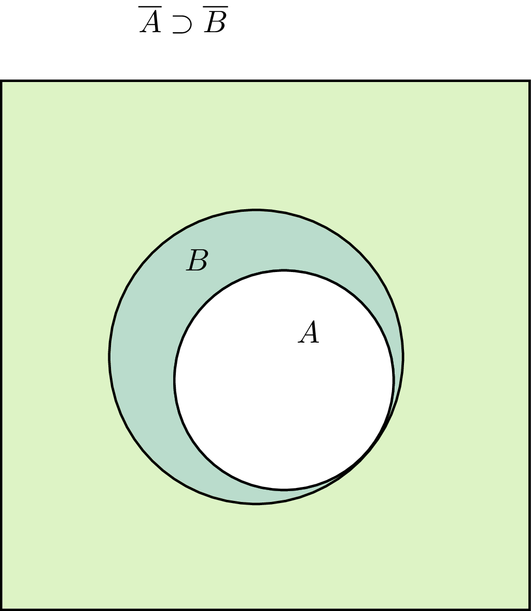
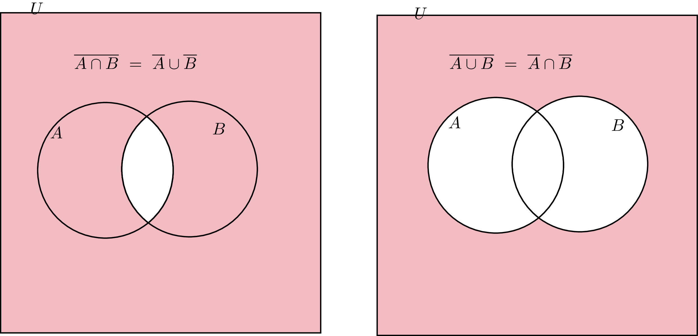
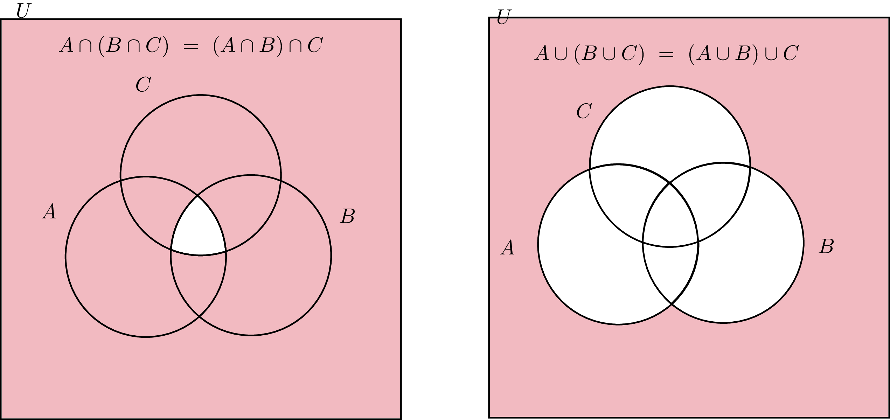
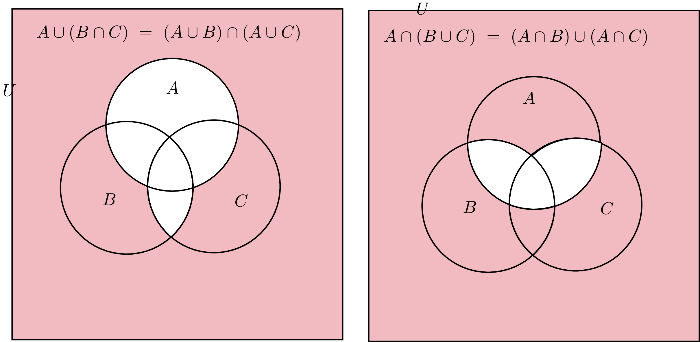

# 09_集合、命題、条件、論理、証明

## Q1 集合の表現

??? success

    ### 集合

    ```text
    ・属すか否かが明確に判別できるものの集まり
    ・大文字アルファベットで主に記述される
    ・太った人という集まりは、属すか否か明確に判別できないので
      集合になりえないが、80kg以上の人などはOK
    ```

    ### 要素(元)

    ```text
    ・集合に属するもの
    ・a∊A := aが集合Aに属する
    ・a∉A := aが集合Aに属しない

    ・記号の由来はelement -> ε -> ∊から来ているらしい
    ```

    ### 空集合

    ```text
    ・要素を1つも持たない集合
    ・∅で表記する。{}, 0に斜線で示すこともできる
    ```

    ### 包含関係

    ```text
    A⊂B := x∊A ⇒ x∊B

    ・Aの任意の元が、常にBの任意の元であるとき、
      AはBの部分集合である

    ・定義に則れば、A自身もAの部分集合であることがわかる

    ・また、{}は全ての集合の部分集合になる
    ```

    ### 相等関係

    ```text
    A = B := A⊂B ∧ B⊂A

    Aの任意の元が、常にBの任意の元であり
    Bの任意の元が、常にAの任意の元であるとき
    二つの集合AとBは等しいという

    ※数は関係ない
    A = {1,1,1,2}, B{1,2} ⇒ A = B
    ```

    ### 真部分集合

    ```text
    A ⊊　B := A⊂B ∧ A≠B

    A = Bが含まない部分集合について、特に言いたい場合、上記のように表記できる
    ```

    ### 外延,内包

    ```text
    外延的表示: 要素を1つずつ書き並べる
    内包的表示: 要素のみ足す条件を示す

    A = {1,3,5,7,9} : 外延
    A = {n | nは奇数, 1≦n≦9} : 内包
    ```

    ### 例

    ```text
    次の集合の間に成り立つ関係を、⊂, ⊃, =を用いて示せ

    [1]A = {n|nは1桁の素数}, B={2n+1|nは整数, 1≦n≦3}

      A = {2,3,5,7}, B={3,5,7}
      ∴ A ⊃ B

    [2] A={x|x²-5x+6 = 0}, B={n|nは6の正の約数}

      A = {2, 3}, B ={1,2,3,6}
      ∴ A ⊂ B
    
    [3] A ={3n+1|n = 0,1,2}, B={n|nは3で割ると1余り1桁の自然数}

      A = {1,4,7}, B={1,4,7}
      ∴  A = B

    [4] 集合A = {1,2,3,4}の部分集合を列挙せよ

    {}, {1}, {2}, {3}, {4}, {1,2}, {1,3}, {1,4}
    {2,3}, {2,4}, {3,4}, {1,2,3}, {1,2,4}, {2,3,4},{1,3,4},
    {1,2,3,4}

    --> 個数は4C0 + 4C1 + 4C2 + 4C3 + 4C4 = 1 + 4 + 6 + 4 + 1 = 16個
    ```

## Q2 積集合、和集合、補集合、ド・モルガンの法則

??? success

    ### 積集合

    ```text
    A ∩ B := A,Bの両方に属する要素全体の集合
    ```

    ### 和集合

    ```text
    A ∪ B := A,Bの少なくとも一方に属する要素全体の集合
    ```

    ### 全体集合

    ```text
    ・議論領域に属する要素全体の集合
    ・Uという記号で表す(Universal set)
    ```

    ### 補集合

    $$
      \overline{A}
    $$

    $$
      A^{C}
    $$

    ```text
    A^C := 全体集合Uのうち、Aに属さない要素全体の集合。
    ```

    ### 補集合の性質

    $$
      \begin{align}
      & (1) && \overline{\overline{A}} = A \\
      & (2) && A \cap \overline{A} = \emptyset \\
      & (3) && A \cup \overline{A} = U \\
      & (4) && A \subset B \Leftrightarrow \overline{A} \supset \overline{B}
      \end{align}
    $$

    ```text
    [1] 補集合の補集合は元の集合となる
    [2] 集合とその補集合の積集合は、空集合
    [3] 集合とその補集合の和集合は、全体集合
    [4] AがBの部分集合 ⇔ Bの補集合がAの補集合の部分集合
    ```

    

    ### ベン図

    ```text
    複数の集合の関係や範囲を図式化したもの
    ```

    ### ド・モルガンの法則

    ```text
    ・論理式￢(P∨Q) ⇔ ￢P∧￢Qの形では既に証明済み
      P: Aという集合に属する
      Q: Bという集合に属する

    ・今回はベン図で示す
    ```

    $$
    \begin{align}
     & \overline{A \cup B} = \overline{A} \cap \overline{B} \\
     & \overline{A \cap B} = \overline{A} \cup \overline{B} \\
     \end{align}
    $$

    

    ### 例

    ```text
    10以下の自然数の集合を全体集合とする
    部分集合A,Bを A = {1,3,4,6,7}, B = {2,3,5,6,9}とする

    次の集合を求めよ

    [1] A^C = {2,5,8,9,10}
    [2] A∩B = {3,6}
    [3] A∪B = {1,2,3,4,5,6,7,9}
    [4] A^C ∩ B = {2,5,9}
    [5] A∪B^C = {1,3,4,6,7,8,10}
      B^C = {1,4,7,8,10}より

    [6] {A∩B}^C= {1,2,4,5,7,8,9,10}
    [7] {A∪B}^C = {8,10}
    [8] A^C ∪ B^C = {A∩B}^C = {1,2,4,5,7,8,9,10}
    [9] A^C ∩ B^C = {8.10}
    [10] {A^C ∩ B^C}^C = A^C^C ∪ B^C^C = A∪B = {1,2,3,4,5,6,7,9} 
    ```

    ### 例2

    ```text
    10以下の自然数の集合を全体集合U,
    A∩B = {3,8}, A^C∩B = {7,9}, A^C∩B^C = {1,6,10}する時
    以下の集合を求めよ

    [1] A
      A^C∩B = {7,9}, A^C∩B^C = {1,6,10}より
      A^C ∩ (B ∪ B^C) = {1,6,7,9,10}
      ∴ A = {2,3,4,5,8}

    [2] B
    A∩B = {3,8}, A^C∩B = {7,9}より
    (A∪A^C)∩B = 全体集合∩B = {3,7,8,9}
    ∴ B = {3,7,8,9} 

    [3]A∪B
    A^C∩B^C = {A∪B}^C = {1,6,10}
    ∴ A∪B = {2,3,4,5,7,8,9}

    --> ベン図書いてもいいよ
    ```

## Q3 3つの集合の共通集合、和集合、補集合

??? success

    ### 結合法則

    ```text
    A∩(B∩C) = (A∩B)∩C = A∩B∩C
    A∪(B∪C) = (A∪B)∪C = A∪B∪C

    ∪、∩単体なら括弧は必要ない
    ```

    
    
    ### 分配法則

    ```text
    A∪(B∩C) = (A∪B)∩(A∪C)
    A∩(B∪C) = (A∩B)∪(A∩C)
    ```

    
    
    ### ド・モルガンの法則

    ```text
    二集合のド・モルガンの法則から拡張できる(ベン図を書かずとも)

    B∪C = Dとすると
    {A∪B∪C}^C = {A∪D}^C = (A^C)∩(D^C) = (A^C)∩(B∪C)^C
    = (A^C)∩(B^C)∩(C^C)

    B∩C = Eとすると
    {A∩B∩C}^C = {A∩E}^C = (A^C)∪(E^C) = (A^C)∪(B∩C)^C
    = (A^C)∪(B^C)∪(C^C)
    ```

    $$
      \begin{align}
        \overline{A \cap B \cap C} = \overline{A} \cup \overline{B} \cup \overline{C} \\
        \overline{A \cup B \cup C} = \overline{A} \cap \overline{B} \cap \overline{C}
      \end{align}
    $$

    

    ### 例

    ```text
    12以下の自然数の集合を全体集合とする
    A = {1,3,5,6,11}, B={6,7,8,11,12}, D={2,3,6,8,10}とするとき以下の集合をこたえよ

    [1] (A^C ∪ B)∩ D^C
    = ({2,4,7,8,9,10,12}∪{6,7,8,11,12}) ∩ {1,4,5,7,9,11,12}
    = {2,4,6,7,8,9,10,11,12}∩ {1,4,5,7,9,11,12}
    = {4,7,9,11,12}

    [2] (A∪D)∩(B∪D)
    = D∪(A∩B)
    = {2,3,6,8,10}∪{6,11}
    = {2,3,6,8,10,11}

    [3] (A∪B^C)∩(D∩B)^C
    = (A∪B^C)∩(D^C∪B^C)
    = B^C∪(A∩D^C)
    = {1,2,3,4,5,9,10}∪ ({1,3,5,6,11}∩{1,4,5,7,9,11,12})
    = {1,2,3,4,5,9,10}∪ {1,5,11}
    = {1,2,3,4,5,9,10,11}
    ```

## Q4 不等式で表現される実数集合の共通部分、和集合、補集合

??? success

    ### 数直線を利用する

    ```text
    数直線を書くときは、
    等号を含む場合 = 黒丸 + 垂直の立ち上げ
    等号を含まない場合 = 白丸 + 斜めの立ち上げを行う
    ```

    ### 例

    ```text
    実数全体の集合を全体集合Uとする
    部分集合A,Bを A = {x|1<x<5}, B = {x|x≦2, 6≦x}とするとき
    以下の集合を求めよ

    [1] A^C = {x| x≦1, 5≦x}
    ```

    

    ```text
    [2] B^C = {x | 2<x<6}

    [3] A∩B = {x | 1 < x ≦ 2}

    [4] A∪B = {x| x < 5, 6≦x}

    [5] A^C ∩ B = {x| x≦1, 5≦x} ∩　{x|x≦2, 6≦x}
    = {x | x≦1, 6≦x}

    [6] A∪B^C =  {x|1<x<5} ∪ {x | 2<x<6}
    = {x | 1<x<6}

    [7] A^C ∩ B^C = {x| x≦1, 5≦x} ∩ {x | 2< x <6}
    = {x| 5 ≦ x < 6}

    [8] A^C ∪ B^C = {A∩B}^C = {x | 1 < x ≦ 2}^C
    = {x | x≦1, 2<x}
    ```

    ### 例2

    ```text
    実数全体の集合を全体集合Uとする
    部分集合A,BについてA⊂Bとなるようなkの範囲を求めよ

    ※等号としてみて条件を満たすか考えるのがよい

    [1] A={x|2≦x≦5}, B={x|k-3≦x<k+1}

    Aの範囲は3,Bの範囲は4
    k - 3 = 2 ⇒ k = 5の時
    B={x|2≦x<6}

    k - 3 = 1 ⇒ k = 4の時
    B = {x|1≦x<5} この時、A⊂Bになりえない

    よって、両端を考えると、
    1<k-3≦2
    ∴ 4<k≦5


    [2] A={x|2<x<5}, B={x|k-3≦x<k+1}

    k-3 = 2 ⇒ k = 5の時
    B = {x|2≦x<6}

    k-3 = 1 ⇒ k = 4の時
    B = {x|1≦x<5}

    よって、両端を考えると
    1≦k-3≦2
    ∴4≦k≦5
    ```

## Q5 無限集合における包含関係の証明

??? success

    ### 有限集合の場合

    ```text
    要素の書き出しや、ベン図に元を表記することで包含関係を示すことができた
    無限集合の場合、包含関係の定義である
    x∊A ⇒ x∊Bを証明することによって、A⊂Bを示す
    ≠については、反例を示すのが早い
    ```

    ### 例

    ```text
    次の集合A,Bについて、A⊂B ∧ A≠Bであることを示せ

    [1] A = {4n + 1 | nは整数}, B = {2n + 1|nは整数}

    x∊Aとすると、x = 4n + 1(n:整数とおける)
    この時、x = 4n + 1 = 2(2n) + 1

    2nは整数であるため2(2n) + 1 ∊ B
    x∊A ⇒ x∊Bであることから、A⊂B
    3∊B　∧ 3∉AなのでA≠B

    [2] A = {8n + 3 |nは整数}, B = {4n-1 | nは整数}

    x∊Aとすると、x = 8n + 3(n:整数)と置ける
    この時、x = 8n + 3 = 4(2n + 1) - 1
    2n + 1は整数であるため,4(2n + 1) + 1 ∊ B
    x∊A ⇒ x∊Bであることから、A⊂B
    -1∊B ∧ -1∉Aなので A≠B

    ※整数は乗法,加法,減法について閉じている
    ```

## Q6 無限集合における相当関係の証明

??? success

    ### 相等関係

    ```text
    A = B ⇔ A⊂B ∧ A⊃B
    双方の⇒について示せばいい
    ```

    ### 例

    ```text
    [1] A = {4n + 3 | nは整数}, B = {4n - 1 | nは整数}

    x∊Aとすると、x = 4n + 3 (nは整数)とおける
    x = 4n + 3 = 4(n+1) - 1
    n + 1は整数であるため、4(n+1) - 1 ∊ B
    よって、x∊A ⇒ x∊B ...(i)

    x∊Bとすると, x = 4n - 1(nは整数)とおける
    x = 4n - 1 = 4(n - 1) + 3
    n - 1は整数であるため、4(n-1) + 3 ∊ A
    よって、x∊B ⇒ x∊A ...(ii)

    (i), (ii)より x∊A ⇔ x∊B
    ∴ A = B

    [2] A={2x + 5y| x,yは整数}, B={3x-4y|x,yは整数}

    a∊Aとすると、
    a = 2x + 5y (x,yは整数)とおける
    この時、2x + 5y = 3〇 - 4△の形(〇,△は整数)に変形したい

    よって、係数である2,5それぞれに対し、
    3〇 - 4△ = 2, 3〇' - 4△' = 5となるような整数の組を見つける必要がある
    例えば(2, 1), (3,1)が相当する。よって

    2x + 5y = 3(2x + 3y) -4(x + y)
    2x + 3y, x + yは整数であるため、2x + 5y = 3(2x + 3y) -4(x + y) ∊ B
    よって、a∊A ⇒ a∊B ...(i)

    a∊Bとすると
    a = 3x - 4y(x,yは整数)とおける
    同様に 3x - 4y = 2〇 + 5△(〇,△は整数)の形で示したいため
    3 = 2*4 + 5*-1
    -4 = 2*3 + 5*-2より

    3x - 4y = 2(4x + 3y) + 5(-x -2y)
    4x + 3y, -x-2yは整数であるため
    3x - 4y =  2(4x + 3y) + 5(-x -2y) ∊ A
    よって、a∊B ⇒ a∊A ...(ii)

    (i), (ii)より
    a∊A ⇔ a∊B
    ∴ A = B
    ```

    ### [2]の見つけ方について

    ```text
    2x + 5y = 3〇 -4△ (〇, △: 整数)である〇, △について
    他方の文字が干渉することはないため

    2x = 3〇' - 4△' (〇',△'はxの定数倍)
    5y = 3〇'' - 4△'' (〇'', △''はyの定数倍)

    2x + 5y = 3{〇' + 〇''} - 4{△' + △''}になる格好


    「0から他方の文字の係数より1小さい整数までの中に
    式を満たす整数が必ず１つ存在する」という性質が成り立つ

    つまり、〇'の係数は3なので、△'は、xを{0,1,2}倍したもののいずれかになる
    実際に、△' = 1x　⇒ 〇' = 2x
    △'' = 1y ⇒　〇'' = 3y

    よって、2x + 5y = 3(2x + 3y) -4(x + y)

    ```

    ### 実は全体集合?

    ```text
    議論領域が整数であるとき、
    {ax + by | x , yは整数}が全体集合 ⇔ a,bが互いに素

    つまり、a,bが互いに素であるとき、
    x,yを動かすことで、全ての格子点を通る直線を表現できる

    今回の問題は
    A={2x + 5y| x,yは整数}, B={3x-4y|x,yは整数}
    であったため、(2,5), (3, -4)がいずれも互いに素であることから
    A = B = 全体集合であった。
    ```

## Q7 命題の真偽と、反例の見つけ方

??? success

    ### 命題

    ```text
    真偽が明確に定まる文章や数式
    ```

    ### 条件

    ```text
    変数によって真偽が変わる文章や数式
    ```

    ### 仮定と結論(前件と後件)

    ```text
    p⇒q
    p: 仮定(前件)
    q: 結論(後件)

    条件法なので、pが偽ならば、p⇒qは真
    ```

    ### 例

    ```text
    実数a,b,cについての命題 [ac = bc ⇒ a = b]の真偽をこたえよ

    対偶をとると
    a≠b ⇒ ac≠bc
    (a,b,c) = (2,3,0)の時、a≠bだが、ac=bcとなる
    よって、反例が存在するため対偶は偽。対偶が偽であるため、元の命題も偽
    ```

    ### 例2

    ```text
    以下の偽の命題に対して、反例を述べよ

    [1] 自然数nが4の倍数∧6の倍数 ⇒ nは24の倍数
    n = 12 (倍数=整数倍)

    [2] 実数aについて、a² > 1 ⇒ a > 1
    a = -2

    [3] 実数aについて、√a² = a
    a = -3

    [4] 実数a,bについて、a > b ⇒ a² > b²
    (a,b) = (1, -2)

    [5] 実数a,bについて、a² = b² ⇒ a = b
    (a,b) = (1, -1)

    [6] 整数m,nについて、m + nが偶数 ⇒ mとnは偶数
    (m,n) = (1,1)

    [7] 整数m,nについて、m + nが偶数 ⇒ mnも偶数
    (m,n) = (1,1)

    [8] x + y, xyがともに有理数 ⇒ x,yはともに有理数
    (x,y) = (√2, -√2)

    [9] x + y, xyがともに整数 ⇒ x,yはともに整数
    (x,y) = (√2, -√2)

    [10] 2組の辺の長さと１組の角の大きさがそれぞれ等しい２つの三角形は合同
    この場合、三角形は2通り存在する。

    △ABCについて、その対辺をa,b,cとしたとき正弦定理を用いて考えると
    辺a, b とのその間にない角Aを与えたとき, ∠B ≠ 90°であれば
    
    a / sinA = b / sinBより, sinBが求まるが、
    Bは鈍角、鋭角に定まらない。Bをいずれかの角に定めれば
    他方の角Cも定まるので、三角形は2通りになる。よって合同とは限らない


    [11] 四角形において、対角線が直交する ⇒ ひし形
    AB = 1, AC = 1, BD = CD = 3であり、対角線が直交する四角形ABCD

    [12] 四角形において、対角線の長さが等しい ⇒ 長方形
    四角形ABCDについて、2つの対角線が2である図形を考える。
    中点で交わらないようにすればこの図形は長方形にならない
    反例は11と同じ

    [13] AB = BC = CD = DA ∧ AB//CD ∧ BC // DA ⇒ 四角形ABCDは正方形
    4つの辺が等しいことが条件で、4つの角が等しいことは述べられていないので
    ひし形になる可能性がある。
    ```

    ### 例3

    ```text
    以下の偽の命題に対して、反例を述べよ
    ただし、[x]は床函数を意味する

    [1]　実数x,yについて、[x] + [y] = [x + y]
    (x,y) = (0.5, 0.5)

    [2] 実数x,yについて x < y　⇒ [x] < [y]
    (x,y) = (0.1, 0.2)

    [3] 有理数の有理数乗は有理数である
    2^{1/2} = √2

    [4] 無理数の有理数乗は、無理数
    {√2}^2 = 2

    [5] 有理数の無理数乗は、無理数
      a^p = M ⇔ log[a]M = pより
      a^{log[a]M} = Mが成立する。
      ここで、pが無理数, 真数Mが有理数のケースを示したいので

      p = log[2]3とすると
      2^{log[2]3} = 3が成り立つ
      よって、2^{log[2]3}が反例になる

    [6] 無理数の無理数乗は、無理数
    ※ただ命題が偽というだけなら√2^{√2}の場合分けで行ける

      √2^{log[√2]3}
      = √2^{log[2^{1/2}]3}
      = √2^{2log[2]3}
      = √2^{log[2]9}
      = 2^{1/2}^{log[2]9}
      = 2^{log[2]3}
      = 3

      よって、(√2)^{log[√2]3}
    
    [7] 実数x,yについて、x + y > 2　∧ xy > 1 ⇒ x > 1 ∧ y > 1
    (x,y) = (2, 0.9)

    [8]実数x,yについて、|x| < 1　∧ |y| < 1　⇒ x² + y²  < 1
    (x,y) = (0.8, 0.8)

    [9] 実数x,yについて、x²+y²≦2 ⇒ |x|≦1 ∧ |y|≦1
    (x,y) = (0,√2)

    [10] 実数x,yについて、x²+y²≦1 ⇒ |x| + |y| ≦ 1
    (x,y) = (0.5, 0.6)
    ```

## Q8 領域と数直線で命題の真偽を示す方法

??? success

    ### 命題と集合

    ```text
    不等式の命題は集合で考えるとよい

    条件p,qを満たすもの全体の集合をP,Qとすると
    p⇒qが真 ⇔ P⊂Q

    偽である場合は、Qからはみ出た部分が反例となる

    ※1変数の不等式なら数直線, 2変数なら座標平面が使える
    ```

    ### 例

    ```text
    次の命題の真偽を調べ、偽である場合は反例を述べよ

    [1] 実数xに対して、|x|≦1 ⇒ |x-3| > 1

    P = {x | |x|≦1}, Q = {x | |x-3| > 1}
    について、P⊂Qが成り立てば真となる

    ここで、
    P = {x | |x|≦1} = {x| -1≦x≦1}
    Q = {x | |x-3| > 1} = {x| x-3 < -1, 1 < x-3}
    = {x| x < 2, 4 < x}

    P ⊂ Qであることがわかるため、真

    [2] 実数xに対して、|x|≦1 ⇒ |x-2| > 1
    P = {x | |x|≦1} = {x| -1≦x≦1}
    Q = {x| |x-2| > 1} = {x| (x-2) < -1, 1 < (x-2) }
    = {x| x < 1, 3 < x}

    反例x = 1が存在するため p⇒qは偽

    [3] 20以下の自然数nに対して
    nが2の倍数∧nが3の倍数でない ⇒ nが6の倍数でない

    p: nが2の倍数である
    q: nが3の倍数である
    r: nが6の倍数である　とすると

    命題: p∧￢q ⇒ ￢rと表せる

    P∩Q^C ⊂ R^Cであればいい。ただし、
    P = {n| n % 2 == 0}
    Q = {n| n % 3 == 0 }
    R = {n| n % 6 == 0 }

    P∩Q^C = {2,4,6,8,10,12,14,16,18,20} ∩ {1,2,4,5,7,8,10,11,13,14,16,17,19,20}
    = {2,4,8,10,14,16,20}

    一方R^C = {1,2,3,4,5,7,8,9,10,11,13,14,15,16,17,19,20}である
    つまり、P∩Q^C　⊂ R^C
    ∴ 命題は真
    ```

    ### 例2

    ```text
    次の命題の真偽を調べよ。偽の時は反例を挙げよ

    ※2変数なので座標平面で考えられる

    [1] 実数x,yについて、x+y > 2　∧ xy > 1 ⇒ x > 1 ∧ y > 1

    P = {x,y | x + y > 2, xy > 1}
    Q = {x,y | x > 1, y > 1}について座標平面を書くと

    P ⊃ Qであることがわかる。反例も領域からわかる
    ∴命題は偽。反例(x,y) = (2, 0.6)

    [2] 実数x,yについて、|x| < 1 ∧ |y| < 1　⇒ x² + y² < 1

    ※簡単な図形なら頭の中に図示できる

    P = {x,y | |x| < 1 ∧ |y| < 1,x,yは実数}の条件に当てはまる領域は
    点A(1,1), B(1,-1), C(-1,1), D(-1,-1)としたときの
    四角形の内部。辺上は含まない

    Q = {x,y | x² + y² < 1,x,yは実数}の条件に当てはまる領域は
    原点中心で、半径が1の円。ただし、円周上は含まない。

    この時、P⊃Qであって、P⊂Qではない。よって、命題は偽。また、反例は、
    (x,y) = {0.8, 0.8}

    [3] 実数x,yについてx² + y² ≦2 ⇒ |x|≦1 ∧ |y|≦1

    P = {x,y | x² + y² ≦2,x,yは実数}の条件に当てはまる領域は
    原点中心、半径√2の円の内部と円周上。
    Q = {x,y | |x|≦1 ∧ |y|≦1,x,yは実数}の条件に当てはまる領域は
    点A(1,1), B(1,-1), C(-1,1), D(-1,-1)としたときの
    四角形の内部とその辺上。

    四角形ABCDについて、原点から一番遠い点は、頂点になるが
    その距離は√(1² + 1²) = √2
    よって、P⊂Qであって、P⊂Qではない。ゆえに、命題は偽
    (x,y) = (√2, 0)が反例となる

    [4] 実数x,yについて、|x| + |y| ≦ 1 ⇒ |x+y|≦1

    P = {x,y| |x| + |y| ≦ 1 ,x,yは実数}の条件に当てはまる領域は
    点(0,1), (1,0), (0,-1), (-1, 0)の4点を持つ正方形となる。

    Q = {x,y | |x+y|≦1, x,yは実数}の条件に当てはまる領域は
    = {x,y| -1 ≦ x + y ≦ 1}より

    y = -x -1と、
    y = -x + 1が囲む帯の領域となる。

    図より、P⊂Qが言えるため、命題は真

    [5] 実数x,yについてx² + y² ≦ 1 ⇒ |x| + |y| ≦ 1

    P = {x,y | x² + y² ≦ 1, x,yは実数} は原点中心、半径1の円周上あるいは
    その内部の座標の集合を意味する。

    Q = {x,y | |x| + |y| ≦ 1, x,yは実数}は[4]で述べたような
    正方形の辺とその内部の座標の集合を意味する。

    よって、P⊃Qであって、P⊂Qではない。命題は偽。
    反例は、(x,y) = (0.5, 0.6)

    [6] 整数m,nについて、m² + n² ≦ 1 ⇒ |m| + |n| ≦ 1

    P = {m,n | m² + n² ≦ 1, m,nは整数}は、原点中心、半径1の円の内部或いは
    円周上における、格子点の集合を意味する。
    よって、P = {(0,0),(-1,0), (1,0), (0,-1), (0,1)}
    Q = {m,n| |m| + |n| ≦ 1, m,nは整数} = {(0,0),(-1,0), (1,0), (0,-1), (0,1)}
    つまり、P = Qであるため、命題は真。
    ```

    

    ### 領域を示す際の注意点

    ```text
    |x| + |y| ≦ 1について
    x = -x, y = -yなので、対称性より、第一象限のみ考えればよい
    y = -x + 1と、x,y軸によって囲われた領域を、他の象限にも映していく
    ```

## Q9 条件の否定と、全称、存在の￢

??? success

    ### ド・モルガンの法則も集合と対応する

    ```text
    ￢(p ∧ q) ⇔ ￢p ∨ ￢q
    ￢(p ∨ q) ⇔ ￢p ∧ ￢q

    ￢pは、p以外全部となることに注意。
    ```

    ### 全称、存在の￢

    ```text
    ￢(∀xP(x)) ⇔ ∃x￢P(x)
    ￢(∃xP(x)) ⇔ ∀x￢P(x)

    ---------------
    ￢(全てのxについてpが成り立つ) ⇔ ￢pであるxが存在する
    ￢(あるxについてpが成り立つ) ⇔ 全てのxについて、￢p

    --------------

    任意の,という言葉を全てに置き換えたり
    ある,適当なという言葉を、存在する, 少なくとも1つのという言葉に置き換えるといい
    ```

    ### 例

    ```text
    次の条件の否定を述べよ。ただし、x,y,zは実数, mは整数

    [1] 1<x≦3
    ∴ x≦1, 3 < x

    [2] x = 1 ∨ y ≠ 2
    ￢(x = 1 ∨ y ≠ 2)
    ∴ x≠1 ∧ y = 2

    [3] mは偶数 ∧ mは3の倍数
    ￢(mは偶数 ∧ mは3の倍数)
    ⇔ ￢(mは偶数)　∨ ￢(mは3の倍数)
    ⇔ mは奇数 ∨ mは3の倍数ではない
    ⇔ mは6の倍数ではない

    [4] x = y = z = 0
    ￢(x = 0 ∧ y = 0 ∧ z = 0)
    ⇔ ￢(x = 0) ∨ ￢(y = 0) ∨ ￢(z = 0)
    ⇔ x ≠ 0 ∨ y ≠ 0 ∨ z ≠ 0
    ⇔ x,y,zのうち少なくとも1つは0でない

    [5] x,y,zのうち少なくとも1つは有理数
    ￢(xは有理数 ∨ yは有理数 ∨ zは有理数)
    ⇔ ￢(xは有理数)　∧ ￢(yは有理数) ∨ ￢(zは有理数)
    ⇔ xは無理数 ∧ yは無理数 ∧ zは無理数
    ⇔ x,y,zは全て無理数
    ```

    ### 例2

    ```text
    次の命題の否定を述べ、元の命題とその￢の真偽を調べよ

    [1] 全ての素数は奇数である
    議論領域が素数
    P(x): 素数xは奇数である
    
    ￢(∀xP(x)) = ∃x￢P(x): 奇数でない素数が存在する
    素数2は偶数であるため、否定は真。元の命題は偽。

    [2] x² + 1 < 0である実数xが存在する
    議論領域が実数
    P(x): xは、x² + 1 < 0である

    ￢(∃xP(x)) = ∀x￢P(x): すべてのxについて、x² + 1 ≧ 0
    移項すると、x² ≧ -1 より、否定は真。元の命題は偽。

    [3] 任意の実数x,yについて、x² + y² > 0
    議論領域は実数
    P(x,y): (x,y)は、x² + y² > 0を満たす

    ￢(∀x,y P(x,y)) = ∃x￢P(x,y): ある実数x,yについて、x² + y² ≦ 0
    (x,y) = (0,0)の存在より、否定は真。元の命題は偽。

    [4] 適当な自然数a,bについて、a² + b² = 13²
    P(a,b): (a,b)は、a² + b² = 13²を満たす

    ￢(∃a,b P(a,b)) = ∀a,b ￢P(a,b): すべての自然数a,bについて、a² + b² ≠ 13²
    (a,b) = (12,5)の存在より、否定は偽。元の命題は真。
    ```

## Q10 代表的な同値変形

??? success

    ### まとめ

    ```text
    xy = 0 ⇔ x = 0 ∨ y = 0
    x² + y² = 0 ⇔ x = 0 ∧　y = 0

    xy > 0 ⇔ (x > 0 ∧ y > 0) ∨ (x < 0 ∧ y < 0)
    xy < 0 ⇔ (x < 0 ∧ y > 0) ∨ (x > 0 ∧ y < 0)

    x > 0 ∧ y > 0 ⇔ x + y > 0 ∧ xy > 0
    x < 0 ∧ y < 0 ⇔ x + y < 0 ∧ xy > 0

    x ≧ 0 ∧　y≧ 0の時
    x = y ⇔ x² = y²
    x > y ⇔ x² > y²

    |x| = x  ⇔ x ≧ 0
    |x| > x  ⇔ x < 0


    [1] |x| = a ⇔ x = ±a, a ≧ 0
    [2] |x| < a ⇔ -a < x < a
    [3] |x| > a ⇔ x < -a, a < x

    [1] |x| > |y| ⇔ x² > y²
    [2] |x| < |y| ⇔ x² < y²
    [3] |x| = |y| ⇔ x = ±y

    [1] (x/y) = 0 ⇔ x = 0 ∧ y ≠ 0
    [2] (x/y) > 0 ⇔ xy > 0
    [3] (x/y) < 0 ⇔ xy < 0
    ```

    ### 最初にやるべきだった

    ```text
    同値変形がわからないと、図形で逆を証明する重要性もわからない
    双方向の⇒を示すことで、同値だと確かめたら他の分野でも使ってよし
    ```

    ### 必要条件と十分条件

    ```text
    p ⇒ qが真であるとき、

    qはpであるための必要条件.
    pはqであるための十分条件.

    ----------------

    つまり、pはqであるための十分条件といわれたら
    pが前件で、qが後件であると想像し、p⇒qを思い浮かべる

    覚え方としては、p⇒qが真であるとき集合で考えるとP⊂Qであり、
    PはQの部分集合であるため
    この時、Pが真であれば、Qが真と言い切るのに十分である場合 ⇔ p ⇒ qと考える

    qはpであるための必要条件といわれても
    同様にp ⇒ qを思い浮かべる。言葉の意味よりも単に逆と考えた方がまぎれがなさそうだ
    ```

    ### 必要十分条件

    ```text
    p ⇔ q := pとqは同値である。
    これを、pはqであるための必要十分条件、あるいはqはpであるための必要十分条件
    といったりする
    ```

    ### 同値変形

    ```text
    ※これより下のx,yはすべて実数とする
    [1] 
    xy = 0 ⇔ x = 0 ∨ y = 0
    ```

    ### [1]の証明

    ```text
    [i] xy = 0 ⇒ x = 0 ∨ y = 0を示す
    
    P : xy = 0
    Q : x = 0 ∨ y = 0
    について、P⇒Qが成り立つことを背理法で示すには
    ￢(P⇒Q)ならば矛盾となることを示せばよい。よって、 
    (￢(P⇒Q) ⇒ ⊥) ⇔ (P∧￢Q　⇒ ⊥)より
    x≠0, y≠0である実数x,yが存在して、その積が0になると仮定する
    
    この時、x≠0であるため、xの逆数1/xが存在する
    xy = 0の両辺に対し、(1/x)をかけると
    (1/x)xy = 0*(1/x)
    よって、y = 0
    これは、y≠0とした仮定と矛盾する。
    同様に、yの逆数1/yを用いると、x = 0が導かれ、これも仮定に矛盾する

    従って、0でない実数x,yが存在し、その積が0になるという仮定に誤りがある
    ∴ xy = 0　⇒ x = 0 ∨ y = 0


    [ii] x = 0 ∨ y = 0 ⇒ xy = 0
    x = 0の時、xy = 0,
    y = 0の時、xy = 0,
    x = y = 0の時、xy = 0

    [i],[ii]より、
    xy = 0 ⇔ x = 0 ∨ y = 0
    ```

    ### 同値変形2

    ```text
    [2] 実数x,yについて
    x² + y² = 0 ⇔ x = 0 ∧ y = 0

    [i] x² + y² = 0 ⇒ x = 0 ∧ y = 0

    P: x² + y² = 0
    Q: x = 0 ∧ y = 0であるとき
    P ⇒ Qが真であることを示したい。

    ￢(P⇒Q) ⇒ ⊥であれば、背理法よりP⇒Qは真なので
    x² + y² = 0 ∧ x ≠ 0 ∨ y ≠ 0の真偽を考えると
    x ≠ 0 の時、x² > 0より、x² + y² > 0
    y ≠ 0 の時、y² > 0より、x² + y² > 0
    これは、x² + y² = 0とした仮定と矛盾する。
    よって、 ￢(P⇒Q) ⇒ ⊥になるため
    ∴ x² + y² = 0 ⇒ x = 0 ∧ y = 0


    [ii] x = 0 ∧ y = 0 ⇒  x² + y² = 0
    実際に代入することで示せる。

    [i],[ii]よりx² + y² = 0 ⇔ x = 0 ∧ y = 0
    ```

    ### 補足

    ```text
    3変数以上の時も同様に示せる

    xyz = 0 ⇔ x = 0 ∨ y = 0 ∨ z = 0
    x² + y² + z² = 0 ⇔ x = 0 ∧ y = 0 ∧ z = 0
    ```

    ### 同値変形3

    ```text
    xy > 0 ⇔ (x > 0 ∧ y > 0) ∨ (x < 0 ∧ y< 0)
    xy < 0 ⇔ (x > 0 ∧ y < 0) ∨ (x < 0 ∧ y > 0)

    2数の積 > 0であるとき、その組み合わせは、(正, 正), (負, 負)
    2数の積 < 0であるとき、その組み合わせは、(正, 負), (負, 正)

    自明に思われるが導出したい
    ```

    ### 同値変形4

    ```text
    x > 0 ∧ y > 0 ⇔ x + y > 0 ∧ xy > 0
    x < 0 ∧ y < 0 ⇔ x + y < 0 ∧ xy < 0

    [i] x > 0 ∧ y > 0 ⇒ x + y > 0 ∧ xy > 0

    P: x > 0 ∧ y > 0
    Q: x + y > 0 ∧ xy > 0

    ￢(P⇒Q)⇒⊥つまり、P∧￢Q ⇒ ⊥であれば、P⇒Qが示せる
    よって、これを同値変形して
    (x > 0 ∧ y > 0) ∧ ￢(x + y > 0 ∧ xy > 0)
    ⇔ (x > 0 ∧ y > 0) ∧ (￢(x + y > 0) ∨ ￢(xy > 0))
    ⇔ (x > 0 ∧ y > 0) ∧ (x + y ≦ 0 ∨ xy ≦ 0)

    (x > 0 ∧ y > 0) より、xy > 0 (同値変形3)
    これは、xy≦0とした仮定と矛盾する。よって、￢(P⇒Q)⇒⊥なので
    x > 0 ∧ y > 0 ⇒ x + y > 0 ∧ xy > 0

    [ii] x + y > 0 ∧ xy > 0 ⇒ x > 0 ∧ y > 0

    (x + y > 0 ∧ xy > 0) ∧ ￢(x > 0 ∧ y > 0)より
    (x + y > 0 ∧ xy > 0) ∧ (x≦0 ∨ y≦0)と仮定する

    x≦0, y≦0の時、x + y ≦ 0となるため仮定に矛盾
    x≦0, y>0の時、xy ≦ 0となるため仮定に矛盾
    x>0, y≦0のとき、xy ≦ 0となるため仮定に矛盾
    よって、仮定に誤りがあるため背理法より
    x + y > 0 ∧ xy > 0 ⇒ x > 0 ∧ y > 0

    [i],[ii]より
    ∴ x > 0 ∧ y > 0 ⇒ x + y > 0 ∧ xy > 0

    ※ < 0の場合も同様に示せる
    ```

    ### 同値変形5

    ```text
    x≧0　∧ y ≧ 0の時、

    x = y ⇔ x² = y²
    x > y ⇔ x² > y²

    -------------------------

    [i] x = y ⇒ x² = y²

    x = yであるとき
    両辺にxをかけてx² = xy
    x = yであるためx² = y²

    [ii] x² = y² ⇒ x = y

    x² = y² ⇒ |x| = |y|が成り立つことと、
    条件より、負の値は考える必要がないことから
    x≧0　∧ y ≧ 0の時 x² = y² ⇒ |x| = |y| ⇒ x = y

    [i], [ii]よりx = y ⇔ x² = y²

    [iii] x > y ⇒ x² > y²

    命題の否定(x > y)∧ (x²≦y²)を仮定する
    x²=y²の時、[ii]より、x = y. これは仮定と矛盾する
    x²<y² ⇒ |x| < |y|. 条件より負の値は考える必要がないのでx < y
    これも仮定と矛盾する。
    ∴ x > y ⇒ x² > y²

    [iv] x² > y² ⇒ x > y

    命題の否定(x² > y²) ∧ (x ≦ y)を仮定する
    x² > y² ⇒ |x| > |y|
    条件より負の値は考える必要がないので、x > y
    これは仮定と矛盾する
    ∴ x² > y² ⇒ x > y

    [iii], [iv]より、x > y ⇔ x² > y²

    -------------------------

    ※ x² = y² ⇒ |x| = |y|

    x² = y²
    ⇔ x² - y² = 0
    ⇔ (x+y)(x-y) = 0

    xy = 0 ⇔ x = 0 ∨ y = 0より
    x - y = 0, x + y = 0のいずれかが成り立つ

    [i] x - y = 0の場合、 x = y
    [ii] x + y = 0の場合、x = -y

    絶対値は原点からの距離を意味するので
    x = y ⇒ |x| = |y|
    x = -y ⇒ |x| = |-y| = |y|

    ∴ x² = y² ⇒ |x| = |y|
    ```
  
    ### 同値変形6

    ```text
    |x| = x  ⇔ x ≧ 0
    |x| > x  ⇔ x < 0

    [i] |x| = x ⇒ x ≧ 0

    命題の否定(|x| = x)∧(x < 0)を仮定する
    x < 0の時 |x| = -x　(絶対値関数の定義より)
    よって、仮定と矛盾する。
    ∴ |x| = x ⇒ x ≧ 0

    [ii] x ≧ 0 ⇒ |x| = x
    x > 0の時、|x| = x
    x = 0の時、|0| = 0
    ∴ x ≧ 0 ⇒ |x| = x

    [i], [ii]より、 |x| = x  ⇔ x ≧ 0

    [iii] |x| > x  ⇒ x < 0

    命題の否定(|x| > x)∧(x ≧ 0)を仮定する
    同値変形して|x| > x　⇔ |x| - x > 0
    x > 0の時、|x| = xなので、
    |x| - x = 0. これは仮定と矛盾する

    x = 0の時、|0| - 0 = 0. これも仮定と矛盾する
    ∴ |x| > x  ⇒ x < 0

    [iv] x < 0 ⇒ |x| > x
    x < 0の時、|x| = -x
    同値変形して|x| > x  ⇔ |x| - x > 0
    |x| - x = -2x 
    x < 0なので、-2x > 0
    ゆえに、x < 0 ⇒ |x| - x > 0 ⇔ |x| > x

    [iii], [iv]より、 |x| > x  ⇔ x < 0
    ```

    ### 同値変形7

    ```text
    a > 0の時、

    |x| = a ⇔ x = ±a
    |x| < a ⇔ -a < x < a
    |x| > a ⇔ x < -a, a < x

    ※絶対値の定義と、絶対値が原点からの距離であることを考えればわかる
    ```

    ### 同値変形8

    ```text
    aが何であっても、

    [1] |x| = a ⇔ x = ±a, a ≧ 0
    [2] |x| < a ⇔ -a < x < a
    [3] |x| > a ⇔ x < -a, a < x

    [1-i]
    a > 0の時、|x| = a ⇔ x = ±a (原点からの距離より) ...(1)
    a = 0の時、|x| = 0 ⇔ x = ±0 より、これは(1)を満たす
    a < 0の時、|x| = -aとなるxは存在しない。
    ∴ |x| = a ⇔ x = ±a, a ≧ 0

    [2-i]
    a > 0の時、|x| < a ⇔ -a < x < a (原点からの距離より) ...(2)
    a = 0の時、|x| < 0となるxは存在しない。0 < x < 0となるxも存在しない
    よって、これは(2)を満たす(空虚な真)

    a < 0の時、|x| < aとなるxは存在しない。また-a < aとなるaも存在しない
    ため、この不等号にはさまれたxも当然存在しない.よってこれは(2)を満たす(空虚な真)
    ∴ |x| < a ⇔ -a < x < a

    [3-i]
    a > 0の時、|x| = a ⇔ x < -a, a < x(原点からの距離より) ...(3)
    a = 0の時、|x| > 0となるxはx以外の任意の実数
    x < 0, 0 < xとなるxもx以外の任意の実数である
    よってa=0の時も、(3)を満たす

    a < 0の時、|x| > aとなるxは任意の実数
    x < a, a < xとなるxも任意の実数.よってa < 0の時も、(3)を満たす
    ∴ |x| > a ⇔ x < -a, a < x
    ```

    ### 例

    ```text
    |x-1| = 3 - 2x
    x - 1 = ±(3 - 2x) ただし、3 - 2x ≧ 0 ⇔ x ≦ 3/2
    x - 1 = 3 - 2xの時、x = 4/3
    x - 1 = 2x - 3の時  x = 2
    条件より、 x = 4/3

    --------------

    |3x + 4| ≧ 5x

    ⇔ 3x + 4 ≦ -5x, 5x ≦ 3x + 4
    ⇔ 8x ≦ -4, 2x≦4
    ⇔ x≦ -(1/2), x≦2
    ```

    ### 同値変形9

    ```text
    [1] |x| > |y| ⇔ x² > y²
    [2] |x| < |y| ⇔ x² < y²
    [3] |x| = |y| ⇔ x = ±y

    [1-i]
    絶対値は0以上であるため、
    同値変形: x≧0 ∧ y≧0の時、x > y ⇔ x² > y²が使える
    つまり、|x|≧0 ∧ |y|≧0なので、|x| > |y| ⇔ |x|² > |y|²
    
    x≧ 0の時、|x|² = x² 
    x < 0の時、|x|² = (-x)² = x²
    yについても同様に考えると
    |x|² > |y|² ⇔ x² > y²

    ∴ |x| > |y| ⇔ x² > y²

    [2-i]
    文字x,yを入れ替えれば問題ない    

    [3-i]

    |x| = |y| 
    ⇔ x² = y² 
    ⇔ x² - y² = 0
    ⇔ (x + y)(x - y) = 0
    ⇔ x = y ∨ x = -y
    ⇔ x = ±y
    ```

    ### 同値変形10

    ```text
    [1] (x/y) = 0 ⇔ x = 0 ∧ y ≠ 0
    [2] (x/y) > 0 ⇔ xy > 0
    [3] (x/y) < 0 ⇔ xy < 0

    [1] 分母0の数は定義されないことに注意する
        よって、計算結果が0であることから、
        (x/y) = 0 は分母がy ≠ 0であることを条件としている
        y ≠ 0の時、1/y ≠ 0

        [i] (x/y) = 0 ⇒ x = 0 ∧ y ≠ 0
        xy = 0 ⇒ x = 0 ∨ y = 0と、条件よりy ≠ 0であることから
        x = 0なので、成り立つ

        [ii] x = 0 ∧ y ≠ 0 ⇒ (x/y) = 0
        0/y = 0より成り立つ。

        [i], [ii]より、(x/y) = 0 ⇔ x = 0 ∧ y ≠ 0

    [2] (x/y) > 0の両辺にy²をかけると
        xy > 0

    [3] (x/y) < 0の両辺にy²をかけて
        xy < 0

    ----------------------

    [補足] (x/y)≧ 0 ⇔ xy ≧ 0 ∧ y ≠ 0

    分母がyであれば、(x/y)≧0という条件から
    暗黙的にy≠0が成り立っている事がわかる

    よって、※両辺に正の数y²をかけても不等号の向きは変わらないため
    (x/y) ≧ 0
    ⇔ xy ≧ 0 ∧　y ≠ 0

    ---------------------

    ※a≧b ⇒　ac≧ bc (c≧0)
      a ≧ b ∧ c > 0
      a - b ≧ 0の両辺にcをかけると
      c(a-b) ≧ 0
      分配法則を用いて
      ca ≧ cb
    ```

## Q11 同値変形実用

??? success

    ### 例

    ```text
    x,yを実数としたとき、p,qが同値であることを示せ

    [1] 
    p: x > 1 ∧ y > 1
    q: x+y > 2 ∧　(x-1)(y-1) > 0
    ---------------
    x > 0 ∧ y > 0 ⇔ x + y > 0 ∧ xy > 0 を使用する

    x > 1 ∧ y > 1 
    ⇔ (x-1) > 0 ∧ (y - 1) > 0 
    ⇔ (x-1) + (y-1) > 0　∧ (x-1)(y-1) > 0
    移項すると、以下になるため同値関係は示された
    x > 1 ∧ y > 1  ⇔ x + y > 2　∧ (x-1)(y-1) > 0
    ```

    ```text
    p : xy + 1 = x + y
    q : x,yの少なくとも一方が1 ⇔ x = 1 ∨ y = 1
    ---------------------

    x,yの少なくとも一方が1
    ⇔ x = 1 ∨ y = 1
    ⇔ x - 1 = 0 ∨ y - 1 = 0
    ⇔ (x-1)(y-1) = 0
    ⇔ xy + 1 = x + y
    ```

    ```text
    p: x² + y² = 2(x + y - 1)
    q: x = y = 1
    ----------------

    x = y = 1
    ⇔ x = 1 ∧ y = 1
    ⇔ x - 1 = 0 ∧ y - 1 = 0
    ⇔ (x-1)² + (y-1)² = 0
    ⇔ x² + y² = 2(x + y - 1)
    ```

    ```text
    p: x = y = 0
    q: x² - xy + y² = 0

    --------------
    x² + y² = 0　⇔ x = 0 ∧ y = 0を用いる


    x² - xy + y² = 0
    ⇔ (x - y/2)² + (3/4)y² = 0
    ⇔ x - (y/2) = 0 ∧ √(3/4)y = 0
    ⇔ x - (y/2) = 0 ∧ y = 0
    ⇔ x = 0 ∧ y = 0
    ⇔ x = y = 0
    ```

    ```text
    p: x > y
    q: x³ > y³
    ---------------

    x³ > y³
    ⇔ x³ - y³ > 0
    ⇔ (x-y)(x² + xy + y²) > 0
    ⇔ x - y > 0
    ⇔ x > y

    ※x² + xy + y²
    = (x + 1/2y)² + (3/4)y²
    = (x + 1/2y)² + (√3/2y)² ≧ 0
    ```

    ```text
    p: x² + y² + z² + xy + yz + zx = 0
    q: x = y = z = 0
    -------------
    x² + y² + z² = 0 ⇔ x = y = z = 0を利用する

    x² + y² + z² + xy + yz + zx = 0
    ⇔ 2x² + 2y² + 2z² + 2xy + 2yz + 2zx = 0
    ⇔ (x² + 2xy + y²) + (y² + 2yz + z²) + (z² + 2zx + x²) = 0
    ⇔ (x + y)² + (y + z)² + (z + x)² = 0
    ⇔ (x + y) = (y + z) = (z + x) = 0
    ⇔ x = y = z = 0

    ※ x + y = 0 ⇔ y = -x
    z + x = 0 ⇔ z = -x
    y + z = 0 ⇔ -2x = 0
    よって、x = y = z = 0
    ```

    ```text
    p: x² + y² + z² - xy - yz - zx = 0
    q: x = y = z
    ---------------

    x² + y² + z² - xy - yz - zx = 0
    ⇔ 2x² + 2y² + 2z² - 2xy - 2yz - 2zx = 0
    ⇔ (x - y)² + (y - z)² + (z - x)² = 0
    ⇔ x - y = y - z = z - x = 0
    ⇔ x = y = z
    ```

    ```text
    p: x ≧ 0
    q: √{x²} = x
    -------------------

    |x| = x ⇔ x ≧ 0を利用する

    √{x²} = x
    ⇔ |x| = x
    ⇔ x ≧ 0
    ```

    ```text
    p: |x+y| = |x-y|
    q: xy = 0
    -------------

    ※|x| = |y| ⇔ x = ±yを利用する

    |x| = -x ∨ x
    |y| = -y ∨ y
    x = ±y　∨ -x = ±y ⇔ x = ±y


    |x+y| = |x-y|
    ⇔ (x + y = x - y) ∨ (x+ y = -x + y)
    ⇔ y = 0 ∨ x = 0
    ⇔ xy = 0 
    ```

    ```text
    p: |x + y| = |x| + |y|
    q: xy ≧ 0

    |x + y|, |x| + |y| ≧ 0より(※2乗すると絶対値が外せる)

    |x + y| = |x| + |y|
    ⇔ (x + y)² = (|x| + |y|)²
    ⇔ x² + 2xy + y² = |x|² + 2|x||y| + |y|²
    ⇔ 2xy = 2|xy|
    ⇔ xy = |xy| (|x| = x ⇔  x≧0)
    ⇔ xy ≧ 0
    ---------------

    |x||y| = |xy|

    x≧0, y≧0の時、
    |x||y| = xy, |xy| = xy

    x≧0, y < 0の時、
    |x||y| = -xy, |xy| = -xy

    x<0, y≧0の時
    |x||y| = -xy, |xy| = -xy

    x < 0, y < 0の時
    |x||y| = (-x)(-y) = xy, |xy| = xy
    ```

    ```text
    p: |x+y| < |x|+|y| 
    q: xy < 0

    |x + y|, |x| + |y| ≧ 0より(※2乗すると絶対値が外せる)

    |x+y|² < (|x|+|y|)²
    ⇔ x² + 2xy + y² < |x|² + 2|x||y| + |y|²
    ⇔ xy < |xy| (※x < |x| ⇔ x < 0)
    ⇔ xy < 0 
    ```

    ```text
    p: xy < 0
    q: (x/y) + (y/x) < 0

    (x/y) + (y/x) < 0
    ⇔ (x² +  y²) / xy < 0 (x/y < 0　⇔ xy < 0)
    ⇔ (x² + y²)xy < 0
    ※xy < 0 ⇔ (x > 0 ∧ y < 0) ∨ (x < 0 ∧ y > 0)より
    x² + y² ≧ 0なので、
    ⇔ xy < 0 ∧ x² + y² ≠ 0
    ⇔ xy < 0 ∧ ￢(x = y = 0)
    ※より、xy < 0であるとき、x = y = 0にはなりえないため
    ⇔ xy < 0
    ```

## Q12 必要条件と十分条件の判定

??? success

    ### 例

    ```text
    a,b,cを実数とする

    ac = bcは a = bであるための「」条件である

    ac = bc ⇒ a = bの真偽を考える
    (a,b,c) = (1,2,0)が反例としてあるため偽

    a = b　⇒ ac = bcの真偽を考える
    ac = bc
    ⇔ ac - bc = 0
    ⇔ c(a-b) = 0
    xy = 0 ⇔ x = 0 ∨ y = 0より
    これは、a = b ∨ c = 0と同値

    a = b ⇒ (a = b ∨ c = 0)
    これは真 (こう考えると、c = 0 ⇒ a = bはおかしいので反例を挙げるまでもない)
    また集合関係で考えると、a = b ⊂ (a = b ∨ c = 0)となるため真となることもわかる

    よって、a = b　⇒ ac = bc

    p ⇒ qが真ならば、
    pがqであるための十分条件と呼称した
    qがpであるための必要条件と呼称した

    よって、ac = bcはa = bであるための必要条件である
    ```

    ### 手順

    ```text
    1 同値変形して、他方が導かれるか考える
    2 双方向の含意を考える
    3 p ⇒ qが成り立ったら、pがqであるための十分条件と考える
    ```

## Q13 逆、裏、対偶

??? success

    ### 逆、裏、対偶

    ```text
    p ⇒ qの逆は、q ⇒ p
    p ⇒ qの裏は、￢p ⇒ ￢q
    p ⇒ qの対偶は、￢q ⇒ ￢p

    p⇒qが真　⇔ ￢q⇒￢pが真
    つまり、元の命題と対偶の命題は一致する。
    よって、元の命題を証明する代わりに、対偶命題を証明しても許される

    ※集合で考える
    P: pの条件を満たす元の集合
    Q: qの条件を満たす元の集合と考えると
    p ⇒ q ⇔　P ⊂ Q ⇔ Q^C ⊂ P^C ⇔ ￢q ⇒ ￢p
    ```

    ### 例

    ```text
    x,yを実数とする

    以下の命題の逆、裏、対偶について真偽を述べよ

    [1] x = 1 ∧ y = 2 ⇒ x + y = 3
    これは真

    逆: x + y = 3 ⇒ x = 1 ∧ y = 2
    反例(x,y) = (2, 1)

    裏: ￢( x = 1 ∧ y = 2 ) ⇒ ￢(x + y = 3)
    x ≠ 1 ∨ y ≠ 2 ⇒ x + y ≠ 3
    反例(x,y) = (0,3)

    対偶: x + y ≠ 3 ⇒ x ≠ 1 ∨ y ≠ 2
    元の命題が真であるため、真
    ```

## Q14 対偶を利用した証明

??? success

    ### 対偶を利用して実数の性質を証明する

    ```text
    元の命題の結論qに、～でない、または、少なくとも1つのがある時
    対偶をとることで、～である、かつ、すべてのとなり扱いやすくなる
    ```

    ```text
    [1] 
      整数m,nについて、m² + n²が奇数 ⇒ mが偶数 ∨ nが偶数であることを示せ

      対偶をとると
      ￢(mが偶数 ∨ nが偶数) ⇒ ￢(m² + n²が奇数)
      ⇔ (mが奇数 ∧ nが奇数)　⇒ m² + n²が偶数

      m,nは奇数であるため
      m = 2k + 1
      n = 2l + 1とおける。ただし、k,lは整数

      この時、
      (m² + n²) 
      = (2k + 1)² + (2l + 1)²
      = 4k² + 4k +1 + 4l² + 4l + 1
      = 2(2k² + 2k + 2l² + 2l + 1)

      ここで、k,lは整数より2k² + 2k + 2l² + 2l + 1は整数である
      よって、2(2k² + 2k + 2l² + 2l + 1)は2の倍数であるため偶数
      従って(mが奇数 ∧ nが奇数)　⇒ m² + n²が偶数は真

      対偶が真であるため、元の命題も真である

    [2] 整数nについて、n²が3の倍数 ⇒ nが3の倍数 (※1)

    対偶をとると
    nが3の倍数でない　⇒ n²が3の倍数でない

    nは3の倍数でないため
    n = 3k + 1 ∨ 3k + 2 と表せる

    n = 3k + 1の時、
    n² = (3k + 1)² = 9k² + 6k + 1 = 3(3k² + 2k) + 1
    3k² + 2kは整数なので、3(3k² + 2k) + 1は3の倍数でない

    n = 3k + 2の時
    n² = (3k+2)² = 9k² + 12k + 4 = 3(3k² + 4k + 1) + 1
    3k² + 4k + 1は整数なので3(3k² + 4k + 1) + 1は3の倍数でない

    よって、nが3の倍数でない　⇒ n²が3の倍数でないは真である
    対偶が真であるため、元の命題も真である

    [3] 正の実数xが無理数 ⇒ √xも無理数(※2)

    対偶をとると
    √xが有理数 ⇒ xが有理数

    √xは有理数であるため
    √x = p/q (p,qは整数: q≠0)とおくと
    x = (√x)² = p²/q²　
    p², q²はいずれも整数であるため、xは有理数
    よって、√xが有理数 ⇒ xが有理数は真
    対偶が真であるため、元の命題も真である

    [4] 実数x,yについて、x,yがともに無理数 ⇒ x + y と x-yの少なくとも一方が無理数

    xは無理数 ∧ yは無理数 ⇒ (x+y)は無理数 ∨ (x-y)は無理数
    この対偶をとると

    (x+y)は有理数 ∧ (x-y)は有理数 ⇒ xは有理数 ∨ yは有理数

    x + y = p/q(p,qは整数: q≠0)
    x - y = r/s(r/sは整数: r≠0)とおく

    (x + y) + (x-y) 
    = 2x
    = (ps + qr / qs)より、

    x = (ps + qr / 2qs)である

    ps + qrは整数 ∧ 2qsは整数であるため(整数は乗法について、閉じている)
    よって(x+y)は有理数 ∧ (x-y)は有理数 ⇒ xは有理数 ⇒ xは有理数 ∨ yは有理数は真
    対偶が真であるため、元の命題も真である
    ```

    ### 補足

    ```text
    ※1 n²からnを導くのは困難であるため、~nでないとなったが対偶をとった
    ※2 有理数 = (整数) / (整数)で表されることを使う
    ```

## Q15 必要条件と十分条件の演習問題(実数編)

??? success

    ### 二つの不等式の加法、乗法

    ```text
    a > b, c > dの時

    a > b ⇒ a + c > b + c
    c > d ⇒ b + c > b + d
    よって、a + c > b + d

    a > b > 0,  c > d > 0の時

    a > b ⇒ ac > bc
    c > d ⇒ bc > bd
    よって、 ac > bd
    ```

    ### 例

    ```text
    [1] xz = yzは、x = yであるための「」

    x = y ⇒ xz = yzは真
    xz = yz ⇒ x = y は偽より

    「必要条件であるが十分条件ではない」

    [2] xz > yzはx > yであるための「」

    x > y ⇒ xz > yzは偽
    (x,y,z) = (2,1,-1)が反例

    xz > yz ⇒ x > y
    (x,y,z) = (-2, -1, -1)が反例

    「必要条件でも十分条件でもない」

    [3] x + y = 0 は、xy = 0であるための「」

    x + y = 0 ⇒ xy = 0
    (x,y) = (-1, 1)が反例

    xy = 0 ⇒ x + y = 0
    (x,y) = (0,2)が反例

    「必要条件でも十分条件でもない」

    [4] x² + y² = 0は、xy = 0であるための「」

    x² + y² = 0 ⇒ xy = 0

    x² + y² = 0 ⇒ x = 0 ∧ y = 0 ⇒ xy = 0より真

    xy = 0 ⇒ x² + y² = 0
    xy = 0 ⇔ x = 0 ∨ y = 0より
    (x,y) = (1,0)が反例

    「十分条件だが必要条件ではない」

    [5] x > 1 ∧ y > 1は、x + y > 2 ∧ xy > 1であるための「」

    x > 1 ∧ y > 1 ⇒ x + y > 2 ∧ xy > 1

    x > 1 ∧ y > 1 ⇒ x + y > 2
    x,y > 0なので
    x > 1 ∧ y > 1 ⇒ xy > 1

    x + y > 2 ∧ xy > 1 ⇒ x > 1 ∧ y > 1
    (x,y) = (3, 0.9)が反例

    「十分条件だが必要条件ではない」

    [6] x > yは、x² > y²であるための「」

    x > y ⇒ x² > y²
    (x,y) = (1,-4)が反例

    x² > y² ⇒ x > y
    (x,y) = (-4, 1)が反例

    「必要条件でも十分条件でもない」

    [7] x > yは x³ > y³であるための「」

    x³ > y³
    ⇔ x³ - y³ > 0
    ⇔ (x-y)(x² + xy + y²) > 0
    ⇔ x > y

    「必要十分条件である」

    [8] x² > y²は、x⁴ > y⁴であるための「」

    x⁴ > y⁴
    ⇔ (x⁴ - y⁴) > 0
    ⇔ (x² +  y²)(x² - y²) > 0
    ⇔ x² > y²

    「必要十分条件である」
    ```

## Q16 必要条件と十分条件の演習問題(絶対値編)

??? success

    ### 例

    ```text
    [1] |x - 6| > |2x - 9| は√x = x -2 であるための「」

    
    |x - 6|,|2x - 9| ≧ 0より

    |x - 6| > |2x - 9| 
    ⇔ |x-6|² > |2x-9|²
    ⇔ x² - 12x + 36 > 4x² -36x + 81
    ⇔ -3x² + 24x - 45 > 0
    ⇔ 3x² - 24x + 45 < 0
    ⇔ 3(x - 5)(x - 3) < 0
    ⇔ 3 < x < 5

    √x = x - 2 ⇒ x = (x-2)²
    ⇔ x² - 5x + 4 = 0
    ⇔ (x - 4)(x - 1) = 0
    ⇔ x = 1, 4
    このうち、x = 4は√x = x - 2を満たす

    つまり
    √x = x - 2 ⇒ |x - 6| > |2x - 9|
    ⇔ x = 4 ⇒ |x - 6| > |2x - 9|
    2 > 1より、これは満たされる。よって、真

    一方|x - 6| > |2x - 9| ⇒ √x = x - 2について考えると
    3 < x < 5 ⇒ x = 4は明らかに偽。

    「必要条件であって、十分条件ではない」

    [2]
      |x| < 1 ∧ |y| < 1は、xy + 1 > x + yであるための「」

      |x| < 1 ∧ |y| < 1
      ⇒ -1 < x < 1 ∧ -1 < y < 1
      
      xy + 1 > x + y
      ⇔ xy - x -y + 1 > 0
      ⇔ (x - 1)(y - 1) > 0
      ⇔ (x - 1 > 0 ∧ y - 1 > 0) ∨ (x - 1 < 0 ∧ y -1 < 0)
      ⇔ (x > 1 ∧ y > 1) ∨ (x < 1 ∧ y < 1)
      座標平面において、領域を考えると

      P: {x,y | |x| < 1 ∧ |y| < 1}
      Q: {x,y | xy + 1 > x + y}であるとき、
      P⊂Qであって、P⊃Qではない。よってこの時
      |x| < 1 ∧ |y| < 1　⇒ |x| < 1 ∧ |y| < 1
      つまり、逆は成り立たない。よって、

      「十分条件であって、必要条件ではない」

    [3] |x+y| = |x-y|はx = y = 0であるための「」
    
    ※|x| = |y| ⇔ x = ±yを使う
    |x+y| = |x-y|
    ⇔ x + y = x - y ∨ x + y = -x + y
    ⇔ -2y = 0 ∨ 2x = 0
    ⇔ y = 0 ∨ x = 0
    ∴ x = y = 0 ⇒|x+y| = |x-y|は真

    |x+y| = |x-y| ⇒ x = y = 0は偽。反例は
    (x,y) = (0,1)

    「必要条件であって、十分条件ではない」

    [4] |x+y| = |x| + |y| は、x≧0 ∧ y≧0であるための「」

    |x+y|,|x| + |y| ≧ 0より
    |x+y| = |x| + |y|
    ⇔ (x+y)² = |x|² + 2|x||y| + |y|²
    ⇔ 2xy = 2|x||y|
    ⇔ xy = |xy|
    |x| = x ⇔ x ≧ 0より
    ⇔ xy ≧ 0
    
    よって、x≧0 ∧ y≧0 ⇒ |x+y| = |x| + |y|は真
    ※ x≧ 0 ∧　y≧ 0 ⇒ xy ≧ 0

    |x+y| = |x| + |y| ⇒ x≧0 ∧ y≧0は
    (x,y) = (0, -1)という反例より偽

    「必要条件であって、十分条件ではない」

    [5] |x+y| > x + yは xy < 0であるための「」

    |x+y| > x + y
    ⇔ x + y < 0

    xy < 0　⇒ x + y < 0は、
    (x,y) = (3, -1)という反例より偽

    x + y < 0 ⇒ xy < 0
    (x,y) = (-1,-1)という反例より偽

    「必要条件でも十分条件でもない」
    
    [6] |x| + |y| ≦ 1 は、x² + y²　≦　1　であるための「」

    領域で考えると、|x| + |y| ≦ 1については対称性より
    第一象限のみ考えると
    四点(1,0), (-1,0), (0,1), (0,-1)を頂点に持つ正方形の
    辺上とその内部であるとわかる

    x² + y²　≦　1については円である

    よって、
    P: {x,y | |x| + |y| ≦ 1}
    Q: {x,y | x² + y²　≦　1}とすると

    P ⊂ Qであって、P⊃Qではない
    よって、x² + y²　≦　1 ⇒ |x| + |y| ≦ 1は偽
    |x| + |y| ≦ 1 ⇒ x² + y²　≦ 1は真

    「十分条件であって、必要条件ではない」

    [8] |x| + |y| ≦ 1は |x+y|≦1であるための「」

    前者の領域は[7]と同一。後者の領域は帯であり、
    y = -x + 1と、y = -x -1に囲われた領域となる。
    つまり、P ⊂ Qであって、P⊃Qではない

    ゆえに、「十分条件であって、必要条件ではない」
    ```

## Q17 必要条件と十分条件の演習問題(3変数等式と図形)

??? success

    ### 例

    ```text
    [1] x² + y² + z² = 0は、
        x + y + z = 0 ∧ xy + yz + zx = 0であるための「」
    
    x² + y² + z² = 0 ⇔ x = 0 ∧ y = 0 ∧ z = 0を利用する

    (x² + y² + z² = 0)
    ⇔ (x + y + z)² -2(xy + yz + zx) = 0
    ⇔ x = y = z = 0 ∧ -2(xy + yz + zx) = 0
    ⇔ x = y = z = 0 ∧ xy + yz + zx = 0

    「必要十分条件である」

    [2] x² + y² + z² = 0は、
        x + y + z = 0 ∧ xyz = 0であるための「」
    
    xyz = 0 ⇔ x = 0 ∨ y = 0 ∨ z = 0を利用する

    (x² + y² + z² = 0) ⇔ x = y = z = 0 ∧ xy + yz + zx = 0
    であるため、x² + y² + z² = 0 ⇒ x + y + z = 0 ∧ xyz = 0は真

    x + y + z = 0 ∧ xyz = 0 ⇒ x² + y² + z² = 0
    (x,y,z) = (0,1,-1)が反例

    「十分条件であるが必要条件ではない」

    [3] x² + y² + z² - xy - yz - zx = 0は、
        x² + y² + z² + xy + yz + zx = 0であるための「」
    
    ※両辺2乗するとうまくいきそう

    x² + y² + z² - xy - yz - zx = 0
    ⇔ 2x² + 2y² + 2z² -2xy -2yz -2zx = 0
    ⇔ (x-y)² + (y-z)² + (z-x)² = 0
    ⇔ x = y ∧ y = z ∧ z ∧ x
    ⇔ x = y = z

    x² + y² + z² + xy + yz + zx = 0
    ⇔ 2x² + 2y² + 2z² + 2xy + 2yz + 2zx = 0
    ⇔ (x + y)² + (y + z)² + (z + x)² = 0
    ⇔ x = -y ∧ y = -z ∧ z = -x
    ⇔ x = y = z = 0

    x = y = z ⇒ x = y = z = 0は偽
    x = y = z = 0 ⇒ x = y = z は真であるため

    「必要条件であるが十分条件ではない」

    [4] (xy)²が無理数であることは、xとyの少なくとも一方が無理数であるための「」

    (xy)²が無理数 ⇒ xが無理数 ∨ yが無理数の対偶を考えると

    ￢(xが無理数 ∨ yが無理数) ⇒ ￢((xy)²が無理数)
    ⇔ xが有理数 ∧ yが有理数 ⇒　(xy)²が有理数となる

    x = p/q (p,qは整数: q≠0)
    y = r/s (r,sは整数: s≠0)とすると

    (xy)²
    = (pr/qs)²
    = p²r² / q²s²

    p²r², q²s²はそれぞれ整数で、q²s²は0でない数の積であるため≠0
    よって、(xy)²は有理数である
    対偶が真であるため、元の命題も真

    xが無理数 ∨ yが無理数 ⇒ (xy)²が無理数は
    (x,y) = (√2, √2)であるとき
    xy = 2^2 = 4で有理数になるため、これが反例

    「十分条件であるが、必要条件ではない」

    [5] xとyがともに無理数であることは、x+y, x-yの
    少なくとも一方が無理数であるための「」

    xが無理数 ∧ yが無理数 ⇒ x+yが無理数 ∨ x-yが無理数の対偶を考えると
    ￢(x+yが無理数 ∨ x-yが無理数) ⇒ ￢(xが無理数 ∧ yが無理数)

    ⇔ x+yが有理数 ∧ x-yが有理数 ⇒ xが有理数 ∨ yが有理数
    
    x + y = p/q (p,qは整数: q≠0)
    x - y = r/s (r,sは整数: s≠0)とすると

    x+yが有理数 ∧ x-yが有理数
    ⇒ (x + y) + (x - y) = (ps + qr) / qs = 2xは有理数
    ⇒ xは有理数
    ※ps + qrは整数, qsは整数なので、2xは有理数
      x = (ps + qr) / 2qsと表せ、2qsも整数なので、xは有理数
    
    よって、x+yが有理数 ∧ x-yが有理数 ⇒ xが有理数 ∨ yが有理数は真
    対偶が真なので、元の命題も真である

    x+yが無理数 ∨ x-yが無理数 ⇒ xが無理数 ∧ yが無理数の反例は
    (x,y) = (0, √2)

    「十分条件であって、要条件ではない」

    [6] △ABCについて、a² + b² - c² = 0であることは
        △ABCが直角三角形であるための「」

    a² + b² - c² = 0 ⇒ △ABCが直角三角形
    ピタゴラスの定理より、これは真。△ABCは∠C = 90°の直角三角形になる

    △ABCが直角三角形 ⇒ a² + b² - c² = 0
    これは偽。∠B = 90°の可能性 (a² + c² - b² = 0)の可能性もありうる

    「十分条件であって、必要条件ではない」

    [7] △ABCについて、cosAcosBcosC > 0であることは
        △ABCが鋭角三角形であるための「」
    
    条件より、△ABCを形成することは保証されている
    cosAcosBcosC > 0 ⇒　△ABCは鋭角三角形

    cosAcosBcosC > 0 
    ⇒ △ABCは直角三角形ではない。これは真

    cosAcosBcosC > 0
    ⇒ △ABCは鈍角三角形ではない。2つ以上が鈍角になる可能性はなく、
    1つが鈍角になると、マイナスになるため

    よって、cosAcosBcosC > 0 ⇒ △ABCは鋭角三角形。これは真

    △ABCが鋭角三角形 ⇒ cosAcosBcosC > 0
    鋭角三角形であれば、cosはいずれも正になるためこれは真

    「必要十分条件である」

    [8] 集合A,Bについて、A∪B = Aは、A∩B = Bであるための「」

    A∪B = A
    ⇔ A ⊃ B

    A∩B = B
    ⇔ A ⊃ B

    よって、「必要十分条件である」

    ```

## Q18 必要条件と十分条件の問題演習(整数の性質)

??? success

    ### 例

    ```text
    以下, x,yを実数, m,nを自然数とする

    [1] nが奇数であることは、nが素数であるための「」

    nが奇数 ⇒ nが素数
    (n) = (9) 反例

    nが素数 ⇒ nが奇数
    (n) = (2) 反例

    「必要条件でも十分条件でもない」

    [2] xとyがともに整数であることは、x + yとxyがともに整数であるための

    xが整数 ∧ yが整数 ⇒ x + yが整数 ∧ xyが整数
    整数は、乗法、加法について閉じているので、真

    x + yが整数 ∧ xyが整数 ⇒ xが整数 ∧ yが整数
    反例: (x,y) = (√2, -√2)

    「十分条件であって、必要条件でない」

    [3] nが12の倍数 ∧ 18の倍数であることは、nが6の倍数であるための「」

    nが12の倍数 ∧　nが18の倍数　⇒ nが6の倍数である

    nが12の倍数 ∧ nが18の倍数
    ⇒ nは36の倍数
    ⇒ nは6の倍数

    nが6の倍数 ⇒ nが12の倍数 ∧ 18の倍数である
    反例 : (n) = (6)

    「十分条件であって、必要条件でない」

    [4] nが2の倍数∧3の倍数でないことは、nが6の倍数でないための「」

    nが2の倍数 ∧ nが3の倍数でない ⇒ nが6の倍数でない
    6の倍数であるためには3の倍数である必要があるため、これは真

    nが6の倍数でない ⇒ nが2の倍数 ∧ nが3の倍数でない
    反例: (n) = (3)

    「十分条件であって、必要条件でない」

    [5] n²が2の倍数であることは、nが2の倍数であるための「」

    n²が2の倍数 ⇒ nが2の倍数
    ※nが自然数であることに注意する
    対偶をとると
    ￢(nが2の倍数) ⇒ ￢(n²が2の倍数)
    ⇔ nが2の倍数でない ⇒ n²が2の倍数でない

    n = 2k + 1(k:0を含む自然数)とおくと
    n² = (2k + 1)² = 4k² + 4k + 1 = 2(2k² + 2k) + 1
    2k² + 2kは0を含む自然数なので、2(2k² + 2k) + 1は真
    対偶が真であるため、元の命題も真である


    nが2の倍数 ⇒ n²が2の倍数
    n = 2k(k:自然数)とおくと
    n² = (2k)² = 4k² = 2(2k²)
    2k²は自然数なので、2(2k²)は2の倍数
    ∴nが2の倍数 ⇒ n²が2の倍数

    「必要十分条件である」

    [6] n²が4の倍数であることは、nが4の倍数であるための「」

    n²が4の倍数⇒ nが4の倍数
    対偶をとると、
    ￢(nが4の倍数)⇒ ￢(n²が4の倍数)
    ⇔ nが4の倍数でない ⇒ n²が4の倍数でない

    n = 4k + 1, 4k + 2, 4k + 3(k:0を含む自然数)と表せる
    n = 4k + 1の時、
    n² = (4k + 1)² = 16k² + 8k + 1 = 4(4k² + 2k) + 1
    4k² + 2kは0を含む自然数なので、4(4k² + 2k) + 1は4の倍数でない

    n = 4k + 2の時、
    n² = (4k + 2)² = 16k² + 16k + 4 = 4(4k² + 4k + 1)
    4k² + 4k + 1は自然数なので、 4(4k² + 4k + 1)は4の倍数

    従って、対偶が偽なので、元の命題
    n²が4の倍数⇒ nが4の倍数は偽

    nが4の倍数 ⇒ n²が4の倍数
    n = 4k(k:自然数)とおくと
    n² = (4k)² = 16k² = 4(4k²)
    4k²は自然数なので、4(4k²)は4の倍数
    ∴nが4の倍数 ⇒ n²が4の倍数

    「必要条件であって、十分条件でない」

    [7] m²がnの倍数であることは、m²がn²の倍数であるための「」
    
    m²がnの倍数　⇒ m²がn²の倍数
    (反例): (m, n) = (4, 16)

    m²がn²の倍数 ⇒ m²がnの倍数
    m²がn²の倍数の時
    m² = n²k(k:自然数)と表せる
    n²k = n(nk). nkは自然数であるためn(nk)はnの倍数である

    「必要条件であって、十分条件ではない」

    [8] n²を7で割ると1余ることは、nを7で割ると1余るための「」

    n²を7で割ると1余る　⇒ nを7で割ると1余る
    (反例): n = 6

    nを7で割ると1余る ⇒ n²を7で割ると1余る

    nを7で割ると1余るとき、
    n = 7k + 1(kは0を含む自然数)と表せる
    n² = (7k + 1)²  = 49k² + 14k + 1 = 7(7k² + 2k) + 1
    7k² + 2kは0を含む自然数なので、7(7k² + 2k) + 1は7で割ると1余る数である
    ∴nを7で割ると1余る ⇒ n²を7で割ると1余る

    「必要条件であって、十分条件ではない」

    [9] n²を4で割ると1余ることは、nを2で割ると1余るための「」

    n²を4で割ると1余る ⇒ nを2で割ると1余る
    命題の対偶をとると,以下になる
    nは2の倍数 ⇒ n²は4で割ると余りが1以外になる数

    nが2の倍数であるとき
    n = 2k(k:自然数)と表せる
    n² = (2k)² = 4k² = 4(k²)
    k²は自然数なので、4(k²)は4で割ると余りが1以外になる数である
    よって、対偶が真であるため、元の命題もまた真である

    nを2で割ると1余る　⇒ n²を4で割ると1余る
    nを2で割ると1余る時
    n = 2k + 1(k:自然数)と表せる
    n² = (2k + 1)² = 4k² + 4k + 1 = 4(k² + k) + 1
    k² + kは自然数なので、4(k² + k) + 1は4で割ると1余る数である
    ∴nを2で割ると1余る　⇒ n²を4で割ると1余る
    
    「必要十分条件である」

    [10] mnが奇数であることは、m² + n²が偶数であるための「」

    mnが奇数 ⇒ m² + n²が偶数

    mnが奇数であるとき、m,nの偶奇の組み合わせを考えると
    奇*奇以外の組み合わせは偶数になるため、m,nは奇数と表せる
    よってm = 2k+1(k:0を含む自然数), n = 2l+1(l:0を含む自然数)とすると

    (2k+1)² + (2l+1)²
    = 4k² + 4k + 1 + 4l² + 4l + 1
    = 2(2k² + 2k + 2l² + 2l + 1)
    2k² + 2k + 2l² + 2l + 1は、自然数なので
    2(2k² + 2k + 2l² + 2l + 1)は偶数。
    ∴mnが奇数 ⇒ m² + n²が偶数

    m² + n²が偶数 ⇒ mnが奇数
    m² + n² = (m + n)² - 2mnより
    m² + n²が偶数であるとき、m + nは偶数
    m + nが偶数になる時、
    m,nの組み合わせは(偶,偶), (奇, 奇)

    (偶,偶)であるとき
    mnは偶数。よって、反例(m,n) = (2,2)

    「十分条件であって、必要条件ではない」

    [11] m,nがともに偶数であることは、m + nとmnがともに偶数であるための「」

    mが偶数∧ nが偶数 ⇒ m+nが偶数 ∧ mnが偶数

    m = 2k(k:自然数)
    n = 2l(l:自然数)とすると

    m + n = 2(k + l), k + lは自然数なので2(k+l)は偶数
    mn = 2k*2l = 2(kl), klは自然数なので、2(kl)は偶数
    ∴mが偶数∧ nが偶数 ⇒ m+nが偶数 ∧ mnが偶数

    m+nが偶数 ∧ mnが偶数 ⇒  mが偶数∧ nが偶数
    m + nが偶数であるとき、組み合わせは(偶,偶), (奇,奇)
    mnが偶数であるとき、組み合わせは(偶,偶), (偶,奇), (奇,偶)
    共通部分を考えると、(偶,偶)

    よって
    m = 2k(k:自然数)
    n = 2l(l:自然数)とおけるため、命題は真

    「必要十分条件である」

    [12] 整数a,bについて、a² + b²≦1は|a| + |b|≦1であるための「」

    |a| + |b|≦1の領域内の整数a,bの組み合わせについて考えると、
    (1,0),(-1,0),(0,1),(0,-1),(0,0)という格子点

    a² + b²≦1の領域は、半径1の円周上とその内部なので、格子点は同一で
    (1,0),(-1,0),(0,1),(0,-1),(0,0)

    集合が相等条件を満たすため、以下の結論が導ける

    「必要十分条件である」

    ```

    ### 0を含む自然数

    ```text
    わざわざこう書くよりも以下のようにした方がいい
    ただしマイナスが登場するので、括弧の中身が自然数たりうるかどうかについて注意する

    [7] n²を7で割ると1余ることは、nを7で割ると1余るための「」

    n = 7k - 6(k:kは自然数)
    (n)² = (7k-6)² = 49k² - 84k + 36 = 7(7k² - 12k + 5) + 1
    7k² - 12k + 5は0を含む自然数なので。
    nを7で割ると1余る ⇒ n²を7で割ると1余る
    ```

## Q19 共通要素から集合の要素を決定する

??? success

    ### 例

    ```text
    [1] 整数を要素とする2つの集合A,Bを
    A = {2,5,a²}, B={4,a-1,a+b,9}とする

    A∩B = {5,9}となるような定数a,bの値を求めよ

    共通部分より、a² = 9である。

    a = 3の時、a - 1 = 2
    共通部分に{2}は存在しないため、a≠3
    よって、a = -3

    共通部分より、a + b = 5である
    a = -3より、b = 8

    {a,b} = {-3, 8}

    [2]
      U = {x|xは実数}を全体集合とする
      Uの部分集合A = {2,4,a² + 1}, B = {4,a +7, a² - 4a + 5}について

      A∩B^C = {2,5}となるように定数aの値を定めよ

      共通部分より、A = {2,4,5}であるため
      a² + 1 = 5 ⇔ a² = 4
      つまり、a = 2 ∨ a = -2

      a = 2の時、
      a + 7 = 9
      a² - 4a + 5 = 4 - 8 + 5 = 1より条件を満たす

      a = -2の時
      a + 7 = 5
      この時、A∩B^C = {2,5}を満たさない

      よって、a = 2

    [3]
      xについての2次方程式
      x² + (3-a)x -3a = 0 ...(1)
      x² - (b+1)x + b = 0 ...(2)
      x² - (2a + 5b)x + 10ab = 0 ...(3)
      があり、(1)~(3)の解の集合をP,Q,Rとする

      集合P∩Q∩Rがただ1つの負の数からなる時のa,bの値を求めよ

      x² + (3-a)x -3a = 0 
      ⇔(x+3)(x-a) = 0
      ⇔ x = -3, a

      x² - (b+1)x + b = 0
      ⇔(x-b)(x-1) = 0
      ⇔ x = 1, b

      x² - (2a + 5b)x + 10ab = 0
      ⇔(x-2a)(x-5b) = 0
      ⇔ x = 2a, 5b

      b = -3の時、
      (3)の解は、x = 2a, -15
      よって、P∩Q∩R = {-3}となるaは、-3/2

      a = b < 0の時、
      (3)の解はx = {2a, 5a}
      a = 2a, a = 5aとしても、a = 0であるため条件を満たさない

      ∴ (a,b) = (-3/2, -3)

    [4]
      集合A,Bを A = {1,4,2a + 1, a²}, B = {9,b,b-3a}について
      A ⊃ Bとなる時、a,bの組み合わせを全て求めよ

      条件より、
      2a + 1 = 9 ∨ a² = 9

      [i] 2a + 1 = 9の時、
      a = 4
      この時、A = {1,4,9,16}
      B = {9,b,b-12}

      bとb-12は差が12であるため
      A⊃Bとなるように、Aの中から差が12である組を探すと4,16
      よって、b = 16の時、A⊃Bを満たす

      [ii] a² = 9の時、a = ±3

      a = 3
      この時、A={1,4,7,9}
      B = {9,b,b-9}

      bとb+9は差が9であるが、差が9である組は集合Aに存在しない

      a = -3
      この時、A={1,4,-5,9}
      B = {9,b, b +9}

      bとb+9は差が9であり、Aの中から差が9である組を探すと4,-5
      つまり、b = -5の時、b = -5, b+9 = 4. この時、A⊃Bを満たす

      ∴ (a,b) = (4, 16) , (-3, -5)
    ```

## Q20 背理法

??? success

    ### 背理法

    ```text
    命題が成立しないことを仮定して矛盾を導くことで
    元の命題が成立することを示す証明法

    (￢A ⇒ ⊥) ⇒ A

    特に条件法A ⇒ Bの形について背理法を使うと
    ￢(A ⇒ B) ⇔ (A ∧ ￢B)であることから以下のようになる

    ((A ∧ ￢B) ⇒ ⊥) ⇒ (A ⇒ B)

    [例]
      n²が3の倍数 ⇒ nが3の倍数であることを示せ

      元の命題を否定したものを仮定して、矛盾を示す
      ￢(n²が3の倍数 ⇒ nが3の倍数である) ⇒ ⊥ 

      ￢(n²が3の倍数 ⇒ nが3の倍数である) は分かりにくいので
      同値変形して、(n²が3の倍数 ∧ ￢ nが3の倍数である)を
      仮定して、⊥が導出されることから、元の命題が真であることを導く

    ⇒⊥となっていることからわかる通り、全ての場合において⊥が
    導出されることを示して初めて、￢(A ⇒ B) ⇒ ⊥が真であるといえる
    [例]の場合であれば、(n²が3の倍数 ∧ ￢ nが3の倍数である)⇒⊥を示すには、
    (n²が3の倍数 ∧ nが3で割ると1余る数である) ⇒ ⊥
    (n²が3の倍数 ∧ nが3で割ると2余る数である) ⇒ ⊥を考えていく必要がある

    ```

    ### 無理数であることの証明

    ```text
    [1] 整数nについて、n²が偶数⇒nが偶数であることを示せ

    対偶を示せばわかりそう。
    今回は背理法で考える

    元の命題を否定すると、
    ￢(n²が偶数⇒nが偶数) ⇔ n²が偶数∧nが奇数

    よって、n²が偶数∧nが奇数を仮定して、矛盾が導出されれば、
    元の命題が真であることがわかる。

    nが奇数である場合、
    n = 2k + 1(k:整数)とあらわせる

    この時、n² = (2k + 1)² = 4k² + 4k + 1 = 2(2k² + 2k) + 1
    2k² + 2kは整数なので、2(2k² + 2k) + 1は奇数。
    これは、n²が偶数と矛盾する。
    よって、元の命題は真であるため、整数nについて、n²が偶数⇒nが偶数

    [2] √2が無理数であることを示せ

    背理法で考える。
    元の命題を否定すると￢(√2が無理数)⇔√2が有理数
    ⇔ √2 = p/q (p,qは互いに素な自然数)
    (※有理数 ⇒ 分母と分子が互いに素である既約分数で表せる
    今回は、√2 > 0なので有理数なら互いに素な自然数となる)

    よって、√2 = p/q (p,qは互いに素な自然数)を仮定して、
    √2 = p/qを式変形すると、
    q√2 = p
    両辺が正であるため
    q√2 = p ⇔ 2q² = p² ⇔ 2(q²) = p²
    よって、p²は偶数である。
    
    [1]より、n²が偶数⇒nが偶数は真であるため、
    pも偶数である。
    よって、p = 2k(k:整数)と表せる

    上式にこれを代入すると
    2q² = (2k)²
    ⇔ 2q² = 4k²
    ⇔ q² = 2(k²)
    k²は整数なので、2k²は、偶数。
    よって、q²が偶数なので、qも偶数である

    p,qが偶数であることは、p,qが互いに素な自然数であるとした仮定と矛盾する
    よって、元の命題は真であるため、√2は無理数。

    [3] 1 + √2が無理数であることを示せ

    背理法で考える。
    命題を否定すると、￢(1 + √2は無理数である) ⇔ 1 + √2は有理数である
    
    よって、1 + √2 = r(rは有理数)を仮定すると
    r - 1 = √2 
    有理数は減法について閉じているので、r - 1,すなわち√2は有理数
    これは、√2が無理数であること([2]より)と矛盾する。
    よって、元の命題は真なので、1+√2は無理数である

    ※有理数が減法について閉じている
      整数の和,差,積が閉じていることが証明されているとすると
      p,qをそれぞれ有理数であるとしたとき
      p = a/b, q = c/dと表せる(a,b,c,d: 整数)

      この時、p - q = a/b - c/d = (ad - bc) / bd
      bdは整数の積なので、整数。ad, bcも同様に整数。
      ad - bcも整数。整数/整数の形で表現できるのでp - qは有理数。
      よって、有理数は減法について閉じている。
    
    [4] √3 + √6が無理数であることを示せ

    背理法で考える。
    命題を否定すると、￢(√3 + √6は無理数である) ⇔ √3 + √6は有理数である

    よって、√3 + √6 = r(rは有理数)を仮定すると
    √3 + √6 = r
    ⇒ (√3 + √6)² = r²
    ⇔ 3 + 6√2 + 6 = r²
    ⇔ 9 + 6√2 = r²
    ⇔ r² - 9 = 6√2
    ⇔ (r² - 9) / 6 = √2

    有理数は乗法について閉じているので、r²は有理数
    有理数は減法について閉じているので、r² - 9は有理数
    0を除いた有理数は、除法について閉じているので、(r² - 9) / 6 = √2は有理数
    --> [3]で減法の閉性を示したのと同様に示せる。
    [2]より√2は無理数であるとわかっているので、これはその事実と矛盾する

    よって、元の命題は真であるため、√3 + √6は無理数である

    [5] √3 + √2が無理数であることを示せ

    背理法で考える。
    命題を否定すると、￢(√3 + √2は無理数である)⇔√3 + √2は有理数である

    ※√2が無理数であることは既に示しているのでこれを活用したい

    よって、√3 + √2 = r(rは有理数,ただしr≠0)を仮定すると
    √3 = r - √2
    ⇒ (√3)² = (r - √2)²
    ⇔ 3 = r² -2√2r + 2
    ⇔ 2√2r = r² - 1
    ⇔ (r² - 1) / 2r = √2

    有理数は乗法について閉じているので、r²-1,2rは有理数
    減法についても閉じているので、r² - 1は有理数
    0を除いた有理数は除法についても閉じているので、r²-1 / 2r = √2は有理数

    これは√2が無理数であることと矛盾する。
    よって、元の命題は真であるため、√3 + √2は無理数

    [6] a,bが有理数であるとき、a + b√2 = 0 ⇒ a = b = 0であることを示せ

    背理法で考える。
    命題を否定すると、￢(a + b√2 = 0 ⇒ a = b = 0)
    ⇔ a + b√2 = 0 ∧ (a ≠ 0 ∨ b ≠ 0)

    よって、a + b√2 = 0 ∧ (a ≠ 0 ∨ b ≠ 0)を仮定すると
    a + b√2 = 0よりa = -b√2

    a ≠ 0の時、
    a  = -b√2 ≠ 0なので、b ≠ 0

    b ≠ 0の時、
    a = -b√2 ≠ 0なので、a ≠ 0

    a + b√2 = 0 (a,b ≠ 0)
    ⇔ a  = -b√2 (a,b ≠ 0)
    ⇔ - a/b = √2 (a,b ≠ 0)
    
    0を除いた有理数は除法について閉じているので、-a/b = √2は有理数
    これは、√2が無理数であることに矛盾する。
    よって、元の命題は真であるため、
    a,bが有理数であるとき、a + b√2 = 0 ⇒ a = b = 0

    ※ b ≠ 0を仮定して、矛盾を示してもよい。b = 0が真であれば、a = 0も導ける

    [7] x(1 + √2) + y(3 - 2√2) = 1 + 6√2を満たす有理数x,yを求めよ

    左辺を式変形すると
    (x + 3y) + (x - 2y)√2 = 1 + 6√2

    [6]よりa,bが有理数であるとき、a + b√2 = 0　⇒ a = b = 0が示されている
    a,bが有理数, √kが無理数であるとき、a + b√k = 0 ⇒ a = b = 0を証明する

    背理法で考える。
    命題を否定すると、(a + b√k = 0) ∧ a ≠ 0 ∨ b ≠ 0

    よって、a,bが有理数であるとき(a + b√k = 0) ∧ a ≠ 0 ∨ b ≠ 0を仮定すると、
    a + b√k = 0を式変形して
    a = -b√k

    a ≠ 0の時、
    a = -b√k ≠ 0なのでb ≠ 0

    b ≠ 0の時, k = 0の時、√k = 0で無理数にならないため√k ≠ 0
    よって、-b√k ≠ 0
    -b√k ≠ a ≠ 0なので、a ≠ 0

    a + b√k = 0 (a,b ≠ 0)
    ⇔ √k = -a/b (a,b ≠ 0)
    0を除いた有理数は除法について閉じているので、-a/b = √kは有理数
    これは、√kが無理数であるとする仮定と矛盾する

    よって、元の命題は正しいので、
    a,bが有理数, √kが無理数であるとき、a + b√k = 0 ⇒ a = b = 0
    また、a = b = 0を実際に代入すると逆も成り立つため
    a + b√k = 0 ⇔ a = b = 0

    ここでa,b,c,dが有理数, √kが無理数であるとき
    有理数は加法、減法について閉じているため
    (a - c) + (b - d)√k = 0 ⇔ a - c = b - d = 0と表せる

    また、(a - c) + (b - d)√k = 0　⇔ a + b√k = c + d√k
    と同値変形できる

    よって、以下の定理が成り立つ
    a + b√k = c + d√k = a = c ∧ b = d

    よって、以下の式からx,yが有理数であるような解を求める問題は
    (x + 3y) + (x - 2y)√2 = 1 + 6√2

    以下の連立方程式を解く問題へと帰着する
    x + 3y = 1
    x - 2y = 6

    ∴ (x,y) = (4,-1)
    ```

    ### [2]の別解

    ```text
    [2] √2が無理数であることを示せ

    背理法で考える。
    命題を否定すると、√2は有理数である。

    また、√2 > 0であるため
    √2 = m/n(m,n:互いに素な自然数)と表せる

    √2 = m/n(m,n:互いに素な自然数)を仮定して、
    m = √2nとして両辺を二乗すると
    m² = (√2n)²
    ⇔ m² = 2n²

    左辺は素因数2が偶数個。右辺は素因数2が奇数個であるため
    これは※素因数分解の一意性に矛盾する。

    よって、元の命題は真なので、√2は無理数
    ```

    ### 素因数分解の一意性

    ```text
    ユークリッドの補題を用いて証明する

    ※高校数学では自明として扱われることもあるらしい
    ```

    ### ユークリッドの補題

    ```text
    素数pが2つの自然数a,bの積abを割り切る
    ⇒ pはaまたはbのいずれか一方を割り切る

    [一般化すると]
    cがaと互いに素 ∧ c | ab ⇒ c | b
    ※cがaと互いに素 ∧ abがcで割り切れる ⇒ bはcで割り切れる
    ```

    ### ユークリッドの補題の証明

    ```text
    1 除法の原理で、整数aと自然数bに対して、a = qb + r(0≦r<b)としたとき
      q,rの組がただ1組存在することを示す
    
    2 ユークリッドの互除法を示す

    3 1,2よりベズーの補題を導く

    4 ベズーの補題を用いて、ユークリッドの補題の一般化を導く
    ```

    ### 以下に証明を記載

    ```text
    整数論の最初で行う
    ```

## Q21 その他背理法の証明

??? success

    ### √3が無理数である証明

    ```text
    [1] √3が無理数であることを示せ
    背理法で考える。
    命題を否定すると、￢(√3が無理数) ⇔　√3は有理数

    この時、√3 > 0なので、√3 = p / q(p, qは互いに素な自然数)と表せる

    よって、√3 = p / q(p, qは互いに素な自然数)と仮定すると
    式変形して、√3q = p

    √3q = p ⇒ 3q² = p²
    よって、p²は3の倍数。この時、※1よりpは3の倍数
    よって、p = 3k(k:整数)と表せる

    3q² = (3k)²
    ⇔ 3q² = 9k²
    ⇔ q² = 3k²

    よって、q²は3の倍数。この時、※1よりqは3の倍数。
    ここで、p,qがともに3の倍数であることは、
    p, qは互いに素な自然数という仮定と矛盾する

    よって、元の命題は真であり、√3は無理数である
    
    ------------------------------------
    ※1 p²が3の倍数 ⇒ pは3の倍数を証明する
    背理法で考える。
    命題の否定を仮定すると￢(p²が3の倍数 ⇒ pは3の倍数) 
    同値変形して、 p²が3の倍数 ∧ pが3の倍数でない
    この仮定の下で矛盾が導かれれば、元の命題が示せる

    [i] p = 3k + 1(k:整数)とすると
    p² = (3k + 1)² = 9k² + 6k + 1 = 3(3k² + 2k) + 1
    3k² + 2kは整数なので、3(3k² + 2k) + 1 = p²は3の倍数でない。
    これは、p²が3の倍数であるという仮定に矛盾する

    [ii] p = 3k - 1(k:整数)とすると
    p² = (3k - 1)² = 9k² -6k + 1 = 3(3k² -2k) + 1
    3k² - 2kは整数なので、3(3k² - 2k) + 1 = p²は3の倍数でない。
    これも、p²が3の倍数であるという仮定に矛盾する

    よって、元の命題、p²が3の倍数 ⇒ pは3の倍数は真である
    ```

    ### tan1°が無理数であることを示せ

    ```text

    [2] tan1°が無理数であることを示せ
    背理法で考える。
    命題の否定tan1°は有理数であるを仮定して
    矛盾が導かれることを示し、元の命題が真であることを証明したい

    tan60° = sin60° / cos60°
    =(√3/ 2) / (1/2)
    = √3

    ここで、[1]より、√3は無理数である

    また、tanの加法定理より
    tan2° = tan(1° + 1°) = (tan1° + tan1°) / (1 - tan1°tan1°) 

    [i] 
    tan1°が有理数であるとき
    有理数の乗法,加法,乗法は閉じていることから、
    tan1° + tan1° = 有理数
    1 - tan1°tan1° = 有理数
    0を除く有理数は、閉じていることから
    (tan1° + tan1°) / (1 - tan1°tan1°) = 有理数と表せる
    ※tan(90°の倍数)でない限り、分母≠0
    よって、tan1°が有理数 ⇒ tan2°は有理数であることが示せる

    [ii]
    tank°が有理数であるとき
    tan(k+1)° = tan(1° + tank°) = (tank° + tan1°) / (1 - tank°tan1°)
    tan2°の導出と同様に、有理数の閉性より、
    (tank° + tan1°) / (1 - tank°tan1°)は有理数と表せる

    よって、[i], [ii]より、tan1°が有理数 ⇒ tan60°は有理数

    ここで、tan60°が有理数であることは、tan60° = √3が無理数であることと矛盾する
    よって、元の命題は真であるため、tan1°は無理数である
    ```
