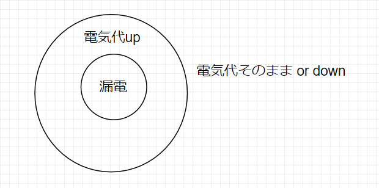

# クイズ(1:自然言語)

## Q1. 命題について知っていますか?

??? success
    ### 命題

    ```text
    真
      ・文が事実を述べているものである場合、
        それが事実の通りなら、「真」という
    
    偽
      ・文が事実を述べているものである場合、
        それが事実でないのなら「偽」という
    
    命題
      ・真偽が言える文
    
    ※真偽が言えない文は、命題ではない
      たとえば、単なるお願いや、質問など
    ```

    ###　なぜPを使うのか

    ```text
    prepositionの頭文字
    ```

## Q2. 推論と演繹について知っていますか?

??? success
    ### 推論

    ```text
    ・一つ以上の主張を根拠として、
      他の主張を結論付けること
    ```

    ### 演繹

    ```text
    ・前提が真であると認めたならば、
      結論も真だと必ず認めなければならない推論
    ```

    ### 推測との違い

    ```text
    ・推測の場合、前提が真であっても
      結論が真であるとは限らない。その可能性が高まるだけ
    ```

    ### 演繹の例

    ```text
    ・私は明日誕生日だ。私は今、19歳だ。
      それゆえ、私は明日、20歳になる
    ```

    ### 前提が誤っていてもいい

    ```text
    ・大根は魚だ。魚は、草原を走る。
      それゆえ、大根は草原を走る。
    
    ・上記の例も、演繹になる

    ・演繹の特徴は、前提が真ならば、
    　結論も必ず真であると認めなければならないというもの。

    ・本当に、大根が魚で、魚が草原を走るものなら
      大根が草原を走るのは当たり前だろう
    ```

    ### 演繹と帰納は対概念ではない

    ```text
    帰納
      ・個別事例からの一般化
    
    帰納の例
      ・20数年生きているが白いカラスを、目撃したことはない
      ・だから、白いカラスは存在しないだろう
    
    演繹
      ・別に、一般 --> 個別に結論されるとは限らない
      ・よって、対概念ではない
    ```

## Q3 論証について知っていますか?

??? success
    ### 論証

    ```text
    ・根拠を上げて、結論を示す事

    ・演繹であるかないかは、前提の真偽と関係ないが、
      論証に説得力を持たせるためには、前提が真であることと、
      前提から結論への推論が説得力を持ったものであるかを
      考える必要がある
    ```

    ### 論理は事実にかかわらない

    ```text
    ・前提が真であるか否かについては、
      本や有識者などに聞いて調べるしかない
    
    ・演繹か否かについては、誰に聞くまでもなく、
      前提が真であれば、結論が必ず真になるか
      を調べれば事足りる
    ```

## Q4 否定について知っていますか?

??? success
    ### 否定とは

    ```text
    命題を否定する
      ・その命題が「偽」であると主張する事
      ・その命題は、事実と異なるということ
    
    日本語で言うと
      ・ペンギンは草食だ
      ・ペンギンは草食ではない
    ```

    ### 二重否定

    ```text
    二回否定してみる
      ペンギンは草食だ
      --> ペンギンは草食ではない
      --> ペンギンは草食ではないではない
      --> 偽であることが、事実とは違うと言っているので
          つまり、真になる
      
      = 否定を2回繰り返すと、肯定になる
    ```

    ### 任意の場合について言いたいとき

    ```text
    ・日本語の代わりに、P,Q,Rなどの文字を使う

    ・すると、[PではないではないはPに等しい]と言い換えられる

    ・大根、ペンギンなどの、一般化と捉えればよい

    ・気持ち悪い日本語なので、
      命題Pの否定を not Pと書くことにする
    
    ・すると、命題Pを二回否定した場合は、not(not P)となる

    ・二回否定を繰り返すことを、二重否定という
    ```

    ### 二重否定則

    ```text
    ・二重否定not(not P)は、Pに等しいという関係のこと
    ```

## Q5 同値について知っていますか?

??? success
    ### 同値

    ```text
    ・Pが真の場合に、Qも必ず真であり、
      Pが偽の場合、Qも必ず偽であるとき、
      PとQは同値であるという
    
    ・PとQが同値であるとき、以下の様に表記できる
      P ≡ Q
    ```

    ??? info

        ```text
        ・Qが真の場合に、Pも必ず真であり、
          Qが偽の場合に、Pも必ず偽であるという条件も
          必要な気がするが......
        ```

        ```text
        ・≡より、<=>の方が一般的な気がするので、以後そうする
        ```

    ### 等しいとの違い

    ```text
    ・上記の同値の定義を満たす場合は、「≡」と書く
    ・「=」の定義は、かなり難易度が高いらしい
    ・現在は単に、=は左辺と右辺が等しいくらいの印象でよい
    ```

    ### 同値の記号を導入すると、

    ```text
    ・二重否定則は、以下の様に表記できる

    not(not P) ≡ P
    not(not P) <=> P
    ```

## Q6 矛盾と排中律について知っていますか?

??? success
    ### 矛盾

    ```text
    ・Pとnot Pを両方同時に主張する事

    ・一般に、PかつnotPという形の命題が矛盾になる
    ```

    ### 矛盾の例

    ```text
    ・私は100万円以上持っており、かつ
      100万円以上持っていない
    
    ・肯定の命題と、否定の命題が同時に言われている事が分かる
    ```

    ### 排中律

    ```text
    ・論理学において、Pまたはnot Pという形の命題は
    　常に成り立つという原理

    ・中間はあり得ないと述べている
    ```

    ### 排中律が成り立つ命題の例

    ```text
    ・私は100万円以上持っている。または
      100万円以上持っていない
    ```

    ### 排中律が適用できない例について

    ```text
    ・自己言及のパラドクスについて考える

    ・「今、私は噓をついている」(私の発言)という命題Pがある

    ・Pなら、一見、私の発言は嘘になる。
      しかし、嘘であるということは、
      この発言も嘘であり、つまり実際は
      「今、私は嘘をついていない」ということになる。
      「今、私は嘘をついていない」ということはnot Pになるはずである
    
    ・not Pなら、一見、私は嘘をついていないということになる
      つまり、この発言は真ということになり、
      発言を振り返ってみると、
      「今、私は嘘をついている」ということになる。
      この発言が嘘ということは、Pになるはずである......
    
    ・上記の様に循環して、いつまでも答えにたどり着かない

    ・つまり、Pともnot Pとも言えないとなってしまう

    ```

    ### 否定と反対の違い

    ```text
    ・勝ったの否定は、負けたではない

    ・引き分けの可能性があるため、「勝たなかった」が正しい

    ・排中律によれば、「P または notP」に
      どのような命題Pを入れても必ず真になるため、
      notPは、Pが偽になるすべての場合を含んでいる必要がある

    ・反対という言葉なら、負けたでも良いだろう
    ```

    ### 否定の例

    ```text
    ・私はあなたのことが好きだ。の否定
    ・私はあなたに特別な感情を抱いているわけではない。

    ・好きではないというと、嫌いというニュアンスが強くなる
      ため、好き = 特別な感情に言い換えて否定した
    
    ・このような例があるため、日常の具体例を述べるより、
      P, Q等で言い表した方が簡単だ
    ```

## Q7 自然言語と人工言語について知っていますか?

??? success
    ### 自然言語

    ```text
    ・我々が普段遣いしている言葉
    ```

    ### 人工言語

    ```text
    ・厳密に演繹を扱うために、人工的に作られた言語

    ・述語論理
      人工言語の一種で、登場する語彙は6種類
      否定、かつ、または、ならば、すべて、存在する(ある)
    
    ・命題論理
      人工言語の一種で、登場する語彙は4種類
      否定、かつ、または、ならば

    ※ここでいう語彙は、論理にかかわる語彙はという意味

    ・論理
      ・正しい判断や認識に達するための思考の進め方
      ・思考の形式や法則、思考のつながりや論証の繋がりを指す

      ・論理的に言う　
        = 思考のつながりを明確にし、論証(ある与えられた命題
        が真であることを、妥当な前提を挙げて推論する事)を
        過不足なく述べること
    ```

## Q8 連言と選言について知っていますか?

??? success
    ### 連言

    ```text
    ・命題Pと、命題Qがどちらも真であることを主張する命題
    ・P かつ Qと表現する
    ・連ねて主張するという意味
    ```

    ### 選言

    ```text
    ・命題Pと、命題Qの少なくともどちらか一方が真である
      事を主張する命題
    ・PまたはQと表現する
    ・選んで言うという意味

    両立的選言
      ・両方でもよい、とする選言
    
    排反的選言
      ・両方はダメ、とする選言
      ・日本語の文脈ではこのニュアンスが強いかも
    ```

## Q9 ド・モルガンの法則について知っていますか?

??? success
    ### 連言の否定を考える

    ```text
    P: 
    not P: 私はラーメンとチャーハンのうち、
           少なくとも一方は食べなかった
      
      -> 私はラーメンを食べなかった。または
         私はチャーハンを食べなかった。

        ※この、「または」は、両立的選言
    ```

    ```text
    P: 私はラーメンを食べた。
    Q: 私はチャーハンを食べた
    not P: 私はラーメンを食べなかった
    not Q: 私はチャーハンを食べなかった
    PかつQ: 
      私はラーメンを食べた。
      かつ、私はチャーハンも食べた。
    
    not(PかつQ):
      私はラーメンを食べなかった。
      または私はチャーハンを食べなかった


    つまり...
      not(PかつQ) ≡ not P または not Q
      ⇒これをド・モルガンの法則という
    
    ※ド・モルガンはイギリスの数学者
    ```

    ### 選言の否定を考える

    ```text
    P:私は猫を飼っている
    Q:私は犬を飼っている
    not P:私は猫を飼っていない
    not Q:私は犬を飼っていない
    PまたはQ:
      私は猫を飼っている。または私は犬を飼っている
      (両立的選言)
    
    not(PまたはQ):
      私は猫を飼っていない。かつ私は犬を飼っていない
    
    つまり、
      not(PまたはQ) ≡ not P かつ not Q
      ⇒これも、ド・モルガンの法則

    ・二つを合わせて
      連言と選言のド・モルガンの法則という
    ```

    ### 練習する

    ```text
    ・命題Pの否定を、ド・モルガンの法則を使って書き換える
    ・慣れれば、頭で考える前に機械的にできそう
    
    [1] P:私はゴルフをしない。かつ、私は野球をする
        私はゴルフをする。または、私は野球をしない。
    
    [2] 私は菜食主義だ。かつ、私は肉が好きではない。
        私は菜食主義ではない。または、私は肉が好きだ。
    
    [3] 熱海も湯河原も静岡県だ
        熱海は静岡県ではない。または湯河原は静岡県ではない。
    
    [4] 火星か木星には生命体がいる
        火星には生命体がいない。かつ、木星には生命体がいない

    ```

## Q10 消去法について知っていますか?

??? success

    ### 例

    ```text
    ・犯人は私か貴方だ。私にはアリバイがあるから犯人ではない
      それゆえ、犯人は貴方だ

    ・前提が真なら、結果も真でなければならないので
      これは演繹だ。
    
    ・この演繹の形を、消去法(選言的三段論法)という
    ```

    ### 消去法のパターン

    ```text
    ・「PまたはQ」と「not P」という前提から
       Qを結論する
    
    ・「PまたはQ」と「not Q」という前提から
       Pを結論する
    
    ・「PまたはQまたはR」と、「not P」,「not Q」という前提
       Rを結論する

    1 可能な選択肢を、「または」で列挙する
    2 偽であるものを消去していく
    3 最後に一つ残ったものが真な命題として結論される
    --> 一般的な消去法の形
    ```

    ### ちゃんと全ての可能な選択肢を列挙しないと無意味

    ```text
    ・貴方が、私のことを好きならチョコレートをもらえるが
      私のことを嫌いならチョコレートはもらえない
    
    ・それゆえ、貴方が私のことを好きでなければ、
      私は貴方からチョコレートをもらうことはできない

    これは✖

    可能性P : 私のことを好き
    可能性Q : 私のことを嫌い
    可能性R : 私のことは好きでも嫌いでもない

    P または Q または Rであり、P,Rが否定されているなら
    確かにチョコはもらえないが、上の例は、
    Rという可能性に対して述べられていない

    私のことを好きでも嫌いでもなくても、
    貴方は私にチョコをくれるかもしれない
    ```

## Q11 条件法について知っていますか?

??? success
    ### 条件法

    ```text
    ・命題と命題をつなぐ意味で用いられる「ならば」は、
      論理学では、条件法と呼ばれる
    
    ・「PならばQ」とした場合、Pが真であるとき、
    　Qは常に真であるということを主張している
    ```

    ### 条件法の例

    ```text
    ・締め切り時間を過ぎたならば、卒業論文は受理されない

    ・低気圧が近づくと、私は必ず頭痛に悩まされる

    ・870円のものを買って、1000円出したならば、おつりは
      130円になる

    ・私かあなたのどちらかは部屋にいて、今私が部屋にいない
      のなら、部屋にはあなたがいる
    ```

    ### 条件法と演繹

    ```text
    演繹
      ・前提が真なら、結論も必ず真になる推論
    
    条件法
      ・Pが真の時は、Qも常に真と主張するもの
        (主張なので、主張が偽であることもある)
    ```

    ### 条件法でない例

    ```text
    ・カモノハシは哺乳類なのに、卵生だ
    --> カモノハシは哺乳類だ。しかし卵生だ

    --> Pが真と仮定するなら、Qも真と主張しているわけではない
    　　既に、P: カモノハシは哺乳類であると主張している
        仮定をおいていないので、条件法ではない
    ```

## Q12 逆・裏・対偶について知っていますか?

??? success
    ### 逆、裏、対偶

    ```text
    A       : PならばQ
    Aの逆   : QならばP
    Aの裏   : not Pならばnot Q
    Aの対偶 : not Qならば not P
    ```

    ### 例

    ```text
    A
      月曜日が祝日ならば、博物館は火曜日に休館する
    Aの逆
      博物館が火曜日に休館するならば、月曜日は祝日だ
    Aの裏
      月曜日が祝日でないならば、博物館は火曜日に休館しない
    Aの対偶
      博物館が火曜日に休館しないなら、月曜日は祝日ではない

    Aが真であったとして、
    Aの逆：月曜日が祝日でなくても、火曜日に休館するかも
    Aの裏：逆と同じ理由で、真とは断言できない
    Aの対偶：真だといえる

    つまり、
      PならばQが真だとしても
      QならばPが真だとは限らない

      PならばQが真だとしても
      not Pならばnot Qが真だとは限らない

      これは、PならばQが、Pの時だけQを
      意味しているわけではないから
    ```

    ### 対偶について

    ```text
    ・命題Aと、Aの対偶は同値になる

    つまり、
      PならばQ ≡ not Qならば not P

      これが成り立たないと、
      3 ならば 6の時、
      6 でないなら、3
      3 なら、6のはずでは?ということになる
    ```

    ### 逆、裏、対偶を作る練習

    ```text
    A: 
      我が家が漏電しているなら、我が家の電気代が上がっている
      (これが真なら、漏電しているのに、
      上がらないことはあり得ない)
    逆:
      我が家の電気代が上がっているなら、我が家は漏電している
    裏:
      我が家が漏電していないなら、我が家の電気代は上がらない
    対偶:
      我が家の電気代が上がっていないなら、
      我が家は漏電していない
    
    ベン図を書くと、わかりやすいかもってことで以下
    ```

    

    ### 因果関係と対偶

    ```text
    A:
      台風が来るならば、彼女は家にいる
    
    Aの対偶:
      彼女が家にいないということは、台風は来ないということだ

      彼女が家にいなければ~
      とすると、彼女が家にいないことが原因で
      台風が来ていないようなニュアンスが出る

    Pのとき、それが原因でQという命題について
      ・Qではない時、つまり、Qの原因であるPが起こっていない
        という風に考える
      
      ・上の例でいうと、仮にAが真なら、
      　台風が来なくても、彼女が家にいる可能性はあるが、
        台風が来るときに限っては、
        彼女は必ず家にいたと考えられる
        すなわち、彼女が今、家にいないということは、
        少なくとも、台風は来ない（近づいていない）
    ```

    ### 逆、裏、対偶(一つの命題)

    ```text
    ・FはGだ、のような形の文であっても、
      逆、裏、対偶は作成可能

      ※逆、裏は一般に偽である場合が多いだけで、
        偽であるとは限らない

    (例)
    A:
      平家は人だ ....(真)
    Aの逆:
      人なら平家だ ....(偽)
    Aの裏:
      平家にあらずんば、人にあらず ...(偽)
    Aの対偶:
      人でないなら、平家でもない ...(真)
    ```

    ### 時系列に注意した方がよさそう(因果補足)

    ```Text
    ・日常会話では、対偶を作る際、
      時系列を保たないと、意味が異なってくる

    ・(仮定と結論は、その否定に置き換えた上で入れ替えるが、
      時系列はそのまま)
    
    [前]雨が降らない
        ならば
    [後]出かける

    [後]もし出かけていないならば
    [前]それは雨が降っているということです

    [前]叱られていないので
    [後]勉強はしない

    [後]もし勉強をしているなら
    [前]それは叱られたということです

    
    ・これを「勉強すれば、叱られる」とするのは誤り
    [前]勉強すれば
    [後]叱られる
    --> 時系列が逆転してしまっている
    
    ※命題論理(論理学)の「ならば」には時系列的意味合いはない
      因果関係的意味合いももちろんない
    
    --> つまり、命題論理は時系列による因果関係を扱えない
    　　順序関係については、「常識、文脈」で補う必要がある
    ```

    ### 全てと常に

    ```text
    ・なぜ「FはGだ」にも、
    　逆、裏、対偶が存在するのか考える

    ・FはGだ、を言い換えると、
      FはすべてGだとなる
    
    
    PならばQ
      Pだったら、常にQなはずだ
      だが、Qじゃない
      なら、Pではないということだ

      Pじゃない場合は?
      Qか、Qじゃないかは分からない

    FはGだ
      Fだったら、すべてGなはずだ
      だが、Gじゃない
      なら、Fではないということだ

      Fじゃない場合は?
      Gか、Gじゃないかは分からない
    
    --> 構造は一緒だとわかる

    ヤマネは冬眠する
      ヤマネだったら、冬眠するはずだ
      だが、冬眠しない
      なら、ヤマネではないということだ
      = 冬眠しないものは、ヤマネではない(対偶)
      
      冬眠する場合は？
      ヤマネかヤマネじゃないかは分からない

      ヤマネでない場合は？
      冬眠するかしないかは分からない
    ```

    ### ド・モルガンと対偶

    ```text
    A:
      人を殺したものは、
      死刑又は無期若しくは五年以上の懲役に処する
    
    Aの対偶
      not(死刑又は無期若しくは五年以上の懲役に処する)ならば、
      人を殺した者ではない

    --> 死刑に処せられず、かつ、無期懲役に処せられず
    　　かつ、五年以上の懲役に処せられることもないならば、
        人を殺した者ではない
    
    --> 死刑にも無期懲役にも五年以上の懲役にも
    　　処せられないならば人を殺したものではない
    
    ※ド・モルガンの法則は対象が三つ以上でも使える

      not(PかつQかつR) ≡ (not P)または(not Q)または(not R)
      not(PまたはQまたはR) ≡ (not P)かつ(not Q)かつ(not R)
    ```

    !!! info
        ### 法律用語の、又は、若しくは

        ```text
        ・大きな分け方の場合は、又は
        ・小さな分け方の場合は、若しくは
          とするらしい
        
        つまり、
          人を殺した者は、
          死刑又は無期若しくは五年以上の懲役に処する

        = 人を殺した者は、
          死刑 or (無期 or 五年以上の)懲役
        ```

## Q13 対偶論法について知っていますか?

??? success
    ### 対偶論法

    ```text
    ・後件否定式ともいう
    
    ・P ならば Q
    ・not Q
    ・以上の前提の下で、not Pが成立する事を指す
      (対偶を用いた論法なのでこの名前)

    ⇒命題Aと、Aの対偶が同値になるのでこれは成り立つ
    ⇒以前のQからも分かるけど、逆と裏には使えないよ！
    ```    

    ### 例

    ```text
    ・イモリが爬虫類ならば、イモリには鱗がある
    ・イモリには鱗がない。
    ・したがって、イモリは爬虫類ではない

    ・豚汁には豚肉を入れる
    ・けんちん汁には豚肉を入れない。
    ・したがって、けんちん汁は豚汁ではない

    ※けんちん汁はもともと精進料理なので、肉や魚は使用されない
    ```

## Q14 推移律について知っていますか?

??? success
    ### 推移律

    ```text
    ・二つの前提、「PならばQ」, 「PならばR」から
    ・「PならばR」が結論できる事
    ```

    ### 推移律の例

    ```text
    ・レポートを出さなければ単位が取れない
    ・単位が取れなければ留年だ
    ・したがって、レポートを出さないと留年する

    ・レポートを出さなければ単位が取れない
    ・単位が取れなければ留年だ
    ・このクラスの生徒は全員留年しなかった
    ・したがって、このクラスの生徒は全員レポートを出した
    ⇒対偶論法を足している

    -----------------

    1 来々軒が開店していれば、昼食は来々軒で食べる
    2 上海亭が休みの日は、来々軒は開店している
    
    ・上海亭が休みならば、昼食は来々軒で食べる
    ⇒〇　推移律

    ・昼食を来々軒で食べない日は、昼食は上海亭で食べる
    ⇒ 昼食を来々軒で食べないなら、来々軒は開店していない
    ⇒　✖　言えない

    1 授業に出席できないと単位が取れない
    2 アルバイトか課外活動が忙しいと授業に出席できない

    ・課外活動が忙しいと単位が取れない
    ⇒〇　推移律
    ・単位が取れているのであれば、アルバイトが忙しくはない
    ⇒〇　推移律 &　対偶

    1 面白くてためになる授業は学生の人気が高い
    2 学生の人気が高い授業は履修者が多い
    3 私の授業は為になるのに履修者が少ない

    ・私の授業は面白くない
    ⇒　履修者が多くないなら、学生の人気は高くない
    ⇒　学生の人気が高くないなら、not(面白い かつ 為になる)
    ⇒ not(面白い かつ ためになる)≡ not 面白い　or not　為
    ⇒ 為になるので、not面白い
    ⇒　〇

    1 ディズニーファンならディズニーに行ったことがある
    2 ディスニーに行ったことがあり、かつジェットコースター
      好きなら、スペースマウンテンに乗ったことがある
    3 保坂さんは、スペースマウンテンに乗ったことがない

    ・保坂さんはディズニーファンではない
    ⇒スペースマウンテンに乗ったことが無いなら
      not(ディズニーの経験あり かつ　ジェットコースター好き)
    ⇒not ディスニーの経験 or not ジェットコースター好き
    ⇒単に、ジェットコースターが好きではない可能性があるため
      ディズニーファンでないとは言えない
    ⇒✖
    ```

## Q15 背理法について知っていますか?

??? success
    ### 背理法

    ```text
    ・ある命題Pを仮定すると、矛盾となる
    ・その場合、仮定Pが偽だとわかる。
    ・よって、notPが結論できる

    ・このような証明方法のこと
    (※not Pを仮定して、矛盾となればPと分かる)

    演繹との違い
      ・前提が真なら、結論も真だと認めなければならない推論
      ⇒偽の場合は、結論の真偽については分からなかった
      ⇒背理法は結論を仮定し矛盾を導くことで、
      　結論の真偽が分かる
    
    直接証明
      ・真である前提から、結論が真であると証明するもの
    
    間接証明
      ・結論の否定から矛盾を示し
        結論の正しさを証明する方法
      
      例)
        結論Qでないと仮定する。
        すると、前提条件aと矛盾が生じる
        よって、Qが成立する
    ```

    ### 背理法における「仮定」と、前提

    ```text
    ・背理法における仮定は、
      仮に真であるとすると、どうなるのかを検討するための物で
      背理法で結論が導かれたら、もう必要ない
    
    ・否定されるために立てられたようなもの
    ```

    ### 背理法の例

    ```text
    前田さんと水田さんが式に来るならば、向井さんは式に来ない
    前田さんが式に来るなら、水田さんも式に来る
    それゆえ、前田さんと向井さんが二人とも式に来ることはない

    1 前田さんと向井さんが二人とも式に来ると仮定する
    2 前田さんが式に来るなら、水田さんも式に来る
    3 前田さんと水田さんが式に来るならば向井さんは式に来ない
    4 3は仮定と矛盾する。よって前田さんと向井さんが
      二人とも式に来ることはない

    [Q] 下記の3つの前提条件が真であるとき、
        目黒さんが徒競走に出ることを背理法を用いて示せ

    1 目黒さんが徒競走に出ないならば、元木さんはリレーに出る
    2 目黒さんがリレーに出るならば、元木さんはリレーに出ない
    3 目黒さんがリレーに出ないならば、目黒さんは徒競走に出る

    ・目黒さんが徒競走に出ないと仮定する(P) 
    ・この時、前提条件1より、元木さんはリレーに出る
    ・前提条件2の対偶より、元木さんがリレーに出るなら
      目黒さんはリレーに出ない
    ・前提条件3より、目黒さんがリレーに出ないならば、
      目黒さんは徒競走に出る
    ・これは仮定Pと矛盾する。
    ・よって、目黒さんが徒競走に出ないという仮定は否定される
    ・したがって、目黒さんは徒競走に出る

    [Q] 下記の3つの前提条件が真であるとき、
        安近さんが論理学に合格していることを背理法を用いて
        証明せよ
    
    1 宗教学に合格しなかった人は、論理学に合格した
    2 哲学に合格した人は宗教学に合格しなかった
    3 哲学に合格しなかった人は。論理学に合格したか、
      または、宗教学に合格しなかった
    
    ・安近さんは、論理学に合格しなかったと仮定する
    ・この時、前提条件1の対偶より、
      安近さんは、宗教学に合格した...(1)
    ・前提条件2の対偶より、安近さんは、哲学に合格しなかった
    ・前提条件3より、安近さんは、論理学に合格したか
      宗教学に合格しなかった
    ・(1)より、宗教学には合格しているので、消去法より
    　安近さんは、論理学に合格したといえるが、
    　これは仮定と矛盾する
    ・よって、仮定は否定され、安近さんは、論理学に
      合格したと示せる
    ```

    ### 直接法、対偶法、背理法による証明の手順

    ```text
    [直接法]
      AならばBを証明したい
      Aが成り立つと仮定すると
      C1が成り立つ
      C1より、C2が成り立つ
      ...
      Ckが成り立つ
      よって、Bが成り立つ
    
    [対偶法]
      AならばBが正しいことを、
      対偶[BでないならばAでない]を示すことにより証明したい
      [Bでない]が正しいと仮定する
      C1が成り立つ
      C1より、C2が成り立つ
      ...
      Ckが成り立つ
      よって、[Aでない]が成り立つ
      対偶が示せたので、[AならばB]が正しいと示せた

      ※Aが複雑で、Bが単純な場合には使えたりするらしい

    [背理法]
      AならばBが正しいことを、背理法によって示す
      すなわち、Aであり、Bでないときに矛盾が導かれることを
      示したい

      Aが正しく、かつ[Bでない]が真であると仮定する
      C1が成り立つ
      C2が成り立つ
      ...
      CかつCでないが成り立つ(矛盾)
      よって、AならばBでないは、偽である
      すなわち、[AならばB]が真であることが示された
    ```

    ### 直接法、対偶法、背理法の証明の例

    ```text
    [直接法]
      xが偶数ならば、x³は偶数である
      xが偶数であると仮定すると、
      偶数の定義より、x = 2kとなる、整数kが存在する
      両辺を3乗しても、等式は等しいため
      x³ = (2k)³
      右辺を計算して、
      x³ = 8k³
         = 2*(4k³)
      
      A = 4*k³と置くと、整数同士の積は整数なので、
      Aは整数であり、
      x³ = 2Aと示せる。
      偶数の定義より、2Aは偶数であるため、
      xが偶数であるとき、x³は偶数であるといえる
    
    [対偶法]
      x²が奇数ならば、xが奇数であることを、
      対偶: xが奇数でないならば、x²は奇数ではないことを示す
      事で証明する

      xが奇数でないと仮定する。すべての整数は
      奇数又は偶数に分かれるため、xは偶数

      偶数の定義より、x = 2kとなる、整数kが存在する
      両辺を2乗しても等式は等しいので、
      x² = (2k)²
      右辺を計算して
      x² = 2*(2k²)
      A = 2k²とおくと、整数同士の積は整数なのでAは整数
      よって、x² = 2A
      偶数の定義より、2Aは偶数であるため、x²は偶数
      よって、xが奇数でない時、x²は、奇数ではない
      対偶が示されたため、
      x²が奇数ならば、xは奇数であるといえる

    [背理法]
      x²が奇数ならば、xが奇数になることを証明せよ

      x²が奇数であるとき、xが奇数にならない、
      すなわち、x²が奇数の時、xは偶数であると仮定する
      
      この時、奇数の定義より、
      x² = 2k + 1 ...(1)となる整数kが存在する
      偶数の定義より、
      x = 2m ...(2)となる整数mが存在する
      両辺を2乗しても等式は等しいので、
      (2)を2乗して
      x² = (2m)² = 4m²
      (1), (2)より、
      4m² = 2k + 1が成り立つ
      しかし、4k²は、偶数の定義より偶数であり、
      2k + 1は奇数の定義より、奇数である
      奇数かつ偶数である整数は存在しないので、
      4m²≠2k+1であり、4m² = 2k+1と、4m²≠2k+1が
      両方成り立つのは矛盾である。
      よって、仮定x²が奇数であるとき、xが奇数にならないは
      矛盾であり、否定される。
      従って、仮定x²が奇数であるとき、xは奇数になる
    ```

## Q16 全称命題、存在命題、単称命題について知っていますか?

??? success
    ### 量化

    ```text
    ・命題に、「すべて」や「ある」をつけること
    ```

    ### 単称命題

    ```text
    ・特定の個々のものについての命題
    
    例)
      この熊は冬眠しない
    ```

    ### 全称命題

    ```text
    ・集合に属するすべてのものについての命題

    例)
      (すべての)熊は冬眠する
    ```

    ### 存在命題

    ```text
    ・集合に属する、特定の元についての命題

    例)
      ・熊の中には冬眠するものがいる
    ```

    ### 全称命題の演繹

    ```text
    ・1年生はすべて合格した。この人は1年生だ
    　それゆえ、この人は合格した。
      [命題]1年生ならば、合格している。

    ・1年生はすべて合格した。この人は合格しなかった
      それゆえ、この人は1年生ではない。
      [対偶] 合格していないならば、1年生ではない

    つまり
      ・全称命題同士の組み合わせでも対偶論法は使用可能
      ・FはGだ　= すべてのFはGだ、なので今までと同じ

    ------------------------
    ・すべてのxについて、
      もしxがある性質Pを持つならば、xは性質Qを持つ

    -->もしxがPならば、xはQ
    --> もしxが1年生ならば、xは合格している
    ```

    ### 全称命題と存在命題

    ```text
    ・哲学者ならば怠け者だ ≠　怠け者ならば哲学者だ

    ・ある哲学者は怠け者だ ≡　ある怠け者は哲学者だ
      ≡　ある人がいて、その人物は哲学者であり怠け者だ
    ```

    ### 全称と存在のド・モルガン

    ```text
    ・全称命題の否定
      --> すべての餃子にはニンニクが入っている
      --> ニンニクが入っていない餃子がある
    
    ・存在命題の否定
      --> ある水族館は入場無料だ
      --> 入場無料の水族館はない

    ・すべてのFはGだ
      [否定] --> あるFはnot Gだ

    ・あるFはGだ
      [否定] --> すべてのFはnot Gだ

    ・全称の否定　-->  否定の存在
    ・存在の否定　-->  否定の全称 
    ```

    ### 連言、選言との類似性

    ```text
    ・全称命題の対象となる集合Fの元が3つと考える
    
    ・その場合、FはGだという全称命題は、
      Fの要素1はGだ。Fの要素2はGだ。Fの要素3はGだ。と等価
    
    ・つまり、集合の元についての単称命題を
      「かつ」でつないだものが、全称命題になる

    ---------------------

    ・あるFはGだという存在命題について考える
      これはFの要素1,2,3のうちいずれかがGだと等価
    
    ・つまり、集合の元についての単称命題を
      「または」でつないだものが、存在命題
    ```

    ### 存在しない、すべて

    ```text
    ・すべてのFはGだ
      ≠　Fが存在する

    ・すべてのツチノコは人を食べる
      ≠ ツチノコが存在する
    
    ・レポートを出した人は全員合格した
      ≠　レポートを出した人が存在する
      --> 文脈的に存在しそうだが、論理学では
          当然のこととはされない
    ```

    ### 一見矛盾に見える話

    ```text
    P: すべてのFはGだ
    Q: すべてのFはnot Gだ

    P, Qがともに真だとして、
    Fが存在すると仮定する。
    すると、G かつ not Gとなり矛盾する。
    よって、Fは存在しない。

    ※前提にFが存在するという文言はない
      よって、P,Qに関する前提は矛盾していない
    
    <補足>
      すべてのFがGであり、
      すべてのFが￢Gであるという二つの命題は
      集合Fが空集合である場合には矛盾しない
      --> これは論理学では空虚な真(vacuous truth)と呼ばれる
      --> 前提が偽であるために、真となる条件文を指す

    <補足2>
      ・all([])が真であることに疑問を覚えたことは?
      ・結論は、「すべての要素が真であること」
      ・前提は、「要素が存在する事?」
      ・今回の場合、そもそも要素が存在しない


      ・真ならば反例が存在しない(これは基本だと思う)
        --> そもそも要素が一つもないならば反例は存在しない
        --> 空集合の場合、全ての要素が○○ならば～とした場合
        　　Trueになる
    ```

    ### 論理包含

    ```text
    ・第1命題が偽 or 第2命題が真の時に真となる論理演算

    ・２つの命題P,Qに対する論理包含を、P ==> Qと書く

    ・ここで、P: Fが存在する。Q: すべてのFはGであるという
      2つの命題について考える
    
    ・この時、第1命題「Fが存在する」が偽である場合
      P ==> Qは真になる
      ※Qが真になるわけではない。

    <補足:標準ライブラリ関数と論理的包含>
      ・Pythonの場合について考える
        all([])は、
        P: リストの要素が存在する
        Q: リストの要素がすべて条件を満たす
        としたときの、P ==> Qであると考えられる
        そのため、空リストの場合、Trueを返す
    
    <補足:約束で考える>
      ・[P==>Q]明日地球が滅亡するなら、貴方と結婚しよう
      ・約束を守るなら、P==>Qは真
      ・約束を破るなら、P==>Qは偽
      ・P: 明日地球が滅亡する
      ・Q: 貴方と結婚する
      ・Pが真の時、貴方と結婚しないと、約束を破ることになる
      ・Pが偽の時、結婚してもしなくても、嘘をついていない
    
    | P   | Q   | P==>Q |
    | --- | --- | ----- |
    | T   | T   | T     |
    | T   | F   | F     |
    | F   | T   | T     |
    | F   | F   | T     |
    
    <補足:その2>
      ・空虚な真を認める利点について、考えてみる

      ・仮に空集合であるとき、A-->Bが偽になるとすると、
        A --> B は A & B と同等になる
      
      ・つまり、わざわざ-->という記号を導入する必要性がない

      ・真であれば違いが出る！

      ・∀x ∊ S, P(x)の命題が偽である場合、通常
        Sに対して、P(x)を満たさないxが存在する事を意味する
      
      ・空集合には要素がない。したがって、空虚な真を認めない
      　場合、全称命題の定義として、Sに対して、
      　P(x)を満たさないxが存在する = 偽と言えなくなる
        つまり、面倒くさい場合分けが必要になる
      
      ・一般化を行う上では、空虚な真を認めた方が都合がいい

      ・日常会話には、前提条件や暗黙の了解が含まれ、
        特に全称命題では実際にその状況が発生したという
        前提が含まれるので、日本語で考えると不自然に思える
        事が多いのも確か。だけどこれは論理学なので

        例) ウサイン・ボルトとレースをした時、私は毎回勝つ
            --> ウサイン・ボルトとレースをしたことがないので
            --> 空虚な真より、この命題は真
            --> 日常会話から行くと、レースをした経験がない
                時点で、偽に思えるが......
            --> 論理学では、存在することは仮定されない
    ```

    ### 「も存在する」と「が存在する」

    ```text
    P: すべての哲学者は怠け者だ
    --> not Pについて考える

    not P: 怠け者ではない哲学者がいる

    ・ここで、「が」を「も」にしてしまうと、
      「怠け者ではない哲学者もいる」となり、
      怠け者である哲学者がいるというニュアンスを含む

    ・しかし、全員が怠け者でない哲学者である可能性もある
      よってこのケースを排除しないためにも、「が」にする。


    例)
      すべての哲学者が怠け者、というわけではない
      --> 哲学者の中には、怠け者でない人がいる
      --> 怠け者がいるかどうかには言及していない
    ```

## Q17 全称と存在を組み合わせた命題

??? success
    ### 多重量化

    ```text
    ・全称と存在を複数組み合わせること
    ```

    ### 多重量化のパターン

    ```text
    ・すべての人間は、すべての動物を愛している
    ・とある動物を愛している人間が存在する

    ・すべての人間はそれぞれ何かしらの動物を愛している(写像)
    ・すべての動物は、それぞれ誰かから愛されている

    ・すべての動物を愛している人間が存在する
    ・すべての人に愛されている動物が存在する
    ```

    ### 全称・存在の組み合わせのド・モルガン
    ```text
    P: すべての学生がどれかの競技に参加した

    not P:
      not(すべての学生がどれかの競技に参加した)
      --> ある学生がnot(どれかの競技に参加した)
      --> ある学生は、すべての競技に参加しなかった

    P:ある学生はすべての競技に参加した

    not P:
      not(ある学生はすべての競技に参加した)
      --> すべての学生は、not(すべての競技に参加した)
      --> すべての学生は、どれかの競技に参加しなかった
    
    P: 誰でも少なくとも1冊は本を読んだことがある

    not P:
      not(誰でも少なくとも1冊は本を読んだことがある)
      --> ある人は、not(少なくとも1冊は本を読んだことがある)
      --> ある人は、1冊も本を読んだことがない
      --> 1冊も本を読んだことがない人がいる。
    ```