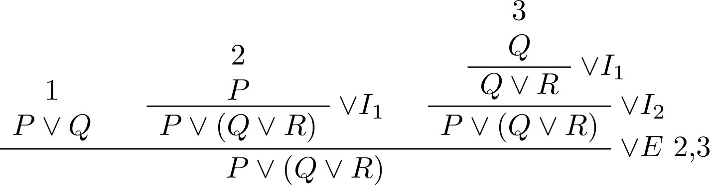
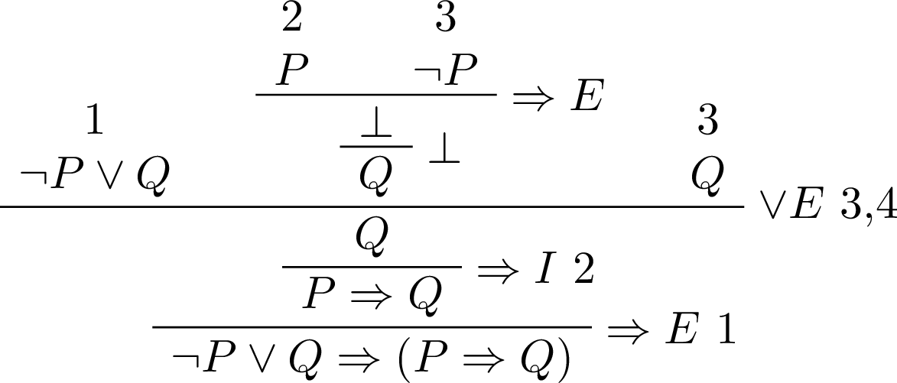
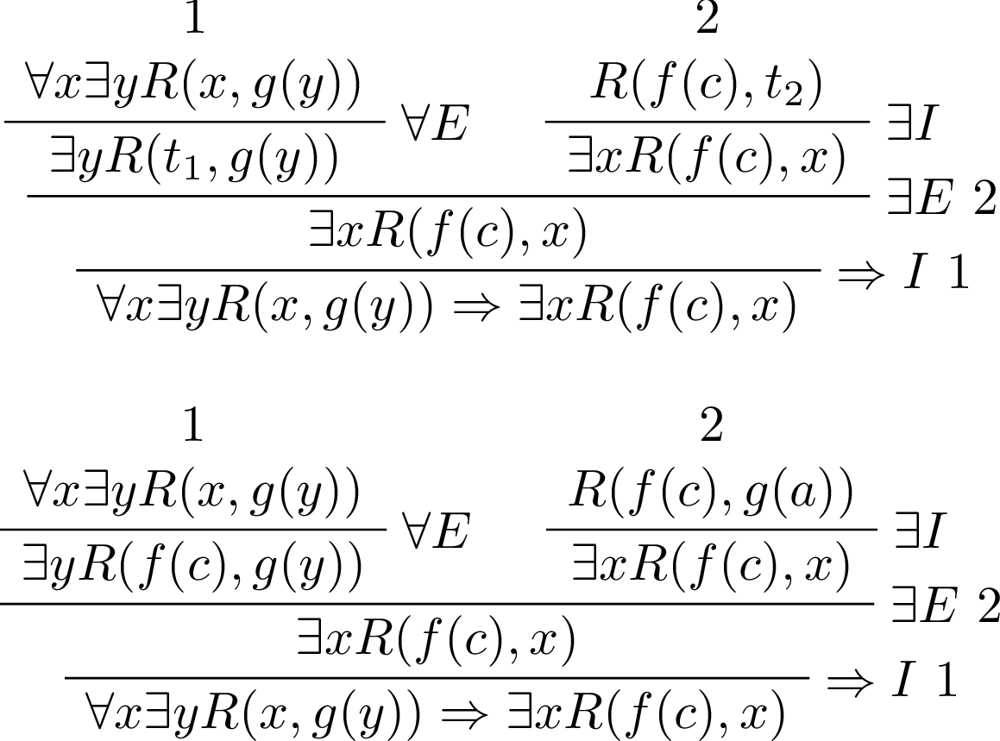

# クイズ(Q3:証明問題)

## Q35 数理論理学について知っていますか?

??? success
    ### これから(数理論理学の利点)

    ```text
    ・主張を記号を用いて、論理式で表現することで、
      --> 証明すべきことの分析
      --> 内容の正確な理解
      --> 相手に正確に伝えることが可能に

      --> 問題となっている主張そのものを正しく把握可能になり
      --> 主張の論理構造に従って、証明を作れるようになる
    
    ・主張と証明自体を記号を用いて表現
    --> 証明の仕組みを分析しやすくなる
    --> 論証の正しい進め方を把握可能になる
    --> 思考の背景となる原理を把握可能になる

    ・主張の記号表現 --> 証明の組み立て方 --> 証明の記号表現
      という順に進んでいく

    ```

    ### 記号を使う利点

    ```text
    1 個々の事実を、抽象化して法則の形にまとめる
    2 その基本法則の正しさを一度証明しておく
    --> 無限個の具体例に対して、使用可能

    ・文章よりも、厳密性が高い（曖昧さを防げる）
    ・原理そのものを表現しやすい
    ・計算という手段が使え、コンピュータによる自動化が可能
    ・数学的な検証が可能となる
    ```

    ### 記号操作による推論の例

    ```text
    ・包括関係S⊆Tでないことを示したい場合
    1. 集合Sが、集合Tの部分集合であることは、
       記号を用いると、∀x(x∊S⇒x∊T)と表現できる
    2. 逆に、包括関係が成り立たないことは、￢∀x(x∊S⇒x∊T)
    3. ド・モルガンの法則や条件法の意味合いを考えれば
       以下の様に式変形可能

    ￢∀x(x∊S⇒x∊T)
    ⇔ ∃x￢(x∊S⇒x∊T) (￢∀xA ⇔ ∃x￢A)
    ⇔ ∃x￢(￢x∊S ∨ x∊T) (A⇒B ⇔ ￢A∨B)
    ⇔ ∃x(￢￢x∊S ∧ ￢x∊T) (￢(A∨B) ⇔ ￢A∧￢B)
    ⇔ ∃x(x∊S ∧ ￢x∊T) (￢￢A ⇔ A)

    4. つまり、「あるxについてxがSに属し、かつxがTに属さぬ」
       場合、つまり、「Sに属して、Tに属さない要素」の存在を
       示せばよいことになる。
    
    5. この1~4までの思考の流れを図式で表現することが可能
       証明木と呼ばれるもので、線の上の式から下の式が導かれ
       線の右には推論に用いた規則の名前が表示される
       --> 主に、latexのbussproofs.sty等を用いる
    ```

## Q36 数学の概念を述語で表現できますか?

??? success
    ### 主張の形について(三段論法)

    ```text
    [二つの前提から、結論が導出される例]

    [1]
      4の倍数である整数は、みな偶数だ
      8は4の倍数だ
      ----------------------------
      よって、8は偶数である
    
    [2]
      必修である科目は、みな卒業に必要である
      数理論理学は必修である
      ------------------------------
      よって、数理論理学は卒業に必要である
    
    [3]
      P(x)であるならば、常にQ(x)である
      P(c)である
      ------------------------
      よって、Q(c)である

    [4]
      ∀x(P(x)⇒Q(x))
      P(c)
      ----------------
      Q(c)

    [5]
      2で割りきれない自然数は、すべて奇数である
      3は2で割り切れない
      -------------------------
      よって、3は奇数である

      対象c: 3
      性質P(x): xは2で割り切れない
      性質Q(x): xは奇数である
    ```

    ### コラム(恒真と論理同値)

    ```text
    ・恒真は、命題論理について、各命題のどの組み合わせに
      対しても、論理式全体が真になる式
    
    ・論理同値とは、各命題の真偽のどの組み合わせに対しても
      二つの論理式の真偽が一致する事
      --> 論理式を直接証明できない時に、置き換え可能
    
    | A   | B   | (A∨B)∧A |
    | --- | --- | ------- |
    | 1   | 1   | 1       |
    | 1   | 0   | 1       |
    | 0   | 1   | 0       |
    | 0   | 0   | 0       |

    --> (A∨B)∧A　が、 Aと論理同値であることが分かる

    | A   | B   | ￢A  | ￢B  | ￢A⇒￢B | B⇒A |
    | --- | --- | --- | --- | ----- | --- |
    | 1   | 1   | 0   | 0   | 1     | 1   |
    | 1   | 0   | 0   | 1   | 1     | 1   |
    | 0   | 1   | 1   | 0   | 0     | 0   |
    | 0   | 0   | 1   | 1   | 1     | 1   |

    --> ￢A⇒￢Bは B⇒Aと論理同値であることが分かる
        つまり、￢A⇒￢Bを証明できない時、代わりにB⇒Aを
        証明するなどの行動がとれる
    ```

    ### コラム(数学と述語)

    ```text
    [1]
      恒等式: x²-1 = (x+1)(x-1)について考える
      --> ∀x(x²-1 = (x+1)(x-1))
      --> 等式の部分はxに応じて真偽が定まる1変数述語
          これに、全称量化子がついている

    [2] x²は常に非負である
    --> ∀x(x²>=0)

    [3] 4=2xを満たすxがある
    --> ∃x(4=2x)

    [4] 任意のxについて、x*xは0以上
    --> ∀x(x*x >= 0)

    [5] x*xが9と等しくなるxが存在する
    --> ∃x(x*x = 9)

    [6] x*x + x = x*(x+1)は恒等式である
    --> ∀x(x*x + x = x*(x+1))

    [7] 方程式： x*x + x = 0を満たす解がある
    --> ∃x(x*x + x = 0)

    [8] 積は交換法則を満たす
    --> ∀x∀y(x*y = y*x)

    [9] 4は3*x*yの形には表せない
    --> ∀x∀y￢(4 = 3*x*y)

    ```

    ### 真理集合と数学

    ```text
    真理集合：述語が成り立つ対象をすべて集めた集合

    [1]
      対象領域をUとすると、述語P(x)の真理集合は
      以下の様に表現可能
      --> {x∊U | P(x)}

    [2]
      述語P(x), Q(x)を満たす対象全体の集合をそれぞれ
      S = {x∊U | P(x)},  T = {x∊U | Q(x)}とする

      この時、二つの述語の選言と、連言は以下の様に表現可能

      選言：{x∊U | P(x)∨Q(x)}
      --> S∪T
      連言：{x∊U | P(x)∧Q(x)}
      --> S ∩ T

    [3] 対象領域が有限集合{c_1, ..., c_n}の場合、
        ∀xP(x) ⇔ P(c_1)∧ ... ∧ P(c_n)

        ∃xP(x) ⇔ P(c_1) ∨ ... ∨ P(c_n)

        --> 量化子の意味が分かりにくい時、有限集合なら
            連言や宣言としてとらえることが可能

    [4-1] ※含意、同値について
      対象xが、述語P(x), Q(x)を満たす対象領域Uの部分集合を
      それぞれS, Tとした場合、次の論理式を満たす対象xから
      なる集合をS, Tを用いた集合の式で表せ
    ```

    ${
      \begin{align} 
      \quad \quad \quad
      & S = \{x \in U | P(x) \} \\
      & T = \{x \in U | Q(x) \} \\
      & S^c \cap T 
        = \{x \in U | P(x) \rightarrow Q(x) \} \\
      & S \cap T^c 
        = \{ x \in U | Q(x) \rightarrow P(x) \} \\
      & (S \cap T) \cup (S^c \cap T^c) 
        = \{ x \in U | P(x) \leftrightarrow Q(x) \} \\
      \end{align}
    }$

    ```text
    [4-2] P(x)⇒Q(x)が真であるときの、包含関係
    --> P(x)⇒Q(x)が真であるということは、
        P(x)が真で、Q(x)が偽であるxが存在しない
        つまり、述語P(x)を満たす対象領域Uの部分集合であるSは
        Tの部分集合であるといえる。よって
        --> S⊆T
    
    [4-3] P(x)⇔Q(x)が真であるときの、集合の関係性
    --> SがTの部分集合であり、TがSの部分集合である
    --> つまり、S⊆T かつ S⊇T


    [5]  x=-1, x=1の時、(x+1)x(x-1) = 0が成り立つ
    --> x = -1 ∨ x = 1 ⇒ (x+1)x(x-1) = 0

    [6] x=3,y=2は、連立方程式x+y=5, 2x=3yの解であり、
        他に解なし。(片方の述語が真なら真に、偽なら偽になる)
    --> x=3∧y=2 ⇔ x+y = 5 ∧ 2x = 3y
    ```

    ### 条件付き全称と、条件付き存在

    ```text
    [1]
      対象領域：整数全体
      P(x): xは4の倍数である
      Q(x): xは偶数である

      この時、∀x(P(x)⇒Q(x))は真
      --> 意味は「任意の4の倍数は、整数である」
      --> ∀x(P(x)⇒Q(x))が真であるとき、P(x)が真なら
          常にQ(x)は真になる
      --> P(x)はQ(x)の十分条件と言ったりする
      --> (P(x)が成り立てば、Q(x)が成り立つというに十分)
      --> (Q(x)が成り立つ事は、
           P(x)が真である為に必要な条件の一つ)
           
      --> P(x)が成り立つときは、常にQ(x)が成り立つので
          条件付き全称という言葉で表現することもできそうだ
    
    [2]
      対象領域：整数全体
      P(x): xは6の倍数である
      Q(x): xは奇数である

      ∃x(P(x)∧Q(x))
      --> xが6の倍数で、かつ奇数であるようなxが存在する
      --> 今回の場合は偽
      --> 6の倍数という条件の上で、Q(x)を満たすxが存在するか
          と聞いているので、条件付き存在という言葉で表現可能
    
    [3] どんな偶数xについても、2xは4の倍数
    --> ∀x(2|x⇒4|2x)

    [4] 2xが3の倍数となるような偶数xがある
    --> ∃x(3|2x ∧ 2|x)

    [5] 略記について
        S: 4の倍数全体の集合      
        P(x): xは4の倍数である
        Q(x): xは偶数であるとすると、

        ∀x(P(x)⇒Q(x)) 
        --> ∀x(x∊S ⇒Q(x))
        --> ∀x∊S Q(x)と略記可能
        --> 集合Sの任意の要素xについて、Q(x)
    
    [6] どの整数も、平方すると正である(※x∊整数全体の集合)
    --> ∀x(x^2⇒x>0)

    [7] 平方が自分自身に等しい整数が存在する
    --> ∃x(x^2 = x)

    [8] xが偶数ならば、xは4の倍数である
    --> ∀x(2|x ⇒ 4|x)

    [9] ある偶数は、その平方が4で割り切れない
    --> ∃x(2|x ∧ ￢4|x^2)

    [10] 2以上の整数は、その平方が9を超える(真偽も答えよ)
    --> ∀x(x >= 2 ⇒ x^2 > 9) , 偽

    [11] ある2以上の整数は、その平方が9を超えない
    --> ∃x(x >= 2 ∧ ￢(x^2 > 9)), 真

    [12] 次の論理式が何を表すか答えよ
         ただし、m,n,kは自然数で、fは自然数上の写像

    [12-1]
      nは2以上 & ∀m(
        mは2以上& mはnより小さいなら、∀k(nはk*mでない)
      )

      <具体例>
      n=2の時、空虚な真より、真
      n=3の時、真
      n=4の時、偽
      --> 素数なら、真になる。
      --> nは素数である
    
    [12-2]
      異なる元が、値域内の等しい元に移されることはない
      --> fは単射である

    ```

    ${
      \begin{align}
      \quad \quad \quad
      & [12-1]\quad n \ge 2 \land \forall m (m \ge 2 \land m < n 
      \rightarrow \forall k \,n \neq k \times m) \\
      & [12-2]\quad \forall{m} \forall{n} (m \neq n \rightarrow
      f(m) \neq f(n))
      & \end{align}
    }$

    ### 同一概念

    ```text
    ・二つの述語が、その真偽からは区別できないことを指す
    --> ∀x(P(x)⇔Q(x)): PとQは同じ性質、同じ概念
    ```

    ### 集合演算を論理式で表記する

    ```text
    ・U: 対象全体の集合
      S, T: Uの部分集合
      x: Uに属する元
    ``` 

    ${
      \begin{align}
      \quad \quad \quad
        & 補集合 \\
        & x \in S^c \leftrightarrow \neg x \in S \\
        & 共通部分 \\
        & x \in S \cap T \leftrightarrow x \in S \land x \in T \\
        & 和集合 \\
        & x \in S \cup T \leftrightarrow x \in S \lor x \in T \\
        & 差集合 \\
        & x \in S \cap T^c \leftrightarrow
        x \in S - T \leftrightarrow 
        x \in S \land x \notin T \\
        & 直積 \\
        & (x,y) \in S \times T \leftrightarrow
        x \in S \land y \in T \\
        & 冪集合(ドイツ文字で書くのは面倒\to 代用) , XはSの部分集合 \\
        & X \in \mathbb{P}(S) \leftrightarrow 
        X \subseteq S  \\
        & 空集合 \\
        & S = \emptyset \leftrightarrow 
        \neg\exists{x}~ x\in S \\
        & 包括関係 \\
        & S \subseteq T \leftrightarrow 
        \forall{x}(x \in S \rightarrow x \in T) \\
        & 相等関係(集合の相関関係の定義より) \\
        & S = T \leftrightarrow
        \forall{x}(x \in S \leftrightarrow x \in T) \\
      \end{align}
    }$

    ### 否定に関する表記

    ${
      \begin{align}
        \quad\quad\quad
        & 二重否定 \\
        & \neg\neg{A} \leftrightarrow A \\
        & 連言の否定 \\
        & \neg(A \land B) \leftrightarrow
          \neg{A} \lor \neg{B} \\
        & 選言の否定 \\
        & \neg(A \lor B) \leftrightarrow
          \neg{A} \land \neg{B} \\
        & 含意の否定 \\
        & \neg(A \rightarrow B) \leftrightarrow
          A \land \neg{B} \\
        & 同値の否定 \\
        & \neg(A \leftrightarrow B) \leftrightarrow
          (A \land \neg{B}) \lor (\neg{A} \land B) \\
        & 全称量化子の否定 \\
        & \neg\forall{x}P(x) \leftrightarrow 
          \exists{x}\neg{P(x)} \\
        & 存在量化子の否定 \\
        & \neg\exists{x}P(x) \leftrightarrow
          \forall{x}\neg{P(x)} \\
      \end{align}
    }$

    ### 全称と存在の併用

    ```text
    [1]
      ある数は、2以上のどの約数も持たないという述語を
      論理式で表現せよ
      --> 特定の変数を固定するとわかりやすい
      --> ∃x∀y(y >= 2 ⇒ ￢y|x)

    [2]
      どの数にもそれ以上の偶数がある
      --> ∀x∃y(x <= y ∧ 2|y)
    
    [3]
      任意の数以上の偶数が存在する
      --> ∃y∀x(x <= y ∧ 2|y)

    [4] 集合{0,1,2}上の述語Rを
        R(x,y)⇔(x+1)mod3 = y mod 3と定める

    [4-1]
      すべての組み合わせについての真偽値表を作れ
      | y\x | 0   | 1   | 2   |
      | --- | --- | --- | --- |
      | 0   | ✖   | ✖   | 〇  |
      | 1   | 〇  | ✖   | ✖   |
      | 2   | ✖   | 〇  | ✖   |
    
    [4-2]
      次の命題の真偽を述べよ

      ∀x∀y R(x,y)
      --> 偽(すべてが〇なら真)

      ∀x∃y R(x,y)
      --> 真(どの列にも〇があれば真)

      ∃x∀y R(x,y)
      --> 偽(特定の列がすべて〇なら真)

      ∃x∃y R(x,y)
      --> 真(どこかに〇があれば真)
    ```

    ### 練習問題1

    ```text
    [1] 平方数全体の集合をSとすると,
        xは平方数であるという述語は、x ∊ Sと表現可能
        この時、以下の述語を論理式で表記せよ
    
    [1-1]
      121と484はともに平方数である
      --> 121 ∊ S ∧ 484 ∊ S
    
    [1-2]
      どの平方数もみな非負である
      --> ∀x(x ∊ S ⇒ ￢ x < 0)
    
    [1-3]
      負の平方数は存在しない
      --> ￢∃x(x∊S ∧ x < 0)
    
    [1-4]
      異なる平方数が存在する
      --> ∃x∃y(x∊S ∧ y∊S ∧ x ≠ y)
    
    [2] S,Tが全体集合Uの部分集合であるとき、
        S,Tが互いに素という性質を、論理式で表現せよ
        ただし、x∊Uに言及する必要はない
        --> S∩T = ∅
        --> ￢∃x(x∊S∩T)
        --> ￢∃x(x∊S ∧ x∊ T)

    [3] 次の命題の否定を、￢Q(x)が現れる形で表記せよ

    [3-1]
      ∀x(P(x)⇒Q(x))
      --> ￢∀x(P(x)⇒Q(x))
      --> ∃x￢(P(x)⇒Q(x))
      --> ∃x￢(￢P(x)∨Q(x))
      --> ∃x(P(x)∧￢Q(x))
    
    [3-2]
      ∃x(P(x)∧Q(x))
      --> ￢∃x(P(x)∧Q(x))
      --> ∀x￢(P(x)∧Q(x))
      --> ∀x(￢P(x)∨￢Q(x))
      --> ∀x(P(x)⇒￢Q(x))
    
    [4] 次の論理式が、論理同値かどうか示せ

    [4-1]
    A⇒B と ￢A∨B 
    --> 論理同値

    | A   | B   | A⇒B | ￢A∨B |
    | --- | --- | --- | ---- |
    | 1   | 1   | 1   | 1    |
    | 1   | 0   | 0   | 0    |
    | 0   | 1   | 1   | 1    |
    | 0   | 0   | 1   | 1    |

    [4-2]
      A⇒Bと、￢(A∧￢B)
      --> 論理同値

    | A   | B   | A⇒B | ￢(A∧￢B) |
    | --- | --- | --- | ------- |
    | 1   | 1   | 1   | 1       |
    | 1   | 0   | 0   | 0       |
    | 0   | 1   | 1   | 1       |
    | 0   | 0   | 1   | 1       |

    [4-3]
      A⇒Bと、￢B⇒￢A
      --> 論理同値


    [4-4]
      A⇒Bと、B⇒A
      --> 論理同値でない
    | A   | B   | A⇒B | B⇒A |
    | --- | --- | --- | --- |
    | 1   | 1   | 1   | 1   |
    | 1   | 0   | 0   | 1   |
    | 0   | 1   | 1   | 0   |
    | 0   | 0   | 1   | 1   |

    [4-5]
      A⇒(B⇒C)と、(A⇒B)⇒C
      --> 論理同値ではない
    | A   | B   | C   | A⇒(B⇒C) | (A⇒B)⇒C |
    | --- | --- | --- | ------- | ------- |
    | 1   | 1   | 1   | 1       | 1       |
    | 1   | 1   | 0   | 0       | 0       |
    | 1   | 0   | 1   | 1       | 1       |
    | 1   | 0   | 0   | 1       | 1       |
    | 0   | 1   | 1   | 1       | 1       |
    | 0   | 1   | 0   | 1       | 0       |
    | 0   | 0   | 1   | 1       | 1       |
    | 0   | 0   | 0   | 1       | 0       |

    [4-6]
    A⇒(B⇒C)とA∧B⇒C
    --> 論理同値
    | A   | B   | C   | A⇒(B⇒C) | A∧B⇒C |
    | --- | --- | --- | ------- | ----- |
    | 1   | 1   | 1   | 1       | 1     |
    | 1   | 1   | 0   | 0       | 0     |
    | 1   | 0   | 1   | 1       | 1     |
    | 1   | 0   | 0   | 1       | 1     |
    | 0   | 1   | 1   | 1       | 1     |
    | 0   | 1   | 0   | 1       | 1     |
    | 0   | 0   | 1   | 1       | 1     |
    | 0   | 0   | 0   | 1       | 1     |

    [4-7]
      A⇔Bと、￢A⇔￢B
      --> 論理同値
    | A   | B   | A⇔B | ￢A⇔￢B |
    | --- | --- | --- | ----- |
    | 1   | 1   | 1   | 1     |
    | 1   | 0   | 0   | 0     |
    | 0   | 1   | 0   | 0     |
    | 0   | 0   | 1   | 1     |

    [4-8]
      A⇔Bと、(A⇒B)∨(B⇒A)
      --> 論理同値
    | A   | B   | A⇔B | (A⇒B)∨(B⇒A) |
    | --- | --- | --- | ----------- |
    | 1   | 1   | 1   | 1           |
    | 1   | 0   | 0   | 1           |
    | 0   | 1   | 0   | 1           |
    | 0   | 0   | 1   | 1           |

    [6] 次の各文を論理式で表せ
        ただし、対象領域は整数全体

    [6-1]
      xは0以上、10未満である
      --> x>=0 ∧ x < 10
    
    [6-2]
      xとyの積が0なら、少なくとも一方は0である
      (x*y = 0) ⇒ x = 0 ∨ y = 0
    
    [6-3]
      xは正の奇数である
      x > 0 ∧ ∃k x = 2k + 1
    
    [6-4]
      不等式x^2 + 4x + 4 <= 3には整数の解がない
      ￢∃x (x^2 + 4x + 4 <= 3)

    [6-5]
      xの立方は、2つの整数の立方の和としてあらわせる
      ∃y∃z(x^3 = y^3 + z^3)
    
    [6-6]
      xとyは異なる約数を持つ
      ∃i∃j(i|x ∧ j|y ∧ i≠j)
    
    [6-7]
      ある整数は、すべての正整数の約数である
      ∃x∀y(y > 0 ⇒ x|y)

    [6-8]
      xは、2つの整数yとzの最大公約数である
      --> どれが量化子を適用する変数なのか考えた方がいい
      x|y ∧ x|z∧∀i((i|y∧i|z)⇒i<=x)
      
    [6-9] 
      最大の偶数は存在しない
      ￢∃x∀y((2|x∧2|y)⇒ x >= y)
      --> ￢∃x(2|x⇒∀y(2|y⇒ x>=y))
    
    [7]
      集合S = {0,1,2}上の関数と述語に関する以下の問いに答えよ

    [7-1]
      集合S上の1変数関数fを、f(x) = (x+2) mod 3と定義する
      また、S上の2変数述語Rを、R(x,y)⇔ f(x) = yと定義する
      この時、xとyの値のすべての組み合わせの真理値表を作れ
    | y\x | 0   | 1   | 2   |
    | --- | --- | --- | --- |
    | 0   | ✖   | ✖   | 〇  |
    | 1   | 〇  | ✖   | ✖   |
    | 2   | ✖   | 〇  | ✖   |

    [7-2]
      集合Sを対象領域とする次の各命題の真偽を答えよ
      ∀x∀yR(x,y) --> 偽
      ∀x∃yR(x,y) --> 真
      ∃x∀yR(x,y) --> 偽
      ∃x∃yR(x,y) --> 真
    
    [7-3]
      7-1で定めたS上の関数fが全射であることを、述語Rを用いた
      論理式で表せ
      --> すべての値域の元に対して、遷移元が存在している

      ∀y∃x(x∊S∧y∊S ⇒ R(x,y))

    [8]
      以下は、形式言語理論で反復補題と呼ばれる性質だ
      

      Lが正則集合なら、次の性質を満たす非負整数mが存在する
      zがLに属し、zの長さ|z|がm以上の時、
      適当な語u,v,wを（語の全体集合Σ*から）選べば
      (a)zはuvwに等しい。
      (b)|uv|はm以下
      (c)vは空列εではない。(※つまり、長さ0ではないって事か)
      (d)各非負整数nについてuv^nwがLに属す
      の4条件を満たすように出来る

      --> つまり、このようなmになるような
          u,v,wの組は1つってことか?
          一瞬、任意かと思ったわ

    [8-1]
      ※反復補題
      --> 形式言語理論において、正規言語が満たすべき条件の1つ
      --> ある言語が正規言語であることを証明する際に役立つ

      --> ある言語Lが正規言語であるならば、
          次の条件を満たす正の整数mが存在する

          任意のz∊Lで、|z|>=mであるならば
          zを次のように3つの部分に分割できる
          
          z = uvw
          |uv| <= m
          |v| > 0
          任意のn >= 0に対して、 uv^nw ∊ L

      -->　これを論理式で表すと以下の様になる
          ※|v| > 0の箇所を、v = εとした場合は、
            対偶において、v ≠ εとすること
    ```
    ${
      \begin{align}
      \quad\quad\quad
      & \exists{m}\in \mathbb{N}^{+} 
        \forall{z} \in L
        ( \\
          & \quad
          |z| \geq m \rightarrow
          \exists u,v,w \in \Sigma^{*}
          ( \\
          & \quad\quad
          z = uvw \land
          |uv| \geq m \land
          |v| > 0 \land
          \forall{n} \in \mathbb{N}^{+}(uv^n w \in L) \\
      & \quad ) \\
      &  ) \\
      \end{align}
    }$

    ```text
    対偶を考えてみる
    ```

    ${
      \begin{align}
        \quad\quad\quad
        & \neg(\exists{m}\in \mathbb{N}^{+} \dots) \\
        & \leftrightarrow \forall{m} \in \mathbb{N}^{+} \neg(\forall{z} \in L) \\
        & \\
        & \neg(\forall{z} \in L \dots) \\
        & \leftrightarrow \exists{z} \in L \neg(\dots) \\
        & \\
        & \neg(|z| \geq m \rightarrow \exists u,v,w \in \Sigma^{*} \dots) \\
        & \leftrightarrow |z| \geq m \land \neg(\exists u,v,w \in \Sigma^{*} \dots) \\
        & \\
        & \neg(\exists u,v,w \in \Sigma^{*} \dots) \\
        & \leftrightarrow \forall u,v,w \in \Sigma^{*} \neg (\dots) \\
        & \\
        & \neg(
          z = uvw \land
          |uv| \geq m \land
          |v| > 0 \land
          \forall{n} \in \mathbb{N}^{+}(uv^n w \in L)
        ) \\
        & \leftrightarrow
          (z \neq uvw) \lor
          (|xy| \le m) \lor
          (|v| = 0) \lor
          (\exists{n} \in \mathbb{N}^{+}(uv^n w \notin L))
      \end{align}
    }$

    ```text
    ・よって、合わせると、
    ```

    ${
      \begin{align}
      \quad\quad\quad
      & \forall{m} \in \mathbb{N}^{+}
      \exists{z} \in L
      (|z| \geq m \land \forall u,v,w \in \Sigma^{*} ( \\
      & \quad
        (z \neq uvw) \lor
        (|xy| \le m) \lor
        (|v| = 0) \lor
        (\exists{n} \in \mathbb{N}^{+}(uv^n w \notin L)) \\
      & )) \rightarrow \neg L:正則
      \end{align}
    }$

    ```text
    [8-2]
      その意味は?

      任意の正の整数mに対して、言語Lのある文字列zと
      zを分割した、u,v,wについて考える
      zの長さがm以上でかつ、以下の条件が少なくとも1つ
      満たされる場合、言語Lは正規言語ではない

      ・zがuvwの形でない
      ・|uv|がmより大きい
      ・vの長さが0
      ・ある正の整数nについて、uv^nwがLに属さない
    ```

## Q37 証明方法の種類について知っていますか?

??? success
    ### 証明とは

    ### 含意の直接証明

    ```text
    含意
      ・A⇒B
      ・Aが偽であるとき、A⇒Bは常に真なので、
      　Aが真のときに、Bが真であることを示せば含意
      　Aが真のときに、Bが偽であった場合、含意ではない

    含意の直接証明
      ・A(が真であること)を仮定して、B(が真であること)を導く
    ```

    ### 含意の直接証明の例

    ```text
    1 整数x,yが奇数の時、x-yは偶数であることを証明せよ
      なお、奇数は整数kを用いて、2k+1,
      　　　偶数は整数kを用いて、2kで表現できる整数と定義する

    [略記]
      xは偶数である -->  x:偶
      xは奇数である -->  x:奇
    
    [証明すること]
      x:奇 ∧ y:奇 ⇒ x - y : 偶
    
    [証明]
      xとyが奇数であると仮定する。
      奇数の定義より、
      x = 2i + 1 (iは整数)
      y = 2j + 1 (jは整数)と表せる

      この時、
      x - y = (2i + 1) - (2j + 1)
            = 2(i - j)
      整数の集合は、減法について閉じているので、i-jは整数
      よって、偶数の定義より、x-yは偶数である。□
      
    2 整数xが奇数の時、x^2は奇数であることを証明せよ
      なお、奇数は整数kを用いて、2k+1,
      　　　偶数は整数kを用いて、2kで表現できる整数と定義する

    [証明すること]
      x:奇 ⇒ x^2: 奇
    
    [証明]
      整数xが奇数であると仮定する。
      奇数の定義より、x = 2i + 1(iは整数)と表せる

      この時、
      x^2 = (2i+1)^2
          = 4i^2 + 4i + 1
          = 2(i^2 + i) + 1
      
      整数の集合は、乗法について閉じているので、i^2は整数
      また、整数の集合は、加法について閉じているのでi^2 + iも整数である
      よって、x^2は、整数i^2+iを用いて、x^2 = 2(i^2+i) + 1の形に表せる

      したがって、奇数の定義より、x^2は奇数である□
    ```

    ### 含意の間接証明

    ```text
    ・前提を仮定して結論を導くことが難しい場合がある
    ・含意(A⇒B)の場合、その対偶(￢B⇒￢A)を代わりに証明可能
        --> 対偶による証明
    ・また、￢(A⇒B)と仮定すると、矛盾が生じることを示すことでも証明可能
        --> 背理法による証明
        --> ￢(A⇒B) ⇔ A∧￢Bであることから、後者を仮定して矛盾を示すのが楽
    ```

    ### 含意の間接証明の例

    ```text
    1 整数についての性質(x-1)²が4で割り切れるならば、xは偶数ではないを証明せよ

    [略記]
      xがyの約数であることを、x|yと書き、
      xが偶数であることを、x:偶と書く
    
    [証明すること]
      4|(x-1)² ⇒ ￢x:偶
    
    [証明]
      ※仮に、直接証明でできないかやってみる

      (x-1)²が4で割り切れると仮定すると、
      (x-1)² = 4i(iは整数)と表せる。
      しかし、ここからxに関する整数についての性質は導きにくい。

      [対偶法]
        xが、偶数であると仮定する。
        偶数の定義より、x = 2i(iは整数)と表せる
        この時、(x-1)² = (2i - 1)² = 4(i² - i) + 1となる
        整数の集合は、乗法と減法に関して閉じているため、i² - iは整数である
        つまり、(x-1)²は、4で割ると、商がi²-iで、余りが1となる。
        よって、(x-1)²は4で割り切れない。
        対偶が真であるため、元の命題
        「(x-1)²が4で割り切れるならば、xは偶数ではない」もまた真である□
      

      [背理法] (普段は書かなくてもいい行を〇としている)
        〇　(x-1)²が4で割り切れることを、Aと置き
        〇　xは偶数ではないことを、Bと置く
        〇　この時、A⇒Bであることを証明したい。

        (x-1)²が4で割り切れ、かつ、xが偶数であると仮定する。
        偶数の定義より、x = 2i(iは整数)と表せる
        この時、(x-1)² = (2i-1)² = 4(i²-i) + 1となる
        整数の集合は、乗法と減法に関して閉じているため、i² - iは整数である
        つまり、(x-1)²は、4で割ると、商がi²-iで、余りが1となる。

        これは、(x-1)²が4で割り切れるという仮定に矛盾する。
        したがって、仮定は誤りである
        〇　矛盾が導かれたため、仮定A∧￢Bは偽である
        〇　よって、￢(A∧￢B)は真とわかる
        〇　これは、A⇒Bと論理同値であるため、
        〇　元の命題「3x+1が偶数であるとき、xは奇数である」
        〇　は真であると示される。□
        ※一般的には証明の読者は基本的な論理に精通しているため
          論理同値性の説明は必要ないと思われる

    
    2 整数についての性質「3x+1が偶数の時、xは奇数である」を
      2通りの証明法によって証明せよ
      なお、奇数でないことと、偶数であることが同値であるという整数の性質は
      特に断りなしに使っていいものとする

      [証明すること]
        3x+1:偶 ⇒ x:奇

      [対偶法]
        xを偶数と仮定する。
        偶数の定義より、x = 2i(iは整数)と表せる
        この時、3x + 1 = 3(2i) + 1 = 2(3i) + 1となる
        整数の集合は、乗法について閉じているので、3iは整数である
        つまり、3x+1は整数3iを用いて、2(3i) + 1の形に表せる
        この形は奇数の定義に合致する。したがって、3x+1は奇数である。
        
        対偶が真であるため、
        元の命題「3x+1 が偶数であるとき、xは奇数である」も
        また真であるといえる。□
      
      [背理法]
        3x+1が偶数、かつ、xは偶数であると仮定する
        偶数の定義より、x = 2i(iは整数)と表せる
        この時、3x + 1 = 3(2i) + 1 = 2(3i) + 1となる
        整数の集合は、乗法について閉じているので、3iは整数である
        つまり、3x+1は整数3iを用いて、2(3i) + 1の形に表せる
        この形は奇数の定義と合致する。したがって、3x+1は奇数である。
        これは仮定「3x+1が偶数である」に矛盾する。
        したがって、仮定が誤りであることが示されたため、
        元の命題「3x+1が偶数の時、xは奇数である」は真であることが証明された□
    ```

    ### 含意の連鎖

    ```text
      ・(A⇒C)∧(C⇒B)⇒(A⇒B)は恒真
        したがって、2つの含意、A⇒CとC⇒Bがともに真のとき、A⇒Bもまた真
        よって、A⇒Bを示す代わりに、2つの含意A⇒CとC⇒Bを証明してもいい
    ```

    ### 含意の連鎖の例

    ```text
    1 整数に関する主張「3倍すると奇数になる数を2乗しても奇数になる」
      が正しいことを証明せよ
    
    [略記]
      xが奇数である -->  x:奇
    
    [証明したいこと]
      3x:奇 ⇒ x²:奇
      --------------

      3x:奇 ⇒ x:奇 ...(1)
      x:奇 ⇒ x²:奇 ...(2)

      (1)を対偶法を用いて証明する
      xを偶数と仮定する。
      偶数の定義より、x=2i(iは整数)と表せる
      この時、3x = 3(2i) = 2(3i)になる
      これは、奇数の定義と合致する。よって、3xは偶数である
      対偶が真であるため、元の命題(1)もまた真であるといえる

      (2)を直接証明で証明する
      xを奇数と仮定する
      奇数の定義より、x=2i+1(iは整数)と表せる
      この時、x² = (2i+1)² = 2(2i + 2) + 1となる
      これは、奇数の定義と合致する。よって、x²は奇数である

      命題(1), (2)が真であることから
      3xが奇数であるとき、x²は奇数である□
    ```

    ### 双方向の含意による同値の証明

    ```text
    ・A⇔Bは、(A⇒B)∧(B⇒A)と論理同値
      従って同値を確かめるためには、双方向の含意について証明すればいい
    ```

    ### 双方向の含意の例

    ```text
    1 整数xについて、xが奇数であることと、3x-1が偶数であることは
      同値であるということを証明せよ

    [証明したいこと]
      x:奇 ⇒ 3x-1:偶 ...(1)
      3x-1:偶 ⇒ x:奇 ...(2)

      直接証明により(1)を証明する
      xを奇数とすると、x = 2i + 1(iは整数)と表せる
      この時、3x-1 = 3(2i + 1) -1 = 2(3i + 1)
      これは、偶数の定義と合致する。よって、xが奇数の時、3x-1は偶数である

      対偶法により、(2)を証明する
      xを偶数とすると、x = 2i(iは整数)と表せる。
      この時、 3x - 1 = 3(2i) - 1 = 2(3i - 1) + 1
      これは、奇数の定義と合致する。よって、xが偶数の時、3x - 1は奇数である
      対偶が真であるため、元の命題、
      3x - 1が偶数の時、xが奇数であるもまた真である

      よって、命題(1),(2)が真であるため、
      xが奇数であることと、3x-1が偶数であることは同値である□

    2 整数x,yがともに奇数であることの必要十分条件はxyが奇数であるという
      主張が正しいことを証明せよ

    [証明したいこと]
      x:奇 ∧ y:奇 ⇔ xy: 奇
      ----------------
      x:奇 ∧ y:奇 ⇒ xy: 奇 ...(1)
      xy: 奇 ⇒ x:奇 ∧ y:奇 ...(2)
    
    [証明]
      (1)を直接証明により、証明する

      x,yを奇数と仮定すると、
      x = 2i + 1, y = 2j + 1と表せる(i,jは整数)
      この時、xy = (2i+1)(2j+1) = 4ij + 2i + 2j + 1
                = 2(2ij + i + j) + 1
      これは、奇数の定義と合致する。
      よって、x,yが奇数の時、xyは奇数である
    
      (2)を対偶法により、証明する
      ￢(x:奇 ∧ y:奇) = ￢x:奇 ∨ ￢y:奇 = x:偶 ∨ y:偶
      x,yのうち、少なくとも一方は偶数であると仮定すると
      xのみが偶数の時
      x = 2i , y = 2j + 1と表せる(i,jは整数)
      この時、 xy = 2i(2j+1) = 2(2ij + i)
      これは、偶数の定義と合致する ...[1]

      yのみが偶数の時、
      x = 2i + 1 , y = 2jと表せる(i,jは整数)
      この時、xy = 2j(2i+1) = 2(2ij + j)
      これは、偶数の定義と合致する ...[2]

      x,yがともに偶数の時、
      x = 2i, y = 2j (i,jは整数)
      この時、xy = 2i * 2j = 2(2ij)
      これは、偶数の定義と合致する ...[3]

      よって、[1],[2],[3]より
      x,yのうち、少なくとも一方が偶数であるとき、xyは偶数である
      (仮定が偽のケースは含意の場合どうでもいいので省く)
      対偶が真であるため、元の命題
      xyが奇数の時、x,yはともに奇数であるもまた真である

      従って、命題(1),(2)がともに真であるため
      整数x,yがともに奇数であることと、xyが奇数であることは同値である□
    ```
    
    ### 同値変形

    ```text
    ・論理式、または論理式の一部を、常に真偽が一致する別の論理式に
      置き換える式変形
    ```

    ### 同値変形の例

    ```text
    1 A⇒(B⇒C) ⇔ A∧B ⇒ Cが恒真であることを証明せよ
      ただし、以下の同値命題は恒真であるとする
      ・A⇒B ⇔ ￢A∨B   ...(⇒の￢と∨による表現)
      ・(A∨B)∨C ⇔ A∨(B∨C) ...(∨の結合法則)
      ・￢(A∧B) ⇔ ￢A∨￢B ...(ド・モルガンの法則)

      [証明]
      同値変形による証明を以下に示す
        A⇒(B⇒C)       
      ⇔ A⇒(￢B∨C)    (⇒の￢と∨による表現)    
      ⇔ ￢A∨(￢B∨C)  (⇒の￢と∨による表現)
      ⇔ (￢A∨￢B)∨C  (∨の結合法則)
      ⇔ ￢(A∧B)∨C    (ド・モルガンの法則)
      ⇔ A∧B⇒C        (⇒の￢と∨による表現)
    
    2 任意の集合S,Tについて、次の二つの主張が同値であることを証明せよ
      ・xが集合(S\T)^Cの要素である
      ・xがSの要素ならば、xはTの要素である
    
    [証明]
      同値変形による証明を以下に示す
        x ∊ (S\T)^C
      ⇔ ￢(x ∊ S\T)　        (補集合の定義)
      ⇔ ￢(x ∊ S ∧ x ∉ T)   (差集合の定義)
      ⇔ ￢(x ∊ S) ∨ ￢(x ∉ T)
      ⇔ ￢(x ∊ S) ∨ x ∊ T   (ド・モルガンの法則)
      ⇔ x ∊ S ⇒ x ∊ T       (⇒の￢と∨による表現)

    3 任意の集合、S,Tについて
      S∩T = ∅ ⇔ S⊆T^c という性質が成り立つことを、示せ

    [証明]
      同値変形による証明を以下に示す
         S∩T = ∅
      ⇔ ￢∃x x ∊ S∩T
      ⇔ ∀x￢(x ∊ S∩T)
      ⇔ ∀x￢(x ∊ S ∧ x ∊ T)
      ⇔ ∀x( ￢x∊S ∨ ￢x∊T )
      ⇔ ∀x(x∊S ⇒ ￢x∊T)
      ⇔ ∀x(x∊S ⇒ x ∊ T^c)   
      ⇔ S⊆T^c                (包含関係と補集合の定義)
    ```

    ### 全称の証明

    ```text
    ・大概の主張は、対象領域が無限集合なので一つ一つ証明していくことはできない
    ・∀xP(x)を証明したい場合、対象を変数xで表し、
      xがどの対象を表すかによらず、P(x)が真であることを示すという方法を用いる
      --> 任意のx等とすることが多いが、この一文は省略されることもある
    ```

    ### 全称の証明の例

    ```text
    1 整数に関する、奇数の平方は皆奇数であるという性質を証明せよ

    [証明すること]
      ∀x(x:奇 ⇒ x²:奇)

    [証明]
      xを任意の整数とする。
      さらに、xを奇数であると仮定し、x²が奇数であることを導く
      奇数の定義より、x = 2i + 1(iは整数)と表せる
      この時、x² = (2i + 1)² = 2(2i² + 2i) + 1
      2i² + 2iは整数なので、これは奇数の定義と合致する。
      よって、奇数の定義より、x²は奇数である□

      --> 対象集合が任意の時に成り立つので、全称の証明完了！

    2 S,Tを任意の集合とする。S = S∩T ならばS⊆T を証明せよ

    [証明]
      任意のxについて、x ∊ Sと仮定する。
      この時、x ∊ Tであることを導く

      仮定x∊Sと、S = S∩Tより、x ∊ S∩T
      共通部分の定義より、x∊S ∧ x∊T
      よって、仮定の下でx∊T
      従って、論理式は、∀x(x∊S⇒x∊T)と表せる
      条件付き全称を包含関係で表すと、S⊆T□
    ```

    ### 存在の証明

    ```text
    ・∃xP(x)を証明したい場合、適切な対象を見つければいい
    ```

    ### 存在の証明の例

    ```text
    1 平方が自分自身に等しい整数があるを証明せよ

      [証明したいこと]
        ∃x(x = x²)
      
      [証明]
        ※具体例を見つければいい
        x = 0の時、x² = 0 = xである。□
        x = 1の時、x² = 1 = xである。□
    
    2 方程式x²-2x-3=0には整数解がある。
      x²-2x-3=0を満たす整数xが存在することを証明せよ
    
    [証明]
      x²-2x-3 = (x-3)(x+1)
      xの整数解は、3, -1□

    ```

    ### 全称と存在を併用する証明の例

    ```text
    1 ある整数は、2以上のどの整数も約数に持たない
      ※対象領域は整数全体の集合
      --> 2以上のどの整数も約数に持たない整数が存在する
    
    [論理式]
      ∃x∀y(y>=2 ⇒ ￢y|x)

    [証明]
      1は2以上のどの整数も約数に持たない□
    
    2 どんな整数についても、それ以上の偶数がある

    [論理式]
      ∀x∃y(y >= x ∧ 2 | y)
    
    [証明]
      xを任意の整数とする。
      ここで、xの絶対値|x|を用いて、y = 2|x|と定めれば、
      yはx以上の偶数となる。□
    ```

    ### 論理法則の利用

    ```text
    反射　    A　⇔　A
    二重否定  ￢￢A ⇔ A
    べき等    A∧A ⇔ A
    べき等    A∨A ⇔ A
    交換      A∧B ⇔　B∧A
    交換      A∨B ⇔ B∨A
    結合      (A∧B)∧C ⇔ A∧(B∧C)
    結合      (A∨B)∨C ⇔ A∨(B∨C)
    吸収      (A∨B)∧A ⇔ A
    吸収      (A∧B)∨A ⇔ A
    分配      (A∨B)∧C ⇔ (A∧C)∨(B∧C)
    分配      (A∧B)∨C ⇔ (A∨C)∧(B∨C)
    ド・モルガン ￢(A∧B) ⇔　￢A∨￢B
    ド・モルガン ￢(A∨B) ⇔　￢A∧￢B

    -------------------

    消去      A∧⊤　⇔ A
    消去      A∨⊥　⇔　A
    吸収      A∧⊥　⇔ ⊥
    吸収      A∨⊤ ⇔　⊤
    矛盾      A∧￢A ⇔　⊥
    排中      A∨￢A ⇔　⊤
    反転      ￢⊤　⇔　⊥
    反転      ￢⊥　⇔　⊤ 

    ------------------------

    否定    ￢A ⇔　A⇒⊥
    含意    A⇒B ⇔　￢A∨B
    対偶　  A⇒B　⇔ ￢B⇒￢A
    同値　　(A⇔B)　⇔ (A⇒B)∧(B⇒A)
    複合含意 A⇒(B⇒C) ⇔ A∧B ⇒ C

    ---------------------------

    ※べき等性
      --> ある操作を１回行っても、数回行っても結果が同じ

    ※⊤, ⊥
      --> 真、偽の記号
    ```

    ### 論理法則の利用の例

    ```text
    1 二つの論理式￢AとA⇒⊥が論理同値であることを、
      次の二つの方法で示せ

    [1] 真理値表の利用

    | A   | ￢A | A⇒⊥ |
    | --- | --- | --- |
    | 1   | 0   | 0   |
    | 0   | 1   | 1   |
    
    [2] 論理法則を使った同値変形

      同値変形を用いると
      A⇒⊥
      ⇔ ￢A∨⊥
      ⇔　￢A（⊥の消去法則）

    2 次の各論理法則を、同値変形によって順に証明せよ

    [1]   (A∧B ⇒ A) ⇔ ⊤

    (A∧B ⇒ A) 
    ⇔ ￢(A∧B) ∨ A
    ⇔ (￢A∨￢B) ∨ A
    ⇔ (￢A∨A)　∨　￢B 
    ⇔ ⊤　∨ ￢B　(排中律より)
    ⇔　⊤ (⊤の吸収法則より)

    [2] (A⇒ A∧B) ⇔ (A⇒B)
    
    A⇒ A∧B
    ⇔ ￢A ∨ (A∧B)
    ⇔ (￢A∨A) ∧ (￢A∨B) (∨の分配法則より)
    ⇔ ⊤ ∧ (￢A∨B) (排中律より)
    ⇔ (￢A∨B) (⊤の消去法則より)
    ⇔　A⇒B (∨、￢を、含意で表現)


    [3] (A∧B ⇔ A) ⇔ (A⇒B)
    
    (A∧B ⇔ A)
    ⇔ (A∧B ⇒ A) ∧ (A ⇒ A∧B)
    ⇔　⊤　∧ A⇒B  ([1],[2]より)
    ⇔  A⇒B   (⊤の消去法則)
    ```

    ### 反証

    ```text
    Aの反証
      ・Aが真であると仮定して、矛盾を導く
      ・否定の論理法則を用いて、￢Aと論理同値な命題を証明する

    二重否定    ￢￢A　⇔　A
    連言の否定　￢(A∧B) ⇔　￢A∨￢B
    選言の否定  ￢(A∨B) ⇔　￢A∧￢B
    含意の否定  ￢(A⇒B) ⇔ A∧￢B
    同値の否定  ￢(A⇔B) ⇔ (A∧￢B) ∨ (B∧￢A)
    全称の否定　￢∀xP(x) ⇔　∃x￢P(x)
    存在の否定　￢∃xP(x) ⇔　∀x￢P(x)

    --> 具体的な方針
      ・否定￢Aを反証するには、Aを証明する
      ・連言A∧Bを反証するには、￢Aか￢Bの一方を証明する
      ・選言A∨Bを反証するには、￢Aと￢Bの両方を証明する
      ・含意A⇒Bを反証するには、前提Aと結論の￢Bを証明する
      ・全称∀xP(x)を反証するには、適切な対象tを見つけて、￢P(t)を証明する
      ・存在∃xP(x)を反証するには、任意の対象を表すxを用いて、￢P(x)を証明する
    ```

    ### 演習問題

    ```text
    1 「奇数の平方は皆奇数である」という命題が真であることを証明せよ
      ※対象領域は整数全体の集合

    [証明したいこと]
      ∀x(x:奇 ⇒　x²:奇)

      Odd(x) = ∃i x = 2i + 1(iは整数)
      ∀x(Odd(x) ⇒ Odd(x²))

    [証明]
      xを任意の奇数とする。
      この時、∃i x = 2i + 1(iは整数)と表現できる
      また、 x² = (2i + 1)² = 4i² + 4i + 1 = 2(2i² + 2i) + 1
      整数は加法、乗法について閉じているので、2i² + 2iは整数
      ここで、j =　2i²+2iとおけば、x² = 2j + 1が成り立つ。
      よって、jは整数であるため奇数の定義より、x²は奇数であるといえる□

    2 1で用いた証明法を、この主張の論理式に現れる論理記号に関連付けて
      説明せよ
    
      xは奇数であるという述語 Odd(x) を、∃i x = 2i + 1で定義すると
      命題は、∀x(Odd(x) ⇒ Odd(x²))となる
      これは全称命題であるため、任意の整数を表す変数を用いた
      さらに、含意を直接証明で示すため、前提を仮定して結論を導いた。
      また、Odd(x²)は存在命題であるため、x²が2j + 1(jは整数)
      の形で表せるjの一例をiを使った式として与えた。

    3 整数に関する命題「5倍すると偶数である整数はみな、平方しても偶数である」
      について、以下の問いに答えよ
    
    [1] 命題を論理式で表せ。ただし「xは偶数である」という述語をEven(x)
      　と表し、変数が整数全体の集合に属すことは明示せずとも好い

      ∀x(Even(5x)⇒ Even(x²))

    [2] 命題の真偽を述べ、証明か反証を与えよ。ただし、論証の方針も明示すること

    [証明したいこと]
      ∀x(Even(5x) ⇒ Even(x) ⇒ Even(x²))
    
    [証明]
      ∀x(Even(5x) ⇒ Even(x))の間接証明を試みる。
      xを任意の整数とする。
      Odd(x)と仮定すると、x = 2i + 1(iは整数)と表せる。
      この時、5x = 5(2i + 1) = 2(5i + 2) + i
      奇数の定義より、5xは奇数である。
      対偶が真であるため、元の命題∀x(Even(5x) ⇒ Even(x))も真 ...(1)

      ∀x(Even(x)⇒ Even(x²))の直接証明を試みる。
      xを任意の整数とする。
      Even(x)と仮定すると、 x = 2i(iは整数)と表せる
      この時、 x² ＝(2i)² = 2(2i²)
      偶数の定義より、x²は偶数である
      よって、 ∀x(Even(x)⇒ Even(x²)) ...(2)

      (1), (2)より、
      ∀x(Even(5x) ⇒ Even(x)) ∧  ⇒ E∀x(Even(x)⇒ Even(x²))
      ⇔ ∀x(Even(5x) ⇒ Even(x) ⇒ Even(x²)) □

      真偽：　命題は真である

      3 対象領域を整数全体の集合として、
        論理式で表された次の各命題の真偽をこたえ、
        真ならば証明を、偽ならば反証を与えよ。
        ただし、反証する場合には論理式の￢も書き、それを証明すること

      [3-1]
        ∃x x² = x

        [証明]
          １の平方は、1と等しい
          真偽：　命題は真である
      
      [3-2]
        ∀x x² > 0

        [証明]
          ￢(∀x x² > 0)
          ⇔　∃x ￢(x² > 0)

          0の平方は、正でない□

          真偽：　命題は偽である
      
      [3-3]
        ∀x(2|x　⇒ 4|x)

        [証明]
          ￢∀x(2|x　⇒ 4|x)
          ⇔　∃x ￢(2|x　⇒ 4|x)

          6は偶数であるが、4を約数に持たない□

          真偽：　命題は偽である
      
      [3-4]
        ∃x (2|x ∧　￢ 4 | x²)

        [証明]
          xが偶数、かつ、x²が4で割り切れないと仮定する
          偶数の定義より、x = 2i(iは整数)
          この時、 x² = (2i)² = 4i²であり、i²は整数だから
          4i²は4で割り切れ、これは仮定に矛盾する　□

          真偽：命題は偽である

    4 次の主張を、等号否定≠を使った論理式で表し、証明せよ
    　ただし、証明の方針も明示すること

    　主張：　xとyが異なるならば、どんなzに対しても
             zはxとyの少なくとも一方とは異なる

      [証明すること]
        x≠y ⇒ ∀z(x≠z ∨ y≠z)
      
      [方針]
        xとyが異なる時、￢(x≠z ∨ y≠z)を満たすzがあると仮定して矛盾を導く
        この時、上記を同値変換すると、x=z ∧ y=zとなるため、
        x = zと、y = zを同値に満たすzがあると仮定する

      [証明]
        x≠yを仮定し、さらに、x = zと、y = zを同値に満たす、zがあると仮定する
        この時、x = z = yより、x = y。これは、x≠ yと矛盾する。
        よって、x≠yの時、x = zと、y = zを同値に満たす、zは存在しない□

    5 集合Sから集合Tへの写像f: S → Tに関する以下の問いに答えよ

      [5-1]
        写像fが全射であるとは、Ｔのどの要素も、Ｓのある要素xの像f(x)と
        なることを意味する。写像fが前者であるという性質を、所属の記号∊や
        等号=を用いた論理式で表せ、適宜略記を用いてもいい

        [考え方]
          f(x) = y。ただし、yは任意のTの要素。xはSの要素の1つ。

        [論理式]
          ∀y ∊ T ∃x ∊ S f(x) = y 

      [5-2]
        写像fが単射であることは、∀x1x2 ∊　S(f(x1) = f(x2) ⇒ x1 = x2)
        と表せる。写像fが単射でないことを、全称や含意の記号を使わずに
        論理式で表せ

        ￢(∀x1x2 ∊　S(f(x1) = f(x2) ⇒ x1 = x2))
        ⇔　∃x1x2 ∊ S ￢(f(x1) = f(x2) ⇒ x1 = x2)
        ⇔  ∃x1,x2 ∊ S  (f(x1) = f(x2) ∧ x1 ≠ x2)

        --> 元が異なるにもかかわらず、像が等しくなる二つの要素が∃する

      [5-3]
        実数上(S = T = Rの場合)の写像 f(x) = x³ - 2x² + xについて
        fが単射でないことを、前問[5-2]の論理式に沿って証明せよ
        その際、証明の方針も明示すること

        [証明]
        fが単射でないことを示すため、x1 ≠ x2と、f(x1) = f(x2)を同時に満たす
        実数x1, x2の組を見つける

        0,1は実数であり、f(0) = 0, f(1) = 0であるため、
        f(x1) = f(x2)と、x1 ≠ x2を同時に満たす、実数の組が存在する。
        よって、fは単射でない□

      6 集合S上の2項関係≦を考える。
        集合S上の2項関係＜を 「x＜y ⇔ x≦y かつ、 y≦xでない」で定めるとき、
        「x≦yならば、y＜xではない」を証明せよ 
        ただし、証明の方針も明示すること

        [証明すること]
          x≦y ⇒ ￢(y＜x)
          対： y＜x ⇒ ￢(x≦y)

        [証明]
          x≦yと仮定し、さらに、この時、y＜xが成り立つと仮定する
          定義より、y＜x ⇔ y≦x ∧ ￢(x≦y)
          ￢(x≦y)は、x≦yと矛盾する。
          よって、x≦yのとき、￢(y＜x)　□
  
    7 集合S,Tについて、S⊆T ⇔ S∩T = Sが成り立つことを証明せよ

      [方針]
        S⊆T ならば、 S∩T ⇒ S ∧ S ⇒ S∩T
        S∩T ⇒ S ∧ S⇒ S∩Tならば、S⊆Tを証明する

      [証明]
        ※ (A⇒B) ⇔  (A⇒ A∧B)
        ※ xは対象領域上の任意の元とする

      [1]　
        S⊆Tと仮定すると、S⊆Tの定義より、∀x(x∊S⇒ x∊T)
        同値変形を用いると、∀x(x∊S ⇒ x∊S ∧　x∊T) ⇔ ∀x(x∊S ⇒ x∊S∩T)
        すなわち、S⊆S∩T　...(1)
        またS∩Tの各要素は、共通部分の定義より明らかにSの要素でもあるため、
        S∩T⊆Sは成り立つ ...(2)
        (1), (2)より、S⊆T　⇒ S = S∩T

      [2]
        S∩T = Sの時、S ⊈ Tと仮定する。
        しかし、S∩T = Sは論理式で表すと、
        ∀x(x∊S ∧　x∊T ⇒ x∊S) ∧ ∀x(x∊S ⇒ x∊S　∧ x∊T)であり、
        ∀x(x∊S ⇒ x∊S　∧ x∊T)は、同値変形を用いると、∀x(x∊S⇒ x∊T)
        になるため、仮定は矛盾する。
        よって、S∩T = S　⇒ S⊆T
      
      [1], [2]より、S⊆Tと、S∩T = Sは同値である


    8 集合S, Tについて、
      S = T ⇔ S⊆T　∧ T⊆Sが成り立つことを同値変形によって証明せよ
      ただし、使った論理法則なども明示すること

        S = T
      ⇔ ∀x(x∊S ⇔ x∊T)                    
      ⇔ ∀x(x∊S ⇒ x∊T　∧　x∊T ⇒ x∊S)     (⇔を、双方向の含意で表す)
      ⇔ ∀x(x∊S ⇒ x∊T)　∧ ∀x(x∊T ⇒ x∊S) (全称の分配法則)
      ⇔ S⊆T　∧ T⊆S                      (論理式を包含記号で表現)
    ```


    ### 全称量化子は、∧に関して分配できる

    ```text
    議論領域D = {a,b}の場合

    ∀x(P(x)∧Q(x))を同値変形すると、
    ⇔ (P(a)∧Q(a))∧ P(b)∧Q(b)
    ⇔　(P(a)∧P(b)) ∧ (Q(a)∧Q(b))
    ⇔ ∀x(P(x))　∧ ∀x(Q(x))　□

    一般の場合
    議論領域が任意の有限集合D = {a1, a2, ...,an}の場合について考える
    ∀x(P(x)∧Q(x))
    ⇔ P(a1)∧Q(a1)∧P(a2)∧Q(a2)∧...∧P(an)∧Q(an)
    ⇔ P(a1)∧P(a2)∧...∧P(an)∧Q(a1)∧Q(a2)∧...∧Q(an)
    ⇔ ∀xP(x)∧∀xQ(x)□

    ※無限集合の場合も同様である
    ```

    ### 存在量化子は、∨に関して分配できる

    ```text
    議論領域D = {a,b}の場合

    ∃x(P(x)∨Q(x))を同値変形すると、
    ⇔ P(a)∨Q(a) ∨ P(b)∨Q(b)
    ⇔ P(a)∨P(b) ∨ Q(a)∨Q(b)
    ⇔ ∃x(P(a))　∨ ∃x(Q(a)) □

    一般の場合
    議論領域が任意の有限集合D = {a1, a2, ...,an}の場合について考える
    ∃x(P(x)∨Q(x))
    ⇔ P(a1)∨Q(a1)∨P(a2)∨Q(a2)∨...∨P(an)∨Q(an)
    ⇔ P(a1)∨P(a2)∨...∨P(an)∨Q(a1)∨Q(a2)∨...∨Q(an)
    ⇔ ∃xP(x)∨∃xQ(x)□

    ※無限集合の場合も同様である
    ```

## Q38 自然演繹について知っていますか?

??? success
    ### 自然演繹

    ```text
    ・論理の枠組みの一つ
    ・人間が普段行う形に近い推論を記号で表現する
    ・推論の本質部分を推論規則の形に集約
    ・推論規則を繰り返し使うことで証明を得る
    ```

    ### 自然演繹の例


    ```text
    [日常の推論]
      1 母親はみな女性である
      2 晶さんは女性ではない
      3 晶さんは子供好きである
      --> 母親でない子供好きがいる

      1 母親は皆女性なのだから、仮に晶さんが母親だとすると
        晶さんは女性のはずである
      2 しかし、晶さんは女性ではないので、仮定は誤りで
        晶さんは母親ではないとわかる
      3 さらに、晶さんは子供好きだから、晶さんは母親ではない子供好きである
      --> よって、母親出ない子供好きが存在する
    
    [記号で表す]
      P(x): xは母親
      Q(x): xは女性
      R(x): xは子供好き
      晶さん: c

      1 ∀x(P(x)⇒Q(x))
      2 ￢Q(c)
      3 R(c)
      --> ∃x(￢P(x)∧R(x))
    ```

    ### 図式で表したもの

    

    ??? info

        ```latex
        % ソースからTEX2imgを用いてpngに変換している
        \documentclass{article}
        \usepackage[a4paper, margin=0pt]{geometry} %余白0
        \usepackage{bussproofs} %証明木
        \usepackage{amssymb} %implies
        \usepackage{amsmath} %implies

        \begin{document}

        \begin{prooftree}
            \AxiomC{4}
            \noLine
            \UnaryInfC{$ P(c) $}
                \AxiomC{1}
                \noLine
                \UnaryInfC{$ \forall{x}(P(x) \implies Q(x)) $}
                \RightLabel{$ \forall{E} $}
                \UnaryInfC{$ P(c)\implies Q(c) $}
                \RightLabel{$ \implies E $}
            \BinaryInfC{$ Q(c) $}
            \AxiomC{2}
            \noLine
            \UnaryInfC{$ \neg Q(c) $}
            \RightLabel{$ \implies E $}
            \BinaryInfC{$ \bot $}
            \RightLabel{$ \implies{I}\,4 $}
            \UnaryInfC{$ \neg P(c) $}
            \AxiomC{3}
            \noLine
            \UnaryInfC{$ R(c) $}
            \RightLabel{$ \land{I} $}
            \BinaryInfC{$ \neg P(c) \land R(c) $}
            \RightLabel{$ \exists{I} $}
            \UnaryInfC{$ \exists{x}(\neg P(c) \land R(x)) $}
            

            
        \end{prooftree}

        \end{document}
        ```

    ### 自然演繹の肝

    ```text
    ・記号があらわす内容は忘れることができる
      --> P(x), Q(x), R(x)の意味合いにかかわらず、仮定から
          最下段の結論が導かれる
    
    [例]
      ∀x(P(x)⇒Q(x)), ￢Q(c), R(c)から∃x(￢P(x)∧R(x))を導く別の例

      対象領域D = 相撲取り

      P(x): xは関取である
      Q(x): xは一場所に15日間相撲を取る
      R(x): xは四時以降に土俵に上がる

      --> 関取ではないが、四時以降に土俵に上がる相撲取りが存在する
    ```

## Q39 含意と連言の推論規則について知っていますか?

??? success

    
    ### 含意の除去規則(⇒E)

    

    ### 推論規則

    ```text
    ・線の上に並んだ前提（仮定）から
      線の下にある結論が導かれることを表す
    
    ・上記の場合、A,  A⇒Bという二つの前提から
      Bが導かれるという三段論法を示している。
      --> 含意の記号が、結論からは除去されているので、含意の除去規則

    ・線の右側の表示は、規則名の略号
      (含意の除去なので、今回は⇒と、Eliminateの頭文字)
    ```

    ### 連言の除去規則(∧E1, ∧E2)

    

    ```text
    ・規則名の添え字で、二つの論理式どちらを導くかを区別している

    ・E1は、A∧BからAを導いている
    ・E2は、A∧BからBを導いている
    --> AやBというのは任意の論理式であり、論理式なら代入可能
    ```

    ### 演習問題

    ```text
    [1] (1)P∧Q  (2) P⇒R∧Sという二つの仮定から、Sを導く証明 

      [方針]
        仮定(1)を前提として、∧E1を使う
        E1の結論Pと、仮定(2)を前提として、⇒Eを使う
        ⇒Eの結論R∧Sを前提として、∧E2を使う

      ※下の図における、1,2等は仮定の番号を意味する
    ```

    

    ```text
    以下の3つの仮定からSを導く自然演繹の証明を作れ
    もちろん、同じ仮定を何度用いてもよい

    (1) (P⇒Q)⇒(R⇒S)
    (2) R⇒(P⇒Q)
    (3) R
    ```

    


    ### 含意の導入規則

    ```text
    ・導入規則とは、規則の上段にない論理記号をつけ足して
      下段の論理式を作るもの

    ・※縦ドットの個所は、未完成であり、任意の規則を用いて間を埋める
    ・規則名の右の添え字は、一時的な仮定を使い終えたことを意味する
      --> 含意なので、一時的な仮定を用いている
    ・iはintroduceの略
    ```

    

    ### 連言の導入規則

    

    ### 演習問題

    ```text
    仮定Q⇒Rから、結論P∧Q ⇒ P∧Rを導く自然演繹の証明を作れ
      --> P∧Rではなく、P∧Q ⇒ P∧Rを導く
      --> 一時的な仮定P∧Qを立て、P∧Rが導かれれば、その下段で証明は終了する
    ```

    

    ```text
    ・自然演繹の証明に、仮定の番号と規則の名前を書き足せ
    ```

    

    ```text
    ・仮定P⇒Q∧Rから、結論P∧Q⇒Rを導く自然演繹の証明を作れ
    ```

    

    ```text
    命題 P∧Q ⇒ (P⇒Q)を自然演繹で証明せよ

    ※仮定で、P∧Qとあるので、新たに
      一時的な仮定Pを制定する必要はない
    ※導入規則の際に、仮定の番号を書くのは
      該当仮定を使い終えた場合のみ
    ```

    

## Q40 選言と矛盾の推論規則について知っていますか?

??? success
    ### 選言の導入規則

    ```text
    選言　A∨Bの証明方法
    ```

    

    ### 選言の除去規則

    ```text
    ・「場合分けによる証明」を表している
    ・A∨Bが成り立つとき、
      Aが成り立つと仮定 --> Cが成り立つ
      Bが成り立つと仮定 --> Cが成り立つ
      であれば、AとBのどちらが成り立つかによらずに、結論Cが導ける

    ・ただし、Cを導くために仮定した、A, Bについては、他の場所では使えない
      --> 推論規則の横線の位置で除去される
    ```

    

    ### 演習問題

    ```text
    自然演繹でP∧Q⇒P∨Qを証明せよ
    ```

    

    ```text
    仮定P∨Qから、結論P∨(Q∨R)を導く自然演繹の証明を作れ
    ```

    


    ### 矛盾の推論規則

    ```text
    ・証明中で矛盾が導かれれば、結論としては何でも導ける
    ```

    $$
      \begin{align}
      & A \land \neg A \vdash B 
      \end{align}
    $$

    

    ### 演習問題

    ```text
    (P⇒⊥)∨Q ⇒ (P⇒Q)を証明せよ
    ```

    

    ```text
    (P∨Q)∧(P⇒⊥) ⇒ Qを証明せよ
    ```
    
    


## Q41 否定と同値の代用規則について知っていますか?

??? success
    ### ￢Aと、A⇒⊥

    ```text
    ￢AとA⇒⊥の読み替えを許せば、
    否定の推論規則は、含意の推論規則で代用可能
    ```

    ### 含意の推論規則

    

    ### A⇒⊥を、￢Aに読み替えた場合

    ```text
    ・Aを仮定して、矛盾が生じれば、￢Aが導ける
    ・Aとその否定、￢Aから、矛盾が導ける
      --> 排中律を採用するなら読み替えられるね
    ```

    

    ### 演習問題

    ```text
    (P⇒⊥)∨Q ⇒ (P⇒Q)を、￢で表現
    ```

    

    ```text
    二重否定に関する含意命題 P ⇒ ￢￢Pを自然演繹で証明せよ

    ※￢Pは、P⇒⊥と置き換えられる
    P ⇒ ￢￢P
    -->  P ⇒ ￢(P⇒⊥)
    -->  P ⇒ (P⇒⊥)⇒⊥
    -->  P ⇒ (￢P⇒⊥)

    つまり、一時的に￢Pを仮定することができる。
    ￢P⇒⊥は、￢￢Pと置き換えられる。
    ```

    

    ```text
    P ⇒ ￢(￢P∧Q)を証明せよ
    --> P ⇒ (￢P∧Q ⇒⊥)
    ```

    

    ### A⇔Bと、(A⇒B)∧(B⇒A)

    ```text
    連言の推論規則で表現できる
    ```

    ### 連言の推論規則

    

    ### (A⇒B)∧(B⇒A)をA⇔Bに読み換えた場合

    

    ### 演習問題

    ```text
    ド・モルガンの法則￢(P∨Q)⇔￢P∧￢Qを自然演繹で証明せよ

    仮定：￢(P∨Q)の段階では、P,Qの真偽については分かっていない
    PやQを一時的に仮定した場合、矛盾が生じる 
    --> ￢P, ￢Qとわかるという流れ

    矛盾導出 = 背理法の考え方に近い。
    --> ￢Pを証明するために、その否定Pを仮定して矛盾を導く
    --> 今のところ矛盾が生じておらず、
    　　「それ」を仮定した瞬間、矛盾が生じるなら「それ」は偽

    <￢(P∨Q)⇒￢P∧￢Qを結論から考える>
      1 今回の場合、最下段は￢(P∨Q) ⇒ ￢P∧￢Q
      2 つまり、その一段階上には、￢P∧￢Qが来る
      3 その一つ上には、￢Pと￢Q、推論規則として、∧Iを使うところまではすぐにわかる
      4 そうなってくると、仮定から￢Pと￢Qをそれぞれ導く必要が出てくる
      5 それには￢(P∨Q)だけでは不十分。
      6 そこで、PやQを仮定し、それを今回は必ず真である￢(P∨Q)とそれぞれ組み合わせ、
        矛盾が生じれば一時的に仮定したPやQが偽だとわかる
      7 結果￢Pや￢Qが手に入り、証明木が構築される

    <￢P∧￢Q⇒￢(P∨Q)を結論から考える>
      1 今回の場合、最下段は￢P∧￢Q⇒￢(P∨Q)
      2 つまり、その一段階上には、￢(P∨Q)が来る
      3 ￢(P∨Q)は、P∨Q⇒⊥なので、その1つ上には⊥
      4 つまり、P∨Qを一時的に仮定し、￢P∧￢Qと組み合わせたうえで、⊥を導く
      5 P∨Qを仮定した場合、∨Eが使えるので、場合分けする
      6 Pを仮定した場合、Qを仮定した場合、いずれにしても⊥が導けるという流れにする
    ```

    

    ??? info

        ```latex
        \documentclass{article}
        \usepackage[a4paper, margin=0pt]{geometry}
        \usepackage{bussproofs}
        \usepackage{amssymb} %implies
        \usepackage{amsmath} %implies

        % ￢(P∨Q)⇔￢P∧￢Q
        % (P∨Q⇒⊥) ⇔ ￢P∧￢Q

        \begin{document}

        \begin{prooftree}
          \AxiomC{2}
          \noLine
          \UnaryInfC{$ P $}
          \RightLabel{$ \lor E_1 $}
          \UnaryInfC{$ P \lor Q $}
            \AxiomC{1}
            \noLine
            \UnaryInfC{$ \neg(P \lor Q) $}
          \RightLabel{$ \Rightarrow E $}
          \BinaryInfC{$ \bot $}
          \RightLabel{$ \Rightarrow I $ 2}
          \UnaryInfC{$ \neg P $}

          \AxiomC{3}
          \noLine
          \UnaryInfC{$ Q $}
          \RightLabel{$ \lor E_2 $}
          \UnaryInfC{$ P \lor Q $}
            \AxiomC{1}
            \noLine
            \UnaryInfC{$ \neg(P \lor Q) $}
          \RightLabel{$ \Rightarrow E $}
          \BinaryInfC{$ \bot $}
          \RightLabel{$ \Rightarrow I $ 3}
          \UnaryInfC{$ \neg Q $}
          \RightLabel{$ \land I $}
          \BinaryInfC{$ \neg P \land \neg Q $}
          \RightLabel{$ \Rightarrow I $ 1}
          \UnaryInfC{$ \neg(P \lor Q) \Rightarrow \neg P \land \neg Q $}
        % ￢P∧￢Q　⇒ ￢(P∨Q)  
          \AxiomC{4}
          \noLine
          \UnaryInfC{$ P \lor Q $}
            \AxiomC{5}
            \noLine
            \UnaryInfC{$ P $}
              \AxiomC{6}
              \noLine
              \UnaryInfC{$ \neg P \land \neg Q $}
              \RightLabel{$ \land E_1 $}
              \UnaryInfC{$ \neg P $}
              \RightLabel{$ \Rightarrow E $}
              \BinaryInfC{$ \bot $}
              \AxiomC{7}
              \noLine
              \UnaryInfC{$ Q $}
              \AxiomC{6}
              \noLine
              \UnaryInfC{$ \neg P \land \neg Q $}
              \RightLabel{$ \land E_2 $}
            \UnaryInfC{$ \neg Q $}
          \RightLabel{$ \Rightarrow E $}
          \BinaryInfC{$ \bot $}
          \RightLabel{$ \lor E $ 5,7}
          \TrinaryInfC{$ \bot $}
          \RightLabel{$ \Rightarrow I $ 4}
          \UnaryInfC{$ \neg (P \lor Q ) $}
          \RightLabel{$ \Rightarrow I $ 6}
          \UnaryInfC{$ \neg P \land \neg Q \Rightarrow \neg(P \lor Q) $}
          \RightLabel{$ \land I $}
          \BinaryInfC{$ \neg(P \lor Q) \Leftrightarrow \neg P \land \neg Q $}
          \end{prooftree}
        \end{document}
        ```
    
    ```text
    P∧￢P　⇔　⊥を証明せよ
    ```

    

## Q42 背理法の規則について知っていますか?

??? success

    ### 前提

    ```text
    含意の導入規則と、￢の読み替えにより、P⇒⊥から、￢Pは導ける
    ★￢P⇒⊥から、Pが導けることについてはまだ行っていない
    ```

    ### 背理法規則

    ```text
    Aを証明するために、その否定￢Aを仮定して、矛盾を導く
    ```

    

    ### 矛盾規則との違い

    ```text
    ・⊥⇒Aの場合、一時的な仮定は存在しない
    ・背理法規則の場合、結論を導く部分で、仮定を1回以上使っている
        --> 一時的な仮定を、結論を導く過程で１回も使わない背理法規則が矛盾規則
    ```


    ### 含意の導入規則 + 否定の読み替えとの違い

    ```text
    ・⇒Iは、結論に￢を付け加える

        --> ある命題Pを仮定し、その仮定から矛盾⊥を導き、
            仮定が誤りであることを示す
          　すなわち、￢Pが真であると結論付ける
        
        --> もしPが真であれば矛盾が生じるので、Pは偽である

        --> ￢Pを導くという「直接証明」
    

    ・背理法規則は、一時的な仮定の￢を、結論から除去する

        --> ある命題の否定が真であると仮定し、その仮定から矛盾を導くことで
            元の命題が真であることを証明する
        
        --> ￢Pが誤りであることを示すことで、Pが真であると結論付ける

        --> Pを導くための、「間接証明」
    ```

    ### 一見すると、単に逆のことをしているように見えるが......

    ```text
      ・次節の、直観主義論理と古典論理を見ればわかる
    ```

    ### 背理法規則を用いた、二重否定の除去の証明

    ```text
    ￢￢A⇒Aを証明せよ

    --> ￢Aという一時的な仮定を設けて、Aを導く
    --> ￢￢A ⇔ ￢A⇒⊥であることを忘れずに
    ```

    

    ### 演習問題

    ```text
    (￢P⇒￢Q)⇒(Q⇒P)を証明せよ
    ```

    

## Q43 直観主義論理と古典論理について知っていますか?

??? success
    ### 直観主義論理

    ```text
    ・二重否定の除去や背理法規則による推論は認めない
      --> 実際に証明可能なことが重視される
      --> 命題Aが成り立つためには、Aの具体的な証明が必要
      --> ￢Aが成り立つためには、￢Aの具体的な証明が必要
    ```

    ### 古典論理

    ```text
    ・二重否定の除去や背理法規則による推論を許す
      --> 背理法規則の記号名の添え字、Cは、古典論理の推論規則であることを表す
    
    ・命題が必ず真か偽のどちらかに決まると考える
      --> 排中律 A∨￢Aが常に成り立つ
    ```

    ### 排中律と背理法規則

    ```text
    ・任意の命題Aについて、A∨￢Aが必ず成り立つ
      --> ￢(A∨￢A)を仮定して、矛盾を導く
      --> ￢(A∨￢A)を仮定したうえで、Aを仮定する --> 矛盾
      --> ￢(A∨￢A)を仮定したうえで、￢Aを仮定する --> 矛盾
      --> 古典論理では、命題は必ず真偽いずれかに決まるはずなので、
          Aでも￢Aでも矛盾が生じている時点で、
        　そもそもの仮定￢(A∨￢A)に矛盾が生じていると判定可能 
      --> A∨￢A

    ※　Aや￢Aは⊥を導くための実に使用しているため、
    　　A∨￢Aはいかなる仮定にも依存していない
    
    ※直観主義論理の場合、命題のその￢のどちらか一方が必ず成り立つ（排中律）
      という考え方は認められない
    --> 従って、Aを仮定したときに矛盾が生じ、￢Aを仮定したときに矛盾が生じた
        としても、それだけでそもそもの仮定が矛盾しているとは断言できない
    --> 単に、Aと￢Aの証明が存在しないだけだと解釈される
    ```

    


## Q44 自然演繹における、述語の扱い方について知っていますか?

??? success
    ### 今まで

    ```text
    ・Q43までは、命題論理について議論してきた
    ・Q44からは、1変数以上の述語や、量化子についても議論する
    ```

    ### 連言の交換法則(1変数述語)

    ```text
    ・P,Qが、P(x), Q(x)に代わっただけ
    ```

    

    ### 束縛変数と自由変数

    ```text
    束縛変数
      ・変数が特定の範囲内で定義されること
      ・量化子（∀、∃）のスコープ下にある変数は、束縛変数
      ・ローカル変数のスコープ下にある変数は、束縛変数
      --> 置き換え可能
    
    自由変数
      ・それ以外の変数
      ・プログラミングでいうと、同名の変数を関数内で定義していないときの
        グローバル変数

      --> 外部の変数の影響下にあるので、置き換え不可

    ※束縛変数として現れることを、束縛出現
      自由変数として現れることを自由出現という
      --> 変数が二つの働きを持つと混乱するため、混在は避けた方が無難
      --> 束縛変数<-->自由変数を置き換えると意味が変わるので注意
    
    ※自由変数を含まない論理式を、閉じた論理式といい
      自由変数を含む論理式を、開いた論理式という
    ```


    ### 束縛変数の例

    ```text
    ・下記の(1)式について、
      左のxは、束縛変数
      左のyは、自由変数
      右のxは、自由変数
      右のyは、束縛変数
    
    ・(2)のように、束縛変数を置き換えて、自由変数と混同しないようにした方が無難
    ```

    $$
      \begin{align}
        \exists x\,R(x,y) \land \forall y(R(x,y) \Rightarrow R(y,x)) ...(1) \\
        \exists w\,R(w,y) \land \forall u(R(x,u) \Rightarrow R(u,x)) ...(2) \\
      \end{align}
    $$

    ```C++
    //x,yは束縛変数, zは自由変数
    int z = 20;

    int max(int x, int y){
      cout << z << endl;
      if(x >= y) return x;
      else return y;
    }
    ```

    ```text
    ・∀x P(x)と ∀y P(y)は、同じ論理式
    ・f(x) = x + 1と、f(y) = y + 1は同じ関数

    ・P(x)とP(y)は異なる論理式
    ・∀x P(x,y)と、∀x P(x,x)も異なる論理式
    ```


    ### 代入

    ```text
    ・代入操作によって、意図しないスコープの衝突や
      束縛変数と自由変数の混同が起きる可能性がある

    <Step1>　束縛変数の名前換えを行う
    <Step2>  自由変数に代入を行う

    例) ∀x(P(x)∧Q(y)) ...(A)   A[y:=x]
      --> yは自由変数だが、その全てにxを代入すると混同が生じる
      --> 今回の場合、xは束縛変数で他の変数に変えても問題は生じないので
          そうすることで、論理式本来の意味を保つ

      --> ∀z(P(z)∧Q(y))
      --> 代入操作を行う
      --> ∀z(P(z)∧Q(x))
    ```

    ### 演習問題

    ```text
    論理式Aが∃xR(x,y)の時の代入の結果A[y:=a＊b]と、
    Bが∀y(R(x,y)⇒R(y,x))の時の代入の結果、B[x:=a]および、B[y:=b]を求めよ
    
    A[y:=a＊b]
      --> ∃xR(x,a*b)
    
    B[x:=a]
      -->∀y(R(a,y)⇒R(y,a))
    
    B[x:=b] (yは束縛変数なので変更なし)
      --> ∀y(R(x,y)⇒R(y,x))

    ※束縛変数の名前を付け替えることは、[rename]や[α変換]と呼ばれ
      代入とは区別される
    ```

## Q45 全称と存在の推論規則について知っていますか?

??? success
    ### 全称の除去規則(∀E)

    ```text
    論理式Aが、xの性質を表すとき、「すべてのxについてA」が成り立つなら、
    「xとしてtを選んだ場合のA」も成り立つ
      --> 具体化しているようなもの
    ```

    

    ### 全称の導入規則(∀I)

    ```text
    ・任意の対象を表す変数aを用いる
    ・論理式Aがあらわすxについての性質が、xをどのように選んでも成り立つことが示せる
      --> すべてのxについて、Aも成り立つといえる

    例）
      ∀x(P(x)⇒Q(x))を証明したいとき
      P(a)⇒Q(a)を導く。
      ただし、変数aは、まったく自由に選ばれた対象である必要がある
    ``` 

    

    ### 変数条件

    ```text
    ・全称の導入規則は、変数条件を満たす場合でなければ使えない

    <変数条件>
      ・規則の結論
      ・規則の結論で有効な仮定
      --> この場所に、変数aを自由出現させないこと
    ```

    ### 変数条件の例

    ```text
    (P⇒∀xQ(x))⇒ ∀x(P⇒Q(x))を証明せよ
    ただし、Pは命題であり、Qは1変数述語

    <解説>
      ・規則∀Iの前提、P⇒Q(a)として、自由変数aを用いている
      ・この変数aは、全称の導入規則の結論∀x(P⇒Q(x))には登場していない
      ・また、全称の導入規則の結論時点で有効な仮定2にも変数aは登場していない
        --> 仮定1は結論時に無効下されているので関係ない
    ```

    

    ### 演習問題

    ```text
    ・証明に仮定番号と規則名を書き足せ
    ・また、変数条件が成り立っている理由も答えよ
      --> 結論でも結論時に有効な仮定1でも、変数aが出現しないから
    ```

    

    ```text
    (P ∨ ∀xQ(x))⇒∀x(P ∨ Q(x))を証明せよ
    ```

    

    ### 存在の導入規則(∃I)

    ```text
    ・Aが成り立つxが1つあれば、Aを満たすxが存在することw証明できる
    ```

    

    ### 存在の除去規則(∃E)

    ```text
    ・まったく自由に選ばれた変数aにおいて（Aを満たす対象が何であっても）
      同じ結論Bが導かれる場合、存在量化子を除去できる
    
    <変数条件>
      ・規則の前提∃x AとB
      ・規則の前提の右式Bで有効な仮定のうち、一時的な仮定i以外のもの
      --> 上記の場所にaが自由出現する場合、規則は使えない
    ```

    

    ### 変数条件の例

    ```text
    ∃x￢P(x)⇒￢∀xP(x)を自然演繹で証明せよ

    --> 規則∃Eによる一時的な仮定として3(まったく自由に選んだ変数a)を用いる
    --> ∃x￢P(x)と、⊥にはaは自由出現していない
    --> 結論も、⊥なのでaは出現していない
      --> よって、∃Eの結論は、xとしてどんな値を選んでいるのかに依存しない
    --> そのうえで、
    ```

    

    ### 演習問題

    ```text
    規則∃Eの前提￢P(a)に、変数aが自由出現している
    ```

    ```text
    ∃x(P∨Q(x))⇒P∨∃xQ(x)を証明せよ
      --> ∃Eの一時的な仮定を2
      --> そのうえで、P, Q(a)のいずれの場合でもP∨∃xQ(x)が成り立つ
      --> この前提に自由変数aは現れていない
    ```

    

    ### 変数条件まとめ

    ```text
    要点
      ・自由変数aは、証明を書き下すために設けたもの
      ・aは、証明の他の部分の仮定や前提で自由に出現していない必要がある
        --> 変数条件(固有変数条件)
        --> aを仮定しても他から影響を受けることもなければ、他に影響も与えない
        --> 他の部分でaが束縛出現している場合、影響を受けないのでよし
      
      ・∀Iの場合、汎化が目的なので、結論にaが登場してはいけない
      ・∃Eの場合、例示が目的なので、前提でaが登場してはいけない
      
    ```


## Q46 関数記号を含む論理式を証明できますか?

??? success
    ### 関数記号を含む証明

    ```text
    Rが2変数の述語を表し、fが1変数の関数を表すものとする
    自然演繹で∀xR(x,f(x))⇒ ∃x∃yR(f(x), f(y))を証明せよ

    <解法>
      ・下から積み上げる形で行う
      ・一度目の存在量化で、R(y, f(y))としなかったのは、α変換になるだけだから
      ・前提から有意義な結論を導くために、
      　特定の形式に誘導していくアプローチをとっているだけ（結論ありき）
    ```

    

    ### 演習問題

    ```text
    ∀x∃y R(x,g(y)) ⇒ ∃x R(f(c), x)を証明せよ

    ※ 仮に定義したt1に、f(c)
       仮に定義したt2に、xをあてはめて辻褄を合わせる
    ```

    

    ```text
    ￢∀x￢P(x)⇒∃xP(x)を証明せよ

    --> P(a)の時も、￢P(a)の時も矛盾が生じるなら
        最初に仮定した、￢∃xP(x)が誤りと考えられる
    ```

    

    ```text
    ￢∃x￢P(x)⇒∀xP(x)を証明せよ
    ```

    

## Q47 構文論について知っていますか?

??? success
    ### 構文論

    ```text
    ・数理論理学では、内容と形式を分けて考える
    ・形式に着目した議論 = 「構文論」
      --> 論理式を作るための記号の並べ方
      --> 証明を作るための論理式の組み合わせ方
      --> 議論の対象の表し方などを定義として定める

    記号操作
      --> 規則に則り論理式を分解したり、組み立てたりしたもの

    自然演繹
      ・論理式で表現された主張の証明を図式で表したもの
      ・推論規則を繰り返し適用し、仮定から結論を導いた図
        --> 記号操作が本当に論理的な正しさを保証するのかについては考えてこなかった
        --> 以下では、推論の方法を数学的に厳密に記述する
          --> 許されることと、許されないことが明確になる
    ```

    ### 項(定義)

    ```text
    [1]　変数x1, x2, ...は項である
    [2]  fiがk変数の関数記号で、t1,...tkが項の時、fi(t1,...,tk)は項である

    <説明>
      ・n + 1は、二つの部分式nと1が関数記号+で結び付けられていると考えられる
        --> ((n)+(1))
        --> つまり、関数記号には項を結び付け、１周り大きな項を作る働きがある
      
      ・上記の定義では、関数記号がm個ある場合、それらをf1,...,fmと表す
        --> 何変数の関数記号かについては、予め決めておくものとする

      ※ 定義では、関数記号は前置の位置にあるが、n!や x+y などの
         後置、中置記号にももちろん対応している
         --> 項の定義は、構成要素の順序について述べているもので、記法は関係ない
         --> ポーランド記法だと思えばいい。 + 1 2, !(n)
    ```

    ### 項(例)

    ```text
    ・関数記号として、2変数のf1, １変数のf2, 0変数のf3を扱う場合を考える

    x1, x2
      --> 項の定義の[1]より、項
    
    f1(x1, x2), f2(x2), f3()
      --> 項の定義の[2]より項
    
    f1(f2(x2), f3())
      --> 内側から順に項の定義の[2]を使えば、項
    
    ※0項関数記号fiから作られる項fi()は、
      見やすさの観点から、以下、単にfiと略記して、定数を表すために使用する
    
    ※繰り返し適用することで、どんな複雑な部分式も項として定義できる
    ```

    ### 論理式(定義)

    ```text
    [1] Piがk変数の述語記号で、t1,...,tkが項の時
        Pi(t1,...,tk)は論理式である
    
    [2] ⊥は論理式である

    [3] AとBが論理式の時、(A∧B)と、(A∨B)と(A⇒B)は論理式である

    [4] xiが変数でAが論理式の時、(∀xi A)と、(∃xi A)は論理式である
    
    ※否定、同値は略記扱い
    ※混乱する恐れがなければ、括弧を省いてよい

    --> 関数記号と述語記号で、論理式の全体は示せるので、
        この２種類の記号の集まりを言語と呼ぶ
    
    <説明>
      論理式の組み立て方も項とほぼ同じ
      述語記号P1,...,Pnがそれぞれ何変数であるかは予め決めておく
    ```

    ### 論理式(例)

    ```text
    (∀x1(P1(f1(x1), x2) ⇒　⊥))
      ※f1,f2はそれぞれ1変数, 0変数の論理式
      ※P1,P2はそれぞれ2変数, 1変数の論理式とする

      --> 項の定義の[1]より、x1, x2は項
      --> f1(x1)は、項の定義の[2]より項
      --> P1(項, 項)なので、論理式の定義[1]より、論理式
      --> ⊥は、論理式の定義[2]より、論理式
      --> 論理式⇒論理式なので、論理式の定義[3]より、論理式
      --> ∀変数(論理式)なので、論理式の定義[4]より、式全体は論理式
    
    (∃x2(P2(f2))∨P2(f1(x1)))
      --> 項の定義の[1]より、x1,x2は項
      --> 項の定義の[2]より、f1(x1), f2は項 ※f2は、f2()の略記
      --> 論理式の定義の[1]より、P2(f2), P2(f1(x1))は論理式
      --> 論理式の定義の[3]より、(P2(f2))∨P2(f1(x1))は論理式
      --> 論理式の定義の[4]より、式全体は論理式
    ```

    ### 導出(定義)

    ```text
    ```