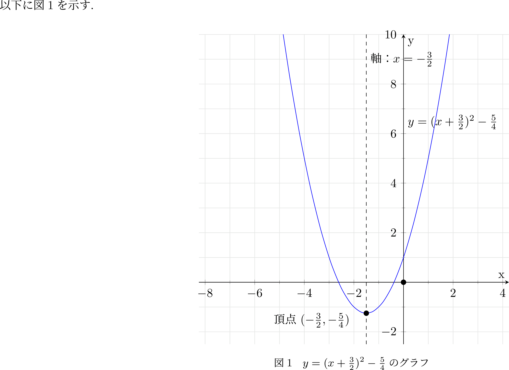

# クイズ1(よく使うTexの記法)


## Q0 基本

??? success
    ### 場合分け

    

    ```latex
    \documentclass[dvipdfmx]{jsarticle}
    \usepackage[a4paper, margin=0pt]{geometry}
    \usepackage{amssymb} %implies
    \usepackage{amsmath} %implies
    % \usepackage{tikz} % 図式
    % \usepackage{bussproofs} % 証明木

    % 場合分け
    % casesは&以降に場合分けの条件を書く
    \begin{document}
      \begin{align*}
        & P(x) = 
        \begin{cases}
          1 & (x \% 2 == 0) \\
          0 & (other) \\
        \end{cases} \\
        & 偶数ならば真, 奇数で偽となることを想定している
      \end{align*}
    \end{document}
    ```
## Q1 グラフ関連

??? success
    ### 適当なグラフ(座標平面)

    

    ```latex
    \documentclass[dvipdfmx]{jsarticle}
    \usepackage[a4paper, margin=0pt]{geometry}
    % \usepackage{amssymb} %implies
    % \usepackage{amsmath} %implies
    % \usepackage{tikz} % 図式
    % \usepackage{bussproofs} % 証明木

    \usepackage{graphicx}
    \usepackage{float}
    \usepackage{pgfplots}
    % その他のプリアンブル
    \pgfplotsset{compat=1.18}
    \begin{document}
    以下に図\ref{fig:sample}を示す. % 図番号の参照
    \begin{figure}[H]
        \centering
        \begin{tikzpicture}
            \begin{axis}
                [
                    xmin=-7, xmax=3, % x軸の範囲
                    ymin=-2.5, ymax=10, % y軸の範囲
                    xlabel={x}, % x軸のラベル
                    ylabel={y}, % y軸のラベル
                    width=300pt, % グラフの幅
                    height=300pt, % グラフの高さ
                    grid=both, % グリッドの表示
                    grid style={gray!20}, % グリッドの色
                    minor tick num = 1, % グリッドの間隔
                    xtick distance = 2, % x軸の目盛りの間隔
                    axis lines=center, %中心に座標軸を表示
                    axis equal, %軸のスケールを等しく
                ]
                % 放物線を描画
                \addplot [smooth, color=blue]{x^2 + 3*x + 1};

                % 原点にマーカー追加
                \addplot[only marks, mark=*] coordinates {(0,0)};

                % 頂点の座標にマーカーを表示し、ラベル追加
                \addplot[only marks, mark=*] coordinates {(-1.5, -1.25)};
                \node at (axis cs:-2,-2) [anchor=south east] {頂点 $(-\frac{3}{2}, -\frac{5}{4})$};
                % グラフ上に関数表示
                \node at (axis cs: 0, 6) [anchor=south west] {$y = (x + \frac{3}{2})^2 - \frac{5}{4}$};
                % 軸描画
                \draw[dashed] (axis cs:-1.5,-2.5) -- (axis cs:-1.5,10);

                % 軸ラベル
                \node at (axis cs: -1.5, 9) [anchor=west] {軸：$x = -\frac{3}{2}$};
            \end{axis}
        \end{tikzpicture}
        \caption{$y=(x+\frac{3}{2})^2 - \frac{5}{4} $のグラフ} % グラフの説明文
        \label{fig:sample}
    \end{figure}
    \end{document}
    ```

    ### 床函数(グラフ例)

    

    ```latex
    \documentclass[dvipdfmx]{jsarticle}
    \usepackage[a4paper, margin=0pt]{geometry}
    % \usepackage{amssymb} %implies
    % \usepackage{amsmath} %implies
    % \usepackage{tikz} % 図式
    % \usepackage{bussproofs} % 証明木

    \usepackage{graphicx}
    \usepackage{float}
    \usepackage{pgfplots}
    % その他のプリアンブル
    \pgfplotsset{compat=1.18}
    \begin{document}
    以下に図\ref{fig:sample}を示す. % 図番号の参照
    \begin{figure}[H]
        \centering
        \begin{tikzpicture}
            \begin{axis}
                [
                    xmin=-3, xmax=3, % x軸の範囲
                    % ymin=-2.5, ymax=10, % y軸の範囲
                    xlabel={x}, % x軸のラベル
                    ylabel={y}, % y軸のラベル
                    width=300pt, % グラフの幅
                    height=300pt, % グラフの高さ
                    % grid=both, % グリッドの表示
                    % grid style={gray!20}, % グリッドの色
                    % minor tick num = 1, % グリッドの間隔
                    xtick distance = 1, % x軸の目盛りの間隔
                    ytick distance = 1, % y軸の目盛りの間隔
                    axis lines=center, %中心に座標軸を表示
                    axis equal, %軸のスケールを等しく
                ]
                % 放物線を描画
                \addplot [domain=-2:-1, samples=10, color=blue, line width=2pt]{-2};
                \addplot [domain=-1:0, samples=10, color=blue, line width=2pt]{-1};
                \addplot [domain=0:1, samples=10, color=blue, line width=2pt]{0};
                \addplot [domain=1:2, samples=10, color=blue, line width=2pt]{1};
                \addplot [domain=2:3, samples=10, color=blue, line width=2pt]{2};

                % マーカー追加
                \addplot[only marks, mark=o, mark size=3pt] coordinates {(-1,-2)};
                \addplot[only marks, mark=o, mark size=3pt] coordinates {(0,-1)};
                \addplot[only marks, mark=o, mark size=3pt] coordinates {(1,0)};
                \addplot[only marks, mark=o, mark size=3pt] coordinates {(2,1)};
                \addplot[only marks, mark=o, mark size=3pt] coordinates {(3,2)};

                \addplot[only marks, mark=*, mark size=3pt] coordinates {(-2,-2)};
                \addplot[only marks, mark=*, mark size=3pt] coordinates {(-1,-1)};
                \addplot[only marks, mark=*, mark size=3pt] coordinates {(0,0)};
                \addplot[only marks, mark=*, mark size=3pt] coordinates {(1,1)};
                \addplot[only marks, mark=*, mark size=3pt] coordinates {(2,2)};

                \node at (axis cs:2,2.5) [anchor=north] {$ y = \lfloor x \rfloor$};
                \node at (axis cs:0,0) [anchor=south east] {$ O $};
            \end{axis}
        \end{tikzpicture}
        \caption{$y = \lfloor x \rfloor$のグラフ} % グラフの説明文
        \label{fig:sample}
    \end{figure}
    \end{document}
    ```
