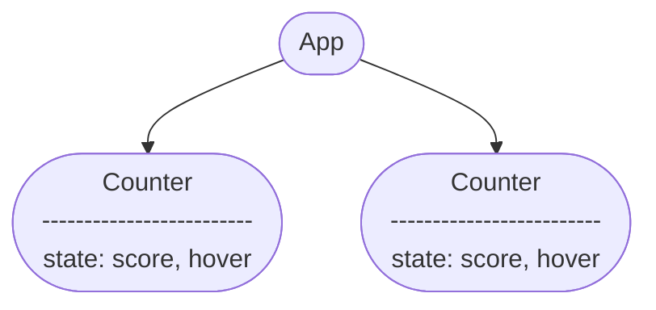

# 06-注意点(状態の保存と階層について)

## Reactとstate
- コンポーネント内でstateを用いた際、実際にはコンポーネントに関する情報は __コンポーネント内ではなくReact内__ に保存される 
- Reactはコンポーネントがレンダーツリーのどこに位置しているかによって、保存している各stateを正しいコンポーネントに関連付けている。

- Reactは、ツリー内の __同じ位置に同じコンポーネントをレンダリングする限り__ 、状態を保持する。つまり、一度コンポーネントを削除すると、再度追加した時状態は保存されていない

- 同名のコンポーネントを複数作成した際、各々のstateが混同しないのはそれぞれがツリー内の独自の位置にレンダリングされるから



## 例（レンダリングを停止/再開）

=== "App.js"

    ```js
    import { useState } from "react";
    import "./App.css"
    const App = () => {
      const [showB, setShowB] = useState(true);
      return (
        <div>
          <Counter />
          {showB && <Counter />}{/*(1)*/}
          <label>
            <input
              type="checkbox"
              checked={showB}
              onChange={({ target: { checked } }) => {
                setShowB(checked)
              }}
            />
            Render the second counter
          </label>
        </div>
      );
    }

    const Counter = () => {
      const [score, setScore] = useState(0);
      const [hover, setHover] = useState(false);

      let className = "counter";
      if (hover) className += " hover";

      return (
        <div
          className={className}
          onPointerEnter={() => setHover(true)}
          onPointerLeave={() => setHover(false)}
        >
          <h1>{score}</h1>
          <button onClick={() => setScore(score + 1)}>
            Add one
          </button>
        </div>
      );
    }

    export default App;
    ```

    1. Reactは、ツリー内の同じ位置に同じコンポーネントをレンダリングする限り、状態を保持する。チェックを外すと、showBがfalseになるため、短絡評価につきレンダリングが停止。保存されていた状態は破壊される。再度チェックを入れると、初期状態となる。(scoreは0になる)

=== "App.css"

    ```css
    .hover {
      background-color: yellow;
    }
    ```

## 例(同じ位置の同一コンポーネントの場合)

=== "基本例"

    ```js
    import {useState} from "react";

    const App = () =>{
      const [isFancy, setIsFancy] = useState(false);
      return(
        <div>
          {isFancy ? (
            <Counter isFancy={true} /> //(1)
          ):(
            <Counter isFancy={false} />
          )}
          {/*これ以降は前項と同様であるため省略*/}
        </div>
      )
    }

    export default App;
    ```

    1. isFancyがtrueまたはfalseであっても、`<Counter />`が返されることは変わらないため、stateはcheckboxの切り替えではリセットされない。つまるところ、Reactは2つの`<Counter />`を同じ位置にある同じコンポーネントであるとみなしている。

=== "これも同じ位置とみなされる"

    ```js
    import {useState} from "react";

    const App = () =>{
      const [isFancy, setIsFancy] = useState(false);
      if(isFancy){
        return( //(1)
          <div>
            <Counter isFancy={true} />
          </div>
        );
      }
      return(
        <div>
          <Counter isFancy={false} />
        </div>
      );
      //以下省略
    }

    export default App;
    ```

    1. Reactはツリーの構造がレンダリング間で一致しているか確認しているだけにすぎない。そのためJSXでどのように書いていようが、何を、どんな構造でreturnしているかが重要


## 例(同じコンポーネント${\neq}$同名のコンポーネント) 
- 同じ位置に同名のコンポーネントが配置されているからと言って、それが同一のコンポーネントであるとは限らない
- 同一のコンポーネントとは、定義が同一のコンポーネントを指す。つまり関数が異なる場合、たとえ同名であっても、Reactは同一のコンポーネントとはみなさない
- これは、コンポーネント定義を、他のコンポーネントの中で書いてしまった場合（アンチパターン）によくわかる
- コンポーネント定義を他のコンポーネント内に記述した場合、外側のコンポーネントがレンダリングされると、内側のコンポーネント定義(関数)は再生成される。ここで、JSにおいて関数は参照型のオブジェクトである。これは、たとえ中身が同じに見えても、再生成時に異なるメモリ空間に生成される以上、異なる関数とみなされる事を意味している。そのためReactは再生成された内側のコンポーネント定義から作成されたコンポーネントを、レンダリング前と異なるものであるとみなし、同じ位置に異なるコンポーネントが配置されているため、状態(state)をリセットする。

=== "悪い例"

    ```js
    import { useState } from "react";
    import "./App.css"
    const App = () => {
      return (
        <Counter />
      )
    }

    const Counter = () => {
      const [isTest, setIsTest] = useState(0);
      const Bad = () => { //(1)
        const [isValid, setIsValid] = useState(0);

        return (
          <>
            <h1>{isValid}</h1>
            <button onClick={() => setIsValid(1)}></button>
          </>
        )
      }

      return (
        <div>
          <Bad />
          <Bad />
          <h1>{isTest}</h1>
          <button onClick={() => setIsTest(isTest + 1)}></button>
        </div>
      );
    }

    export default App;
    ```

    1. BadコンポーネントをCounterコンポーネントの中に書いている。そのため、Counterコンポーネントが再レンダリングされた際、stateがリセットされる。(Badは同名で同位置にあるコンポーネントであるにもかかわらず)定義を外に出すと、この不具合はなくなる。