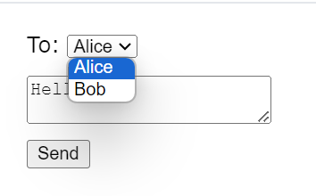

# 10-stateが更新されるタイミング

## ユーザイベントの反映タイミング

- リアルDOMを使った場合、UIはクリックなどのユーザイベント(addEventListener)に対して直接更新される
- Reactの動作はこれと異なる
- Reactがイベントに応答し、それを反映させるためには、stateを更新し、レンダーする必要がある

### 例
=== "ボタンをクリックした場合の動作"

    ```js
    import {useState} from "react";
    //手順 (1)
    const sendMessage = (message) =>{
      //省略
    }

    const Form = () =>{
      const [isSent, setIsSent] = useState(false);
      const [message, setMessage] = useState("Hi!");
      if(isSent){
        return <h1>Your message is on its way!</h1>
      }
      return(
        <form onSubmit={(e)=>{
          e.preventDefault();
          setIsSent(true);
          sendMessage(message);
        }}>
          <textarea
            placeholder="Message"
            value={message}
            onChange={e => setMessage(e.target.value)}
          />
          <button type="submit">Send</button>
        </form>
      )
    }
    ```

    1. !!!example
        1. Sendボタンをクリックする
        2. onSubmitイベントハンドラが実行される
        3. setIsSent(true)がisSentの値を使って再レンダーを予約する
        4. Reactが新しいisSentの値を使ってFormコンポーネントを再レンダーする
        5. コンポーネントからJSXが返される
        6. Reactは返されたJSXに従って差分を更新する
        7. Reactはコンポーネントに更新されたstate(isSent)を渡す
        __※JSX内のprops,イベントハンドラ、ローカル変数はすべてレンダー時(コンポーネントが呼び出された際)のstateを元に計算される__


## よくある誤解
=== "実際にはクリックしても1ずつしか増えない"

    ```javascript
    import { useState } from 'react';

    export default function Counter() {
      const [number, setNumber] = useState(0);

      return (
        <>
          <h1>{number}</h1>
          <button onClick={() => {
            setNumber(number + 1);
            setNumber(number + 1);
            setNumber(number + 1);
          }}>+3?</button>
        </>
      )
    }
    ```

=== "原因"
    - `setState`で`state`をセットしても、それが本当に更新されるのは次回のレンダーだから

    ```javascript
    //今回のレンダーで、useStateからnumberに0という値が返されたとする
    <button onClick={() => {
      setNumber(number + 1); //(1)
      setNumber(number + 1); //(2)
      setNumber(number + 1); //(3)
      alert(number) //(4)
      setTimeout(()=>{
        alert(number);
      }, 3000); //(5)
      //(6)
    }}>+3</button>
    ```

    1. レンダー時に、numberは0なので、Reactは次回のレンダーでnumberを1に更新する準備をする
    2. レンダー時に、numberはやっぱり0なので、Reactは次回のレンダーでnumberを1に更新する準備をする
    3. レンダー時に、numberは0なので、Reactは次回のレンダーでnumberを1に更新する準備をする。
    4. numberはまだ更新されていないので0と出力される
    5. 実行タイミングにかかわらず、JSX内のprops,　__イベントハンドラ__ 、ローカル変数はすべて __レンダー時(呼び出された際)のstate__ を元に計算されるため、numberは0。つまるところ、 __ユーザがボタンを押した瞬間のstateの値__ がalertとして表示される
    6. つまり、上の例はstateを3回連続で1にセットしただけ。結果としてReactは次回のレンダー時にnumberを1に更新する

### stateはスナップショット
- イベントハンドラのコードが非同期であっても、時間経過が長くとも、レンダー内のstate変数の値は決して変わらない

## この仕様が役立つ例

### 概要

=== "コード"

    ```js
    import { useState } from 'react';

    export default function Form() {
      const [to, setTo] = useState('Alice');
      const [message, setMessage] = useState('Hello');

      function handleSubmit(e) {
        e.preventDefault();
        setTimeout(() => { //非同期コード
          alert(`You said ${message} to ${to}`);
        }, 5000);
      }

      return (
        <form onSubmit={handleSubmit}>
          <label>
            To:{' '}
            <select
              value={to}
              onChange={e => setTo(e.target.value)}>
              <option value="Alice">Alice</option>
              <option value="Bob">Bob</option>
            </select>
          </label>
          <textarea
            placeholder="Message"
            value={message}
            onChange={e => setMessage(e.target.value)}
          />
          <button type="submit">Send</button>
        </form>
      );
    }

    ```
=== "画像"
    

    1. `Send`ボタンを押して`Hello`メッセージを`Alice`に送る
    2. 5秒の遅延が終わる前に`To`フィールドの値を`Bob`に変更する
    3. `Send`ボタンを押したときの`to`は、`Alice`なのでメッセージは`Alice`に送られる

### 何がいいのか
- 遅延を伴う処理において、Userが遅延終了までに何かしらの処理をしたとしても、影響が起きなくなる

## 1回のイベントでstateを複数回更新したい場合
- state更新用関数を使う(11に記載)