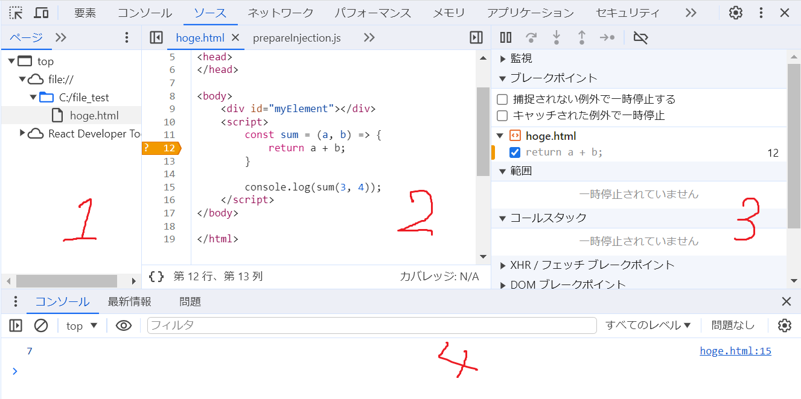

# クイズ(初級6:コード品質)

## Q99. 開発者ツールにおけるSources(ソース)パネルの中身について知っていますか?

??? success

    ### (トグルボタン)
    - ファイルを表示/隠す

    ### 画像
    

    ### ファイルナビゲータ(1)
    - 画面左
    - ファイルが階層的に表示されているエリア
    - HTMLやJSやCSSや、ページに紐づくイメージ等を含むファイルが表示
    - Chromeの拡張機能もここに表示される

    ### コードエディタ(2)
    - 画面中央
    - ソースコードが表示される

    ### JSデバッギング(3)
    - 画面右
    - デバッグのためのエリア

    ### コンソール(4)
    - ESCを押すと下部に表示される
    - コマンドを入力し、Enterで実行する

    ###　ブレイクポイント
    - コードエディタの行番号を選択すると、設置可能
    - ブレイクポイントを付加した後に、コードを実行すると、デバッガはブレイクポイントでJSの実行を停止する
    - 右クリック => 削除で消すことも可能

## Q100. ブレイクポイントで実行停止中にできることについて知っていますか?

??? success
    ### Watch(監視)
    - 任意の式の現在の値を表示する
    - たとえば`b`と入力すると、`b`の現在の値が表示される

    ### Call Stack(コールスタック)
    - 呼び出しのチェーンを表示する
    - たとえば現在`hello()`の中にいて、`hello()`が`hoge()`から呼び出されているなら、それも表示する
    - コールスタックなので、後から呼び出された関数が上に表示される

    ### Scope(現在の変数)
    - `local`: ローカル変数を表示
    - `Global`: グローバル変数を表示

    ### Breakpoints(ブレークポイント)
    - 設置したブレークポイントの一覧が表示される

    ### Ctrl + F8
    - ブレイクポイントを一時的に無効化する

## Q101. 条件付きブレークポイントの存在について知っていますか?

??? success
    ### 概要
    - ブレークポイントを設置する際、右クリックから、条件付きブレークポイントの追加を選ぶ
    - 条件付きブレークポインタは与えられた式が真の場合のみ、実行を停止する

## Q102. ステップ等の方法について知っていますか?

??? success
    ### 再開(F8)
    - 実行を再開する。
    - 他にブレイクポイントがなければ最後まで実行し、デバッグは終了する

    ### ステップ(F9)
    - 次の文を実行する

    ### ステップオーバー(F10)
    - 次の文を実行するが、関数の中には入らない

    ### ステップイン(F11)
    - 基本的にはステップと同じ
    - ステップと違い、非同期関数の中にも入る

    ### ステップアウト(Shift + F11)
    - 現在の関数の最後の行まで実行

    ### ブレイクポイントのon/off切り替え
    - 実行の状態は変わらない

    ### 補足されない例外で一時停止する
    - 有効にしている場合、catchしていないエラーが起きると実行が停止する(キャッチされた例外で一時停止する項目もある)
    - 停止した際の変数を分析できるので、どこが原因か確認しやすい

    ### Continue to here(ここに移動)
    - コードの行で右クリックすると表示される
    - この行まで処理を進める
  

## Q103. コードに`debugger`を書くことで、ブレークポイントと同等の効果が得られることを知っていますか?

??? success
    ### 例

    ```js
    const sum = (a, b) =>{
      debugger; //ここで実行が一時停止される
      return a + b;
    }

    console.log(sum(12, 18));
    ```

## Q104. console.warn()やconsole.error()について知っていますか?

??? success
    ### console.warn()
    - 開発者ツールに警告を出力可能

    ### console.error()
    - 開発者ツールにエラーを出力可能

    ### 使用例

    ```js
    const password = "hoge"
    if(password.length < 8){
      console.warn("パスワードの長さが短すぎます");
    }
    ```
## Q105. コーディングスタイルの重要性について理解していますか?

??? success
    ### 概要
    - コーディングスタイルはコードの書き方を規定する。
    - 書き方を規定することで、コードが統一され見やすくなる
    - なお、ベストプラクティスより、むしろ組織の規約に従わなければならない場面は多い

    ### 例
    - 中身が1行の`if`文であっても、`{}`を付けるべき

    ```js
    if(n < 0){
      console.log("hoge");
    }
    ```

    - 1行の長さは80文字までとする
    - インデントは`2 or 4 `で統一する
    - セミコロンを末尾に書く
    - ネストしすぎない
    - 関数宣言を用いる場合、先に関数を使用するコードを書く

## Q106. スタイルガイドについて知っていますか?

??? success

    ### 概要
    - 多くの場合、自分たちでスタイルガイドを定める必要はない
    - 著名企業やOSSのスタイルガイドのうち1つを採用するのがベスト

    ### Google Javascript Style Guide
    - Google製のスタイルガイド

    ### Airbnb Javascript Style Guide
    - Github上で最も人気のあるスタイルガイド
    - 配列の末尾にカンマがいる
    - たとえば、Array.fromとスプレッド構文の使い分けなどについても書かれている
    - [参照元](https://mitsuruog.github.io/javascript-style-guide/)

    ### Javascript Starndard Style
    - 行末セミコロンが禁止であることが特徴

## Q10.7 バッククォートを用いると、文字列を複数行で書けることを知っていますか?

??? success

    ```js
    let longStr = `Lorem ipsum dolor, sit amet consectetur adipisicing elit. 
    Quis libero quos, explicabo architecto ipsum corporis 
    cupiditate aperiam accusamus voluptatibus 
    ut distinctio debitis autem doloremque 
    rerum assumenda dolore? Cupiditate, enim ducimus.
    `;
    ```

## Q108. Linterについて知っていますか?

??? success

    ### Linter
    - コードのスタイルを自動でチェックして改善を提案してくれるツール

    ### 使いどころ
    - typo, バグ等を見つけてくれる
    - エディタによっては、バグが見つかったときにハイライトもしてくれる

    ### Linterの種類
    - JSLint
    - JSHint
    - ESLint

    ### (たとえば)ESLintの使い方の例
    1. Node.jsをインストールする(インストールの仕方はこちらを参照)
    2. `npm install -g eslint`でeslintをグローバルにインストール
    3. プロジェクトのルートに`.eslintrc`という名前の設定ファイルを作成
    4. 使用しているエディタ(IDE)に、ESLintのプラグインをインストール/有効化する
    5. `.eslintrc`を記述する

    ### 記述例
    - ESLintの記法詳細については後記

    ```json
    { 
      //ESLintの推奨設定を有効化
      "extends" : "eslint:recommended",
      //予め用意されているグローバル変数を一挙に設定する
      //これを書かないと、たとえばalert()を用いたときに、未定義変数を使っているとESLintが解釈する。
      "env" : {
        "browser": true,
        "node" : true,
        "es6" : true
      },
      "rules" : {
        "no-undef" : 2, //宣言されていない変数を利用しようとしたときにエラー
        "no-console" : 0,
        "indent" : 2,
      }
    }
    ```

## Q109. 良いコメントの書き方について知っていますか?

??? success
    ### 悪いコメント
    - コード内で起こっていることを説明する

    ```js
    //引数nが素数であるかチェックする。
    //素数でなければfalseを返し、素数であればtrueを返す
    const isPrime = (n) => {
      for(let i = 2; i < Math.sqrt(n); i++){
        if(n % i == 0) return false;
      }
      return true;
    }

    isPrime(23);
    ```

    ### 良いコメント
    1. コード全体の目的を説明する
    2. 複雑なアルゴリズムがある場合はその考え方を記述する
    3. なぜそのアプローチを採用したのかを述べる
    4. 修正が必要な場合は、TODOやFIXMEを残す
    5. 他の文書と関係性がある場合は、関連する外部リソースへのリンクを残す
    6. 変更履歴や更新日を残す
    7. 関数の名前だけでは理解が難しい場合は目的を補足する
    8. コードが特定の条件下のみで動作する場合は、前提条件や制約を記載する
    9. 最適化が為されていない場合は、冗長的になっている理由と改善案を記載する
    10. 一時的な解決策として書かれている場合は、改善の提案や注意事項を記載する

    ### 良いコメントの例
    - `TODO`

## Q110. JSDocについて理解していますか?

??? success
    ### 概要
    - コメントを書くことで、コードの中を見ることなく関数の目的を理解できるもの

    ### 使い方
    1. VSCodeの場合`/**`と入力してEnterを押すと、入力補完が働き、雛形が自動生成される
    2. 引数や返り値、コードの説明を追記する
    3. 関数名にカーソルを合わせると、使用法を見ることが可能

    ### 例
    ??? warning
        - これはあくまでも例
        - 本来は簡潔な関数に対しては、JSDocを用いない方がいい
        - また関数名、引数名もサンプルコードなので適当である

    

    ### JSDOCのアノテーションについて
    - `TODO`
    - [参考](https://ja.wikipedia.org/wiki/JSDoc)

## Q111. JSDoc3を用いて、JSのコメントからHTMLドキュメントを自動生成できることを知っていますか?

??? success
    - 詳細については後記
    - [JSDOC3チュートリアル](https://jsdoc.app/about-getting-started)

## Q112. 以下の悪いコードを使っていませんか?

??? tips
    ### 悪いコード1
    - とにかく短い

    ```js
    i = i ? i < 0 ? Math.max(0, len + i) : i : 0;
    ```

    ### 悪いコード2

    - 1文字の変数を用いる
    - ループカウンタの変数として`ijk`以外の1文字の変数を用いる

    ```js
    for(let x = 1; x < 3; x++){
      let y = x*10;
      let z = y%3;
      let a = Math.sqrt(z) ** z;
    }
    ```

    ### 悪いコード3

    - 略語を使用する

    ```js
    const ua = "userAgent";
    const brsr = "browser";
    const sm = "showMessage";
    ```

    ### 悪いコード4

    - 抽象的な名前を用いる

    ```js
    const data = hoge();
    const value = fuga();
    const item = hogehoge();
    const elem = foo();
    const obj = bar();
    ```

    ### 悪いコード5

    - 変数をその型で命名する

    ```js
    const num = Number("12");
    const str = String(13);
    const bool = Boolean("1");
    ```

    ### 悪いコード6

    - 面倒なので数値を後ろに付け加える

    ```js
    const data1 = hoge();
    const data2 = fuga();
    const data3 = hogehoge();
    ```

    ### 悪いコード7

    - 意味もなく似た変数名を使う

    ```js
    const date = hoge();
    const data = fuga();
    ```

    ### 悪いコード8

    - 同じような挙動を持つのに、接頭辞を変える

    ```js
    const displayMessage = hoge();
    const showName() = fuga();
    const paintAddress() = foo();
    const expressEmail() = bar();
    const indicationNumber() = hogehoge();
    const renderTax() = foobar();
    const viewWarning() = foofoo();
    ```

    ### 悪いコード9

    - 全く違う意味を持つのに接頭辞を同じにする

    ```js
    printText(text); //画面上にテキストを表示
    printPage(text); //ページをpdf化する
    printMessage(message); //??????
    ```

    ### 悪いコード10

    - 面倒なので変数を再利用する

    ```js
    let elem = showMessage();
    elem = printText();
    elem = getAge();
    elem = setAddress();
    ```

    ### 悪いコード11

    - 特に意味もなくアンダースコアを書く

    ```js
    let name = "Yamada";
    let _name = "Sasaki";
    let __name = "Ikeda";
    ``` 

    ### 悪いコード12

    - 重要そうなので、強調しておく

    ```js
    let superFragment = hoge();
    let megaData = fuga();
    let NiceItem = foo();
    ```

    ### 悪いコード13

    - 関数の内側と外側で同じ変数を使う

    ```js
    let user = getUser();

    function func(){
      let user = anotherUser();
      //...
    }
    ```

    ### 悪いコード14
    - 関数名で`is, check, find`を用いているのに裏で様々な値を変化させる

    ```js
    isReady(); //実はtrue/ false以外の値が返る
    checkAuthentication(); //裏で認証の状態を変えるコードが走る
    findMaxFruits(); //裏で、一番数の少ない果物を捨てる処理が走る
    ```

    ### 悪いコード15
    - 広範囲をサポートする関数を作って、再利用できなくする

    ```js
    jsonManager();
    pageManager();
    allValidateEmail();
    ```

## Q113. 自動テストの利点を知っていますか?

??? success
    ### 手動テストとの差異
    - コード変更の度に、すべてのユースケースを手作業で試すのは心に来る
    - ケースに抜けがない場合、コードを変えても、ユーザに被害が出にくい
    - 不要なダブルチェックが必要にならない

## Q114. BDD(ビヘイドア駆動開発)について知っていますか?

??? success
    ### BDDにおける実際の開発ケース

    ### 1. xのn乗をするpow(x,n)を開発することを考える

    ### 2. コード作成前に関数がすべきこと(spec)を記載する

    - `describe("title", function(){...})`
    `title`でどのような機能について記述しているか。
    `functon`は、`it`のブロックをグループ化するために存在する

    - `it("title", function(){...})`
    `title`で特定のユースケースを記述する
    `function`の中に、テストを記載する
    
    - `assert.equal(expect, really)`
    `assert.*`で関数が期待通り動作しているかをチェックする
    今回の場合、`equal`なので、等しいか比較している。

    ```js
    describe("pow", function(){
      it("raises to n-th power", function(){
        assert.equal(pow(2,3), 8);
      });
    });
    ```

    - このような記述を`specification(仕様)`、または`spect`と呼ぶ
    
    ### 3. 最初の実装を作成する
    ### 4. 動作確認のため、テストフレームワークの`Mocha`を用いて、specを実行。エラーがなくなり、すべてが動作するまで繰り返す
    ### 5. まだサポートされていないユースケースやコーナーケースをspecに追加する
    ### 6. 4に戻り、テストのエラーがなくなるまで実装を更新する
    ### 7. 以下、4~6の繰り返し

## Q115. Mochaを用いたテストを行ったことがありますか?

??? success

    ### HTML解説
    1. `<head>`の中に`mocha`と`chai`のライブラリを記載
    2. テスト対象の`<script>`を記載
    3. テストを行う外部スクリプトを記載(今回は`test.js`)
    4. `Mocha`が結果を出力するためのHTML要素`<div id="mocha">`を記載
    5. `mocha.run()`でテストを開始する

    ### テストコード解説
    - `/* eslint-env mocha */`: `describe`はeslintなどのデバッグ用ツールから見ると未定義に見えるので、未定義エラーが起こらないように記載
    - `describe`等の意味については、BDDの項で触れた通り

    ### コード例

    === "HTML"

        ```html
        <!DOCTYPE html>
        <html>

        <head>
          <!--mochaのCSS. 結果表示に必要-->
          <link rel="stylesheet" href="https://unpkg.com/mocha/mocha.css" />

          <!--mochaのjs-->
          <script src="https://cdnjs.cloudflare.com/ajax/libs/mocha/3.2.0/mocha.js"></script>

          <!--chaiのjs-->
          <script src="https://cdnjs.cloudflare.com/ajax/libs/chai/3.5.0/chai.js"></script>

          <script>
            //mochaのsetup
            mocha.setup('bdd');
          </script>
          <script>
            //chaiの機能の中からassertを使う
            let assert = chai.assert;
          </script>
        </head>

        <body>

          <script>
            //テスト対象のコード
            function pow(x, n) {
              let result = 1;

              for (let i = 0; i < n; i++) {
                result *= x;
              }

              return result;
            }
          </script>

          <!--testコード-->
          <script src="test.js"></script>
          <!--結果表示部分-->
          <div id="mocha"></div>

          <script>
            //test実行
            mocha.run();
          </script>
        </body>

        </html>
        ```

    === "JS"

        ```js
        /* eslint-env mocha */
        describe("pow", function () {
          it("2 raises to power 4 is 16", function () {
            assert.equal(pow(2, 4), 16)
          });
        });
        ```

## Q116. Mochaで複数のテストケースを試したことがありますか?

??? success
    ### 概要
    - `it`の項目を増やすだけ
    - 1つのテストでは1つのことを確認する

    ### コード例

    ```js
    /* eslint-env mocha */
    describe("pow", function () {
      it("2 raises to power 4 is 16", function () {
        assert.equal(pow(2, 4), 16)
      });

      it("3 raised to power 4 is 81", function () {
        assert.equal(pow(3, 4), 81)
      })
    });
    ```

    ### 1つの`it`内に複数の`assert`を書いてはいけないのか
    - `assert`がエラーを吐くと、`it`ブロックはすぐに終了する
    - そのため1つのブロック内に複数の`assert`を書くと1回のテストで、1つのテストケースしか実行されない可能性がある
    - 得られる情報は多い方がいい

## Q117. forループと関数を用いて多くのテストケースを自動生成できることを知っていますか?

??? success

    ### コード例

    ```js
    /* eslint-env mocha */
    describe("pow", function () {

      function makeTest(x) {
        let expected = x * x * x;
        it(`${x} in ther power 3 is ${expected}`, function () {
          assert.equal(pow(x, 3), expected);
        })
      }

      for (let x = 1; x <= 5; x++) {
        makeTest(x);
      }

    });
    ```

## Q118. Mochaにおけるテストでサブグループを作れることを知っていますか?

??? success

    ### 概要
    - `describe`を入れ子で書く

    ### 概要

    ```js
    /* eslint-env mocha */
    describe("pow", function () {
      it("2 raises to power 4 is 16", function () {
        assert.equal(pow(2, 4), 16)
      });

      it("3 raised to power 4 is 81", function () {
        assert.equal(pow(3, 4), 81)
      })

      describe("raises x to power 3", function () {
        function makeTest(x) {
          let expected = x * x * x;
          it(`${x} in ther power 3 is ${expected}`, function () {
            assert.equal(pow(x, 3), expected);
          })
        }

        for (let x = 1; x <= 5; x++) {
          makeTest(x);
        }
      });

    });
    ```

## Q119. before/after等で、テスト前に、初期化が行えることを知っていますか?

??? success
    ### before
    - 全てのテスト前に実行するコードを書く
    - 下のコード例の場合、1回行われる

    ### after
    - 全てのテスト後に実行するコードを書く

    ### beforeEach
    - 1つ1つのテスト前に実行するコードを書く
    - 初期化
    - 下のコード例の場合、7回行われる

    ### afterEach
    - 1つ1つのテスト後に実行するコードを書く
    - クリーンアップ処理

    ### コード例

    ```js
    /* eslint-env mocha */
    describe("pow", function () {
      //テスト前コード
      before(() => alert("Testing started."));
      after(() => alert("Testing finished."));

      beforeEach(() => console.log("Enter a test."));
      afterEach(() => console.log("Exit a test"));
      //ここまで

      it("2 raises to power 4 is 16", function () {
        assert.equal(pow(2, 4), 16)
      });

      it("3 raised to power 4 is 81", function () {
        assert.equal(pow(3, 4), 81)
      })

      describe("raises x to power 3", function () {
        function makeTest(x) {
          let expected = x * x * x;
          it(`${x} in ther power 3 is ${expected}`, function () {
            assert.equal(pow(x, 3), expected);
          })
        }

        for (let x = 1; x <= 5; x++) {
          makeTest(x);
        }
      });

    });
    ```

## Q120. Chaiがequal以外に多くのアサーションを持っていることを知っていますか?

??? success
    ### 参照元
    - [Chai-assertion-library](https://www.chaijs.com/api/assert/)

    ### 例
    - `isNaN`: 対象がNaNであるかチェック
    - `isTrue`:結果が真であるかチェック
    - 他にも対象が関数であるか確かめたり、配列内に値が含まれているかチェックするものもある

    === "テスト対象"

        ```html
        <script>
          function pow(x, n) {
            if (n < 0) return NaN;
            if (Math.round(n) != n) return NaN;

            let result = 1;

            for (let i = 0; i < n; i++) {
              result *= x;
            }

            return result;
          }
        </script>
        ```

    === "テストコード"

        ```js
        /* eslint-env mocha */
        describe("pow", function () {

          it("for negative n the result is NaN", function () {
            assert.isNaN(pow(2, -4));
          })

          it("for float n the result is NaN", function () {
            assert.isNaN(pow(2, 1.3));
          })

          it("3 raised to power 4 is 81.", () => {
            assert.isTrue(pow(3, 4) === 81);
          })
        });
        ```

## Q121. トランスパイラについて知っていますか?

??? success
    ### 概要
    - JSエンジン(たとえばV8等)のチームは、実装の優先度について独自の考えを持っている
    - そのためStage3の機能が試験的に実装されることもあれば、既に使用となったものが実装されないこともある
    - エンジンに標準仕様が実装されておらず、それを使いたくなった場合、トランスパイラを用いる
    - 開発者は自身のコンピュータでトランスパイラを実行し、トランスパイル済みのコードをサーバにデプロイする

    ### トランスパイラ
    - ソースコードを別のソースコードに変換するソフトウェア
    - 具体的には細心のコードを解析し、古い構文を使って置き換える

    ### トランスパイラが内部的に行っていること
    - ES11のコード

    ```js
    height = height ?? 100;
    ```
    
    - ES9に置き換え

    ```js
    height = (height !== undefined && height !== null) ? height : 100;
    ```

    ### トランスパイラの例
    - `Babel`: JSX等も変換できる。Polyfillも提供している

## Q122. Polyfillについて知っていますか?

??? success
    ### 概要
    - `Polyfill`は、不足している関数や機能を定義する

    ### Polyfillの例
    - Math.truncが実装されていないケースを考える

    ```js
    //Math.trunc: 絶対値として切り捨て
    //Math.ceil:切り上げ
    //Math.floor:切り捨て

    if(!Math.trunc){
      //組み込み関数を実装する
      Math.trunc　= function(number){
        return number < 0 ? Math.ceil(number) : Math.floor(number);
      }
    }
    ```

    ### トランスパイラとの違い
    - トランスパイラは、構文を変更して書き換える
    - Pollyfillは単に不足している関数を定義する


